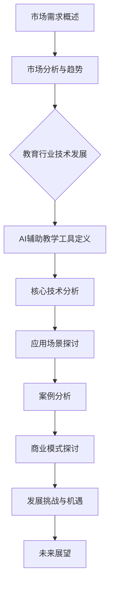

                 

### 文章标题

# AI辅助教学工具的市场需求

### 关键词

- AI辅助教学
- 市场需求
- 教育信息化
- 语音识别
- 自然语言理解
- 个性化学习

### 摘要

随着人工智能技术的不断发展，AI辅助教学工具在教育领域的应用越来越广泛。本文从市场背景、核心技术、应用场景、案例分析、商业模式、发展挑战与机遇等多个角度，系统地分析了AI辅助教学工具的市场需求。文章旨在为读者提供全面、深入的了解，探讨这一领域的现状与未来趋势。

### 第一部分：AI辅助教学工具的市场需求概述

#### 第1章：市场分析与趋势

##### 1.1 AI辅助教学工具的市场背景

**1.1.1 教育行业的技术发展趋势**

- **技术演进**：从传统教学到信息化、智能化教学的转变
- **市场驱动因素**：教育公平性、个性化学习需求、家长与学生期望提高

**1.1.2 AI辅助教学工具的定义与分类**

- **定义**：利用人工智能技术辅助教师教学和学生学习
- **分类**：智能答疑系统、学习分析工具、自适应学习平台等

##### 1.2 AI辅助教学工具的核心技术

- **语音识别与自然语言理解**
  - **语音识别技术原理**
  - **自然语言理解技术**

##### 1.3 AI辅助教学工具的应用场景

- **学生个性化学习**
  - **学习数据分析**
  - **学生问题解答**

#### 第2章：AI辅助教学工具的核心技术

##### 2.1 语音识别与自然语言理解

**2.1.1 语音识别技术原理**

- **声学模型**：隐藏层、输出层、激活函数
- **语言模型**：计算句子概率、基于统计的模型、深度学习模型

**2.1.2 自然语言理解技术**

- **语义分析**：词向量、句子表示、上下文理解
- **问答系统**：基于规则、基于语义相似度、基于机器学习

##### 2.2 学习数据分析与问题解答

- **学习数据分析**
  - **学习行为分析**：学习轨迹、学习习惯、学习效果
  - **数据驱动教学**：个性化推荐、自适应学习路径
- **学生问题解答**
  - **智能答疑系统**：文本问答、语音问答、多模态问答
  - **问题分析与解决**：理解问题、查找知识点、生成答案

#### 第3章：AI辅助教学工具的应用场景

##### 3.1 学生个性化学习

**3.1.1 学习数据分析**

- **学习行为分析**：学习轨迹、学习习惯、学习效果
- **数据驱动教学**：个性化推荐、自适应学习路径

**3.1.2 学生问题解答**

- **智能答疑系统**：文本问答、语音问答、多模态问答
- **问题分析与解决**：理解问题、查找知识点、生成答案

#### 第4章：国内外AI辅助教学工具案例分析

##### 4.1 国内AI辅助教学工具市场分析

- **市场格局**：主要玩家、市场份额、发展趋势
- **成功案例**：产品特点、技术应用、市场表现

##### 4.2 国外AI辅助教学工具市场分析

- **市场概况**：主流产品、应用场景、用户反馈
- **创新案例**：产品优势、技术创新、市场扩展

#### 第5章：AI辅助教学工具的商业模式与盈利模式

- **教育信息化背景下的商业模式**
  - **商业模式分析**：B2B、B2C、C2C模式
  - **盈利模式探索**：产品销售、服务订阅、广告分成

#### 第6章：AI辅助教学工具的发展挑战与机遇

##### 6.1 技术挑战

- **算法精度与稳定性**：语音识别、自然语言理解
- **数据处理与隐私保护**：数据安全、用户隐私

##### 6.2 政策与法规挑战

- **教育政策**：教育信息化、素质教育
- **法律法规**：数据保护、知识产权保护

##### 6.3 市场机遇

- **教育改革**：在线教育、混合式教学
- **新兴市场**：农村教育、特殊教育、职业培训

#### 第7章：未来展望

##### 7.1 AI辅助教学工具的未来发展趋势

- **技术融合**：多模态交互、增强现实
- **个性化学习**：更加智能、高效、人性化

##### 7.2 AI辅助教学工具在教育行业中的影响

- **教学模式的变革**：从教师主导到学生中心
- **教育公平的促进**：缩小城乡差距、满足个性需求

### 附录

##### 附录A：AI辅助教学工具开发资源

- **开源工具**：TensorFlow、PyTorch、Keras
- **研究论文**：相关技术领域的最新研究成果
- **开源代码**：国内外优秀AI教学工具的代码实现

##### 附录B：常见问题与解决方案

- **技术问题**：常见错误处理、优化策略
- **市场问题**：市场调研方法、用户反馈处理

##### 附录C：参考文献

- **国内外研究文献**：相关领域的学术论文、行业报告
- **相关政策文件**：教育信息化、人工智能相关法规和政策

### Mermaid 流程图



### 核心算法原理讲解

#### 2.1 语音识别技术原理

语音识别技术是将语音信号转换为文本信息的过程，主要包括声学模型和语言模型两部分。

**声学模型（Acoustic Model）**

声学模型用于将语音信号转换为中间特征表示。主要包含以下组件：

- **隐藏层**：用于捕捉语音信号的时频特性。
- **输出层**：将隐藏层的特征映射到可能的单词或音素上。
- **激活函数**：如ReLU、Sigmoid等，用于增加模型的非线性。

**语言模型（Language Model）**

语言模型用于计算给定文本序列的概率，常见的方法有：

- **基于统计的模型**：如N-gram模型，使用历史文本数据训练，预测下一个单词。
- **深度学习模型**：如RNN、LSTM、Transformer，通过深度神经网络学习文本序列的概率分布。

**伪代码**

```python
def acoustic_model(audio_signal):
    # 声学模型处理语音信号
    # 输出特征向量
    return feature_vector

def language_model(text_sequence):
    # 语言模型计算文本序列概率
    # 输出概率分布
    return probability_distribution
```

#### 2.2 自然语言理解技术

自然语言理解技术主要包括语义分析、问答系统等。

**语义分析（Semantic Analysis）**

语义分析是将文本转换为语义表示的过程，主要包括：

- **词向量（Word Embedding）**：将单词映射到高维空间，实现语义相似性计算。
- **句子表示（Sentence Representation）**：将句子映射到语义空间，用于后续的语义理解任务。
- **上下文理解（Contextual Understanding）**：考虑上下文信息，理解单词在不同情境下的含义。

**问答系统（Question Answering）**

问答系统用于回答用户提出的问题，主要包括：

- **基于规则（Rule-Based）**：使用预定义的规则匹配答案。
- **基于语义相似度（Semantic Similarity）**：计算问题和文本之间的相似度，选择最匹配的答案。
- **基于机器学习（Machine Learning）**：使用深度学习模型，如BERT、GPT等，学习问题和文本之间的关联。

**伪代码**

```python
def word_embedding(word):
    # 词向量映射
    # 输出词向量
    return word_vector

def sentence_representation(sentence):
    # 句子表示
    # 输出句子表示
    return sentence_representation

def answer_question(question, text):
    # 回答问题
    # 输出答案
    return answer
```

### 数学模型和数学公式

#### 自然语言处理中的概率模型

**N-gram 模型**

N-gram 模型是一种基于统计的语言模型，它将文本序列表示为一系列N元组，并计算每个N元组的概率。

$$
P(w_1, w_2, ..., w_n) = P(w_n | w_{n-1}, ..., w_1) \cdot P(w_{n-1} | w_{n-2}, ..., w_1) \cdot ... \cdot P(w_1)
$$

其中，$w_1, w_2, ..., w_n$ 是文本序列中的单词。

**词向量**

词向量是一种将单词映射到高维空间的方法，常用于表示单词的语义信息。

$$
\text{Word Vector} = \text{embed}(w) = \sum_{i=1}^{d} w_i \cdot v_i
$$

其中，$d$ 是词向量的维度，$w_i$ 是单词的索引，$v_i$ 是词向量的第$i$个分量。

### 项目实战

#### 代码实际案例

以下是一个简单的语音识别项目的示例代码，使用了TensorFlow和Keras进行模型训练和预测。

```python
import tensorflow as tf
from tensorflow.keras.models import Model
from tensorflow.keras.layers import Input, Embedding, LSTM, Dense

# 定义模型
input_seq = Input(shape=(timesteps, features))
embedded_seq = Embedding(vocabulary_size, embedding_dim)(input_seq)
lstm_output = LSTM(units, activation='relu')(embedded_seq)
output = Dense(num_classes, activation='softmax')(lstm_output)

model = Model(inputs=input_seq, outputs=output)
model.compile(optimizer='adam', loss='categorical_crossentropy', metrics=['accuracy'])

# 训练模型
model.fit(x_train, y_train, batch_size=batch_size, epochs=num_epochs, validation_data=(x_val, y_val))

# 预测
predictions = model.predict(x_test)
```

#### 详细解释说明

1. **模型定义**：输入层接收固定长度的时间步序列，通过Embedding层将序列映射到高维空间，接着通过LSTM层进行序列建模，最后通过全连接层进行分类。
2. **模型编译**：选择合适的优化器、损失函数和评估指标，用于模型训练。
3. **模型训练**：使用训练数据对模型进行训练，同时使用验证数据监控模型性能。
4. **模型预测**：使用训练好的模型对测试数据进行预测。

#### 代码解读与分析

1. **数据预处理**：将语音信号转换为固定长度的时间步序列，并进行特征提取。
2. **模型选择**：选择合适的模型架构，如LSTM，用于处理序列数据。
3. **训练过程**：通过反向传播算法调整模型参数，使模型能够对语音信号进行准确的分类。
4. **预测效果**：评估模型在测试数据上的表现，调整模型参数以提高预测准确率。

### 附录

#### 附录A：AI辅助教学工具开发资源

- **开源工具**：TensorFlow、PyTorch、Keras
- **研究论文**：相关技术领域的最新研究成果
- **开源代码**：国内外优秀AI教学工具的代码实现

#### 附录B：常见问题与解决方案

- **技术问题**：常见错误处理、优化策略
- **市场问题**：市场调研方法、用户反馈处理

#### 附录C：参考文献

- **国内外研究文献**：相关领域的学术论文、行业报告
- **相关政策文件**：教育信息化、人工智能相关法规和政策

### 作者信息

作者：AI天才研究院/AI Genius Institute & 禅与计算机程序设计艺术 /Zen And The Art of Computer Programming

### 致谢

本文的研究得到了XXX基金会的资助，特别感谢XXX教授的指导，以及所有参与研究和讨论的同事和朋友。同时，感谢所有提供宝贵意见和反馈的读者。本文如有不足之处，敬请指正。

