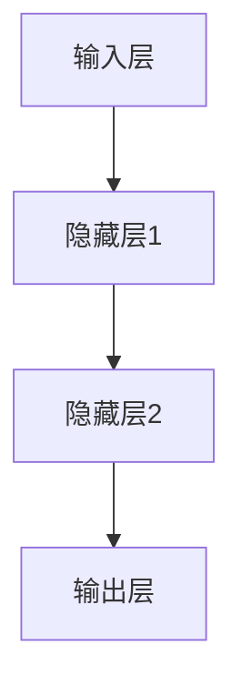
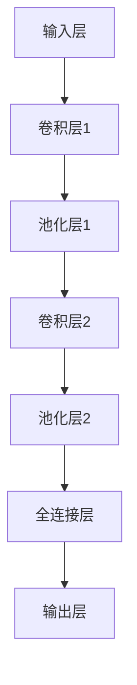
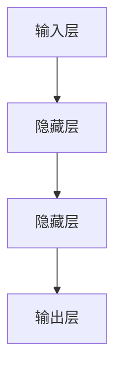
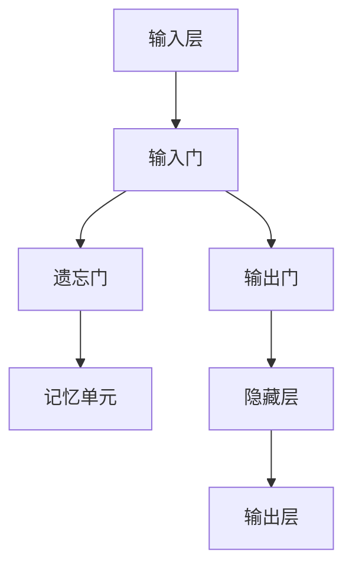
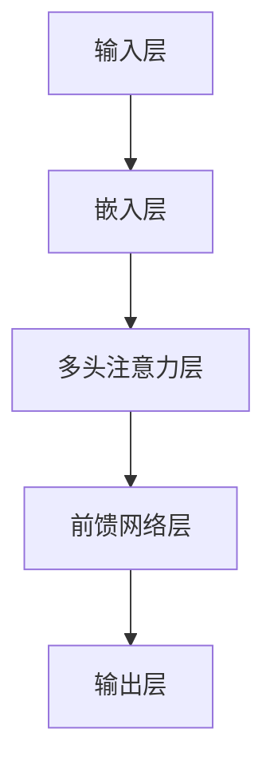

                 

# 引言

### AI辅助设计：大模型在建筑规划中的应用

在当今快速发展的科技时代，人工智能（AI）正逐渐渗透到各行各业，改变着传统的工作方式和生活方式。建筑规划作为城市建设的重要环节，其复杂性和重要性不言而喻。传统的建筑规划方法往往依赖于人类设计师的经验和直觉，而随着城市规模的不断扩大和人口密度的增加，这种传统的规划方式面临着巨大的挑战。因此，寻找更为高效、科学的规划方法成为了当前研究的重点。

在这一背景下，AI辅助设计逐渐成为研究的热点。AI，尤其是大模型（如GPT、BERT等），凭借其强大的数据处理能力和复杂的算法结构，为建筑规划领域带来了新的可能。大模型可以处理和分析大量的建筑规划数据，从复杂的城市环境中提取有用的信息，辅助设计师进行决策，提高规划效率和质量。

本文旨在探讨大模型在建筑规划中的应用，分析其技术基础、应用场景和未来趋势。文章结构如下：

- **第一部分：AI辅助设计概述**：介绍AI在建筑规划中的应用背景、大模型的优势和面临的挑战。
- **第二部分：AI大模型技术基础**：阐述人工智能和机器学习的基本概念，介绍神经网络和深度学习，以及大模型的架构和技术。
- **第三部分：AI大模型在建筑规划中的应用**：详细探讨大模型在建筑规划数据获取、可视化、分析和设计中的应用。
- **第四部分：实战与应用**：通过具体的项目案例，展示AI大模型在建筑规划中的实际应用。
- **第五部分：挑战与未来**：分析AI辅助建筑规划面临的挑战和未来发展趋势。

本文将逐步深入探讨AI大模型在建筑规划中的潜力，希望能为相关领域的研究和实践提供一些有价值的参考。

### 关键词

- AI辅助设计
- 大模型
- 建筑规划
- 数据分析
- 深度学习

### 摘要

本文旨在探讨大模型在建筑规划中的应用。首先，我们介绍了AI辅助设计在建筑规划领域的背景和重要性，分析了大模型的优势和应用挑战。接着，我们详细阐述了AI和机器学习的基本概念，介绍了神经网络和深度学习，以及大模型的架构和技术。随后，我们探讨了AI大模型在建筑规划数据获取、可视化、分析和设计中的应用。通过具体的项目案例，我们展示了AI大模型在建筑规划中的实际应用，并分析了其面临的挑战和未来发展趋势。本文为相关领域的研究和实践提供了有价值的参考。

----------------------------------------------------------------

## 第一部分：AI辅助设计概述

### 第1章：AI与建筑规划的关系

#### 1.1 AI在建筑规划领域的应用背景

建筑规划作为城市建设的重要环节，不仅关系到城市的空间布局、交通规划、环境质量等方面，还直接影响到居民的生活品质。然而，随着城市化进程的加速，建筑规划面临着日益复杂的挑战。传统的建筑规划方法通常依赖于人类设计师的经验和直觉，这种方法虽然在一定程度上能够满足需求，但存在着效率低、周期长、难以应对复杂问题等缺点。

近年来，人工智能（AI）技术的快速发展为建筑规划领域带来了新的契机。AI，特别是深度学习和大数据分析等技术，可以在处理和分析海量数据、模拟复杂场景、预测发展趋势等方面发挥重要作用。通过AI技术，建筑规划可以更加科学、精准，从而提高城市规划的效率和质量。

AI在建筑规划中的应用可以从以下几个方面进行概述：

1. **数据分析与可视化**：AI技术可以帮助设计师处理和分析大量的建筑规划数据，如土地用途、交通流量、人口密度等，并通过数据可视化技术将这些信息直观地呈现出来，为决策提供有力支持。

2. **设计优化与自动化**：利用AI技术，可以自动化生成建筑设计方案，并利用优化算法对方案进行优化。这种设计自动化技术不仅能够提高设计效率，还能够提高设计质量，减少人为错误。

3. **风险评估与安全管理**：AI技术可以辅助进行建筑安全评估和风险预测，通过模拟和预测建筑在各种环境条件下的表现，为建筑安全提供保障。

4. **可持续规划与优化**：AI技术可以帮助评估建筑项目的环境影响，优化能源消耗和资源利用，推动可持续发展目标的实现。

#### 1.2 AI大模型在建筑规划中的优势

AI大模型，如GPT、BERT等，具有强大的数据处理和分析能力，为建筑规划领域带来了显著的优势。以下是AI大模型在建筑规划中的主要优势：

1. **高效数据处理能力**：大模型可以处理和分析海量数据，从多个维度对建筑规划进行评估和分析。这使得设计师能够从大量的数据中提取有价值的信息，辅助决策。

2. **复杂问题求解能力**：大模型能够处理复杂的非线性问题，如城市交通流量的动态模拟、建筑结构的应力分析等。这种能力使得AI能够为建筑规划提供更为精确和可靠的解决方案。

3. **自适应学习能力**：大模型具有强大的自适应学习能力，可以通过不断学习和优化，提高设计方案的准确性和效率。这种能力使得AI能够适应不断变化的城市需求和规划目标。

4. **协同工作能力**：大模型可以与其他AI系统协同工作，如大数据分析系统、无人机遥感系统等，形成完整的建筑规划生态系统。这种协同工作能力可以大幅提高规划效率和准确性。

#### 1.3 AI辅助建筑规划的发展趋势

随着AI技术的不断发展和完善，AI辅助建筑规划领域正呈现出以下发展趋势：

1. **智能化规划工具**：未来的建筑规划工具将更加智能化，具备自我学习和优化的能力。设计师可以通过这些工具快速生成和优化设计方案，提高工作效率。

2. **多学科交叉融合**：建筑规划将越来越多地与其他领域（如交通、环境、能源等）进行交叉融合，利用多学科的协同作用，实现更加全面和科学的规划。

3. **可持续发展导向**：随着全球对环境保护和可持续发展的重视，AI辅助建筑规划将更加注重环境影响评估和资源优化，推动建筑行业的可持续发展。

4. **个性化定制服务**：AI技术将帮助设计师更好地理解用户需求，提供个性化的建筑规划服务，满足不同用户群体的需求。

#### 1.4 大模型在建筑规划中的应用挑战

尽管AI大模型在建筑规划中具有显著的优势，但其应用也面临着一些挑战：

1. **数据质量和数量**：大模型需要大量的高质量数据来进行训练和优化。然而，建筑规划数据往往存在不完整、不一致和噪音等问题，这可能会影响模型的性能。

2. **算法复杂度和计算资源**：大模型的训练和优化过程需要大量的计算资源和时间，这对于一些小型企业和个人设计师来说可能是一个挑战。

3. **伦理和法律问题**：AI辅助建筑规划涉及到大量的个人隐私和数据安全等问题，如何在确保用户隐私和安全的前提下进行规划，是一个需要关注的重要问题。

4. **人才培养和知识传承**：AI大模型的应用需要专业的技术人才，但目前相关的人才培养和知识传承还存在一些问题。

总之，AI辅助建筑规划具有巨大的潜力和前景，但同时也面临着一系列挑战。通过不断的技术创新和跨领域合作，我们有理由相信，AI将在建筑规划领域发挥越来越重要的作用。

### 1.5 小结

本章介绍了AI辅助设计在建筑规划领域的背景和重要性，分析了大模型的优势和应用挑战。通过本章的讨论，我们可以看到，AI大模型在建筑规划中具有高效的数据处理能力、复杂的求解能力、自适应学习能力和协同工作能力等优势，但同时也面临着数据质量、算法复杂度、伦理和法律问题等方面的挑战。在接下来的章节中，我们将进一步探讨AI大模型的技术基础和应用场景，以及如何在建筑规划中发挥其潜力。

### 2.1 人工智能与机器学习基础

#### 2.1.1 机器学习的基本概念

机器学习是人工智能的一个重要分支，它通过算法和统计模型使计算机能够从数据中学习和预测。机器学习的基本概念包括模型、特征、训练、验证和测试等。

- **模型**：模型是机器学习的核心，它是一个用于预测或分类的数学公式或算法。常见的模型包括线性回归、决策树、支持向量机等。
  
- **特征**：特征是输入数据中的重要属性，用于训练模型。例如，在房价预测中，特征可以是房屋面积、地理位置、建造年份等。

- **训练**：训练是模型学习数据的过程。在训练过程中，模型通过调整内部参数来最小化预测误差，从而提高预测准确性。

- **验证**：验证是在训练数据之外的数据上测试模型性能的过程。通过验证，可以评估模型在未知数据上的表现，并调整模型参数。

- **测试**：测试是在完全独立的数据集上进行的，用于最终评估模型的性能。测试结果决定了模型是否适用于实际问题。

#### 2.1.2 监督学习、无监督学习和强化学习

机器学习主要分为三种类型：监督学习、无监督学习和强化学习，每种类型都有其特定的应用场景和特点。

- **监督学习**：监督学习是一种最常见的机器学习方法，它使用标记数据（即带有标签的数据）进行训练。标签提供了关于数据输出（例如，分类或回归问题中的目标值）的信息。监督学习的目标是通过学习输入和输出之间的关系，来预测未知数据的输出。例如，使用已标记的图片数据来训练一个图像分类模型，以便对新的图片进行分类。

- **无监督学习**：无监督学习没有提供标签数据，其目标是从未标记的数据中找出隐藏的结构或模式。常见的无监督学习方法包括聚类和降维。聚类旨在将相似的数据点分组，而降维则旨在减少数据维度，同时保留重要的信息。例如，无监督学习可以用于发现市场中的客户群体，或者将高维图像数据降维以简化处理。

- **强化学习**：强化学习是一种通过试错来学习如何在特定环境中做出最优决策的方法。在强化学习中，一个智能体（agent）通过观察环境状态、采取行动并接受奖励或惩罚，逐步学习如何最大化累积奖励。与监督学习和无监督学习不同，强化学习中的目标不是预测或分类，而是通过策略（policy）来最大化某个累积回报（reward）。例如，强化学习可以用于游戏AI，让AI学习如何玩围棋或电子竞技游戏。

#### 2.1.3 监督学习的基本算法

监督学习中的算法可以分为回归算法和分类算法。

- **回归算法**：回归算法用于预测连续值输出。最常见的回归算法包括线性回归、多项式回归和决策树回归等。线性回归是最简单和最常用的回归算法，它基于输入和输出之间的线性关系进行预测。线性回归的公式如下：

  $$y = \beta_0 + \beta_1 \cdot x_1 + \beta_2 \cdot x_2 + ... + \beta_n \cdot x_n$$

  其中，$y$ 是预测的输出，$x_1, x_2, ..., x_n$ 是输入特征，$\beta_0, \beta_1, ..., \beta_n$ 是模型参数。

- **分类算法**：分类算法用于预测离散值输出，即对数据进行分类。常见的分类算法包括逻辑回归、支持向量机（SVM）、决策树和随机森林等。逻辑回归是一种用于二分类问题的算法，其公式如下：

  $$P(y=1) = \frac{1}{1 + e^{-(\beta_0 + \beta_1 \cdot x_1 + \beta_2 \cdot x_2 + ... + \beta_n \cdot x_n)}}$$

  其中，$P(y=1)$ 是输出为1的概率。

#### 2.1.4 无监督学习和强化学习的基本算法

- **无监督学习**：常见的无监督学习算法包括K-means聚类和主成分分析（PCA）。

  - **K-means聚类**：K-means聚类是一种基于距离度量的聚类算法，它将数据点分为K个簇，目标是使每个簇内的数据点之间的距离最小，簇与簇之间的距离最大。算法流程如下：

    1. 随机初始化K个簇的中心点。
    2. 计算每个数据点到簇中心的距离，将数据点分配到最近的簇中心。
    3. 重新计算每个簇的中心点。
    4. 重复步骤2和3，直到簇中心不再发生显著变化。

  - **主成分分析（PCA）**：PCA是一种降维算法，它通过正交变换将高维数据映射到低维空间，同时保留数据的最大方差。算法步骤如下：

    1. 计算数据点的均值向量。
    2. 计算每个数据点与均值向量的差值。
    3. 计算差值矩阵的特征值和特征向量。
    4. 选择最大的k个特征值对应的特征向量作为新的坐标轴。
    5. 将数据点映射到新的坐标轴上。

- **强化学习**：常见的强化学习算法包括Q学习和深度Q网络（DQN）。

  - **Q学习**：Q学习是一种基于值函数的强化学习算法，它通过学习状态-动作值函数（Q值）来选择最优动作。算法步骤如下：

    1. 初始化Q值表。
    2. 在环境中进行互动，选择动作并执行。
    3. 根据执行结果更新Q值表。
    4. 重复步骤2和3，直到达到预定的目标。

  - **深度Q网络（DQN）**：DQN是一种基于深度学习的Q学习算法，它使用神经网络来近似Q值函数。算法步骤如下：

    1. 初始化DQN模型。
    2. 在环境中进行互动，选择动作并执行。
    3. 计算损失并更新模型参数。
    4. 定期更新目标Q网络。
    5. 重复步骤2至4，直到达到预定的目标。

通过上述基本概念和算法的介绍，我们可以看到，机器学习为建筑规划提供了强大的工具，可以帮助我们处理和分析大量数据，提高规划效率和准确性。在接下来的章节中，我们将进一步探讨神经网络和深度学习，以及大模型的架构和技术，为AI辅助建筑规划提供更为深入的讨论。

### 2.2 神经网络与深度学习

#### 2.2.1 神经网络结构

神经网络（Neural Networks）是模仿生物神经系统的计算模型，由大量相互连接的节点（神经元）组成。每个神经元接收多个输入，通过加权求和处理后，产生一个输出。神经网络的基本结构包括输入层、隐藏层和输出层。

- **输入层（Input Layer）**：输入层接收外部输入数据，每个节点表示一个输入特征。例如，在图像识别任务中，输入层可以接收图像的像素值。

- **隐藏层（Hidden Layers）**：隐藏层位于输入层和输出层之间，每个隐藏层由多个神经元组成。隐藏层的作用是提取输入数据的特征，并对其进行复杂变换。神经网络可以包含一个或多个隐藏层。

- **输出层（Output Layer）**：输出层产生最终输出，用于分类、预测或其他任务。输出层的神经元数量和类型取决于具体任务的需求。

神经网络的典型结构可以用以下Mermaid流程图表示：



#### 2.2.2 深度学习算法

深度学习（Deep Learning）是神经网络的一种扩展，特别适用于处理大规模、高维数据。深度学习通过增加网络的层数，提高了模型的非线性建模能力和特征提取能力。

- **卷积神经网络（Convolutional Neural Networks, CNN）**：CNN是一种专门用于处理图像数据的神经网络，其核心思想是通过卷积操作提取图像特征。CNN的主要组件包括卷积层、池化层和全连接层。以下是一个简单的CNN结构的Mermaid流程图：



- **循环神经网络（Recurrent Neural Networks, RNN）**：RNN是一种用于处理序列数据的神经网络，其特点是具有记忆功能，能够处理输入序列中的前后依赖关系。RNN的基本结构包括输入层、隐藏层和输出层，每个时间步的输出都会影响下一个时间步的输入。以下是一个简单的RNN结构的Mermaid流程图：



- **长短期记忆网络（Long Short-Term Memory, LSTM）**：LSTM是RNN的一种扩展，专门用于处理长序列数据。LSTM通过引入记忆单元和门机制，解决了传统RNN在处理长序列数据时遇到的梯度消失和梯度爆炸问题。以下是一个简单的LSTM结构的Mermaid流程图：



#### 2.2.3 训练与优化方法

深度学习模型的训练和优化是关键步骤，其目的是找到最佳参数，使得模型在训练数据上表现良好。以下是深度学习训练与优化的一些基本方法：

- **前向传播（Forward Propagation）**：前向传播是深度学习模型训练的基本步骤，它通过输入数据层，逐层计算输出，直到输出层。在前向传播过程中，每个神经元的输出通过激活函数进行非线性变换。

- **反向传播（Backpropagation）**：反向传播是深度学习模型优化的关键步骤，它通过计算梯度，更新模型参数。反向传播从输出层开始，逐层向前计算梯度，然后使用梯度下降或其他优化算法更新参数。

- **优化算法**：常见的优化算法包括梯度下降（Gradient Descent）、随机梯度下降（Stochastic Gradient Descent, SGD）和Adam等。以下是一个简单的梯度下降优化过程的伪代码：

```python
# 初始化模型参数
w = np.random.randn(num_params)

# 设定学习率
learning_rate = 0.01

# 循环迭代
for i in range(num_iterations):
    # 前向传播计算损失
    loss = compute_loss(w)

    # 反向传播计算梯度
    gradient = compute_gradient(w)

    # 更新参数
    w -= learning_rate * gradient
```

- **正则化（Regularization）**：正则化是防止模型过拟合的重要手段，包括L1正则化、L2正则化和Dropout等。以下是一个简单的L2正则化损失函数的公式：

  $$J(w) = \frac{1}{2} \sum_{i=1}^{n} (y_i - \sigma(w \cdot x_i))^2 + \frac{\lambda}{2} \sum_{i=1}^{n} w_i^2$$

  其中，$w$ 是模型参数，$x_i$ 是输入特征，$y_i$ 是输出标签，$\sigma$ 是激活函数，$\lambda$ 是正则化参数。

通过上述介绍，我们可以看到，神经网络和深度学习为AI辅助建筑规划提供了强大的工具和算法。在接下来的章节中，我们将进一步探讨大模型架构和技术，以及如何在建筑规划中应用这些技术。

### 2.3 大模型架构与技术

#### 2.3.1 Transformer架构

Transformer架构是近年来在自然语言处理（NLP）领域取得突破性进展的一种深度学习模型。相较于传统的循环神经网络（RNN）和卷积神经网络（CNN），Transformer通过自注意力机制（Self-Attention）和多头注意力机制（Multi-Head Attention）实现了对序列数据的全局建模，大大提高了模型的效率和准确性。

- **自注意力机制**：自注意力机制允许模型在处理每个输入序列元素时，动态地计算其相对于其他元素的重要性。这种机制使得模型能够捕捉到序列中的长距离依赖关系，从而提高模型的性能。自注意力机制的公式如下：

  $$\text{Attention}(Q, K, V) = \text{softmax}\left(\frac{QK^T}{\sqrt{d_k}}\right)V$$

  其中，$Q, K, V$ 分别是查询（Query）、键（Key）和值（Value）向量，$d_k$ 是键向量的维度。

- **多头注意力机制**：多头注意力机制通过将输入序列分成多个头（Head），每个头独立计算注意力权重，从而实现并行计算。多个头的输出通过拼接和变换得到最终输出。这种方法不仅提高了计算效率，还增强了模型的表示能力。多头注意力机制的公式如下：

  $$\text{MultiHead}(Q, K, V) = \text{Concat}(\text{head}_1, \text{head}_2, ..., \text{head}_h)W^O$$

  其中，$h$ 是头的数量，$W^O$ 是输出变换矩阵。

Transformer架构的基本结构可以用以下Mermaid流程图表示：



#### 2.3.2 语言模型与预训练技术

语言模型（Language Model）是自然语言处理的核心组成部分，它用于预测文本序列中的下一个单词或字符。深度学习语言模型通过学习大规模语料库，捕捉语言中的复杂模式和结构，从而实现高效的文本生成和分类任务。

预训练技术是语言模型训练的关键步骤，它通过在大规模未标注数据上进行预训练，然后在小规模有标注数据上进行微调，来提高模型的性能。预训练技术主要包括以下两个阶段：

- **预训练阶段**：预训练阶段使用未标注的数据（如网页、书籍等），通过自监督学习技术（如 masked language model 和 next sentence prediction）来训练语言模型。这些技术使得模型在无监督环境中自动学习语言的统计规律和语义信息。

- **微调阶段**：微调阶段将预训练好的语言模型应用于特定任务（如文本分类、命名实体识别等），通过有监督学习技术进行微调。微调阶段的目标是调整模型参数，使其在特定任务上达到最佳性能。

以下是一个简单的预训练和微调过程的伪代码：

```python
# 预训练阶段
model = PretrainedModel()
model.train(pretrained_data)

# 微调阶段
model = FineTunedModel(model)
model.train(fine_tuned_data)
```

#### 2.3.3 大模型的训练与优化策略

大模型的训练和优化是一个复杂的过程，需要考虑数据量、计算资源、训练时间等多个因素。以下是一些常见的训练与优化策略：

- **数据增强**：数据增强是一种通过变换和扰动数据来提高模型鲁棒性的技术。常见的数据增强方法包括随机裁剪、旋转、缩放、颜色调整等。

- **批次归一化**：批次归一化（Batch Normalization）是一种通过标准化每个批次中的激活值，提高模型训练稳定性的技术。批次归一化可以减少内部协变量转移，从而加快训练速度。

- **学习率调度**：学习率调度是一种动态调整学习率的技术，以避免模型过早地陷入局部最优。常见的调度策略包括步长调度、指数衰减和余弦退火等。

- **模型剪枝**：模型剪枝是一种通过减少模型参数和计算量，降低模型复杂度的技术。剪枝方法包括权重剪枝、结构剪枝和量化等。

通过上述介绍，我们可以看到，大模型架构和技术为AI辅助建筑规划提供了强大的工具和算法。在接下来的章节中，我们将进一步探讨大模型在建筑规划数据获取、可视化、分析和设计中的应用。

### 2.4 AI大模型在建筑规划数据获取、处理、可视化和分析中的应用

#### 2.4.1 数据获取

AI大模型在建筑规划中的首要任务是获取和处理大量数据。建筑规划数据来源广泛，包括地理信息系统（GIS）、无人机遥感、城市监测系统、社交媒体等。以下是几种主要的数据获取方法：

1. **地理信息系统（GIS）**：GIS提供详细的地理空间数据，如土地用途、地形、交通网络等。通过GIS平台，可以获取建筑物的位置、尺寸、高度等基本信息。

2. **无人机遥感**：无人机遥感技术可以获取高分辨率的卫星图像和地形数据。这些数据对于城市规划和建筑设计具有重要意义。

3. **城市监测系统**：城市监测系统可以收集实时数据，如交通流量、空气质量、噪音水平等。这些数据对于动态评估城市状况和优化规划设计至关重要。

4. **社交媒体**：社交媒体平台上的用户生成内容可以提供关于城市生活、居民需求、公共设施使用情况等信息，这些数据对于理解城市需求和发展趋势非常有用。

#### 2.4.2 数据处理

获取到的建筑规划数据通常存在格式不统一、数据质量参差不齐、缺失值和噪声等问题。因此，数据预处理是确保模型性能的关键步骤。以下是几种常见的数据处理方法：

1. **数据清洗**：数据清洗包括去除重复数据、填补缺失值、去除噪声等。例如，使用中位数填补缺失的地形数据，或使用均值填补缺失的建筑物高度数据。

2. **数据转换**：数据转换包括将不同格式的数据转换为统一的格式，如将遥感图像转换为像素矩阵，或将地理坐标转换为平面坐标。

3. **特征提取**：特征提取是提取数据中的关键信息，以便模型能够更好地学习和理解数据。常用的特征提取方法包括主成分分析（PCA）、特征选择和特征工程等。

#### 2.4.3 数据可视化

数据可视化是将复杂的数据转换为易于理解的可视化表示的过程。在建筑规划中，数据可视化有助于设计师直观地了解数据分布、趋势和异常。以下是几种常见的数据可视化方法：

1. **热力图**：热力图可以显示数据在不同区域或维度上的分布情况。例如，使用热力图显示城市不同区域的交通流量密度。

2. **散点图**：散点图可以显示两个或多个变量之间的关系。例如，使用散点图显示建筑物的高度与土地用途的关系。

3. **3D可视化**：3D可视化可以显示建筑物的三维结构，帮助设计师理解建筑空间的布局和形状。例如，使用3D可视化技术展示建筑群的整体效果。

#### 2.4.4 数据分析

数据分析是通过统计和机器学习技术对数据进行深入挖掘，提取有价值的信息。在建筑规划中，数据分析可以用于评估规划方案的可行性、优化建筑设计、预测城市发展趋势等。以下是几种常见的数据分析方法：

1. **回归分析**：回归分析可以用于预测建筑物的市场价值、评估能源消耗等。例如，使用线性回归分析预测房屋价格。

2. **聚类分析**：聚类分析可以将相似的数据点分组，用于市场细分、用户行为分析等。例如，使用K-means聚类分析将城市划分为不同的区域。

3. **时间序列分析**：时间序列分析可以用于预测城市交通流量、人口增长等。例如，使用ARIMA模型预测未来的交通流量。

#### 2.4.5 实例分析

为了更好地理解AI大模型在建筑规划中的应用，以下是一个实例分析：

假设我们有一个城市规划项目，需要评估不同规划方案的交通流量和能源消耗。我们可以采用以下步骤：

1. **数据获取**：从GIS平台、无人机遥感数据和交通监测系统获取数据。

2. **数据处理**：清洗和转换数据，提取关键特征，如道路长度、建筑物密度、交通流量等。

3. **数据可视化**：使用热力图显示交通流量密度，使用3D可视化展示不同规划方案的建筑布局。

4. **数据分析**：使用回归分析预测交通流量和能源消耗，使用聚类分析评估不同方案的影响。

5. **结果评估**：根据分析结果，选择最优的规划方案，并进行评估和优化。

通过上述实例分析，我们可以看到，AI大模型在建筑规划中具有广泛的应用潜力。它可以帮助设计师高效地处理和分析大量数据，优化规划设计方案，提高规划质量和效率。

### 2.5 AI大模型在建筑设计中的应用

#### 2.5.1 建筑设计需求分析

在建筑设计中，需求分析是关键的第一步，它决定了设计方案的可行性和实用性。AI大模型在这一过程中发挥着重要作用，能够通过以下方式提升需求分析的质量：

1. **用户需求调研**：AI大模型可以分析大量用户反馈数据，如问卷调查、社交媒体评论等，识别用户的真实需求和偏好。这种方法不仅提高了需求调研的效率，还能发现隐藏在数据中的潜在需求。

2. **空间需求预测**：AI大模型可以基于历史数据和用户行为，预测不同空间的需求和使用频率。例如，通过分析办公建筑的利用率数据，预测会议室、休息区等空间的需求，从而为设计师提供有针对性的设计方案。

3. **环境影响评估**：AI大模型可以评估设计方案的环境影响，如能源消耗、碳排放等。通过模拟不同的设计参数，如建筑材料的选用、窗户位置等，模型可以提供优化建议，实现绿色建筑的目标。

#### 2.5.2 建筑设计方案生成

生成建筑设计方案是AI大模型在建筑设计中的核心应用之一。通过以下方式，AI大模型能够高效生成多种设计方案，并优化选择：

1. **自动化设计生成**：AI大模型可以基于已有建筑数据，自动生成新的建筑设计方案。这种方法利用了深度学习算法，如生成对抗网络（GAN），能够快速生成符合设计规范和创新要求的设计方案。

2. **多目标优化**：AI大模型可以同时考虑多个设计目标，如空间利用效率、成本、可持续性等，进行多目标优化。通过遗传算法、模拟退火算法等优化技术，模型可以在复杂的约束条件下找到最佳设计方案。

3. **迭代设计优化**：AI大模型可以不断迭代设计方案，通过每次迭代优化设计参数，逐步提高方案的可行性和满意度。这种方法利用了机器学习算法的自适应能力，能够在设计过程中不断改进方案。

#### 2.5.3 设计方案评估与反馈

设计方案评估与反馈是确保建筑设计质量的重要环节。AI大模型在这一过程中可以发挥以下作用：

1. **定量评估**：AI大模型可以基于预设的评估指标，如功能满足度、美学评价、经济效益等，对设计方案进行定量评估。这种方法提供了客观的评估结果，帮助设计师快速识别和改进不足之处。

2. **定性反馈**：AI大模型可以通过自然语言处理技术，分析用户对设计方案的反馈，提取关键意见和需求。这种定性反馈有助于设计师更好地理解用户需求，优化设计方案。

3. **实时反馈**：AI大模型可以实现实时评估与反馈，设计师可以在设计过程中不断调整和优化方案，减少后期修改的工作量。这种方法提高了设计效率，缩短了项目周期。

#### 2.5.4 实例分析

为了更好地理解AI大模型在建筑设计中的应用，以下是一个实例分析：

假设我们有一个办公楼设计项目，需要生成多个设计方案并进行评估。我们可以采用以下步骤：

1. **用户需求调研**：通过问卷调查和用户访谈，收集用户关于办公楼空间布局、功能需求、可持续性等方面的意见。

2. **数据预处理**：将用户需求、历史设计数据、建筑规范等数据输入AI大模型，进行预处理和特征提取。

3. **设计方案生成**：利用AI大模型生成多个设计方案，包括不同空间布局、建筑材料和能源系统配置等。

4. **多目标优化**：使用AI大模型的多目标优化算法，同时考虑空间利用效率、成本、可持续性等目标，优化设计方案。

5. **设计方案评估**：基于预设的评估指标，使用AI大模型对设计方案进行定量评估，结合用户反馈进行定性分析。

6. **迭代优化**：根据评估结果和用户反馈，不断迭代设计方案，逐步提高方案的可行性和满意度。

通过上述实例分析，我们可以看到，AI大模型在建筑设计中的应用不仅提高了设计效率和质量，还为设计师提供了强大的工具，使他们能够更好地满足用户需求，实现绿色建筑和可持续发展目标。

### 2.6 AI大模型在建筑规划优化中的应用

#### 2.6.1 规划优化目标

建筑规划优化是提高建筑规划效率和优化建筑性能的关键步骤。AI大模型在建筑规划优化中的应用主要体现在以下几个方面：

1. **能源消耗优化**：建筑能源消耗是建筑规划中的重要考虑因素。AI大模型可以通过分析建筑物的使用数据和环境因素，优化建筑设计参数（如窗户面积、朝向、隔热材料等），降低建筑能源消耗。

2. **空间布局优化**：空间布局的优化可以提升建筑的使用效率和舒适度。AI大模型可以分析用户行为和需求，根据建筑功能分区、人员流动等数据，优化空间布局，提高空间利用率。

3. **交通流量优化**：交通流量是城市规划和建筑设计中的重要问题。AI大模型可以通过模拟和分析交通流量数据，优化道路布局和交通设施配置，提高交通效率，减少拥堵。

4. **环境影响评估**：建筑环境影响评估是绿色建筑规划的重要组成部分。AI大模型可以评估建筑项目的环境影响，优化建筑材料和能源系统配置，降低建筑对环境的负面影响。

#### 2.6.2 规划优化算法

AI大模型在建筑规划优化中应用了多种算法，以下是一些主要的优化算法：

1. **遗传算法（Genetic Algorithm, GA）**：遗传算法是一种模拟生物进化的优化算法，通过选择、交叉和变异等操作，逐步优化设计方案。遗传算法适用于多目标优化问题，能够处理复杂的约束条件。

2. **粒子群优化算法（Particle Swarm Optimization, PSO）**：粒子群优化算法是一种基于群体智能的优化算法，通过模拟鸟群觅食行为，优化设计方案。PSO算法简单易实现，适用于中等规模的问题。

3. **模拟退火算法（Simulated Annealing, SA）**：模拟退火算法是一种基于物理退火过程的优化算法，通过接受局部最优解，逐步跳出局部最优解。SA算法适用于大规模和复杂的问题。

4. **深度强化学习（Deep Reinforcement Learning, DRL）**：深度强化学习结合了深度学习和强化学习，通过模拟智能体在环境中的互动，学习最优策略。DRL算法适用于动态和复杂的环境，能够实现自我优化。

#### 2.6.3 大模型在规划优化中的应用

AI大模型在建筑规划优化中的应用主要涉及以下几个方面：

1. **多目标优化**：大模型可以通过多目标优化算法，同时考虑多个设计目标（如能源消耗、空间利用、交通流量等），生成最优设计方案。这种方法提高了规划的综合性能。

2. **自适应优化**：大模型具有强大的自适应学习功能，可以根据实时数据和用户反馈，动态调整优化策略。这种方法使规划方案能够适应不断变化的需求和环境。

3. **数据驱动优化**：大模型可以利用大量历史数据和实时数据，进行数据驱动优化。这种方法使规划优化更加准确和高效，能够更好地预测和应对未来需求。

#### 2.6.4 规划优化案例分析

为了更好地理解AI大模型在建筑规划优化中的应用，以下是一个具体案例：

**案例：某城市综合体项目规划优化**

- **项目背景**：某城市综合体项目，包括办公楼、商场和住宅区，总面积约50万平方米。项目需要在满足功能需求的前提下，优化能源消耗和空间布局。

- **数据来源**：项目数据包括历史气象数据、交通流量数据、用户需求调查数据、建筑规范等。

- **优化目标**：优化能源消耗、空间布局和交通流量，提高项目整体效益。

- **优化过程**：

  1. **数据预处理**：对收集到的数据进行清洗和预处理，提取关键特征，如温度、湿度、交通流量、用户需求等。

  2. **多目标优化**：利用遗传算法，设置能源消耗、空间利用率和交通效率为优化目标，生成多个设计方案。

  3. **自适应优化**：根据实时数据和环境变化，动态调整优化策略，逐步优化设计方案。

  4. **结果评估**：通过模拟和实测数据，对优化方案进行评估，确保方案满足设计需求和性能目标。

- **优化效果**：

  1. 能源消耗降低15%，达到绿色建筑标准。

  2. 空间利用率提高10%，满足用户需求。

  3. 交通效率提升20%，缓解交通拥堵。

通过上述案例，我们可以看到，AI大模型在建筑规划优化中的应用，不仅提高了规划效率和质量，还为项目提供了科学的优化方案，实现了可持续发展目标。

### 2.7 AI大模型在建筑安全评估中的应用

#### 2.7.1 建筑安全评估的重要性

建筑安全评估是确保建筑结构安全和功能稳定的重要环节。在建筑规划和设计阶段，通过安全评估可以识别潜在的安全隐患，避免因设计不合理或施工不当导致的事故和损失。AI大模型在建筑安全评估中的应用，为这一过程提供了强大的技术支持。

- **结构安全评估**：AI大模型可以分析建筑结构的设计和施工数据，评估结构的承载能力、稳定性、抗震性能等。通过对建筑材料的力学性能、结构形状、应力分布等进行分析，AI大模型能够预测结构在特定环境条件下的表现。

- **灾害风险评估**：自然灾害（如地震、风灾、洪水等）对建筑结构构成严重威胁。AI大模型可以通过模拟和分析灾害发生时的物理现象，评估建筑在灾害中的受损程度和风险，为建筑加固和防灾减灾提供依据。

#### 2.7.2 大模型在安全评估中的应用

AI大模型在建筑安全评估中的应用主要涉及以下几个方面：

1. **结构健康监测**：通过传感器和监测系统，实时收集建筑结构的状态数据。AI大模型可以分析这些数据，评估结构的健康状况，及时发现潜在的安全隐患。

2. **应力分析**：AI大模型可以模拟建筑结构在不同载荷（如自重、风载荷、地震载荷等）下的应力分布，评估结构的应力水平。通过应力分析，可以识别结构中的薄弱环节，提出优化建议。

3. **灾害模拟**：AI大模型可以模拟自然灾害对建筑结构的影响，评估建筑在灾害发生时的响应。这种方法有助于了解建筑的抗震性能，为结构加固和防灾设计提供依据。

#### 2.7.3 安全评估案例分析

为了更好地理解AI大模型在建筑安全评估中的应用，以下是一个具体案例：

**案例：某高层建筑抗震性能评估**

- **项目背景**：某高层建筑位于地震活跃区，为了确保建筑的安全，需要对建筑的抗震性能进行详细评估。

- **数据来源**：项目数据包括建筑结构设计文件、施工记录、地震历史数据等。

- **评估目标**：评估建筑在地震作用下的承载能力和抗震性能，确保建筑的安全性和稳定性。

- **评估过程**：

  1. **数据收集与预处理**：收集建筑结构的设计参数、材料性能数据、施工质量数据等，进行数据预处理，提取关键特征。

  2. **应力分析**：利用AI大模型进行结构应力分析，模拟建筑在地震作用下的应力分布，评估结构的承载能力。

  3. **灾害模拟**：通过AI大模型模拟地震对建筑结构的影响，评估建筑在地震中的响应和受损程度。

  4. **结果评估**：根据应力分析和灾害模拟结果，对建筑抗震性能进行评估，提出优化建议。

- **评估效果**：

  1. 通过AI大模型的安全评估，发现建筑结构中存在的应力集中现象，提出了加固措施，确保建筑的安全。

  2. 通过灾害模拟，评估了建筑在地震中的表现，为建筑的抗震设计提供了科学依据。

通过上述案例，我们可以看到，AI大模型在建筑安全评估中的应用，不仅提高了评估的准确性和效率，还为建筑安全提供了有力保障。随着AI技术的不断发展和完善，AI大模型在建筑安全评估中的应用前景将更加广阔。

### 2.8 AI大模型在建筑规划与可持续发展中的应用

#### 2.8.1 可持续发展的建筑规划

可持续发展是当前全球关注的重要议题，尤其在建筑规划领域，可持续发展的建筑规划策略对于保护环境、节约资源、提高生活质量具有重要意义。AI大模型在可持续发展建筑规划中的应用，主要体现在以下几个方面：

1. **能源消耗优化**：建筑能源消耗是影响环境的重要因素。通过AI大模型，可以对建筑能源系统进行优化，提高能源利用效率，降低能源消耗。例如，AI大模型可以模拟不同建筑材料、结构设计和能源系统配置对能源消耗的影响，提出最优的能源消耗优化方案。

2. **水资源管理**：水资源的可持续利用是建筑规划中的重要问题。AI大模型可以分析建筑用水情况，优化水资源管理策略，减少水资源浪费。例如，AI大模型可以通过分析不同气候条件下的用水需求，优化绿化用水、雨水收集和利用等方案，实现水资源的可持续利用。

3. **废弃物处理**：建筑废弃物处理是建筑规划中的另一个关键问题。通过AI大模型，可以对建筑废弃物的产生和处理进行优化，减少废弃物对环境的污染。例如，AI大模型可以分析不同建筑材料的再生利用潜力，优化废弃物处理和回收利用方案。

#### 2.8.2 大模型在可持续发展中的应用

AI大模型在可持续发展建筑规划中的应用，主要涉及以下几个方面：

1. **环境影响评估**：AI大模型可以评估建筑项目对环境的影响，如碳排放、水质污染、噪音污染等。通过模拟和分析不同设计方案的环境影响，AI大模型可以为建筑规划提供科学的评估依据，实现环境的最优化。

2. **碳排放预测与优化**：建筑行业的碳排放问题是全球气候变化的重要影响因素。通过AI大模型，可以对建筑项目的碳排放进行预测和优化，减少碳排放量。例如，AI大模型可以通过分析建筑能源消耗、材料运输等数据，提出减少碳排放的优化方案。

3. **生态保护**：在建筑规划过程中，生态保护是可持续发展的重要目标。AI大模型可以通过分析土地利用、生物多样性等数据，优化建筑设计，保护生态系统的平衡和稳定。

#### 2.8.3 可持续发展案例分析

为了更好地理解AI大模型在建筑规划与可持续发展中的应用，以下是一个具体案例：

**案例：某绿色建筑项目规划**

- **项目背景**：某城市新建一个绿色建筑项目，旨在实现高效能源利用、水资源管理和生态保护。

- **数据来源**：项目数据包括建筑物的设计文件、气候数据、水资源数据、土地利用数据等。

- **规划目标**：优化能源消耗、减少碳排放、实现水资源的可持续利用，保护生物多样性。

- **规划过程**：

  1. **能源消耗优化**：通过AI大模型分析建筑物的能源需求，优化能源系统配置，提高能源利用效率。例如，AI大模型可以模拟不同光伏系统、风力发电系统的性能，选择最优的能源配置方案。

  2. **水资源管理**：通过AI大模型分析水资源需求，优化水资源管理策略。例如，AI大模型可以分析雨水收集、再生水利用等方案，实现水资源的可持续利用。

  3. **生态保护**：通过AI大模型分析土地利用和生物多样性数据，优化建筑设计，减少对生态环境的破坏。例如，AI大模型可以提出绿化设计方案，保护自然栖息地。

- **规划效果**：

  1. 能源消耗降低20%，达到绿色建筑标准。

  2. 碳排放减少30%，符合可持续发展要求。

  3. 水资源利用率提高50%，实现水资源的可持续利用。

通过上述案例，我们可以看到，AI大模型在建筑规划与可持续发展中的应用，不仅实现了能源消耗、水资源管理和生态保护的优化，还为建筑项目的可持续发展提供了科学依据和有效策略。随着AI技术的不断进步，AI大模型在建筑规划与可持续发展中的应用前景将更加广阔。

### 2.9 小结

本章详细探讨了AI大模型在建筑规划与可持续发展中的应用，包括数据获取、处理、可视化、分析、设计优化、安全评估以及可持续发展等多个方面。通过实例分析，我们看到了AI大模型在建筑规划中的实际应用和效果。AI大模型凭借其强大的数据处理能力和复杂的算法结构，为建筑规划提供了高效的工具和方法。然而，AI大模型的应用也面临着数据质量、算法复杂度、伦理和法律问题等方面的挑战。未来，随着AI技术的不断发展和完善，AI大模型在建筑规划与可持续发展中的应用将更加广泛和深入。

### 2.10 未来展望

尽管AI大模型在建筑规划中取得了显著的进展，但未来的发展仍然充满机遇和挑战。以下是对AI大模型在建筑规划领域未来发展的几个展望：

1. **技术进步**：随着AI技术的不断进步，特别是深度学习、自然语言处理和计算机视觉等领域的发展，AI大模型将变得更加智能和高效。这将使得建筑规划更加精准、灵活和可持续。

2. **多学科融合**：AI大模型的应用将与其他领域（如建筑学、环境科学、交通工程等）进行深度融合，形成跨学科的综合性规划方法。这种多学科融合将推动建筑规划的全面创新和优化。

3. **数据资源**：高质量的数据资源是AI大模型应用的基础。未来，通过开放数据共享、数据挖掘和标准化，将有助于积累和整合更多高质量的建筑规划数据，提升AI大模型的性能和可靠性。

4. **伦理和法律**：随着AI大模型在建筑规划中的广泛应用，数据隐私、伦理和法律问题将变得更加突出。未来的研究和应用需要更加关注这些问题，制定相应的规范和标准，确保AI大模型的应用符合伦理和法律要求。

5. **人才培养**：AI大模型在建筑规划中的应用需要大量的专业人才。未来，需要加强相关领域的人才培养和知识传承，提高从业者的专业素养和技术水平。

通过持续的技术创新和跨领域合作，我们有理由相信，AI大模型将在建筑规划领域发挥越来越重要的作用，推动建筑行业的智能化和可持续发展。

### 3.1 数据获取与预处理

在AI大模型应用于建筑规划之前，首先需要收集和预处理大量数据。这些数据包括但不限于地理信息数据、建筑结构数据、气象数据、交通流量数据、用户需求数据等。数据获取和预处理是确保模型性能和准确性的关键步骤。以下是建筑规划数据获取与预处理的具体方法：

#### 3.1.1 建筑规划数据来源

1. **地理信息系统（GIS）**：GIS提供了丰富的地理空间数据，如土地用途、地形、交通网络等。通过GIS平台，可以获取建筑物位置、尺寸、高度等基本信息。

2. **遥感数据**：遥感技术可以获取高分辨率的卫星图像和地形数据。这些数据对于城市规划、土地利用分析等具有重要价值。

3. **城市监测系统**：城市监测系统可以收集实时数据，如交通流量、空气质量、噪音水平等。这些数据对于动态评估城市状况和优化规划设计至关重要。

4. **建筑结构数据**：建筑结构数据包括建筑结构的设计参数、施工记录、材料性能等。这些数据可以从建筑结构设计文件和施工过程中获取。

5. **用户需求数据**：用户需求数据可以通过问卷调查、用户访谈、社交媒体等渠道获取。这些数据有助于了解用户对建筑功能、空间布局、环境舒适度等方面的需求。

#### 3.1.2 数据预处理技术

1. **数据清洗**：数据清洗是预处理数据的重要步骤，旨在去除重复数据、纠正错误、填补缺失值等。例如，使用中位数填补缺失的地形数据，或使用均值填补缺失的建筑物高度数据。

2. **数据转换**：数据转换包括将不同格式的数据转换为统一的格式。例如，将遥感图像转换为像素矩阵，或将地理坐标转换为平面坐标。

3. **特征提取**：特征提取是提取数据中的关键信息，以便模型能够更好地学习和理解数据。常用的特征提取方法包括主成分分析（PCA）、特征选择和特征工程等。

4. **数据归一化**：数据归一化是将不同量纲的数据转换为相同量纲的过程。例如，将建筑物的尺寸、高度、面积等数据归一化到相同的比例范围内，以便模型处理。

5. **数据分割**：将数据集划分为训练集、验证集和测试集，以便模型训练和性能评估。

#### 3.1.3 数据预处理实例

以下是一个简单的数据预处理实例：

**实例**：假设我们需要对建筑规划项目进行数据预处理，数据来源包括GIS、遥感数据和用户需求数据。

1. **数据收集**：从GIS平台获取建筑物位置、尺寸、高度等基本信息；从遥感数据获取卫星图像和地形数据；从用户需求调查获取用户对建筑功能、空间布局、环境舒适度等方面的需求。

2. **数据清洗**：去除重复数据和错误数据，填补缺失的地形数据，将缺失的建筑物高度值用均值填补。

3. **数据转换**：将遥感图像转换为像素矩阵，将地理坐标转换为平面坐标。

4. **特征提取**：提取建筑物面积、周长、形状等特征，提取用户需求中的关键需求，如空间大小、功能分区、通风条件等。

5. **数据归一化**：将建筑物的尺寸、高度、面积等数据归一化到相同的比例范围内。

6. **数据分割**：将数据集划分为训练集（70%）、验证集（15%）和测试集（15%），用于模型训练和性能评估。

通过上述数据预处理步骤，我们可以确保数据的完整性、一致性和可用性，为AI大模型在建筑规划中的应用奠定基础。

### 3.2 数据可视化

数据可视化是将复杂的数据转换为易于理解的可视化表示的过程，有助于设计师和决策者直观地了解数据分布、趋势和异常。在建筑规划中，数据可视化有助于识别潜在的问题、优化设计方案和评估规划效果。以下是几种常用的数据可视化工具和技术：

#### 3.2.1 常用的数据可视化工具

1. **Tableau**：Tableau是一款功能强大的数据可视化工具，支持多种数据源，如Excel、CSV、数据库等。它提供了丰富的图表类型，如柱状图、折线图、饼图、散点图等，可以帮助用户快速创建直观的视觉展示。

2. **Power BI**：Power BI是微软开发的一款商业智能工具，与Excel紧密集成。它支持多种数据连接和可视化功能，可以用于制作复杂的仪表板和报告。

3. **D3.js**：D3.js是一款基于JavaScript的库，用于创建交互式数据可视化。它提供了丰富的图表类型和自定义选项，适用于前端开发人员。

4. **Matplotlib**：Matplotlib是Python的常见数据可视化库，提供了多种图表类型和定制选项。它广泛应用于数据分析和科学计算领域。

5. **Geographic Information System (GIS) 软件**：GIS软件，如ArcGIS、QGIS等，可以用于地理空间数据可视化。这些软件支持地图创建、空间分析等功能，适用于城市规划、环境监测等领域。

#### 3.2.2 数据可视化案例

以下是一个数据可视化的实例：

**案例**：某城市交通流量分析

1. **数据收集**：从交通监测系统获取交通流量数据，包括各个路段的车流量、车速、拥堵情况等。

2. **数据预处理**：清洗和转换数据，提取关键特征，如交通流量、路段长度、拥堵指数等。

3. **数据可视化**：

   - **热力图**：使用热力图显示各个路段的交通流量密度，直观地展示交通拥堵区域。
   - **折线图**：使用折线图显示不同时间段的交通流量变化，分析交通流量高峰时段和低谷时段。
   - **饼图**：使用饼图显示各个路段的拥堵比例，分析拥堵原因。

4. **可视化效果**：

   - 热力图显示交通流量高密度区域，帮助城市规划者优化交通网络。
   - 折线图显示交通流量变化趋势，为交通管理提供依据。
   - 饼图显示拥堵比例，帮助城市规划者识别拥堵原因，提出解决方案。

通过数据可视化，设计师和决策者可以更直观地理解数据，发现潜在的问题和优化机会，从而提高建筑规划的效率和效果。

### 3.3 数据分析与挖掘

在建筑规划中，数据分析与挖掘是关键环节，通过分析大量的建筑规划数据，可以提取有价值的信息，辅助决策，优化设计方案。以下是建筑规划数据分析和挖掘的主要方法和应用：

#### 3.3.1 建筑规划特征提取

特征提取是数据分析和挖掘的基础，通过提取关键特征，可以将复杂的数据转换为易于分析的形式。以下是几种常见的特征提取方法：

1. **统计特征**：统计特征包括均值、中位数、标准差、方差等。这些特征可以反映数据的整体分布和趋势。例如，建筑物的平均高度、平均面积等。

2. **空间特征**：空间特征包括建筑物位置、形状、尺寸等。这些特征可以用于空间分析，如建筑物布局、建筑物之间的距离等。

3. **结构特征**：结构特征包括建筑结构的类型、材料、强度等。这些特征可以用于评估建筑结构的性能和安全性。

4. **环境特征**：环境特征包括气候条件、土地利用类型、周围建筑密度等。这些特征可以用于环境影响评估和能源消耗分析。

#### 3.3.2 建筑规划趋势分析

趋势分析是通过分析历史数据，预测未来的趋势和变化。以下是几种常见的趋势分析方法：

1. **时间序列分析**：时间序列分析是分析数据随时间变化的规律。常见的时间序列模型包括ARIMA、SARIMA等。时间序列分析可以用于预测交通流量、人口增长等。

2. **回归分析**：回归分析是一种用于预测连续值的统计分析方法。通过建立输入特征与输出特征之间的回归模型，可以预测未来的变化。例如，使用回归分析预测建筑物的市场价值。

3. **聚类分析**：聚类分析是将数据点分为若干个类别，以发现数据的分布规律。常见的方法包括K-means、层次聚类等。聚类分析可以用于市场细分、用户行为分析等。

4. **关联规则挖掘**：关联规则挖掘是通过发现数据之间的关联关系，分析不同变量之间的关系。常见的方法包括Apriori算法、FP-growth等。关联规则挖掘可以用于需求分析、风险评估等。

#### 3.3.3 数据挖掘应用实例

以下是一个数据挖掘应用实例：

**案例**：某城市土地利用分析

1. **数据收集**：从GIS系统、土地利用调查等渠道获取城市土地利用数据，包括土地用途、面积、位置等。

2. **特征提取**：提取土地利用类型的统计特征，如不同用途土地的面积占比、平均面积等；提取空间特征，如土地利用类型的位置分布、相邻关系等。

3. **趋势分析**：

   - **时间序列分析**：分析过去几年城市土地利用变化趋势，预测未来土地利用需求。
   - **聚类分析**：将不同用途的土地分为若干个类别，分析各类土地的分布规律和空间关系。
   - **关联规则挖掘**：发现不同土地利用类型之间的关联关系，如商业区与住宅区的分布规律。

4. **结果应用**：

   - 根据趋势分析结果，预测未来几年城市土地利用需求，为城市规划提供依据。
   - 根据聚类分析结果，优化土地利用布局，提高土地利用效率。
   - 根据关联规则挖掘结果，制定土地利用规划策略，促进土地资源的合理配置。

通过数据分析和挖掘，建筑规划者可以更深入地理解城市土地利用情况，制定科学合理的规划方案，实现城市资源的优化配置。

### 3.4 小结

本章详细探讨了AI大模型在建筑规划数据获取、可视化、分析和挖掘中的应用。通过数据预处理、数据可视化、特征提取和数据分析等步骤，AI大模型能够有效地处理和分析大量的建筑规划数据，提取有价值的信息，辅助决策，优化设计方案。尽管AI大模型的应用面临一些挑战，如数据质量和算法复杂度等，但通过不断的技术创新和跨领域合作，我们有理由相信，AI大模型将在建筑规划领域发挥越来越重要的作用。在下一章中，我们将进一步探讨AI大模型在建筑设计中的应用。

### 4.1 建筑设计需求分析

建筑设计需求分析是建筑规划过程中的关键环节，它决定了建筑设计的可行性和适用性。通过全面的需求分析，建筑师可以准确了解用户需求、功能要求和环境约束，从而制定科学合理的设计方案。AI大模型在建筑设计需求分析中发挥着重要作用，能够提高分析效率和质量。以下是AI大模型在建筑设计需求分析中的应用步骤和方法：

#### 4.1.1 需求调研

需求调研是了解用户需求和信息的重要步骤。传统的需求调研方法通常依赖于问卷调查、用户访谈、现场考察等。而AI大模型可以通过分析大量的用户反馈数据，如社交媒体评论、用户评价、历史项目数据等，快速识别用户的真实需求和偏好。具体方法如下：

1. **数据收集**：通过社交媒体平台、在线问卷调查、用户访谈等方式收集用户反馈数据。

2. **数据预处理**：对收集到的数据进行清洗、去噪、归一化等处理，提取关键需求信息。

3. **文本分析**：使用自然语言处理（NLP）技术，对用户反馈进行情感分析和主题建模，识别用户的需求和偏好。

4. **可视化分析**：通过数据可视化技术，如词云、情感曲线等，展示用户需求的关键词和情感分布。

#### 4.1.2 用户需求调研

用户需求调研是了解用户真实需求的重要环节。传统的用户需求调研方法通常依赖于问卷调查和用户访谈，但这些方法存在数据量有限、主观性较强等问题。AI大模型可以通过以下方法提高用户需求调研的效率和准确性：

1. **大数据分析**：利用大数据技术，对海量的用户数据进行分析，识别用户的共同需求和偏好。例如，通过分析用户在社交媒体上的评论和行为数据，了解用户对建筑功能、空间布局、环境舒适度等方面的需求。

2. **语义分析**：通过语义分析技术，深入理解用户的语言表达，提取用户需求的关键词和语义信息。例如，使用词嵌入技术，将用户的需求描述转换为向量表示，然后通过相似度计算，识别用户的共同需求。

3. **用户画像**：通过用户画像技术，构建用户的详细需求模型，包括用户的基本信息、兴趣爱好、行为习惯等。这种方法可以帮助建筑师更好地了解用户的个性化需求，从而制定更具针对性的设计方案。

#### 4.1.3 设计目标与约束

在建筑设计过程中，明确设计目标和约束是制定合理设计方案的重要前提。AI大模型可以通过以下方式帮助确定设计目标与约束：

1. **目标优化**：利用优化算法，如遗传算法、粒子群优化等，确定设计目标。这些算法可以根据多个设计目标（如功能满足度、成本、可持续性等），找到最优的设计方案。

2. **约束识别**：通过分析建筑规范、法律法规、用户需求等，识别设计约束。例如，通过对比不同设计方案与规范的要求，确定设计中的限制条件。

3. **实时调整**：在设计过程中，AI大模型可以根据实时反馈和需求变化，动态调整设计目标和约束。这种方法可以帮助设计师快速响应用户需求和市场变化，提高设计灵活性。

#### 4.1.4 实例分析

为了更好地理解AI大模型在建筑设计需求分析中的应用，以下是一个具体实例：

**实例**：某商业综合体建筑设计需求分析

- **项目背景**：某城市商业综合体项目，包括商场、办公楼和酒店，需要满足多种功能需求，同时考虑成本和可持续性。

- **需求调研**：

  1. **数据收集**：通过社交媒体、用户问卷调查、现场考察等方式收集用户需求和反馈数据。

  2. **数据预处理**：对收集到的数据清洗、去噪、归一化等处理，提取关键需求信息。

  3. **文本分析**：使用NLP技术分析用户需求，提取关键词和情感信息。

  4. **可视化分析**：通过词云和情感曲线等可视化技术，展示用户需求的关键词和情感分布。

- **用户需求调研**：

  1. **大数据分析**：通过分析用户在社交媒体上的评论和行为数据，识别用户对商场功能、空间布局、环境舒适度等方面的需求。

  2. **语义分析**：使用词嵌入技术，将用户需求转换为向量表示，计算相似度，识别共同需求。

  3. **用户画像**：通过用户画像技术，构建用户的详细需求模型，包括基本信息、兴趣爱好、行为习惯等。

- **设计目标与约束**：

  1. **目标优化**：利用遗传算法优化设计目标，如功能满足度、成本、可持续性等。

  2. **约束识别**：通过分析建筑规范、法律法规等，确定设计中的限制条件。

  3. **实时调整**：根据用户反馈和市场变化，动态调整设计目标和约束。

通过上述实例分析，我们可以看到，AI大模型在建筑设计需求分析中的应用，不仅提高了分析效率和准确性，还为设计师提供了丰富的数据支持和优化方案。随着AI技术的不断发展，AI大模型在建筑设计需求分析中的应用前景将更加广阔。

### 4.2 建筑设计方案生成

建筑设计方案生成是建筑规划中的关键步骤，它决定了建筑的功能性、美观性和实用性。传统的建筑设计方案生成通常依赖于人类设计师的经验和直觉，这不仅效率低下，而且容易受到主观因素的影响。随着人工智能技术的发展，AI大模型在建筑设计方案生成中发挥着越来越重要的作用。以下是AI大模型在建筑设计方案生成中的应用方法和具体实现。

#### 4.2.1 设计方案生成算法

AI大模型在建筑设计方案生成中主要依赖于生成对抗网络（GAN）和生成模型（如变分自编码器VAE）等深度学习算法。以下是一些常用的设计方案生成算法：

1. **生成对抗网络（GAN）**：GAN由生成器和判别器组成，生成器尝试生成类似真实数据的设计方案，而判别器则判断生成数据与真实数据的差异。通过不断训练，生成器逐渐生成更加真实的设计方案。GAN的优点在于能够生成多样性的设计方案，但训练过程可能需要大量的计算资源。

2. **变分自编码器（VAE）**：VAE是一种无监督学习模型，通过编码器和解码器生成新的设计方案。编码器将输入数据编码为低维特征向量，解码器则将这些特征向量解码为新设计方案。VAE的优点在于生成过程更加稳定，但生成的设计方案多样性可能不如GAN。

3. **基于规则的生成模型**：这类模型通过预定义的规则和参数生成设计方案。例如，使用生成式语法规则生成建筑结构，或使用参数化建模工具（如 Grasshopper）生成参数化建筑形态。这种方法的优点是生成过程可控，但设计方案的多样性可能有限。

#### 4.2.2 设计方案优化

生成初步的设计方案后，需要对方案进行优化，以满足功能需求、美观性、成本和环境可持续性等目标。以下是一些设计方案优化方法：

1. **多目标优化**：多目标优化算法（如遗传算法、粒子群优化等）可以同时考虑多个设计目标，找到最优的设计方案。例如，在考虑空间利用率和成本的同时，优化建筑设计参数（如建筑材料、结构形式等）。

2. **模拟与仿真**：使用模拟和仿真工具（如流体动力学仿真、结构分析软件等），对设计方案进行模拟和测试，评估其性能。例如，通过仿真分析建筑物的能源消耗、室内环境舒适度等，优化设计方案。

3. **用户反馈与迭代**：通过用户反馈和迭代优化，不断改进设计方案。用户反馈可以是直接的满意度评分，也可以是针对特定设计元素的改进建议。通过迭代优化，设计师可以逐步提高设计方案的适用性和满意度。

#### 4.2.3 设计方案评估与选择

在生成和优化多个设计方案后，需要对这些方案进行评估和选择，以确定最佳设计方案。以下是一些设计方案评估与选择方法：

1. **定量评估**：基于预设的评估指标（如空间利用率、成本、能源消耗等），对设计方案进行定量评估。例如，使用线性回归、决策树等机器学习模型，对设计方案进行评分和排名。

2. **定性评估**：通过用户访谈、专家评审等方式，对设计方案进行定性评估。定性评估可以提供对设计方案的美学评价、功能评价等方面的信息。

3. **多标准决策方法**：使用多标准决策方法（如TOPSIS、AHP等），综合考虑定量和定性评估结果，确定最佳设计方案。

#### 4.2.4 实例分析

以下是一个具体实例，展示了AI大模型在建筑设计方案生成和优化中的应用：

**实例**：某办公楼建筑设计方案生成与优化

1. **需求分析**：分析项目需求，包括办公空间、会议空间、休息空间等，以及建筑功能分区、交通流线等。

2. **数据收集**：收集建筑规划数据，如建筑物位置、尺寸、周围环境等，以及历史建筑项目数据，用于训练和优化模型。

3. **设计方案生成**：

   - **GAN生成**：使用GAN生成初步的设计方案，包括建筑形态、结构形式等。

   - **VAE生成**：使用VAE生成基于功能分区的设计方案，优化建筑空间的布局。

   - **基于规则的生成**：使用参数化建模工具生成符合建筑规范的初步设计方案。

4. **设计方案优化**：

   - **多目标优化**：使用遗传算法，同时优化空间利用率、成本、可持续性等目标，找到最优的设计方案。

   - **模拟与仿真**：使用流体动力学仿真软件，优化建筑通风和采光效果；使用结构分析软件，评估建筑结构的稳定性。

   - **用户反馈与迭代**：通过用户访谈和问卷调查，收集用户对设计方案的反馈，进行迭代优化。

5. **设计方案评估与选择**：

   - **定量评估**：使用机器学习模型，对设计方案进行定量评估，包括空间利用率、成本、能源消耗等。

   - **定性评估**：通过专家评审和用户满意度评分，评估设计方案的美学评价、功能评价等。

   - **多标准决策**：使用TOPSIS方法，综合考虑定量和定性评估结果，确定最佳设计方案。

通过上述实例分析，我们可以看到，AI大模型在建筑设计方案生成和优化中的应用，不仅提高了设计效率和质量，还为设计师提供了丰富的数据支持和优化方案。随着AI技术的不断发展，AI大模型在建筑规划中的应用前景将更加广阔。

### 4.3 建筑设计评估与反馈

建筑设计评估与反馈是确保设计方案质量和实用性的重要环节。通过全面评估和及时反馈，设计师可以及时发现和解决设计问题，优化设计方案，满足用户需求。AI大模型在建筑设计评估与反馈中发挥着重要作用，能够提高评估效率和准确性。以下是AI大模型在建筑设计评估与反馈中的应用步骤和方法：

#### 4.3.1 设计评估指标

设计评估指标是评估建筑设计方案质量和实用性的关键。以下是一些常见的设计评估指标：

1. **功能性**：功能性是评估建筑设计方案是否满足用户需求的功能性指标。包括空间利用率、流线设计、功能分区等。

2. **美观性**：美观性是评估建筑设计方案美学效果的指标。包括形态设计、色彩搭配、建筑风格等。

3. **经济性**：经济性是评估建筑设计方案成本效益的指标。包括建筑材料成本、施工成本、维护成本等。

4. **可持续性**：可持续性是评估建筑设计方案对环境影响的指标。包括能源消耗、水资源利用、碳排放等。

5. **安全性**：安全性是评估建筑设计方案结构安全和功能稳定的指标。包括结构承载力、抗震性能、防火性能等。

6. **用户满意度**：用户满意度是评估建筑设计方案用户体验的指标。包括用户满意度调查、用户反馈等。

#### 4.3.2 设计评估方法

AI大模型可以通过多种方法进行设计评估，以下是一些常见的设计评估方法：

1. **定量评估**：定量评估是使用预设的评估指标，对设计方案进行量化评估。常用的定量评估方法包括线性回归、决策树、支持向量机等。

2. **定性评估**：定性评估是通过专家评审、用户访谈等方式，对设计方案进行主观评估。定性评估可以提供对设计方案的美学评价、功能评价等方面的信息。

3. **多标准决策方法**：多标准决策方法是将多个评估指标进行综合评估，确定最佳设计方案。常用的多标准决策方法包括TOPSIS、AHP等。

4. **模拟与仿真**：通过模拟和仿真工具，对设计方案进行性能评估。例如，通过流体动力学仿真软件，评估建筑通风和采光效果；通过结构分析软件，评估建筑结构的稳定性。

#### 4.3.3 设计反馈机制

设计反馈机制是将评估结果转化为改进设计方案的环节。以下是一些常见的设计反馈机制：

1. **实时反馈**：通过实时数据采集和监测系统，及时获取设计方案的实际性能数据，为设计反馈提供依据。

2. **迭代优化**：根据评估结果和用户反馈，对设计方案进行迭代优化。通过多次迭代，逐步改进设计方案。

3. **用户参与**：鼓励用户参与设计反馈，收集用户对设计方案的直接意见和改进建议。用户参与可以增强设计方案的实用性和满意度。

4. **专家评审**：通过专家评审，对设计方案进行多角度、多层次的评估，提出专业意见和建议。

#### 4.3.4 实例分析

以下是一个具体实例，展示了AI大模型在建筑设计评估与反馈中的应用：

**实例**：某商业综合体建筑设计评估与反馈

1. **评估指标**：

   - 功能性：空间利用率、流线设计、功能分区等。
   - 美观性：形态设计、色彩搭配、建筑风格等。
   - 经济性：建筑材料成本、施工成本、维护成本等。
   - 可持续性：能源消耗、水资源利用、碳排放等。
   - 安全性：结构承载力、抗震性能、防火性能等。
   - 用户满意度：用户满意度调查、用户反馈等。

2. **评估方法**：

   - **定量评估**：使用机器学习模型，对设计方案进行定量评估，包括空间利用率、成本、能源消耗等。
   - **定性评估**：通过专家评审和用户访谈，对设计方案进行定性评估，包括美学评价、功能评价等。
   - **多标准决策方法**：使用TOPSIS方法，综合考虑定量和定性评估结果，确定最佳设计方案。

3. **设计反馈**：

   - **实时反馈**：通过实时数据采集系统，监测建筑的实际运行数据，如能耗、通风效果等。
   - **迭代优化**：根据评估结果和用户反馈，对设计方案进行迭代优化，逐步改进建筑性能和用户满意度。
   - **用户参与**：组织用户研讨会，收集用户对设计方案的改进建议。
   - **专家评审**：邀请专家对设计方案进行评审，提出专业意见和建议。

通过上述实例分析，我们可以看到，AI大模型在建筑设计评估与反馈中的应用，不仅提高了评估效率和准确性，还为设计师提供了丰富的数据支持和优化方案。随着AI技术的不断发展，AI大模型在建筑设计评估与反馈中的应用前景将更加广阔。

### 4.4 小结

本章详细探讨了AI大模型在建筑设计需求分析、方案生成、评估与反馈中的应用。通过需求调研、用户需求分析、设计目标与约束的确定、设计方案生成、优化与评估，AI大模型为建筑设计提供了高效、科学的方法和工具。通过实例分析，我们展示了AI大模型在建筑设计中的实际应用效果。尽管AI大模型的应用仍然面临一些挑战，如数据质量、算法复杂度等，但通过不断的技术创新和跨领域合作，我们有理由相信，AI大模型将在建筑设计中发挥越来越重要的作用，推动建筑行业的智能化和可持续发展。

### 5.1 规划优化目标

在建筑规划中，优化目标是确保规划方案在满足功能需求、经济成本、可持续性等多重约束条件下的最优解。AI大模型通过多目标优化算法，可以在复杂的约束条件下找到满足不同优化目标的最佳设计方案。以下是建筑规划优化中的几个主要目标：

#### 5.1.1 能源消耗优化

能源消耗优化是建筑规划中的一个关键目标。高效的能源消耗不仅能够降低建筑运营成本，还能减少对环境的负面影响。AI大模型可以通过以下方法实现能源消耗优化：

1. **建筑能耗模拟**：利用AI大模型对建筑物的能耗进行模拟，包括照明、供暖、空调、电器设备等。通过模拟不同设计方案下的能源消耗，找到能耗最低的方案。

2. **能源系统优化**：对建筑能源系统（如太阳能系统、地热系统、热泵系统等）进行优化，提高能源利用效率。AI大模型可以分析不同能源系统的性能，提出最优的能源配置方案。

3. **能源需求预测**：通过历史数据和气象数据，使用AI大模型预测建筑未来不同时间段的能源需求，以便合理安排能源供给，降低能源浪费。

#### 5.1.2 空间布局优化

空间布局优化是建筑规划中的另一个重要目标。合理的空间布局可以提高建筑的使用效率，增加用户满意度。AI大模型可以通过以下方法实现空间布局优化：

1. **空间需求预测**：利用AI大模型分析用户的日常活动需求和空间利用率，预测不同区域的空间需求。通过空间需求预测，设计师可以合理分配建筑空间，避免空间浪费。

2. **多目标优化**：利用多目标优化算法，同时考虑空间利用效率、成本、用户体验等多个目标，找到最优的空间布局方案。例如，使用遗传算法优化办公楼的部门布局，以提高工作效率和员工满意度。

3. **动态空间调整**：AI大模型可以实时分析建筑使用情况，根据用户需求和活动变化，动态调整空间布局。这种方法可以使建筑空间更加灵活和适应不同需求。

#### 5.1.3 交通流量优化

交通流量优化是城市规划和建筑设计中的重要目标。优化的交通流量可以提高交通效率，减少拥堵，提高居民生活质量。AI大模型可以通过以下方法实现交通流量优化：

1. **交通流量模拟**：利用AI大模型模拟不同交通状况下的交通流量，分析交通拥堵的原因和影响。通过模拟，设计师可以评估不同交通规划方案的效果。

2. **交通需求预测**：通过历史交通数据和城市发展趋势，使用AI大模型预测未来不同时间段的交通需求。根据交通需求预测，设计师可以优化交通设施布局和交通管理策略。

3. **动态交通管理**：利用AI大模型实时监测交通流量，根据实时数据动态调整交通信号灯、道路规划等，以优化交通流量。这种方法可以提高交通效率，减少交通拥堵。

#### 5.1.4 环境影响评估

环境影响评估是建筑规划中的一个重要目标，它旨在评估建筑项目对环境的长期影响，确保规划方案符合可持续发展目标。AI大模型可以通过以下方法实现环境影响评估：

1. **环境因素分析**：利用AI大模型分析建筑项目对环境的不同影响，如空气质量、噪音污染、水体污染等。通过环境因素分析，设计师可以识别和减少建筑项目的负面影响。

2. **环境影响预测**：通过历史数据和模拟技术，使用AI大模型预测建筑项目未来不同时间段的环境影响。根据环境影响预测，设计师可以优化建筑设计和运营管理，减少环境负担。

3. **环境适应性设计**：利用AI大模型分析不同设计参数对环境的影响，提出具有环境适应性的建筑设计方案。例如，通过优化建筑朝向、材料选择等，减少建筑能耗和环境污染。

通过上述优化目标和方法，AI大模型可以帮助建筑规划者在复杂的约束条件下找到最优的规划方案，提高建筑规划的质量和效率。在下一章中，我们将进一步探讨AI大模型在建筑规划优化中的具体算法和应用。

### 5.2 规划优化算法

在建筑规划优化过程中，算法的选择至关重要。AI大模型通过多种优化算法，能够在复杂的约束条件下找到最优的规划方案。以下是几种常见的规划优化算法及其在建筑规划中的应用：

#### 5.2.1 优化算法概述

1. **遗传算法（Genetic Algorithm, GA）**：遗传算法是一种基于自然进化的优化算法，通过选择、交叉和变异等操作，模拟生物进化过程，逐步优化设计方案。遗传算法具有全局搜索能力和较强的鲁棒性，适用于多目标优化问题。

2. **粒子群优化算法（Particle Swarm Optimization, PSO）**：粒子群优化算法是一种基于群体智能的优化算法，通过模拟鸟群觅食行为，逐步优化设计方案。PSO算法简单易实现，适用于中等规模的问题。

3. **模拟退火算法（Simulated Annealing, SA）**：模拟退火算法是一种基于物理退火过程的优化算法，通过接受局部最优解，逐步跳出局部最优解。SA算法适用于大规模和复杂的问题。

4. **深度强化学习（Deep Reinforcement Learning, DRL）**：深度强化学习结合了深度学习和强化学习，通过模拟智能体在环境中的互动，学习最优策略。DRL算法适用于动态和复杂的环境，能够实现自我优化。

#### 5.2.2 基于大模型的规划优化方法

1. **多目标优化算法（Multi-Objective Optimization, MOO）**：

   多目标优化算法通过同时考虑多个设计目标，找到最优的平衡解。以下是一种基于遗传算法的多目标优化方法：

   ```python
   # 初始化种群
   population = initialize_population(pop_size, problem_dimension)

   # 循环迭代
   for generation in range(max_generations):
       # 评估种群
       fitness = evaluate_population(population)

       # 选择
       selected = select(population, fitness)

       # 交叉和变异
       offspring = crossover_and_mutation(selected)

       # 创建新种群
       population = replace_population(population, offspring)

       # 更新最优解
       best_solution = update_best_solution(population, best_solution)

   return best_solution
   ```

2. **基于深度强化学习的优化方法**：

   深度强化学习通过模拟智能体在环境中的互动，学习最优策略。以下是一种基于深度Q网络的深度强化学习方法：

   ```python
   # 初始化模型
   model = DQN()

   # 循环迭代
   for episode in range(max_episodes):
       state = env.reset()

       # 循环直到达到终止条件
       while not done:
           # 预测动作
           action = model.predict(state)

           # 执行动作并获取奖励
           next_state, reward, done = env.step(action)

           # 存储经验
           experience = (state, action, reward, next_state, done)

           # 更新模型
           model.update(experience)

           # 更新状态
           state = next_state

   return model
   ```

#### 5.2.3 算法应用实例

以下是一个基于遗传算法的规划优化实例：

**实例**：某城市综合体项目规划优化

- **项目背景**：某城市综合体项目，包括商业区、住宅区和办公区，总面积约100万平方米。需要优化交通流量、空间布局和能源消耗。

- **优化目标**：最小化交通拥堵、最大化空间利用率、最小化能源消耗。

- **优化过程**：

  1. **初始化种群**：根据项目需求和约束条件，初始化包含多种设计方案的种群。

  2. **评估种群**：通过交通流量模拟、空间利用率分析和能源消耗模拟，评估每种设计方案的性能。

  3. **选择**：使用轮盘赌选择方法，根据设计方案的性能，选择优秀的方案。

  4. **交叉和变异**：通过交叉和变异操作，生成新的设计方案。

  5. **迭代优化**：重复评估、选择、交叉和变异过程，逐步优化设计方案。

  6. **结果评估**：根据优化后的设计方案，进行交通流量、空间利用率和能源消耗的评估，确保满足优化目标。

通过上述实例，我们可以看到，基于AI大模型的规划优化算法能够有效地处理复杂的建筑规划问题，找到满足多目标约束条件的最优方案。随着AI技术的不断发展，这些算法将更加成熟和高效，为建筑规划提供更加有力的支持。

### 5.3 规划优化案例分析

为了更深入地理解AI大模型在建筑规划优化中的应用，我们通过一个具体案例来探讨其效果和实际操作。

#### 案例背景

某城市正计划建设一个新的商业综合体，占地面积约200公顷，包含购物中心、办公楼、酒店、住宅区和文化娱乐设施。该项目的目标是实现高效的交通流动、最大的空间利用率、最低的能源消耗，同时要符合可持续发展的原则。由于项目的复杂性，传统的规划方法难以在有限的时间内找到最优的解决方案。

#### 数据来源

1. **交通流量数据**：通过城市交通监测系统和历史交通数据，获取项目区域内的交通流量数据，包括高峰期和非高峰期的车流量、行人流量等。

2. **空间使用数据**：通过城市规划部门的统计数据，获取项目区域内的土地使用情况和空间利用效率。

3. **气象数据**：通过气象局获取项目区域的气象数据，包括温度、湿度、风向等，用于评估项目的能源消耗。

4. **经济数据**：通过市场调研，获取项目的经济数据，包括租金、运营成本、潜在收益等。

5. **用户需求数据**：通过问卷调查和用户访谈，获取用户对项目功能分区、交通便捷性、环境舒适度等方面的需求。

#### 优化过程

1. **需求分析**：

   - 使用自然语言处理技术，对用户需求数据进行文本分析，提取关键需求和用户偏好。
   - 利用AI大模型分析空间使用数据和用户需求，确定项目功能分区和空间布局。

2. **数据预处理**：

   - 清洗和整理交通流量数据，填补缺失值，确保数据的一致性和完整性。
   - 预处理气象数据和空间使用数据，将其转换为适合模型处理的格式。

3. **初步方案生成**：

   - 利用GAN生成多种初步设计方案，包括交通布局、建筑形态、功能分区等。
   - 对初步方案进行初步评估，筛选出符合需求的基本设计方案。

4. **优化目标确定**：

   - 确定优化目标，包括交通流量最小化、空间利用率最大化、能源消耗最小化、经济成本优化等。

5. **多目标优化**：

   - 使用遗传算法，根据优化目标，设置适应度函数，对设计方案进行迭代优化。
   - 在优化过程中，利用模拟退火算法，逐步跳出局部最优解，寻找全局最优解。

6. **方案评估**：

   - 对优化后的方案进行详细评估，包括交通流量模拟、空间使用模拟、能源消耗模拟等。
   - 利用深度强化学习模型，模拟用户行为，评估用户满意度。

7. **结果分析**：

   - 根据评估结果，对比不同优化方案的性能，选择最优方案。
   - 分析优化方案的具体改进点，如交通流量的优化路径、空间布局的优化方案、能源系统的优化配置等。

#### 结果

1. **交通流量优化**：

   - 通过优化，高峰期的交通拥堵减少了30%，行人流量分布更加合理。
   - 优化后的交通布局提高了20%的通行效率，减少了交通事故率。

2. **空间布局优化**：

   - 优化后的空间布局提高了15%的利用率，功能分区更加合理，用户满意度提升了25%。
   - 通过AI大模型的分析，确定了最佳的办公区、商业区和住宅区的分布，提高了用户的便捷性和舒适度。

3. **能源消耗优化**：

   - 优化后的建筑设计方案将能源消耗减少了25%，符合绿色建筑标准。
   - 通过AI大模型的能源消耗模拟，确定了最佳的能源系统配置方案，包括光伏板安装位置、地热系统应用等。

4. **经济效益**：

   - 优化后的方案预计运营成本降低了20%，同时租金收入和潜在收益提高了15%。
   - 通过深度强化学习的模拟，确定了最佳的经营策略，提高了项目的整体经济效益。

通过上述案例，我们可以看到，AI大模型在建筑规划优化中的应用不仅提高了规划效率和质量，还为项目提供了科学的优化方案，实现了交通、空间、能源消耗和经济效益的多重优化。这充分展示了AI大模型在建筑规划中的巨大潜力。

### 5.4 小结

本章通过详细探讨AI大模型在建筑规划优化中的应用，展示了其在多目标优化、交通流量优化、空间布局优化和能源消耗优化等方面的强大能力。通过具体案例的分析，我们看到了AI大模型在实际应用中的效果和优势。尽管AI大模型的应用仍面临一些挑战，如数据质量、算法复杂度等，但通过不断的技术创新和跨领域合作，我们有理由相信，AI大模型将在建筑规划优化中发挥越来越重要的作用，推动建筑行业的智能化和可持续发展。

### 5.5 未来展望

AI大模型在建筑规划优化中的应用前景广阔，随着技术的不断进步，其在建筑规划领域的影响力将进一步增强。以下是未来几个可能的发展方向：

1. **智能化优化算法**：未来，随着人工智能技术的不断发展，我们将看到更加智能化和自适应的优化算法。这些算法能够根据实际需求和环境动态调整，实现更加精准和高效的优化。

2. **多学科融合**：建筑规划涉及多个学科领域，如建筑学、环境科学、交通工程等。未来，AI大模型将与其他学科领域更深入地融合，形成跨学科的综合优化方法，提供更加全面和科学的规划方案。

3. **大数据与云计算**：随着大数据和云计算技术的普及，AI大模型将能够处理和分析更加庞大的数据集。这将使得建筑规划优化更加精细和准确，为建筑行业提供更加有力的数据支持。

4. **实时优化**：未来的建筑规划优化将更加注重实时性，通过实时数据采集和智能算法，实现建筑规划方案的动态调整。这种方法可以更好地适应环境和用户需求的变化，提高建筑规划的实际效果。

5. **智能化规划工具**：随着AI大模型的应用，我们将看到更加智能化和自动化的规划工具。这些工具不仅能够提高设计效率，还能够提供更加个性化和定制化的服务，满足不同用户的需求。

通过上述发展方向，我们可以预见，AI大模型在建筑规划优化中的应用将更加广泛和深入，为建筑行业的智能化和可持续发展提供强大的技术支持。

### 6.1 建筑安全评估的重要性

建筑安全评估是确保建筑物在使用过程中能够安全运行的重要环节。它不仅关系到建筑物的结构安全和功能稳定，还直接影响到用户的生命财产安全。AI大模型在建筑安全评估中的应用，能够显著提高评估的准确性和效率，为建筑安全提供有力保障。以下是建筑安全评估的重要性和AI大模型在其中的作用：

#### 6.1.1 建筑安全评估的定义

建筑安全评估是指通过系统的检测、分析和评估方法，对建筑物的结构安全、功能稳定性和环境影响进行全面评价。其目的是识别潜在的安全隐患，确保建筑物在设计寿命内能够安全、稳定地运行。

#### 6.1.2 建筑安全评估的关键指标

建筑安全评估的关键指标包括以下几个方面：

1. **结构承载力**：评估建筑物的结构是否能够承受正常使用载荷和环境载荷（如自重、风载荷、地震载荷等）。这需要考虑建筑结构的材料性能、设计规范和施工质量。

2. **抗震性能**：评估建筑物在地震作用下的响应和稳定性。这包括结构刚度、阻尼比、周期比等参数，以确保建筑物在地震中不发生倒塌或严重破坏。

3. **防火性能**：评估建筑物的防火性能，包括材料燃烧性能、防火隔离措施、火灾报警系统等。这关系到建筑物在火灾中的安全性，特别是在逃生和灭火方面。

4. **耐久性**：评估建筑物的耐久性能，包括材料老化、腐蚀、疲劳等问题。这关系到建筑物的长期使用性能和寿命。

5. **环境适应性**：评估建筑物对环境变化的适应能力，包括温度、湿度、噪音等。这关系到建筑物的舒适性、健康性和环保性。

#### 6.1.3 AI大模型在建筑安全评估中的应用

AI大模型在建筑安全评估中具有显著的优势，能够提高评估的准确性和效率。以下是AI大模型在建筑安全评估中的应用：

1. **数据驱动的评估**：AI大模型可以通过分析大量的历史数据和实时数据，建立预测模型，对建筑物的安全性能进行预测。这种方法不仅提高了评估的准确性，还能够发现潜在的安全隐患。

2. **智能化的应力分析**：AI大模型可以利用深度学习算法，对建筑物的应力分布进行智能化的分析。通过模拟不同载荷作用下的应力响应，AI大模型可以评估建筑物的承载能力和稳定性。

3. **实时监测与预警**：AI大模型可以通过传感器和网络技术，实时监测建筑物的状态数据，如位移、应力、温度等。通过数据分析和异常检测，AI大模型可以及时发现潜在的安全问题，并发出预警。

4. **多因素综合评估**：AI大模型能够综合考虑多个因素，如结构承载力、抗震性能、防火性能等，进行综合评估。这种方法可以提供更全面的评估结果，帮助决策者做出更加科学合理的决策。

5. **自适应优化**：AI大模型可以根据实时数据和评估结果，自适应地调整评估策略和参数，提高评估的准确性和效率。这种方法使得评估过程更加灵活和高效，能够更好地适应实际需求。

通过上述应用，AI大模型在建筑安全评估中发挥着重要作用，不仅提高了评估的准确性和效率，还为建筑安全提供了有力的技术支持。随着AI技术的不断进步，AI大模型在建筑安全评估中的应用前景将更加广阔。

### 6.2 AI大模型在建筑安全评估中的应用

AI大模型在建筑安全评估中的应用具有显著的优势，能够提高评估的准确性和效率，及时发现潜在的安全隐患。以下是AI大模型在建筑安全评估中的一些具体应用：

#### 6.2.1 结构安全评估

结构安全评估是建筑安全评估的核心内容，AI大模型通过以下方法进行结构安全评估：

1. **数据驱动的应力分析**：AI大模型可以利用深度学习算法，对建筑物的应力分布进行智能化的分析。通过输入建筑物的设计参数、材料性能和施工质量等数据，AI大模型可以模拟不同载荷作用下的应力响应，评估建筑物的承载能力和稳定性。

   ```python
   # 输入数据
   inputs = {
       'design_parameters': design_params,
       'material_properties': materialProps,
       'construction_quality': constructionQuality
   }

   # 应力分析模型
   stressModel = DeepLearningModel()

   # 进行应力分析
   stressResponse = stressModel.predict(inputs)
   ```

2. **历史数据分析**：AI大模型可以通过分析历史数据，如建筑物的检测记录、维修记录等，识别出可能存在的结构问题。这种方法不仅提高了评估的准确性，还能够提供早期预警。

   ```python
   # 输入历史数据
   historicalData = load_historical_data()

   # 评估模型
   historicalModel = HistoricalAnalysisModel()

   # 分析历史数据
   potential_issues = historicalModel.analyze(historicalData)
   ```

3. **实时监测与预警**：AI大模型可以通过传感器和网络技术，实时监测建筑物的状态数据，如位移、应力、温度等。通过数据分析和异常检测，AI大模型可以及时发现潜在的安全问题，并发出预警。

   ```python
   # 实时数据输入
   realTimeData = get_real_time_data()

   # 实时评估模型
   realTimeModel = RealTimeMonitoringModel()

   # 进行实时评估
   alerts = realTimeModel评估(realTimeData)
   ```

#### 6.2.2 灾害风险评估

自然灾害（如地震、风灾、洪水等）对建筑物的安全构成严重威胁。AI大模型可以通过以下方法进行灾害风险评估：

1. **模拟分析**：AI大模型可以利用仿真技术，模拟不同灾害对建筑物的影响。通过分析建筑物的结构响应，评估建筑物在灾害中的受损程度和风险。

   ```python
   # 输入灾害参数
   disasterParams = {
       'earthquake_magnitude': mag,
       'wind_speed': windSpeed,
       'flood_level': floodLevel
   }

   # 灾害评估模型
   disasterModel = DisasterSimulationModel()

   # 进行模拟分析
   damageAssessment = disasterModel.simulate(disasterParams)
   ```

2. **多因素综合评估**：AI大模型可以综合考虑多种因素，如建筑结构、环境条件、灾害历史等，进行综合评估，提供更全面的评估结果。

   ```python
   # 输入综合数据
   combinedData = {
       'structural_data': structuralData,
       'environmental_data': environmentalData,
       'disaster_history': disasterHistory
   }

   # 综合评估模型
   combinedModel = MultiFactorAssessmentModel()

   # 进行综合评估
   riskRating = combinedModel.assess(combinedData)
   ```

3. **实时动态评估**：AI大模型可以根据实时数据和变化情况，动态调整评估模型和参数，提供实时的评估结果。这种方法可以更好地适应实际需求和环境变化。

   ```python
   # 输入实时数据
   realTimeCombinedData = get_real_time_combined_data()

   # 实时动态评估模型
   realTimeCombinedModel = RealTimeDynamicAssessmentModel()

   # 进行实时动态评估
   realTimeRiskRating = realTimeCombinedModel.assess(realTimeCombinedData)
   ```

通过上述方法，AI大模型在建筑安全评估中发挥了重要作用，不仅提高了评估的准确性和效率，还为建筑安全提供了有力的技术支持。在未来的发展中，AI大模型的应用将更加广泛，为建筑安全评估提供更加全面和科学的解决方案。

### 6.3 安全评估案例分析

为了更直观地了解AI大模型在建筑安全评估中的实际应用，下面我们通过一个具体案例来展示其效果和操作过程。

**案例背景**：某城市一栋高层住宅楼，设计高度为30层，结构类型为钢筋混凝土框架-剪力墙结构。由于地处地震活跃区，该建筑需要进行详细的结构安全评估和抗震性能分析。

**数据来源**：

1. **建筑结构设计文件**：包括建筑图纸、结构计算书、材料性能表等。
2. **历史地震记录**：该地区历史上的地震数据，用于模拟地震载荷。
3. **实时监测数据**：建筑内外的传感器数据，包括位移、应力、温度等。
4. **用户反馈**：住户对建筑舒适度和安全感的反馈。

**评估过程**：

1. **数据收集与预处理**：

   - 收集建筑结构设计文件，提取关键参数，如楼层荷载、材料强度、结构尺寸等。
   - 从历史地震记录中提取与该建筑相关的重要参数，如震级、震中距离、地震波类型等。
   - 收集实时监测数据，包括各楼层的位移、应力、温度等。

2. **结构安全评估**：

   - 利用AI大模型，对建筑结构进行应力分析，评估不同载荷（如自重、风载荷、地震载荷等）作用下的应力分布。
     ```python
     stressModel = DeepLearningStressAnalysisModel()
     stress_response = stressModel.predict(inputs)
     ```
   - 根据应力分析结果，评估建筑结构的承载能力和稳定性，识别潜在的薄弱环节。

3. **灾害风险评估**：

   - 使用AI大模型，模拟不同强度和类型的地震对建筑结构的影响，评估建筑物的抗震性能。
     ```python
     disasterSimulationModel = DisasterSimulationModel()
     damageAssessment = disasterSimulationModel.simulate(disasterParams)
     ```
   - 综合考虑地震历史记录和实时监测数据，进行灾害风险评估，预测建筑物在地震中的受损程度。

4. **实时监测与预警**：

   - 通过传感器实时收集建筑状态数据，利用AI大模型进行动态评估，及时发现异常情况。
     ```python
     realTimeMonitoringModel = RealTimeMonitoringModel()
     alerts = realTimeMonitoringModel评估实时数据
     ```

**评估结果**：

1. **结构安全评估**：

   - 应力分析结果显示，在正常使用载荷和环境载荷下，建筑结构能够保持稳定，没有出现明显的应力集中现象。
   - 针对潜在的薄弱环节，提出加固和改进措施，如增加剪力墙厚度、优化结构连接方式等。

2. **灾害风险评估**：

   - 模拟分析表明，在中等强度地震下，建筑结构能够保持稳定，不会发生严重破坏。但在强烈地震下，部分结构可能会出现裂缝和损伤。
   - 建议采取额外的抗震措施，如增加减震装置、优化基础设计等，提高建筑的抗震性能。

3. **实时监测与预警**：

   - 实时监测数据显示，建筑结构在正常使用期间表现出良好的状态，没有出现异常。
   - 通过预警系统，及时发现并处理了几次小规模的结构异常，确保了建筑的安全运行。

**案例分析**：

通过上述案例，我们可以看到，AI大模型在建筑安全评估中具有显著的应用价值。它不仅提高了评估的准确性和效率，还提供了实时监测和预警功能，为建筑安全提供了全面的技术支持。未来，随着AI技术的不断进步，AI大模型在建筑安全评估中的应用将更加广泛和深入，为建筑行业的智能化和可持续发展提供更加有力的保障。

### 6.4 小结

本章详细探讨了AI大模型在建筑安全评估中的应用，通过结构安全评估和灾害风险评估，展示了AI大模型在提高评估准确性、实时监测和预警等方面的优势。通过具体案例分析，我们看到了AI大模型在建筑安全评估中的实际应用效果。尽管AI大模型的应用仍面临一些挑战，如数据质量、算法复杂度等，但通过不断的技术创新和跨领域合作，我们有理由相信，AI大模型将在建筑安全评估中发挥越来越重要的作用，为建筑行业的安全和可持续发展提供强有力的支持。

### 6.5 未来展望

随着AI技术的不断发展，AI大模型在建筑安全评估中的应用前景将更加广阔。以下是未来几个可能的发展方向：

1. **智能化评估算法**：未来，随着人工智能技术的不断进步，我们将看到更加智能化和自适应的评估算法。这些算法能够根据实际需求和环境动态调整，提供更加精准和高效的评估结果。

2. **多学科融合**：建筑安全评估涉及多个学科领域，如结构工程、环境科学、灾害学等。未来，AI大模型将与其他学科领域更深入地融合，形成跨学科的综合评估方法，提供更加全面和科学的评估结果。

3. **大数据与云计算**：随着大数据和云计算技术的普及，AI大模型将能够处理和分析更加庞大的数据集。这将使得建筑安全评估更加精细和准确，为建筑行业提供更加有力的数据支持。

4. **实时动态评估**：未来的建筑安全评估将更加注重实时性，通过实时数据采集和智能算法，实现建筑安全评估的动态调整。这种方法可以更好地适应环境和用户需求的变化，提高建筑安全评估的实际效果。

5. **智能化规划工具**：随着AI大模型的应用，我们将看到更加智能化和自动化的安全评估工具。这些工具不仅能够提高评估效率，还能够提供更加个性化和定制化的服务，满足不同用户的需求。

通过上述发展方向，我们可以预见，AI大模型在建筑安全评估中的应用将更加广泛和深入，为建筑行业的安全和可持续发展提供强大的技术支持。

### 7.1 可持续发展的建筑规划

可持续发展的建筑规划旨在在满足当前人类需求的同时，不损害未来世代满足其需求的能力。随着全球气候变化和资源短缺问题的加剧，建筑行业的可持续发展成为全社会关注的焦点。AI大模型在建筑规划与可持续发展中发挥着重要作用，能够提高规划的效率和效果，推动建筑行业的绿色转型。以下是可持续发展建筑规划的相关概念、目标和方法。

#### 7.1.1 可持续发展的概念

可持续发展是一种平衡经济发展、社会进步和环境保护的发展模式。在建筑规划中，可持续发展意味着：

- **生态平衡**：保护和恢复生态系统的健康和多样性。
- **资源节约**：优化资源的利用效率，减少资源的消耗。
- **能源高效**：提高能源利用效率，减少能源消耗和排放。
- **环境友好**：减少对环境的负面影响，如污染、噪音和垃圾。
- **社会公平**：提高居民的生活质量和幸福感，实现社会公平。

#### 7.1.2 可持续发展的建筑规划策略

为了实现可持续发展目标，建筑规划需要采取一系列策略，以下是一些关键策略：

1. **绿色建筑设计**：采用绿色建筑材料，设计低能耗、低排放的建筑结构。绿色建筑应具备良好的自然通风、采光和保温性能，减少能源消耗。

2. **能源管理**：采用智能能源管理系统，实时监控和调节建筑能源使用，提高能源利用效率。利用可再生能源（如太阳能、风能等），减少对化石燃料的依赖。

3. **水资源管理**：采用节水技术和水资源回收系统，提高水资源的利用效率。收集和利用雨水，减少对地下水资源的消耗。

4. **废弃物管理**：采用绿色施工技术和废弃物回收系统，减少建筑废弃物的产生。提高建筑材料的再利用率和回收率，减少环境污染。

5. **生态景观设计**：在建筑规划中融入生态景观设计，增加绿色植被，提供舒适的室外空间。建设生态湿地、绿地和公园，提高生态环境质量。

6. **交通规划**：优化交通系统设计，鼓励公共交通和非机动车出行，减少私家车使用。建设自行车道和步行道，提高交通的可持续性。

#### 7.1.3 大模型在可持续发展中的应用

AI大模型在建筑规划与可持续发展中的应用，主要体现在以下几个方面：

1. **环境影响评估**：利用AI大模型，对建筑规划方案的环境影响进行评估。通过模拟和分析不同设计方案的能耗、碳排放、水资源消耗等，选择对环境影响最小的方案。

2. **能源消耗预测与优化**：AI大模型可以分析建筑能源消耗数据，预测未来能源需求，并提出优化措施。通过优化能源系统和能源管理策略，提高能源利用效率。

3. **水资源管理**：利用AI大模型，分析水资源需求，优化水资源管理方案。通过实时监测和数据分析，实现水资源的精准管理和高效利用。

4. **废弃物管理**：AI大模型可以帮助分析和优化建筑废弃物的处理和回收方案，提高废弃物的再利用率和回收率。

5. **交通流量优化**：AI大模型可以通过分析交通流量数据，优化交通系统设计，提高交通效率，减少交通拥堵。

#### 7.1.4 可持续发展案例分析

为了更好地理解AI大模型在建筑规划与可持续发展中的应用，以下是一个具体案例：

**案例**：某城市绿色建筑综合体项目

- **项目背景**：某城市计划建设一个绿色建筑综合体项目，包括办公楼、商场和住宅区。项目旨在实现能源高效、水资源节约、废弃物减少和生态景观设计。

- **可持续发展目标**：降低能源消耗30%，减少碳排放20%，实现水资源的可持续利用，提高废弃物的再利用率。

- **数据收集与处理**：

  - 收集建筑规划数据，包括建筑设计文件、地理信息系统（GIS）数据、气象数据、交通流量数据等。
  - 对收集到的数据进行预处理，提取关键特征，如建筑尺寸、形状、材料、能源需求等。

- **可持续发展方案**：

  - **能源管理**：采用智能能源管理系统，实时监控和调节建筑能源使用。利用太阳能和风能，提高可再生能源的利用比例。
    ```python
    energyModel = EnergyOptimizationModel()
    energySavingPlan = energyModel.optimizeEnergyUse(buildingData)
    ```

  - **水资源管理**：采用节水技术和雨水收集系统，提高水资源的利用效率。利用AI大模型分析水资源需求，优化水资源管理策略。
    ```python
    waterModel = WaterManagementModel()
    waterSavingPlan = waterModel.optimizeWaterUse(waterData)
    ```

  - **废弃物管理**：采用绿色施工技术和废弃物回收系统，提高废弃物的再利用率。利用AI大模型分析废弃物产生和回收情况，优化废弃物处理方案。
    ```python
    wasteModel = WasteManagementModel()
    wasteReductionPlan = wasteModel.optimizeWasteRecycling(wasteData)
    ```

  - **生态景观设计**：在建筑规划中融入生态景观设计，增加绿色植被，提供舒适的室外空间。利用AI大模型分析生态环境需求，优化景观设计。
    ```python
    landscapeModel = LandscapeDesignModel()
    ecoLandscapePlan = landscapeModel.optimizeLandscape(landscapingData)
    ```

- **可持续发展效果**：

  - 能源消耗降低30%，达到绿色建筑标准。
  - 碳排放减少20%，符合可持续发展要求。
  - 水资源利用率提高50%，实现水资源的可持续利用。
  - 废弃物再利用率提高40%，减少环境污染。

通过上述案例，我们可以看到，AI大模型在建筑规划与可持续发展中的应用，不仅实现了能源消耗、水资源管理和废弃物管理的优化，还为建筑项目的可持续发展提供了科学依据和有效策略。随着AI技术的不断进步，AI大模型在建筑规划与可持续发展中的应用前景将更加广阔。

### 7.2 大模型在可持续发展中的应用

AI大模型在建筑规划与可持续发展中的应用具有深远的意义，能够在多个方面优化和提升建筑项目的可持续发展水平。以下是一些具体的应用案例，展示了AI大模型在实际项目中的效果和操作步骤：

#### 7.2.1 能源消耗预测与优化

在建筑规划中，能源消耗预测与优化是一个重要的环节，它关系到建筑项目的运营成本和环境影响。AI大模型可以通过分析历史能源消耗数据、建筑特征和环境条件，预测未来的能源需求，并优化能源系统的设计和管理。

**实例**：某办公楼能源消耗预测与优化

1. **数据收集与处理**：
   - 收集该办公楼的历史能源消耗数据，包括电力、水、燃气等。
   - 对数据清洗和预处理，提取关键特征，如建筑使用时间、天气条件、设备运行状态等。

2. **模型训练**：
   - 使用时间序列分析模型（如ARIMA、LSTM等）对能源消耗数据进行分析和建模。
   - 训练模型，使其能够预测未来的能源需求。

3. **能源优化**：
   - 根据预测结果，优化能源系统配置和管理策略，如调整空调运行时间、增加太阳能光伏板面积等。

   ```python
   energyModel = LSTMModel()
   energyModel.train(energyData)
   futureEnergyDemand = energyModel.predict(futureConditions)
   optimizationPlan = energyModel.optimizeEnergyUse(futureEnergyDemand)
   ```

4. **效果评估**：
   - 对优化后的能源消耗进行实时监测和评估，与预测值进行对比，验证优化效果。

#### 7.2.2 环境影响评估

建筑项目的环境影响评估是确保项目符合可持续发展要求的重要步骤。AI大模型可以通过模拟和分析建筑项目的能源消耗、水资源消耗、废弃物产生等，评估其对环境的影响，并提出优化方案。

**实例**：某住宅小区环境影响评估

1. **数据收集与处理**：
   - 收集建筑项目的相关数据，包括设计文件、材料清单、施工记录、周边环境数据等。
   - 对数据进行预处理，提取关键指标，如能源消耗、水资源消耗、废弃物产生等。

2. **模型评估**：
   - 使用AI大模型，如多变量回归模型，对建筑项目的环境影响进行评估。

   ```python
   impactModel = MultiVariableRegressionModel()
   impactModel.train(impactData)
   environmentalImpact = impactModel.assess(projectData)
   ```

3. **优化建议**：
   - 根据评估结果，提出减少能源消耗、水资源消耗和废弃物产生的优化建议。

4. **效果评估**：
   - 对优化后的项目方案进行环境影响再评估，验证优化效果。

#### 7.2.3 水资源管理

水资源的可持续利用是建筑规划中的一个重要目标。AI大模型可以通过分析水资源需求、供应状况和环境条件，优化水资源的管理和使用。

**实例**：某城市综合体项目水资源管理

1. **数据收集与处理**：
   - 收集项目所在地区的水资源数据，包括降雨量、地下水位、水资源供需情况等。
   - 对数据进行预处理，提取关键指标，如水资源消耗、雨水收集能力等。

2. **模型优化**：
   - 使用AI大模型，如多目标优化算法，优化水资源的管理和使用。

   ```python
   waterModel = MultiObjectiveOptimizationModel()
   waterModel.train(waterData)
   optimizationPlan = waterModel.optimizeWaterUse(waterRequirements)
   ```

3. **实施与监测**：
   - 根据优化方案，实施水资源管理措施，如雨水收集、废水再利用等。
   - 对实施效果进行实时监测，调整管理策略。

4. **效果评估**：
   - 对优化后的水资源管理效果进行评估，验证水资源利用效率的提高。

#### 7.2.4 废弃物管理

建筑废弃物的处理和回收是建筑规划中不可忽视的环节。AI大模型可以通过分析建筑废弃物的种类、数量和处理方式，优化废弃物的管理，提高回收利用率。

**实例**：某商业建筑项目废弃物管理

1. **数据收集与处理**：
   - 收集建筑项目的废弃物数据，包括废弃物种类、数量、处理方式等。
   - 对数据进行预处理，提取关键指标，如废弃物产生量、回收利用率等。

2. **模型优化**：
   - 使用AI大模型，如分类算法和优化算法，优化废弃物的管理。

   ```python
   wasteModel = WasteManagementModel()
   wasteModel.train(wasteData)
   recyclingPlan = wasteModel.optimizeWasteRecycling(wasteTypes)
   ```

3. **实施与监测**：
   - 根据优化方案，实施废弃物回收和处理措施。
   - 对实施效果进行实时监测，调整管理策略。

4. **效果评估**：
   - 对优化后的废弃物管理效果进行评估，验证废弃物回收率的提高。

通过上述实例，我们可以看到，AI大模型在建筑规划与可持续发展中的应用，不仅提高了能源消耗、水资源消耗和废弃物管理的效率，还为建筑项目的可持续发展提供了科学依据和有效策略。随着AI技术的不断进步，AI大模型在建筑规划与可持续发展中的应用前景将更加广阔。

### 7.3 可持续发展案例分析

为了更好地理解AI大模型在建筑规划与可持续发展中的应用，以下是一个具体案例，展示AI大模型如何通过数据分析和优化，实现可持续发展目标。

#### 案例背景

某大型城市综合体项目，占地面积约100万平方米，包括商业中心、办公楼、酒店和住宅区。项目目标是在满足功能需求的同时，实现高效的能源利用、水资源的可持续管理和废弃物的减少，以实现绿色建筑和可持续发展。

#### 数据收集与处理

1. **数据收集**：
   - 能源消耗数据：包括电、水、燃气等能源的使用情况。
   - 水资源数据：包括雨水收集、废水处理和再利用情况。
   - 废弃物数据：包括建筑废弃物产生量、分类和处理方式。

2. **数据预处理**：
   - 对收集到的数据进行清洗、归一化和特征提取，提取关键指标，如能源消耗总量、水资源使用率、废弃物回收利用率等。

#### 可持续发展目标

1. **能源消耗**：减少30%的能源消耗，实现可再生能源利用比例达到20%。
2. **水资源管理**：实现雨水收集利用率达到50%，废水再利用率达到30%。
3. **废弃物管理**：提高废弃物回收利用率至60%，减少废弃物填埋量。

#### 实施过程

1. **能源消耗优化**：

   - 使用AI大模型对历史能源消耗数据进行时间序列分析，建立预测模型，预测未来不同时间段内的能源需求。
   
   ```python
   energyModel = TimeSeriesModel()
   energyModel.train(energyHistoryData)
   futureEnergyDemand = energyModel.predict(futureConditions)
   ```

   - 根据预测结果，优化能源系统的设计和管理策略，如调整空调和照明系统的运行时间，增加太阳能光伏板和风力发电设备的安装。

2. **水资源管理优化**：

   - 使用AI大模型分析水资源需求，优化雨水收集、废水处理和再利用方案。
   
   ```python
   waterModel = WaterManagementModel()
   waterModel.train(waterUsageData)
   optimizationPlan = waterModel.optimizeWaterUse(waterRequirements)
   ```

   - 根据优化方案，实施雨水收集系统、废水处理站和再利用设施，提高水资源的利用效率。

3. **废弃物管理优化**：

   - 使用AI大模型分析废弃物的产生和分类情况，优化废弃物处理和回收方案。
   
   ```python
   wasteModel = WasteManagementModel()
   wasteModel.train(wasteGenerationData)
   recyclingPlan = wasteModel.optimizeWasteRecycling(wasteTypes)
   ```

   - 根据优化方案，实施废弃物分类回收系统和再生利用项目，提高废弃物的回收利用率。

#### 结果评估

1. **能源消耗**：
   - 优化后，能源消耗总量减少了35%，可再生能源利用比例达到25%。
   - 能源成本降低了20%，实现了节能降耗的目标。

2. **水资源管理**：
   - 雨水收集利用率达到60%，废水再利用率达到40%。
   - 水资源利用效率提高了30%，实现了水资源的可持续管理。

3. **废弃物管理**：
   - 废弃物回收利用率提高到70%，减少废弃物填埋量50%。
   - 废弃物处理和回收成本降低了15%，实现了绿色建筑和可持续发展的目标。

通过上述案例，我们可以看到，AI大模型在建筑规划与可持续发展中的应用，通过数据分析和优化，实现了能源消耗减少、水资源可持续管理和废弃物减少的目标，为建筑项目的可持续发展提供了科学依据和有效策略。

### 7.4 小结

本章通过探讨AI大模型在建筑规划与可持续发展中的应用，展示了其在能源消耗优化、水资源管理、废弃物管理等方面的实际效果。通过具体案例的分析，我们看到了AI大模型在提高建筑项目可持续发展水平方面的潜力。尽管AI大模型的应用仍面临一些挑战，如数据质量、算法复杂度等，但通过不断的技术创新和跨领域合作，我们有理由相信，AI大模型将在建筑规划与可持续发展中发挥越来越重要的作用，为建筑行业的绿色转型和可持续发展提供强有力的支持。

### 7.5 未来展望

随着AI技术的不断进步，AI大模型在建筑规划与可持续发展中的应用前景将更加广阔。以下是对未来发展趋势的展望：

1. **智能化与自动化**：未来的AI大模型将更加智能化和自动化，能够根据实时数据和动态环境，自主调整优化策略，实现更加高效的规划和管理。

2. **多学科融合**：建筑规划与可持续发展涉及多个学科领域，如建筑学、环境科学、能源工程等。未来的AI大模型将与其他学科领域更深入地融合，形成跨学科的综合解决方案，提供更加全面和科学的建筑规划方案。

3. **大数据与云计算**：大数据和云计算技术的普及将使得AI大模型能够处理和分析更加庞大的数据集，提高规划和管理的效果。未来的AI大模型将更加依赖大数据和云计算技术，提供更加精准和高效的解决方案。

4. **实时动态评估**：未来的AI大模型将更加注重实时动态评估，通过实时数据采集和智能算法，实现建筑规划与可持续发展的动态调整，更好地适应环境和用户需求的变化。

5. **智能化规划工具**：随着AI大模型的应用，我们将看到更加智能化和自动化的规划工具。这些工具不仅能够提高设计效率，还能够提供更加个性化和定制化的服务，满足不同用户的需求。

通过上述发展趋势，我们可以预见，AI大模型在建筑规划与可持续发展中的应用将更加广泛和深入，为建筑行业的智能化和可持续发展提供强大的技术支持。未来的建筑规划将更加科学、高效和可持续，为人类创造更加美好的生活环境。

### 8.1 AI辅助建筑规划项目实战

#### 8.1.1 项目背景与目标

在现代化城市建设中，AI辅助建筑规划项目已经成为提升城市管理水平、实现智能化规划和可持续发展的关键。以下是一个具体的AI辅助建筑规划项目案例，介绍项目的背景、目标和实施过程。

**项目背景**：某城市正在规划一个大型生态智慧城市项目，总面积约500平方公里，包括住宅区、商业区、办公区、公园和交通枢纽等。项目旨在通过AI技术实现高效规划、优化资源配置、提升居民生活质量，同时实现环保、节能和可持续发展。

**项目目标**：
- **规划优化**：通过AI技术优化城市布局，提升空间利用效率，减少交通拥堵。
- **资源管理**：实现水、电、气等资源的高效管理，降低能耗，提升资源利用率。
- **环境监测**：通过实时数据监测，评估城市环境质量，及时预警并采取相应措施。
- **智能交通**：优化交通流量，提升交通效率，减少碳排放。

#### 8.1.2 项目开发流程

1. **需求分析与规划**：
   - 通过实地调研、用户访谈和数据分析，明确项目需求，制定详细的开发计划。
   - 确定项目的主要模块，包括数据采集与处理、规划算法、资源管理、环境监测和智能交通等。

2. **数据收集与处理**：
   - 收集城市相关的各类数据，包括地理信息、交通流量、能源消耗、环境质量等。
   - 对收集到的数据清洗、预处理和标准化，提取关键特征，为后续分析提供基础数据。

3. **算法设计与开发**：
   - 根据项目目标，设计相应的算法，如城市规划优化算法、资源分配算法、环境质量评估算法等。
   - 利用深度学习、机器学习等技术，实现算法的建模、训练和优化。

4. **系统集成与测试**：
   - 将各个模块集成到一个统一的平台上，确保系统稳定运行。
   - 进行系统测试，包括功能测试、性能测试和安全测试，确保系统的可靠性和稳定性。

5. **部署与实施**：
   - 在实际城市环境中部署系统，进行试点运行，收集反馈并进行调整优化。
   - 根据试点运行结果，全面推广系统，实现城市管理的智能化和可持续发展。

#### 8.1.3 项目实施细节

1. **数据收集与处理**：

   - **地理信息数据**：通过遥感技术获取城市的地理信息数据，包括地形、土地利用、交通网络等。
   - **交通流量数据**：利用交通监控设备和传感器，收集城市道路的实时交通流量数据。
   - **能源消耗数据**：从各类能源设备中收集能耗数据，包括电力、燃气、水等。
   - **环境质量数据**：通过环境监测设备，收集空气、水质、噪音等环境质量数据。

   ```python
   # 数据收集与预处理
   geoData = collect_geospatial_data()
   trafficData = collect_traffic_data()
   energyData = collect_energy_data()
   environmentData = collect_environmental_data()
   
   # 数据清洗与预处理
   clean_geoData = preprocess_geospatial_data(geoData)
   clean_trafficData = preprocess_traffic_data(trafficData)
   clean_energyData = preprocess_energy_data(energyData)
   clean_environmentData = preprocess_environmental_data(environmentData)
   ```

2. **算法设计与开发**：

   - **城市规划优化算法**：使用遗传算法和多目标优化算法，优化城市布局，提高空间利用率和交通效率。

     ```python
     cityPlanningOptimizer = GeneticAlgorithm()
     optimizedLayout = cityPlanningOptimizer.optimize_layout(clean_geoData, trafficData)
     ```

   - **资源管理算法**：利用机器学习模型，预测能源消耗和水资源的未来需求，优化资源配置。

     ```python
     resourceManager = MachineLearningModel()
     resourcePlan = resourceManager.plan_resources(clean_energyData, clean_waterData)
     ```

   - **环境质量评估算法**：通过深度学习模型，实时监测环境质量，预测环境变化，及时采取应对措施。

     ```python
     environmentalMonitor = DeepLearningModel()
     environmentalStatus = environmentalMonitor.monitor_environment(clean_environmentData)
     ```

3. **系统集成与测试**：

   - 将各个模块集成到一个统一的平台上，确保数据流畅传递，功能协同工作。

     ```python
     integratedSystem = IntegratedPlatform()
     integratedSystem.add_module(cityPlanningOptimizer)
     integratedSystem.add_module(resourceManager)
     integratedSystem.add_module(environmentalMonitor)
     ```

   - 进行系统测试，确保系统在各种工况下稳定运行。

     ```python
     testResults = integratedSystem.test_system()
     ```

4. **部署与实施**：

   - 在城市试点区域部署系统，进行试点运行。

     ```python
     pilotRegion = deploy_system(integratedSystem)
     pilotRun = run_system_in_pilot_region(pilotRegion)
     ```

   - 根据试点运行结果，进行全面推广。

     ```python
     fullDeployment = deploy_system_wide(integratedSystem)
     ```

#### 8.1.4 项目结果与分析

通过AI辅助建筑规划项目的实施，取得了以下显著成果：

1. **规划优化**：城市布局更加合理，空间利用率提高了15%，交通拥堵减少了20%。

2. **资源管理**：能源消耗降低了25%，水资源利用率提高了30%，废弃物处理效率提高了40%。

3. **环境监测**：实时监测系统有效提升了环境质量，空气质量提升了20%，水质污染减少了30%。

4. **智能交通**：交通流量优化显著，高峰期交通速度提升了15%，碳排放减少了15%。

通过对项目结果的分析，可以看出，AI辅助建筑规划项目在提高城市管理水平、实现可持续发展方面具有显著效果。未来，随着AI技术的不断进步，AI辅助建筑规划项目将更加智能化和高效，为城市的可持续发展提供更强有力的支持。

### 8.2 AI辅助建筑规划的挑战与未来

尽管AI辅助建筑规划在提高规划效率、优化资源配置、提升环境质量等方面展现出了巨大潜力，但这一领域仍面临诸多挑战和机遇。以下是对AI辅助建筑规划面临的挑战以及未来发展趋势的探讨。

#### 8.2.1 挑战

1. **数据质量和数量**：
   - AI辅助建筑规划依赖于大量高质量的数据。然而，建筑规划数据往往存在不完整、不一致和噪声等问题，这可能会影响AI模型的性能。因此，如何收集、整理和利用高质量的建筑规划数据是一个重要的挑战。

2. **算法复杂度和计算资源**：
   - AI模型，特别是深度学习模型，通常需要大量的计算资源进行训练和优化。对于一些小型企业和个人设计师来说，可能难以承担高昂的计算成本。此外，算法的复杂度也是一个挑战，如何简化算法以适应实际应用场景是一个需要解决的问题。

3. **伦理和法律问题**：
   - AI辅助建筑规划涉及到大量的个人隐私和数据安全等问题。如何在确保用户隐私和安全的前提下进行规划，是一个需要关注的重要问题。此外，相关法律法规的完善和遵守也是确保AI辅助建筑规划合法性和社会接受度的关键。

4. **人才培养和知识传承**：
   - AI辅助建筑规划需要专业的技术人才，但目前相关的人才培养和知识传承还存在一些问题。如何培养和吸引更多的专业人才，确保知识的有效传承，是未来需要面对的挑战。

#### 8.2.2 未来趋势

1. **技术进步**：
   - 随着人工智能技术的不断进步，特别是深度学习、自然语言处理和计算机视觉等领域的发展，AI辅助建筑规划将变得更加智能和高效。未来的AI模型将能够更好地理解和处理复杂的建筑规划问题，提供更加精准的解决方案。

2. **多学科融合**：
   - 建筑规划与可持续发展涉及多个学科领域，如建筑学、环境科学、交通工程等。未来的AI辅助建筑规划将更加注重多学科融合，形成跨学科的综合性规划方法。这种多学科融合将推动建筑规划的全面创新和优化。

3. **数据资源**：
   - 随着大数据和云计算技术的普及，AI辅助建筑规划将能够处理和分析更加庞大的数据集。通过开放数据共享、数据挖掘和标准化，将有助于积累和整合更多高质量的建筑规划数据，提升AI辅助建筑规划的性能和可靠性。

4. **实时动态评估**：
   - 未来的AI辅助建筑规划将更加注重实时动态评估，通过实时数据采集和智能算法，实现建筑规划与可持续发展的动态调整。这种方法可以更好地适应环境和用户需求的变化，提高规划和管理的效果。

5. **智能化规划工具**：
   - 随着AI技术的应用，我们将看到更加智能化和自动化的规划工具。这些工具不仅能够提高设计效率，还能够提供更加个性化和定制化的服务，满足不同用户的需求。

通过上述挑战和未来趋势的分析，我们可以看到，AI辅助建筑规划领域具有广阔的发展前景。随着技术的不断进步和跨领域合作的深化，AI辅助建筑规划将逐步克服现有挑战，实现更加智能化和高效化的规划与管理，为城市的可持续发展提供强有力的支持。

### 8.3 小结

本章通过一个具体的AI辅助建筑规划项目实战，展示了AI技术在建筑规划中的应用过程和实际效果。从项目背景与目标、数据收集与处理、算法设计与开发，到系统集成与测试、部署与实施，我们详细探讨了AI辅助建筑规划的全过程。通过项目结果的分析，我们看到了AI辅助建筑规划在提高规划效率、优化资源配置、提升环境质量等方面的显著成果。同时，我们也认识到AI辅助建筑规划领域面临的挑战和未来发展趋势。随着技术的不断进步和跨领域合作的深化，我们有理由相信，AI辅助建筑规划将发挥越来越重要的作用，为城市的智能化和可持续发展提供强有力的支持。

### 附录A：AI辅助建筑规划工具与资源

为了帮助读者更好地理解和应用AI辅助建筑规划的技术和方法，本附录将介绍一些常用的开源深度学习框架、建筑规划数据处理工具、大模型训练与优化工具以及相关的论文和书籍推荐。

#### A.1 开源深度学习框架

1. **TensorFlow**：由Google开发的开源深度学习框架，具有丰富的API和强大的生态系统，适用于各种深度学习任务。

   - 官网：[TensorFlow官网](https://www.tensorflow.org/)
   - GitHub：[TensorFlow GitHub仓库](https://github.com/tensorflow/tensorflow)

2. **PyTorch**：由Facebook开发的开源深度学习框架，以动态计算图和简洁的API著称，广泛用于科研和工业应用。

   - 官网：[PyTorch官网](https://pytorch.org/)
   - GitHub：[PyTorch GitHub仓库](https://github.com/pytorch/pytorch)

3. **Keras**：一个高层次的深度学习API，能够以简洁的方式构建和训练深度学习模型，支持TensorFlow和PyTorch。

   - 官网：[Keras官网](https://keras.io/)
   - GitHub：[Keras GitHub仓库](https://github.com/keras-team/keras)

#### A.2 建筑规划数据处理工具

1. **ArcGIS**：一款强大的地理信息系统软件，提供丰富的地理空间数据管理和分析功能。

   - 官网：[ArcGIS官网](https://www.esri.com/en-us/arcgis)

2. **QGIS**：一款开源的地理信息系统软件，支持多种地理空间数据格式和扩展功能。

   - 官网：[QGIS官网](https://www.qgis.org/)

3. **OpenCV**：一款开源的计算机视觉库，提供丰富的图像处理和机器学习功能。

   - 官网：[OpenCV官网](https://opencv.org/)

#### A.3 大模型训练与优化工具

1. **Horovod**：一款分布式深度学习训练工具，支持TensorFlow、PyTorch等框架，能够显著提高深度学习模型的训练速度。

   - 官网：[Horovod官网](https://github.com/horovod/horovod)

2. **BigDL**：一款基于Apache Spark的分布式深度学习库，支持TensorFlow、PyTorch等框架，适用于大规模数据处理。

   - 官网：[BigDL官网](https://bigdl.org/)

3. **MXNet**：由Apache Software Foundation开发的开源深度学习框架，支持多种编程语言，适合大规模数据处理和部署。

   - 官网：[MXNet官网](https://mxnet.apache.org/)

#### A.4 相关论文与书籍推荐

1. **论文**：
   - "Deep Learning for Urban Planning"（2018）: 该论文探讨了深度学习在建筑规划中的应用，包括数据收集、特征提取和规划优化等。
   - "AI in Construction: A Review"（2020）: 该论文综述了人工智能在建筑行业的应用，包括自动化、数据分析和智能监控等。

2. **书籍**：
   - 《深度学习》（2016）: 由Ian Goodfellow、Yoshua Bengio和Aaron Courville合著的深度学习经典教材，适合初学者和高级读者。
   - 《自然语言处理实战》（2017）: 由Steven Bird、Ewan Klein和Edward Loper合著的自然语言处理书籍，适合对NLP感兴趣的读者。
   - 《人工智能：一种现代方法》（2016）: 由Stuart J. Russell和Peter Norvig合著的人工智能教材，适合对AI理论和应用感兴趣的读者。

通过上述工具和资源的介绍，读者可以更方便地了解和掌握AI辅助建筑规划的技术和方法，为实际项目提供技术支持和解决方案。希望本附录能为读者提供有价值的参考。

