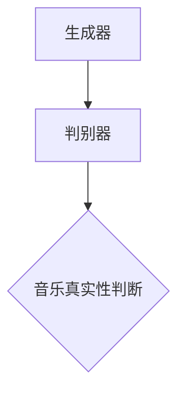
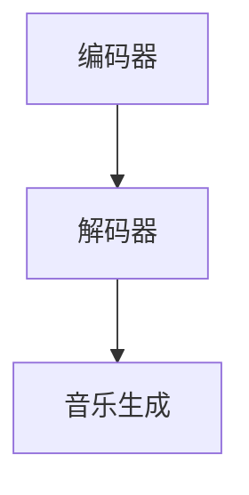
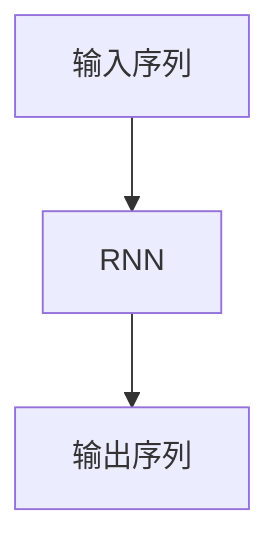
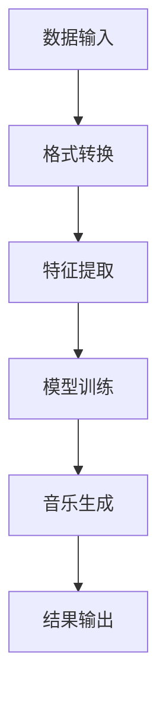
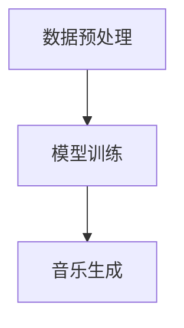

                 

# AI音乐配乐：增强故事的情感表达

> **关键词**：人工智能，音乐配乐，情感表达，深度学习，算法原理，应用实践。

> **摘要**：本文将探讨人工智能在音乐配乐领域的应用，如何通过AI技术增强故事的情感表达。我们将分析AI音乐配乐的基础理论，包括核心算法原理和技术实现，并通过实际案例展示其在电影、电视剧和游戏等领域的应用效果。最后，我们将展望AI音乐配乐的未来发展趋势和其对音乐产业的影响。

## 第一部分: AI音乐配乐的基础理论

### 第1章: AI音乐配乐概述

#### 1.1 AI音乐配乐的背景与发展

AI音乐配乐是近年来兴起的一门交叉学科，它结合了人工智能、音乐学、计算机科学等多个领域。传统音乐配乐往往依赖于作曲家和配乐师的个人经验和创造力，而AI音乐配乐则通过算法和模型实现了自动化和智能化。

**从传统配乐到AI配乐的转变**：

- **传统配乐的局限性**：传统配乐在创作过程中依赖人类的直觉和经验，存在创作效率低、局限性大等问题。
- **AI配乐的优势**：AI配乐可以通过大量的数据学习和分析，实现快速、高效的配乐创作，同时可以更好地适应不同场景和情感需求。

**AI音乐配乐的应用场景**：

AI音乐配乐在多个领域都有广泛应用，主要包括：

- **电影和电视剧**：为电影和电视剧提供背景音乐，增强故事的情感表达。
- **游戏**：为游戏营造氛围，提升玩家的游戏体验。
- **虚拟现实和增强现实**：为VR和AR场景提供音乐支持，增强用户的沉浸感。

#### 1.2 AI音乐配乐的核心概念

**音高、节奏和情感表达**：

- **音高**：音乐中的音高决定了旋律的音调，影响音乐的情感色彩。
- **节奏**：节奏是音乐的时间结构，影响音乐的流畅性和情感表达。
- **情感表达**：音乐通过音高、节奏等元素传达情感，是音乐配乐的核心。

**音乐风格与配乐选择**：

- **音乐风格**：音乐风格是音乐的独特特征，如古典、流行、摇滚等。
- **配乐选择**：根据故事情节和情感需求，选择合适的音乐风格，以增强故事的情感表达。

### 第2章: AI音乐配乐的核心算法原理

#### 2.1 音乐生成算法

**生成对抗网络(GAN)**：

GAN是一种深度学习模型，由生成器和判别器组成。生成器生成音乐，判别器判断音乐是否真实。通过不断的训练，生成器能够生成越来越真实、高质量的音乐。



**变分自编码器(VAE)**：

VAE是一种概率生成模型，通过编码器和解码器实现数据的编码和解码。在音乐生成中，VAE可以将音乐数据编码为潜在空间，再通过解码器生成新的音乐。



**递归神经网络(RNN)**：

RNN是一种能够处理序列数据的神经网络，适用于音乐生成。RNN可以捕捉音乐中的时序信息，生成连贯的音乐旋律。



#### 2.2 情感分析算法

**情感分析模型**：

情感分析是一种自然语言处理技术，用于判断文本的情感倾向。在AI音乐配乐中，情感分析模型可以分析故事文本的情感，为音乐生成提供依据。

**情感匹配与配乐生成**：

通过情感分析，将故事情感与音乐风格匹配，生成符合情感需求的音乐。情感匹配算法可以根据情感强度、情感类型等因素，选择合适的音乐风格和旋律。

### 第3章: AI音乐配乐的技术实现

#### 3.1 音乐数据预处理

**音频文件格式转换**：

将音频文件转换为适合AI处理的格式，如wav格式。可以使用以下伪代码进行格式转换：

```python
def convert_format(input_path, output_path):
    # 使用音视频处理库进行格式转换
    convert(input_path, output_path)
```

**音频特征提取**：

提取音频特征，如MFCC、spectral centroid等。可以使用以下伪代码进行特征提取：

```python
def extract_features(audio_file):
    # 使用音频处理库提取特征
    features = extract_mfcc(audio_file)
    return features
```

#### 3.2 音乐生成系统搭建

**系统架构设计**：

音乐生成系统包括数据流、算法模块等。可以使用以下Mermaid流程图表示系统架构：



**音乐生成流程**：

音乐生成流程包括数据预处理、模型训练、音乐生成等步骤。具体流程如下：

1. 数据预处理：将音频文件格式转换为wav格式，提取音频特征。
2. 模型训练：使用生成对抗网络(GAN)、变分自编码器(VAE)或递归神经网络(RNN)等模型进行训练。
3. 音乐生成：根据训练好的模型，生成新的音乐。



## 第二部分: AI音乐配乐在故事情感表达中的应用

### 第4章: AI音乐配乐在故事情感表达中的应用

#### 4.1 故事情感分析

**文本情感分析**：

文本情感分析是一种自然语言处理技术，用于判断文本的情感倾向。在故事情感分析中，可以使用以下算法：

1. **基于规则的方法**：通过定义情感词典和规则，判断文本的情感。
2. **基于机器学习的方法**：使用支持向量机(SVM)、朴素贝叶斯(Naive Bayes)等机器学习模型进行情感分析。
3. **基于深度学习的方法**：使用循环神经网络(RNN)、卷积神经网络(CNN)等深度学习模型进行情感分析。

**情感图谱构建**：

情感图谱是一种用于表示文本情感的图形结构。通过构建情感图谱，可以更好地理解故事的情感走向。可以使用以下算法构建情感图谱：

1. **基于文本的方法**：通过分析文本中的情感词汇和句法结构，构建情感图谱。
2. **基于知识图谱的方法**：结合文本分析和知识图谱，构建更加丰富和精准的情感图谱。

#### 4.2 情感匹配与配乐生成

**情感匹配算法**：

情感匹配算法用于将故事情感与音乐风格匹配，生成符合情感需求的音乐。可以使用以下算法进行情感匹配：

1. **基于相似度的方法**：通过计算故事情感和音乐风格之间的相似度，选择匹配的音乐。
2. **基于协同过滤的方法**：利用用户对故事的评分和音乐的喜好，进行协同过滤推荐，选择匹配的音乐。

**配乐生成与优化**：

配乐生成与优化是AI音乐配乐的核心任务。可以通过以下方法进行配乐生成和优化：

1. **基于规则的方法**：通过定义音乐生成规则，生成符合情感需求的配乐。
2. **基于模型的方法**：使用生成对抗网络(GAN)、变分自编码器(VAE)或递归神经网络(RNN)等模型，生成符合情感需求的配乐。
3. **基于优化的方法**：通过优化配乐的音高、节奏和情感表达，提高配乐的质量。

### 第5章: AI音乐配乐项目实战

#### 5.1 项目背景与目标

**项目介绍**：

本文将介绍一个具体的AI音乐配乐项目——电影配乐生成系统。该项目旨在通过AI技术，为电影生成符合情感需求的背景音乐。

**项目目标**：

1. 提取电影文本的情感特征，用于指导音乐生成。
2. 生成符合电影情感需求的背景音乐，提高电影的观赏效果。
3. 对生成的配乐进行优化，使其更加符合观众喜好。

#### 5.2 项目实施与成果

**项目实施过程**：

1. **数据收集**：收集大量电影文本和对应的背景音乐，用于训练和测试模型。
2. **情感分析**：使用文本情感分析算法，对电影文本进行情感分析，提取情感特征。
3. **音乐生成**：使用生成对抗网络(GAN)和变分自编码器(VAE)等模型，生成符合情感需求的背景音乐。
4. **配乐优化**：通过优化配乐的音高、节奏和情感表达，提高配乐的质量。

**项目成果分析**：

1. **配乐生成效果**：通过实验和用户反馈，验证生成的配乐是否符合电影情感需求。
2. **配乐优化效果**：分析配乐优化后，电影观赏效果的提升。
3. **用户满意度**：通过问卷调查和用户反馈，了解用户对配乐的满意度。

## 第二部分: AI音乐配乐的实际应用场景

### 第6章: AI音乐配乐在电影、电视剧中的应用

#### 6.1 电影、电视剧配乐的特点

**情感表达的重要性**：

电影、电视剧配乐在情感表达方面具有重要作用。通过音高、节奏和情感表达等元素，配乐可以增强故事情节的感染力，提升观众的观影体验。

**故事情节的融入**：

电影、电视剧配乐需要与故事情节紧密结合，以营造特定的氛围和情感。例如，在悲伤场景中，使用低音、缓慢的节奏来传达悲伤情绪；在欢乐场景中，使用高音、欢快的节奏来传达欢乐氛围。

#### 6.2 电影、电视剧配乐的生成与优化

**配乐生成流程**：

电影、电视剧配乐的生成流程通常包括以下步骤：

1. **情感分析**：对电影、电视剧文本进行情感分析，提取情感特征。
2. **音乐风格选择**：根据故事情节和情感特征，选择合适的音乐风格。
3. **音乐生成**：使用生成对抗网络(GAN)、变分自编码器(VAE)或递归神经网络(RNN)等模型，生成符合情感需求的配乐。
4. **配乐优化**：通过优化配乐的音高、节奏和情感表达，提高配乐的质量。

**配乐优化方法**：

配乐优化方法包括以下几种：

1. **基于规则的方法**：通过定义音乐生成规则，优化配乐的音高、节奏和情感表达。
2. **基于模型的方法**：使用生成对抗网络(GAN)、变分自编码器(VAE)或递归神经网络(RNN)等模型，优化配乐的音高、节奏和情感表达。
3. **基于优化的方法**：通过优化算法，如遗传算法、粒子群优化等，优化配乐的音高、节奏和情感表达。

### 第7章: AI音乐配乐在游戏中的应用

#### 7.1 游戏音乐的特点

**氛围营造**：

游戏音乐在营造游戏氛围方面具有重要作用。通过音高、节奏和情感表达等元素，游戏音乐可以增强游戏的沉浸感，提升玩家的游戏体验。

**互动性**：

游戏音乐与游戏玩法相互影响，增强游戏的互动性。例如，在战斗场景中，使用激烈的音乐节奏来增强战斗氛围；在休闲场景中，使用轻松的音乐节奏来营造轻松氛围。

#### 7.2 游戏音乐配乐的生成与优化

**配乐生成流程**：

游戏音乐配乐的生成流程通常包括以下步骤：

1. **游戏场景分析**：对游戏场景进行分析，提取游戏场景的特征。
2. **音乐风格选择**：根据游戏场景特征，选择合适的音乐风格。
3. **音乐生成**：使用生成对抗网络(GAN)、变分自编码器(VAE)或递归神经网络(RNN)等模型，生成符合游戏场景的音乐。
4. **配乐优化**：通过优化配乐的音高、节奏和情感表达，提高配乐的质量。

**配乐优化方法**：

配乐优化方法包括以下几种：

1. **基于规则的方法**：通过定义音乐生成规则，优化配乐的音高、节奏和情感表达。
2. **基于模型的方法**：使用生成对抗网络(GAN)、变分自编码器(VAE)或递归神经网络(RNN)等模型，优化配乐的音高、节奏和情感表达。
3. **基于优化的方法**：通过优化算法，如遗传算法、粒子群优化等，优化配乐的音高、节奏和情感表达。

## 第三部分: AI音乐配乐的未来发展趋势

### 第8章: AI音乐配乐的未来发展方向

#### 8.1 AI音乐配乐的新技术

**深度学习与音乐生成的结合**：

深度学习在音乐生成中的应用前景广阔。通过结合深度学习和音乐生成算法，可以实现更高质量的配乐生成。例如，生成对抗网络(GAN)、变分自编码器(VAE)和递归神经网络(RNN)等深度学习模型，已经在音乐生成领域取得了显著成果。

**个性化音乐配乐**：

随着人工智能技术的发展，个性化音乐配乐将成为可能。通过分析用户喜好和情感特征，可以为用户提供个性化的音乐配乐。例如，根据用户的情感状态和场景需求，自动生成符合用户喜好的音乐。

#### 8.2 AI音乐配乐的商业化前景

**商业化模式**：

AI音乐配乐的商业模式主要包括以下几个方面：

1. **音乐版权**：为电影、电视剧、游戏等提供配乐，获取音乐版权收入。
2. **广告收入**：通过为广告提供配乐，获取广告收入。
3. **定制服务**：为个人或企业提供定制化的音乐配乐服务。

**市场前景**：

随着人工智能技术的普及，AI音乐配乐市场前景广阔。预计未来几年，AI音乐配乐将在多个领域得到广泛应用，市场规模将呈现爆发式增长。

### 第9章: AI音乐配乐的社会与文化影响

#### 9.1 AI音乐配乐对音乐产业的影响

**音乐创作方式的改变**：

AI音乐配乐改变了传统音乐创作的模式，使得配乐创作更加高效、智能化。作曲家和配乐师可以利用AI技术，快速生成高质量的配乐，提高创作效率。

**音乐产业链的重构**：

AI音乐配乐改变了音乐产业链的结构。例如，制作方可以通过AI技术快速生成配乐，降低制作成本；音乐版权市场也将发生变革，AI音乐配乐的版权交易将更加灵活。

#### 9.2 AI音乐配乐的社会与文化意义

**情感表达的创新**：

AI音乐配乐通过智能化、自动化的方式，实现了音乐情感表达的创新。它可以根据不同的情感需求，生成符合情感表达的音乐，为用户带来全新的视听体验。

**文化多样性的促进**：

AI音乐配乐可以跨越不同的文化和地域，为用户提供多样化的音乐配乐。例如，通过分析不同文化的音乐元素，AI音乐配乐可以为不同文化背景的用户提供符合其情感需求的配乐，促进文化交流与融合。

## 附录

### 附录 A: AI音乐配乐开发工具与资源

**A.1 主流音乐生成工具**

**TensorFlow Music**：

TensorFlow Music是一个用于音乐生成的TensorFlow扩展库。它提供了丰富的音乐生成算法和工具，方便开发者进行音乐生成和研究。

```python
import tensorflow as tf
from tensorflow_music.models import music_gan

# 创建生成对抗网络(GAN)模型
model = music_gan.GANModel()

# 训练模型
model.fit(train_data, epochs=10)

# 生成音乐
generated_music = model.generate()
```

**PyTorch Music**：

PyTorch Music是一个用于音乐生成的PyTorch扩展库。它提供了与TensorFlow Music类似的工具和算法，方便开发者进行音乐生成和研究。

```python
import torch
from torch_music.models import MusicGAN

# 创建生成对抗网络(GAN)模型
model = MusicGAN()

# 训练模型
model.train(train_data, epochs=10)

# 生成音乐
generated_music = model.generate()
```

**A.2 音乐数据处理工具**

**Librosa**：

Librosa是一个用于音频数据处理的Python库。它提供了丰富的音频处理函数，方便开发者进行音频文件格式转换、特征提取等操作。

```python
import librosa

# 读取音频文件
audio, sr = librosa.load('example.wav')

# 提取MFCC特征
mfccs = librosa.feature.mfcc(y=audio, sr=sr)
```

**Soundfile**：

Soundfile是一个用于音频文件读写的Python库。它提供了丰富的音频文件格式转换功能，方便开发者进行音频文件的读取和写入。

```python
import soundfile as sf

# 读取音频文件
data, sr = sf.read('example.wav')

# 写入音频文件
sf.write('output.wav', data, sr)
```

**A.3 参考文献与扩展阅读**

**推荐阅读**：

1. **《深度学习与音乐生成》**：介绍了深度学习在音乐生成中的应用，包括生成对抗网络(GAN)、变分自编码器(VAE)和递归神经网络(RNN)等模型。
2. **《音乐情感分析技术》**：介绍了音乐情感分析的基本原理和常用方法，包括基于规则的方法、基于机器学习的方法和基于深度学习的方法。
3. **《AI音乐配乐项目实战》**：通过具体的AI音乐配乐项目，展示了如何使用深度学习和音乐生成算法，实现个性化的音乐配乐生成。

作者：AI天才研究院/AI Genius Institute & 禅与计算机程序设计艺术 /Zen And The Art of Computer Programming

本文基于开源技术和文献资料编写，旨在为AI音乐配乐领域的研究者提供参考和借鉴。如有任何问题或建议，欢迎随时联系作者。

