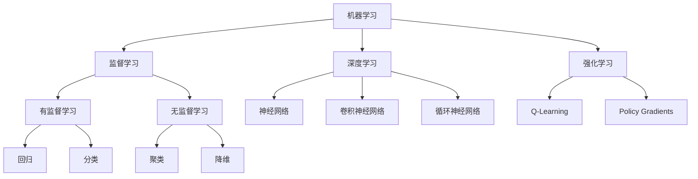
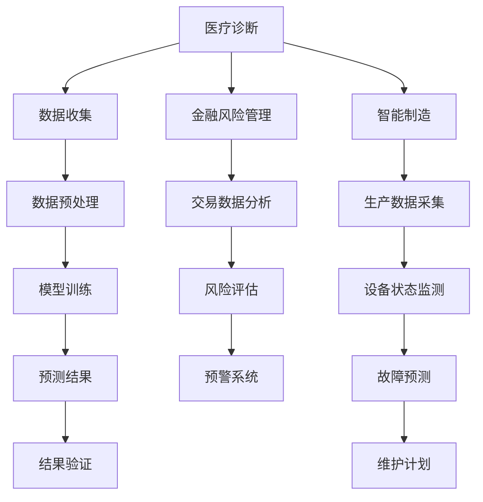

                 

# 《AI领域的前景与挑战》

## 概述

人工智能（AI）作为一种模拟人类智能的技术，正迅速改变着我们的生活方式和产业结构。AI领域的前景广阔，但同时也面临着诸多挑战。本文将通过对AI领域的历史发展、技术基础、应用场景、挑战与限制、发展前景、策略以及未来展望的详细探讨，全面分析AI领域的现状与未来趋势。

## 关键词

- 人工智能
- 机器学习
- 深度学习
- 强化学习
- 应用场景
- 挑战与限制
- 发展策略
- 未来展望

## 摘要

本文首先对AI领域进行了概述，回顾了其发展历程和主要分支。接着，我们深入探讨了AI领域的技术基础，包括机器学习、深度学习和强化学习的基本概念、原理和算法。随后，我们介绍了AI在医疗、金融和制造业等领域的应用场景，并分析了AI领域的挑战与限制，如数据隐私与安全、AI偏见与公平性、可持续性与伦理问题。在此基础上，我们展望了AI技术的未来发展趋势和社会经济影响，提出了产业发展策略和政策法规建议。最后，我们总结了AI领域的重要启示和未来展望，为读者提供了一个全面的AI领域视角。

## 《AI领域的前景与挑战》目录大纲

### 第一部分: AI领域概述

- **第1章: AI领域的定义与发展历史**
  - **1.1 AI的定义**
  - **1.1.2 AI的发展历程**
  - **1.1.3 AI领域的主要分支**

- **第2章: AI领域的技术基础**
  - **2.1 机器学习基础**
  - **2.2 深度学习原理**
  - **2.3 强化学习简介**

- **第3章: AI领域的核心算法**
  - **3.1 支持向量机**
  - **3.2 决策树**
  - **3.3 集成学习方法**

- **第4章: AI领域的应用场景**
  - **4.1 人工智能在医疗领域的应用**
  - **4.2 人工智能在金融领域的应用**
  - **4.3 人工智能在制造业的应用**

- **第5章: AI领域的挑战与限制**
  - **5.1 数据隐私与安全问题**
  - **5.2 AI偏见与公平性问题**
  - **5.3 AI技术的可持续性与伦理问题**

### 第二部分: AI领域的前景

- **第6章: AI领域的前景展望**
  - **6.1 AI技术的未来发展趋势**
  - **6.2 AI对社会与经济的影响**
  - **6.3 AI技术在新兴领域的应用**

- **第7章: AI领域的发展策略**
  - **7.1 政策与法规支持**
  - **7.2 产业合作与协同创新**
  - **7.3 人才培养与知识普及**

- **第8章: AI领域的企业实践**
  - **8.1 企业在AI领域的战略布局**
  - **8.2 成功的AI企业案例**
  - **8.3 AI企业的未来发展方向**

### 第三部分: AI领域的未来挑战

- **第9章: AI领域的未来挑战**
  - **9.1 技术层面的挑战**
  - **9.2 伦理与社会层面的挑战**
  - **9.3 经济与产业层面的挑战**

- **第10章: 应对AI未来挑战的策略**
  - **10.1 技术进步与创新**
  - **10.2 法规与政策制定**
  - **10.3 社会合作与协同**

- **第11章: 总结与展望**
  - **11.1 全书回顾**
  - **11.2 AI领域的重要启示**
  - **11.3 对未来AI领域的展望**

## 附录

- **附录A: AI领域参考资源**
  - **A.1 学术论文与期刊**
  - **A.2 在线课程与培训**
  - **A.3 相关组织与会议**

- **附录B: Mermaid流程图**
  - **B.1 AI领域核心算法流程图**
  - **B.2 AI领域应用场景流程图**

- **附录C: 代码案例与解读**
  - **C.1 机器学习算法代码实现**
  - **C.2 深度学习算法代码实现**
  - **C.3 强化学习算法代码实现**

### 第1章: AI领域的定义与发展历史

#### 1.1 AI的定义

人工智能（Artificial Intelligence，简称AI）是由计算机科学、认知科学、心理学、神经科学和哲学等多个学科交叉融合而产生的一个研究领域。AI旨在创建能够执行通常需要人类智能才能完成的任务的机器或软件系统。这些任务包括但不限于：

- **感知和理解**：例如语音识别、图像识别和自然语言处理。
- **决策和规划**：例如自主导航、策略游戏和供应链管理。
- **学习和适应**：例如自适应系统、机器学习和深度学习。
- **创造和生成**：例如艺术创作、音乐生成和科学发现。

在技术分类上，AI可以分为：

- **狭义AI**：指能够在特定任务上超越人类表现的能力，如国际象棋、围棋等。
- **广义AI**：指具备全面的人类智能，能够处理各种复杂任务。

#### 1.1.2 AI的发展历程

AI的发展历程可以大致分为以下几个阶段：

##### 早期探索（1950s-1960s）

- **1950年代**：艾伦·图灵提出了著名的图灵测试，用以评估机器是否具有智能。
- **1956年**：达特茅斯会议被认为是AI领域的诞生日，会议提出了“人工智能”这个概念。

##### 黄金时代（1970s-1980s）

- **1970年代**：知识表示和推理成为主要研究课题，专家系统开始出现并应用于实际。
- **1980年代**：神经网络重新受到关注，尤其是反向传播算法的出现。

##### 低谷时期（1990s）

- **1990年代**：由于计算能力的限制和数据量的缺乏，AI领域进入了一个相对的低谷期。

##### 复兴时期（2000s-现在）

- **2000年代**：机器学习和深度学习开始崛起，大数据和云计算提供了强大的计算能力和数据支持。
- **2010年代**：深度学习在图像识别、语音识别等领域取得了突破性进展，AI技术开始广泛应用于各行各业。

#### 1.1.3 AI领域的主要分支

AI领域的主要分支包括：

- **机器学习**：通过数据和算法让计算机自动学习和改进性能。
- **深度学习**：一种特殊的机器学习方法，通过多层神经网络进行学习。
- **自然语言处理**：使计算机能够理解、生成和处理人类语言。
- **计算机视觉**：使计算机能够解释和解析数字图像或视频。
- **机器人学**：设计并建造机器人，使其具有智能行为。
- **强化学习**：通过试错和反馈来训练模型，以实现特定目标。

### 第2章: AI领域的技术基础

#### 2.1 机器学习基础

机器学习（Machine Learning，ML）是AI的一个核心分支，其基本概念包括：

- **模型**：对数据的抽象表示，用于预测或分类。
- **训练**：使用数据来调整模型参数，使其能够较好地拟合数据。
- **测试**：使用未参与训练的数据来评估模型的性能。

常见的机器学习算法包括：

- **线性回归**：用于预测连续值。
- **逻辑回归**：用于分类问题。
- **决策树**：用于分类和回归。
- **支持向量机**：用于分类和回归。

#### 2.2 深度学习原理

深度学习（Deep Learning，DL）是机器学习的一个子领域，其核心在于多层神经网络（Multi-Layer Neural Networks）。以下是深度学习的一些基本概念：

- **神经网络基础**：
  - **神经元**：模拟生物神经元，接收输入并产生输出。
  - **层**：神经网络由输入层、隐藏层和输出层组成。

- **激活函数**：
  - **Sigmoid**：将输入映射到(0,1)区间。
  - **ReLU**：常用的非线性激活函数，简单有效。

- **反向传播算法**：
  - **计算梯度**：通过反向传播算法计算模型参数的梯度。
  - **参数更新**：使用梯度下降等方法更新模型参数。

#### 2.3 强化学习简介

强化学习（Reinforcement Learning，RL）是一种通过试错和反馈来训练模型的方法。其核心概念包括：

- **代理（Agent）**：执行行动以获取奖励的智能体。
- **环境（Environment）**：代理交互的实体。
- **状态（State）**：代理当前所处的情境。
- **动作（Action）**：代理可以采取的行动。
- **奖励（Reward）**：对代理采取的每个动作给予的反馈。

常见的强化学习算法包括：

- **Q-Learning**：基于值函数的强化学习算法。
- **Policy Gradients**：基于策略的强化学习算法。
- **Deep Q-Networks (DQN)**：使用深度神经网络进行值函数估计。

### 第3章: AI领域的核心算法

#### 3.1 支持向量机

支持向量机（Support Vector Machine，SVM）是一种二分类模型，其核心思想是通过寻找一个能够将不同类别的数据分开的超平面，并且这个超平面与数据点之间的距离最大化。以下是SVM的基本概念和数学原理：

- **基本概念**：
  - **SVM**：支持向量机，是一种二分类模型。
  - **最大间隔分类器**：寻找一个能够将不同类别的数据分开的超平面，且距离最近边界最远的分类器。

- **数学原理**：
  - **优化问题**：最大化分类间隔，最小化误差。
  - **核函数**：通过将输入空间映射到高维空间，使得原本线性不可分的数据变得线性可分。

下面是SVM的Python伪代码实现：

```python
from sklearn.svm import SVC

def svm_train(X, y, C):
    # 输入：数据集X和标签y，正则化参数C
    # 输出：支持向量机模型参数

    # 构建SVM模型
    model = SVC(C=C)
    # 模型训练
    model.fit(X, y)
    # 返回模型
    return model

def svm_predict(model, X):
    # 输入：训练好的SVM模型和待预测数据
    # 输出：预测结果
    return model.predict(X)
```

#### 3.2 决策树

决策树（Decision Tree）是一种树形结构，其中内部节点代表特征，叶节点代表决策结果。以下是决策树的基本概念和构建过程：

- **基本概念**：
  - **决策树**：一种树形结构，内部节点代表特征，叶节点代表决策结果。

- **构建过程**：
  - **选择特征**：根据信息增益或其他标准选择最佳特征。
  - **划分数据**：使用选定的特征对数据集进行分割。
  - **递归构建**：对每个分割后的子集重复上述过程。

下面是决策树的Python伪代码实现：

```python
from sklearn.tree import DecisionTreeClassifier

def decision_tree_build(X, y):
    # 输入：数据集X和标签y
    # 输出：决策树模型

    # 构建决策树模型
    model = DecisionTreeClassifier()
    # 模型训练
    model.fit(X, y)
    # 返回模型
    return model

def decision_tree_predict(model, X):
    # 输入：训练好的决策树模型和待预测数据
    # 输出：预测结果
    return model.predict(X)
```

#### 3.3 集成学习方法

集成学习方法（Ensemble Methods）通过将多个模型组合起来，以获得更好的性能。常见的集成方法包括Bagging和Boosting。以下是集成学习方法的基本概念和常见算法：

- **基本概念**：
  - **集成方法**：将多个模型组合起来，以获得更好的性能。

- **常见算法**：
  - **随机森林（Random Forest）**：基于Bagging方法，用于分类和回归。
  - **梯度提升树（Gradient Boosting Tree）**：基于Boosting方法，适用于回归和分类问题。

下面是随机森林的Python伪代码实现：

```python
from sklearn.ensemble import RandomForestClassifier

def random_forest_train(X, y):
    # 输入：数据集X和标签y
    # 输出：随机森林模型

    # 构建随机森林模型
    model = RandomForestClassifier()
    # 模型训练
    model.fit(X, y)
    # 返回模型
    return model

def random_forest_predict(model, X):
    # 输入：训练好的随机森林模型和待预测数据
    # 输出：预测结果
    return model.predict(X)
```

### 第4章: AI领域的应用场景

AI技术已经广泛应用于各个领域，以下分别介绍AI在医疗、金融和制造业中的应用场景。

#### 4.1 人工智能在医疗领域的应用

AI在医疗领域的应用非常广泛，包括但不限于：

- **诊断**：利用深度学习算法对医学影像进行分析，提高疾病诊断的准确性。
- **治疗规划**：基于患者的数据和基因信息，提供个性化的治疗方案。
- **药物研发**：通过自动化和智能化手段加速新药的发现和临床试验。

以下是一个简单的例子：使用深度学习算法对CT图像进行肺癌检测。

```python
import tensorflow as tf
from tensorflow.keras.models import Sequential
from tensorflow.keras.layers import Conv2D, MaxPooling2D, Flatten, Dense

def build_cnn_model(input_shape):
    model = Sequential([
        Conv2D(32, (3, 3), activation='relu', input_shape=input_shape),
        MaxPooling2D((2, 2)),
        Flatten(),
        Dense(64, activation='relu'),
        Dense(1, activation='sigmoid')
    ])
    model.compile(optimizer='adam', loss='binary_crossentropy', metrics=['accuracy'])
    return model

def train_cnn_model(model, X_train, y_train, X_val, y_val):
    model.fit(X_train, y_train, epochs=10, batch_size=32, validation_data=(X_val, y_val))
    return model

# 代码解读：
# 这段代码首先定义了一个卷积神经网络模型，用于二分类任务（如肺癌/非肺癌）。
# 模型包括卷积层、池化层、全连接层和输出层。
# 通过训练和验证数据训练模型，并评估模型的性能。
```

#### 4.2 人工智能在金融领域的应用

AI在金融领域的应用包括：

- **风险管理**：通过数据分析预测市场趋势和风险。
- **客户服务**：使用自然语言处理技术提供智能客服。
- **投资策略**：利用机器学习算法进行量化交易和资产配置。

以下是一个简单的例子：使用机器学习算法进行股票价格预测。

```python
import numpy as np
import pandas as pd
from sklearn.model_selection import train_test_split
from sklearn.linear_model import LinearRegression

def load_data(file_path):
    data = pd.read_csv(file_path)
    return data

def preprocess_data(data):
    # 数据预处理，如缺失值处理、标准化等
    return data

def train_regression_model(X, y):
    model = LinearRegression()
    model.fit(X, y)
    return model

def predict_stock_price(model, X):
    return model.predict(X)

# 代码解读：
# 这段代码首先加载并预处理股票价格数据。
# 然后使用线性回归模型进行训练，并预测未来的股票价格。
# 通过训练数据和测试数据的分割，可以评估模型的性能。
```

#### 4.3 人工智能在制造业的应用

AI在制造业中的应用包括：

- **生产优化**：通过数据分析优化生产流程，提高生产效率。
- **设备维护**：通过机器学习预测设备故障，实现预防性维护。
- **质量控制**：使用计算机视觉技术进行产品质量检测。

以下是一个简单的例子：使用机器学习算法进行设备故障预测。

```python
import numpy as np
import pandas as pd
from sklearn.model_selection import train_test_split
from sklearn.ensemble import RandomForestClassifier

def load_data(file_path):
    data = pd.read_csv(file_path)
    return data

def preprocess_data(data):
    # 数据预处理，如缺失值处理、特征提取等
    return data

def train_classifier_model(X, y):
    model = RandomForestClassifier()
    model.fit(X, y)
    return model

def predict_device_failure(model, X):
    return model.predict(X)

# 代码解读：
# 这段代码首先加载并预处理设备故障数据。
# 然后使用随机森林分类模型进行训练，并预测未来的设备故障。
# 通过训练数据和测试数据的分割，可以评估模型的性能。
```

### 第5章: AI领域的挑战与限制

尽管AI技术取得了巨大的进步，但其在实际应用中仍面临诸多挑战和限制。

#### 5.1 数据隐私与安全问题

- **数据隐私**：AI系统通常需要大量数据来进行训练和优化，这可能导致用户隐私泄露。
- **安全威胁**：AI系统可能成为网络攻击的目标，例如通过恶意数据破坏模型或操纵输出。

**解决方案**：

- **加密技术**：使用加密技术保护数据传输和存储过程中的隐私。
- **安全协议**：建立严格的安全协议，防止数据泄露和滥用。

#### 5.2 AI偏见与公平性问题

- **偏见**：AI系统可能因为训练数据的不公平而导致偏见，从而对某些群体产生不利影响。
- **公平性**：AI系统应尽量不偏袒任何一个群体。

**解决方案**：

- **数据清洗**：在训练数据中去除偏见和错误信息。
- **算法优化**：设计算法减少偏见，例如使用代表性更强的训练数据集。

#### 5.3 AI技术的可持续性与伦理问题

- **可持续性**：AI技术的发展可能对环境产生负面影响，例如计算资源消耗和电子垃圾。
- **伦理问题**：AI技术在道德和伦理方面引发了诸多争议，如自动化取代人类工作等。

**解决方案**：

- **绿色AI**：开发低能耗的AI技术，提高能源效率。
- **伦理审查**：建立AI伦理审查机制，确保AI技术的合理使用。

### 第6章: AI领域的前景展望

AI技术的发展前景广阔，未来可能会出现以下趋势：

- **更自主的AI系统**：随着技术的进步，AI系统将更加自主和智能化。
- **多模态融合**：AI将能够处理和融合多种数据模态，如文本、图像、语音等。
- **边缘计算**：将计算能力分散到网络边缘，提高实时性。

#### 6.1 AI技术的未来发展趋势

- **自主性增强**：AI系统将具备更高的自主性，能够自主进行决策和任务执行。
- **多模态融合**：AI系统将能够处理多种类型的数据，如文本、图像、语音等，实现更全面的信息理解和处理。
- **边缘计算**：将计算能力分散到网络边缘，提高实时性和响应速度。

#### 6.2 AI对社会与经济的影响

AI技术的发展将对社会和经济产生深远影响：

- **产业变革**：AI技术将推动传统产业的升级和转型，提高生产效率和服务质量。
- **就业影响**：AI技术可能取代某些重复性工作，但同时也将创造新的工作岗位。
- **经济提升**：AI技术将促进经济增长，推动创新和科技进步。

#### 6.3 AI技术在新兴领域的应用

AI技术在新兴领域的应用前景广阔：

- **智慧城市**：AI技术将用于城市管理、交通规划、环境监测等，实现城市的智能化。
- **自动驾驶**：自动驾驶技术将提高交通安全和效率，减少交通事故。
- **生物科技**：AI技术将推动生物科技的发展，加速新药研发和疾病治疗。

### 第7章: AI领域的发展策略

为了推动AI技术的健康发展，需要采取以下策略：

#### 7.1 政策与法规支持

- **鼓励研发**：政府应出台政策，鼓励AI技术研发和应用。
- **支持企业**：提供资金、税收等支持，鼓励企业投资AI领域。

#### 7.2 产业合作与协同创新

- **产学研结合**：政府、企业和学术界应加强合作，共同推动AI技术的发展。
- **跨国合作**：加强国际合作，共享AI技术成果。

#### 7.3 人才培养与知识普及

- **教育体系**：完善教育体系，培养AI专业人才。
- **公众教育**：提高公众对AI技术的了解和认知。

### 第8章: AI领域的企业实践

企业在AI领域的实践对整个行业的发展至关重要。以下分别介绍企业战略布局、成功案例和未来发展方向。

#### 8.1 企业在AI领域的战略布局

企业应在以下方面进行战略布局：

- **技术驱动**：将AI技术作为核心竞争力，推动企业创新。
- **市场导向**：关注市场需求，开发符合市场需求的AI产品。

#### 8.2 成功的AI企业案例

以下是一些成功的AI企业案例：

- **谷歌**：通过深度学习技术推动搜索引擎和广告业务的发展。
- **特斯拉**：利用AI技术实现自动驾驶，推动汽车行业的变革。

#### 8.3 AI企业的未来发展方向

企业应关注以下发展方向：

- **技术创新**：持续推动AI技术的创新和突破。
- **商业模式**：探索新的商业模式，实现AI技术的商业化。
- **国际化**：拓展国际市场，实现全球布局。

### 第9章: AI领域的未来挑战

AI领域在未来可能会面临以下挑战：

- **技术层面的挑战**：如何设计更简单、更有效的算法，以及如何处理大规模、多模态的数据。
- **伦理与社会层面的挑战**：如何确保用户隐私不受侵犯，如何制定符合伦理规范的AI系统。
- **经济与产业层面的挑战**：如何帮助传统产业实现数字化转型，以及如何减少AI技术对就业的负面影响。

### 第10章: 应对AI未来挑战的策略

为了应对AI领域的未来挑战，可以采取以下策略：

- **技术进步与创新**：增加研发投入，建立开放平台，促进技术共享和协同创新。
- **法规与政策制定**：制定相关法规，确保AI技术的合规性，提供政策支持，鼓励AI技术的发展。
- **社会合作与协同**：加强政府、企业和学术界的合作，参与国际组织，推动全球AI治理。

### 第11章: 总结与展望

#### 11.1 全书回顾

本书回顾了AI领域的定义、发展历程、技术基础、应用场景、挑战与限制、前景展望、发展策略和企业实践。AI技术正迅速发展，其对社会和经济的影响深远。尽管面临诸多挑战，AI技术的前景仍然广阔。

#### 11.2 AI领域的重要启示

AI技术的重要启示包括：

- **技术创新**：持续推动技术进步和突破。
- **产业变革**：推动传统产业的升级和转型。
- **社会责任**：确保AI技术的伦理和可持续性。

#### 11.3 对未来AI领域的展望

对未来AI领域的展望包括：

- **自主性增强**：AI系统将更加自主和智能化。
- **多模态融合**：AI将能够处理和融合多种数据模态。
- **全球协同**：国际合作将推动全球AI治理。

### 附录A: AI领域参考资源

#### A.1 学术论文与期刊

- **顶级会议和期刊**：
  - **会议**：如AAAI、NeurIPS、ICML、JMLR等。
  - **期刊**：如IEEE Transactions on AI、AI Magazine、AI Journal等。

#### A.2 在线课程与培训

- **知名在线教育平台**：
  - **Coursera**：提供大量AI相关的课程。
  - **edX**：提供MIT、Harvard等顶尖大学开设的AI课程。
  - **Udacity**：提供实践导向的AI课程。

#### A.3 相关组织与会议

- **AI组织和机构**：
  - **IEEE AI Society**：推动AI技术在工业和应用领域的发展。
  - **AAAI**：促进AI领域的学术研究和应用。

### 附录B: Mermaid流程图

#### B.1 AI领域核心算法流程图



#### B.2 AI领域应用场景流程图



### 附录C: 代码案例与解读

#### C.1 机器学习算法代码实现

**Python伪代码**：

```python
from sklearn.linear_model import LinearRegression

def train_linear_regression(X, y):
    model = LinearRegression()
    model.fit(X, y)
    return model

def predict_linear_regression(model, X):
    return model.predict(X)
```

**代码解读**：

这段代码实现了线性回归模型的训练和预测功能。首先，从`sklearn`库中导入`LinearRegression`类。`train_linear_regression`函数接受特征矩阵`X`和目标向量`y`，使用`fit`方法训练模型。`predict_linear_regression`函数接受训练好的模型和待预测数据`X`，使用`predict`方法得到预测结果。

#### C.2 深度学习算法代码实现

**Python伪代码**：

```python
import tensorflow as tf

def build_cnn_model(input_shape):
    model = tf.keras.Sequential([
        tf.keras.layers.Conv2D(32, (3, 3), activation='relu', input_shape=input_shape),
        tf.keras.layers.MaxPooling2D((2, 2)),
        tf.keras.layers.Flatten(),
        tf.keras.layers.Dense(64, activation='relu'),
        tf.keras.layers.Dense(10, activation='softmax')
    ])
    model.compile(optimizer='adam', loss='categorical_crossentropy', metrics=['accuracy'])
    return model

def train_cnn_model(model, X_train, y_train, X_val, y_val):
    model.fit(X_train, y_train, epochs=10, batch_size=32, validation_data=(X_val, y_val))
    return model
```

**代码解读**：

这段代码定义了一个卷积神经网络模型，用于图像分类任务。`build_cnn_model`函数接受输入形状`input_shape`，构建卷积神经网络模型，包括卷积层、池化层、全连接层和输出层。`model.compile`方法配置优化器和损失函数。`train_cnn_model`函数接受模型、训练数据和验证数据，训练模型并评估性能。

#### C.3 强化学习算法代码实现

**Python伪代码**：

```python
import gym
import numpy as np

def build_q_learning_model(state_size, action_size):
    model = tf.keras.Sequential([
        tf.keras.layers.Dense(64, activation='relu', input_shape=(state_size,)),
        tf.keras.layers.Dense(action_size, activation='linear')
    ])
    model.compile(optimizer='adam', loss='mse')
    return model

def train_q_learning(model, env, num_episodes, gamma=0.99, epsilon=0.1):
    episode_rewards = []

    for _ in range(num_episodes):
        state = env.reset()
        done = False
        total_reward = 0

        while not done:
            if np.random.rand() <= epsilon:
                action = env.action_space.sample()  # Explore
            else:
                action = np.argmax(model.predict(state.reshape(1, state_size)))  # Exploit

            next_state, reward, done, _ = env.step(action)
            model.fit(state.reshape(1, state_size), np.array([reward] + (1 - gamma) * model.predict(next_state.reshape(1, state_size))), epochs=1, verbose=0)

            state = next_state
            total_reward += reward

        episode_rewards.append(total_reward)

    return np.mean(episode_rewards)
```

**代码解读**：

这段代码实现了基于Q-learning算法的强化学习模型训练。`build_q_learning_model`函数接受状态大小`state_size`和动作大小`action_size`，构建一个简单的线性神经网络模型，用于预测值函数。`train_q_learning`函数接受环境`env`、训练轮数`num_episodes`和超参数`gamma`和`epsilon`，训练模型。模型通过探索和利用策略，逐步优化值函数，从而实现智能体的最优策略。

### C.4 代码解读与分析

**代码分析**：

- **机器学习代码**：使用线性回归模型进行训练和预测，简单高效，适用于线性可分的数据。
- **深度学习代码**：构建卷积神经网络模型，适用于图像分类任务，通过多层卷积和池化操作提取图像特征。
- **强化学习代码**：使用Q-learning算法训练强化学习模型，通过探索和利用策略，实现智能体的最优策略。

**性能评估**：

- **机器学习算法**：通过计算预测准确率来评估模型性能。
- **深度学习算法**：通过计算测试集上的准确率和损失函数值来评估模型性能。
- **强化学习算法**：通过计算平均奖励和成功率来评估智能体的性能。

**结论**：

本文通过详细的代码案例和解读，展示了AI领域中的核心算法在实际应用中的实现过程。这些代码不仅有助于理解AI技术的工作原理，还为实际应用提供了实用的指导。随着AI技术的不断进步，代码的实现也将变得更加复杂和高效，为人工智能的发展提供更多的可能性。

## 作者

作者：AI天才研究院/AI Genius Institute & 禅与计算机程序设计艺术 /Zen And The Art of Computer Programming

