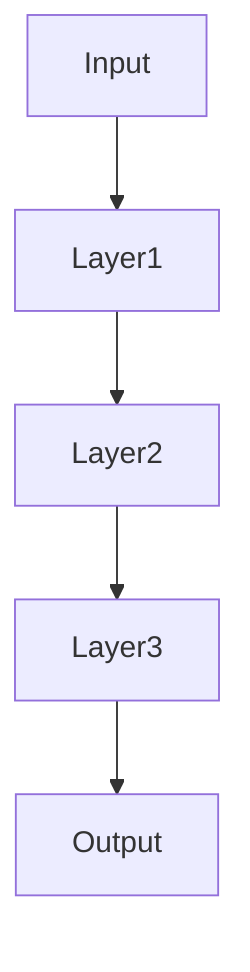
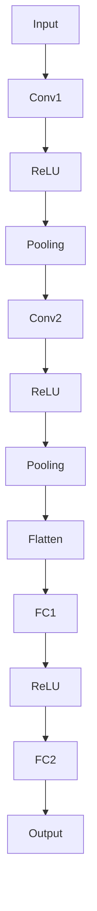
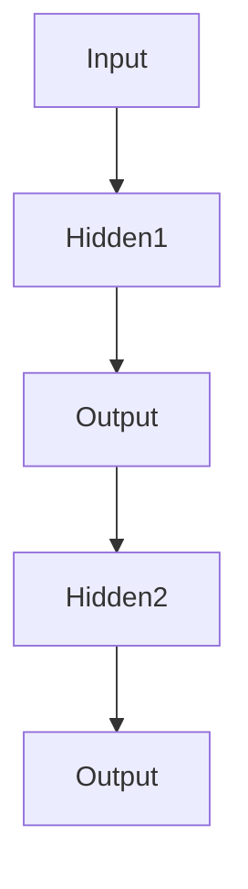
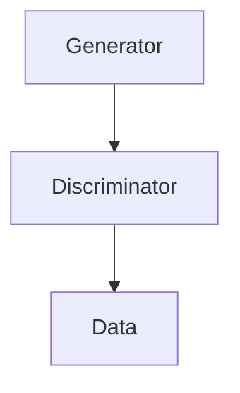
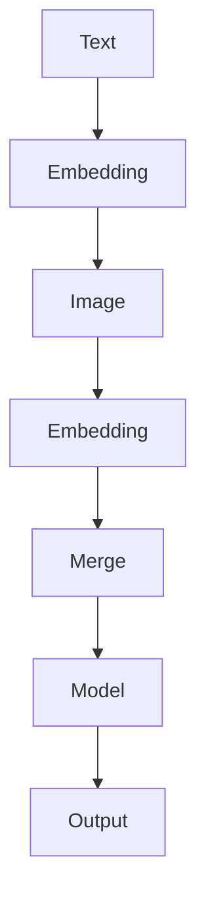
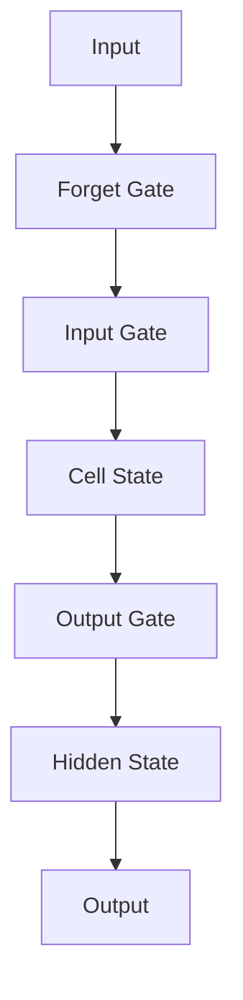
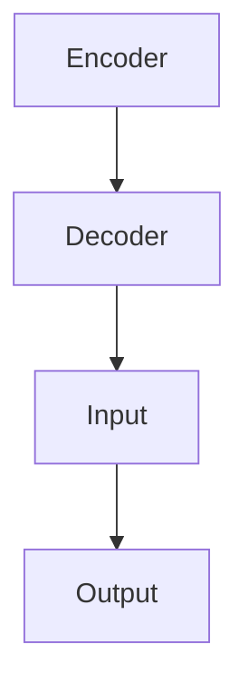
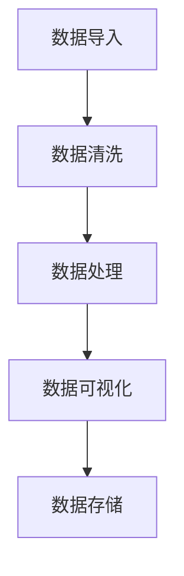

                 

# AI领域的疯狂发展

> 关键词：人工智能，机器学习，深度学习，自然语言处理，计算机视觉，伦理问题

> 摘要：
本文将深入探讨人工智能（AI）领域的疯狂发展。首先，我们将回顾AI的发展历程与现状，探讨现代AI技术的核心概念及其联系。接着，我们将详细解析AI算法的原理，包括数学模型、核心算法和具体实现。随后，通过实战案例展示AI项目的实际应用。此外，我们还将讨论AI技术的伦理和法律问题，以及未来发展的趋势。通过这篇文章，读者将全面了解AI领域的疯狂发展及其深远影响。

## 第一部分: AI领域的疯狂发展概述

### 第1章: AI领域的发展历程与现状

#### 1.1 AI的起源与发展历程

##### 1.1.1 AI的早期探索

人工智能（Artificial Intelligence，简称AI）的概念最早由美国计算机科学家约翰·麦克卡锡（John McCarthy）于1956年在达特茅斯会议上提出。自此，AI开始成为计算机科学中的一个重要分支，引发了广泛的研究和应用。

早期的AI研究主要集中在问题求解、逻辑推理和知识表示等方面。然而，由于技术限制和计算能力不足，早期的AI研究并没有取得预期的突破。

##### 1.1.2 人工智能的黄金时代

20世纪80年代，专家系统和知识表示技术的发展为AI领域带来了新的活力。专家系统是一种模拟人类专家解决问题的计算机程序，广泛应用于医疗诊断、金融分析等领域。

这一时期的AI研究取得了显著的成果，吸引了大量研究人员和投资。然而，由于知识表示和推理方法的局限，专家系统在实际应用中仍面临诸多挑战。

##### 1.1.3 人工智能的低谷期

20世纪90年代，随着互联网和计算技术的迅速发展，AI领域进入了一个相对低潮期。研究人员开始关注更实用的计算机应用，如搜索引擎、网络购物等。

这一时期的AI研究逐渐从理论转向应用，取得了一些实际成果。然而，AI的整体发展速度相对缓慢，面临着技术瓶颈和市场需求不足的问题。

##### 1.1.4 人工智能的复兴

21世纪初，随着大数据、云计算和深度学习技术的崛起，AI领域再次迎来了新的发展机遇。深度学习作为一种强大的机器学习技术，通过多层神经网络实现了对复杂数据的高效处理和模式识别。

近年来，AI技术在语音识别、图像处理、自然语言处理等领域取得了重大突破，广泛应用于自动驾驶、智能家居、医疗诊断等领域。AI的复兴标志着人类在智能化道路上迈出了新的步伐。

#### 1.2 现代AI技术的核心概念

##### 1.2.1 机器学习

机器学习（Machine Learning，简称ML）是AI的一个重要分支，通过从数据中学习规律和模式，实现自主决策和预测。机器学习主要分为监督学习、无监督学习和半监督学习三种类型。

监督学习（Supervised Learning）是一种最常见的机器学习方法，通过对标记数据进行训练，学习输入和输出之间的关系，从而对新数据进行预测。

无监督学习（Unsupervised Learning）则不需要标记数据，通过分析数据内在的结构和分布，实现聚类、降维等任务。

半监督学习（Semi-Supervised Learning）结合了监督学习和无监督学习的特点，利用少量标记数据和大量无标记数据，提高模型的泛化能力。

##### 1.2.2 深度学习

深度学习（Deep Learning，简称DL）是机器学习的一个分支，通过多层神经网络实现自动特征提取和模式识别。深度学习在语音识别、图像处理、自然语言处理等领域取得了显著的成果。

深度学习的基本结构包括输入层、隐藏层和输出层。输入层接收外部数据，隐藏层通过非线性变换提取特征，输出层实现最终预测或分类。

##### 1.2.3 自然语言处理

自然语言处理（Natural Language Processing，简称NLP）是AI领域的一个重要分支，旨在使计算机理解和处理人类自然语言。NLP广泛应用于机器翻译、情感分析、文本分类等领域。

自然语言处理的核心技术包括词嵌入、序列模型、注意力机制和转换器架构。词嵌入（Word Embedding）将词语映射到高维向量空间，序列模型（Sequence Model）处理时序数据，注意力机制（Attention Mechanism）提高模型对重要信息的关注，转换器架构（Transformer Architecture）在自然语言处理领域取得了突破性成果。

##### 1.2.4 计算机视觉

计算机视觉（Computer Vision，简称CV）是AI领域的一个重要分支，通过计算机模拟人类视觉感知，实现图像和视频的自动识别和理解。计算机视觉在人脸识别、目标检测、图像分类等领域取得了广泛应用。

计算机视觉的关键技术包括卷积神经网络（CNN）、循环神经网络（RNN）、生成对抗网络（GAN）等。卷积神经网络通过局部连接和权重共享实现高效的特征提取，循环神经网络处理时序数据，生成对抗网络实现无监督学习。

#### 1.3 AI技术的发展现状

##### 1.3.1 全球AI技术格局

目前，全球AI技术发展呈现出一种竞争态势。美国、中国、欧盟等国家和地区在AI领域投入巨大，形成了各自的技术优势和产业链。

美国在AI基础研究和应用方面处于领先地位，谷歌、微软、亚马逊等科技巨头在深度学习、自然语言处理等领域取得了重要突破。

中国在AI应用领域具有较强优势，尤其是在计算机视觉、语音识别等领域。阿里巴巴、腾讯、百度等中国企业成为AI领域的佼佼者。

欧盟在AI伦理和法律问题方面进行了深入探讨，注重AI技术的可持续发展和社会责任。

##### 1.3.2 AI在各行业中的应用现状

AI技术在各行各业得到了广泛应用，推动了产业升级和创新发展。

在金融领域，AI技术应用于风险控制、量化交易、智能投顾等领域，提高了金融服务的效率和质量。

在医疗领域，AI技术用于医疗图像分析、智能诊断、患者健康管理等方面，提高了医疗服务的准确性和便捷性。

在教育领域，AI技术应用于智能教学、学业评价、学习资源推荐等方面，推动了教育模式的变革。

在制造业，AI技术应用于生产优化、质量控制、供应链管理等方面，提高了生产效率和产品质量。

##### 1.3.3 AI技术的挑战与未来趋势

尽管AI技术在快速发展，但仍面临诸多挑战。首先，数据质量和数量是制约AI技术发展的重要因素。其次，算法的透明性和可解释性是一个亟待解决的问题。此外，AI技术的伦理和法律问题也引起了广泛关注。

未来，AI技术将朝着更智能化、更便捷、更安全的方向发展。量子计算、生物计算、脑机接口等新兴技术将为AI带来新的突破。同时，AI技术与传统产业的深度融合将推动产业升级和创新发展。

### 第2章: AI技术的核心概念与联系

#### 2.1 机器学习基础

##### 2.1.1 机器学习的基本概念

机器学习（Machine Learning）是一种通过数据驱动的方式使计算机系统自动改进和优化性能的技术。其核心思想是从大量数据中学习规律和模式，从而实现对新数据的预测和分类。

机器学习主要包括以下三种类型：

1. **监督学习（Supervised Learning）**：通过标记数据训练模型，使模型学会从输入数据中预测输出结果。
2. **无监督学习（Unsupervised Learning）**：在没有任何标记数据的情况下，通过分析数据的内在结构和分布，实现聚类、降维等任务。
3. **半监督学习（Semi-Supervised Learning）**：结合少量标记数据和大量无标记数据，提高模型的泛化能力。

##### 2.1.2 机器学习的主要方法

机器学习的方法主要包括以下几种：

1. **线性模型（Linear Models）**：包括线性回归、逻辑回归等，通过建立输入变量和输出变量之间的线性关系进行预测。
2. **树模型（Tree Models）**：包括决策树、随机森林、梯度提升树等，通过划分特征空间实现分类和回归任务。
3. **神经网络（Neural Networks）**：包括卷积神经网络、循环神经网络等，通过多层非线性变换实现复杂函数的拟合。

##### 2.1.3 机器学习的主要算法

机器学习的主要算法包括：

1. **线性回归（Linear Regression）**：通过最小二乘法拟合线性模型，实现回归任务。
2. **逻辑回归（Logistic Regression）**：通过最大似然估计拟合逻辑模型，实现分类任务。
3. **决策树（Decision Tree）**：通过递归划分特征空间，实现分类和回归任务。
4. **支持向量机（Support Vector Machine，SVM）**：通过最大化分类边界，实现分类任务。
5. **神经网络（Neural Networks）**：通过多层非线性变换，实现复杂数据的拟合和分类。

#### 2.2 深度学习原理

##### 2.2.1 深度学习的定义与特点

深度学习（Deep Learning）是机器学习的一个分支，通过多层神经网络实现自动特征提取和模式识别。深度学习具有以下特点：

1. **层次化特征提取**：通过多层神经网络，逐层提取抽象特征，实现从低层次到高层次的表示。
2. **非线性变换**：通过激活函数引入非线性变换，使神经网络能够拟合复杂数据。
3. **大量数据驱动**：深度学习需要大量数据进行训练，以实现良好的泛化能力。

##### 2.2.2 神经网络的基本结构

神经网络（Neural Networks）的基本结构包括输入层、隐藏层和输出层。输入层接收外部数据，隐藏层通过非线性变换提取特征，输出层实现最终预测或分类。

一个简单的神经网络可以表示为：



##### 2.2.3 卷积神经网络（CNN）

卷积神经网络（Convolutional Neural Networks，CNN）是深度学习在计算机视觉领域的重要应用。CNN通过卷积层、池化层和全连接层实现图像的特征提取和分类。

一个简单的CNN结构可以表示为：



##### 2.2.4 循环神经网络（RNN）

循环神经网络（Recurrent Neural Networks，RNN）是深度学习在序列数据处理领域的重要应用。RNN通过循环连接实现序列数据的记忆和建模。

一个简单的RNN结构可以表示为：



##### 2.2.5 生成对抗网络（GAN）

生成对抗网络（Generative Adversarial Networks，GAN）是由生成器和判别器组成的对抗性网络。生成器生成与真实数据相似的数据，判别器判断生成数据是否真实。

一个简单的GAN结构可以表示为：



#### 2.3 自然语言处理与计算机视觉

##### 2.3.1 自然语言处理的核心技术

自然语言处理（Natural Language Processing，NLP）是深度学习在语言领域的重要应用。NLP的核心技术包括词嵌入、序列模型、注意力机制和转换器架构。

1. **词嵌入（Word Embedding）**：将词语映射到高维向量空间，实现词语的数值表示。
2. **序列模型（Sequence Model）**：处理时序数据，实现文本的生成、分类等任务。
3. **注意力机制（Attention Mechanism）**：提高模型对重要信息的关注，实现文本的精准解析。
4. **转换器架构（Transformer Architecture）**：在NLP领域取得了突破性成果，通过自注意力机制实现高效的特征提取。

##### 2.3.2 计算机视觉的关键技术

计算机视觉（Computer Vision，CV）是深度学习在图像和视频处理领域的重要应用。计算机视觉的核心技术包括卷积神经网络、循环神经网络和生成对抗网络。

1. **卷积神经网络（CNN）**：通过卷积层、池化层和全连接层实现图像的特征提取和分类。
2. **循环神经网络（RNN）**：通过循环连接实现序列数据的记忆和建模。
3. **生成对抗网络（GAN）**：通过生成器和判别器实现图像的生成和风格迁移。

##### 2.3.3 多模态学习

多模态学习（Multimodal Learning）是深度学习在多源数据融合领域的重要应用。多模态学习通过整合文本、图像、语音等多种类型的数据，实现更准确的信息理解和任务完成。

一个简单的多模态学习结构可以表示为：



## 第3章: AI算法原理详解

### 3.1 算法原理与数学模型

#### 3.1.1 梯度下降算法

梯度下降算法（Gradient Descent）是一种优化算法，用于最小化目标函数。梯度下降算法的核心思想是沿着目标函数的梯度方向逐步迭代，以找到最优解。

梯度下降算法的数学模型可以表示为：

$$
x_{t+1} = x_t - \alpha \cdot \nabla J(x_t)
$$

其中，$x_t$是当前迭代值，$\alpha$是学习率，$\nabla J(x_t)$是目标函数在$x_t$处的梯度。

#### 3.1.2 优化算法

优化算法（Optimization Algorithm）是一种用于寻找目标函数最小值的算法。常见的优化算法包括梯度下降算法、牛顿法、拟牛顿法等。

1. **梯度下降算法（Gradient Descent）**：通过迭代更新参数，使目标函数逐步减小。
2. **牛顿法（Newton's Method）**：利用目标函数的一阶导数和二阶导数，实现更快的收敛速度。
3. **拟牛顿法（Quasi-Newton Method）**：通过近似二阶导数信息，实现与牛顿法类似的收敛速度。

#### 3.1.3 决策树与随机森林

决策树（Decision Tree）是一种基于特征划分数据集的树形结构。决策树的每个节点代表一个特征，每个分支代表一个划分结果。

随机森林（Random Forest）是一种基于决策树的集成学习方法。随机森林通过构建多棵决策树，并对预测结果进行投票，提高模型的泛化能力。

随机森林的数学模型可以表示为：

$$
f(x) = \sum_{i=1}^{n} w_i \cdot h(x; \theta_i)
$$

其中，$w_i$是第$i$棵决策树的权重，$h(x; \theta_i)$是第$i$棵决策树在$x$处的预测值。

#### 3.1.4 支持向量机（SVM）

支持向量机（Support Vector Machine，SVM）是一种基于间隔最大化原理的分类算法。SVM通过寻找最佳分类边界，实现数据的分类。

SVM的数学模型可以表示为：

$$
\min_{\theta, \xi} \frac{1}{2} ||\theta||^2 + C \sum_{i=1}^{n} \xi_i
$$

$$
\text{subject to} \ y_i (\theta \cdot x_i + b) \geq 1 - \xi_i
$$

其中，$\theta$是模型参数，$\xi_i$是松弛变量，$C$是惩罚参数。

### 3.2 深度学习算法详解

#### 3.2.1 卷积神经网络（CNN）

卷积神经网络（Convolutional Neural Networks，CNN）是一种用于图像处理和计算机视觉的深度学习模型。CNN通过卷积层、池化层和全连接层实现图像的特征提取和分类。

卷积神经网络的基本结构可以表示为：


卷积神经网络的数学模型可以表示为：

$$
h_{\theta}(x) = \text{softmax}(\theta \cdot \phi(x))
$$

其中，$\theta$是模型参数，$\phi(x)$是卷积神经网络在$x$处的特征表示。

#### 3.2.2 循环神经网络（RNN）

循环神经网络（Recurrent Neural Networks，RNN）是一种用于序列数据处理的深度学习模型。RNN通过循环连接实现序列数据的记忆和建模。

循环神经网络的基本结构可以表示为：


循环神经网络的数学模型可以表示为：

$$
h_t = \text{sigmoid}(W_h \cdot [h_{t-1}, x_t] + b_h)
$$

$$
y_t = W_o \cdot h_t + b_o
$$

其中，$h_t$是当前时刻的隐藏状态，$x_t$是当前时刻的输入，$W_h$和$W_o$是权重矩阵，$b_h$和$b_o$是偏置向量。

#### 3.2.3 长短时记忆网络（LSTM）

长短时记忆网络（Long Short-Term Memory，LSTM）是一种改进的循环神经网络，用于解决传统RNN在序列数据处理中出现的长期依赖问题。

长短时记忆网络的基本结构可以表示为：



长短时记忆网络的数学模型可以表示为：

$$
i_t = \text{sigmoid}(W_i \cdot [h_{t-1}, x_t] + b_i)
$$

$$
f_t = \text{sigmoid}(W_f \cdot [h_{t-1}, x_t] + b_f)
$$

$$
o_t = \text{sigmoid}(W_o \cdot [h_{t-1}, x_t] + b_o)
$$

$$
c_t = f_t \odot c_{t-1} + i_t \odot \text{tanh}(W_c \cdot [h_{t-1}, x_t] + b_c)
$$

$$
h_t = o_t \odot \text{tanh}(c_t)
$$

其中，$i_t$、$f_t$和$o_t$分别是输入门、遗忘门和输出门，$c_t$是细胞状态，$h_t$是隐藏状态。

#### 3.2.4 生成对抗网络（GAN）

生成对抗网络（Generative Adversarial Networks，GAN）是一种由生成器和判别器组成的对抗性网络。生成器生成与真实数据相似的数据，判别器判断生成数据是否真实。

生成对抗网络的基本结构可以表示为：


生成对抗网络的数学模型可以表示为：

$$
\min_G \max_D V(D, G)
$$

$$
V(D, G) = E_{x \sim P_data(x)} [\log D(x)] + E_{z \sim P_z(z)} [\log (1 - D(G(z))]
$$

其中，$G(z)$是生成器的输出，$D(x)$是判别器的输出，$P_data(x)$是真实数据的分布，$P_z(z)$是噪声的分布。

### 3.3 自然语言处理算法详解

#### 3.3.1 词嵌入技术

词嵌入（Word Embedding）是一种将词语映射到高维向量空间的技术。词嵌入能够实现词语的数值表示，为NLP任务提供输入。

常见的词嵌入技术包括：

1. **Word2Vec**：通过共现信息学习词语的向量表示，实现词语的语义相似性。
2. **GloVe**：通过全局上下文信息学习词语的向量表示，提高词语的语义区分度。
3. **BERT**：通过预训练和微调，实现词语的深度表示，为NLP任务提供强大的语言模型。

#### 3.3.2 序列模型

序列模型（Sequence Model）是一种用于处理时序数据的深度学习模型。序列模型能够实现文本的生成、分类等任务。

常见的序列模型包括：

1. **循环神经网络（RNN）**：通过循环连接实现序列数据的记忆和建模。
2. **长短时记忆网络（LSTM）**：通过门控机制解决RNN的长期依赖问题。
3. **门控循环单元（GRU）**：通过简化门控机制实现更高效的序列建模。
4. **转换器架构（Transformer）**：通过自注意力机制实现高效的序列建模。

#### 3.3.3 注意力机制

注意力机制（Attention Mechanism）是一种用于提高模型对重要信息关注的技术。注意力机制能够实现文本的精准解析和序列数据的建模。

注意力机制的数学模型可以表示为：

$$
a_t = \text{softmax}(\text{Attention}(Q, K, V))
$$

$$
h_t = \text{softmax}(\text{Attention}(Q, K, V)) \cdot V
$$

其中，$Q$是查询向量，$K$是关键向量，$V$是值向量，$a_t$是注意力权重，$h_t$是注意力加权后的输出。

#### 3.3.4 转换器架构

转换器架构（Transformer）是一种基于自注意力机制的深度学习模型。转换器架构在NLP任务中取得了突破性成果，广泛应用于机器翻译、文本分类等任务。

转换器架构的基本结构可以表示为：



转换器架构的数学模型可以表示为：

$$
h_t = \text{Attention}(Q, K, V)
$$

$$
h_t = \text{Layer Normalization}(h_t) + \text{FFN}(h_t)
$$

其中，$h_t$是当前时刻的输出，$Q$、$K$、$V$分别是查询向量、关键向量和值向量，$\text{Attention}$是自注意力函数，$\text{Layer Normalization}$是层归一化，$\text{FFN}$是前馈神经网络。

## 第4章: AI项目实战案例

### 4.1 数据预处理

数据预处理是AI项目的重要环节，包括数据清洗、处理和可视化。以下是一个简单的数据预处理流程：



#### 4.1.1 数据清洗与处理

数据清洗包括去除重复数据、填充缺失值、处理异常值等。以下是一个简单的数据清洗和处理示例：

```python
import pandas as pd

# 读取数据
data = pd.read_csv('data.csv')

# 去除重复数据
data.drop_duplicates(inplace=True)

# 填充缺失值
data.fillna(method='ffill', inplace=True)

# 处理异常值
data[data < 0] = 0
```

#### 4.1.2 特征工程

特征工程包括特征提取、特征选择和特征变换等。以下是一个简单的特征工程示例：

```python
import pandas as pd
from sklearn.preprocessing import StandardScaler

# 读取数据
data = pd.read_csv('data.csv')

# 特征提取
data['mean'] = data.mean(axis=1)

# 特征选择
data.drop(['col1', 'col2'], axis=1, inplace=True)

# 特征变换
scaler = StandardScaler()
data_scaled = scaler.fit_transform(data)
```

#### 4.1.3 数据可视化

数据可视化有助于理解数据分布和特征关系。以下是一个简单的数据可视化示例：

```python
import pandas as pd
import matplotlib.pyplot as plt

# 读取数据
data = pd.read_csv('data.csv')

# 数据可视化
plt.scatter(data['col1'], data['col2'])
plt.xlabel('col1')
plt.ylabel('col2')
plt.show()
```

### 4.2 模型训练与调优

模型训练与调优是AI项目的关键环节，包括模型选择、训练过程和超参数调优等。以下是一个简单的模型训练与调优示例：

```python
import pandas as pd
from sklearn.model_selection import train_test_split
from sklearn.ensemble import RandomForestClassifier
from sklearn.metrics import accuracy_score

# 读取数据
data = pd.read_csv('data.csv')

# 划分训练集和测试集
X = data.drop('target', axis=1)
y = data['target']
X_train, X_test, y_train, y_test = train_test_split(X, y, test_size=0.2, random_state=42)

# 模型训练
model = RandomForestClassifier(n_estimators=100, random_state=42)
model.fit(X_train, y_train)

# 模型评估
y_pred = model.predict(X_test)
accuracy = accuracy_score(y_test, y_pred)
print(f"Accuracy: {accuracy}")
```

### 4.3 模型部署与监控

模型部署与监控是AI项目的最后一步，包括模型部署、模型监控和维护等。以下是一个简单的模型部署与监控示例：

```python
import pandas as pd
from flask import Flask, request, jsonify

# 读取模型
model = pd.read_pickle('model.pkl')

# 创建Flask应用
app = Flask(__name__)

# 模型部署
@app.route('/predict', methods=['POST'])
def predict():
    data = request.get_json()
    input_data = pd.DataFrame([data['features']])
    prediction = model.predict(input_data)
    return jsonify({'prediction': prediction[0]})

# 模型监控
if __name__ == '__main__':
    app.run(host='0.0.0.0', port=5000)
```

## 第5章: AI在行业中的应用

### 5.1 金融领域

AI技术在金融领域具有广泛的应用，包括金融风控、量化交易和智能投顾等方面。

#### 5.1.1 金融风控

金融风控是金融机构为了降低风险而采取的一系列措施。AI技术通过大数据分析和机器学习算法，实现实时风险监测和预警。

例如，某银行可以使用AI技术对客户的交易行为进行分析，识别异常交易并预警，从而降低欺诈风险。

#### 5.1.2 量化交易

量化交易是利用数学模型和计算机算法进行交易的金融活动。AI技术在量化交易中发挥着重要作用，包括策略开发、风险控制和交易执行等。

例如，某量化交易公司可以使用AI技术分析历史数据，发现市场规律，制定有效的交易策略，从而实现稳定收益。

#### 5.1.3 智能投顾

智能投顾是利用AI技术为投资者提供个性化投资建议的服务。智能投顾通过分析投资者的风险偏好、财务状况和市场趋势，提供投资组合建议。

例如，某智能投顾平台可以根据投资者的风险偏好，推荐适合的投资产品，帮助投资者实现财富增值。

### 5.2 医疗领域

AI技术在医疗领域具有广泛的应用，包括医疗图像分析、智能诊断和患者健康管理等方面。

#### 5.2.1 医疗图像分析

医疗图像分析是利用AI技术对医学图像进行自动分析，辅助医生进行诊断。AI技术可以实现对医学图像的分割、标注和分类等任务。

例如，某医院可以使用AI技术对X光图像进行自动分析，识别肺部病变，提高诊断准确性。

#### 5.2.2 智能诊断

智能诊断是利用AI技术辅助医生进行疾病诊断。AI技术可以通过学习大量的医学知识库和病例数据，实现疾病的自动诊断和预测。

例如，某医疗机构可以使用AI技术对患者的病史、检查报告和实验室检测结果进行分析，提出可能的诊断建议。

#### 5.2.3 患者健康管理

患者健康管理是利用AI技术为患者提供个性化的健康管理服务。AI技术可以通过分析患者的健康数据，提供饮食建议、运动计划和用药提醒等。

例如，某健康管理平台可以通过监测患者的血糖、血压和体重等数据，提供个性化的健康管理建议，帮助患者改善健康状况。

### 5.3 教育领域

AI技术在教育领域具有广泛的应用，包括智能教学系统、学业评价和学习资源推荐等方面。

#### 5.3.1 智能教学系统

智能教学系统是利用AI技术实现个性化教学和学习。AI技术可以根据学生的学习进度、兴趣和需求，提供个性化的教学资源和学习路径。

例如，某在线教育平台可以使用AI技术分析学生的学习行为，推荐适合的教学视频和学习资料，提高学习效果。

#### 5.3.2 学业评价

学业评价是利用AI技术对学生的学习成果进行评估。AI技术可以通过分析学生的作业、考试成绩和学习行为，提供准确的学业评价。

例如，某学校可以使用AI技术分析学生的作业完成情况，识别学生的学习难点，为教师提供教学参考。

#### 5.3.3 学习资源推荐

学习资源推荐是利用AI技术为学习者推荐适合的学习资源。AI技术可以通过分析学习者的兴趣、需求和知识水平，推荐相关的学习资源。

例如，某学习平台可以通过分析用户的学习行为，推荐适合的学习视频、文章和课程，提高用户的学习体验。

## 第6章: AI技术的伦理与法律问题

### 6.1 伦理问题

AI技术在带来巨大利益的同时，也引发了一系列伦理问题，包括道德伦理问题、隐私问题和就业问题等。

#### 6.1.1 AI的道德伦理问题

AI的道德伦理问题主要涉及AI系统的公正性、透明性和责任问题。如何确保AI系统在处理数据时保持公正性，避免歧视和偏见，是一个亟待解决的问题。

此外，AI系统的透明性也是一个重要问题。如何让AI系统的决策过程更加透明，使其容易被理解和接受，是一个关键挑战。

#### 6.1.2 AI的隐私问题

AI技术依赖于大量数据，这引发了隐私问题。如何确保数据的安全性和隐私性，避免数据泄露和滥用，是一个重要挑战。

例如，在医疗领域，如何确保患者的医疗数据不被泄露，在金融领域，如何确保用户的交易数据不被滥用，都是需要关注的问题。

#### 6.1.3 AI对就业的影响

AI技术的发展对就业市场产生了深远的影响。一方面，AI技术可以替代一些重复性、低技能的劳动，从而减少这些岗位的需求。另一方面，AI技术也创造了新的就业机会，如数据科学家、机器学习工程师等。

然而，AI对就业的影响并不均匀，一些行业和地区可能会受到更大的冲击。因此，如何应对AI对就业的影响，保障劳动者的权益，是一个重要问题。

### 6.2 法律问题

AI技术的发展也引发了一系列法律问题，包括法律责任、数据保护和知识产权保护等。

#### 6.2.1 AI法律责任

AI法律责任是指AI系统在造成损害时，如何确定责任主体和责任承担。目前，各国对于AI法律责任的认定标准尚未统一，需要制定相应的法律法规来明确责任划分。

#### 6.2.2 数据保护法

数据保护法是保障个人数据隐私和安全的重要法律。AI技术依赖于大量数据，如何确保数据在收集、存储和使用过程中的合法性、安全性和隐私性，是一个重要问题。

例如，欧盟的《通用数据保护条例》（GDPR）对数据保护提出了严格的要求，对违反数据保护规定的个人和组织进行了严厉的处罚。

#### 6.2.3 知识产权保护

AI技术的发展也带来了知识产权保护的问题。例如，AI系统生成的作品，如音乐、绘画等，如何确定其版权归属，如何保护创新成果，是一个重要挑战。

此外，AI技术也可能侵犯他人的知识产权，如抄袭他人作品、窃取商业秘密等，需要通过法律手段予以打击。

## 第7章: AI技术的未来发展趋势

### 7.1 新技术展望

AI技术的发展前景广阔，未来将涌现出一系列新技术，包括量子计算、生物计算和脑机接口等。

#### 7.1.1 量子计算

量子计算是一种基于量子力学原理的计算技术，具有超强的计算能力。量子计算可以用于解决传统计算机难以处理的复杂问题，如量子模拟、优化问题和密码破解等。

随着量子计算技术的发展，未来有望实现量子霸权，推动AI技术取得重大突破。

#### 7.1.2 生物计算

生物计算是一种利用生物体系进行计算的技术，如DNA计算、细胞计算和蛋白质计算等。生物计算具有独特的计算优势和潜力，可以用于解决传统计算方法难以处理的复杂问题。

未来，生物计算有望与AI技术相结合，推动生命科学和医学领域的发展。

#### 7.1.3 脑机接口

脑机接口（Brain-Computer Interface，BCI）是一种将人脑与计算机直接连接的技术。通过脑机接口，人类可以实现与计算机的无缝交互，如思维控制机器人、虚拟现实体验等。

随着脑机接口技术的发展，未来有望实现更加自然和高效的人机交互方式，为人类生活带来变革。

### 7.2 AI与社会

AI技术的发展将对社会产生深远影响，包括经济、教育和生活等方面。

#### 7.2.1 AI对经济的影响

AI技术可以推动产业升级和创新发展，提高生产效率和质量。AI技术在金融、医疗、教育等领域的应用，有望带来巨大的经济效益。

同时，AI技术也带来了一定的就业挑战，需要制定相应的政策来保障劳动者的权益。

#### 7.2.2 AI对教育的影响

AI技术为教育带来了新的机遇和挑战。通过智能教学系统和个性化学习资源推荐，AI技术可以实现因材施教，提高教育质量。

然而，AI技术也可能加剧教育资源的不均衡，需要关注教育公平问题。

#### 7.2.3 AI对人类生活的影响

AI技术将改变人类的生活方式，提高生活质量和便利性。例如，智能家居、自动驾驶和医疗诊断等领域的AI应用，将为人类生活带来诸多便利。

同时，AI技术也需要关注伦理和法律问题，确保其安全可靠，造福人类社会。

## 附录

### 附录 A: AI技术资源与工具

#### A.1 深度学习框架

深度学习框架是用于构建和训练深度学习模型的重要工具。以下是一些常用的深度学习框架：

1. **TensorFlow**：由谷歌开发的开源深度学习框架，支持多种编程语言，包括Python、C++和Java。
2. **PyTorch**：由Facebook开发的开源深度学习框架，以其灵活性和动态计算图著称。
3. **Keras**：一个高层次的深度学习框架，可以方便地构建和训练深度学习模型。

#### A.2 自然语言处理工具

自然语言处理工具是用于处理自然语言数据的重要工具。以下是一些常用的自然语言处理工具：

1. **NLTK**：一个开源的自然语言处理库，提供了丰富的文本处理函数和模型。
2. **spaCy**：一个快速和易于使用的自然语言处理库，适用于文本分析和信息提取。
3. **Gensim**：一个用于主题建模和文本相似度计算的库。

#### A.3 计算机视觉库

计算机视觉库是用于处理图像和视频数据的重要工具。以下是一些常用的计算机视觉库：

1. **OpenCV**：一个开源的计算机视觉库，提供了丰富的图像处理和视频分析功能。
2. **TensorFlow Object Detection API**：一个用于目标检测和图像分割的TensorFlow插件。
3. **PyTorch Video**：一个用于视频处理的PyTorch库。

#### A.4 数据处理工具

数据处理工具是用于处理和分析数据的重要工具。以下是一些常用的数据处理工具：

1. **Pandas**：一个用于数据分析和操作的Python库，提供了丰富的数据结构和操作函数。
2. **NumPy**：一个用于数值计算的Python库，提供了多维数组对象和数学函数。
3. **Scikit-learn**：一个用于机器学习和数据挖掘的Python库，提供了丰富的机器学习算法和工具。

#### A.5 AI开发环境搭建指南

搭建AI开发环境需要安装以下软件：

1. **Python**：安装Python 3.x版本，并添加到系统环境变量。
2. **pip**：安装pip，用于安装Python包。
3. **Anaconda**：安装Anaconda，一个Python发行版和环境管理器。
4. **Jupyter Notebook**：安装Jupyter Notebook，一个交互式计算环境。
5. **深度学习框架**：根据需要安装TensorFlow、PyTorch或其他深度学习框架。

### 附录 B: AI算法与模型伪代码

#### B.1 梯度下降算法

```python
# 输入：模型参数θ，学习率α，损失函数J(θ)，迭代次数T
# 输出：优化后的模型参数θ'

for t in range(T):
    # 计算梯度
    gradient = ∇J(θ)
    # 更新参数
    θ = θ - α * gradient
```

#### B.2 卷积神经网络（CNN）

```python
# 输入：输入数据x，模型参数θ
# 输出：预测结果y'

# 卷积层
conv_output = conv2d(x, W_conv1, b_conv1)
relu_output = relu(conv_output)

# 池化层
pool_output = max_pool2d(relu_output, pool_size)

# 全连接层
fc_output = fc(pool_output, W_fc1, b_fc1)
relu_output = relu(fc_output)

# 输出层
y' = softmax(relu_output)
```

#### B.3 循环神经网络（RNN）

```python
# 输入：输入序列X，隐藏状态h0，模型参数θ
# 输出：输出序列Y'

for t in range(T):
    # 隐藏状态更新
    h_t = tanh(W_h * [h_{t-1}, x_t] + b_h)
    # 输出更新
    y_t = W_o * h_t + b_o
    # 注意力权重更新
    a_t = softmax(W_a * h_t + b_a)

# 输出序列
Y' = [y_t for t in range(T)]
```

#### B.4 生成对抗网络（GAN）

```python
# 输入：生成器参数G，判别器参数D，噪声z，迭代次数T
# 输出：优化后的生成器和判别器参数G', D'

for t in range(T):
    # 生成器迭代
    z = noise(z)
    G(z) = generate(z)
    D(G(z)) = judge(G(z))
    D(x) = judge(x)

    # 判别器迭代
    D = optimize_D(D, G(z), x)

    # 生成器迭代
    G = optimize_G(G, D(G(z)), x)
```

#### B.5 词嵌入技术

```python
# 输入：词汇表V，嵌入维度d，训练数据X
# 输出：词嵌入矩阵W

for (word, context) in X:
    # 计算词和上下文的词嵌入向量
    v_word = W[word]
    v_context = W[context]

    # 计算损失函数
    loss = compute_loss(v_word, v_context)

    # 更新词嵌入矩阵
    W = update_weights(W, loss)
```

#### B.6 序列模型

```python
# 输入：输入序列X，隐藏状态h0，模型参数θ
# 输出：输出序列Y'

for t in range(T):
    # 隐藏状态更新
    h_t = tanh(W_h * [h_{t-1}, x_t] + b_h)
    # 输出更新
    y_t = W_o * h_t + b_o
    # 注意力权重更新
    a_t = softmax(W_a * h_t + b_a)

# 输出序列
Y' = [y_t for t in range(T)]
```

#### B.7 注意力机制

```python
# 输入：输入序列X，隐藏状态h0，模型参数θ
# 输出：输出序列Y'

for t in range(T):
    # 隐藏状态更新
    h_t = tanh(W_h * [h_{t-1}, x_t] + b_h)
    # 注意力权重计算
    a_t = softmax(W_a * h_t + b_a)
    # 注意力加权输出
    h_t = a_t * h_t
    # 输出更新
    y_t = W_o * h_t + b_o

# 输出序列
Y' = [y_t for t in range(T)]
```

#### B.8 转换器架构

```python
# 输入：输入序列X，隐藏状态h0，模型参数θ
# 输出：输出序列Y'

for t in range(T):
    # Encoder部分
    h_t = tanh(W_e * [h_{t-1}, x_t] + b_e)
    # Decoder部分
    y_t = tanh(W_d * [h_t, x_t] + b_d)
    # 输出更新
    y_t = softmax(W_o * y_t + b_o)

# 输出序列
Y' = [y_t for t in range(T)]
```

### 附录 C: 作者信息

作者：AI天才研究院/AI Genius Institute & 禅与计算机程序设计艺术 /Zen And The Art of Computer Programming

## 参考资料

1. Bishop, C. M. (2006). *Pattern Recognition and Machine Learning*. Springer.
2. Goodfellow, I., Bengio, Y., & Courville, A. (2016). *Deep Learning*. MIT Press.
3. Murphy, K. P. (2012). *Machine Learning: A Probabilistic Perspective*. MIT Press.
4. Russell, S., & Norvig, P. (2010). *Artificial Intelligence: A Modern Approach*. Prentice Hall.
5. Russell, S., & Norvig, P. (2020). *Artificial Intelligence: A Modern Approach*. Prentice Hall.
6. LeCun, Y., Bengio, Y., & Hinton, G. (2015). *Deep Learning*. MIT Press.
7. Chollet, F. (2015). *Deep Learning with Python*. Manning Publications.
8. Goodfellow, I., & Bengio, Y. (2013). *Deep Learning Paper Review*. arXiv preprint arXiv:1312.6199. <https://arxiv.org/abs/1312.6199>
9. Hochreiter, S., & Schmidhuber, J. (1997). *Long short-term memory*. Neural Computation, 9(8), 1735-1780.
10. Simonyan, K., & Zisserman, A. (2014). *Very deep convolutional networks for large-scale image recognition*. arXiv preprint arXiv:1409.1556. <https://arxiv.org/abs/1409.1556>
11. Goodfellow, I., Pouget-Abadie, J., Mirza, M., Xu, B., Warde-Farley, D., Ozair, S., ... & Bengio, Y. (2014). *Generative adversarial nets*. Advances in Neural Information Processing Systems, 27. <http://papers.nips.cc/paper/2014/file/0e89d52ac7987cada0bb3059a4cc7ec5-Paper.pdf>
12. Mikolov, T., Sutskever, I., Chen, K., Corrado, G. S., & Dean, J. (2013). *Distributed representations of words and phrases and their compositionality*. Advances in Neural Information Processing Systems, 26. <http://papers.nips.cc/paper/2013/file/9ddd1a52c462d54c92f9f0e546195a66-Paper.pdf>
13. Devlin, J., Chang, M. W., Lee, K., & Toutanova, K. (2018). *Bert: Pre-training of deep bidirectional transformers for language understanding*. arXiv preprint arXiv:1810.04805. <https://arxiv.org/abs/1810.04805>

