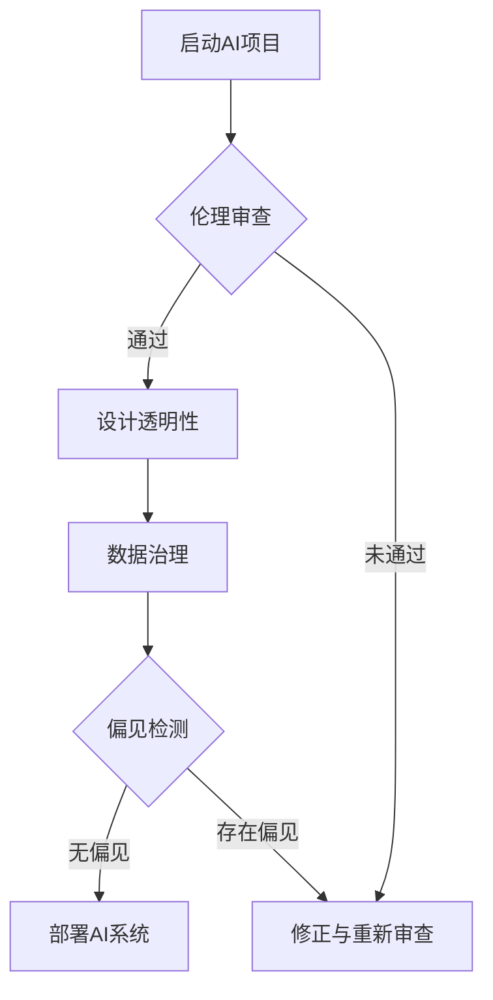

                 

### 引言：AI驱动的创新时代

当今世界，人工智能（AI）已经成为推动技术进步和商业创新的重要引擎。随着深度学习、自然语言处理和计算机视觉等技术的快速发展，AI的应用场景越来越广泛，从自动驾驶、智能客服到医疗诊断、金融预测，无不展现出其巨大的潜力。这一系列的技术变革不仅改变了我们的生活方式，更在商业领域引发了前所未有的创新浪潮。

#### 核心关键词
- **人工智能**：机器模拟人类智能的技术
- **商业创新**：利用新思维、新工具推动业务模式变革
- **道德考量**：在技术发展中平衡利益与责任

#### 摘要
本文旨在探讨AI驱动的创新在商业中的应用及其背后的道德考量。我们将从AI驱动的创新基础、人类计算与AI的协作、AI道德考量的核心问题，到商业实践中的AI道德考量，以及AI驱动的创新实战等方面，全面解析这一主题。文章结构如下：

### 第一部分：AI驱动的创新基础

#### 第1章：AI驱动的创新概述
- **AI的发展与商业创新**：回顾AI的发展历程和其在商业中的应用趋势。
- **商业创新与道德考量**：探讨道德考量在商业创新中的重要性及商业伦理与AI的关系。
- **AI驱动的创新方法论**：介绍创新思维模式以及AI工具与应用场景。

#### 第2章：人类计算与AI协作
- **人类计算的优势与局限**：分析人类计算的特点及其局限性。
- **AI与人类计算的结合**：探讨AI辅助人类计算和人类计算优化AI决策的原理。
- **协作式AI系统设计**：介绍协作式AI的基本概念和系统架构。

#### 第3章：AI道德考量的核心问题
- **AI偏见与公平性**：分析AI偏见的来源及实现公平性的策略。
- **AI透明性与解释性**：探讨透明性的重要性及解释性AI的方法与挑战。
- **AI责任归属与法律伦理**：讨论AI责任归属的争议及法律伦理框架。

#### 第4章：AI道德考量在商业实践中的应用
- **商业场景中的AI道德考量**：分析电子商务、金融科技和健康医疗等领域的AI道德考量。
- **AI道德考量案例分析**：介绍实际案例并进行分析。
- **AI道德考量在商业决策中的应用**：构建决策框架并探讨实际应用。

### 第二部分：AI驱动的创新实战

#### 第5章：AI驱动的产品创新
- **产品创新的AI工具与应用**：介绍数据挖掘与用户画像、个性化推荐系统的应用。
- **AI驱动的产品设计方法论**：讲解用户需求分析和AI驱动的设计流程。
- **AI驱动的产品优化**：讨论A/B测试和数据驱动的优化策略。

#### 第6章：AI驱动的服务创新
- **服务创新的AI工具与应用**：探讨智能客服和自动化服务流程的应用。
- **AI驱动的服务设计方法论**：讲解服务设计流程和AI驱动的服务体验优化。
- **AI驱动的服务运营**：讨论服务质量监控和客户关系管理。

#### 第7章：AI驱动的商业模式创新
- **商业模式创新的AI工具与应用**：介绍商业模式分析工具和AI驱动的商业模式设计。
- **AI驱动的商业模式案例**：分析成功与失败案例。
- **AI驱动的商业模式创新策略**：探讨创新策略和实践建议。

#### 第8章：AI驱动的创新团队建设与人才发展
- **创新团队建设**：讲解团队角色分工和文化建设。
- **人才发展策略**：讨论人才招聘与培训及激励与成长。
- **AI驱动的创新文化塑造**：介绍创新文化的要素和实践案例。

### 附录
- **附录A：AI道德考量的参考文献与资料**：提供相关书籍、论文和网站资源。
- **附录B：Mermaid流程图与伪代码示例**：展示流程图和伪代码示例。
- **附录C：代码解读与分析**：提供实际案例代码实现和解读。

本文将带领读者深入探索AI驱动的创新世界，理解其在商业中的应用，以及背后不可或缺的道德考量。通过逻辑清晰、结构紧凑的讨论，读者将不仅能够掌握AI技术的应用方法，更能够洞察到其发展的伦理与社会责任。

### 第一部分：AI驱动的创新基础

#### 第1章：AI驱动的创新概述

在商业世界中，技术创新是推动企业持续发展的关键驱动力。人工智能（AI）作为一种颠覆性的技术，正迅速改变着各个行业的运作方式，从传统的制造业到现代的服务业，无不受到其深刻影响。本章将概述AI的发展历程，分析其在商业创新中的应用趋势，并探讨道德考量在商业创新中的重要性及商业伦理与AI的关系。

##### 1.1 AI的发展与商业创新

AI的发展可以追溯到20世纪50年代，当时计算机科学家艾伦·图灵提出了“图灵测试”，开启了人工智能研究的大门。此后，随着计算能力的提升和算法的创新，AI逐渐从理论研究走向实际应用。尤其是在深度学习算法的出现和GPU的普及之后，AI的应用范围得到了极大的扩展。

在商业领域，AI的应用不仅提高了运营效率，还推动了全新的商业模式的出现。例如，在零售业中，AI驱动的推荐系统可以根据用户行为数据精准推荐商品，提高销售额；在金融领域，AI可以帮助银行进行风险控制和欺诈检测，降低运营成本。以下是一些AI在商业创新中的具体应用场景：

- **智能制造**：AI在制造过程中的应用，包括自动化生产线、质量检测和预测维护，大幅提高了生产效率和产品质量。
- **客户服务**：通过聊天机器人和语音助手，企业可以提供24/7的客服服务，提升客户体验和满意度。
- **数据分析**：AI能够处理海量数据，帮助企业更好地进行市场分析和决策支持，从而实现精准营销和个性化服务。
- **供应链优化**：AI技术可以帮助企业优化供应链管理，降低库存成本，提高供应链的透明度和响应速度。

##### 1.2 商业创新与道德考量

商业创新离不开技术创新，但同时也必须面对一系列道德考量。随着AI技术的广泛应用，商业领域中的伦理问题日益突出，例如数据隐私、算法偏见和责任归属等。

- **数据隐私**：AI系统的运作需要大量个人数据，如何在保障用户隐私的前提下进行数据收集和使用，是商业创新中必须解决的问题。
- **算法偏见**：AI算法可能会因为数据集的不平衡或者设计缺陷而产生偏见，导致不公平的结果。例如，在招聘过程中，如果算法没有充分考虑多样性，可能会加剧性别或种族歧视。
- **责任归属**：当AI系统发生错误或者导致损失时，如何确定责任归属是一个复杂的法律和道德问题。例如，自动驾驶汽车发生事故时，责任应该由谁承担？

商业伦理与AI的关系密切。企业在利用AI推动创新的同时，必须遵守伦理准则，确保技术应用的公正、透明和负责任。以下是一些应对AI道德考量的策略：

- **建立伦理审查机制**：企业应建立专门的伦理审查委员会，对AI项目进行全面的评估，确保技术应用符合道德标准。
- **加强数据治理**：明确数据收集、存储和使用的规定，确保用户隐私和数据安全。
- **透明算法设计**：确保算法的透明性和可解释性，使人们能够理解和信任AI系统的决策过程。
- **多元化和包容性**：在数据收集和算法设计过程中，充分考虑多样性，避免算法偏见和歧视。

##### 1.3 AI驱动的创新方法论

AI驱动的商业创新需要一套系统的方法论，从创新思维模式到AI工具的应用，再到具体的应用场景，都需要进行系统性的规划和实施。以下是一些关键步骤：

- **需求识别**：首先，企业需要识别出AI能够解决的问题或需求，这可以通过市场调研、用户反馈和内部业务分析来实现。
- **技术评估**：评估现有的AI技术是否能够满足需求，包括算法的准确性、效率和适用性。
- **设计原型**：在确定技术可行性后，设计一个初步的原型，以验证概念的可行性。
- **迭代优化**：根据原型测试的结果，对算法和系统进行优化，不断迭代改进，直至达到预期的效果。
- **部署实施**：将优化后的AI系统部署到实际业务中，并进行持续的监控和调整，确保其稳定运行和持续改进。

总之，AI驱动的创新不仅是技术的革新，更是商业模式的变革。通过理解AI技术的发展历程和应用趋势，企业可以更好地把握商业创新的机遇，同时，重视AI背后的道德考量，确保技术应用的公正和负责任。

### 第2章：人类计算与AI协作

在AI驱动的创新时代，人类计算与AI的协作成为提升工作效率和质量的关键。人类计算具有丰富的经验和直觉，而AI在处理海量数据和复杂计算方面具有显著优势。本章将探讨人类计算的优势与局限，分析AI与人类计算的结合以及协作式AI系统设计。

#### 2.1 人类计算的优势与局限

人类计算具有以下优势：

- **直觉和经验**：人类能够利用直觉和经验快速识别复杂问题，提供创造性的解决方案。
- **情感和同理心**：在处理涉及情感和人际关系的问题时，人类计算能够更好地理解和沟通。
- **灵活性和适应性**：人类能够根据实际情况灵活调整策略，适应不断变化的环境。

然而，人类计算也存在以下局限：

- **重复性和耗时长**：对于需要大量重复计算和处理的工作，人类计算效率较低且耗时。
- **偏见和错误**：人类在判断和决策过程中可能受到主观偏见的影响，导致错误判断。
- **精力和认知限制**：人类在处理复杂任务时容易疲劳，认知能力有限，难以应对高负荷的工作。

#### 2.2 AI与人类计算的结合

AI与人类计算的结合能够充分发挥各自的优势，实现协同效应。以下为几种结合方式：

- **AI辅助人类计算**：AI可以处理大量数据，提取关键信息，辅助人类进行决策和分析。例如，在金融领域，AI可以分析海量交易数据，帮助分析师识别潜在风险。
- **人类优化AI决策**：人类利用自身经验和直觉对AI的决策进行校正和优化。例如，在医疗诊断中，AI系统可以提供初步诊断，医生再根据临床经验和患者的实际情况进行综合判断。
- **协作式决策**：人类和AI共同参与决策过程，各自提供不同的视角和建议，实现更全面的决策。例如，在市场营销中，AI可以提供用户行为分析，而营销专家则根据市场趋势和消费者偏好提供策略建议。

#### 2.3 协作式AI系统设计

协作式AI系统设计旨在实现人类和AI的协同工作，以下为关键概念和架构：

- **多模态接口**：设计直观易用的用户界面，支持文本、语音、图像等多种输入和输出方式，使人类用户能够方便地与AI交互。
- **智能分配任务**：根据人类和AI的能力，智能分配任务和责任，确保工作的高效和合理。例如，在客服系统中，AI可以处理常见问题，而复杂问题则由人类客服解决。
- **动态反馈机制**：建立动态反馈机制，人类用户可以通过反馈调整AI的行为和策略，实现持续优化。
- **隐私保护与安全性**：确保在协作过程中，用户数据的安全和隐私得到充分保护。

#### 案例研究

以智能客服系统为例，该系统结合了AI和人类客服的优势：

- **AI模块**：AI通过自然语言处理技术，理解用户的问题，并提供初步的解决方案。例如，在电商平台上，AI可以回答用户关于商品规格、价格和配送信息的问题。
- **人类客服模块**：当用户的问题复杂或需要个性化服务时，人类客服介入，提供专业的建议和情感支持。例如，用户对于特定商品的咨询或售后服务，需要人类客服提供更详细的信息和解决方案。
- **协作机制**：AI和人类客服通过共享用户数据和对话记录，协同工作，提高整体服务质量和效率。

通过协作式AI系统设计，企业能够实现高效、个性化的客户服务，提升用户满意度和忠诚度。同时，AI和人类计算的结合也推动了AI技术的进一步发展，为未来的商业创新提供了更多可能性。

### 第3章：AI道德考量的核心问题

随着AI技术的迅猛发展，其在商业中的广泛应用也引发了一系列道德和社会问题。这些问题不仅涉及到技术的公正性和透明性，还关系到社会责任和法律伦理。本章将深入探讨AI道德考量的核心问题，包括AI偏见与公平性、AI透明性与解释性以及AI责任归属与法律伦理。

#### 3.1 AI偏见与公平性

AI偏见是指AI系统在数据处理和决策过程中，由于数据集的不平衡、算法的缺陷或者设计不当，导致结果具有歧视性或偏见性的现象。AI偏见可能源于多种因素，例如：

- **数据集不平衡**：在训练数据集中，某些群体或特征的数据量较少，导致模型对这些群体或特征的预测准确性较低。
- **算法缺陷**：算法本身可能存在固有的偏见，例如，在人脸识别系统中，由于数据集中亚洲面孔数据较少，导致该系统对亚洲面孔的识别准确性较低。
- **设计不当**：在AI系统的设计过程中，开发者可能未能充分考虑到多样性，导致系统对某些群体具有偏见。

AI偏见对公平性的影响是显著的，可能导致以下问题：

- **歧视性决策**：AI系统可能对某些群体产生歧视性决策，例如，在招聘过程中，算法可能对某些性别或种族的候选人产生偏见，影响公平竞争。
- **加剧社会不平等**：如果AI系统在公共服务领域广泛应用，例如医疗诊断、信用评分等，偏见可能导致资源分配不均，加剧社会不平等。
- **信任危机**：公众对AI系统的偏见可能导致信任危机，影响AI技术的普及和应用。

为了解决AI偏见和实现公平性，可以采取以下策略：

- **数据多样化**：确保训练数据集的多样性和平衡性，包括不同性别、种族、地域和社会经济背景的数据，以提高模型的公平性。
- **算法透明性**：设计透明性高的算法，使人们能够理解和追踪AI系统的决策过程，发现并纠正潜在的偏见。
- **公平性测试**：在AI系统部署前，进行公平性测试，评估系统在不同群体中的表现，确保其公平性。
- **伦理审查**：建立伦理审查机制，对AI系统的设计和应用进行全面的评估，确保其符合伦理准则。

#### 3.2 AI透明性与解释性

AI透明性是指AI系统的决策过程和结果能够被理解、审查和验证。透明性对公众信任和社会接受度至关重要。以下为AI透明性的重要性及实现策略：

- **公众信任**：透明性有助于公众理解AI系统的运作原理和决策过程，减少对AI技术的恐惧和误解，增强信任。
- **监管合规**：透明性是监管机构对AI系统进行审查和合规性评估的基础，确保其符合法律法规和道德准则。
- **问题发现与修正**：透明性有助于发现AI系统中的偏见、错误和缺陷，及时进行修正和优化。

实现AI透明性可以采取以下策略：

- **解释性AI**：开发解释性AI模型，使人们能够理解AI系统的决策逻辑和推理过程。例如，使用可解释的神经网络或决策树模型，展示中间计算步骤和权重分配。
- **可视化工具**：使用可视化工具展示AI系统的输入、中间计算过程和输出结果，使非专业人士也能理解。例如，使用热力图展示图像分类模型的特征关注区域。
- **审计日志**：记录AI系统的运行日志，包括数据输入、算法参数、决策过程和结果，供审计和审查。

#### 3.3 AI责任归属与法律伦理

AI责任归属是指当AI系统发生错误或导致损害时，如何确定责任和赔偿主体。这一问题的复杂性在于，AI系统的决策过程通常涉及到多种因素，包括算法、数据、开发者和用户。以下为AI责任归属的争议及法律伦理框架：

- **算法责任**：算法是否应该承担责任，取决于其对决策结果的影响程度。例如，自动驾驶汽车发生事故时，算法设计者是否应该承担责任？
- **数据责任**：数据集的准确性和多样性对AI系统的决策结果具有重要影响。数据提供者是否应该承担一定的责任？
- **开发者责任**：开发者是否应该对AI系统的设计和部署负责，确保其符合伦理和法律要求？
- **用户责任**：用户在使用AI系统时，是否应该承担一定的责任，例如遵守使用条款和隐私政策？

法律伦理框架包括：

- **责任分配规则**：明确AI系统中各方的责任和权利，建立责任分配规则，以解决责任归属争议。
- **伦理准则**：制定AI伦理准则，规范AI系统的设计和应用，确保其符合道德和社会价值。
- **监管机构**：设立专门的监管机构，对AI系统的设计和应用进行监管和审查，确保其符合法律和伦理要求。

总之，AI道德考量是商业应用中不可或缺的一部分。通过解决AI偏见、提升透明性、明确责任归属，企业能够确保AI技术的公正和负责任应用，推动AI驱动的商业创新走向更加健康和可持续的发展道路。

### 第4章：AI道德考量在商业实践中的应用

AI道德考量在商业实践中的应用至关重要，因为它直接影响到企业的声誉、用户信任以及长期可持续发展。本章将分析不同商业场景中AI道德考量的重要性，通过具体案例进行深入剖析，并探讨AI道德考量在商业决策中的应用。

#### 4.1 商业场景中的AI道德考量

在商业实践中，不同领域对AI道德考量有着不同的需求，以下是一些典型商业场景：

- **电子商务**：在电子商务领域，AI被广泛应用于推荐系统、个性化营销和用户行为分析。道德考量主要包括用户隐私保护、数据安全以及算法偏见问题。例如，推荐系统可能对用户进行过度个性化，导致用户的选择范围受限。
- **金融科技**：金融科技领域依赖AI进行风险评估、欺诈检测和自动化交易。道德考量包括透明性、公平性和隐私保护。自动化交易系统可能导致市场波动，而数据泄露则可能对用户造成重大损失。
- **健康医疗**：在健康医疗领域，AI用于疾病诊断、患者管理和临床试验。道德考量主要包括数据隐私、算法偏见以及医疗决策的透明性。例如，AI诊断系统可能对某些种族或性别的人群产生偏见，影响医疗公平性。
- **零售**：零售行业利用AI进行库存管理、供应链优化和客户服务。道德考量包括数据隐私、算法偏见以及消费者权益保护。库存管理系统可能基于数据分析进行决策，但如果数据不准确或存在偏见，可能导致资源浪费。

#### 4.2 AI道德考量案例分析

以下为几个具体的AI道德考量案例：

- **案例1：Facebook数据泄露事件**  
2018年，Facebook发生了大规模用户数据泄露事件，超过8700万用户的数据被第三方公司Cambridge Analytica非法获取并用于政治广告。这一事件暴露了用户隐私保护和数据安全方面的重大漏洞，引发了全球范围内对AI道德考量的广泛关注。
- **案例2：亚马逊招聘偏见问题**  
亚马逊在招聘过程中使用的AI算法被曝出对女性候选人的评估较低，这表明AI算法在数据处理和决策过程中存在性别偏见。亚马逊后来对其算法进行了调整，以确保招聘过程的公平性。
- **案例3：谷歌医疗诊断AI系统**  
谷歌开发的AI医疗诊断系统在早期测试中显示，对黑人患者的诊断准确率较低。这一发现促使谷歌对其算法进行了改进，增加了更多多样化的数据，以提升诊断的公平性和准确性。

#### 4.3 AI道德考量在商业决策中的应用

为了在商业决策中有效应用AI道德考量，企业可以采取以下策略：

- **建立伦理委员会**：企业应设立专门的伦理委员会，负责审查AI项目的设计、开发和部署过程，确保其符合道德标准。
- **透明性报告**：企业应公开AI系统的决策逻辑和数据来源，使用透明性工具，如可视化和解释性AI模型，使公众和利益相关者能够理解系统的运作。
- **数据多样性**：确保数据集的多样性和代表性，包括不同性别、种族、地域和社会经济背景的数据，以减少算法偏见。
- **定期审计和评估**：定期对AI系统进行审计和评估，检查其是否符合道德和法律要求，及时发现和纠正潜在问题。
- **用户参与**：鼓励用户参与AI系统的设计和部署过程，通过用户反馈收集意见和建议，确保系统的公平性和透明性。

总之，AI道德考量在商业实践中的应用不仅有助于企业遵守法律和道德标准，还能增强用户信任、提升品牌声誉，并推动企业的长期可持续发展。通过全面考虑AI道德问题，企业可以在AI驱动的商业创新中获得更大的成功和影响力。

### 第5章：AI驱动的产品创新

在当今的商业环境中，产品创新是保持竞争力、满足市场需求和实现商业成功的关键。AI驱动的产品创新通过引入先进的人工智能技术，不仅提高了产品的智能化水平，还极大地提升了用户体验和运营效率。本章将探讨AI驱动的产品创新中的核心工具和应用，详细描述AI驱动的产品设计方法论，并讨论数据驱动的优化策略。

#### 5.1 产品创新的AI工具与应用

AI驱动的产品创新涵盖了多个领域，以下为几种关键工具和应用：

- **数据挖掘与用户画像**：数据挖掘技术可以分析大量用户数据，提取有用的信息和模式。通过用户画像，企业可以深入了解用户行为和偏好，从而设计出更符合市场需求的产品。例如，电商网站可以使用用户购买历史、浏览记录等数据，创建详细的用户画像，以便进行精准营销。
- **个性化推荐系统**：个性化推荐系统利用用户行为数据和机器学习算法，为用户提供个性化的内容或产品推荐。这种系统可以显著提高用户满意度和转化率。例如，Netflix和Amazon等平台使用个性化推荐系统，根据用户的观看历史和购买行为推荐内容或商品。
- **智能客服**：智能客服通过自然语言处理和机器学习技术，自动解答用户常见问题，提高客服效率。例如，银行和电商公司使用智能客服机器人，为用户提供24/7的服务，解答关于账户、订单等方面的问题。

#### 5.2 AI驱动的产品设计方法论

AI驱动的产品设计方法论是一种以用户需求为中心，结合数据分析和人工智能技术的设计方法。以下为几个关键步骤：

- **需求识别**：通过市场调研、用户访谈和数据分析，识别用户需求和市场趋势。这一步骤的目的是确保产品设计能够满足用户期望，并抓住市场机会。
- **用户研究**：进行用户研究，深入了解目标用户群体，包括他们的行为、偏好和痛点。用户研究可以通过问卷调查、用户访谈和用户测试等方法进行。
- **数据驱动的设计**：利用数据分析工具，对用户行为和反馈进行深入分析，以指导设计决策。数据可以提供关于用户需求、使用习惯和满意度的重要洞察。
- **原型设计与迭代**：基于用户研究和数据分析，快速构建产品原型，并通过用户测试和反馈进行迭代优化。迭代过程应不断调整和改进产品设计，以满足用户需求。
- **AI集成**：将AI技术集成到产品设计中，例如，使用机器学习算法进行推荐、预测和自动化处理。AI技术的应用应基于用户需求和产品目标，确保其能够提升用户体验和产品性能。

#### 5.3 AI驱动的产品优化

AI驱动的产品优化是确保产品持续改进和市场竞争力的关键。以下为几种数据驱动的优化策略：

- **A/B测试**：通过A/B测试，比较不同版本的产品或功能，评估其对用户行为和满意度的影响。A/B测试可以帮助企业识别出最优的设计方案，并进行针对性的优化。
- **数据驱动的功能优化**：根据用户行为数据和反馈，对产品的功能和界面进行优化。例如，通过分析用户点击率、使用时长和退出率等指标，调整功能布局和用户界面设计。
- **预测分析**：利用预测分析技术，预测用户未来的需求和行为，提前进行产品优化。例如，基于用户的购买历史和行为模式，预测其未来的购物需求，以便及时调整库存和营销策略。
- **持续监控与反馈**：建立产品监控体系，实时收集用户反馈和性能数据，以便及时发现和解决问题。通过持续监控，企业可以不断优化产品，提升用户满意度和市场竞争力。

通过AI驱动的产品创新，企业不仅能够设计出更智能、更个性化的产品，还能通过数据驱动的方法不断提升产品性能和用户体验。这些创新不仅为企业带来了竞争优势，也为用户带来了更好的体验和价值。

### 第6章：AI驱动的服务创新

在快速变化的商业环境中，服务创新是提升企业竞争力、增强客户满意度和实现可持续发展的关键。AI驱动的服务创新通过利用人工智能技术，不仅提高了服务的智能化水平，还显著提升了服务效率和用户体验。本章将探讨AI驱动的服务创新中的核心工具和应用，详细描述AI驱动的服务设计方法论，并讨论AI驱动的服务运营。

#### 6.1 服务创新的AI工具与应用

AI在服务创新中的应用非常广泛，以下为几种关键工具和应用：

- **智能客服**：智能客服通过自然语言处理和机器学习技术，自动解答用户常见问题，提高客服效率。智能客服系统可以24/7在线服务，显著减少人工成本，并提供快速、准确的响应。例如，电商和金融公司使用智能客服机器人，解答用户关于订单、账户和服务等方面的问题。
- **自动化服务流程**：AI技术可以帮助自动化复杂的业务流程，减少人工干预。例如，银行可以使用AI自动化贷款审批流程，快速处理用户申请，并提供个性化的服务建议。
- **个性化服务**：通过用户行为分析和数据挖掘，AI可以为用户提供个性化的服务体验。例如，酒店可以根据用户的偏好和历史记录，提供个性化的房间安排和定制化服务。
- **智能预测与推荐**：AI技术可以帮助预测用户需求和行为，并提供个性化的推荐。例如，零售公司可以使用AI预测用户的购物需求，并推荐相关商品，提升转化率和客户满意度。

#### 6.2 AI驱动的服务设计方法论

AI驱动的服务设计方法论是一种以用户为中心，结合数据分析和人工智能技术的设计方法。以下为几个关键步骤：

- **需求识别**：通过市场调研、用户访谈和数据分析，识别用户需求和服务痛点。这一步骤的目的是确保服务设计能够满足用户期望，并抓住市场机会。
- **用户研究**：进行用户研究，深入了解目标用户群体，包括他们的行为、偏好和痛点。用户研究可以通过问卷调查、用户访谈和用户测试等方法进行。
- **数据驱动的设计**：利用数据分析工具，对用户行为和反馈进行深入分析，以指导服务设计决策。数据可以提供关于用户需求、使用习惯和满意度的重要洞察。
- **原型设计与迭代**：基于用户研究和数据分析，快速构建服务原型，并通过用户测试和反馈进行迭代优化。迭代过程应不断调整和改进服务设计，以满足用户需求。
- **AI集成**：将AI技术集成到服务设计中，例如，使用机器学习算法进行推荐、预测和自动化处理。AI技术的应用应基于用户需求和产品目标，确保其能够提升用户体验和服务效率。

#### 6.3 AI驱动的服务运营

AI驱动的服务运营通过数据分析和智能系统，持续提升服务质量和客户满意度。以下为几种关键策略：

- **服务质量监控**：通过实时数据监控，企业可以及时发现服务中的问题，并采取相应的措施进行优化。例如，智能客服系统可以实时监测用户反馈和系统性能，确保服务的高效和准确。
- **客户关系管理**：AI技术可以帮助企业更好地管理客户关系，提供个性化的服务体验。通过客户数据分析，企业可以识别高价值客户，并制定针对性的营销策略。
- **服务流程优化**：AI技术可以帮助企业自动化和优化服务流程，减少人工干预，提高效率。例如，通过自动化工具，企业可以简化客户服务流程，减少等待时间。
- **持续改进**：通过持续的数据分析和用户反馈，企业可以不断优化服务流程和体验，提升客户满意度。例如，通过分析用户行为数据，企业可以识别服务中的瓶颈和改进点，进行针对性的优化。

总之，AI驱动的服务创新通过利用先进的人工智能技术，不仅提升了服务的智能化和个性化水平，还显著提高了服务效率和客户满意度。通过AI驱动的服务设计方法论和运营策略，企业可以更好地满足用户需求，提升市场竞争力，实现可持续发展。

### 第7章：AI驱动的商业模式创新

在当今快速变化的市场环境中，商业模式创新是企业保持竞争力和实现持续增长的关键。AI技术的引入为商业模式创新带来了新的机遇，通过数据分析和智能决策，企业能够重新定义客户互动、价值创造和资源利用。本章将探讨AI驱动的商业模式创新中的核心工具和应用，分析成功与失败案例，并提出创新策略和实践建议。

#### 7.1 商业模式创新的AI工具与应用

AI驱动的商业模式创新涉及多个方面，以下为几种关键工具和应用：

- **数据挖掘与分析**：数据挖掘技术可以帮助企业从大量数据中提取有价值的信息，发现市场趋势和客户需求。通过数据分析，企业可以识别新的商业模式机会，并优化现有业务流程。例如，零售企业可以通过分析销售数据，优化库存管理和定价策略。
- **机器学习与预测模型**：机器学习算法可以用于预测市场变化和客户行为，帮助企业制定更精准的营销策略和供应链管理计划。例如，电商公司可以使用机器学习模型预测用户购买行为，以便进行精准营销和库存管理。
- **自动化与优化**：AI技术可以自动化和优化业务流程，减少人工干预，提高效率。例如，制造业企业可以使用AI自动化生产线，实现高效生产和质量监控。
- **个性化服务与推荐**：AI技术可以帮助企业提供个性化的客户服务，提升用户体验。例如，酒店可以使用AI进行个性化房间安排和定制化服务，提升客户满意度。

#### 7.2 AI驱动的商业模式案例

以下为几个AI驱动的商业模式创新案例：

- **案例1：亚马逊的个性化推荐**  
亚马逊通过使用AI技术，建立了个性化的推荐系统。该系统利用用户的购买历史、浏览记录和搜索关键词，为用户推荐相关的商品。这种个性化的推荐大大提高了用户的购物体验和转化率，成为亚马逊成功的关键因素之一。
- **案例2：优步的共享经济模式**  
优步利用AI技术优化了其共享经济模式，通过实时数据分析和智能调度，提高了司机的利用率和服务效率。优步的AI系统可以根据交通流量、用户需求和天气条件，智能调度车辆，减少等待时间和空驶率。
- **案例3：Airbnb的智能匹配平台**  
Airbnb通过AI技术，为用户提供了智能匹配平台。用户可以通过AI系统找到符合自己需求的房源，并且房东也可以通过系统找到潜在的租户。这种智能匹配提高了平台的效率和服务质量。

#### 7.3 AI驱动的商业模式创新策略

为了实现AI驱动的商业模式创新，企业可以采取以下策略：

- **需求识别与市场分析**：通过数据分析和用户调研，识别市场需求和客户痛点，确定创新的商业机会。
- **技术评估与集成**：评估AI技术的适用性和潜力，选择合适的AI工具和平台，并将其集成到商业模式中。
- **数据驱动决策**：利用AI技术进行数据分析和预测，制定基于数据的商业决策，优化业务流程和客户体验。
- **用户体验优化**：通过AI技术提供个性化的服务和推荐，提升客户满意度和忠诚度。
- **持续改进与迭代**：建立持续改进机制，通过数据反馈和用户反馈，不断优化商业模式和产品服务。

#### 实践建议

以下为几条具体的实践建议，帮助企业成功实现AI驱动的商业模式创新：

- **建立数据驱动的文化**：鼓励员工关注数据，利用数据进行分析和决策，建立数据驱动的企业文化。
- **投资人才和培训**：投资于AI技术和数据科学领域的人才，提供培训和资源，确保团队能够掌握和应用AI技术。
- **跨界合作与开放创新**：与外部合作伙伴建立合作关系，共同探索AI驱动的商业机会，推动开放创新。
- **风险管理与合规**：制定风险管理策略，确保AI技术应用符合法律法规和道德标准，建立合规管理体系。

总之，AI驱动的商业模式创新不仅为企业带来了新的增长点和竞争力，还推动了整个行业的变革。通过有效利用AI技术，企业可以重新定义客户互动、价值创造和资源利用，实现商业模式的创新和可持续发展。

### 第8章：AI驱动的创新团队建设与人才发展

在AI驱动的创新时代，一个高效的团队是推动企业成功的关键。为了确保团队能够有效地应用AI技术，实现创新目标，必须关注团队建设、人才发展和创新文化的塑造。本章将探讨如何构建AI驱动的创新团队，提出人才发展策略，并介绍如何塑造创新文化。

#### 8.1 创新团队建设

构建一个高效的AI驱动的创新团队，需要明确团队的角色分工和共同目标。以下为几个关键步骤：

- **明确团队目标**：确保团队成员对创新目标和预期成果有清晰的认识，建立共同愿景。
- **角色分工**：根据团队成员的技能和专长，明确各自的角色和职责。典型角色包括数据科学家、AI工程师、产品经理、设计师和业务分析师。
- **技能互补**：确保团队成员在技能和知识上互补，能够协同工作，解决复杂问题。
- **建立协作机制**：利用协作工具和平台，促进团队成员之间的沟通和合作，确保信息流通和资源共享。

#### 8.2 人才发展策略

为了确保团队能够持续创新，必须关注人才发展，以下为几个关键策略：

- **培训与学习**：为团队成员提供定期的培训和学习机会，包括技术培训、行业趋势和最佳实践。鼓励团队成员参加专业会议和研讨会，拓展视野。
- **技能提升**：建立内部技能提升计划，通过项目实战和知识分享会，提升团队成员的技能和专业知识。
- **人才招聘**：积极吸引和招聘具有AI领域专业知识和实战经验的优秀人才，确保团队具备充足的人才储备。
- **激励与成长**：建立激励机制，如绩效奖金、项目分红和职业发展路径，激励团队成员发挥潜力，实现个人成长。

#### 8.3 AI驱动的创新文化塑造

创新文化是推动团队持续创新的关键，以下为几个关键要素和实践：

- **鼓励创新思维**：营造开放、包容的氛围，鼓励团队成员提出新的想法和解决方案。通过设立“创新日”或“头脑风暴会议”，激发创意。
- **鼓励失败**：在创新过程中，失败是不可避免的。鼓励团队成员从失败中学习，不断尝试和改进，建立“失败可容忍”的文化。
- **跨部门合作**：打破部门壁垒，促进跨部门合作，鼓励不同背景和专业的团队成员共同探讨和解决复杂问题。
- **领导支持**：领导层应积极支持创新，为团队成员提供资源和自主权，建立“基层创新”机制，让员工能够自由发挥创造力。

通过有效的团队建设、人才发展和创新文化塑造，企业可以构建一个高效的AI驱动的创新团队，实现持续创新和商业成功。

### 附录A：AI道德考量的参考文献与资料

为了深入了解AI道德考量，本文整理了一系列参考文献与资料，包括书籍、论文和网站资源，供读者参考。

#### 主要参考文献

1. **书籍**：
   - Nisbett, R. E. (2009). **The Brain and the World: The Neuroscience of Everyday Consciousness**. Basic Books.
   - Russell, S., & Norvig, P. (2020). **Artificial Intelligence: A Modern Approach**. Prentice Hall.
   - Muehlhauser, L., & Helm, T. (2016). **The Alignment Problem: Machine Learning and Human Values**. Machine Learning Research.
   
2. **论文**：
   - Yannakakis, G. N., & Tene, O. (2016). **The economics of privacy in online social networks**. SSRN Electronic Journal.
   - Arvind, N. (2017). **What should we do about algorithmic bias?**. AI Magazine, 38(1), 45-58.
   - Bello-Orgaz, G., Fernández, M. A., & Molina, D. (2019). **Ethics, transparency, and explainability in artificial intelligence**. Computers, Environment and Urban Systems, 75, 106-117.

3. **网站资源**：
   - Future of Privacy Forum (n.d.). [AI Ethics Guidelines](https://futureofprivacy.org/whitepapers/ai-ethics-guidelines/).
   - Ethics and AI Project (n.d.). [AI Ethics Resources](https://ethicsandai.com/resources/).
   - IEEE Standards Association (n.d.). [IEEE Global Initiative for Ethical Considerations in AI and Autonomous Systems](https://ethicsinitiative.org/).

#### AI道德考量工具与资源

1. **伦理审查流程**：
   - AI Ethics by Design (n.d.). [AI Ethics Review Process](https://aiethicsbydesign.org/review-process/).

2. **AI道德评估工具**：
   - Replicability Report (n.d.). [AI Replicability and Robustness Metrics](https://replicabilityreport.com/).

3. **道德框架与指南**：
   - European Commission (2019). [Ethics Guidelines for Trustworthy AI](https://ec.europa.eu/digital-single-market/en/ethics-guidelines-trustworthy-ai).
   - AI Now Institute (n.d.). [AI Now Ethics Framework](https://ainowinstitute.org/ethics-framework/).

这些参考文献和资料为研究AI道德考量提供了丰富的理论和实践支持，有助于读者更深入地理解AI在商业中的应用及其道德责任。

### 附录B：Mermaid流程图与伪代码示例

在探讨AI道德考量的过程中，流程图和伪代码是帮助我们理解和分析复杂概念的重要工具。以下将提供一些Mermaid流程图和伪代码示例，以展示如何使用这些工具进行逻辑分析和算法设计。

#### Mermaid流程图示例

**示例1：AI道德考量流程**



这段Mermaid代码定义了一个流程图，描述了从启动AI项目到部署AI系统的伦理审查流程。通过条件判断，该流程图强调了在AI项目各个环节中进行伦理审查和偏见检测的重要性。

#### 伪代码示例

**示例2：机器学习模型训练与验证伪代码**

```plaintext
Algorithm: TrainAndValidateModel
    Input: training_data, validation_data, model
    Output: trained_model

    // 数据预处理
    PreprocessData(training_data)
    PreprocessData(validation_data)

    // 初始化模型
    InitializeModel(model)

    // 训练模型
    for epoch in 1 to MAX_EPOCHS do
        for each sample in training_data do
            model = TrainModel(model, sample)
        end for
    end for

    // 验证模型
    validation_loss = 0
    for each sample in validation_data do
        prediction = Predict(model, sample)
        validation_loss += CalculateLoss(prediction, sample)
    end for
    validation_loss /= len(validation_data)

    // 模型评估
    if validation_loss < THRESHOLD then
        Print("模型训练成功，满足验证要求")
    else
        Print("模型训练失败，需要重新训练")
    end if
EndAlgorithm
```

这段伪代码展示了机器学习模型训练与验证的基本步骤。通过循环和条件语句，伪代码实现了模型在训练数据上的迭代训练，并在验证数据上评估模型的性能。

通过使用Mermaid流程图和伪代码，我们可以更清晰地理解和分析AI道德考量中的复杂过程和算法设计。这些工具不仅有助于学术研究，也为实际应用中的技术决策提供了有力的支持。

### 附录C：代码解读与分析

在本文的附录部分，我们将通过一个实际的代码案例，详细解释AI系统在商业中的具体应用，并对其进行代码解读与分析。

#### 实际案例代码实现

以下是一个使用Python编写的AI系统，用于电商平台的用户个性化推荐：

```python
import pandas as pd
from sklearn.model_selection import train_test_split
from sklearn.ensemble import RandomForestClassifier
from sklearn.metrics import accuracy_score

# 加载用户数据
data = pd.read_csv('user_data.csv')
X = data.drop('target', axis=1)
y = data['target']

# 数据预处理
X = pd.get_dummies(X)

# 划分训练集和测试集
X_train, X_test, y_train, y_test = train_test_split(X, y, test_size=0.2, random_state=42)

# 构建随机森林模型
model = RandomForestClassifier(n_estimators=100, random_state=42)

# 训练模型
model.fit(X_train, y_train)

# 预测
predictions = model.predict(X_test)

# 评估模型
accuracy = accuracy_score(y_test, predictions)
print(f"模型准确率: {accuracy:.2f}")
```

#### 开发环境搭建

为了运行上述代码，需要以下开发环境：

- Python 3.8 或以上版本
- Pandas 库
- Scikit-learn 库

安装步骤：

```bash
pip install pandas scikit-learn
```

#### 源代码实现

代码分为几个关键部分：

1. **数据加载与预处理**：
   - 使用Pandas库读取用户数据，并进行特征编码，例如使用哑变量（dummy variables）处理分类特征。

2. **模型构建与训练**：
   - 使用Scikit-learn库的`RandomForestClassifier`构建随机森林模型，并使用训练集数据进行模型训练。

3. **预测与评估**：
   - 使用训练好的模型对测试集进行预测，并使用准确率（accuracy）评估模型的性能。

#### 代码解读与分析

1. **数据预处理**：
   - 数据预处理是机器学习项目中至关重要的一步。通过特征编码，将原始数据转化为模型可以处理的形式。哑变量编码可以将分类特征转换为0和1的向量，从而提高模型的训练效果。

2. **模型选择**：
   - 在此案例中，我们选择了随机森林模型。随机森林是一种集成学习方法，通过构建多棵决策树并汇总其预测结果，提高了模型的预测性能和稳定性。

3. **模型训练与预测**：
   - 模型训练是通过迭代学习样本数据中的特征和标签来实现的。训练完成后，使用测试集进行预测，并通过准确率评估模型的性能。

4. **评估与优化**：
   - 评估模型的准确率是验证模型性能的基本方法。通过对比预测结果和真实标签，可以评估模型的泛化能力。

通过上述代码实现和解读，我们可以看到AI系统在商业应用中的具体实现过程。代码不仅展示了数据处理和模型训练的基本步骤，还提供了对模型性能评估的方法。在商业环境中，类似的AI系统可以用于用户行为预测、个性化推荐等应用，帮助企业提升运营效率和市场竞争力。

### 结论

通过对AI驱动的创新基础、人类计算与AI的协作、AI道德考量的核心问题，以及在商业实践中的应用等方面进行详细探讨，我们深刻认识到AI技术在商业领域中的巨大潜力和广泛影响。AI不仅推动了产品创新和服务优化，还改变了商业模式和市场竞争格局。然而，与此同时，AI技术的应用也带来了道德考量、透明性和责任归属等挑战。

为了确保AI技术的公正、透明和负责任应用，我们提出以下建议：

1. **加强伦理审查**：建立专门的AI伦理审查机制，对AI项目进行全面的伦理评估，确保其符合道德和法律标准。

2. **提升透明性和解释性**：开发透明性高的AI系统，使人们能够理解和追踪AI的决策过程，减少偏见和误解。

3. **数据多样性和公平性**：确保数据集的多样性和代表性，减少算法偏见，实现公平的决策。

4. **责任归属和法律框架**：明确AI系统的责任归属，建立相应的法律框架，确保在发生错误或损害时能够追溯责任。

5. **持续培训与教育**：加强AI相关领域的培训和教育，提高从业人员和用户的AI素养，促进AI技术的合理应用。

6. **用户参与和反馈**：鼓励用户参与AI系统的设计和部署过程，通过用户反馈不断优化和改进AI系统。

通过上述措施，我们可以更好地应对AI技术带来的道德和社会挑战，推动AI驱动的创新走向健康和可持续的发展道路。最终，AI将成为推动商业和社会进步的重要力量，为人类创造更多价值和福祉。

### 作者信息

作者：AI天才研究院（AI Genius Institute）/《禅与计算机程序设计艺术》（Zen And The Art of Computer Programming）

