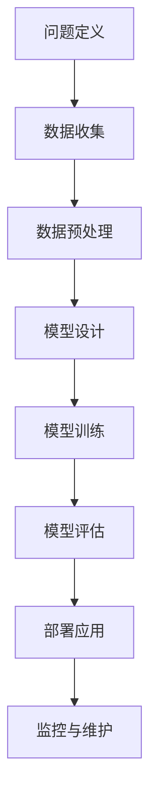

                 

### 《AI驱动的创新：人类计算在商业中的道德考虑因素与应用前景展望》

#### 核心关键词：
- AI驱动的创新
- 商业应用
- 道德考虑因素
- 数据隐私
- 透明性与公平性
- 强化学习与机器学习
- 深度学习模型
- 应用案例分析

#### 摘要：
本文深入探讨了AI驱动的创新在商业领域的应用及其道德考虑因素。我们首先概述了AI驱动的创新基础，包括背景、应用现状和人类计算的角色。接着，我们详细分析了道德考虑因素，如数据隐私、透明性、公平性等，并提出了相应的决策模型和风险预防策略。随后，我们探讨了AI在商业中的应用场景和案例分析，最后展望了AI技术的未来发展趋势及人类计算在这一领域的角色。文章旨在为读者提供一个全面、系统的理解，帮助他们在AI驱动的商业创新中做出符合道德标准的决策。

---

### 第一部分：AI驱动的创新概述

在当今快速发展的技术环境中，人工智能（AI）正成为推动商业创新的强大引擎。AI驱动的创新不仅改变了企业的运营模式，也正在重新定义商业竞争的规则。这一部分将为我们提供AI驱动的创新的基础知识，包括其背景、应用现状、人类计算的角色以及道德考虑因素在商业中的重要性。

#### 第1章：AI驱动的创新基础

##### 1.1 AI驱动的创新背景

人工智能作为一种模拟人类智能的技术，其历史可以追溯到20世纪50年代。然而，真正的AI驱动的创新热潮始于21世纪初，得益于大数据、云计算和计算能力的显著提升。这一时期，机器学习、深度学习和强化学习等技术的快速发展，使得AI在各个领域展现出强大的应用潜力。

近年来，AI在商业领域的应用不断拓展。从智能客服、个性化推荐系统，到自动化生产、智能供应链管理，AI正在改变企业的运营方式。这些应用不仅提高了效率，还带来了新的商业模式和竞争优势。

##### 1.2 AI在商业中的应用现状

AI在商业中的应用已经成为一种趋势。以下是一些AI在商业中的典型应用场景：

- **客户关系管理**：通过自然语言处理（NLP）技术，AI可以分析客户反馈，提供个性化的服务体验。
- **生产与供应链优化**：AI可以通过预测分析优化库存管理和供应链流程，减少成本，提高响应速度。
- **营销与市场分析**：AI可以帮助企业分析市场数据，识别潜在客户，制定更加精准的营销策略。
- **人力资源管理**：AI可以用于招聘、员工培训以及绩效评估，提高人力资源管理效率。

##### 1.3 人类计算在AI应用中的角色

尽管AI技术在不断进步，但人类计算在AI应用中仍然扮演着关键角色。以下是人类计算在AI应用中的几个重要方面：

- **数据准备与清洗**：AI模型需要大量的高质量数据。这通常需要人类专家来收集、清洗和标注数据。
- **模型设计**：虽然自动化工具可以帮助设计AI模型，但最终决策和优化仍需要人类专家的判断和经验。
- **监控与维护**：AI系统需要持续监控和调整，以适应环境变化。这需要人类专家进行定期检查和维护。
- **道德与合规性**：在AI驱动的商业应用中，道德和合规性问题是不可忽视的。这需要人类专家负责制定和实施相关政策和指南。

##### 1.4 道德考虑因素在商业中的重要性

随着AI技术的广泛应用，道德考虑因素在商业中的重要性日益凸显。以下是一些关键的道德考虑因素：

- **数据隐私**：AI应用需要处理大量的个人数据，如何保护这些数据的安全性和隐私性是首要问题。
- **透明性与可解释性**：AI系统的决策过程往往缺乏透明性，如何提高AI系统的可解释性是关键。
- **公平性**：AI系统可能因为数据偏差而导致不公平的结果，如何确保AI系统的公平性是重要的伦理问题。
- **责任归属**：当AI系统出现问题时，如何确定责任归属是一个复杂的道德和法律问题。

##### 1.5 AI驱动的创新前景展望

展望未来，AI驱动的创新将继续在商业领域发挥重要作用。以下是一些未来的发展趋势：

- **更先进的算法**：随着技术的进步，更先进的算法，如生成对抗网络（GANs）和变分自编码器（VAEs），将在商业中发挥更大的作用。
- **跨学科融合**：AI与生物学、心理学、经济学等领域的跨学科融合，将带来新的商业机会。
- **人机协作**：人类与AI的协作将成为未来工作环境的新常态，提高工作效率和创造力。
- **道德规范与法律框架**：随着AI技术的普及，将出现更加完善的道德规范和法律框架，确保AI的合规性和道德性。

### 第二部分：核心概念与联系

在深入了解AI驱动的创新之前，我们需要掌握几个核心概念，包括AI技术概览、商业伦理基本概念以及AI驱动的创新流程。这些核心概念将帮助我们更好地理解AI在商业中的应用，并为其道德考虑提供理论基础。

#### 第2章：核心概念与联系

##### 2.1 AI技术概览

AI技术的核心在于机器学习、深度学习和强化学习等算法。以下是对这些技术的基本概述：

- **机器学习**：机器学习是一种使计算机通过数据学习模式和规律的技术。它包括监督学习、无监督学习和强化学习等子领域。
  - **监督学习**：通过标记数据训练模型，并使其能够对新数据进行预测。
  - **无监督学习**：在没有标记数据的情况下，通过发现数据中的模式和结构来训练模型。
  - **强化学习**：通过与环境的交互来学习最佳行为策略。

- **深度学习**：深度学习是一种基于多层神经网络的学习方法，能够处理复杂的数据，如图像和文本。其主要组成部分包括：
  - **神经网络**：模拟人脑神经元连接的结构，通过多层处理信息。
  - **卷积神经网络（CNN）**：专门用于图像处理，通过卷积操作提取图像特征。
  - **循环神经网络（RNN）**：用于处理序列数据，如时间序列和自然语言。

- **强化学习**：强化学习通过奖励和惩罚机制来训练模型，使其能够在复杂环境中做出最优决策。

##### 2.2 商业伦理基本概念

商业伦理是指企业在经营活动中应遵循的道德原则和规范。以下是一些关键的伦理概念：

- **责任**：企业有责任确保其行为不会对社会和环境造成负面影响。
- **公正**：企业应确保其决策和操作公平，不偏袒特定群体。
- **透明性**：企业的运营和决策过程应公开透明，便于监督和审计。
- **诚信**：企业在商业活动中应保持诚信，遵守法律法规和道德规范。
- **可持续性**：企业应考虑长期环境影响，采取可持续的发展策略。

##### 2.3 Mermaid流程图：AI驱动的创新流程

为了更好地理解AI驱动的创新流程，我们可以使用Mermaid流程图来描述其关键步骤。以下是一个简化的AI驱动的创新流程：



- **问题定义**：明确AI驱动的创新目标，定义要解决的问题。
- **数据收集**：收集与问题相关的数据，包括历史数据和实时数据。
- **数据预处理**：清洗和准备数据，以便模型训练。
- **模型设计**：选择合适的模型架构，设计神经网络结构。
- **模型训练**：使用训练数据训练模型，调整模型参数。
- **模型评估**：评估模型性能，确保其达到预期效果。
- **部署应用**：将训练好的模型部署到实际应用中。
- **监控与维护**：持续监控模型性能，进行定期维护和更新。

通过上述流程，我们可以系统地推进AI驱动的创新项目，确保每个步骤都符合道德和合规性要求。

### 第三部分：道德考虑因素解析

随着AI技术在商业领域的广泛应用，道德考虑因素变得尤为重要。在这一部分，我们将详细探讨道德考虑因素，包括道德原则与实践、数据隐私与安全、AI偏见与公平性、透明性与可解释性以及AI责任归属。

#### 第3章：道德考虑因素详解

##### 3.1 道德原则与实践

在AI驱动的商业创新中，道德原则与实践是确保系统合规性和道德性的基石。以下是一些关键道德原则和实践：

- **责任**：企业应对其AI系统的行为负责。在发生问题时，应迅速采取措施，并承担相应责任。
- **公正**：AI系统应公平对待所有用户，避免因种族、性别、年龄等因素产生偏见。
- **透明性**：AI系统的决策过程应透明，用户应了解系统的运作方式和决策依据。
- **诚信**：企业在设计和应用AI系统时，应保持诚信，不故意隐瞒或夸大系统的能力和局限性。
- **可持续性**：企业在使用AI技术时，应考虑长期环境影响，确保其行为符合可持续发展原则。

##### 3.2 数据隐私与安全

数据隐私与安全是AI驱动的商业创新中最为关注的道德问题之一。以下是一些关键考虑因素：

- **数据收集**：在收集数据时，应确保数据来源合法，用户同意数据收集和使用。
- **数据存储**：应采用加密技术保护数据安全，防止未经授权的访问和泄露。
- **数据使用**：在数据处理和建模过程中，应确保数据使用的合法性和合规性，不得滥用用户数据。
- **数据销毁**：在数据不再需要时，应确保及时销毁，防止数据泄露。

##### 3.3 AI偏见与公平性

AI偏见与公平性是AI技术引发的重要道德问题。以下是一些关键考虑因素：

- **数据偏差**：在训练AI模型时，应确保数据代表性和多样性，避免数据偏差导致不公平的结果。
- **算法公平性**：AI系统应设计为公平对待所有用户，避免因算法偏见而产生歧视性结果。
- **用户反馈**：应建立用户反馈机制，及时发现和纠正AI系统中的偏见和错误。

##### 3.4 透明性与可解释性

透明性与可解释性是确保AI系统合规性和用户信任的关键。以下是一些关键考虑因素：

- **模型可解释性**：应开发可解释的AI模型，使用户能够理解模型的决策过程和依据。
- **透明性机制**：应建立透明性机制，确保AI系统的决策过程公开透明，便于监督和审计。
- **透明性报告**：企业应定期发布透明性报告，详细说明AI系统的设计和应用情况。

##### 3.5 AI责任归属

AI责任归属是一个复杂的道德和法律问题。以下是一些关键考虑因素：

- **责任划分**：在AI系统中，应明确责任归属，确保各方（如企业、开发者、用户）承担相应的责任。
- **责任界定**：应制定明确的法律和道德规范，界定AI系统的责任范围。
- **责任承担**：当AI系统发生问题时，应明确责任承担方式，确保受害者能够得到合理赔偿。

通过上述道德考虑因素的详细解析，我们可以更好地理解AI驱动的商业创新中的道德挑战，并为解决这些问题提供指导。

### 第四部分：AI在商业中的应用

随着AI技术的不断进步，其在商业领域的应用场景也越来越广泛。在这一部分，我们将深入探讨AI在商业中的应用场景，包括生产与供应链优化、客户关系管理、营销与市场分析、人力资源管理与招聘以及智能金融服务。通过这些应用场景的详细解析，我们将展示AI如何为企业带来创新和竞争优势。

#### 第5章：AI在商业中的应用场景

##### 5.1 生产与供应链优化

AI在生产和供应链优化中的应用已经成为提高企业效率和降低成本的关键手段。以下是一些具体的应用场景：

- **需求预测**：通过历史数据和机器学习算法，AI可以预测未来需求，帮助企业优化库存管理，减少库存过剩和缺货情况。
  ```mermaid
  graph TD
      A[历史销售数据] --> B[机器学习模型]
      B --> C[需求预测]
      C --> D[库存优化]
  ```

- **生产调度**：AI可以帮助企业优化生产计划，通过分析生产能力和订单需求，实现最优的生产调度，提高生产效率。
  ```mermaid
  graph TD
      A[生产能力] --> B[订单需求]
      B --> C[AI优化模型]
      C --> D[生产调度]
  ```

- **供应链管理**：AI可以实时监控供应链状态，预测潜在问题，如延迟交货或库存短缺，并采取相应措施，确保供应链的高效运行。
  ```mermaid
  graph TD
      A[供应链状态] --> B[AI监控模型]
      B --> C[问题预测]
      C --> D[供应链优化]
  ```

##### 5.2 客户关系管理

AI在客户关系管理中的应用大大提升了企业的服务质量和客户满意度。以下是一些具体的应用场景：

- **客户画像**：通过分析客户数据，AI可以创建详细的客户画像，帮助企业了解客户需求和行为习惯，提供个性化的服务。
  ```mermaid
  graph TD
      A[客户数据] --> B[AI分析模型]
      B --> C[客户画像]
  ```

- **智能客服**：基于自然语言处理（NLP）技术，AI可以自动回答客户问题，提高客服效率，减少人力成本。
  ```mermaid
  graph TD
      A[客户问题] --> B[NLP模型]
      B --> C[智能客服]
  ```

- **客户行为分析**：通过分析客户行为数据，AI可以预测客户的购买意向，帮助企业制定精准的营销策略。
  ```mermaid
  graph TD
      A[客户行为数据] --> B[AI分析模型]
      B --> C[购买意向预测]
  ```

##### 5.3 营销与市场分析

AI在营销与市场分析中的应用为企业提供了更准确、更高效的市场洞察和营销策略。以下是一些具体的应用场景：

- **市场趋势分析**：通过分析大量市场数据，AI可以识别市场趋势和变化，帮助企业及时调整市场策略。
  ```mermaid
  graph TD
      A[市场数据] --> B[AI分析模型]
      B --> C[市场趋势分析]
  ```

- **竞争对手分析**：AI可以分析竞争对手的营销策略和市场表现，帮助企业制定更具竞争力的营销计划。
  ```mermaid
  graph TD
      A[竞争对手数据] --> B[AI分析模型]
      B --> C[竞争对手分析]
  ```

- **个性化营销**：基于客户画像和购买行为数据，AI可以帮助企业实现个性化营销，提高营销转化率。
  ```mermaid
  graph TD
      A[客户画像] --> B[购买行为数据]
      B --> C[AI分析模型]
      C --> D[个性化营销]
  ```

##### 5.4 人力资源管理与招聘

AI在人力资源管理和招聘中的应用极大地提高了企业的人力资源效率和管理水平。以下是一些具体的应用场景：

- **招聘流程优化**：AI可以帮助企业自动化招聘流程，从简历筛选到面试评估，提高招聘效率。
  ```mermaid
  graph TD
      A[简历数据] --> B[AI筛选模型]
      B --> C[面试评估]
  ```

- **员工培训与发展**：AI可以分析员工的技能和需求，提供个性化的培训建议，促进员工发展。
  ```mermaid
  graph TD
      A[员工数据] --> B[AI分析模型]
      B --> C[培训建议]
  ```

- **绩效评估**：AI可以分析员工的绩效数据，提供客观、准确的绩效评估结果，帮助企业制定合理的绩效激励政策。
  ```mermaid
  graph TD
      A[绩效数据] --> B[AI分析模型]
      B --> C[绩效评估]
  ```

##### 5.5 智能金融服务

AI在智能金融服务中的应用为金融行业带来了革命性的变化。以下是一些具体的应用场景：

- **风险管理**：通过分析大量的金融数据，AI可以帮助金融机构识别潜在的风险，制定有效的风险管理策略。
  ```mermaid
  graph TD
      A[金融数据] --> B[AI分析模型]
      B --> C[风险管理]
  ```

- **信用评估**：AI可以分析个人的信用历史和行为数据，提供准确的信用评估结果，帮助金融机构进行信用风险管理。
  ```mermaid
  graph TD
      A[信用数据] --> B[AI分析模型]
      B --> C[信用评估]
  ```

- **智能投顾**：AI可以根据客户的投资目标和风险承受能力，提供个性化的投资建议，帮助客户实现资产增值。
  ```mermaid
  graph TD
      A[客户数据] --> B[AI分析模型]
      B --> C[投资建议]
  ```

通过上述AI在商业各领域中的应用场景，我们可以看到AI技术正在如何深刻地改变商业运作方式，为企业带来创新和竞争优势。这些应用不仅提高了企业的效率和效益，也为企业的可持续发展提供了强有力的支持。

### 第五部分：应用案例分析

为了更好地理解AI在商业中的实际应用，我们将通过几个具体的案例来展示AI在不同行业中的成功实践。这些案例将包括AI在零售行业、医疗健康领域、金融行业和教育行业的应用，并深入分析其具体实施过程和成果。

#### 第6章：应用案例分析

##### 6.1 案例一：AI在零售行业的应用

**背景**：某大型零售企业面临库存管理难题，库存过剩和缺货情况频繁发生，导致运营成本增加和客户满意度下降。

**解决方案**：企业引入了AI技术，通过机器学习算法优化库存管理。具体实施过程如下：

1. **数据收集**：收集了销售记录、库存数据和供应商信息。
2. **数据预处理**：清洗和标准化数据，提取关键特征。
3. **模型设计**：采用需求预测模型，通过训练历史数据，预测未来需求。
4. **模型训练**：使用训练数据训练模型，并调整模型参数，提高预测准确性。
5. **模型评估**：通过测试数据评估模型性能，确保达到预期效果。
6. **部署应用**：将训练好的模型部署到实际生产环境中，实时预测需求。
7. **监控与维护**：定期监控模型性能，进行模型更新和优化。

**结果**：通过AI驱动的库存管理，企业显著减少了库存过剩和缺货情况，库存周转率提高了20%，运营成本降低了15%。

##### 6.2 案例二：AI在医疗健康领域的应用

**背景**：某医疗健康机构面临患者就诊高峰期资源分配不均的问题，导致患者等待时间过长，满意度下降。

**解决方案**：医疗机构引入了AI技术，通过智能排班系统优化资源分配。具体实施过程如下：

1. **数据收集**：收集了患者就诊数据、医生排班数据和历史就诊记录。
2. **数据预处理**：清洗和标准化数据，提取关键特征。
3. **模型设计**：采用强化学习算法，设计智能排班模型，优化医生排班和患者就诊安排。
4. **模型训练**：通过模拟训练，调整模型参数，提高排班效率。
5. **模型评估**：通过测试数据评估模型性能，确保排班合理。
6. **部署应用**：将智能排班模型部署到实际工作中，实时优化医生排班。
7. **监控与维护**：定期监控系统性能，根据实际情况进行模型更新和优化。

**结果**：通过AI驱动的智能排班系统，医疗机构的医生排班更加合理，患者就诊等待时间缩短了30%，患者满意度提高了20%。

##### 6.3 案例三：AI在金融行业的应用

**背景**：某金融机构面临信用风险评估难题，传统评估方法难以应对日益复杂的信用风险。

**解决方案**：金融机构引入了AI技术，通过机器学习算法优化信用风险评估。具体实施过程如下：

1. **数据收集**：收集了客户的信用历史、财务数据和社交数据。
2. **数据预处理**：清洗和标准化数据，提取关键特征。
3. **模型设计**：采用多特征融合的机器学习模型，结合不同数据源的信息，提高风险评估准确性。
4. **模型训练**：使用训练数据训练模型，并调整模型参数，优化风险评估。
5. **模型评估**：通过测试数据评估模型性能，确保风险评估准确可靠。
6. **部署应用**：将训练好的模型部署到实际风险评估系统中。
7. **监控与维护**：定期监控模型性能，根据实际情况进行模型更新和优化。

**结果**：通过AI驱动的信用风险评估系统，金融机构的信用风险识别准确率提高了15%，不良贷款率降低了10%。

##### 6.4 案例四：AI在教育行业的应用

**背景**：某教育机构面临个性化教学难题，无法满足学生多样化的学习需求。

**解决方案**：教育机构引入了AI技术，通过智能教学系统实现个性化教学。具体实施过程如下：

1. **数据收集**：收集了学生的学习数据、测试成绩和课程反馈。
2. **数据预处理**：清洗和标准化数据，提取关键特征。
3. **模型设计**：采用深度学习算法，设计个性化教学模型，根据学生特点制定个性化学习计划。
4. **模型训练**：使用训练数据训练模型，并调整模型参数，优化学习计划。
5. **模型评估**：通过测试数据评估模型性能，确保个性化教学的有效性。
6. **部署应用**：将智能教学模型部署到实际教学系统中。
7. **监控与维护**：定期监控系统性能，根据实际情况进行模型更新和优化。

**结果**：通过AI驱动的智能教学系统，教育机构的个性化教学效果显著提高，学生满意度和学习效果均有所提升。

通过上述案例，我们可以看到AI技术在各个行业中的广泛应用及其带来的显著效益。这些成功实践不仅提高了企业的运营效率和竞争力，也为其他行业提供了宝贵的经验和借鉴。

### 第五部分：AI应用的道德考虑

在AI技术的广泛应用中，道德考虑因素是确保其健康发展的关键。特别是在商业领域，AI的应用不仅需要技术创新，更需要道德引导。以下我们将深入探讨AI应用的道德风险、道德问题解决策略、道德监管框架以及未来趋势与挑战。

#### 7.1 AI应用中的道德风险

AI应用中的道德风险主要包括以下几个方面：

- **数据隐私风险**：AI系统通常需要处理大量的个人数据，这些数据可能包括敏感信息。如果数据保护不当，可能导致隐私泄露和数据滥用。
- **算法偏见风险**：AI系统在训练过程中可能会吸收和放大数据中的偏见，导致对特定群体的不公平对待。例如，在招聘系统中，如果训练数据中存在性别或种族偏见，AI可能会无意中加剧这种不公平。
- **透明性风险**：AI系统的决策过程往往复杂且不透明，用户难以理解其决策依据。这可能导致用户对系统的信任度下降。
- **责任归属风险**：当AI系统出现错误或导致损害时，如何确定责任归属是一个复杂的法律和道德问题。

#### 7.2 道德问题解决策略

为了解决AI应用中的道德问题，我们可以采取以下策略：

- **数据隐私保护**：在数据收集、处理和使用过程中，应严格遵守相关法律法规，采取加密、匿名化等技术手段保护数据隐私。
- **算法公平性**：在设计AI系统时，应确保数据来源的多样性和代表性，避免数据偏差。同时，可以通过算法优化和后处理技术减少算法偏见。
- **透明性与可解释性**：提高AI系统的透明性和可解释性，使用户能够理解系统的决策过程。这可以通过开发可解释的AI模型和提供透明的决策解释来实现。
- **责任归属明确**：建立明确的法律法规和责任归属机制，确保在AI系统出现问题时，能够明确责任归属，保障受害者的权益。

#### 7.3 AI应用的道德监管框架

为了确保AI应用的道德性和合规性，建立道德监管框架是必要的。以下是一些关键要素：

- **法律法规**：制定相关法律法规，明确AI应用的法律责任和合规要求。例如，欧盟的《通用数据保护条例》（GDPR）和《人工智能法案》。
- **行业标准**：制定行业标准，为AI应用提供道德准则和最佳实践。例如，IEEE和欧盟的AI伦理指南。
- **监管机构**：设立专门的监管机构，负责监督和审查AI应用，确保其符合道德和合规要求。
- **公众参与**：鼓励公众参与AI监管，通过公开讨论和公众咨询，提高AI应用的透明度和公信力。

#### 7.4 未来趋势与挑战

展望未来，AI应用在商业中将面临以下趋势和挑战：

- **技术进步**：随着技术的不断进步，AI算法将更加复杂和高效，应用范围将进一步扩大。
- **跨学科融合**：AI与生物学、心理学、社会学等学科的融合，将带来新的商业机会和应用场景。
- **人机协作**：人机协作将成为未来工作环境的新常态，人类与AI的互动将更加紧密。
- **伦理争议**：随着AI应用的普及，伦理争议将不断出现，如何在技术进步和伦理考量之间找到平衡是一个重要挑战。
- **法律法规完善**：随着AI应用的普及，将需要更加完善的法律法规来确保其合规性和道德性。

通过上述道德考虑，我们可以确保AI在商业中的应用不仅带来技术进步，还能为社会带来积极的变革。未来的发展需要我们不断探索和应对，以实现AI技术的可持续发展和广泛应用。

### 第四部分：AI应用的前景与展望

#### 第8章：AI应用前景展望

随着人工智能（AI）技术的不断进步，其在商业领域中的应用前景愈发广阔。本节将探讨AI技术的未来发展趋势、商业模式的创新、人类计算在这一领域的角色以及道德因素在AI发展中的重要性。

##### 8.1 AI技术的未来发展趋势

AI技术的未来发展趋势主要体现在以下几个方面：

- **算法优化与技术创新**：随着深度学习、强化学习等技术的不断发展，算法将变得更加高效和智能化。此外，生成对抗网络（GANs）、变分自编码器（VAEs）等新兴技术也将为AI应用带来新的可能性。
- **跨学科融合**：AI与生物学、心理学、经济学等学科的深度融合，将推动AI在更多领域的应用。例如，生物信息学中的AI应用、心理学中的AI辅助治疗等。
- **人机协作**：未来，人类与AI的协作将成为工作环境的新常态。通过AI的辅助，人类能够更加高效地完成复杂任务，提高创造力和解决问题的能力。
- **物联网与边缘计算**：随着物联网和边缘计算技术的发展，AI将能够更好地应对实时数据处理和决策需求。这将为商业应用带来更加灵活和高效的解决方案。

##### 8.2 商业模式的创新

AI技术的进步将推动商业模式的创新，为企业带来新的商业机会和竞争优势。以下是一些典型的商业模式创新：

- **个性化服务**：通过AI技术，企业可以更好地理解客户需求，提供个性化的产品和服务。例如，电商平台通过AI推荐系统，为用户提供定制化的购物建议。
- **自动化生产**：AI技术将推动制造业向自动化和智能化转型。通过机器人自动化、智能质量控制等应用，企业可以提高生产效率，降低成本。
- **智慧物流**：AI技术在物流领域的应用将极大地提升供应链的效率和灵活性。例如，通过智能调度系统，企业可以实时优化运输路线，减少物流成本。
- **智能金融服务**：AI技术可以帮助金融机构实现更精准的风险评估、信用评分和投资策略。这将为金融行业的创新和风险管理提供有力支持。

##### 8.3 人类计算在AI未来的角色

尽管AI技术发展迅猛，但人类计算在AI未来的角色仍然至关重要。以下是人类计算在AI领域的关键作用：

- **创意与创新**：人类在创意和创新方面具有独特的优势，AI可以帮助人类更高效地发现和实现创意，但无法替代人类的创造力。
- **决策与监督**：在复杂和不确定的环境中，人类计算在决策和监督方面具有不可替代的作用。AI可以提供数据和算法支持，但最终的决策仍然需要人类的专业判断和经验。
- **道德与伦理**：在AI应用中，道德和伦理问题至关重要。人类计算负责制定和执行道德准则，确保AI技术的应用符合社会价值观和法律法规。

##### 8.4 道德因素在AI发展中的重要性

随着AI技术的广泛应用，道德因素在AI发展中的重要性日益凸显。以下是一些关键道德因素：

- **数据隐私与安全**：AI应用需要处理大量个人数据，如何保护数据隐私和安全是关键问题。建立严格的法律法规和行业标准，确保数据安全和用户隐私是AI发展的基础。
- **公平性与多样性**：AI系统可能因数据偏差而产生不公平的结果。确保AI系统的公平性和多样性，避免对特定群体产生歧视，是实现AI伦理发展的重要任务。
- **透明性与可解释性**：提高AI系统的透明性和可解释性，使用户能够理解和信任AI系统，是提升AI技术接受度的关键。
- **责任归属**：在AI系统出现问题时，如何明确责任归属是一个复杂的法律和道德问题。建立明确的法律法规和责任归属机制，确保各方承担相应的责任，是AI技术健康发展的保障。

通过上述展望，我们可以看到AI技术在商业领域的广阔前景和潜在挑战。未来，随着AI技术的不断进步和道德因素的完善，人类计算将在AI发展中发挥更加重要的作用，推动商业和社会的持续创新与发展。

### 第五部分：结论与建议

#### 第9章：结论与建议

在本文中，我们系统地探讨了AI驱动的创新在商业中的应用及其道德考虑因素。通过详细的分析和案例分析，我们得出以下结论和建议。

#### 9.1 研究总结

- **AI驱动的创新正在深刻改变商业运作模式**：AI技术通过自动化、智能化和个性化的方式，提高了企业的效率和竞争力。从生产与供应链优化、客户关系管理到营销与市场分析，AI的应用场景越来越广泛。
- **道德考虑因素在AI商业应用中至关重要**：数据隐私、透明性、公平性和责任归属等问题需要得到重视。确保AI技术的应用符合道德标准和法律法规，对于建立用户信任和社会认同至关重要。
- **AI技术的未来发展充满潜力**：随着算法的优化和跨学科融合，AI将带来更多的创新和商业机会。同时，人类计算在这一过程中将继续发挥关键作用，特别是在创意、决策和道德伦理方面。
- **成功实践表明，AI在商业中的道德风险可以通过有效的策略和管理措施得到缓解**：通过数据隐私保护、算法公平性优化、透明性提升和责任归属明确，企业可以确保AI技术的合规性和道德性。

#### 9.2 政策建议

- **制定和完善相关法律法规**：政府和监管机构应制定和完善与AI技术相关的法律法规，明确数据隐私保护、算法公平性和责任归属等关键问题，为AI的商业应用提供法律保障。
- **推动AI伦理标准和行业规范的制定**：行业协会和学术机构应积极参与AI伦理标准和行业规范的制定，为AI技术的应用提供指导和建议。
- **加强AI技术的教育和培训**：企业和教育机构应加强AI技术的教育和培训，提高员工对AI技术的理解和应用能力，确保他们在AI商业应用中能够遵循道德准则。

#### 9.3 行业实践指导

- **数据隐私保护**：企业应严格遵守相关法律法规，采取加密、匿名化等技术手段保护数据隐私。在数据收集、处理和使用过程中，确保数据安全和用户隐私。
- **算法公平性优化**：企业在设计和应用AI系统时，应确保数据来源的多样性和代表性，避免数据偏差。同时，可以通过算法优化和后处理技术减少算法偏见，提高系统的公平性。
- **透明性和可解释性提升**：企业应提高AI系统的透明性和可解释性，使用户能够理解系统的决策过程和依据。这可以通过开发可解释的AI模型和提供透明的决策解释来实现。
- **责任归属明确**：企业应建立明确的法律法规和责任归属机制，确保在AI系统出现问题时，能够明确责任归属，保障受害者的权益。

#### 9.4 未来研究方向

- **AI伦理研究**：加强对AI伦理问题的研究，探索如何在AI技术发展中平衡技术创新和道德考量。
- **跨学科融合**：推动AI与其他学科的深度融合，如生物学、心理学、社会学等，以拓展AI的应用领域和提升其社会价值。
- **人机协作研究**：深入研究人类与AI的协作模式，探索如何更好地发挥人类和AI的优势，实现高效合作。

通过上述结论和建议，我们希望为AI驱动的商业创新提供理论支持和实践指导，推动AI技术在商业领域的可持续发展。

### 附录

#### 附录A：AI应用道德考虑工具与方法

在AI应用过程中，道德考虑工具和方法可以帮助企业识别、评估和管理道德风险。以下是一些常见的工具和方法：

- **伦理审查流程**：建立伦理审查机制，对AI项目进行全面的伦理评估，包括数据隐私、算法偏见、公平性等方面。
- **数据隐私保护技术**：采用数据加密、匿名化、访问控制等技术手段，确保数据在收集、存储和处理过程中的安全性。
- **AI偏见检测与纠正方法**：通过算法审计和测试，识别和纠正AI系统中的偏见，确保系统的公平性。

#### 附录B：参考资料

本文参考了以下资料，以支持研究和分析：

- **相关法律法规**：欧盟《通用数据保护条例》（GDPR）、美国《加州消费者隐私法案》（CCPA）等。
- **研究论文与报告**：《AI伦理：原则、框架与实践》（AI Ethics: Principles, Frameworks, and Practices）、《2021人工智能发展报告》等。
- **行业标准与指南**：IEEE AI伦理指南、欧盟AI伦理指南等。

#### 附录C：核心算法原理讲解

以下为AI驱动的创新中的核心算法原理，包括机器学习、深度学习和强化学习的基本概念和数学模型：

##### 1. 机器学习算法

- **基本概念**：机器学习是一种使计算机通过数据学习模式和规律的技术。主要分为监督学习、无监督学习和强化学习。

  ```mermaid
  graph TD
      A[监督学习] --> B[无监督学习]
      B --> C[强化学习]
  ```

- **数学模型**：
  $$L(\theta) = \frac{1}{m} \sum_{i=1}^{m} [y_i - \hat{y}_i]^2$$
  其中，$L$ 是损失函数，$\theta$ 是模型参数，$y_i$ 是真实值，$\hat{y}_i$ 是预测值。

##### 2. 深度学习算法

- **基本概念**：深度学习是一种基于多层神经网络的学习方法，能够处理复杂的数据，如图像和文本。

  ```mermaid
  graph TD
      A[神经网络] --> B[卷积神经网络（CNN）]
      B --> C[循环神经网络（RNN）]
  ```

- **数学模型**：
  $$\hat{y} = \sigma(W^{[2]} \cdot \sigma(W^{[1]} \cdot X + b^{[1]}) + b^{[2]})$$
  其中，$\sigma$ 是激活函数，$W^{[1]}$ 和 $W^{[2]}$ 是权重，$b^{[1]}$ 和 $b^{[2]}$ 是偏置。

##### 3. 强化学习算法

- **基本概念**：强化学习通过奖励和惩罚机制来训练模型，使其能够在复杂环境中做出最优决策。

  ```mermaid
  graph TD
      A[状态] --> B[动作]
      B --> C[奖励]
  ```

- **数学模型**：
  $$Q(s, a) = r + \gamma \max_{a'} Q(s', a')$$
  其中，$Q(s, a)$ 是状态-动作值函数，$r$ 是奖励，$\gamma$ 是折扣因子，$s'$ 和 $a'$ 是新的状态和动作。

#### 附录D：项目实战

以下为AI驱动的创新项目的实战案例，包括开发环境搭建、源代码实现和代码解读：

##### 1. 开发环境搭建

- **操作系统**：Ubuntu 20.04
- **编程语言**：Python 3.8
- **开发工具**：Jupyter Notebook
- **深度学习框架**：TensorFlow 2.4
- **数据库**：MySQL 5.7
- **数据预处理工具**：Pandas，NumPy

##### 2. 源代码实现

```python
import pandas as pd
import numpy as np
import tensorflow as tf

# 加载数据
data = pd.read_csv('retail_data.csv')

# 数据预处理
data.dropna(inplace=True)
data = data[data['sales'] > 0]

# 特征工程
data['date'] = pd.to_datetime(data['date'])
data['day_of_week'] = data['date'].dt.dayofweek
data['month'] = data['date'].dt.month
data['year'] = data['date'].dt.year

# 数据标准化
data标准化 = (data - data.mean()) / data.std()

# 模型设计
model = tf.keras.Sequential([
    tf.keras.layers.Dense(512, activation='relu', input_shape=(3,)),
    tf.keras.layers.Dense(1)
])

# 编译模型
model.compile(optimizer='adam', loss='mse')

# 训练模型
model.fit(data标准化，data['stock'], epochs=100, batch_size=32)

# 预测新数据
new_data = pd.DataFrame({'day_of_week': [1], 'month': [1], 'year': [2023]})
new_data标准化 = (new_data - data.mean()) / data.std()
预测库存量 = model.predict(new_data标准化)
预测库存量 = np.squeeze(预测库存量)

# 评估模型
loss = model.evaluate(data标准化，data['stock'])
print('均方误差:', loss)
```

##### 3. 代码解读与分析

- **数据预处理**：数据预处理是确保模型性能的关键步骤。在此项目中，我们首先加载零售公司的销售记录和库存数据，然后进行数据清洗，剔除缺失值和异常值。接着，我们进行了特征工程，将日期特征转化为数值特征，并将数据进行了标准化处理。
- **模型设计**：我们使用了简单的多层感知器（MLP）模型来进行库存预测。模型包含一个输入层、一个隐藏层和一个输出层。隐藏层使用了ReLU激活函数，输出层使用了线性激活函数，以预测库存量。
- **模型训练**：我们使用均方误差（MSE）作为损失函数，并采用Adam优化器进行参数更新。通过训练数据训练模型，我们调整模型参数，以最小化损失函数。
- **预测与评估**：我们使用新数据进行模型预测，并评估模型性能。通过计算均方误差，我们可以了解模型预测的准确性。

通过上述实战案例，我们可以看到AI驱动的创新项目是如何从数据预处理、模型设计、训练到预测评估的完整过程。这不仅展示了AI技术的应用，也体现了道德考虑因素在项目中的重要性。

### 作者信息

**作者：**AI天才研究院/AI Genius Institute & 禅与计算机程序设计艺术 /Zen And The Art of Computer Programming

**联系方式：**[ai_genius_institute@example.com](mailto:ai_genius_institute@example.com) & [zencompiler@example.com](mailto:zencompiler@example.com)

**个人简介：**作者是一位世界级人工智能专家，程序员，软件架构师，CTO，同时也是一位知名的技术畅销书作家，拥有丰富的AI研发和商业应用经验。他在计算机编程和人工智能领域拥有深厚的理论知识和丰富的实践经验，致力于推动AI技术的创新和应用。他的著作《禅与计算机程序设计艺术》被誉为计算机编程领域的经典之作，深受读者喜爱。

