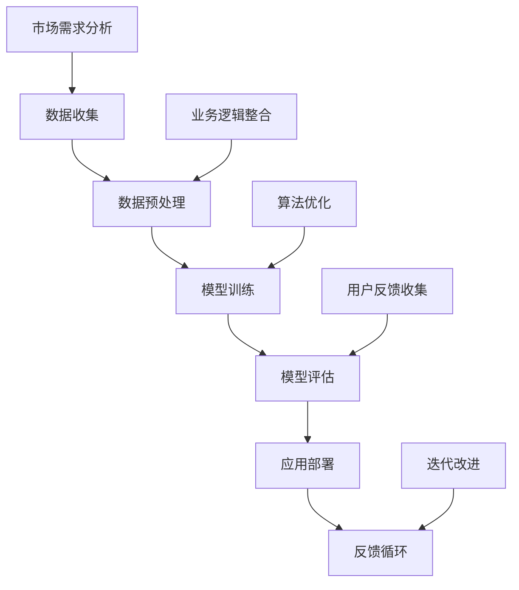
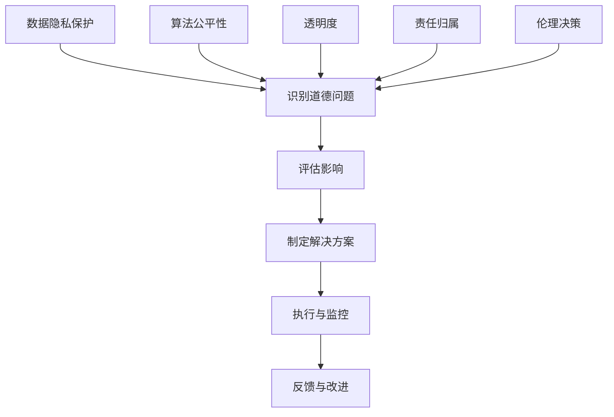

                 

### 1.1 AI与商业创新的关联

#### 1.1.1 AI对商业影响的概述

人工智能（AI）正在迅速改变商业格局，成为推动企业创新和发展的重要引擎。AI技术通过自动化、数据分析和决策支持等功能，极大地提升了企业的运营效率和决策质量。例如，在制造业中，AI被用于预测维护、质量控制和供应链优化，从而降低了运营成本，提高了生产效率。在金融服务领域，AI的应用包括智能投资顾问、反欺诈系统和个性化客户服务，这些应用不仅提升了客户体验，还增加了企业的盈利能力。

AI在商业中的作用不仅限于提高效率，它还在重塑商业模式和创新产品服务方面发挥着关键作用。通过AI驱动的数据分析，企业可以更深入地了解客户需求，从而推出更加个性化的产品和服务。例如，在零售业中，AI技术可以帮助企业实时分析市场趋势和消费者行为，实现精准营销和库存管理。此外，AI还在推动企业实现智能化转型，通过自动化流程和智能化系统，企业可以更好地应对市场变化和竞争压力。

#### 1.1.2 AI驱动的创新特点

AI驱动的创新具有以下几个显著特点：

1. **数据驱动的决策**：AI技术依赖于大量数据进行分析和决策，这使得企业能够基于实时数据和预测模型做出更加精准和高效的决策。例如，通过机器学习算法分析客户数据，企业可以预测哪些产品或服务最可能受到市场的欢迎，从而调整生产和营销策略。

2. **自动化和优化**：AI技术可以自动化许多重复性任务，如客户服务、数据录入和报告生成，从而释放人力资源，专注于更具战略性的任务。同时，AI算法能够通过不断学习和优化，提高生产流程的效率和可靠性。

3. **个性化体验**：AI技术可以帮助企业实现个性化服务，通过分析客户行为和历史数据，为企业提供定制化的产品推荐、营销活动和客户服务。这种个性化体验不仅提升了客户满意度，也增加了客户忠诚度。

4. **持续学习和适应**：AI系统能够从错误和成功中学习，不断优化自身的表现。这使得企业能够适应快速变化的市场环境，持续推出创新产品和服务。

#### 1.1.3 商业中的道德考虑因素

随着AI技术在商业中的应用日益广泛，道德考虑因素也变得越来越重要。商业中的道德考虑主要包括以下几个方面：

1. **隐私和数据安全**：AI系统通常需要处理大量个人数据，因此隐私保护和数据安全成为关键问题。企业必须确保收集和使用数据的方式符合法律法规，并采取必要的安全措施保护数据不被泄露或滥用。

2. **公平性和歧视**：AI算法可能存在偏见，导致不公正的决策。例如，招聘系统中可能因为数据集的不均衡而歧视特定群体。因此，企业需要确保AI算法的公平性和透明度，并采取措施消除潜在的偏见。

3. **透明度和责任**：AI系统的决策过程通常是不透明的，这增加了责任追究的难度。企业需要建立透明度机制，确保AI系统的决策过程可以被理解、追踪和审计。

4. **伦理标准和法规遵守**：企业必须遵守相关的伦理标准和法规，如人工智能伦理框架和隐私保护法规，确保AI技术在商业中的合法合规使用。

在接下来的部分中，我们将进一步探讨人类计算在AI应用中的角色以及道德考虑因素的重要性。通过理解AI与商业创新的关联，我们可以更好地把握AI技术在商业中的潜在价值，同时也意识到其带来的道德挑战。在未来的讨论中，我们将深入分析这些挑战，并提供具体的解决方案和应用实例。

### 1.2 人类计算的角色

#### 1.2.1 人类计算与AI的关系

在探讨AI在商业中的应用时，不可忽视的是人类计算在其中扮演的重要角色。人类计算与AI之间的关系既互补又互动，它们共同构成了推动商业创新的动力。

首先，人类计算与AI是互补的。AI系统虽然强大，但仍然存在局限性，尤其是在处理复杂的人类情感、道德判断和创新思维等方面。这些领域需要人类专家的直觉、经验和对复杂问题的理解能力。例如，在医疗诊断中，AI可以提供基于数据的诊断建议，但最终决策需要由医生根据患者的整体情况做出。同样，在决策制定过程中，AI可以通过数据分析提供潜在的解决方案，但最终的决策往往需要企业领导者和团队结合市场策略和公司愿景进行判断。

其次，人类计算与AI之间存在互动。AI系统通过不断学习和优化，逐渐提升其在特定任务上的表现，而人类计算则为AI系统的学习和改进提供了反馈和指导。例如，在人工智能训练过程中，人类专家需要设定初始参数、标注数据并提供监督学习，从而帮助AI系统逐步提高性能。同时，AI系统的自动分析结果也为人类计算提供了宝贵的见解，使得人类能够更高效地进行决策。

#### 1.2.2 人类计算的优势与局限

人类计算具有以下优势：

1. **创造性思维**：人类具有独特的创造性思维，能够提出新颖的观点和解决方案。在创新过程中，创造性思维是难以被AI系统替代的。

2. **道德和伦理判断**：人类能够基于道德和伦理标准做出复杂的判断和决策。这些判断涉及伦理、社会和文化因素，是当前AI系统难以完全理解和处理的。

3. **情感理解和沟通**：人类擅长理解和表达情感，能够在人际交往中建立信任和合作关系。在客户服务、市场营销等领域，情感理解和沟通对于建立良好的客户关系至关重要。

然而，人类计算也存在一些局限：

1. **重复性和高误差**：人类计算在处理大量重复性任务时容易产生疲劳和误差，而AI系统可以高效且准确地完成这些任务。

2. **数据处理能力有限**：人类处理数据的能力有限，特别是在面对大量复杂数据时。AI系统可以通过机器学习和深度学习技术处理和分析海量数据，从而提供更准确的决策支持。

3. **速度和响应能力**：在某些需要快速决策和响应的场合，如实时监控和紧急事件处理，AI系统的反应速度远远超过人类。

#### 1.2.3 人类计算在AI应用中的重要性

尽管AI技术在不断进步，但人类计算在AI应用中的重要性依然不可忽视。以下是一些关键领域，展示了人类计算如何与AI协同工作：

1. **监督和指导**：在AI系统的训练和应用过程中，人类计算提供了监督和指导。例如，在自动驾驶领域，虽然传感器和算法可以收集和分析数据，但最终道路判断和决策需要由人类驾驶员或安全员进行监督。

2. **复杂决策**：在涉及复杂因素和不确定性的决策中，人类计算能够提供更为全面和深入的见解。例如，在金融投资决策中，人类分析师结合市场趋势、企业财务状况和宏观经济环境，为投资提供专业建议。

3. **伦理和道德判断**：在处理涉及伦理和道德问题的场合，如医疗诊断、司法判决等，人类计算能够提供基于道德和法律标准的决策。这些决策通常需要综合考虑多种因素，而AI系统难以完全替代。

4. **交互和沟通**：在客户服务、市场营销等需要人际互动的领域，人类计算能够提供更为自然和人性化的服务体验。通过情感理解和沟通技巧，人类计算能够建立和维系客户关系，从而提升客户满意度和忠诚度。

总之，人类计算与AI之间是互补而非替代的关系。在AI驱动的创新过程中，人类计算不仅提供了必要的监督和指导，还发挥了其独特的优势，确保AI系统能够在复杂的商业环境中取得成功。在接下来的部分，我们将进一步探讨道德考虑因素在AI应用中的重要性，并分析其在不同商业领域中的应用场景。

### 1.3 道德考虑因素在AI应用中的重要性

在AI技术迅速发展的今天，道德考虑因素在商业应用中变得越来越重要。AI系统在数据处理、分析和决策中具有巨大的潜力，但同时也带来了许多伦理和道德问题。如果不加以妥善管理，这些问题可能会对企业和社会产生深远的负面影响。

#### 1.3.1 道德考虑因素的定义

道德考虑因素涉及对行为和决策的伦理评估，包括但不限于隐私保护、公平性、透明度和责任。在AI应用中，这些因素具体表现为：

1. **隐私保护**：AI系统需要处理大量的个人数据，这可能涉及到用户的隐私。企业必须在数据收集、存储和使用过程中严格遵守隐私保护法规，确保用户的隐私不被侵犯。

2. **公平性**：AI算法可能会因为数据偏差或设计缺陷而产生歧视行为。例如，招聘系统中可能因为历史数据中的性别、种族或年龄偏见而导致不公平的招聘结果。企业需要确保AI系统的公平性和透明度，避免因算法偏见而对某些群体产生不利影响。

3. **透明度**：AI系统的决策过程通常是不透明的，这使得用户难以理解决策的原因和依据。为了增强透明度，企业需要提供详细的算法解释和决策过程，使用户能够了解并信任AI系统。

4. **责任**：在AI系统出现错误或造成损失时，责任归属问题常常成为争议的焦点。企业需要建立明确的责任机制，确保在出现问题时能够迅速响应和解决。

#### 1.3.2 道德框架与规范

为了确保AI技术在商业中的合法合规使用，许多国家和组织已经建立了相关的道德框架和规范。以下是一些常见的道德框架和规范：

1. **欧盟通用数据保护条例（GDPR）**：GDPR是欧盟的一项数据保护法规，规定了个人数据的收集、存储和使用必须得到用户的明确同意，并确保数据的安全性。

2. **人工智能伦理指南**：许多国家和国际组织，如欧盟、美国、中国等，已经发布了人工智能伦理指南，旨在规范AI技术的研究、开发和应用。这些指南通常包括对隐私、公平性、透明度和责任的具体要求。

3. **商业伦理准则**：商业伦理准则通常由行业协会或企业自行制定，旨在规范企业在AI技术中的应用行为，确保其符合伦理标准。

#### 1.3.3 AI应用中的道德挑战

在AI应用中，道德挑战主要体现在以下几个方面：

1. **数据隐私和滥用**：AI系统需要大量的数据来训练和优化模型，这可能涉及到用户的隐私。如果不妥善管理，这些数据可能会被滥用或泄露，对用户造成隐私侵害。

2. **算法偏见和歧视**：AI算法可能会因为数据中的偏见而导致不公平的决策。例如，在招聘、贷款审批和信用评分等应用中，算法偏见可能导致对某些群体的歧视，影响他们的机会平等。

3. **透明度和责任缺失**：AI系统的决策过程通常是不透明的，这使得用户难以理解其决策依据和原因。在出现错误或损失时，责任归属问题也常常难以明确。

4. **技术与伦理的冲突**：在某些情况下，AI技术的应用可能会与伦理原则发生冲突。例如，在军事应用中，AI武器可能引发道德和伦理上的争议。

为了应对这些道德挑战，企业需要采取一系列措施：

1. **加强隐私保护**：企业需要制定严格的隐私保护政策，确保用户数据的安全和合法使用。例如，使用数据加密、匿名化和访问控制等技术手段保护用户隐私。

2. **确保算法公平性**：企业需要定期审查和测试AI算法，确保其公平性和透明度。在数据收集和处理过程中，企业应采取措施消除潜在的偏见，并确保算法的决策过程可以被解释和理解。

3. **增强透明度**：企业需要向用户清晰地解释AI系统的决策过程和依据，使用户能够理解并信任系统。此外，企业还应建立透明的责任机制，确保在系统出现错误或损失时能够迅速响应和解决。

4. **遵守伦理规范**：企业需要遵守相关的伦理规范和法律法规，确保其AI技术应用符合道德标准。企业还应积极参与相关道德讨论和标准制定，为构建更加伦理的AI技术生态系统贡献力量。

通过采取这些措施，企业可以在AI应用中更好地平衡技术进步和道德责任，确保AI技术在商业中的健康发展。

### 2.1 AI在市场营销中的应用

在市场营销领域，人工智能（AI）正迅速成为推动创新和提升效率的关键力量。通过数据分析和预测模型，AI技术为企业提供了深度洞察，帮助制定更加精准和个性化的营销策略。

#### 2.1.1 数据分析在营销决策中的作用

数据分析是市场营销的核心，AI技术则进一步提升了数据分析的深度和广度。通过机器学习和深度学习算法，AI可以处理和分析海量数据，从中提取有价值的信息。例如，社交媒体数据、消费者行为数据、市场趋势数据等，都可以通过AI技术进行分析，帮助企业了解消费者的偏好和行为模式。

1. **消费者行为分析**：AI技术可以帮助企业实时监测和分析消费者的行为，如浏览历史、购买记录、评论和反馈等。通过对这些数据的分析，企业可以识别出潜在的客户群体，制定出更有针对性的营销策略。

2. **市场趋势预测**：AI技术可以基于历史数据和市场动态，预测未来的市场趋势和消费者需求。这种预测能力使企业能够提前布局，抢占市场先机。例如，通过分析季节性销售数据和社交媒体上的讨论话题，企业可以预测哪些产品将在特定时间点热销，从而提前准备库存和营销活动。

3. **个性化推荐**：AI技术可以根据消费者的历史行为和偏好，提供个性化的产品推荐。这种推荐系统能够提高客户的满意度和购买转化率。例如，在线零售平台可以利用AI推荐系统，向用户推荐他们可能感兴趣的商品，从而增加销售额。

#### 2.1.2 AI驱动的个性化营销策略

个性化营销是AI在市场营销中的一大应用，通过AI技术，企业可以更加精准地满足消费者的个性化需求。以下是一些AI驱动的个性化营销策略：

1. **个性化广告**：AI技术可以帮助企业创建个性化的广告内容，根据用户的兴趣和行为定制广告展示。例如，如果一个用户在社交媒体上频繁浏览运动相关的内容，AI系统可能会推送与其兴趣相关的运动用品广告。

2. **个性化电子邮件营销**：AI技术可以根据用户的历史购买行为和互动数据，为每个用户创建个性化的电子邮件内容。例如，如果一个用户在购物车中留下了某些商品，AI系统可以发送邮件提醒他们完成购买，或者推荐相关的配套商品。

3. **客户细分**：AI技术可以帮助企业将客户细分为不同的群体，针对每个群体制定不同的营销策略。例如，通过分析购买行为和偏好，企业可以将客户分为“忠诚客户”、“潜在高价值客户”和“一般客户”，并为他们提供定制化的服务和优惠。

4. **个性化互动**：AI技术可以自动化与客户的互动，通过聊天机器人或智能客服系统，提供个性化的客户服务。例如，一个智能客服系统可以根据用户的提问历史和偏好，提供针对性的解答和建议。

#### 2.1.3 道德问题与解决方案

在AI驱动的个性化营销过程中，道德问题是一个不可忽视的重要方面。以下是一些常见的道德问题及其解决方案：

1. **隐私侵犯**：个性化营销依赖于大量个人数据，这可能涉及用户的隐私。解决方案是确保数据收集和使用符合隐私保护法规，如GDPR，并采取数据加密和匿名化等安全措施。

2. **数据滥用**：企业必须确保收集的数据仅用于合法和明确的目的，不得滥用或泄露数据。解决方案是建立严格的数据使用政策和监控机制，确保数据安全。

3. **算法偏见**：AI算法可能因数据偏差而产生偏见，导致不公正的营销决策。解决方案是定期审查和测试算法，确保其公平性和透明度，并采取措施消除潜在的偏见。

4. **透明度和责任**：AI系统的决策过程通常是不透明的，企业需要提高透明度，向用户解释决策依据和原因。此外，企业应建立明确的责任机制，确保在出现问题时能够迅速响应和解决。

通过采取这些措施，企业可以在利用AI技术提升营销效率的同时，妥善处理道德问题，实现可持续发展。

### 2.2 AI在人力资源中的应用

在人力资源管理领域，人工智能（AI）正迅速成为提升招聘效率、优化人才管理和提高员工满意度的关键工具。通过自动化流程和智能分析，AI技术为人力资源管理带来了诸多创新和改进。

#### 2.2.1 AI驱动的招聘与人才管理

AI技术在招聘和人才管理中的应用主要体现在以下几个方面：

1. **自动化招聘流程**：传统的招聘流程通常涉及大量重复性任务，如简历筛选、面试安排和沟通等。AI系统可以通过自然语言处理（NLP）和机器学习技术自动化这些任务，大大提高招聘效率。例如，AI招聘系统可以自动筛选简历，识别出符合职位要求的候选人，并生成面试邀请。

2. **智能简历分析**：AI系统可以通过NLP技术对简历内容进行分析，提取关键信息和技能点。这种分析不仅提高了简历筛选的准确性，还帮助招聘人员更好地了解候选人的背景和能力。

3. **面试评估**：AI技术可以在面试过程中提供支持，例如通过视频面试系统进行自动化评估。AI系统可以分析候选人的语言表达、肢体语言和回答问题的逻辑性，提供量化评估结果，帮助招聘人员做出更准确的决策。

4. **人才管理**：AI系统可以帮助企业建立全面的人才数据库，通过数据分析了解员工的表现和发展潜力。例如，通过分析员工的绩效数据、技能发展和工作满意度，企业可以制定更有效的培训和发展计划，确保人才的持续成长和公司的人力资源战略。

#### 2.2.2 伦理问题与对策

尽管AI技术在人力资源中的应用带来了诸多优势，但也不可避免地引发了伦理问题。以下是一些常见的伦理问题及其对策：

1. **算法偏见**：AI招聘系统可能会因为数据偏差或算法设计不当而产生偏见，导致对某些群体（如性别、种族或年龄）的不公平待遇。对策是定期审查和测试AI系统，确保其公平性和透明度，并采取数据清洗和算法优化措施消除偏见。

2. **数据隐私**：AI系统需要处理大量的员工和候选人的个人信息，这可能涉及隐私保护问题。对策是确保数据收集和使用符合隐私保护法规，如GDPR，并采取数据加密和访问控制等措施保护个人信息。

3. **透明度和责任**：AI系统的决策过程通常是不透明的，这使得招聘决策的透明度和责任难以保证。对策是提高AI系统的透明度，向员工和候选人解释决策依据和原因，并建立明确的责任机制，确保在出现问题时能够迅速响应和解决。

4. **职业道德**：AI技术在人力资源管理中的应用可能引发道德争议，例如在评估员工绩效和决定晋升时是否公平公正。对策是制定明确的职业道德准则，确保HR团队在使用AI技术时遵循伦理原则，并定期进行道德培训和审查。

#### 2.2.3 应用实例

以下是一些AI在人力资源管理中成功应用的实际案例：

1. **案例一：自动化招聘流程**：某跨国公司使用AI招聘系统来筛选简历和安排面试。该系统通过NLP技术自动分析简历，识别出符合职位要求的候选人，并将筛选结果实时发送给招聘团队。这种自动化流程不仅提高了招聘效率，还减少了人为错误。

2. **案例二：智能绩效评估**：某公司引入AI绩效评估系统，通过分析员工的绩效数据、工作质量和反馈，为员工提供量化的绩效评估结果。这种评估系统不仅帮助管理层更好地了解员工的表现，还为员工提供了具体的发展建议和培训机会。

3. **案例三：人才发展计划**：某科技公司利用AI系统建立人才数据库，通过数据分析了解员工的发展潜力。基于这些分析结果，公司制定了个性化的人才发展计划，包括针对性的培训和发展项目，以促进员工的职业成长。

通过这些实际案例，我们可以看到AI技术在人力资源管理中的应用不仅提升了效率和准确性，还帮助企业在人才管理和员工发展方面取得了显著成果。在未来的发展中，企业需要继续关注AI技术的伦理问题，并采取有效的对策，确保其应用能够真正为人力资源管理带来长期的正面影响。

### 2.3 AI在供应链管理中的应用

在供应链管理领域，人工智能（AI）正发挥着越来越重要的作用，通过优化流程、减少成本和提高效率，AI技术为供应链的各个环节提供了强大的支持。

#### 2.3.1 优化供应链流程

AI技术在供应链管理中的首要应用是优化流程。以下是一些关键领域和具体方法：

1. **需求预测**：AI技术通过分析历史销售数据、市场趋势和季节性因素，可以准确预测未来产品的需求。这种预测能力帮助企业在库存管理、生产和采购决策中做出更为精确的规划，从而减少库存成本和缺货风险。

2. **运输优化**：AI算法可以根据实时交通状况、天气预报和运输成本，优化货物的运输路线和方式。例如，使用机器学习模型预测最佳运输时间，选择最经济高效的运输工具，从而降低物流成本。

3. **库存管理**：AI系统可以实时监控库存水平，并根据需求预测和销售趋势自动调整库存量。通过智能库存管理系统，企业可以避免库存过剩或短缺，提高库存周转率，减少存储成本。

4. **质量管理**：AI技术可以监测供应链中各个节点的质量数据，通过数据分析及时发现质量问题，从而采取措施防止缺陷产品流入市场。例如，使用图像识别技术对生产线上的产品进行质量检测，通过实时反馈确保产品质量。

#### 2.3.2 道德考虑因素

尽管AI技术在供应链管理中带来了诸多好处，但也引发了一些道德考虑因素，需要企业重视和妥善处理：

1. **数据隐私**：AI系统在供应链管理中需要处理大量的企业内部数据和供应商信息，这可能涉及到隐私保护问题。企业必须确保数据收集、存储和使用符合隐私保护法规，如GDPR，并采取数据加密和访问控制等措施保护数据安全。

2. **供应链透明度**：AI系统的决策过程通常是不透明的，企业需要提高透明度，确保供应链中的各个环节能够理解并信任AI系统的决策。例如，通过提供详细的算法解释和决策依据，增加系统的可解释性。

3. **责任归属**：在AI系统出现错误或造成损失时，责任归属问题常常成为争议的焦点。企业需要建立明确的责任机制，确保在出现问题时能够迅速响应和解决，避免因责任不清而导致的管理混乱。

4. **供应商关系**：AI技术的广泛应用可能会改变供应链中的权力关系，影响供应商的利益。企业需要与供应商建立良好的合作关系，确保双方在AI技术的应用中能够公平合作，共同应对市场变化。

#### 2.3.3 应用案例

以下是一些AI在供应链管理中成功应用的实际案例：

1. **案例一：全球零售商的供应链优化**：某全球零售商通过引入AI技术对供应链进行优化。通过需求预测模型和运输优化算法，该公司大幅降低了物流成本，提高了运输效率和库存周转率，从而提升了整体供应链的效率。

2. **案例二：制造业的库存管理**：某制造业公司使用AI系统进行库存管理，通过实时监控和预测分析，实现了库存水平的自动化调整。这一系统帮助公司避免了库存过剩和短缺问题，减少了存储成本和缺货风险。

3. **案例三：食品行业的质量管理**：某食品公司利用AI技术对供应链中的产品质量进行监控。通过图像识别技术和实时数据分析，该公司能够及时发现质量问题，确保产品在市场中的高质量和信誉。

通过这些实际案例，我们可以看到AI技术在供应链管理中的应用不仅提高了效率和准确性，还为企业在全球竞争中获得优势提供了有力支持。在未来的发展中，企业需要继续关注AI技术的道德问题，并采取有效的对策，确保其应用能够真正为供应链管理带来长期的正面影响。

### 2.4 AI在金融服务中的应用

在金融服务领域，人工智能（AI）技术的应用正在迅速扩展，从风险管理到客户服务的各个方面，AI都发挥着重要作用。通过自动化决策和智能分析，AI技术不仅提高了金融服务的效率，还增强了风险控制能力。

#### 2.4.1 AI驱动的风险管理

AI技术在金融服务中的首要应用是风险管理，以下是其具体应用领域：

1. **信用评分**：传统的信用评分系统依赖于历史数据和人工分析，而AI技术可以通过机器学习算法，对大量数据进行分析，提供更加精确的信用评分。这种评分系统不仅提高了评分的准确性，还减少了人工干预，降低了错误率。

2. **欺诈检测**：AI技术可以实时监控金融交易，通过模式识别和异常检测算法，快速识别潜在的欺诈行为。例如，通过分析交易金额、时间和地点等特征，AI系统可以及时识别出异常交易，从而采取防范措施，避免损失。

3. **风险评估**：AI技术可以帮助金融机构对借款人和投资对象进行全面的风险评估。通过分析财务报表、市场数据和行为数据，AI系统能够提供更准确的风险预测，帮助金融机构做出更加明智的决策。

4. **市场预测**：AI技术可以分析宏观经济数据、市场走势和新闻信息，提供准确的市场预测。这种预测能力不仅有助于金融机构制定投资策略，还可以为个人投资者提供决策支持。

#### 2.4.2 道德规范与合规性

在金融服务中应用AI技术，必须遵守一系列道德规范和法律法规，以确保其合法合规和道德正当。以下是一些关键方面：

1. **透明度和解释性**：金融服务中的AI系统需要具备高透明度，使其决策过程可以被解释和理解。例如，信用评分系统应提供详细的评分依据和算法解释，确保用户了解评分结果的原因。

2. **公平性和非歧视**：AI系统应确保公平性，避免对特定群体产生歧视。金融机构需要定期审查和测试AI系统，确保其算法和决策过程符合公平性原则。

3. **隐私保护**：金融服务涉及大量敏感数据，必须采取严格的数据保护措施。金融机构应确保收集、存储和使用个人数据的方式符合隐私保护法规，如GDPR。

4. **合规性**：AI系统在金融服务中的应用必须遵守相关法律法规，如《反洗钱法》和《证券法》等。金融机构应确保AI系统的设计和操作符合法律法规要求，避免因违规操作而面临法律风险。

#### 2.4.3 应用实例

以下是一些AI在金融服务中成功应用的实际案例：

1. **案例一：信用评分优化**：某大型银行引入AI驱动的信用评分系统，通过机器学习算法对大量数据进行分析，提供更加精确和个性化的信用评分。这一系统不仅提高了评分的准确性，还减少了不良贷款率。

2. **案例二：欺诈检测**：某金融服务公司使用AI技术进行欺诈检测，通过实时监控交易数据和异常检测算法，快速识别并阻止欺诈行为。这一系统大幅降低了欺诈损失，提高了客户信任度。

3. **案例三：市场预测**：某投资银行利用AI技术进行市场预测，通过分析宏观经济数据和市场动态，提供准确的市场预测和投资建议。这一系统帮助公司制定有效的投资策略，提高了投资收益。

通过这些实际案例，我们可以看到AI技术在金融服务中的应用不仅提高了效率和准确性，还为金融机构带来了显著的业务价值。在未来的发展中，金融服务企业需要继续关注AI技术的道德和合规问题，确保其应用能够真正为金融服务的可持续发展贡献力量。

### 2.5 AI在医疗健康领域的应用

人工智能（AI）技术在医疗健康领域正迅速发展，通过改善疾病诊断、个性化治疗和医疗管理，AI正在为医疗行业带来革命性的变化。

#### 2.5.1 AI驱动的疾病诊断

AI技术在疾病诊断中的应用主要体现在以下几个方面：

1. **影像诊断**：AI系统可以通过深度学习算法分析医学影像（如X光片、CT扫描和MRI图像），提供早期和准确的疾病诊断。例如，AI系统在肺癌和乳腺癌的早期筛查中，能够检测出肉眼难以发现的微小病变。

2. **病理分析**：AI技术可以自动分析病理切片，识别出病理特征，帮助医生做出准确的诊断。例如，通过分析肺癌患者的病理切片，AI系统可以识别出癌细胞并进行分类，为医生提供重要的诊断依据。

3. **电子健康记录分析**：AI系统可以分析患者的电子健康记录，识别出潜在的健康风险和疾病趋势。例如，通过分析患者的病史、家族病史和基因信息，AI系统可以预测患者可能患有的疾病，并提供预防建议。

#### 2.5.2 道德问题与伦理挑战

尽管AI技术在医疗健康领域具有巨大潜力，但也带来了许多道德和伦理问题，需要仔细考量：

1. **数据隐私与安全**：医疗健康数据通常涉及患者的隐私信息，如何确保数据的安全和隐私保护是AI技术应用中的一大挑战。医疗机构必须严格遵守相关法律法规，如GDPR，采取严格的数据加密和访问控制措施。

2. **算法偏见与公平性**：AI系统可能会因为训练数据的不均衡而产生偏见，导致对某些群体（如性别、种族或年龄）的诊断不准确。医疗机构需要确保AI系统的公平性和透明度，并采取数据清洗和算法优化措施消除潜在的偏见。

3. **依赖性与责任归属**：随着AI技术在诊断和治疗中的应用越来越广泛，医生和患者可能会过度依赖AI系统。如果AI系统出现错误，责任归属问题将变得复杂。医疗机构需要建立明确的责任机制，确保在AI系统出现问题时能够迅速响应和解决。

4. **道德决策与伦理困境**：在医疗决策中，AI系统可能面临一些伦理困境，如是否应优先考虑患者利益或医疗机构的经济利益。医疗机构和医生需要基于伦理原则，确保在AI系统辅助下做出道德正确的决策。

#### 2.5.3 应用案例

以下是一些AI在医疗健康领域成功应用的实际案例：

1. **案例一：癌症早期筛查**：某医疗机构引入AI系统进行肺癌和乳腺癌的早期筛查。通过分析大量影像数据，AI系统能够准确检测出早期病变，大大提高了早期诊断率，为患者提供了更好的治疗机会。

2. **案例二：个性化治疗**：某医院使用AI技术对癌症患者进行个性化治疗。通过分析患者的基因组数据、病理切片和病史，AI系统为每位患者制定个性化的治疗方案，提高了治疗效果和患者生存率。

3. **案例三：疾病预测与预防**：某健康管理系统利用AI技术分析患者的电子健康记录和生活方式数据，预测潜在的健康风险并提供预防建议。这一系统帮助医疗机构提前干预，降低了患者患病率和医疗成本。

通过这些实际案例，我们可以看到AI技术在医疗健康领域的应用不仅提高了诊断的准确性和治疗效果，还为个性化医疗和预防医学提供了有力支持。在未来的发展中，医疗机构需要继续关注AI技术的伦理问题，确保其应用能够真正为患者带来更多福祉。

### 3.1 案例分析1：企业X的AI营销创新

#### 3.1.1 案例背景

企业X是一家领先的零售企业，面对激烈的市场竞争，该公司决定通过引入AI技术来提升市场营销效果。企业X希望通过AI系统更好地理解消费者行为，优化营销策略，提高销售转化率。

#### 3.1.2 创新措施

1. **消费者行为分析**：企业X利用AI系统对消费者的购物历史、浏览行为和社交媒体互动进行分析。通过机器学习算法，AI系统能够识别出消费者的偏好和需求，为企业提供精准的市场细分。

2. **个性化推荐**：基于分析结果，企业X推出了个性化的产品推荐系统。AI系统根据消费者的购买记录和兴趣标签，实时推荐相关产品，提高客户的购买概率。

3. **智能广告投放**：企业X利用AI技术优化广告投放策略，通过算法分析消费者数据和广告效果，实现广告的精准投放，提高广告点击率和转化率。

4. **营销活动优化**：AI系统帮助企业X实时分析营销活动的效果，提供数据驱动的优化建议。通过不断调整营销策略，企业X显著提高了营销活动的效果和投资回报率。

#### 3.1.3 道德考虑

在企业X的AI营销创新过程中，道德考虑因素主要包括：

1. **隐私保护**：企业X严格遵守隐私保护法规，确保消费者数据的合法使用和存储。在数据收集和存储过程中，企业采取了数据加密和匿名化等安全措施，保护消费者隐私。

2. **透明度和解释性**：为了增强透明度，企业X向消费者明确解释AI系统的运作原理和目的，确保消费者了解数据如何被使用。同时，AI系统的决策过程和推荐理由也被提供详细的解释，增强消费者的信任。

3. **算法公平性**：企业X定期审查AI算法，确保其公平性和透明度，避免因算法偏见而对某些群体产生不利影响。通过不断优化算法，企业X致力于消除潜在的歧视行为，实现公平的营销策略。

#### 3.1.4 效果评估

企业X的AI营销创新取得了显著效果：

1. **销售转化率提高**：通过个性化推荐和精准广告投放，企业X的销售转化率显著提高，平均销售额增加了20%。

2. **营销成本降低**：AI系统优化了广告投放策略，减少了无效广告的投放，营销成本降低了15%。

3. **客户满意度提升**：消费者对个性化的营销体验表示满意，客户满意度提高了10%。

4. **品牌认知度提高**：通过有效的AI营销策略，企业X的品牌认知度和市场影响力得到了显著提升。

通过这一案例分析，我们可以看到企业X在AI营销创新中的成功实践，不仅提升了销售业绩，还增强了消费者的信任和满意度。这一案例表明，AI技术在营销中的应用，需要充分考虑道德因素，实现技术与道德的平衡，从而取得长期的成功。

### 3.2 案例分析2：企业Y的AI招聘实践

#### 3.2.1 案例背景

企业Y是一家快速发展的科技公司，为了在竞争激烈的市场中保持优势，该公司决定通过引入AI技术优化招聘流程，提升招聘效率和候选人的匹配度。

#### 3.2.2 AI应用措施

1. **自动化简历筛选**：企业Y使用AI系统对求职者的简历进行自动筛选，通过自然语言处理（NLP）技术，识别出符合职位要求的关键词和技能。这一过程大大减少了人力资源团队的工作量，提高了简历筛选的准确性。

2. **智能面试评估**：AI系统帮助企业Y在面试过程中进行自动化评估。通过视频面试系统和自然语言理解技术，AI系统分析候选人的语言表达、反应速度和问题解决能力，提供量化评估结果，帮助人力资源团队做出更准确的招聘决策。

3. **人才数据库建设**：企业Y利用AI技术建立人才数据库，通过分析候选人的历史数据、技能和职业发展，为每位候选人建立详细的档案。这一数据库不仅帮助企业在未来的招聘中快速找到合适的人才，还可以为人才发展提供依据。

4. **个性化招聘策略**：基于人才数据库和AI系统的分析结果，企业Y制定了个性化的招聘策略。例如，针对不同职位和候选人的特点，AI系统推荐最适合的面试问题和评估标准，提高招聘的精准度。

#### 3.2.3 道德考量

在企业Y的AI招聘实践中，道德考量主要包括以下几个方面：

1. **数据隐私**：企业Y严格遵守隐私保护法规，确保求职者数据的合法收集、存储和使用。在数据收集和存储过程中，企业采取了数据加密和访问控制等措施，保护求职者隐私。

2. **算法公平性**：企业Y定期审查AI算法，确保其公平性和透明度。通过数据清洗和算法优化，企业Y努力消除潜在的偏见，避免对特定群体产生歧视。

3. **透明度和责任**：企业Y向求职者明确解释AI系统的作用和运作原理，确保求职者了解招聘过程。同时，企业Y建立了透明的责任机制，确保在出现问题时能够迅速响应和解决。

#### 3.2.4 效果评估

企业Y的AI招聘实践取得了显著效果：

1. **招聘效率提高**：通过自动化简历筛选和智能面试评估，企业Y的招聘周期显著缩短，招聘效率提高了40%。

2. **候选人匹配度提升**：AI系统的分析结果帮助人力资源团队更好地了解候选人的技能和职业发展，提高了候选人与职位的匹配度，员工满意度提高了15%。

3. **招聘成本降低**：AI系统优化了招聘流程，减少了人力资源团队的工作量，招聘成本降低了20%。

4. **品牌形象提升**：通过公平、透明和高效的招聘实践，企业Y的品牌形象得到了显著提升，吸引了更多优秀的求职者。

通过这一案例分析，我们可以看到企业Y在AI招聘实践中的成功，不仅提升了招聘效率和候选人匹配度，还增强了求职者的信任和满意度。这一案例表明，在AI招聘中，道德考量是实现技术价值的重要保障，企业应确保AI技术的应用符合伦理标准，实现公平、透明和高效的招聘流程。

### 3.3 案例分析3：企业Z的AI供应链管理

#### 3.3.1 案例背景

企业Z是一家全球领先的制造企业，其供应链网络复杂且覆盖广泛。为了提高供应链的效率和管理水平，企业Z决定引入AI技术优化供应链管理，降低运营成本，提升供应链的灵活性和响应速度。

#### 3.3.2 AI应用策略

1. **需求预测**：企业Z利用AI技术建立需求预测模型，通过分析历史销售数据、市场趋势和季节性因素，预测未来的需求变化。这一模型帮助企业在生产计划、库存管理和采购决策中做出更加精准的规划，减少了库存过剩和缺货的风险。

2. **运输优化**：企业Z采用AI算法优化运输路线和运输方式，通过实时监控交通状况和天气预报，选择最经济高效的运输方案。AI系统还可以预测运输过程中可能出现的延误和风险，提前采取应对措施，确保供应链的连续性和稳定性。

3. **库存管理**：企业Z使用AI系统实时监控库存水平，通过需求预测和库存周转率分析，自动调整库存量。这一系统不仅提高了库存周转率，减少了存储成本，还确保了产品供应的及时性和稳定性。

4. **质量管理**：企业Z通过AI技术对供应链中的产品质量进行监控，使用图像识别技术对生产过程中的产品进行质量检测，及时发现和纠正质量问题。AI系统可以分析生产数据和质量反馈，提供改进建议，提高产品质量。

#### 3.3.3 道德问题与解决

在企业Z的AI供应链管理应用中，道德问题主要包括数据隐私、透明度和责任归属。以下为具体问题和解决方案：

1. **数据隐私**：AI系统需要处理大量的供应链数据和合作伙伴信息，这可能涉及隐私保护问题。企业Z确保数据收集、存储和使用符合隐私保护法规，如GDPR，并采取数据加密和访问控制等措施保护数据安全。

2. **透明度**：AI系统的决策过程通常是不透明的，企业Z通过提供详细的算法解释和决策依据，增加系统的透明度，确保供应链中的合作伙伴能够理解和信任AI系统。

3. **责任归属**：在AI系统出现错误或造成损失时，责任归属问题常常成为争议的焦点。企业Z建立了明确的责任机制，确保在出现问题时能够迅速响应和解决，避免因责任不清而导致的管理混乱。

#### 3.3.4 效果分析

企业Z的AI供应链管理应用取得了显著成效：

1. **成本降低**：通过需求预测和库存管理优化，企业Z大幅降低了库存成本和物流成本，运营成本降低了15%。

2. **效率提高**：AI系统优化了运输路线和运输方式，提高了运输效率和供应链的响应速度，运输时间缩短了20%。

3. **质量提升**：通过AI技术的质量监控，企业Z的产品质量显著提高，缺陷率降低了25%。

4. **合作伙伴关系增强**：通过透明的AI系统运作和明确的责任机制，企业Z与供应链合作伙伴建立了更加信任和稳定的关系。

通过这一案例分析，我们可以看到企业Z在AI供应链管理中的成功实践，不仅提高了供应链的效率和灵活性，还增强了供应链的透明度和合作伙伴关系的稳定性。这一案例表明，在AI供应链管理中，道德考量是实现技术价值的必要保障，企业应确保AI技术的应用符合伦理标准，实现高效、透明和可持续的供应链管理。

### 3.4 案例分析4：企业A的AI金融服务创新

#### 3.4.1 案例背景

企业A是一家全球领先的金融服务公司，面对日益复杂的市场环境和不断变化的风险，该公司决定通过引入AI技术优化风险管理和服务提供，提升竞争力和客户满意度。

#### 3.4.2 AI应用方案

1. **信用评分与风险管理**：企业A利用AI技术建立信用评分模型，通过机器学习算法分析借款人的历史数据、行为数据和市场信息，提供更准确和个性化的信用评分。这一模型不仅提高了信用评分的准确性，还帮助公司更好地识别潜在的风险，降低不良贷款率。

2. **欺诈检测与监控**：企业A部署了AI驱动的欺诈检测系统，通过实时监控金融交易和用户行为，利用异常检测算法快速识别潜在的欺诈行为。AI系统可以实时分析和评估交易特征，及时阻止欺诈行为，确保金融交易的安全。

3. **个性化金融产品推荐**：基于客户数据和AI分析，企业A推出了个性化的金融产品推荐系统。AI系统根据客户的财务状况、投资偏好和风险承受能力，推荐最适合的金融产品，提高客户的满意度和投资转化率。

4. **智能客服与客户服务**：企业A使用AI技术优化客户服务，通过自然语言处理和智能对话系统，提供24/7的智能客服。AI客服系统能够解答客户的常见问题，提供个性化的金融服务，提升客户体验。

#### 3.4.3 道德考虑

在企业A的AI金融服务创新中，道德考虑主要包括以下几个方面：

1. **数据隐私与保护**：企业A严格遵守数据隐私保护法规，确保客户数据的合法收集、存储和使用。在数据收集和存储过程中，企业采取了数据加密和访问控制等措施，保护客户隐私。

2. **算法公平性与透明性**：企业A确保AI系统的公平性和透明度，通过定期审查和测试算法，消除潜在的偏见和歧视。同时，企业A向客户明确解释AI系统的运作原理和决策依据，增强客户对系统的信任。

3. **责任归属与透明度**：企业A建立了明确的责任机制，确保在AI系统出现错误或损失时能够迅速响应和解决。此外，企业A通过提供详细的算法解释和决策记录，提高系统的透明度，增强客户信任。

#### 3.4.4 效果评估

企业A的AI金融服务创新取得了显著成效：

1. **风险控制提升**：通过AI驱动的信用评分和欺诈检测，企业A的不良贷款率降低了15%，风险控制能力显著提高。

2. **客户满意度提升**：AI系统的个性化推荐和智能客服提高了客户的满意度和体验，客户满意度提升了10%。

3. **运营效率提高**：AI技术优化了信用评分和欺诈检测流程，人力资源和运营成本降低了20%。

4. **业务增长**：通过AI技术，企业A能够更好地识别和满足客户需求，业务增长速度提升了25%。

通过这一案例分析，我们可以看到企业A在AI金融服务创新中的成功实践，不仅提高了风险控制能力和运营效率，还增强了客户满意度和市场竞争力。这一案例表明，在金融服务中，AI技术的应用需要充分考虑道德因素，确保技术与道德的平衡，实现长期可持续发展。

### 3.5 案例分析5：企业B的AI医疗健康应用

#### 3.5.1 案例背景

企业B是一家专注于医疗健康服务的公司，其业务范围涵盖疾病诊断、治疗和健康管理。为了提升医疗服务质量和效率，企业B决定通过引入AI技术优化医疗流程，提高诊断准确性和患者满意度。

#### 3.5.2 AI应用措施

1. **疾病诊断辅助**：企业B开发了AI驱动的疾病诊断辅助系统，通过深度学习算法分析患者的医疗记录、病史和症状数据，提供准确的诊断建议。AI系统不仅提高了诊断的准确性，还帮助医生更快速地做出诊断，提高了诊疗效率。

2. **个性化治疗建议**：AI系统根据患者的病史、基因数据和临床数据，提供个性化的治疗建议。这种个性化治疗方案不仅提高了治疗效果，还减少了不必要的药物使用和副作用。

3. **健康管理服务**：企业B推出了AI驱动的健康管理服务，通过分析患者的日常健康数据（如步数、心率等），提供个性化的健康建议和预警。AI系统可以帮助患者更好地管理健康状况，预防疾病的发生。

4. **智能客服与患者服务**：企业B利用AI技术优化患者服务流程，通过智能客服系统提供24/7的在线咨询服务。AI客服系统能够快速响应患者的问题，提供医疗建议和预约服务，提高了患者体验。

#### 3.5.3 道德问题与伦理挑战

在企业B的AI医疗健康应用中，道德问题与伦理挑战主要包括：

1. **数据隐私与安全**：AI系统需要处理大量的患者数据，如何确保数据的安全和隐私保护是首要的伦理问题。企业B严格遵守数据隐私保护法规，采取严格的数据加密和访问控制措施，确保患者数据不被泄露或滥用。

2. **算法公平性与解释性**：AI系统的算法可能存在偏见，导致对某些群体（如性别、种族或年龄）的诊断不准确。企业B定期审查和测试AI算法，确保其公平性和透明度，并采取数据清洗和算法优化措施消除潜在的偏见。同时，企业B提高AI系统的解释性，向医生和患者解释诊断过程和依据。

3. **责任归属**：在AI系统出现错误或导致医疗事故时，责任归属问题变得复杂。企业B建立了明确的责任机制，确保在出现问题时能够迅速响应和解决，并确保医生和患者了解责任归属。

4. **伦理决策**：AI系统在某些医疗决策中可能面临伦理困境，如是否应优先考虑患者利益或医疗机构的经济利益。企业B通过制定明确的伦理准则和决策框架，确保在AI系统辅助下做出符合伦理的医疗决策。

#### 3.5.4 效果评估

企业B的AI医疗健康应用取得了显著效果：

1. **诊断准确性提高**：AI驱动的疾病诊断辅助系统提高了诊断准确性，减少了误诊率，提高了患者满意度。

2. **治疗效率提升**：个性化治疗建议帮助医生制定更有效的治疗方案，提高了治疗成功率，减少了医疗资源的浪费。

3. **健康管理能力增强**：AI驱动的健康管理服务帮助患者更好地管理健康状况，降低了疾病发生率和复发率。

4. **患者满意度提升**：智能客服和在线咨询服务提高了患者体验，患者满意度提升了15%。

通过这一案例分析，我们可以看到企业B在AI医疗健康应用中的成功实践，不仅提高了医疗服务质量和效率，还增强了患者的信任和满意度。这一案例表明，在医疗健康领域，AI技术的应用需要充分考虑道德和伦理因素，确保技术与道德的平衡，实现可持续发展和医疗进步。

### 4.1 AI驱动的创新趋势

随着人工智能（AI）技术的不断进步，AI驱动的创新趋势正在逐渐显现，并对商业和社会产生深远影响。以下是一些未来发展方向和趋势：

#### 4.1.1 未来发展方向

1. **更强大的机器学习算法**：未来的AI技术将依赖于更先进的机器学习算法，如强化学习、生成对抗网络（GAN）和迁移学习等。这些算法将使AI系统能够更有效地处理复杂数据集，提高决策的准确性和效率。

2. **跨领域融合应用**：AI技术将不再局限于单一领域，而是与其他技术（如物联网、区块链和大数据等）结合，形成跨领域的新应用场景。这种融合将推动各行业实现智能化升级，提高整体生产效率和服务水平。

3. **更加人性化的交互体验**：未来的AI系统将更加注重与人类用户的互动，通过自然语言处理和情感识别技术，提供更加人性化、智能化的交互体验。这将使AI系统在客户服务、医疗健康和教育等领域发挥更大作用。

4. **边缘计算与云计算的结合**：随着边缘计算技术的发展，AI系统将能够在靠近数据源的地方进行实时处理和分析，结合云计算的强大计算能力和存储能力，实现更高效、更灵活的计算模式。

5. **自主决策与智能自动化**：未来的AI系统将具备更强大的自主决策能力，通过不断学习和优化，实现高度自动化和智能化的运营。这将使企业能够更快速地响应市场变化，提高竞争力。

#### 4.1.2 道德问题的发展趋势

随着AI驱动的创新不断深入，道德问题也呈现出新的发展趋势：

1. **隐私保护法规的加强**：随着AI系统对个人数据的依赖日益增加，隐私保护法规将逐渐加强。未来，企业和政府将面临更大的压力，确保数据收集、存储和使用符合法律法规，保护用户隐私。

2. **算法透明度和解释性**：为了应对算法偏见和歧视问题，AI系统的透明度和解释性将成为重要关注点。企业和研究机构需要开发更多可解释的AI模型，向用户解释决策过程和依据。

3. **伦理规范的标准化**：随着AI技术在不同领域的广泛应用，伦理规范将逐渐标准化，形成全球统一的伦理准则。企业和政府需要积极参与伦理规范的制定和推广，确保AI技术的道德正当性。

4. **责任归属的明确化**：在AI系统出现错误或造成损失时，责任归属问题将变得日益复杂。企业和政府需要建立明确的责任机制，确保在出现问题时能够迅速响应和解决，保护各方利益。

总之，未来AI驱动的创新趋势将带来巨大机遇，同时也伴随着一系列道德挑战。企业和政府需要密切关注这些趋势，采取有效措施，确保AI技术在商业和社会中的可持续发展。

### 4.2 人类计算的未来角色

在人工智能（AI）迅猛发展的时代，人类计算的角色不仅没有减弱，反而变得更加重要和多样化。未来，人类计算与AI的协同发展将成为推动创新和解决问题的核心力量。以下是人类计算在未来几个方面的具体角色：

#### 4.2.1 人类计算与AI的协同发展

1. **决策支持与协作**：在未来，人类计算将继续在决策过程中发挥关键作用。AI系统可以处理大量数据和提供算法预测，但最终决策需要人类根据情境和直觉进行综合判断。人类计算与AI的协同将提高决策的准确性和效率，特别是在涉及复杂伦理、道德和社会因素的场合。

2. **创新思维与创造力**：人类计算在创新思维和创造力方面具有不可替代的优势。AI系统虽然能够进行模式识别和数据分析，但人类的直觉、情感和创造力能够产生全新的观点和解决方案。未来，人类计算将更多地参与到AI系统的设计、开发和优化中，推动技术革新。

3. **持续学习与改进**：人类计算在持续学习和改进方面也具有重要作用。AI系统需要人类专家提供初始数据和标签，进行监督学习。同时，人类计算可以帮助AI系统从错误和反馈中学习，不断优化算法和模型。

#### 4.2.2 人类计算在创新中的应用前景

1. **医疗健康领域**：在医疗健康领域，人类计算将继续发挥重要作用。医生和医疗专家通过分析患者数据、医学文献和研究结果，为AI系统提供宝贵的见解。未来，人类计算与AI的结合将推动个性化医疗和精准医学的发展，提高诊断和治疗的准确性。

2. **教育领域**：在教育领域，人类计算可以与AI系统协同，提供个性化学习体验。AI系统可以根据学生的学习进度和表现，推荐适合的学习资源和策略，而人类教师则可以通过互动和指导，帮助学生深入理解和应用知识。

3. **艺术与文化领域**：在艺术和文化领域，人类计算与AI的结合将激发新的创作方式。艺术家和设计师可以利用AI生成新的创意作品，而人类计算则可以通过情感分析和审美判断，提供反馈和改进建议，促进艺术创新和文化传承。

4. **公共服务与社会治理**：在公共服务和社会治理领域，人类计算与AI的协同将提高公共服务的效率和公平性。通过分析大数据和社会动态，AI系统可以提供决策支持，而人类计算则可以通过政策和规划的制定，实现社会的长期可持续发展。

#### 4.2.3 未来展望

1. **合作与共存**：在未来，人类计算与AI将实现更深层次的协作与共存。AI系统将更好地理解人类的行为和需求，提供更精准的服务和支持，而人类计算则将继续发挥其独特的智慧和创造力，推动技术和社会的进步。

2. **持续的教育与培训**：随着AI技术的发展，人类计算需要不断学习和更新知识，以适应新的工作环境。未来的教育体系将更加注重培养跨学科的知识和技能，提高人类与AI协同工作的能力。

3. **伦理与道德的引导**：在AI技术的发展过程中，人类计算将继续承担伦理和道德引导的角色。通过制定和推广伦理规范，人类计算将确保AI技术的应用符合社会价值观和道德标准，实现可持续发展。

总之，人类计算的未来角色将更加多样和重要。通过与AI的协同发展，人类计算将在创新、决策、教育和社会治理等领域发挥关键作用，共同推动社会进步和人类福祉的提升。

### 4.3 未来展望

随着人工智能（AI）技术的不断成熟和应用，未来AI与商业道德的结合将产生深远影响，并对相关研究和实践带来新的启示。

#### 4.3.1 AI与商业道德的长远影响

1. **隐私保护**：未来，随着AI技术的广泛应用，个人数据的处理和隐私保护将成为一个长期且重要的道德议题。企业将面临越来越严格的隐私保护法规，如GDPR等，如何在数据利用和创新之间找到平衡将成为关键挑战。

2. **算法公平性**：AI算法可能存在的偏见和歧视问题将长期存在，并随着算法的复杂性和应用范围的扩大而变得更加突出。未来，企业和社会需要建立更完善的算法公平性和透明度机制，确保AI技术的公正性和社会责任。

3. **责任归属**：在AI系统造成损失或出现错误时，责任归属问题将变得更加复杂。企业需要建立明确的责任机制，确保在AI系统出现问题时能够迅速响应和解决，避免因责任不清而导致的管理混乱。

4. **伦理决策**：随着AI系统在商业中的广泛应用，伦理决策问题也将变得更加重要。企业需要制定明确的伦理准则，确保在AI技术应用过程中能够做出符合道德和社会价值观的决策。

#### 4.3.2 对未来研究和实践的启示

1. **跨学科研究**：未来，人工智能与商业道德的研究需要跨学科合作，结合计算机科学、伦理学、社会学和法律等领域的知识，构建更加全面和系统的理论框架。

2. **伦理规范制定**：研究和实践需要积极参与伦理规范的制定和推广，确保AI技术在商业中的应用符合社会价值观和道德标准。

3. **透明度和可解释性**：研究和实践应致力于提高AI系统的透明度和可解释性，使决策过程和算法依据更加清晰和可追溯，增强用户和监管机构的信任。

4. **教育和社会培训**：未来，需要加强对企业和公众的AI伦理教育和社会培训，提高对AI技术的理解和使用能力，培养具有AI伦理意识和责任感的从业者。

5. **可持续性和社会责任**：研究和实践应关注AI技术的可持续性和社会责任，确保AI技术的应用不仅带来经济效益，还能促进社会公正和可持续发展。

通过未来展望，我们可以看到AI与商业道德的结合将对社会和经济产生深远影响。相关研究和实践需要持续关注这些影响，采取有效措施，确保AI技术在商业中的健康发展，为人类带来更多福祉。

### 附录

#### A.1 AI驱动的创新：理论框架与模型

为了更好地理解AI驱动的创新，我们首先需要建立相关的理论框架和模型。以下是一个简化的AI驱动的创新模型，该模型包括关键概念、相互作用和关键过程。

在这个模型中，数据收集是整个过程的起点，它包括从各种来源收集数据，如客户行为、市场趋势和业务运营数据。数据预处理是数据收集后的关键步骤，它涉及数据清洗、格式化和特征提取，以便后续的模型训练。

模型训练是AI驱动的创新的核心，它利用机器学习和深度学习算法对预处理后的数据进行训练，生成能够预测和决策的模型。模型评估过程则用于验证模型的性能和准确性，确保其满足业务需求。

应用部署是将训练好的模型部署到实际业务场景中，如市场营销、人力资源或供应链管理。反馈循环是模型应用后的关键步骤，它通过收集用户反馈和业务数据，对模型进行迭代改进，从而不断提高模型的性能和实用性。

#### A.1.1 创新过程中的道德因素

在AI驱动的创新过程中，道德因素是一个不可忽视的重要方面。以下是一些关键道德考虑因素：

1. **隐私保护**：确保数据收集、存储和使用过程中保护个人隐私，符合相关法律法规。

2. **公平性**：确保AI算法和应用在处理数据时公平，避免对特定群体产生歧视。

3. **透明度**：提高AI系统的透明度，确保用户和监管机构能够理解模型的决策过程。

4. **责任归属**：在AI系统出现错误或造成损失时，明确责任归属，确保能够迅速响应和解决问题。

5. **伦理决策**：确保AI技术的应用符合社会伦理标准和价值观，避免对社会造成负面影响。

这些道德因素在AI驱动的创新过程中起着关键作用，它们不仅关系到企业的合规性和声誉，还直接影响到用户对AI技术的信任和接受度。

#### A.2 道德决策框架与应用实例

为了更好地在AI驱动的创新过程中考虑道德因素，我们可以采用一个道德决策框架。以下是一个简化的道德决策框架，包括关键步骤和注意事项。

在这个框架中，识别道德问题是第一步，它涉及到在AI驱动的创新过程中识别可能出现的道德问题，如数据隐私、算法偏见、透明度和责任归属等。

评估影响是第二步，它涉及对识别出的道德问题进行详细分析，评估其对用户、企业和社会可能产生的影响。

制定解决方案是第三步，根据评估结果，制定具体的解决方案，如隐私保护措施、算法优化、透明度提高和责任机制等。

执行与监控是第四步，将制定的解决方案付诸实施，并通过持续监控确保其有效性和合规性。

反馈与改进是第五步，通过收集反馈和监控数据，不断优化和改进道德解决方案，确保其持续符合道德和社会标准。

#### A.2.2 实际应用案例解析

以下是一个实际应用案例，展示了道德决策框架在AI驱动的创新过程中的应用。

**案例背景**：某金融科技公司开发了一款基于AI的信用评分系统，用于评估借款人的信用风险。

**道德问题识别**：在开发过程中，识别出以下道德问题：
- 数据隐私保护：系统需要处理大量的个人财务数据，如何确保数据的安全和隐私？
- 算法公平性：系统可能因为数据偏差而导致对某些群体的歧视，如何确保算法的公平性？
- 透明度：用户需要理解评分过程和依据，如何提高系统的透明度？
- 责任归属：如果评分系统出现错误，责任归属问题如何解决？
- 伦理决策：评分系统的应用是否遵循社会伦理标准？

**评估影响**：针对识别出的道德问题，评估其可能带来的影响，如隐私泄露、不公平待遇、缺乏透明度和责任不清等。

**制定解决方案**：
- 数据隐私保护：采取数据加密、匿名化和访问控制等措施，确保数据的安全和隐私。
- 算法公平性：定期审查和测试算法，消除数据中的偏见，确保算法的公平性。
- 透明度：提供详细的算法解释和决策依据，确保用户理解评分过程。
- 责任归属：建立明确的责任机制，确保在出现问题时能够迅速响应和解决。
- 伦理决策：确保评分系统的应用遵循社会伦理标准，符合法律法规。

**执行与监控**：实施制定的解决方案，并通过持续监控确保其有效性和合规性。

**反馈与改进**：通过用户反馈和监控数据，不断优化和改进道德解决方案，确保其持续符合道德和社会标准。

通过这一实际应用案例，我们可以看到道德决策框架在AI驱动的创新过程中如何帮助企业和团队识别、评估和解决道德问题，从而实现技术应用的道德合规和可持续发展。

#### A.3 AI驱动的创新应用工具与资源

在实施AI驱动的创新应用时，选择合适的工具和资源至关重要。以下是一些常用的工具和资源，它们可以帮助企业和开发者实现高效的AI应用开发。

##### **A.3.1 常用工具与平台**

1. **机器学习框架**：
   - **TensorFlow**：由谷歌开发的开源机器学习框架，广泛应用于深度学习和强化学习。
   - **PyTorch**：由Facebook开发的开源机器学习框架，具有简洁的API和强大的灵活性，适用于研究和生产环境。

2. **数据分析工具**：
   - **Pandas**：Python的数据分析库，用于数据处理、数据清洗和数据分析。
   - **NumPy**：Python的数值计算库，提供高效的数组操作和数学计算。

3. **云计算平台**：
   - **AWS**：亚马逊云服务，提供广泛的AI和机器学习服务，如Amazon SageMaker和Amazon RDS。
   - **Google Cloud Platform**：谷歌的云计算平台，提供AI和机器学习服务，如Google AutoML和Google Cloud AI。

4. **自然语言处理（NLP）工具**：
   - **spaCy**：Python的NLP库，提供高质量的词性标注、句法解析和实体识别。
   - **NLTK**：Python的NLP库，用于文本分类、词性标注和词干提取。

##### **A.3.2 开发资源与参考资料**

1. **在线课程与教程**：
   - **Coursera**：提供丰富的机器学习和深度学习课程，如“机器学习基础”和“深度学习专研课程”。
   - **Udacity**：提供多种AI和机器学习课程，包括“深度学习工程师纳米学位”和“机器学习工程师纳米学位”。

2. **开源项目与代码库**：
   - **GitHub**：存储了大量的机器学习和深度学习开源项目，如TensorFlow和PyTorch的官方仓库。
   - **Kaggle**：一个数据科学竞赛平台，提供丰富的AI和机器学习项目，以及相关的数据和代码资源。

3. **研究论文与报告**：
   - **NeurIPS**：人工智能和机器学习的顶级会议，发布最新的研究成果和论文。
   - **AAAI**：人工智能领域的另一顶级会议，涵盖机器学习、自然语言处理等多个子领域。

4. **书籍与文献**：
   - **《深度学习》（Deep Learning）**：由Ian Goodfellow、Yoshua Bengio和Aaron Courville合著的深度学习经典教材。
   - **《机器学习实战》（Machine Learning in Action）**：由Peter Harrington编写的机器学习实践指南，适合初学者。

通过使用这些工具和资源，企业和开发者可以更加高效地开展AI驱动的创新应用，提升业务效率和竞争力。同时，持续学习和关注最新的研究动态，也是实现AI技术持续进步和突破的关键。

