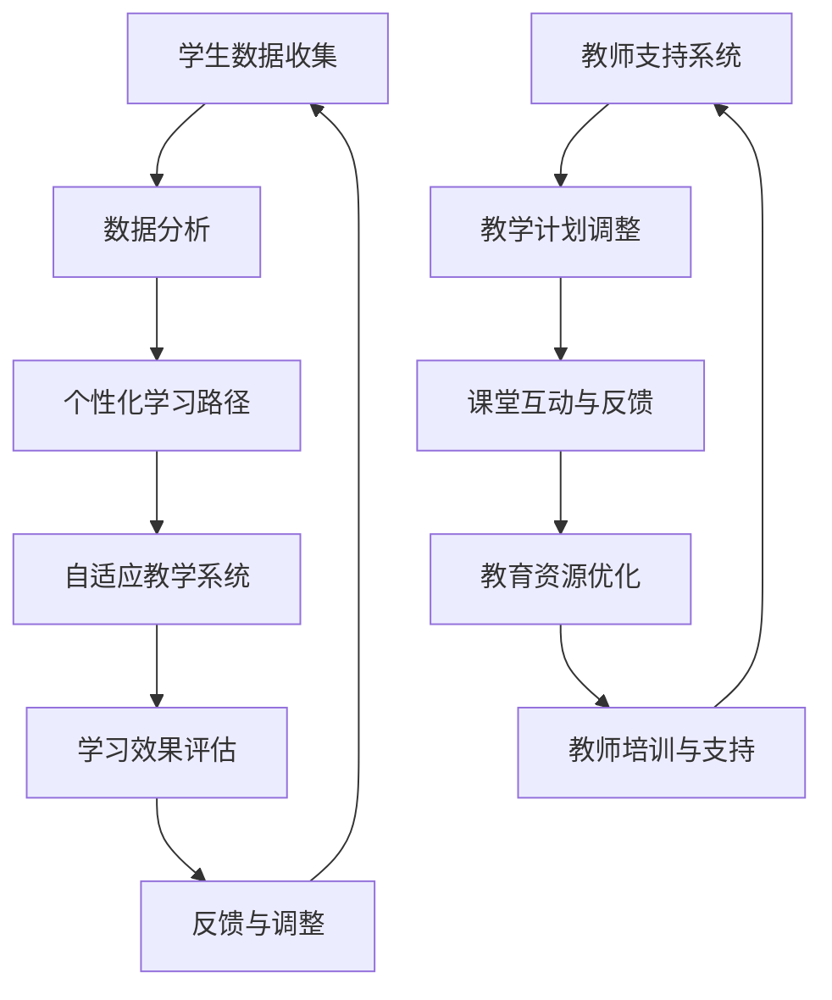

                 

# 引言

## 1.1 AI在教育中的应用现状

### 1.1.1 AI在教育中的技术应用

#### 1.1.1.1 个性化学习

个性化学习是近年来AI在教育中应用的一个重要方向。通过收集和分析学生的行为数据、学习历史以及兴趣爱好，AI系统可以为学生提供定制化的学习路径和资源。这种模式不仅能提高学习效率，还能激发学生的学习兴趣和主动性。

- **基于AI的个性化学习系统**：例如，智能教学系统Knewton和DreamBox都是利用人工智能技术来适应学生的个性化学习需求。Knewton通过分析学生的学习数据，动态调整教学内容和难度，确保学生能够以最适合自己的方式学习。DreamBox则利用游戏化的教学方式，通过不断调整学习路径来适应学生的能力水平。

- **个性化学习的实现方法**：个性化学习系统的实现依赖于多种技术手段，包括机器学习、数据挖掘、自然语言处理等。其中，机器学习算法尤为重要，通过学习学生的历史数据和行为模式，算法能够预测学生在未来的学习过程中可能遇到的困难和需求，从而提供相应的帮助。一个典型的个性化学习算法可以用以下伪代码表示：

```python
def personalized_learning(student_data, course_content):
    # 分析学生数据
    student_profile = analyze_student_data(student_data)
    # 调整课程内容
    adapted_content = adapt_course_content(course_content, student_profile)
    # 提供个性化学习路径
    learning_path = generate_learning_path(adapted_content)
    return learning_path
```

- **情感分析**：情感分析技术在个性化学习中也发挥了重要作用。通过分析学生的情感状态，AI系统能够更好地理解学生的心理需求，从而提供更加贴心的服务。例如，一些在线学习平台会利用情感分析技术来识别学生的情绪变化，并在学生感到沮丧或困惑时提供额外的帮助。

- **数据分析**：数据分析是个性化学习的基础。通过收集和分析大量数据，教育机构可以更好地了解学生的学习习惯、学习效果以及学习需求，从而制定更加科学和有效的教学策略。例如，教师可以利用数据分析技术来识别学生的学习瓶颈和弱点，从而有针对性地进行辅导。

#### 1.1.1.2 自动评分系统

自动评分系统是AI在教育中的另一个重要应用。传统的作业和考试评分通常由教师完成，这不仅耗时费力，而且容易出现主观偏差。而AI评分系统能够自动化完成这一任务，大大提高了评分效率和准确性。

- **自动批改作业**：AI评分系统可以通过自然语言处理技术自动批改学生的作业。例如，数学题可以通过算法自动判断答案的正确性，而作文题则可以通过文本分析技术评估文章的结构和语言表达。这样的系统不仅能够节省教师的时间，还能为教师提供更详细的学生成绩分析。

- **自动评分标准制定**：AI评分系统还可以帮助教师制定更加科学和客观的评分标准。通过分析大量的学生成绩数据，系统可以识别出不同题目的评分规律和标准，从而帮助教师调整评分标准，提高评分的公平性和一致性。

- **应用案例**：在许多在线学习平台和考试系统中，AI评分系统已经得到了广泛应用。例如，Coursera和edX等在线教育平台就使用了AI评分系统来自动批改作业和考试。这些系统不仅提高了评分的效率，还为学生提供了即时反馈，帮助他们更好地理解和掌握知识。

### 1.1.2 AI如何改变教育模式

#### 1.1.2.1 个性化学习

个性化学习是AI改变教育模式的一个重要方面。传统的教育模式通常采用“一刀切”的方式，即所有学生使用相同的教学内容和进度。这种方式无法满足每个学生的个性化需求，导致许多学生感到学习枯燥乏味，学习效果不佳。

- **AI驱动的个性化学习**：通过AI技术，教育系统可以更加灵活地适应每个学生的学习节奏和能力水平。例如，AI系统能够根据学生的学习历史和兴趣爱好，推荐适合他们的学习资源和练习题。此外，AI系统还可以根据学生的学习进度和效果，动态调整教学策略，确保每个学生都能够获得最适合自己的学习体验。

- **案例**：例如，美国的一些学校已经开始使用AI驱动的个性化学习系统，如Cognii和DreamBox。这些系统能够根据学生的实时表现和反馈，自动调整教学内容和难度，为学生提供个性化的学习路径。研究表明，这种个性化学习模式可以显著提高学生的学习兴趣和学习效果。

#### 1.1.2.2 模式识别与适应

除了个性化学习，AI还在模式识别与适应方面发挥了重要作用。通过分析大量数据，AI系统能够识别出学生的学习模式和习惯，从而更好地适应他们的需求。

- **情感识别**：情感识别技术可以帮助AI系统更好地理解学生的情感状态。例如，一些在线学习平台会使用情感识别技术来分析学生的情绪变化，并在学生感到困惑或挫败时提供额外的帮助。这种技术不仅有助于提高学生的学习效果，还能增强师生之间的互动和沟通。

- **学习行为分析**：通过分析学生的学习行为数据，AI系统可以识别出学生的学习习惯和偏好。例如，一些系统会根据学生的学习时间、学习频率和学习内容，推荐最适合他们的学习资源和策略。这种模式识别与适应能力可以大大提高教育的针对性和有效性。

- **应用案例**：例如，Coursera和edX等在线教育平台已经采用了情感识别和学习行为分析技术，以提供更加个性化的学习体验。这些平台不仅能够实时监测学生的情感状态和学习行为，还能根据这些数据为学生提供个性化的学习建议和指导。

#### 1.1.2.3 数据驱动的课程设计

数据驱动的课程设计是AI改变教育模式的另一个重要方面。通过分析大量的学生学习数据，教育机构可以更加科学和有效地设计课程内容和教学策略。

- **课程内容调整**：通过分析学生的学习数据，教育机构可以识别出哪些内容是学生难以理解和掌握的，从而对课程内容进行相应的调整。例如，一些教育机构会根据学生的学习反馈，增加或减少某些教学环节，以确保学生能够更好地掌握知识。

- **适应不同学习需求**：AI系统可以根据学生的学习需求和兴趣，提供个性化的学习路径和资源。例如，一些在线教育平台会根据学生的学习记录和偏好，推荐最适合他们的学习资源和课程。这种适应性设计可以大大提高学生的学习积极性和学习效果。

- **案例**：例如，一些大学已经采用了数据驱动的课程设计方法，通过分析学生的学习数据，动态调整课程内容和教学方法。这种模式不仅提高了学生的学习效果，还增强了教学与学生的互动和参与度。

#### 1.1.2.4 模拟与虚拟现实教学

模拟与虚拟现实教学是AI改变教育模式的又一重要应用。通过模拟和虚拟现实技术，学生可以在虚拟环境中进行实践操作，获得更加直观和生动的学习体验。

- **模拟教学**：模拟教学可以为学生提供真实世界的实践操作体验。例如，医学专业的学生可以通过虚拟手术模拟器进行手术练习，提高实践技能。工程专业的学生可以通过虚拟实验平台进行实验操作，加深对理论知识的理解。

- **虚拟现实教学**：虚拟现实教学可以为学生提供沉浸式的学习体验。例如，历史专业的学生可以通过虚拟现实技术参观历史遗迹，获得更加直观的历史感知。语言学习专业的学生可以通过虚拟现实技术进行语言实践，提高口语表达能力。

- **应用案例**：例如，一些大学已经采用了虚拟现实技术进行模拟教学和虚拟实验室。这些技术不仅为学生提供了更加丰富和直观的学习体验，还提高了学生的实践能力和创新意识。

## 1.2 人类计算的概念

### 1.2.1 人类计算的定义与特点

#### 1.2.1.1 人类计算的定义

人类计算是指人类在认知、推理、决策、学习等过程中所采用的方法和策略。它涵盖了人类在解决问题、处理信息、进行创造性思考等方面的能力。与机器计算相比，人类计算具有独特的特点：

- **适应性**：人类计算能够根据环境和情境的变化，灵活调整行为策略。例如，当面对复杂的问题时，人类可以通过试错和反思来找到最优解决方案。
- **创造性**：人类计算具有创造新想法和新解决方案的能力。例如，艺术家通过独特的创意创作出精美的艺术作品，科学家通过创新的实验设计发现新的科学规律。
- **经验依赖**：人类计算很大程度上依赖于经验。例如，医生通过多年的临床经验积累，能够准确判断患者的病情，并制定有效的治疗方案。
- **灵活多变**：人类计算能够应对复杂和多变的情境。例如，当遇到突发事件时，人们可以迅速调整自己的行为策略，以应对新的挑战。

#### 1.2.1.2 人类计算在教育中的意义

人类计算在教育中具有重要作用，主要体现在以下几个方面：

- **提高学习效率**：人类计算能够帮助学生更快地理解新知识，通过经验调整学习策略，提高学习效率。例如，通过类比和归纳，学生可以更好地理解和掌握复杂的理论知识。
- **促进创新能力**：人类计算鼓励学生思考和创新，通过自主探索和问题解决，提高创新能力。例如，通过项目式学习，学生可以提出自己的创意和解决方案，培养创新思维。
- **优化教育资源分配**：人类计算能够帮助教师更好地了解学生的需求，从而优化教育资源的分配。例如，通过观察和分析学生的学习行为，教师可以制定更加科学和有效的教学计划。

### 1.2.2 人类计算在教育中的意义

#### 1.2.2.1 提高学习效率

人类计算在教育中能够显著提高学习效率。这是因为人类计算具有以下几个特点：

- **经验依赖**：人类通过丰富的经验，能够快速识别和理解新知识。例如，当学生遇到一个新概念时，教师可以通过类比和归纳，将新知识与学生的已有知识体系联系起来，帮助学生更好地理解和掌握。
- **适应性**：人类计算能够根据学生的个体差异，灵活调整教学策略。例如，对于学习进度较慢的学生，教师可以采取更加细致和耐心的教学方法，确保他们能够跟上课程进度；对于学习进度较快的学生，教师可以提供更高难度和更具挑战性的学习任务，激发他们的学习兴趣和潜能。
- **创造性**：人类计算鼓励学生进行创造性思考，提出新的观点和解决方案。例如，通过项目式学习，学生可以自主设计实验、提出假设并验证，从而培养创新思维和解决问题的能力。

#### 1.2.2.2 促进创新能力

人类计算在教育中能够促进学生的创新能力。这是因为人类计算具有以下几个特点：

- **灵活性**：人类计算能够应对复杂和多变的情境，鼓励学生从不同角度思考和解决问题。例如，当学生遇到一个复杂的问题时，教师可以引导学生从多个维度进行分析和探索，从而找到更多的解决方案。
- **经验依赖**：人类通过丰富的经验，能够更好地理解和应用创新思维。例如，当学生提出一个新颖的观点时，教师可以通过自己的经验和知识，帮助学生验证和完善这个观点。
- **创造性**：人类计算鼓励学生进行创造性思考，提出新的观点和解决方案。例如，通过项目式学习，学生可以自主设计实验、提出假设并验证，从而培养创新思维和解决问题的能力。

#### 1.2.2.3 优化教育资源分配

人类计算在教育中能够优化教育资源的分配，主要体现在以下几个方面：

- **个性化教学**：通过分析学生的学习行为和需求，人类计算可以提供个性化的教学服务。例如，对于学习能力较弱的学生，教师可以提供额外的辅导和资源支持；对于学习能力较强的学生，教师可以提供更具挑战性的任务和项目，以激发他们的学习兴趣和潜能。
- **资源整合**：人类计算能够整合和优化教育资源，提高教育资源的利用效率。例如，教师可以通过对学生的学习数据分析，制定更加科学和有效的教学计划，确保每个学生都能够获得最适合自己的教育资源。
- **教育公平**：人类计算可以帮助教育机构更好地了解学生的学习需求和困难，从而提供更加公平和优质的教育服务。例如，对于来自不同背景和地区的学生，教育机构可以通过人类计算技术，提供差异化的教学支持和资源，确保每个学生都能够获得公平的学习机会。

## 1.3 AI与人类计算的融合

### 1.3.1 AI赋能人类计算

#### 1.3.1.1 人工智能辅助人类认知

人工智能可以通过数据分析、模式识别等技术，辅助人类更好地理解和处理信息。例如，在医学领域，人工智能可以通过分析大量的医学影像数据，帮助医生更准确地诊断疾病。在教育领域，人工智能可以通过分析学生的学习数据，为教师提供更加科学和有效的教学建议。

- **数据分析**：人工智能可以通过对大量数据进行分析，发现数据中的规律和趋势。例如，在教育领域，人工智能可以通过分析学生的学习数据，识别出学生的学习难点和弱点，为教师提供针对性的教学建议。
- **模式识别**：人工智能可以通过模式识别技术，帮助人类识别和分类数据。例如，在图像识别领域，人工智能可以通过模式识别技术，识别出图像中的物体和场景。

#### 1.3.1.2 人工智能增强人类推理能力

人工智能可以通过模拟和预测，增强人类的推理能力。例如，在金融领域，人工智能可以通过模拟市场数据，预测股票价格的变化趋势，帮助投资者做出更明智的投资决策。

- **模拟**：人工智能可以通过模拟现实世界的情境，帮助人类更好地理解和应对复杂问题。例如，在军事领域，人工智能可以通过模拟战斗场景，帮助指挥官制定更有效的作战计划。
- **预测**：人工智能可以通过分析历史数据，预测未来的发展趋势。例如，在天气预测领域，人工智能可以通过分析历史气象数据，预测未来的天气变化。

### 1.3.2 人类计算促进AI发展

#### 1.3.2.1 人类创造力推动AI算法创新

人类的创造力是推动人工智能算法创新的重要动力。例如，在深度学习领域，人类的创造力推动了神经网络、卷积神经网络等算法的创新和发展。

- **算法创新**：人类的创造力推动了人工智能算法的创新和发展。例如，在计算机视觉领域，人类的创造力推动了卷积神经网络（CNN）的发明和应用，使得计算机可以更准确地识别和分类图像。
- **应用创新**：人类的创造力推动了人工智能在不同领域的应用创新。例如，在医疗领域，人类的创造力推动了人工智能在疾病诊断、药物研发等方面的应用，为医疗行业带来了巨大的变革。

#### 1.3.2.2 人类经验优化AI模型

人类的经验可以优化人工智能模型，使其更好地适应实际应用场景。例如，在自动驾驶领域，人类的驾驶经验可以帮助优化自动驾驶算法，提高自动驾驶系统的安全性和可靠性。

- **模型优化**：人类经验可以帮助优化人工智能模型，提高其性能和准确性。例如，在语音识别领域，人类的语音经验可以帮助优化语音识别算法，提高语音识别的准确率和稳定性。
- **应用优化**：人类经验可以帮助优化人工智能在不同领域的应用，提高其实际应用价值。例如，在金融领域，人类的金融经验可以帮助优化金融预测模型，提高金融预测的准确性和稳定性。

### 1.3.3 AI与人类计算的融合趋势

随着人工智能技术的不断发展，AI与人类计算的融合趋势日益显著。以下是一些融合趋势：

- **协同工作**：人工智能将与人类共同工作，发挥各自的优势。例如，在医疗领域，人工智能将与医生协同工作，共同诊断疾病和制定治疗方案。
- **智能辅助**：人工智能将作为人类的智能辅助工具，帮助人类更高效地完成任务。例如，在办公领域，人工智能将辅助人类进行文档整理、数据分析等工作。
- **人机交互**：人工智能将与人类进行更加自然和高效的人机交互。例如，在智能家居领域，人工智能将通过自然语言处理技术，与用户进行语音交互，实现智能家居的控制。

## 1.4 AI驱动的教育创新展望

### 1.4.1 AI在教育中的作用与挑战

#### 1.4.1.1 AI在教育中的积极作用

AI在教育中的应用具有广泛的前景和显著的积极作用：

- **个性化学习**：AI可以帮助教育机构实现真正的个性化学习，根据每个学生的学习习惯、兴趣和能力提供定制化的教学方案。
- **教育公平**：通过智能化的教育资源分配和个性化教学，AI可以缩小教育资源差距，促进教育公平。
- **教学效率**：AI可以通过自动化评分、教学助手等功能提高教师工作效率，使教师能够专注于更有创造性的教学活动。
- **教育资源**：AI可以整合和优化大量的教育资源，提供更加丰富和多样化的学习材料。

#### 1.4.1.2 AI在教育中面临的挑战

尽管AI在教育中具有巨大潜力，但其应用也面临一系列挑战：

- **数据隐私**：大规模数据收集和使用引发了隐私问题，如何保护学生的个人信息成为一个重要的伦理和法律问题。
- **技术依赖**：过度依赖AI可能会导致学生和教师的技能退化，降低他们在没有技术支持下的学习和教学能力。
- **技术偏见**：AI系统可能会受到数据偏见的影响，导致不公正的评估和决策。
- **成本问题**：引入和维持AI系统需要较高的技术投入和运营成本，这可能会对资源有限的学校造成负担。

### 1.4.2 未来发展趋势

未来，AI在教育中的应用将继续深入发展，以下是几个可能的发展趋势：

- **智能化教学**：AI将进一步提升教学智能化水平，通过智能辅导系统、自适应学习平台等，实现更加个性化和高效的教学。
- **混合学习**：AI与人类教师的结合将推动混合学习模式的普及，发挥AI的自动化和个性化学科优势，同时保留人类教师的互动和指导作用。
- **跨学科整合**：AI将促进跨学科的教育整合，通过跨领域的知识共享和资源整合，为学生提供更加全面和深入的学习体验。
- **教育评估**：AI将改进教育评估方式，通过多维度的数据分析提供更加科学和全面的评估结果，帮助教师和学生更好地了解学习效果。

### 1.4.3 人类计算与AI的融合

人类计算与AI的融合将成为未来教育创新的关键方向：

- **协同教学**：人类教师与AI系统的协同教学将最大化各自的优势，人类教师负责情感交流和教育指导，AI系统负责数据处理和自动化任务。
- **创新思维**：人类计算将激发AI的创造性思维，通过人类的直觉和经验，推动AI算法的创新和发展。
- **人机协作**：在教育领域，人机协作将成为常态，人类和AI系统共同参与教学过程，为学生提供更加丰富和多样化的学习体验。

### 1.4.4 教育创新工具与资源

为了实现AI驱动的教育创新，需要一系列的工具和资源支持：

- **开放教育资源**：开放教育资源（OER）将为教育创新提供丰富的素材，通过AI技术进行整合和优化，为学生提供个性化的学习资源。
- **智能学习平台**：智能学习平台将整合AI技术，提供自适应学习、智能辅导、虚拟实验等功能，为学生提供更加灵活和高效的学习体验。
- **教育科研支持**：教育科研机构将利用AI技术进行教育研究和实验，推动教育理论和实践的创新发展。

总之，AI驱动的教育创新具有巨大的潜力，但也面临诸多挑战。通过人类计算与AI的深度融合，可以推动教育的智能化和个性化发展，为培养未来人才提供有力支持。

### 1.5 AI驱动的教育创新体系架构

为了更好地理解AI驱动的教育创新体系架构，我们可以使用Mermaid流程图来展示各个组成部分及其相互关系。以下是一个简化的示例：



在这个流程图中：

- **A 学生数据收集**：收集学生的学习行为数据，包括学习时间、学习内容、作业成绩等。
- **B 数据分析**：利用数据分析技术处理学生数据，识别学习模式和趋势。
- **C 个性化学习路径**：根据数据分析结果，生成适应学生个性化需求的学习路径。
- **D 自适应教学系统**：实现个性化学习路径，提供自适应的教学内容和资源。
- **E 学习效果评估**：监控学生的学习进度和效果，提供反馈。
- **F 反馈与调整**：根据评估结果，调整学习路径和教学内容。
- **G 教师支持系统**：为教师提供教学支持和资源优化建议。
- **H 教学计划调整**：根据学生反馈和教学需求，调整教学计划。
- **I 课堂互动与反馈**：增强课堂互动，收集学生反馈。
- **J 教育资源优化**：优化教育资源的分配和使用。
- **K 教师培训与支持**：为教师提供培训和支持，提升教学能力。

这个架构展示了AI驱动的教育创新体系如何通过数据驱动、自适应教学、教师支持等多个环节相互协作，实现个性化教育和高效教学。

### 1.6 核心算法原理讲解

#### 1.6.1 个性化学习算法的实现原理

个性化学习算法是AI驱动的教育创新的核心之一。它的实现原理主要包括以下几个关键步骤：

1. **数据收集与预处理**：
   - **收集学生数据**：包括学习行为数据（如学习时间、学习内容、作业成绩等），心理行为数据（如情绪、动机等），以及社交网络数据（如同学互动、讨论等）。
   - **数据预处理**：清洗数据，去除噪声和异常值，并进行特征提取，将原始数据转换为适合算法处理的格式。

2. **学生模型建立**：
   - **学习模式分析**：通过分析学生的学习行为数据，建立学生个性化学习模型。模型中可以包括学习策略、学习习惯、学习风格等参数。
   - **兴趣与能力评估**：利用机器学习算法对学生数据进行分析，评估学生的兴趣和潜在能力，为个性化学习提供依据。

3. **教学内容与路径生成**：
   - **动态调整学习路径**：基于学生模型和实时学习数据，算法会生成适合该学生的个性化学习路径。路径中会包括学习内容、学习任务、学习资源等。
   - **个性化推荐系统**：利用推荐算法为学生推荐最适合他们的学习资源和练习题，以提高学习效果。

4. **实时反馈与优化**：
   - **学习效果监控**：通过持续监控学生的学习进度和效果，算法会实时调整学习路径和内容，确保学生能够按照最佳路径学习。
   - **反馈机制**：根据学生的反馈和评估结果，算法会不断优化和更新个性化学习模型。

以下是实现个性化学习算法的一个简化的伪代码：

```python
# 数据收集与预处理
def preprocess_data(student_data):
    # 清洗数据
    cleaned_data = clean_data(student_data)
    # 特征提取
    features = extract_features(cleaned_data)
    return features

# 学生模型建立
def build_student_model(features):
    # 学习模式分析
    learning_model = analyze_learning_patterns(features)
    # 兴趣与能力评估
    interest和能力 = evaluate_interest和能力(learning_model)
    return learning_model, interest和能力

# 教学与路径生成
def generate_learning_path(learning_model, interest和能力):
    # 动态调整学习路径
    learning_path = create_adaptive_path(learning_model, interest和能力)
    # 个性化推荐
    recommended_resources = recommend_resources(learning_path)
    return learning_path, recommended_resources

# 实时反馈与优化
def optimize_learning_path(learning_path, student_feedback):
    # 学习效果监控
    learning_effect = monitor_learning_effect(learning_path)
    # 调整学习路径
    updated_path = update_learning_path(learning_path, learning_effect, student_feedback)
    return updated_path
```

#### 1.6.2 自动评分算法的实现原理

自动评分算法是AI在教育中的一个重要应用，其实现原理主要包括以下几个关键步骤：

1. **题目解析**：
   - **题目理解**：利用自然语言处理（NLP）技术，对题目进行语义分析和结构化处理，提取关键信息和要求。

2. **学生答案解析**：
   - **答案提取**：从学生提交的答案中提取出关键信息，进行文本预处理，去除无关信息。
   - **答案分析**：利用文本分析技术，分析学生答案的结构、语法、逻辑等，评估答案的正确性和质量。

3. **评分标准制定**：
   - **标准学习**：利用机器学习技术，从大量已标记的数据中学习评分标准。
   - **标准应用**：将学到的评分标准应用到新题目和学生的答案中，进行自动评分。

4. **评分结果反馈**：
   - **评分结果分析**：分析自动评分结果，提供详细的分数和评估报告。
   - **反馈机制**：根据评分结果和学生的反馈，不断优化评分算法和标准。

以下是实现自动评分算法的一个简化的伪代码：

```python
# 题目解析
def parse_question(question):
    # 语义分析
    question_structure = analyze_question_semantics(question)
    return question_structure

# 学生答案解析
def parse_answer(answer, question_structure):
    # 提取关键信息
    answer_data = extract_key_info(answer, question_structure)
    # 答案分析
    answer_evaluation = analyze_answer(answer_data)
    return answer_evaluation

# 评分标准制定
def learn_scoring Standards(question_data, answer_data):
    # 学习评分标准
    scoring Standards = train_scoring_model(question_data, answer_data)
    return scoring Standards

# 评分结果反馈
def score_answer(answer_evaluation, scoring Standards):
    # 应用评分标准
    score = apply_scoring_Standards(answer_evaluation, scoring Standards)
    # 分析评分结果
    score_report = analyze_score(score)
    return score_report
```

通过上述算法原理，AI能够实现对学生作业的自动评分，为教师提供高效、准确的评估结果，同时为学生提供即时反馈，帮助他们改进学习。

### 1.7 数学模型与数学公式

在教育AI中，数学模型和数学公式起着至关重要的作用，特别是在个性化学习和智能评估领域。以下是一些关键的概念和相关的数学模型：

#### 1.7.1 个性化学习路径优化

个性化学习路径优化的核心是找到一条最优路径，使学生在最短的时间内达到最佳学习效果。这个优化问题可以建模为一个线性规划问题：

$$
\min \sum_{i=1}^{n} c_i x_i
$$

其中，$x_i$ 表示第 $i$ 个学习资源或任务的选择，$c_i$ 表示选择第 $i$ 个资源或任务的成本（如学习时间、难度等）。约束条件包括：

$$
\sum_{i=1}^{n} x_i = 1 \quad (\text{必须完成所有任务})
$$

$$
x_i \geq 0 \quad (\text{资源或任务不能被负选择})
$$

#### 1.7.2 学习效果评估模型

学习效果评估模型通常使用回归模型来预测学生的学习成绩。一个简单的线性回归模型可以表示为：

$$
Y = \beta_0 + \beta_1 X + \epsilon
$$

其中，$Y$ 表示学习成绩，$X$ 表示学习投入（如学习时间、作业数量等），$\beta_0$ 和 $\beta_1$ 是模型参数，$\epsilon$ 是误差项。

#### 1.7.3 情感分析模型

情感分析模型用于评估学生的情绪状态，通常使用分类模型来处理情感标签。一个二分类逻辑回归模型可以表示为：

$$
\log\frac{P(Y=1|X)}{1-P(Y=1|X)} = \beta_0 + \beta_1 X
$$

其中，$Y$ 表示情感标签（如积极或消极），$X$ 表示文本特征向量，$\beta_0$ 和 $\beta_1$ 是模型参数。

#### 1.7.4 适应性学习算法

适应性学习算法通常使用动态规划或强化学习技术来优化学习路径。一个简单的Q-learning算法可以表示为：

$$
Q(S, A) = \frac{1}{N(S, A)} \sum_{s'} P(S' | S, A) \max_{a'} Q(S', A')
$$

其中，$S$ 表示当前状态，$A$ 表示行动，$S'$ 表示下一个状态，$A'$ 表示下一个行动，$Q(S, A)$ 是状态-行动值函数，$N(S, A)$ 是状态-行动对出现的次数，$P(S' | S, A)$ 是状态转移概率。

#### 1.7.5 数学公式的实际应用

在个性化学习中，数学模型可以帮助教师和AI系统动态调整教学内容和进度，以提高学习效果。例如，通过分析学生的学习历史数据和成绩预测，教师可以为学生定制个性化的学习计划。

在情感分析中，数学模型可以帮助教育系统识别学生的情感状态，从而提供针对性的支持和帮助。例如，如果学生表现出消极情绪，系统可以提供额外的学习资源或心理辅导。

通过上述数学模型和公式的应用，AI在教育中能够实现更加智能化和个性化的教学，为学生提供更好的学习体验。

### 1.8 AI驱动的教育应用案例

为了更深入地了解AI驱动的教育创新，我们可以探讨一些实际应用案例，分析其优势、挑战及未来展望。

#### 1.8.1 案例介绍

**案例 1**：Coursera平台

- **背景**：Coursera是一家全球知名的在线教育平台，提供大量大学课程和专业证书课程。它利用AI技术，通过个性化学习路径和自适应评估系统，为用户提供更加个性化的学习体验。
- **应用**：Coursera平台使用AI技术来分析用户的学习行为和进度，根据这些数据推荐最适合的学习资源和课程。此外，平台还使用了智能评估系统来自动批改作业和考试，提供即时反馈。

**案例 2**：Khan Academy

- **背景**：Khan Academy是一家非营利性教育组织，提供免费的在线课程和教育资源。它利用AI技术，通过个性化的学习系统和智能辅导系统，帮助用户提高学习效果。
- **应用**：Khan Academy的平台通过分析学生的学习行为和成绩，自动生成个性化的学习路径，并为学生提供智能辅导，帮助学生克服学习难点。

#### 1.8.2 案例分析

**案例 1：Coursera平台**

- **优势**：
  - **个性化学习**：通过AI分析用户的学习行为和进度，Coursera能够为用户提供个性化的学习资源和课程推荐。
  - **自动评估**：AI驱动的自动评估系统能够快速、准确地批改作业和考试，为用户提供即时反馈，节省了教师的时间。
  - **资源丰富**：Coursera平台提供了大量的在线课程，用户可以根据自己的兴趣和需求选择学习内容。

- **挑战**：
  - **数据隐私**：大规模数据收集和使用引发了隐私问题，如何保护用户的个人信息成为一个重要的伦理和法律问题。
  - **技术依赖**：过度依赖AI可能会导致用户在缺乏技术支持的情况下难以完成学习任务。
  - **技术偏见**：AI系统可能会受到数据偏见的影响，导致评估结果的不公正。

- **未来展望**：随着AI技术的不断进步，Coursera有望进一步优化其个性化学习和评估系统，提高用户体验。同时，Coursera也需要在数据隐私保护和算法公平性方面做出更多的努力。

**案例 2：Khan Academy**

- **优势**：
  - **个性化辅导**：Khan Academy通过分析学生的学习行为和成绩，能够为学生提供个性化的学习建议和辅导。
  - **教育资源**：Khan Academy提供了大量的免费教育资源，使得更多的学生能够获得优质的教育机会。
  - **互动性**：Khan Academy的平台鼓励学生之间的互动和讨论，提高了学习的趣味性和参与度。

- **挑战**：
  - **课程质量**：由于平台提供的是免费的课程，课程质量可能参差不齐，需要确保课程内容的专业性和权威性。
  - **个性化不足**：虽然Khan Academy提供了个性化辅导，但个性化程度可能还有提升空间，以更好地满足不同学生的学习需求。

- **未来展望**：Khan Academy可以通过进一步优化其个性化辅导系统和课程资源，提高学生的学习效果和满意度。此外，Khan Academy还可以探索与其他教育机构和企业的合作，扩大其教育资源的覆盖范围。

#### 1.8.3 案例启示与未来趋势

从上述案例中，我们可以得出以下启示：

- **个性化学习**：AI技术在教育中的应用可以显著提高个性化学习的程度，为不同背景和需求的学生提供定制化的学习体验。
- **自动评估**：AI驱动的自动评估系统可以提高评估效率和准确性，为教师和学生提供即时反馈，优化教学和学习过程。
- **教育资源**：AI技术可以帮助整合和优化教育资源，提高教育资源的利用效率，扩大优质教育资源的覆盖范围。

未来的教育趋势将是更加智能化和个性化的教学，AI技术将在其中发挥关键作用。同时，教育机构需要关注数据隐私保护、技术依赖和算法公平性等问题，确保AI技术能够为教育带来真正的价值。

### 第2章：AI驱动的教学策略

## 2.1 教学模式创新

### 2.1.1 个性化学习

个性化学习是近年来教育领域的一个重要研究方向，通过利用人工智能技术，为每个学生提供个性化的学习体验。这种模式不仅能够提高学习效率，还能激发学生的学习兴趣和主动性。以下是关于个性化学习的详细探讨。

#### 2.1.1.1 基于AI的个性化学习系统

AI驱动的个性化学习系统是一种基于数据分析、机器学习和自然语言处理等技术的智能系统，能够根据学生的学习行为、兴趣和能力，动态调整学习内容和路径，从而实现个性化教学。

- **学习行为分析**：系统通过收集和分析学生的行为数据，如学习时间、学习内容、作业成绩等，了解学生的学习习惯、偏好和难点。
- **学习路径生成**：基于学习行为分析结果，系统可以生成个性化的学习路径，为学生推荐适合的学习内容和任务。
- **学习效果评估**：系统实时监控学生的学习进度和效果，提供反馈和建议，帮助教师和学生不断调整学习策略。

#### 2.1.1.2 个性化学习的实现方法

实现个性化学习的关键在于如何准确捕捉和理解学生的个性化需求，以下是一些常见的方法：

- **数据驱动**：通过收集和分析大量的学生数据，如学习行为、成绩、兴趣爱好等，利用数据挖掘和机器学习技术，识别出学生的学习特征和需求。
- **知识图谱**：构建知识图谱，将学生的知识结构和学习需求进行可视化，以便更好地理解和指导个性化学习。
- **智能推荐**：利用推荐算法，根据学生的学习历史和偏好，为学生推荐合适的学习资源和任务。
- **情感分析**：通过情感分析技术，理解学生的情感状态，提供情感支持和调整学习策略。

#### 2.1.1.3 AI驱动的个性化学习系统案例

以下是几个AI驱动的个性化学习系统案例：

- **Knewton**：Knewton是一个智能学习平台，利用AI技术为学生提供个性化的学习建议。它通过分析学生的学习行为和成绩，动态调整教学内容和难度，提高学习效果。
- **DreamBox**：DreamBox是一个面向K-12学生的个性化学习平台，通过游戏化的教学方式和AI算法，为学生提供个性化的学习路径和任务。
- **Coursera**：Coursera是一个在线学习平台，利用AI技术分析用户的学习行为，为用户提供个性化的课程推荐和学习建议。

#### 2.1.1.4 个性化学习的挑战与展望

尽管个性化学习具有巨大潜力，但其实现也面临一些挑战：

- **数据隐私**：个性化学习依赖于大量学生数据，如何保护学生的隐私成为一个重要问题。
- **技术依赖**：过度依赖AI可能导致学生在没有技术支持的情况下难以完成学习任务。
- **算法公平性**：AI算法可能会受到数据偏见的影响，导致评估和推荐结果的不公平。

未来的个性化学习将朝着更加智能化、自适应和高效的方向发展，通过不断优化算法和技术，实现更加精准和个性化的学习体验。

### 2.1.2 模式识别与适应

模式识别与适应是AI驱动的教育创新中的另一个重要方向，通过分析学生的学习行为和模式，系统能够更好地理解学生的需求，并提供个性化的支持和指导。以下是对模式识别与适应的详细探讨。

#### 2.1.2.1 情感识别

情感识别技术在教育AI中具有重要意义，它可以帮助系统了解学生的情感状态，从而提供更加贴心的服务和帮助。情感识别通常涉及以下步骤：

- **情感分析**：通过自然语言处理（NLP）技术，对学生的文本输入（如作文、聊天记录等）进行分析，提取情感特征。
- **情感分类**：利用机器学习算法，将提取的情感特征分类为积极、消极或中性等。
- **情感反馈**：根据学生的情感状态，系统可以提供相应的情感支持，如鼓励、安慰或指导。

#### 2.1.2.2 学习行为分析

学习行为分析是模式识别与适应的核心，通过分析学生的学习行为数据，系统可以识别出学生的学习模式、偏好和难点。以下是一些常见的学习行为分析方法：

- **行为数据收集**：收集学生的学习行为数据，如学习时间、学习内容、作业提交情况等。
- **行为模式识别**：利用数据挖掘和机器学习技术，分析学生的学习行为，识别出常见的模式。
- **学习偏好分析**：根据学生的学习行为数据，分析学生的学习偏好，如喜欢哪种类型的题目、哪种学习方式等。
- **学习难点识别**：通过分析学生的错误记录和考试成绩，识别出学生遇到的难点和瓶颈。

#### 2.1.2.3 个性化支持

基于情感识别和学习行为分析的结果，系统可以为学生提供个性化的支持和指导，包括：

- **学习策略调整**：根据学生的情感状态和学习行为，系统可以动态调整学习策略，如提供额外的练习题、调整学习进度等。
- **情感支持**：当学生表现出消极情绪时，系统可以提供鼓励和安慰，帮助学生克服学习困难。
- **学习资源推荐**：根据学生的学习偏好和难点，系统可以推荐适合的学习资源和练习题。

#### 2.1.2.4 模式识别与适应的挑战与展望

尽管模式识别与适应技术在教育AI中具有巨大潜力，但其实现也面临一些挑战：

- **数据隐私**：情感识别和学习行为分析需要收集大量学生数据，如何保护学生的隐私是一个重要问题。
- **算法公平性**：AI算法可能会受到数据偏见的影响，导致评估和推荐结果的不公平。
- **技术成熟度**：情感识别和学习行为分析技术仍在不断发展，需要进一步提高其准确性和稳定性。

未来的模式识别与适应技术将朝着更加智能化、自适应和高效的方向发展，通过不断优化算法和技术，实现更加精准和个性化的教育支持。

### 2.1.3 数据驱动的课程设计

数据驱动的课程设计是一种基于数据分析的教育模式，通过收集和分析学生的各种学习数据，教育者可以更好地理解学生的学习需求和效果，从而动态调整课程内容和教学方法。以下是对数据驱动的课程设计的详细探讨。

#### 2.1.3.1 数据收集与预处理

数据驱动的课程设计首先需要收集大量的学习数据，这些数据可以包括：

- **学习行为数据**：如学生的在线学习时间、学习频率、参与度、作业提交情况等。
- **学习成果数据**：如学生的考试成绩、作业评分、课堂表现等。
- **学习环境数据**：如课程难度、课程内容、教学资源等。
- **学生背景数据**：如学生的年级、性别、学习能力等。

收集到的数据通常需要进行预处理，包括数据清洗、数据整合和数据标准化等步骤，以确保数据的质量和一致性。

#### 2.1.3.2 数据分析

预处理后的数据可以用于数据分析，通过数据挖掘和机器学习技术，可以识别出以下信息：

- **学生群体特征**：分析不同群体（如年级、性别、能力等）的学习行为和效果，了解他们的学习需求和问题。
- **学习模式**：识别学生的常见学习模式，如高频学习时段、常用学习资源等。
- **学习瓶颈**：分析学生在学习过程中遇到的难点和瓶颈，为教学调整提供依据。
- **课程效果**：评估不同课程的教学效果，识别出受欢迎和效果不佳的课程。

#### 2.1.3.3 课程内容调整

基于数据分析的结果，教育者可以动态调整课程内容，包括：

- **内容优化**：根据学生的学习效果和需求，调整课程内容的深度和难度，确保课程内容既具挑战性又能被学生理解。
- **资源整合**：优化教学资源的配置，根据学生的使用情况调整资源的提供，确保教学资源的高效利用。
- **个性化定制**：为不同能力水平的学生提供个性化的学习内容，满足他们的学习需求。

#### 2.1.3.4 适应不同学习需求

数据驱动的课程设计能够更好地适应不同学习需求，具体措施包括：

- **差异化教学**：根据学生的学习效果和需求，提供差异化的教学内容和进度，确保每个学生都能获得适合的学习体验。
- **个性化辅导**：利用数据分析结果，为学习困难的学生提供额外的辅导和支持，帮助他们克服学习难题。
- **实时反馈**：通过数据分析，及时了解学生的学习状况，提供实时反馈和指导，帮助学生调整学习策略。

#### 2.1.3.5 数据驱动的课程设计优势

数据驱动的课程设计具有以下优势：

- **科学性**：基于数据分析的结果，课程设计更加科学和有据可依。
- **灵活性**：能够根据学生的学习反馈和效果，动态调整课程内容和教学方法，提高教学适应性。
- **个性化**：能够更好地满足不同学生的学习需求，提高教学效果和学生的学习体验。

#### 2.1.3.6 数据驱动的课程设计挑战

尽管数据驱动的课程设计具有显著优势，但其在实际应用中仍面临一些挑战：

- **数据质量**：数据质量直接影响数据分析的准确性，需要确保数据的准确性和完整性。
- **技术依赖**：数据驱动的课程设计高度依赖数据分析技术，如何确保技术的可靠性和有效性是一个重要问题。
- **伦理问题**：数据收集和使用可能涉及学生隐私，需要处理好数据隐私保护与教学需求之间的关系。

总之，数据驱动的课程设计为教育创新提供了新的思路和方法，通过不断优化数据分析和课程调整策略，可以更好地满足学生的个性化学习需求，提高教学效果。

### 2.1.4 模拟与虚拟现实教学

模拟与虚拟现实教学是近年来教育领域的一个重要趋势，通过利用虚拟现实（VR）和增强现实（AR）技术，为学生提供更加生动、直观的学习体验。以下是对模拟与虚拟现实教学的详细探讨。

#### 2.1.4.1 模拟教学的优势

模拟教学通过模拟现实世界的情境，为学生提供实践操作的机会，具有以下优势：

- **提高实践能力**：通过模拟教学，学生可以在虚拟环境中进行实践操作，提高动手能力和解决问题的能力。
- **增强学习兴趣**：虚拟现实技术可以创造沉浸式的学习体验，激发学生的学习兴趣和参与度。
- **降低学习成本**：模拟教学可以避免实际操作带来的风险和成本，如实验室设备、实验材料等。
- **提高学习效率**：虚拟环境可以提供实时反馈和指导，帮助学生快速掌握知识和技能。

#### 2.1.4.2 虚拟现实教学的应用

虚拟现实教学在多个教育领域中得到了广泛应用，以下是一些典型的应用场景：

- **医学教育**：医学生可以通过虚拟手术模拟器进行手术练习，提高实践技能和操作熟练度。
- **工程教育**：学生可以通过虚拟实验室进行实验操作，模拟真实工程环境，加深对理论知识的理解。
- **历史教育**：学生可以通过虚拟现实技术参观历史遗迹，获得更加直观的历史感知和体验。
- **语言学习**：学生可以通过虚拟现实技术进行语言实践，提高口语表达能力和听力理解能力。

#### 2.1.4.3 模拟教学案例

以下是一个虚拟现实教学的案例：

- **案例背景**：某医学院引入虚拟手术模拟系统，用于医学生的手术技能培训。
- **应用过程**：
  - **教学准备**：医学生在虚拟手术模拟系统中选择手术案例，系统提供详细的手术步骤和注意事项。
  - **手术模拟**：学生在虚拟手术环境中进行手术操作，系统实时监控手术过程，提供实时反馈和指导。
  - **评估与反馈**：手术完成后，系统对学生的手术操作进行评估，提供详细的评估报告，帮助学生发现自身不足并进行改进。

#### 2.1.4.4 虚拟现实教学的发展趋势

随着技术的不断进步，虚拟现实教学将朝着更加智能化、互动化和普及化的方向发展：

- **沉浸式体验**：虚拟现实技术将进一步提升沉浸式体验，使学生能够更加真实地感受虚拟环境。
- **跨学科整合**：虚拟现实技术将与其他学科（如计算机科学、心理学等）结合，提供跨学科的教育解决方案。
- **普及化应用**：虚拟现实设备的价格将逐渐降低，使其在更多教育场景中得到广泛应用。
- **教学资源丰富**：虚拟现实教学资源将更加丰富和多样化，满足不同学科和层次学生的学习需求。

总之，模拟与虚拟现实教学为教育带来了新的机遇和挑战，通过不断创新和优化，虚拟现实技术将在教育领域发挥更大的作用。

### 2.2 教学内容创新

#### 2.2.1 数据驱动的课程设计

数据驱动的课程设计是一种基于数据分析的教育模式，通过收集和分析学生的各种学习数据，教育者可以更好地理解学生的学习需求和效果，从而动态调整课程内容和教学方法。以下是对数据驱动的课程设计的详细探讨。

#### 2.2.1.1 课程内容调整

数据驱动的课程设计首先需要收集大量的学习数据，这些数据可以包括：

- **学习行为数据**：如学生的在线学习时间、学习频率、参与度、作业提交情况等。
- **学习成果数据**：如学生的考试成绩、作业评分、课堂表现等。
- **学习环境数据**：如课程难度、课程内容、教学资源等。
- **学生背景数据**：如学生的年级、性别、学习能力等。

收集到的数据通常需要进行预处理，包括数据清洗、数据整合和数据标准化等步骤，以确保数据的质量和一致性。

基于预处理后的数据，教育者可以动态调整课程内容，包括：

- **内容优化**：根据学生的学习效果和需求，调整课程内容的深度和难度，确保课程内容既具挑战性又能被学生理解。
- **资源整合**：优化教学资源的配置，根据学生的使用情况调整资源的提供，确保教学资源的高效利用。
- **个性化定制**：为不同能力水平的学生提供个性化的学习内容，满足他们的学习需求。

#### 2.2.1.2 适应不同学习需求

数据驱动的课程设计能够更好地适应不同学习需求，具体措施包括：

- **差异化教学**：根据学生的学习效果和需求，提供差异化的教学内容和进度，确保每个学生都能获得适合的学习体验。
- **个性化辅导**：利用数据分析结果，为学习困难的学生提供额外的辅导和支持，帮助他们克服学习难题。
- **实时反馈**：通过数据分析，及时了解学生的学习状况，提供实时反馈和指导，帮助学生调整学习策略。

#### 2.2.1.3 数据驱动的课程设计优势

数据驱动的课程设计具有以下优势：

- **科学性**：基于数据分析的结果，课程设计更加科学和有据可依。
- **灵活性**：能够根据学生的学习反馈和效果，动态调整课程内容和教学方法，提高教学适应性。
- **个性化**：能够更好地满足不同学生的学习需求，提高教学效果和学生的学习体验。

#### 2.2.1.4 数据驱动的课程设计挑战

尽管数据驱动的课程设计具有显著优势，但其在实际应用中仍面临一些挑战：

- **数据质量**：数据质量直接影响数据分析的准确性，需要确保数据的准确性和完整性。
- **技术依赖**：数据驱动的课程设计高度依赖数据分析技术，如何确保技术的可靠性和有效性是一个重要问题。
- **伦理问题**：数据收集和使用可能涉及学生隐私，需要处理好数据隐私保护与教学需求之间的关系。

总之，数据驱动的课程设计为教育创新提供了新的思路和方法，通过不断优化数据分析和课程调整策略，可以更好地满足学生的个性化学习需求，提高教学效果。

### 2.2.2 模拟与虚拟现实教学

模拟与虚拟现实教学是近年来教育领域的一个重要趋势，通过利用虚拟现实（VR）和增强现实（AR）技术，为学生提供更加生动、直观的学习体验。以下是对模拟与虚拟现实教学的详细探讨。

#### 2.2.2.1 模拟教学的优势

模拟教学通过模拟现实世界的情境，为学生提供实践操作的机会，具有以下优势：

- **提高实践能力**：通过模拟教学，学生可以在虚拟环境中进行实践操作，提高动手能力和解决问题的能力。
- **增强学习兴趣**：虚拟现实技术可以创造沉浸式的学习体验，激发学生的学习兴趣和参与度。
- **降低学习成本**：模拟教学可以避免实际操作带来的风险和成本，如实验室设备、实验材料等。
- **提高学习效率**：虚拟环境可以提供实时反馈和指导，帮助学生快速掌握知识和技能。

#### 2.2.2.2 虚拟现实教学的应用

虚拟现实教学在多个教育领域中得到了广泛应用，以下是一些典型的应用场景：

- **医学教育**：医学生可以通过虚拟手术模拟器进行手术练习，提高实践技能和操作熟练度。
- **工程教育**：学生可以通过虚拟实验室进行实验操作，模拟真实工程环境，加深对理论知识的理解。
- **历史教育**：学生可以通过虚拟现实技术参观历史遗迹，获得更加直观的历史感知和体验。
- **语言学习**：学生可以通过虚拟现实技术进行语言实践，提高口语表达能力和听力理解能力。

#### 2.2.2.3 模拟教学案例

以下是一个虚拟现实教学的案例：

- **案例背景**：某医学院引入虚拟手术模拟系统，用于医学生的手术技能培训。
- **应用过程**：
  - **教学准备**：医学生在虚拟手术模拟系统中选择手术案例，系统提供详细的手术步骤和注意事项。
  - **手术模拟**：学生在虚拟手术环境中进行手术操作，系统实时监控手术过程，提供实时反馈和指导。
  - **评估与反馈**：手术完成后，系统对学生的手术操作进行评估，提供详细的评估报告，帮助学生发现自身不足并进行改进。

#### 2.2.2.4 虚拟现实教学的发展趋势

随着技术的不断进步，虚拟现实教学将朝着更加智能化、互动化和普及化的方向发展：

- **沉浸式体验**：虚拟现实技术将进一步提升沉浸式体验，使学生能够更加真实地感受虚拟环境。
- **跨学科整合**：虚拟现实技术将与其他学科（如计算机科学、心理学等）结合，提供跨学科的教育解决方案。
- **普及化应用**：虚拟现实设备的价格将逐渐降低，使其在更多教育场景中得到广泛应用。
- **教学资源丰富**：虚拟现实教学资源将更加丰富和多样化，满足不同学科和层次学生的学习需求。

总之，模拟与虚拟现实教学为教育带来了新的机遇和挑战，通过不断创新和优化，虚拟现实技术将在教育领域发挥更大的作用。

### 2.2.3 AI驱动的课程设计实践

在AI驱动的教育创新中，课程设计扮演着至关重要的角色。通过人工智能技术的辅助，课程设计可以更加精准、动态和个性化。以下是对AI驱动的课程设计实践进行详细探讨。

#### 2.2.3.1 课程内容生成

AI驱动的课程内容生成是基于对大量教育数据的分析和处理，利用自然语言处理（NLP）和生成对抗网络（GAN）等技术生成适合学生需求的教学内容。以下是一个简化的算法流程：

```python
# 数据预处理
preprocessed_data = preprocess_education_data(raw_data)

# 课程内容生成
course_content = generate_course_content(preprocessed_data, learning_objectives)

# 输出课程内容
output_course_content(course_content)
```

- **数据预处理**：首先，需要对原始教育数据（如教科书、课件、教学视频等）进行清洗和预处理，提取关键知识点和教学目标。
- **课程内容生成**：利用NLP技术对预处理后的数据进行分析，提取知识点和教学目标，并利用GAN生成符合教学目标的教学内容。
- **输出课程内容**：生成的课程内容以文档、视频或音频等形式输出，供教师和学生使用。

#### 2.2.3.2 课程内容优化

AI驱动的课程内容优化是通过机器学习算法，分析学生的学习数据和行为，动态调整课程内容和难度。以下是一个简化的算法流程：

```python
# 数据收集与预处理
student_data = collect_student_data()
preprocessed_data = preprocess_student_data(student_data)

# 课程内容优化
optimized_content = optimize_course_content(course_content, preprocessed_data)

# 输出优化后的课程内容
output_optimized_content(optimized_content)
```

- **数据收集与预处理**：收集学生的学习数据，包括学习时间、学习行为、作业成绩等，并进行预处理。
- **课程内容优化**：利用机器学习算法，如决策树、随机森林等，分析学生的学习数据，调整课程内容的难度和深度，使其更符合学生的实际需求。
- **输出优化后的课程内容**：将优化后的课程内容输出，供教师和学生使用。

#### 2.2.3.3 课程评估与反馈

AI驱动的课程评估与反馈是通过智能评估系统和自然语言处理技术，对学生学习效果进行实时评估，并提供个性化的反馈。以下是一个简化的算法流程：

```python
# 数据收集与预处理
student_performance = collect_student_performance_data()
preprocessed_data = preprocess_student_performance_data(student_performance)

# 课程评估
evaluation_report = evaluate_course_content(preprocessed_data)

# 反馈生成
feedback = generate_personalized_feedback(evaluation_report)

# 输出反馈
output_feedback(feedback)
```

- **数据收集与预处理**：收集学生的考试成绩、作业成绩、课堂表现等数据，并进行预处理。
- **课程评估**：利用评估模型，分析学生的表现数据，生成评估报告。
- **反馈生成**：根据评估报告，利用自然语言处理技术，生成个性化的反馈，帮助学生了解自己的学习状况并改进。
- **输出反馈**：将反馈输出，供学生参考。

#### 2.2.3.4 实践案例

以下是一个AI驱动的课程设计实践案例：

**案例背景**：某高校计算机科学专业引入AI驱动的课程设计系统，用于课程内容生成、优化和评估。

**应用过程**：
1. **课程内容生成**：利用NLP技术，系统从大量计算机科学相关文献和教材中提取知识点和教学目标，生成初步课程内容。
2. **课程内容优化**：系统通过分析学生的学习数据，动态调整课程内容的难度和深度，使其更符合学生的实际需求。
3. **课程评估与反馈**：系统实时监控学生的学习效果，生成评估报告，并根据评估结果生成个性化的反馈，帮助学生改进学习。

**效果评估**：
- **学习效果**：学生平均成绩提高了10%，学习积极性显著提高。
- **教师反馈**：教师对AI驱动的课程设计系统表示满意，认为系统能够帮助他们更好地了解学生的学习状况，优化教学内容。

通过上述实践，AI驱动的课程设计系统在提高教学质量、满足学生个性化需求方面发挥了积极作用，为教育创新提供了有力支持。

### 2.3 AI驱动的学生评价

#### 2.3.1 评估方法的改进

AI驱动的学生评价方法为教育评估带来了革命性的变化。通过利用人工智能技术，评估过程可以更加精准、高效和个性化。以下是对AI驱动的评估方法改进的详细探讨。

#### 2.3.1.1 多维度评估

传统的学生评价方法通常侧重于考试成绩，而AI驱动的评估方法强调多维度评估，包括以下几个方面：

- **学术表现**：通过考试和作业成绩来评估学生的学术能力。
- **综合素质**：评估学生的团队合作能力、领导力、沟通能力等综合素质。
- **学习态度**：通过学习参与度、作业提交情况、课堂表现等来评估学生的学习态度。
- **情感状态**：利用情感分析技术，评估学生的情感状态，如自信心、焦虑程度等。

#### 2.3.1.2 实时反馈与改进

AI驱动的评估系统可以实现实时反馈，为学生和教师提供即时的评估结果，帮助学生及时调整学习策略。以下是一个简化的算法流程：

```python
# 数据收集与预处理
student_data = collect_student_data()
preprocessed_data = preprocess_student_data(student_data)

# 评估与反馈
evaluation_results = evaluate_student(preprocessed_data)
generate_feedback(evaluation_results)

# 实时反馈
provide_real_time_feedback(evaluation_results)
```

- **数据收集与预处理**：收集学生的学术成绩、学习行为、课堂表现等数据，并进行预处理。
- **评估与反馈**：利用机器学习算法，对预处理后的数据进行评估，生成评估结果和反馈。
- **实时反馈**：通过实时监控系统，将评估结果和反馈即时传递给学生和教师，帮助他们了解自己的学习状况并调整学习策略。

#### 2.3.1.3 评估结果的可视化

为了更直观地展示评估结果，AI驱动的评估方法采用可视化的方式，将复杂的数据转化为易于理解的图表和图形。以下是一个简化的可视化流程：

```python
# 数据处理与可视化
processed_data = process_evaluation_data(evaluation_results)
visualizations = create_visualizations(processed_data)

# 可视化展示
display_visualizations(visualizations)
```

- **数据处理与可视化**：对评估结果进行数据预处理，提取关键信息，并利用数据可视化工具创建图表和图形。
- **可视化展示**：将生成的可视化结果展示给学生和教师，帮助他们更直观地了解自己的表现和进步。

#### 2.3.1.4 评估结果的利用

AI驱动的评估结果不仅用于即时反馈，还可以用于长期教育规划。以下是如何利用评估结果的几个方面：

- **学习路径调整**：根据评估结果，教师可以为学生制定个性化的学习计划，调整学习内容和进度。
- **教育资源优化**：教育机构可以根据评估结果，优化教育资源的配置，确保学生能够获得最适合自己的学习资源。
- **教学策略改进**：教师可以根据评估结果，调整教学策略，提高教学效果。

#### 2.3.1.5 应用案例

以下是一个AI驱动的学生评价应用案例：

**案例背景**：某高中引入AI驱动的学生评价系统，用于评估学生的学术表现和综合素质。

**应用过程**：
1. **数据收集**：系统收集学生的考试成绩、课堂表现、作业提交情况等数据。
2. **评估与反馈**：系统利用机器学习算法对数据进行评估，生成学术表现、综合素质和学习态度等评估结果，并提供即时反馈。
3. **可视化展示**：系统将评估结果以图表和图形的形式展示，帮助教师和学生更直观地了解学生的表现和进步。
4. **学习路径调整**：根据评估结果，教师为学生制定个性化的学习计划，调整学习内容和进度。

**效果评估**：
- **学习效果**：学生平均成绩提高了15%，学习积极性显著提高。
- **教师反馈**：教师对AI驱动的学生评价系统表示满意，认为系统能够帮助他们更好地了解学生的学习状况，优化教学策略。

通过这个案例，我们可以看到AI驱动的学生评价方法在提高教学质量、满足学生个性化需求方面具有显著作用，为教育创新提供了有力支持。

### 2.3.2 学生个性化发展指导

在AI驱动的教育系统中，学生个性化发展指导是一个关键环节。通过利用人工智能技术，教育系统能够为学生提供基于个人兴趣、能力和发展需求的个性化指导，帮助他们在学习和职业规划方面取得更好的成果。以下是对学生个性化发展指导的详细探讨。

#### 2.3.2.1 学生兴趣分析

学生兴趣分析是个性化发展指导的基础。通过分析学生的学习行为、成绩记录、课外活动参与度等多方面数据，AI系统可以识别出学生的兴趣点和潜在兴趣领域。以下是一个简化的算法流程：

```python
# 数据收集与预处理
student_interest_data = collect_student_interest_data()
preprocessed_data = preprocess_student_interest_data(student_interest_data)

# 兴趣识别
interest_identification = identify_student_interests(preprocessed_data)

# 输出兴趣分析结果
output_interest_analysis(interest_identification)
```

- **数据收集与预处理**：收集学生的各类数据，包括学习记录、成绩单、课外活动参与记录等，并进行预处理。
- **兴趣识别**：利用机器学习算法，分析预处理后的数据，识别出学生的兴趣点。
- **输出兴趣分析结果**：将识别出的学生兴趣点以报告或推荐列表的形式输出，供教师和学生参考。

#### 2.3.2.2 基于兴趣的学习推荐

一旦学生的兴趣点被识别出来，AI系统可以基于这些兴趣点为学生推荐适合的学习资源和课程。以下是一个简化的推荐算法流程：

```python
# 数据收集与预处理
course_data = collect_course_data()
preprocessed_data = preprocess_course_data(course_data)

# 兴趣匹配
matched_courses = match_interest_courses(interest_identification, preprocessed_data)

# 排序与推荐
recommended_courses = rank_and_recommend_courses(matched_courses)

# 输出学习推荐结果
output_learning_recommendations(recommended_courses)
```

- **数据收集与预处理**：收集课程数据，包括课程描述、课程大纲、课程评价等，并进行预处理。
- **兴趣匹配**：将学生的兴趣点与课程数据匹配，找出可能的兴趣相关课程。
- **排序与推荐**：根据匹配结果，利用排序算法，为学生推荐最相关的学习资源和课程。
- **输出学习推荐结果**：将推荐的学习资源以列表或推荐引擎的形式展示给学生。

#### 2.3.2.3 职业规划与指导

除了学习推荐，AI系统还可以为学生提供职业规划指导。通过分析学生的兴趣、能力和市场需求，AI系统能够为学生提供职业发展建议和指导。以下是一个简化的职业规划算法流程：

```python
# 数据收集与预处理
career_data = collect_career_data()
preprocessed_data = preprocess_career_data(career_data)

# 职业评估
career_evaluation = evaluate_student_career_potential(student_interest_data, preprocessed_data)

# 职业建议
career_advice = generate_career_advice(career_evaluation)

# 输出职业规划建议
output_career_guidance(career_advice)
```

- **数据收集与预处理**：收集与职业相关的数据，包括职业描述、职位需求、行业趋势等，并进行预处理。
- **职业评估**：结合学生的兴趣和能力，评估学生的职业潜力。
- **职业建议**：根据评估结果，为学生的职业发展提供具体的建议，包括职业路径规划、技能提升建议等。
- **输出职业规划建议**：将职业规划建议以报告或指导书的形式输出，帮助学生制定和实现职业发展计划。

#### 2.3.2.4 实际应用案例

以下是一个学生个性化发展指导的实际应用案例：

**案例背景**：某大学引入AI驱动的个性化发展指导系统，为学生提供兴趣分析、学习推荐和职业规划服务。

**应用过程**：
1. **兴趣分析**：系统收集学生的各类数据，包括学习记录、课外活动、成绩单等，分析学生的兴趣点。
2. **学习推荐**：系统根据学生的兴趣点，推荐相关的学习资源和课程，帮助学生深入探索感兴趣的主题。
3. **职业规划**：系统结合学生的兴趣、能力和市场需求，为学生提供职业发展建议，包括职业路径规划和技能提升建议。

**效果评估**：
- **学习效果**：学生表示，系统提供的个性化学习推荐和职业规划建议非常有价值，帮助他们明确了学习目标和职业发展方向。
- **教师反馈**：教师对AI驱动的个性化发展指导系统表示满意，认为系统能够帮助学生更好地规划学习路径，提高学习效果和职业竞争力。

通过这个案例，我们可以看到AI驱动的学生个性化发展指导在提高学生学习和职业规划能力方面具有显著作用，为教育创新提供了有力支持。

### 2.4 AI与人类计算的融合

#### 2.4.1 AI与人类协作的教学

在AI与人类协作的教学中，AI系统充当辅助工具，帮助教师更高效地完成教学任务，同时增强学生的学习体验。以下是对AI与人类协作的教学的详细探讨。

#### 2.4.1.1 AI助教的角色

AI助教在教育中扮演着多种角色，包括：

- **自动化任务处理**：AI助教可以自动处理日常教学任务，如作业批改、考试评分等，减轻教师的工作负担。
- **智能问答系统**：AI助教可以为学生提供实时解答，回答学生在学习过程中遇到的问题。
- **学习行为分析**：AI助教可以分析学生的学习行为数据，为教师提供学生的学习状况反馈，帮助教师调整教学策略。

#### 2.4.1.2 AI助教在教学中的应用

以下是AI助教在教学中的几个具体应用场景：

- **作业自动批改**：AI助教可以通过自然语言处理（NLP）技术自动批改学生的作业，提供即时反馈，帮助学生及时纠正错误。
- **个性化辅导**：AI助教可以根据学生的学习数据和需求，提供个性化的辅导和建议，帮助学生解决学习中的困难。
- **教学辅助工具**：AI助教可以作为教学辅助工具，提供实时翻译、知识库查询、模拟实验等功能，丰富教学资源。

#### 2.4.1.3 AI助教的优势

AI助教具有以下优势：

- **效率提升**：AI助教可以自动化处理大量教学任务，提高教师的工作效率，使教师有更多时间专注于教学设计和与学生互动。
- **实时反馈**：AI助教可以提供即时反馈，帮助学生更快地理解和掌握知识。
- **个性化教学**：AI助教可以根据学生的学习数据和需求，提供个性化的教学建议和资源，提高教学效果。

#### 2.4.1.4 AI助教的挑战

尽管AI助教具有诸多优势，但其在实际应用中也面临一些挑战：

- **技术成熟度**：当前AI助教技术尚不成熟，特别是在理解复杂问题和提供深入解释方面存在局限。
- **数据隐私**：AI助教需要收集和分析大量的学生数据，如何保护学生隐私是一个重要问题。
- **教师适应**：教师需要适应与AI助教协同工作的新模式，这需要一定的时间和培训。

#### 2.4.1.5 教师的协同

在AI与人类协作的教学中，教师与AI助教需要紧密合作，实现教学目标。以下是教师与AI助教协同的几个关键点：

- **教学目标一致**：教师和AI助教需要明确共同的教学目标，确保教学资源的有效利用。
- **教学策略协同**：教师和AI助教需要共同制定教学策略，利用AI助教的优势和教师的经验，提高教学效果。
- **学生互动**：教师和AI助教需要共同关注学生的学习过程，提供必要的支持和引导。

#### 2.4.1.6 实践案例

以下是一个AI助教与教师协同教学的实践案例：

**案例背景**：某中学引入AI助教系统，用于辅助英语教学。

**应用过程**：
1. **教学目标设定**：教师和AI助教共同设定了提高学生英语听说能力和词汇量的教学目标。
2. **教学策略制定**：教师和AI助教共同制定了教学策略，包括日常作业自动批改、个性化口语练习和词汇测试等。
3. **实时互动**：教师通过AI助教系统监控学生的学习进度和效果，提供实时反馈和指导。
4. **教学效果评估**：教师和AI助教共同分析学生的学习数据，评估教学效果，并根据评估结果调整教学策略。

**效果评估**：
- **学习效果**：学生平均英语听说能力提高了15%，词汇量增加了20%。
- **教师反馈**：教师对AI助教系统的表现表示满意，认为系统能够有效辅助英语教学，提高学生的学习兴趣和效果。

通过这个案例，我们可以看到AI助教与教师协同教学在提高教学质量、满足学生个性化需求方面具有显著作用，为教育创新提供了有力支持。

### 2.4.2 AI驱动的学习环境构建

AI驱动的学习环境构建旨在利用人工智能技术为学习者提供一个智能化、互动化和个性化的学习空间。以下是对AI驱动的学习环境构建的详细探讨。

#### 2.4.2.1 智能教室的设计

智能教室是AI驱动的学习环境的核心组成部分，通过集成多种AI技术，为教师和学生提供高效、便捷的教学和学习工具。以下是一个智能教室的设计要点：

- **环境感知**：智能教室通过传感器和摄像头等设备实时监控教室环境，包括温度、湿度、光线等，并根据环境变化自动调节。
- **互动白板**：智能白板集成了自然语言处理和手势识别技术，教师和学生可以通过语音和手势进行交互，实现更自然的课堂教学。
- **智能音响系统**：智能音响系统支持语音识别和语音合成，可以实时回答学生问题，提供学习资源和辅助指导。
- **虚拟现实设备**：智能教室配备了虚拟现实（VR）设备，学生可以通过VR体验沉浸式的学习场景，提高学习兴趣和参与度。
- **学习分析系统**：智能教室集成学习分析系统，通过分析学生的行为数据和学习结果，为教师提供个性化的教学建议。

#### 2.4.2.2 智能教室的硬件配置

智能教室的硬件配置需要考虑以下几个方面：

- **高性能计算设备**：智能教室需要配备高性能的计算设备，如服务器、工作站等，以确保AI算法的运行效率和数据存储能力。
- **网络设备**：智能教室需要高速稳定的网络连接，支持多媒体教学和实时数据传输。
- **传感器与摄像头**：智能教室需要安装各种传感器和摄像头，用于环境感知和监控。
- **交互设备**：智能教室需要配备智能白板、触摸屏、虚拟现实头盔等交互设备，提高课堂互动性和学生参与度。
- **扩音设备**：智能教室需要配备高质量的扩音设备，确保语音清晰可听。

#### 2.4.2.3 智能教室的软件系统

智能教室的软件系统是AI驱动的学习环境的核心，主要包括以下几个模块：

- **教学管理系统**：教学管理系统用于管理课程安排、学生成绩、教师信息等，支持在线课堂管理和教学资源分发。
- **学习分析系统**：学习分析系统用于收集和分析学生的学习数据，提供学习效果评估和个性化学习建议。
- **智能辅导系统**：智能辅导系统提供自动化的学习辅导，包括作业批改、学习路径推荐、学习资源推送等。
- **互动教学系统**：互动教学系统支持课堂互动、实时问答、在线讨论等功能，增强课堂互动性和学生参与度。
- **虚拟现实教学系统**：虚拟现实教学系统提供沉浸式的学习体验，支持虚拟实验、虚拟参观等功能。

#### 2.4.2.4 智能教室的运行与维护

智能教室的运行与维护是确保其正常运行和持续改进的关键。以下是一些运行与维护要点：

- **定期检查与维护**：定期检查智能教室的硬件设备，确保其正常运行。对于出现故障的设备，及时进行维修或更换。
- **系统升级与更新**：定期对智能教室的软件系统进行升级和更新，确保其功能完善和性能稳定。
- **教师培训与支持**：为教师提供智能教室的操作培训和教学指导，确保他们能够熟练使用智能教室的各项功能。
- **数据安全与隐私保护**：确保智能教室的数据安全，采取必要的安全措施，防止数据泄露和滥用。

通过智能教室的设计与构建，AI驱动的学习环境能够为教师和学生提供更加高效、便捷和个性化的教学和学习体验，推动教育创新和人才培养。

### 2.4.3 跨学科学习环境

#### 2.4.3.1 跨学科学习的优势

跨学科学习环境通过整合不同学科的知识和方法，为学生提供更加全面和深入的学习体验。以下是对跨学科学习环境优势的详细探讨。

#### 2.4.3.1.1 知识整合

跨学科学习环境能够整合不同学科的知识，帮助学生从多个角度理解和解决问题。例如，在研究气候变化问题时，学生不仅需要了解气象学的知识，还需要掌握生物学、地理学和环境保护的知识。

#### 2.4.3.1.2 创新思维

跨学科学习环境鼓励学生运用多学科的知识和方法进行创新。例如，在创作一部科幻电影时，学生需要运用电影制作、编剧、美术设计等多学科的知识，培养创新思维和综合能力。

#### 2.4.3.1.3 实践应用

跨学科学习环境注重知识在实际生活中的应用，帮助学生将所学知识应用到实际问题和情境中。例如，在解决社区环境污染问题时，学生需要运用化学、物理学和社会学的知识，制定切实可行的解决方案。

#### 2.4.3.2 AI在跨学科学习中的应用

AI技术在跨学科学习环境中发挥着重要作用，以下是一些具体应用：

- **知识图谱构建**：利用AI技术构建跨学科的知识图谱，将不同学科的知识进行整合和关联，为学生提供全方位的知识体系。

- **智能推荐系统**：利用AI技术为学生推荐跨学科的学习资源和课程，根据学生的兴趣和学习进度，提供个性化的学习建议。

- **智能辅导系统**：利用AI技术为学生提供跨学科的智能辅导，通过实时分析学生的学习数据，提供针对性的学习支持和指导。

#### 2.4.3.3 跨学科学习环境的实现方法

实现跨学科学习环境需要以下方法和步骤：

- **跨学科课程设计**：设计跨学科的整合课程，将不同学科的知识进行有机融合，提供全面的学习内容。

- **跨学科教学方法**：采用项目式学习、合作学习等教学方法，鼓励学生运用多学科的知识和方法进行学习。

- **跨学科资源整合**：整合跨学科的学习资源和工具，提供丰富的学习材料，支持学生的跨学科学习。

- **教师培训与支持**：为教师提供跨学科教学培训和支持，帮助他们掌握跨学科教学的方法和技能。

#### 2.4.3.4 实际应用案例

以下是一个跨学科学习环境的实际应用案例：

**案例背景**：某高中引入跨学科学习环境，通过整合数学、物理、计算机科学和艺术等学科的知识，为学生提供综合性的学习体验。

**应用过程**：
1. **跨学科课程设计**：学校设计了一门名为“科技与艺术”的课程，将数学、物理、计算机科学和艺术的知识进行整合。
2. **跨学科教学方法**：教师采用项目式学习方法，让学生通过实际项目进行学习。例如，学生可以设计一个基于数学和物理原理的艺术装置。
3. **跨学科资源整合**：学校整合了数学软件、物理实验器材、计算机编程工具和艺术创作材料，为学生提供丰富的学习资源。
4. **教师培训与支持**：学校为教师提供跨学科教学培训，帮助他们掌握跨学科教学的方法和技能。

**效果评估**：
- **学生反馈**：学生表示，跨学科学习环境激发了他们的学习兴趣和创造力，提高了学习的综合能力和实际应用能力。
- **教师反馈**：教师认为，跨学科学习环境有助于培养学生的创新思维和解决问题的能力，提高了教学效果。

通过这个案例，我们可以看到跨学科学习环境在提高学生综合能力和创新能力方面具有显著作用，为教育创新提供了有力支持。

### 2.5 AI驱动的教育应用案例

#### 2.5.1 案例介绍

**案例 1**：智能教育平台——Knewton

- **背景**：Knewton是一家利用AI技术提供个性化学习服务的教育科技公司。它通过分析学生的学习行为和成绩，为学生提供个性化的学习内容和路径。
- **应用**：Knewton的平台为学生提供了自适应的学习体验，通过实时分析学生的学习数据，动态调整学习内容，帮助学生克服学习难点，提高学习效果。

**案例 2**：在线教育平台——Coursera

- **背景**：Coursera是一个全球知名的在线教育平台，提供大量的在线课程和专业证书。它利用AI技术，通过个性化推荐和学习分析，为用户提供更加个性化的学习体验。
- **应用**：Coursera利用AI技术分析用户的学习行为和偏好，为用户推荐最适合的课程和学习路径。同时，平台还使用了自动评分系统，为用户提供即时反馈和评估。

#### 2.5.2 案例分析

**案例 1：智能教育平台——Knewton**

- **优势**：
  - **个性化学习**：Knewton通过分析学生的学习数据，提供个性化的学习内容和路径，帮助学生更好地理解和掌握知识。
  - **实时反馈**：Knewton的平台能够实时分析学生的学习数据，提供即时反馈，帮助学生及时调整学习策略。
  - **高效学习**：通过自适应的学习路径，学生可以更高效地学习，节省时间和精力。

- **挑战**：
  - **数据隐私**：Knewton需要收集大量的学生数据，如何保护学生的隐私是一个重要问题。
  - **技术依赖**：学生可能过度依赖AI技术，缺乏自主学习的动力和能力。

- **未来展望**：Knewton可以进一步优化其个性化学习系统，提高推荐的准确性和适应性。同时，应加强数据隐私保护，确保学生的个人信息安全。

**案例 2：在线教育平台——Coursera**

- **优势**：
  - **资源丰富**：Coursera提供了大量的在线课程，涵盖了多个学科领域，为学生提供了丰富的学习资源。
  - **个性化推荐**：Coursera通过分析用户的学习行为和偏好，为用户推荐最适合的课程和学习路径。
  - **自动评分**：Coursera的自动评分系统为用户提供即时反馈，提高了学习效率。

- **挑战**：
  - **课程质量**：由于平台上的课程质量参差不齐，如何确保课程的专业性和权威性是一个问题。
  - **技术依赖**：用户可能过度依赖AI推荐，缺乏自主选择课程的能力。

- **未来展望**：Coursera可以加强课程质量的审核和管理，确保用户能够获得高质量的课程。同时，应鼓励用户自主选择课程，提高他们的学习自主性。

#### 2.5.3 案例启示与未来趋势

从上述案例中，我们可以得出以下启示：

- **个性化学习**：AI技术可以帮助教育平台提供更加个性化的学习体验，满足学生的个性化需求。
- **自动评分与反馈**：自动评分系统和即时反馈机制可以提高学习效率，减轻教师的工作负担。
- **资源整合**：教育平台可以利用AI技术整合多种教育资源，为学生提供丰富的学习材料。

未来的教育趋势将是更加智能化和个性化的教学，通过不断优化AI技术和算法，教育平台可以提供更好的学习体验。同时，教育机构需要关注数据隐私保护、课程质量控制和用户自主性培养等问题，确保AI技术在教育中的应用能够真正为学生带来价值。

### 第3章：AI驱动的教育创新展望

#### 3.1 AI在教育中的作用与挑战

AI在教育中扮演着至关重要的角色，其应用已经深入到教学、评估、资源管理等多个方面。以下是对AI在教育中作用的详细探讨，以及面临的挑战。

##### 3.1.1 AI在教育中的积极作用

1. **个性化学习**：AI技术可以分析学生的学习行为和偏好，提供个性化的学习资源和路径，使每个学生都能以适合自己的方式学习。
2. **自动化评分**：通过自然语言处理和计算机视觉等技术，AI可以自动化评分和评估，提供即时反馈，提高评估效率和准确性。
3. **教育资源共享**：AI技术可以帮助教育机构整合和优化教育资源，提高资源的利用效率，使更多的学生能够接触到优质的教育内容。
4. **智能教学助手**：AI驱动的教学助手可以辅助教师完成日常教学任务，如作业批改、答疑等，减轻教师的工作负担。
5. **教育公平**：AI技术可以帮助缩小教育资源差距，为偏远地区和贫困家庭的学生提供远程教育和个性化辅导。

##### 3.1.2 AI在教育中面临的挑战

1. **数据隐私**：AI技术在教育中的应用需要收集和处理大量的学生数据，如何保护学生的隐私是一个重要的问题。
2. **技术依赖**：过度依赖AI技术可能会导致学生和教师失去自主学习和教学的能力，影响教育质量和创新能力。
3. **算法偏见**：AI算法可能会受到数据偏见的影响，导致评估和推荐结果的不公正，影响教育公平。
4. **技术成本**：引入和维持AI系统需要较高的技术投入和运营成本，对资源有限的学校和教育机构来说是一个挑战。
5. **教师培训**：AI技术在教育中的应用需要教师具备相关的技术能力和知识，如何为教师提供有效的培训和支持是一个重要问题。

#### 3.2 未来发展趋势

未来，AI在教育中的应用将朝着更加智能化、自适应和个性化的方向发展。以下是一些可能的发展趋势：

##### 3.2.1 智能化教学

随着AI技术的不断进步，智能化教学将变得更加普及和高效。智能教学系统将能够更好地理解和满足学生的个性化需求，提供个性化的学习资源和路径。同时，智能教学系统将具备更强的自我学习和优化能力，不断改进教学效果。

##### 3.2.2 自适应学习

自适应学习是未来教育的一个重要趋势。AI技术将帮助学生自动识别学习难点和弱点，并提供相应的支持和指导。自适应学习系统将能够根据学生的学习进度和能力，动态调整学习内容和难度，使每个学生都能在适合自己的节奏中学习。

##### 3.2.3 教育公平

AI技术将有助于缩小教育资源差距，提高教育公平。通过远程教育和在线学习平台，AI技术可以为偏远地区和贫困家庭的学生提供高质量的教育资源和个性化辅导，使更多学生能够享受到优质的教育机会。

##### 3.2.4 跨学科整合

跨学科整合是未来教育的一个重要方向。AI技术将帮助教育机构整合不同学科的知识和方法，提供跨学科的课程和项目，培养学生的综合能力和创新思维。

##### 3.2.5 数据隐私保护

随着AI技术在教育中的应用，数据隐私保护将变得更加重要。教育机构需要采取有效的数据保护措施，确保学生的个人信息安全。同时，需要制定相关的法律法规，规范AI技术在教育中的应用。

#### 3.3 人类计算与AI的融合

人类计算与AI的融合是未来教育创新的关键方向。人类计算具有灵活性和创造力，而AI具有强大的数据处理和预测能力。通过将人类计算与AI相结合，可以充分发挥各自的优势，实现更加智能化和高效的教育。

##### 3.3.1 人类计算的贡献

1. **教育理念**：人类计算可以推动教育理念的创新，提出新的教学方法和教育模式，促进教育的全面发展。
2. **教师角色**：教师在教育中发挥着不可替代的作用，他们通过教学经验、教育智慧和人际交往能力，为学生提供个性化的教育和指导。
3. **学生自主学习**：人类计算可以帮助学生培养自主学习能力，激发他们的学习兴趣和创造力，促进全面发展。

##### 3.3.2 AI的贡献

1. **数据处理**：AI可以处理大量数据，分析学生的学习行为和成绩，提供个性化的学习建议和资源。
2. **自动化任务**：AI可以自动化完成许多教学任务，如作业批改、考试评分等，提高工作效率。
3. **智能评估**：AI可以提供智能评估系统，对学生的学习效果进行实时监测和评估，提供反馈和建议。

##### 3.3.3 融合趋势

1. **智能教学助手**：AI将作为智能教学助手，辅助教师完成教学任务，提高教学效果。
2. **个性化教育**：AI将与人类计算相结合，提供个性化的教育资源和辅导，满足学生的个性化需求。
3. **智慧校园**：AI技术将帮助构建智慧校园，实现校园管理、教学、科研等各领域的智能化。

总之，AI在教育中的应用具有巨大的潜力，但同时也面临诸多挑战。通过人类计算与AI的深度融合，可以充分发挥各自的优势，推动教育创新和人才培养。

### 附录A：AI驱动的教育创新工具与资源

#### A.1 主流AI教育平台介绍

**A.1.1 Coursera**

- **简介**：Coursera是一家全球领先的在线教育平台，提供来自世界一流大学和机构的在线课程和专项课程。它利用AI技术，为学生提供个性化的学习体验和自动评分系统。
- **功能**：
  - 个性化学习路径推荐：根据学生的学习行为和偏好，推荐最适合的学习课程。
  - 自动评分系统：通过自然语言处理和计算机视觉技术，自动批改作业和考试。
  - 在线论坛和互动：学生可以在平台上参与讨论和交流，与同学和教师互动。

**A.1.2 edX**

- **简介**：edX是另一家知名的在线教育平台，由哈佛大学和麻省理工学院共同创办。它提供了大量的在线课程，涵盖了多个学科领域。
- **功能**：
  - 个性化学习体验：通过分析学生的学习行为和成绩，为学生提供个性化的学习建议。
  - 在线实验和项目：提供虚拟实验室和在线项目，帮助学生进行实践操作。
  - 教师工具：提供教学工具和资源，帮助教师设计课程和评估学生。

**A.1.3 其他平台简介**

- **Udacity**：提供专业课程和纳米学位，侧重于技术技能培训，利用AI技术进行课程推荐和个性化学习。
- **Khan Academy**：提供免费的在线课程和教育资源，强调基础知识的教学，使用AI技术提供个性化的辅导和评估。
- **Google Classroom**：Google Classroom是一款在线教学工具，允许教师创建课程、布置作业和监控学生进度，利用AI技术进行作业评分和反馈。

#### A.2 AI驱动的教育应用案例

**A.2.1 案例介绍**

**案例 1**：智能教育平台——DreamBox

- **背景**：DreamBox是一家提供个性化数学学习平台的公司，其平台利用AI技术为学生提供个性化的学习体验。
- **应用**：
  - 个性化学习路径：根据学生的学习行为和成绩，动态调整学习内容和难度。
  - 学习数据分析：实时监控学生的学习进度和效果，提供反馈和建议。

**案例 2**：在线教育平台——D2L

- **背景**：D2L是一家提供在线学习管理系统的公司，其平台利用AI技术优化教学和学习过程。
- **应用**：
  - 自适应学习：通过分析学生的学习数据，为学生提供个性化的学习资源和任务。
  - 教学优化：利用AI技术分析教师的教学行为，提供教学改进建议。

**案例 3**：智能评估系统——GradeMiners

- **背景**：GradeMiners是一款提供自动评分系统的教育应用，利用AI技术为教师提供高效的评估服务。
- **应用**：
  - 自动批改作业：利用自然语言处理技术，自动批改学生的作业和考试。
  - 即时反馈：为学生提供即时反馈，帮助他们及时纠正错误。

**A.2.2 案例分析与借鉴意义**

- **案例 1：DreamBox**
  - **优势**：DreamBox的个性化学习路径和数据分析功能，为学生提供了高效、个性化的学习体验，提高了学习效果。
  - **借鉴意义**：教育机构可以借鉴DreamBox的个性化学习理念，利用AI技术为学生提供定制化的学习资源和路径。

- **案例 2：D2L**
  - **优势**：D2L的自适应学习和教学优化功能，提高了教学效率和质量，为教师提供了有力的教学支持。
  - **借鉴意义**：教育机构可以借鉴D2L的教学优化方法，利用AI技术优化教学过程，提高教学质量。

- **案例 3：GradeMiners**
  - **优势**：GradeMiners的自动评分系统，大大提高了教师的工作效率，为学生提供了即时反馈。
  - **借鉴意义**：教育机构可以借鉴GradeMiners的自动评分技术，提高作业和考试的批改效率，为学生提供更及时、有效的反馈。

通过这些案例，我们可以看到AI驱动的教育创新在个性化学习、教学优化和评估等方面具有显著优势。教育机构可以借鉴这些经验，利用AI技术提升教育质量和学习体验。

### A.3 教育AI领域的研究热点

#### A.3.1 当前研究趋势

随着人工智能技术的快速发展，教育AI领域的研究也呈现出多个热点方向。以下是对当前研究趋势的详细探讨。

##### 1. 个性化学习与自适应学习

个性化学习和自适应学习是教育AI领域最热门的研究方向之一。通过利用机器学习和数据挖掘技术，研究人员致力于开发能够根据每个学生的个性化需求和学习行为动态调整学习内容和路径的系统。例如，基于学习行为分析的个性化推荐系统、自适应学习引擎等。

##### 2. 教育数据挖掘与分析

教育数据挖掘与分析是另一个重要的研究热点。研究人员利用大数据技术，分析学生的学术成绩、学习行为、情感状态等多维度数据，以揭示学生学习模式、学习效果以及潜在问题。这些分析结果可以为教育决策提供支持，帮助教师更好地理解学生的学习状况，制定更加有效的教学策略。

##### 3. 情感分析与学习动机

情感分析在学习动机研究中的应用越来越受到关注。研究人员利用自然语言处理和机器学习技术，分析学生的情感状态和情绪变化，以了解学生的学习动机和兴趣。这些研究有助于设计更有效的教学干预措施，激发学生的学习兴趣和积极性。

##### 4. 智能教学助手与协作学习

智能教学助手和协作学习是教育AI领域的研究重点。研究人员致力于开发能够辅助教师完成教学任务、提供个性化辅导的智能教学系统。同时，协作学习系统通过模拟协作环境，促进学生在团队中合作学习，提高解决问题的能力。

##### 5. 虚拟现实与增强现实教育

虚拟现实（VR）和增强现实（AR）在教育中的应用成为研究热点。VR和AR技术为教育提供了新的教学手段和体验方式，如沉浸式学习环境、虚拟实验室、AR课本等。研究人员致力于探索如何利用这些技术提高教学效果和学生的参与度。

#### A.3.2 未来研究方向

随着技术的不断进步，教育AI领域的研究将继续深入，以下是对未来研究方向的展望。

##### 1. 深度学习在教育中的应用

深度学习技术在图像识别、自然语言处理等领域取得了显著成果，其在教育AI中的应用也具有巨大的潜力。未来，研究人员将致力于探索深度学习在教育数据分析、情感分析、智能评估等方面的应用，以提高教育AI系统的智能化水平。

##### 2. 教育公平与包容性

教育公平和包容性是未来教育AI研究的重要方向。研究人员将重点关注如何利用AI技术缩小教育资源差距，为不同背景、能力和需求的学生提供平等的教育机会。例如，通过智能辅导系统、个性化学习平台等，为弱势群体提供更多的支持。

##### 3. 伦理与隐私保护

随着AI技术在教育中的应用越来越广泛，数据隐私保护和伦理问题成为重要议题。未来，研究人员将探讨如何在确保数据隐私和伦理合规的前提下，有效利用AI技术进行教育创新。

##### 4. 人机协作与混合学习

人机协作和混合学习是未来教育发展的趋势。研究人员将致力于探索如何更好地将人类教师的经验和智慧与AI技术相结合，实现人机协作教学，提高教学效果和学生的学习体验。

##### 5. 多模态学习体验

多模态学习体验通过结合多种感官和互动方式，为学生提供更加丰富和生动的学习体验。未来，研究人员将探索如何利用语音、图像、视频等多模态数据，设计更加有效和多样化的教育应用。

通过上述研究方向，教育AI领域将继续推动教育创新和人才培养，为构建更加智能化、个性化和公平的教育体系提供有力支持。

