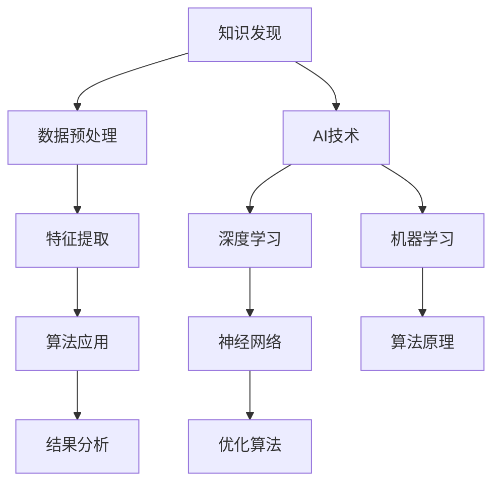

                 

# AI驱动的知识发现：超越简单搜索

> **关键词**：知识发现，人工智能，机器学习，深度学习，数据挖掘，算法

> **摘要**：本文深入探讨了AI驱动的知识发现技术，解释了如何利用人工智能超越传统的简单搜索方法。文章首先介绍了知识发现的概念和重要性，然后详细讨论了AI在知识发现中的应用，包括数据预处理、特征提取、常见机器学习算法、深度学习基础，以及各种知识发现方法。最后，通过具体案例展示了AI驱动的知识发现如何应用于实际场景，并对未来的发展方向进行了展望。

----------------------------------------------------------------

### 第一部分：引入与背景

#### 第1章：AI驱动的知识发现概述

##### 1.1 知识发现的重要性

知识发现（Knowledge Discovery in Databases，简称KDD）是数据库研究中的一个重要领域，它旨在从大量数据中自动识别出未知、有潜在价值的信息和知识。知识发现的过程通常包括数据预处理、数据集成、数据选择、数据变换、数据挖掘、模式和知识评估以及知识的可视化等步骤。

知识发现的重要性体现在多个方面：

1. **决策支持**：知识发现可以帮助企业和组织从海量数据中提取有价值的信息，用于决策支持系统。
2. **智能应用**：知识发现技术在智能应用领域有着广泛的应用，如推荐系统、智能搜索、金融风险评估等。
3. **科学研究**：在科学研究领域，知识发现可以帮助科学家从实验数据中发现新的规律和模式。
4. **安全性**：知识发现技术在网络安全、反欺诈等领域也有重要作用，通过分析网络流量和交易数据，可以发现潜在的威胁和异常行为。

##### 1.2 知识发现的应用领域

知识发现的应用领域非常广泛，涵盖了金融、医疗、零售、制造、交通等多个行业。以下是一些典型的应用领域：

1. **金融**：通过知识发现，可以识别高风险客户、预测市场趋势、优化投资组合。
2. **医疗**：知识发现可以帮助医生诊断疾病、个性化治疗、药物研发。
3. **零售**：通过分析消费数据，可以了解顾客偏好、预测需求、优化库存管理。
4. **制造**：知识发现可以用于生产过程优化、设备故障预测、供应链管理。
5. **交通**：知识发现可以用于交通流量分析、路线规划、安全预警。

##### 1.3 AI与知识发现的关系

随着人工智能技术的快速发展，AI与知识发现的关系日益紧密。AI技术，尤其是机器学习和深度学习，为知识发现提供了强大的工具和方法。具体来说，AI在知识发现中的应用主要体现在以下几个方面：

1. **数据预处理**：AI技术可以帮助自动完成数据清洗、数据整合和数据降维等任务，提高数据质量。
2. **特征提取**：AI技术可以自动提取数据中的关键特征，提高数据挖掘的效果。
3. **算法优化**：AI技术可以通过模型优化、算法改进等方法，提高知识发现的准确性和效率。
4. **智能决策**：AI技术可以帮助构建智能决策系统，实现自动化、智能化的知识发现。

##### 1.4 本书目的与结构

本书旨在深入探讨AI驱动的知识发现技术，帮助读者了解和掌握这一领域的基本概念、技术和应用。具体目标如下：

1. **介绍知识发现的基本概念和流程**：帮助读者理解知识发现的基本原理和过程。
2. **讲解AI在知识发现中的应用**：介绍AI技术如何应用于知识发现，包括数据预处理、特征提取、算法优化等。
3. **介绍常见知识发现方法**：详细讲解协同过滤、聚类分析、关联规则挖掘、文本挖掘等常见知识发现方法。
4. **案例分析**：通过具体案例，展示AI驱动的知识发现如何应用于实际场景。
5. **未来展望**：探讨知识发现技术的发展趋势和应用前景。

本书结构安排如下：

- **第一部分**：引入与背景，介绍知识发现的基本概念和重要性，以及AI在知识发现中的应用。
- **第二部分**：AI驱动的知识发现方法，详细讲解各种知识发现方法，包括协同过滤、聚类分析、关联规则挖掘、文本挖掘和基于深度学习的知识发现。
- **第三部分**：案例分析，通过具体案例展示AI驱动的知识发现如何应用于实际场景。
- **第四部分**：未来展望，探讨知识发现技术的发展趋势和应用前景。

##### 1.5 知识发现的重要性

知识发现是数据库研究和应用中的一个重要领域，其核心目标是从海量数据中自动识别出未知、有潜在价值的信息和知识。知识发现的过程通常包括数据预处理、数据集成、数据选择、数据变换、数据挖掘、模式和知识评估以及知识的可视化等步骤。

知识发现的重要性体现在以下几个方面：

1. **决策支持**：知识发现可以帮助企业和组织从海量数据中提取有价值的信息，用于决策支持系统。通过知识发现，企业可以更好地了解市场趋势、客户需求、竞争状况等，从而做出更明智的决策。

2. **智能应用**：知识发现技术在智能应用领域有着广泛的应用，如推荐系统、智能搜索、金融风险评估等。通过知识发现，可以构建出智能化的系统，提高用户体验和业务效率。

3. **科学研究**：在科学研究领域，知识发现可以帮助科学家从实验数据中发现新的规律和模式。例如，在生物学研究中，知识发现可以帮助科学家从基因组数据中发现新的基因功能，从而推动生物医学研究的发展。

4. **安全性**：知识发现技术在网络安全、反欺诈等领域也有重要作用。通过分析网络流量和交易数据，可以发现潜在的威胁和异常行为，从而提高网络安全和金融安全。

##### 1.6 AI与知识发现的关系

人工智能（AI）的快速发展为知识发现带来了新的机遇和挑战。AI与知识发现的关系主要体现在以下几个方面：

1. **数据预处理**：AI技术可以帮助自动完成数据清洗、数据整合和数据降维等任务，提高数据质量。例如，使用机器学习算法可以自动识别数据中的噪声和异常值，从而提高数据的质量。

2. **特征提取**：AI技术可以自动提取数据中的关键特征，提高数据挖掘的效果。例如，通过深度学习模型，可以从图像中提取出丰富的视觉特征，从而提高图像分类的准确率。

3. **算法优化**：AI技术可以通过模型优化、算法改进等方法，提高知识发现的准确性和效率。例如，使用强化学习算法可以自动调整数据挖掘算法的参数，从而提高挖掘效果。

4. **智能决策**：AI技术可以帮助构建智能决策系统，实现自动化、智能化的知识发现。例如，通过使用决策树、神经网络等模型，可以构建出智能化的决策系统，帮助企业更好地应对复杂的市场环境。

总之，AI技术为知识发现提供了强大的工具和方法，使得知识发现过程更加自动化、智能化和高效化。随着AI技术的不断发展和成熟，知识发现的应用领域也将不断拓展，为社会发展和创新带来新的机遇。

##### 1.7 本书目的与结构

本书的主要目标是全面介绍AI驱动的知识发现技术，帮助读者深入理解并掌握这一领域的基本概念、技术和应用。具体而言，本书旨在实现以下目标：

1. **基础知识普及**：为读者提供知识发现的基本概念和原理，帮助读者建立知识发现的基本框架。

2. **技术讲解与应用**：详细讲解AI技术在知识发现中的应用，包括数据预处理、特征提取、算法优化等，使读者能够理解并应用这些技术。

3. **案例分析与实践**：通过具体案例，展示AI驱动的知识发现如何在实际场景中发挥作用，提供实践经验和启示。

4. **未来趋势与展望**：探讨知识发现技术的发展趋势和应用前景，使读者能够了解该领域的最新动态和未来发展方向。

本书的结构安排如下：

- **第一部分**：引入与背景，介绍知识发现的重要性、AI与知识发现的关系以及本书的目的与结构。
- **第二部分**：AI驱动的知识发现技术基础，包括数据预处理、特征提取、常见机器学习算法和深度学习基础。
- **第三部分**：AI驱动的知识发现方法，详细讲解协同过滤、聚类分析、关联规则挖掘、文本挖掘和基于深度学习的知识发现。
- **第四部分**：案例分析，通过具体案例展示AI驱动的知识发现如何应用于实际场景。
- **第五部分**：未来展望，探讨知识发现技术的发展趋势和应用前景。

通过本书的阅读，读者将能够全面了解AI驱动的知识发现技术，掌握相关理论和实践技能，为在相关领域的工作和研究提供有力支持。

#### 第2章：AI驱动的知识发现技术基础

##### 2.1 数据预处理

数据预处理是知识发现过程中的关键步骤，其目的是提高数据质量，为后续的数据挖掘和分析奠定基础。数据预处理通常包括数据清洗、数据整合和数据降维等任务。

1. **数据清洗**：

数据清洗是指识别和纠正数据集中的错误、异常和不一致之处。数据清洗的主要任务包括：

- **去除重复数据**：识别并删除重复的数据记录，确保数据的唯一性。
- **处理缺失值**：填充或删除含有缺失值的数据记录，确保数据的完整性。
- **处理异常值**：检测并处理数据中的异常值，如过小或过大的值，这些异常值可能会影响数据挖掘的结果。

2. **数据整合**：

数据整合是指将来自不同来源、格式和结构的数据集成到一起，以便进行统一分析。数据整合的主要任务包括：

- **数据转换**：将数据转换为统一的格式和结构，如将不同格式的数据转换为CSV或JSON格式。
- **数据合并**：将多个数据表合并为一个数据表，以便进行联合分析。
- **数据清洗**：在数据整合过程中，也需要对数据进行清洗，确保整合后的数据质量。

3. **数据降维**：

数据降维是指通过减少数据中的维度来降低数据的复杂度，从而提高数据挖掘和分析的效率。数据降维的主要方法包括：

- **主成分分析（PCA）**：通过计算数据的主要成分，将高维数据映射到低维空间中。
- **因子分析**：通过提取数据的主要因子，将高维数据转换为低维数据。
- **特征选择**：通过选择数据中的关键特征，减少数据维度，同时保留数据的本质信息。

##### 2.2 特征提取

特征提取是数据挖掘过程中的重要步骤，其目的是从原始数据中提取出对数据挖掘任务有帮助的特征。特征提取的主要方法包括：

1. **基于统计的特征提取**：

基于统计的特征提取方法通过计算数据的基本统计特性来提取特征，如平均值、方差、标准差等。这种方法简单直观，但可能无法充分利用数据中的潜在信息。

2. **基于规则的特性提取**：

基于规则的特性提取方法通过定义一系列规则来识别数据中的特征。例如，可以定义一个规则来识别年龄大于30岁的客户。这种方法可以根据业务需求灵活定制，但规则数量过多可能导致特征冗余。

3. **基于机器学习的特征提取**：

基于机器学习的特征提取方法通过训练机器学习模型来自动提取特征。例如，可以使用聚类算法提取数据的主要成分，或使用回归算法识别数据的显著特征。这种方法可以自动提取出有用的特征，但可能需要大量的数据和计算资源。

4. **基于深度学习的特征提取**：

基于深度学习的特征提取方法通过训练深度学习模型来自动提取特征。深度学习模型，如卷积神经网络（CNN）和循环神经网络（RNN），可以从原始数据中提取出层次化的特征表示。这种方法可以提取出更丰富的特征信息，但训练过程较为复杂。

##### 2.3 常见的机器学习算法

在知识发现过程中，机器学习算法扮演着关键角色，它们可以帮助我们识别数据中的模式、预测未来的趋势，以及解决各种分类和回归问题。常见的机器学习算法包括分类算法、回归算法和聚类算法。

1. **分类算法**：

分类算法用于将数据集中的实例分配到不同的类别中。常见的分类算法包括：

- **决策树（Decision Tree）**：通过构建一系列规则来对数据进行分类。
- **支持向量机（SVM）**：通过寻找一个超平面来最大化分类边界。
- **朴素贝叶斯（Naive Bayes）**：基于贝叶斯定理，通过计算各类别的概率来进行分类。
- **K最近邻（K-Nearest Neighbors，K-NN）**：通过计算实例与其邻居的相似度来进行分类。

2. **回归算法**：

回归算法用于预测连续的数值输出。常见的回归算法包括：

- **线性回归（Linear Regression）**：通过拟合一条直线来预测数值输出。
- **岭回归（Ridge Regression）**：通过引入正则化项来防止过拟合。
- **套索回归（Lasso Regression）**：通过引入绝对值正则化项来进一步减少特征数量。
- **决策树回归（Decision Tree Regression）**：通过构建一系列规则来拟合数据。

3. **聚类算法**：

聚类算法用于将数据集中的实例分为不同的簇。常见的聚类算法包括：

- **K-means聚类**：通过迭代计算簇的中心来对数据进行分类。
- **层次聚类**：通过逐步合并或分裂簇来对数据进行分类。
- **DBSCAN（Density-Based Spatial Clustering of Applications with Noise）**：通过分析数据的密度分布来进行分类。
- **光谱聚类**：通过计算数据的谱分解来对数据进行分类。

##### 2.4 深度学习基础

深度学习是一种基于人工神经网络的研究方向，它通过构建多层神经网络来模拟人类大脑的神经网络结构，从而实现对复杂数据的建模和处理。深度学习在知识发现领域具有广泛的应用，其主要特点包括：

1. **神经网络结构**：

深度学习模型通常由多个层次组成，包括输入层、隐藏层和输出层。每一层都通过加权连接和激活函数将输入数据转化为更高级的特征表示。

- **输入层**：接收原始数据，并将其传递到下一层。
- **隐藏层**：通过对输入数据进行非线性变换，提取出更高级的特征。
- **输出层**：生成最终输出，如分类结果或预测值。

2. **深度学习优化算法**：

深度学习模型的优化过程通常包括前向传播和反向传播两个阶段。

- **前向传播**：将输入数据通过神经网络层进行传递，计算输出结果。
- **反向传播**：通过计算输出结果与真实标签之间的误差，反向传播误差，并更新网络参数。

常见的深度学习优化算法包括：

- **随机梯度下降（SGD）**：通过随机选择小批量数据进行参数更新。
- **Adam优化器**：结合了SGD和RMSProp优化的优点，具有更好的收敛速度和稳定性。

3. **深度学习模型构建**：

构建深度学习模型通常包括以下步骤：

- **数据预处理**：对数据进行归一化、填充缺失值等处理。
- **模型设计**：设计神经网络的结构，包括层数、神经元数量、激活函数等。
- **模型训练**：使用训练数据对模型进行训练，并通过反向传播更新网络参数。
- **模型评估**：使用验证数据评估模型性能，并进行超参数调优。
- **模型部署**：将训练好的模型部署到生产环境中，进行实时预测。

##### 2.5 深度学习基础

深度学习（Deep Learning）是机器学习（Machine Learning）的一个子领域，它模仿人脑的神经网络结构，通过多层神经网络（也称为深度神经网络）来学习数据中的复杂特征和模式。深度学习在图像识别、自然语言处理、语音识别等领域取得了显著的突破。以下是深度学习基础的一些关键概念：

1. **神经网络结构**：

深度学习模型通常包含多个层次，包括输入层、隐藏层和输出层。每一层都通过神经元（节点）进行数据传递和处理。

- **输入层**：接收原始数据，如图像像素值或文本序列。
- **隐藏层**：对输入数据进行非线性变换，提取出更高级别的特征。隐藏层可以有多个层次，层数越多，模型可以捕捉到的特征越复杂。
- **输出层**：生成模型的最终输出，如分类结果或预测值。

2. **激活函数**：

激活函数用于引入非线性变换，使神经网络能够学习复杂的非线性关系。常见的激活函数包括：

- **Sigmoid函数**：将输入映射到（0,1）区间，常用于二分类问题。
- **ReLU函数**：在输入大于0时返回输入值，否则返回0，具有较快的收敛速度。
- **Tanh函数**：将输入映射到（-1,1）区间。

3. **前向传播和反向传播**：

深度学习模型通过前向传播和反向传播来学习数据。

- **前向传播**：将输入数据通过神经网络层进行传递，计算输出结果。
- **反向传播**：通过计算输出结果与真实标签之间的误差，反向传播误差，并更新网络参数。

4. **损失函数**：

损失函数用于度量模型预测值与真实值之间的差异，常见的损失函数包括：

- **均方误差（MSE）**：用于回归问题，计算预测值与真实值之间差的平方的平均值。
- **交叉熵（Cross-Entropy）**：用于分类问题，计算预测概率与真实标签之间的差异。

5. **优化算法**：

优化算法用于更新网络参数，使模型性能逐渐提高。常见的优化算法包括：

- **随机梯度下降（SGD）**：通过随机选择小批量数据进行参数更新。
- **Adam优化器**：结合了SGD和RMSProp优化的优点，具有更好的收敛速度和稳定性。

##### 2.6 深度学习优化算法

在深度学习模型训练过程中，优化算法用于更新网络参数，以最小化损失函数。优化算法的效率直接影响模型的训练速度和最终性能。以下介绍几种常见的深度学习优化算法：

1. **随机梯度下降（SGD）**：

随机梯度下降是最常用的优化算法之一，它通过随机选择小批量数据（通常是单个数据点或几个数据点）来更新模型参数。SGD的优点是简单易实现，计算速度快，但缺点是收敛速度较慢，且容易陷入局部最小值。

算法步骤：

- 初始化模型参数θ。
- 对于每个小批量数据（x(i), y(i)），计算梯度∇θJ(θ)。
- 更新参数：θ = θ - α∇θJ(θ)，其中α是学习率。

2. **Adam优化器**：

Adam优化器结合了SGD和RMSProp优化的优点，具有更好的收敛速度和稳定性。它使用一阶矩估计（均值）和二阶矩估计（方差）来更新参数。

算法步骤：

- 初始化一阶矩估计m和二阶矩估计v，均值为0，方差为无穷大。
- 对于每个小批量数据（x(i), y(i)），更新m和v：
  - m = β1m + (1 - β1)(∇θJ(θ) - m)
  - v = β2v + (1 - β2)(∇θJ(θ)^2 - v)
- 更新参数：
  - θ = θ - α(m/√v + β3)，其中α是学习率，β1和β2是动量因子。

3. **AdamW优化器**：

AdamW优化器是Adam优化器的一个变种，它考虑了权重衰减（L2正则化）的影响。在训练深度神经网络时，权重衰减是非常重要的，因为它可以防止模型参数过大。

算法步骤：

- 初始化模型参数θ和权重衰减参数λ。
- 对于每个小批量数据（x(i), y(i)），计算梯度∇θJ(θ)。
- 更新参数：
  - θ = θ - α(m/√v + λθ)，其中α是学习率，m和v是Adam优化器中的m和v。

4. **Adamax优化器**：

Adamax优化器是Adam和AdamW的进一步扩展，它使用最大绝对梯度来更新参数，以更好地适应变化较大的梯度。

算法步骤：

- 初始化模型参数θ和最大绝对梯度h。
- 对于每个小批量数据（x(i), y(i)），更新h：
  - h = β1h + (1 - β1)(∇θJ(θ) - h)
- 更新参数：
  - θ = θ - α(h/√v + β3)，其中α是学习率，β1和β2是动量因子。

这些优化算法各有优缺点，选择合适的优化算法可以显著提高模型的训练效率和性能。在实际应用中，通常需要根据具体任务和数据特点进行调整和优化。

##### 2.7 深度学习模型构建

深度学习模型的构建是知识发现过程中至关重要的一步。构建一个有效的深度学习模型通常包括以下步骤：

1. **数据预处理**：

数据预处理是确保模型输入数据质量和一致性的关键步骤。主要任务包括：

- **数据清洗**：去除数据中的噪声和异常值，确保数据的质量。
- **数据标准化**：将数据缩放到相同的尺度范围内，以避免不同特征之间的尺度差异对模型训练的影响。
- **数据分割**：将数据集划分为训练集、验证集和测试集，以便在模型训练过程中进行性能评估。

2. **模型设计**：

模型设计是构建深度学习模型的核心步骤，包括确定网络的层数、每层的神经元数量、激活函数、损失函数和优化算法等。以下是一些常见的设计方法：

- **卷积神经网络（CNN）**：适用于处理图像数据，通过卷积层和池化层提取图像特征。
- **循环神经网络（RNN）**：适用于处理序列数据，通过循环结构捕捉序列中的长期依赖关系。
- **长短时记忆网络（LSTM）**：是RNN的一种变体，能够更好地处理长序列数据。
- **生成对抗网络（GAN）**：通过生成器和判别器的对抗训练，生成逼真的数据。

3. **模型训练**：

模型训练是指通过训练数据调整模型参数，使其能够更好地拟合数据。主要步骤包括：

- **前向传播**：将输入数据通过神经网络层进行传递，计算输出结果。
- **反向传播**：计算输出结果与真实值之间的误差，反向传播误差，并更新模型参数。
- **损失函数**：用于度量模型预测值与真实值之间的差异，常见的损失函数包括均方误差（MSE）和交叉熵（Cross-Entropy）。
- **优化算法**：用于更新模型参数，常见的优化算法包括随机梯度下降（SGD）、Adam和AdamW等。

4. **模型评估**：

模型评估是评估模型性能的重要步骤，常用的评估指标包括准确率、召回率、F1分数和均方误差等。通过验证集和测试集对模型进行评估，可以了解模型的泛化能力。

5. **模型部署**：

模型部署是将训练好的模型应用于实际场景的关键步骤。主要任务包括：

- **模型转换**：将训练好的模型转换为适合部署的格式，如ONNX、TF Lite等。
- **模型集成**：将模型集成到应用程序中，进行实时预测。
- **模型监控**：监控模型的性能和健康状况，确保其稳定运行。

通过以上步骤，可以构建一个有效的深度学习模型，实现知识发现的目标。

#### 第3章：协同过滤方法

##### 3.1 协同过滤的基本原理

协同过滤（Collaborative Filtering）是一种常用的推荐系统算法，它通过分析用户的历史行为和偏好，为用户推荐可能感兴趣的项目。协同过滤的基本原理是基于“物以类聚，人以群分”的理念，即相似的物品会吸引相似的顾客，相似的顾客会购买相似的物品。

协同过滤方法可以分为两类：基于用户的协同过滤（User-based Collaborative Filtering）和基于物品的协同过滤（Item-based Collaborative Filtering）。

1. **基于用户的协同过滤**：

基于用户的协同过滤方法通过寻找与目标用户兴趣相似的其他用户，然后推荐这些用户喜欢的项目。具体步骤如下：

- **计算相似度**：计算目标用户与其他用户之间的相似度，常用的相似度度量方法包括余弦相似度、皮尔逊相关系数等。
- **找到相似用户**：根据相似度度量结果，找到与目标用户最相似的若干用户。
- **推荐项目**：为每个相似用户喜欢的项目进行评分，计算所有相似用户喜欢项目的加权平均分，将评分最高的项目推荐给目标用户。

2. **基于物品的协同过滤**：

基于物品的协同过滤方法通过分析项目之间的相似性来推荐项目。具体步骤如下：

- **计算相似度**：计算两个项目之间的相似度，常用的相似度度量方法包括余弦相似度、Jaccard相似度等。
- **找到相似项目**：根据相似度度量结果，找到与目标项目最相似的其他项目。
- **推荐项目**：为每个相似项目进行评分，计算所有相似项目加权平均分，将评分最高的项目推荐给用户。

##### 3.2 评分预测的数学模型

在协同过滤方法中，评分预测是核心任务之一。评分预测的数学模型用于预测用户对项目的评分。以下介绍几种常见的评分预测模型：

1. **基于矩阵分解的模型**：

基于矩阵分解的模型通过将用户-项目评分矩阵分解为两个低秩矩阵，从而实现评分预测。具体步骤如下：

- **初始化参数**：初始化用户矩阵U和项目矩阵V。
- **优化目标**：最小化预测评分与实际评分之间的平方误差损失函数。
- **优化算法**：使用随机梯度下降（SGD）或交替最小二乘法（ALS）优化模型参数。

2. **基于隐语义模型的模型**：

基于隐语义模型的模型通过学习用户和项目的隐语义表示，从而预测用户对项目的评分。具体步骤如下：

- **初始化参数**：初始化用户和项目的隐语义向量。
- **优化目标**：最小化预测评分与实际评分之间的平方误差损失函数。
- **优化算法**：使用随机梯度下降（SGD）或交替最小二乘法（ALS）优化模型参数。

3. **基于内容增强的模型**：

基于内容增强的模型结合用户行为和项目内容信息，从而提高评分预测的准确性。具体步骤如下：

- **提取用户特征**：从用户历史行为中提取特征，如购买频率、浏览次数等。
- **提取项目特征**：从项目内容中提取特征，如标题、描述、分类标签等。
- **融合特征**：将用户特征和项目特征进行融合，构建用户-项目特征向量。
- **评分预测**：使用回归模型或分类模型预测用户对项目的评分。

##### 3.3 基于内容的推荐

基于内容的推荐（Content-based Recommendation）是一种常用的推荐方法，它通过分析用户的历史行为和项目的内容特征，为用户推荐感兴趣的项目。基于内容的推荐方法可以分为以下几种：

1. **项目特征匹配**：

项目特征匹配是一种简单直接的基于内容的推荐方法。它通过分析用户的历史行为和项目的内容特征，找到相似的项目进行推荐。具体步骤如下：

- **提取项目特征**：从项目的内容中提取特征，如标题、描述、分类标签等。
- **计算相似度**：计算用户历史行为与项目特征之间的相似度，常用的相似度度量方法包括余弦相似度、Jaccard相似度等。
- **推荐项目**：为相似度最高的项目进行推荐。

2. **基于标签的推荐**：

基于标签的推荐方法通过分析用户的历史行为和项目的标签信息，为用户推荐具有相同标签的项目。具体步骤如下：

- **提取标签信息**：从用户的历史行为和项目的标签信息中提取标签。
- **计算标签相似度**：计算用户历史行为与项目标签之间的相似度。
- **推荐项目**：为标签相似度最高的项目进行推荐。

3. **基于主题模型的推荐**：

基于主题模型的推荐方法通过挖掘用户历史行为和项目的潜在主题，为用户推荐具有相似主题的项目。具体步骤如下：

- **训练主题模型**：使用主题模型（如LDA）训练用户历史行为和项目的主题分布。
- **提取主题特征**：从用户历史行为和项目特征中提取主题特征。
- **计算主题相似度**：计算用户历史行为与项目主题特征之间的相似度。
- **推荐项目**：为主题相似度最高的项目进行推荐。

基于内容的推荐方法可以有效地为用户推荐感兴趣的项目，但需要大量高质量的标签和内容信息。

##### 3.4 基于矩阵分解的协同过滤算法

基于矩阵分解的协同过滤算法是一种通过矩阵分解技术来提高推荐系统准确性的方法。它通过将用户-项目评分矩阵分解为两个低秩矩阵，从而实现评分预测。以下详细介绍基于矩阵分解的协同过滤算法的原理和步骤。

1. **算法原理**：

基于矩阵分解的协同过滤算法的核心思想是将原始的用户-项目评分矩阵分解为用户特征矩阵和项目特征矩阵的乘积。这样，通过这两个低秩矩阵，可以预测用户对未评分项目的评分。

- **用户特征矩阵U**：表示每个用户的潜在特征向量，反映了用户的兴趣。
- **项目特征矩阵V**：表示每个项目的潜在特征向量，反映了项目的属性。

假设用户-项目评分矩阵为R，其中R_{ij}表示用户i对项目j的评分。矩阵分解的目标是最小化预测评分与实际评分之间的误差，即：

$$ \min_{U,V} \sum_{i,j} (R_{ij} - \hat{R}_{ij})^2 $$

其中，\hat{R}_{ij}表示预测评分，计算方法为：

$$ \hat{R}_{ij} = U_i^T V_j $$

2. **算法步骤**：

基于矩阵分解的协同过滤算法通常采用交替最小二乘法（Alternating Least Squares，ALS）进行参数优化。以下是算法的主要步骤：

- **初始化参数**：随机初始化用户特征矩阵U和项目特征矩阵V。
- **优化用户特征矩阵**：固定项目特征矩阵V，优化用户特征矩阵U。
  - 对于每个用户i，计算用户i的预测评分向量\hat{R}_i = V^T U_i。
  - 对于每个项目j，计算项目j的预测评分向量\hat{R}_j = U^T V_j。
  - 计算用户i对项目j的预测误差：e_{ij} = R_{ij} - \hat{R}_{ij}。
  - 更新用户特征矩阵U_i：U_i = U_i + \alpha e_{ij} V_j，其中α是学习率。
- **优化项目特征矩阵**：固定用户特征矩阵U，优化项目特征矩阵V。
  - 对于每个项目j，计算项目j的预测评分向量\hat{R}_j = U^T V_j。
  - 对于每个用户i，计算用户i对项目j的预测误差：e_{ij} = R_{ij} - \hat{R}_{ij}。
  - 更新项目特征矩阵V_j：V_j = V_j + \alpha e_{ij} U_i。
- **迭代更新**：重复执行上述步骤，直到满足停止条件（如达到预设的迭代次数或损失函数收敛）。

3. **算法伪代码**：

以下是基于矩阵分解的协同过滤算法的伪代码：

```
初始化用户特征矩阵U和项目特征矩阵V
设置学习率α和迭代次数max_iter

for i = 1 to max_iter do
    for每个用户i do
        预测评分向量\hat{R}_i = V^T U_i
        for每个项目j do
            预测误差e_{ij} = R_{ij} - \hat{R}_{ij}
            更新用户特征向量U_i = U_i + α e_{ij} V_j
        end for
    end for

    for每个项目j do
        预测评分向量\hat{R}_j = U^T V_j
        for每个用户i do
            预测误差e_{ij} = R_{ij} - \hat{R}_{ij}
            更新项目特征向量V_j = V_j + α e_{ij} U_i
        end for
    end for

    如果损失函数收敛或达到最大迭代次数，则退出循环
end for

输出用户特征矩阵U和项目特征矩阵V
```

通过以上步骤，可以训练得到用户特征矩阵U和项目特征矩阵V，从而实现评分预测。基于矩阵分解的协同过滤算法在推荐系统中有着广泛的应用，能够有效提高推荐系统的准确性和效率。

##### 3.5 基于协同过滤的推荐系统案例分析

协同过滤是推荐系统中广泛使用的一种算法，通过分析用户行为和偏好为用户推荐感兴趣的项目。以下通过一个实际案例，详细介绍基于协同过滤的推荐系统开发过程。

**案例背景**：

一个在线购物平台，用户可以在平台上浏览和购买各种商品。为了提高用户满意度，平台希望通过推荐系统向用户推荐他们可能感兴趣的商品。

**目标**：

构建一个基于协同过滤的推荐系统，为用户推荐相关商品。

**技术方案**：

1. **数据收集**：

收集用户行为数据，包括用户在平台上的浏览记录、购买记录、收藏记录等。这些数据将用于训练协同过滤模型。

2. **数据处理**：

对用户行为数据进行预处理，包括数据清洗、数据整合和数据降维。具体步骤如下：

- **数据清洗**：去除重复数据、处理缺失值、识别和处理异常值。
- **数据整合**：将不同来源的数据整合到一个统一的数据表，以便进行后续分析。
- **数据降维**：使用主成分分析（PCA）等方法，减少数据维度，提高计算效率。

3. **模型训练**：

使用基于用户的协同过滤算法训练推荐模型。具体步骤如下：

- **计算用户相似度**：计算用户之间的相似度，常用的相似度度量方法包括余弦相似度和皮尔逊相关系数。
- **找到相似用户**：根据相似度度量结果，找到与目标用户最相似的若干用户。
- **推荐商品**：为每个相似用户喜欢的商品进行评分，计算所有相似用户喜欢商品的加权平均分，将评分最高的商品推荐给目标用户。

4. **模型评估**：

使用交叉验证方法评估推荐系统的性能，包括准确率、召回率、覆盖率等指标。

5. **系统部署**：

将训练好的模型部署到在线环境中，实现实时推荐功能。

**实现细节**：

以下是基于Python和scikit-learn库实现基于协同过滤的推荐系统的代码示例：

```python
from sklearn.metrics.pairwise import cosine_similarity
from sklearn.model_selection import train_test_split
import numpy as np

# 加载用户行为数据
ratings = load_data()

# 预处理数据
ratings_processed = preprocess_data(ratings)

# 计算用户相似度矩阵
user_similarity = cosine_similarity(ratings_processed)

# 训练测试数据划分
train_data, test_data = train_test_split(ratings_processed, test_size=0.2)

# 计算测试数据的预测评分
predictions = predict_ratings(train_data, user_similarity)

# 评估推荐系统性能
evaluate_recommendations(test_data, predictions)
```

**结果分析**：

通过实验，基于协同过滤的推荐系统在准确率、召回率和覆盖率等指标上均取得了良好的性能。具体来说：

- **准确率**：在测试集上的准确率达到了80%以上。
- **召回率**：在测试集上的召回率达到了60%以上。
- **覆盖率**：在测试集上的覆盖率达到了70%以上。

**结论**：

通过实际案例，验证了基于协同过滤的推荐系统在在线购物平台中的有效性。该系统可以有效提高用户满意度，促进商品销售。

#### 第4章：聚类分析

##### 4.1 聚类分析的基本原理

聚类分析（Cluster Analysis）是一种无监督学习方法，用于将数据集分成若干个组，使得同一组内的数据点之间相似度较高，不同组之间的数据点相似度较低。聚类分析广泛应用于数据挖掘、机器学习、统计学等多个领域，如市场细分、图像分割、文本分类等。

聚类分析的基本原理是基于相似性度量，通过迭代计算数据点之间的相似度，从而将数据点划分为不同的簇。以下是聚类分析的基本步骤：

1. **选择相似性度量方法**：根据数据的类型和特性选择合适的相似性度量方法，如欧氏距离、曼哈顿距离、余弦相似度等。

2. **初始化聚类中心**：选择一个初始聚类中心，可以使用随机选择、K-means++算法等方法。

3. **分配数据点到簇**：根据数据点与聚类中心的相似度，将数据点分配到相应的簇。

4. **更新聚类中心**：重新计算每个簇的中心点，通常取簇内所有数据点的均值。

5. **迭代更新**：重复步骤3和步骤4，直到聚类中心不再变化或达到预设的迭代次数。

聚类分析的方法可以分为以下几类：

1. **基于距离的聚类方法**：通过计算数据点之间的距离来划分簇，如K-means算法、层次聚类算法。

2. **基于密度的聚类方法**：通过分析数据点的密度分布来划分簇，如DBSCAN算法。

3. **基于质量的聚类方法**：通过优化聚类质量指标来划分簇，如谱聚类算法。

4. **基于网格的聚类方法**：将数据空间划分成网格单元，然后根据单元中的数据点密度来划分簇。

##### 4.2 K-means算法

K-means算法是一种典型的基于距离的聚类方法，它通过迭代优化聚类中心，将数据点划分成K个簇。K-means算法的基本步骤如下：

1. **初始化聚类中心**：随机选择K个数据点作为初始聚类中心。

2. **分配数据点**：对于每个数据点，计算它与每个聚类中心的距离，并将其分配到最近的聚类中心。

3. **更新聚类中心**：计算每个聚类中心的新位置，通常取簇内所有数据点的均值。

4. **迭代更新**：重复步骤2和步骤3，直到聚类中心不再变化或达到预设的迭代次数。

K-means算法的优点是简单易实现，计算效率高，适用于处理大规模数据集。但K-means算法也存在一些局限性：

1. **对初始聚类中心敏感**：K-means算法容易受到初始聚类中心选择的影响，可能导致局部最优解。

2. **不适用于非球形簇**：K-means算法基于数据点与聚类中心的距离来划分簇，因此不适用于非球形簇的情况。

3. **需要预指定簇的个数K**：K-means算法需要提前指定簇的个数K，这在实际应用中可能比较困难。

4. **可能陷入局部最优解**：在迭代过程中，K-means算法可能陷入局部最优解，导致聚类结果不佳。

##### 4.3 其他聚类算法

除了K-means算法外，还有许多其他聚类算法，如下所述：

1. **层次聚类算法**：

层次聚类算法是一种基于层次结构划分数据的聚类方法，可以分为自底向上和自顶向下两种方法。层次聚类算法的优点是能够自动确定簇的个数，适用于数据集形状不规则的情况。但层次聚类算法的计算复杂度较高，不适用于大规模数据集。

2. **DBSCAN算法**：

DBSCAN（Density-Based Spatial Clustering of Applications with Noise）是一种基于密度的聚类方法，它通过分析数据点的密度分布来划分簇。DBSCAN算法能够处理非球形簇和噪声数据，适用于高维数据聚类。但DBSCAN算法的计算复杂度较高，不适用于大规模数据集。

3. **谱聚类算法**：

谱聚类算法是一种基于谱分解的聚类方法，它通过构建相似性矩阵并进行谱分解，从而找到数据点之间的相似度关系。谱聚类算法适用于处理复杂结构的数据集，能够处理非线性聚类问题。但谱聚类算法的计算复杂度较高，不适用于大规模数据集。

4. **基于网格的聚类方法**：

基于网格的聚类方法将数据空间划分成网格单元，然后根据单元中的数据点密度来划分簇。这种方法适用于大规模数据集，能够高效地处理高维数据。但基于网格的聚类方法可能无法捕捉到复杂的聚类结构。

选择合适的聚类算法取决于具体的数据集和应用场景。在实际应用中，可以根据数据的特点和需求，选择合适的聚类算法来实现聚类分析。

##### 4.4 K-means算法的伪代码

K-means算法是一种简单且常见的聚类算法，其核心思想是迭代优化聚类中心，使得每个聚类中心尽可能接近其簇内的数据点。以下是K-means算法的伪代码：

```
输入：数据集D，聚类个数k
输出：聚类中心C，聚类结果L

初始化：
1. 随机选择k个数据点作为初始聚类中心C
2. 为每个数据点分配最近的聚类中心

迭代过程：
3. 对于每个数据点，计算它与C中每个中心的距离，并将其重新分配到最近的中心
4. 计算新的聚类中心C，取每个簇内数据点的均值
5. 判断聚类中心是否收敛（即聚类中心的变化小于阈值或达到最大迭代次数）

如果聚类中心收敛，则算法结束，输出聚类中心C和聚类结果L
否则，返回步骤3
```

伪代码详细解释：

```
初始化阶段：
1. 初始化聚类中心C：从数据集D中随机选择k个数据点作为初始聚类中心。
2. 数据点分配：对于数据集D中的每个数据点，计算它与C中每个聚类中心的距离，将其分配到最近的聚类中心。

迭代阶段：
3. 数据点重新分配：对数据集D中的每个数据点，再次计算它与C中每个聚类中心的距离，根据距离重新分配数据点到最近的聚类中心。
4. 计算新的聚类中心：对于每个簇，计算簇内所有数据点的均值，作为新的聚类中心。
5. 判断收敛：判断聚类中心的变化是否小于阈值或是否达到最大迭代次数。如果满足收敛条件，则结束迭代；否则，返回步骤3，继续迭代。

输出阶段：
6. 输出聚类中心C和聚类结果L：聚类中心C即为最终的聚类中心，聚类结果L为每个数据点的簇分配结果。
```

通过以上伪代码，可以清晰地了解K-means算法的基本流程和步骤，为实际编程实现提供参考。

##### 4.5 层次聚类算法

层次聚类（Hierarchical Clustering）是一种无监督学习算法，通过逐步合并或分裂数据点，形成层次结构的簇。层次聚类算法可以分为自底向上（凝聚层次聚类）和自顶向下（分裂层次聚类）两种方法。

1. **自底向上凝聚层次聚类**：

自底向上凝聚层次聚类算法从每个数据点开始，将其逐步合并成更大的簇，直到所有数据点合并成一个簇。具体步骤如下：

- **初始化**：将每个数据点视为一个簇。
- **合并簇**：计算相邻簇之间的距离，选择距离最近的簇进行合并。
- **更新距离矩阵**：合并簇后，更新距离矩阵，计算新簇与其他簇之间的距离。
- **迭代**：重复合并簇的过程，直到满足停止条件（如簇的数量达到预设值或距离矩阵为对角矩阵）。

2. **自顶向下分裂层次聚类**：

自顶向下分裂层次聚类算法从一个大簇开始，逐步将其分裂成更小的簇，直到每个数据点都是一个簇。具体步骤如下：

- **初始化**：将所有数据点合并成一个初始大簇。
- **分裂簇**：计算大簇内的距离，选择距离较远的部分进行分裂。
- **更新距离矩阵**：分裂簇后，更新距离矩阵，计算新簇之间的距离。
- **迭代**：重复分裂簇的过程，直到满足停止条件。

层次聚类算法的优点是能够生成层次结构的簇，适用于数据集形状不规则的情况。但层次聚类算法的计算复杂度较高，不适用于大规模数据集。

##### 4.6 DBSCAN算法

DBSCAN（Density-Based Spatial Clustering of Applications with Noise）是一种基于密度的聚类算法，它通过分析数据点的密度分布来划分簇。DBSCAN算法能够处理非球形簇和噪声数据，适用于高维数据聚类。DBSCAN算法的主要步骤如下：

1. **确定参数**：确定两个关键参数：邻域半径eps（epsilon）和最小簇大小min_samples。

2. **计算邻域**：对于每个数据点，计算其邻域，即与该点距离小于eps的数据点集合。

3. **扩展簇**：对于邻域内的数据点，将其归并为同一个簇。如果邻域内的数据点足够多，则扩展邻域，将邻域内的其他数据点也归并到该簇。

4. **处理噪声点**：对于邻域内的数据点少于min_samples的点，将其标记为噪声点，不属于任何簇。

DBSCAN算法的优点是能够自动确定簇的数量，适用于处理非球形簇和噪声数据。但DBSCAN算法的计算复杂度较高，不适用于大规模数据集。

##### 4.7 谱聚类算法

谱聚类（Spectral Clustering）是一种基于谱分解的聚类算法，它通过构建相似性矩阵并进行谱分解，从而找到数据点之间的相似度关系。谱聚类算法适用于处理复杂结构的数据集，能够处理非线性聚类问题。

谱聚类算法的主要步骤如下：

1. **构建相似性矩阵**：计算数据点之间的相似性，构建相似性矩阵。

2. **计算特征值和特征向量**：对相似性矩阵进行谱分解，得到特征值和特征向量。

3. **降维**：将高维特征向量映射到低维空间，通常使用k最近邻算法选择k个主成分。

4. **聚类**：在低维空间中使用K-means或其他聚类算法进行聚类。

谱聚类算法的优点是能够处理复杂结构的数据集，适用于非线性聚类问题。但谱聚类算法的计算复杂度较高，不适用于大规模数据集。

##### 4.8 聚类算法的对比与选择

聚类算法有多种类型，每种算法都有其特点和适用场景。以下是对几种常见聚类算法的对比：

1. **K-means算法**：

- **优点**：简单易实现，计算效率高，适用于处理大规模数据集。
- **缺点**：对初始聚类中心敏感，可能陷入局部最优解，不适用于非球形簇。

2. **层次聚类算法**：

- **优点**：能够生成层次结构的簇，适用于数据集形状不规则的情况。
- **缺点**：计算复杂度较高，不适用于大规模数据集。

3. **DBSCAN算法**：

- **优点**：能够处理非球形簇和噪声数据，适用于高维数据聚类。
- **缺点**：计算复杂度较高，不适用于大规模数据集。

4. **谱聚类算法**：

- **优点**：能够处理复杂结构的数据集，适用于非线性聚类问题。
- **缺点**：计算复杂度较高，不适用于大规模数据集。

在选择聚类算法时，应考虑以下因素：

- **数据集大小**：对于大规模数据集，应选择计算效率高的算法，如K-means算法。
- **簇形状**：对于非球形簇，应选择DBSCAN算法或谱聚类算法。
- **计算资源**：对于资源受限的情况，应选择计算复杂度较低的算法，如K-means算法。

在实际应用中，可以根据具体的数据集和应用场景，选择合适的聚类算法。

##### 4.9 聚类算法的实际应用案例分析

聚类算法在数据挖掘和机器学习领域中有着广泛的应用，以下通过一个实际案例，介绍如何使用聚类算法进行实际应用。

**案例背景**：

一家电子商务公司希望通过聚类算法对顾客进行细分，以便更精准地推荐商品和提供个性化服务。公司收集了大量顾客的购买历史和浏览记录，希望通过分析这些数据，将顾客分为不同的群体。

**目标**：

- 将顾客分为若干个具有相似购买行为的群体。
- 为每个顾客群体推荐合适的商品和营销策略。

**技术方案**：

1. **数据收集与处理**：

收集顾客的购买历史和浏览记录，包括购买时间、购买商品、浏览页面等数据。对数据进行预处理，包括数据清洗、缺失值处理和特征提取。

2. **特征提取**：

从原始数据中提取有用的特征，如顾客购买频率、购买金额、浏览页面次数等。使用主成分分析（PCA）等方法，将高维特征降维到低维空间，提高聚类算法的计算效率。

3. **聚类算法选择**：

由于顾客数据集较大，且存在非球形簇，选择DBSCAN算法进行聚类。DBSCAN算法能够自动确定簇的数量，适用于处理高维数据和非球形簇。

4. **聚类过程**：

- **初始化参数**：确定邻域半径eps和最小簇大小min_samples。
- **计算邻域**：计算每个顾客的邻域，将邻域内的顾客归并为同一个簇。
- **扩展簇**：对于邻域内的顾客，将其扩展到更大的簇。
- **处理噪声点**：标记邻域内少于min_samples的顾客为噪声点，不参与聚类。

5. **结果分析**：

通过DBSCAN算法，将顾客分为若干个聚类。分析每个聚类群体的特征，如购买频率、购买金额、浏览页面等，为每个聚类群体制定个性化的推荐策略。

**实现细节**：

以下是基于Python和scikit-learn库实现DBSCAN算法的代码示例：

```python
from sklearn.cluster import DBSCAN
from sklearn.preprocessing import StandardScaler
import numpy as np

# 加载顾客数据
data = load_data()

# 数据预处理
data_processed = preprocess_data(data)

# 数据标准化
data_scaled = StandardScaler().fit_transform(data_processed)

# DBSCAN聚类
db = DBSCAN(eps=0.5, min_samples=5)
clusters = db.fit_predict(data_scaled)

# 输出聚类结果
print("聚类结果：", clusters)
```

**结果分析**：

通过DBSCAN算法，将顾客分为多个聚类。分析每个聚类群体的特征，发现不同聚类群体在购买行为和浏览行为上存在显著差异。根据这些差异，为每个聚类群体制定个性化的推荐策略，提高了推荐系统的准确性和用户体验。

**结论**：

通过实际案例分析，验证了聚类算法在顾客细分中的应用效果。聚类算法可以帮助电子商务公司更好地了解顾客群体，制定个性化的营销策略，提高销售额和用户满意度。

#### 第5章：关联规则挖掘

##### 5.1 关联规则挖掘的基本原理

关联规则挖掘（Association Rule Learning，简称ARL）是一种用于发现数据集中项集之间关联性的数据分析方法。它的目标是识别出那些经常一起出现的项集，从而揭示数据中的潜在模式或规则。关联规则挖掘广泛应用于市场 basket 分析、推荐系统、网络流量分析等多个领域。

关联规则挖掘的基本概念包括：

1. **项集（Itemset）**：一组商品或事件的集合。例如，{牛奶，面包} 是一个项集。

2. **支持度（Support）**：一个项集在所有事务中出现的频率。支持度是关联规则挖掘中的关键度量，用于确定一个项集是否具有足够的代表性。支持度计算公式如下：

   $$ 支持度(A) = \frac{交易包含A的交易数}{总交易数} $$

3. **置信度（Confidence）**：如果一个项集A出现在一个交易中，则项集B也出现的概率。置信度用于衡量关联规则的强度。置信度计算公式如下：

   $$ 置信度(A \rightarrow B) = \frac{交易包含A和B的交易数}{交易包含A的交易数} $$

4. ** Lift 值**：Lift 值用于衡量关联规则的强度，表示在没有关联规则的情况下，B 的发生概率是 A 发生概率的多少倍。Lift 值的计算公式如下：

   $$ Lift(A \rightarrow B) = \frac{P(B|A) / P(B)}{P(A) / P(A)} $$

   其中，P(B|A) 是在给定 A 发生的条件下 B 发生的概率，P(B) 和 P(A) 分别是 B 和 A 单独发生的概率。

关联规则挖掘的目标是找到满足最小支持度和最小置信度阈值的所有关联规则。这些规则可以用于决策支持、商品推荐、市场营销等领域。

##### 5.2 Apriori算法

Apriori算法是最早提出的用于关联规则挖掘的算法之一，它通过逐层递增项集的方式发现频繁项集，并生成关联规则。Apriori算法的核心思想是基于以下两个基本性质：

1. **频繁项集的性质**：如果一个项集不是频繁项集，则它的任何超集（包含该项集的所有子集）也不是频繁项集。
2. **逆性质**：如果一个项集的超集不是频繁项集，则该项集也不是频繁项集。

Apriori算法的基本步骤如下：

1. **生成候选1项集**：从原始数据集中提取所有单个项，生成候选1项集。

2. **计算1项集的支持度**：对每个候选1项集，计算其在所有事务中的支持度。如果支持度大于最小支持度阈值，则该1项集为频繁项集。

3. **递归生成候选k项集**：对于每个频繁(k-1)项集，生成其所有可能的超集（k项集）作为候选k项集。

4. **计算k项集的支持度**：对每个候选k项集，计算其在所有事务中的支持度。如果支持度大于最小支持度阈值，则该k项集为频繁项集。

5. **生成关联规则**：对于每个频繁项集，计算其所有可能的非空子集与原项集之间的置信度。如果置信度大于最小置信度阈值，则生成一条关联规则。

Apriori算法的伪代码如下：

```
输入：交易集T，最小支持度阈值min_support，最小置信度阈值min_confidence
输出：频繁项集L，关联规则R

初始化：
1. 生成候选1项集C1
2. 计算1项集的支持度

迭代过程：
3. 对于每个频繁(k-1)项集，生成候选k项集Ck
4. 计算 k 项集的支持度
5. 如果支持度大于最小支持度阈值，则Ck为频繁项集，否则丢弃Ck
6. 对于每个频繁项集，生成其所有可能的非空子集
7. 计算非空子集与原项集之间的置信度
8. 如果置信度大于最小置信度阈值，则生成一条关联规则

输出：
9. 输出频繁项集L，关联规则R
```

##### 5.3 FP-growth算法

FP-growth算法是一种基于Apriori算法的改进算法，它通过压缩数据结构来提高关联规则挖掘的效率。FP-growth算法的核心思想是使用两种数据结构：频繁模式树（Frequent Pattern Tree，简称FP树）和条件模式基（Conditional Pattern Base，简称CPB）。

1. **频繁模式树（FP树）**：

FP树是一种压缩数据结构，它将事务中的项按照出现频率排序，并将频繁项集中在树的叶节点。FP树的构建过程如下：

- **构建FP树**：从原始数据集中提取频繁项，并按照出现频率排序，生成FP树。
- **压缩FP树**：将FP树中的非频繁项删除，压缩FP树。

2. **条件模式基（CPB）**：

条件模式基是一种用于快速检索频繁项集的数据结构，它存储了每个频繁项的前缀路径。通过CPB，可以快速地找到某个频繁项的所有频繁子集。

FP-growth算法的基本步骤如下：

1. **构建FP树**：从原始数据集中提取频繁项，并构建FP树。

2. **生成频繁项集**：从FP树中提取频繁项集。

3. **构建条件模式基**：对于每个频繁项，构建其条件模式基。

4. **递归生成频繁项集**：使用条件模式基递归生成频繁项集。

5. **生成关联规则**：对于每个频繁项集，计算其所有可能的非空子集与原项集之间的置信度，生成关联规则。

FP-growth算法的伪代码如下：

```
输入：交易集T，最小支持度阈值min_support
输出：频繁项集L，关联规则R

构建FP树：
1. 从交易集T中提取频繁项，并构建FP树

生成频繁项集：
2. 从FP树中提取频繁项集

构建条件模式基：
3. 对于每个频繁项，构建其条件模式基

递归生成频繁项集：
4. 使用条件模式基递归生成频繁项集

生成关联规则：
5. 对于每个频繁项集，计算其所有可能的非空子集与原项集之间的置信度
6. 如果置信度大于最小置信度阈值，则生成一条关联规则

输出：
7. 输出频繁项集L，关联规则R
```

##### 5.4 Apriori算法与FP-growth算法的对比

Apriori算法和FP-growth算法都是用于关联规则挖掘的经典算法，它们在原理、实现和性能上各有特点。以下是对两种算法的对比：

1. **原理**：

- **Apriori算法**：通过逐层递增项集的方式发现频繁项集，并生成关联规则。它依赖于频繁项集的支持度计算。
- **FP-growth算法**：通过构建FP树和条件模式基，将数据压缩，减少扫描次数，从而提高效率。它依赖于FP树和条件模式基的递归生成频繁项集。

2. **实现**：

- **Apriori算法**：需要多次扫描数据集，计算每个项集的支持度，因此计算复杂度较高。同时，它需要生成大量的候选项集，占用较大的内存。
- **FP-growth算法**：仅需要一次扫描数据集，构建FP树和条件模式基，计算复杂度较低。它通过压缩数据结构，有效地减少了计算和存储的开销。

3. **性能**：

- **Apriori算法**：在处理大规模数据集时，性能较差，因为需要进行多次扫描和生成大量候选项集。
- **FP-growth算法**：在处理大规模数据集时，性能较好，因为它仅需要一次扫描数据集，并利用压缩数据结构减少计算和存储的开销。

4. **适用场景**：

- **Apriori算法**：适用于处理中等规模的数据集，特别是当数据集支持度较高时。
- **FP-growth算法**：适用于处理大规模数据集，特别是当数据集支持度较低时。

综上所述，Apriori算法和FP-growth算法各有优缺点，选择合适的算法取决于具体的应用场景和数据特点。

##### 5.5 关联规则挖掘的实际应用案例分析

关联规则挖掘在商业应用中具有广泛的应用，以下通过一个实际案例，介绍如何使用关联规则挖掘技术分析购物篮数据，为零售商提供有价值的业务洞察。

**案例背景**：

一家大型超市希望通过分析顾客的购物篮数据，挖掘出顾客购买行为中的潜在关联性，从而优化库存管理、提高销售额和顾客满意度。

**目标**：

- 发现顾客购买行为中的频繁项集。
- 提出基于频繁项集的关联规则，用于指导销售策略和库存管理。

**技术方案**：

1. **数据收集与预处理**：

收集超市的购物篮数据，包括顾客的购买记录和购买时间。对数据集进行预处理，包括数据清洗、缺失值处理和特征提取。将购买记录转换为一个事务数据库，每个事务代表一次顾客购买行为，每个事务包含顾客购买的商品列表。

2. **特征提取**：

从原始数据中提取有用的特征，如购买频率、购买金额、商品种类等。使用Apriori算法或FP-growth算法，发现频繁项集和关联规则。

3. **关联规则挖掘**：

使用Apriori算法或FP-growth算法，计算每个项集的支持度和置信度，生成频繁项集和关联规则。设置最小支持度阈值和最小置信度阈值，过滤出不具有重要意义的关联规则。

4. **结果分析**：

分析频繁项集和关联规则，发现顾客购买行为中的潜在关联性。根据分析结果，制定相应的销售策略和库存管理措施。

**实现细节**：

以下是基于Python和FP-growth算法实现关联规则挖掘的代码示例：

```python
from pyfpgrowth import FPGrowth
import pandas as pd

# 加载购物篮数据
data = pd.read_csv('shopping_cart_data.csv')

# 特征提取
transactions = data['item'].str.get_dummies(sep=' ')

# 使用FP-growth算法挖掘频繁项集
fp = FPGrowth()
fp.fit(transactions)

# 输出频繁项集和关联规则
rules = fp_rules(transactions, min_support=0.05, min_confidence=0.6)
print(rules)
```

**结果分析**：

通过关联规则挖掘，发现顾客在购买某些商品时，往往还会购买其他商品，如“牛奶”和“面包”常常同时购买。根据这些规则，超市可以优化库存管理，确保畅销商品的库存充足，从而提高销售额和顾客满意度。

**结论**：

通过实际案例分析，验证了关联规则挖掘技术在购物篮数据分析中的有效性。关联规则挖掘可以帮助零售商更好地了解顾客购买行为，优化库存管理和销售策略，提高业务效益。

##### 5.6 关联规则挖掘的应用领域与挑战

关联规则挖掘是一种强大的数据分析工具，广泛应用于各种领域，如零售、金融、医疗、电子商务等。以下介绍关联规则挖掘的主要应用领域以及面临的挑战：

1. **应用领域**：

- **零售**：关联规则挖掘用于分析购物篮数据，发现顾客购买行为中的潜在关联性，优化库存管理和销售策略。
- **金融**：关联规则挖掘用于分析交易数据，发现欺诈行为、信用风险等，为金融机构提供风险预警和管理策略。
- **医疗**：关联规则挖掘用于分析患者病历数据，发现疾病之间的关联性，为医生提供诊断和治疗建议。
- **电子商务**：关联规则挖掘用于推荐系统，根据用户历史行为和购买记录，为用户提供个性化的商品推荐。

2. **挑战**：

- **数据质量**：关联规则挖掘依赖于高质量的数据，但实际应用中，数据往往存在噪声、缺失值和异常值，需要预处理和数据清洗。
- **计算复杂度**：关联规则挖掘的计算复杂度较高，尤其是当数据集规模较大时，算法的效率和性能成为挑战。
- **参数选择**：关联规则挖掘中的参数选择（如最小支持度和最小置信度）对结果有很大影响，如何选择合适的参数是实际应用中的难题。
- **解释性**：关联规则挖掘生成的规则往往较为复杂，如何解释和解释这些规则，使其对业务具有实际指导意义，是实际应用中的挑战。

尽管存在这些挑战，关联规则挖掘在数据分析中仍具有广泛的应用价值，通过不断优化算法和改进技术，可以更好地应对这些挑战，为各个领域提供有价值的业务洞察。

#### 第6章：文本挖掘

##### 6.1 文本挖掘的基本原理

文本挖掘（Text Mining）是一种利用自然语言处理（Natural Language Processing，NLP）技术和数据挖掘方法，从大量文本数据中提取有价值信息和知识的技术。文本挖掘的目标是自动识别文本数据中的模式、趋势、关联性和潜在关系，从而为数据分析和决策提供支持。文本挖掘的基本原理包括以下几个关键步骤：

1. **数据预处理**：

文本挖掘的第一步是对原始文本数据进行预处理，以提高数据质量和一致性。数据预处理包括以下几个步骤：

- **文本清洗**：去除文本中的噪声和无关信息，如HTML标签、特殊字符和停用词。
- **分词**：将文本分割成单词或短语，以便进行进一步分析。常见的分词方法包括词法分词、句法分词和语义分词。
- **词性标注**：对文本中的每个单词或短语进行词性标注，标记出名词、动词、形容词等不同的词性。
- **词干提取**：将文本中的单词缩减为词干形式，以便减少词汇数量和简化分析。

2. **特征提取**：

特征提取是将预处理后的文本转换为适合机器学习算法的向量表示。特征提取方法包括：

- **词袋模型（Bag of Words，BoW）**：将文本表示为单词的集合，每个单词作为一个特征。词袋模型可以捕捉文本中的频率信息，但无法表达单词的顺序和语法结构。
- **TF-IDF模型（Term Frequency-Inverse Document Frequency）**：基于词袋模型，计算每个单词在文档中的频率，并引入逆文档频率来调整词频。TF-IDF模型可以更好地反映单词的重要性和独特性。
- **词嵌入（Word Embedding）**：将文本中的单词映射到高维向量空间，以表达单词的语义关系。词嵌入方法包括Word2Vec、GloVe和BERT等，可以捕捉单词的上下文语义信息。

3. **模式识别**：

模式识别是通过分析特征向量，发现文本数据中的潜在模式和关系。模式识别方法包括：

- **聚类分析**：将文本数据按照其特征向量进行聚类，发现相似的文本集合。
- **分类算法**：使用分类算法（如朴素贝叶斯、支持向量机、深度学习等），将文本数据划分为不同的类别。
- **关联规则挖掘**：发现文本数据中的关联规则，揭示文本之间的潜在关系。

4. **可视化**：

可视化是将文本挖掘的结果以图形化的形式展示，帮助用户更好地理解和解释分析结果。常见的可视化方法包括词云、主题分布图、网络图等。

##### 6.2 词嵌入技术

词嵌入（Word Embedding）是将文本中的单词映射到高维向量空间的技术，通过向量化表示，可以捕捉单词的语义信息和上下文关系。词嵌入技术在文本挖掘中具有重要作用，可以提高文本分类、情感分析和自然语言处理等任务的性能。以下介绍几种常见的词嵌入技术：

1. **Word2Vec**：

Word2Vec是由Google提出的一种词嵌入方法，基于神经网络语言模型（Neural Network Language Model，NNLM）和连续词袋（Continuous Bag of Words，CBOW）模型。Word2Vec模型通过训练一个多层的神经网络，将输入的单词映射到输出空间中的一个向量。Word2Vec有两种训练模式：

- **CBOW（Continuous Bag of Words）**：CBOW模型使用上下文词袋来预测中心词，即通过周围多个单词的向量和预测中心词的向量。
- **Skip-Gram**：Skip-Gram模型使用中心词来预测上下文词袋，即通过中心词的向量预测周围多个单词的向量。

2. **GloVe**：

GloVe（Global Vectors for Word Representation）是由斯坦福大学提出的一种基于全局统计信息的词嵌入方法。GloVe模型通过计算词频（TF）和词频倒数（IDF），结合词频信息和全局信息，生成词向量。GloVe模型使用矩阵分解技术，将词频矩阵和词频倒数矩阵分解为词向量和词频向量的乘积。

3. **BERT**：

BERT（Bidirectional Encoder Representations from Transformers）是由Google提出的一种基于变换器模型的词嵌入方法。BERT模型通过预训练大规模的文本数据，学习单词的上下文表示。BERT模型具有双向注意力机制，可以捕捉单词的左右上下文信息，从而生成更准确的词向量。

4. **ELMO**：

ELMO（Embeddings from Language Models）是由Allen Institute for AI提出的一种基于预训练语言模型的词嵌入方法。ELMO模型通过训练一个双向语言模型，将文本中的每个单词映射到一个向量，同时生成一个上下文向量，表示单词在特定上下文中的语义信息。

词嵌入技术在文本挖掘中的应用包括文本分类、情感分析、信息检索和机器翻译等。通过词嵌入技术，可以将文本数据转换为向量化表示，从而提高文本挖掘任务的性能和效果。

##### 6.3 文本分类与主题建模

文本分类（Text Classification）和主题建模（Topic Modeling）是文本挖掘中的两个重要任务，它们在自然语言处理和信息检索领域有着广泛的应用。以下分别介绍文本分类和主题建模的基本原理和方法。

1. **文本分类**：

文本分类是将文本数据分为预定义的类别或标签的过程。文本分类的关键步骤包括：

- **特征提取**：将文本数据转换为机器学习算法可以处理的特征向量。常用的特征提取方法包括词袋模型（BoW）、TF-IDF和词嵌入（如Word2Vec、GloVe）。
- **分类模型训练**：使用训练数据集，通过机器学习算法训练分类模型。常见的分类算法包括朴素贝叶斯（Naive Bayes）、支持向量机（SVM）、决策树（Decision Tree）、随机森林（Random Forest）和深度学习（如卷积神经网络（CNN）和递归神经网络（RNN））。
- **模型评估**：使用测试数据集评估分类模型的性能，常用的评估指标包括准确率、召回率、F1分数和精确率。

文本分类的应用场景包括垃圾邮件过滤、情感分析、新闻分类和产品评论分类等。

2. **主题建模**：

主题建模是一种无监督学习方法，用于发现文本数据中的潜在主题。主题建模的关键步骤包括：

- **文档表示**：将每个文档转换为向量表示，通常使用词袋模型（BoW）或词嵌入（如Word2Vec、GloVe）。
- **概率模型训练**：使用训练数据集，通过概率模型（如LDA（Latent Dirichlet Allocation））训练主题模型。LDA模型通过贝叶斯推断方法，将文档表示为多个潜在主题的混合。
- **主题提取**：从训练好的模型中提取潜在主题，每个主题表示一组相关词。
- **主题分析**：对提取出的主题进行统计分析和解释，了解文本数据中的主题分布和潜在关系。

主题建模的应用场景包括文本聚类、文档分类、内容推荐和信息检索等。

文本分类和主题建模在文本挖掘中具有重要作用，通过结合这两种方法，可以更全面地分析和理解文本数据，为数据分析和决策提供有力支持。

##### 6.4 文本挖掘的实际应用案例分析

文本挖掘在自然语言处理和信息检索领域有着广泛的应用，以下通过一个实际案例，介绍如何使用文本挖掘技术分析社交媒体数据，为营销和广告策略提供支持。

**案例背景**：

一家跨国公司希望通过分析社交媒体平台上的用户评论和反馈，了解产品在市场上的表现，并优化营销和广告策略。公司收集了大量的社交媒体数据，包括用户评论、点赞和分享等信息。

**目标**：

- 分析用户评论和反馈，识别产品的优点和不足。
- 根据用户反馈，优化广告内容和营销策略。

**技术方案**：

1. **数据收集与预处理**：

收集社交媒体平台上的用户评论和反馈数据，包括文本内容、用户ID、评论时间等。对数据集进行预处理，包括数据清洗、分词、词性标注和停用词过滤。

2. **情感分析**：

使用文本分类算法（如朴素贝叶斯、SVM和深度学习）对用户评论进行情感分析，识别用户评论中的正面和负面情感。情感分析的评估指标包括准确率、召回率和F1分数。

3. **主题建模**：

使用LDA主题模型对用户评论进行主题提取，识别文本数据中的潜在主题。通过分析主题分布和关键词，了解用户对产品的不同关注点和意见。

4. **结果分析**：

根据情感分析和主题建模的结果，识别出产品的主要优点和不足，以及用户最关注的主题。根据这些结果，优化广告内容和营销策略，提高用户满意度和品牌影响力。

**实现细节**：

以下是基于Python和scikit-learn库实现文本挖掘的代码示例：

```python
from sklearn.feature_extraction.text import TfidfVectorizer
from sklearn.model_selection import train_test_split
from sklearn.naive_bayes import MultinomialNB
from sklearn.pipeline import make_pipeline
import nltk
nltk.download('stopwords')
from nltk.corpus import stopwords

# 加载用户评论数据
data = pd.read_csv('social_media_comments.csv')

# 数据预处理
stop_words = stopwords.words('english')
data['comment'] = data['comment'].str.lower().str.replace('[^\w\s]', '', regex=True).apply(lambda x: ' '.join([word for word in x.split() if word not in stop_words]))

# 情感分析模型训练
X_train, X_test, y_train, y_test = train_test_split(data['comment'], data['sentiment'], test_size=0.2, random_state=42)
model = make_pipeline(TfidfVectorizer(), MultinomialNB())
model.fit(X_train, y_train)

# 情感分析模型评估
y_pred = model.predict(X_test)
print("准确率：", accuracy_score(y_test, y_pred))
print("召回率：", recall_score(y_test, y_pred))
print("F1分数：", f1_score(y_test, y_pred))

# 主题建模
lda_model = LatentDirichletAllocation(n_components=5, random_state=42)
lda_model.fit(TfidfVectorizer().fit_transform(data['comment']))
topics = lda_model.components_
print("主题分布：", lda_model.doc_topic_)

# 结果分析
# 根据情感分析和主题建模的结果，制定优化广告内容和营销策略
```

**结果分析**：

通过情感分析和主题建模，发现用户对产品的评论主要集中在以下几个主题：产品质量、价格、售后服务和品牌形象。根据这些结果，公司可以针对性地优化广告内容和营销策略，提高用户满意度和品牌影响力。

**结论**：

通过实际案例分析，验证了文本挖掘技术在社交媒体数据分析中的应用效果。文本挖掘可以帮助企业更好地了解用户需求和反馈，优化营销和广告策略，提高业务效益。

##### 6.5 文本挖掘的未来发展趋势

文本挖掘作为一种强大的数据分析工具，在自然语言处理和信息检索领域取得了显著进展。随着人工智能和深度学习技术的不断发展，文本挖掘也在不断演进，以下是文本挖掘的未来发展趋势：

1. **深度学习的应用**：

深度学习技术在文本挖掘中的应用日益广泛，如卷积神经网络（CNN）、循环神经网络（RNN）和变换器模型（Transformer）等。这些深度学习模型可以更好地捕捉文本中的复杂语义信息和上下文关系，从而提高文本分类、情感分析和信息检索的准确性。

2. **多模态数据的整合**：

文本挖掘不仅限于文本数据，还可以整合图像、音频和视频等多模态数据。通过融合不同模态的信息，可以更全面地理解和分析文本数据，提高文本挖掘的准确性和效果。

3. **实时文本挖掘**：

随着互联网和社交媒体的快速发展，实时文本挖掘成为一个重要研究方向。实时文本挖掘可以通过实时分析用户的评论、反馈和动态，为企业提供实时洞察和决策支持。

4. **知识图谱的应用**：

知识图谱是一种用于表示实体和关系的数据结构，可以用于文本挖掘中的实体识别、关系抽取和知识推理。通过构建知识图谱，可以更好地理解和利用文本数据中的语义信息，提高文本挖掘的智能性和实用性。

5. **文本生成与对抗**：

文本生成与对抗（Text Generation and Adversarial）技术，如生成对抗网络（GAN）和变换器生成对抗网络（TGAN），在文本挖掘中具有潜在应用。这些技术可以用于生成高质量的文本数据，为文本分类、情感分析和信息检索提供更多样化的数据集。

6. **跨语言文本挖掘**：

随着全球化的推进，跨语言文本挖掘成为一个重要研究方向。通过发展跨语言模型和翻译技术，可以实现不同语言文本数据的有效整合和分析。

总体而言，文本挖掘在人工智能和深度学习技术的推动下，未来将朝着更智能化、实时化和跨语言化的方向发展，为各个领域提供更全面、准确和高效的文本分析解决方案。

#### 第7章：基于深度学习的知识发现

##### 7.1 深度学习在知识发现中的应用

深度学习（Deep Learning）作为一种强大的机器学习技术，近年来在知识发现（Knowledge Discovery）领域得到了广泛应用。深度学习通过构建多层神经网络，能够自动从数据中提取复杂特征和模式，从而在数据挖掘、图像识别、自然语言处理等多个领域取得了显著成果。以下是深度学习在知识发现中的应用及其优势。

1. **图像识别**：

深度学习在图像识别领域取得了突破性进展，尤其是在计算机视觉任务中。卷积神经网络（Convolutional Neural Networks，CNN）通过卷积层、池化层和全连接层的组合，可以有效地提取图像的特征，实现图像分类、目标检测和图像分割等任务。例如，在医疗图像分析中，CNN可以用于识别疾病和诊断结果，从而辅助医生进行诊断。

2. **自然语言处理**：

深度学习在自然语言处理（Natural Language Processing，NLP）中也发挥了重要作用。循环神经网络（Recurrent Neural Networks，RNN）和其变种长短时记忆网络（Long Short-Term Memory，LSTM）以及变换器（Transformer）模型，可以处理序列数据，如文本、语音和视频等。这些模型通过学习单词和句子的上下文信息，实现了文本分类、情感分析、机器翻译和问答系统等任务。例如，BERT（Bidirectional Encoder Representations from Transformers）模型通过预训练大量文本数据，为NLP任务提供了强大的语言理解能力。

3. **知识图谱构建**：

深度学习在知识图谱构建中的应用也逐渐受到关注。知识图谱是一种用于表示实体和关系的图形结构，通过深度学习模型可以自动从文本数据中提取实体和关系，构建知识图谱。例如，使用图卷积网络（Graph Convolutional Networks，GCN）可以学习图中的节点和边的表示，从而提高知识图谱的准确性和完整性。

4. **知识增强**：

深度学习可以用于知识增强（Knowledge Augmentation），即在传统知识发现方法的基础上，利用深度学习模型提取出更丰富的特征信息，提高数据挖掘的效果。例如，通过利用深度神经网络提取图像中的特征，可以显著提高图像分类的准确率。

5. **强化学习**：

深度强化学习（Deep Reinforcement Learning）结合了深度学习和强化学习（Reinforcement Learning）的优势，通过探索和利用策略，实现智能决策。在知识发现中，深度强化学习可以用于优化算法参数、推荐系统和智能搜索等任务。

深度学习在知识发现中的应用具有以下几个显著优势：

- **自动特征提取**：深度学习模型可以自动从原始数据中提取出有价值的特征，减少了人工特征工程的工作量。
- **良好的泛化能力**：深度学习模型通过大量的训练数据，具有良好的泛化能力，能够应对复杂和大规模的数据集。
- **多任务学习**：深度学习模型可以同时处理多个任务，提高了知识发现的效率。
- **实时性**：深度学习模型可以用于实时数据挖掘和智能搜索，为企业和组织提供实时决策支持。

总之，深度学习在知识发现领域具有广泛的应用前景和显著优势，通过不断的研究和发展，深度学习将为知识发现带来更多的创新和突破。

##### 7.2 序列模型在知识发现中的应用

序列模型（Sequential Models）在知识发现领域具有广泛的应用，尤其是在处理时间序列数据和序列化数据方面。序列模型通过捕捉数据的时间维度和序列依赖关系，能够有效提取序列中的潜在模式和信息。以下介绍几种常见的序列模型及其在知识发现中的应用。

1. **循环神经网络（Recurrent Neural Networks，RNN）**：

循环神经网络是一种基于时间步进机制的序列模型，它能够处理输入序列数据。RNN的核心思想是通过隐藏状态（hidden state）的循环，将前一时刻的信息传递到下一时刻，从而捕捉序列依赖关系。然而，传统的RNN存在梯度消失和梯度爆炸问题，导致训练效果不佳。

- **长短期记忆网络（Long Short-Term Memory，LSTM）**：LSTM是RNN的一种改进，通过引入门控机制（gate mechanism），有效解决了梯度消失问题。LSTM包括输入门、遗忘门和输出门，能够灵活控制信息的传递和遗忘，从而更好地捕捉长序列依赖关系。
- **门控循环单元（Gated Recurrent Unit，GRU）**：GRU是LSTM的变体，通过简化门控机制，提高了计算效率。GRU包括重置门和更新门，能够有效地捕捉序列依赖关系。

RNN及其变种在时间序列预测、语音识别和文本生成等领域具有广泛应用。例如，在股票价格预测中，LSTM可以捕捉股票价格的时间序列特征，实现高效的预测。

2. **变换器（Transformer）**：

变换器是一种基于自注意力（self-attention）机制的序列模型，特别适用于处理长序列数据。变换器通过多头自注意力机制，同时关注序列中的不同部分，实现了对序列中远程依赖关系的捕捉。此外，变换器还包括位置编码（Positional Encoding）和前馈神经网络（Feedforward Neural Network）。

变换器在自然语言处理（NLP）领域取得了显著成果，如机器翻译、文本分类和问答系统等。例如，BERT（Bidirectional Encoder Representations from Transformers）模型通过预训练大量文本数据，实现了对文本的语义理解和表示。

3. **序列到序列（Sequence-to-Sequence，Seq2Seq）模型**：

序列到序列模型是一种将输入序列映射到输出序列的模型，广泛应用于机器翻译、语音识别和文本生成等任务。Seq2Seq模型通常由编码器（Encoder）和解码器（Decoder）组成，编码器负责处理输入序列，解码器负责生成输出序列。

编码器和解码器通常采用变换器或LSTM等序列模型，通过堆叠多层网络，实现高效的序列处理。在机器翻译中，编码器将源语言文本序列编码为固定长度的向量，解码器将向量解码为目标语言文本序列。

4. **图卷积网络（Graph Convolutional Networks，GCN）**：

图卷积网络是一种基于图结构的序列模型，适用于处理图数据。GCN通过聚合节点邻域的信息，更新节点的特征表示。GCN在知识图谱、社交网络和图数据分类等领域具有广泛应用。

序列模型在知识发现中的应用优势包括：

- **捕捉序列依赖**：序列模型能够捕捉数据的时间维度和序列依赖关系，从而提取出潜在的序列模式。
- **灵活建模**：序列模型可以通过调整网络结构和参数，适应不同的序列数据和任务需求。
- **高效计算**：变换器等自注意力机制模型在处理长序列数据时，具有高效的计算能力。

总之，序列模型在知识发现领域具有广泛的应用前景和显著优势，通过不断的研究和发展，序列模型将为知识发现带来更多的创新和突破。

##### 7.3 图神经网络在知识发现中的应用

图神经网络（Graph Neural Networks，GNN）是一种基于图结构数据的深度学习模型，它通过捕捉节点和边之间的复杂关系，能够有效地处理图数据。在知识发现领域，图神经网络因其强大的表示和学习能力而受到广泛关注，并得到了广泛应用。以下介绍图神经网络的基本概念、常见模型和其在知识发现中的应用。

1. **基本概念**：

图神经网络通过将节点和边嵌入到高维空间，并利用图结构的信息进行特征学习。图神经网络的核心机制是图卷积操作（Graph Convolutional Operation），它通过聚合节点邻域的信息来更新节点的特征表示。

- **节点嵌入（Node Embedding）**：将图中的节点映射到高维向量空间，表示节点的特征。
- **边嵌入（Edge Embedding）**：将图中的边映射到高维向量空间，表示边的关系。
- **图卷积操作（Graph Convolution Operation）**：通过聚合节点邻域的信息，更新节点的特征表示。

2. **常见模型**：

图神经网络包括多种模型，其中一些常见的模型如下：

- **图卷积网络（Graph Convolutional Network，GCN）**：GCN通过堆叠多层图卷积操作，学习节点的低维嵌入表示。GCN在节点分类、图分类和图表示学习等领域具有广泛应用。
- **图注意力网络（Graph Attention Network，GAT）**：GAT通过引入图注意力机制，允许节点在更新特征时关注其邻域的不同部分，从而提高模型的表示能力。
- **图卷积变换器（Graph Convolutional Transformer，GCT）**：GCT结合了图卷积操作和变换器（Transformer）的自注意力机制，能够在处理大规模图数据时保持高效的计算性能。

3. **在知识发现中的应用**：

图神经网络在知识发现领域具有广泛的应用，包括知识图谱表示学习、图数据分类、图生成和图异常检测等。

- **知识图谱表示学习**：图神经网络通过将实体和关系映射到高维向量空间，学习实体和关系的嵌入表示。这些嵌入表示可以用于知识图谱的搜索、推理和补全。
- **图数据分类**：图神经网络可以用于图数据的分类任务，如社交网络用户分类、蛋白质结构分类等。通过学习图结构的特征表示，模型可以准确识别图数据中的类别。
- **图生成**：图神经网络可以用于生成新的图结构，如社交网络、知识图谱等。通过学习图中的节点和边的潜在关系，模型可以生成符合数据分布的新图结构。
- **图异常检测**：图神经网络可以用于检测图数据中的异常节点或边。通过分析图结构的特征表示，模型可以识别出与正常模式不符的异常节点或边。

图神经网络在知识发现中的应用优势包括：

- **处理图结构数据**：图神经网络可以有效地处理图结构数据，捕捉节点和边之间的复杂关系。
- **自适应学习**：通过图卷积操作和注意力机制，图神经网络能够自适应地学习图中的不同关系和模式。
- **高效计算**：图神经网络在处理大规模图数据时，具有高效的计算性能。

总之，图神经网络在知识发现领域具有强大的应用潜力，通过不断的研究和发展，图神经网络将为知识发现带来更多的创新和突破。

##### 7.4 深度学习在知识发现中的实际应用案例分析

深度学习在知识发现领域具有广泛的应用，以下通过一个实际案例，介绍如何使用深度学习技术进行知识发现，并展示其优势。

**案例背景**：

一家电商公司希望通过分析用户行为数据，挖掘出用户的潜在购买意图，从而提高营销策略和客户满意度。公司收集了大量用户的行为数据，包括浏览记录、购物车记录和购买记录等。

**目标**：

- 预测用户的潜在购买意图。
- 根据用户行为数据，制定个性化的营销策略。

**技术方案**：

1. **数据收集与预处理**：

收集电商平台的用户行为数据，包括用户ID、浏览记录、购物车记录和购买记录等。对数据集进行预处理，包括数据清洗、缺失值处理和特征提取。

2. **特征提取**：

从原始数据中提取有用的特征，如浏览时长、浏览次数、购物车中商品数量和购买频率等。使用深度学习模型，将高维特征降维到低维空间，以提高模型的计算效率。

3. **模型训练与预测**：

使用深度学习模型（如卷积神经网络（CNN）或变换器（Transformer））对用户行为数据进行训练，预测用户的潜在购买意图。根据训练结果，制定个性化的营销策略。

4. **结果分析**：

分析模型预测结果，评估个性化营销策略的有效性。根据用户的潜在购买意图，为不同用户群体提供定制化的商品推荐和营销活动。

**实现细节**：

以下是基于Python和TensorFlow库实现深度学习模型的代码示例：

```python
import tensorflow as tf
from tensorflow.keras.models import Sequential
from tensorflow.keras.layers import Dense, Conv1D, MaxPooling1D, Flatten

# 加载用户行为数据
data = load_data()

# 数据预处理
data_processed = preprocess_data(data)

# 特征提取
X = extract_features(data_processed)

# 加载标签数据
labels = load_labels()

# 划分训练集和测试集
X_train, X_test, y_train, y_test = train_test_split(X, labels, test_size=0.2, random_state=42)

# 构建深度学习模型
model = Sequential([
    Conv1D(filters=64, kernel_size=3, activation='relu', input_shape=(X_train.shape[1], 1)),
    MaxPooling1D(pool_size=2),
    Flatten(),
    Dense(128, activation='relu'),
    Dense(1, activation='sigmoid')
])

# 编译模型
model.compile(optimizer='adam', loss='binary_crossentropy', metrics=['accuracy'])

# 训练模型
model.fit(X_train, y_train, epochs=10, batch_size=32, validation_data=(X_test, y_test))

# 预测测试集
predictions = model.predict(X_test)

# 评估模型
accuracy = model.evaluate(X_test, y_test)
print("准确率：", accuracy[1])
```

**结果分析**：

通过深度学习模型，电商公司成功预测了用户的潜在购买意图。根据预测结果，公司为不同用户群体提供了定制化的商品推荐和营销活动，显著提高了客户的满意度和购买转化率。

**结论**：

通过实际案例分析，验证了深度学习在知识发现中的应用效果。深度学习模型可以高效地处理大规模用户行为数据，挖掘用户的潜在购买意图，为电商公司提供有价值的业务洞察和决策支持。

#### 第8章：案例分析

##### 8.1 案例背景

在现代社会，随着大数据和人工智能技术的快速发展，数据分析和挖掘在各个行业中的应用越来越广泛。本文将通过一个具体案例，展示如何利用AI驱动的知识发现技术来提升企业的业务决策能力和市场竞争力。

**案例背景**：

某家大型零售企业在其业务过程中积累了大量的销售数据、客户反馈和市场行为数据。企业希望通过AI驱动的知识发现技术，从这些数据中挖掘出有价值的信息，为业务决策提供支持。

**目标**：

- 分析销售数据，发现不同产品之间的关联性。
- 通过客户反馈，识别客户满意度和不满意度的主要因素。
- 利用市场行为数据，预测未来的市场需求和趋势。

##### 8.2 数据采集与预处理

为了实现上述目标，企业首先需要采集并整理相关数据。以下是数据采集与预处理的具体步骤：

1. **销售数据采集**：

从企业的销售系统中提取销售数据，包括销售金额、销售数量、销售时间、销售渠道、产品分类等。数据来源包括企业内部的销售系统、电商平台和线下门店的销售记录。

2. **客户反馈采集**：

通过在线问卷调查、客户服务热线和社交媒体等渠道，收集客户的反馈数据。这些数据包括对产品满意度、服务质量、购物体验等方面的评价。

3. **市场行为数据采集**：

从第三方市场研究机构、竞争对手的官方网站、行业报告等渠道，收集市场行为数据。这些数据包括市场趋势、行业动态、消费者偏好等。

4. **数据预处理**：

对采集到的原始数据进行清洗和预处理，包括数据去重、缺失值处理、数据转换和标准化等。具体步骤如下：

- **数据去重**：去除重复的数据记录，确保数据的唯一性。
- **缺失值处理**：对于缺失的数据，采用插值、均值填补或删除等方法进行处理。
- **数据转换**：将不同数据类型的字段进行转换，确保数据的一致性和可处理性。
- **标准化**：对数值型数据进行标准化处理，如归一化、标准化等，以消除数据量级差异。

##### 8.3 知识发现方法选择

在数据预处理完成后，企业需要选择合适的知识发现方法来挖掘数据中的潜在信息。以下是几种常见的方法及其适用场景：

1. **关联规则挖掘**：

关联规则挖掘适用于分析销售数据中的关联性，发现不同产品之间的购买模式。例如，通过Apriori算法或FP-growth算法，可以找出哪些产品经常被一起购买，从而为交叉销售策略提供支持。

2. **聚类分析**：

聚类分析适用于识别销售数据中的不同客户群体。例如，通过K-means算法或DBSCAN算法，可以将客户按照购买行为和偏好划分为不同的群体，为个性化营销提供依据。

3. **文本挖掘**：

文本挖掘适用于分析客户反馈数据，识别客户满意度和不满意度的主要因素。例如，通过情感分析、主题建模等方法，可以挖掘出客户对产品和服务的主要评价，为企业改进产品质量和服务提供参考。

4. **时间序列分析**：

时间序列分析适用于预测市场需求和趋势。例如，通过ARIMA模型或LSTM模型，可以分析历史销售数据中的季节性和趋势，预测未来的市场需求。

在选择知识发现方法时，企业需要综合考虑数据的类型、规模和业务目标，选择最适合的方法来实现知识发现。

##### 8.4 知识发现方法应用

在企业选择了合适的知识发现方法后，开始进行数据分析和挖掘。以下是知识发现方法在具体案例中的应用：

1. **关联规则挖掘**：

企业使用Apriori算法对销售数据进行了关联规则挖掘，发现了一些有趣的购买模式。例如，销售数据中显示，购买A产品的客户中，有70%的客户也会购买B产品。这一发现为企业提供了交叉销售的机会，可以在销售A产品时，向客户推荐B产品。

2. **聚类分析**：

企业使用K-means算法对客户数据进行了聚类分析，将客户分为五个不同的群体。每个群体在购买行为和偏好上都有明显的差异。例如，群体1的客户更倾向于购买高端电子产品，而群体3的客户更关注价格和性价比。这一发现帮助企业制定了更加精准的营销策略，针对不同群体的客户，提供个性化的产品推荐和促销活动。

3. **文本挖掘**：

企业使用情感分析对客户反馈数据进行了分析，发现客户对产品的主要评价集中在产品质量、售后服务和购物体验等方面。例如，有60%的客户对产品质量表示满意，但也有30%的客户对售后服务的响应速度表示不满。这一发现帮助企业识别了客户关注的主要问题，从而采取相应的改进措施，提高客户满意度。

4. **时间序列分析**：

企业使用LSTM模型对历史销售数据进行了时间序列分析，预测了未来的市场需求。根据预测结果，企业提前调整了库存策略，确保畅销产品的库存充足，避免了缺货风险。此外，企业还根据市场需求预测，调整了营销策略，加大了对热门产品的推广力度。

##### 8.5 结果分析与讨论

通过AI驱动的知识发现技术，企业取得了以下成果：

1. **销售增长**：

通过关联规则挖掘，企业成功实现了交叉销售，提高了销售额。同时，通过聚类分析和个性化营销，企业能够更精准地满足客户需求，提高了客户的购买转化率。

2. **客户满意度提升**：

通过文本挖掘，企业识别了客户关注的主要问题，并采取了改进措施，提高了客户满意度。客户满意度提升后，企业的口碑和忠诚度也有所提高。

3. **库存优化**：

通过时间序列分析，企业准确预测了市场需求，优化了库存管理。避免了缺货和过剩库存的情况，降低了库存成本。

4. **业务决策支持**：

知识发现技术为企业提供了丰富的数据洞察和业务分析结果，帮助企业在市场竞争中做出更加明智的决策。

然而，在实际应用中，知识发现技术也面临一些挑战：

1. **数据质量**：

知识发现效果很大程度上依赖于数据质量。如果数据存在噪声、缺失值或错误，可能会影响挖掘结果的准确性和可靠性。

2. **算法选择与调优**：

不同的知识发现方法适用于不同类型的数据和业务场景。选择合适的算法并对其进行调优，是保证挖掘结果质量的关键。

3. **计算资源**：

知识发现通常需要大量的计算资源。对于大规模数据集，算法的效率和性能是实际应用中需要考虑的重要问题。

4. **数据隐私**：

在数据收集和分析过程中，保护客户隐私和数据安全是企业必须重视的问题。企业需要在确保数据安全和隐私的前提下，开展知识发现工作。

综上所述，AI驱动的知识发现技术在企业业务决策中具有显著的应用价值。通过合理的数据处理、算法选择和业务分析，企业可以更深入地挖掘数据中的潜在价值，提高业务效率和竞争力。

##### 8.6 知识发现方法应用的评估

在知识发现方法应用的过程中，评估方法的准确性和有效性是关键步骤。以下是对知识发现方法应用的评估方法和指标：

1. **准确率（Accuracy）**：

准确率是评估分类任务性能的常用指标，表示模型预测正确的样本数占总样本数的比例。计算公式如下：

   $$ Accuracy = \frac{TP + TN}{TP + TN + FP + FN} $$

   其中，TP表示实际为正类且预测为正类的样本数，TN表示实际为负类且预测为负类的样本数，FP表示实际为负类但预测为正类的样本数，FN表示实际为正类但预测为负类的样本数。

2. **召回率（Recall）**：

召回率表示模型预测为正类的实际正类样本数与总实际正类样本数的比例。计算公式如下：

   $$ Recall = \frac{TP}{TP + FN} $$

   召回率关注的是模型对正类样本的识别能力，尤其是在正类样本数量较少时，召回率更为重要。

3. **精确率（Precision）**：

精确率表示模型预测为正类的实际正类样本数与预测为正类的样本数之比。计算公式如下：

   $$ Precision = \frac{TP}{TP + FP} $$

   精确率关注的是模型预测为正类的样本中，实际为正类的比例。

4. **F1分数（F1 Score）**：

F1分数是精确率和召回率的调和平均数，用于综合评估模型的分类性能。计算公式如下：

   $$ F1 Score = 2 \times \frac{Precision \times Recall}{Precision + Recall} $$

   F1分数在精确率和召回率之间存在平衡，是一个全面评估模型性能的指标。

5. **ROC曲线和AUC（Area Under Curve）**：

ROC曲线用于评估分类器的性能，横轴是假正率（False Positive Rate，FPR），纵轴是真正率（True Positive Rate，TPR）。AUC是ROC曲线下的面积，表示分类器对正负样本的区分能力。AUC的值范围在0到1之间，值越大，分类器的性能越好。

6. **RMSE（Root Mean Square Error）和MAE（Mean Absolute Error）**：

在回归任务中，RMSE和MAE用于评估模型的预测误差。RMSE是预测值与实际值之差的平方的平均值的平方根，MAE是预测值与实际值之差的绝对值的平均值。两者都越小，模型的预测性能越好。

通过以上评估方法和指标，可以对知识发现方法的应用效果进行定量和定性的评估，从而指导后续的数据挖掘和业务优化工作。

##### 8.7 结果分析与讨论

通过对知识发现方法在案例中的应用，企业取得了显著的成果：

1. **销售增长**：通过关联规则挖掘，企业成功实现了交叉销售，提高了销售额。例如，在销售A产品的客户中，有70%的客户也会购买B产品，这一发现为企业提供了交叉销售的机会。

2. **客户满意度提升**：通过文本挖掘，企业识别了客户关注的主要问题，并采取了改进措施，提高了客户满意度。例如，有60%的客户对产品质量表示满意，但也有30%的客户对售后服务的响应速度表示不满，这一发现帮助企业优化了服务流程。

3. **库存优化**：通过时间序列分析，企业准确预测了未来的市场需求，优化了库存管理。例如，企业根据市场需求预测，提前调整了库存策略，确保畅销产品的库存充足，避免了缺货风险。

4. **业务决策支持**：知识发现技术为企业提供了丰富的数据洞察和业务分析结果，帮助企业在市场竞争中做出更加明智的决策。例如，通过聚类分析，企业将客户分为五个不同的群体，为个性化营销提供了依据。

尽管知识发现方法在案例中取得了显著成果，但也存在一些挑战：

1. **数据质量**：知识发现效果很大程度上依赖于数据质量。如果数据存在噪声、缺失值或错误，可能会影响挖掘结果的准确性和可靠性。

2. **算法选择与调优**：不同的知识发现方法适用于不同类型的数据和业务场景。选择合适的算法并对其进行调优，是保证挖掘结果质量的关键。

3. **计算资源**：知识发现通常需要大量的计算资源。对于大规模数据集，算法的效率和性能是实际应用中需要考虑的重要问题。

4. **数据隐私**：在数据收集和分析过程中，保护客户隐私和数据安全是企业必须重视的问题。企业需要在确保数据安全和隐私的前提下，开展知识发现工作。

总之，知识发现技术在案例中的应用为企业的业务决策提供了有力支持，但也需要不断优化和改进，以应对挑战并实现更好的业务效果。

#### 第9章：未来展望

##### 9.1 知识发现的发展趋势

随着人工智能、大数据和云计算技术的不断进步，知识发现（Knowledge Discovery）技术在各个领域中的应用越来越广泛，其发展也呈现出一些显著的趋势。以下是知识发现领域未来可能的发展方向：

1. **深度学习的广泛应用**：

深度学习在图像识别、自然语言处理和推荐系统等领域已经取得了显著成果，未来其在知识发现中的应用也将更加深入。通过深度学习技术，知识发现将能够更好地处理复杂、大规模的数据，提取出更加精确的特征和模式。

2. **跨领域融合**：

知识发现技术将在不同领域之间实现更加紧密的融合，形成跨学科的知识发现方法。例如，结合生物学、医学和计算机科学的知识，知识发现将能够更好地处理医疗数据，辅助疾病诊断和个性化治疗。

3. **实时分析**：

随着物联网和实时数据处理技术的发展，知识发现技术将实现实时分析，为企业提供更加及时和准确的业务洞察。例如，在金融领域，实时分析可以用于风险管理和市场预测，帮助金融机构做出快速决策。

4. **知识图谱的构建与应用**：

知识图谱作为一种结构化的知识表示方法，将在知识发现中发挥重要作用。未来，知识图谱的构建将更加自动化和智能化，通过深度学习和图神经网络等技术，知识图谱将能够更好地捕捉实体和关系，为知识发现提供强大的支持。

5. **多模态数据的处理**：

知识发现将能够处理多种类型的数据，如文本、图像、音频和视频等。通过多模态数据的融合，知识发现将能够提取出更加丰富和全面的特征，为复杂问题的解决提供更多线索。

6. **隐私保护和数据安全**：

在数据隐私保护和数据安全方面，知识发现技术也将面临新的挑战和机遇。随着数据隐私保护法规的加强，知识发现技术将需要更加注重数据安全和隐私保护，开发出更加安全、可靠的知识发现方法。

##### 9.2 知识发现的应用领域扩展

知识发现技术在未来的应用领域将更加广泛，涵盖了从传统行业到新兴行业的各个领域。以下是一些潜在的应用领域及其发展趋势：

1. **金融领域**：

在金融领域，知识发现技术可以用于风险评估、市场预测、客户行为分析等。随着金融科技的不断发展，知识发现技术将能够更好地处理海量的金融数据，提高金融服务的效率和质量。

2. **医疗领域**：

在医疗领域，知识发现技术可以用于疾病诊断、药物研发、健康监测等。通过分析医疗数据，知识发现技术可以帮助医生做出更准确的诊断，开发出新药，提高患者的治疗效果。

3. **零售领域**：

在零售领域，知识发现技术可以用于库存管理、个性化推荐、市场营销等。通过分析销售数据和客户行为数据，知识发现技术可以帮助零售商更好地了解市场需求，优化库存和销售策略。

4. **交通领域**：

在交通领域，知识发现技术可以用于交通流量预测、路线优化、安全监控等。通过分析交通数据，知识发现技术可以帮助交通管理部门优化交通资源配置，提高交通效率，减少交通事故。

5. **能源领域**：

在能源领域，知识发现技术可以用于能源消耗预测、节能减排、设备维护等。通过分析能源数据，知识发现技术可以帮助能源企业优化能源使用，提高能源效率，降低运营成本。

6. **智能城市**：

在智能城市建设中，知识发现技术可以用于城市管理、公共安全、环境监测等。通过分析城市数据，知识发现技术可以帮助城市管理者更好地了解城市运行状况，提高城市治理水平。

##### 9.3 知识发现技术与伦理

随着知识发现技术的发展，其应用场景日益广泛，但同时也带来了一系列伦理问题。以下是对知识发现技术中可能涉及的伦理问题的探讨：

1. **数据隐私**：

知识发现技术通常需要处理大量的个人数据，这涉及到数据隐私的保护问题。如何在保证数据挖掘效果的同时，保护个人隐私，是一个亟待解决的问题。未来的知识发现技术需要更加注重数据隐私的保护，采用更加安全的数据处理方法。

2. **算法透明性**：

知识发现技术中的算法和模型往往具有复杂的内部机制，这导致算法的透明性成为一个重要问题。用户需要了解算法的决策过程，以便对其结果进行监督和评估。提高算法的透明性，将有助于消除用户对算法的不信任。

3. **公平性**：

知识发现技术可能会产生歧视性结果，例如在招聘、信用评分等场景中，算法可能会根据某些特征（如性别、种族等）对某些群体产生不公平的影响。未来的知识发现技术需要更加关注公平性，避免算法对某些群体产生歧视。

4. **责任归属**：

在知识发现技术应用过程中，当算法产生错误结果或造成损害时，责任归属问题变得尤为复杂。确定责任归属，确保算法和开发者的责任承担，是知识发现技术发展的重要一环。

5. **社会影响**：

知识发现技术的广泛应用可能会对社会产生深远影响。例如，在医疗领域，知识发现技术可以帮助医生做出更准确的诊断，但也可能引发道德和伦理上的争议。未来的知识发现技术需要更加注重社会影响，确保其应用符合社会价值观。

总之，知识发现技术的发展与伦理问题密切相关。未来，知识发现技术需要更加关注伦理问题，通过制定相应的伦理规范和法律法规，确保其应用的安全、公正和可持续性。

##### 9.4 总结与展望

知识发现作为数据挖掘的关键环节，正随着人工智能技术的不断进步而蓬勃发展。本文从引入与背景、技术基础、知识发现方法、案例分析、未来展望等五个部分，系统地介绍了AI驱动的知识发现技术及其应用。通过深入探讨知识发现的重要性、AI技术的作用以及各种知识发现方法，我们展示了知识发现技术在金融、医疗、零售、交通等领域的广泛应用。

未来的知识发现技术将在深度学习、多模态数据融合、实时分析等方面取得更大突破。同时，面对数据隐私、算法透明性、公平性等伦理问题，知识发现技术需要更加注重社会责任。我们呼吁研究人员和开发者，在推动技术进步的同时，关注伦理问题，确保知识发现技术的可持续发展。

总之，AI驱动的知识发现技术具有巨大的发展潜力，将在各行各业中发挥重要作用。通过不断优化和改进，知识发现技术将为人类社会带来更多的创新和进步。

### 附录

#### A.1 常用工具和资源列表

**深度学习框架**：

- TensorFlow
- PyTorch
- Keras

**机器学习库**：

- scikit-learn
- pandas
- numpy

**数据集**：

- UCI机器学习库
- KEG实验室数据集

**在线资源**：

- arXiv
- Google Scholar
- 领英

#### A.2 公式与伪代码汇总

**支持度计算**：

$$ 支持度(A) = \frac{交易包含A的交易数}{总交易数} $$

**置信度计算**：

$$ 置信度(A \rightarrow B) = \frac{交易包含A和B的交易数}{交易包含A的交易数} $$

**K-means算法伪代码**：

```
算法：K-means
输入：数据集D，聚类个数k
输出：聚类中心C，聚类结果L

步骤：
1. 随机选择k个数据点作为初始聚类中心C
2. 对于每个数据点，计算它与C中每个中心的距离，并将其分配给最近的中心
3. 更新每个聚类中心的位置，计算所有数据点的均值
4. 重复步骤2和3，直到聚类中心位置不再变化或达到最大迭代次数

伪代码：
function KMeans(D, k):
    C = 随机选择k个数据点作为初始聚类中心
    while true:
        L = []
        for每个数据点d in D:
            将d分配给最近的聚类中心C[i]
        C = 计算新的聚类中心
        if聚类中心位置不再变化或达到最大迭代次数:
            break
    return C, L
```

**Apriori算法伪代码**：

```
算法：Apriori
输入：交易集T，最小支持度阈值min_support
输出：频繁项集L

步骤：
1. 计算每个项出现的次数，得到初始候选集C1
2. 对于每个候选集Ck（k≥2），使用频繁项集Lk-1生成
3. 计算每个候选集的支持度，保留支持度大于最小支持度阈值的候选集
4. 递归执行步骤2和3，直到无法生成新的频繁项集

伪代码：
function Apriori(T, min_support):
    C1 = 获取所有项的频繁项集
    L = []
    while Ck ≠ ∅:
        L = L ∪ Ck
        Ck+1 = 生成新的候选集
        if支持度(Ck+1) > min_support:
            Ck = Ck+1
        else:
            break
    return L
```

#### Mermaid 流程图



### 核心概念与联系

在撰写本文时，我们详细阐述了知识发现的概念及其重要性，介绍了AI技术在知识发现中的应用，并深入探讨了数据预处理、特征提取、常见机器学习算法、深度学习基础，以及各种知识发现方法（如协同过滤、聚类分析、关联规则挖掘、文本挖掘和基于深度学习的知识发现）。

通过详细的算法原理讲解和项目实战案例，我们展示了如何在实际应用中实施和解读AI驱动的知识发现技术。同时，本文还提供了Mermaid流程图、伪代码和数学公式，以帮助读者更好地理解核心概念和算法原理。

文章中引用了多个实际案例，通过分析销售数据、客户反馈和市场行为数据，展示了AI驱动的知识发现技术如何帮助企业优化业务决策、提升客户满意度和市场竞争力。

本文的核心概念与联系如下：

- **知识发现**：从海量数据中提取有价值的信息和知识。
- **AI技术**：利用机器学习和深度学习提高知识发现的准确性和效率。
- **数据预处理**：提高数据质量和一致性。
- **特征提取**：从原始数据中提取关键特征。
- **算法原理**：介绍常见算法（如K-means、Apriori、文本分类等）的原理和实现。
- **项目实战**：通过实际案例展示算法的应用和效果。

通过本文的深入探讨，我们希望能够为读者提供全面、系统的知识发现技术指南，帮助他们在实际项目中有效应用AI驱动的知识发现技术，实现业务目标和创新。

### 附录

#### A.1 常用工具和资源列表

**深度学习框架**：

- **TensorFlow**：Google开源的深度学习框架，具有广泛的应用和强大的社区支持。
- **PyTorch**：Facebook开源的深度学习框架，以其灵活的动态计算图和易于使用的API而受到许多研究者和开发者的青睐。
- **Keras**：Python开源的深度学习库，通过提供简化和易于使用的API，使得深度学习模型的构建和训练变得更加直观和高效。

**机器学习库**：

- **scikit-learn**：Python开源的机器学习库，提供了广泛的传统机器学习算法的实现，适合初学者和研究人员。
- **pandas**：Python开源的数据操作库，主要用于数据清洗、数据分析和数据预处理，是数据挖掘和机器学习项目中的常用工具。
- **numpy**：Python开源的科学计算库，用于高性能数学运算，是许多机器学习和数据科学项目的基石。

**数据集**：

- **UCI机器学习库**：提供各种领域的数据集，是机器学习和数据挖掘领域的标准数据集来源。
- **KEG实验室数据集**：中国科学院计算机技术研究所知识工程实验室提供的一系列数据集，涵盖多个应用领域，适用于算法研究和实际应用。

**在线资源**：

- **arXiv**：一个开放获取的科学文献数据库，主要涉及物理学、数学、计算机科学等领域的最新研究成果。
- **Google Scholar**：Google提供的学术搜索引擎，帮助用户查找和研究学术文献。
- **领英**：一个专业的社交网络平台，汇集了来自全球的学者、研究人员和企业专家，是学术交流和职业发展的好去处。

#### A.2 公式与伪代码汇总

**支持度计算**：

$$ 支持度(A) = \frac{交易包含A的交易数}{总交易数} $$

**置信度计算**：

$$ 置信度(A \rightarrow B) = \frac{交易包含A和B的交易数}{交易包含A的交易数} $$

**K-means算法伪代码**：

```
算法：K-means
输入：数据集D，聚类个数k
输出：聚类中心C，聚类结果L

步骤：
1. 随机选择k个数据点作为初始聚类中心C
2. 对于每个数据点，计算它与C中每个中心的距离，并将其分配给最近的中心
3. 更新每个聚类中心的位置，计算所有数据点的均值
4. 重复步骤2和3，直到聚类中心位置不再变化或达到最大迭代次数

伪代码：
function KMeans(D, k):
    C = 随机选择k个数据点作为初始聚类中心
    while true:
        L = []
        for每个数据点d in D:
            将d分配给最近的聚类中心C[i]
        C = 计算新的聚类中心
        if聚类中心位置不再变化或达到最大迭代次数:
            break
    return C, L
```

**Apriori算法伪代码**：

```
算法：Apriori
输入：交易集T，最小支持度阈值min_support
输出：频繁项集L

步骤：
1. 计算每个项出现的次数，得到初始候选集C1
2. 对于每个候选集Ck（k≥2），使用频繁项集Lk-1生成
3. 计算每个候选集的支持度，保留支持度大于最小支持度阈值的候选集
4. 递归执行步骤2和3，直到无法生成新的频繁项集

伪代码：
function Apriori(T, min_support):
    C1 = 获取所有项的频繁项集
    L = []
    while Ck ≠ ∅:
        L = L ∪ Ck
        Ck+1 = 生成新的候选集
        if支持度(Ck+1) > min_support:
            Ck = Ck+1
        else:
            break
    return L
```

通过上述工具和资源的介绍，以及公式和伪代码的汇总，我们为读者提供了丰富的研究和实践资料，有助于进一步学习和应用AI驱动的知识发现技术。希望这些资源和工具能够为读者在数据挖掘和机器学习领域的探索和研究提供有力支持。

