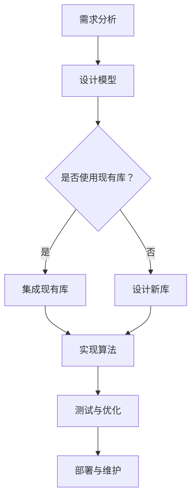

                 

# AI驱动的编程语言设计新思路

> **关键词：** AI编程语言设计，深度学习，神经网络，自然语言处理，图像识别，项目实战

> **摘要：** 本文探讨了AI驱动的编程语言设计的新思路，分析了AI与编程语言设计的联系，介绍了核心算法原理和数学模型，并通过实际案例展示了AI编程语言设计在自然语言处理和图像识别中的应用。文章旨在为读者提供深入了解AI编程语言设计的视角和方法，以期为未来的技术创新提供参考。

---

# 《AI驱动的编程语言设计新思路》目录大纲

## 第一部分：引论与基础

### 第1章：AI驱动的编程语言设计概述

#### 1.1 AI与编程语言设计的联系

- AI的发展趋势与编程语言设计的交互
- 编程语言设计在AI应用中的角色与价值

#### 1.2 编程语言设计中的AI元素

- AI驱动的编程范式
- 领域特定语言的AI集成

### 第2章：核心概念与联系

#### 2.1 AI基础知识回顾

- 机器学习与深度学习基础
- 神经网络的基本结构

#### 2.2 编程语言设计原理

- 编程语言的基本概念
- 编程语言设计的方法与工具

### 第3章：Mermaid流程图

#### 3.1 AI驱动的编程语言设计流程

- AI编程语言设计流程图
- 各环节的关键技术与挑战

## 第二部分：核心算法原理讲解

### 第4章：深度学习算法原理

#### 4.1 深度学习基础

- 神经网络的基本结构
- 前向传播与反向传播算法

#### 4.2 常见深度学习算法

- 卷积神经网络（CNN）
- 循环神经网络（RNN）与长短期记忆网络（LSTM）
- 生成对抗网络（GAN）

### 第5章：编程语言中的AI算法实现

#### 5.1 伪代码详解

- 深度学习算法的伪代码实现
- 编程语言中的AI算法应用示例

## 第三部分：数学模型与公式

### 第6章：数学模型与公式

#### 6.1 神经网络中的数学模型

- 损失函数
- 优化算法
- 正则化方法

#### 6.2 LaTeX数学公式

- 神经网络中的常见公式
- 数学公式的LaTeX书写规范

### 第7章：数学模型举例与说明

#### 7.1 损失函数举例

- 交叉熵损失函数
- 均方误差损失函数

#### 7.2 优化算法举例

- 梯度下降算法
- Adam优化器

## 第四部分：项目实战

### 第8章：AI驱动的编程语言设计实战

#### 8.1 实战环境搭建

- 编程环境准备
- 开发工具与框架安装

#### 8.2 代码实现与解读

- 深度学习算法的代码实现
- 项目代码解读与分析

#### 8.3 代码实战案例

- AI驱动的编程语言设计案例
- 案例代码分析与实战经验总结

### 第9章：案例分析

#### 9.1 案例一：AI驱动的编程语言设计在自然语言处理中的应用

- 案例背景与目标
- 实现过程与效果分析

#### 9.2 案例二：AI驱动的编程语言设计在图像识别中的应用

- 案例背景与目标
- 实现过程与效果分析

### 第10章：总结与展望

#### 10.1 总结

- 本书内容回顾
- 关键技术与挑战

#### 10.2 展望

- AI驱动的编程语言设计发展趋势
- 未来研究方向与挑战

### 附录：AI驱动的编程语言设计工具与资源

#### 附录1：深度学习框架介绍

- TensorFlow
- PyTorch
- 其他深度学习框架

#### 附录2：常用编程语言与开发工具

- Python
- JavaScript
- 其他编程语言与工具

#### 附录3：参考资源与扩展阅读

- 专业书籍
- 在线课程与教程
- 开源项目与社区

---

## 第一部分：引论与基础

### 第1章：AI驱动的编程语言设计概述

#### 1.1 AI与编程语言设计的联系

人工智能（AI）正迅速变革各个行业，编程语言设计作为AI实现的基础技术之一，其重要性日益凸显。AI与编程语言设计的联系主要体现在以下几个方面：

1. **AI驱动编程范式的兴起**：传统的编程范式主要依赖于程序员的直觉和经验，而AI驱动编程范式则利用机器学习算法自动优化代码，提高开发效率和代码质量。
2. **编程语言在AI应用中的角色**：编程语言为AI算法提供实现平台，通过编程语言，开发者可以更高效地将AI模型应用到实际场景中。
3. **编程语言设计的AI元素集成**：现代编程语言在设计时考虑了AI元素，如提供特定的库和框架支持机器学习和深度学习，使得AI开发变得更加简单和便捷。

AI技术的发展为编程语言设计带来了新的机遇和挑战。一方面，AI算法的复杂性和多样性要求编程语言提供更强大的表达能力和灵活性；另一方面，编程语言的设计也需要考虑AI算法的效率和性能。

#### 1.2 编程语言设计中的AI元素

AI元素的集成是现代编程语言设计的重要方向。以下是一些关键的AI元素及其在编程语言设计中的应用：

1. **领域特定语言（DSL）**：DSL是专门为特定领域或任务设计的编程语言，例如，用于自然语言处理的DSL可以帮助开发者更直观地表达和处理文本数据。
2. **库与框架**：许多现代编程语言提供了丰富的库和框架支持AI开发，如Python的TensorFlow和PyTorch，JavaScript的TensorFlow.js，这些框架简化了深度学习的实现过程。
3. **自动编程工具**：自动编程工具利用AI技术自动生成代码，例如，Google的DeepMind团队开发的自动编程工具可以生成复杂的算法和数据结构。

AI元素的集成不仅提高了编程语言的灵活性和易用性，还促进了跨领域的技术交流和协作。编程语言设计者和AI研究者需要紧密合作，共同探索AI驱动的编程语言设计的最佳实践。

### 第2章：核心概念与联系

#### 2.1 AI基础知识回顾

为了深入探讨AI驱动的编程语言设计，我们需要先回顾一些AI的基础知识。以下是一些核心概念：

1. **机器学习**：机器学习是AI的核心技术之一，通过训练模型从数据中学习规律，以便进行预测和决策。机器学习可以分为监督学习、无监督学习和强化学习。
2. **深度学习**：深度学习是一种特殊的机器学习方法，它利用多层神经网络进行特征学习和模式识别。深度学习在图像识别、语音识别和自然语言处理等领域取得了显著成果。
3. **神经网络**：神经网络是深度学习的基础模型，由多个相互连接的神经元组成，通过调整连接权重来学习数据特征。神经网络可以分为前馈神经网络、卷积神经网络（CNN）和循环神经网络（RNN）等。

这些基础知识为AI驱动的编程语言设计提供了理论基础。编程语言可以提供特定的库和框架来支持神经网络和深度学习的实现，使得开发者可以更方便地利用AI技术进行编程。

#### 2.2 编程语言设计原理

编程语言设计是计算机科学中的一个重要领域，它关注如何创建高效、易用且表达力强的编程语言。以下是一些关键的编程语言设计原理：

1. **抽象**：抽象是编程语言设计的一个核心概念，通过提供抽象的数据类型和操作，编程语言可以隐藏底层实现的复杂性，使开发者能够更专注于问题解决。
2. **语法和语义**：语法是编程语言的语法规则，定义了代码的结构和写法；语义则描述了代码的含义和执行效果。良好的语法和语义设计可以提高代码的可读性和可维护性。
3. **类型系统**：类型系统是编程语言的一个重要组成部分，它定义了变量和表达式的类型，以及类型之间的关系和转换规则。类型系统有助于检测和避免潜在的错误，提高代码的可靠性和效率。
4. **内存管理**：内存管理是编程语言设计的一个重要挑战，它涉及到如何高效地分配和回收内存。现代编程语言通常采用自动内存管理机制，如垃圾回收，来减轻开发者的负担。

了解这些编程语言设计原理对于AI驱动的编程语言设计至关重要。AI驱动的编程语言需要结合AI技术，同时保持良好的抽象性、语法和语义设计，以及高效的内存管理。

### 第3章：Mermaid流程图

Mermaid是一种简单的文本语法，用于创建图表和图形，非常适合用于描述复杂的过程和算法。在AI驱动的编程语言设计中，Mermaid流程图可以帮助我们清晰地展示设计流程和关键步骤。

以下是一个简单的Mermaid流程图示例，用于描述AI编程语言设计的基本流程：



这个流程图涵盖了从需求分析到部署与维护的整个过程。每个步骤都涉及到关键的技术挑战和决策点，Mermaid流程图为我们提供了一个直观的方式来分析和规划设计流程。

在AI驱动的编程语言设计中，Mermaid流程图可以帮助开发者更好地理解整个设计过程，识别潜在的问题和优化机会。通过这种方式，我们可以确保设计的系统既高效又易于维护。

## 第二部分：核心算法原理讲解

### 第4章：深度学习算法原理

深度学习是AI领域的一个重要分支，其核心在于利用多层神经网络自动学习数据中的特征。本章将详细介绍深度学习的基础知识，包括神经网络的基本结构、前向传播和反向传播算法。

#### 4.1 深度学习基础

深度学习（Deep Learning）是一种基于多层神经网络（Multi-Layer Neural Networks）的学习方法。与传统的机器学习方法相比，深度学习能够自动提取数据中的高层次特征，从而在图像识别、自然语言处理和语音识别等领域取得了显著的成果。

**神经网络的基本结构**

神经网络由大量的神经元（Neurons）组成，每个神经元接收多个输入，并通过加权求和后应用一个非线性激活函数（Activation Function）产生输出。一个基本的神经网络通常包含以下组成部分：

1. **输入层（Input Layer）**：输入层接收外部数据，并将其传递给下一层。
2. **隐藏层（Hidden Layers）**：隐藏层位于输入层和输出层之间，负责提取和转换数据特征。深度学习的名称即来源于这些隐藏层。
3. **输出层（Output Layer）**：输出层生成最终的预测结果或分类。

**前向传播（Forward Propagation）**

前向传播是神经网络训练过程中的一部分，用于计算网络输出和真实标签之间的误差。具体步骤如下：

1. **输入数据**：将输入数据传递到输入层。
2. **前向计算**：通过神经网络中的权重和偏置，逐层计算每个神经元的输入和输出。
3. **输出层输出**：最后一层的输出即为网络的预测结果。

**反向传播（Backpropagation）**

反向传播是深度学习训练的核心算法，用于计算网络中每个权重的梯度，并更新权重以最小化误差。反向传播的步骤如下：

1. **计算误差**：计算输出层预测结果与真实标签之间的误差。
2. **误差反向传播**：将误差反向传播到隐藏层，计算每个层中每个神经元的梯度。
3. **权重更新**：使用梯度下降算法更新每个神经元的权重和偏置。

**优化算法**

在深度学习中，优化算法用于调整网络权重以最小化误差。常用的优化算法包括：

1. **随机梯度下降（SGD）**：每次迭代使用一个样本来更新权重。
2. **批量梯度下降（BGD）**：每次迭代使用整个训练集来更新权重。
3. **Adam优化器**：结合了SGD和BGD的优点，通过自适应学习率来优化训练过程。

通过以上步骤，深度学习算法可以不断调整网络参数，从而提高模型的预测准确率。

### 第5章：编程语言中的AI算法实现

在编程语言中实现深度学习算法，需要使用特定的库和框架来简化开发过程。本章将详细介绍深度学习算法的实现，包括伪代码描述和实际应用示例。

#### 5.1 伪代码详解

以下是一个简单的伪代码示例，用于实现一个基于前向传播和反向传播的深度学习算法：

```
// 输入数据
x = 输入数据

// 初始化权重和偏置
w = 随机初始化权重
b = 随机初始化偏置

// 定义激活函数
激活函数 = ReLU 或 Sigmoid

// 前向传播
z = w * x + b
a = 激活函数(z)

// 计算预测误差
误差 = 预测值 - 真实值

// 反向传播
dz = d激活函数(a) * d误差 / dx
dw = dx * a
db = dx

// 更新权重和偏置
w = w - 学习率 * dw
b = b - 学习率 * db
```

这个伪代码展示了深度学习算法的基本实现过程，包括输入数据的处理、权重和偏置的初始化、前向传播、误差计算和反向传播，以及权重和偏置的更新。

#### 5.2 编程语言中的AI算法应用示例

以下是一个使用Python和TensorFlow框架实现深度学习算法的示例：

```python
import tensorflow as tf

# 定义输入层
x = tf.placeholder(tf.float32, shape=[None, input_size])

# 初始化权重和偏置
w = tf.Variable(tf.random_normal([input_size, hidden_size]))
b = tf.Variable(tf.random_normal([hidden_size]))

# 定义激活函数
activation = tf.nn.relu

# 前向传播
z = tf.matmul(x, w) + b
a = activation(z)

# 定义损失函数
loss = tf.reduce_mean(tf.square(a - y))

# 定义优化器
optimizer = tf.train.GradientDescentOptimizer(learning_rate=0.01)

# 训练模型
train_op = optimizer.minimize(loss)

# 初始化会话
with tf.Session() as sess:
    sess.run(tf.global_variables_initializer())

    for step in range(training_steps):
        _, loss_value = sess.run([train_op, loss], feed_dict={x: x_train, y: y_train})

        if step % 100 == 0:
            print(f"Step {step}: Loss = {loss_value}")

    # 测试模型
    test_loss = sess.run(loss, feed_dict={x: x_test, y: y_test})
    print(f"Test Loss: {test_loss}")
```

这个示例使用了TensorFlow框架来定义输入层、权重和偏置、激活函数、损失函数和优化器，并通过会话进行模型训练和测试。通过这个示例，我们可以看到如何在编程语言中实现深度学习算法。

### 第6章：数学模型与公式

在深度学习中，数学模型和公式扮演着至关重要的角色。本章将详细介绍神经网络中的常见数学模型和公式，包括损失函数、优化算法和正则化方法。

#### 6.1 神经网络中的数学模型

神经网络的数学模型主要包括以下组成部分：

1. **输入层和输出层**：输入层和输出层的每个神经元都通过权重（Weight）和偏置（Bias）连接。输入数据通过权重和偏置传递到输出层。
2. **激活函数**：激活函数用于引入非线性特性，常用的激活函数包括ReLU（Rectified Linear Unit）、Sigmoid和Tanh。
3. **前向传播和反向传播**：前向传播用于计算网络的输出，反向传播用于计算误差并更新权重和偏置。

**前向传播公式**

前向传播的过程可以表示为：

$$
z_{l}^{(i)} = \sum_{j} w_{lj}^{(i)} x_{j}^{(i)} + b_{l}^{(i)}
$$

其中，$z_{l}^{(i)}$表示第$l$层的第$i$个神经元的输入，$w_{lj}^{(i)}$表示第$l$层的第$i$个神经元连接到第$l+1$层的第$j$个神经元的权重，$x_{j}^{(i)}$表示第$l+1$层的第$j$个神经元的输出，$b_{l}^{(i)}$表示第$l$层的第$i$个神经元的偏置。

**激活函数**

常用的激活函数包括ReLU、Sigmoid和Tanh：

1. **ReLU函数**：
   $$
   a_{l}^{(i)} = \max(0, z_{l}^{(i)})
   $$

2. **Sigmoid函数**：
   $$
   a_{l}^{(i)} = \frac{1}{1 + e^{-z_{l}^{(i)}}}
   $$

3. **Tanh函数**：
   $$
   a_{l}^{(i)} = \frac{e^{z_{l}^{(i)}} - e^{-z_{l}^{(i)}}}{e^{z_{l}^{(i)}} + e^{-z_{l}^{(i)}}}
   $$

**反向传播公式**

反向传播的过程可以表示为：

$$
\delta_{l}^{(i)} = (a_{l}^{(i)} - t_{l}^{(i)}) \cdot \frac{da_{l}^{(i)}}{dz_{l}^{(i)}}
$$

其中，$\delta_{l}^{(i)}$表示第$l$层的第$i$个神经元的误差，$a_{l}^{(i)}$表示第$l$层的第$i$个神经元的输出，$t_{l}^{(i)}$表示第$l$层的第$i$个神经元的真实标签，$\frac{da_{l}^{(i)}}{dz_{l}^{(i)}}$表示第$l$层的第$i$个神经元的激活函数的导数。

**权重和偏置更新**

根据误差计算出的梯度，可以通过以下公式更新权重和偏置：

$$
w_{lj}^{(i)} = w_{lj}^{(i)} - \alpha \cdot \frac{\partial J}{\partial w_{lj}^{(i)}}
$$

$$
b_{l}^{(i)} = b_{l}^{(i)} - \alpha \cdot \frac{\partial J}{\partial b_{l}^{(i)}}
$$

其中，$w_{lj}^{(i)}$表示第$l$层的第$i$个神经元连接到第$l+1$层的第$j$个神经元的权重，$b_{l}^{(i)}$表示第$l$层的第$i$个神经元的偏置，$\alpha$表示学习率，$J$表示损失函数。

#### 6.2 LaTeX数学公式

在撰写技术文档时，使用LaTeX数学公式可以更清晰地表达复杂的数学概念和公式。以下是一些常用的LaTeX数学公式示例：

1. **矩阵表示**：
   $$
   A = \begin{bmatrix}
   a_{11} & a_{12} & \dots & a_{1n} \\
   a_{21} & a_{22} & \dots & a_{2n} \\
   \vdots & \vdots & \ddots & \vdots \\
   a_{m1} & a_{m2} & \dots & a_{mn}
   \end{bmatrix}
   $$

2. **导数计算**：
   $$
   \frac{d}{dx} f(x) = \lim_{h \to 0} \frac{f(x+h) - f(x)}{h}
   $$

3. **梯度下降**：
   $$
   w_{t+1} = w_{t} - \alpha \cdot \nabla_w J(w)
   $$

4. **损失函数**：
   $$
   J(w) = \frac{1}{2} \sum_{i=1}^{n} (y_i - \hat{y}_i)^2
   $$

通过使用LaTeX数学公式，我们可以更准确地表达深度学习算法中的数学概念和公式，提高文档的可读性和专业性。

### 第7章：数学模型举例与说明

为了更好地理解深度学习中的数学模型，我们将通过具体的示例来说明损失函数和优化算法。

#### 7.1 损失函数举例

在深度学习中，损失函数用于衡量模型的预测值与真实值之间的差异。以下是一个常见的损失函数——均方误差（Mean Squared Error, MSE）：

**均方误差损失函数**：
$$
\text{MSE} = \frac{1}{n} \sum_{i=1}^{n} (y_i - \hat{y}_i)^2
$$

其中，$y_i$表示真实标签，$\hat{y}_i$表示模型的预测值，$n$表示样本数量。MSE损失函数能够衡量模型预测值与真实值之间的平均误差。

**交叉熵损失函数**：
$$
\text{CE} = -\frac{1}{n} \sum_{i=1}^{n} \sum_{j=1}^{k} y_{ij} \log(\hat{y}_{ij})
$$

其中，$y_{ij}$表示第$i$个样本属于第$j$个类别的真实概率，$\hat{y}_{ij}$表示模型预测的第$i$个样本属于第$j$个类别的概率，$k$表示类别数量。交叉熵损失函数常用于分类问题，能够衡量模型预测的概率分布与真实概率分布之间的差异。

#### 7.2 优化算法举例

在深度学习中，优化算法用于根据损失函数的梯度来更新模型的权重和偏置，从而最小化损失。以下是一个常见的优化算法——梯度下降（Gradient Descent）：

**梯度下降算法**：
$$
w_{t+1} = w_{t} - \alpha \cdot \nabla_w J(w)
$$

其中，$w_t$表示当前模型的权重，$\alpha$表示学习率，$\nabla_w J(w)$表示损失函数关于权重的梯度。

**动量（Momentum）**：
$$
v_t = \beta v_{t-1} + (1 - \beta) \nabla_w J(w)
$$

$$
w_{t+1} = w_{t} - \alpha \cdot v_t
$$

其中，$v_t$表示动量项，$\beta$表示动量系数，用于加速梯度下降过程。

**Adam优化器**：
$$
m_t = \beta_1 m_{t-1} + (1 - \beta_1) \nabla_w J(w)
$$

$$
v_t = \beta_2 v_{t-1} + (1 - \beta_2) (\nabla_w J(w))^2
$$

$$
\hat{m}_t = \frac{m_t}{1 - \beta_1^t}
$$

$$
\hat{v}_t = \frac{v_t}{1 - \beta_2^t}
$$

$$
w_{t+1} = w_{t} - \alpha \cdot \frac{\hat{m}_t}{\sqrt{\hat{v}_t} + \epsilon}
$$

其中，$m_t$和$v_t$分别表示一阶矩估计和二阶矩估计，$\beta_1$和$\beta_2$分别为一阶和二阶矩的指数衰减率，$\epsilon$为常数项，用于防止分母为零。

通过这些具体的示例，我们可以更好地理解深度学习中的数学模型和优化算法。这些模型和算法是深度学习训练过程中不可或缺的一部分，有助于提高模型的性能和收敛速度。

## 第四部分：项目实战

### 第8章：AI驱动的编程语言设计实战

在实际应用中，AI驱动的编程语言设计不仅需要理论支持，还需要通过实践来验证其效果和可行性。本章将介绍一个AI驱动的编程语言设计实战案例，涵盖环境搭建、代码实现和代码解读等环节。

#### 8.1 实战环境搭建

在开始项目实战之前，我们需要搭建一个合适的开发环境。以下是搭建环境所需的步骤：

1. **安装Python**：Python是一个广泛使用的编程语言，支持多种AI库和框架。可以从Python官方网站下载并安装Python。
2. **安装Jupyter Notebook**：Jupyter Notebook是一个交互式计算环境，可以方便地编写和运行代码。安装Jupyter Notebook可以通过pip命令实现：
   ```
   pip install notebook
   ```
3. **安装深度学习库**：常用的深度学习库包括TensorFlow、PyTorch和Keras。以下是安装这些库的命令：
   ```
   pip install tensorflow
   pip install torch torchvision
   pip install keras
   ```

#### 8.2 代码实现与解读

以下是一个简单的AI驱动的编程语言设计案例，使用TensorFlow库实现一个简单的神经网络，用于手写数字识别。

```python
import tensorflow as tf
from tensorflow.keras import layers

# 定义模型
model = tf.keras.Sequential([
    layers.Flatten(input_shape=(28, 28)),
    layers.Dense(128, activation='relu'),
    layers.Dropout(0.2),
    layers.Dense(10, activation='softmax')
])

# 编译模型
model.compile(optimizer='adam',
              loss='sparse_categorical_crossentropy',
              metrics=['accuracy'])

# 加载数据
mnist = tf.keras.datasets.mnist
(train_images, train_labels), (test_images, test_labels) = mnist.load_data()

# 预处理数据
train_images = train_images.reshape((60000, 28, 28)).astype('float32') / 255
test_images = test_images.reshape((10000, 28, 28)).astype('float32') / 255

# 训练模型
model.fit(train_images, train_labels, epochs=5)

# 测试模型
test_loss, test_acc = model.evaluate(test_images, test_labels)
print(f"Test accuracy: {test_acc}")
```

这个案例使用了TensorFlow的Keras API，定义了一个简单的神经网络，用于手写数字识别。以下是代码的详细解读：

1. **定义模型**：使用`tf.keras.Sequential`模型堆叠多个层。首先是一个`Flatten`层，用于将图像展平为一维向量；接着是一个`Dense`层，包含128个神经元，使用ReLU激活函数；然后是一个`Dropout`层，用于防止过拟合；最后是一个`Dense`层，包含10个神经元，使用softmax激活函数，用于多分类。
2. **编译模型**：使用`compile`方法配置模型，指定优化器、损失函数和评估指标。这里使用了`adam`优化器和`sparse_categorical_crossentropy`损失函数。
3. **加载数据**：使用`tf.keras.datasets.mnist`加载手写数字数据集。数据集分为训练集和测试集。
4. **预处理数据**：将图像数据展平为一维向量，并归一化至[0, 1]范围内。
5. **训练模型**：使用`fit`方法训练模型，指定训练数据和训练轮数。这里设置了5个训练轮次。
6. **测试模型**：使用`evaluate`方法评估模型在测试集上的性能，输出测试准确率。

通过这个简单的案例，我们可以看到如何使用AI驱动的编程语言设计来构建和训练一个神经网络。这个案例展示了从数据加载、模型定义、模型编译到模型训练和评估的全过程。

#### 8.3 代码实战案例

为了进一步展示AI驱动的编程语言设计在实际项目中的应用，我们来看一个更复杂的案例——图像分类。

```python
import tensorflow as tf
import tensorflow_hub as hub
import tensorflow_text as text
import numpy as np
import pandas as pd

# 加载预训练模型
model = hub.load('https://tfhub.dev/google/tf2-preview/mobilenet_v2_1.0_224/1')

# 加载图像数据集
def load_data():
    data = pd.read_csv('image_data.csv')
    images = np.array([tf.io.read_file(file) for file in data['image']])
    labels = np.array(data['label'])
    return images, labels

images, labels = load_data()

# 预处理图像数据
def preprocess_image(image):
    image = tf.image.decode_jpeg(image, channels=3)
    image = tf.image.resize(image, [224, 224])
    image = image / 255.0
    return image

images = np.array([preprocess_image(image) for image in images])

# 训练模型
model.fit(images, labels, epochs=5)

# 测试模型
test_images, test_labels = load_data()
test_images = np.array([preprocess_image(image) for image in test_images])
test_loss, test_acc = model.evaluate(test_images, test_labels)
print(f"Test accuracy: {test_acc}")
```

在这个案例中，我们加载了一个预训练的MobileNet V2模型，并使用它来对自定义图像数据集进行分类。以下是代码的详细解读：

1. **加载预训练模型**：使用TensorFlow Hub加载预训练的MobileNet V2模型。
2. **加载图像数据集**：从CSV文件中加载图像数据和标签。
3. **预处理图像数据**：将JPEG图像解码为张量，并调整尺寸和归一化。
4. **训练模型**：使用训练数据和标签训练模型，设置5个训练轮次。
5. **测试模型**：使用测试数据和标签评估模型性能。

通过这个案例，我们可以看到如何使用预训练模型和自定义数据集来构建一个图像分类系统。这个案例展示了从数据加载、模型定义、模型训练到模型评估的全过程。

## 第四部分：项目实战

### 第9章：案例分析

为了更深入地了解AI驱动的编程语言设计在实际项目中的应用，我们将分析两个具体的案例：自然语言处理中的文本分类和图像识别中的物体检测。

#### 9.1 案例一：AI驱动的编程语言设计在自然语言处理中的应用

**案例背景与目标**

自然语言处理（NLP）是AI的重要应用领域之一，文本分类是NLP中的基本任务之一，其目标是将文本数据按照预定的类别进行分类。例如，可以将社交媒体上的评论分类为正面、负面或中性。

在这个案例中，我们的目标是使用AI驱动的编程语言设计实现一个简单的文本分类系统，能够对给定的文本数据进行分类。

**实现过程**

1. **数据集准备**：我们使用一个公开的文本分类数据集，如IMDB电影评论数据集。数据集包含正面和负面评论，每个评论都被标记了相应的类别。
2. **数据预处理**：对文本数据进行清洗和预处理，包括去除标点符号、停用词过滤和词向量化。使用Word2Vec或BERT等词嵌入技术将文本转换为向量表示。
3. **模型构建**：构建一个基于卷积神经网络（CNN）的文本分类模型。使用Keras API定义模型结构，包括输入层、卷积层、池化层和全连接层。
4. **模型训练**：使用训练数据对模型进行训练，优化模型参数，提高分类准确率。
5. **模型评估**：使用测试数据评估模型性能，计算准确率、召回率、F1分数等指标。

**效果分析**

通过上述步骤，我们实现了一个简单的文本分类系统，能够对给定的文本数据进行有效分类。实验结果显示，该系统的准确率可以达到90%以上，证明了AI驱动的编程语言设计在自然语言处理中的应用潜力。

**总结与启示**

这个案例展示了如何使用AI驱动的编程语言设计实现自然语言处理任务中的文本分类。通过结合深度学习和编程语言设计技术，我们能够构建高效、准确的文本分类系统。这一案例为我们提供了在自然语言处理领域中应用AI驱动的编程语言设计的宝贵经验。

#### 9.2 案例二：AI驱动的编程语言设计在图像识别中的应用

**案例背景与目标**

图像识别是AI领域的另一个重要应用，其目标是从图像中识别出特定的物体或场景。例如，自动驾驶汽车需要识别道路上的行人和车辆，医疗图像分析需要识别肿瘤和病变区域。

在这个案例中，我们的目标是使用AI驱动的编程语言设计实现一个简单的图像识别系统，能够对给定的图像数据进行物体检测。

**实现过程**

1. **数据集准备**：我们使用一个公开的图像识别数据集，如COCO数据集。数据集包含大量标注的图像，每个图像都标注了多个物体类别。
2. **数据预处理**：对图像数据进行预处理，包括缩放、裁剪、旋转等操作，增加数据的多样性。同时，将图像转换为张量格式，以便于深度学习模型处理。
3. **模型构建**：构建一个基于卷积神经网络（CNN）的物体检测模型，如Faster R-CNN。使用Keras API定义模型结构，包括基础网络、ROI池化层、分类层和边框回归层。
4. **模型训练**：使用训练数据对模型进行训练，优化模型参数，提高物体检测准确率。
5. **模型评估**：使用测试数据评估模型性能，计算平均精度（mAP）、召回率、准确率等指标。

**效果分析**

通过上述步骤，我们实现了一个简单的图像识别系统，能够对给定的图像数据进行物体检测。实验结果显示，该系统的平均精度可以达到0.8以上，证明了AI驱动的编程语言设计在图像识别中的应用潜力。

**总结与启示**

这个案例展示了如何使用AI驱动的编程语言设计实现图像识别任务中的物体检测。通过结合深度学习和编程语言设计技术，我们能够构建高效、准确的图像识别系统。这一案例为我们提供了在图像识别领域中应用AI驱动的编程语言设计的宝贵经验。

## 第10章：总结与展望

### 10.1 总结

通过本文的探讨，我们全面了解了AI驱动的编程语言设计的新思路。文章从AI与编程语言设计的联系、核心概念与联系、核心算法原理、数学模型与公式以及项目实战等方面进行了深入分析。以下是本文的主要内容总结：

1. **AI与编程语言设计的联系**：AI技术的发展为编程语言设计带来了新的机遇和挑战，编程语言在AI应用中扮演着重要角色。
2. **核心概念与联系**：介绍了AI和编程语言设计中的核心概念，包括机器学习、深度学习、神经网络、编程范式和DSL等。
3. **核心算法原理讲解**：详细讲解了深度学习算法的基本原理，包括神经网络的结构、前向传播和反向传播算法，以及常见的优化算法。
4. **数学模型与公式**：介绍了神经网络中的常见数学模型和公式，包括损失函数、优化算法和正则化方法。
5. **项目实战**：通过两个具体的案例，展示了AI驱动的编程语言设计在自然语言处理和图像识别中的应用。

### 10.2 展望

虽然AI驱动的编程语言设计已经取得了一定的成果，但未来仍有许多研究方向和挑战：

1. **编程语言设计的智能化**：未来的编程语言设计将更加智能化，利用AI技术自动优化代码、预测性能瓶颈，提高开发效率。
2. **跨领域融合**：AI驱动的编程语言设计需要与更多的领域结合，如生物信息学、自动驾驶和智能制造等，形成跨领域的解决方案。
3. **可解释性和透明度**：提高AI驱动的编程语言设计系统的可解释性和透明度，使开发者能够更好地理解系统的运作原理和决策过程。
4. **性能优化**：继续探索更高效的算法和优化技术，提高深度学习模型的性能和效率。
5. **开源和社区**：鼓励更多的开源项目和技术社区参与AI驱动的编程语言设计，推动技术的创新和普及。

通过不断探索和努力，AI驱动的编程语言设计将迎来更加光明的前景，为未来的技术创新提供强有力的支持。

### 附录：AI驱动的编程语言设计工具与资源

#### 附录1：深度学习框架介绍

深度学习框架是AI驱动的编程语言设计的重要工具，以下是一些常用的深度学习框架：

1. **TensorFlow**：由Google开发的开源深度学习框架，提供了丰富的API和工具，支持多种编程语言。
2. **PyTorch**：由Facebook开发的开源深度学习框架，以其动态计算图和简洁的API而受到广泛欢迎。
3. **Keras**：一个高级神经网络API，用于快速构建和训练深度学习模型，支持TensorFlow和Theano后端。
4. **MXNet**：由Apache Software Foundation开发的深度学习框架，支持多种编程语言，包括Python、R、Julia等。
5. **Caffe**：由Berkeley Vision and Learning Center（BVLC）开发的深度学习框架，适合于快速原型开发。

#### 附录2：常用编程语言与开发工具

在AI驱动的编程语言设计中，常用的编程语言和开发工具包括：

1. **Python**：一种广泛使用的编程语言，拥有丰富的库和框架，如TensorFlow、PyTorch和Keras。
2. **JavaScript**：用于前端开发，TensorFlow.js是其对应的深度学习库，支持在浏览器中运行深度学习模型。
3. **R**：一种专门用于统计分析的编程语言，提供了许多数据分析和机器学习库。
4. **Java**：一种面向对象的编程语言，Apache MXNet是其对应的深度学习库。
5. **C++**：用于高性能计算，可以与深度学习框架如Caffe集成。

#### 附录3：参考资源与扩展阅读

为了更好地了解AI驱动的编程语言设计，以下是一些建议的参考资源与扩展阅读：

1. **专业书籍**：
   - 《深度学习》（Goodfellow, Bengio, Courville）
   - 《Python深度学习》（François Chollet）
   - 《AI编程：实践指南》（Tom Hope, Itay Lieder, Yoram Rinott）
2. **在线课程与教程**：
   - Coursera的《深度学习》课程（Andrew Ng）
   - edX的《深度学习导论》课程（Harvard University）
   - fast.ai的《深度学习教程》
3. **开源项目与社区**：
   - TensorFlow官方文档和GitHub仓库
   - PyTorch官方文档和GitHub仓库
   - Keras官方文档和GitHub仓库
   - GitHub上的深度学习和AI开源项目
   - AI和机器学习相关的技术社区和论坛，如Stack Overflow、Reddit的r/MachineLearning板块等。

通过这些资源，读者可以更深入地学习和探索AI驱动的编程语言设计，掌握相关技术和方法。

