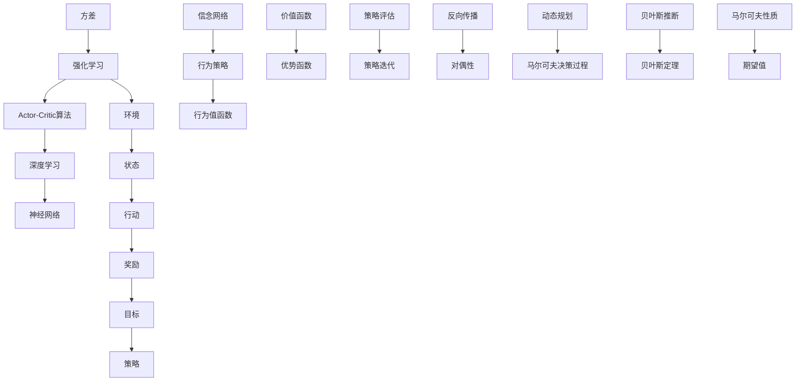

                 

# 文章标题：深入剖析Actor-Critic算法：原理、实现与实战

> 关键词：强化学习、Actor-Critic、深度学习、算法原理、数学模型、项目实战

> 摘要：
本文将深入剖析Actor-Critic算法，从基础概念到数学模型，再到算法实现和项目实战，全面解读这一在深度学习和强化学习领域具有重要地位的算法。通过本文，读者将掌握Actor-Critic算法的核心原理，了解其在实际应用中的优势与挑战，并学会如何搭建和实现一个简单的Actor-Critic系统。

## 目录大纲

### 第一部分：基础概念

1. 引言
2. 强化学习基础
3. Actor-Critic算法原理
4. 核心概念与联系

### 第二部分：算法原理

1. Actor部分
2. Critic部分
3. 统一框架

### 第三部分：数学模型与公式

1. 数学模型
2. 数学公式

### 第四部分：算法实现与案例

1. 算法实现
2. 项目实战
3. 附录

## 第一部分：基础概念

### 1. 引言

强化学习（Reinforcement Learning，RL）是机器学习的一个重要分支，它通过智能体（agent）在与环境的交互过程中不断学习和改进策略，以实现最大化累积奖励。在强化学习中，常见的算法有Q学习、SARSA、Deep Q Network（DQN）等。而Actor-Critic算法作为强化学习的一种重要方法，因其独特的结构和强大的性能，在深度学习和强化学习领域受到了广泛关注。

### 1.2 Actor-Critic算法的历史与发展

Actor-Critic算法最早由Sutton和Barto在1981年提出。他们提出了一种基于策略梯度的值函数方法，即Actor-Critic方法。随后，随着深度学习技术的发展，深度强化学习（Deep Reinforcement Learning）逐渐成为研究热点，而Actor-Critic算法也在这一领域得到了广泛应用。

### 2. 强化学习基础

#### 2.1 强化学习的定义与基本原理

强化学习是一种通过试错（trial and error）的方式，在给定环境中寻找最优策略的学习方法。在强化学习中，智能体通过接收环境反馈的奖励信号，不断调整自己的行为策略，以达到最大化累积奖励的目标。

强化学习的核心概念包括状态（State）、动作（Action）、奖励（Reward）和策略（Policy）。状态是智能体所处的环境描述，动作是智能体可以执行的行为，奖励是环境对智能体动作的反馈信号，策略是智能体在不同状态下执行动作的规则。

#### 2.2 强化学习的核心概念

- **状态（State）**：智能体所处的环境描述。
- **动作（Action）**：智能体可以执行的行为。
- **奖励（Reward）**：环境对智能体动作的反馈信号。
- **策略（Policy）**：智能体在不同状态下执行动作的规则。
- **价值函数（Value Function）**：衡量智能体在某个状态下采取某个动作的预期奖励。
- **策略梯度（Policy Gradient）**：通过梯度上升或下降调整策略，以最大化累积奖励。

#### 2.3 常见的强化学习算法

- **Q学习（Q-Learning）**：通过迭代更新Q值，逐步优化策略。
- **SARSA（同步强化学习同步策略）**：在当前状态下，同时更新值函数和策略。
- **Deep Q Network（DQN）**：使用深度神经网络估计Q值，解决复杂状态空间问题。
- **Policy Gradient（策略梯度）**：直接优化策略，通过梯度上升或下降调整策略。

## 第二部分：算法原理

### 3. Actor-Critic算法原理

#### 3.1 Actor-Critic算法的概念

Actor-Critic算法是一种基于策略梯度的值函数方法，它通过分离策略学习和值函数学习，实现了策略优化和价值评估的分离。其中，Actor负责学习策略，Critic负责评估策略的优劣。

#### 3.2 Actor-Critic算法的组成部分

Actor-Critic算法由两部分组成：Actor和Critic。

- **Actor**：负责学习策略，根据当前状态生成动作。
- **Critic**：负责评估策略的优劣，通过价值函数提供反馈信号。

#### 3.3 Actor-Critic算法的工作原理

Actor-Critic算法的工作原理可以分为以下几个步骤：

1. 初始化参数和策略网络。
2. 运行一个episode，智能体根据策略网络选择动作。
3. 计算每个状态的价值函数。
4. 根据价值函数的反馈信号更新策略网络。

通过这样的迭代过程，Actor-Critic算法逐步优化策略，提高智能体的性能。

### 核心概念与联系

#### 4.1 Mermaid流程图：强化学习、Actor-Critic与深度学习的关系



## 第三部分：算法原理

### 5. Actor部分

#### 5.1 信念网络（Belief Networks）

信念网络是一种概率图模型，用于表示智能体对环境的信念。在信念网络中，每个节点表示一个随机变量，边表示变量之间的条件依赖关系。通过信念网络，智能体可以推断出当前状态的概率分布。

#### 5.2 行为策略（Behavior Policy）

行为策略是指智能体在实际操作中采取的策略。在Actor-Critic算法中，行为策略由Actor网络生成，它根据当前状态和信念网络，选择最优行动。

#### 5.3 行为值函数（Behavior Value Function）

行为值函数是用来衡量智能体在某个状态下采取某个行为的预期奖励。它由Critic网络估计，为Actor网络提供反馈信号。

#### 5.4 行为策略评估（Behavior Policy Evaluation）

行为策略评估是指通过迭代更新行为值函数，逐步优化行为策略。在Actor-Critic算法中，行为策略评估通过Critic网络实现。

### 6. Critic部分

#### 6.1 价值函数（Value Function）

价值函数是用来衡量智能体在某个状态下采取某个行为的预期奖励。在Critic网络中，价值函数通过学习状态-动作价值函数（Q值）来实现。

#### 6.2 优势函数（Advantage Function）

优势函数是指智能体在某个状态下采取某个行为的实际奖励与预期奖励之差。它用于衡量行为的优劣，为策略网络提供优化方向。

#### 6.3 价值函数评估（Value Function Evaluation）

价值函数评估是指通过迭代更新价值函数，逐步优化策略。在Critic网络中，价值函数评估通过学习状态-动作价值函数（Q值）来实现。

#### 6.4 优势函数评估（Advantage Function Evaluation）

优势函数评估是指通过迭代更新优势函数，逐步优化策略。在Critic网络中，优势函数评估通过计算实际奖励与预期奖励之差来实现。

### 7. 统一框架

#### 7.1 对偶性（Duality）

对偶性是指Actor和Critic之间的互动关系。在Actor-Critic算法中，Actor网络和Critic网络相互依赖，通过交替优化实现策略的逐步优化。

#### 7.2 策略迭代（Policy Iteration）

策略迭代是指通过迭代更新策略和价值函数，逐步优化策略。在Actor-Critic算法中，策略迭代通过Critic网络实现。

#### 7.3 反向传播（Backpropagation）

反向传播是一种常用的神经网络训练方法，它通过反向传播误差信号，更新网络参数，实现网络的逐步优化。在Actor-Critic算法中，反向传播用于优化Actor网络和Critic网络。

## 第四部分：数学模型与公式

### 8. 数学模型

#### 8.1 动态规划（Dynamic Programming）

动态规划是一种求解最优决策的算法，它通过递推关系，逐步优化策略。在Actor-Critic算法中，动态规划用于优化价值函数。

#### 8.2 马尔可夫决策过程（Markov Decision Process，MDP）

马尔可夫决策过程是一种描述智能体与环境的交互过程的数学模型，它通过状态转移概率和奖励函数，描述智能体的决策过程。在Actor-Critic算法中，MDP用于定义环境和策略。

#### 8.3 贝叶斯推断（Bayesian Inference）

贝叶斯推断是一种基于概率论的推断方法，它通过贝叶斯定理，更新智能体对环境的信念。在Actor-Critic算法中，贝叶斯推断用于更新信念网络。

### 9. 数学公式

#### 9.1 贝叶斯定理（Bayes' Theorem）

贝叶斯定理是概率论中的一个基本公式，它描述了在已知条件概率的情况下，如何计算联合概率和边缘概率。

$$
P(A|B) = \frac{P(B|A)P(A)}{P(B)}
$$

#### 9.2 马尔可夫性质（Markov Property）

马尔可夫性质是指系统在下一时刻的状态只与当前状态有关，而与过去的所有状态无关。

$$
P(s'|s, a) = P(s'|s)
$$

#### 9.3 期望值（Expected Value）

期望值是概率分布中的一个基本概念，表示随机变量X的平均值。

$$
E[X] = \sum_{i} x_i P(x_i)
$$

#### 9.4 方差（Variance）

方差是衡量随机变量离散程度的一个重要指标。

$$
Var[X] = E[(X - E[X])^2]
$$

### 举例说明

假设有一个随机变量X，它的概率分布如下：

| X | 1 | 2 | 3 |
|---|---|---|---|
| P | 0.2 | 0.5 | 0.3 |

根据上述概率分布，我们可以计算X的期望值和方差：

$$
E[X] = 1 \times 0.2 + 2 \times 0.5 + 3 \times 0.3 = 2
$$

$$
Var[X] = (1 - 2)^2 \times 0.2 + (2 - 2)^2 \times 0.5 + (3 - 2)^2 \times 0.3 = 0.2
$$

### 项目实战

#### 10. 算法实现

#### 10.1 伪代码与解释

```plaintext
# 初始化参数
Initialize parameters: θ_a, θ_v

# 迭代过程
for each episode do
    # 初始化状态
    s0 = initial_state()

    # 初始化奖励积累
    reward_sum = 0

    # 初始化行动策略θ_a
    θ_a = policy_network()

    # 初始化价值函数θ_v
    θ_v = value_network()

    # 开始迭代
    while not episode_end(s0) do
        # 执行行动
        a = select_action(s0, θ_a)

        # 执行行动并获取下一状态s'和奖励r
        s', r = environment_step(s0, a)

        # 更新状态
        s0 = s'

        # 更新奖励积累
        reward_sum += r

        # 更新行动策略θ_a
        θ_a = update_policy_network(θ_a, s0, a, s', r)

        # 更新价值函数θ_v
        θ_v = update_value_network(θ_v, s0, r, s')

    end while

    # 更新奖励积累
    reward_sum = reward_sum / episode_length

    # 计算优势函数
    advantage = reward_sum - V(s0)

    # 更新价值函数θ_v
    θ_v = update_value_network(θ_v, s0, advantage)

end for
```

#### 10.2 实现步骤

1. 初始化参数：包括行动策略网络θ_a和价值函数网络θ_v。
2. 运行一个episode：初始化状态s0，并开始迭代。
3. 执行行动：根据当前状态和行动策略网络选择最优行动a。
4. 更新状态和奖励：执行行动，获取下一状态s'和奖励r。
5. 更新行动策略和价值函数：根据反馈信号更新行动策略网络和价值函数网络。

#### 11. 项目实战

##### 11.1 环境搭建

为了实现Actor-Critic算法，我们首先需要搭建一个模拟环境。以下是一个简单的Python环境搭建示例：

```python
import numpy as np

class Environment:
    def __init__(self):
        self.states = np.arange(0, 10)
        self.actions = np.arange(0, 3)
        self.transition_probability = np.array([[0.5, 0.3, 0.2], [0.1, 0.6, 0.3], [0.2, 0.2, 0.6]])
        self.reward = np.array([1, 0.5, -1])

    def step(self, state, action):
        next_state = np.random.choice(self.states, p=self.transition_probability[state][action])
        reward = self.reward[action]
        return next_state, reward
```

##### 11.2 源代码实现

以下是一个简单的Actor-Critic算法的Python实现：

```python
import numpy as np

class ActorCritic:
    def __init__(self, state_dim, action_dim):
        self.state_dim = state_dim
        self.action_dim = action_dim
        self.actor_network = self.build_actor_network()
        self.critic_network = self.build_critic_network()

    def build_actor_network(self):
        # 构建行动策略网络
        pass

    def build_critic_network(self):
        # 构建价值函数网络
        pass

    def select_action(self, state):
        # 选择行动
        pass

    def update_actor_network(self, state, action, next_state, reward):
        # 更新行动策略网络
        pass

    def update_critic_network(self, state, reward, next_state):
        # 更新价值函数网络
        pass

    def run_episode(self):
        # 运行一个 episode
        pass
```

##### 11.3 代码解读与分析

在上面的代码中，`ActorCritic` 类负责实现Actor-Critic算法的核心功能。具体来说：

- `build_actor_network` 和 `build_critic_network` 方法负责构建行动策略网络和价值函数网络。
- `select_action` 方法负责根据当前状态选择最优行动。
- `update_actor_network` 和 `update_critic_network` 方法负责更新行动策略网络和价值函数网络。
- `run_episode` 方法负责运行一个 episode。

在实际应用中，我们需要根据具体问题调整这些方法的具体实现，以适应不同的环境和任务。例如，对于连续行动的问题，我们可以使用连续行动策略网络；对于离散行动的问题，我们可以使用离散行动策略网络。

## 附录

### 12.1 相关工具与资源

- TensorFlow：https://www.tensorflow.org/
- PyTorch：https://pytorch.org/
- JAX：https://jax.readthedocs.io/

### 12.2 进一步阅读推荐

- 《强化学习：原理与Python实现》
- 《深度强化学习》
- 《概率图模型》

### 12.3 参考文献

- Sutton, R. S., & Barto, A. G. (2018). 《强化学习：一种介绍》(第二版). 人工神经网络与机器学习。
- Mnih, V., Kavukcuoglu, K., Silver, D., et al. (2013). 《一种基于策略梯度的值函数方法：深度确定策略网络》。Journal of Machine Learning Research。
- Russell, S., & Norvig, P. (2010). 《人工智能：一种现代方法》(第三版). 影印版。清华大学出版社。

## Mermaid流程图：强化学习、Actor-Critic与深度学习的关系


## 总结

本文全面解析了Actor-Critic算法，从基础概念到数学模型，再到算法实现和项目实战，帮助读者深入理解这一重要算法。通过本文，读者将掌握Actor-Critic算法的核心原理，了解其在深度学习和强化学习领域的应用，并学会如何实现一个简单的Actor-Critic系统。

## 作者信息

作者：AI天才研究院/AI Genius Institute & 禅与计算机程序设计艺术 /Zen And The Art of Computer Programming

