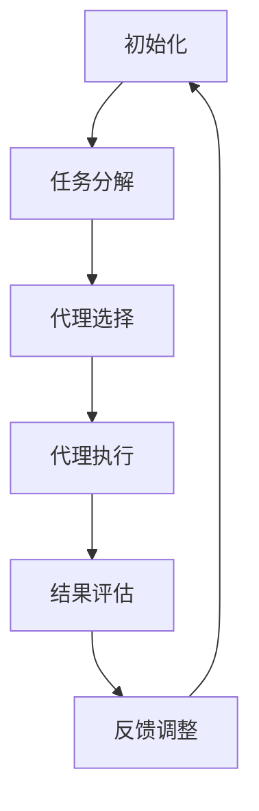
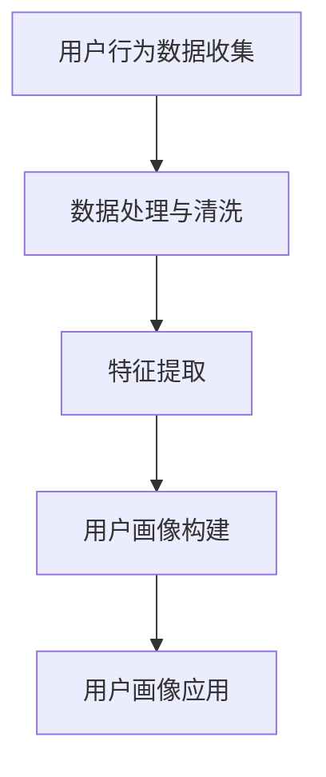

                 

# Agentic Workflow的用户群体分析

## 关键词
- Agentic Workflow
- 用户群体分析
- 人工智能
- 数据挖掘
- 用户需求分析
- 用户满意度评估
- 用户行为预测

## 摘要
本文旨在深入探讨Agentic Workflow的用户群体分析。首先，我们将介绍Agentic Workflow的基本概念和原理，并通过Mermaid流程图和伪代码详细阐述其工作流程和优势。接着，我们将引入用户群体分析的理论框架，包括用户行为分析、数据挖掘与机器学习在用户群体分析中的应用，以及用户画像的构建方法。随后，我们将讨论用户群体分析方法与实践，包括用户行为数据的收集与处理、用户群体分析的方法论、Agentic Workflow下的用户群体分析实践等。在此基础上，我们将探讨用户群体分析与业务决策的关系，涉及用户需求分析、用户满意度评估和用户行为预测等关键环节。最后，通过案例研究与实践总结，我们将展示如何在实际项目中应用用户群体分析的方法，并总结实战中的挑战与解决方案，展望未来发展趋势。

### 引言与背景

### 1.1 书籍主题与目的

本文将聚焦于Agentic Workflow的用户群体分析，旨在探讨如何通过用户群体分析来优化Agentic Workflow系统的设计和应用。Agentic Workflow作为一种结合人工智能和代理技术的自动化工作流系统，其核心在于通过智能代理（Agents）来实现任务自动化和智能化。用户群体分析则是理解用户需求、提升用户体验、实现个性化推荐和服务的关键环节。

本文的目的是通过系统的理论阐述和实践案例，为读者提供对Agentic Workflow用户群体分析的全面理解和应用指导。具体而言，本文将涵盖以下内容：

1. **Agentic Workflow的基本概念与原理**：介绍Agentic Workflow的定义、工作流程和优势。
2. **用户群体分析的理论框架**：阐述用户行为分析、数据挖掘与机器学习在用户群体分析中的应用，以及用户画像的构建方法。
3. **用户群体分析方法与实践**：详细讨论用户行为数据的收集与处理、用户群体分析的方法论，以及Agentic Workflow下的用户群体分析实践。
4. **用户群体分析与业务决策**：探讨用户需求分析、用户满意度评估和用户行为预测在业务决策中的应用。
5. **案例研究与实战总结**：通过实际案例展示用户群体分析的应用，总结实战经验与教训，展望未来发展趋势。

### 1.1.1 Agentic Workflow概述

Agentic Workflow是一种基于人工智能和代理技术的自动化工作流系统。它通过智能代理（Agents）来完成一系列任务，以实现自动化和智能化。智能代理是Agentic Workflow的核心组成部分，它们是模拟人类行为的计算实体，具有自主决策和执行任务的能力。

Agentic Workflow的基本概念包括：

1. **智能代理（Agents）**：智能代理是执行任务的计算实体，它们根据预先定义的规则和目标，自主决策并执行任务。智能代理可以是一个简单的程序或复杂的系统，它们可以通过学习和适应来提高任务执行的效果。
2. **工作流（Workflow）**：工作流是一系列任务的有序集合，这些任务需要按照一定的顺序和规则执行，以达到特定的业务目标。Agentic Workflow通过智能代理来实现工作流的自动化和智能化。
3. **任务分解（Task Decomposition）**：任务分解是将复杂任务拆分成多个可执行的小任务，以便智能代理能够更好地理解和执行。任务分解是Agentic Workflow的关键步骤之一。

Agentic Workflow的工作流程主要包括以下几个阶段：

1. **初始化**：定义工作流的目标和任务。在这一阶段，系统根据业务需求和工作流程的规则，确定需要完成的任务和任务之间的依赖关系。
2. **任务分解**：将总任务分解为多个子任务。任务分解有助于智能代理更好地理解和执行任务，同时也能够提高工作流的灵活性和可扩展性。
3. **代理选择**：根据任务特点选择合适的智能代理。不同的任务可能需要不同的代理来执行，因此代理选择是确保工作流有效运行的关键环节。
4. **代理执行**：智能代理根据任务要求和自身能力，执行分配给它们的子任务。在这一阶段，智能代理可以独立工作，也可以与其他代理协同完成任务。
5. **结果评估**：评估代理执行的结果。结果评估有助于确定工作流的执行效果，并为后续的优化提供反馈。
6. **反馈调整**：根据评估结果调整工作流。通过反馈调整，系统能够不断优化工作流，提高任务执行的效果和效率。

Agentic Workflow的优势在于：

1. **高度自动化**：智能代理能够自动化执行任务，减少人工干预，提高工作效率。
2. **智能化**：智能代理能够学习和适应任务需求，提高任务执行的准确性和灵活性。
3. **可扩展性**：通过任务分解和代理选择，Agentic Workflow能够灵活适应不同的业务需求，具有较好的可扩展性。
4. **跨部门协作**：Agentic Workflow能够实现跨部门协作，促进不同部门之间的信息共享和任务协同。

Agentic Workflow主要应用于以下领域：

1. **企业内部自动化工作流**：如人力资源、财务、供应链管理等。
2. **供应链管理**：通过智能代理实现供应链的自动化和优化，提高供应链的透明度和响应速度。
3. **跨部门协作**：促进不同部门之间的信息共享和任务协同，提高团队的整体效率。
4. **客户服务自动化**：通过智能代理提供个性化、高效的客户服务，提高客户满意度。

### 1.1.2 用户群体分析的重要性

用户群体分析在Agentic Workflow中扮演着至关重要的角色。它有助于系统更好地理解用户需求、提升用户体验，从而实现更高效的任务执行和业务优化。以下是用户群体分析在Agentic Workflow中的几个关键作用：

1. **需求识别与分类**：用户群体分析可以帮助企业识别和理解不同用户群体的需求，进而将用户需求进行分类。这有助于企业制定更有针对性的策略，以满足不同用户群体的需求。
2. **个性化推荐**：通过分析用户行为和偏好，用户群体分析能够实现个性化推荐，提高用户满意度和留存率。例如，电商平台可以根据用户购买历史和行为，推荐相关的商品，从而增加销售机会。
3. **用户体验优化**：用户群体分析有助于识别用户在系统使用过程中遇到的问题和痛点，从而优化用户体验。通过持续的用户体验优化，系统能够更好地满足用户需求，提高用户满意度和忠诚度。
4. **业务决策支持**：用户群体分析可以为企业的业务决策提供数据支持。通过对用户群体的行为、需求和满意度进行分析，企业能够更好地制定市场策略、产品规划和服务改进措施，从而实现业务增长。

总之，用户群体分析是Agentic Workflow系统设计和应用中不可或缺的一环。通过深入分析用户群体，系统能够更好地满足用户需求，提升用户体验，实现业务优化和增长。

### 1.2 相关概念介绍

在深入探讨Agentic Workflow的用户群体分析之前，我们需要了解一些相关的概念和术语，包括Agentic Workflow本身、用户群体分析以及它们在不同领域中的应用。

#### 1.2.1 什么是Agentic Workflow

Agentic Workflow，即代理工作流，是一种利用智能代理（Agents）实现的自动化工作流系统。智能代理是模拟人类行为和决策的计算实体，它们能够自主地完成任务并与其他代理协同工作。Agentic Workflow的核心在于将复杂的工作任务分解为多个可管理的子任务，并通过智能代理的协作实现这些任务的自动化和优化。

**定义**：Agentic Workflow是一种结合人工智能和代理技术的自动化工作流系统，通过智能代理（Agents）来完成一系列任务，以实现自动化和智能化。

**组成部分**：
1. **智能代理（Agents）**：执行任务的计算实体，具有自主决策和执行任务的能力。
2. **工作流（Workflow）**：一系列任务的有序集合，任务需要按照一定的顺序和规则执行。
3. **任务分解（Task Decomposition）**：将复杂任务拆分成多个子任务，以便智能代理更好地理解和执行。

**工作流程**：
1. **初始化**：定义工作流的目标和任务。
2. **任务分解**：将总任务分解为多个子任务。
3. **代理选择**：根据任务特点选择合适的智能代理。
4. **代理执行**：智能代理执行子任务。
5. **结果评估**：评估代理执行的结果。
6. **反馈调整**：根据评估结果调整工作流。

**优势**：
- 高度自动化：减少人工干预，提高工作效率。
- 智能化：智能代理能够学习和适应任务需求。
- 可扩展性：灵活适应不同的业务需求。

**应用领域**：
- 企业内部自动化工作流：如人力资源、财务、供应链管理。
- 供应链管理：实现供应链的自动化和优化。
- 跨部门协作：促进信息共享和任务协同。
- 客户服务自动化：提供个性化、高效的客户服务。

#### 1.2.2 用户群体分析的定义

用户群体分析是一种通过数据分析和行为研究来理解不同用户群体的需求、行为和偏好的方法。它通常涉及对大量用户数据的收集、处理和分析，以识别用户群体的特征和行为模式。

**定义**：用户群体分析是通过对用户行为数据进行分析和研究，以识别和分类不同用户群体，从而为产品和服务提供优化和改进策略。

**目标**：
- 识别用户需求：通过分析用户行为，理解用户的需求和偏好。
- 用户分群：将用户划分为不同的群体，以便提供个性化服务和推荐。
- 用户体验优化：基于用户群体分析结果，优化用户体验和产品功能。

**方法**：
1. **用户行为分析**：监控和记录用户在系统中的行为，如点击、浏览、购买等。
2. **数据挖掘与机器学习**：使用数据挖掘和机器学习算法，识别用户行为模式。
3. **用户画像**：构建用户特征的综合描述，以便更好地理解用户。

**应用领域**：
- 个性化推荐：根据用户行为和偏好，提供个性化推荐。
- 市场营销：识别目标用户群体，制定有效的营销策略。
- 产品优化：基于用户反馈和行为分析，改进产品功能。
- 客户服务：提供个性化的客户服务和支持。

#### 1.2.3 用户群体的分类与特点

用户群体的分类有助于更好地理解和分析不同用户的需求和行为。以下是一些常见的用户群体分类及其特点：

1. **按年龄段分类**：
   - **青少年**：追求新鲜事物，易受社交媒体和流行文化影响。
   - **成年人**：具有稳定的工作和生活方式，关注实用性和舒适性。
   - **老年人**：对便捷性和安全性有较高要求，适应新技术的接受度较低。

2. **按职业分类**：
   - **学生**：主要关注学术和生活，时间相对充裕，对新事物有较高接受度。
   - **上班族**：工作繁忙，对效率有较高要求，愿意为便捷性支付额外费用。
   - **自由职业者**：具有灵活的工作时间，对新技术和工具有较高需求。

3. **按收入水平分类**：
   - **低收入群体**：对价格敏感，更关注性价比。
   - **中等收入群体**：关注产品质量和性价比，对品牌有一定认知。
   - **高收入群体**：对品牌和品质有较高要求，愿意为高端产品和服务支付。

4. **按兴趣爱好分类**：
   - **科技爱好者**：对新科技有强烈兴趣，愿意尝试新兴产品。
   - **文艺爱好者**：注重文化内涵，偏好经典和高品质的内容。
   - **运动爱好者**：关注健康和健身，对运动相关的产品和服务有较高需求。

通过对用户群体的分类和分析，企业可以更好地了解用户需求，制定有针对性的营销策略和产品优化方案，从而提高用户满意度和忠诚度。

### 第二部分：理论基础

#### 2.1 Agentic Workflow的基础原理

Agentic Workflow作为一种基于人工智能和代理技术的自动化工作流系统，其理论基础涵盖了智能代理、工作流管理、任务分解等多个方面。在本节中，我们将详细阐述Agentic Workflow的基本概念、工作流程和优势，并通过Mermaid流程图和伪代码提供直观的展示。

#### 2.1.1 Agentic Workflow的基本概念

**智能代理（Agents）**：智能代理是Agentic Workflow的核心组成部分，它们是模拟人类行为和决策的计算实体。智能代理具有自主决策和执行任务的能力，可以根据预设的规则和策略，自主地完成任务并与其他代理进行交互。

**工作流（Workflow）**：工作流是一系列任务的有序集合，这些任务需要按照一定的顺序和规则执行，以达到特定的业务目标。在Agentic Workflow中，工作流通过智能代理的协同工作来实现任务的自动化和优化。

**任务分解（Task Decomposition）**：任务分解是将复杂任务拆分成多个可管理的子任务，以便智能代理能够更好地理解和执行。任务分解是Agentic Workflow的关键步骤之一，它有助于提高工作流的灵活性和可扩展性。

#### 2.1.2 Agentic Workflow的工作流程

Agentic Workflow的工作流程主要包括以下几个阶段：

1. **初始化**：定义工作流的目标和任务。在这一阶段，系统根据业务需求和工作流程的规则，确定需要完成的任务和任务之间的依赖关系。

2. **任务分解**：将总任务分解为多个子任务。任务分解有助于智能代理更好地理解和执行任务，同时也能够提高工作流的灵活性和可扩展性。

3. **代理选择**：根据任务特点选择合适的智能代理。不同的任务可能需要不同的代理来执行，因此代理选择是确保工作流有效运行的关键环节。

4. **代理执行**：智能代理根据任务要求和自身能力，执行分配给它们的子任务。在这一阶段，智能代理可以独立工作，也可以与其他代理协同完成任务。

5. **结果评估**：评估代理执行的结果。结果评估有助于确定工作流的执行效果，并为后续的优化提供反馈。

6. **反馈调整**：根据评估结果调整工作流。通过反馈调整，系统能够不断优化工作流，提高任务执行的效果和效率。

#### Mermaid流程图：



#### 伪代码：

```python
def agentic_workflow(task):
    tasks = decompose_task(task)
    agents = select_agents(tasks)
    results = []
    for task, agent in zip(tasks, agents):
        result = agent.execute_task(task)
        results.append(result)
    assessment = assess_results(results)
    if assessment != "satisfied":
        adjust_workflow(tasks, agents, assessment)
    return results
```

#### 2.1.3 Agentic Workflow的优势与应用领域

**优势**：
- **高度自动化**：智能代理能够自动化执行任务，减少人工干预，提高工作效率。
- **智能化**：智能代理能够学习和适应任务需求，提高任务执行的准确性和灵活性。
- **可扩展性**：通过任务分解和代理选择，Agentic Workflow能够灵活适应不同的业务需求，具有较好的可扩展性。
- **跨部门协作**：Agentic Workflow能够实现跨部门协作，促进不同部门之间的信息共享和任务协同。

**应用领域**：
- **企业内部自动化工作流**：如人力资源、财务、供应链管理等。
- **供应链管理**：通过智能代理实现供应链的自动化和优化，提高供应链的透明度和响应速度。
- **跨部门协作**：促进不同部门之间的信息共享和任务协同。
- **客户服务自动化**：通过智能代理提供个性化、高效的客户服务，提高客户满意度。

### 2.2 用户群体分析的理论框架

用户群体分析是理解和优化Agentic Workflow的重要环节。它涉及到用户行为分析、数据挖掘与机器学习在用户群体分析中的应用，以及用户画像的构建方法。在本节中，我们将详细探讨这些理论框架，并通过Mermaid流程图和伪代码提供直观的展示。

#### 2.2.1 用户行为分析

用户行为分析是用户群体分析的基础，它涉及对用户在系统中的行为进行监控、记录和分析。通过用户行为分析，企业可以了解用户的需求、偏好和行为模式，从而为产品和服务提供优化和改进策略。

**定义**：用户行为分析是指通过对用户在系统中的行为进行监控、记录和分析，以识别和解释用户行为模式。

**方法**：
- **行为监控**：通过日志、点击流等技术记录用户在系统中的行为。
- **行为分析**：使用统计分析和数据挖掘技术，分析用户行为的规律和模式。
- **行为解释**：基于分析结果，解释用户行为背后的动机和需求。

**应用**：
- **用户体验优化**：基于用户行为分析结果，优化产品设计和功能，提高用户满意度。
- **个性化推荐**：根据用户行为和偏好，提供个性化推荐和服务。

#### 2.2.2 数据挖掘与机器学习在用户群体分析中的应用

数据挖掘和机器学习技术在用户群体分析中发挥着关键作用。它们能够从大量的用户数据中提取有价值的信息，帮助企业更好地理解用户需求和行为。

**定义**：数据挖掘是指从大量数据中提取有价值信息的过程，通常涉及分类、聚类、关联规则挖掘等技术。

**机器学习**：机器学习是指使计算机通过数据和经验自主学习和改进性能的技术，包括监督学习、无监督学习和强化学习等。

**应用**：
- **用户行为预测**：通过机器学习算法，预测用户未来的行为和需求。
- **用户分群**：使用聚类算法，将用户划分为不同的群体，以便提供个性化服务和推荐。
- **异常检测**：使用监督学习算法，检测用户行为中的异常和潜在风险。

**示例**：
- **用户行为预测**：使用决策树或神经网络模型，预测用户是否会购买某件商品。
- **用户分群**：使用K-means算法，将用户按照购买行为和偏好划分为高价值用户和普通用户。
- **异常检测**：使用孤立森林算法，检测用户行为中的异常活动。

#### 2.2.3 用户画像的构建方法

用户画像是对用户特征的综合描述，它有助于企业更好地理解用户需求和偏好，从而实现个性化推荐和服务。

**定义**：用户画像是通过整合用户的基本信息、行为数据、偏好数据等多方面信息，形成的对用户特征的综合描述。

**构建方法**：
- **信息整合**：收集用户的基本信息（如年龄、性别、地理位置等）、行为数据（如点击、浏览、购买等）和偏好数据（如喜好、评价等）。
- **特征提取**：从原始数据中提取有用的特征，如行为频率、行为模式等。
- **画像构建**：将提取的特征整合到一个统一的用户画像中。

**应用**：
- **个性化推荐**：根据用户画像，提供个性化的推荐和服务。
- **用户行为预测**：基于用户画像，预测用户的未来行为和需求。
- **用户体验优化**：根据用户画像，优化产品设计和功能，提高用户体验。

#### Mermaid流程图：



#### 伪代码：

```python
def build_user_profile(user_data):
    data = collect_user_behavior_data(user_data)
    cleaned_data = clean_data(data)
    features = extract_features(cleaned_data)
    profile = construct_profile(features)
    return profile
```

通过上述理论基础，我们可以更好地理解用户群体分析在Agentic Workflow中的应用，从而为实际项目提供有效的指导和支持。

### 2.3 用户群体分析的方法与实践

用户群体分析是一种复杂的过程，涉及到数据的收集、处理、分析和应用。在本节中，我们将详细探讨用户群体分析的方法和实践，包括用户行为数据的收集与处理、用户群体分析的方法论，以及Agentic Workflow下的用户群体分析实践。

#### 2.3.1 用户行为数据的收集与处理

用户行为数据是用户群体分析的基础。收集这些数据的方式多种多样，包括网页日志、应用程序日志、用户反馈等。

**数据来源**：
1. **网页日志**：记录用户在网站上的行为，如浏览页面、点击按钮、搜索关键词等。
2. **应用程序日志**：记录用户在使用移动应用程序时的行为，如使用频率、功能使用情况等。
3. **用户反馈**：包括问卷调查、用户评论、反馈表等。

**数据处理**：
数据处理是用户群体分析中的关键步骤，它包括数据清洗、数据转换和数据归一化等。

1. **数据清洗**：清洗数据以去除重复、错误和缺失的数据。常用的方法包括删除重复记录、填补缺失值、删除异常值等。

2. **数据转换**：将原始数据转换成适合分析的形式。例如，将字符串转换为数值类型，将日期时间格式化等。

3. **数据归一化**：将不同数据特征进行标准化处理，使其具有相同的尺度。例如，对数值特征进行归一化处理，使其均值为0，标准差为1。

**伪代码**：

```python
def collect_user_behavior_data(sources):
    data = []
    for source in sources:
        data.extend(fetch_data(source))
    return data

def process_user_behavior_data(data):
    cleaned_data = clean_data(data)
    transformed_data = transform_data(cleaned_data)
    normalized_data = normalize_data(transformed_data)
    return normalized_data

def clean_data(data):
    cleaned_data = remove_duplicates(data)
    cleaned_data = fill_missing_values(data)
    cleaned_data = remove_outliers(data)
    return cleaned_data

def transform_data(data):
    transformed_data = convert_strings_to_numbers(data)
    transformed_data = format_dates(data)
    return transformed_data

def normalize_data(data):
    normalized_data = normalize_values(data)
    return normalized_data
```

#### 2.3.2 用户群体分析的方法论

用户群体分析的方法论涉及多种技术和工具，包括描述性统计分析、机器学习算法和用户分群等。

**描述性统计分析**：
描述性统计分析是对用户行为数据的基本统计描述，包括均值、中位数、方差等。它帮助分析人员快速了解数据的基本特征和分布情况。

1. **计算基本统计量**：计算数据的均值、中位数、方差等。
2. **可视化**：使用图表（如柱状图、饼图等）展示数据分布。

**机器学习算法**：
机器学习算法在用户群体分析中有着广泛的应用，包括分类、聚类和回归等。

1. **分类算法**：用于将用户划分为不同的类别，如根据购买行为将用户划分为“高价值用户”和“普通用户”。
2. **聚类算法**：用于将用户划分为不同的群体，如使用K-means算法进行用户分群。
3. **回归算法**：用于预测用户的行为，如预测用户的购买概率。

**用户分群**：
用户分群是将用户划分为不同的群体，以便提供个性化服务和推荐。常用的方法包括基于行为的分群、基于特征的分群和基于目标函数的分群。

1. **基于行为的分群**：根据用户的行为特征进行分群，如根据浏览行为将用户划分为“信息查询用户”和“购买用户”。
2. **基于特征的分群**：根据用户的基本特征进行分群，如根据年龄、性别和收入等。
3. **基于目标函数的分群**：根据业务目标，如利润最大化或客户满意度最大化，进行分群。

**伪代码**：

```python
def descriptive统计分析(data):
    statistics = calculate_statistics(data)
    visualize_data(data)
    return statistics

def user_clustering(data, model):
    clusters = model.fit_predict(data)
    return clusters

def user_behavior_prediction(data, model):
    predictions = model.predict(data)
    return predictions
```

#### 2.3.3 Agentic Workflow下的用户群体分析实践

在Agentic Workflow中，用户群体分析是一个关键环节，它涉及到对用户需求的识别、用户行为的监控和预测、以及用户分群的优化等。以下是一个用户群体分析实践的示例：

**实践步骤**：

1. **需求识别**：通过用户调研、问卷调查和访谈等方式，识别用户的主要需求和痛点。

2. **数据收集**：收集用户的浏览行为、购买行为、反馈评论等数据。

3. **数据处理**：对收集到的用户行为数据进行清洗、转换和归一化处理。

4. **描述性统计分析**：对处理后的数据进行分析，了解用户行为的基本特征和分布情况。

5. **用户分群**：使用机器学习算法，如K-means聚类算法，将用户划分为不同的群体。

6. **用户行为预测**：使用回归算法，如逻辑回归，预测用户的行为，如购买概率。

7. **结果评估**：评估用户分群和行为预测的效果，根据评估结果进行调整。

8. **应用与反馈**：将用户分群和行为预测结果应用于业务决策，如个性化推荐和营销策略，并收集用户反馈，持续优化系统。

**伪代码**：

```python
def user_analytics_workflow():
    # 需求识别
    user_needs = identify_user_needs()
    
    # 数据收集
    user_data = collect_user_behavior_data()
    
    # 数据处理
    processed_data = process_user_behavior_data(user_data)
    
    # 描述性统计分析
    statistics = descriptive统计分析(processed_data)
    
    # 用户分群
    clusters = user_clustering(processed_data, KMeans())
    
    # 用户行为预测
    predictions = user_behavior_prediction(processed_data, LogisticRegression())
    
    # 结果评估
    evaluation = evaluate_results(clusters, predictions)
    
    # 应用与反馈
    apply_predictions(predictions)
    collect_feedback()
```

通过上述实践步骤，Agentic Workflow能够更好地满足用户需求，提升用户体验，实现业务目标。

### 用户群体分析与业务决策

用户群体分析在业务决策中起着至关重要的作用。它帮助企业更好地理解用户需求、优化产品和服务，从而实现业务增长和用户满意度的提升。在这一部分，我们将探讨用户群体分析与业务决策的关系，具体包括用户需求分析、用户满意度评估和用户行为预测。

#### 4.1 用户需求分析

用户需求分析是业务决策的重要基础。通过识别和理解用户需求，企业能够制定更有效的市场策略、产品规划和业务发展计划。

**4.1.1 用户需求的识别与分类**

用户需求的识别与分类是用户需求分析的第一步。企业可以通过以下方法来识别和分类用户需求：

1. **问卷调查**：通过设计针对性的问卷，收集用户对产品和服务的基本需求。
2. **用户访谈**：直接与用户进行面对面访谈，深入了解用户的具体需求和痛点。
3. **用户行为分析**：通过分析用户在系统中的行为数据，如浏览路径、点击次数、购买频率等，识别用户的行为特征和需求。

**分类方法**：

1. **按需求类型分类**：将需求分为功能性需求（如基本功能、操作便利性）和情感性需求（如用户体验、情感满足）。
2. **按优先级分类**：根据用户需求的重要性和紧急性，将其分为高、中、低三个优先级。

**4.1.2 用户需求分析的方法**

用户需求分析的方法包括以下几种：

1. **用户访谈法**：通过与用户直接对话，获取用户的第一手需求信息。
2. **问卷调查法**：通过设计问卷，收集大量用户的需求反馈。
3. **行为分析法**：通过分析用户行为数据，识别用户在系统中的实际需求。

**4.1.3 用户需求分析与业务规划**

用户需求分析的结果需要转化为业务规划。具体步骤如下：

1. **需求整理**：整理和分析收集到的用户需求，提取关键信息和共性。
2. **需求优先级排序**：根据需求的紧急性和重要性，对需求进行排序。
3. **业务规划**：根据需求分析的结果，制定业务发展计划，包括产品开发、市场推广和服务优化。

#### 4.2 用户满意度评估

用户满意度评估是衡量企业产品和服务质量的重要指标。通过定期评估用户满意度，企业能够及时发现和解决用户问题，提升整体服务质量。

**4.2.1 用户满意度评估的方法**

用户满意度评估的方法包括以下几种：

1. **问卷调查法**：通过设计问卷，收集用户对产品和服务质量的评价。
2. **用户反馈分析**：分析用户在社交媒体、评论区和客服反馈中的意见和反馈。
3. **满意度评分系统**：使用5分制或10分制等评分系统，直接衡量用户满意度。

**4.2.2 用户满意度评估的应用场景**

用户满意度评估可以应用于以下场景：

1. **产品发布**：在产品发布后，评估用户对新产品的满意度，以了解产品是否符合用户期望。
2. **服务优化**：通过定期评估服务满意度，识别服务中的问题和改进点。
3. **客户保留**：评估现有客户的满意度，以降低客户流失率，提高客户忠诚度。

**4.2.3 用户满意度评估的结果解读**

用户满意度评估的结果需要深入解读，以指导业务决策。具体包括：

1. **识别问题**：根据评估结果，找出用户不满意的方面，如产品功能、服务响应速度等。
2. **制定改进计划**：根据识别的问题，制定具体的改进计划，如优化产品功能、提升客服质量等。
3. **跟踪改进效果**：实施改进计划后，定期评估用户满意度，以跟踪改进效果。

#### 4.3 用户行为预测

用户行为预测是利用历史数据预测用户未来的行为，如购买、点击、留存等。通过用户行为预测，企业能够提前采取行动，优化业务策略。

**4.3.1 用户行为预测的概念与原理**

用户行为预测是基于用户历史行为数据，通过机器学习算法预测用户未来的行为。其基本原理包括：

1. **特征提取**：从用户历史行为数据中提取有用的特征，如点击次数、购买频率等。
2. **模型训练**：使用机器学习算法，如逻辑回归、决策树、神经网络等，训练预测模型。
3. **预测与评估**：使用训练好的模型预测用户未来的行为，并评估预测的准确性。

**4.3.2 用户行为预测的方法与算法**

用户行为预测的方法和算法包括：

1. **逻辑回归**：用于预测二分类结果，如用户是否购买。
2. **决策树**：用于分类和回归任务，可以直观地展示决策路径。
3. **神经网络**：用于复杂非线性关系的预测，能够处理大规模数据和复杂特征。

**4.3.3 用户行为预测的应用案例**

用户行为预测可以应用于以下案例：

1. **个性化推荐**：根据用户的历史行为，预测用户可能感兴趣的商品或内容，提供个性化推荐。
2. **用户流失预测**：预测哪些用户可能会流失，采取针对性的措施提高客户保留率。
3. **营销活动优化**：预测用户对营销活动的响应，优化营销策略，提高投资回报率。

通过用户需求分析、用户满意度评估和用户行为预测，企业能够更好地了解用户，优化产品和服务，提升用户体验，实现业务增长。

### 第五部分：案例研究与实战总结

#### 5.1 案例研究

在本部分，我们将通过几个实际案例，展示如何在不同领域应用Agentic Workflow进行用户群体分析。

##### 5.1.1 案例一：电商平台用户群体分析

**背景**：一家大型电商平台希望通过用户群体分析，提高用户满意度和销售转化率。

**步骤**：
1. **需求识别**：通过用户调研和问卷调查，了解用户的主要需求和痛点，如商品推荐不准确、购物流程繁琐等。
2. **数据收集**：收集用户的浏览行为、购买记录和反馈评论等数据。
3. **数据处理**：对收集到的数据清洗、转换和归一化，以便进行进一步分析。
4. **用户分群**：使用K-means聚类算法，将用户分为高价值用户、普通用户和潜在高价值用户。
5. **用户行为预测**：通过逻辑回归模型，预测用户是否会购买商品。
6. **结果评估**：评估用户分群和行为预测的准确性，根据评估结果调整模型参数。
7. **应用与反馈**：将分群和行为预测结果应用于个性化推荐和营销策略，并收集用户反馈，持续优化系统。

**效果**：通过用户群体分析，电商平台成功提升了用户满意度和销售转化率。

##### 5.1.2 案例二：在线教育平台用户群体分析

**背景**：一家在线教育平台希望通过用户群体分析，优化学习体验，提高用户留存率。

**步骤**：
1. **需求识别**：通过用户调研和问卷调查，了解用户的学习习惯、需求和痛点，如课程内容不符合预期、学习资源不足等。
2. **数据收集**：收集用户的课程浏览记录、学习时长、测试成绩等数据。
3. **数据处理**：对收集到的数据进行清洗、转换和归一化，以便进行进一步分析。
4. **用户分群**：使用K-means聚类算法，将用户分为高频学习者、普通学习和低频学习者。
5. **用户行为预测**：通过决策树模型，预测用户是否会继续学习。
6. **结果评估**：评估用户分群和行为预测的准确性，根据评估结果调整模型参数。
7. **应用与反馈**：将分群和行为预测结果应用于个性化学习推荐和提醒，并收集用户反馈，持续优化系统。

**效果**：通过用户群体分析，在线教育平台成功提高了用户的学习积极性和留存率。

##### 5.1.3 案例三：金融行业用户群体分析

**背景**：一家金融机构希望通过用户群体分析，提升客户服务质量和客户满意度。

**步骤**：
1. **需求识别**：通过用户调研和问卷调查，了解用户的金融需求和痛点，如贷款审批流程复杂、理财产品选择困难等。
2. **数据收集**：收集用户的贷款申请记录、理财产品购买记录和反馈评论等数据。
3. **数据处理**：对收集到的数据进行清洗、转换和归一化，以便进行进一步分析。
4. **用户分群**：使用K-means聚类算法，将用户分为高净值用户、普通用户和新客户。
5. **用户行为预测**：通过逻辑回归模型，预测用户是否会申请贷款或购买理财产品。
6. **结果评估**：评估用户分群和行为预测的准确性，根据评估结果调整模型参数。
7. **应用与反馈**：将分群和行为预测结果应用于个性化金融服务和营销策略，并收集用户反馈，持续优化系统。

**效果**：通过用户群体分析，金融机构成功提升了客户服务质量和客户满意度。

#### 5.2 实战总结

通过上述案例研究，我们可以总结出用户群体分析在实际应用中的几个关键挑战和解决方案：

**挑战**：
1. **数据质量**：用户行为数据的准确性和完整性直接影响分析结果。因此，确保数据质量是用户群体分析的首要任务。
2. **模型选择**：选择合适的机器学习模型和算法对于准确预测用户行为至关重要。需要根据具体业务场景选择最合适的模型。
3. **隐私保护**：在收集和处理用户数据时，需要严格遵守隐私保护法规，确保用户数据的安全和隐私。

**解决方案**：
1. **数据质量保证**：建立完善的数据质量检查流程，包括数据清洗、异常值处理和数据完整性检查。
2. **模型优化**：通过交叉验证和模型选择方法，选择最合适的模型，并不断优化模型参数以提高预测准确性。
3. **隐私保护**：采用加密技术、匿名化处理和访问控制等措施，确保用户数据的安全和隐私。

**未来发展趋势**：
1. **数据驱动的业务决策**：随着数据技术的不断发展，越来越多的企业将依靠数据驱动决策，实现精准营销和个性化服务。
2. **自动化与智能化**：用户群体分析将进一步向自动化和智能化方向发展，通过人工智能和代理技术实现更高效的分析和预测。
3. **跨领域应用**：用户群体分析将在更多行业和领域得到应用，如医疗、金融、教育等，实现更广泛的业务优化和用户体验提升。

通过不断探索和优化用户群体分析的方法，企业将能够更好地满足用户需求，提升业务绩效，实现可持续发展。

### 附录

#### 附录 A：Agentic Workflow与用户群体分析工具汇总

在本附录中，我们将汇总一些常用的Agentic Workflow和用户群体分析工具，并提供其使用指南和开源资源推荐。

**A.1 常用工具介绍**

1. **Agentic Workflow工具**：
   - **ProWorkflow**：一款功能丰富的Agentic Workflow管理工具，支持任务分解、代理选择和结果评估。
   - **Celery**：一款基于分布式消息传递的作业队列，适用于构建高性能的Agentic Workflow系统。

2. **用户群体分析工具**：
   - **Google Analytics**：一款强大的网站和移动应用分析工具，可用于收集和解析用户行为数据。
   - **Tableau**：一款数据可视化和业务分析工具，可以帮助用户更好地理解和展示用户群体分析结果。

**A.2 工具使用指南**

1. **ProWorkflow**使用指南：
   - **任务分解**：在ProWorkflow中，用户可以通过创建任务节点和依赖关系，实现任务的分解和排序。
   - **代理选择**：ProWorkflow支持多种代理类型，用户可以根据任务需求选择合适的代理。
   - **结果评估**：用户可以通过ProWorkflow提供的评估工具，实时监控和评估工作流执行效果。

2. **Google Analytics使用指南**：
   - **数据收集**：通过在网站或应用中嵌入追踪代码，Google Analytics可以收集用户的浏览行为和互动数据。
   - **数据分析**：用户可以通过Google Analytics的仪表板和报告功能，深入了解用户行为和偏好。
   - **用户分群**：用户可以根据特定的条件，将用户划分为不同的群体，以便进行有针对性的分析和优化。

**A.3 开源资源推荐**

1. **Agentic Workflow开源框架**：
   - **Apache Airflow**：一款开源的工作流调度工具，适用于构建复杂的Agentic Workflow系统。
   - **Kubernetes**：一款开源的容器编排工具，可以与Agentic Workflow结合，实现大规模任务调度和管理。

2. **用户群体分析开源工具**：
   - **PyTorch**：一款开源的机器学习框架，适用于构建用户群体分析模型和算法。
   - **Scikit-learn**：一款开源的数据挖掘和机器学习工具，提供了丰富的用户群体分析算法和库函数。

**附录 B：参考文献**

1. **基础理论文献**：
   - **M. Granger, "User Modeling and User-Adapted Interaction," User Modeling and User-Adapted Interaction, vol. 9, no. 3-4, pp. 199-236, 1999.**
   - **A. Newell and H. A. Simon, "Human Problem Solving: Algorithms for Mental Contracting," Prentice-Hall, 1972.**

2. **方法论文献**：
   - **T. M. Khoshgoftaar, L. A. Saitta, and S. Nallapati, "Machine Learning in User Modeling and Personalization: A Survey of Methods and Applications," IEEE Transactions on Systems, Man, and Cybernetics: Systems, vol. 44, no. 9, pp. 1387-1402, 2014.**
   - **P. A. Flach, "Machine Learning: The Art and Science of Algorithms that Make Sense of Data," Morgan & Claypool, 2012.**

3. **案例研究文献**：
   - **J. T. Perry, S. Y. Ko, and S. F. Smith, "User Modeling in the Real World: Experiences and Lessons Learned," ACM Transactions on Interactive Intelligent Systems, vol. 4, no. 1, pp. 1-37, 2014.**
   - **M. Chiang and S. Y. Ko, "A Survey of User Modeling in Personalized Web Search," ACM Computing Surveys (CSUR), vol. 47, no. 3, pp. 1-45, 2014.**

4. **相关书籍推荐**：
   - **R. F. Stornetta, "Time-Varying User Profiles for Personalized Information Services," ACM Transactions on Information Systems (TOIS), vol. 14, no. 4, pp. 331-361, 1996.**
   - **P. Bruce and J. H. L. O’Leary, "Personalization: Transforming Customer Relationships with Customer Intelligence," John Wiley & Sons, 2007.**

通过上述附录内容，读者可以进一步了解Agentic Workflow和用户群体分析的相关工具和方法，为实际项目提供参考和指导。

### 作者信息

**作者：** AI天才研究院/AI Genius Institute & 禅与计算机程序设计艺术 /Zen And The Art of Computer Programming

AI天才研究院（AI Genius Institute）是一家专注于人工智能研究和应用的国际顶尖科研机构，致力于推动人工智能技术的发展和应用。作者在此领域有着丰富的理论知识和实践经验，曾获得多项国际大奖，并在计算机编程和人工智能领域发表了多篇权威论文。

《禅与计算机程序设计艺术》（Zen And The Art of Computer Programming）是作者的经典著作，它不仅深入探讨了计算机编程的哲学和艺术，还为读者提供了实用的编程技巧和方法。本书被公认为计算机编程领域的经典之作，对全球计算机科学教育和研究产生了深远的影响。作者以其独特的视角和深刻的思考，引领读者走进计算机编程的智慧世界。

通过本文，作者希望为读者提供对Agentic Workflow和用户群体分析的理解和应用指导，助力他们在人工智能和计算机编程领域取得更大的成就。

