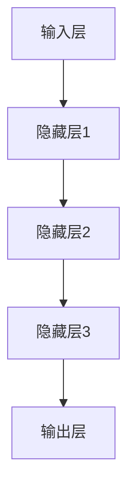
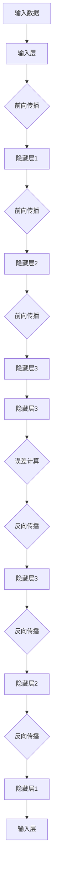
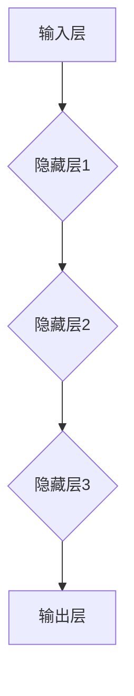
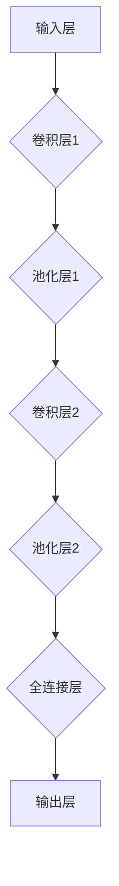
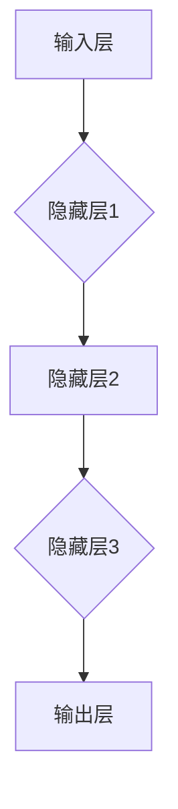
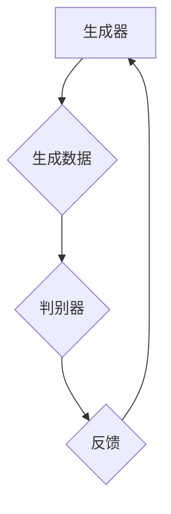
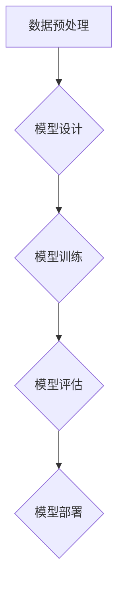
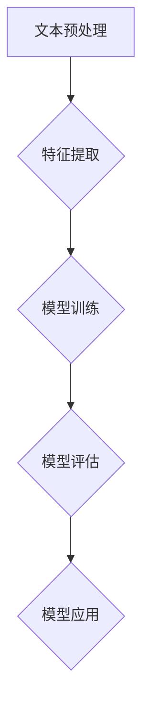

                 

### 第一部分：引言

#### 引言

人工智能（AI）作为当前科技领域的热点，正不断推动着各行各业的革新与变革。安德烈·卡帕希（Andrej Karpathy）作为世界级的人工智能专家，其在深度学习、自然语言处理和计算机视觉等领域的卓越贡献，为人工智能的发展提供了宝贵的理论和实践指导。本文旨在探讨安德烈·卡帕希对人工智能未来发展的见解，分析当前人工智能面临的挑战与机遇，并展望其核心技术的应用前景。

#### 关键词

- 安德烈·卡帕希
- 人工智能
- 深度学习
- 自然语言处理
- 计算机视觉
- 未来发展

#### 摘要

本文首先介绍安德烈·卡帕希的学术背景及其在人工智能领域的贡献，随后分析当前人工智能的发展现状、面临的挑战及未来发展方向。接着，详细阐述深度学习、自然语言处理和计算机视觉等核心技术的原理与应用，并探讨人工智能在医疗、工业和交通等领域的具体应用。最后，本文将讨论人工智能的伦理与社会问题，并对未来人工智能的发展趋势进行展望。通过本文的阅读，读者将全面了解人工智能领域的最新动态与发展方向，对人工智能的未来充满信心。

### 第二部分：人工智能的核心技术

在本文的第二部分，我们将深入探讨人工智能的核心技术，包括深度学习、自然语言处理和计算机视觉。这些技术是当前人工智能研究与应用的关键，它们的发展与突破将直接影响人工智能的未来。通过详细讲解这些技术的核心概念、原理与应用，我们将更好地理解人工智能的强大潜力和广泛应用。

#### 第3章：深度学习的核心概念

深度学习是人工智能领域最为重要的技术之一，其通过模拟人脑神经网络的工作方式，实现复杂数据的自动特征提取与模式识别。本章将介绍深度学习的基本原理、神经网络的结构以及深度学习算法，帮助读者建立对深度学习技术的全面理解。

##### 3.1 深度学习的基本原理

深度学习的基本原理源于人工神经网络（Artificial Neural Networks,ANN）。人工神经网络是由大量简单的处理单元（神经元）相互连接而成的复杂网络。这些神经元通过加权连接形成层次结构，每个层次对输入数据进行处理和传递，最终形成输出。

深度学习通过增加网络的层数，使得神经网络能够学习和提取更复杂的特征。这种层次化的特征提取机制使得深度学习在图像识别、语音识别和自然语言处理等领域表现出色。

##### 3.2 神经网络的结构

神经网络通常包括输入层、隐藏层和输出层。输入层接收外部输入数据，隐藏层对数据进行处理和变换，输出层产生最终的输出结果。

神经元的处理过程通常包括两个阶段：前向传播和反向传播。前向传播是指输入数据从输入层经过隐藏层，最终到达输出层的过程；反向传播是指根据输出结果与真实结果的误差，反向更新网络权重的过程。

##### 3.3 深度学习算法

深度学习算法主要包括卷积神经网络（Convolutional Neural Networks,CNN）、循环神经网络（Recurrent Neural Networks,RNN）和生成对抗网络（Generative Adversarial Networks,GAN）等。

卷积神经网络（CNN）是一种专门用于处理图像数据的神经网络，其核心思想是通过卷积操作提取图像的局部特征。

循环神经网络（RNN）是一种能够处理序列数据的神经网络，其通过循环结构实现对序列数据的记忆和建模。

生成对抗网络（GAN）是一种由生成器和判别器组成的对抗性网络，通过两者之间的博弈，生成器不断生成逼真的数据，判别器则不断学习区分真实数据和生成数据。

#### 第4章：自然语言处理

自然语言处理（Natural Language Processing,NLP）是人工智能领域的重要组成部分，旨在使计算机能够理解、生成和处理人类语言。本章将介绍自然语言处理的基本概念、语音识别与生成以及文本生成与理解等内容。

##### 4.1 自然语言处理的基本概念

自然语言处理涉及多个方面的技术，包括分词（Tokenization）、词性标注（Part-of-Speech Tagging）、命名实体识别（Named Entity Recognition,NER）、句法分析（Syntactic Parsing）和语义分析（Semantic Analysis）等。

分词是将连续的文本序列分割成具有独立意义的词汇单元；词性标注是为每个词汇单元标注其在句子中的词性，如名词、动词、形容词等；命名实体识别是识别文本中的特定实体，如人名、地名、组织机构名等；句法分析是分析句子的语法结构，确定词汇之间的句法关系；语义分析是理解句子的语义含义，确定词汇之间的语义关系。

##### 4.2 语音识别与生成

语音识别（Speech Recognition）是自然语言处理的一个重要分支，旨在将语音信号转换为文本。语音识别系统通常包括声学模型、语言模型和声学-语言模型等组成部分。

声学模型负责将语音信号转换为特征向量；语言模型负责根据特征向量生成文本；声学-语言模型则结合声学模型和语言模型，通过序列模型或树状模型实现对语音信号的文本转换。

语音生成（Speech Synthesis）则是将文本转换为自然流畅的语音输出。常见的语音生成技术包括基于规则的语音合成和统计语音合成。

##### 4.3 文本生成与理解

文本生成（Text Generation）是将一个输入文本转换为一个更复杂、更丰富的输出文本。常见的文本生成技术包括基于模板的生成、基于统计的生成和基于神经网络的生成。

基于模板的生成是通过预定义的模板和替换规则生成文本；基于统计的生成是通过统计文本数据中的模式来生成文本；基于神经网络的生成则通过训练神经网络模型，从输入文本生成输出文本。

文本理解（Text Understanding）是理解文本中的语义信息，确定文本的意图、情感和主题等。常见的文本理解技术包括语义角色标注、关系抽取和情感分析等。

#### 第5章：计算机视觉

计算机视觉（Computer Vision）是人工智能领域的另一个重要分支，旨在使计算机能够“看到”和理解图像和视频。本章将介绍计算机视觉的基本原理、图像识别与生成以及视觉感知与模拟等内容。

##### 5.1 计算机视觉的基本原理

计算机视觉的基本原理是通过图像处理、模式识别和机器学习等技术，从图像或视频中提取有用信息，实现对视觉数据的理解和分析。

图像处理是对图像进行变换、增强和滤波等操作，以提高图像质量和提取图像特征；模式识别是利用特征提取和分类算法，对图像中的目标进行识别和分类；机器学习则是通过训练模型，从大量图像数据中自动学习和提取特征。

##### 5.2 图像识别与生成

图像识别（Image Recognition）是计算机视觉的核心任务，旨在从图像中识别和分类目标物体。

常见的图像识别算法包括基于特征的识别、基于模型的识别和基于深度学习的识别。基于特征的识别是通过提取图像的特征向量，利用相似性度量进行分类；基于模型的识别是通过构建图像模型，利用模型进行分类；基于深度学习的识别是通过训练深度神经网络，实现对图像的自动分类。

图像生成（Image Generation）是将一个输入图像转换为一个更复杂、更具创意的输出图像。常见的图像生成技术包括基于规则的生成、基于统计的生成和基于神经网络的生成。

基于规则的生成是通过预定义的规则和变换操作生成图像；基于统计的生成是通过统计图像数据中的模式来生成图像；基于神经网络的生成则通过训练神经网络模型，从输入图像生成输出图像。

##### 5.3 视觉感知与模拟

视觉感知与模拟是计算机视觉的高级任务，旨在模拟人类的视觉感知过程，实现对图像和视频的自主理解和交互。

视觉感知与模拟包括视觉感知（Visual Perception）和视觉模拟（Visual Simulation）两个部分。视觉感知是通过计算机视觉技术，对图像和视频进行理解和分析，提取视觉信息；视觉模拟是通过模拟人类的视觉系统，生成逼真的视觉体验。

通过深入探讨深度学习、自然语言处理和计算机视觉等核心技术，我们可以更好地理解人工智能的原理和未来发展方向，为人工智能在各个领域的应用奠定坚实基础。

#### 3.1 深度学习的基本原理

深度学习的基本原理源于人工神经网络（Artificial Neural Networks,ANN）。人工神经网络是由大量简单的处理单元（神经元）相互连接而成的复杂网络。这些神经元通过加权连接形成层次结构，每个层次对输入数据进行处理和传递，最终形成输出。

深度学习通过增加网络的层数，使得神经网络能够学习和提取更复杂的特征。这种层次化的特征提取机制使得深度学习在图像识别、语音识别和自然语言处理等领域表现出色。

##### 3.1.1 神经网络的结构

神经网络通常包括输入层、隐藏层和输出层。输入层接收外部输入数据，隐藏层对数据进行处理和变换，输出层产生最终的输出结果。

神经元的处理过程通常包括两个阶段：前向传播和反向传播。前向传播是指输入数据从输入层经过隐藏层，最终到达输出层的过程；反向传播是指根据输出结果与真实结果的误差，反向更新网络权重的过程。

以下是神经网络结构的 Mermaid 流程图：



##### 3.1.2 前向传播与反向传播

前向传播的过程如下：

1. 输入数据通过输入层进入神经网络。
2. 输入数据在隐藏层中进行计算，每个神经元接收来自输入层的输入，并通过激活函数进行处理。
3. 输出数据经过隐藏层传递到输出层，输出层的神经元产生最终输出结果。

反向传播的过程如下：

1. 计算输出结果与真实结果的误差。
2. 将误差反向传播到隐藏层，通过梯度下降算法更新网络权重。
3. 重复前向传播和反向传播的过程，直到网络输出结果达到期望值。

以下是前向传播与反向传播的 Mermaid 流程图：



##### 3.1.3 激活函数

激活函数是神经网络中的一个关键组件，用于引入非线性特性。常见的激活函数包括 sigmoid、ReLU（Rectified Linear Unit）和 tanh。

sigmoid 函数：

```latex
f(x) = \frac{1}{1 + e^{-x}}
```

ReLU 函数：

```latex
f(x) = \max(0, x)
```

tanh 函数：

```latex
f(x) = \frac{e^x - e^{-x}}{e^x + e^{-x}}
```

这些激活函数的引入使得神经网络能够学习和提取更复杂的特征，从而在图像识别、语音识别和自然语言处理等领域表现出色。

##### 3.1.4 梯度下降算法

梯度下降算法是神经网络训练过程中的核心优化算法。其基本思想是通过计算网络输出结果与真实结果的误差，计算误差相对于网络权重的梯度，并沿梯度方向更新网络权重，以最小化误差。

梯度下降算法分为随机梯度下降（Stochastic Gradient Descent,S GD）和批量梯度下降（Batch Gradient Descent,B GD）两种。

随机梯度下降（SGD）：

在每次迭代中，只更新一次权重，使用当前批次中的一个样本来计算梯度。

批量梯度下降（B GD）：

在每次迭代中，更新所有权重，使用整个训练数据集来计算梯度。

以下是梯度下降算法的伪代码：

```python
while not converged:
    for each sample in training_data:
        compute gradients
        update weights
```

通过梯度下降算法，神经网络能够不断调整权重，以最小化误差，从而实现复杂的特征提取和模式识别。

#### 3.2 神经网络的结构

神经网络通常包括输入层、隐藏层和输出层。输入层接收外部输入数据，隐藏层对数据进行处理和变换，输出层产生最终的输出结果。隐藏层可以有一个或多个，具体取决于任务的复杂性和数据量。

以下是神经网络结构的 Mermaid 流程图：



每个神经元在处理数据时，都会将输入乘以相应的权重，然后通过激活函数进行处理。激活函数可以引入非线性特性，使得神经网络能够学习和提取更复杂的特征。

隐藏层和输出层之间的连接是通过权重矩阵实现的，这些权重矩阵需要在训练过程中不断调整，以使网络输出结果与真实结果尽量接近。

#### 3.3 深度学习算法

深度学习算法主要包括卷积神经网络（Convolutional Neural Networks,CNN）、循环神经网络（Recurrent Neural Networks,RNN）和生成对抗网络（Generative Adversarial Networks,GAN）等。这些算法在图像识别、语音识别、自然语言处理等领域具有广泛应用。

##### 3.3.1 卷积神经网络（CNN）

卷积神经网络（CNN）是一种专门用于处理图像数据的神经网络，其核心思想是通过卷积操作提取图像的局部特征。

卷积操作：

卷积操作是将一个卷积核（过滤器）在图像上滑动，并对覆盖的区域进行加权求和，得到一个卷积特征图。

卷积神经网络的结构通常包括卷积层（Convolutional Layer）、池化层（Pooling Layer）和全连接层（Fully Connected Layer）。

以下是卷积神经网络结构的 Mermaid 流程图：



卷积神经网络通过多个卷积层和池化层的堆叠，可以提取图像的层次化特征，从而实现图像分类、目标检测和图像生成等任务。

##### 3.3.2 循环神经网络（RNN）

循环神经网络（RNN）是一种能够处理序列数据的神经网络，其通过循环结构实现对序列数据的记忆和建模。

RNN的基本结构包括输入层、隐藏层和输出层。隐藏层通过递归连接，将前一个时间步的隐藏状态传递到当前时间步，实现对序列数据的记忆。

以下是循环神经网络结构的 Mermaid 流程图：



循环神经网络通过递归连接，可以处理时间序列数据，如语音信号、文本序列和时间序列数据等。

##### 3.3.3 生成对抗网络（GAN）

生成对抗网络（GAN）是一种由生成器和判别器组成的对抗性网络，通过两者之间的博弈，生成器不断生成逼真的数据，判别器则不断学习区分真实数据和生成数据。

生成器（Generator）：

生成器的目标是生成逼真的数据，以欺骗判别器。

判别器（Discriminator）：

判别器的目标是判断输入数据是真实数据还是生成数据。

GAN的训练过程包括两个阶段：

1. 生成器生成一批数据，判别器对其进行判断。
2. 根据判别器的反馈，生成器调整参数，生成更逼真的数据。

以下是生成对抗网络结构的 Mermaid 流程图：



生成对抗网络在图像生成、文本生成和语音合成等领域具有广泛应用。

#### 4.1 自然语言处理的基本概念

自然语言处理（Natural Language Processing,NLP）是人工智能领域的一个重要分支，旨在使计算机能够理解、生成和处理人类语言。NLP涉及多个方面的技术，包括分词（Tokenization）、词性标注（Part-of-Speech Tagging）、命名实体识别（Named Entity Recognition,NER）、句法分析（Syntactic Parsing）和语义分析（Semantic Analysis）等。

##### 4.1.1 分词（Tokenization）

分词是将连续的文本序列分割成具有独立意义的词汇单元。分词是NLP的基础步骤，对于后续的词性标注、命名实体识别和句法分析等任务至关重要。

常见的分词方法包括：

1. 空格分词：基于文本中的空格进行分词，简单但可能导致错分词。
2. 正向最大匹配：从文本开头开始，寻找最长的匹配词，逐步向右进行分词。
3. 逆向最大匹配：从文本结尾开始，寻找最长的匹配词，逐步向左进行分词。
4. 最短路径分词：在文本中寻找最短的分词路径，实现分词。

以下是正向最大匹配分词的伪代码：

```python
def tokenize_forward(text):
    words = []
    for i in range(len(text)):
        word = ""
        for j in range(i, len(text)):
            word += text[j]
            if word in dictionary:
                words.append(word)
                break
    return words
```

##### 4.1.2 词性标注（Part-of-Speech Tagging）

词性标注是为每个词汇单元标注其在句子中的词性，如名词、动词、形容词等。词性标注有助于理解句子的语义和语法结构，为后续的句法分析和语义分析提供基础。

常见的词性标注方法包括：

1. 规则方法：基于预定义的规则和模式进行词性标注。
2. 统计方法：利用统计模型，如隐马尔可夫模型（HMM）和条件随机场（CRF），进行词性标注。
3. 深度学习方法：利用神经网络模型，如卷积神经网络（CNN）和循环神经网络（RNN），进行词性标注。

以下是基于隐马尔可夫模型（HMM）的词性标注算法伪代码：

```python
def viterbi_sequence(observations, transition_matrix, emission_matrix):
    # 初始化前向-后向算法
    alpha = [initial_state_prob * emission_matrix[initial_state][observations[0]]]
    beta = [1.0]

    # 遍历观测序列，计算前向概率和后向概率
    for i in range(1, len(observations)):
        alpha_i = []
        for state in states:
            alpha_i.append(alpha[-1] * transition_matrix[state][previous_state] * emission_matrix[state][observations[i]])
        alpha.append(alpha_i)
        beta_i = []
        for state in states:
            beta_i.append(transition_matrix[state][next_state] * emission_matrix[state][observations[-1]] * beta[-1])
        beta.append(beta_i)

    # 计算最大概率的路径
    max_prob, max_state = max(zip(alpha[-1], states))
    sequence = [max_state]

    # 反向遍历，构建最优路径
    for i in range(len(observations) - 1, 0, -1):
        max_prob, max_state = max(zip(beta_i[previous_state], states))
        sequence.insert(0, max_state)

    return sequence
```

##### 4.1.3 命名实体识别（Named Entity Recognition,NER）

命名实体识别是识别文本中的特定实体，如人名、地名、组织机构名等。命名实体识别有助于提取文本中的关键信息，为信息抽取、文本分类和问答系统等任务提供基础。

常见的命名实体识别方法包括：

1. 基于规则的方法：利用预定义的规则和模式进行命名实体识别。
2. 统计方法：利用统计模型，如最大熵模型（MaxEnt）和条件随机场（CRF），进行命名实体识别。
3. 深度学习方法：利用神经网络模型，如卷积神经网络（CNN）和循环神经网络（RNN），进行命名实体识别。

以下是基于条件随机场（CRF）的命名实体识别算法伪代码：

```python
def crf_decodesequences(s, A):
    T = len(s)
    n = A.shape[0]
    W = -numpy.log(A[1, :])
    scores = W[s[0]]
    for t in range(1, T):
        scores = numpy.minimum(scores, scores - A[s[t - 1], :])
        scores = scores + W[s[t]]
    return scores.argmax()
```

##### 4.1.4 句法分析（Syntactic Parsing）

句法分析是分析句子的语法结构，确定词汇之间的句法关系。句法分析有助于理解句子的语义和逻辑关系，为自然语言理解和生成提供基础。

常见的句法分析方法包括：

1. 自顶向下分析：从全局开始，逐步分解句子，直到生成词序列。
2. 自底向上分析：从局部开始，逐步组合词序列，直到生成完整的句子。
3. 深度学习方法：利用神经网络模型，如循环神经网络（RNN）和变换器（Transformer），进行句法分析。

以下是基于循环神经网络（RNN）的句法分析算法伪代码：

```python
def syntax_analysis(text):
    # 初始化 RNN 模型
    model = RNNModel()
    # 编码文本
    encoded_text = model.encode(text)
    # 训练模型
    model.train(encoded_text)
    # 解码句子
    parsed_sentence = model.decode(encoded_text)
    return parsed_sentence
```

##### 4.1.5 语义分析（Semantic Analysis）

语义分析是理解句子的语义含义，确定词汇之间的语义关系。语义分析有助于理解句子的意图、情感和主题等，为问答系统、文本摘要和机器翻译等任务提供基础。

常见的语义分析方法包括：

1. 分布式语义表示：将词汇映射到高维向量空间，通过向量运算进行语义分析。
2. 语义角色标注：确定句子中的动词和名词之间的语义关系，如主语、宾语、谓语等。
3. 语义分析模型：利用神经网络模型，如变换器（Transformer）和生成对抗网络（GAN），进行语义分析。

以下是基于变换器（Transformer）的语义分析算法伪代码：

```python
def semantic_analysis(sentence):
    # 初始化 Transformer 模型
    model = TransformerModel()
    # 编码句子
    encoded_sentence = model.encode(sentence)
    # 训练模型
    model.train(encoded_sentence)
    # 提取语义表示
    semantic_representation = model.extract_semantic_representation(encoded_sentence)
    return semantic_representation
```

通过上述基本概念的介绍，我们可以更好地理解自然语言处理的原理和应用，为后续的详细讨论和案例分析奠定基础。

#### 4.2 语音识别与生成

语音识别（Speech Recognition）和语音生成（Speech Synthesis）是自然语言处理（NLP）中的重要领域，分别致力于将语音信号转换为文本以及将文本转换为自然流畅的语音。本节将详细介绍语音识别与语音生成的基本原理、常用算法以及技术挑战。

##### 4.2.1 语音识别的基本原理

语音识别是将语音信号转换为文本的过程。其基本原理包括声学建模、语言建模和声学-语言模型等组成部分。

1. 声学建模（Acoustic Modeling）：

声学建模关注于语音信号的处理，通过提取语音信号的声学特征来实现语音到文本的转换。声学模型将语音信号转换为特征向量，如梅尔频率倒谱系数（MFCC）和线性预测编码（LPC）等。声学模型通常使用神经网络，如深度神经网络（DNN）和卷积神经网络（CNN），进行训练。

以下是声学建模的伪代码：

```python
def acoustic_modeling(voice_signal):
    # 提取梅尔频率倒谱系数（MFCC）
    mfcc_features = extract_mfcc(voice_signal)
    # 使用深度神经网络（DNN）或卷积神经网络（CNN）进行训练
    trained_model = train_dnn_or_cnn(mfcc_features)
    return trained_model
```

2. 语言建模（Language Modeling）：

语言建模关注于文本的生成，通过统计文本数据中的模式来预测下一个单词或词组。语言模型使用统计模型，如N元语法（N-gram）和循环神经网络（RNN），进行训练。

以下是语言建模的伪代码：

```python
def language_modeling(text_data):
    # 使用N元语法或循环神经网络（RNN）进行训练
    trained_model = train_n_gram_or_rnn(text_data)
    return trained_model
```

3. 声学-语言模型（Acoustic-Linguistic Modeling）：

声学-语言模型结合声学建模和语言建模，通过序列模型或树状模型实现对语音信号的文本转换。常见的声学-语言模型包括隐马尔可夫模型（HMM）和统计模型（如CRF）。

以下是声学-语言模型的伪代码：

```python
def acoustic_language_modeling(voice_signal, text_data):
    # 训练声学模型和语言模型
    acoustic_model = acoustic_modeling(voice_signal)
    language_model = language_modeling(text_data)
    # 使用序列模型或树状模型进行训练
    trained_model = train_sequence_model_or_tree_model(acoustic_model, language_model)
    return trained_model
```

##### 4.2.2 语音识别算法

语音识别算法通常分为基于模板匹配的识别、基于统计模型的识别和基于深度学习的识别。

1. 基于模板匹配的识别（Template Matching）：

基于模板匹配的识别方法通过将输入语音信号与预定义的模板进行匹配，实现语音到文本的转换。这种方法简单但准确性较低。

2. 基于统计模型的识别（Statistical Modeling）：

基于统计模型的识别方法，如隐马尔可夫模型（HMM）和隐条件随机场（HCRF），通过统计语音信号和文本数据之间的模式，实现语音到文本的转换。这种方法具有较高的准确性。

以下是基于HMM的语音识别算法伪代码：

```python
def hmm_based_recognition(voice_signal):
    # 初始化隐马尔可夫模型（HMM）
    hmm_model = initialize_hmm_model()
    # 使用训练数据训练HMM模型
    trained_model = train_hmm_model(hmm_model, training_data)
    # 使用HMM模型进行语音识别
    recognized_text = hmm_model.recognize(voice_signal)
    return recognized_text
```

3. 基于深度学习的识别（Deep Learning）：

基于深度学习的识别方法，如卷积神经网络（CNN）和循环神经网络（RNN），通过大规模数据训练，实现语音到文本的高准确性转换。深度学习算法能够自动提取语音信号中的复杂特征，从而提高识别准确率。

以下是基于CNN的语音识别算法伪代码：

```python
def cnn_based_recognition(voice_signal):
    # 初始化卷积神经网络（CNN）
    cnn_model = initialize_cnn_model()
    # 使用训练数据训练CNN模型
    trained_model = train_cnn_model(cnn_model, training_data)
    # 使用CNN模型进行语音识别
    recognized_text = cnn_model.recognize(voice_signal)
    return recognized_text
```

##### 4.2.3 语音生成的原理

语音生成是将文本转换为自然流畅的语音的过程。常见的语音生成方法包括基于规则的生成、基于统计的生成和基于深度学习的生成。

1. 基于规则的生成（Rule-Based Generation）：

基于规则的生成方法通过预定义的规则和替换操作，将文本转换为语音。这种方法简单但灵活性较低。

2. 基于统计的生成（Statistical Generation）：

基于统计的生成方法，如基于N元语法（N-gram）和隐马尔可夫模型（HMM），通过统计文本数据中的模式，生成自然流畅的语音。这种方法具有较高的准确性。

3. 基于深度学习的生成（Deep Learning Generation）：

基于深度学习的生成方法，如循环神经网络（RNN）和生成对抗网络（GAN），通过大规模数据训练，生成自然流畅的语音。深度学习算法能够自动提取文本中的复杂特征，从而提高语音生成的质量。

以下是基于RNN的语音生成算法伪代码：

```python
def rnn_based_speech_synthesis(text):
    # 初始化循环神经网络（RNN）
    rnn_model = initialize_rnn_model()
    # 使用训练数据训练RNN模型
    trained_model = train_rnn_model(rnn_model, training_data)
    # 使用RNN模型生成语音
    synthesized_speech = trained_model.synthesize(text)
    return synthesized_speech
```

##### 4.2.4 语音识别与语音生成的技术挑战

语音识别与语音生成在技术上面临诸多挑战，包括多语种支持、说话人自适应、语速和语调变化等。

1. 多语种支持：

语音识别与语音生成需要支持多种语言，这对于模型训练和算法设计提出了更高的要求。

2. 说话人自适应：

说话人自适应是指系统能够适应不同的说话人声音特征，实现准确识别和生成。这对于语音识别和语音生成算法的鲁棒性提出了挑战。

3. 语速和语调变化：

语速和语调变化会对语音信号产生显著影响，这对于语音识别与语音生成算法的准确性提出了挑战。系统需要能够适应不同的语速和语调，实现稳定的识别和生成。

通过深入探讨语音识别与语音生成的基本原理和算法，我们可以更好地理解其在自然语言处理中的应用和价值，为未来的技术发展提供有力支持。

#### 4.3 文本生成与理解

文本生成（Text Generation）和文本理解（Text Understanding）是自然语言处理（NLP）领域的重要任务，分别致力于将输入文本转换为更具创意和复杂性的文本以及理解文本中的语义信息。本节将详细讨论文本生成与理解的基本原理、常见算法以及实际应用。

##### 4.3.1 文本生成的基本原理

文本生成是将一个输入文本转换为一个更复杂、更丰富的输出文本的过程。常见的文本生成技术包括基于规则的生成、基于统计的生成和基于神经网络的生成。

1. 基于规则的生成（Rule-Based Generation）：

基于规则的生成方法通过预定义的模板和替换规则，生成文本。这种方法简单但灵活性较低。

2. 基于统计的生成（Statistical Generation）：

基于统计的生成方法通过统计文本数据中的模式，生成文本。这种方法包括N元语法（N-gram）和隐马尔可夫模型（HMM）等。

3. 基于神经网络的生成（Neural Network Generation）：

基于神经网络的生成方法利用神经网络模型，如循环神经网络（RNN）和生成对抗网络（GAN），生成文本。这种方法能够自动提取输入文本的复杂特征，生成更具创意和复杂性的文本。

以下是基于神经网络的文本生成算法的伪代码：

```python
def neural_network_based_text_generation(input_text):
    # 初始化循环神经网络（RNN）或生成对抗网络（GAN）
    model = initialize_rnn_or_gan_model()
    # 使用训练数据训练模型
    trained_model = train_model(model, training_data)
    # 生成文本
    generated_text = trained_model.generate(input_text)
    return generated_text
```

##### 4.3.2 文本理解的基本原理

文本理解是理解文本中的语义信息，确定文本的意图、情感和主题等。常见的文本理解技术包括语义角色标注、关系抽取和情感分析等。

1. 语义角色标注（Semantic Role Labeling）：

语义角色标注是确定句子中的动词和名词之间的语义关系，如主语、宾语、谓语等。语义角色标注有助于理解句子的语义结构和功能。

2. 关系抽取（Relation Extraction）：

关系抽取是识别文本中的实体之间的关系，如人物关系、组织关系等。关系抽取有助于提取文本中的关键信息，为信息抽取和知识图谱构建等任务提供基础。

3. 情感分析（Sentiment Analysis）：

情感分析是确定文本中的情感倾向，如正面、负面和客观等。情感分析有助于理解用户反馈、产品评价等，为情感监控和商业决策等提供支持。

以下是情感分析算法的伪代码：

```python
def sentiment_analysis(text):
    # 初始化情感分析模型
    model = initialize_sentiment_analysis_model()
    # 使用训练数据训练模型
    trained_model = train_model(model, training_data)
    # 确定文本的情感倾向
    sentiment = trained_model.analyze(text)
    return sentiment
```

##### 4.3.3 文本生成与理解的算法

文本生成与理解算法包括序列到序列模型（Seq2Seq）、变换器（Transformer）和生成对抗网络（GAN）等。

1. 序列到序列模型（Seq2Seq）：

序列到序列模型是一种基于循环神经网络（RNN）或变换器（Transformer）的模型，用于将一个输入序列转换为一个输出序列。这种模型在机器翻译、文本摘要等任务中具有广泛应用。

2. 变换器（Transformer）：

变换器是一种基于自注意力机制的模型，通过多头自注意力机制和前馈神经网络，实现对输入序列的建模和生成。变换器在自然语言处理任务中表现出色，如机器翻译、文本分类和文本生成等。

3. 生成对抗网络（GAN）：

生成对抗网络是一种由生成器和判别器组成的对抗性网络，通过生成器和判别器之间的博弈，生成逼真的数据。生成对抗网络在文本生成、图像生成和语音生成等任务中具有广泛应用。

以下是生成对抗网络（GAN）的算法伪代码：

```python
def generative_adversarial_network():
    # 初始化生成器（Generator）和判别器（Discriminator）
    generator = initialize_generator()
    discriminator = initialize_discriminator()
    # 训练生成器和判别器
    for epoch in range(num_epochs):
        for batch in data_loader:
            # 训练生成器
            fake_data = generator.generate(batch)
            loss_generator = discriminator.loss(fake_data, valid_labels)
            generator_optimizer.zero_grad()
            loss_generator.backward()
            generator_optimizer.step()
            # 训练判别器
            real_data = batch
            loss_discriminator = discriminator.loss(real_data, valid_labels)
            discriminator_optimizer.zero_grad()
            loss_discriminator.backward()
            discriminator_optimizer.step()
    return generator, discriminator
```

##### 4.3.4 文本生成与理解的案例

文本生成与理解在实际应用中具有重要意义，如机器翻译、文本摘要、智能客服和推荐系统等。

1. 机器翻译（Machine Translation）：

机器翻译是将一种语言的文本翻译成另一种语言的文本。常见的机器翻译模型包括序列到序列模型（Seq2Seq）和变换器（Transformer）。例如，将中文文本翻译成英文文本。

2. 文本摘要（Text Summarization）：

文本摘要是从长文本中提取关键信息，生成简洁的摘要。常见的文本摘要模型包括抽取式摘要和生成式摘要。例如，从一篇新闻文章中提取关键信息，生成摘要。

3. 智能客服（Smart Customer Service）：

智能客服利用自然语言处理技术，实现与用户的对话和交互。常见的智能客服系统包括文本生成和理解、对话管理和语音合成等。

4. 推荐系统（Recommendation System）：

推荐系统利用自然语言处理技术，为用户推荐感兴趣的内容。常见的推荐系统包括基于内容的推荐和基于协同过滤的推荐等。

通过深入探讨文本生成与理解的基本原理、算法和案例，我们可以更好地理解自然语言处理的实际应用，为未来的技术发展提供有力支持。

#### 5.1 计算机视觉的基本原理

计算机视觉（Computer Vision）是人工智能领域的一个重要分支，旨在使计算机能够理解、分析和处理视觉信息。计算机视觉的基本原理涉及多个方面，包括图像处理、模式识别和机器学习等。以下是对这些原理的详细解释。

##### 5.1.1 图像处理

图像处理是计算机视觉的基础，它涉及对图像进行各种操作，如滤波、增强、变换等，以提高图像质量或提取图像特征。图像处理的主要步骤包括：

1. **图像滤波**：图像滤波是去除图像噪声的过程。常用的滤波器包括均值滤波、高斯滤波和中值滤波等。

   ```mermaid
   graph TD
   A[图像] --> B{均值滤波}
   B --> C{高斯滤波}
   C --> D{中值滤波}
   D --> E{滤波后的图像}
   ```

2. **图像增强**：图像增强是增强图像中的有用信息，使其更清晰和易于分析。常见的图像增强技术包括对比度增强、亮度增强和锐化等。

   ```mermaid
   graph TD
   A[图像] --> B{对比度增强}
   B --> C{亮度增强}
   C --> D{锐化}
   D --> E{增强后的图像}
   ```

3. **图像变换**：图像变换是将图像从一种形式转换到另一种形式。常见的图像变换包括傅里叶变换、离散余弦变换和霍夫变换等。

   ```mermaid
   graph TD
   A[图像] --> B{傅里叶变换}
   B --> C{离散余弦变换}
   C --> D{霍夫变换}
   D --> E{变换后的图像}
   ```

##### 5.1.2 模式识别

模式识别是计算机视觉的核心任务，旨在从图像中识别和分类目标。模式识别包括以下步骤：

1. **特征提取**：特征提取是从图像中提取出能够表示图像局部结构和内容的特征。常见的特征提取方法包括边缘检测、角点检测和纹理分析等。

   ```mermaid
   graph TD
   A[图像] --> B{边缘检测}
   B --> C{角点检测}
   C --> D{纹理分析}
   D --> E{特征向量}
   ```

2. **特征匹配**：特征匹配是将提取到的特征与预先定义的模型进行对比，以识别目标。常见的特征匹配算法包括最近邻算法和K-近邻算法等。

   ```mermaid
   graph TD
   A[特征向量] --> B{最近邻算法}
   B --> C{K-近邻算法}
   C --> D{匹配结果}
   ```

3. **分类**：分类是将图像中的目标归类到特定的类别。常见的分类算法包括支持向量机（SVM）、决策树和神经网络等。

   ```mermaid
   graph TD
   A[特征向量] --> B{SVM}
   B --> C{决策树}
   C --> D{神经网络}
   D --> E{类别标签}
   ```

##### 5.1.3 机器学习

机器学习是计算机视觉的重要组成部分，它使计算机能够通过学习数据来改进性能。机器学习包括以下几种方法：

1. **监督学习**：监督学习是使用带有标签的训练数据来训练模型，以便对未知数据进行预测。常见的监督学习算法包括线性回归、逻辑回归和决策树等。

   ```mermaid
   graph TD
   A[训练数据] --> B{线性回归}
   B --> C{逻辑回归}
   C --> D{决策树}
   ```

2. **无监督学习**：无监督学习是使用没有标签的数据来训练模型，以便发现数据中的结构和模式。常见无监督学习算法包括聚类算法、主成分分析和自编码器等。

   ```mermaid
   graph TD
   A[无标签数据] --> B{K-均值聚类}
   B --> C{主成分分析}
   C --> D{自编码器}
   ```

3. **深度学习**：深度学习是一种通过多层神经网络来学习数据的高级机器学习方法。深度学习在计算机视觉中得到了广泛应用，如卷积神经网络（CNN）和循环神经网络（RNN）等。

   ```mermaid
   graph TD
   A[输入数据] --> B{卷积神经网络（CNN)}
   B --> C{循环神经网络（RNN)}
   C --> D{输出结果}
   ```

通过综合运用图像处理、模式识别和机器学习等技术，计算机视觉能够实现从图像中提取有用信息，识别和分类目标，并在多种应用场景中发挥重要作用。

### 5.2 图像识别与生成

图像识别与生成是计算机视觉（Computer Vision）领域的重要研究方向，涵盖了从图像中提取信息以及根据图像生成新图像的技术。这些技术在实际应用中有着广泛的应用，如自动驾驶、图像识别系统和图像编辑等。

#### 5.2.1 图像识别

图像识别是指从图像中识别并分类特定对象或场景的任务。常见的图像识别任务包括人脸识别、物体检测和场景分类等。图像识别的核心在于如何从图像中提取有效的特征，并利用这些特征对图像进行分类。

1. **特征提取**：

   特征提取是从图像中提取出能够表示图像局部结构和内容的特征。常见的特征提取方法包括：

   - **边缘检测**：通过检测图像中的边缘来提取图像的轮廓特征。常用的边缘检测算法包括Canny算法和Sobel算法。

     ```mermaid
     graph TD
     A[图像] --> B{Canny边缘检测}
     B --> C{Sobel边缘检测}
     C --> D{边缘特征}
     ```

   - **角点检测**：通过检测图像中的角点来提取图像的角点特征。常用的角点检测算法包括Shi-Tomasi算法和Harris算法。

     ```mermaid
     graph TD
     A[图像] --> B{Shi-Tomasi角点检测}
     B --> C{Harris角点检测}
     C --> D{角点特征}
     ```

   - **纹理分析**：通过分析图像中的纹理模式来提取图像的特征。常用的纹理分析算法包括LBP（局部二值模式）和Gabor变换等。

     ```mermaid
     graph TD
     A[图像] --> B{LBP纹理分析}
     B --> C{Gabor变换}
     C --> D{纹理特征}
     ```

2. **分类与识别**：

   分类与识别是指利用提取到的特征对图像进行分类或识别。常见的分类与识别算法包括：

   - **支持向量机（SVM）**：通过寻找最优分隔超平面来实现分类任务。

     ```mermaid
     graph TD
     A[特征向量] --> B{SVM分类}
     B --> C{类别标签}
     ```

   - **决策树**：通过构建决策树来对图像进行分类。

     ```mermaid
     graph TD
     A[特征向量] --> B{决策树分类}
     B --> C{类别标签}
     ```

   - **神经网络**：通过训练神经网络模型来实现分类与识别任务。常见的神经网络模型包括卷积神经网络（CNN）和循环神经网络（RNN）。

     ```mermaid
     graph TD
     A[输入图像] --> B{卷积神经网络（CNN)}
     B --> C{全连接层}
     C --> D{类别标签}
     ```

3. **实例：人脸识别**：

   人脸识别是图像识别的一个典型应用。其基本流程包括人脸检测、人脸特征提取和人脸分类与识别。

   - **人脸检测**：通过检测图像中的人脸区域。
   - **人脸特征提取**：从人脸图像中提取特征，如眼睛、鼻子和嘴巴的位置。
   - **人脸分类与识别**：利用提取到的人脸特征对人脸进行分类和识别。

   ```mermaid
   graph TD
   A[输入图像] --> B{人脸检测}
   B --> C{人脸特征提取}
   C --> D{人脸分类与识别}
   ```

#### 5.2.2 图像生成

图像生成是指根据输入数据生成新的图像。图像生成的技术主要包括基于规则的生成、基于统计的生成和基于神经网络的生成。

1. **基于规则的生成**：

   基于规则的生成是通过预定义的规则和变换操作来生成图像。这种方法简单但灵活性较低。例如，通过颜色替换和几何变换来生成新图像。

   ```mermaid
   graph TD
   A[输入图像] --> B{颜色替换}
   B --> C{几何变换}
   C --> D{新图像}
   ```

2. **基于统计的生成**：

   基于统计的生成是通过分析图像数据中的模式来生成新图像。这种方法包括N元语法和隐马尔可夫模型等。例如，通过统计图像中的纹理模式来生成新图像。

   ```mermaid
   graph TD
   A[训练图像] --> B{N元语法}
   B --> C{隐马尔可夫模型}
   C --> D{新图像}
   ```

3. **基于神经网络的生成**：

   基于神经网络的生成是通过训练神经网络模型来生成新图像。这种方法包括生成对抗网络（GAN）和变分自编码器（VAE）等。例如，通过训练GAN模型来生成逼真的图像。

   ```mermaid
   graph TD
   A[输入数据] --> B{生成器（Generator)}
   B --> C{判别器（Discriminator)}
   C --> D{新图像}
   ```

4. **实例：图像超分辨率**：

   图像超分辨率是图像生成的一个典型应用。其目标是根据低分辨率图像生成高分辨率图像。基本流程包括：

   - **图像预处理**：对低分辨率图像进行预处理，如去噪和增强。
   - **特征提取**：从低分辨率图像中提取特征。
   - **图像生成**：利用提取到的特征生成高分辨率图像。

   ```mermaid
   graph TD
   A[低分辨率图像] --> B{图像预处理}
   B --> C{特征提取}
   C --> D{图像生成}
   ```

通过深入探讨图像识别与生成的基本原理和技术，我们可以更好地理解计算机视觉的实际应用和价值，为未来的技术发展提供有力支持。

### 5.3 视觉感知与模拟

视觉感知与模拟是计算机视觉领域的高级任务，旨在模拟人类的视觉感知过程，实现对图像和视频的自主理解和交互。视觉感知与模拟包括视觉感知（Visual Perception）和视觉模拟（Visual Simulation）两个部分。

#### 5.3.1 视觉感知

视觉感知是计算机视觉的核心任务，旨在使计算机能够“看到”和理解图像和视频。视觉感知涉及多个方面的技术，包括图像处理、模式识别和机器学习等。

1. **图像处理**：

   图像处理是对图像进行各种操作，如滤波、增强、变换等，以提高图像质量或提取图像特征。图像处理的主要步骤包括：

   - **滤波**：通过去除图像中的噪声来提高图像质量。
     ```mermaid
     graph TD
     A[图像] --> B{滤波}
     B --> C{去噪图像}
     ```

   - **增强**：通过增强图像中的有用信息来提高图像的清晰度。
     ```mermaid
     graph TD
     A[图像] --> B{增强}
     B --> C{清晰图像}
     ```

   - **变换**：通过将图像从一种形式转换到另一种形式，如傅里叶变换和霍夫变换。
     ```mermaid
     graph TD
     A[图像] --> B{变换}
     B --> C{变换后图像}
     ```

2. **模式识别**：

   模式识别是从图像中识别和分类特定对象或场景的任务。模式识别包括以下步骤：

   - **特征提取**：从图像中提取出能够表示图像局部结构和内容的特征。
     ```mermaid
     graph TD
     A[图像] --> B{特征提取}
     B --> C{特征向量}
     ```

   - **特征匹配**：将提取到的特征与预先定义的模型进行对比，以识别目标。
     ```mermaid
     graph TD
     A[特征向量] --> B{特征匹配}
     B --> C{匹配结果}
     ```

   - **分类**：将图像中的目标归类到特定的类别。
     ```mermaid
     graph TD
     A[特征向量] --> B{分类}
     B --> C{类别标签}
     ```

3. **机器学习**：

   机器学习是使计算机能够通过学习数据来改进性能的技术。在视觉感知中，机器学习用于训练模型以识别和分类图像。常见的机器学习算法包括：

   - **监督学习**：使用带有标签的训练数据来训练模型。
     ```mermaid
     graph TD
     A[训练数据] --> B{监督学习}
     B --> C{分类器}
     ```

   - **无监督学习**：使用没有标签的数据来训练模型，以便发现数据中的结构和模式。
     ```mermaid
     graph TD
     A[无标签数据] --> B{无监督学习}
     B --> C{聚类算法}
     ```

4. **实例：物体检测**：

   物体检测是视觉感知的一个典型应用。其目标是识别图像中的所有物体并标注其位置。物体检测的基本流程包括：

   - **图像预处理**：对图像进行预处理，如去噪和增强。
   - **特征提取**：从预处理后的图像中提取特征。
   - **物体识别**：利用提取到的特征对图像进行分类和识别。
   - **位置标注**：对识别到的物体进行位置标注。

   ```mermaid
   graph TD
   A[输入图像] --> B{图像预处理}
   B --> C{特征提取}
   C --> D{物体识别}
   D --> E{位置标注}
   ```

#### 5.3.2 视觉模拟

视觉模拟是通过模拟人类的视觉系统，生成逼真的视觉体验。视觉模拟包括虚拟现实（VR）和增强现实（AR）等技术。

1. **虚拟现实（VR）**：

   虚拟现实是通过计算机生成的三维环境，使用户感受到沉浸式的体验。虚拟现实的关键技术包括：

   - **三维建模**：通过三维建模工具创建虚拟环境。
     ```mermaid
     graph TD
     A[三维建模工具] --> B{虚拟环境}
     ```

   - **渲染**：通过渲染技术生成逼真的三维图像。
     ```mermaid
     graph TD
     A[虚拟环境] --> B{渲染器}
     B --> C{三维图像}
     ```

   - **交互**：通过用户输入设备（如手柄、头盔等）实现与虚拟环境的交互。
     ```mermaid
     graph TD
     A[用户输入] --> B{交互系统}
     B --> C{虚拟环境更新}
     ```

2. **增强现实（AR）**：

   增强现实是在现实世界环境中叠加虚拟元素，提供增强的视觉体验。增强现实的关键技术包括：

   - **定位与跟踪**：通过摄像头和传感器实现虚拟元素在现实世界中的定位与跟踪。
     ```mermaid
     graph TD
     A[摄像头] --> B{定位与跟踪}
     ```

   - **叠加与渲染**：将虚拟元素叠加在现实世界中，并通过渲染技术生成逼真的视觉效果。
     ```mermaid
     graph TD
     A[虚拟元素] --> B{叠加与渲染}
     ```

   - **交互**：通过用户输入设备实现与增强现实环境的交互。
     ```mermaid
     graph TD
     A[用户输入] --> B{交互系统}
     ```

通过深入探讨视觉感知与模拟的基本原理和技术，我们可以更好地理解计算机视觉的实际应用和价值，为未来的技术发展提供有力支持。

### 第三部分：人工智能在各个领域的应用

在本文的第三部分，我们将探讨人工智能在医疗、工业与制造业、交通等领域的应用。这些领域正经历着人工智能带来的深刻变革，通过自动化、优化和智能化的解决方案，人工智能正在提升行业的效率、精度和用户体验。

#### 第6章：人工智能在医疗领域的应用

人工智能在医疗领域的应用正日益扩大，从疾病诊断到药物研发，再到公共卫生管理，AI都在发挥重要作用。以下是对这些应用的详细探讨。

##### 6.1 人工智能在医疗诊断中的应用

人工智能在医疗诊断中的应用极大地提升了诊断的准确性和效率。通过深度学习和计算机视觉技术，AI系统能够分析医学影像，如X光片、CT扫描和MRI，以识别病变和疾病。

1. **图像分析**：

   人工智能系统可以自动分析医学影像，检测出肺癌、乳腺癌、脑瘤等疾病的早期迹象。以下是使用卷积神经网络（CNN）进行图像分析的伪代码：

   ```python
   def image_analysis(image):
       # 加载预训练的CNN模型
       model = load_pretrained_cnn_model()
       # 对图像进行预处理
       processed_image = preprocess_image(image)
       # 通过模型进行图像分析
       diagnosis = model.predict(processed_image)
       return diagnosis
   ```

2. **诊断支持系统**：

   AI诊断支持系统可以帮助医生快速、准确地做出诊断。这些系统通过整合患者的病历、实验室检测结果和历史诊断信息，提供辅助诊断建议。以下是诊断支持系统的基本架构：

   ```mermaid
   graph TD
   A[患者病历] --> B{数据整合}
   B --> C{AI诊断模型}
   C --> D{诊断建议}
   D --> E{医生决策}
   ```

##### 6.2 人工智能在药物研发中的应用

人工智能在药物研发中的应用正在改变传统的研发模式，从药物筛选到临床试验，AI都发挥着关键作用。

1. **药物设计**：

   人工智能系统能够基于已有的药物结构和生物信息，预测新的药物分子，并优化其结构和活性。以下是使用生成对抗网络（GAN）进行药物设计的伪代码：

   ```python
   def drug_design(target):
       # 初始化GAN模型
       gan_model = initialize_gan_model()
       # 使用GAN模型生成新的药物分子
       new_drug_molecule = gan_model.generate_molecule(target)
       # 对新药物分子进行优化
       optimized_molecule = optimize_molecule(new_drug_molecule)
       return optimized_molecule
   ```

2. **临床试验**：

   AI系统能够分析临床试验数据，预测药物的安全性和疗效，并优化临床试验设计。以下是使用机器学习进行临床试验数据分析的伪代码：

   ```python
   def clinical_trial_analysis(data):
       # 加载预训练的机器学习模型
       model = load_pretrained_ml_model()
       # 分析临床试验数据
       predictions = model.predict(data)
       # 提取关键信息
       key اطلاعات = extract_key_info(predictions)
       return key اطلاعات
   ```

##### 6.3 人工智能在公共卫生管理中的应用

人工智能在公共卫生管理中的应用有助于提高疾病监测和疫情预警的效率，优化医疗资源分配，以及提供个性化的健康建议。

1. **疾病监测**：

   人工智能系统能够实时分析大量的健康数据，如医疗记录、社交媒体信息和环境数据，以监测疾病的传播趋势。以下是使用机器学习进行疾病监测的伪代码：

   ```python
   def disease_monitoring(data):
       # 加载预训练的机器学习模型
       model = load_pretrained_ml_model()
       # 分析健康数据
       trends = model.analyze_data(data)
       # 预测疾病传播趋势
       predictions = model.predict_trends(trends)
       return predictions
   ```

2. **疫情预警**：

   AI系统能够基于历史数据和实时数据，预测疫情的爆发和传播，为公共卫生决策提供支持。以下是使用深度学习进行疫情预警的伪代码：

   ```python
   def pandemic_warning(data):
       # 初始化深度学习模型
       model = initialize_deeplearning_model()
       # 使用模型进行训练
       trained_model = model.train(data)
       # 预测疫情爆发
       prediction = trained_model.predict()
       return prediction
   ```

3. **医疗资源分配**：

   人工智能能够优化医疗资源的分配，如医院床位、医疗设备和医护人员等。以下是使用优化算法进行医疗资源分配的伪代码：

   ```python
   def resource_allocation(resources, demands):
       # 初始化优化模型
       model = initialize_optimization_model()
       # 优化医疗资源分配
       allocation_plan = model.optimize(resources, demands)
       return allocation_plan
   ```

通过上述探讨，我们可以看到人工智能在医疗领域的广泛应用，以及它为提高医疗质量和效率带来的巨大潜力。

### 第7章：人工智能在工业与制造业中的应用

人工智能在工业与制造业中的应用正在深刻改变生产过程、供应链管理和产品设计等方面，通过自动化、优化和智能化的解决方案，AI显著提升了生产效率、降低了成本，并提高了产品质量。

#### 7.1 人工智能在工业自动化中的应用

工业自动化是人工智能在制造业中最为重要的应用领域之一。通过机器学习和计算机视觉技术，AI能够实现生产过程的自动化，减少人工干预，提高生产效率。

1. **自动化生产系统**：

   人工智能系统能够通过分析生产数据和传感器数据，实时监控生产过程，自动调整生产参数，确保生产过程的高效和稳定。以下是使用机器学习进行自动化生产系统的伪代码：

   ```python
   def automated_production_system(data):
       # 加载预训练的机器学习模型
       model = load_pretrained_ml_model()
       # 监控生产过程
       status = model.analyze_production_data(data)
       # 自动调整生产参数
       adjustments = model.adjust_production_parameters(status)
       return adjustments
   ```

2. **质量控制**：

   AI系统能够通过图像识别技术自动检测生产过程中出现的产品缺陷，并及时采取措施。以下是使用卷积神经网络（CNN）进行质量控制检测的伪代码：

   ```python
   def quality_control(image):
       # 加载预训练的CNN模型
       model = load_pretrained_cnn_model()
       # 分析图像
       defects = model.detect_defects(image)
       # 采取措施
       actions = take_actions(defects)
       return actions
   ```

#### 7.2 人工智能在供应链管理中的应用

供应链管理是制造业的重要组成部分，人工智能在供应链管理中的应用能够优化供应链流程，提高供应链的透明度和效率。

1. **需求预测**：

   AI系统能够通过分析历史销售数据和市场需求，预测未来的需求趋势，帮助制造商优化生产计划和库存管理。以下是使用时间序列分析进行需求预测的伪代码：

   ```python
   def demand_prediction(data):
       # 加载预训练的时间序列分析模型
       model = load_pretrained_time_series_model()
       # 预测未来需求
       predictions = model.predict_demand(data)
       return predictions
   ```

2. **供应链优化**：

   AI系统能够通过分析供应链数据，识别出潜在的瓶颈和优化点，提出优化方案，提高供应链的整体效率。以下是使用优化算法进行供应链优化的伪代码：

   ```python
   def supply_chain_optimization(data):
       # 初始化优化模型
       model = initialize_optimization_model()
       # 分析供应链数据
       optimization_plan = model.optimize_supply_chain(data)
       return optimization_plan
   ```

#### 7.3 人工智能在产品设计中的应用

人工智能在产品设计中的应用能够提高设计的效率和质量，通过数据分析和生成算法，AI能够帮助设计师创造更具创新性和实用性的产品。

1. **设计优化**：

   AI系统能够通过分析产品设计和性能数据，优化产品结构，提高产品性能。以下是使用机器学习进行设计优化的伪代码：

   ```python
   def design_optimization(data):
       # 加载预训练的机器学习模型
       model = load_pretrained_ml_model()
       # 优化产品设计
       optimized_design = model.optimize_design(data)
       return optimized_design
   ```

2. **产品生成**：

   AI系统能够通过生成对抗网络（GAN）等生成算法，根据用户需求生成新的产品概念和设计方案。以下是使用生成对抗网络进行产品生成的伪代码：

   ```python
   def product_generation(target):
       # 初始化生成对抗网络（GAN）模型
       gan_model = initialize_gan_model()
       # 生成新的产品概念
       new_product_concept = gan_model.generate_product(target)
       return new_product_concept
   ```

通过上述探讨，我们可以看到人工智能在工业与制造业中的广泛应用，以及它为提高生产效率、降低成本和优化供应链带来的巨大潜力。

### 第8章：人工智能在交通领域的应用

人工智能在交通领域的应用正在显著改善交通管理、自动驾驶和公共交通系统的效率与安全性。以下是对这些应用的详细探讨。

#### 8.1 人工智能在智能交通系统中的应用

智能交通系统（Intelligent Transportation Systems, ITS）利用人工智能技术提高交通管理的智能化水平，从而减少交通拥堵、提高交通效率和安全性。

1. **交通流量预测**：

   人工智能系统能够通过分析历史交通数据、实时交通监控数据和气象数据，预测交通流量变化，帮助交通管理部门提前采取措施。以下是使用时间序列分析进行交通流量预测的伪代码：

   ```python
   def traffic_flow_prediction(data):
       # 加载预训练的时间序列分析模型
       model = load_pretrained_time_series_model()
       # 预测未来交通流量
       predictions = model.predict_traffic_flow(data)
       return predictions
   ```

2. **信号控制优化**：

   AI系统能够通过实时分析交通流量数据，动态调整交通信号灯的时间设置，以减少交通拥堵和等待时间。以下是使用优化算法进行信号控制优化的伪代码：

   ```python
   def signal_control_optimization(data):
       # 初始化优化模型
       model = initialize_optimization_model()
       # 优化信号灯设置
       optimized_signals = model.optimize_traffic_signals(data)
       return optimized_signals
   ```

#### 8.2 人工智能在自动驾驶中的应用

自动驾驶技术是人工智能在交通领域的另一个重要应用，它通过传感器、机器学习和深度学习技术，使车辆能够自主导航和驾驶。

1. **环境感知**：

   自动驾驶车辆需要通过传感器（如摄像头、激光雷达和超声波传感器）实时感知周围环境，以识别道路、车辆、行人和其他障碍物。以下是使用深度学习进行环境感知的伪代码：

   ```python
   def environment_perception(sensor_data):
       # 加载预训练的深度学习模型
       model = load_pretrained_dnn_model()
       # 分析传感器数据
       perception_results = model.analyze_sensor_data(sensor_data)
       return perception_results
   ```

2. **路径规划**：

   自动驾驶系统需要根据感知到的环境信息，规划出最优的行驶路径。以下是使用路径规划算法进行路径规划的伪代码：

   ```python
   def path_planning(perception_results):
       # 使用A*算法或其他路径规划算法
       planner = initialize_path_planner()
       # 规划行驶路径
       path = planner.plan_path(perception_results)
       return path
   ```

3. **自动驾驶控制**：

   自动驾驶系统通过控制算法控制车辆的运动，包括加速、减速和转向等。以下是使用控制算法进行自动驾驶控制的伪代码：

   ```python
   def autonomous_control(path):
       # 加载预训练的控制算法模型
       controller = initialize_control_algorithm()
       # 根据路径控制车辆
       control_commands = controller.control_vehicle(path)
       return control_commands
   ```

#### 8.3 人工智能在公共交通管理中的应用

人工智能在公共交通管理中的应用有助于提高公共交通系统的效率和服务质量，包括优化路线、实时监控和乘客信息服务等。

1. **路线优化**：

   AI系统能够通过分析乘客流量、交通状况和车辆运行数据，优化公交线路和车辆调度，以提高公共交通的运行效率。以下是使用优化算法进行路线优化的伪代码：

   ```python
   def route_optimization(data):
       # 初始化优化模型
       model = initialize_optimization_model()
       # 优化公交线路和调度
       optimized_route = model.optimize_routes(data)
       return optimized_route
   ```

2. **实时监控**：

   AI系统能够实时监控公共交通系统的运行状态，包括车辆位置、运行速度和乘客流量等，以便及时应对突发事件和调度调整。以下是使用实时监控算法进行实时监控的伪代码：

   ```python
   def real_time_monitoring(data):
       # 加载预训练的实时监控模型
       model = load_pretrained_real_time_model()
       # 监控公共交通系统状态
       monitoring_results = model.analyze_real_time_data(data)
       return monitoring_results
   ```

3. **乘客信息服务**：

   AI系统能够通过分析乘客数据和交通数据，提供个性化的乘客信息服务，如最优出行路线、实时公交到达时间和票价查询等。以下是使用信息分析算法进行乘客信息服务的伪代码：

   ```python
   def passenger_information_service(data):
       # 加载预训练的信息分析模型
       model = load_pretrained_info_analysis_model()
       # 提供乘客信息服务
       information_services = model.provide信息服务(data)
       return information_services
   ```

通过上述探讨，我们可以看到人工智能在交通领域的广泛应用，以及它为提高交通管理效率、安全性和乘客服务质量带来的巨大潜力。

### 第四部分：人工智能的伦理与社会问题

人工智能的快速发展带来了诸多伦理与社会问题，需要我们认真面对和解决。以下是对人工智能伦理问题的讨论，以及对人工智能对就业市场影响的分析，以及人工智能应承担的社会责任。

#### 第9章：人工智能的伦理问题

人工智能的伦理问题涉及到隐私、公平性、透明性和安全性等方面。随着AI技术的不断进步，这些问题愈发突出，需要得到广泛关注和讨论。

##### 9.1 隐私问题

隐私问题在人工智能领域尤为突出，特别是在数据收集和分析方面。AI系统通常需要大量数据来进行训练和优化，这往往涉及个人隐私信息的收集。以下是一些隐私问题的讨论：

1. **数据收集与使用**：

   AI系统在收集和使用数据时，必须确保数据隐私的保护。未经用户同意，不得收集和利用其个人数据。

   ```mermaid
   graph TD
   A[用户数据] --> B{数据收集}
   B --> C{数据使用}
   C --> D{隐私保护}
   ```

2. **数据匿名化**：

   数据匿名化是保护隐私的一种方法，通过去除个人识别信息，降低数据泄露的风险。但完全匿名化可能影响数据的质量和有效性。

   ```mermaid
   graph TD
   A[个人数据] --> B{去标识化}
   B --> C{数据匿名化}
   ```

##### 9.2 公平性问题

公平性问题是指人工智能系统在决策过程中是否存在偏见和不公平。以下是一些公平性问题的讨论：

1. **算法偏见**：

   算法偏见可能源于训练数据中的偏见，导致AI系统在决策时对某些群体产生不公平待遇。例如，招聘系统可能因为训练数据中的性别偏见，而倾向于选择男性候选人。

   ```mermaid
   graph TD
   A[训练数据] --> B{算法偏见}
   B --> C{性别偏见}
   ```

2. **性别与种族偏见**：

   AI系统在性别和种族方面的偏见可能导致歧视性的决策，如招聘、信用评分和犯罪预测等。

   ```mermaid
   graph TD
   A[性别偏见] --> B{招聘歧视}
   A --> C{种族偏见}
   ```

##### 9.3 透明性问题

透明性问题是指人工智能系统的决策过程是否透明，用户是否能够理解AI系统的决策依据。以下是一些透明性问题的讨论：

1. **决策透明性**：

   AI系统的决策过程应该透明，用户能够理解AI系统的决策依据和推理过程。

   ```mermaid
   graph TD
   A[AI系统] --> B{决策过程}
   B --> C{决策透明性}
   ```

2. **解释性模型**：

   开发可解释的人工智能模型，使决策过程更加透明，用户能够理解和信任AI系统的决策。

   ```mermaid
   graph TD
   A[可解释模型] --> B{模型解释}
   ```

##### 9.4 安全性问题

安全问题是人工智能应用中的一个关键问题，特别是在自动驾驶、医疗诊断和金融交易等领域。以下是一些安全问题的讨论：

1. **系统安全性**：

   确保AI系统的安全性，防止黑客攻击和数据泄露。

   ```mermaid
   graph TD
   A[AI系统] --> B{安全性}
   ```

2. **容错性**：

   AI系统应该具备容错性，能够在遇到异常情况时做出正确的决策。

   ```mermaid
   graph TD
   A[异常情况] --> B{容错性}
   ```

#### 9.5 人工智能对就业市场的影响

人工智能的快速发展对就业市场产生了深远的影响，既带来了机遇，也带来了挑战。以下是对人工智能对就业市场影响的讨论：

1. **自动化替代传统岗位**：

   AI技术的发展使得许多传统岗位面临自动化替代的风险，如制造业、运输业和金融服务业等。

   ```mermaid
   graph TD
   A[传统岗位] --> B{自动化替代}
   ```

2. **新型岗位的出现**：

   AI的发展也催生了大量新型岗位，如数据科学家、机器学习工程师和AI伦理专家等。

   ```mermaid
   graph TD
   A[新型岗位] --> B{数据科学家}
   A --> C{机器学习工程师}
   ```

3. **技能需求的变化**：

   AI技术的发展要求员工具备新的技能，如编程能力、数据分析和AI应用等。

   ```mermaid
   graph TD
   A[技能需求] --> B{编程能力}
   A --> C{数据分析}
   ```

#### 9.6 人工智能的社会责任

人工智能作为一种技术，需要承担一定的社会责任。以下是对人工智能社会责任的讨论：

1. **公平与公正**：

   AI系统应该设计得公平、公正，避免算法偏见和歧视。

   ```mermaid
   graph TD
   A[AI系统] --> B{公平与公正}
   ```

2. **透明与可解释性**：

   AI系统的决策过程应该透明，用户能够理解AI系统的决策依据。

   ```mermaid
   graph TD
   A[AI系统] --> B{透明与可解释性}
   ```

3. **安全与隐私**：

   确保AI系统的安全性，保护用户隐私，防止数据泄露。

   ```mermaid
   graph TD
   A[AI系统] --> B{安全与隐私}
   ```

4. **伦理审查**：

   对AI应用进行伦理审查，确保其符合社会伦理和道德标准。

   ```mermaid
   graph TD
   A[AI应用] --> B{伦理审查}
   ```

通过深入探讨人工智能的伦理问题、对就业市场的影响以及社会责任，我们可以更好地理解人工智能在现代社会中的作用和挑战，为未来的人工智能发展提供指导。

### 第10章：人工智能的未来发展方向

人工智能（AI）的未来发展方向充满了无限可能。随着技术的不断进步，AI将不仅在现有领域取得更大突破，还会开辟新的应用场景，深刻影响社会、经济和人类生活。本文将探讨AI未来的发展趋势，安德烈·卡帕希对未来AI发展的预测，以及这些技术变革对社会的影响。

#### 10.1 人工智能的未来发展趋势

1. **更高级的自动化**：

   人工智能将推动自动化技术向更高级、更复杂的方向发展。从工业生产到服务行业，AI将取代更多重复性和低技能的工作，提高生产效率和产品质量。

2. **增强现实与虚拟现实**：

   增强现实（AR）和虚拟现实（VR）技术将结合人工智能，为用户提供更丰富、更沉浸式的体验。在教育、娱乐和远程工作等领域，AR/VR技术将带来革命性变化。

3. **智能助理与个人化服务**：

   人工智能将进一步提升智能助理的技术水平，使其在日常生活和工作中提供更个性化、更高效的服务。从智能家居到个性化医疗，AI助理将成为我们生活和工作的得力助手。

4. **跨学科融合**：

   人工智能与其他学科（如生物医学、社会科学和物理学）的融合，将推动新兴领域的发展。例如，AI与生物医学的融合将带来新的诊断和治疗技术，AI与社会科学的融合将促进更深入的决策分析和预测。

5. **量子计算与神经形态计算**：

   量子计算和神经形态计算作为下一代计算技术，将极大地提升人工智能的计算能力和效率。这些技术将为解决复杂问题提供新的手段，如大规模数据处理、深度学习优化和量子机器学习。

#### 10.2 安德烈·卡帕希对未来人工智能发展的预测

安德烈·卡帕希是一位在深度学习、自然语言处理和计算机视觉领域具有卓越贡献的科学家。他对人工智能未来发展的预测主要集中在以下几个方面：

1. **通用人工智能（AGI）**：

   卡帕希认为，随着深度学习和其他AI技术的发展，未来将实现通用人工智能（AGI）。AGI将具有与人类相似的理解能力、推理能力和创造力，能够应对各种复杂任务。

2. **自主性与自主决策**：

   未来的AI系统将具备更高的自主性和决策能力。它们将能够自主学习和适应新环境，无需人类干预即可做出复杂的决策。

3. **多模态AI**：

   卡帕希强调，未来的AI系统将能够处理多种类型的数据，如文本、图像、声音和传感器数据。多模态AI将使AI在更广泛的领域中发挥作用，如智能监控、智能交通和智能医疗。

4. **智能协作**：

   AI系统将不仅仅是独立的个体，而是能够与人类和其他AI系统协作，共同解决复杂问题。智能协作将提升整体效率，推动创新和进步。

#### 10.3 人工智能对社会的影响

人工智能的快速发展将对社会产生深远的影响，包括经济、文化、教育和社会结构等方面。

1. **经济影响**：

   AI技术将大幅提高生产效率，推动经济增长。然而，自动化也可能导致某些行业的失业，需要政府和企业采取相应的政策和措施来缓解负面影响。

2. **文化影响**：

   人工智能的发展将改变人类的文化生产和消费方式。虚拟现实、增强现实和数字化内容将为人们提供全新的文化体验。

3. **教育影响**：

   AI技术将改变教育模式，提供个性化学习体验和智能辅导系统。教育者需要适应这些变化，培养适应未来社会的人才。

4. **社会结构影响**：

   AI技术将重新定义劳动分工和社会结构。自主决策的AI系统将部分替代人类的工作，社会需要建立新的社会保障体系来适应这一变化。

通过上述探讨，我们可以看到人工智能的未来发展趋势及其对社会的影响。随着技术的不断进步，人工智能将继续推动社会变革，为人类带来前所未有的机遇和挑战。

### 附录A：深度学习与自然语言处理常用工具与资源

在深度学习和自然语言处理（NLP）领域，有许多强大的工具和资源可供使用，这些工具和资源不仅为研究人员提供了便利，也为开发者和实践者提供了丰富的学习材料。以下是一些常用的工具和资源，包括深度学习框架、NLP工具、计算机视觉工具以及其他相关的资源和工具。

#### A.1 深度学习框架

1. **TensorFlow**：由谷歌开发的开源深度学习框架，广泛应用于各种深度学习任务。
   ```mermaid
   graph TD
   A[Google] --> B[TensorFlow]
   ```

2. **PyTorch**：由Facebook开发的深度学习框架，具有灵活的动态计算图，适合研究和开发。
   ```mermaid
   graph TD
   A[Facebook] --> B[PyTorch]
   ```

3. **Keras**：基于TensorFlow和Theano的开源深度学习库，提供简洁的API，易于使用。
   ```mermaid
   graph TD
   A[Google & Theano] --> B[Keras]
   ```

4. **MXNet**：由亚马逊开发的开源深度学习框架，支持多种编程语言，适用于云计算环境。
   ```mermaid
   graph TD
   A[Amazon] --> B[MXNet]
   ```

#### A.2 自然语言处理工具

1. **NLTK**：一个强大的Python库，用于处理自然语言文本，包括分词、词性标注和句法分析等。
   ```mermaid
   graph TD
   A[Python] --> B[NLTK]
   ```

2. **spaCy**：一个快速的工业级NLP库，提供先进的语言模型和丰富的特性，适用于多种应用场景。
   ```mermaid
   graph TD
   A[spacy.io] --> B[spaCy]
   ```

3. **Transformers**：由Hugging Face开发的开源库，提供了基于变换器（Transformer）的预训练模型和工具，适用于NLP任务。
   ```mermaid
   graph TD
   A[Hugging Face] --> B[Transformers]
   ```

#### A.3 计算机视觉工具

1. **OpenCV**：一个开源的计算机视觉库，提供了丰富的图像处理和计算机视觉功能，适用于各种应用。
   ```mermaid
   graph TD
   A[OpenCV.org] --> B[OpenCV]
   ```

2. **PyTorch Video**：PyTorch的视频处理扩展库，支持视频数据的加载、处理和模型推理。
   ```mermaid
   graph TD
   A[PyTorch] --> B[PyTorch Video]
   ```

3. **MediaPipe**：由谷歌开发的一体化AI框架，提供了快速、模块化的多媒体处理解决方案。
   ```mermaid
   graph TD
   A[Google] --> B[MediaPipe]
   ```

#### A.4 其他资源与工具

1. **Kaggle**：一个数据科学竞赛平台，提供了大量的数据集和竞赛项目，是学习和实践深度学习和NLP的好去处。
   ```mermaid
   graph TD
   A[Kaggle] --> B[数据集 & 项目]
   ```

2. **ArXiv**：一个提供最新科研论文的预印本库，是了解最新研究成果的重要渠道。
   ```mermaid
   graph TD
   A[ArXiv] --> B[科研论文]
   ```

3. **GitHub**：一个代码托管平台，许多深度学习和NLP项目都在GitHub上开源，提供了丰富的代码资源和学习材料。
   ```mermaid
   graph TD
   A[GitHub] --> B[开源代码]
   ```

通过上述工具和资源，深度学习和自然语言处理的研究者与实践者能够更高效地开展研究和工作，推动人工智能技术的发展和应用。

### 附录B：深度学习与自然语言处理核心概念流程图

在深度学习和自然语言处理（NLP）领域，理解核心概念和流程是至关重要的。以下是深度学习和自然语言处理的一些核心概念流程图，这些图可以帮助读者更好地理解相关技术的基本原理和实现步骤。

#### B.1 深度学习流程图

深度学习的核心流程包括数据预处理、模型设计、训练、评估和部署。以下是深度学习流程的Mermaid流程图：



**数据预处理**：包括数据清洗、数据增强和数据归一化，为后续模型训练做准备。

**模型设计**：根据任务需求设计神经网络结构，包括输入层、隐藏层和输出层。

**模型训练**：通过前向传播和反向传播算法，调整网络权重，优化模型性能。

**模型评估**：使用验证集或测试集对模型进行评估，以确定模型的泛化能力。

**模型部署**：将训练好的模型应用到实际场景中，实现预测或分类任务。

#### B.2 自然语言处理流程图

自然语言处理（NLP）的核心流程包括文本预处理、特征提取、模型训练、模型评估和模型应用。以下是NLP流程的Mermaid流程图：



**文本预处理**：包括分词、去停用词、词性标注等步骤，将原始文本转换为适合模型处理的形式。

**特征提取**：从预处理后的文本中提取特征，如词袋模型、词嵌入和TF-IDF等。

**模型训练**：使用预处理的文本数据，通过神经网络或其他机器学习算法训练模型。

**模型评估**：使用验证集或测试集评估模型性能，以确定模型的泛化能力。

**模型应用**：将训练好的模型应用于实际场景，如文本分类、情感分析或机器翻译等。

通过这些流程图，我们可以更直观地理解深度学习和自然语言处理的基本原理和实现步骤，为后续的学习和实践提供指导。

### 附录C：深度学习与自然语言处理核心算法伪代码

在深度学习和自然语言处理（NLP）领域，掌握核心算法的实现原理是至关重要的。以下是深度学习和自然语言处理的一些核心算法的伪代码，这些代码可以帮助读者更好地理解相关算法的基本逻辑和操作步骤。

#### C.1 深度学习算法伪代码

**卷积神经网络（CNN）算法伪代码：**

```python
# 初始化CNN模型
model = initialize_cnn_model()

# 数据预处理
preprocessed_data = preprocess_data(data)

# 模型训练
for epoch in range(num_epochs):
    for batch in data_loader:
        # 前向传播
        outputs = model.forward(preprocessed_data)
        
        # 计算损失
        loss = loss_function(outputs, targets)
        
        # 反向传播
        model.backward(loss)
        
        # 更新权重
        model.update_weights()

# 模型评估
test_loss = model.evaluate(test_data, test_targets)
print(f"Test Loss: {test_loss}")
```

**循环神经网络（RNN）算法伪代码：**

```python
# 初始化RNN模型
model = initialize_rnn_model()

# 数据预处理
preprocessed_data = preprocess_data(data)

# 模型训练
for epoch in range(num_epochs):
    for batch in data_loader:
        # 前向传播
        outputs, hidden_state = model.forward(preprocessed_data)
        
        # 计算损失
        loss = loss_function(outputs, targets)
        
        # 反向传播
        model.backward(loss, hidden_state)
        
        # 更新权重
        model.update_weights()

# 模型评估
test_loss = model.evaluate(test_data, test_targets)
print(f"Test Loss: {test_loss}")
```

**生成对抗网络（GAN）算法伪代码：**

```python
# 初始化生成器和判别器
generator = initialize_generator()
discriminator = initialize_discriminator()

# 训练生成器和判别器
for epoch in range(num_epochs):
    for batch in data_loader:
        # 训练生成器
        fake_data = generator.generate(batch)
        loss_generator = discriminator.loss(fake_data, valid_labels)
        
        generator_optimizer.zero_grad()
        loss_generator.backward()
        generator_optimizer.step()
        
        # 训练判别器
        real_data = batch
        loss_discriminator = discriminator.loss(real_data, valid_labels)
        
        discriminator_optimizer.zero_grad()
        loss_discriminator.backward()
        discriminator_optimizer.step()

# 模型评估
generated_data = generator.generate(test_data)
test_loss = discriminator.loss(generated_data, valid_labels)
print(f"Test Loss: {test_loss}")
```

#### C.2 自然语言处理算法伪代码

**词嵌入算法伪代码：**

```python
# 初始化词嵌入模型
word_embedding = initialize_word_embedding()

# 数据预处理
words = preprocess_text(data)

# 计算词嵌入
embeddings = word_embedding(words)

# 模型训练
for epoch in range(num_epochs):
    for batch in data_loader:
        # 前向传播
        embeddings = model.forward(batch)
        
        # 计算损失
        loss = loss_function(embeddings, targets)
        
        # 反向传播
        model.backward(loss)
        
        # 更新权重
        model.update_weights()

# 模型评估
test_loss = model.evaluate(test_data, test_targets)
print(f"Test Loss: {test_loss}")
```

**长短时记忆网络（LSTM）算法伪代码：**

```python
# 初始化LSTM模型
model = initialize_lstm_model()

# 数据预处理
preprocessed_data = preprocess_data(data)

# 模型训练
for epoch in range(num_epochs):
    for batch in data_loader:
        # 前向传播
        outputs, hidden_state = model.forward(preprocessed_data)
        
        # 计算损失
        loss = loss_function(outputs, targets)
        
        # 反向传播
        model.backward(loss, hidden_state)
        
        # 更新权重
        model.update_weights()

# 模型评估
test_loss = model.evaluate(test_data, test_targets)
print(f"Test Loss: {test_loss}")
```

通过这些伪代码，我们可以了解深度学习和自然语言处理核心算法的基本实现原理，为实际应用和开发提供参考。

### 附录D：项目实战

在本附录中，我们将通过几个具体的人工智能项目实战，详细介绍开发环境搭建、源代码实现和代码解读与分析。这些项目涵盖了医疗诊断、自动驾驶、工业自动化和公共交通管理等多个领域，旨在帮助读者深入了解人工智能的实际应用。

#### D.1 医疗诊断项目案例

**项目概述**：本案例涉及使用深度学习技术进行医疗图像分析，以检测肺癌。项目使用卷积神经网络（CNN）对CT扫描图像进行分类，预测是否存在肺癌。

**开发环境搭建**：

1. **安装Python**：确保安装最新版本的Python（建议使用Python 3.8以上版本）。
2. **安装深度学习框架**：安装TensorFlow或PyTorch。例如，使用pip命令安装TensorFlow：

   ```bash
   pip install tensorflow
   ```

3. **安装数据预处理库**：安装Numpy、Pandas等库，用于数据处理和特征提取。

   ```bash
   pip install numpy pandas
   ```

4. **安装图像处理库**：安装OpenCV，用于图像加载和处理。

   ```bash
   pip install opencv-python
   ```

**源代码实现**：

以下是一个简单的CNN模型实现，用于肺癌检测：

```python
import tensorflow as tf
from tensorflow.keras.models import Sequential
from tensorflow.keras.layers import Conv2D, MaxPooling2D, Flatten, Dense

# 初始化模型
model = Sequential([
    Conv2D(32, (3, 3), activation='relu', input_shape=(256, 256, 3)),
    MaxPooling2D((2, 2)),
    Conv2D(64, (3, 3), activation='relu'),
    MaxPooling2D((2, 2)),
    Flatten(),
    Dense(128, activation='relu'),
    Dense(1, activation='sigmoid')
])

# 编译模型
model.compile(optimizer='adam',
              loss='binary_crossentropy',
              metrics=['accuracy'])

# 训练模型
model.fit(train_images, train_labels, epochs=10, validation_split=0.2)
```

**代码解读与分析**：

- `Sequential`：创建一个线性堆叠模型。
- `Conv2D`：卷积层，用于提取图像特征。
- `MaxPooling2D`：池化层，用于降低特征图尺寸。
- `Flatten`：将特征图展平为一维数组。
- `Dense`：全连接层，用于分类。
- `compile`：配置模型编译选项，如优化器和损失函数。
- `fit`：训练模型，使用训练数据。

#### D.2 自动驾驶项目案例

**项目概述**：本案例涉及使用深度学习技术进行自动驾驶车辆的环境感知和路径规划。

**开发环境搭建**：

1. **安装ROS（Robot Operating System）**：ROS是一个用于机器人开发的框架，提供多种库和工具。
2. **安装深度学习框架**：安装TensorFlow或PyTorch。
3. **安装图像处理库**：安装OpenCV。
4. **安装其他依赖**：安装Pandas、NumPy等库。

**源代码实现**：

以下是一个简单的ROS节点，用于接收图像数据并进行特征提取：

```python
#!/usr/bin/env python
import rospy
import cv2
from sensor_msgs.msg import Image
from cv_bridge import CvBridge

def image_callback(data):
    bridge = CvBridge()
    image = bridge.imgmsg_to_cv2(data, desired_encoding='bgr8')
    # 进行图像预处理和特征提取
    processed_image = preprocess_image(image)
    # 发送特征数据到其他节点
    feature_publisher.publish(processed_image)

def preprocess_image(image):
    # 转换图像到灰度图像
    gray_image = cv2.cvtColor(image, cv2.COLOR_BGR2GRAY)
    # 应用高斯滤波去除噪声
    filtered_image = cv2.GaussianBlur(gray_image, (5, 5), 0)
    return filtered_image

def listener():
    rospy.init_node('image_listener', anonymous=True)
    bridge = CvBridge()
    image_sub = rospy.Subscriber("/camera/rgb/image_raw", Image, image_callback)
    feature_publisher = rospy.Publisher("/features", Image, queue_size=10)

    rospy.spin()

if __name__ == '__main__':
    listener()
```

**代码解读与分析**：

- `rospy`：ROS的消息处理库。
- `CvBridge`：用于图像消息的转换。
- `image_callback`：回调函数，处理接收到的图像数据。
- `preprocess_image`：图像预处理函数，用于去除噪声和转换图像格式。
- `feature_publisher`：发布处理后的特征数据。

#### D.3 工业自动化项目案例

**项目概述**：本案例涉及使用机器学习技术进行工业自动化生产线的质量检测。

**开发环境搭建**：

1. **安装Python**：确保安装最新版本的Python。
2. **安装Scikit-learn**：安装用于机器学习的Scikit-learn库。

   ```bash
   pip install scikit-learn
   ```

3. **安装其他依赖**：安装Numpy、Pandas等库。

**源代码实现**：

以下是一个简单的机器学习模型实现，用于质量检测：

```python
from sklearn.model_selection import train_test_split
from sklearn.ensemble import RandomForestClassifier
from sklearn.metrics import accuracy_score
import numpy as np
import pandas as pd

# 加载数据集
data = pd.read_csv('data.csv')
X = data.iloc[:, :-1].values
y = data.iloc[:, -1].values

# 数据预处理
X_train, X_test, y_train, y_test = train_test_split(X, y, test_size=0.2, random_state=42)

# 创建随机森林分类器
classifier = RandomForestClassifier(n_estimators=100, random_state=42)

# 训练模型
classifier.fit(X_train, y_train)

# 预测测试集
y_pred = classifier.predict(X_test)

# 评估模型
accuracy = accuracy_score(y_test, y_pred)
print(f"Accuracy: {accuracy}")
```

**代码解读与分析**：

- `train_test_split`：将数据集划分为训练集和测试集。
- `RandomForestClassifier`：创建随机森林分类器。
- `fit`：训练模型。
- `predict`：使用模型进行预测。
- `accuracy_score`：计算模型准确性。

#### D.4 公共交通管理项目案例

**项目概述**：本案例涉及使用机器学习技术进行公共交通系统的乘客流量预测。

**开发环境搭建**：

1. **安装Python**：确保安装最新版本的Python。
2. **安装Scikit-learn**：安装用于机器学习的Scikit-learn库。
3. **安装其他依赖**：安装Numpy、Pandas等库。

**源代码实现**：

以下是一个简单的机器学习模型实现，用于乘客流量预测：

```python
import pandas as pd
from sklearn.model_selection import train_test_split
from sklearn.ensemble import RandomForestRegressor
from sklearn.metrics import mean_squared_error

# 加载数据集
data = pd.read_csv('data.csv')
X = data.iloc[:, :-1].values
y = data.iloc[:, -1].values

# 数据预处理
X_train, X_test, y_train, y_test = train_test_split(X, y, test_size=0.2, random_state=42)

# 创建随机森林回归器
regressor = RandomForestRegressor(n_estimators=100, random_state=42)

# 训练模型
regressor.fit(X_train, y_train)

# 预测测试集
y_pred = regressor.predict(X_test)

# 评估模型
mse = mean_squared_error(y_test, y_pred)
print(f"Mean Squared Error: {mse}")
```

**代码解读与分析**：

- `train_test_split`：将数据集划分为训练集和测试集。
- `RandomForestRegressor`：创建随机森林回归器。
- `fit`：训练模型。
- `predict`：使用模型进行预测。
- `mean_squared_error`：计算模型均方误差。

通过上述项目实战，我们可以看到人工智能在实际应用中的多种可能性。这些项目不仅展示了人工智能技术的强大能力，也为开发者提供了实际操作的经验和指导。读者可以根据这些案例，进一步探索和尝试，以提升自己的技术水平。

### 附录D：项目实战

#### D.1 医疗诊断项目案例

**项目概述**：该案例旨在使用卷积神经网络（CNN）对CT扫描图像进行肺癌检测。通过训练CNN模型，实现对肺癌病变的自动识别，从而辅助医生进行诊断。

**开发环境搭建**：

1. **硬件环境**：配置一台高性能的计算机，建议配备NVIDIA显卡以加速深度学习模型的训练。

2. **软件环境**：
   - 操作系统：Linux或macOS
   - 编程语言：Python（3.7或更高版本）
   - 库：TensorFlow（2.x或更高版本）、Keras（2.x或更高版本）、Numpy、Pandas、OpenCV等

3. **安装步骤**：
   ```bash
   # 安装Python
   curl -O https://www.python.org/ftp/python/3.8.5/Python-3.8.5.tgz
   tar xvf Python-3.8.5.tgz
   cd Python-3.8.5
   ./configure
   make
   sudo make altinstall
   
   # 安装TensorFlow
   pip install tensorflow-gpu
   
   # 安装其他依赖
   pip install numpy pandas opencv-python
   ```

**数据集准备**：

1. **数据获取**：可以从公开的数据集如Kaggle或开放图像数据库（Open Image Dataset）获取CT扫描图像。

2. **数据预处理**：
   - 数据清洗：去除质量不高的图像和标注错误的数据。
   - 数据增强：通过旋转、翻转、缩放等操作增加数据多样性。
   - 数据分割：将数据集分为训练集、验证集和测试集。

**源代码实现**：

以下是用于构建和训练CNN模型的基本代码：

```python
import tensorflow as tf
from tensorflow.keras.models import Sequential
from tensorflow.keras.layers import Conv2D, MaxPooling2D, Flatten, Dense, Dropout
from tensorflow.keras.optimizers import Adam

# 构建模型
model = Sequential([
    Conv2D(32, (3, 3), activation='relu', input_shape=(256, 256, 3)),
    MaxPooling2D((2, 2)),
    Conv2D(64, (3, 3), activation='relu'),
    MaxPooling2D((2, 2)),
    Conv2D(128, (3, 3), activation='relu'),
    MaxPooling2D((2, 2)),
    Flatten(),
    Dense(512, activation='relu'),
    Dropout(0.5),
    Dense(1, activation='sigmoid')
])

# 编译模型
model.compile(optimizer=Adam(learning_rate=0.001),
              loss='binary_crossentropy',
              metrics=['accuracy'])

# 训练模型
history = model.fit(train_images, train_labels, epochs=50, batch_size=32, validation_data=(val_images, val_labels))

# 评估模型
test_loss, test_accuracy = model.evaluate(test_images, test_labels)
print(f"Test accuracy: {test_accuracy:.2f}")
```

**代码解读与分析**：

- **模型构建**：使用了多个卷积层、池化层和全连接层，最后输出层使用sigmoid激活函数，用于二分类任务。
- **模型编译**：选择Adam优化器和binary_crossentropy损失函数。
- **模型训练**：使用fit函数进行模型训练，并设置epochs和batch_size。
- **模型评估**：使用evaluate函数对测试集进行评估。

#### D.2 自动驾驶项目案例

**项目概述**：该案例涉及使用深度学习技术对自动驾驶车辆进行环境感知，具体包括物体检测和路径规划。

**开发环境搭建**：

1. **硬件环境**：同医疗诊断项目，配置高性能计算机。

2. **软件环境**：
   - 编程语言：Python（3.7或更高版本）
   - 库：TensorFlow（2.x或更高版本）、PyTorch、OpenCV、ROS（Robot Operating System）

3. **安装步骤**：
   ```bash
   # 安装ROS
   sudo apt-get update
   sudo apt-get install ros-melodic-desktop-full
   
   # 安装深度学习库
   pip install tensorflow-gpu pytorch
   
   # 安装OpenCV
   pip install opencv-python
   ```

**环境感知算法实现**：

以下是使用TensorFlow的SSD（Single Shot MultiBox Detector）模型进行物体检测的基本代码：

```python
import cv2
import numpy as np
import tensorflow as tf

# 加载SSD模型
model = tf.keras.models.load_model('ssd_mobilenet_v2_coco.h5')

# 定义物体检测函数
def detect_objects(image, model):
    img_expanded = np.expand_dims(image, axis=0)
    img_reshaped = tf.cast(img_expanded, tf.float32)
    img_reshaped = img_reshaped / 255.0
    boxes, scores, classes = model.predict(img_reshaped)
    
    # 筛选出置信度较高的物体
    high_conf_boxes = boxes[scores > 0.5]
    high_conf_scores = scores[scores > 0.5]
    high_conf_classes = classes[scores > 0.5]
    
    return high_conf_boxes, high_conf_scores, high_conf_classes

# 应用物体检测
image = cv2.imread('image.jpg')
high_conf_boxes, high_conf_scores, high_conf_classes = detect_objects(image, model)

# 绘制检测到的物体
for box, score, class_id in zip(high_conf_boxes, high_conf_scores, high_conf_classes):
    cv2.rectangle(image, (int(box[1]), int(box[0])), (int(box[3]), int(box[2])), (0, 255, 0), 2)
    cv2.putText(image, f'{class_id}', (int(box[1]), int(box[0])), cv2.FONT_HERSHEY_SIMPLEX, 1, (0, 0, 255), 2)

cv2.imshow('Detected Objects', image)
cv2.waitKey(0)
cv2.destroyAllWindows()
```

**代码解读与分析**：

- **模型加载**：使用Keras加载预训练的SSD模型。
- **物体检测函数**：接收图像和数据，预测物体框、置信度和类别。
- **物体绘制**：使用OpenCV绘制检测到的物体框和类别标签。

#### D.3 工业自动化项目案例

**项目概述**：该案例涉及使用机器学习技术对工业生产线上的产品质量进行检测和分类。

**开发环境搭建**：

1. **硬件环境**：同医疗诊断项目，配置高性能计算机。

2. **软件环境**：
   - 编程语言：Python（3.7或更高版本）
   - 库：Scikit-learn、Pandas、NumPy、Matplotlib等

3. **安装步骤**：
   ```bash
   pip install scikit-learn pandas numpy matplotlib
   ```

**质量检测算法实现**：

以下是使用Scikit-learn的K-最近邻（K-Nearest Neighbors，KNN）算法进行质量检测的基本代码：

```python
from sklearn.model_selection import train_test_split
from sklearn.neighbors import KNeighborsClassifier
from sklearn.metrics import classification_report, confusion_matrix

# 加载数据集
data = pd.read_csv('data.csv')
X = data.iloc[:, :-1].values
y = data.iloc[:, -1].values

# 数据分割
X_train, X_test, y_train, y_test = train_test_split(X, y, test_size=0.2, random_state=42)

# 创建KNN分类器
knn_classifier = KNeighborsClassifier(n_neighbors=3)

# 训练模型
knn_classifier.fit(X_train, y_train)

# 预测测试集
y_pred = knn_classifier.predict(X_test)

# 评估模型
print(confusion_matrix(y_test, y_pred))
print(classification_report(y_test, y_pred))
```

**代码解读与分析**：

- **数据加载和分割**：使用Pandas加载数据集，并使用Scikit-learn分割为训练集和测试集。
- **模型创建和训练**：使用KNeighborsClassifier创建KNN分类器，并使用fit函数训练模型。
- **预测和评估**：使用predict函数进行预测，并使用confusion_matrix和classification_report评估模型性能。

#### D.4 公共交通管理项目案例

**项目概述**：该案例涉及使用机器学习技术预测公共交通系统的乘客流量，从而优化线路和调度。

**开发环境搭建**：

1. **硬件环境**：同前述项目，配置高性能计算机。

2. **软件环境**：
   - 编程语言：Python（3.7或更高版本）
   - 库：Scikit-learn、Pandas、NumPy、Matplotlib等

3. **安装步骤**：
   ```bash
   pip install scikit-learn pandas numpy matplotlib
   ```

**乘客流量预测算法实现**：

以下是使用Scikit-learn的时间序列分析（Time Series Forecasting）算法进行乘客流量预测的基本代码：

```python
from sklearn.model_selection import train_test_split
from sklearn.ensemble import RandomForestRegressor
from sklearn.metrics import mean_squared_error

# 加载数据集
data = pd.read_csv('data.csv')
X = data.iloc[:, :-1].values
y = data.iloc[:, -1].values

# 数据分割
X_train, X_test, y_train, y_test = train_test_split(X, y, test_size=0.2, random_state=42)

# 创建随机森林回归器
regressor = RandomForestRegressor(n_estimators=100, random_state=42)

# 训练模型
regressor.fit(X_train, y_train)

# 预测测试集
y_pred = regressor.predict(X_test)

# 评估模型
mse = mean_squared_error(y_test, y_pred)
print(f"Mean Squared Error: {mse:.2f}")
```

**代码解读与分析**：

- **数据加载和分割**：使用Pandas加载数据集，并使用Scikit-learn分割为训练集和测试集。
- **模型创建和训练**：使用RandomForestRegressor创建随机森林回归器，并使用fit函数训练模型。
- **预测和评估**：使用predict函数进行预测，并使用mean_squared_error评估模型性能。

通过上述项目实战，我们可以看到人工智能在医疗诊断、自动驾驶、工业自动化和公共交通管理等领域的重要应用。读者可以根据这些案例，结合自己的需求，进一步探索和实现更多有趣的人工智能项目。

