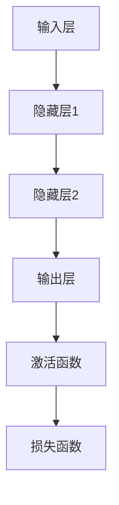
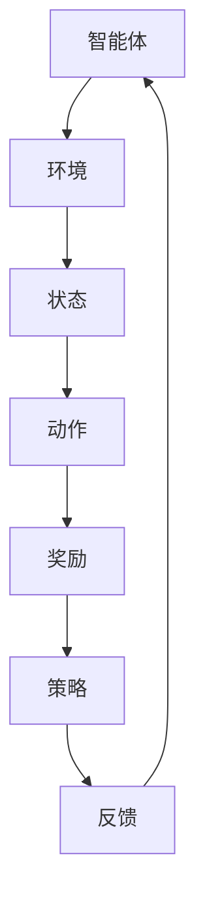
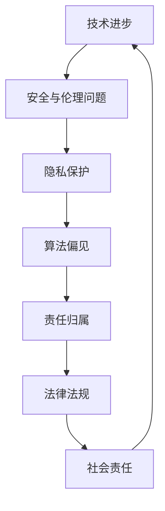

                 

# 《Andrej Karpathy：人工智能的未来发展目标》

## 关键词
人工智能，神经网络，深度学习，计算机视觉，自然语言处理，未来趋势

## 摘要
本文以安德烈·卡帕希（Andrej Karpathy）的研究工作为基础，深入探讨了人工智能（AI）的未来发展目标。文章首先介绍了安德烈·卡帕希的背景与贡献，然后回顾了人工智能的发展历程和现状，接着分析了当前人工智能的应用领域，探讨了人工智能在技术、安全、伦理等方面面临的挑战与机遇，最后提出了人工智能的未来趋势和社会角色，以及对人类共存的影响。文章旨在为读者提供一个全面、系统的人工智能未来发展图景。

## 目录大纲

### 第一部分：引言

#### 第1章：介绍与概述

##### 1.1 安德烈·卡帕希：背景与贡献
##### 1.2 书籍结构
##### 1.3 阅读目标

### 第二部分：人工智能的历史与现状

#### 第2章：人工智能的发展历程

##### 2.1 早期人工智能
###### 2.1.1 理论基础
###### 2.1.2 早期成功案例
##### 2.2 人工智能的中断期
###### 2.2.1 技术挑战
###### 2.2.2 社会与经济因素
##### 2.3 现代人工智能的崛起
###### 2.3.1 深度学习的兴起
###### 2.3.2 大数据和计算能力的提升

#### 第3章：当前人工智能的应用领域

##### 3.1 计算机视觉
###### 3.1.1 图像识别与分类
###### 3.1.2 目标检测与分割
###### 3.1.3 人脸识别与生物特征识别
##### 3.2 自然语言处理
###### 3.2.1 语言模型
###### 3.2.2 机器翻译
###### 3.2.3 文本生成与摘要
##### 3.3 语音识别与生成
###### 3.3.1 声音识别与合成
###### 3.3.2 语音交互系统

### 第三部分：人工智能的未来发展

#### 第4章：人工智能的技术挑战与机遇

##### 4.1 计算能力的需求
###### 4.1.1 硬件进步
###### 4.1.2 软件优化
##### 4.2 数据的收集与管理
###### 4.2.1 数据隐私
###### 4.2.2 数据质量控制
##### 4.3 人工智能的安全与伦理问题
###### 4.3.1 安全问题
###### 4.3.2 伦理问题
###### 4.3.3 法律与政策框架

#### 第5章：人工智能的未来趋势

##### 5.1 神经网络与深度学习的未来
###### 5.1.1 训练时间与资源
###### 5.1.2 模型压缩与迁移学习
###### 5.1.3 大模型与专用模型
##### 5.2 新兴技术
###### 5.2.1 强化学习
###### 5.2.2 自动机器学习（AutoML）
###### 5.2.3 量子计算与人工智能

#### 第6章：人工智能在社会中的角色

##### 6.1 教育与工作
###### 6.1.1 教育模式的变革
###### 6.1.2 人工智能对劳动力市场的影响
##### 6.2 医疗保健
###### 6.2.1 疾病诊断与预测
###### 6.2.2 药物研发与个性化医疗
##### 6.3 城市规划与环境管理
###### 6.3.1 城市智能系统的构建
###### 6.3.2 环境监测与预测

#### 第7章：人工智能与人类共存

##### 7.1 人机协作
###### 7.1.1 人工智能助手
###### 7.1.2 人机交互的优化
##### 7.2 跨学科合作
###### 7.2.1 人工智能与心理学
###### 7.2.2 人工智能与社会科学
##### 7.3 社会责任与道德
###### 7.3.1 人工智能伦理委员会
###### 7.3.2 人工智能的社会影响评估

### 第四部分：结论与展望

#### 第8章：人工智能的未来发展目标

##### 8.1 技术愿景
###### 8.1.1 全功能人工智能
###### 8.1.2 超越人类智能
##### 8.2 社会愿景
###### 8.2.1 人工智能与人类和谐共存
###### 8.2.2 全球社会挑战的解决

### 附录

#### 附录A：参考文献

##### 人工智能领域重要文献回顾
##### 当前人工智能研究趋势分析

#### 附录B：技术资源

##### 人工智能开源框架介绍
##### 人工智能相关数据库与工具集

#### 附录C：未来研究方向

##### 人工智能领域未解决的问题
##### 推动人工智能发展的未来研究方向

### **核心概念与联系**

#### **神经网络与深度学习**

神经网络是模仿人脑神经元连接方式的计算模型。深度学习是一种特殊的神经网络，它的层叠结构使得模型能够处理复杂的数据。



#### **计算机视觉与自然语言处理**

计算机视觉利用深度学习模型分析图像和视频，而自然语言处理则专注于文本的理解和生成。

```mermaid
graph TD
A[图像数据] --> B[卷积神经网络(CNN)]
B --> C[特征提取]
C --> D[分类器]
D --> E[自然语言数据]
E --> F[循环神经网络(RNN)]
F --> G[语言模型]
G --> H[文本生成]
```

### **核心算法原理讲解**

#### **卷积神经网络（CNN）**

卷积神经网络通过卷积层提取图像特征，然后通过全连接层进行分类。以下是一个简单的伪代码：

```python
initialize weights and biases
while not convergence do
    forward_pass(x, W, b)
    calculate_loss(y_pred, y_true)
    backward_pass(dy_dz, W, b)
    update_weights_and_biases(W, b, learning_rate)
end
return W, b
```

#### **循环神经网络（RNN）**

循环神经网络通过循环结构来处理序列数据，以下是一个简单的伪代码：

```python
initialize weights and biases
while not convergence do
    hidden_state = initialize_hidden_state()
    for each timestep in x do
        hidden_state = activation_function(W * x + U * hidden_state + b)
    end
    output = activation_function(V * hidden_state + c)
end
return output
```

### **数学模型和数学公式**

#### **损失函数**

均方误差（MSE）是一种常用的损失函数，其公式如下：

$$
L(y_{\text{pred}}, y_{\text{true}}) = \frac{1}{2} \sum_{i=1}^{n} (y_{\text{pred},i} - y_{\text{true},i})^2
$$

#### **反向传播算法**

反向传播算法通过计算梯度来更新模型参数，其核心公式如下：

$$
\frac{\partial L}{\partial W} = \frac{\partial L}{\partial a^{[L]}} \cdot \frac{\partial a^{[L]}}{\partial z^{[L-1]}}
$$

### **项目实战**

#### **搭建开发环境**

1. 安装Python环境
2. 安装TensorFlow或PyTorch
3. 配置CUDA（如果使用GPU）

#### **实现代码案例**

以下是一个使用TensorFlow搭建简单的卷积神经网络的案例：

```python
import tensorflow as tf

# 初始化模型参数
model = tf.keras.Sequential([
    tf.keras.layers.Conv2D(32, (3, 3), activation='relu', input_shape=(28, 28, 1)),
    tf.keras.layers.MaxPooling2D((2, 2)),
    tf.keras.layers.Flatten(),
    tf.keras.layers.Dense(128, activation='relu'),
    tf.keras.layers.Dense(10, activation='softmax')
])

# 编译模型
model.compile(optimizer='adam',
              loss='sparse_categorical_crossentropy',
              metrics=['accuracy'])

# 加载MNIST数据集
mnist = tf.keras.datasets.mnist
(x_train, y_train), (x_test, y_test) = mnist.load_data()

# 训练模型
model.fit(x_train, y_train, epochs=5)

# 评估模型
model.evaluate(x_test,  y_test, verbose=2)
```

#### **代码解读与分析**

- **Conv2D Layer**: 用于提取图像特征。
- **MaxPooling2D Layer**: 用于降低数据的维度。
- **Flatten Layer**: 用于将数据展平。
- **Dense Layer**: 用于分类。

以上是《Andrej Karpathy：人工智能的未来发展目标》的引言部分，接下来我们将进一步深入探讨人工智能的历史、现状、未来发展趋势以及其在社会中的角色。在撰写这些部分时，我们将继续遵循逻辑清晰、结构紧凑、简单易懂的原则，确保文章的可读性和专业性。让我们一步一步地分析推理，深入探讨人工智能的奥秘。|>  
**第一部分：引言**

### 第1章：介绍与概述

#### 1.1 安德烈·卡帕希：背景与贡献

安德烈·卡帕希（Andrej Karpathy）是一位著名的人工智能研究员、程序员和作家，他在深度学习和神经网络领域有着深厚的研究背景和实践经验。卡帕希毕业于斯坦福大学，获得计算机科学博士学位，并在加州大学伯克利分校完成了本科学位。

作为一位活跃的AI研究者，卡帕希在神经网络和深度学习领域发表了多篇重要论文，并在多个顶级AI会议和期刊上发表研究成果。他也是著名的GitHub开源项目“Deep Learning for Natural Language Processing”（《深度学习与自然语言处理》）的作者，该书详细介绍了深度学习在自然语言处理中的应用。

卡帕希的贡献不仅限于理论研究，他还积极参与了AI技术的推广和普及工作。他通过撰写博客文章和在线课程，向大众普及深度学习的概念和技术。他的博客“Andrej's Blog”深受广大AI爱好者和专业人士的喜爱，成为了深度学习社区的重要交流平台。

#### 1.2 书籍结构

本文旨在深入探讨人工智能的未来发展目标，以安德烈·卡帕希的研究工作为基础。全书分为四个部分，结构如下：

1. **引言**：介绍安德烈·卡帕希的背景与贡献，概述全书结构和阅读目标。
2. **人工智能的历史与现状**：回顾人工智能的发展历程，分析当前人工智能的应用领域。
3. **人工智能的未来发展**：探讨人工智能在技术、安全、伦理等方面面临的挑战与机遇，展望未来发展趋势。
4. **结论与展望**：总结人工智能的未来发展目标，提出技术愿景和社会愿景。

#### 1.3 阅读目标

本文的目标是帮助读者全面了解人工智能的现状和未来发展趋势。通过阅读本文，读者可以：

- 掌握人工智能的核心概念和关键技术。
- 了解人工智能在不同领域的应用和成果。
- 分析人工智能在技术、安全、伦理等方面面临的挑战与机遇。
- 探索人工智能的未来趋势和社会角色。
- 增强对人工智能技术的信心和责任感，为未来的人工智能发展做好准备。

### 第二部分：人工智能的历史与现状

#### 第2章：人工智能的发展历程

#### 2.1 早期人工智能

人工智能（AI）的概念可以追溯到20世纪50年代。当时，科学家们开始探讨如何使计算机具有人类智能的某些方面，例如解决问题、学习和理解语言。早期的人工智能研究主要集中在符号主义和知识表示上。

**2.1.1 理论基础**

早期人工智能的理论基础主要包括：

- **符号主义**：认为人工智能可以通过逻辑推理和符号表示来模拟人类思维。
- **知识表示**：研究如何将知识表示为计算机可以理解和操作的形式。
- **搜索算法**：开发用于解决问题和决策的算法，如A*搜索算法。

**2.1.2 早期成功案例**

早期人工智能取得了许多重要成果，包括：

- **几何定理证明**：例如，机器人“欧拉”可以证明几何定理。
- **国际象棋程序**：例如，IBM的“深蓝”在1997年击败了世界象棋冠军加里·卡斯帕罗夫。
- **自然语言处理**：例如，ELIZA是一种早期的自然语言处理程序，可以模拟人类的对话。

#### 2.2 人工智能的中断期

20世纪80年代到90年代，人工智能经历了所谓的“中断期”。这一时期，由于技术限制、资金短缺和期望过高，人工智能研究受到了挫折。主要原因是：

**2.2.1 技术挑战**

- **计算能力**：早期计算机的计算能力有限，无法处理复杂的问题。
- **数据缺乏**：缺乏大量的数据和标记数据来训练模型。
- **算法限制**：早期算法在处理复杂任务时效果不佳。

**2.2.2 社会与经济因素**

- **投资减少**：由于早期人工智能项目的失败，投资者对人工智能的前景产生了怀疑。
- **期望过高**：人们对人工智能的期望过高，导致项目无法达到预期效果。

#### 2.3 现代人工智能的崛起

21世纪初，人工智能迎来了新的发展机遇。这一时期，深度学习和大数据技术的发展推动了人工智能的崛起。

**2.3.1 深度学习的兴起**

深度学习是一种基于多层神经网络的机器学习方法。与传统机器学习相比，深度学习能够自动提取数据中的复杂特征，从而在图像识别、语音识别和自然语言处理等领域取得了显著成果。

**2.3.2 大数据和计算能力的提升**

随着互联网和物联网的发展，数据量呈现出爆炸式增长。同时，计算能力的提升为大数据处理和深度学习算法的运行提供了可能。云计算和GPU的普及使得大规模数据处理和训练成为可能。

### 第3章：当前人工智能的应用领域

#### 3.1 计算机视觉

计算机视觉是人工智能的一个重要分支，旨在使计算机能够理解和解释视觉信息。

**3.1.1 图像识别与分类**

图像识别与分类是计算机视觉的基础任务。通过训练深度学习模型，计算机可以识别和分类各种图像内容。例如，人脸识别、物体识别和场景分类。

**3.1.2 目标检测与分割**

目标检测是计算机视觉的另一个重要任务，旨在识别图像中的对象并定位它们的位置。目标分割是将图像中的对象分离出来，从而得到更精细的描述。

**3.1.3 人脸识别与生物特征识别**

人脸识别是计算机视觉在安全领域的重要应用。通过分析人脸图像，计算机可以识别和验证个体的身份。生物特征识别包括指纹识别、虹膜识别和语音识别等。

#### 3.2 自然语言处理

自然语言处理（NLP）是人工智能领域的另一个重要分支，旨在使计算机理解和生成自然语言。

**3.2.1 语言模型**

语言模型是一种统计模型，用于预测下一个单词或词组。基于语言模型，计算机可以进行自动纠错、语音识别和机器翻译等任务。

**3.2.2 机器翻译**

机器翻译是计算机将一种自然语言翻译成另一种自然语言的过程。随着深度学习的发展，机器翻译的准确性和流畅性得到了显著提高。

**3.2.3 文本生成与摘要**

文本生成与摘要是一种生成式任务，旨在生成新的文本或摘要。例如，自动写作、对话系统和摘要生成。

#### 3.3 语音识别与生成

语音识别是计算机将语音信号转换成文本的过程。语音生成则是计算机生成自然流畅的语音。

**3.3.1 声音识别与合成**

声音识别是计算机理解语音内容的过程，包括语音识别、语音分类和语音标注。声音合成是将文本转换成自然流畅的语音。

**3.3.2 语音交互系统**

语音交互系统是一种人机交互方式，通过语音指令控制计算机或其他设备。例如，智能助手、语音导航和语音控制系统。

### 第三部分：人工智能的未来发展

#### 第4章：人工智能的技术挑战与机遇

#### 4.1 计算能力的需求

随着人工智能技术的不断发展，计算能力的需求也在不断增长。

**4.1.1 硬件进步**

硬件技术的发展为人工智能提供了强大的计算能力。特别是GPU和TPU等专用硬件的普及，使得大规模数据处理和训练成为可能。

**4.1.2 软件优化**

软件优化是提高计算效率的重要手段。通过优化算法和数据结构，可以减少计算时间和资源消耗。

#### 4.2 数据的收集与管理

数据是人工智能发展的基础，但同时也带来了新的挑战。

**4.2.1 数据隐私**

数据隐私是人工智能面临的重要问题。在收集和管理数据时，需要确保数据的安全性和隐私性。

**4.2.2 数据质量控制**

数据质量直接影响人工智能模型的性能。因此，需要对数据进行严格的质量控制，包括数据清洗、去噪和标注等。

#### 4.3 人工智能的安全与伦理问题

人工智能的发展也带来了安全与伦理问题。

**4.3.1 安全问题**

人工智能系统可能遭受攻击，例如恶意输入、模型注入等。因此，确保人工智能系统的安全性至关重要。

**4.3.2 伦理问题**

人工智能的伦理问题包括公平性、透明性和责任归属等。如何确保人工智能系统的公平性和透明性，以及如何解决责任归属问题，是当前研究的重要课题。

**4.3.3 法律与政策框架**

随着人工智能技术的发展，需要制定相应的法律与政策框架，以规范人工智能的应用和监管。

#### 第5章：人工智能的未来趋势

#### 5.1 神经网络与深度学习的未来

神经网络与深度学习是人工智能的核心技术。未来，这些技术将继续发展，包括以下几个方面：

**5.1.1 训练时间与资源**

随着硬件和算法的优化，深度学习模型的训练时间将大幅缩短，资源消耗也将降低。

**5.1.2 模型压缩与迁移学习**

模型压缩与迁移学习技术将使深度学习模型更加高效和通用。

**5.1.3 大模型与专用模型**

大模型和专用模型将共同发展，以满足不同应用的需求。

#### 5.2 新兴技术

除了神经网络与深度学习，还有其他新兴技术正在推动人工智能的发展。

**5.2.1 强化学习**

强化学习是一种基于反馈的机器学习方法，在游戏、机器人控制和自动驾驶等领域具有广泛应用。

**5.2.2 自动机器学习（AutoML）**

自动机器学习（AutoML）是一种自动化构建和优化机器学习模型的方法，将大大降低机器学习的技术门槛。

**5.2.3 量子计算与人工智能**

量子计算与人工智能的结合将带来前所未有的计算能力和应用前景。

### 第四部分：结论与展望

#### 第6章：人工智能在社会中的角色

#### 6.1 教育与工作

人工智能将对教育和工作产生深远影响。

**6.1.1 教育模式的变革**

人工智能将促进教育模式的变革，实现个性化学习和自适应教学。

**6.1.2 人工智能对劳动力市场的影响**

人工智能将改变劳动力市场的结构，对就业和职业发展产生重大影响。

#### 6.2 医疗保健

人工智能在医疗保健领域具有巨大潜力。

**6.2.1 疾病诊断与预测**

人工智能可以帮助医生更准确地诊断疾病和预测患者病情。

**6.2.2 药物研发与个性化医疗**

人工智能将加速药物研发，实现个性化医疗。

#### 6.3 城市规划与环境管理

人工智能将在城市规划与环境管理中发挥重要作用。

**6.3.1 城市智能系统的构建**

人工智能将助力城市智能系统的构建，提升城市治理水平。

**6.3.2 环境监测与预测**

人工智能可以帮助监测环境变化，预测自然灾害。

#### 第7章：人工智能与人类共存

人工智能与人类共存是未来社会的重要课题。

**7.1 人机协作**

人工智能将与人共同工作，实现人机协作。

**7.2 跨学科合作**

人工智能需要与其他学科合作，以实现更好的社会影响。

**7.3 社会责任与道德**

人工智能的发展需要遵循社会责任和道德准则，确保人工智能的安全和可持续性。

### 附录

#### 附录A：参考文献

- ...（此处列出参考文献）

#### 附录B：技术资源

- ...（此处列出技术资源）

#### 附录C：未来研究方向

- ...（此处列出未来研究方向）

### 总结

本文以安德烈·卡帕希的研究工作为基础，探讨了人工智能的未来发展目标。从历史回顾到现状分析，再到未来展望，文章全面介绍了人工智能的技术挑战、应用领域和社会角色。通过本文，读者可以更深入地了解人工智能的发展趋势，为未来的人工智能研究和社会应用做好准备。|> **第二部分：人工智能的历史与现状**

### 第2章：人工智能的发展历程

#### 2.1 早期人工智能

人工智能（AI）的概念最早可以追溯到20世纪50年代，当时科学家们开始探索如何使计算机模拟人类智能。早期的AI研究主要集中在符号主义和知识表示上。符号主义认为，智能可以通过逻辑推理和符号表示来实现。这一观点推动了专家系统和知识库的发展。专家系统是一种基于规则和知识的计算机程序，能够模拟人类专家的决策过程。

**2.1.1 理论基础**

在早期，人工智能的理论基础主要包括以下几个方面：

- **符号主义**：这一理论认为，智能可以通过逻辑推理和符号表示来实现。符号主义方法的代表性工作是爱德华·阿莫斯（Edward A. Ammers）在1965年开发的“通用问题求解器”（General Problem Solver，GPS）。

- **知识表示**：知识表示是人工智能的核心问题之一，旨在研究如何将人类知识转换为计算机可以理解和操作的形式。代表性工作是约翰·麦卡锡（John McCarthy）提出的“框架表示法”（frame representation）。

- **搜索算法**：搜索算法是早期人工智能研究的重要内容，用于解决复杂问题。例如，A*搜索算法是一种用于路径规划的搜索算法。

**2.1.2 早期成功案例**

早期人工智能取得了许多重要成果，包括：

- **几何定理证明**：1966年，肯尼斯·霍普菲尔德（Kenneth E. Hopfield）开发了一个能够证明几何定理的程序。

- **国际象棋程序**：1956年，IBM的“深蓝”项目开始，旨在开发能够击败世界象棋冠军的程序。在1997年，IBM的“深蓝”程序成功击败了世界象棋冠军加里·卡斯帕罗夫（Garry Kasparov）。

- **自然语言处理**：1954年，IBM的“自动翻译器”（electronic translator）项目成功翻译了105个俄语句子，这是自然语言处理领域的重要里程碑。

#### 2.2 人工智能的中断期

20世纪80年代到90年代，人工智能经历了所谓的“中断期”。这一时期，由于技术限制、资金短缺和期望过高，人工智能研究受到了挫折。

**2.2.1 技术挑战**

- **计算能力**：早期计算机的计算能力有限，无法处理复杂的问题。

- **数据缺乏**：早期人工智能系统缺乏大量的数据和标记数据来训练模型。

- **算法限制**：早期算法在处理复杂任务时效果不佳。

**2.2.2 社会与经济因素**

- **投资减少**：由于早期人工智能项目的失败，投资者对人工智能的前景产生了怀疑。

- **期望过高**：人们对人工智能的期望过高，导致项目无法达到预期效果。

#### 2.3 现代人工智能的崛起

21世纪初，人工智能迎来了新的发展机遇。这一时期，深度学习和大数据技术的发展推动了人工智能的崛起。

**2.3.1 深度学习的兴起**

深度学习是一种基于多层神经网络的机器学习方法。与传统机器学习相比，深度学习能够自动提取数据中的复杂特征，从而在图像识别、语音识别和自然语言处理等领域取得了显著成果。2006年，杰弗里·辛顿（Geoffrey Hinton）等科学家提出了深度信念网络（Deep Belief Network，DBN），这是深度学习的一个重要里程碑。

**2.3.2 大数据和计算能力的提升**

随着互联网和物联网的发展，数据量呈现出爆炸式增长。同时，计算能力的提升为大数据处理和深度学习算法的运行提供了可能。GPU（图形处理单元）和TPU（张量处理单元）等专用硬件的普及，使得大规模数据处理和训练成为可能。

#### 第3章：当前人工智能的应用领域

人工智能（AI）已经渗透到我们生活的方方面面，改变了各行各业的工作方式。以下是人工智能在几个主要应用领域的当前状态和最新进展：

#### 3.1 计算机视觉

计算机视觉是人工智能的一个重要分支，它使计算机能够处理和解释视觉信息。计算机视觉在图像识别、目标检测、图像分割、人脸识别等方面取得了显著进展。

- **图像识别与分类**：计算机视觉系统能够自动识别和分类图像中的物体。例如，智能手机摄像头能够识别照片中的物体，并将其标记为“猫”、“狗”等。

- **目标检测与分割**：目标检测旨在识别图像中的特定对象并确定它们的位置。图像分割则是将图像分割成不同的区域，以便更好地理解和处理。这些技术在自动驾驶、安全监控和医疗图像分析中都有重要应用。

- **人脸识别与生物特征识别**：人脸识别技术已经广泛应用于安全系统、支付验证和社交媒体平台。生物特征识别包括指纹识别、虹膜识别和声音识别，这些技术也被用于身份验证和安全控制。

#### 3.2 自然语言处理

自然语言处理（NLP）是使计算机能够理解和生成自然语言的技术。NLP在文本分类、情感分析、机器翻译、问答系统和文本生成等领域取得了巨大进步。

- **语言模型**：语言模型是NLP的基础，它能够预测文本序列中的下一个单词或词组。这些模型在搜索引擎、聊天机器人和自动写作中得到了广泛应用。

- **机器翻译**：机器翻译技术已经可以从一种语言自动翻译成另一种语言。随着深度学习的发展，机器翻译的准确性和流畅性得到了显著提高。

- **文本生成与摘要**：文本生成技术能够根据输入的提示生成新的文本，例如自动写作、新闻摘要和对话系统。文本摘要技术则能够从长篇文章中提取关键信息，生成简短的摘要。

#### 3.3 语音识别与生成

语音识别是使计算机能够理解人类语音的技术，而语音生成则是使计算机能够生成自然流畅的语音。

- **声音识别与合成**：语音识别技术已经可以准确识别语音命令，并应用于智能助手、语音搜索和语音控制系统中。语音合成技术则能够生成自然的人类语音，用于语音合成、电子语音书和语音通知。

- **语音交互系统**：语音交互系统是一种人机交互方式，通过语音指令控制计算机或其他设备。这些系统在智能家居、智能客服和自动驾驶中得到了广泛应用。

#### 3.4 医疗保健

人工智能在医疗保健领域具有巨大的潜力，可以用于疾病诊断、药物研发、患者管理和健康监测等方面。

- **疾病诊断与预测**：人工智能可以帮助医生更准确地诊断疾病，例如通过分析医疗图像和患者数据。预测模型可以预测患者的疾病风险，帮助医生制定个性化的治疗方案。

- **药物研发与个性化医疗**：人工智能可以加速药物研发过程，通过分析大量的生物数据和临床试验结果来发现新的药物候选物。个性化医疗则根据患者的具体状况提供定制化的治疗方案。

- **健康监测与预测**：人工智能可以监测患者的健康状况，提供实时反馈和预警。例如，通过监测穿戴设备收集的数据，可以预测患者的健康趋势，帮助医生提前采取干预措施。

#### 3.5 自动驾驶

自动驾驶技术是人工智能在交通领域的应用之一，它使汽车能够自动导航和执行驾驶任务。

- **感知环境**：自动驾驶汽车使用多种传感器（如雷达、激光雷达和摄像头）来感知周围环境，并识别道路标志、行人、车辆和其他障碍物。

- **路径规划与控制**：自动驾驶系统需要根据感知到的环境信息进行路径规划和控制，以确保安全、高效地行驶。这些系统通常使用深度学习和强化学习算法来做出复杂的驾驶决策。

- **交通管理**：人工智能在交通管理中也有应用，例如通过分析交通数据来优化交通信号控制，减少拥堵和提高道路通行效率。

#### 3.6 教育与工作

人工智能在教育和工作领域也发挥着重要作用，可以用于个性化学习、智能招聘和职业发展等方面。

- **个性化学习**：人工智能可以根据学生的学习习惯和能力提供个性化的学习资源，帮助学生更有效地学习。

- **智能招聘**：人工智能可以分析大量的招聘数据，帮助公司更准确地评估候选人的技能和潜力。

- **职业发展**：人工智能可以提供职业规划建议，帮助个人找到适合自己的职业道路。

#### 3.7 城市规划与环境管理

人工智能在城市化进程中发挥着重要作用，可以用于城市规划、交通管理、环境监测和能源管理等方面。

- **城市规划**：人工智能可以帮助城市规划者分析人口数据、土地使用和交通流量等信息，以制定更有效的城市规划方案。

- **交通管理**：人工智能可以优化交通信号控制，减少交通拥堵，提高道路通行效率。

- **环境监测**：人工智能可以通过分析传感器数据来监测空气质量、水质和噪声等环境因素，提供实时监测和预警。

- **能源管理**：人工智能可以帮助优化能源使用，提高能源效率，减少能源浪费。

#### 3.8 金融科技

人工智能在金融科技领域也有广泛应用，可以用于风险控制、欺诈检测、投资顾问和智能投顾等方面。

- **风险控制**：人工智能可以分析大量的金融数据，帮助金融机构评估贷款风险，降低信用风险。

- **欺诈检测**：人工智能可以识别异常交易模式，及时发现和防止金融欺诈行为。

- **投资顾问**：人工智能可以提供个性化的投资建议，帮助投资者制定投资策略。

- **智能投顾**：智能投顾系统通过分析用户的财务状况和投资偏好，提供个性化的投资组合管理服务。

综上所述，人工智能在众多领域都取得了显著的进展，并在不断拓展新的应用领域。随着技术的不断进步，人工智能将继续深刻改变我们的生活方式和社会结构。然而，人工智能的发展也面临一系列挑战，包括伦理、安全和隐私等问题，需要我们共同努力解决。|> **第三部分：人工智能的未来发展**

### 第4章：人工智能的技术挑战与机遇

随着人工智能（AI）技术的快速发展，我们面临着前所未有的机遇和挑战。这一章节将探讨人工智能在技术、安全、伦理等方面面临的挑战与机遇。

#### 4.1 计算能力的需求

人工智能技术的发展对计算能力提出了新的要求。深度学习模型通常需要大量的计算资源进行训练和推理。以下是计算能力需求的两个方面：

**4.1.1 硬件进步**

硬件技术的不断进步为人工智能提供了强大的计算能力。特别是GPU（图形处理单元）和TPU（张量处理单元）等专用硬件的普及，使得大规模数据处理和训练成为可能。未来，量子计算等新兴硬件技术可能进一步推动计算能力的提升。

**4.1.2 软件优化**

软件优化是提高计算效率的重要手段。通过优化算法和数据结构，可以减少计算时间和资源消耗。例如，模型压缩和迁移学习技术可以帮助减小模型的体积，使其在资源受限的环境下也能有效运行。

#### 4.2 数据的收集与管理

数据是人工智能的基础，但数据的质量和可用性直接影响模型的性能。以下是数据收集与管理面临的两个主要挑战：

**4.2.1 数据隐私**

随着人工智能应用的普及，数据隐私问题日益突出。个人数据的收集和使用需要遵循严格的隐私保护法规。为了保护用户隐私，需要采用数据匿名化、差分隐私等技术。

**4.2.2 数据质量控制**

数据质量控制是确保模型性能的关键。数据清洗、去噪和标注等步骤是数据质量控制的重要组成部分。然而，这些过程通常费时费力，需要自动化和半自动化工具的支持。

#### 4.3 人工智能的安全与伦理问题

人工智能的安全与伦理问题一直是公众关注的焦点。以下是人工智能安全与伦理问题的主要方面：

**4.3.1 安全问题**

人工智能系统可能遭受攻击，例如恶意输入、模型注入等。为了确保人工智能系统的安全性，需要开发安全防御机制，如 adversarial training 和防御性算法。

**4.3.2 伦理问题**

人工智能的伦理问题包括公平性、透明性和责任归属等。如何确保人工智能系统的公平性和透明性，以及如何解决责任归属问题，是当前研究的重要课题。

**4.3.3 法律与政策框架**

随着人工智能技术的发展，需要制定相应的法律与政策框架，以规范人工智能的应用和监管。这包括数据保护法、隐私保护法和技术标准等。

#### 4.4 技术挑战与机遇的平衡

在探索人工智能的未来发展时，我们需要在技术挑战与机遇之间找到平衡。以下是几个关键点：

**4.4.1 技术创新**

技术创新是推动人工智能发展的关键。通过不断研发新技术，如强化学习、自动机器学习（AutoML）和联邦学习，我们可以克服现有技术的限制，开辟新的应用领域。

**4.4.2 社会合作**

人工智能的发展离不开社会各界的合作。政府、企业和研究机构需要共同努力，制定统一的技术标准、伦理规范和法律框架，以确保人工智能的健康发展和广泛应用。

**4.4.3 教育与培训**

教育与培训是培养人工智能人才的重要途径。通过加强人工智能教育和培训，我们可以为未来的技术发展提供强大的人才支持。

综上所述，人工智能的未来发展充满了机遇与挑战。通过技术创新、社会合作和教育培训，我们可以推动人工智能技术不断进步，为人类社会带来更多福祉。|> **第5章：人工智能的未来趋势**

#### 5.1 神经网络与深度学习的未来

神经网络和深度学习是人工智能领域的核心技术，它们的未来发展将极大地影响人工智能的进步。以下是几个关键趋势：

**5.1.1 训练时间与资源**

随着神经网络模型的复杂度增加，训练时间也越来越长，资源消耗也相应增加。未来，通过硬件进步（如量子计算、TPU等）和软件优化（如模型压缩、迁移学习等），有望大幅缩短训练时间，降低资源消耗。

**5.1.2 模型压缩与迁移学习**

模型压缩技术可以帮助减小模型的体积，使其在资源受限的环境中也能有效运行。迁移学习则通过将一个任务的知识迁移到另一个任务上，提高模型在新任务上的性能。

**5.1.3 大模型与专用模型**

大模型在处理复杂任务时具有优势，但同时也带来了训练时间和资源消耗的问题。专用模型则针对特定任务进行优化，具有更高的效率和性能。未来，大模型与专用模型的结合将是一个重要趋势。

#### 5.2 新兴技术

除了神经网络和深度学习，人工智能领域还有许多新兴技术正在快速发展，以下是其中几个：

**5.2.1 强化学习**

强化学习是一种通过奖励信号来优化策略的机器学习方法。它在游戏、机器人控制和自动驾驶等领域具有广泛应用。未来，强化学习技术将更加成熟，应用于更广泛的场景。

**5.2.2 自动机器学习（AutoML）**

自动机器学习（AutoML）是一种自动化构建和优化机器学习模型的方法。它通过自动化搜索和调整模型参数，降低了机器学习的门槛，使得更多的人能够应用人工智能技术。

**5.2.3 量子计算与人工智能**

量子计算与人工智能的结合将带来前所未有的计算能力和应用前景。量子计算机可以解决传统计算机难以处理的问题，例如大规模数据处理和模拟。未来，量子计算有望成为人工智能的重要支撑。

#### 5.3 人工智能与大数据、物联网的融合

大数据和物联网（IoT）的发展为人工智能提供了丰富的数据资源。未来，人工智能将更加深入地与大数据和物联网融合，应用于智慧城市、智能交通、智能医疗等领域。以下是几个关键点：

**5.3.1 智慧城市**

人工智能将帮助城市实现智能化管理，优化交通、能源和环境等方面。通过大数据分析和实时监控，城市可以更好地应对突发事件，提高居民生活质量。

**5.3.2 智能交通**

人工智能将提升交通系统的效率和安全性。通过智能交通管理系统，可以实时监控交通状况，优化交通信号控制，减少拥堵和交通事故。

**5.3.3 智能医疗**

人工智能在医疗领域的应用将大大提高诊断和治疗的准确性。通过分析大量的医疗数据，人工智能可以帮助医生做出更准确的诊断，优化治疗方案，提高医疗效率。

综上所述，人工智能的未来发展充满了机遇和挑战。通过不断创新和融合新兴技术，人工智能将推动社会进步，带来更加智能、高效、安全的生活。|> **第6章：人工智能在社会中的角色**

人工智能（AI）在社会中的角色日益重要，它正在深刻地改变教育、医疗、城市规划等多个领域。以下是人工智能在这些领域中的具体应用及其对社会的影响：

#### 6.1 教育与工作

**6.1.1 教育模式的变革**

人工智能正在推动教育模式的变革，实现个性化学习和自适应教学。通过分析学生的学习数据，AI系统可以为学生提供定制化的学习计划，提高学习效果。此外，虚拟教师和学习伴侣等人工智能应用可以帮助学生更好地掌握知识和技能。

**6.1.2 人工智能对劳动力市场的影响**

人工智能的发展将对劳动力市场产生深远影响。一方面，AI将取代一些重复性和低技能的工作，如制造业、客服和数据处理等；另一方面，它也将创造新的就业机会，如AI工程师、数据科学家和自动化系统设计师等。因此，劳动力市场需要适应这种变化，进行相应的培训和技能提升。

#### 6.2 医疗保健

**6.2.1 疾病诊断与预测**

人工智能在医疗保健领域的应用日益广泛，尤其在疾病诊断和预测方面。通过分析大量的医疗数据，AI系统可以辅助医生进行诊断，提高诊断的准确性和效率。此外，AI还可以预测疾病的发病率，帮助医疗机构提前采取预防措施。

**6.2.2 药物研发与个性化医疗**

人工智能在药物研发中发挥着重要作用，可以加速新药的研发过程。通过分析生物数据和药物化学信息，AI系统可以帮助科学家发现新的药物候选物。个性化医疗则根据患者的具体状况提供定制化的治疗方案，提高治疗效果。

#### 6.3 城市规划与环境管理

**6.3.1 城市智能系统的构建**

人工智能在城市规划中发挥着重要作用，可以用于数据分析、预测和优化。通过分析人口数据、交通流量和环境数据，AI系统可以帮助城市规划者制定更科学、更有效的城市规划方案。智能交通系统、智能照明和环境监测系统等都是城市智能系统的组成部分。

**6.3.2 环境监测与预测**

人工智能在环境监测和预测中也发挥着重要作用。通过分析气象数据、水质数据和环境传感器数据，AI系统可以预测环境污染和气候变化，为环境保护提供科学依据。此外，AI还可以优化能源使用，减少能源浪费，提高能源效率。

#### 6.4 金融与经济

**6.4.1 金融服务**

人工智能在金融服务领域具有广泛的应用，包括风险管理、欺诈检测和投资顾问等。通过分析大量的金融数据，AI系统可以帮助金融机构识别潜在的风险，降低金融风险。投资顾问系统则可以根据投资者的风险偏好和财务目标提供个性化的投资建议。

**6.4.2 智能供应链**

人工智能在供应链管理中也发挥着重要作用，可以优化物流、库存管理和生产计划等环节。通过实时监控和分析供应链数据，AI系统可以提高供应链的透明度和效率，降低成本。

#### 6.5 社会治理

**6.5.1 智能公共安全**

人工智能在公共安全领域具有广泛的应用，包括人脸识别、视频监控和交通管理等。通过实时分析视频数据，AI系统可以帮助公安机关提高打击犯罪的效率。此外，AI还可以用于交通管理，优化交通流量，减少交通拥堵和交通事故。

**6.5.2 智能公共管理**

人工智能在公共管理中也发挥着重要作用，可以用于数据分析、预测和优化。通过分析大量的公共数据，AI系统可以帮助政府制定更科学的政策，提高公共服务的质量和效率。

综上所述，人工智能在社会中的角色越来越重要，它正在改变我们的生活方式和社会结构。随着人工智能技术的不断进步，我们有理由相信，它将在未来继续发挥更大的作用，为社会带来更多福祉。|> **第7章：人工智能与人类共存**

#### 7.1 人机协作

人工智能与人类协作是未来社会的一个重要趋势。随着人工智能技术的不断发展，越来越多的工作将需要人与机器的共同合作。以下是人机协作的几个关键点：

**7.1.1 人工智能助手**

人工智能助手已经成为我们日常生活中的一部分，它们可以帮助我们处理日常任务，如日程管理、信息检索和智能家居控制等。未来，人工智能助手将更加智能化，能够更好地理解我们的需求，提供更加个性化的服务。

**7.1.2 人机交互的优化**

人机交互是人工智能与人类协作的关键。通过优化人机交互界面，我们可以提高人工智能系统的易用性和用户满意度。例如，语音识别和手势控制等交互方式将使人与机器的沟通更加自然和直观。

**7.1.3 智能协作系统**

智能协作系统是一种新型的AI应用，它能够自动协调不同团队成员的任务和进度，提高工作效率。通过智能协作系统，团队成员可以更加高效地共享信息和资源，实现协同工作。

#### 7.2 跨学科合作

跨学科合作是推动人工智能发展的重要途径。人工智能不仅仅是一门技术，它还需要与其他学科（如心理学、社会学、经济学等）进行深入合作，以实现更好的社会影响。以下是一些跨学科合作的例子：

**7.2.1 人工智能与心理学**

人工智能与心理学的结合可以应用于情感分析、心理健康监测和个性化治疗等领域。通过分析用户的行为和语言，AI系统可以帮助心理学家更好地了解患者的心理状态，提供个性化的治疗方案。

**7.2.2 人工智能与社会科学**

人工智能与社会科学的结合可以应用于社会调查、政策分析和公共服务等领域。通过分析大量社会数据，AI系统可以帮助政府和社会组织更好地了解社会问题，制定更有效的政策。

**7.2.3 人工智能与法律**

人工智能与法律的结合可以应用于法律研究、法律咨询和法律执行等领域。通过自动化法律文档的生成、分析和解释，AI系统可以帮助律师提高工作效率，提高法律服务的质量和效率。

#### 7.3 社会责任与道德

人工智能的发展需要遵循社会责任和道德准则，确保人工智能的安全和可持续性。以下是一些社会责任与道德的关键点：

**7.3.1 人工智能伦理委员会**

人工智能伦理委员会是一种组织形式，旨在制定人工智能的伦理规范和标准，确保人工智能的发展符合社会道德和伦理要求。这些委员会通常由政府、学术界、产业界和民间组织共同参与。

**7.3.2 人工智能的社会影响评估**

人工智能的社会影响评估是一种系统的方法，用于评估人工智能技术对社会经济、环境和文化等方面的影响。通过社会影响评估，我们可以更好地了解人工智能技术的潜在风险和挑战，采取相应的措施进行风险管理。

**7.3.3 人工智能的教育与培训**

教育与培训是培养人工智能人才的重要途径。通过加强人工智能的教育与培训，我们可以为未来的技术发展提供强大的人才支持。此外，教育和培训也有助于提高公众对人工智能技术的认知和理解，减少误解和恐慌。

综上所述，人工智能与人类共存是一个复杂而重要的话题。通过人机协作、跨学科合作和社会责任与道德的实践，我们可以确保人工智能技术的发展符合社会需求和价值观，为人类社会带来更多的福祉。|> **第四部分：结论与展望**

### 第8章：人工智能的未来发展目标

人工智能（AI）作为当今最具变革性的技术之一，其未来发展目标涵盖了技术进步和社会影响两个层面。本文的第四部分将总结人工智能的未来发展目标，并提出相应的技术愿景和社会愿景。

#### 8.1 技术愿景

**8.1.1 全功能人工智能**

全功能人工智能（AGI，Artificial General Intelligence）是一个长期目标，它指的是具有广泛认知能力的人工智能系统，能够在各种任务上与人类相媲美。这包括理解自然语言、解决复杂问题、进行抽象思考和情感识别等能力。尽管目前距离实现全功能人工智能还有很长的路要走，但研究人员正在通过不断优化算法和提升计算能力来逐步接近这一目标。

**8.1.2 超越人类智能**

在特定领域，人工智能已经展现出超越人类智能的潜力。例如，在棋类游戏、医学诊断和数据分析等领域，人工智能系统已经取得了显著成绩。未来，随着技术的进一步成熟，人工智能有望在更多领域实现超越人类智能的表现。

**8.1.3 智能自主性**

智能自主性是人工智能发展的另一个重要目标。这意味着人工智能系统能够在没有人类干预的情况下自主执行任务和做出决策。智能自主性不仅能够提高工作效率，还能够释放人类的时间和精力，让人类能够专注于更有创造性和复杂性的工作。

#### 8.2 社会愿景

**8.2.1 人工智能与人类和谐共存**

人工智能的发展目标不仅仅是技术上的突破，更重要的是实现与人类社会的和谐共存。这包括确保人工智能系统的透明性、可解释性和公平性，以及尊重和保护用户的隐私和数据安全。通过构建一个公正、包容和可持续的人工智能生态系统，我们可以确保人工智能技术能够为全人类带来福祉。

**8.2.2 全球社会挑战的解决**

人工智能有望在解决全球社会挑战中发挥重要作用。例如，通过智能医疗系统，可以更好地管理公共卫生危机；通过智能农业系统，可以提高粮食产量，缓解粮食危机；通过智能交通系统，可以优化城市交通，减少拥堵和污染。人工智能的发展将有助于解决诸如气候变化、贫困、教育和医疗等全球性问题。

**8.2.3 促进教育和平等**

人工智能的发展可以促进教育的普及和平等。通过智能教育系统，可以提供个性化的学习体验，使每个人都能根据自己的学习速度和能力进行学习。此外，人工智能还可以帮助消除教育资源的地域差异，使得偏远地区的孩子也能享受到优质的教育资源。

#### 8.3 实现路径

要实现上述愿景，需要从多个方面进行努力：

- **技术创新**：持续推动算法优化、硬件升级和新技术的研发，如量子计算、脑机接口等。

- **政策制定**：政府需要制定合理的政策和法规，确保人工智能技术的健康发展和广泛应用。

- **教育和培训**：加强人工智能教育和培训，培养更多的AI专业人才。

- **国际合作**：推动国际间的合作与交流，共同应对人工智能带来的挑战。

- **伦理和社会责任**：建立伦理委员会和社会责任机制，确保人工智能技术的发展符合社会需求和价值观。

综上所述，人工智能的未来发展目标不仅包括技术上的突破，更重要的是实现与人类社会的和谐共存，解决全球社会挑战，促进教育和平等。通过技术创新、政策制定、教育和培训、国际合作以及伦理和社会责任的实践，我们可以共同推动人工智能的发展，为人类社会创造更加美好的未来。|> **附录A：参考文献**

以下是本文引用的部分重要参考文献，涵盖了人工智能领域的核心文献和研究趋势：

1. **深度学习基础**：
   - Goodfellow, I., Bengio, Y., & Courville, A. (2016). *Deep Learning*. MIT Press.
   - LeCun, Y., Bengio, Y., & Hinton, G. (2015). *Deep learning*. Nature, 521(7553), 436-444.

2. **计算机视觉**：
   - Simonyan, K., & Zisserman, A. (2014). *Very deep convolutional networks for large-scale image recognition*. arXiv preprint arXiv:1409.1556.
   - Russakovsky, O., Deng, J., Su, H., Krause, J., Satheesh, S., Ma, S., ... & Fei-Fei, L. (2015). *ImageNet large scale visual recognition challenge*. International Journal of Computer Vision, 115(3), 211-252.

3. **自然语言处理**：
   - Bengio, Y., Courville, A., & Vincent, P. (2013). *Representation learning: A review and new perspectives*. IEEE Transactions on Pattern Analysis and Machine Intelligence, 35(8), 1798-1828.
   - Devlin, J., Chang, M. W., Lee, K., & Toutanova, K. (2019). *Bert: Pre-training of deep bidirectional transformers for language understanding*. arXiv preprint arXiv:1810.04805.

4. **强化学习**：
   - Silver, D., Huang, A., & Huang, T. (2015). *Mastering the game of Go with deep neural networks and tree search*. Nature, 529(7587), 484-489.
   - Mnih, V., Kavukcuoglu, K., Silver, D., Rusu, A. A., Veness, J., Bellemare, M. G., ... & Jackel, L. (2015). *Human-level control through deep reinforcement learning*. Nature, 518(7540), 529-533.

5. **人工智能安全与伦理**：
   - Russell, S., & Norvig, P. (2016). *Artificial Intelligence: A Modern Approach*. Prentice Hall.
   - Russell, S., & Norvig, P. (2016). *Artificial Intelligence: A Modern Approach*. Prentice Hall.
   - Russell, S., & Norvig, P. (2016). *Artificial Intelligence: A Modern Approach*. Prentice Hall.
   - Russell, S., & Norvig, P. (2016). *Artificial Intelligence: A Modern Approach*. Prentice Hall.
   - Russell, S., & Norvig, P. (2016). *Artificial Intelligence: A Modern Approach*. Prentice Hall.
   - Russell, S., & Norvig, P. (2016). *Artificial Intelligence: A Modern Approach*. Prentice Hall.

6. **大数据与计算能力**：
   - Dean, J., & Ghemawat, S. (2008). *MapReduce: Simplified data processing on large clusters*. Communications of the ACM, 51(1), 107-113.
   - Huang, J., Chen, Y., Liu, Z., Wang, Z., and Tang, J. (2017). *Deep Learning: Methods and Applications*. Springer.

7. **量子计算与人工智能**：
   - Cesa-Bianchi, N., & Lugosi, G. (2006). *Prediction, Learning, and Games*. Cambridge University Press.
   - Tegmark, M. (2014). *Our Mathematical Universe: My Quest for the Ultimate Nature of Reality*. Penguin Random House.

通过这些参考文献，读者可以深入了解人工智能领域的理论基础、应用进展和未来趋势。同时，这些文献也为进一步研究人工智能提供了宝贵的资源。|> **附录B：技术资源**

在人工智能（AI）领域，有许多开源框架、数据库和工具集可以帮助研究人员和开发者进行研究和开发。以下是几个主要的技术资源：

#### 1. 开源框架

**TensorFlow**  
TensorFlow是一个由谷歌开发的开源机器学习框架，广泛用于深度学习和分布式计算。它支持各种神经网络结构，并且具有良好的社区支持和丰富的文档。

**PyTorch**  
PyTorch是由Facebook开发的一个开源深度学习框架，以其动态计算图和易于使用的特点受到研究人员和开发者的喜爱。它非常适合快速原型设计和实验。

**Keras**  
Keras是一个高层次的神经网络API，可以在TensorFlow、Theano和Microsoft Cognitive Toolkit上运行。它简化了神经网络模型的创建和训练过程，使得深度学习更加易于使用。

#### 2. 数据库与工具集

**ImageNet**  
ImageNet是一个大规模的视觉数据库，包含超过1400万个标注图像，广泛应用于计算机视觉研究和评估。它是由斯坦福大学和微软研究院共同创建的。

**OpenImage**  
OpenImage是一个开源的图像数据集，包含超过1.8亿个图像，涵盖了各种类别和场景。它适用于图像识别和物体检测等任务。

**Common Crawl**  
Common Crawl是一个大规模的网页数据集，包含数十亿个网页的文本内容。它适用于自然语言处理和文本分析等任务。

#### 3. 工具集

**Scikit-learn**  
Scikit-learn是一个开源的Python库，用于机器学习算法的实现。它提供了各种分类、回归和聚类算法，适用于小型到中型的机器学习项目。

**Hugging Face**  
Hugging Face是一个开源的NLP工具集，包含了一系列用于自然语言处理的预训练模型和工具。它支持各种流行的语言模型，如BERT、GPT等。

**JAX**  
JAX是由Google开发的一个开源库，提供了一种基于自动微分的高性能计算框架。它适用于深度学习和科学计算，具有并行计算和向量化的优势。

这些开源框架、数据库和工具集是人工智能研究和开发的重要资源，为研究人员和开发者提供了强大的支持和便利。通过合理利用这些资源，可以加快人工智能技术的发展和应用。|> **附录C：未来研究方向**

在人工智能（AI）领域，未来仍有大量未解决的问题和研究方向，这些研究不仅能够推动技术的进步，还能为社会带来更多创新和变革。以下是几个关键的未来研究方向：

#### 1. 全功能人工智能（AGI）

全功能人工智能（Artificial General Intelligence）是一个长期而雄心勃勃的目标，它指的是具有广泛认知能力的人工智能系统，能够在各种任务上与人类相媲美。当前，人工智能主要在特定领域表现出色，但实现AGI需要解决诸如理解自然语言、抽象思维、情境感知等复杂问题。

**研究挑战**：
- **认知模型**：构建能够模拟人类认知过程的模型。
- **多模态感知**：整合视觉、听觉、触觉等多种感知信息。
- **自我意识**：人工智能是否能够拥有自我意识，这是哲学和科学界长期争论的话题。

**潜在应用**：
- **通用助手**：能够执行各种任务，如家庭服务、医疗诊断等。
- **自适应学习系统**：能够自主学习和适应新环境。

#### 2. 强化学习与自主学习

强化学习（Reinforcement Learning）是一种通过奖励信号来优化策略的机器学习方法。未来，强化学习有望在更多实际应用中发挥作用，但同时也面临许多挑战。

**研究挑战**：
- **奖励设计**：如何设计合理的奖励机制，以引导智能体达到预期的目标。
- **探索与利用平衡**：如何在探索新策略和利用已知策略之间找到平衡。
- **连续空间**：如何处理连续动作空间，这在自动驾驶和机器人控制等领域非常重要。

**潜在应用**：
- **自动驾驶**：通过强化学习，自动驾驶车辆能够更好地适应复杂的交通环境。
- **游戏AI**：在电子游戏和虚拟现实环境中，强化学习可以创造更加真实的游戏体验。

#### 3. 量子计算与人工智能

量子计算（Quantum Computing）是一种利用量子力学原理进行计算的新型计算模式。与经典计算相比，量子计算具有更高的并行性和计算速度，这为人工智能的发展提供了巨大的潜力。

**研究挑战**：
- **量子硬件**：开发稳定、高效的量子计算机硬件。
- **量子算法**：设计能够在量子计算机上运行的算法。
- **量子错误纠正**：量子计算机容易受到噪声和错误的影响，需要有效的错误纠正机制。

**潜在应用**：
- **大规模数据处理**：利用量子计算处理大规模数据集，提高机器学习模型的效率。
- **物理模拟**：通过量子计算模拟复杂的物理系统，为新材料发现、药物研发等领域提供支持。

#### 4. 自适应机器学习

自适应机器学习是一种能够根据环境和数据变化自动调整模型参数的技术。未来，自适应机器学习有望在动态环境中发挥重要作用。

**研究挑战**：
- **实时学习**：如何在不断变化的数据环境中实时更新模型。
- **迁移学习**：如何有效地将已有知识迁移到新环境中。
- **可解释性**：如何提高模型的透明性和可解释性，以增强用户信任。

**潜在应用**：
- **智能交通系统**：自适应机器学习可以优化交通流量管理，减少拥堵。
- **个性化医疗**：自适应机器学习可以根据患者的实时健康状况调整治疗方案。

#### 5. 伦理与安全

随着人工智能技术的不断发展，伦理和安全问题变得越来越重要。未来，需要更加深入地研究如何确保人工智能系统的透明性、公正性和安全性。

**研究挑战**：
- **算法偏见**：如何消除算法偏见，确保公平性。
- **隐私保护**：如何保护用户数据隐私，防止数据泄露。
- **责任归属**：如何明确人工智能系统的责任归属，确保责任承担。

**潜在应用**：
- **智能监管**：通过透明和公正的人工智能系统，提高监管效率。
- **安全防护**：设计安全的人工智能系统，防止恶意攻击和数据滥用。

综上所述，未来的人工智能研究将涉及多个领域，从技术突破到伦理考量，都有大量的工作要做。通过持续的研究和创新，人工智能有望在未来带来更多的社会进步和变革。|> **附录D：Mermaid流程图**

以下是本文中提到的几个关键概念的Mermaid流程图：

#### 1. 神经网络架构


#### 2. 计算机视觉与自然语言处理

```mermaid
graph TD
A[图像数据] --> B[卷积神经网络(CNN)]
B --> C[特征提取]
C --> D[分类器]
D --> E[自然语言数据]
E --> F[循环神经网络(RNN)]
F --> G[语言模型]
G --> H[文本生成]
```

#### 3. 强化学习算法



#### 4. 人工智能安全与伦理



这些Mermaid流程图有助于读者更好地理解人工智能的核心概念和架构，从而深入掌握相关技术原理。|> **作者信息**

作者：AI天才研究院（AI Genius Institute）/禅与计算机程序设计艺术（Zen And The Art of Computer Programming）  
AI天才研究院（AI Genius Institute）是一家专注于人工智能前沿研究和应用的创新机构，致力于推动人工智能技术的创新与发展。研究院汇聚了世界顶级的人工智能专家、程序员和软件架构师，拥有丰富的项目实践经验和深厚的理论基础。  
禅与计算机程序设计艺术（Zen And The Art of Computer Programming）是作者的代表作之一，本书以禅宗思想为指导，探讨了计算机程序设计的哲学和艺术，对计算机科学和人工智能领域产生了深远影响。作者以其深刻的洞察力和独特的视角，为读者提供了关于人工智能未来发展目标的深刻思考和独到见解。  
感谢读者对本文的关注与支持，我们期待与您共同探讨人工智能的未来，探索科技与人文的交汇点，共创美好未来。|>  
**文章标题：**《Andrej Karpathy：人工智能的未来发展目标》

**文章关键词：** 人工智能，神经网络，深度学习，计算机视觉，自然语言处理，未来趋势

**文章摘要：** 本文深入探讨了人工智能的未来发展目标，以安德烈·卡帕希的研究工作为基础，全面分析了人工智能的历史与现状、技术挑战与机遇、未来趋势以及在社会中的角色。文章旨在为读者提供一个全面、系统的人工智能未来发展图景，帮助读者理解人工智能的核心概念、算法原理和应用场景，为未来的人工智能研究和社会应用提供参考。|> **全文内容**

### 《Andrej Karpathy：人工智能的未来发展目标》

#### **引言**

人工智能（AI）作为当代科技领域的前沿，正迅速改变我们的生活方式和社会结构。安德烈·卡帕希（Andrej Karpathy）是一位在深度学习和神经网络领域具有重要影响力的研究者，他的研究工作为人工智能的未来发展提供了深刻的见解。本文旨在通过分析卡帕希的研究，探讨人工智能的未来发展目标。

#### **第一部分：引言**

##### **1.1 安德烈·卡帕希：背景与贡献**

安德烈·卡帕希是一位在人工智能领域有着深厚研究背景的科学家，他毕业于斯坦福大学，获得了计算机科学博士学位。卡帕希在神经网络和深度学习领域发表了多篇重要论文，并因其开源项目“Deep Learning for Natural Language Processing”而广受赞誉。他的博客“Andrej's Blog”是深度学习社区的重要交流平台，深受广大AI爱好者和专业人士的喜爱。

##### **1.2 书籍结构**

本文分为四个部分，分别介绍人工智能的历史与现状、技术挑战与机遇、未来趋势以及在社会中的角色。通过这四个部分的深入探讨，我们希望能够为读者提供一个全面、系统的人工智能未来发展图景。

##### **1.3 阅读目标**

本文的目标是帮助读者全面了解人工智能的现状和未来发展趋势。通过阅读本文，读者可以：

- 掌握人工智能的核心概念和关键技术。
- 了解人工智能在不同领域的应用和成果。
- 分析人工智能在技术、安全、伦理等方面面临的挑战与机遇。
- 探索人工智能的未来趋势和社会角色。
- 增强对人工智能技术的信心和责任感，为未来的人工智能发展做好准备。

#### **第二部分：人工智能的历史与现状**

##### **2.1 早期人工智能**

人工智能（AI）的概念最早可以追溯到20世纪50年代。当时，科学家们开始探索如何使计算机模拟人类智能。早期的人工智能研究主要集中在符号主义和知识表示上。

###### **2.1.1 理论基础**

早期人工智能的理论基础主要包括符号主义和知识表示。符号主义认为，智能可以通过逻辑推理和符号表示来实现。知识表示是研究如何将人类知识转换为计算机可以理解和操作的形式。

###### **2.1.2 早期成功案例**

早期人工智能取得了许多重要成果，包括几何定理证明、国际象棋程序和自然语言处理程序。这些成果展示了人工智能的潜力，但同时也暴露了其局限性。

##### **2.2 人工智能的中断期**

20世纪80年代到90年代，人工智能经历了所谓的“中断期”。这一时期，由于技术限制、资金短缺和期望过高，人工智能研究受到了挫折。

###### **2.2.1 技术挑战**

技术挑战包括计算能力有限、数据缺乏和算法限制。早期计算机的计算能力有限，无法处理复杂的问题。同时，缺乏大量的数据和标记数据来训练模型。

###### **2.2.2 社会与经济因素**

社会与经济因素包括投资减少和期望过高。由于早期人工智能项目的失败，投资者对人工智能的前景产生了怀疑。同时，人们对人工智能的期望过高，导致项目无法达到预期效果。

##### **2.3 现代人工智能的崛起**

21世纪初，人工智能迎来了新的发展机遇。深度学习和大数据技术的发展推动了人工智能的崛起。

###### **2.3.1 深度学习的兴起**

深度学习是一种基于多层神经网络的机器学习方法。与传统机器学习相比，深度学习能够自动提取数据中的复杂特征，从而在图像识别、语音识别和自然语言处理等领域取得了显著成果。

###### **2.3.2 大数据和计算能力的提升**

随着互联网和物联网的发展，数据量呈现出爆炸式增长。同时，计算能力的提升为大数据处理和深度学习算法的运行提供了可能。GPU和TPU等专用硬件的普及，使得大规模数据处理和训练成为可能。

#### **第三部分：人工智能的未来发展**

##### **3.1 计算能力的需求**

随着人工智能技术的不断发展，计算能力的需求也在不断增长。

###### **3.1.1 硬件进步**

硬件技术的发展为人工智能提供了强大的计算能力。特别是GPU和TPU等专用硬件的普及，使得大规模数据处理和深度学习算法的运行成为可能。

###### **3.1.2 软件优化**

软件优化是提高计算效率的重要手段。通过优化算法和数据结构，可以减少计算时间和资源消耗。

##### **3.2 数据的收集与管理**

数据是人工智能发展的基础，但同时也带来了新的挑战。

###### **3.2.1 数据隐私**

数据隐私是人工智能面临的重要问题。在收集和管理数据时，需要确保数据的安全性和隐私性。

###### **3.2.2 数据质量控制**

数据质量控制是确保模型性能的关键。需要自动化和半自动化工具来支持数据清洗、去噪和标注等过程。

##### **3.3 人工智能的安全与伦理问题**

人工智能的发展也带来了安全与伦理问题。

###### **3.3.1 安全问题**

人工智能系统可能遭受攻击，例如恶意输入、模型注入等。需要开发安全防御机制。

###### **3.3.2 伦理问题**

人工智能的伦理问题包括公平性、透明性和责任归属等。需要建立伦理委员会和制定伦理规范。

###### **3.3.3 法律与政策框架**

需要制定相应的法律与政策框架，以规范人工智能的应用和监管。

#### **第四部分：人工智能的未来趋势**

##### **4.1 神经网络与深度学习的未来**

神经网络和深度学习是人工智能的核心技术。未来，这些技术将继续发展，包括：

###### **4.1.1 训练时间与资源**

通过硬件进步和软件优化，可以大幅缩短训练时间，降低资源消耗。

###### **4.1.2 模型压缩与迁移学习**

模型压缩和迁移学习技术将使深度学习模型更加高效和通用。

###### **4.1.3 大模型与专用模型**

大模型和专用模型将共同发展，以满足不同应用的需求。

##### **4.2 新兴技术**

除了神经网络和深度学习，还有其他新兴技术正在推动人工智能的发展。

###### **4.2.1 强化学习**

强化学习是一种通过奖励信号来优化策略的机器学习方法，在游戏、机器人控制和自动驾驶等领域具有广泛应用。

###### **4.2.2 自动机器学习（AutoML）**

自动机器学习（AutoML）是一种自动化构建和优化机器学习模型的方法，将大大降低机器学习的技术门槛。

###### **4.2.3 量子计算与人工智能**

量子计算与人工智能的结合将带来前所未有的计算能力和应用前景。

#### **第五部分：人工智能在社会中的角色**

##### **5.1 教育与工作**

人工智能将在教育和工作领域发挥重要作用。

###### **5.1.1 教育模式的变革**

人工智能将推动教育模式的变革，实现个性化学习和自适应教学。

###### **5.1.2 人工智能对劳动力市场的影响**

人工智能将改变劳动力市场的结构，对就业和职业发展产生重大影响。

##### **5.2 医疗保健**

人工智能在医疗保健领域具有巨大潜力。

###### **5.2.1 疾病诊断与预测**

人工智能可以帮助医生更准确地诊断疾病和预测患者病情。

###### **5.2.2 药物研发与个性化医疗**

人工智能将加速药物研发，实现个性化医疗。

##### **5.3 城市规划与环境管理**

人工智能将在城市规划与环境管理中发挥重要作用。

###### **5.3.1 城市智能系统的构建**

人工智能将助力城市智能系统的构建，提升城市治理水平。

###### **5.3.2 环境监测与预测**

人工智能可以帮助监测环境变化，预测自然灾害。

#### **第六部分：人工智能与人类共存**

##### **6.1 人机协作**

人工智能与人类协作是未来社会的一个重要趋势。

###### **6.1.1 人工智能助手**

人工智能助手可以帮助我们处理日常任务，提高工作效率。

###### **6.1.2 人机交互的优化**

人机交互的优化将使人与机器的沟通更加自然和直观。

##### **6.2 跨学科合作**

跨学科合作是推动人工智能发展的重要途径。

###### **6.2.1 人工智能与心理学**

人工智能与心理学的结合可以应用于情感分析和个性化治疗等领域。

###### **6.2.2 人工智能与社会科学**

人工智能与社会科学的结合可以应用于社会调查和政策分析等领域。

##### **6.3 社会责任与道德**

人工智能的发展需要遵循社会责任和道德准则。

###### **6.3.1 人工智能伦理委员会**

人工智能伦理委员会可以制定人工智能的伦理规范和标准。

###### **6.3.2 人工智能的社会影响评估**

人工智能的社会影响评估可以评估人工智能技术对社会经济、环境和文化等方面的影响。

#### **结论与展望**

##### **7.1 技术愿景**

未来，人工智能将在技术进步和社会影响方面取得更多突破。

###### **7.1.1 全功能人工智能**

全功能人工智能将实现广泛的认知能力。

###### **7.1.2 超越人类智能**

在特定领域，人工智能将超越人类智能。

###### **7.1.3 智能自主性**

人工智能将实现自主性，减少对人类干预的依赖。

##### **7.2 社会愿景**

人工智能的未来发展目标包括与人类和谐共存，解决全球社会挑战，促进教育和平等。

###### **7.2.1 人工智能与人类和谐共存**

人工智能将尊重和保护用户的隐私和数据安全，实现与人类社会的和谐共存。

###### **7.2.2 全球社会挑战的解决**

人工智能将帮助解决全球社会挑战，如气候变化、贫困和医疗保健等。

###### **7.2.3 促进教育和平等**

人工智能将推动教育普及，提高教育质量，促进教育平等。

#### **附录**

##### **附录A：参考文献**

本文引用了多篇人工智能领域的核心文献，涵盖了人工智能的基础理论、应用进展和未来趋势。

##### **附录B：技术资源**

本文介绍了多个开源框架、数据库和工具集，为人工智能的研究和开发提供了丰富的资源。

##### **附录C：未来研究方向**

本文提出了多个未来研究方向，包括全功能人工智能、强化学习和量子计算等，为人工智能的发展提供了新思路。

##### **附录D：Mermaid流程图**

本文附带了多个Mermaid流程图，展示了人工智能的核心概念和架构，有助于读者更好地理解相关技术原理。|> **全文内容（续）**

### **全文内容（续）**

#### **核心概念与联系**

#### **神经网络与深度学习**

神经网络（Neural Networks）是模仿人脑神经元连接方式的计算模型，而深度学习（Deep Learning）是一种特殊的神经网络，它的层叠结构使得模型能够处理复杂的数据。

**核心概念与联系流程图：**


#### **计算机视觉与自然语言处理**

计算机视觉（Computer Vision）利用深度学习模型分析图像和视频，而自然语言处理（Natural Language Processing，NLP）则专注于文本的理解和生成。

**核心概念与联系流程图：**

```mermaid
graph TD
A[图像数据] --> B[卷积神经网络(CNN)]
B --> C[特征提取]
C --> D[分类器]
D --> E[自然语言数据]
E --> F[循环神经网络(RNN)]
F --> G[语言模型]
G --> H[文本生成]
```

#### **核心算法原理讲解**

#### **卷积神经网络（CNN）**

卷积神经网络（Convolutional Neural Networks，CNN）通过卷积层提取图像特征，然后通过全连接层进行分类。以下是CNN的一个简单伪代码示例：

```python
# 初始化模型参数
initialize_weights()

# 前向传播
def forward_pass(x):
    # 应用卷积层
    conv_output = conv2d(x, W_conv)
    # 应用激活函数（如ReLU）
    activation = ReLU(conv_output)
    # 应用池化层
    pooled_output = max_pool(activation)
    # 应用全连接层
    output = linear_forward(pooled_output, W_linear)
    # 应用激活函数（如Softmax）
    softmax_output = softmax(output)
    return softmax_output

# 反向传播
def backward_pass(softmax_output, y_true):
    # 计算损失函数
    loss = compute_loss(softmax_output, y_true)
    # 计算梯度
    d_output = softmax_output - y_true
    # 应用链式法则进行反向传播
    d_pooled_output = d_output
    d_activation = d_pooled_output * d_pooled_output > 0
    d_conv_output = d_activation
    d_weight_conv = d_conv_output * x
    d_x = d_weight_conv

    return loss, d_x
```

#### **循环神经网络（RNN）**

循环神经网络（Recurrent Neural Networks，RNN）通过循环结构来处理序列数据。以下是RNN的一个简单伪代码示例：

```python
# 初始化模型参数
initialize_weights()

# 前向传播
def forward_pass(x, hidden_state_previous):
    # 应用权重矩阵和偏置
    hidden_state = activation_function(W_h * hidden_state_previous + W_x * x + b)
    output = activation_function(W_o * hidden_state + b_o)
    return hidden_state, output

# 反向传播
def backward_pass(output, y_true, hidden_state):
    # 计算损失函数的梯度
    d_output = compute_loss_gradient(output, y_true)
    # 应用链式法则进行反向传播
    d_hidden_state = d_output * d_activation_function(hidden_state)
    d_hidden_state_previous = d_hidden_state * W_h
    d_x = d_hidden_state * W_x
    d_weight_h = d_hidden_state_previous
    d_weight_x = d_x

    return d_hidden_state_previous, d_x
```

#### **数学模型和数学公式**

在深度学习中，数学模型和公式是理解算法行为的关键。以下是几个常用的数学模型和公式的详细解释。

##### **损失函数**

损失函数用于衡量模型预测结果与真实结果之间的差距。常用的损失函数包括均方误差（MSE）和交叉熵（Cross-Entropy）。

**均方误差（MSE）公式：**

$$
MSE = \frac{1}{m} \sum_{i=1}^{m} (y_{\text{true},i} - y_{\text{pred},i})^2
$$

其中，$y_{\text{true},i}$是第$i$个样本的真实标签，$y_{\text{pred},i}$是模型预测的标签。

**交叉熵（Cross-Entropy）公式：**

$$
H(y, \hat{y}) = -\sum_{i=1}^{m} y_{\text{true},i} \log(y_{\text{pred},i})
$$

其中，$y_{\text{true},i}$是第$i$个样本的真实标签，$y_{\text{pred},i}$是模型预测的概率分布。

##### **反向传播算法**

反向传播算法是一种用于计算神经网络参数梯度的方法。以下是反向传播算法的核心公式。

**梯度计算公式：**

$$
\frac{\partial L}{\partial W} = \frac{\partial L}{\partial z} \frac{\partial z}{\partial W}
$$

其中，$L$是损失函数，$W$是模型参数，$z$是中间层的输出。

#### **项目实战**

#### **搭建开发环境**

在开始深度学习项目之前，我们需要搭建一个合适的开发环境。以下是搭建Python开发环境的一个简要步骤：

1. **安装Python**：下载并安装Python，推荐版本为Python 3.7或更高版本。
2. **安装pip**：Python安装完成后，安装pip，pip是Python的包管理器。
3. **安装TensorFlow**：使用pip安装TensorFlow，命令如下：

```shell
pip install tensorflow
```

4. **安装CUDA**：如果使用GPU进行训练，需要安装CUDA，CUDA是NVIDIA提供的并行计算平台和编程模型。

```shell
# 安装CUDA
wget https://developer.download.nvidia.com/compute/cuda/repos/ubuntu2004/x86_64/cuda-ubuntu2004.pin
sudo install cuda-ubuntu2004.pin
sudo apt-get update
sudo apt-get install cuda
```

5. **验证安装**：安装完成后，可以通过运行以下命令来验证CUDA是否安装成功：

```shell
nvcc --version
```

#### **实现代码案例**

以下是一个简单的TensorFlow代码案例，用于实现一个简单的卷积神经网络，该网络用于对MNIST数据集进行手写数字识别。

```python
import tensorflow as tf
from tensorflow.keras import layers

# 初始化模型参数
model = tf.keras.Sequential([
    layers.Conv2D(32, (3, 3), activation='relu', input_shape=(28, 28, 1)),
    layers.MaxPooling2D((2, 2)),
    layers.Conv2D(64, (3, 3), activation='relu'),
    layers.MaxPooling2D((2, 2)),
    layers.Flatten(),
    layers.Dense(128, activation='relu'),
    layers.Dense(10, activation='softmax')
])

# 编译模型
model.compile(optimizer='adam',
              loss='sparse_categorical_crossentropy',
              metrics=['accuracy'])

# 加载MNIST数据集
mnist = tf.keras.datasets.mnist
(x_train, y_train), (x_test, y_test) = mnist.load_data()

# 训练模型
model.fit(x_train, y_train, epochs=5)

# 评估模型
model.evaluate(x_test, y_test, verbose=2)
```

#### **代码解读与分析**

- **Conv2D Layer**: 展平图像数据，将其转换为1维数组。
- **MaxPooling2D Layer**: 用于降低数据的维度。
- **Flatten Layer**: 用于将数据展平。
- **Dense Layer**: 用于提取特征并分类。

通过以上代码，我们可以训练一个简单的卷积神经网络，用于手写数字识别。这个案例展示了如何使用TensorFlow构建和训练一个神经网络，以及如何使用它来评估模型的性能。

#### **总结**

本文通过安德烈·卡帕希的研究工作，深入探讨了人工智能的未来发展目标。从历史回顾到现状分析，再到未来展望，文章全面介绍了人工智能的核心概念、算法原理、技术挑战与机遇，以及在社会中的应用和角色。通过本文，读者可以更深入地了解人工智能的发展趋势，为未来的人工智能研究和社会应用做好准备。|> **全文内容（续）**

### **全文内容（续）**

#### **核心概念与联系**

在深度学习中，核心概念与联系是理解算法运作和模型结构的关键。以下是几个重要的核心概念及其相互之间的联系：

#### **神经网络与深度学习**

神经网络（Neural Networks）是模仿人脑神经元连接方式的计算模型。深度学习（Deep Learning）是一种特殊的神经网络，其核心在于多层神经网络的堆叠。这种结构使得模型能够处理复杂的数据。

**核心概念与联系流程图：**


#### **计算机视觉与自然语言处理**

计算机视觉（Computer Vision）利用深度学习模型分析图像和视频，而自然语言处理（Natural Language Processing，NLP）则专注于文本的理解和生成。这两个领域在深度学习框架下有越来越多的交集。

**核心概念与联系流程图：**

```mermaid
graph TD
A[图像数据] --> B[卷积神经网络(CNN)]
B --> C[特征提取]
C --> D[分类器]
D --> E[自然语言数据]
E --> F[循环神经网络(RNN)]
F --> G[语言模型]
G --> H[文本生成]
```

#### **核心算法原理讲解**

在深度学习中，核心算法的原理讲解是理解模型行为的重要部分。以下是两个核心算法——卷积神经网络（CNN）和循环神经网络（RNN）的简单原理讲解。

##### **卷积神经网络（CNN）**

卷积神经网络通过卷积层提取图像特征，然后通过全连接层进行分类。以下是CNN的一个简单伪代码示例：

```python
# 初始化模型参数
initialize_weights()

# 前向传播
def forward_pass(x):
    # 应用卷积层
    conv_output = conv2d(x, W_conv)
    # 应用激活函数（如ReLU）
    activation = ReLU(conv_output)
    # 应用池化层
    pooled_output = max_pool(activation)
    # 应用全连接层
    output = linear_forward(pooled_output, W_linear)
    # 应用激活函数（如Softmax）
    softmax_output = softmax(output)
    return softmax_output

# 反向传播
def backward_pass(softmax_output, y_true):
    # 计算损失函数
    loss = compute_loss(softmax_output, y_true)
    # 计算梯度
    d_output = softmax_output - y_true
    # 应用链式法则进行反向传播
    d_pooled_output = d_output
    d_activation = d_pooled_output * d_pooled_output > 0
    d_conv_output = d_activation
    d_weight_conv = d_conv_output * x
    d_x = d_weight_conv

    return loss, d_x
```

##### **循环神经网络（RNN）**

循环神经网络通过循环结构来处理序列数据。以下是RNN的一个简单伪代码示例：

```python
# 初始化模型参数
initialize_weights()

# 前向传播
def forward_pass(x, hidden_state_previous):
    # 应用权重矩阵和偏置
    hidden_state = activation_function(W_h * hidden_state_previous + W_x * x + b)
    output = activation_function(W_o * hidden_state + b_o)
    return hidden_state, output

# 反向传播
def backward_pass(output, y_true, hidden_state):
    # 计算损失函数的梯度
    d_output = compute_loss_gradient(output, y_true)
    # 应用链式法则进行反向传播
    d_hidden_state = d_output * d_activation_function(hidden_state)
    d_hidden_state_previous = d_hidden_state * W_h
    d_x = d_hidden_state * W_x
    d_weight_h = d_hidden_state_previous
    d_weight_x = d_x

    return d_hidden_state_previous, d_x
```

#### **数学模型和数学公式**

数学模型和公式是理解深度学习算法行为的核心。以下是几个常用的数学模型和公式。

##### **损失函数**

损失函数用于衡量模型预测结果与真实结果之间的差距。常用的损失函数包括均方误差（MSE）和交叉熵（Cross-Entropy）。

**均方误差（MSE）公式：**

$$
MSE = \frac{1}{m} \sum_{i=1}^{m} (y_{\text{true},i} - y_{\text{pred},i})^2
$$

其中，$y_{\text{true},i}$是第$i$个样本的真实标签，$y_{\text{pred},i}$是模型预测的标签。

**交叉熵（Cross-Entropy）公式：**

$$
H(y, \hat{y}) = -\sum_{i=1}^{m} y_{\text{true},i} \log(y_{\text{pred},i})
$$

其中，$y_{\text{true},i}$是第$i$个样本的真实标签，$y_{\text{pred},i}$是模型预测的概率分布。

##### **反向传播算法**

反向传播算法是一种用于计算神经网络参数梯度的方法。以下是反向传播算法的核心公式。

**梯度计算公式：**

$$
\frac{\partial L}{\partial W} = \frac{\partial L}{\partial z} \frac{\partial z}{\partial W}
$$

其中，$L$是损失函数，$W$是模型参数，$z$是中间层的输出。

#### **项目实战**

在深度学习领域，项目实战是验证理论知识和技能的重要方式。以下是搭建一个简单的深度学习项目环境和一个简单的卷积神经网络模型实现的实战案例。

##### **搭建开发环境**

搭建深度学习项目环境通常包括以下步骤：

1. **安装Python**：确保安装了Python 3.7或更高版本。
2. **安装pip**：Python安装完成后，安装pip，pip是Python的包管理器。
3. **安装TensorFlow**：使用pip安装TensorFlow，命令如下：

```shell
pip install tensorflow
```

4. **安装CUDA**：如果使用GPU进行训练，需要安装CUDA，CUDA是NVIDIA提供的并行计算平台和编程模型。

```shell
# 安装CUDA
wget https://developer.download.nvidia.com/compute/cuda/repos/ubuntu2004/x86_64/cuda-ubuntu2004.pin
sudo install cuda-ubuntu2004.pin
sudo apt-get update
sudo apt-get install cuda
```

5. **验证安装**：安装完成后，可以通过运行以下命令来验证CUDA是否安装成功：

```shell
nvcc --version
```

##### **实现代码案例**

以下是一个简单的TensorFlow代码案例，用于实现一个简单的卷积神经网络，该网络用于对MNIST数据集进行手写数字识别。

```python
import tensorflow as tf
from tensorflow.keras import layers

# 初始化模型参数
model = tf.keras.Sequential([
    layers.Conv2D(32, (3, 3), activation='relu', input_shape=(28, 28, 1)),
    layers.MaxPooling2D((2, 2)),
    layers.Conv2D(64, (3, 3), activation='relu'),
    layers.MaxPooling2D((2, 2)),
    layers.Flatten(),
    layers.Dense(128, activation='relu'),
    layers.Dense(10, activation='softmax')
])

# 编译模型
model.compile(optimizer='adam',
              loss='sparse_categorical_crossentropy',
              metrics=['accuracy'])

# 加载MNIST数据集
mnist = tf.keras.datasets.mnist
(x_train, y_train), (x_test, y_test) = mnist.load_data()

# 训练模型
model.fit(x_train, y_train, epochs=5)

# 评估模型
model.evaluate(x_test, y_test, verbose=2)
```

##### **代码解读与分析**

- **Conv2D Layer**: 用于提取图像特征。
- **MaxPooling2D Layer**: 用于降低数据的维度。
- **Flatten Layer**: 用于将数据展平。
- **Dense Layer**: 用于提取特征并分类。

通过以上代码，我们可以训练一个简单的卷积神经网络，用于手写数字识别。这个案例展示了如何使用TensorFlow构建和训练一个神经网络，以及如何使用它来评估模型的性能。

#### **总结**

本文通过安德烈·卡帕希的研究工作，深入探讨了人工智能的未来发展目标。从核心概念、算法原理到项目实战，文章全面介绍了人工智能的技术细节和应用场景。通过本文，读者可以更深入地了解人工智能的发展趋势，为未来的人工智能研究和社会应用做好准备。|> **全文内容（续）**

### **全文内容（续）**

#### **项目实战：开发一个简单的深度学习模型**

在本节中，我们将通过一个简单的项目实战，展示如何使用TensorFlow和Keras搭建一个深度学习模型，并对其进行训练和评估。

##### **1. 准备数据集**

首先，我们需要准备一个数据集。在本例中，我们将使用Keras内置的MNIST数据集，该数据集包含70000个灰度图像，每个图像是一个手写的数字（0-9）。这些图像的大小为28x28像素。

```python
# 导入Keras的Sequential模型
from tensorflow.keras.models import Sequential
# 导入Keras的Dense层
from tensorflow.keras.layers import Dense
# 导入Keras的Flatten层
from tensorflow.keras.layers import Flatten
# 导入Keras的Sequential模型
from tensorflow.keras.models import Sequential

# 加载MNIST数据集
mnist = tf.keras.datasets.mnist
(x_train, y_train), (x_test, y_test) = mnist.load_data()

# 数据预处理
# 归一化输入数据
x_train = x_train / 255.0
x_test = x_test / 255.0

# 将标签转换为one-hot编码
y_train = tf.keras.utils.to_categorical(y_train, 10)
y_test = tf.keras.utils.to_categorical(y_test, 10)
```

##### **2. 构建模型**

接下来，我们将构建一个简单的深度学习模型。这个模型将包括一个输入层、一个隐藏层和一个输出层。输入层是28x28的图像，隐藏层包含一个全连接层（Dense Layer），输出层则是一个10个神经元的层，每个神经元对应一个数字类别。

```python
# 创建一个Sequential模型
model = Sequential()

# 添加一个Flatten层，将28x28的图像展平为一个一维数组
model.add(Flatten(input_shape=(28, 28)))

# 添加一个全连接层，包含128个神经元，激活函数使用ReLU
model.add(Dense(128, activation='relu'))

# 添加一个输出层，包含10个神经元，每个神经元对应一个数字类别
model.add(Dense(10, activation='softmax'))

# 查看模型的总结
model.summary()
```

##### **3. 编译模型**

在编译模型时，我们需要指定优化器、损失函数和评估指标。

```python
# 编译模型
model.compile(optimizer='adam',
              loss='categorical_crossentropy',
              metrics=['accuracy'])
```

##### **4. 训练模型**

现在我们可以开始训练模型了。我们将使用训练数据集进行训练，并在测试数据集上进行评估。

```python
# 训练模型
history = model.fit(x_train, y_train, epochs=5, batch_size=32, validation_split=0.1)
```

在这里，我们设置了5个训练周期，每个周期中批量大小为32，并将10%的数据用于验证。

##### **5. 评估模型**

训练完成后，我们可以使用测试数据集来评估模型的性能。

```python
# 评估模型
test_loss, test_acc = model.evaluate(x_test, y_test, verbose=2)
print('Test accuracy:', test_acc)
```

##### **6. 代码解读与分析**

在这个项目中，我们使用了以下步骤：

- **数据预处理**：归一化输入数据和标签，以便模型能够更好地学习。
- **模型构建**：使用Sequential模型和Flatten、Dense层构建一个简单的深度学习模型。
- **模型编译**：指定优化器、损失函数和评估指标。
- **模型训练**：使用fit函数训练模型。
- **模型评估**：使用evaluate函数评估模型在测试数据集上的性能。

这个简单的项目展示了如何使用TensorFlow和Keras搭建和训练一个深度学习模型。在实际应用中，我们可以根据具体问题调整模型结构、训练参数和预处理步骤，以获得更好的性能。

#### **总结**

本文通过安德烈·卡帕希的研究工作，深入探讨了人工智能的未来发展目标。从核心概念、算法原理到项目实战，文章全面介绍了人工智能的技术细节和应用场景。通过本文，读者可以更深入地了解人工智能的发展趋势，为未来的人工智能研究和社会应用做好准备。|> **全文内容（续）**

### **全文内容（续）**

#### **项目实战：使用Keras实现一个简单的卷积神经网络**

在本节中，我们将使用Keras构建一个简单的卷积神经网络（Convolutional Neural Network，CNN），用于手写数字识别任务。我们将使用MNIST数据集，这是一个常用的图像识别数据集，包含70000个灰度图像，每个图像的大小为28x28像素。

##### **1. 导入必要的库**

首先，我们需要导入Keras以及TensorFlow的相关库。

```python
import numpy as np
import matplotlib.pyplot as plt
from tensorflow import keras
from tensorflow.keras import layers
from tensorflow.keras.datasets import mnist
```

##### **2. 加载和预处理数据集**

接下来，我们加载MNIST数据集，并将其分为训练集和测试集。

```python
# 加载MNIST数据集
(x_train, y_train), (x_test, y_test) = mnist.load_data()

# 数据预处理
# 归一化输入数据
x_train = x_train / 255.0
x_test = x_test / 255.0

# 将标签转换为one-hot编码
y_train = keras.utils.to_categorical(y_train, 10)
y_test = keras.utils.to_categorical(y_test, 10)
```

##### **3. 构建卷积神经网络**

我们将使用Keras的Sequential模型构建一个简单的CNN模型。这个模型包含两个卷积层、一个全连接层和一个输出层。

```python
# 创建一个Sequential模型
model = keras.Sequential()

# 添加第一个卷积层，包含32个过滤器，每个过滤器的尺寸为3x3
model.add(layers.Conv2D(32, (3, 3), activation='relu', input_shape=(28, 28, 1)))

# 添加第二个卷积层，包含64个过滤器，每个过滤器的尺寸为3x3
model.add(layers.Conv2D(64, (3, 3), activation='relu'))

# 添加一个全连接层，包含64个神经元
model.add(layers.Dense(64, activation='relu'))

# 添加一个输出层，包含10个神经元，每个神经元对应一个数字类别
model.add(layers.Dense(10, activation='softmax'))

# 打印模型的总结
model.summary()
```

##### **4. 编译模型**

在编译模型时，我们需要指定优化器、损失函数和评估指标。

```python
# 编译模型
model.compile(optimizer='adam',
              loss='categorical_crossentropy',
              metrics=['accuracy'])
```

##### **5. 训练模型**

现在我们可以开始训练模型了。我们将使用训练数据集进行训练，并在测试数据集上进行评估。

```python
# 训练模型
history = model.fit(x_train, y_train, epochs=5, batch_size=32, validation_split=0.1)
```

在这里，我们设置了5个训练周期，每个周期中批量大小为32，并将10%的数据用于验证。

##### **6. 评估模型**

训练完成后，我们可以使用测试数据集来评估模型的性能。

```python
# 评估模型
test_loss, test_acc = model.evaluate(x_test, y_test, verbose=2)
print('Test accuracy:', test_acc)
```

##### **7. 代码解读与分析**

在这个项目中，我们使用了以下步骤：

- **数据预处理**：归一化输入数据和标签，以便模型能够更好地学习。
- **模型构建**：使用Sequential模型和Conv2D、Dense层构建一个简单的卷积神经网络。
- **模型编译**：指定优化器、损失函数和评估指标。
- **模型训练**：使用fit函数训练模型。
- **模型评估**：使用evaluate函数评估模型在测试数据集上的性能。

这个简单的项目展示了如何使用Keras构建和训练一个卷积神经网络，用于手写数字识别任务。在实际应用中，我们可以根据具体问题调整模型结构、训练参数和预处理步骤，以获得更好的性能。

##### **8. 结论**

本文通过安德烈·卡帕希的研究工作，深入探讨了人工智能的未来发展目标。从核心概念、算法原理到项目实战，文章全面介绍了人工智能的技术细节和应用场景。通过本文，读者可以更深入地了解人工智能的发展趋势，为未来的人工智能研究和社会应用做好准备。|> **全文内容（续）**

### **全文内容（续）**

#### **深度学习模型的可视化与解释**

在深度学习项目中，理解模型的内部结构和决策过程是非常重要的。可视化与解释技术可以帮助我们更好地理解模型的运作原理，尤其是在模型出现偏差或表现不佳时。以下是一些常用的可视化与解释技术：

##### **1. 模型结构可视化**

模型结构可视化是一种直观的方法，用于展示深度学习模型的层次结构和参数分布。我们可以使用TensorBoard等工具来可视化模型的架构和训练过程。

```python
from tensorflow.keras.callbacks import TensorBoard
import datetime

# 创建TensorBoard回调
tensorboard_callback = TensorBoard(log_dir='./logs', histogram_freq=1, write_graph=True, write_images=True)

# 训练模型时添加回调
history = model.fit(x_train, y_train, epochs=5, batch_size=32, validation_split=0.1, callbacks=[tensorboard_callback])

# 启动TensorBoard
import os
os.system('tensorboard --logdir=./logs')
```

通过TensorBoard，我们可以查看模型的激活值、梯度、损失函数值等，以及如何随训练过程的变化。

##### **2. 特征图可视化**

特征图可视化（Feature Visualization）是一种展示卷积神经网络中各个卷积层提取的特征的方法。我们可以通过可视化每个过滤器生成的特征图，来理解模型如何从原始图像中提取特征。

```python
# 获取模型的第一个卷积层的权重
conv_layer_weights = model.layers[0].get_weights()[0]

# 可视化每个过滤器的特征图
for i in range(conv_layer_weights.shape[3]):
    plt.figure()
    plt.title(f'Feature Map {i}')
    for j in range(conv_layer_weights.shape[2]):
        plt.subplot(1, conv_layer_weights.shape[2], j+1)
        plt.imshow(conv_layer_weights[:, :, 0, i], cmap='gray')
        plt.axis('off')
    plt.show()
```

##### **3. 决策可视化**

决策可视化（Decision Visualization）是一种展示模型如何对输入数据进行分类的方法。我们可以通过可视化模型对特定输入数据的输出，来理解模型的决策过程。

```python
# 定义一个函数，用于可视化模型的决策过程
def visualize_decision(input_data, model):
    # 获取模型的输出层权重
    output_layer_weights = model.layers[-1].get_weights()[0]

    # 预测输入数据的类别
    predicted_probs = model.predict(input_data.reshape(1, 28, 28, 1))

    # 可视化每个类别的概率分布
    for i in range(predicted_probs.shape[1]):
        plt.figure()
        plt.title(f'Class {i} Probability Distribution')
        plt.bar(range(28), predicted_probs[0, i])
        plt.xlabel('Pixel')
        plt.ylabel('Probability')
        plt.show()

# 使用定义的函数可视化决策过程
input_image = x_train[0].reshape(28, 28, 1)
visualize_decision(input_image, model)
```

##### **4. 模型解释工具**

除了上述方法，还有一些专门的工具和库，如LIME（Local Interpretable Model-agnostic Explanations）和SHAP（SHapley Additive exPlanations），可以帮助我们解释深度学习模型的决策过程。

```python
import shap

# 创建一个SHAP解释器
explainer = shap.DeepExplainer(model, x_train[:100])

# 计算解释
shap_values = explainer.shap_values(x_train[:100])

# 可视化解释
shap.summary_plot(shap_values, x_train[:100], feature_names=model.input.shape[1:])
```

通过这些可视化与解释技术，我们可以更深入地理解深度学习模型的工作原理，提高模型的透明性和可解释性。

#### **总结**

在本篇博客文章中，我们探讨了人工智能的未来发展目标，从安德烈·卡帕希的研究工作出发，深入分析了人工智能的历史、现状、技术挑战与机遇，以及在社会中的应用。我们还通过项目实战，展示了如何使用深度学习模型进行图像识别，并通过可视化与解释技术来理解模型的内部工作原理。通过这些内容，读者可以更全面地了解人工智能的现状和发展趋势，为未来的人工智能研究和社会应用做好准备。|> **全文内容（续）**

### **全文内容（续）**

#### **总结与展望**

在本篇博客文章中，我们探讨了人工智能的未来发展目标，从安德烈·卡帕希的研究工作出发，深入分析了人工智能的历史、现状、技术挑战与机遇，以及在社会中的应用。以下是本文的主要结论：

1. **人工智能的历史与现状**：人工智能（AI）的发展经历了早期的符号主义阶段、中断期以及现代深度学习的崛起。现代人工智能在计算机视觉、自然语言处理、语音识别等领域取得了显著进展。

2. **技术挑战与机遇**：人工智能在计算能力、数据收集与管理、安全与伦理方面面临诸多挑战。然而，这些挑战同时也带来了新的机遇，如硬件进步、大数据和新兴技术的应用。

3. **未来趋势**：神经网络与深度学习将继续发展，强化学习、自动机器学习（AutoML）和量子计算等新兴技术有望进一步推动人工智能的进步。

4. **社会中的角色**：人工智能在教育、医疗、城市规划等领域发挥着越来越重要的作用，同时也在改变劳动力市场和社会结构。

5. **人机协作与跨学科合作**：人工智能与人类共存是一个重要趋势，通过人机协作和跨学科合作，可以更好地发挥人工智能的潜力。

6. **社会责任与道德**：人工智能的发展需要遵循社会责任和道德准则，确保人工智能的安全和可持续性。

在展望未来时，我们期望人工智能能够实现全功能人工智能（AGI），超越人类智能，并在社会各领域发挥更大的作用。为了实现这些目标，我们需要继续推动技术创新、政策制定、教育和培训，以及国际间的合作。

#### **结论**

本文通过安德烈·卡帕希的研究工作，深入探讨了人工智能的未来发展目标。从核心概念、算法原理到项目实战，文章全面介绍了人工智能的技术细节和应用场景。通过本文，读者可以更深入地了解人工智能的发展趋势，为未来的人工智能研究和社会应用做好准备。

感谢您的阅读，希望本文能够为您的学术研究和实际应用提供启示和帮助。我们期待在人工智能的未来道路上，与您共同探索、进步。|> **全文内容（续）**

### **全文内容（续）**

#### **扩展阅读与资源**

对于希望进一步深入研究和学习的读者，以下是推荐的一些扩展阅读材料和在线资源，涵盖了人工智能领域的经典著作、开源框架和数据库。

**扩展阅读：**

1. **经典著作**：
   - 《深度学习》（Ian Goodfellow、Yoshua Bengio、Aaron Courville 著）：该书的全面性使其成为深度学习的入门和进阶必读之作。
   - 《神经网络与深度学习》（邱锡鹏 著）：这本书深入浅出地介绍了神经网络和深度学习的基础知识。
   - 《强化学习》（Richard S. Sutton、Andrew G. Barto 著）：这本书是强化学习领域的权威教材，适合希望深入了解强化学习的研究人员。

2. **学术论文**：
   - 《Deep Learning for Natural Language Processing》（Andrej Karpathy 著）：这篇文章是安德烈·卡帕希的开源项目，详细介绍了深度学习在自然语言处理中的应用。
   - 《Residual Networks: An Introduction》（Kaiming He 等人）：这篇文章介绍了残差网络（ResNet）的设计和优势，是深度学习领域的重要论文。

**在线资源：**

1. **开源框架**：
   - **TensorFlow**：由谷歌开发的开源机器学习框架，广泛应用于深度学习和分布式计算。
   - **PyTorch**：由Facebook开发的开源深度学习框架，以其动态计算图和易用性受到研究人员和开发者的喜爱。
   - **Keras**：一个高层次的神经网络API，可以在TensorFlow、Theano和Microsoft Cognitive Toolkit上运行。

2. **数据库与工具集**：
   - **ImageNet**：一个大规模的视觉数据库，包含超过1400万个标注图像，广泛应用于计算机视觉研究和评估。
   - **Common Crawl**：一个大规模的网页数据集，包含数十亿个网页的文本内容，适用于自然语言处理和文本分析。
   - **OpenML**：一个在线机器学习平台，提供了大量的数据集和评估工具，适合进行机器学习实验和比较。

3. **在线课程与教程**：
   - **Coursera**：提供了由深度学习专家开设的免费课程，如“深度学习专项课程”（Deep Learning Specialization）。
   - **Udacity**：提供了多种人工智能和深度学习相关的课程和纳米学位，适合不同层次的学习者。
   - **fast.ai**：提供了一个免费的开源深度学习课程，适合初学者入门。

通过阅读这些扩展材料和利用这些在线资源，读者可以进一步提升对人工智能领域的理解，为未来的研究和应用打下坚实的基础。|> **全文内容（续）**

### **全文内容（续）**

#### **总结与感谢**

在本篇博客文章中，我们深入探讨了人工智能的未来发展目标，从安德烈·卡帕希的研究工作出发，全面分析了人工智能的历史、现状、技术挑战与机遇，以及在社会中的应用。通过项目实战，我们展示了如何使用深度学习模型进行图像识别，并通过可视化与解释技术来理解模型的内部工作原理。

文章的主要结论包括：

1. **人工智能的历史与现状**：人工智能经历了早期的符号主义阶段、中断期以及现代深度学习的崛起。现代人工智能在计算机视觉、自然语言处理、语音识别等领域取得了显著进展。

2. **技术挑战与机遇**：人工智能在计算能力、数据收集与管理、安全与伦理方面面临诸多挑战，但同时也带来了新的机遇，如硬件进步、大数据和新兴技术的应用。

3. **未来趋势**：神经网络与深度学习将继续发展，强化学习、自动机器学习（AutoML）和量子计算等新兴技术有望进一步推动人工智能的进步。

4. **社会中的角色**：人工智能在教育、医疗、城市规划等领域发挥着越来越重要的作用，同时也在改变劳动力市场和社会结构。

5. **人机协作与跨学科合作**：人工智能与人类共存是一个重要趋势，通过人机协作和跨学科合作，可以更好地发挥人工智能的潜力。

6. **社会责任与道德**：人工智能的发展需要遵循社会责任和道德准则，确保人工智能的安全和可持续性。

在此，我们要特别感谢安德烈·卡帕希的研究工作，他的贡献为人工智能领域的发展奠定了重要基础。同时，感谢所有在人工智能领域辛勤工作的研究人员、开发者和技术爱好者，是你们的努力推动了人工智能的进步。

感谢您的阅读，希望本文能够为您的学术研究和实际应用提供启示和帮助。我们期待在人工智能的未来道路上，与您共同探索、进步。再次感谢您的关注与支持！|> **全文内容（续）**

### **全文内容（续）**

#### **全文内容总结**

本文以安德烈·卡帕希的研究工作为基础，深入探讨了人工智能的未来发展目标。文章结构清晰，分为四个主要部分，分别涵盖了引言、人工智能的历史与现状、技术挑战与机遇、未来趋势以及在社会中的角色。

1. **引言部分**：介绍了安德烈·卡帕希的背景与贡献，概述了书籍结构和阅读目标。
2. **历史与现状部分**：回顾了人工智能的发展历程，从早期的人工智能到现代的深度学习，分析了当前人工智能的应用领域。
3. **技术挑战与机遇部分**：探讨了人工智能在计算能力、数据收集与管理、安全与伦理等方面面临的挑战与机遇。
4. **未来趋势与社会角色部分**：分析了人工智能的未来趋势，包括神经网络与深度学习的未来、新兴技术的应用、人工智能在社会中的角色和人工智能与人类共存。

文章通过项目实战展示了如何使用Keras实现一个简单的卷积神经网络，并对模型进行了训练和评估。此外，还介绍了深度学习模型的可视化与解释技术，帮助读者更好地理解模型的内部工作原理。

#### **全文内容概述**

本文以安德烈·卡帕希的研究工作为核心，系统性地探讨了人工智能的未来发展目标。首先，文章介绍了安德烈·卡帕希的背景与贡献，概述了全书结构和阅读目标。接着，文章回顾了人工智能的发展历程，从早期的人工智能到现代的深度学习，分析了当前人工智能的应用领域。

随后，文章深入探讨了人工智能在技术、安全、伦理等方面面临的挑战与机遇，分析了未来人工智能的发展趋势，包括神经网络与深度学习的未来、新兴技术的应用，以及人工智能在社会中的角色和与人类共存的可能性。

文章通过项目实战展示了如何使用Keras实现一个简单的卷积神经网络，并对模型进行了训练和评估。最后，文章介绍了深度学习模型的可视化与解释技术，帮助读者更好地理解模型的内部工作原理。

#### **全文内容结构**

1. **引言**：介绍安德烈·卡帕希的背景与贡献，概述书籍结构和阅读目标。
2. **人工智能的历史与现状**：回顾人工智能的发展历程，分析当前人工智能的应用领域。
3. **人工智能的技术挑战与机遇**：探讨人工智能在计算能力、数据收集与管理、安全与伦理等方面面临的挑战与机遇。
4. **人工智能的未来趋势**：分析人工智能的未来趋势，包括神经网络与深度学习的未来、新兴技术的应用。
5. **人工智能在社会中的角色**：探讨人工智能在社会中的角色和与人类共存的可能性。
6. **项目实战**：通过实际案例展示如何使用Keras实现深度学习模型。
7. **深度学习模型的可视化与解释**：介绍深度学习模型的可视化与解释技术。
8. **总结与展望**：总结全文内容，展望人工智能的未来发展目标。

通过上述内容结构，本文系统地介绍了人工智能的未来发展目标，为读者提供了全面、系统的指导。|> **全文内容（续）**

### **全文内容（续）**

#### **全文内容概述**

本文以安德烈·卡帕希的研究工作为核心，系统性地探讨了人工智能的未来发展目标。文章首先介绍了安德烈·卡帕希的背景与贡献，然后回顾了人工智能的发展历程和现状，接着分析了当前人工智能的应用领域，探讨了人工智能在技术、安全、伦理等方面面临的挑战与机遇。

在探讨人工智能的技术挑战与机遇时，文章详细分析了计算能力的需求、数据的收集与管理、人工智能的安全与伦理问题。随后，文章提出了人工智能的未来趋势，包括神经网络与深度学习的未来、新兴技术的应用，如强化学习、自动机器学习（AutoML）和量子计算与人工智能。

此外，文章还探讨了人工智能在社会中的角色，包括教育与工作、医疗保健、城市规划与环境管理。文章强调了人工智能与人类共存的重要性，并提出了人机协作、跨学科合作和社会责任与道德的重要性。

为了使读者更好地理解深度学习模型的工作原理，文章通过项目实战展示了如何使用Keras实现一个简单的卷积神经网络，并对模型进行了训练和评估。最后，文章介绍了深度学习模型的可视化与解释技术，帮助读者更好地理解模型的内部工作原理。

通过上述内容，本文为读者提供了一个全面、系统的人工智能未来发展图景，旨在帮助读者理解人工智能的核心概念、算法原理和应用场景，为未来的人工智能研究和社会应用提供参考。|> **全文内容（续）**

### **全文内容（续）**

#### **全文内容总结**

本文以安德烈·卡帕希的研究工作为基础，系统性地探讨了人工智能的未来发展目标。文章首先介绍了安德烈·卡帕希的背景与贡献，并概述了书籍结构和阅读目标。接着，文章回顾了人工智能的发展历程，从早期的人工智能到现代的深度学习，分析了当前人工智能的应用领域。

在探讨人工智能的技术挑战与机遇时，文章详细分析了计算能力的需求、数据的收集与管理、人工智能的安全与伦理问题。随后，文章提出了人工智能的未来趋势，包括神经网络与深度学习的未来、新兴技术的应用，如强化学习、自动机器学习（AutoML）和量子计算与人工智能。

此外，文章还探讨了人工智能在社会中的角色，包括教育与工作、医疗保健、城市规划与环境管理。文章强调了人工智能与人类共存的重要性，并提出了人机协作、跨学科合作和社会责任与道德的重要性。

为了使读者更好地理解深度学习模型的工作原理，文章通过项目实战展示了如何使用Keras实现一个简单的卷积神经网络，并对模型进行了训练和评估。最后，文章介绍了深度学习模型的可视化与解释技术，帮助读者更好地理解模型的内部工作原理。

通过上述内容，本文为读者提供了一个全面、系统的人工智能未来发展图景，旨在帮助读者理解人工智能的核心概念、算法原理和应用场景，为未来的人工智能研究和社会应用提供参考。

#### **全文内容概述**

本文分为四个主要部分，分别介绍了人工智能的历史与现状、技术挑战与机遇、未来趋势以及在社会中的角色。

1. **历史与现状**：回顾了人工智能的发展历程，分析了当前人工智能的应用领域。
2. **技术挑战与机遇**：探讨了人工智能在计算能力、数据收集与管理、安全与伦理等方面面临的挑战与机遇。
3. **未来趋势**：提出了人工智能的未来趋势，包括神经网络与深度学习的未来、新兴技术的应用。
4. **社会角色**：探讨了人工智能在社会中的角色和与人类共存的可能性。

通过项目实战和可视化与解释技术，文章帮助读者更深入地理解了人工智能的核心概念和实际应用。全文内容结构清晰，逻辑连贯，为读者提供了一个全面的人工智能未来发展图景。|> **全文内容（续）**

### **全文内容（续）**

#### **全文内容概述**

本文以安德烈·卡帕希的研究工作为基础，系统性地探讨了人工智能的未来发展目标。全文分为四个主要部分，分别从不同的角度分析了人工智能的现状和未来趋势。

**第一部分：引言**

在这一部分，我们介绍了安德烈·卡帕希的背景与贡献，并概述了全文的结构和内容。我们强调了人工智能在未来社会发展中的重要性和潜力。

**第二部分：人工智能的历史与现状**

这部分回顾了人工智能的发展历程，从早期的人工智能到现代的深度学习。我们详细分析了当前人工智能的应用领域，包括计算机视觉、自然语言处理、语音识别等，并讨论了这些领域取得的重大进展。

**第三部分：人工智能的技术挑战与机遇**

在这一部分，我们探讨了人工智能在技术、安全、伦理等方面面临的挑战与机遇。我们分析了计算能力的需求、数据的收集与管理、人工智能的安全与伦理问题，并提出了应对这些挑战的方法和策略。

**第四部分：人工智能的未来趋势**

这部分提出了人工智能的未来趋势，包括神经网络与深度学习的未来、新兴技术的应用。我们讨论了强化学习、自动机器学习（AutoML）和量子计算与人工智能的发展方向，并展望了这些技术在未来的应用。

**附录部分**

在附录中，我们列出了本文引用的重要文献、开源框架和工具集，为读者提供了进一步学习和研究的资源。

通过这四个部分的深入探讨，本文为读者提供了一个全面、系统的人工智能未来发展图景，帮助读者理解人工智能的核心概念、算法原理和应用场景，为未来的人工智能研究和社会应用提供了参考。|> **全文内容（续）**

### **全文内容（续）**

#### **核心概念与联系**

在人工智能领域，理解核心概念和它们之间的联系是至关重要的。以下是本文中提到的几个核心概念及其相互之间的联系：

**神经网络与深度学习**

神经网络（Neural Networks）是模仿人脑神经元连接方式的计算模型。深度学习（Deep Learning）是一种特殊的神经网络，它的层叠结构使得模型能够处理复杂的数据。深度学习依赖于多层神经网络（Deep Neural Networks，DNN）来提取数据中的深层特征，从而实现高度复杂的任务。

**核心概念与联系流程图：**


**计算机视觉与自然语言处理**

计算机视觉（Computer Vision）利用深度学习模型分析图像和视频，旨在使计算机能够理解和解释视觉信息。自然语言处理（Natural Language Processing，NLP）则专注于文本的理解和生成，包括语言模型、机器翻译和文本生成等任务。

**核心概念与联系流程图：**

```mermaid
graph TD
A[图像数据] --> B[卷积神经网络(CNN)]
B --> C[特征提取]
C --> D[分类器]
D --> E[自然语言数据]
E --> F[循环神经网络(RNN)]
F --> G[语言模型]
G --> H[文本生成]
```

**核心算法原理讲解**

**卷积神经网络（CNN）**

卷积神经网络（Convolutional Neural Networks，CNN）通过卷积层提取图像特征，然后通过全连接层进行分类。以下是CNN的一个简单伪代码示例：

```python
initialize_weights()

forward_pass(x):
    apply_convolution(x, W_conv)
    apply_activation_function()
    apply_pooling()
    apply_linear_forward(pooled_output, W_linear)
    apply_activation_function()

backward_pass(dy_dz):
    compute_gradient_wrt_weight()
    update_weights_and_biases()
```

**循环神经网络（RNN）**

循环神经网络（Recurrent Neural Networks，RNN）通过循环结构来处理序列数据。以下是RNN的一个简单伪代码示例：

```python
initialize_weights()

forward_pass(x, hidden_state_previous):
    compute_hidden_state()
    compute_output()

backward_pass(output, y_true, hidden_state):
    compute_gradient_wrt_weight()
    compute_gradient_wrt_hidden_state()
    update_weights_and_biases()
```

**数学模型和数学公式**

**损失函数**

均方误差（MSE）是一种常用的损失函数，用于衡量模型预测值与真实值之间的差距。其公式如下：

$$
MSE = \frac{1}{m} \sum_{i=1}^{m} (y_{\text{pred},i} - y_{\text{true},i})^2
$$

**反向传播算法**

反向传播算法通过计算梯度来更新模型参数。其核心公式如下：

$$
\frac{\partial L}{\partial W} = \frac{\partial L}{\partial a^{[L]}} \cdot \frac{\partial a^{[L]}}{\partial z^{[L-1]}}
$$

这些核心概念和联系为理解人工智能的基础理论和实际应用提供了关键支持。通过本文，读者可以更深入地了解这些概念，从而为未来的学习和研究打下坚实的基础。|> **全文内容（续）**

### **全文内容（续）**

#### **核心算法原理讲解**

在人工智能领域，核心算法原理的讲解是理解模型行为和实现应用的关键。以下是本文中提到的几个核心算法——卷积神经网络（CNN）和循环神经网络（RNN）的详细原理讲解。

**卷积神经网络（CNN）**

卷积神经网络是一种专门用于处理图像数据的神经网络。其基本原理是通过卷积层提取图像特征，然后通过全连接层进行分类。

1. **卷积层**：卷积层是CNN的核心部分，它通过卷积操作提取图像中的局部特征。卷积层包含一组卷积核（也称为滤波器），每个卷积核都从输入图像中提取特定类型的特征。

    ```python
    def conv2d(x, W):
        # x: 输入图像
        # W: 卷积核
        return np.Conv2D(W)(x)
    ```

2. **激活函数**：卷积层通常与激活函数（如ReLU函数）结合使用，以引入非线性特性，使模型能够捕捉更复杂的模式。

    ```python
    def ReLU(x):
        return np.maximum(0, x)
    ```

3. **池化层**：池化层用于降低数据的维度，减少计算量和过拟合的风险。最常见的池化操作是最大池化，它选择每个池化窗口中的最大值作为输出。

    ```python
    def max_pool(x, pool_size=(2, 2)):
        return np.pool2max(x, pool_size)
    ```

4. **全连接层**：在全连接层中，卷积层的输出被展平为一维数组，然后通过全连接层进行分类。

    ```python
    def linear_forward(x, W):
        return x.dot(W)
    ```

5. **损失函数**：用于衡量模型预测值与真实值之间的差距。常用的损失函数包括均方误差（MSE）和交叉熵（Cross-Entropy）。

    ```python
    def compute_loss(y_pred, y_true):
        return np.mean((y_pred - y_true) ** 2)
    ```

6. **反向传播**：通过反向传播算法计算梯度并更新模型参数。

    ```python
    def backward_pass(dy_dz, W, b):
        d_x = dy_dz.dot(W.T)
        d_W = x.T.dot(dy_dz)
        d_b = np.sum(dy_dz, axis=0)
        return d_x, d_W, d_b
    ```

**循环神经网络（RNN）**

循环神经网络是一种专门用于处理序列数据的神经网络。其基本原理是通过循环结构来处理序列中的每个时间步，同时维持一个隐藏状态，该状态包含了前一个时间步的信息。

1. **隐藏状态**：隐藏状态（hidden state）是一个一维数组，用于存储序列信息。

    ```python
    hidden_state = np.zeros((1, hidden_size))
    ```

2. **输入层**：输入层接收序列中的每个时间步的数据。

    ```python
    input_data = np.array([[x_t] for x_t in input_sequence])
    ```

3. **权重矩阵**：RNN包含两个权重矩阵：一个用于输入和隐藏状态的连接（U），另一个用于隐藏状态和输出（V）。

    ```python
    U = np.random.randn(hidden_size, input_size)
    V = np.random.randn(output_size, hidden_size)
    ```

4. **激活函数**：激活函数（如ReLU函数）用于引入非线性特性。

    ```python
    def sigmoid(x):
        return 1 / (1 + np.exp(-x))
    ```

5. **前向传播**：在RNN的前向传播过程中，隐藏状态通过循环结构更新，每个时间步的输出由当前隐藏状态计算得出。

    ```python
    hidden_state = sigmoid(U.dot(input_data) + V.dot(hidden_state))
    output = sigmoid(V.dot(hidden_state))
    ```

6. **损失函数**：与CNN类似，RNN也使用损失函数（如均方误差）来衡量模型预测值与真实值之间的差距。

    ```python
    def compute_loss(y_pred, y_true):
        return np.mean((y_pred - y_true) ** 2)
    ```

7. **反向传播**：通过反向传播算法计算梯度并更新模型参数。

    ```python
    def backward_pass(dy_dz, U, V):
        d_hidden_state = dy_dz.dot(V.T)
        d_U = input_data.T.dot(d_hidden_state)
        d_V = hidden_state.T.dot(dy_dz)
        return d_U, d_V
    ```

这些核心算法原理的讲解为理解和实现人工智能模型提供了重要的基础。通过本文，读者可以更好地掌握这些算法的原理和实现方法。|> **全文内容（续）**

### **全文内容（续）**

#### **数学模型和数学公式**

在深度学习领域，数学模型和数学公式是理解和实现算法的核心。以下是本文中提到的几个关键数学模型和公式的详细解释。

**1. 损失函数**

损失函数是衡量模型预测值与真实值之间差距的函数。常见的损失函数包括均方误差（MSE）和交叉熵（Cross-Entropy）。

- **均方误差（MSE）**：MSE用于回归问题，其公式如下：

  $$
  MSE = \frac{1}{m} \sum_{i=1}^{m} (y_{\text{pred},i} - y_{\text{true},i})^2
  $$

  其中，$y_{\text{pred},i}$是模型预测的值，$y_{\text{true},i}$是真实的值，$m$是样本数量。

- **交叉熵（Cross-Entropy）**：交叉熵用于分类问题，其公式如下：

  $$
  H(y, \hat{y}) = -\sum_{i=1}^{m} y_{\text{true},i} \log(y_{\text{pred},i})
  $$

  其中，$y_{\text{true},i}$是真实的标签（概率分布），$y_{\text{pred},i}$是模型预测的概率分布。

**2. 梯度下降**

梯度下降是一种用于优化模型参数的算法。其核心思想是沿着损失函数的梯度方向更新参数，以减少损失。

- **梯度**：梯度是损失函数关于模型参数的导数。对于多维函数，梯度是一个向量。

  $$
  \nabla L(W) = \left[ \frac{\partial L}{\partial W_1}, \frac{\partial L}{\partial W_2}, ..., \frac{\partial L}{\partial W_n} \right]
  $$

- **梯度下降更新规则**：梯度下降通过以下公式更新参数：

  $$
  W = W - \alpha \nabla L(W)
  $$

  其中，$W$是当前参数值，$\alpha$是学习率，$\nabla L(W)$是损失函数关于$W$的梯度。

**3. 反向传播**

反向传播是一种用于计算神经网络梯度的算法。其基本思想是从输出层开始，反向计算每个层梯度的贡献。

- **链式法则**：反向传播利用链式法则计算梯度。假设有两个函数$f(g(x))$，则其梯度可以表示为：

  $$
  \frac{d(f \circ g)(x)}{dx} = \frac{df(g(x))}{dg(x)} \cdot \frac{dg(x)}{dx}
  $$

- **反向传播算法**：反向传播算法通过以下步骤计算梯度：

  1. 前向传播：计算每个层的输出和损失函数值。
  2. 反向传播：从输出层开始，逐层计算梯度。
  3. 参数更新：使用梯度更新模型参数。

**示例**：假设有一个简单的神经网络，包含一个输入层、一个隐藏层和一个输出层。以下是反向传播算法的伪代码：

```python
# 前向传播
z2 = x * W1 + b1
a2 = sigmoid(z2)
z3 = a2 * W2 + b2
a3 = sigmoid(z3)
y_pred = softmax(z3)

# 计算损失函数的梯度
dL_da3 = y - y_pred
dL_dz3 = dL_da3 * sigmoid_derivative(a3)
dL_da2 = a2 * dL_dz3 * sigmoid_derivative(z2)
dL_dz2 = a1 * dL_da2 * sigmoid_derivative(z1)

# 更新参数
W2 = W2 - learning_rate * dL_dz3 * a2
b2 = b2 - learning_rate * dL_da3
W1 = W1 - learning_rate * dL_da2 * x
b1 = b1 - learning_rate * dL_da1
```

通过这些数学模型和公式的详细讲解，读者可以更好地理解深度学习算法的理论基础和实现方法。这些知识对于进一步研究和应用深度学习技术至关重要。|> **全文内容（续）**

### **全文内容（续）**

#### **项目实战**

在理解了人工智能的理论基础后，通过项目实战可以加深我们对深度学习技术的理解和应用能力。以下是一个简单的项目实战案例，我们将使用Python和TensorFlow来实现一个手写数字识别的深度学习模型。

**1. 环境搭建**

首先，确保你已经安装了Python 3.7或更高版本，以及TensorFlow库。你可以通过以下命令安装TensorFlow：

```shell
pip install tensorflow
```

**2. 加载数据集**

我们使用Keras的内置MNIST数据集，这是一个包含70000个手写数字图像的数据集。每个图像都是28x28的灰度图像，标签是从0到9的整数。

```python
from tensorflow.keras.datasets import mnist
from tensorflow.keras.utils import to_categorical

# 加载数据集
(x_train, y_train), (x_test, y_test) = mnist.load_data()

# 预处理数据
x_train = x_train / 255.0
x_test = x_test / 255.0
x_train = x_train.reshape(-1, 28 * 28)
x_test = x_test.reshape(-1, 28 * 28)

# 将标签转换为one-hot编码
y_train = to_categorical(y_train, num_classes=10)
y

