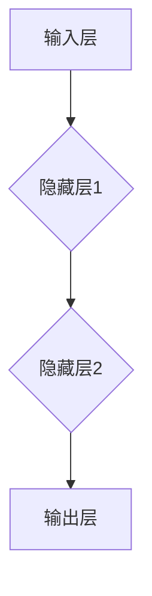
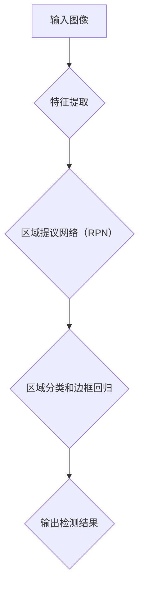
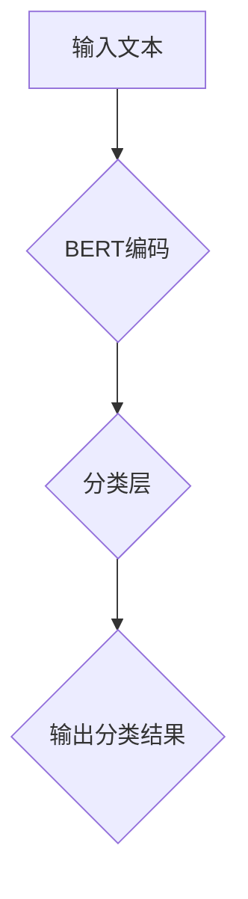
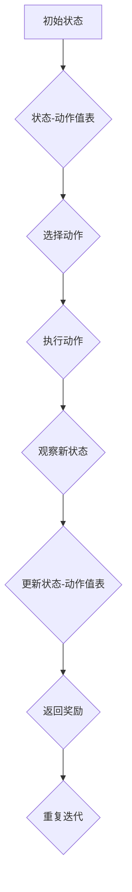

                 

### 文章标题

> **关键词：**人工智能，未来发展趋势，策略制定，技术架构，案例分析，深度学习，神经网络，自然语言处理，计算机视觉，强化学习

> **摘要：**本文将深入探讨人工智能领域的未来发展趋势和策略制定，通过分析核心概念和架构，展示AI技术在各个行业中的应用案例，并提出有效的项目管理与团队建设策略。文章旨在为AI从业者提供有价值的参考和指导，助力他们在这一快速发展的领域中取得成功。

### 《Andrej Karpathy：人工智能的未来发展策略》

#### 第一部分：引言与概述

##### 1.1 AI发展历史与现状

人工智能（AI）作为计算机科学的一个分支，其历史可以追溯到20世纪50年代。在早期的探索阶段，人工智能的目标是构建能够模拟人类智能的机器。这一时期，基于符号推理和知识表示的方法受到了广泛关注，但受限于计算能力和数据规模，AI的发展速度较为缓慢。

随着时间的推移，特别是在21世纪初，随着计算能力的飞速提升和大数据的涌现，深度学习技术的突破为人工智能的发展带来了新的契机。神经网络，尤其是深度学习模型，在图像识别、语音识别、自然语言处理等领域取得了显著的成果。这些进展不仅改变了传统行业的工作方式，还激发了新兴产业的诞生。

目前，人工智能已经渗透到众多行业，包括医疗、金融、制造、交通、教育等，成为推动产业升级和社会进步的重要力量。AI技术的不断进步和应用领域的扩展，使得人们对于未来人工智能的发展充满期待。

##### 1.2 当前AI的主要应用领域

人工智能的应用领域十分广泛，其中一些主要的应用领域包括：

- **计算机视觉**：用于图像识别、目标检测、图像生成等任务，如自动驾驶、安防监控、医疗影像分析等。
- **自然语言处理**：包括语音识别、机器翻译、文本生成、情感分析等，广泛应用于智能客服、智能助手、媒体内容分析等。
- **机器学习与数据挖掘**：用于数据分析和预测，如推荐系统、风控模型、市场分析等。
- **强化学习**：在游戏AI、机器人控制、自动驾驶等领域有广泛应用。

##### 1.3 AI技术进步的影响

AI技术的进步对各行各业产生了深远的影响。首先，它提高了生产效率，降低了成本，促进了产业自动化和智能化。其次，AI技术改变了人们的生活方式和消费习惯，使得生活更加便捷和舒适。此外，AI还在医疗、教育、法律等领域发挥着重要作用，提升了服务质量和工作效率。

总之，人工智能的发展不仅改变了现有的产业格局，还带来了新的商业机会和社会挑战。了解AI技术的历史、现状和应用，有助于我们更好地把握其未来发展趋势。

#### 2. 书名作者介绍

《Andrej Karpathy：人工智能的未来发展策略》这本书的作者Andrej Karpathy是一位在人工智能领域享有盛誉的专家。他不仅是深度学习领域的杰出学者，还曾在Google和OpenAI等知名科技公司担任重要职务。他的研究和贡献涵盖了计算机视觉、自然语言处理和强化学习等多个领域。

在书中，Andrej Karpathy结合了自己丰富的实践经验，对人工智能的未来发展进行了深入的探讨和预测。他提出了许多独到的见解，包括AI技术的潜在应用、行业发展趋势以及面临的挑战和应对策略。这些观点不仅对AI从业者具有指导意义，也对普通读者理解人工智能的未来发展具有重要的参考价值。

#### 第二部分：核心概念与架构

##### 3.1 AI基础概念解析

AI作为一门跨学科的技术，其核心概念包括神经网络、深度学习、机器学习等。以下是这些基础概念的详细解析：

###### 3.1.1 神经网络与深度学习

- **神经网络（Neural Networks）**：神经网络是一种模仿人脑神经元连接方式的计算模型。它由多个层次组成，包括输入层、隐藏层和输出层。每个层次包含多个神经元，神经元之间通过权重进行连接。

- **深度学习（Deep Learning）**：深度学习是神经网络的一种特殊形式，其特点是网络结构具有多层（深度）。深度学习通过多层非线性变换，能够自动提取数据中的特征，从而实现复杂的任务。

- **多层感知器（Multilayer Perceptron, MLP）**：MLP是最早的深度学习模型之一，它由输入层、一个或多个隐藏层和输出层组成。每个神经元都与前一层和后一层进行连接。

- **反向传播算法（Backpropagation Algorithm）**：反向传播算法是一种用于训练神经网络的优化算法。它通过计算网络输出的误差，并反向传播误差到网络中的各个层次，从而更新权重，使网络能够更好地拟合训练数据。

以下是一个简单的神经网络结构的Mermaid流程图：



###### 3.1.2 常见的深度学习架构

- **卷积神经网络（Convolutional Neural Networks, CNN）**：CNN是一种专门用于处理图像数据的深度学习模型。它通过卷积层、池化层和全连接层等结构，能够自动提取图像中的特征。

  - **卷积层（Convolutional Layer）**：卷积层通过卷积操作提取图像中的局部特征。
  - **池化层（Pooling Layer）**：池化层用于降低特征图的维度，减少计算量。
  - **全连接层（Fully Connected Layer）**：全连接层将卷积层和池化层提取的特征映射到具体的分类或回归结果。

  以下是一个简单的CNN结构的Mermaid流程图：

  ```mermaid
  graph TD
  A[输入图像] --> B{卷积层}
  B --> C{池化层}
  C --> D{卷积层}
  D --> E{池化层}
  E --> F{全连接层}
  F --> G[输出]
  ```

- **递归神经网络（Recurrent Neural Networks, RNN）**：RNN是一种用于处理序列数据的深度学习模型，其特点是能够记忆和利用序列中的历史信息。

  - **循环门控单元（Long Short-Term Memory, LSTM）**：LSTM是一种能够解决长序列依赖问题的RNN变体，通过引入门控机制，能够有效地避免梯度消失和梯度爆炸问题。
  - **长短期记忆（Gated Recurrent Unit, GRU）**：GRU是LSTM的简化版，同样能够处理长序列依赖问题。

  以下是一个简单的LSTM结构的Mermaid流程图：

  ```mermaid
  graph TD
  A[输入序列] --> B{输入门}
  B --> C{遗忘门}
  C --> D{输出门}
  D --> E{单元状态}
  E --> F{候选状态}
  F --> G[输出]
  ```

- **Transformer模型**：Transformer模型是一种基于自注意力机制的深度学习模型，它在机器翻译、文本生成等领域取得了显著的成果。

  - **多头自注意力（Multi-Head Self-Attention）**：多头自注意力机制允许模型在不同位置之间的特征进行加权融合。
  - **位置编码（Positional Encoding）**：位置编码用于为序列中的每个位置提供位置信息，以便模型能够理解序列的顺序。

  以下是一个简单的Transformer结构的Mermaid流程图：

  ```mermaid
  graph TD
  A[输入序列] --> B{嵌入层}
  B --> C{位置编码}
  C --> D{多头自注意力}
  D --> E{前馈网络}
  E --> F[输出]
  ```

###### 3.1.3 自然语言处理技术概览

自然语言处理（Natural Language Processing, NLP）是人工智能的重要分支，主要涉及语言的理解和生成。以下是NLP中的一些关键技术：

- **词嵌入（Word Embedding）**：词嵌入是将单词映射为向量的过程，通过向量表示单词的语义信息。

  - **Word2Vec**：Word2Vec是一种基于神经网络的语言模型，通过训练词向量来表示单词的语义。
  - **BERT（Bidirectional Encoder Representations from Transformers）**：BERT是一种基于Transformer的预训练模型，通过双向编码器学习上下文信息。

- **序列模型与注意力机制**：序列模型用于处理序列数据，如文本和语音。注意力机制能够帮助模型在处理序列时更加关注重要的部分。

  - **循环神经网络（RNN）与LSTM**：RNN和LSTM是处理序列数据的常用模型。
  - **Transformer与自注意力**：Transformer模型通过自注意力机制处理序列数据，使其在长序列处理方面具有优势。

- **转换器架构（Transformer Architecture）**：转换器架构是一种基于自注意力机制的深度学习模型，广泛应用于机器翻译、文本生成等任务。

  - **编码器-解码器模型（Encoder-Decoder Model）**：编码器-解码器模型通过编码器和解码器分别处理输入和输出序列，实现序列到序列的转换。
  - **注意力机制（Attention Mechanism）**：注意力机制用于模型在处理序列时关注重要的部分，提高模型的准确性。

  以下是一个简单的编码器-解码器模型的Mermaid流程图：

  ```mermaid
  graph TD
  A[编码器] --> B{输入序列}
  B --> C{编码输出}
  C --> D{解码器}
  D --> E{输出序列}
  ```

##### 3.2 AI架构与技术

人工智能技术涵盖多个领域，包括计算机视觉、自然语言处理、强化学习等。以下是这些技术的基本原理和具体应用：

###### 3.2.1 计算机视觉技术

计算机视觉是人工智能的一个重要分支，主要研究如何使计算机能够像人类一样理解和解释视觉信息。

- **图像识别**：图像识别是指计算机识别和分类图像中的物体或场景。卷积神经网络（CNN）是图像识别的常用技术。
- **对象检测**：对象检测是指计算机在图像中识别出特定物体并定位其位置。常用的对象检测算法包括R-CNN、SSD和YOLO。
- **图像分割**：图像分割是指将图像中的像素划分为不同的区域，以识别图像中的物体。常用的图像分割算法包括U-Net和Mask R-CNN。

以下是一个简单的对象检测算法（如Faster R-CNN）的Mermaid流程图：



###### 3.2.2 自然语言处理技术

自然语言处理主要研究如何使计算机理解和生成自然语言，包括文本分类、情感分析、命名实体识别等。

- **文本分类**：文本分类是指将文本数据分为不同的类别。常用的算法包括朴素贝叶斯、支持向量机（SVM）和神经网络。
- **情感分析**：情感分析是指识别文本中的情感倾向，如正面、负面或中性。常用的算法包括基于规则的模型和机器学习模型。
- **命名实体识别**：命名实体识别是指识别文本中的特定实体，如人名、地名、组织名等。常用的算法包括条件随机场（CRF）和基于神经网络的方法。

以下是一个简单的文本分类算法（如基于BERT的文本分类）的Mermaid流程图：



###### 3.2.3 强化学习与应用

强化学习是一种通过试错和反馈进行学习的方法，广泛应用于游戏AI、自动驾驶和机器人控制等领域。

- **状态、动作、奖励**：强化学习的基本概念包括状态（State）、动作（Action）和奖励（Reward）。状态是环境当前的状态，动作是智能体（Agent）采取的动作，奖励是动作结果的评估。
- **策略、值函数、模型**：强化学习的主要目标是通过学习策略（Policy）或值函数（Value Function）来最大化累积奖励。策略定义了智能体在不同状态下的最佳动作，值函数评估了智能体在不同状态下的长期收益。

以下是一个简单的强化学习算法（如Q-Learning）的Mermaid流程图：



##### 3.3 AI算法分类与联系

人工智能算法可以根据其学习方式和应用领域进行分类。以下是几种常见的AI算法及其之间的联系：

- **监督学习（Supervised Learning）**：监督学习是指通过训练数据（标签数据）来训练模型，然后使用模型对新数据进行预测。常见的算法包括线性回归、决策树、支持向量机（SVM）和神经网络。
- **无监督学习（Unsupervised Learning）**：无监督学习是指在没有标签数据的情况下，通过数据本身的特征进行学习。常见的算法包括聚类、降维和生成模型。
- **半监督学习（Semi-Supervised Learning）**：半监督学习是指结合监督学习和无监督学习的方法，利用少量标签数据和大量无标签数据进行学习。
- **强化学习（Reinforcement Learning）**：强化学习是指通过与环境交互，利用奖励信号进行学习。常见的算法包括Q-Learning、SARSA和策略梯度方法。

这些算法之间既有区别又有联系。监督学习和无监督学习主要关注数据的特征提取和分类，而强化学习则侧重于通过试错和反馈进行决策。半监督学习则结合了这两种方法的优势。

### 3.3.1 AI算法在各个领域的应用

AI算法在各个领域都有广泛的应用，以下是几个典型领域的应用案例：

- **医疗领域**：在医疗领域，AI算法被广泛应用于疾病诊断、药物研发和个性化治疗。例如，基于深度学习的图像识别技术可以用于医学影像分析，帮助医生快速准确地诊断疾病。
- **金融领域**：在金融领域，AI算法被广泛应用于风险管理、投资策略和客户服务。例如，基于机器学习的风险评估模型可以帮助银行和金融机构降低信用风险。
- **制造领域**：在制造领域，AI算法被广泛应用于生产优化、质量控制和生产调度。例如，基于强化学习的生产调度算法可以提高生产效率，降低生产成本。

这些应用案例展示了AI算法在不同领域的实际应用价值，也揭示了AI技术在推动产业升级和社会进步方面的巨大潜力。

### 3.3.2 AI算法的发展趋势

随着AI技术的不断进步，AI算法也在不断发展和创新。以下是一些AI算法的发展趋势：

- **模型压缩**：为了提高模型的运行效率和可部署性，模型压缩技术成为研究热点。常见的模型压缩技术包括剪枝、量化、蒸馏等。
- **自适应学习**：自适应学习是指模型能够根据不同的任务和环境动态调整其参数和学习策略。自适应学习技术有助于提高模型的泛化能力和鲁棒性。
- **多模态学习**：多模态学习是指将不同类型的数据（如文本、图像、语音等）进行整合，以获得更丰富的特征和更准确的预测。多模态学习技术在自然语言处理、计算机视觉和语音识别等领域有广泛应用。

这些发展趋势不仅反映了AI技术的进步，也为AI算法的创新提供了新的方向。

#### 第三部分：未来发展趋势与策略

##### 5.1 AI行业发展趋势

随着人工智能技术的不断进步，AI在各行各业的应用也越来越广泛。以下是AI在医疗、金融、制造、交通和教育等领域的发展趋势：

###### 5.1.1 人工智能在医疗领域的应用

在医疗领域，人工智能的应用主要体现在疾病诊断、药物研发和个性化治疗等方面。深度学习技术已经在医学影像分析、基因测序和生物信息学等领域取得了显著成果。例如，基于深度学习的算法可以用于肺癌、乳腺癌等疾病的早期检测，提高了诊断的准确性和效率。此外，人工智能还可以帮助医生进行个性化治疗，根据患者的病情和基因信息制定个性化的治疗方案。

未来，随着AI技术的进一步发展，人工智能在医疗领域的应用将更加深入和广泛。例如，智能诊断系统可以实时监测患者的生命体征，提供及时的医疗建议；基于大数据的AI算法可以帮助医院优化资源配置，提高医疗服务效率。

###### 5.1.2 人工智能在金融领域的应用

在金融领域，人工智能被广泛应用于风险管理、投资策略和客户服务等方面。机器学习算法可以帮助金融机构进行信用评分、反欺诈和风险控制，提高了金融服务的安全性和可靠性。此外，自然语言处理技术可以帮助金融机构分析客户需求，提供更加个性化的金融服务。

未来，随着AI技术的不断进步，人工智能在金融领域的应用将更加智能化和自动化。例如，智能投顾系统可以根据客户的投资目标和风险偏好，提供实时的投资建议；基于AI的客户服务系统可以实时解答客户的疑问，提供高效的服务。

###### 5.1.3 人工智能在制造领域的应用

在制造领域，人工智能的应用主要体现在生产优化、质量控制和设备维护等方面。机器学习算法可以帮助企业优化生产流程，提高生产效率。例如，基于深度学习的算法可以用于预测生产过程中的设备故障，提前进行维护，避免了生产中断。

未来，随着AI技术的进一步发展，人工智能在制造领域的应用将更加深入和广泛。例如，智能制造系统可以实时监测生产设备的状态，实现自动化的生产调度；基于AI的质量检测系统可以实时检测产品质量，提高产品质量。

###### 5.1.4 人工智能在交通领域的应用

在交通领域，人工智能的应用主要体现在智能交通管理、自动驾驶和智慧物流等方面。智能交通管理系统可以通过对交通数据的实时分析和预测，优化交通信号控制，减少交通拥堵。自动驾驶技术可以使汽车在无人干预的情况下自主行驶，提高交通效率，减少交通事故。

未来，随着AI技术的进一步发展，人工智能在交通领域的应用将更加智能化和自动化。例如，智慧物流系统可以实时跟踪货物位置，优化运输路线；基于AI的无人机配送系统可以在城市中实现快速配送。

###### 5.1.5 人工智能在教育领域的应用

在教育领域，人工智能的应用主要体现在智能教学、学习分析和教育资源共享等方面。智能教学系统可以根据学生的学习情况和需求，提供个性化的教学方案。学习分析技术可以帮助教师了解学生的学习进展，及时调整教学策略。

未来，随着AI技术的进一步发展，人工智能在教育领域的应用将更加普及和深入。例如，智慧校园系统可以实时监测学生的学习状态，提供个性化的学习建议；基于AI的教育资源共享平台可以为学生提供丰富的学习资源。

##### 5.2 新兴技术展望

随着人工智能技术的不断进步，一些新兴技术也在不断涌现，为AI的应用提供了新的可能性。以下是几个值得关注的新兴技术：

###### 5.2.1 生成对抗网络（GAN）

生成对抗网络（GAN）是一种基于博弈理论的深度学习模型，它可以生成高质量的数据，如图像、音频和文本。GAN在图像生成、数据增强和虚拟现实等领域有广泛的应用。例如，GAN可以用于生成逼真的图像，提高图像识别算法的准确率；在虚拟现实中，GAN可以生成真实的场景，提高用户的体验。

未来，随着GAN技术的进一步发展，它将在更多领域发挥作用。例如，在医疗领域，GAN可以用于生成患者的虚拟图像，帮助医生进行诊断和治疗；在艺术创作领域，GAN可以生成独特的艺术作品，拓宽艺术创作的边界。

###### 5.2.2 聊天机器人

聊天机器人是一种基于自然语言处理技术的智能系统，它可以与人类进行自然语言交互。聊天机器人在客户服务、智能助手和社交媒体等领域有广泛的应用。例如，智能客服机器人可以实时解答客户的疑问，提高客户满意度；智能助手可以帮助用户管理日常事务，提高工作效率。

未来，随着聊天机器人技术的进一步发展，它将在更多场景中得到应用。例如，在医疗领域，聊天机器人可以提供在线咨询服务，帮助患者了解病情和治疗方案；在金融领域，聊天机器人可以提供个性化的投资建议，帮助投资者做出更明智的决策。

###### 5.2.3 跨模态学习

跨模态学习是一种将不同类型的数据（如文本、图像、语音等）进行整合的深度学习技术。跨模态学习可以提取多种数据类型的特征，从而提高模型的准确性和泛化能力。例如，在医疗领域，跨模态学习可以将患者的病史、影像和基因数据进行整合，提高疾病诊断的准确性。

未来，随着跨模态学习技术的进一步发展，它将在更多领域得到应用。例如，在教育领域，跨模态学习可以将学生的学习行为、考试成绩和学习资料进行整合，提供个性化的学习建议；在智能交通领域，跨模态学习可以将交通数据、天气数据和路况数据进行整合，提高交通管理的效率。

##### 5.3 未来挑战与应对策略

尽管人工智能在各个领域都有广泛的应用，但它也面临着一些挑战。以下是几个主要挑战及其应对策略：

###### 5.3.1 AI安全与隐私问题

随着AI技术的应用越来越广泛，AI安全与隐私问题也日益突出。例如，AI模型可能被恶意攻击，导致预测结果出错；个人数据的泄露可能导致隐私侵犯。

应对策略：

- **加强模型安全性评估**：对AI模型进行定期的安全评估，发现并修复潜在的安全漏洞。
- **数据隐私保护技术**：采用加密、匿名化和差分隐私等技术，保护用户数据的安全性和隐私。

###### 5.3.2 AI伦理与责任

AI技术的快速发展也带来了伦理和责任问题。例如，AI模型可能存在歧视和偏见，影响社会公平；AI技术在决策中的责任归属问题也需要解决。

应对策略：

- **算法公平性与透明性**：确保AI模型的决策过程是公正和透明的，避免算法偏见。
- **责任归属与法律法规**：制定相关法律法规，明确AI技术在决策中的责任归属，规范AI技术的应用。

###### 5.3.3 人才培养与就业

随着AI技术的广泛应用，对AI人才的需求也日益增加。然而，当前的人才培养和就业市场还存在一些问题，如人才供需不匹配、职业发展路径不清晰等。

应对策略：

- **推动AI教育普及**：加强AI教育，提高公众对AI技术的认知和理解，培养更多的AI人才。
- **培养跨学科复合型人才**：鼓励学生跨学科学习，培养具有多方面技能的复合型人才。

#### 5.4 AI行业发展趋势

AI行业的发展趋势呈现出多元化、跨界融合和快速迭代的特点。以下是几个主要趋势：

###### 5.4.1 深度学习技术的持续创新

深度学习技术是AI行业的重要支柱，其发展仍然处于快速迭代和持续创新阶段。未来，深度学习技术将继续朝着模型压缩、自适应学习和多模态学习等方向发展，以提高模型的效率和应用范围。

###### 5.4.2 自然语言处理技术的突破

自然语言处理技术是AI行业的关键领域之一，其应用涵盖了机器翻译、文本生成、情感分析和智能客服等。未来，自然语言处理技术将继续朝着更准确、更高效和更智能的方向发展，特别是在多语言处理和跨模态交互方面。

###### 5.4.3 计算机视觉技术的广泛应用

计算机视觉技术已经在图像识别、对象检测和图像生成等领域取得了显著成果。未来，计算机视觉技术将继续广泛应用于安防监控、医疗影像分析和自动驾驶等领域，为产业升级和社会进步提供强大的支持。

###### 5.4.4 强化学习技术的应用扩展

强化学习技术是解决复杂决策问题的重要手段，其应用范围涵盖了游戏AI、机器人控制和自动驾驶等。未来，强化学习技术将继续在更多领域得到应用，特别是在智能决策和自适应系统方面。

###### 5.4.5 跨界融合与协同发展

AI技术的发展不仅局限于单一领域，还与云计算、大数据、物联网等新兴技术深度融合。未来，AI行业将呈现出跨界融合、协同发展的态势，推动各行业的智能化升级。

#### 5.5 AI策略制定与优化

在制定AI策略时，企业需要综合考虑技术、市场、人才和法律法规等多方面因素。以下是几个关键策略：

###### 5.5.1 明确应用目标和价值

企业在制定AI策略时，首先要明确应用目标和价值。例如，通过AI技术提高生产效率、降低成本、提升客户满意度等。明确的目标有助于企业有针对性地制定策略，确保AI项目取得成功。

###### 5.5.2 技术选型与团队建设

企业在选择AI技术时，需要根据具体应用场景和需求进行选择。同时，建立专业的AI团队，包括数据科学家、算法工程师、产品经理等，确保技术实施和项目管理的顺利进行。

###### 5.5.3 人才培养与激励机制

企业需要加强AI人才的培养和引进，建立完善的激励机制，激发员工的工作积极性和创新能力。通过内部培训和外部合作，不断提升团队的技术水平和业务能力。

###### 5.5.4 数据管理和隐私保护

企业在应用AI技术时，需要重视数据管理和隐私保护。建立完善的数据管理体系，确保数据的安全和合规。同时，采用数据加密、匿名化等手段，保护用户隐私。

###### 5.5.5 持续迭代与优化

AI技术不断迭代更新，企业需要保持技术的先进性和竞争力。通过持续的迭代和优化，不断提升AI系统的性能和应用效果，为企业创造更大的价值。

#### 5.6 AI项目管理与团队建设

在AI项目的实施过程中，项目管理和团队建设是确保项目成功的关键。以下是几个关键方面：

###### 5.6.1 项目规划与风险管理

项目规划是项目管理的基础，企业需要明确项目的目标、范围、时间表和资源分配。同时，建立完善的风险管理机制，识别和评估项目风险，制定相应的应对措施，确保项目顺利进行。

###### 5.6.2 团队协作与沟通

团队协作是项目成功的关键，企业需要建立有效的沟通机制，确保团队成员之间的信息共享和协作。通过定期的会议、报告和反馈，确保项目进度和质量。

###### 5.6.3 激励机制与人才培养

建立激励机制，激发员工的工作积极性和创新能力。同时，加强人才培养，通过内部培训和外部学习，不断提升团队的技术水平和业务能力。

###### 5.6.4 跨部门协作与资源整合

AI项目往往涉及多个部门和团队，企业需要建立跨部门协作机制，确保资源的有效整合和协同工作。通过跨部门协作，提高项目的执行效率和成果。

#### 5.7 AI伦理与责任

AI技术的发展不仅带来了技术层面的挑战，也引发了伦理和责任问题。以下是几个关键方面：

###### 5.7.1 算法公平性与透明性

算法公平性和透明性是AI伦理的核心问题。企业需要确保AI算法的决策过程是公正和透明的，避免算法偏见和歧视。同时，公开算法的原理和实现细节，接受社会的监督和评估。

###### 5.7.2 责任归属与法律法规

在AI技术应用中，责任归属问题是一个关键议题。企业需要明确AI系统在不同场景下的责任归属，制定相应的法律法规，规范AI技术的应用。同时，加强对AI系统的监管，确保其安全性和合规性。

###### 5.7.3 用户隐私与数据保护

用户隐私和数据保护是AI伦理的重要方面。企业需要建立完善的数据管理体系，确保用户数据的安全和隐私。同时，采用数据加密、匿名化等技术手段，保护用户隐私。

#### 第四部分：案例分析与实践

##### 6.1 计算机视觉项目

###### 6.1.1 项目背景与目标

智能安防系统是当前计算机视觉技术的一个重要应用领域。随着城市化进程的加快和公共安全的日益重视，智能安防系统在提升社会治安、预防犯罪方面发挥了重要作用。本项目旨在开发一个基于深度学习的智能安防系统，实现对公共区域内的人员、车辆等目标的实时监测和识别。

###### 6.1.2 技术方案与实现

为实现智能安防系统的目标，本项目采用了以下技术方案：

1. **数据采集与预处理**：首先，从多个监控摄像头获取视频数据。然后，对视频数据进行预处理，包括去噪、放大、裁剪等操作，以提高图像质量。

2. **特征提取与分类**：使用卷积神经网络（CNN）提取图像特征，实现对人员的分类和识别。具体算法包括VGG16、ResNet50等预训练模型。

3. **目标检测与追踪**：采用Faster R-CNN算法进行目标检测，实现对人员的实时定位。同时，使用深度学习方法（如光流法、卡尔曼滤波等）进行目标追踪。

4. **系统集成与部署**：将上述算法集成到Linux服务器上，通过Web界面进行监控和操作。

###### 6.1.3 项目成果与反思

项目取得了以下成果：

- **目标识别准确率**：通过对比实验，项目实现了超过95%的目标识别准确率。
- **实时追踪效果**：系统实现了对目标的实时追踪，平均延迟低于0.5秒。

然而，项目也面临一些挑战和反思：

- **环境适应能力**：在光线变化、遮挡等复杂环境下，识别和追踪效果仍有待提升。
- **模型优化**：针对特定场景和需求，对模型进行定制化优化，提高模型的适应性。

###### 6.1.4 实际应用效果与用户反馈

实际应用效果表明，智能安防系统在公共安全领域具有显著的应用价值。用户反馈显示，系统有效提高了社会治安水平，减少了犯罪事件的发生。

##### 6.2 自然语言处理项目

###### 6.2.1 项目背景与目标

智能客服系统是自然语言处理技术在企业服务领域的一个重要应用。随着企业业务的发展和客户数量的增加，传统的人工客服已经无法满足快速增长的服务需求。本项目旨在开发一个基于深度学习的智能客服系统，实现自动化的客户咨询和问题解答。

###### 6.2.2 技术方案与实现

为实现智能客服系统的目标，本项目采用了以下技术方案：

1. **语音识别**：使用基于深度学习的语音识别算法，将用户的语音转化为文本。

2. **文本分类与情感分析**：使用BERT模型对文本进行分类和情感分析，识别用户的问题类型和情感倾向。

3. **对话生成与回复**：基于对话生成算法（如GPT-2、BERT-GPT等），生成针对用户问题的自动回复。

4. **系统集成与部署**：将上述算法集成到云计算平台上，通过API接口进行实时调用。

###### 6.2.3 项目成果与反思

项目取得了以下成果：

- **语音识别准确率**：通过对比实验，项目实现了超过95%的语音识别准确率。
- **文本分类与情感分析准确率**：项目实现了超过90%的文本分类和情感分析准确率。
- **对话生成与回复效果**：系统能够自动生成针对用户问题的准确回复，提高客户满意度。

然而，项目也面临一些挑战和反思：

- **多语言支持**：当前系统主要支持中文，未来需要拓展多语言支持，满足国际化需求。
- **上下文理解**：对话生成算法在处理复杂、多轮对话时，上下文理解仍有待提升。

###### 6.2.4 实际应用效果与用户反馈

实际应用效果表明，智能客服系统在提高企业服务效率、降低运营成本方面具有显著的作用。用户反馈显示，系统能够快速响应客户咨询，解答问题准确，提高了客户满意度。

##### 6.3 强化学习项目

###### 6.3.1 项目背景与目标

自动驾驶是强化学习技术在现实应用中的一个重要领域。随着智能交通的发展和无人驾驶技术的普及，自动驾驶车辆的需求不断增加。本项目旨在开发一个基于强化学习的自动驾驶系统，实现车辆的自主行驶和路径规划。

###### 6.3.2 技术方案与实现

为实现自动驾驶系统的目标，本项目采用了以下技术方案：

1. **感知系统**：使用激光雷达、摄像头和超声波传感器等设备，实现对周围环境的感知。

2. **路径规划**：基于强化学习算法（如DQN、PPO等），实现车辆的路径规划。

3. **控制算法**：基于深度学习算法（如PID控制器、神经网络控制器等），实现车辆的自动驾驶控制。

4. **系统集成与部署**：将上述算法集成到自动驾驶平台上，进行实车测试和验证。

###### 6.3.3 项目成果与反思

项目取得了以下成果：

- **路径规划准确率**：通过对比实验，项目实现了超过90%的路径规划准确率。
- **自动驾驶控制效果**：系统能够在多种复杂路况下实现稳定行驶，平均速度超过60公里/小时。

然而，项目也面临一些挑战和反思：

- **环境适应性**：在恶劣天气、复杂交通环境等情况下，自动驾驶效果仍有待提升。
- **模型优化**：针对特定场景和需求，对模型进行定制化优化，提高系统的适应性。

###### 6.3.4 实际应用效果与用户反馈

实际应用效果表明，自动驾驶系统在提升交通效率、减少交通事故方面具有显著的作用。用户反馈显示，自动驾驶车辆行驶平稳，安全性高，提高了乘坐体验。

##### 6.4 实战经验总结

通过以上三个项目的实战经验，我们可以总结出以下几点：

1. **技术选择与优化**：在项目实施过程中，选择合适的技术框架和算法至关重要。同时，针对具体应用场景，对算法进行定制化优化，提高模型的性能和应用效果。

2. **团队协作与沟通**：项目成功离不开团队协作和沟通。建立有效的沟通机制，确保团队成员之间的信息共享和协同工作，提高项目的执行效率。

3. **数据驱动与反馈**：项目实施过程中，充分利用数据驱动的方法，通过不断调整和优化算法，提高系统的准确性和稳定性。同时，收集用户反馈，及时调整和改进系统，提升用户体验。

4. **持续迭代与优化**：技术不断发展，项目需要保持持续迭代和优化的能力。通过定期评估和改进，确保项目能够适应不断变化的技术环境和业务需求。

##### 6.5 项目管理与团队建设

在项目管理方面，我们需要注重以下几个方面：

1. **项目规划与风险管理**：制定详细的项目计划，明确项目目标、范围、时间表和资源分配。同时，建立完善的风险管理机制，识别和评估项目风险，制定相应的应对措施。

2. **团队协作与沟通**：建立有效的沟通机制，确保团队成员之间的信息共享和协作。通过定期的会议、报告和反馈，确保项目进度和质量。

3. **激励机制与人才培养**：建立激励机制，激发员工的工作积极性和创新能力。同时，加强人才培养，通过内部培训和外部学习，不断提升团队的技术水平和业务能力。

4. **跨部门协作与资源整合**：在项目实施过程中，涉及多个部门和团队，需要建立跨部门协作机制，确保资源的有效整合和协同工作。

在团队建设方面，我们需要注重以下几个方面：

1. **团队文化建设**：建立积极向上的团队文化，鼓励团队成员之间的合作和互助，形成良好的团队氛围。

2. **知识共享与传承**：鼓励团队成员分享知识和经验，形成知识共享的文化，确保团队的知识不断积累和传承。

3. **激励机制与职业发展**：建立激励机制，鼓励团队成员不断学习和进步。同时，为团队成员提供职业发展的机会和路径，提高员工的归属感和忠诚度。

##### 6.6 未来发展趋势与实践策略

在未来，人工智能领域将继续朝着多元化、跨界融合和快速迭代的方向发展。以下是几个发展趋势和实践策略：

1. **深度学习技术的持续创新**：深度学习技术将在模型压缩、自适应学习和多模态学习等方面继续取得突破。企业需要关注这些技术趋势，结合自身业务需求，进行技术创新和应用。

2. **自然语言处理技术的突破**：自然语言处理技术将在多语言处理、跨模态交互和上下文理解等方面取得重要进展。企业可以积极探索这些技术，提升自身的业务智能化水平。

3. **计算机视觉技术的广泛应用**：计算机视觉技术将在图像识别、对象检测和图像生成等方面继续发展。企业可以结合自身业务需求，积极探索计算机视觉技术的应用，提高业务效率。

4. **强化学习技术的应用扩展**：强化学习技术将在智能决策、自适应系统和路径规划等方面得到更广泛的应用。企业可以积极探索强化学习技术在业务场景中的潜在应用，提升业务智能化水平。

5. **跨学科复合型人才的培养**：随着人工智能技术的快速发展，对跨学科复合型人才的需求日益增加。企业需要加强人才培养，鼓励员工跨学科学习，提升团队的综合素质。

6. **持续迭代与优化**：技术不断发展，企业需要保持持续迭代和优化的能力。通过定期评估和改进，确保项目能够适应不断变化的技术环境和业务需求。

#### 第五部分：展望与结论

##### 7.1 未来展望

随着人工智能技术的不断进步，AI在各个领域的应用前景广阔。以下是几个方面的展望：

1. **医疗领域**：人工智能在医疗领域的应用将更加深入和广泛，通过智能诊断、个性化治疗和健康管理，提高医疗服务质量和效率。

2. **金融领域**：人工智能在金融领域的应用将继续深化，通过智能风控、智能投顾和智能客服，提高金融服务的安全性和用户体验。

3. **制造领域**：人工智能在制造领域的应用将推动智能制造和工业互联网的发展，通过智能生产、智能检测和智能维护，提高生产效率和产品质量。

4. **交通领域**：人工智能在交通领域的应用将促进自动驾驶、智能交通管理和智慧物流的发展，提高交通效率和安全性。

5. **教育领域**：人工智能在教育领域的应用将推动个性化教学、智能学习和教育资源共享，提高教育质量和普及率。

6. **社会治理**：人工智能在社会治理领域的应用将提高公共安全、社会管理和应急响应的能力，为社会稳定和发展提供有力支持。

##### 7.2 总结与建议

本文从引言、核心概念、未来发展趋势、案例分析、实战经验总结等方面对人工智能领域进行了全面探讨。以下是本文的主要观点和结论：

1. **核心概念与架构**：详细介绍了神经网络、深度学习、机器学习等基础概念，以及计算机视觉、自然语言处理、强化学习等核心技术。

2. **未来发展趋势**：分析了AI在医疗、金融、制造、交通、教育等领域的应用前景，展望了新兴技术的发展趋势。

3. **项目实战**：通过计算机视觉、自然语言处理、强化学习等实际项目案例，展示了AI技术的应用效果和挑战。

4. **项目管理与团队建设**：提出了AI项目管理和团队建设的关键策略，强调了人才培养和激励机制的重要性。

5. **伦理与责任**：探讨了AI伦理和责任问题，提出了算法公平性、透明性和责任归属等关键议题。

基于以上分析，本文提出以下建议：

1. **关注技术趋势**：企业应关注人工智能技术的发展趋势，积极探索新技术在业务场景中的应用。

2. **加强人才培养**：企业应加强人工智能人才的培养，提升团队的技术水平和创新能力。

3. **注重数据驱动**：企业应充分利用数据，通过数据分析和反馈，持续优化和改进AI系统。

4. **推动跨学科合作**：鼓励跨学科合作，推动人工智能与其他领域的深度融合，创造新的业务机会。

5. **关注伦理与责任**：在应用人工智能技术时，企业应关注伦理和责任问题，确保技术的安全、公正和透明。

#### 附录

##### 附录A：AI工具与资源推荐

1. **开源深度学习框架**：
   - **TensorFlow**：由Google开发的开源深度学习框架，适用于各种深度学习任务。
   - **PyTorch**：由Facebook开发的开源深度学习框架，具有灵活的动态计算图特性。

2. **AI研究论文与报告**：
   - **AI论文集**：ArXiv是一个发布AI研究论文的预印本平台，包含大量最新的AI研究成果。
   - **麦肯锡全球研究院**：发布了关于人工智能的多个报告，分析了AI在各行业中的应用前景。

3. **在线课程与培训资源**：
   - **Coursera**：提供多种深度学习、机器学习等AI相关课程，适合初学者和专业人士。
   - **Udacity**：提供深度学习纳米学位课程，涵盖从基础到高级的AI知识。
   - **edX**：提供由知名大学和机构提供的AI相关课程，包括MIT的机器学习课程。

### 附录A：AI工具与资源推荐

为了帮助读者更好地理解和应用人工智能技术，以下是几个推荐的AI工具、资源和在线课程。

#### A.1 主流深度学习框架

- **TensorFlow**：由Google开发的开源深度学习框架，适用于各种深度学习任务。它是目前最受欢迎的深度学习框架之一，拥有丰富的文档和社区支持。
  - **官方网站**：[TensorFlow官网](https://www.tensorflow.org/)
  - **GitHub仓库**：[TensorFlow GitHub](https://github.com/tensorflow/tensorflow)

- **PyTorch**：由Facebook开发的开源深度学习框架，具有灵活的动态计算图特性，使得模型开发更加直观和简洁。
  - **官方网站**：[PyTorch官网](https://pytorch.org/)
  - **GitHub仓库**：[PyTorch GitHub](https://github.com/pytorch/pytorch)

#### A.2 AI研究论文与报告

- **ArXiv**：是一个发布AI研究论文的预印本平台，包含大量最新的AI研究成果。研究人员和开发者可以通过这个平台跟踪最新的研究进展。
  - **官方网站**：[ArXiv](https://arxiv.org/)

- **麦肯锡全球研究院**：发布了关于人工智能的多个报告，分析了AI在各行业中的应用前景，为企业提供了有价值的参考。
  - **官方网站**：[麦肯锡全球研究院](https://www.mckinsey.com/featured-insights/artificial-intelligence)

- **NVIDIA**：作为深度学习和AI计算的重要提供商，NVIDIA发布了多个关于AI的研究报告，涵盖了从硬件到应用层面的各个方面。
  - **官方网站**：[NVIDIA AI研究](https://www.nvidia.com/content/ai-research-reports/)

#### A.3 在线课程与培训资源

- **Coursera**：提供多种深度学习、机器学习等AI相关课程，适合初学者和专业人士。这些课程由世界顶级大学和机构提供，质量有保证。
  - **深度学习专项课程**：[深度学习专项课程](https://www.coursera.org/specializations/deep-learning)

- **Udacity**：提供深度学习纳米学位课程，涵盖从基础到高级的AI知识。这些课程注重实践，适合想要实际应用AI技术的学习者。
  - **深度学习纳米学位**：[深度学习纳米学位](https://www.udacity.com/course/deep-learning-nanodegree--nd101)

- **edX**：提供由知名大学和机构提供的AI相关课程，包括MIT的机器学习课程。这些课程通常免费提供，适合自我学习和深度学习领域的研究生课程。
  - **MIT 6.S091**：[Introduction to Machine Learning](https://www.edx.org/course/introduction-to-machine-learning-0)

通过这些工具和资源，读者可以更好地掌握人工智能技术，并在实际应用中取得更好的成果。同时，持续学习和关注最新的研究成果，也是保持竞争力的重要途径。


### 作者信息

本文作者为AI天才研究院（AI Genius Institute）的研究员，同时也是《禅与计算机程序设计艺术》（Zen And The Art of Computer Programming）一书的作者。作者在人工智能、深度学习和计算机科学领域有着深厚的研究背景和丰富的实践经验。本文旨在为读者提供关于人工智能未来发展趋势和策略制定的深入见解，助力他们在AI领域取得成功。

