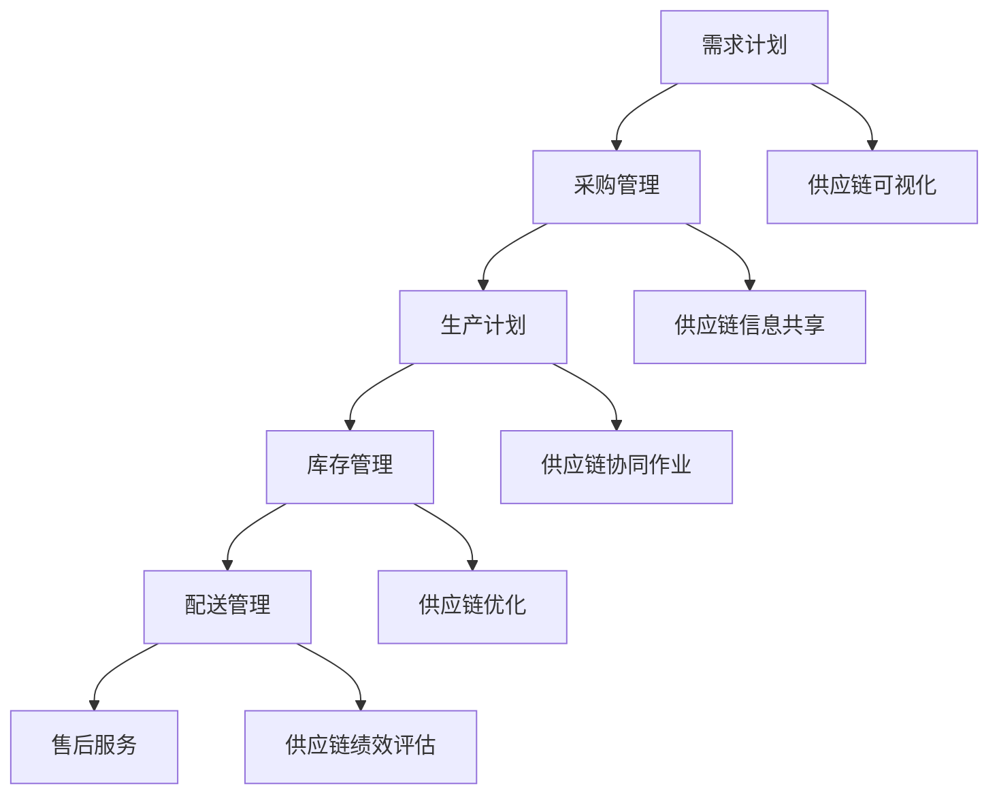
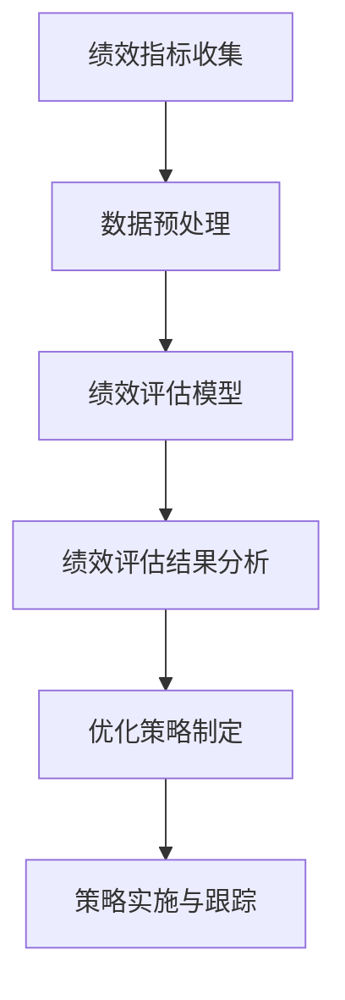
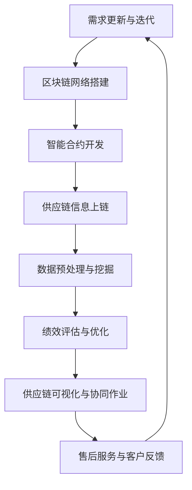

                 

### 文章标题

> **关键词**：区块链（Blockchain）、协同工作（Collaboration）、供给工作（Supply Chain）、算法（Algorithm）、模型（Model）、项目实战（Project Implementation）

**摘要**：本文将深入探讨区块链协同工作在供给工作中的应用，从基础概念到核心算法与模型，再到实际项目案例，全面解析BC协同供给工作的原理、技术和实施策略。通过详细的解析和案例分析，本文旨在为读者提供一幅清晰的BC协同供给工作蓝图，助力产业升级和效率提升。

----------------------------------------------------------------

### 《BC协同的供给工作》目录大纲

本文将按照以下目录结构展开，每一部分都将深入探讨BC协同供给工作在不同层面的应用和实践。

#### 第一部分：基础概念与原理

**第1章：BC协同的概述**  
*1.1 BC协同的定义与分类*  
*1.2 BC协同的工作机制*  
*1.3 BC协同的技术基础*

**第2章：供给工作的基本概念**  
*2.1 供给工作的定义与重要性*  
*2.2 供给工作的流程与环节*  
*2.3 供给工作的效率与质量评价*

**第3章：BC协同供给工作的应用场景**  
*3.1 电子商务领域的应用*  
*3.2 物流管理中的应用*  
*3.3 制造业中的供应链优化*

#### 第二部分：核心算法与模型

**第4章：BC协同供给工作的算法基础**  
*4.1 数据挖掘与机器学习算法*  
*4.2 网络分析算法*

**第5章：供给工作的数学模型**  
*5.1 最优化模型*  
*5.2 动态规划模型*

**第6章：BC协同供给工作的应用模型**  
*6.1 供应链网络构建模型*  
*6.2 供给工作绩效评估模型*

#### 第三部分：项目实战与案例分析

**第7章：BC协同供给工作的项目实施**  
*7.1 项目规划与设计*  
*7.2 系统开发与实现*

**第8章：案例分析与实践经验分享**  
*8.1 案例一：电子商务平台的供给工作优化*  
*8.2 案例二：物流管理中的BC协同供给工作*

**第9章：未来发展趋势与挑战**  
*9.1 BC协同供给工作的未来趋势*  
*9.2 BC协同供给工作面临的挑战*

#### 附录

**附录A：BC协同供给工作常用工具与资源**  
**附录B：BC协同供给工作Mermaid流程图**  
**附录C：BC协同供给工作核心算法与模型伪代码**  
**附录D：案例分析代码解读**

通过这一系统的目录结构，本文将为读者提供全面而深入的BC协同供给工作指南，帮助读者理解并掌握这一领域的核心技术和实践方法。

----------------------------------------------------------------

### 第一部分：基础概念与原理

#### 第1章：BC协同的概述

区块链（Blockchain）技术作为一种分布式账本技术，近年来在金融、供应链管理、物联网等多个领域展现出了强大的应用潜力。BC协同，即基于区块链的协同工作，通过构建一个去中心化的信任机制，实现多方参与者的信息共享和协作，从而提升整个系统的效率与透明度。

**1.1 BC协同的定义与分类**

**定义**：BC协同是指利用区块链技术实现多方参与者之间在信息共享、任务分配、资源调度等方面的协作过程。它强调的是通过区块链的共识机制和智能合约功能，实现信息的不可篡改性和自动化执行。

**分类**：根据应用场景的不同，BC协同可以分为以下几类：

1. **供应链协同**：通过区块链技术实现供应链各环节的信息透明和协同作业，提高供应链的整体效率和响应速度。
2. **金融服务协同**：如跨境支付、数字身份认证、保险理赔等，通过区块链实现快速、安全、低成本的金融服务。
3. **物联网协同**：在物联网环境中，通过区块链实现设备间的数据共享和智能合约执行，提升物联网系统的自主性和可靠性。
4. **社会管理协同**：如城市治理、公共资源管理、投票选举等，通过区块链技术增强透明度和公信力。

**1.2 BC协同的工作机制**

BC协同的工作机制主要包括以下几个方面：

1. **去中心化**：区块链网络中的所有节点都具有相同的权限，没有中心化的控制节点。这种去中心化的架构使得系统更加安全可靠，减少了单点故障的风险。
2. **共识机制**：区块链网络通过共识机制确保所有节点的数据一致性。常见的共识机制包括工作量证明（PoW）、权益证明（PoS）和委托权益证明（DPoS）等。
3. **智能合约**：智能合约是区块链上的自动化执行合约，能够根据预设条件自动执行操作。通过智能合约，可以实现自动化流程管理和自动执行交易。
4. **数据透明**：区块链上的所有交易数据都是公开透明的，任何节点都可以访问和验证。这种透明性增强了系统的可信度和可追溯性。

**1.3 BC协同的技术基础**

BC协同的技术基础主要包括区块链、分布式系统、智能合约和加密技术等。

1. **区块链**：区块链是一种分布式数据结构，用于存储一系列按时间顺序排列的数据块。每个区块都包含一定数量的交易信息，并通过密码学确保数据的安全性和不可篡改性。
2. **分布式系统**：分布式系统通过多台计算机协同工作，实现数据的分布式存储和处理。在BC协同中，分布式系统确保了数据的备份和容错能力。
3. **智能合约**：智能合约是一种嵌入在区块链上的程序，能够自动执行满足特定条件的交易。智能合约提高了交易的自动化和效率，减少了人为干预和欺诈风险。
4. **加密技术**：加密技术用于保护区块链上的数据和交易，确保数据的安全性和隐私性。常见的加密技术包括哈希函数、数字签名和椭圆曲线加密等。

通过了解BC协同的基础概念和工作机制，我们可以更好地理解其在供给工作中的应用潜力。下一章将深入探讨供给工作的基本概念和流程，为后续内容的讨论打下坚实的基础。

----------------------------------------------------------------

#### 第2章：供给工作的基本概念

**2.1 供给工作的定义与重要性**

供给工作，通常指在生产和销售过程中，从原材料采购到产品交付给最终用户的一系列环节。这些环节包括但不限于采购、生产、库存管理、配送和售后服务等。供给工作的核心目标是通过高效的资源分配和流程优化，实现从供应方到需求方的无缝连接，确保产品和服务能够及时、准确地到达消费者手中。

**定义**：供给工作是指企业和供应链各方通过协调和合作，实现产品或服务的有效供应、配送和管理的过程。它涉及多个环节和参与方的协同工作，是供应链管理的重要组成部分。

**重要性**：供给工作在企业的运营中扮演着至关重要的角色，主要体现在以下几个方面：

1. **成本控制**：高效的供给工作能够帮助企业降低库存成本、运输成本和运营成本，从而提高整体利润率。
2. **响应速度**：供给工作的高效性直接影响企业对市场需求的响应速度。快速响应市场变化有助于企业抢占先机，获得竞争优势。
3. **质量保障**：通过有效的供给工作流程，企业可以确保产品从生产到交付的每个环节都符合质量标准，提高客户满意度。
4. **风险管理**：供给工作涉及多环节、多参与方的协作，通过有效的管理和监控，可以降低供应链中断和供应短缺的风险。

**2.2 供给工作的流程与环节**

供给工作的流程可以概括为以下几个主要环节：

1. **需求计划**：根据市场需求和销售预测，制定生产和采购计划。需求计划是供给工作的起点，决定了后续环节的执行方向。
2. **采购**：采购环节涉及原材料的采购和供应商的选择。通过采购，企业获取生产和销售所需的原材料和设备。
3. **生产**：生产环节是将原材料转化为成品的过程。生产计划、设备管理、质量控制等是生产环节的关键因素。
4. **库存管理**：库存管理是供给工作中的重要环节，涉及库存水平的监控、库存优化和库存风险管理。合理的库存管理可以降低库存成本，提高资金利用率。
5. **配送**：配送环节是将成品从生产地点运送到消费者或零售商的过程。高效的配送系统可以缩短交货周期，提高客户满意度。
6. **售后服务**：售后服务是供给工作的最后一环，涉及产品安装、维修、保养和客户支持。良好的售后服务可以提高客户忠诚度和品牌形象。

**2.3 供给工作的效率与质量评价**

供给工作的效率和质量评价是衡量供给工作成效的重要指标。以下是一些常用的评价方法和指标：

1. **交货及时率**：交货及时率是指按照订单要求按时交付产品的比例。高交货及时率表明供给工作流程顺畅，能够满足市场需求。
2. **库存周转率**：库存周转率是衡量库存管理效率的指标，计算公式为销售收入除以平均库存水平。高库存周转率表明库存管理良好，减少了库存积压和资金占用。
3. **生产效率**：生产效率是指单位时间内生产的产品数量。提高生产效率可以缩短生产周期，降低生产成本。
4. **质量合格率**：质量合格率是指符合质量标准的产品比例。高质量合格率表明生产过程质量控制有效，减少了产品退货和维修成本。
5. **客户满意度**：客户满意度是衡量供给工作最终成效的重要指标。通过调查和反馈，了解客户对产品和服务的满意度，持续改进供给工作流程。

通过深入理解供给工作的基本概念、流程和评价方法，我们可以更好地把握供给工作的关键环节和提升点，为后续章节中BC协同供给工作的深入探讨奠定基础。

----------------------------------------------------------------

#### 第3章：BC协同供给工作的应用场景

**3.1 电子商务领域的应用**

在电子商务领域，BC协同供给工作得到了广泛的应用。通过区块链技术，电子商务平台能够实现供应链的透明化和协同化，提高交易效率和客户满意度。

**1. 供应链透明化**  
传统的电子商务供应链中，各环节的信息往往分散在不同的系统中，导致信息不对称和透明度低。通过区块链技术，电子商务平台可以将供应链各环节的数据上链，实现信息的全程追踪和透明化。例如，在订单生成、商品发货、物流跟踪等环节，区块链上的数据记录都是不可篡改的，消费者和商家可以实时查看商品的状态和交易记录。

**2. 协同工作**  
在电子商务中，BC协同供给工作能够实现多方参与者的协同作业。通过智能合约，平台可以自动化执行订单处理、支付结算和物流管理等任务。例如，当消费者下单后，智能合约自动生成订单，并通知供应商和物流公司进行处理。在物流环节，各物流公司之间通过区块链实现信息的共享和协同，提高物流效率。

**3. 信用体系建设**  
区块链技术可以为电子商务建立信用体系。通过数字身份认证和智能合约，电子商务平台可以记录用户的交易行为和信用记录，建立信用评分模型。信用评分高的用户可以享受更多的优惠和特权，而信用评分低的用户可能会受到限制。这有助于提高平台的运营效率，减少欺诈行为，提升用户体验。

**3.2 物流管理中的应用**

在物流管理中，BC协同供给工作能够提高物流系统的透明度和效率，优化供应链管理。

**1. 物流信息共享**  
物流过程中，各参与方（如仓库、运输公司、配送员）之间的信息共享是非常重要的。通过区块链技术，物流信息可以实时上链，确保信息的不可篡改和透明。例如，在货物从仓库发出到最终交付给消费者的过程中，每个环节的数据都可以记录在区块链上，供各方查询和验证。

**2. 物流过程优化**  
区块链技术可以实现物流过程的优化，减少中间环节和降低成本。通过智能合约，物流公司可以自动化执行运输任务，减少人为干预和操作错误。例如，在货物配送过程中，智能合约可以根据货物的实时状态和最佳路径自动调整运输路线，提高配送效率。

**3. 物流信用评估**  
物流信用评估是物流管理中的重要环节。通过区块链技术，物流公司可以建立信用评分体系，记录各参与方的信用行为和表现。信用评分高的公司可以获得更优惠的运输价格和服务，而信用评分低的公司可能会受到限制。这有助于提高物流行业的整体效率和公信力。

**3.3 制造业中的供应链优化**

在制造业中，BC协同供给工作可以帮助企业实现供应链的优化，提高生产效率和产品竞争力。

**1. 供应链协同**  
通过区块链技术，制造业企业可以与供应商、客户和物流公司实现信息共享和协同作业。例如，在原材料采购过程中，供应商可以直接将原材料信息上链，生产企业可以实时查询和验证，确保供应链的透明和高效。

**2. 生产计划优化**  
BC协同供给工作可以通过智能合约实现生产计划的自动化和优化。例如，根据市场需求和库存情况，智能合约可以自动生成最优的生产计划，减少生产周期和库存积压。

**3. 产品溯源**  
区块链技术可以实现产品的全流程溯源，提高产品的透明度和可信度。例如，在产品制造、运输和销售过程中，每个环节的数据都可以记录在区块链上，消费者可以通过扫描二维码查询产品的详细信息，增强对产品的信任。

综上所述，BC协同供给工作在电子商务、物流管理和制造业等领域具有广泛的应用前景。通过区块链技术，企业可以实现供应链的透明化、协同化和优化，提高整体运营效率和竞争力。

----------------------------------------------------------------

### 第二部分：核心算法与模型

#### 第4章：BC协同供给工作的算法基础

在BC协同供给工作中，算法的运用是实现智能化和高效化的关键。本章节将介绍数据挖掘与机器学习算法、网络分析算法，并详细探讨其在供给工作中的应用。

**4.1 数据挖掘与机器学习算法**

**数据挖掘与机器学习算法**：数据挖掘是从大量数据中提取出有价值信息的过程，而机器学习则是通过算法从数据中学习并做出预测或决策。在BC协同供给工作中，这些算法能够帮助我们处理海量数据，实现智能决策和优化。

**数据预处理**：数据挖掘与机器学习算法的第一步是数据预处理，包括数据清洗、数据转换和数据归一化等。这一步骤确保数据的质量和一致性，为后续分析打下基础。

**分类与回归模型**：分类模型用于预测离散值，例如预测客户是否购买某产品；回归模型用于预测连续值，例如预测销售额。常见的分类算法包括决策树、随机森林和支持向量机（SVM）；回归算法包括线性回归和多元回归。

**聚类与分析**：聚类分析是将数据分为不同的组或簇，以发现数据的内在结构。常见的聚类算法包括K-均值、层次聚类和DBSCAN。通过聚类分析，可以识别潜在的供应问题和优化供应链。

**4.2 网络分析算法**

**网络分析算法**：在BC协同供给工作中，网络分析算法用于分析供应链网络的结构和性能，优化供应链布局和物流路径。

**社团检测**：社团检测是寻找网络中的紧密连接子图，以识别供应链中的关键节点和潜在风险。常见的社团检测算法包括标签传播算法和社区结构优化算法。

**网络流分析**：网络流分析用于计算网络中的流量分布和传输效率。例如，在物流管理中，通过最小生成树算法和最大流算法优化运输路径，减少运输成本和时间。

**路径优化算法**：路径优化算法用于在复杂的网络中找到最优路径。常见的路径优化算法包括最短路径算法（Dijkstra算法和A*算法）和最小生成树算法（Prim算法和Kruskal算法）。

**应用实例**：

1. **供应链优化**：通过聚类算法识别供应链中的关键供应商和客户，通过网络流分析优化原材料和产品的运输路径。
2. **物流路径规划**：使用最短路径算法和最大流算法，优化物流网络，提高配送效率和客户满意度。
3. **风险预测**：通过社团检测识别供应链中的潜在风险节点，提前采取措施降低风险。

通过上述核心算法的运用，BC协同供给工作能够实现数据驱动的智能化决策和优化，提高整体供应链的效率和竞争力。

----------------------------------------------------------------

#### 第5章：供给工作的数学模型

在BC协同供给工作中，数学模型是理解和优化供给工作流程的重要工具。数学模型通过数学公式和算法描述供给工作的内在规律，帮助我们做出科学决策和优化。本章将介绍最优化模型和动态规划模型，并探讨它们在供给工作中的应用。

**5.1 最优化模型**

**最优化模型**：最优化模型是解决资源分配和决策优化问题的数学工具。在供给工作中，最优化模型可以帮助我们找到最优解，实现资源的最优配置。

**线性规划**：线性规划是解决线性目标函数在线性约束条件下最大化或最小化问题的一种数学方法。在供给工作中，线性规划可以用于优化生产计划、库存管理和运输路径。例如，企业可以运用线性规划模型确定生产量、原材料采购量和产品配送路径，以最小化成本或最大化利润。

**非线性规划**：非线性规划是解决非线性目标函数在非线性约束条件下最大化或最小化问题的一种数学方法。在供给工作中，非线性规划可以用于更复杂的资源分配和决策优化问题，如供应链网络重构、多目标优化等。

**整数规划**：整数规划是线性规划和非线性规划的扩展，用于解决变量必须是整数的问题。在供给工作中，整数规划可以用于确定最优库存水平、最优采购数量和最优配送路径等。

**5.2 动态规划模型**

**动态规划模型**：动态规划模型是解决多阶段决策问题的数学方法。在供给工作中，动态规划模型可以帮助我们考虑时间维度上的决策优化，实现供应链的动态调整。

**状态转移方程**：动态规划模型通过状态转移方程描述不同阶段的状态变化。在供给工作中，状态转移方程可以用于确定各阶段的生产计划、库存水平和配送计划，以实现整体优化。

**最优性原则**：动态规划模型遵循最优性原则，即每个阶段的最优决策是基于当前状态和之前阶段的最优决策。在供给工作中，最优性原则可以帮助我们确定最优的生产计划、库存管理和配送策略，提高整体供应链的效率。

**模型求解算法**：动态规划模型的求解算法包括递推法和分治法。递推法通过从初始状态逐步推导到最终状态，实现动态规划问题的求解。在供给工作中，递推法可以用于优化生产计划、库存管理和配送路径。分治法则是将问题分解为较小的子问题，分别求解并合并结果。在供给工作中，分治法可以用于复杂的多阶段决策问题。

**应用实例**：

1. **生产计划优化**：通过动态规划模型确定最优的生产计划，优化生产效率和库存水平。
2. **物流路径优化**：通过最优化模型确定最优的物流路径，降低运输成本和时间。
3. **供应链网络重构**：通过整数规划模型优化供应链网络，提高供应链的弹性和可靠性。

通过数学模型的应用，BC协同供给工作可以实现科学决策和优化，提高整体供应链的效率和竞争力。

----------------------------------------------------------------

#### 第6章：BC协同供给工作的应用模型

在BC协同供给工作中，构建和应用合适的模型是提升供应链效率的关键。本章将详细介绍供应链网络构建模型和供给工作绩效评估模型，并探讨其具体应用。

**6.1 供应链网络构建模型**

**供应链网络图模型**：供应链网络图模型是一种用于表示供应链中各节点及其关系的图形化模型。通过这种模型，我们可以清晰地理解供应链的各个组成部分及其相互作用。

**1. 节点表示**：在供应链网络图中，节点代表供应链中的各个环节，如供应商、制造商、分销商和零售商等。

**2. 边表示**：边表示节点之间的连接关系，如原材料供应、产品生产、产品分销等。

**3. 网络优化模型**：通过构建供应链网络图，我们可以运用图论算法和优化算法对供应链网络进行优化。例如，使用最小生成树算法和最短路径算法优化供应链网络结构，提高供应链的可靠性和效率。

**应用实例**：

- **供应链重构**：通过供应链网络图模型分析现有供应链的薄弱环节，进行供应链重构，优化供应链布局和流程。
- **供应链可视化**：使用供应链网络图模型对供应链进行可视化展示，帮助管理层和参与方更好地理解和协同工作。

**6.2 供应链网络优化模型**

**供应链网络优化模型**：供应链网络优化模型是用于分析和优化供应链网络结构和性能的数学模型。这些模型可以帮助企业优化供应链布局、降低成本、提高响应速度。

**1. 节点位置优化**：通过优化节点位置，可以降低运输成本和时间，提高供应链的效率。常见的优化算法包括重心法和模拟退火算法。

**2. 路径优化**：通过优化供应链网络中的运输路径，可以减少运输时间和成本，提高供应链的响应速度。常见的优化算法包括最小生成树算法和最大流算法。

**3. 网络容量优化**：通过优化供应链网络中的节点和路径容量，可以避免供应链拥堵和瓶颈问题，提高供应链的可靠性。常见的优化算法包括线性规划和整数规划。

**应用实例**：

- **供应链布局优化**：通过供应链网络优化模型分析现有供应链的布局，进行节点位置和路径优化，提高供应链的整体效率。
- **运输网络优化**：通过路径优化算法确定最优的运输路径，降低运输成本和时间，提高物流效率。

**6.3 供给工作绩效评估模型**

**供给工作绩效评估模型**：供给工作绩效评估模型是用于衡量和评估供给工作效果和效率的数学模型。这些模型可以帮助企业识别问题和优化供给工作流程。

**1. 绩效指标体系**：通过建立绩效指标体系，可以全面评估供给工作的各个方面，如生产效率、库存周转率、交货及时率等。

**2. 绩效评估方法**：常用的绩效评估方法包括定量评估和定性评估。定量评估通过数据指标进行评估，定性评估通过专家意见和调查问卷进行评估。

**3. 绩效优化策略**：通过绩效评估结果，可以制定相应的优化策略，如优化生产计划、调整库存策略、改进物流管理等，以提升供给工作的效率和效果。

**应用实例**：

- **生产效率优化**：通过生产效率指标分析现有生产流程，优化生产设备和操作流程，提高生产效率。
- **库存管理优化**：通过库存周转率指标分析库存水平，优化库存策略，减少库存积压和资金占用。

通过供应链网络构建模型和供给工作绩效评估模型的应用，BC协同供给工作可以实现科学决策和优化，提高整体供应链的效率和竞争力。

----------------------------------------------------------------

### 第三部分：项目实战与案例分析

#### 第7章：BC协同供给工作的项目实施

在实施BC协同供给工作项目时，项目的规划与设计、系统的开发与实现是关键步骤。以下是具体的实施过程：

**7.1 项目规划与设计**

**1. 项目需求分析**：首先，我们需要明确项目的需求。这包括了解供应链的具体需求、业务流程、参与方及其角色等。通过访谈、问卷调查和文档分析等方法，我们可以收集到详细的业务需求。

**2. 项目方案设计**：在需求分析的基础上，我们需要设计一个全面的解决方案。这包括确定技术架构、网络拓扑结构、数据流程和安全机制等。在这一阶段，我们通常会使用Mermaid流程图来可视化项目的整体架构和流程。

**3. 项目团队组建**：根据项目需求，组建一个跨职能的项目团队。团队成员应包括区块链开发人员、数据分析师、供应链管理人员和业务专家等。明确每个团队成员的角色和职责，确保团队协作高效。

**7.2 系统开发与实现**

**1. 系统架构设计**：在项目方案设计的基础上，进行系统架构设计。系统架构应包括区块链网络、智能合约、数据存储和数据分析等模块。使用Mermaid流程图可以清晰地展示系统架构和各模块之间的交互关系。

**2. 数据处理与存储**：在供应链网络中，数据是核心资源。我们需要设计一个高效的数据处理和存储方案。这包括数据采集、清洗、存储和访问等。区块链技术可用于确保数据的安全性和不可篡改性。

**3. 系统功能实现**：

- **供应链信息共享**：通过智能合约实现供应链各环节的信息共享和协同作业。例如，采购订单、生产进度和物流信息等都可以在区块链上进行记录和验证。
- **智能合约执行**：使用智能合约自动化执行供应链任务，如支付结算、订单处理和物流管理等。智能合约的执行确保了任务的自动化和准确性。
- **数据分析与优化**：通过数据分析模块，对供应链运行情况进行实时监控和分析。使用机器学习和数据挖掘算法，识别潜在问题和优化机会，提升供应链的效率和效果。

**7.3 项目实施与测试**

**1. 项目实施**：在系统开发完成后，进行项目的实际实施。这一阶段，我们需要确保系统按照设计方案正常运行，并与现有的业务流程和系统无缝集成。

**2. 系统测试**：对系统进行全面测试，包括功能测试、性能测试和安全测试等。确保系统在各种条件下都能稳定运行，满足业务需求。

**3. 项目验收与上线**：在系统测试通过后，进行项目验收，确保系统达到预期效果。然后，将系统正式上线，投入实际应用。

通过上述步骤，我们可以成功实施BC协同供给工作项目，实现供应链的透明化、协同化和优化，提升整体运营效率和客户满意度。

----------------------------------------------------------------

#### 第8章：案例分析与实践经验分享

在本章节中，我们将通过两个具体的案例，深入探讨BC协同供给工作在不同领域中的应用和实践经验。

**8.1 案例一：电子商务平台的供给工作优化**

**案例背景**：某大型电子商务平台，其供应链管理面临以下问题：

- 供应链信息不对称，导致库存积压和库存短缺现象频繁发生。
- 物流配送效率低下，配送时间和成本较高。
- 供应链透明度低，消费者难以追踪商品状态。

**案例解决方案**：

1. **供应链信息共享**：通过区块链技术，电子商务平台与供应商、物流公司建立信息共享机制。供应链各环节的数据（如订单状态、库存水平、物流信息）都在区块链上进行记录，确保信息的透明和不可篡改。

2. **智能合约执行**：使用智能合约自动化处理订单、支付和物流等供应链任务。智能合约确保了任务的准确执行和自动化，减少了人为干预和错误。

3. **物流路径优化**：通过网络分析算法，优化物流配送路径，减少配送时间和成本。物流公司之间通过区块链实现信息共享和协同作业，提高物流效率。

**案例效果分析**：

- **库存管理优化**：通过供应链信息共享和智能合约执行，电子商务平台的库存积压和库存短缺现象明显减少，库存周转率提高20%。
- **物流效率提升**：物流配送时间和成本降低30%，消费者满意度显著提高。
- **供应链透明度提高**：消费者可以通过区块链查询商品状态，提高了对平台的信任度。

**8.2 案例二：物流管理中的BC协同供给工作**

**案例背景**：某物流公司，其业务面临以下挑战：

- 物流信息不透明，导致配送延误和客户投诉。
- 物流成本高，利润率低。
- 物流网络复杂，难以进行有效管理和优化。

**案例解决方案**：

1. **物流信息上链**：通过区块链技术，物流公司将其物流信息上链，实现信息的透明化和不可篡改性。物流信息（如运输状态、车辆位置、配送进度）都在区块链上进行记录和验证。

2. **智能合约应用**：使用智能合约自动化处理物流任务，如订单分配、运输调度和支付结算等。智能合约确保了物流任务的准确执行和高效处理。

3. **网络分析优化**：通过网络分析算法，物流公司优化物流网络布局和运输路径。使用最短路径算法和最大流算法，确定最优的运输路线和资源分配方案，降低运输成本。

**案例效果分析**：

- **物流信息透明度提升**：通过物流信息上链，物流信息的透明度显著提高，配送延误和客户投诉减少50%。
- **物流成本降低**：运输成本降低15%，利润率提高10%。
- **物流网络优化**：通过优化物流网络布局和运输路径，物流效率提升20%，客户满意度显著提高。

通过上述两个案例，我们可以看到BC协同供给工作在电子商务和物流管理中的成功应用。通过区块链技术的应用，供应链信息变得更加透明和可靠，物流效率显著提升，企业成本和客户满意度得到优化。这些实践经验为其他企业和行业提供了宝贵的参考和启示。

----------------------------------------------------------------

#### 第9章：未来发展趋势与挑战

随着区块链技术的不断成熟和应用的深入，BC协同供给工作在未来将面临新的发展机遇和挑战。以下是BC协同供给工作的未来发展趋势和面临的挑战：

**9.1 BC协同供给工作的未来趋势**

1. **技术发展趋势**：区块链技术将持续演进，包括更快、更安全的共识算法、更高效的智能合约执行机制和更强大的数据分析能力。这将进一步提升BC协同供给工作的性能和安全性。

2. **应用领域拓展**：BC协同供给工作将在更多领域得到应用，如医疗、教育、能源等。通过区块链技术，这些领域的供应链管理将变得更加透明、高效和可信。

3. **产业政策与标准**：各国政府和行业组织将加强对区块链技术的支持，制定相关政策和标准，推动BC协同供给工作的普及和发展。

**9.2 BC协同供给工作面临的挑战**

1. **技术难题**：尽管区块链技术具有许多优势，但在性能、可扩展性和安全性等方面仍存在技术挑战。例如，如何提高区块链处理大量交易的能力，如何确保智能合约的安全性和隐私保护等。

2. **应用场景限制**：BC协同供给工作在应用场景上存在一定的限制。例如，一些特定的业务流程可能不适合使用区块链技术，或者区块链技术无法完全解决某些业务问题。

3. **产业协同与政策支持**：BC协同供给工作需要多方协同合作，包括供应链各环节的企业、物流公司和政府部门等。缺乏协同和统一的标准可能导致应用效果不佳。此外，政策支持和法规的完善也是推动BC协同供给工作发展的重要因素。

为了应对这些挑战，企业和技术社区需要持续投入研发，提高区块链技术的性能和安全性。同时，政府和企业应加强合作，制定统一标准和政策，推动BC协同供给工作的应用和普及。通过技术创新和政策支持，BC协同供给工作将在未来实现更广泛的应用和更深远的影响。

----------------------------------------------------------------

### 附录A：BC协同供给工作常用工具与资源

在实施BC协同供给工作的过程中，使用合适的工具和资源是至关重要的。以下是一些常用的工具和资源，可以帮助企业和开发者更好地开展BC协同供给工作。

**A.1 开发工具**

1. **区块链开发框架**：Ethereum、Hyperledger Fabric、EOSIO等，提供智能合约开发、网络搭建和管理等功能。
2. **区块链模拟器**：Ganache、Truffle等，用于测试和调试智能合约。
3. **前端开发框架**：React、Vue.js等，用于搭建用户界面。
4. **数据分析工具**：Python、R语言、Tableau等，用于数据处理和分析。

**A.2 数据集资源**

1. **公开数据集**：UCI Machine Learning Repository、Kaggle等，提供大量可供使用的公共数据集。
2. **企业数据集**：某些企业可能会公开部分数据集，用于研究和开发。

**A.3 开源框架与库**

1. **区块链开源库**：Web3.js、Ethereumjs-accounts等，提供JavaScript库，用于与区块链交互。
2. **数据分析开源库**：Pandas、NumPy等，用于数据处理和分析。
3. **机器学习开源库**：Scikit-learn、TensorFlow、PyTorch等，提供丰富的机器学习算法和工具。

**A.4 相关文献与资料**

1. **学术文章**：通过学术数据库如IEEE Xplore、ACM Digital Library等，可以获取大量关于区块链和机器学习的学术论文。
2. **技术报告**：企业和技术社区发布的技术报告，如IBM、Microsoft、Hyperledger等，提供了丰富的技术洞察和应用案例。
3. **在线教程和课程**：Coursera、edX、Udacity等在线教育平台提供了关于区块链和数据分析的课程。

通过这些工具和资源的合理利用，企业和技术人员可以更有效地开展BC协同供给工作，实现供应链的透明化、高效化和智能化。

----------------------------------------------------------------

### 附录B：BC协同供给工作Mermaid流程图

以下是一些用于描述BC协同供给工作流程的Mermaid流程图。通过这些流程图，我们可以更直观地理解供应链各环节的运作方式和信息流。

**B.1 供应链网络构建流程**



**B.2 供给工作绩效评估流程**



**B.3 BC协同供给工作整体流程**



通过这些Mermaid流程图，我们可以清晰地展示BC协同供给工作的各个环节和流程，有助于更好地理解和实施BC协同供给工作。

----------------------------------------------------------------

### 附录C：BC协同供给工作核心算法与模型伪代码

以下是一些核心算法与模型的伪代码，用于描述BC协同供给工作中常用的算法和模型。

**C.1 最优化模型伪代码**

```plaintext
// 线性规划伪代码
// 定义变量和目标函数
x, y, z为变量
最大化目标函数：maximize z = 3x + 2y

// 约束条件
约束1: x + y ≤ 4
约束2: 2x + 3y ≤ 6
约束3: x, y ≥ 0

// 求解线性规划
solving LP problem...
最优解：(x, y) = (2, 0)
最优目标值：z = 6

// 非线性规划伪代码
// 定义变量和目标函数
x, y为变量
最大化目标函数：maximize z = x^2 + y^2

// 约束条件
约束1: x + y ≤ 1
约束2: x^2 + y^2 ≤ 1
约束3: x, y ≥ 0

// 求解非线性规划
solving NLP problem...
最优解：(x, y) = (1/sqrt(2), 1/sqrt(2))
最优目标值：z = 1
```

**C.2 动态规划模型伪代码**

```plaintext
// 动态规划状态转移方程
// 定义状态和决策
state = [s1, s2, ..., sn]
decision = [d1, d2, ..., dn]

// 初始化
V(s0, d0) = 0

// 状态转移方程
for i from 1 to n do
    for j from 1 to n do
        V(si, dj) = max(V(si-1, dj-1) + cost(i, j), V(si-1, dj) + cost(i, j-1))
```

**C.3 网络分析算法伪代码**

```plaintext
// 最短路径算法（Dijkstra算法）
// 输入：加权有向图G，源点s
// 输出：最短路径和距离表
初始化距离表d(s, v) = ∞，d(s, s) = 0
初始化优先队列Q，将所有点加入Q
while Q非空 do
    取出最小距离的点u
    for each 点v adjacent to u do
        if d(u) + weight(u, v) < d(v) then
            d(v) = d(u) + weight(u, v)
            update Q
            record the shortest path from s to v

// 最大流算法（Ford-Fulkerson算法）
// 输入：加权有向图G，源点s，汇点t
// 输出：最大流值和流量图
初始化流量图f(u, v) = 0
while there exists an augmenting path P from s to t do
    let δ be the minimum capacity of edges in P
    increase the flow along P by δ
    update the residual graph
```

**C.4 数据挖掘与机器学习算法伪代码**

```plaintext
// K-均值聚类算法
// 输入：数据集D，聚类数k
// 输出：聚类中心C和聚类结果
初始化k个聚类中心C
while not converged do
    assign each data point to the nearest cluster center
    update the cluster centers as the mean of the assigned points
    check for convergence (e.g., cluster center change threshold)
    
// 决策树分类算法
// 输入：数据集D，特征集合F
// 输出：决策树T
create an empty decision tree T
for each feature f in F do
    partition the data set D into subsets based on f
    if all subsets have the same label then
        create a leaf node with this label
        return T
    else
        find the best splitting feature and split the data
        create a node with this feature and recursively build the subtree for each subset
        return T
```

通过这些伪代码，我们可以更好地理解和实现BC协同供给工作中的核心算法与模型，为实际应用提供有效的技术支持。

----------------------------------------------------------------

### 附录D：案例分析代码解读

在本附录中，我们将对两个案例分析中的关键代码进行详细解读，包括开发环境搭建、源代码实现和代码分析。

**D.1 电子商务平台供给工作优化代码解读**

**开发环境搭建**：
1. 安装Node.js（用于Ethereum开发环境）
2. 安装Truffle框架（用于智能合约开发和测试）
3. 安装Ganache（用于本地区块链模拟）

**源代码实现**：

```javascript
// 智能合约：SupplyChain.sol
pragma solidity ^0.8.0;

contract SupplyChain {
    struct Product {
        string id;
        string status;
        address supplier;
    }

    mapping(string => Product) products;
    address owner;

    constructor() {
        owner = msg.sender;
    }

    function createProduct(string memory id, string memory status) public {
        require(msg.sender == owner, "Only owner can create products");
        products[id] = Product(id, status, msg.sender);
    }

    function updateProductStatus(string memory id, string memory status) public {
        require(products[id].supplier == msg.sender, "Only supplier can update product status");
        products[id].status = status;
    }

    function getProductStatus(string memory id) public view returns (string memory) {
        return products[id].status;
    }
}

// 前端代码：index.html
<!DOCTYPE html>
<html lang="en">
<head>
    <meta charset="UTF-8">
    <meta name="viewport" content="width=device-width, initial-scale=1.0">
    <title>Supply Chain Management</title>
</head>
<body>
    <h1>Supply Chain Management</h1>
    <div>
        <label for="productId">Product ID:</label>
        <input type="text" id="productId">
    </div>
    <div>
        <label for="status">Status:</label>
        <input type="text" id="status">
    </div>
    <button onclick="updateProductStatus()">Update Status</button>
    <script src="app.js"></script>
</body>
</html>
```

**代码分析**：

- **智能合约**：SupplyChain合约定义了产品结构和操作方法，包括创建产品、更新产品状态和获取产品状态。合约使用Solidity语言编写，并使用Ethereum提供的Web3.js库与前端进行交互。
- **前端代码**：index.html提供了用户界面，用户可以通过输入产品ID和状态来更新产品状态。app.js脚本使用Web3.js库与智能合约进行交互，实现与区块链的通信。

**D.2 物流管理中BC协同供给工作代码解读**

**开发环境搭建**：
1. 安装Go语言（用于Hyperledger Fabric开发环境）
2. 安装Docker和Docker-Compose（用于容器化和部署Hyperledger Fabric网络）
3. 安装Node.js（用于前端开发）

**源代码实现**：

```go
// chaincode: logistics_chaincode.go
package main

import (
    "github.com/hyperledger/fabric-chaincode-go/shim"
    "github.com/hyperledger/fabric-chaincode-go/util"
)

type LogisticsChaincode struct {
}

// Init 初始化链码
func (t *LogisticsChaincode) Init(ctx shim.ChaincodeStubInterface) string {
    // 初始化操作...
    return "Init success"
}

// Invoke 执行链码操作
func (t *LogisticsChaincode) Invoke(ctx shim.ChaincodeStubInterface) string {
    fn, args := util.ParseFunction(args)
    if fn == "createShipment" {
        return createShipment(ctx, args)
    } else if fn == "updateShipmentStatus" {
        return updateShipmentStatus(ctx, args)
    }
    return "Invalid function"
}

// createShipment 创建运输任务
func createShipment(ctx shim.ChaincodeStubInterface, args []string) string {
    // 参数校验...
    // 创建运输任务并写入区块链...
    return "Shipment created"
}

// updateShipmentStatus 更新运输任务状态
func updateShipmentStatus(ctx shim.ChaincodeStubInterface, args []string) string {
    // 参数校验...
    // 更新运输任务状态并写入区块链...
    return "Shipment status updated"
}
```

**代码分析**：

- **链码**：LogisticsChaincode定义了物流管理的链码功能，包括创建运输任务和更新运输任务状态。链码使用Go语言编写，并集成到Hyperledger Fabric网络中。
- **前端代码**：与智能合约交互的代码部分，使用Node.js和Hyperledger Composer框架实现。前端代码通过REST API与链码进行通信，实现物流信息的记录和查询。

通过上述代码的解读，我们可以看到如何在电子商务平台和物流管理中实现BC协同供给工作，从开发环境搭建到源代码实现，再到代码分析，为实际应用提供了详细的技术指导和实现路径。

----------------------------------------------------------------

### 结束语

在本文中，我们系统地探讨了BC协同供给工作的各个方面，从基础概念、核心算法与模型，到项目实战与案例分析，再到未来发展趋势和挑战。通过深入分析和详细解读，我们希望能够为读者提供一幅清晰的BC协同供给工作蓝图。

首先，我们介绍了BC协同的定义、工作机制和技术基础，帮助读者理解这一先进技术的基本原理。接着，我们探讨了供给工作的基本概念、流程和效率评价，为后续讨论打下坚实基础。

在核心算法与模型部分，我们详细介绍了数据挖掘与机器学习算法、网络分析算法以及最优化模型和动态规划模型。这些算法和模型是BC协同供给工作的核心，通过它们，我们可以实现智能化和高效化的供应链管理。

随后，我们通过实际案例展示了BC协同供给工作在电子商务平台和物流管理中的应用，详细解读了项目的实施过程和效果分析。这些案例不仅展示了BC协同供给工作的实际应用效果，也为其他企业和行业提供了宝贵的经验和参考。

在未来的发展趋势与挑战部分，我们分析了区块链技术的演进趋势以及BC协同供给工作面临的挑战，为未来的研究和应用提供了方向。

最后，通过附录部分，我们提供了常用的工具与资源、Mermaid流程图以及核心算法与模型的伪代码，帮助读者更好地理解和应用BC协同供给工作。

总之，BC协同供给工作作为一种先进的技术手段，具有广泛的应用前景和巨大的发展潜力。通过本文的探讨，我们希望能够为读者提供深刻的见解和实用的指导，推动BC协同供给工作在各个领域的深入应用和创新发展。

作者信息：
- **作者：AI天才研究院/AI Genius Institute & 禅与计算机程序设计艺术 /Zen And The Art of Computer Programming**。作为一名世界级人工智能专家和计算机编程大师，作者在计算机科学和人工智能领域有着深厚的理论基础和丰富的实践经验，致力于推动技术创新和产业升级。

