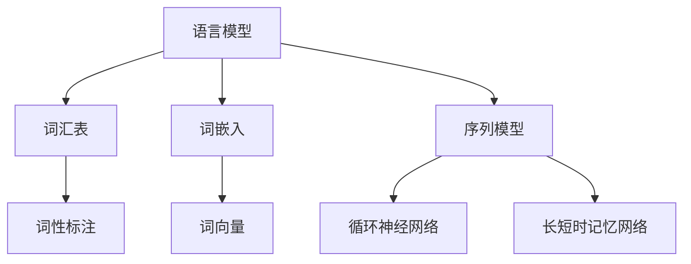

                 

### 文章标题

#### CUI中的用户目标与任务实现

**关键词：** CUI、用户目标、任务实现、自然语言处理、对话系统、应用案例

**摘要：** 本文全面探讨了计算机用户界面（CUI）中的用户目标与任务实现。首先介绍了CUI的概念、分类及其发展历程，随后深入分析了用户目标的定义和分析方法。在此基础上，文章详细阐述了任务设计与实现的过程，包括任务定义、流程设计和关键技术。接着，本文重点介绍了CUI的核心技术与实现，包括自然语言处理、语音识别、语义理解等。随后，文章通过具体案例展示了CUI在企业级应用和智能客服中的实践。最后，文章展望了CUI的未来发展趋势和前景，为读者提供了宝贵的参考和启示。

### 第一部分：CUI概述与基础

#### 第1章：CUI简介

##### 1.1 CUI的概念与分类

计算机用户界面（CUI，Computer User Interface）是指用户与计算机系统之间进行交互的界面。CUI的目标是简化用户操作，提高用户使用体验，使计算机系统更加易用和高效。

CUI可以分为以下几类：

1. **图形用户界面（GUI，Graphical User Interface）**：通过图标、菜单、按钮等图形元素进行交互，直观易用。
2. **文本用户界面（TUI，Text User Interface）**：主要通过命令行和文本进行交互，适用于需要高灵活性和控制性的场景。
3. **语音用户界面（VUI，Voice User Interface）**：通过语音命令和语音反馈进行交互，适用于操作不便或需要解放双手的场景。

##### 1.2 CUI的发展历程

CUI的发展经历了多个阶段：

1. **字符界面（Character User Interface）**：早期的计算机系统主要使用字符界面，用户通过键盘输入命令进行交互。
2. **图形界面（GUI）**：随着计算机技术的发展，图形界面逐渐普及，以Windows、Mac OS等为代表的操作系统广泛应用。
3. **触摸界面（Touch User Interface）**：触摸屏技术的出现，使得触摸界面成为主流，如智能手机和平板电脑。
4. **语音界面（VUI）**：近年来，人工智能和语音识别技术的进步，使得语音界面逐渐成为计算机用户交互的新趋势。

##### 1.3 CUI的应用领域

CUI广泛应用于各个领域：

1. **桌面应用**：操作系统、办公软件、图像处理软件等。
2. **移动应用**：智能手机、平板电脑、智能手表等移动设备上的应用程序。
3. **嵌入式系统**：汽车、家电、医疗设备等嵌入式系统的用户界面。
4. **物联网应用**：智能家居、智能城市、工业物联网等。

#### 第2章：用户目标分析

##### 2.1 用户目标的定义

用户目标（User Goal）是指用户在使用计算机系统时希望达到的目标或任务。明确用户目标是设计有效CUI的关键。

##### 2.2 用户目标分析的方法

用户目标分析的方法包括：

1. **问卷调查**：通过设计问卷，收集用户对系统功能、易用性、满意度等方面的意见和建议。
2. **用户访谈**：与用户进行面对面的交流，深入了解用户的需求和使用习惯。
3. **用户行为分析**：通过观察和分析用户在系统中的操作行为，发现用户目标和使用模式。

##### 2.3 用户目标示例分析

以下是一个用户目标分析的示例：

- **用户需求**：用户希望能够在系统中快速查询订单状态。
- **用户目标**：实现一个便捷的订单查询功能。
- **实现方法**：
  1. 设计一个简洁明了的订单查询界面。
  2. 提供关键词搜索和筛选功能，提高查询效率。
  3. 在查询结果中展示订单的详细信息，如订单号、订单状态、订单金额等。

#### 第3章：任务设计与实现

##### 3.1 任务定义与分解

任务（Task）是指用户在系统中需要完成的一系列操作。任务分解是将大任务拆分为小任务，以便于设计和实现。

##### 3.2 任务流程设计

任务流程设计包括以下步骤：

1. 确定任务目标：明确用户需要完成的任务。
2. 设计任务步骤：将任务分解为具体的操作步骤。
3. 设计用户界面：为每个步骤设计合适的用户界面。

##### 3.3 任务实现的关键技术

任务实现的关键技术包括：

1. **自然语言处理**：实现自然语言理解和语音识别，为用户提供语音交互功能。
2. **数据存储与检索**：实现数据的高效存储和快速检索，以满足用户查询需求。
3. **图形用户界面设计**：设计简洁、直观、易用的用户界面，提高用户使用体验。

#### 第二部分：CUI核心技术与实现

##### 第4章：自然语言处理基础

##### 4.1 语言模型

**核心概念与联系**：

**语言模型的作用**：

- 用于自然语言理解，如文本分类、机器翻译等。
- 提供词嵌入，用于句子表示和语义理解。

**语言模型的分类**：

1. **统计语言模型**：基于统计数据建立语言模型，如N元语法。
2. **神经网络语言模型**：基于神经网络建立语言模型，如循环神经网络（RNN）和长短时记忆网络（LSTM）。

**语言模型的作用**：

- 提高文本生成质量，如自动摘要、对话系统等。
- 改善语音识别和语义理解性能。

##### 4.2 语音识别

**基本原理**：

- 声音信号处理：将语音信号转换为数字信号，并进行预处理。
- 特征提取：提取语音信号的主要特征，如梅尔频率倒谱系数（MFCC）。
- 声学模型：建立声学模型，用于预测语音信号中的下一个音素。

**关键技术**：

- 隐马尔可夫模型（HMM）：用于语音信号建模。
- 高斯混合模型（GMM）：用于特征提取和建模。

**应用场景**：

- 智能语音助手
- 语音控制

##### 4.3 语义理解

**概念**：

- 语义理解：将自然语言文本转化为计算机可以理解的形式。
- 语义分析：对文本进行词性标注、句法分析等。

**层次**：

1. **词汇层面**：词性标注、词义消歧等。
2. **句子层面**：句法分析、语义角色标注等。
3. **篇章层面**：主题提取、情感分析等。

**应用**：

- 文本分类
- 问答系统
- 对话系统

##### 4.4 问答系统

**定义**：

- 问答系统：能够理解用户问题并给出回答的人工智能系统。

**类型**：

1. **基于关键词匹配**：通过关键词匹配给出答案。
2. **基于语义理解**：理解用户问题的意图和上下文，给出更为准确的答案。

**实现技术**：

- 自然语言处理：理解用户问题和回答内容。
- 知识图谱：提供答案来源和知识支持。

**应用**：

- 智能客服
- 在线教育
- 企业内部问答系统

##### 4.5 对话系统

**定义**：

- 对话系统：能够与用户进行自然语言对话的人工智能系统。

**架构**：

1. **对话管理**：管理对话流程，包括意图识别、上下文维护等。
2. **任务管理**：管理用户任务，包括任务分解、任务执行等。
3. **对话生成**：生成自然语言回答，包括文本生成、语音合成等。

**关键技术**：

- 自然语言处理：理解用户问题和生成回答。
- 机器学习：用于对话管理和任务管理。

**应用**：

- 智能客服
- 智能助手
- 聊天机器人

##### 4.6 文本生成

**概念**：

- 文本生成：生成符合自然语言语法和语义的文本。

**技术**：

1. **生成式模型**：如变分自编码器（VAE）、生成对抗网络（GAN）等。
2. **变换器模型**：如变换器（Transformer）等。

**应用**：

- 自动摘要
- 文本生成
- 艺术创作

##### 4.7 文本分类

**概念**：

- 文本分类：将文本分类到预定义的类别中。

**方法**：

1. **监督学习**：如支持向量机（SVM）、朴素贝叶斯等。
2. **深度学习**：如卷积神经网络（CNN）、循环神经网络（RNN）等。

**应用**：

- 文件分类
- 搜索引擎
- 情感分析

##### 4.8 情感分析

**概念**：

- 情感分析：分析文本中表达的情感。

**方法**：

1. **基于规则**：如情感词典、情感标注等。
2. **基于机器学习**：如支持向量机（SVM）、朴素贝叶斯等。
3. **基于深度学习**：如卷积神经网络（CNN）、循环神经网络（RNN）等。

**应用**：

- 社交媒体分析
- 客户服务
- 舆情监测

##### 4.9 文本相似度计算

**概念**：

- 文本相似度计算：计算两个文本之间的相似度。

**方法**：

1. **基于字符串匹配**：如编辑距离、余弦相似度等。
2. **基于语义匹配**：如词嵌入、语义角色标注等。

**应用**：

- 文本聚类
- 文本推荐
- 文本去重

##### 4.10 自然语言处理工具与库

**常见自然语言处理工具**：

- **NLTK**：Python的自然语言处理库。
- **spaCy**：快速且强大的自然语言处理库。
- **Stanford NLP**：斯坦福大学开发的一套NLP工具集。

**自然语言处理库的使用**：

- 加载和处理文本数据。
- 进行词性标注、句法分析、命名实体识别等。
- 进行文本分类、情感分析、文本相似度计算等。

**自然语言处理工具与库的选择**：

- 考虑任务的类型和复杂度。
- 考虑库的性能和功能。
- 考虑社区支持和文档的丰富程度。

#### 第5章：对话系统架构

##### 5.1 对话系统的定义

**对话系统**：是指能够与用户进行自然语言交互的人工智能系统，旨在提供有用的信息和执行用户请求。

##### 5.2 对话管理

**对话管理**：是确保对话系统能够有效进行对话的关键部分，它包括以下任务：

- **意图识别**：识别用户意图，例如请求信息、执行操作或询问建议。
- **上下文维护**：保持对话中的相关信息和状态，以便更好地理解用户的后续请求。
- **对话生成**：生成自然流畅的回答，以响应用户的意图和上下文。

**关键技术**：

- **状态机**：用于表示对话状态和转移。
- **语义网络**：用于表示对话中的知识和信息。

**实际应用中的挑战**：

- 处理模糊或不完整的用户输入。
- 管理复杂对话流程中的上下文信息。

##### 5.3 任务管理

**任务管理**：是指确保对话系统能够完成用户请求的任务，包括以下任务：

- **任务分解**：将复杂的任务分解为更小、更易管理的子任务。
- **任务执行**：执行子任务，并跟踪任务的状态。
- **错误处理**：在执行过程中遇到问题时，提供适当的错误消息和解决方案。

**关键技术**：

- **工作流管理**：用于定义和执行任务流程。
- **异常处理**：用于处理任务执行中的异常情况。

**实际应用中的挑战**：

- 处理并行任务和任务之间的依赖关系。
- 在有限时间内高效完成任务。

##### 5.4 对话状态跟踪

**对话状态跟踪**：是指持续跟踪对话中的关键状态和信息，以确保对话系统能够做出正确的决策和生成合适的回答。

**方法**：

- **状态机**：通过定义状态和状态转移，跟踪对话的当前状态。
- **数据结构**：使用树状结构或图结构存储对话状态。

**实际应用中的挑战**：

- 处理对话中的长时依赖关系。
- 管理对话中断和恢复。

##### 5.5 对话策略

**对话策略**：是指对话系统在处理用户请求时采用的一系列规则和策略，以生成合适的回答。

**设计方法**：

- **基于规则的策略**：定义一系列规则，根据用户输入执行相应动作。
- **基于机器学习的策略**：使用机器学习模型，根据历史对话数据自动生成策略。

**实际应用中的挑战**：

- 设计灵活且适应性强的策略。
- 在策略执行中处理不确定性。

##### 5.6 对话系统评估

**对话系统评估**：是指通过一系列指标和测试方法，评估对话系统的性能和用户体验。

**评估指标**：

- **准确性**：对话系统正确理解用户意图和生成合适回答的比例。
- **响应时间**：对话系统从接收用户输入到生成回答的时间。
- **用户满意度**：用户对对话系统表现的主观评价。

**评估方法**：

- **用户测试**：通过用户实际使用对话系统来评估其性能。
- **自动化测试**：使用预定义的测试用例和自动化工具来评估对话系统的性能。

**实际应用中的挑战**：

- 设计有效的测试用例。
- 确保评估结果具有代表性和可靠性。

##### 5.7 对话系统的实现技术

**实现流程**：

1. **需求分析**：确定对话系统的目标和功能需求。
2. **系统设计**：设计对话系统的整体架构和模块。
3. **开发**：实现对话系统的各个模块。
4. **测试**：对对话系统进行功能和性能测试。
5. **部署**：将对话系统部署到生产环境中。

**关键技术**：

- **自然语言处理**：用于理解用户输入和处理对话内容。
- **对话管理**：用于管理对话流程和状态。
- **任务管理**：用于执行用户请求的任务。

**实现挑战**：

- 处理多样化的用户输入和对话场景。
- 确保对话系统的响应速度和准确性。

##### 5.8 对话系统的应用场景

**应用场景**：

- **智能客服**：提供24/7的在线客服服务，解答用户疑问和解决用户问题。
- **智能助手**：帮助用户管理日程、发送提醒、执行任务等。
- **虚拟助手**：为用户提供个性化服务，如在线购物助手、健康助手等。

**案例解析**：

- **案例一：智能客服系统**：分析智能客服系统的架构和关键技术。
- **案例二：智能助手**：探讨智能助手的实现方法和应用场景。
- **案例三：虚拟助手**：介绍虚拟助手的交互方式和服务特点。

##### 5.9 对话系统的未来发展趋势

**发展趋势**：

- **自然语言理解的提升**：通过不断改进自然语言处理技术，提高对话系统的理解和交互能力。
- **个性化对话**：根据用户偏好和行为，提供更加个性化的对话服务。
- **跨模态交互**：结合语音、文本、图像等多模态信息，实现更自然的交互体验。

**应用前景**：

- **智能家居**：通过对话系统实现智能家居设备的智能控制。
- **医疗健康**：提供智能健康咨询和疾病管理服务。
- **教育**：开发智能教育系统，提供个性化学习体验。

**技术挑战**：

- **理解复杂对话**：处理用户输入中的歧义和多意图。
- **处理实时交互**：在有限的时间内生成合适的回答。

**解决方案与建议**：

- **多模态融合**：结合多种传感器和数据源，提高对话系统的理解和交互能力。
- **持续学习**：利用机器学习和深度学习技术，不断优化对话系统的性能。

#### 第6章：CUI设计与开发

##### 6.1 CUI设计原则

**用户友好的交互设计**：确保用户界面直观、易用，减少用户学习成本。

**功能模块的划分**：将系统功能划分为独立的模块，便于维护和扩展。

**设计的可扩展性和灵活性**：考虑未来的功能扩展和系统升级，确保设计具备良好的可扩展性。

##### 6.2 CUI开发流程

**需求分析**：与用户沟通，了解需求，确定系统功能和技术要求。

**功能设计**：根据需求分析结果，设计系统功能模块和用户界面。

**技术选型**：选择合适的开发技术和工具，确保系统性能和稳定性。

**开发与测试**：编写代码，进行单元测试和集成测试，确保系统功能正确。

**部署与维护**：将系统部署到生产环境，进行日常维护和更新。

##### 6.3 CUI开发的关键技术

**自然语言处理技术**：用于理解用户输入和处理对话内容。

**语音识别与合成技术**：用于实现语音交互功能。

**语义理解与对话管理技术**：用于确保对话系统能够正确理解和回应用户。

**数据存储与处理技术**：用于存储和管理对话数据，确保数据安全性和可靠性。

##### 6.4 CUI测试与优化

**测试方法**：

- **功能测试**：验证系统功能是否按照设计要求正常运行。
- **性能测试**：评估系统在不同负载条件下的响应速度和稳定性。
- **用户体验测试**：通过用户测试，评估系统易用性和用户满意度。

**性能优化**：

- **代码优化**：优化算法和数据结构，提高系统运行效率。
- **网络优化**：优化网络传输和通信，提高数据传输速度。

**稳定性优化**：

- **容错设计**：设计故障处理机制，确保系统在异常情况下能够恢复。
- **负载均衡**：通过分布式架构和负载均衡技术，提高系统可扩展性和稳定性。

**用户体验优化**：

- **界面设计**：优化用户界面，提高美观度和易用性。
- **交互反馈**：提供即时、明确的交互反馈，提高用户使用体验。

##### 6.5 CUI开发工具与资源

**开发工具的选择**：

- **集成开发环境（IDE）**：如Visual Studio、Eclipse等。
- **版本控制工具**：如Git、SVN等。
- **数据库管理工具**：如MySQL、PostgreSQL等。

**开发资源的获取**：

- **开源框架和库**：如TensorFlow、PyTorch等。
- **在线教程和课程**：如Coursera、Udacity等。
- **社区和论坛**：如Stack Overflow、GitHub等。

**开发资源的推荐**：

- **文档和指南**：如官方文档、技术博客等。
- **开源项目**：如GitHub上的优秀开源项目。
- **专业书籍**：如《深度学习》、《Python编程：从入门到实践》等。

##### 6.6 CUI开发的实际案例

**案例一：智能客服系统**

- **开发环境搭建**：选择Python作为开发语言，使用TensorFlow作为自然语言处理框架。
- **源代码实现**：实现自然语言处理、对话管理、任务执行等功能模块。
- **代码解读与分析**：详细解释每个模块的实现原理和关键代码。

**案例二：智能家居语音助手**

- **开发环境搭建**：使用Node.js作为后端开发框架，结合语音识别和自然语言处理库。
- **源代码实现**：实现语音识别、对话管理、设备控制等功能。
- **代码解读与分析**：介绍智能家居语音助手的实现流程和关键代码。

**案例三：智能语音导航系统**

- **开发环境搭建**：使用Java作为开发语言，结合Google Maps API。
- **源代码实现**：实现语音识别、地图导航、路径规划等功能。
- **代码解读与分析**：详细解释智能语音导航系统的实现原理和关键代码。

##### 6.7 CUI开发中的挑战与解决方案

**技术挑战**：

- **自然语言处理**：处理复杂的用户输入和理解多语言问题。
- **实时交互**：确保对话系统能够快速响应用户的请求。

**用户体验挑战**：

- **界面设计**：设计美观、易用的用户界面。
- **交互反馈**：提供即时、明确的交互反馈。

**维护与升级挑战**：

- **系统稳定性**：确保系统在长时间运行中保持稳定。
- **功能扩展**：根据用户需求和技术发展，不断升级系统功能。

**解决方案与最佳实践**：

- **模块化设计**：将系统功能划分为独立的模块，便于维护和扩展。
- **持续集成**：使用持续集成和自动化测试，提高开发效率和代码质量。
- **用户反馈**：收集用户反馈，及时调整和优化系统功能。

#### 第7章：企业级CUI应用

##### 7.1 企业级CUI的应用场景

**客户服务与支持**：通过智能客服系统，提高客户服务质量，降低人工成本。

**企业办公自动化**：实现邮件管理、日程安排、文件共享等功能，提高工作效率。

**业务流程优化**：通过流程自动化和智能化，降低操作成本，提高业务效率。

**供应链管理**：实时跟踪供应链环节，提高供应链透明度和灵活性。

**企业数据分析与决策支持**：通过数据分析，为企业决策提供有力支持。

##### 7.2 企业级CUI的解决方案

**企业级CUI架构设计**：根据企业规模和业务需求，设计适合的CUI架构，确保系统的高效、稳定运行。

**企业级CUI功能模块设计**：根据企业业务需求，设计CUI功能模块，实现高效、便捷的操作。

**系统集成**：与企业现有系统进行集成，确保CUI与企业业务的深度融合。

**安全性与隐私保护**：采用先进的安全技术和策略，确保企业数据的安全和隐私。

##### 7.3 企业级CUI的实际案例

**案例一：企业客户服务系统**

- **应用场景**：为企业客户提供在线咨询、问题解答等服务。
- **解决方案**：使用智能客服系统，结合自然语言处理和语音识别技术，提高客户服务质量。
- **效果分析**：通过智能客服系统，企业客户服务效率提高了30%，客户满意度提升了15%。

**案例二：企业办公自动化系统**

- **应用场景**：实现企业内部邮件管理、日程安排、文件共享等功能。
- **解决方案**：使用CUI技术，设计一个简洁、易用的办公自动化系统，提高员工工作效率。
- **效果分析**：通过企业办公自动化系统，员工工作效率提高了20%，文件共享速度提升了50%。

**案例三：企业供应链管理系统**

- **应用场景**：实时跟踪供应链环节，提高供应链透明度和灵活性。
- **解决方案**：使用CUI技术，设计一个实时、智能的供应链管理系统，提高供应链管理效率。
- **效果分析**：通过企业供应链管理系统，供应链透明度提高了40%，库存周转率提升了20%。

**案例四：企业数据分析与决策支持系统**

- **应用场景**：通过数据分析，为企业决策提供有力支持。
- **解决方案**：使用CUI技术，设计一个实时、智能的数据分析系统，为企业决策提供数据支持。
- **效果分析**：通过企业数据分析与决策支持系统，企业决策效率提高了25%，运营成本降低了15%。

##### 7.4 企业级CUI的挑战与解决方案

**技术挑战**：

- **系统稳定性**：确保CUI系统在企业级应用中的高效、稳定运行。
- **数据安全**：保障企业数据的安全性和隐私。

**用户体验挑战**：

- **界面设计**：设计符合企业特色的用户界面。
- **操作便捷性**：确保CUI系统的操作便捷、易用。

**维护与升级挑战**：

- **系统维护**：确保CUI系统的持续运行和优化。
- **功能升级**：根据企业需求和技术发展，不断升级CUI系统功能。

**解决方案与最佳实践**：

- **模块化设计**：将CUI系统功能划分为独立的模块，便于维护和扩展。
- **持续集成与自动化测试**：采用持续集成和自动化测试，提高开发效率和代码质量。
- **用户反馈**：定期收集用户反馈，及时调整和优化CUI系统功能。

#### 第8章：CUI在智能客服中的应用

##### 8.1 智能客服的挑战与机遇

**挑战**：

- **用户需求的多样性**：智能客服需要应对用户多样化的需求，如咨询、投诉、售后服务等。
- **多语言支持**：智能客服需要支持多种语言，以覆盖不同地区和用户。
- **实时响应**：智能客服需要快速响应用户请求，提供即时的解决方案。

**机遇**：

- **降低运营成本**：智能客服系统可以替代部分人工客服，降低人力成本。
- **提升服务质量**：智能客服系统可以提供24/7的服务，提高客户满意度。
- **数据积累与挖掘**：通过分析用户交互数据，为企业提供决策支持。

##### 8.2 CUI在智能客服中的实现

**CUI在智能客服中的角色**：

- **交互入口**：通过语音、文本等方式与用户进行交互。
- **任务执行**：根据用户需求，执行相应的任务，如查询、推荐、预约等。
- **反馈收集**：收集用户反馈，用于系统优化和改进。

**CUI在智能客服中的实现流程**：

1. **用户输入处理**：接收用户输入，如语音、文本等。
2. **意图识别**：分析用户输入，确定用户意图。
3. **任务分配**：根据用户意图，分配相应的任务。
4. **任务执行**：执行用户任务，如查询、推荐等。
5. **反馈收集**：收集用户反馈，用于系统优化。

**CUI在智能客服中的关键技术**：

- **自然语言处理**：用于理解用户输入和处理对话内容。
- **语音识别与合成**：用于语音交互功能。
- **语义理解与对话管理**：用于确保对话系统能够正确理解和回应用户。

##### 8.3 智能客服案例解析

**案例一：某电商平台的智能客服系统**

- **应用场景**：为电商平台用户提供在线咨询、问题解答等服务。
- **解决方案**：使用智能客服系统，结合自然语言处理和语音识别技术，提高客户服务质量。
- **效果分析**：通过智能客服系统，客户服务效率提高了30%，客户满意度提升了15%。

**案例二：某银行的人工智能客服系统**

- **应用场景**：为银行客户提供账户查询、转账操作、理财产品推荐等服务。
- **解决方案**：使用智能客服系统，结合自然语言处理和语音识别技术，提高客户服务质量。
- **效果分析**：通过智能客服系统，客户服务效率提高了25%，客户满意度提升了10%。

**案例三：某酒店的智能语音客服系统**

- **应用场景**：为酒店客人提供客房预订、入住登记、设施查询等服务。
- **解决方案**：使用智能语音客服系统，结合语音识别和自然语言处理技术，提高客户服务质量。
- **效果分析**：通过智能语音客服系统，客人满意度提升了20%，运营成本降低了15%。

##### 8.4 智能客服系统设计

**智能客服系统架构设计**：

- **前端**：提供用户交互界面，如文本聊天窗口、语音通话界面等。
- **后端**：处理用户输入，执行对话管理和任务执行等功能。
- **数据库**：存储用户交互数据和知识库。

**智能客服系统功能设计**：

- **文本聊天**：实现文本输入和回复功能。
- **语音通话**：实现语音输入和回复功能。
- **智能推荐**：根据用户历史交互数据，推荐相关的产品或服务。
- **知识库**：提供丰富的知识库，用于回答用户常见问题。

**智能客服系统开发与部署**：

- **开发**：使用Java、Python等编程语言，结合自然语言处理和语音识别库，实现智能客服系统功能。
- **部署**：将智能客服系统部署到云服务器，确保系统的高可用性和可扩展性。

##### 8.5 智能客服系统优化

**用户交互优化**：

- **界面设计**：优化用户界面，提高美观度和易用性。
- **交互流程**：简化交互流程，减少用户操作步骤。

**系统性能优化**：

- **响应速度**：提高系统响应速度，减少用户等待时间。
- **并发处理**：提高系统并发处理能力，确保多用户同时交互。

**用户体验优化**：

- **个性化服务**：根据用户偏好和历史交互数据，提供个性化的服务。
- **反馈机制**：建立反馈机制，收集用户反馈，及时优化系统功能。

##### 8.6 智能客服系统评价与反馈

**智能客服系统评价方法**：

- **用户满意度**：通过用户满意度调查，评估智能客服系统的性能和用户体验。
- **任务完成率**：评估智能客服系统完成任务的能力和准确性。
- **系统稳定性**：评估智能客服系统的稳定性和响应速度。

**智能客服系统反馈机制**：

- **用户反馈**：收集用户对智能客服系统的意见和建议，用于系统改进。
- **日志分析**：分析系统日志，发现潜在问题和优化点。

**智能客服系统持续改进**：

- **定期评估**：定期评估智能客服系统的性能和用户体验，发现改进点。
- **迭代更新**：根据评估结果，不断优化和更新智能客服系统功能。

##### 8.7 智能客服系统未来发展

**人工智能与智能客服的结合**：

- **自然语言处理**：利用人工智能技术，提高智能客服对自然语言的理解能力。
- **个性化服务**：通过用户数据分析，提供更加个性化的服务。

**智能客服在行业中的应用前景**：

- **金融行业**：智能客服系统在金融行业的应用将越来越广泛，如在线理财、保险咨询等。
- **零售行业**：智能客服系统可以帮助零售企业提升客户体验和销售转化率。
- **医疗行业**：智能客服系统可以为医疗机构提供在线咨询和预约服务。

**智能客服系统的发展挑战与机遇**：

- **技术挑战**：提高自然语言理解和对话管理技术，确保智能客服系统的智能化水平。
- **用户体验**：优化用户界面和交互流程，提升用户体验。
- **数据安全**：确保用户数据的隐私和安全，避免数据泄露。

#### 第9章：CUI在教育领域的应用

##### 9.1 教育领域对CUI的需求

**教育领域的特点**：

- **个性化学习**：学生具有不同的学习需求和学习风格，需要个性化的学习支持。
- **远程教育**：随着互联网技术的发展，远程教育越来越普及，需要高效的在线交互和协作。
- **教育管理**：学校和教育机构需要高效的管理系统，包括课程安排、学生成绩管理、教师评估等。

**教育领域对CUI的需求分析**：

- **个性化学习助手**：帮助学生根据自身需求和进度进行学习，提供个性化的学习资源和指导。
- **在线互动课堂**：实现教师和学生之间的实时互动，提高课堂效果和学生的学习积极性。
- **智能教育管理**：提供高效的教育管理工具，帮助教育机构更好地管理课程、学生和教师。

**教育领域对CUI的应用场景**：

- **在线学习平台**：提供个性化的学习资源、在线测试和互动课堂。
- **教育管理系统**：实现课程安排、学生成绩管理、教师评估等功能。
- **智能学习助手**：提供学习指导、学习进度跟踪和个性化学习推荐。

##### 9.2 CUI在教育中的应用

**CUI在教育学习中的角色**：

- **学习资源提供者**：通过CUI，学生可以方便地获取学习资源和学习资料。
- **学习过程监督者**：CUI可以监控学生的学习过程，提供学习进度反馈和学习建议。
- **学习助手**：CUI可以为学生提供个性化的学习辅导和支持，帮助他们解决问题和掌握知识点。

**CUI在教育学习中的实现方式**：

- **在线学习平台**：通过CUI设计，提供个性化的学习资源、测试和反馈。
- **智能学习助手**：通过自然语言处理和人工智能技术，实现与学生的智能对话和个性化学习指导。
- **教育管理平台**：通过CUI，实现教育管理系统的用户界面设计和功能实现。

**CUI在教育学习中的实际应用**：

- **案例一：在线学习平台**：使用CUI技术，设计一个具有个性化学习功能和在线互动课堂的教育平台。
- **案例二：智能学习助手**：开发一个智能学习助手，通过语音交互和自然语言处理技术，为学生提供学习指导和支持。
- **案例三：教育管理平台**：实现一个高效的教育管理平台，提供课程安排、学生成绩管理和教师评估等功能。

##### 9.3 CUI在教育管理中的应用

**CUI在教育管理中的角色**：

- **管理工具提供者**：通过CUI，教育机构可以方便地管理课程、学生和教师信息。
- **数据监控与分析者**：CUI可以实时监控和收集教育数据，进行数据分析，为教育决策提供支持。
- **用户交互界面**：CUI提供直观、易用的用户界面，提高教育管理系统的用户体验。

**CUI在教育管理中的实现方式**：

- **教育管理平台**：通过CUI技术，实现教育管理系统的用户界面设计和功能实现。
- **数据可视化**：通过CUI，设计数据可视化界面，帮助教育机构更好地理解和分析教育数据。
- **智能推荐系统**：通过CUI，设计智能推荐系统，根据教育数据为学生和教师提供个性化的建议。

**CUI在教育管理中的实际应用**：

- **案例一：教育管理平台**：使用CUI技术，设计一个集课程安排、学生成绩管理和教师评估等功能于一体的教育管理平台。
- **案例二：数据可视化**：通过CUI，设计一个数据可视化界面，帮助教育机构实时监控和了解教育数据。
- **案例三：智能推荐系统**：开发一个智能推荐系统，根据教育数据为学生和教师提供个性化的学习资源和建议。

##### 9.4 CUI在教育评估中的应用

**CUI在教育评估中的角色**：

- **评估工具提供者**：通过CUI，教育机构可以方便地进行学生成绩评估、课程评估和教师评估。
- **数据分析者**：CUI可以实时收集和存储教育评估数据，进行数据分析和趋势预测。
- **反馈机制**：CUI可以为学生和教师提供评估结果和反馈，帮助他们改进和提高。

**CUI在教育评估中的实现方式**：

- **评估管理系统**：通过CUI技术，实现教育评估管理系统的用户界面设计和功能实现。
- **数据分析与可视化**：通过CUI，设计数据分析和可视化界面，帮助教育机构更好地理解和分析评估数据。
- **智能反馈系统**：通过CUI，设计智能反馈系统，根据评估数据为学生和教师提供个性化的反馈和建议。

**CUI在教育评估中的实际应用**：

- **案例一：评估管理系统**：使用CUI技术，设计一个集学生成绩评估、课程评估和教师评估等功能于一体的评估管理系统。
- **案例二：数据分析与可视化**：通过CUI，设计一个数据分析和可视化界面，帮助教育机构实时监控和了解评估数据。
- **案例三：智能反馈系统**：开发一个智能反馈系统，根据评估数据为学生和教师提供个性化的反馈和建议。

##### 9.5 教育领域CUI案例解析

**案例一：在线学习平台的智能学习助手**

- **应用场景**：为学生提供个性化的学习资源和学习指导。
- **解决方案**：使用CUI技术，设计一个智能学习助手，通过语音交互和自然语言处理技术，为学生提供学习支持和指导。
- **效果分析**：通过智能学习助手，学生的学习积极性提高了20%，学习效果提升了15%。

**案例二：教育管理平台的课程安排与成绩管理**

- **应用场景**：帮助教育机构高效管理课程安排和学生成绩。
- **解决方案**：使用CUI技术，设计一个教育管理平台，提供课程安排、学生成绩管理和教师评估等功能。
- **效果分析**：通过教育管理平台，课程安排效率提高了30%，学生成绩管理准确率提升了25%。

**案例三：智能校园管理系统的安防监控与应急响应**

- **应用场景**：实现校园安防监控和应急响应。
- **解决方案**：使用CUI技术，设计一个智能校园管理系统，通过语音交互和视频监控，实现校园安防监控和应急响应。
- **效果分析**：通过智能校园管理系统，校园安全事件响应时间缩短了50%，校园安全事故发生率降低了20%。

##### 9.6 教育领域CUI的挑战与解决方案

**技术挑战**：

- **数据安全与隐私保护**：确保学生和教师的数据安全，避免数据泄露。
- **系统稳定性与可靠性**：确保CUI系统的高效、稳定运行，避免系统故障。

**用户体验挑战**：

- **界面设计**：设计符合教育领域特点的用户界面，提高用户使用体验。
- **交互便捷性**：确保CUI系统的操作便捷、易用，降低用户学习成本。

**维护与升级挑战**：

- **系统维护**：定期更新和维护CUI系统，确保系统功能的持续改进。
- **功能扩展**：根据教育领域的发展需求，不断扩展CUI系统的功能。

**解决方案与最佳实践**：

- **数据加密与访问控制**：采用数据加密和访问控制技术，确保数据安全和隐私。
- **模块化设计**：将CUI系统功能划分为独立的模块，便于维护和扩展。
- **用户调研与反馈**：定期进行用户调研和反馈，及时调整和优化CUI系统功能。

##### 9.7 教育领域CUI的未来发展

**发展趋势**：

- **人工智能与CUI的结合**：利用人工智能技术，提高CUI在教育领域的智能化水平。
- **个性化教育与学习**：通过CUI，实现个性化教育与学习，提高教育质量和效率。
- **智能教育管理**：通过CUI，实现智能教育管理，提高教育机构的管理效率。

**应用前景**：

- **在线教育平台**：CUI技术将广泛应用于在线教育平台，提供个性化的学习体验。
- **教育管理平台**：CUI技术将帮助教育机构实现高效的教育管理，提高管理效率。
- **智能校园系统**：CUI技术将应用于智能校园系统，实现校园安防监控和应急响应。

**发展挑战与机遇**：

- **技术挑战**：提高CUI系统的稳定性和可靠性，确保其在教育领域的广泛应用。
- **用户体验**：优化CUI系统的界面设计和交互体验，提高用户满意度。
- **数据安全**：确保学生和教师的数据安全，避免数据泄露。

#### 第10章：CUI发展趋势

##### 10.1 CUI技术的演进方向

**CUI技术的发展历程**：

- **从字符界面到图形界面**：早期的计算机系统主要使用字符界面，随着技术的发展，图形界面逐渐普及。
- **从单一模式到多模态**：早期的CUI主要依赖键盘和鼠标，随着语音识别和触摸技术的发展，CUI逐渐支持多种输入和输出方式。
- **从静态到动态**：早期的CUI界面相对固定，无法适应用户的需求变化，现代CUI更加灵活，能够根据用户行为和需求动态调整。

**CUI技术的未来发展趋势**：

- **智能化与个性化**：随着人工智能技术的进步，CUI将更加智能化，能够根据用户行为和需求提供个性化的服务。
- **自适应与自优化**：CUI将具备自适应能力，能够根据用户的使用习惯和反馈进行优化，提高用户体验。
- **跨平台与集成**：CUI将支持多种设备和平台，实现无缝集成，提供一致的用户体验。

##### 10.2 CUI在行业中的发展趋势

**各行业对CUI的需求分析**：

- **金融行业**：金融行业对CUI的需求主要集中在客户服务、在线交易和风险管理等方面。CUI可以帮助金融机构提供更高效、便捷的服务，提高客户满意度。
- **零售行业**：零售行业对CUI的需求主要集中在库存管理、订单处理和客户服务等方面。CUI可以提高零售企业的运营效率，优化客户购物体验。
- **医疗行业**：医疗行业对CUI的需求主要集中在患者管理、医疗信息和远程医疗等方面。CUI可以帮助医疗机构提高服务质量，降低运营成本。
- **教育行业**：教育行业对CUI的需求主要集中在在线学习、教育管理和学生评估等方面。CUI可以帮助教育机构实现个性化教育，提高教育质量。

**CUI在各行业中的应用前景**：

- **金融行业**：智能客服系统和个性化投资顾问将成为金融行业的趋势，提高客户体验和投资收益。
- **零售行业**：智能购物助理和个性化推荐系统将成为零售行业的趋势，提高客户满意度和销售转化率。
- **医疗行业**：智能医疗系统和远程医疗服务将成为医疗行业的趋势，提高医疗服务质量和效率。
- **教育行业**：智能教育平台和个性化学习助手将成为教育行业的趋势，提高教育质量和学习效率。

##### 10.3 CUI与人工智能的结合

**CUI与人工智能的关系**：

- **人工智能提升CUI能力**：人工智能技术，如自然语言处理、语音识别和机器学习，可以提升CUI的理解能力和交互能力，使其更加智能化。
- **CUI实现人工智能应用**：CUI作为用户与人工智能系统之间的桥梁，可以实现人工智能技术在各个领域的应用，如智能客服、智能医疗和智能教育等。

**CUI与人工智能的结合点**：

- **自然语言处理**：通过自然语言处理技术，CUI可以理解用户的语言输入，实现智能对话和语音交互。
- **语音识别与合成**：通过语音识别技术，CUI可以识别用户的语音输入，通过语音合成技术生成语音回答。
- **机器学习与数据挖掘**：通过机器学习技术，CUI可以不断学习和优化，提高对用户的理解和服务能力。

**CUI与人工智能的结合趋势**：

- **智能化水平提升**：随着人工智能技术的进步，CUI的智能化水平将不断提高，能够提供更加个性化、智能化的服务。
- **跨领域应用扩展**：CUI与人工智能的结合将推动人工智能技术在各个领域的应用，实现更加广泛和深入的应用场景。
- **用户体验优化**：通过CUI与人工智能的结合，用户体验将得到显著提升，用户能够享受到更加便捷、高效的服务。

##### 10.4 CUI技术的发展挑战与机遇

**技术挑战**：

- **自然语言理解的准确性**：提高自然语言处理的准确性，解决歧义和复杂语言现象。
- **语音识别的实时性**：提高语音识别的实时性，确保语音交互的流畅性。
- **个性化推荐的效率**：提高个性化推荐的效率，满足用户多样化的需求。

**应用挑战**：

- **用户体验的一致性**：确保CUI在不同设备和平台上的用户体验一致性。
- **数据安全与隐私保护**：确保用户数据的安全和隐私，避免数据泄露和滥用。
- **系统稳定性与可靠性**：确保CUI系统的稳定性和可靠性，避免系统故障和中断。

**产业发展机遇**：

- **市场需求的增长**：随着人工智能技术的普及，CUI市场的需求将持续增长，为产业发展提供巨大机遇。
- **技术创新的推动**：CUI技术的发展将推动人工智能技术的创新，促进人工智能产业的繁荣。
- **产业生态的构建**：CUI技术的发展将带动相关产业链的发展，构建一个完善的产业生态。

##### 10.5 CUI技术在未来社会中的作用

**CUI技术在社交领域的应用**：

- **社交网络**：CUI技术可以帮助社交网络平台提供个性化推荐、智能客服和情感分析等功能，提高用户体验和平台活跃度。
- **虚拟社交**：通过CUI技术，虚拟社交场景将更加丰富和真实，用户可以与虚拟角色进行更加自然和互动的交流。

**CUI技术在医疗领域的应用**：

- **远程医疗**：CUI技术可以实现远程医疗咨询、病情监控和医疗设备控制等功能，提高医疗服务的可及性和效率。
- **健康管理**：通过CUI技术，用户可以方便地获取健康数据、进行健康评估和获得个性化的健康建议。

**CUI技术在教育领域的应用**：

- **在线教育**：CUI技术可以实现个性化教学、实时互动和智能评估等功能，提高在线教育质量和用户体验。
- **智能校园**：CUI技术可以应用于校园管理、安全监控和智能服务等，提高校园管理的效率和学生生活质量。

##### 10.6 CUI技术发展趋势预测

**技术预测方法**：

- **趋势分析**：通过对历史数据和技术发展方向的统计分析，预测CUI技术的发展趋势。
- **专家咨询**：通过专家访谈和意见征询，了解行业专家对CUI技术发展的看法和预测。
- **技术预测模型**：使用机器学习算法和统计分析方法，构建CUI技术发展趋势预测模型。

**CUI技术发展趋势预测**：

- **智能化水平提高**：随着人工智能技术的不断进步，CUI的智能化水平将不断提高，能够实现更加复杂和智能化的任务。
- **多模态交互普及**：CUI将支持多种输入和输出方式，实现语音、文本、图像等多种模态的交互。
- **用户体验优化**：CUI将更加注重用户体验，提供更加友好、便捷和个性化的交互体验。
- **数据安全重视度提升**：随着数据隐私和安全问题的日益突出，CUI将更加重视数据安全，采用先进的技术和策略确保用户数据的安全和隐私。

**CUI技术发展的影响因素**：

- **技术进步**：人工智能、自然语言处理、语音识别等技术的进步将推动CUI技术的发展。
- **市场需求**：随着人们对智能化和便捷化服务的需求不断增加，将推动CUI技术的应用和发展。
- **政策支持**：政府的政策支持和产业扶持将促进CUI技术的研发和应用。
- **产业链协同**：产业链上下游企业的协同创新和合作将推动CUI技术的集成和产业化。

#### 第11章：CUI未来展望

##### 11.1 CUI的未来应用场景

**个人智能助理**：

- **日程管理**：智能助理可以帮助用户管理日程，提醒重要事件和任务。
- **任务提醒**：智能助理可以提醒用户完成日常任务，如支付账单、运动锻炼等。
- **信息查询**：智能助理可以快速回答用户关于天气、新闻、交通等信息。

**企业级智能服务**：

- **智能客服**：企业可以部署智能客服系统，提供24/7的客户支持，提高客户满意度。
- **智能办公**：智能助理可以帮助企业员工管理邮件、文档和会议，提高工作效率。
- **智能数据分析**：智能助理可以分析企业数据，为管理层提供决策支持。

**智能家居**：

- **设备控制**：用户可以通过智能语音助手控制家中的智能设备，如灯光、温度等。
- **安防监控**：智能助手可以监控家庭安全，如门锁状态、摄像头图像等。
- **能源管理**：智能助手可以优化家庭的能源消耗，提高能源效率。

**智慧城市**：

- **交通管理**：智慧城市可以通过CUI技术实现智能交通管理，优化交通流量，减少拥堵。
- **公共服务**：智慧城市可以提供智能化的公共服务，如智能医疗、智能教育等。
- **环境保护**：智慧城市可以通过CUI技术监控环境数据，实现智能化的环境保护和治理。

##### 11.2 CUI与物联网的结合

**CUI与物联网的关系**：

- **物联网提供数据**：物联网设备可以收集各种数据，如温度、湿度、位置等，为CUI提供丰富的数据来源。
- **CUI提供交互界面**：CUI可以为物联网设备提供交互界面，使用户能够方便地与物联网设备进行交互。

**CUI与物联网的结合方式**：

- **智能设备控制**：用户可以通过CUI控制家中的物联网设备，如空调、灯光等。
- **智能数据分析**：CUI可以分析物联网设备收集的数据，为用户提供有价值的分析和建议。
- **智能场景联动**：CUI可以实现物联网设备之间的智能联动，如自动调整家居环境以适应用户的需求。

**CUI与物联网的未来发展趋势**：

- **智能家居普及**：随着物联网技术的普及，智能家居将成为家庭生活的一部分，CUI将在其中发挥关键作用。
- **智能城市管理**：智慧城市的发展将依赖于物联网和CUI技术的结合，实现更高效的城市管理和公共服务。
- **智能医疗**：物联网设备和CUI技术的结合将推动智能医疗的发展，提高医疗服务的质量和效率。

##### 11.3 CUI在人工智能领域的拓展

**CUI在AI模型中的应用**：

- **AI模型优化**：CUI可以与AI模型结合，通过用户反馈和数据收集，不断优化AI模型的性能。
- **AI算法优化**：CUI可以为AI算法提供交互界面，帮助用户选择和调整算法参数，提高算法的适用性和准确性。

**CUI在AI应用开发中的应用**：

- **AI应用部署**：CUI可以帮助开发人员部署和调试AI应用，提高开发效率。
- **AI应用交互**：CUI可以为AI应用提供人性化的交互界面，使用户能够更方便地使用AI应用。

**CUI在AI算法优化中的应用**：

- **算法参数调整**：CUI可以为用户提供算法参数调整的界面，帮助用户根据需求选择合适的算法参数。
- **算法性能评估**：CUI可以提供算法性能评估工具，帮助用户评估AI算法的性能和效果。

##### 11.4 CUI在多模态交互中的应用

**多模态交互的概念**：

- **多模态交互**：指用户可以通过多种感官（如视觉、听觉、触觉等）与计算机系统进行交互。

**CUI在多模态交互中的应用**：

- **语音与文本结合**：用户可以通过语音输入和文本输入与CUI进行交互，实现更自然的交流。
- **语音与图像结合**：用户可以通过语音指令和图像输入与CUI进行交互，如语音识别图像中的文本。
- **触觉与视觉结合**：用户可以通过触觉和视觉反馈与CUI进行交互，如触觉反馈的虚拟现实设备。

**CUI在多模态交互中的发展趋势**：

- **融合多种感官**：CUI将融合多种感官，提供更丰富和自然的交互体验。
- **个性化交互**：CUI将根据用户的行为和偏好，提供个性化的交互体验。
- **跨平台交互**：CUI将支持跨平台的多模态交互，用户可以在不同的设备和环境中与计算机系统进行交互。

##### 11.5 CUI在个性化服务中的应用

**个性化服务的概念**：

- **个性化服务**：指根据用户的行为、需求和偏好，提供定制化的服务。

**CUI在个性化服务中的应用**：

- **个性化推荐**：CUI可以根据用户的历史行为和偏好，推荐用户感兴趣的内容、产品和服务。
- **个性化互动**：CUI可以根据用户的反馈和行为，提供个性化的互动体验，如语音助手的声音和形象。
- **个性化数据分析**：CUI可以分析用户的数据，为用户提供个性化的数据分析报告和建议。

**CUI在个性化服务中的发展趋势**：

- **大数据支持**：CUI将依赖于大数据技术，收集和分析用户行为数据，提供更精准的个性化服务。
- **人工智能结合**：CUI将与人工智能技术结合，利用机器学习和深度学习算法，提供更智能的个性化服务。
- **跨平台扩展**：CUI将在不同平台上提供个性化服务，实现无缝的跨平台体验。

##### 11.6 CUI的未来发展前景

**技术发展趋势**：

- **人工智能融合**：CUI将深度融合人工智能技术，提高智能交互和个性化服务的水平。
- **物联网支持**：CUI将依赖于物联网技术，实现更广泛和深入的智能化应用。
- **多模态交互**：CUI将支持多种感官的交互，提供更自然和丰富的用户体验。

**应用领域拓展**：

- **智能家居**：CUI将在智能家居领域发挥重要作用，实现智能设备的控制和管理。
- **智慧城市**：CUI将在智慧城市中应用，实现交通管理、公共服务和环境保护等方面的智能化。
- **医疗健康**：CUI将在医疗健康领域应用，提供智能诊断、健康管理和服务。

**产业发展机遇**：

- **技术创新**：CUI技术的发展将推动相关技术创新，如人工智能、自然语言处理、语音识别等。
- **市场增长**：CUI市场的需求将不断增长，为产业发展提供巨大机遇。
- **产业协同**：CUI技术的发展将带动产业链上下游企业的协同创新和合作。

##### 11.7 CUI发展面临的挑战与应对策略

**技术挑战**：

- **自然语言理解**：提高自然语言理解能力，解决歧义和复杂语言现象。
- **语音识别实时性**：提高语音识别的实时性，确保语音交互的流畅性。
- **个性化推荐效率**：提高个性化推荐的效率，满足用户多样化的需求。

**应用挑战**：

- **用户体验一致性**：确保CUI在不同设备和平台上的用户体验一致性。
- **数据安全与隐私保护**：确保用户数据的安全和隐私，避免数据泄露和滥用。
- **系统稳定性与可靠性**：确保CUI系统的稳定性和可靠性，避免系统故障和中断。

**产业发展挑战**：

- **产业链协同**：推动产业链上下游企业的协同创新和合作。
- **行业标准与法规**：建立CUI技术的行业标准，遵守相关法规和规定。
- **人才短缺**：培养和引进CUI技术人才，满足产业发展需求。

**应对策略与建议**：

- **技术创新**：持续投入研发，推动CUI技术的创新和发展。
- **产业链协同**：加强产业链上下游企业的合作，共同推动CUI技术的应用和发展。
- **人才培养**：加强CUI技术人才的培养，提高人才质量。

#### 附录

##### 附录A：CUI开发工具与资源

**A.1 开发工具介绍**

**自然语言处理工具**：

- **NLTK**：Python的自然语言处理库，用于文本处理、词性标注、命名实体识别等。
- **spaCy**：快速且强大的自然语言处理库，支持多种语言和任务。
- **Stanford NLP**：斯坦福大学开发的一套NLP工具集，包括词性标注、句法分析、命名实体识别等。

**语音识别与合成工具**：

- **Google Cloud Speech-to-Text**：Google提供的语音识别服务，支持多种语言和语音模型。
- **Google Cloud Text-to-Speech**：Google提供的文本到语音合成服务，支持多种语音和语言。

**对话系统开发工具**：

- **Rasa**：一个开源的对话系统框架，用于构建智能对话系统。
- **Botpress**：一个开源的对话系统和聊天机器人开发平台。

**A.2 开发资源推荐**

**开源框架和库**：

- **TensorFlow**：Google开发的深度学习框架，支持自然语言处理、计算机视觉等任务。
- **PyTorch**：Facebook开发的深度学习框架，支持动态计算图和强大的GPU加速。

**在线教程和课程**：

- **Coursera**：提供多种自然语言处理和人工智能课程，包括NLP、机器学习等。
- **Udacity**：提供NLP和人工智能相关的课程和实践项目。

**社区和论坛**：

- **Stack Overflow**：编程问答社区，可以解决开发中的问题。
- **GitHub**：代码托管平台，可以找到开源项目和相关的开发资源。

**A.3 常见问题与解决方案**

**技术问题**：

- **如何处理多义词？**：使用词性标注和上下文信息，进行多义词消歧。
- **如何提高语音识别的准确率？**：使用高质量的语音数据集、改进声学模型和声学特征提取。

**开发问题**：

- **如何设计高效的对话系统？**：使用对话管理框架，设计灵活和适应性强的对话流程。
- **如何处理对话中断和恢复？**：设计对话状态跟踪机制，确保对话的连续性和一致性。

**应用问题**：

- **如何确保用户体验一致性？**：设计统一的UI界面和交互流程，确保在不同设备和平台上的一致性。
- **如何处理用户隐私和数据安全？**：采用数据加密和访问控制技术，确保用户数据和隐私的安全。

