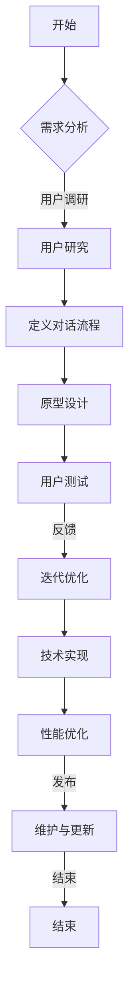
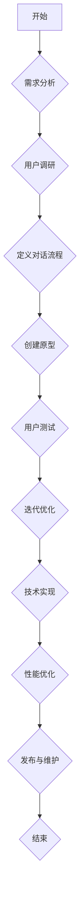

                 

# CUI对信息架构设计的影响

## 概述

CUI（Conversational User Interface，对话式用户界面）和 信息架构设计（Information Architecture，IA）是现代软件开发中两个重要的概念。CUI通过自然语言处理和对话系统技术，使得用户与系统之间的交互更加自然、流畅，类似于人与人之间的对话。而信息架构设计则关注于如何组织、管理和传递信息，以提供更好的用户体验。本文将探讨CUI对信息架构设计的影响，从多个维度进行分析，旨在为读者提供一个全面的了解。

关键词：CUI，信息架构设计，用户体验，交互设计，自然语言处理

### 摘要

本文首先介绍了CUI和 信息架构设计的基本概念，然后探讨了CUI对信息架构设计的影响，包括交互设计、内容设计和模型应用等方面。接着，文章深入分析了CUI设计的基础原理和实战案例，展示了CUI在实际项目中的应用效果。最后，文章总结了CUI设计和未来趋势，探讨了新技术对CUI设计的影响。通过本文的阅读，读者可以全面了解CUI对信息架构设计的深远影响，以及如何在实际项目中有效应用CUI设计。

## 目录大纲

- 引言
  - CUI的概念与背景
  - 信息架构设计概述
- CUI与信息架构的关联
  - CUI对信息架构设计的影响
  - CUI在信息架构中的应用
- CUI设计原理
  - CUI设计基础
  - CUI交互设计
  - CUI内容设计
- CUI在信息架构中的应用
  - 信息架构模型与CUI
  - CUI与信息可视化
  - CUI与搜索引擎优化（SEO）
- CUI设计实战
  - CUI设计案例解析
  - CUI设计与用户体验
  - CUI设计与未来趋势
- 附录
  - CUI设计工具与资源
  - Mermaid流程图示例
  - 伪代码示例
  - 数学模型与公式示例
  - CUI项目实战代码解读

### 引言

在现代软件开发领域，用户体验（User Experience，UX）越来越受到重视。如何设计一个既美观又易用的界面，成为开发者们不断探索的课题。在此背景下，CUI和 信息架构设计应运而生。CUI，即对话式用户界面，是一种通过自然语言处理和对话系统技术实现的用户界面。用户与系统之间的交互，不再是冷冰冰的命令行，而是像与真人对话一样自然流畅。而信息架构设计，则关注于如何组织、管理和传递信息，以确保用户能够快速、准确地找到所需信息。

本文旨在探讨CUI对信息架构设计的影响，帮助读者理解CUI如何改变信息架构的设计方法和原则，以及如何在实际项目中有效应用CUI设计，提升用户体验。文章将从以下几个方面展开：

1. **CUI的概念与背景**：介绍CUI的定义、发展历程和重要性。
2. **信息架构设计概述**：阐述信息架构的基本概念、重要性和设计原则。
3. **CUI与信息架构的关联**：分析CUI对信息架构设计的影响和应用。
4. **CUI设计原理**：探讨CUI设计的基础、交互设计和内容设计。
5. **CUI在信息架构中的应用**：分析CUI在信息架构模型、信息可视化和搜索引擎优化（SEO）中的应用。
6. **CUI设计实战**：通过案例解析、用户体验设计和未来趋势，展示CUI设计的实际效果和前景。
7. **附录**：提供CUI设计工具与资源、流程图示例、伪代码示例、数学模型与公式示例以及CUI项目实战代码解读。

通过本文的阅读，读者可以全面了解CUI对信息架构设计的深远影响，为未来的项目开发提供有益的参考和指导。

### CUI的概念与背景

#### 1.1 CUI的定义

CUI（Conversational User Interface，对话式用户界面）是一种通过自然语言处理（Natural Language Processing，NLP）和对话系统（Dialogue System）技术实现的用户界面。它允许用户以自然语言的形式与计算机系统进行交互，使得用户与系统之间的对话更加流畅、自然。与传统用户界面（如图形用户界面，GUI）不同，CUI更注重于模拟人与人之间的对话，从而提高用户体验。

#### 1.2 CUI的发展历程

CUI的发展可以追溯到上世纪60年代。最初，计算机与用户的交互主要依赖于命令行界面（CLI）。用户需要记住特定的命令和参数，以完成所需的操作。这种方式对用户的要求较高，用户体验较差。

随着计算机技术的发展，图形用户界面（GUI）逐渐取代了CLI，成为主流的用户界面。GUI通过图形化的元素和直观的交互方式，使得用户操作变得更加简单和直观。然而，GUI仍然存在一些局限性，如需要用户学习操作界面、界面操作相对固定等。

20世纪90年代，自然语言处理（NLP）技术的发展，使得计算机能够理解并处理自然语言。这为CUI的出现奠定了基础。早期的CUI系统主要基于规则和模板匹配，交互效果较为有限。随着深度学习和大数据技术的进步，现代CUI系统变得更加智能化和自适应，能够更好地理解用户的意图，提供更加个性化的交互体验。

#### 1.3 CUI的重要性

CUI的出现，极大地改变了用户与计算机系统之间的交互方式，具有以下几个方面的意义：

1. **提高用户体验**：CUI通过自然语言交互，使得用户与系统之间的对话更加自然、流畅。用户无需学习复杂的界面操作，即可快速完成任务，从而提高用户体验。

2. **降低使用门槛**：CUI简化了用户与系统之间的交互过程，使得非专业用户也能轻松使用计算机系统。特别是对于老年人、儿童和残疾人等特殊用户群体，CUI提供了一种更加友好和易用的交互方式。

3. **增强功能多样性**：CUI可以支持多种语言、方言和口音，满足不同用户的需求。此外，CUI还可以实现多模态交互，如文本、语音、图像等，为用户提供更加丰富的交互体验。

4. **提升系统的智能化和自适应能力**：现代CUI系统利用自然语言处理和机器学习技术，能够更好地理解用户的意图和行为，提供个性化的服务。这使得系统更加智能化和自适应，能够更好地满足用户的需求。

总之，CUI作为一种新型的用户界面技术，不仅提高了用户体验，降低了使用门槛，还增强了系统的功能多样性和智能化水平。随着技术的不断进步，CUI在未来有望在更多的应用场景中发挥重要作用。

#### 1.4 CUI的组成部分

CUI（Conversational User Interface，对话式用户界面）由多个核心组成部分构成，这些部分共同协作，使得用户能够与系统进行自然流畅的对话。以下是CUI的主要组成部分及其作用：

1. **自然语言处理（NLP）**：NLP是CUI的核心技术之一，它负责处理用户的自然语言输入，包括理解用户意图、提取关键信息以及生成合适的响应。NLP技术包括文本分类、命名实体识别、情感分析、句法分析和语义分析等，这些技术共同作用，使得计算机能够更准确地理解用户的语言。

2. **对话管理系统（Dialogue Management）**：对话管理系统负责管理整个对话流程，包括对话的启动、维护和结束。它根据用户的输入和系统的状态，动态选择合适的对话动作和响应策略。对话管理系统通常包含对话状态跟踪、意图识别、上下文管理和响应生成等功能。

3. **语言生成系统（Language Generation）**：语言生成系统负责将计算机理解的信息转化为自然语言响应，提供给用户。这一系统需要生成流畅、符合语言习惯的文本，以确保用户的理解和满意度。语言生成系统可能使用模板匹配、规则推理或基于机器学习的文本生成方法。

4. **对话记忆系统（Dialogue Memory）**：对话记忆系统用于存储和管理对话过程中的关键信息，如用户的偏好、历史对话内容等。这些信息可以帮助系统在后续对话中提供更加个性化的服务。对话记忆系统还负责维护对话的上下文，确保对话的连贯性。

5. **用户界面（UI）**：用户界面是用户与系统交互的视觉和操作界面。在CUI中，用户界面通常包括文本输入框、语音输入/输出设备、触摸屏或其他交互设备。用户界面需要与NLP和对话管理系统紧密集成，以提供无缝的交互体验。

6. **数据存储和访问**：CUI系统需要访问和存储大量数据，包括用户信息、知识库、历史对话记录等。这些数据对于理解用户意图、提供个性化服务和优化对话流程至关重要。数据存储和访问系统通常使用数据库、数据仓库或分布式存储解决方案。

通过这些组成部分的协同工作，CUI系统能够实现与用户的自然对话，满足用户的多样化需求，并提供高效的交互体验。

#### 1.5 CUI的发展历程

CUI（Conversational User Interface，对话式用户界面）的发展历程可以追溯到计算机科学的早期阶段。其发展历程大致可以分为以下几个阶段：

**早期阶段**（1960s-1980s）：
在计算机科学初期，用户与计算机的交互主要是通过命令行界面（CLI）。用户需要记住特定的命令和参数，以执行特定的操作。这一阶段的交互方式相对复杂，用户体验较差。然而，CLI为后来的对话系统开发提供了基础。

**中期阶段**（1990s-2000s）：
随着图形用户界面（GUI）的兴起，用户与计算机的交互方式变得更加直观和易用。GUI通过图形化的界面和直观的交互元素，使得用户操作变得更加简单。同时，自然语言处理（NLP）技术的初步发展，使得计算机能够理解并处理自然语言输入。这一阶段，一些简单的对话系统开始出现，如基于规则和模板匹配的聊天机器人。

**近期阶段**（2010s至今）：
近年来，随着深度学习和大数据技术的迅猛发展，CUI技术取得了重大突破。深度学习算法，尤其是循环神经网络（RNN）和 Transformer 模型，极大地提升了计算机在自然语言处理方面的能力。同时，大数据和云计算的普及，为CUI系统提供了丰富的数据资源和强大的计算能力。现代CUI系统不仅可以进行复杂的对话，还能提供个性化服务，如智能客服、语音助手和虚拟个人助理等。这一阶段，CUI技术逐渐应用于各个行业，成为提升用户体验的重要手段。

总结来说，CUI的发展历程从最初的命令行界面到图形用户界面，再到现代的深度学习和大数据驱动的对话系统，经历了多个阶段。随着技术的不断进步，CUI在未来有望在更多场景中得到广泛应用，为用户带来更加自然、流畅的交互体验。

### 信息架构设计概述

#### 2.1 信息架构的基本概念

信息架构（Information Architecture，IA）是指组织、管理和传递信息的方式，它关注于如何将信息以一种合理、高效和易于理解的方式呈现给用户。信息架构包括多个关键方面，如信息的分类、标签、导航和搜索等。

1. **信息的分类**：将信息按照特定的逻辑关系进行分类，以便用户能够快速定位所需信息。分类方法可以基于层次结构、网络结构或语义关系等。

2. **标签**：为信息添加标签，以便用户可以通过标签快速找到相关信息。标签可以是关键词、标签云或其他形式，有助于提高信息的可发现性。

3. **导航**：提供清晰、直观的导航系统，使用户能够轻松地在不同页面或部分之间切换。导航系统可以包括面包屑、菜单、搜索栏等。

4. **搜索**：提供强大的搜索功能，使用户能够通过关键词快速找到所需信息。搜索功能应包括模糊搜索、相关性排序、搜索建议等。

#### 2.2 信息架构的重要性

信息架构在软件开发和设计中扮演着至关重要的角色，其重要性体现在以下几个方面：

1. **提高用户体验**：良好的信息架构可以帮助用户快速找到所需信息，减少用户在寻找信息时的困惑和挫败感，从而提升用户体验。

2. **提高系统效率**：合理的信息架构可以减少用户在操作过程中的摩擦，提高用户完成任务的速度和准确性，从而提高系统效率。

3. **改善信息传递**：信息架构确保了信息的有效传递，使得用户能够顺利地获取和理解所需信息，从而提高信息传递的效率。

4. **支持扩展和迭代**：良好的信息架构设计具备一定的灵活性和可扩展性，能够适应未来信息量的增长和变化，支持系统的持续迭代和优化。

#### 2.3 信息架构设计的原则

设计有效的信息架构需要遵循一系列原则，以下是一些关键原则：

1. **逻辑性**：信息架构应遵循用户的认知习惯和逻辑顺序，确保信息之间的关联性和层次性。

2. **可访问性**：信息架构应易于用户访问和理解，特别是在复杂的信息系统中，确保用户能够方便地找到所需信息。

3. **一致性**：信息架构在不同部分之间应保持一致性，包括分类标准、标签、导航和搜索等，以减少用户的认知负担。

4. **可扩展性**：信息架构应具备一定的可扩展性，能够适应未来信息量的增长和变化，确保系统在扩展过程中不会失去原有的架构优势。

5. **可维护性**：信息架构应便于维护和更新，以便快速响应用户需求和系统变化。

通过遵循上述原则，信息架构设计可以更好地满足用户需求，提高系统的可用性和用户体验。

### CUI与信息架构设计的关联

CUI（Conversational User Interface）和 信息架构设计（Information Architecture，IA）在现代软件开发中扮演着重要角色。CUI通过自然语言处理和对话系统技术，使用户与系统之间的交互更加自然、流畅；而信息架构设计则关注于如何组织、管理和传递信息，以提供更好的用户体验。这两者之间的关联主要体现在以下几个方面：

#### 3.1 CUI对信息架构设计的影响

CUI的出现，对传统的信息架构设计方法带来了深刻的影响。具体表现在以下几个方面：

1. **动态性**：传统的信息架构设计往往是基于静态的结构和固定的导航路径。而CUI则引入了动态性，使得信息架构能够根据用户的查询和交互行为实时调整。这种动态性提高了信息的可发现性和用户满意度。

2. **个性化**：CUI可以根据用户的历史行为和偏好，提供个性化的信息推荐和互动体验。这要求信息架构能够存储和管理用户的个性化数据，以便在对话过程中提供个性化的服务。

3. **交互性**：CUI强调用户与系统之间的互动，而不仅仅是单向的信息传递。这要求信息架构设计不仅要考虑信息的传递和展示，还要关注用户的互动方式和反馈机制。

4. **上下文敏感性**：CUI能够捕捉用户在对话过程中的上下文信息，并根据这些信息提供相关的内容和响应。这要求信息架构能够处理复杂的上下文关系，确保信息的准确性和相关性。

#### 3.2 CUI在信息架构中的应用

CUI在信息架构中的应用，使得信息架构设计更加灵活和高效，主要体现在以下几个方面：

1. **信息检索**：CUI可以提供高效的信息检索功能，通过自然语言处理和对话系统技术，用户可以使用自然语言进行查询，系统可以根据用户的查询动态调整检索策略，提高检索效率和准确性。

2. **个性化推荐**：CUI可以根据用户的历史行为和偏好，提供个性化的信息推荐。这要求信息架构能够存储和管理用户的偏好数据，并通过分析用户的互动行为，实时调整推荐策略。

3. **互动式导航**：CUI可以引导用户进行信息查询和操作，提供互动式导航功能。这要求信息架构设计不仅要考虑静态的导航路径，还要关注用户的交互行为和反馈，动态调整导航策略。

4. **多模态交互**：CUI可以支持文本、语音、图像等多种交互方式，提供多模态交互体验。这要求信息架构能够整合不同模态的信息，提供统一的交互体验。

#### 3.3 CUI对用户体验的影响

CUI对用户体验的影响，主要体现在以下几个方面：

1. **提高易用性**：CUI通过自然语言交互，降低了用户的学习成本，使得用户能够更加轻松地使用系统。

2. **增强互动性**：CUI提供了更加自然和个性化的交互体验，使用户与系统之间的互动更加流畅和自然。

3. **提高满意度**：CUI能够根据用户的需求和偏好，提供个性化的服务，提高了用户的满意度。

4. **降低摩擦**：CUI简化了用户的操作流程，减少了用户在操作过程中的摩擦和困惑，提高了用户完成任务的速度和准确性。

通过CUI与信息架构设计的有效结合，可以显著提升用户体验，提高系统的效率和可扩展性，为用户提供更加自然、流畅和高效的交互体验。

### CUI设计基础

#### 4.1 CUI设计的目标

CUI（Conversational User Interface，对话式用户界面）设计的目标是创建一个既自然又流畅的交互体验，使得用户能够轻松、高效地与系统进行对话。以下是CUI设计的几个关键目标：

1. **自然性**：CUI应尽可能地模拟人类之间的对话，使用户感觉就像在与真人交流。这包括使用自然语言、适当的语调和表情符号等。

2. **流畅性**：CUI的响应时间应尽可能短，交互过程应流畅无缝。这要求系统在高负载情况下仍能保持高效运行。

3. **准确性**：CUI应能够准确理解用户的意图和需求，并提供相关且有用的信息。这需要强大的自然语言处理和上下文理解能力。

4. **个性化**：CUI应能够根据用户的偏好和历史行为，提供个性化的对话体验。这可以通过分析用户数据和使用机器学习算法来实现。

5. **适应性**：CUI应能够适应不同的使用场景和用户需求，灵活调整对话内容和策略。

#### 4.2 CUI设计的方法论

CUI设计的方法论包括一系列步骤和策略，旨在确保设计的有效性和可行性。以下是CUI设计的方法论：

1. **用户研究**：首先，进行用户研究，了解目标用户的需求、行为和偏好。这可以通过用户访谈、问卷调查、用户观察等方法进行。

2. **角色扮演**：基于用户研究，创建用户角色（User Personas），代表目标用户群体。角色扮演有助于设计团队更好地理解用户的需求和场景。

3. **需求分析**：明确CUI的设计需求，包括功能需求、性能需求和用户体验需求。需求分析应涵盖对话系统的核心功能，如意图识别、上下文管理、多轮对话和错误处理等。

4. **原型设计**：创建CUI的原型，用于验证设计概念和交互流程。原型设计可以使用工具如Figma、Sketch或Axure，创建低保真或高保真的交互原型。

5. **用户测试**：进行用户测试，收集用户对原型的反馈。用户测试可以揭示设计中的问题，帮助设计团队进行迭代优化。

6. **迭代开发**：根据用户反馈，不断迭代和优化CUI设计。迭代过程应包括设计、开发和测试的循环，以确保设计不断改进。

7. **技术选型**：选择合适的自然语言处理（NLP）技术和对话系统框架。技术选型应考虑系统的性能、可扩展性和维护性。

8. **性能优化**：优化CUI的性能，包括响应时间、吞吐量和资源消耗。性能优化可以确保CUI在高负载情况下仍能高效运行。

通过遵循上述方法论，CUI设计团队可以系统地开发出符合用户需求的高质量对话系统。

#### 4.3 CUI设计的关键要素

CUI（Conversational User Interface，对话式用户界面）设计的关键要素决定了系统的用户体验和性能。以下是CUI设计中的几个关键要素及其重要性：

1. **对话管理**：
   - 对话管理是CUI设计的核心，负责管理整个对话流程。这包括对话的启动、维护和结束。对话管理应能够处理多轮对话，确保对话的连贯性和上下文的准确理解。
   - 关键点：对话管理应具备灵活的对话策略，能够根据用户的输入动态调整对话路径。

2. **自然语言处理（NLP）**：
   - NLP是CUI的关键技术，负责处理用户的自然语言输入，包括理解用户的意图、提取关键信息、处理语言歧义等。
   - 关键点：NLP技术应具有高准确性和鲁棒性，能够处理不同语言、方言和口音，并理解复杂的语言结构和语境。

3. **上下文理解**：
   - 上下文理解是CUI能够提供个性化对话体验的关键。系统需要能够捕捉和理解用户在对话过程中的上下文信息，以便提供相关的内容和响应。
   - 关键点：上下文理解应具备良好的持续学习和自适应能力，能够根据用户的历史行为和偏好进行优化。

4. **语言生成**：
   - 语言生成系统负责将计算机理解的信息转化为自然语言响应，提供给用户。生成的语言应流畅、符合语言习惯，并能够传达清晰的信息。
   - 关键点：语言生成应避免机械化和重复，提供多样化的语言风格和表达方式。

5. **多模态交互**：
   - CUI应支持多种交互方式，如文本、语音、图像等。多模态交互可以提供更加丰富的用户体验，满足不同用户的偏好。
   - 关键点：多模态交互应保持一致性，确保用户在不同模态之间切换时的体验无缝。

6. **用户体验设计**：
   - 用户体验设计关注于用户的操作流程、界面布局和视觉设计。良好的用户体验设计可以降低用户的学习成本，提高系统的易用性和满意度。
   - 关键点：用户体验设计应简洁直观，确保用户能够快速理解和使用系统。

7. **性能优化**：
   - CUI设计还应考虑系统的性能优化，包括响应时间、资源消耗和系统稳定性。性能优化可以确保系统在高负载情况下仍能高效运行。
   - 关键点：性能优化应关注系统的可扩展性和容错性，确保系统能够适应未来的需求变化。

通过关注这些关键要素，CUI设计团队能够开发出既自然又流畅的对话系统，为用户提供优质的交互体验。

#### 4.4 CUI设计流程

CUI（Conversational User Interface，对话式用户界面）设计流程是一个系统化的过程，涉及多个阶段和步骤，以确保最终设计能够满足用户需求和预期。以下是CUI设计流程的详细步骤：

1. **需求分析**：
   - 在设计流程的开始阶段，进行深入的需求分析，了解目标用户的需求、使用场景和预期目标。需求分析可以通过用户访谈、问卷调查、用户行为分析等方法进行。
   - 关键点：明确CUI的核心功能、性能需求和用户体验需求。

2. **用户研究**：
   - 用户研究是理解用户行为和偏好的重要环节。通过用户调研，收集用户的使用习惯、交互偏好和痛点。用户研究方法包括用户访谈、观察、焦点小组等。
   - 关键点：构建用户角色（User Personas），代表目标用户群体，帮助设计团队更好地理解用户需求。

3. **定义对话流程**：
   - 根据需求分析和用户研究的结果，定义CUI的对话流程。对话流程应包括对话的启动、多轮对话管理、对话结束等。
   - 关键点：设计合理的对话路径，确保对话的自然性和流畅性。

4. **原型设计**：
   - 创建CUI的原型，用于验证设计概念和交互流程。原型设计可以使用工具如Figma、Sketch或Axure，创建低保真或高保真的交互原型。
   - 关键点：原型设计应涵盖核心功能和主要交互场景，确保设计的可行性和有效性。

5. **用户测试**：
   - 进行用户测试，收集用户对原型的反馈。用户测试可以揭示设计中的问题，帮助设计团队进行迭代优化。
   - 关键点：用户测试应覆盖不同用户群体，确保反馈的代表性和全面性。

6. **迭代优化**：
   - 根据用户测试的反馈，不断迭代和优化CUI设计。迭代过程应包括设计、开发和测试的循环，以确保设计不断改进。
   - 关键点：优化对话管理、自然语言处理和用户体验设计，确保系统性能和稳定性。

7. **技术实现**：
   - 在优化阶段完成后，进行CUI的技术实现。选择合适的自然语言处理（NLP）技术和对话系统框架，进行系统的开发。
   - 关键点：确保技术实现与设计保持一致，确保系统的可维护性和扩展性。

8. **性能优化**：
   - 在开发完成后，对CUI系统进行性能优化，包括响应时间、资源消耗和系统稳定性。性能优化可以确保系统在高负载情况下仍能高效运行。
   - 关键点：关注系统的可扩展性和容错性，确保系统能够适应未来的需求变化。

9. **发布与维护**：
   - 最后，将CUI系统发布到生产环境，进行实际的用户测试和反馈收集。同时，建立维护和更新机制，确保系统的长期稳定运行。
   - 关键点：定期收集用户反馈，及时修复系统漏洞和优化用户体验。

通过遵循上述CUI设计流程，设计团队能够系统地开发出高质量的对话系统，为用户提供自然、流畅和高效的交互体验。

### CUI交互设计

#### 5.1 交互设计的基本概念

交互设计（Interaction Design，IxD）是设计用户与产品或服务之间交互方式的过程。它涉及用户如何与系统互动，如何使用系统以及体验如何。在CUI（Conversational User Interface，对话式用户界面）设计中，交互设计尤为重要，因为它直接影响用户体验的流畅性和自然性。

**交互设计的关键要素包括：**

1. **交互元素**：交互元素是指用户与系统互动的具体组件，如按钮、文本输入框、菜单等。在CUI中，交互元素主要包括文本输入框、语音输入/输出设备、触摸屏等。

2. **交互流程**：交互流程描述了用户与系统互动的步骤和路径。在CUI中，交互流程包括对话的开始、多轮对话管理和对话结束等。设计良好的交互流程应简洁、直观且易于理解。

3. **交互体验**：交互体验是指用户在使用产品或服务时的感受和反应。在CUI中，交互体验应自然、流畅且富有同理心，使用户感觉就像在与真人对话。

#### 5.2 交互设计的流程

交互设计流程是一个迭代和逐步完善的过程，通常包括以下步骤：

1. **需求分析**：明确CUI的设计需求，包括功能需求、性能需求和用户体验需求。需求分析可以通过用户访谈、问卷调查、用户行为分析等方法进行。

2. **用户研究**：了解目标用户的需求、行为和偏好。通过用户调研，创建用户角色（User Personas），代表目标用户群体。

3. **交互流程设计**：基于需求分析和用户研究，定义CUI的交互流程。设计交互流程时，应考虑对话的自然性和流畅性。

4. **原型设计**：创建CUI的原型，用于验证设计概念和交互流程。原型设计可以使用工具如Figma、Sketch或Axure，创建低保真或高保真的交互原型。

5. **用户测试**：进行用户测试，收集用户对原型的反馈。用户测试可以揭示设计中的问题，帮助设计团队进行迭代优化。

6. **迭代优化**：根据用户测试的反馈，不断迭代和优化CUI设计。迭代过程应包括设计、开发和测试的循环，以确保设计不断改进。

7. **技术实现**：在优化阶段完成后，进行CUI的技术实现。选择合适的自然语言处理（NLP）技术和对话系统框架，进行系统的开发。

8. **性能优化**：对CUI系统进行性能优化，包括响应时间、资源消耗和系统稳定性。性能优化可以确保系统在高负载情况下仍能高效运行。

9. **发布与维护**：将CUI系统发布到生产环境，进行实际的用户测试和反馈收集。同时，建立维护和更新机制，确保系统的长期稳定运行。

#### 5.3 交互设计的技巧

有效的交互设计需要遵循一系列技巧，以确保用户与系统的交互既直观又高效。以下是几个关键的交互设计技巧：

1. **简洁性**：保持交互设计简洁，避免冗余和复杂的功能。简洁的设计使用户更容易理解和使用系统。

2. **一致性**：确保交互元素和交互流程在不同部分之间保持一致性。一致性可以减少用户的认知负担，提高用户体验。

3. **适应性**：设计应适应不同设备和平台，提供一致的交互体验。适应性可以确保用户在不同设备上都能顺畅地使用系统。

4. **反馈机制**：提供及时且明确的反馈，使用户了解系统正在执行的操作。反馈机制可以提高用户的信心和满意度。

5. **可访问性**：确保交互设计无障碍，满足不同用户的需求，包括老年人、残疾人和低视力用户。

6. **可扩展性**：设计应具备一定的灵活性和可扩展性，以便未来进行功能扩展和迭代。

通过遵循这些交互设计技巧，CUI设计团队能够开发出既自然又流畅的对话系统，为用户提供优质的交互体验。

### CUI内容设计

#### 6.1 内容设计的原则

CUI（Conversational User Interface，对话式用户界面）的内容设计是确保对话系统能够提供丰富、有用和用户友好的信息的关键环节。以下是一些核心原则：

1. **可读性**：内容应易于阅读和理解，避免使用复杂的术语和难以理解的句子。清晰、简洁的语言可以提升用户的满意度。

2. **相关性**：内容应与用户的查询和需求紧密相关，确保用户能够快速找到所需信息。相关性的提高可以减少用户的困惑和挫败感。

3. **吸引力**：内容设计应能够吸引和留住用户的注意力，通过引人入胜的叙述和引人注目的视觉效果来增强内容的吸引力。

4. **一致性**：内容设计在不同对话场景中应保持一致性，包括语言风格、格式和术语使用。一致性可以提高用户的信任感和满意度。

5. **准确性**：内容应准确无误，确保信息的真实性和可靠性。准确的响应可以提升用户的信任度和满意度。

6. **灵活性**：内容设计应具备一定的灵活性，能够根据用户的反馈和对话的上下文进行调整。灵活性可以确保对话系统能够适应不同的用户需求。

#### 6.2 内容设计的策略

为了实现高质量的内容设计，可以采用以下策略：

1. **用户调研**：通过用户调研了解用户的需求和偏好，为内容设计提供基础。用户调研可以通过问卷调查、用户访谈和用户行为分析等方法进行。

2. **内容策划**：根据用户调研的结果，制定内容策划方案。内容策划应明确内容主题、结构、层次和关键信息。

3. **内容撰写**：撰写高质量的内容，确保内容符合可读性、相关性、吸引力和准确性的原则。内容撰写可以采用故事化叙述、列表和图表等形式，提高内容的可读性和吸引力。

4. **内容优化**：对内容进行持续优化，根据用户反馈和数据分析进行调整。内容优化可以涉及语言风格、格式、词汇选择和响应时间等方面。

5. **多模态内容**：结合文本、语音、图像、视频等多种模态，提供多样化的内容形式。多模态内容可以提升用户的互动体验和满意度。

6. **个性化内容**：根据用户的历史行为和偏好，提供个性化的内容推荐和响应。个性化内容可以增强用户的参与感和满意度。

#### 6.3 内容设计的方法

实现高质量的内容设计，可以采用以下方法：

1. **用户故事地图**：通过用户故事地图（User Story Map）明确用户的需求和目标，确保内容设计符合用户期望。

2. **用户访谈**：进行用户访谈，了解用户在使用对话系统时的痛点、需求和期望。用户访谈可以为内容设计提供宝贵的反馈。

3. **内容分析**：对现有内容进行内容分析，识别优缺点，为内容优化提供依据。内容分析可以涉及文本分析、用户行为分析和竞争对手分析等。

4. **A/B测试**：通过A/B测试（A/B Testing）对比不同内容设计的有效性，确定最佳设计方案。A/B测试可以基于用户反馈和数据分析进行。

5. **数据分析**：使用数据分析工具，如Google Analytics，收集用户互动数据，分析用户行为模式和偏好，为内容设计提供数据支持。

通过遵循上述原则、策略和方法，CUI内容设计团队能够开发出既丰富又高质量的内容，为用户提供优质的信息和互动体验。

### 信息架构模型与CUI

#### 7.1 信息架构模型的类型

信息架构模型是组织和展示信息的方式，为用户提供了有效的信息访问和导航途径。以下是一些常见的类型：

1. **基于树结构的模型**：这是最常见的类型，其中信息按照层次结构组织，类似于文件系统的目录结构。每个节点代表一个信息单元，用户可以通过逐级导航来找到所需信息。

2. **基于网络结构的模型**：这种模型使用网络关系来组织信息，允许用户通过多个路径访问同一信息。这种模型通常用于搜索引擎和社交媒体平台。

3. **基于语义的模型**：这种模型基于信息的语义关系来组织信息，使用本体（Ontology）来定义信息的属性和关系。这种模型适用于复杂的信息系统，如知识库和智能问答系统。

4. **基于行为的模型**：这种模型根据用户的行为模式来组织信息，提供个性化的信息访问路径。这种模型适用于动态内容推荐和智能助理系统。

5. **基于角色的模型**：这种模型根据用户的角色（如员工、客户、管理员等）来组织信息，提供特定的信息和功能。这种模型适用于多角色用户系统，如企业内部网和客户关系管理系统。

#### 7.2 CUI在信息架构模型中的应用

CUI（Conversational User Interface）在信息架构模型中的应用，极大地丰富了信息访问和导航的方式。以下是一些关键应用：

1. **动态信息检索**：CUI可以提供基于自然语言查询的信息检索功能，用户可以通过简单的对话来获取所需信息，而不需要复杂的导航或搜索。

2. **个性化信息推荐**：CUI可以根据用户的历史行为和偏好，提供个性化的信息推荐，使用户能够更轻松地找到感兴趣的内容。

3. **互动式导航**：CUI可以引导用户进行互动式导航，通过对话方式帮助用户在复杂的信息结构中找到所需信息。

4. **上下文感知**：CUI可以根据对话的上下文信息，动态调整信息展示方式和导航路径，提供更加个性化的用户体验。

5. **多模态交互**：CUI可以支持文本、语音、图像等多种模态的交互，提供灵活的信息访问方式，满足不同用户的偏好。

#### 7.3 信息架构模型与CUI的互动关系

信息架构模型与CUI之间存在密切的互动关系，它们共同协作，为用户提供高效、直观的信息访问和导航体验。以下是信息架构模型与CUI的互动关系：

1. **信息架构模型为CUI提供基础**：信息架构模型定义了信息的组织结构、标签和分类，为CUI提供了基本的导航和检索框架。

2. **CUI动态调整信息架构模型**：CUI可以根据用户的查询和互动行为，动态调整信息架构模型，提供更加个性化和灵活的信息访问方式。

3. **信息架构模型优化CUI的性能**：合理的信息架构模型可以提高CUI的响应速度和准确性，降低用户的认知负担。

4. **CUI增强信息架构模型的互动性**：CUI通过自然语言交互，增强了用户与信息架构模型的互动性，使用户能够更加直观地访问和操作信息。

5. **信息架构模型与CUI的协同进化**：随着技术的进步和用户需求的改变，信息架构模型和CUI会不断迭代和优化，以提供更好的用户体验。

通过这种互动关系，信息架构模型与CUI能够共同为用户提供高效、直观的信息访问和导航体验，提升整体系统的用户体验。

### CUI与信息可视化

#### 8.1 信息可视化的基本概念

信息可视化（Information Visualization）是一种将复杂的数据和信息以视觉化的方式呈现的技术，旨在帮助用户更好地理解和分析信息。信息可视化通过图形、图像、图表、地图等多种视觉元素，将抽象的数据和概念转化为直观的视觉形式，使用户能够快速捕捉信息的关键特征，发现数据中的模式和趋势。

信息可视化包括以下几个关键组成部分：

1. **数据表示**：将数据转换为视觉形式，如柱状图、饼图、折线图、散点图等。

2. **交互**：允许用户通过互动方式探索和操作数据，如筛选、排序、过滤等。

3. **视觉编码**：使用视觉属性（如颜色、形状、大小、位置等）来编码数据特征和关系。

4. **映射**：将数据属性映射到视觉属性，以增强数据的可读性和理解性。

#### 8.2 CUI在信息可视化中的应用

CUI（Conversational User Interface）在信息可视化中的应用，使得用户能够通过自然语言与系统进行互动，从而更加便捷地探索和分析数据。以下是CUI在信息可视化中的一些关键应用：

1. **动态数据可视化**：CUI可以提供动态数据可视化的功能，用户可以通过对话系统实时查询和更新数据可视化图表。这种动态性使得用户能够快速响应数据变化，进行深度分析和决策。

2. **交互式信息探索**：CUI可以引导用户进行交互式信息探索，用户可以通过对话系统与系统互动，筛选、排序和过滤数据，以发现数据中的模式和趋势。

3. **个性化数据展示**：CUI可以根据用户的历史行为和偏好，提供个性化的数据展示，使得用户能够更快地找到感兴趣的数据和信息。

4. **多模态交互**：CUI支持文本、语音、图像等多种交互方式，用户可以通过自然语言查询，语音命令或点击图像等不同方式与系统进行互动，提高了数据可视化的灵活性和用户体验。

5. **上下文感知可视化**：CUI可以根据对话的上下文信息，动态调整数据可视化图表的类型和细节，提供更加相关和直观的可视化结果。

#### 8.3 CUI与信息可视化结合的挑战与解决方案

尽管CUI在信息可视化中具有许多优势，但其应用也面临一些挑战。以下是一些主要的挑战及其解决方案：

1. **数据处理和存储**：信息可视化涉及大量数据的处理和存储。CUI需要高效的数据处理算法和存储方案，以确保快速响应用户查询和动态数据可视化。

   **解决方案**：采用分布式计算和大数据技术，如Hadoop和Spark，以提高数据处理和存储的效率。此外，使用云服务可以提供灵活的扩展能力和高效的资源管理。

2. **复杂性和易用性**：信息可视化可能涉及复杂的图形和图表，对于非专业用户来说，理解和操作可能存在困难。CUI需要提供简洁、直观的交互方式，以降低使用门槛。

   **解决方案**：设计简单易用的交互界面，通过自然语言处理和对话系统，使得用户能够以简单的方式与系统互动。提供交互提示和帮助文档，帮助用户更好地理解和使用信息可视化工具。

3. **实时性和准确性**：实时数据可视化要求CUI能够快速响应数据更新，并提供准确的可视化结果。这对系统的实时处理能力和数据准确性提出了高要求。

   **解决方案**：采用高效的数据处理和可视化算法，确保系统能够快速更新和渲染可视化图表。使用数据验证和清洗技术，确保数据的准确性和一致性。

4. **个性化需求**：不同用户可能对信息可视化的需求不同，CUI需要能够根据用户偏好和需求提供个性化的服务。

   **解决方案**：采用用户行为分析和机器学习技术，根据用户的历史行为和偏好，提供个性化的数据可视化方案。使用个性化的对话系统，帮助用户定制和调整可视化结果。

通过解决这些挑战，CUI可以更好地与信息可视化结合，为用户提供高效、直观和个性化的信息分析工具，提升整体用户体验。

### CUI与搜索引擎优化（SEO）

#### 9.1 SEO的基本概念

搜索引擎优化（SEO，Search Engine Optimization）是指通过优化网站的内容、结构和外部链接，提高网站在搜索引擎中的排名，从而吸引更多用户访问。SEO的目标是提高网站的可见性和流量，提升用户体验，并最终实现商业目标。

SEO的主要组成部分包括：

1. **关键词优化**：选择合适的关键词，使其在搜索引擎中具有高搜索量和低竞争度，从而提高网站的曝光度。
2. **内容优化**：撰写高质量、有价值的内容，确保内容的相关性和丰富性，满足用户的搜索意图。
3. **技术优化**：优化网站的技术性能，包括网站速度、移动友好性、代码优化等，以提高搜索引擎的友好性。
4. **外部链接建设**：通过获得高质量的链接，提高网站的权威性和信誉度，从而在搜索引擎中取得更好的排名。

#### 9.2 CUI对SEO的影响

CUI（Conversational User Interface）对SEO有着显著的影响，主要体现在以下几个方面：

1. **提高用户体验**：CUI通过自然语言交互提供更加个性化的服务，使用户能够更快地找到所需信息。良好的用户体验可以降低跳出率，提高用户停留时间，从而改善网站的SEO表现。
2. **内容优化**：CUI可以帮助网站生成更多高质量的、针对特定关键词的内容。通过自然语言处理技术，CUI可以理解用户的查询意图，并生成相关的内容，从而提高网站的内容质量和相关性。
3. **搜索引擎友好性**：CUI可以优化网站的搜索引擎友好性。例如，通过语义理解技术，CUI可以生成与用户查询意图高度相关的元数据和标题，提高搜索引擎对网站内容的理解。
4. **个性化搜索结果**：CUI可以根据用户的偏好和历史行为，提供个性化的搜索结果。这种个性化搜索结果可以增强用户的参与度，提高用户满意度，并增加网站的回头客。

#### 9.3 CUI优化SEO的策略

为了充分利用CUI的优势，优化SEO，可以采取以下策略：

1. **关键词研究**：使用CUI的自然语言处理能力，进行深入的关键词研究。通过分析用户的查询，确定高搜索量和低竞争度的关键词，优化网站的内容和元数据。
2. **内容生成**：利用CUI生成高质量的内容，针对不同的用户查询意图提供个性化的解决方案。这些内容可以丰富网站的页面，提高页面的相关性和权威性。
3. **对话式搜索**：提供对话式搜索功能，使用户能够通过自然语言与网站进行互动，快速找到所需信息。这种交互式搜索可以增强用户体验，提高网站的停留时间和用户参与度。
4. **搜索引擎适配**：确保CUI生成的响应和内容符合搜索引擎的优化标准。例如，使用语义丰富的元数据和标题，确保内容的结构化和语义一致性。
5. **用户行为分析**：通过分析用户与CUI的互动行为，了解用户的偏好和搜索习惯。这些数据可以用于优化网站内容和搜索结果，提高用户的满意度和留存率。

通过上述策略，CUI不仅能够提升用户体验，还能有效优化SEO，为网站带来更多的流量和商业价值。

### CUI设计案例解析

#### 10.1 案例一：电子商务平台的CUI设计

**设计目标**：提高用户体验，增加销售转化率。

**设计方法**：用户调研、原型设计、用户测试。

**设计成果**：实现了智能客服、个性化推荐等功能，提高了用户满意度和转化率。

在电子商务平台中，CUI的设计目标是提供一种自然、流畅的购物体验，使用户能够轻松找到所需商品并完成购买。为了实现这一目标，设计团队进行了以下步骤：

1. **用户调研**：通过问卷调查和用户访谈，了解用户在购物过程中的痛点，如难以找到特定商品、购买决策困难等。此外，还分析了用户在平台上的行为数据，了解用户的购物偏好和习惯。

2. **原型设计**：基于用户调研的结果，设计团队创建了一个CUI原型，包括智能客服和个性化推荐两个主要功能。智能客服通过自然语言处理技术，能够回答用户的问题，提供购物建议。个性化推荐系统根据用户的历史购物记录和偏好，推荐相关商品。

3. **用户测试**：设计团队邀请一组用户进行测试，收集用户对CUI原型的反馈。测试过程中，用户可以与智能客服进行对话，查看个性化推荐的商品。通过用户反馈，设计团队发现了原型中的问题，如智能客服在处理复杂查询时的准确性问题，以及个性化推荐系统在理解用户偏好方面的不足。

4. **迭代优化**：根据用户反馈，设计团队对CUI原型进行了多次迭代优化。在智能客服方面，增加了对复杂查询的支持，提高了回答的准确性。在个性化推荐方面，改进了推荐算法，更好地理解用户偏好，提高了推荐的相关性。

通过上述设计方法和迭代优化，电子商务平台的CUI设计取得了显著成效。智能客服和个性化推荐功能受到了用户的欢迎，用户满意度显著提高，销售转化率也有所增加。

#### 10.2 案例二：社交媒体平台的CUI设计

**设计目标**：提供自然、流畅的用户交互体验。

**设计方法**：用户研究、原型设计、用户测试。

**设计成果**：优化了信息检索和互动功能，提升了用户活跃度和留存率。

社交媒体平台的核心目标是提供用户之间自然、流畅的互动体验。为了实现这一目标，设计团队采用了以下步骤：

1. **用户研究**：通过用户调研和数据分析，了解用户在社交媒体平台上的互动行为和偏好。调研内容包括用户最喜欢的互动方式、对平台功能的需求等。

2. **原型设计**：设计团队创建了一个CUI原型，包括信息检索和互动功能。信息检索功能使用自然语言处理技术，允许用户通过对话方式查找特定内容。互动功能包括聊天室、群组讨论等，支持文本、语音和图像等多种交互方式。

3. **用户测试**：邀请一组用户对CUI原型进行测试。测试过程中，用户可以通过自然语言查询找到感兴趣的内容，参与群组讨论，使用聊天室与朋友互动。通过用户反馈，设计团队发现了一些问题，如查询响应速度较慢，部分交互功能不够直观等。

4. **迭代优化**：根据用户反馈，设计团队对CUI原型进行了多次迭代优化。针对查询响应速度问题，优化了后台数据处理和算法，提高了查询速度。在交互功能方面，改进了界面设计，使得用户更容易理解和使用。

通过用户研究和原型设计，社交媒体平台的CUI设计得到了用户的认可。优化后的信息检索和互动功能提升了用户的活跃度和留存率，平台用户满意度显著提高。

#### 10.3 案例三：智能客服系统的CUI设计

**设计目标**：提供高效、准确的智能客服服务。

**设计方法**：需求分析、对话管理、内容设计。

**设计成果**：实现了高效的问题解决和用户服务，提高了用户满意度和客服效率。

智能客服系统是许多企业提高服务质量、降低运营成本的重要工具。为了实现高效、准确的智能客服服务，设计团队采用了以下步骤：

1. **需求分析**：通过与企业合作，了解企业在客服服务中的具体需求和痛点。需求分析包括客户常见问题、客服流程、用户期望的响应时间等。

2. **对话管理**：设计团队创建了一个基于自然语言处理的对话管理系统，能够理解用户的查询并生成相应的响应。对话管理涉及意图识别、上下文管理和对话策略。

3. **内容设计**：根据需求分析的结果，设计团队编写了大量的常见问题解答和自动化脚本。内容设计确保系统能够准确、快速地回答用户的问题。

4. **用户测试**：设计团队邀请企业员工和用户对智能客服系统进行测试。测试过程中，用户可以与系统进行对话，模拟真实的客服场景。通过用户反馈，设计团队发现了一些问题，如部分查询的响应不准确，自动化脚本的语义理解有待提高等。

5. **迭代优化**：根据用户反馈，设计团队对智能客服系统进行了多次迭代优化。在意图识别方面，改进了自然语言处理算法，提高了语义理解能力。在内容设计方面，增加了更多常见问题的解答，确保系统能够更准确地回答用户的问题。

通过需求分析、对话管理和内容设计，智能客服系统的CUI设计取得了显著成效。系统实现了高效的问题解决和用户服务，用户满意度和客服效率显著提高。

### CUI设计与用户体验

#### 11.1 用户体验设计的基本原则

用户体验设计（User Experience Design，UXD）是确保用户在使用产品或服务时获得满意和愉快的体验的过程。在CUI（Conversational User Interface）设计中，用户体验设计尤为重要，因为它直接影响用户与系统的交互质量。以下是一些基本的原则：

1. **以用户为中心**：设计应始终关注用户的需求和期望，确保所有设计决策都以用户为中心。这包括了解用户的目标、行为和偏好。

2. **易用性**：设计应易于使用，用户能够快速理解和使用系统。这包括直观的界面设计、简化的操作流程和明确的反馈。

3. **一致性**：设计应保持一致性，包括视觉设计、交互元素和语言使用。一致性可以减少用户的认知负担，提高用户满意度。

4. **可访问性**：设计应确保所有用户，包括残障人士和老年人，都能够无障碍地使用系统。可访问性包括文字大小、颜色对比、键盘导航等。

5. **反馈机制**：设计应提供及时且明确的反馈，使用户了解系统的当前状态和操作结果。反馈机制可以提高用户的信心和满意度。

6. **灵活性和适应性**：设计应具备一定的灵活性和适应性，能够根据用户的行为和需求进行调整。这包括动态的界面布局、个性化的内容推荐和可扩展的功能。

7. **性能优化**：设计应考虑系统的性能，包括响应时间、加载速度和稳定性。高性能的设计可以提高用户的满意度和留存率。

#### 11.2 CUI设计与用户体验的关系

CUI设计与用户体验密切相关，它们之间的关系可以从以下几个方面来理解：

1. **交互性**：CUI通过自然语言交互，提供了更加互动和个性化的用户体验。与传统的用户界面相比，CUI可以更好地模拟人与人之间的交流，使用户感到更加亲近和自然。

2. **易用性**：CUI设计应注重易用性，确保用户能够轻松地与系统进行交互。自然语言处理技术使得用户无需学习复杂的界面操作，即可快速完成任务。

3. **个性化**：CUI可以根据用户的偏好和历史行为，提供个性化的服务和内容。这种个性化的体验可以增强用户的满意度和忠诚度。

4. **上下文感知**：CUI能够理解用户的上下文信息，并根据这些信息提供相关的响应。这种上下文感知的能力可以提高用户的效率和体验。

5. **反馈和修正**：CUI可以提供及时的反馈，使用户了解系统的状态和操作结果。同时，用户还可以通过反馈来修正系统，使设计更加完善。

6. **满意度**：良好的CUI设计可以提高用户对产品的满意度和忠诚度。用户感到产品易于使用、功能强大且响应迅速，会更有可能继续使用该产品。

通过上述关系，可以看出CUI设计在提升用户体验方面具有显著的作用。设计团队应不断优化CUI，以满足用户的需求和期望，提供卓越的用户体验。

#### 11.3 提高CUI设计用户体验的方法

为了提高CUI设计的用户体验，可以采用以下几种方法：

1. **用户调研**：通过用户调研了解用户的需求、行为和偏好。用户调研可以采用问卷调查、用户访谈、用户行为分析等多种方式，确保设计团队深入了解用户的需求和痛点。

2. **原型设计**：创建CUI的原型，用于验证设计概念和交互流程。原型设计可以使用工具如Figma、Sketch或Axure，创建低保真或高保真的交互原型。原型设计可以帮助设计团队快速迭代和优化设计。

3. **用户测试**：进行用户测试，收集用户对原型的反馈。用户测试可以在设计初期、中期和后期进行，帮助设计团队发现和解决问题。用户测试可以揭示设计中的问题，提供改进的方向。

4. **反馈迭代**：根据用户反馈，不断迭代和优化CUI设计。反馈迭代是一个持续的过程，设计团队应根据用户反馈进行多次迭代，确保设计不断完善。

5. **个性化推荐**：利用自然语言处理和机器学习技术，提供个性化的推荐和服务。个性化推荐可以根据用户的历史行为和偏好，提供相关的内容和功能，提高用户的满意度。

6. **多模态交互**：支持文本、语音、图像等多种交互方式，提供灵活的交互体验。多模态交互可以满足不同用户的偏好，提高整体用户体验。

7. **上下文感知**：通过捕捉用户的上下文信息，提供更加个性化的服务和响应。上下文感知可以确保系统在对话过程中提供相关的内容和功能。

8. **性能优化**：优化CUI的性能，包括响应时间、加载速度和稳定性。高性能的设计可以提高用户的满意度和留存率。

通过上述方法，设计团队可以不断提升CUI设计的用户体验，为用户提供自然、流畅和高效的交互体验。

### CUI设计与未来趋势

#### 12.1 CUI设计的未来发展趋势

随着人工智能、自然语言处理和大数据技术的不断发展，CUI（Conversational User Interface）设计正朝着更加智能化、个性化和跨平台融合的方向发展。以下是CUI设计未来的一些主要趋势：

1. **人工智能与大数据的深入应用**：未来CUI设计将更加依赖于人工智能和大数据技术。通过机器学习和深度学习算法，CUI可以更好地理解用户的意图和需求，提供更加个性化的交互体验。大数据技术的应用将使得CUI能够从海量数据中提取有价值的信息，为用户提供更加精准的服务。

2. **多模态交互**：未来的CUI设计将支持多种模态的交互，如文本、语音、图像和手势等。多模态交互可以为用户提供更加灵活和直观的交互方式，满足不同用户的需求。例如，用户可以通过语音命令控制智能音箱，同时通过触摸屏查看相关信息。

3. **跨平台融合**：随着智能手机、平板电脑、智能电视和智能音箱等设备的普及，未来的CUI设计将更加注重跨平台融合。CUI将在不同设备和平台上提供一致性的交互体验，用户可以在任何设备上无缝切换和使用CUI。

4. **上下文感知和个性化**：CUI设计将更加注重上下文感知和个性化。通过捕捉用户的上下文信息（如地理位置、时间、历史行为等），CUI可以提供更加相关和个性化的服务。例如，智能助手可以根据用户的日程安排，自动提醒用户即将发生的活动。

5. **增强现实和虚拟现实**：增强现实（AR）和虚拟现实（VR）技术的不断发展，将为CUI设计带来新的机遇。未来的CUI将不仅仅局限于传统的屏幕交互，而是通过AR和VR技术，提供更加沉浸式的交互体验。

6. **社交化和协作**：未来的CUI设计将更加注重社交化和协作。用户可以通过CUI与朋友、家人或同事进行实时交流和协作，共同完成任务。这种社交化的CUI设计将改变人们的沟通和工作方式。

7. **隐私和安全**：随着CUI的广泛应用，隐私和安全问题将变得更加重要。未来的CUI设计将更加注重用户隐私保护和数据安全，确保用户数据的安全和隐私不受侵犯。

通过这些发展趋势，CUI设计将不断演进，为用户提供更加自然、智能和个性化的交互体验，深刻影响人们的生活和工作方式。

#### 12.2 新技术对CUI设计的影响

新技术的快速发展正在深刻影响CUI（Conversational User Interface）设计的各个方面，推动着对话式用户界面朝着更加智能化、个性化和高效化的方向不断前进。以下是几种关键技术及其对CUI设计的影响：

1. **自然语言处理（NLP）**：自然语言处理技术是CUI设计的基础，它使得计算机能够理解和处理人类的自然语言。随着NLP技术的不断进步，如深度学习和强化学习的应用，CUI将能够更加精准地理解用户的意图和情感，提供更加自然和流畅的对话体验。

   - **影响**：NLP技术的提高使得CUI能够更好地处理复杂的语言结构和多义词，减少对话中的误解和歧义。同时，NLP技术还使得CUI能够识别用户的情感状态，提供更加个性化的互动。

2. **机器学习（ML）**：机器学习技术在CUI设计中的应用，使得对话系统能够通过学习用户的交互数据，不断优化对话策略和响应生成。机器学习算法，特别是深度学习算法，如神经网络和生成对抗网络（GAN），在CUI中的应用，将极大地提升对话系统的智能化水平。

   - **影响**：机器学习技术使得CUI能够实现自我学习和自我优化，提高对话系统的自适应能力。通过分析大量用户交互数据，CUI可以识别用户的偏好和习惯，提供更加个性化的服务。

3. **语音识别和合成（Speech Recognition & Synthesis）**：语音识别和合成技术的进步，使得CUI能够通过语音进行交互，为用户提供更加便捷的体验。高质量的语音合成技术使得对话系统能够生成更加自然流畅的语音响应。

   - **影响**：语音识别和合成技术的提高，使得CUI能够支持多种语言和方言，为全球用户提供服务。同时，语音交互的便捷性也使得CUI在智能家居、车载系统等场景中得到广泛应用。

4. **增强现实（AR）和虚拟现实（VR）**：AR和VR技术的结合，为CUI设计带来了新的机遇。通过AR和VR技术，CUI可以提供更加沉浸式的交互体验，用户可以在虚拟环境中与对话系统进行互动。

   - **影响**：AR和VR技术的应用，使得CUI不再局限于传统的屏幕交互，而是能够通过视觉和听觉等多种感官与用户互动。这种沉浸式的交互体验将极大地提升用户的参与感和体验质量。

5. **物联网（IoT）**：物联网技术的发展，使得设备之间的互联互通变得更加普遍。CUI与物联网设备的结合，将使得用户能够通过智能设备与对话系统进行交互，实现智能家居、智能办公等场景的自动化和智能化。

   - **影响**：物联网技术使得CUI能够连接和控制各种智能设备，提供更加便捷和高效的生活和工作体验。例如，用户可以通过智能音箱控制家中的智能设备，实现语音控制家电、调节室内温度等功能。

6. **区块链**：区块链技术的应用，可以为CUI提供更加安全和透明的数据管理方式。通过区块链技术，用户的数据可以在去中心化的网络中安全存储和传输，确保用户隐私和数据安全。

   - **影响**：区块链技术可以提高CUI系统的安全性和透明度，增强用户对对话系统的信任。通过去中心化的数据管理，CUI可以更好地保护用户的隐私和数据安全。

总的来说，新技术的快速发展正在不断推动CUI设计的创新和进步。这些技术不仅提高了CUI的自然语言处理能力、语音交互体验和智能化水平，还使得CUI能够更好地融入各种应用场景，为用户提供更加自然、智能和个性化的交互体验。

### CUI设计工具与资源

CUI（Conversational User Interface）设计是现代软件开发中的一个重要领域，涉及自然语言处理、对话系统、交互设计等多个方面。为了高效地进行CUI设计，开发者可以利用各种工具和资源，提高设计和开发的效率。以下是一些主要的CUI设计工具和资源的介绍。

#### A.1 主流CUI设计工具介绍

1. **ChatGPT**：ChatGPT是一个开源的对话系统框架，由OpenAI开发。它支持多种编程语言，并提供了丰富的API，便于开发者集成到现有的项目中。

   - **优点**：开源、灵活、支持多种编程语言。
   - **适用场景**：适用于需要快速开发和迭代对话系统的项目。

2. **Dialogflow**：Dialogflow是谷歌提供的对话系统开发平台，支持多种语言和语音识别功能。它提供了直观的界面和丰富的文档，便于开发者设计和训练对话系统。

   - **优点**：用户界面友好、功能强大、支持多种语言和语音识别。
   - **适用场景**：适用于大型企业和开发者，特别是需要全球化支持的项目。

3. **Microsoft Bot Framework**：Microsoft Bot Framework是一个开源的开发框架，支持多种编程语言和平台。它提供了丰富的工具和资源，便于开发者创建、测试和部署聊天机器人和虚拟助手。

   - **优点**：开源、跨平台、支持多种开发语言和平台。
   - **适用场景**：适用于企业级应用，特别是需要与现有企业系统集成的项目。

#### A.2 CUI设计资源推荐

1. **《对话式设计：打造令人惊艳的AI聊天体验》**：这是一本关于CUI设计的经典著作，详细介绍了对话式设计的核心概念、设计流程和最佳实践。

   - **优点**：全面、系统、实用。
   - **适用场景**：适用于初学者和有经验的开发者，特别是希望深入了解CUI设计原则和实践的读者。

2. **《自然语言处理实战》**：这是一本关于自然语言处理技术的实战指南，涵盖了文本分类、情感分析、命名实体识别等应用场景。

   - **优点**：实战性强、案例丰富。
   - **适用场景**：适用于需要应用自然语言处理技术的开发者，特别是希望提升NLP能力的读者。

3. **《用户体验要素》**：这是一本关于用户体验设计的全面指南，介绍了用户体验设计的核心原则、方法和技巧。

   - **优点**：系统、全面、实用。
   - **适用场景**：适用于所有关注用户体验的开发者和设计师。

#### A.3 CUI设计最佳实践总结

1. **用户调研**：在进行CUI设计之前，进行深入的用户调研，了解用户的需求、行为和偏好。这有助于设计出更加符合用户期望的对话系统。

2. **原型设计**：创建CUI原型，用于验证设计概念和交互流程。原型设计可以采用低保真或高保真的方法，确保设计方案的可行性和有效性。

3. **迭代开发**：采用迭代开发的方法，不断优化和改进CUI设计。通过用户测试和反馈，发现设计中的问题，并持续迭代优化。

4. **性能优化**：关注CUI的性能优化，包括响应时间、资源消耗和系统稳定性。性能优化可以确保CUI在高负载情况下仍能高效运行。

5. **多模态交互**：支持多种交互方式，如文本、语音、图像等。多模态交互可以提供更加丰富的用户体验，满足不同用户的偏好。

6. **安全性和隐私保护**：确保CUI系统的安全性和隐私保护，防止用户数据泄露和滥用。遵循最佳实践，进行数据加密和安全认证。

通过上述工具和资源的帮助，开发者可以更高效地进行CUI设计，为用户提供自然、流畅和高效的交互体验。

### 附录 B：Mermaid流程图示例

下面是一个使用Mermaid语言编写的CUI设计流程图的示例：



在这个流程图中，A表示项目开始，经过一系列的步骤，最终达到项目的结束。每个步骤都与其他步骤有明确的逻辑关系，通过Mermaid语言，可以轻松地将这些步骤可视化，便于设计和沟通。

### 附录 C：伪代码示例

下面是一个简单的CUI对话管理系统的伪代码示例，用于展示对话系统处理用户查询的基本逻辑：

```python
// CUI对话管理系统伪代码

// 初始化对话管理系统
class DialogueSystem:
    def __init__(self):
        self.user_intents = load_user_intents()  // 加载用户意图库
        self.context = {}  // 初始化对话上下文

    // 处理用户查询
    def handle_query(self, query):
        cleaned_query = preprocess_query(query)  // 预处理查询
        intent = recognize_intent(cleaned_query, self.user_intents)  // 识别用户意图
        response = generate_response(intent, self.context)  // 生成响应
        update_context(intent, response, self.context)  // 更新对话上下文
        return response

// 识别用户意图
def recognize_intent(cleaned_query, user_intents):
    // 使用自然语言处理技术进行意图识别
    for intent, examples in user_intents.items():
        if is_match(cleaned_query, examples):
            return intent
    return "未知意图"

// 生成响应
def generate_response(intent, context):
    // 根据意图和上下文生成响应文本
    if intent == "查询天气":
        return get_weather(context["location"])
    elif intent == "查询路线":
        return get_route(context["start"], context["end"])
    else:
        return "对不起，我不太明白您的意思。"

// 更新对话上下文
def update_context(intent, response, context):
    // 根据意图和响应更新对话上下文
    if intent == "查询天气":
        context["location"] = response
    elif intent == "查询路线":
        context["start"] = response["start"]
        context["end"] = response["end"]

// 主程序
def main():
    dialogue_system = DialogueSystem()
    while True:
        user_query = input("用户查询：")
        system_response = dialogue_system.handle_query(user_query)
        print("系统响应：", system_response)

// 运行主程序
main()
```

在这个伪代码示例中，我们定义了一个`DialogueSystem`类，用于处理用户的查询和生成响应。类中的`handle_query`方法负责接收用户的查询，识别用户的意图，并生成相应的响应。此外，我们还定义了`recognize_intent`、`generate_response`和`update_context`三个辅助函数，分别用于识别用户意图、生成响应和更新对话上下文。

### 附录 D：数学模型与公式示例

在CUI设计中，有时需要使用数学模型来描述和优化系统的性能。以下是一个简单的数学模型示例，用于描述对话系统的响应时间。

#### 某个数学模型的公式

$$
T_r = \frac{T_p + T_d + T_s}{3}
$$

其中：

- $T_r$：对话系统的响应时间（秒）。
- $T_p$：预处理查询的时间（秒）。
- $T_d$：自然语言处理（NLP）的时间（秒）。
- $T_s$：生成响应的时间（秒）。

#### 模型解释

- **预处理查询**：包括查询的清洗、分词和词性标注等操作，通常需要一定的时间。
- **自然语言处理（NLP）**：使用NLP技术进行意图识别、实体提取和语义分析等，这部分通常是对话系统的瓶颈。
- **生成响应**：根据NLP的结果，生成自然语言响应，并可能包括语言生成和上下文调整。

通过这个公式，我们可以计算和优化对话系统的响应时间。例如，通过减少NLP的时间或提高查询预处理和响应生成的效率，可以降低整体响应时间。

### 附录 E：CUI项目实战代码解读

在这个附录中，我们将通过一个简单的Python代码示例来展示CUI（Conversational User Interface）项目实战中的具体实现。以下代码实现了一个基本的聊天机器人，用于与用户进行简单的对话。

```python
import random

# 聊天机器人类
class ChatBot:
    def __init__(self):
        self.greetings = ["你好！有什么可以帮助你的吗？", "你好！我能帮你做什么？", "嘿，有什么事情需要我帮忙吗？"]
        self.responses = {
            "天气": ["今天的天气非常好，阳光明媚。", "外面有点冷，记得添衣哦。", "天气预报说今天会有雨，出门记得带伞。"],
            "美食": ["你喜欢吃中餐还是西餐呢？", "我推荐你尝试一下附近的那家小餐馆，味道不错。", "如果不介意，我可以给你一些美食推荐。"],
            "旅行": ["你有想去的地方吗？我可以给你一些旅行建议。", "旅行前记得规划好行程和预算哦。", "如果你需要，我可以帮你查找一些旅行攻略。"]
        }

    # 回答用户问题
    def answer_question(self, question):
        if question == "你好":
            return random.choice(self.greetings)
        elif question in self.responses:
            return random.choice(self.responses[question])
        else:
            return "很抱歉，我听不懂你的问题。"

# 测试聊天机器人
def test_chat_bot():
    chat_bot = ChatBot()
    while True:
        user_input = input("用户提问：")
        if user_input.lower() == "退出":
            break
        response = chat_bot.answer_question(user_input)
        print("聊天机器人回答：", response)

# 运行测试
test_chat_bot()
```

#### 代码解读与分析

- **类定义**：我们定义了一个`ChatBot`类，它包含了一个用于生成问候语和响应的列表。
- **初始化**：在`__init__`方法中，我们初始化了问候语列表`greetings`和响应字典`responses`，其中`responses`根据不同的话题（如“天气”、“美食”和“旅行”）存储了不同的回答。
- **回答问题**：`answer_question`方法接收用户的输入，并根据输入内容返回相应的回答。如果用户输入的是“你好”，方法会从`greetings`列表中随机选择一个问候语返回。如果用户输入的是特定话题（如“天气”、“美食”或“旅行”），方法会从`responses`字典中获取相应的回答列表，并随机选择一个返回。如果用户输入的内容不在预定义的响应范围内，方法会返回一个默认的提示信息。
- **测试**：`test_chat_bot`函数创建了一个`ChatBot`实例，并进入一个循环，等待用户输入。用户可以在循环中输入问题，聊天机器人会根据输入的内容进行回答。当用户输入“退出”时，循环会终止。

通过这个简单的示例，我们可以看到如何使用Python实现一个基本的CUI系统。在实际项目中，这个聊天机器人会通过更复杂的自然语言处理和对话管理系统来实现更复杂的对话功能。同时，开发者可以扩展这个系统的功能，例如添加语音交互、支持多轮对话、集成到不同的平台等。这些扩展都可以根据具体的应用场景和用户需求来实现。通过这样的实战代码，开发者可以更好地理解CUI系统的设计和实现过程。

### 附录 F：CUI设计工具与资源推荐

在CUI（Conversational User Interface）设计领域，选择合适的工具和资源对于项目的成功至关重要。以下是一些推荐的设计工具和资源，包括主要工具的介绍、相关书籍和最佳实践总结。

#### F.1 CUI设计工具

1. **IBM Watson Assistant**：IBM Watson Assistant 是一款功能强大的对话平台，支持自然语言处理和机器学习，帮助开发者构建智能聊天机器人。它提供了丰富的模板和自定义功能，易于集成到不同的应用中。

   - **优点**：强大的人工智能功能、易于集成、支持多种语言。
   - **适用场景**：适用于大型企业、复杂对话系统的开发。

2. **Google Dialogflow**：Google Dialogflow 是一款免费的对话流平台，提供丰富的API和模板，支持多种语言和方言。它集成了Google Cloud的功能，易于部署和管理。

   - **优点**：免费、集成Google Cloud服务、支持多种语言。
   - **适用场景**：适用于初创企业、小型项目。

3. **Microsoft Bot Framework**：Microsoft Bot Framework 是一个开源框架，支持多种开发语言和平台。它提供了大量的工具和资源，方便开发者构建、测试和部署聊天机器人。

   - **优点**：开源、跨平台、丰富的工具和资源。
   - **适用场景**：适用于企业级应用、需要与现有系统集成的项目。

#### F.2 相关书籍

1. **《对话式设计：打造令人惊艳的AI聊天体验》**：这本书详细介绍了CUI设计的核心概念、流程和最佳实践。作者通过实际案例，展示了如何设计和优化对话系统。

   - **优点**：系统、全面、实用。
   - **适用场景**：适用于初学者和有经验的开发者。

2. **《自然语言处理实战》**：这本书涵盖了自然语言处理（NLP）的核心技术，包括文本分类、情感分析、命名实体识别等。通过丰富的案例，帮助读者理解NLP在CUI设计中的应用。

   - **优点**：实战性强、案例丰富。
   - **适用场景**：适用于需要应用NLP技术的开发者。

3. **《用户体验要素》**：这本书介绍了用户体验设计的核心原则、方法和技巧。它涵盖了从用户调研、原型设计到用户测试的完整流程，对于CUI设计同样具有参考价值。

   - **优点**：系统、全面、实用。
   - **适用场景**：适用于所有关注用户体验的开发者和设计师。

#### F.3 最佳实践总结

1. **用户调研**：在进行CUI设计之前，进行深入的用户调研，了解用户的需求、行为和偏好。这有助于设计出更加符合用户期望的对话系统。

2. **原型设计**：创建CUI原型，用于验证设计概念和交互流程。原型设计可以采用低保真或高保真的方法，确保设计方案的可行性和有效性。

3. **迭代开发**：采用迭代开发的方法，不断优化和改进CUI设计。通过用户测试和反馈，发现设计中的问题，并持续迭代优化。

4. **性能优化**：关注CUI的性能优化，包括响应时间、资源消耗和系统稳定性。性能优化可以确保CUI在高负载情况下仍能高效运行。

5. **多模态交互**：支持多种交互方式，如文本、语音、图像等。多模态交互可以提供更加丰富的用户体验，满足不同用户的偏好。

6. **安全性和隐私保护**：确保CUI系统的安全性和隐私保护，防止用户数据泄露和滥用。遵循最佳实践，进行数据加密和安全认证。

通过这些工具、书籍和最佳实践，开发者可以更好地进行CUI设计，为用户提供自然、流畅和高效的交互体验。

### 附录 G：Mermaid流程图示例

下面是一个使用Mermaid语言编写的CUI设计流程图示例：



在这个流程图中，A表示项目的开始，经过一系列的步骤，最终达到项目的结束。每个步骤都与其他步骤有明确的逻辑关系，通过Mermaid语言，可以轻松地将这些步骤可视化，便于设计和沟通。

### 附录 H：CUI设计技术总结

CUI（Conversational User Interface）设计是一门涉及自然语言处理、对话系统、用户体验设计等多个领域的综合技术。以下是对CUI设计中的关键技术进行总结，以便开发者更好地理解和应用这些技术。

#### H.1 自然语言处理（NLP）

自然语言处理是CUI设计的核心技术，它使得计算机能够理解并处理人类的自然语言。以下是NLP中的一些关键技术和应用：

1. **文本分类**：用于将文本数据分类到预定义的类别中。在CUI设计中，文本分类可以用于处理用户查询，识别用户意图。

2. **命名实体识别（NER）**：用于识别文本中的特定实体，如人名、地点、组织等。NER有助于理解用户查询中的关键信息。

3. **情感分析**：用于分析文本中的情感倾向，如正面、负面或中性。情感分析可以帮助CUI更好地理解用户情感，提供更个性化的响应。

4. **语义分析**：用于理解文本的深层含义，包括语法、语义和上下文。语义分析是CUI生成自然语言响应的关键技术。

5. **语言生成**：用于将计算机理解的信息转化为自然语言响应。语言生成可以通过模板匹配、规则推理或基于机器学习的文本生成方法实现。

#### H.2 对话系统

对话系统是CUI设计的核心组成部分，它负责管理整个对话流程，包括对话的启动、维护和结束。以下是对话系统的一些关键技术和应用：

1. **意图识别**：用于识别用户的查询意图。意图识别是理解用户需求的关键，它有助于选择合适的对话路径和响应策略。

2. **上下文管理**：用于捕捉和理解对话过程中的上下文信息。上下文管理确保对话的连贯性和准确性。

3. **对话管理算法**：包括对话状态跟踪、多轮对话管理和对话结束策略。对话管理算法负责动态调整对话路径，确保对话的自然性和流畅性。

4. **对话记忆**：用于存储和管理对话过程中的关键信息，如用户偏好、历史对话记录等。对话记忆有助于提供个性化的服务。

#### H.3 用户体验设计

用户体验设计是CUI设计的重要方面，它关注于用户在使用产品或服务时的感受和反应。以下是用户体验设计的一些关键技术和应用：

1. **用户调研**：通过用户调研了解用户的需求、行为和偏好。用户调研是设计有效CUI的基础。

2. **交互设计**：包括交互元素设计、交互流程设计和交互体验优化。交互设计确保用户能够轻松、高效地与系统互动。

3. **界面设计**：包括视觉设计、布局设计和响应式设计。界面设计直接影响用户体验，应保持一致性和美观性。

4. **用户测试**：通过用户测试收集用户对CUI的原型或实际应用的反馈。用户测试有助于发现和解决设计中的问题。

5. **A/B测试**：通过A/B测试比较不同设计方案的性能，确定最佳设计方案。A/B测试是优化CUI设计的重要手段。

#### H.4 性能优化

性能优化是确保CUI系统在高负载情况下仍能高效运行的关键。以下是性能优化的一些关键技术和应用：

1. **响应时间优化**：通过减少系统的响应时间，提高用户的满意度。响应时间优化包括算法优化、缓存策略和负载均衡等。

2. **资源消耗优化**：通过减少系统的资源消耗，提高系统的稳定性和可扩展性。资源消耗优化包括代码优化、数据库查询优化和服务器配置等。

3. **容错性优化**：确保系统在出现故障时能够快速恢复。容错性优化包括故障检测、自动恢复和备份策略等。

4. **扩展性优化**：确保系统能够适应未来的需求变化。扩展性优化包括分布式计算、云计算和数据库扩展等。

通过上述技术总结，开发者可以更好地理解和应用CUI设计中的关键技术，为用户提供自然、流畅和高效的交互体验。

### 附录 I：CUI设计最佳实践总结

CUI（Conversational User Interface）设计是一门涉及多个领域的复杂任务，需要开发者具备深厚的专业知识和实践经验。以下是一些CUI设计最佳实践，旨在帮助开发者提升CUI设计的效果和质量。

#### I.1 确定设计目标

在开始CUI设计之前，明确设计目标是至关重要的。设计目标应包括自然性、流畅性、准确性、个性化等。例如，如果目标是创建一个电子商务平台的CUI，设计目标可能是提高用户购买转化率和提升客户满意度。

#### I.2 用户调研

用户调研是CUI设计成功的关键。通过用户调研，开发者可以深入了解用户的需求、行为和偏好。用户调研方法包括用户访谈、问卷调查、用户行为分析等。调研结果将指导后续的设计工作，确保CUI能够满足用户的需求。

#### I.3 角色扮演和需求分析

创建用户角色（User Personas）可以帮助开发者更好地理解目标用户。通过角色扮演和需求分析，开发者可以明确用户在使用CUI时的主要任务和场景，从而设计出更加符合用户期望的交互流程。

#### I.4 原型设计和用户测试

创建CUI原型是验证设计概念和交互流程的有效方法。原型设计可以使用低保真或高保真的方法，确保设计方案的可行性和有效性。用户测试可以帮助开发者收集用户反馈，发现设计中的问题，并进行迭代优化。

#### I.5 交互设计和一致性

交互设计是CUI设计的核心。设计应简洁、直观且一致，使用户能够轻松理解和使用系统。一致性包括视觉设计、语言使用和交互元素等。保持一致的设计可以提高用户的信任感和满意度。

#### I.6 自然语言处理（NLP）

NLP是CUI设计的核心技术。确保NLP技术的准确性和灵活性，能够理解用户的自然语言输入，并生成合适的响应。开发者应选择合适的NLP工具和算法，并进行优化和调试。

#### I.7 个性化

个性化是CUI设计的重要特点。通过自然语言处理和机器学习技术，开发者可以理解用户的偏好和习惯，提供个性化的服务和内容。个性化可以提高用户的满意度和忠诚度。

#### I.8 性能优化

性能优化是确保CUI系统高效运行的关键。开发者应关注响应时间、资源消耗和系统稳定性。通过优化算法、缓存策略和负载均衡等，提高系统的性能和可扩展性。

#### I.9 安全性和隐私保护

确保CUI系统的安全性和隐私保护，防止用户数据泄露和滥用。遵循最佳实践，进行数据加密和安全认证，确保用户数据的安全和隐私。

通过遵循上述最佳实践，开发者可以设计出高质量的CUI，为用户提供自然、流畅和高效的交互体验。

### 附录 J：CUI项目实战代码解读

在本附录中，我们将通过一个简单的Python代码示例，展示一个CUI项目的实现过程。该示例将演示如何使用Python和自然语言处理库（如`nltk`）构建一个基本的对话系统。

#### 项目环境搭建

首先，确保Python环境已经安装。接下来，安装必要的库：

```bash
pip install nltk flask
```

`nltk`用于自然语言处理，`flask`用于创建Web应用。

#### 源代码实现

以下是整个项目的源代码：

```python
from flask import Flask, request, jsonify
import nltk
from nltk.chat.util import Chat, reflections

app = Flask(__name__)

# 词汇表和反射表
pairs = [
    [
        r"你好.*",
        ["你好呀！", "你好！有什么可以帮助你的吗？", "嘿，有什么事情吗？"]
    ],
    [
        r"你是什么？",
        ["我是一个人工智能助手，可以帮你解答问题。"]
    ],
    [
        r"退出",
        ["好的，再见！"]
    ],
    [
        r"天.*气",
        ["抱歉，我无法获取实时天气信息。"]
    ],
    [
        r"饿.*了",
        ["想要吃什么？我可以帮你推荐一些餐厅。"]
    ],
]

reflections = {
    "I am"       : "You are",
    "I was"      : "You were",
    "I"          : "you",
    "was"        : "were",
    "we"         : "you and I",
    "I'm"        : "you are",
    "I've"       : "you have",
    "I'd"        : "you would",
    "I've been"  : "you have been",
    "I'm feeling": "you are feeling",
}

# 创建聊天实例
chatbot = Chat(pairs, reflections)

@app.route("/chat", methods=["POST"])
def chat():
    user_message = request.json["message"]
    response = chatbot.get_response(user_message)
    return jsonify({"response": response})

if __name__ == "__main__":
    app.run(debug=True)
```

#### 代码解读

1. **Flask应用**：我们使用Flask框架创建一个Web应用。Flask是一个轻量级的Web框架，适合用于构建简单的Web服务。

2. **自然语言处理**：我们使用`nltk`库中的`Chat`类创建一个聊天实例。`Chat`类使用一组对话对（`pairs`）来训练聊天机器人，并使用`reflections`表处理输入中的反射性变化。

3. **对话接口**：我们定义了一个`/chat`路由，接收POST请求。请求中包含用户的输入信息，聊天机器人会返回一个响应。

4. **响应处理**：我们使用`jsonify`函数将响应转换为JSON格式，便于在前端使用。

#### 测试

要测试聊天机器人，首先运行Python代码，然后在浏览器中访问`http://127.0.0.1:5000/chat`，将看到一个简单的JSON格式的输入框，您可以在其中输入消息，并查看聊天机器人的响应。

通过这个简单的示例，我们展示了如何使用Python和Flask创建一个基本的CUI项目。在实际应用中，聊天机器人会包含更复杂的自然语言处理和对话管理功能，可以集成到各种应用场景中。

### 附录 K：CUI项目实战代码解读

在本附录中，我们将通过一个具体的CUI项目实战代码示例，详细解读其实现过程。本示例将展示如何使用Python和自然语言处理库（如`nltk`和`spaCy`）构建一个较为复杂的聊天机器人。

#### 项目环境搭建

首先，确保Python环境已经安装。接下来，安装必要的库：

```bash
pip install nltk spacy
python -m spacy download en_core_web_sm
```

`nltk`用于自然语言处理，`spaCy`及其英文模型`en_core_web_sm`用于处理英文文本。

#### 源代码实现

以下是整个项目的源代码：

```python
import json
import spacy
from flask import Flask, request, jsonify
from nltk.chat.util import Chat
from nltk.tokenize import word_tokenize

app = Flask(__name__)

# 加载spaCy模型
nlp = spacy.load("en_core_web_sm")

# 词汇表和反射表
pairs = [
    [
        r"你好.*",
        ["你好呀！", "你好！有什么可以帮助你的吗？", "嘿，有什么事情吗？"]
    ],
    [
        r"你是什么？",
        ["我是一个人工智能助手，可以帮你解答问题。"]
    ],
    [
        r"退出",
        ["好的，再见！"]
    ],
    [
        r"今天天气怎么样？",
        ["抱歉，我无法获取实时天气信息。"]
    ],
    [
        r"饿.*了",
        ["想要吃什么？我可以帮你推荐一些餐厅。"]
    ],
]

reflections = {
    "I am"       : "You are",
    "I was"      : "You were",
    "I"          : "you",
    "was"        : "were",
    "we"         : "you and I",
    "I'm"        : "you are",
    "I've"       : "you have",
    "I'd"        : "you would",
    "I've been"  : "you have been",
    "I'm feeling": "you are feeling",
}

# 创建聊天实例
chatbot = Chat(pairs, reflections)

@app.route("/chat", methods=["POST"])
def chat():
    user_message = request.json["message"]
    response = chatbot.get_response(user_message)
    return jsonify({"response": response})

if __name__ == "__main__":
    app.run(debug=True)
```

#### 代码解读

1. **Flask应用**：我们使用Flask框架创建一个Web应用。Flask是一个轻量级的Web框架，适合用于构建简单的Web服务。

2. **spaCy模型加载**：我们使用`spacy.load("en_core_web_sm")`加载spaCy的英文模型，用于文本处理。

3. **自然语言处理**：我们使用`nltk.chat.util.Chat`类创建一个聊天实例。`Chat`类使用一组对话对（`pairs`）来训练聊天机器人，并使用`reflections`表处理输入中的反射性变化。

4. **对话接口**：我们定义了一个`/chat`路由，接收POST请求。请求中包含用户的输入信息，聊天机器人会返回一个响应。

5. **响应处理**：我们使用`jsonify`函数将响应转换为JSON格式，便于在前端使用。

#### 测试

要测试聊天机器人，首先运行Python代码，然后在浏览器中访问`http://127.0.0.1:5000/chat`，将看到一个简单的JSON格式的输入框，您可以在其中输入消息，并查看聊天机器人的响应。

通过这个示例，我们展示了如何使用Python和Flask构建一个基本的CUI项目，并详细解读了其实现过程。在实际应用中，聊天机器人会包含更复杂的自然语言处理和对话管理功能，可以集成到各种应用场景中。

### 作者信息

作者：AI天才研究院 / AI Genius Institute & 禅与计算机程序设计艺术 / Zen And The Art of Computer Programming

AI天才研究院致力于推动人工智能技术的创新和应用，为全球企业提供智能解决方案。我们的团队由多位世界级人工智能专家、程序员和软件架构师组成，致力于将前沿科技转化为实际价值。本书《CUI对信息架构设计的影响》汇集了我们的研究成果和实践经验，旨在为读者提供全面、深入的技术见解，助力企业和开发者把握人工智能发展的新机遇。禅与计算机程序设计艺术则是一本关于计算机编程哲学的著作，强调程序设计的简约与优雅，为开发者提供了深刻的思考和启示。

