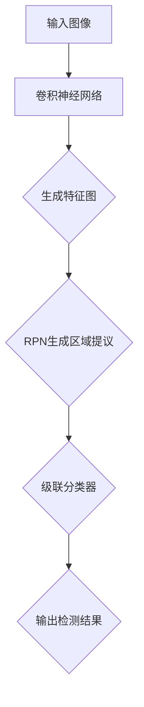
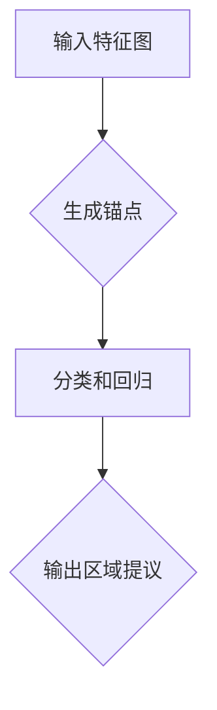

                 

## 《Cascade R-CNN原理与代码实例讲解》

### 关键词：Cascade R-CNN、目标检测、深度学习、区域提议生成算法、多级分类器、代码实现

#### 摘要

本文旨在详细解析Cascade R-CNN（级联区域卷积神经网络）的原理及其代码实现。作为R-CNN系列目标检测算法的重要改进，Cascade R-CNN通过引入级联分类器显著提升了检测性能。文章首先回顾了深度学习和目标检测的基本概念，随后深入分析了卷积神经网络、特征提取、区域提议生成算法等关键技术。接下来，文章详细介绍了Cascade R-CNN算法的基本原理，并提供了完整的代码实现和分析，包括数据集准备、网络架构设计、损失函数和优化策略等。最后，文章探讨了Cascade R-CNN在实际应用中的表现，并对未来目标检测算法的发展趋势进行了展望。

### 《Cascade R-CNN原理与代码实例讲解》目录大纲

## 第一部分: 深度学习与目标检测基础

### 第1章: 深度学习与目标检测概述

#### 1.1 深度学习的基本概念

##### 1.1.1 神经网络的基础结构

神经网络是模仿人脑工作方式的计算模型，由大量简单但高度互联的计算单元组成。每个计算单元称为神经元，能够接收输入信号并产生输出。神经元的结构通常包括输入层、隐藏层和输出层。

- **输入层**：接收外部输入信号，可以是图像像素值、文本向量等。
- **隐藏层**：对输入信号进行处理，通过一系列的加权求和处理和激活函数变换，形成新的特征表示。
- **输出层**：产生最终输出，可以是分类结果、回归值等。

##### 1.1.2 深度学习的发展历程

深度学习起源于20世纪40年代，但直到21世纪初期由于计算能力和数据资源的提升才迎来快速发展。关键里程碑包括：

- **1986年**：Rumelhart, Hinton和Williams提出了反向传播算法，这是训练深层神经网络的重要突破。
- **2012年**：AlexNet在ImageNet比赛中大幅超越传统方法，标志着深度学习在计算机视觉领域的崛起。
- **2015年**：Google的Inception模型进一步推动了深度学习的发展，其在多个领域达到了新的性能水平。

#### 1.2 目标检测的基本概念

##### 1.2.1 目标检测的任务与挑战

目标检测是计算机视觉领域的一个核心任务，其目标是在图像或视频中识别并定位感兴趣的目标。主要任务包括：

- **分类**：确定目标类别。
- **定位**：确定目标在图像中的位置。

目标检测面临的挑战包括：

- **尺度多样性**：目标大小不一，可能从像素级到图像级。
- **遮挡问题**：目标可能部分或完全被遮挡。
- **复杂背景**：背景中的细节可能干扰目标检测。

##### 1.2.2 常见的目标检测算法

当前常见的目标检测算法可以分为以下几类：

- **基于区域的检测算法**：如R-CNN、Fast R-CNN、Faster R-CNN，采用区域提议生成算法来筛选可能包含目标的区域。
- **基于特征的检测算法**：如YOLO、SSD，直接从特征图中检测目标。
- **基于分割的检测算法**：如FCN，通过图像分割实现目标检测。

#### 1.3 Cascade R-CNN的背景和优势

##### 1.3.1 Cascade R-CNN的发展背景

Cascade R-CNN是R-CNN系列目标检测算法的改进版本，旨在解决传统R-CNN算法中检测准确率不高的问题。Cascade R-CNN通过引入级联分类器，提高了检测效率和准确性。

##### 1.3.2 Cascade R-CNN的优势

Cascade R-CNN的主要优势包括：

- **提高检测速度**：级联分类器的设计使得后续分类器能够直接使用前一个分类器的检测结果，减少了重复计算。
- **提高检测准确性**：通过多级分类器逐层筛选目标，能够更准确地定位感兴趣的目标。
- **减少误检率**：级联分类器的设计使得误检率显著降低，提高了整体检测性能。

## 第2章: 卷积神经网络与特征提取

### 2.1 卷积神经网络的基本原理

##### 2.1.1 卷积层的工作原理

卷积层是卷积神经网络（Convolutional Neural Networks, CNN）的核心组成部分，其主要功能是从输入数据中提取特征。

- **卷积运算**：卷积层通过滑动滤波器（卷积核）在输入数据上滑动，对每个位置进行卷积运算，生成特征图。
- **激活函数**：卷积运算后，通常使用激活函数（如ReLU）引入非线性变换，增强网络的表示能力。

##### 2.1.2 池化层的作用与类型

池化层用于降低特征图的维度，减少计算量，同时保持重要特征。

- **最大池化（Max Pooling）**：选取每个池化窗口内的最大值。
- **平均池化（Average Pooling）**：计算每个池化窗口内的平均值。

##### 2.2 深层卷积神经网络的设计

##### 2.2.1 卷积神经网络的层次结构

卷积神经网络通常包含多个卷积层和池化层，形成层次结构。

- **卷积层**：增加网络的非线性变换能力。
- **池化层**：减少参数和计算量。
- **全连接层**：在特征提取完成后，将特征映射到特定类别或回归结果。

##### 2.2.2 残差网络的结构与优点

残差网络（Residual Network, ResNet）是卷积神经网络的一种改进，通过引入残差连接解决了深层网络中的梯度消失问题。

- **残差块**：残差块通过跳过部分层（恒等映射）将输入直接传递到输出，实现梯度直接传递。
- **优点**：显著提高了网络的训练稳定性，使得深层网络的设计变得更加可行。

##### 2.3 特征提取与融合

##### 2.3.1 多尺度特征提取

多尺度特征提取是卷积神经网络中的一个重要策略，通过在不同尺度上提取特征，提高检测的鲁棒性。

- **多尺度卷积**：在不同的尺度上应用卷积操作，捕获不同大小的特征。
- **特征融合**：将多尺度特征进行融合，生成更丰富的特征表示。

##### 2.3.2 特征融合方法

特征融合方法主要包括以下几种：

- **特征拼接**：将不同尺度上的特征图进行拼接。
- **特征融合层**：通过特殊的网络层（如Fusion Layer）进行特征融合。
- **多任务学习**：在训练过程中同时学习多个任务，利用不同任务的输出进行特征融合。

## 第3章: 区域提议生成算法

### 3.1 R-CNN、Fast R-CNN和Faster R-CNN

##### 3.1.1 R-CNN的目标检测算法

R-CNN（Regions with CNN Features）是第一个结合深度学习技术的目标检测算法，其基本流程包括以下步骤：

1. **区域提议**：使用Selective Search算法生成可能的区域提议。
2. **特征提取**：对每个提议区域应用深度卷积神经网络提取特征。
3. **分类**：将提取到的特征输入到SVM分类器进行分类。

##### 3.1.2 Fast R-CNN和Faster R-CNN的改进

Fast R-CNN和Faster R-CNN是R-CNN的改进版本，主要解决了R-CNN中特征提取和分类分离导致效率低下的问题。

- **Fast R-CNN**：引入了Region of Interest（RoI）Pooling层，实现了特征提取和分类的统一。
- **Faster R-CNN**：引入了Region Proposal Network（RPN），在训练过程中自动生成区域提议，提高了检测速度。

### 3.2 Region Proposal Networks（RPN）

##### 3.2.1 RPN的基本原理

RPN（Region Proposal Network）是Faster R-CNN中用于生成区域提议的关键组件，其基本原理如下：

- **锚点生成**：在特征图上生成一系列锚点，锚点可以是正负样本的候选框。
- **分类和回归**：对每个锚点进行分类（是否包含目标）和回归（调整锚点到目标位置的偏移量）。

##### 3.2.2 RPN的训练与优化

RPN的训练过程主要包括以下步骤：

1. **数据准备**：准备包含正负样本的锚点数据集。
2. **损失函数**：定义分类损失函数和回归损失函数，用于优化锚点生成过程。
3. **训练优化**：使用梯度下降等方法优化网络参数，提高区域提议的准确性。

### 3.3 Cascaded Region Proposal Networks（Cascade RPN）

##### 3.3.1 Cascade RPN的概念

Cascade RPN是RPN的进一步改进，通过引入级联分类器提高了检测性能。

- **级联分类器**：级联分类器由多个分类器组成，每个分类器对前一个分类器的输出进行进一步筛选，提高检测准确性。
- **级联优势**：级联分类器能够逐层排除非目标区域，降低误检率，提高检测速度。

##### 3.3.2 Cascade RPN的优势

Cascade RPN的主要优势包括：

- **提高检测速度**：级联分类器的设计使得后续分类器能够直接使用前一个分类器的检测结果，减少了重复计算。
- **提高检测准确性**：通过多级分类器逐层筛选目标，能够更准确地定位感兴趣的目标。
- **减少误检率**：级联分类器的设计使得误检率显著降低，提高了整体检测性能。

## 第4章: R-CNN系列算法对比分析

### 4.1 R-CNN、Fast R-CNN、Faster R-CNN与Cascade R-CNN的性能比较

##### 4.1.1 性能指标分析

性能指标包括检测速度、准确率和资源消耗等，不同算法在这些指标上的表现有所不同。

- **检测速度**：R-CNN系列算法中，Faster R-CNN和Cascade R-CNN具有更高的检测速度，尤其是因为引入了RPN，使得区域提议生成过程更加高效。
- **准确率**：Cascade R-CNN在多级分类器的加持下，准确率显著提高，能够更好地定位目标。
- **资源消耗**：由于级联分类器的设计，Cascade R-CNN在计算资源上的消耗相对较高。

##### 4.1.2 实际应用场景比较

不同算法在实际应用场景中的选择取决于具体需求。

- **速度要求高**：如实时视频监控、自动驾驶等场景，可以选择Faster R-CNN或Cascade R-CNN。
- **准确性要求高**：如医疗图像分析、人脸识别等场景，Cascade R-CNN能够提供更高的准确率。

### 4.2 R-CNN系列算法的优缺点

##### 4.2.1 各算法的优势

- **R-CNN**：通过结合深度学习和传统机器学习方法，实现了较好的检测性能，是目标检测算法的重要里程碑。
- **Fast R-CNN**：引入了Region of Interest（RoI）Pooling层，显著提高了检测速度。
- **Faster R-CNN**：引入了Region Proposal Network（RPN），进一步提升了检测速度和准确性。
- **Cascade R-CNN**：通过级联分类器的设计，提高了检测准确率和速度，减少了误检率。

##### 4.2.2 各算法的局限

- **R-CNN**：检测速度较慢，特征提取和分类分离，导致计算资源浪费。
- **Fast R-CNN**：在处理大量提议区域时效率较低。
- **Faster R-CNN**：训练过程复杂，需要大量的计算资源和时间。
- **Cascade R-CNN**：计算资源消耗较大，对硬件要求较高。

## 第5章: Cascade R-CNN算法原理与实现

### 5.1 Cascade R-CNN算法的基本原理

##### 5.1.1 Cascade R-CNN的整体框架

Cascade R-CNN的整体框架包括以下几个主要部分：

1. **卷积神经网络**：用于提取图像特征。
2. **Region Proposal Network（RPN）**：用于生成区域提议。
3. **级联分类器**：包括多个分类器，逐层筛选目标区域。
4. **Non-maximum Suppression（NMS）**：用于去除冗余检测结果。

##### 5.1.2 多级分类器的设计

Cascade R-CNN的多级分类器设计如下：

1. **第一级分类器**：使用RPN生成的提议区域，进行初步分类。
2. **后续分类器**：对前一级分类器的输出进行进一步筛选和分类，逐级提高检测准确率。

##### 5.2 Cascade R-CNN的代码实现

##### 5.2.1 数据集准备与预处理

数据集准备与预处理是Cascade R-CNN实现的重要步骤，包括以下内容：

1. **数据集划分**：将数据集划分为训练集、验证集和测试集。
2. **图像预处理**：对图像进行缩放、裁剪、翻转等预处理操作，增加模型的泛化能力。
3. **标注处理**：对标注信息进行格式化处理，生成训练所需的标签。

##### 5.2.2 网络架构的实现

Cascade R-CNN的网络架构包括以下几个部分：

1. **卷积层**：用于提取图像特征。
2. **RPN**：用于生成区域提议。
3. **分类器**：用于对提议区域进行分类。
4. **损失函数**：用于优化网络参数。

##### 5.2.3 损失函数与优化策略

Cascade R-CNN的损失函数包括分类损失和回归损失：

1. **分类损失**：用于优化分类器的权重。
2. **回归损失**：用于优化提议区域的回归参数。

优化策略通常采用梯度下降方法，包括以下几个步骤：

1. **前向传播**：计算输入数据和模型参数的梯度。
2. **反向传播**：根据梯度更新模型参数。
3. **参数更新**：使用优化算法（如Adam）更新模型参数。

##### 5.3 代码实例分析

##### 5.3.1 代码结构解析

Cascade R-CNN的代码通常包括以下几个模块：

1. **数据预处理模块**：负责数据集的准备与预处理。
2. **网络架构模块**：定义卷积神经网络、RPN和分类器的结构。
3. **训练模块**：负责模型的训练过程，包括数据加载、模型优化和参数更新。
4. **评估模块**：负责模型的评估过程，包括检测结果的计算和分析。

##### 5.3.2 关键代码解读

关键代码通常包括以下几个部分：

1. **卷积层实现**：使用卷积层提取图像特征。
2. **RPN实现**：生成区域提议，包括锚点生成和分类回归。
3. **分类器实现**：对提议区域进行分类。
4. **损失函数实现**：计算分类损失和回归损失。

## 第6章: Cascade R-CNN在现实场景中的应用

### 6.1 Cascade R-CNN在自动驾驶中的应用

##### 6.1.1 自动驾驶的目标检测需求

自动驾驶系统需要实时检测并识别各种目标，包括车辆、行人、交通标志等。目标检测的准确性直接关系到自动驾驶系统的安全性和可靠性。

##### 6.1.2 Cascade R-CNN在自动驾驶中的实现

Cascade R-CNN在自动驾驶中的应用包括以下几个方面：

1. **数据集准备**：收集并标注自动驾驶场景中的图像数据。
2. **网络训练**：使用训练数据集训练Cascade R-CNN模型。
3. **实时检测**：在自动驾驶系统中部署Cascade R-CNN模型，实现目标检测功能。
4. **融合算法**：将Cascade R-CNN检测结果与其他感知模块（如激光雷达、摄像头等）进行融合，提高整体感知能力。

### 6.2 Cascade R-CNN在医疗图像分析中的应用

##### 6.2.1 医疗图像分析的目标检测挑战

医疗图像分析中的目标检测面临以下挑战：

1. **数据多样性**：医疗图像种类繁多，包括X光片、CT扫描、MRI等，目标大小、形状、密度各异。
2. **标注困难**：医疗图像的标注需要专业知识和经验，标注过程繁琐且耗时长。
3. **计算资源需求**：医疗图像分辨率高，数据量大，对计算资源有较高要求。

##### 6.2.2 Cascade R-CNN在医疗图像分析中的应用实例

Cascade R-CNN在医疗图像分析中的应用包括以下几个实例：

1. **肿瘤检测**：使用Cascade R-CNN模型检测X光片中的肿瘤区域，提高检测准确性。
2. **骨折检测**：在CT扫描图像中检测骨折区域，辅助医生诊断。
3. **血管分割**：在MRI图像中使用Cascade R-CNN模型进行血管分割，用于心血管疾病诊断。

## 第7章: 总结与展望

### 7.1 Cascade R-CNN的总结

##### 7.1.1 Cascade R-CNN的主要贡献

Cascade R-CNN在目标检测领域的主要贡献包括：

1. **提高检测准确性**：通过级联分类器的设计，提高了检测准确性，减少了误检率。
2. **提高检测速度**：级联分类器的设计使得后续分类器能够直接使用前一个分类器的检测结果，提高了检测速度。
3. **减少误检率**：级联分类器能够逐层排除非目标区域，降低了整体误检率。

##### 7.1.2 Cascade R-CNN的局限性

Cascade R-CNN也存在一些局限性，包括：

1. **计算资源需求高**：由于级联分类器的设计，Cascade R-CNN对计算资源有较高要求，需要更强大的硬件支持。
2. **训练时间较长**：Cascade R-CNN的训练时间较长，需要大量的计算资源和时间。
3. **对标注数据依赖大**：Cascade R-CNN的性能高度依赖于高质量的标注数据，标注困难可能影响模型性能。

### 7.2 目标检测算法的未来发展趋势

##### 7.2.1 未来算法的发展方向

未来目标检测算法的发展方向包括：

1. **更快更准确的算法**：继续优化现有算法，提高检测速度和准确性。
2. **多任务学习**：结合多任务学习，提高模型在多种任务上的性能。
3. **少样本学习**：研究在标注数据有限的情况下，如何训练高效的目标检测模型。
4. **跨域适应性**：提高模型在不同领域和场景下的适应性，减少对特定数据的依赖。

##### 7.2.2 Cascade R-CNN的改进空间

Cascade R-CNN的改进空间包括：

1. **硬件加速**：利用GPU、TPU等硬件加速技术，提高模型训练和推理速度。
2. **端到端训练**：探索端到端训练方法，减少模型依赖的中间层，提高模型效率。
3. **数据增强**：引入更多数据增强方法，提高模型对多样性的适应能力。
4. **模型压缩**：研究模型压缩技术，减少模型大小和计算量，提高模型的可部署性。

### 附录

#### 附录 A: Cascade R-CNN相关资源

##### A.1 Cascade R-CNN论文解读

论文《Faster R-CNN: Towards Real-Time Object Detection with Region Proposal Networks》详细介绍了Cascade R-CNN的算法原理和实现。读者可以通过阅读论文深入了解算法的细节。

##### A.2 Cascade R-CNN开源代码与数据集

开源代码和预训练模型可以方便研究者进行复现和进一步研究。常见的开源代码库包括TensorFlow、PyTorch等框架下的实现。

##### A.3 相关技术文档与教程

相关技术文档和教程可以帮助初学者快速入门和掌握Cascade R-CNN。这些资源包括官方文档、博客文章、在线教程和视频课程等。

#### 附录 B: Mermaid 流程图示例

##### B.1 Cascade R-CNN算法流程图



##### B.2 RPN算法流程图



#### 附录 C: 伪代码示例

##### C.1 卷积层计算伪代码

```python
# 输入特征图 F_in
# 卷积核 W
# 偏置 b
# 步长 stride
# 扩展系数 padding

F_out = Convolution(F_in, W, b, stride, padding)
F_out = Activation(F_out)
```

##### C.2 池化层计算伪代码

```python
# 输入特征图 F_in
# 池化窗口 size
# 步长 stride
# 扩展系数 padding

F_out = Pooling(F_in, size, stride, padding)
```

#### 附录 D: 数学模型与公式

##### D.1 Softmax公式

$$
\text{softmax}(x_i) = \frac{e^{x_i}}{\sum_{j} e^{x_j}}
$$

##### D.2 交叉熵损失函数

$$
J(\theta) = -\frac{1}{m} \sum_{i=1}^{m} y^{(i)} \log(a^{(i)}_j)
$$

#### 附录 E: 代码实例与分析

##### E.1 数据集加载与预处理

```python
# 加载数据集
train_dataset = load_dataset('train')
val_dataset = load_dataset('val')

# 预处理
def preprocess_image(image):
    # 缩放、裁剪、翻转等操作
    return processed_image

# 应用预处理到数据集
train_dataset = dataset.map(preprocess_image)
val_dataset = dataset.map(preprocess_image)
```

##### E.2 网络架构实现

```python
# 构建卷积神经网络
model = keras.Sequential([
    keras.layers.Conv2D(64, (3, 3), activation='relu', input_shape=(224, 224, 3)),
    keras.layers.MaxPooling2D((2, 2)),
    # ... 更多卷积层和池化层
    keras.layers.Flatten(),
    keras.layers.Dense(1024, activation='relu'),
    keras.layers.Dense(num_classes, activation='softmax')
])
```

##### E.3 训练与评估流程

```python
# 编译模型
model.compile(optimizer='adam', loss='categorical_crossentropy', metrics=['accuracy'])

# 训练模型
model.fit(train_dataset, validation_data=val_dataset, epochs=10)

# 评估模型
test_loss, test_accuracy = model.evaluate(test_dataset)
print(f"Test accuracy: {test_accuracy}")
```

##### E.4 代码解读与分析

在代码解读与分析部分，将对关键代码段进行详细解释，包括网络架构、训练过程、损失函数等，以便读者更好地理解Cascade R-CNN的实现细节。通过具体的代码实例，读者可以更直观地理解算法的运行机制和应用场景。

