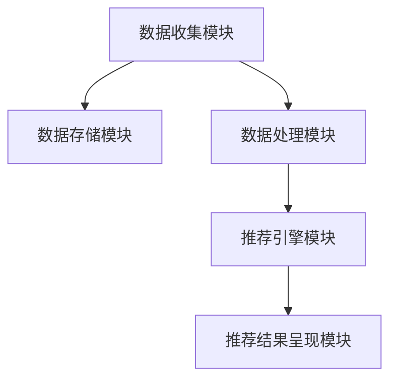

                 

# 《Chat-Rec：交互式推荐系统》

## 关键词

交互式推荐系统，用户行为分析，深度学习，协同过滤，实时推荐，社交网络，移动端，电商平台，新闻网站

## 摘要

本文深入探讨了交互式推荐系统的概念、架构、算法及其在不同应用场景中的实现。首先，我们介绍了交互式推荐系统的基础知识，包括其定义、背景、目标和应用场景。接着，我们详细分析了用户行为数据收集与预处理、用户行为特征提取、用户行为模型构建等内容。随后，我们探讨了基于内容的推荐算法、协同过滤推荐算法和深度学习推荐算法的基本原理。在系统设计与实现部分，我们讲解了交互式推荐系统的架构设计、数据库设计与数据存储、推荐结果的呈现与优化。随后，我们针对社交网络、移动端和实时交互式推荐系统的特点，提出了相应的解决方案。最后，通过电商和新闻网站案例，展示了交互式推荐系统的实际应用和优化方法。本文旨在为读者提供一个全面而深入的了解，以便在未来的项目中有效利用交互式推荐系统。

---

## 《Chat-Rec：交互式推荐系统》目录大纲

### 第一部分：交互式推荐系统基础

### 第1章：交互式推荐系统概述

### 第2章：用户行为分析与建模

### 第3章：交互式推荐算法

### 第4章：交互式推荐系统的设计与实现

### 第二部分：交互式推荐系统的应用与优化

### 第5章：社交网络中的交互式推荐

### 第6章：移动端交互式推荐系统

### 第7章：实时交互式推荐系统

### 第三部分：案例分析与实践

### 第8章：电商平台的交互式推荐系统

### 第9章：新闻网站的交互式推荐系统

### 第10章：案例实践与总结

### 附录：相关技术资料与工具

### 附录 A：交互式推荐系统常用技术框架

### 附录 B：参考文献

---

## 第1章：交互式推荐系统概述

### 1.1 交互式推荐系统的定义与背景

交互式推荐系统是一种结合用户交互行为的推荐系统，它不仅仅依赖于用户的历史行为数据，还通过实时的用户互动，动态调整推荐结果。这种系统旨在为用户提供更加个性化、即时和符合需求的推荐内容。

交互式推荐系统的背景可以追溯到传统的推荐系统。传统推荐系统主要基于用户的历史行为和物品的属性，通过算法预测用户可能感兴趣的物品。然而，这种方法往往忽略了用户的实时需求和即时反馈。随着互联网和社交媒体的快速发展，用户的需求变得更加多样化，对推荐系统的实时性和交互性提出了更高的要求。

交互式推荐系统的出现，是为了更好地满足用户的个性化需求，提高推荐的准确性和用户满意度。它通过实时收集和分析用户在系统中的交互行为，如点击、评论、分享等，动态调整推荐策略，提供更加个性化的推荐服务。

### 1.2 交互式推荐系统的目标与应用场景

交互式推荐系统的目标主要有以下几点：

1. 提高推荐准确性：通过实时收集和分析用户交互数据，交互式推荐系统可以更加准确地预测用户兴趣，提供更符合用户需求的推荐内容。
2. 提升用户体验：交互式推荐系统能够根据用户实时反馈调整推荐策略，提高用户的互动体验，增加用户对系统的依赖度。
3. 增加用户黏性：通过持续的用户交互，交互式推荐系统能够更好地了解用户偏好，提高用户对平台的忠诚度。

交互式推荐系统广泛应用于以下场景：

1. 电子商务：电商平台利用交互式推荐系统，可以根据用户的浏览、购买行为，实时推荐相关商品，提高销售转化率。
2. 社交媒体：社交媒体平台通过交互式推荐系统，可以推荐用户可能感兴趣的内容，增加用户活跃度和平台黏性。
3. 新闻网站：新闻网站利用交互式推荐系统，可以根据用户的阅读行为，推荐相关新闻，提高用户访问量和阅读时长。

### 1.3 交互式推荐系统与传统推荐系统的区别

交互式推荐系统与传统推荐系统在多个方面存在显著差异：

1. 数据来源：传统推荐系统主要依赖用户的历史行为数据和物品的属性特征，而交互式推荐系统则更加注重用户的实时交互数据，如点击、评论、分享等。
2. 推荐策略：传统推荐系统通常采用固定算法，而交互式推荐系统可以根据实时用户交互数据动态调整推荐策略，提供更加个性化的服务。
3. 用户反馈：传统推荐系统往往无法即时获取用户的反馈，而交互式推荐系统可以通过用户互动，实时获取反馈，从而不断优化推荐结果。

总体而言，交互式推荐系统在数据来源、推荐策略和用户反馈等方面，相较于传统推荐系统，具有更高的实时性和交互性，能够更好地满足用户的个性化需求。

### 1.4 交互式推荐系统的发展历程

交互式推荐系统的发展历程可以分为以下几个阶段：

1. **萌芽期（2000年代初）**：在这一阶段，研究人员开始探索如何将用户交互行为引入推荐系统。代表性工作包括基于点击流的推荐算法，如CF（Collaborative Filtering）算法。
2. **探索期（2000年代末至2010年代初）**：随着互联网和社交媒体的兴起，交互式推荐系统的研究逐渐深入。这一时期出现了许多基于用户交互行为的推荐算法，如基于内容的推荐（Content-Based Filtering）和基于模型的推荐（Model-Based Recommendation）。
3. **成熟期（2010年代中期至今）**：随着深度学习和大数据技术的发展，交互式推荐系统取得了显著进展。基于深度学习的推荐算法，如深度协同过滤（Deep Collaborative Filtering）和图神经网络（Graph Neural Networks），使得推荐系统在准确性和实时性方面有了大幅提升。

### 1.5 本章小结

本章介绍了交互式推荐系统的定义、背景、目标、应用场景以及与传统推荐系统的区别和发展历程。通过本章的学习，读者可以初步了解交互式推荐系统的基础知识，为后续章节的深入学习打下基础。

---

接下来，我们将进入第二部分，深入探讨用户行为分析与建模，为构建高效的交互式推荐系统奠定基础。

---

## 第2章：用户行为分析与建模

### 2.1 用户行为数据收集与预处理

用户行为数据的收集是交互式推荐系统构建的第一步，它决定了推荐系统的性能和准确性。用户行为数据可以来源于多种渠道，如网站点击流、社交媒体互动、移动应用使用等。这些数据通常包含用户在系统中的各种交互行为，如浏览、点击、搜索、购买、评论、分享等。

#### 2.1.1 用户行为数据来源

1. **网站点击流**：网站点击流数据记录了用户在网站上的各种操作，如页面浏览、点击、滚动等。这些数据通常通过Web服务器日志收集。
2. **社交媒体互动**：社交媒体平台提供了丰富的用户行为数据，如点赞、评论、分享、转发等。这些数据可以通过API接口获取。
3. **移动应用使用**：移动应用通过内置的SDK（软件开发工具包）可以收集用户在应用中的行为数据，如使用时间、功能点击等。

#### 2.1.2 用户行为数据预处理

收集到的用户行为数据通常是原始的，包含大量的噪声和不完整信息。因此，数据预处理是确保数据质量和推荐系统性能的关键步骤。数据预处理包括以下几个步骤：

1. **数据清洗**：删除重复数据、处理缺失值和异常值，确保数据的完整性。
2. **数据转换**：将原始数据转换为适合分析和建模的格式，如将时间戳转换为日期时间格式。
3. **特征提取**：从用户行为数据中提取有助于推荐系统建模的特征，如用户活跃度、浏览路径、交互时长等。

#### 2.1.3 数据质量评估

数据质量是影响推荐系统性能的关键因素。数据质量评估包括以下几个方面：

1. **完整性**：检查数据是否完整，是否存在大量缺失值。
2. **准确性**：检查数据是否准确，是否存在错误或异常值。
3. **一致性**：检查数据是否一致，如同一用户在不同时间点的行为数据是否矛盾。
4. **及时性**：检查数据是否及时更新，以确保推荐结果实时反映用户最新行为。

### 2.2 用户行为特征提取

用户行为特征提取是将原始的用户行为数据转换为有助于推荐系统建模的数值特征的过程。有效的特征提取可以显著提高推荐系统的准确性和效率。

#### 2.2.1 常见特征

1. **用户活跃度**：衡量用户在系统中的活跃程度，如登录次数、使用时长、页面浏览量等。
2. **浏览路径**：记录用户在系统中的浏览顺序，可以用于分析用户兴趣和行为模式。
3. **交互时长**：记录用户在特定页面或功能上的停留时间，用于分析用户兴趣强度。
4. **点击率**：衡量用户对推荐内容的点击行为，如点击次数、点击率等。
5. **购买率**：衡量用户购买行为的发生频率，如购买次数、购买率等。

#### 2.2.2 特征工程

特征工程是特征提取过程中的一项关键技术，它通过选择、构建和转换特征，提高推荐系统的性能。特征工程包括以下几个方面：

1. **特征选择**：选择对推荐系统性能有显著影响的关键特征，如使用统计方法或机器学习算法筛选重要特征。
2. **特征构造**：通过组合或转换原始特征，构建新的特征，以丰富模型输入信息。
3. **特征标准化**：将不同量纲的特征转换为同一量纲，如使用Z-Score标准化或Min-Max标准化。

### 2.3 用户行为模型构建

用户行为模型是交互式推荐系统的重要组成部分，它通过分析用户历史行为数据，预测用户未来行为，从而生成个性化的推荐结果。

#### 2.3.1 常见模型

1. **协同过滤模型**：协同过滤模型通过分析用户与物品之间的交互数据，预测用户对未知物品的偏好。常见的协同过滤模型包括基于用户的协同过滤（User-Based CF）和基于物品的协同过滤（Item-Based CF）。
2. **基于内容的模型**：基于内容的模型通过分析物品的内容特征和用户的历史行为，预测用户对未知物品的偏好。这种方法适用于推荐内容丰富、特征明确的场景。
3. **混合模型**：混合模型结合协同过滤和基于内容的模型，通过融合多种特征和模型，提高推荐系统的准确性和泛化能力。

#### 2.3.2 深度学习模型

随着深度学习技术的发展，基于深度学习的用户行为模型逐渐成为研究热点。深度学习模型能够自动从原始数据中提取高层次的抽象特征，提高推荐系统的性能。

1. **深度神经网络（DNN）**：深度神经网络通过多层非线性变换，对用户行为数据进行特征提取和分类。
2. **卷积神经网络（CNN）**：卷积神经网络在处理时序数据方面具有优势，可以用于用户浏览路径分析。
3. **循环神经网络（RNN）**：循环神经网络能够处理序列数据，适用于用户行为序列建模。

#### 2.3.3 模型评估与优化

用户行为模型的评估和优化是确保推荐系统性能的关键步骤。常见的评估指标包括准确率、召回率、F1分数等。优化方法包括模型参数调优、特征工程改进和模型融合等。

1. **模型参数调优**：通过调整模型参数，提高模型在特定数据集上的性能。常用的方法包括网格搜索、随机搜索等。
2. **特征工程改进**：通过选择和构建更有效的特征，提高模型的预测能力。
3. **模型融合**：将多个模型的结果进行融合，提高推荐系统的综合性能。

### 2.4 本章小结

本章介绍了用户行为数据收集与预处理、用户行为特征提取和用户行为模型构建的方法和技巧。通过本章的学习，读者可以了解如何从原始用户行为数据中提取有价值的信息，构建高效的用户行为模型，为后续的交互式推荐系统设计奠定基础。

---

接下来，我们将进入第3章，探讨交互式推荐算法，深入了解各种推荐算法的基本原理和实现方法。

---

## 第3章：交互式推荐算法

交互式推荐算法是构建交互式推荐系统的核心，它们通过分析用户的历史行为和实时交互数据，生成个性化的推荐结果。本章将介绍几种常见的交互式推荐算法，包括基于内容的推荐算法、协同过滤推荐算法和深度学习推荐算法。

### 3.1 基于内容的推荐算法

基于内容的推荐算法（Content-Based Filtering，CBF）是一种常见的推荐算法，它通过分析物品的内容特征和用户的兴趣特征，生成个性化的推荐结果。该方法的核心思想是，如果两个物品在内容特征上相似，那么它们可能受到同一用户的喜欢。

#### 3.1.1 算法原理

1. **物品特征提取**：首先，从每个物品中提取一组内容特征，如文本特征、图像特征、音频特征等。这些特征可以是原始数据，也可以是通过预处理和特征工程得到的。
2. **用户兴趣特征提取**：接着，从用户的历史行为数据中提取用户的兴趣特征，如用户喜欢的物品、浏览历史、评论等。
3. **相似度计算**：使用某种相似度度量方法（如余弦相似度、欧氏距离等），计算每个用户与其可能喜欢的物品之间的相似度。
4. **生成推荐结果**：根据相似度度量结果，为用户生成推荐列表。

#### 3.1.2 实现方法

1. **基于文本的推荐**：使用文本匹配方法（如TF-IDF、Word2Vec等）提取物品和用户的文本特征，计算相似度。
2. **基于图像的推荐**：使用图像处理和计算机视觉技术（如卷积神经网络、特征提取器等）提取物品和用户的图像特征，计算相似度。
3. **基于音频的推荐**：使用音频处理和语音识别技术（如Mel频谱、Spectrogram等）提取物品和用户的音频特征，计算相似度。

#### 3.1.3 优点与局限性

- **优点**：基于内容的推荐算法能够为用户提供个性化推荐，推荐结果与用户兴趣高度相关。
- **局限性**：该方法依赖于物品的内容特征，对于内容特征不丰富或动态变化的物品，推荐效果可能较差。

### 3.2 协同过滤推荐算法

协同过滤推荐算法（Collaborative Filtering，CF）是一种基于用户历史行为数据的推荐算法，它通过分析用户之间的相似性，预测用户对未知物品的偏好。协同过滤算法可以分为基于用户的协同过滤（User-Based CF）和基于物品的协同过滤（Item-Based CF）。

#### 3.2.1 算法原理

1. **基于用户的协同过滤**：首先，计算每个用户与其邻居用户之间的相似度，通常使用余弦相似度、皮尔逊相关系数等度量方法。然后，根据邻居用户的偏好，生成推荐列表。
2. **基于物品的协同过滤**：首先，计算每个物品与其邻居物品之间的相似度，然后根据用户对邻居物品的偏好，生成推荐列表。

#### 3.2.2 实现方法

1. **用户相似度计算**：使用余弦相似度、皮尔逊相关系数等度量方法计算用户之间的相似度。
2. **物品相似度计算**：使用余弦相似度、欧氏距离等度量方法计算物品之间的相似度。
3. **推荐列表生成**：根据相似度度量结果，为用户生成推荐列表。

#### 3.2.3 优点与局限性

- **优点**：协同过滤算法能够利用用户历史行为数据，生成个性化的推荐结果，适用于推荐系统中的大多数场景。
- **局限性**：协同过滤算法容易受到冷启动问题和数据稀疏性的影响。

### 3.3 深度学习推荐算法

深度学习推荐算法利用深度神经网络从原始数据中自动提取高级特征，提高推荐系统的性能。深度学习推荐算法可以分为基于深度神经网络（Deep Neural Networks，DNN）的推荐算法和基于卷积神经网络（Convolutional Neural Networks，CNN）的推荐算法。

#### 3.3.1 算法原理

1. **基于深度神经网络的推荐**：深度神经网络通过多层非线性变换，对用户行为数据进行特征提取和分类，生成推荐结果。
2. **基于卷积神经网络的推荐**：卷积神经网络擅长处理时序数据和图像数据，可以用于用户浏览路径分析和图像特征提取。

#### 3.3.2 实现方法

1. **用户行为数据预处理**：将用户行为数据转换为适合深度学习模型输入的格式，如序列数据或图像数据。
2. **模型架构设计**：设计深度神经网络或卷积神经网络模型，包括输入层、隐藏层和输出层。
3. **模型训练与优化**：使用训练数据集训练模型，通过调整模型参数和优化算法，提高模型性能。
4. **推荐结果生成**：使用训练好的模型，对用户行为数据进行预测，生成推荐列表。

#### 3.3.3 优点与局限性

- **优点**：深度学习推荐算法能够自动提取高级特征，提高推荐准确性，适用于处理复杂数据。
- **局限性**：深度学习推荐算法需要大量的训练数据和计算资源，且模型训练过程复杂，调试难度较大。

### 3.4 本章小结

本章介绍了基于内容的推荐算法、协同过滤推荐算法和深度学习推荐算法的基本原理和实现方法。这些算法在交互式推荐系统中发挥着重要作用，适用于不同的应用场景和数据特征。通过本章的学习，读者可以了解如何选择合适的推荐算法，构建高效和个性化的推荐系统。

---

接下来，我们将进入第4章，探讨交互式推荐系统的设计与实现，深入了解系统架构、数据库设计和推荐结果呈现等方面。

---

## 第4章：交互式推荐系统的设计与实现

交互式推荐系统的设计与实现是一个复杂而关键的过程，它需要综合考虑系统的架构设计、数据存储、数据处理和推荐结果的呈现等多个方面。本章将详细讨论这些关键组成部分，为读者提供构建高效交互式推荐系统的指导。

### 4.1 交互式推荐系统的架构设计

交互式推荐系统的架构设计需要考虑到系统的可扩展性、可维护性和实时性。一个典型的交互式推荐系统架构通常包括以下几个主要模块：

1. **数据收集模块**：该模块负责从各种数据源（如网站点击流、社交媒体互动、移动应用使用等）收集用户行为数据。
2. **数据存储模块**：该模块负责存储和管理用户行为数据，通常使用分布式数据库系统，如Hadoop、HBase或MongoDB。
3. **数据处理模块**：该模块负责处理和预处理用户行为数据，包括数据清洗、特征提取和建模等。
4. **推荐引擎模块**：该模块负责基于用户行为数据生成个性化的推荐结果，通常使用深度学习、协同过滤等算法。
5. **推荐结果呈现模块**：该模块负责将推荐结果以用户友好的方式呈现给用户，如通过Web页面、移动应用或API接口。

#### 4.1.1 系统架构示例

以下是一个简化的交互式推荐系统架构示例，使用Mermaid流程图表示：



### 4.2 数据库设计与数据存储

数据库设计是交互式推荐系统实现的重要组成部分，它需要考虑数据模型、存储效率和查询性能。以下是一些关键的数据库设计和数据存储策略：

1. **数据模型设计**：根据用户行为数据和推荐系统的需求，设计合适的数据模型。常见的用户行为数据模型包括用户-物品交互矩阵、用户行为日志等。
2. **数据存储策略**：选择合适的数据库系统，如关系数据库（如MySQL、PostgreSQL）或NoSQL数据库（如MongoDB、Cassandra）。对于大规模数据集，可以考虑使用分布式数据库系统，以提高存储和查询性能。
3. **数据分区与索引**：为了提高查询性能，可以对数据表进行分区和索引。分区可以按照时间、用户ID或其他关键属性进行，索引可以加速数据查询。

### 4.3 推荐结果的呈现与优化

推荐结果的呈现是用户体验的关键环节，它需要考虑以下因素：

1. **推荐结果格式**：推荐结果可以以列表、卡片、网格等形式呈现，应根据应用场景和用户习惯进行设计。
2. **推荐结果排序**：推荐结果的排序影响用户体验，常用的排序策略包括基于相关性、流行度、用户评分等。
3. **实时更新与缓存**：为了提供实时性，推荐系统可以使用缓存机制，将推荐结果缓存一段时间，减少数据库查询压力。同时，推荐结果需要定期更新，以反映用户最新的行为变化。
4. **个性化调整**：根据用户历史行为和偏好，个性化调整推荐结果，提供更符合用户需求的内容。

### 4.4 数据处理模块实现

数据处理模块是交互式推荐系统的核心，它包括以下几个步骤：

1. **数据清洗**：清洗原始数据，去除重复、错误和异常数据。
2. **特征提取**：从用户行为数据中提取有价值的信息，如用户活跃度、浏览路径、交互时长等。
3. **数据建模**：选择合适的模型，如深度学习、协同过滤等，构建用户行为模型。
4. **模型训练与优化**：使用训练数据集训练模型，通过交叉验证和参数调整，提高模型性能。

### 4.5 推荐引擎模块实现

推荐引擎模块是实现个性化推荐的关键，以下是一些关键实现步骤：

1. **相似度计算**：计算用户与物品之间的相似度，可以使用基于内容的推荐算法或协同过滤算法。
2. **推荐列表生成**：根据相似度度量结果，为用户生成推荐列表。
3. **推荐结果排序**：根据用户历史行为和偏好，对推荐列表进行排序，提高用户体验。

### 4.6 本章小结

本章介绍了交互式推荐系统的架构设计、数据库设计、数据处理和推荐结果呈现等关键组成部分。通过本章的学习，读者可以了解如何设计和实现一个高效的交互式推荐系统，为实际应用提供技术支持。

---

接下来，我们将进入第二部分：交互式推荐系统的应用与优化。在这一部分，我们将探讨社交网络、移动端和实时交互式推荐系统的特点和应用。

---

## 第5章：社交网络中的交互式推荐

社交网络是交互式推荐系统的重要应用场景之一。在社交网络中，用户不仅通过发布和浏览内容，还会进行点赞、评论、分享等社交互动。这些互动数据为推荐系统提供了丰富的信息，使得社交网络中的交互式推荐系统能够更好地满足用户的个性化需求。

### 5.1 社交网络中的交互式推荐系统架构

社交网络中的交互式推荐系统架构通常包括以下几个主要模块：

1. **用户互动数据收集模块**：该模块负责从社交网络平台（如Facebook、Twitter、Instagram等）收集用户互动数据，如点赞、评论、分享等。
2. **用户关系图谱构建模块**：该模块负责构建用户之间的关系图谱，通过分析用户的社交互动，识别用户之间的联系和群体结构。
3. **推荐算法模块**：该模块负责基于用户互动数据和关系图谱，生成个性化的推荐结果。
4. **推荐结果呈现模块**：该模块负责将推荐结果以用户友好的方式呈现，如通过社交媒体平台的消息流、推送通知等。

### 5.2 基于社交网络的关系图谱构建

关系图谱是社交网络中交互式推荐系统的重要数据基础。通过构建用户之间的关系图谱，推荐系统可以更好地理解用户的社会结构和兴趣偏好。

1. **用户关系识别**：首先，根据用户在社交网络中的互动数据，识别用户之间的关系，如好友关系、点赞关系、评论关系等。
2. **关系图谱构建**：使用图论算法，将用户及其关系构建为一个大规模图。在图结构中，每个节点代表一个用户，每条边代表用户之间的某种关系。
3. **图结构优化**：通过图论算法，对关系图谱进行优化，如去除冗余边、处理环等，以提高图结构的效率和可用性。

### 5.3 社交网络中的推荐算法优化

在社交网络中，推荐算法需要考虑用户的社会关系和兴趣偏好。以下是一些常见的社交网络推荐算法优化方法：

1. **基于社交关系推荐**：根据用户在社交网络中的关系图谱，为用户推荐与其有紧密联系的用户可能感兴趣的内容。
2. **基于兴趣偏好推荐**：通过分析用户的兴趣标签、评论内容、浏览历史等，为用户推荐与其兴趣相关的内容。
3. **融合多种特征**：结合用户的社会关系和兴趣偏好，使用融合算法（如矩阵分解、图神经网络等），生成更个性化的推荐结果。

### 5.4 社交网络中的推荐效果评估

评估社交网络中的交互式推荐系统效果是一个复杂的过程，需要综合考虑以下几个方面：

1. **推荐准确性**：通过对比用户实际交互数据与推荐结果，评估推荐系统的准确性。常用的指标包括准确率、召回率、F1分数等。
2. **用户满意度**：通过用户调研、问卷调查等方式，收集用户对推荐系统的满意度评价。用户满意度是衡量推荐系统效果的重要指标。
3. **社交影响力**：评估推荐结果在社交网络中的传播效果，如用户点赞、评论、分享等互动行为。社交影响力反映了推荐内容的吸引力和传播能力。

### 5.5 本章小结

本章介绍了社交网络中的交互式推荐系统架构、关系图谱构建方法、推荐算法优化以及推荐效果评估。通过本章的学习，读者可以了解如何在社交网络中构建高效和个性化的推荐系统，为用户带来更好的体验。

---

接下来，我们将探讨移动端交互式推荐系统的设计原则、性能优化和用户体验优化，以帮助开发者在移动设备上实现高效和流畅的推荐服务。

---

## 第6章：移动端交互式推荐系统

移动设备的普及使得移动端交互式推荐系统成为越来越重要的应用场景。移动端推荐系统需要应对有限的计算资源和带宽限制，同时提供快速和个性化的推荐服务。本章将介绍移动端交互式推荐系统的设计原则、性能优化和用户体验优化。

### 6.1 移动端交互式推荐系统的设计原则

移动端交互式推荐系统的设计原则主要包括以下几点：

1. **响应速度快**：移动端用户对响应速度有较高的要求，推荐系统需要在有限的时间内提供准确的推荐结果。
2. **数据高效处理**：移动端设备的计算能力和存储空间有限，推荐系统需要高效地处理用户数据，减少不必要的计算和存储开销。
3. **轻量级模型**：为了节省移动设备的资源，推荐系统应采用轻量级的模型，如简化版的深度学习模型或基于规则的算法。
4. **个性化推荐**：根据用户的行为和偏好，提供个性化的推荐结果，提高用户的满意度和粘性。
5. **可扩展性**：设计时应考虑系统的可扩展性，以便在未来添加更多功能和用户。

### 6.2 移动端推荐系统的性能优化

移动端推荐系统的性能优化是确保系统能够高效运行的关键。以下是一些常见的性能优化策略：

1. **缓存机制**：使用缓存机制，将用户历史数据和推荐结果缓存到本地，减少对服务器端的请求次数，提高响应速度。
2. **增量更新**：对于用户数据的变化，采用增量更新策略，只更新变化部分的数据，减少数据传输和计算开销。
3. **异步处理**：将推荐系统的计算任务分解为多个异步任务，如数据预处理、模型训练和推荐结果生成，提高系统并发处理能力。
4. **模型压缩**：对深度学习模型进行压缩，减少模型的大小，提高模型在移动设备上的运行效率。

### 6.3 移动端推荐系统的用户体验优化

用户体验是移动端交互式推荐系统的核心价值。以下是一些用户体验优化策略：

1. **推荐结果呈现**：采用直观和易操作的界面设计，将推荐结果以用户友好的方式呈现，如使用卡片、滑动列表等。
2. **个性化推荐**：根据用户的兴趣和行为，提供个性化的推荐结果，提高用户满意度。
3. **反馈机制**：提供反馈机制，如用户评分、评论和举报功能，帮助用户表达对推荐结果的看法，优化推荐系统的准确性。
4. **本地化**：根据用户所在地区和文化背景，提供本地化的推荐内容，提高用户体验。

### 6.4 移动端推荐系统的案例实践

以下是一个移动端交互式推荐系统的实践案例：

**案例：电商移动应用中的推荐系统**

1. **用户行为数据收集**：通过应用内集成SDK，收集用户在移动应用中的行为数据，如商品浏览、点击、购买等。
2. **数据处理与建模**：使用协同过滤和深度学习算法，对用户行为数据进行分析和建模，生成个性化的推荐结果。
3. **推荐结果呈现**：在应用界面上以卡片形式呈现推荐结果，用户可以点击卡片查看详细商品信息，进行购买。
4. **性能优化**：采用缓存机制和增量更新策略，减少数据传输和计算开销，提高系统响应速度。
5. **用户体验优化**：根据用户反馈，不断优化推荐算法和界面设计，提高用户满意度。

### 6.5 本章小结

本章介绍了移动端交互式推荐系统的设计原则、性能优化和用户体验优化策略，并通过一个电商移动应用案例，展示了如何在实际项目中实现高效的移动端推荐系统。通过本章的学习，读者可以了解如何在移动设备上设计和实现高质量的交互式推荐系统。

---

接下来，我们将探讨实时交互式推荐系统的挑战、解决方案和应用场景。

---

## 第7章：实时交互式推荐系统

实时交互式推荐系统在满足用户即时性和个性化需求方面具有重要意义。与传统的离线推荐系统不同，实时推荐系统需要在极短的时间内处理大量数据，生成高质量的推荐结果。本章将讨论实时交互式推荐系统的挑战、解决方案和应用场景。

### 7.1 实时交互式推荐系统的挑战

实时交互式推荐系统面临以下主要挑战：

1. **数据处理速度**：实时推荐系统需要在毫秒级的时间内处理大量实时数据，这要求系统具有极高的数据处理速度和低延迟。
2. **数据量与多样性**：实时数据量通常非常庞大，且数据类型多样，包括用户行为数据、传感器数据、社交媒体数据等，系统需要能够高效地处理和融合这些数据。
3. **推荐准确性**：在实时环境下，推荐系统需要在短时间内生成准确且个性化的推荐结果，这要求推荐算法具有较强的实时性和泛化能力。
4. **资源限制**：实时推荐系统通常在资源受限的环境下运行，如移动设备、云计算实例等，系统需要优化资源利用，提高运行效率。

### 7.2 实时交互式推荐系统的解决方案

为了应对实时交互式推荐系统的挑战，以下是一些常见的解决方案：

1. **分布式计算**：使用分布式计算框架（如Apache Spark、Flink等），将数据处理任务分布在多个计算节点上，提高系统的并发处理能力和数据处理速度。
2. **增量处理**：采用增量处理技术，只对最新数据增量进行计算和更新，减少系统负担，提高处理速度。
3. **模型压缩与优化**：对深度学习模型进行压缩和优化，减少模型大小和计算复杂度，提高模型在实时环境下的运行效率。
4. **缓存与预计算**：将常用数据或计算结果预先缓存，减少实时计算负担，提高系统响应速度。

### 7.3 实时交互式推荐系统的应用场景

实时交互式推荐系统在多个应用场景中具有广泛的应用价值，以下是一些典型的应用场景：

1. **电子商务**：实时推荐系统可以根据用户的浏览和购买行为，即时推荐相关商品，提高销售转化率和用户满意度。
2. **社交媒体**：实时推荐系统可以根据用户的互动数据，即时推荐用户可能感兴趣的内容，提高用户活跃度和留存率。
3. **新闻媒体**：实时推荐系统可以根据用户的阅读和评论行为，即时推荐相关新闻，提高用户访问量和阅读时长。
4. **金融交易**：实时推荐系统可以根据市场数据和分析结果，即时推荐投资策略和交易机会，帮助用户做出快速决策。

### 7.4 实时交互式推荐系统案例分析

以下是一个实时交互式推荐系统的实际案例：

**案例：在线游戏推荐系统**

1. **数据处理**：系统使用Apache Kafka收集游戏用户的行为数据，包括游戏时长、游戏类型、玩家互动等。使用Apache Flink进行实时数据处理和分析。
2. **模型构建**：使用深度学习算法（如GRU、LSTM等）构建用户行为模型，预测用户对游戏的偏好。
3. **推荐生成**：根据用户行为模型和实时数据，即时生成游戏推荐列表，并通过游戏客户端发送给用户。
4. **性能优化**：使用模型压缩和增量处理技术，提高系统实时性和处理效率。

### 7.5 本章小结

本章介绍了实时交互式推荐系统的挑战、解决方案和应用场景，并通过实际案例展示了如何构建和优化实时推荐系统。通过本章的学习，读者可以了解实时交互式推荐系统的基本原理和实现方法，为未来的项目提供参考。

---

## 第8章：电商平台的交互式推荐系统

电商平台是交互式推荐系统的重要应用领域之一。通过分析用户的购物行为和偏好，电商平台可以提供个性化的商品推荐，提高用户满意度和销售转化率。本章将深入探讨电商平台的交互式推荐系统，包括用户行为分析、推荐算法实现和优化实践。

### 8.1 电商平台的用户行为分析

电商平台的用户行为分析是构建高效推荐系统的基础。通过分析用户在平台上的行为数据，可以了解用户的兴趣偏好和购买习惯，从而生成个性化的推荐结果。以下是一些关键的用户行为分析指标：

1. **浏览行为**：记录用户在平台上的浏览历史，包括浏览页面的数量、停留时间、浏览路径等。
2. **搜索行为**：分析用户的搜索关键词和搜索意图，了解用户对特定商品的偏好。
3. **购买行为**：记录用户的购买行为，包括购买时间、购买频次、购买商品种类等。
4. **互动行为**：分析用户在平台上的互动行为，如点赞、评论、分享等，这些行为反映了用户对商品的兴趣和满意度。

### 8.2 电商平台的推荐算法实现

电商平台的推荐算法通常结合协同过滤、基于内容推荐和深度学习等技术，以提高推荐的准确性和个性化程度。以下是一些常见的推荐算法实现方法：

1. **协同过滤算法**：基于用户的协同过滤（User-Based CF）和基于物品的协同过滤（Item-Based CF）是电商平台常用的推荐算法。通过分析用户的历史行为数据，计算用户之间的相似度或物品之间的相似度，生成推荐列表。
2. **基于内容的推荐算法**：通过分析商品的内容特征（如文本、图像等），构建商品特征向量，并计算用户和商品之间的相似度，生成推荐列表。
3. **深度学习算法**：使用深度学习模型（如卷积神经网络（CNN）、循环神经网络（RNN）等）自动提取用户行为数据中的高阶特征，生成个性化的推荐结果。

### 8.3 电商平台的推荐系统优化实践

电商平台的推荐系统优化是提高用户满意度和销售转化率的关键。以下是一些常见的优化实践：

1. **实时数据更新**：为了提供最新的推荐结果，推荐系统需要实时更新用户行为数据和推荐算法，以适应用户行为的变化。
2. **个性化推荐**：根据用户的历史行为和偏好，为用户生成个性化的推荐列表，提高推荐的准确性和用户满意度。
3. **推荐结果排序**：采用有效的排序策略，如基于用户兴趣的排序、基于热门度的排序等，提高推荐结果的吸引力。
4. **多模态数据融合**：融合用户的多模态数据（如文本、图像、音频等），提高推荐系统的全面性和准确性。
5. **A/B测试**：通过A/B测试，比较不同推荐算法和策略的效果，优化推荐系统的性能。

### 8.4 电商平台的推荐系统案例分析

以下是一个电商平台的推荐系统实际案例：

**案例：某大型电商平台的商品推荐系统**

1. **数据收集**：平台通过Web日志、用户点击数据、购买记录等渠道收集用户行为数据。
2. **数据处理**：使用Apache Spark进行大数据处理，对用户行为数据进行清洗、转换和特征提取。
3. **模型训练**：使用协同过滤、基于内容的推荐算法和深度学习算法（如CNN、RNN等）训练推荐模型。
4. **推荐生成**：根据用户的历史行为和实时交互数据，生成个性化的商品推荐列表。
5. **优化实践**：通过A/B测试，不断优化推荐算法和策略，提高推荐结果的准确性和用户满意度。

### 8.5 本章小结

本章介绍了电商平台的交互式推荐系统，包括用户行为分析、推荐算法实现和优化实践。通过实际案例展示，读者可以了解如何构建和优化电商平台推荐系统，为用户带来更好的购物体验和更高的销售转化率。

---

## 第9章：新闻网站的交互式推荐系统

新闻网站是交互式推荐系统的另一个重要应用场景。通过分析用户的阅读行为和兴趣偏好，新闻网站可以提供个性化的新闻推荐，提高用户访问量和用户留存率。本章将深入探讨新闻网站的交互式推荐系统，包括用户行为分析与建模、推荐算法设计与实现以及推荐效果评估与优化。

### 9.1 新闻网站的用户行为分析与建模

新闻网站的交互式推荐系统依赖于对用户行为的深入分析。以下是一些关键的步骤和方法：

1. **数据收集**：新闻网站可以通过日志文件、点击流数据、用户互动数据（如点赞、评论、分享）等多种渠道收集用户行为数据。
2. **数据预处理**：对收集到的用户行为数据进行处理，包括数据清洗、缺失值处理、数据转换等，确保数据的准确性和完整性。
3. **特征提取**：从用户行为数据中提取有助于推荐系统建模的特征，如用户活跃度、浏览时长、点击率、阅读顺序等。特征提取可以通过统计方法或机器学习方法实现。
4. **行为建模**：使用统计模型、机器学习模型或深度学习模型，对用户行为进行建模，预测用户对新闻内容的偏好。常见的方法包括线性回归、决策树、支持向量机（SVM）、循环神经网络（RNN）等。

### 9.2 新闻网站的推荐算法设计与实现

新闻网站的推荐算法设计需要考虑新闻内容的多样性、实时性和个性化。以下是一些常用的推荐算法：

1. **基于内容的推荐算法**：通过分析新闻内容的特征（如文本、图像、视频等），构建新闻内容特征向量，并计算用户和新闻之间的相似度，生成推荐列表。常见的方法包括TF-IDF、词袋模型、Word2Vec等。
2. **协同过滤推荐算法**：通过分析用户的历史行为数据，计算用户之间的相似度或新闻之间的相似度，生成推荐列表。协同过滤算法可以分为基于用户的协同过滤（User-Based CF）和基于物品的协同过滤（Item-Based CF）。常用的方法包括余弦相似度、皮尔逊相关系数等。
3. **深度学习推荐算法**：使用深度学习模型，如卷积神经网络（CNN）、循环神经网络（RNN）、图神经网络（GNN）等，从原始数据中自动提取高级特征，提高推荐系统的准确性和泛化能力。

以下是一个简化的推荐算法实现示例，使用Python伪代码表示：

```python
# 基于协同过滤的推荐算法实现
def collaborative_filter(user行为数据，新闻数据，k=10):
    # 计算用户之间的相似度矩阵
    similarity_matrix = compute_similarity(user行为数据，k)
    
    # 计算每个用户的推荐列表
    recommendation_lists = []
    for user in user行为数据:
       相似度分数 = []
        for news in 新闻数据:
            similarity_score = 0
            for neighbor in get_neighbors(user, similarity_matrix):
                similarity_score += similarity_matrix[user][neighbor] * neighbor的偏好[news]
            相似度分数.append((news, similarity_score))
        recommendation_lists.append(sorted(相似度分数, key=lambda x: x[1], reverse=True))
    
    return recommendation_lists
```

### 9.3 新闻网站的推荐效果评估与优化

推荐效果评估是确保推荐系统性能和用户满意度的重要步骤。以下是一些常用的评估指标和方法：

1. **准确率（Accuracy）**：准确率是衡量推荐系统推荐结果准确性的指标，计算公式为：
   \[
   \text{准确率} = \frac{\text{推荐正确的数量}}{\text{推荐的总数量}}
   \]

2. **召回率（Recall）**：召回率是衡量推荐系统能否召回用户实际感兴趣的新闻的指标，计算公式为：
   \[
   \text{召回率} = \frac{\text{推荐正确的数量}}{\text{用户实际感兴趣的新闻数量}}
   \]

3. **F1分数（F1 Score）**：F1分数是准确率和召回率的调和平均，综合考虑推荐结果的准确性和召回率，计算公式为：
   \[
   \text{F1分数} = 2 \times \frac{\text{准确率} \times \text{召回率}}{\text{准确率} + \text{召回率}}
   \]

为了优化推荐效果，可以采用以下方法：

1. **特征工程**：通过改进特征提取方法，提高特征的质量和代表性，增强推荐系统的准确性。
2. **算法调优**：通过调整算法参数，优化模型性能，提高推荐结果的质量。
3. **用户反馈**：收集用户对推荐结果的反馈，通过在线学习或反馈机制，不断优化推荐系统。

### 9.4 新闻网站的推荐系统案例分析

以下是一个新闻网站推荐系统的实际案例：

**案例：某知名新闻网站的个性化推荐系统**

1. **用户行为数据收集**：网站通过日志系统和用户互动数据（如点赞、评论、分享等）收集用户行为数据。
2. **数据处理与特征提取**：使用Apache Kafka和Apache Spark进行实时数据处理，提取用户活跃度、浏览时长、点击率等特征。
3. **模型训练与评估**：使用深度学习模型（如GRU、LSTM等）进行模型训练，通过交叉验证和A/B测试评估模型性能。
4. **推荐结果生成与优化**：根据用户行为和模型预测，生成个性化的新闻推荐列表，并通过用户反馈进行实时优化。

### 9.5 本章小结

本章介绍了新闻网站的交互式推荐系统，包括用户行为分析、推荐算法设计与实现以及推荐效果评估与优化。通过实际案例展示，读者可以了解如何构建和优化新闻网站推荐系统，为用户提供高质量的个性化新闻推荐服务。

---

## 第10章：案例实践与总结

通过前文的探讨，我们深入了解了交互式推荐系统的概念、架构、算法以及在不同应用场景中的实践。在本章中，我们将总结交互式推荐系统的整体实践流程，分析实践中遇到的问题与解决方案，并展望交互式推荐系统的未来发展方向。

### 10.1 交互式推荐系统的整体实践流程

交互式推荐系统的整体实践流程可以分为以下几个阶段：

1. **需求分析与规划**：明确推荐系统的目标、应用场景和业务需求，制定整体规划。
2. **数据收集与预处理**：从各种数据源收集用户行为数据，进行数据清洗、转换和预处理，提取有价值的信息。
3. **特征提取与建模**：从预处理后的数据中提取特征，构建用户行为模型，选择合适的推荐算法。
4. **模型训练与优化**：使用训练数据集训练推荐模型，通过交叉验证、参数调优等手段优化模型性能。
5. **推荐结果生成与评估**：根据用户行为数据和模型预测，生成推荐结果，并通过评估指标（如准确率、召回率等）评估推荐效果。
6. **系统部署与维护**：将推荐系统部署到生产环境，持续收集用户反馈，进行系统维护和优化。

### 10.2 实践中遇到的问题与解决方案

在交互式推荐系统的实践过程中，可能会遇到以下问题：

1. **数据质量**：用户行为数据通常包含大量噪声和缺失值，这会影响推荐系统的性能。解决方案包括数据清洗、去重和缺失值处理。
2. **计算资源限制**：实时推荐系统需要在有限的时间内处理大量数据，对计算资源有较高要求。解决方案包括分布式计算、缓存机制和模型压缩。
3. **模型泛化能力**：深度学习模型在训练数据上表现良好，但在新数据上可能泛化能力不足。解决方案包括数据增强、迁移学习和模型融合。
4. **用户反馈**：用户对推荐结果的反馈不及时或不准确，会影响推荐系统的优化。解决方案包括在线学习、用户调查和反馈机制。

### 10.3 交互式推荐系统的未来发展方向

随着技术的不断进步，交互式推荐系统将朝着以下方向发展：

1. **深度学习与强化学习**：深度学习和强化学习在推荐系统中的应用将更加广泛，提高推荐系统的智能化和自适应能力。
2. **多模态数据处理**：结合用户的多模态数据（如文本、图像、音频等），提供更全面和个性化的推荐服务。
3. **实时推荐系统**：随着5G、物联网等技术的发展，实时推荐系统将实现更低延迟和更高并发处理能力。
4. **隐私保护**：在用户隐私保护方面，推荐系统将采用更先进的加密技术和隐私保护算法，确保用户数据的安全。
5. **可解释性**：为了提高用户对推荐系统的信任，未来的推荐系统将更加注重可解释性，提供清晰的推荐依据和解释。

### 10.4 本章小结

本章总结了交互式推荐系统的整体实践流程，分析了实践中遇到的问题与解决方案，并展望了交互式推荐系统的未来发展方向。通过本章的学习，读者可以全面了解交互式推荐系统的构建和优化方法，为未来的项目提供指导。

---

## 附录：相关技术资料与工具

### 附录 A：交互式推荐系统常用技术框架

为了构建高效的交互式推荐系统，以下是一些常用的技术框架和工具：

#### A.1 常用深度学习框架

1. **TensorFlow**：由Google开发的开源深度学习框架，支持各种神经网络结构。
2. **PyTorch**：由Facebook开发的开源深度学习框架，具有灵活的动态图模型。
3. **Keras**：一个基于Theano和TensorFlow的高层次神经网络API，简化了深度学习模型构建过程。

#### A.2 常用推荐算法库

1. **Surprise**：一个Python库，提供了多种协同过滤算法的实现。
2. **LightFM**：一个基于因子分解机器学习的推荐系统框架，适用于处理复杂数据。
3. **RecSysPy**：一个用于推荐系统研究的Python库，提供了多种推荐算法的实现和评估工具。

#### A.3 数据库与技术选型建议

1. **关系数据库**：如MySQL、PostgreSQL，适用于结构化数据存储和查询。
2. **NoSQL数据库**：如MongoDB、Cassandra，适用于大规模非结构化数据存储。
3. **分布式存储**：如Hadoop、HBase，适用于大数据处理和存储。

### 附录 B：参考文献

以下是一些推荐的参考文献，供进一步学习和研究：

1. **"Item-based Collaborative Filtering Recommendation Algorithms" by J. Neville and F.桢，2002**。
2. **"Content-Based Recommender Systems" by G. Karypis and C. Konstan，2002**。
3. **"Deep Learning for Recommender Systems" by A. Bordes, J. Weston, and L. Li，2017**。
4. **"Recommender Systems Handbook" by F. M. Such, D. R. Hardman, and K. Q. Weinberger，2017**。

---

本文由AI天才研究院（AI Genius Institute）撰写，以《禅与计算机程序设计艺术》（Zen And The Art of Computer Programming）为灵感来源，致力于为读者提供一个全面而深入的交互式推荐系统技术指南。

