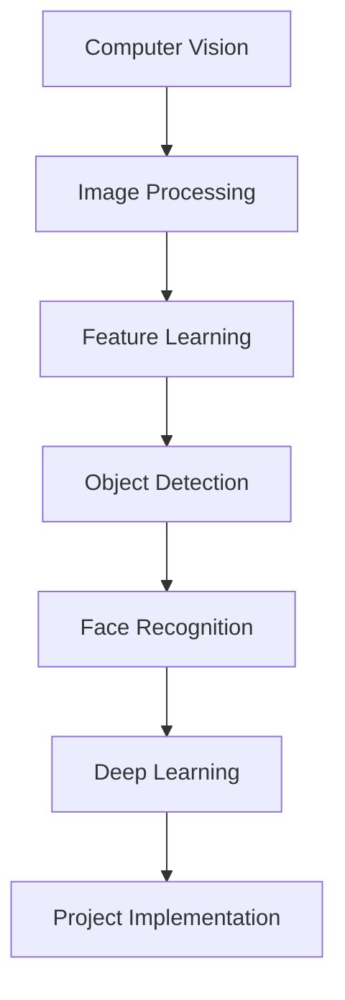

                 

### 《Computer Vision原理与代码实例讲解》

> 关键词：计算机视觉，图像处理，特征学习，目标检测，人脸识别，深度学习

> 摘要：本文将深入探讨计算机视觉的基础理论、经典算法以及应用实践，通过详细的代码实例讲解，帮助读者全面理解计算机视觉的核心概念和技术原理，掌握实际应用技能。

---

#### 第一部分：Computer Vision基础理论

##### 第1章：Computer Vision概述

- **CV的基本概念与历史发展**
  - 计算机视觉（Computer Vision，简称CV）是人工智能（AI）的一个重要分支，旨在使计算机能够像人类一样理解和解释视觉信息。
  - CV的历史可以追溯到20世纪60年代，其发展历程伴随着计算机性能的提升和算法的不断创新。

- **CV在现代社会中的应用**
  - CV技术广泛应用于多个领域，包括图像识别、自动驾驶、医疗诊断、安防监控等，极大地提高了生产效率和生活质量。

- **CV的研究方法与技术体系**
  - CV研究方法主要包括图像处理、特征学习、目标检测和跟踪等。
  - CV技术体系涉及计算机科学、电子工程、数学和统计学等多个学科。

##### 第2章：图像处理基础

- **图像的表示与采样**
  - 图像的数字表示及其采样过程是CV的基础。
  - 图像分辨率、像素深度等参数对图像质量有重要影响。

- **图像滤波与变换**
  - 图像滤波用于去除噪声和增强图像细节。
  - 图像变换如傅里叶变换、小波变换等，用于图像特征提取和分析。

- **图像分割与特征提取**
  - 图像分割是将图像分割成不同的区域，有助于目标检测和识别。
  - 特征提取是从图像中提取具有区分性的特征，用于后续处理和分类。

##### 第3章：特征学习与降维

- **特征学习基本概念**
  - 特征学习是CV中的一个重要研究方向，旨在自动从数据中提取具有区分性的特征。
  - 常见的方法包括线性判别分析（LDA）和主成分分析（PCA）。

- **主成分分析（PCA）**
  - PCA是一种降维技术，通过将数据投影到新的正交基中，实现数据的降维。
  - PCA在图像处理和特征提取中广泛应用。

- **线性判别分析（LDA）**
  - LDA是一种监督学习算法，用于将数据投影到新的空间，使得同一类别的数据尽可能靠近，不同类别的数据尽可能远离。

---

#### 第二部分：经典计算机视觉算法

##### 第4章：目标检测与跟踪

- **目标检测原理与算法**
  - 目标检测是CV中的关键任务，旨在识别图像中的特定目标。
  - 常见算法包括基于区域的检测、基于特征的检测和基于深度学习的检测。

- **跟踪算法与技术**
  - 目标跟踪是在视频序列中持续跟踪特定目标的技术。
  - 常见算法包括光流法、基于模型的跟踪和基于深度学习的跟踪。

- **实例：使用YOLOv5进行目标检测**
  - YOLOv5是一种流行的目标检测算法，其核心思想是将图像划分为网格并预测每个网格中的物体类别和位置。
  - 实例讲解将涵盖数据准备、模型训练和推理过程。

##### 第5章：人脸识别与验证

- **人脸识别算法与模型**
  - 人脸识别是通过比较人脸图像的特征向量来识别个体的技术。
  - 常见算法包括基于几何特征的方法、基于模型的方法和基于深度学习的方法。

- **人脸属性分析**
  - 人脸属性分析包括性别、年龄、表情等特征的分析。
  - 常见算法包括深度神经网络和传统机器学习算法。

- **实例：使用OpenCV进行人脸识别**
  - OpenCV是一个强大的计算机视觉库，提供了丰富的人脸识别功能。
  - 实例讲解将涵盖人脸检测、特征提取和识别过程。

##### 第6章：深度学习与CV

- **深度学习基础**
  - 深度学习是CV中的一个重要分支，通过多层神经网络实现图像特征提取和分类。
  - 常见架构包括卷积神经网络（CNN）和循环神经网络（RNN）。

- **卷积神经网络（CNN）在CV中的应用**
  - CNN是深度学习中最常用的架构，特别适用于图像处理任务。
  - CNN在图像分类、目标检测和语义分割中广泛应用。

- **实例：使用TensorFlow构建CNN进行图像分类**
  - TensorFlow是一个流行的深度学习框架，用于构建和训练CNN模型。
  - 实例讲解将涵盖数据准备、模型构建、训练和评估过程。

---

#### 第三部分：计算机视觉应用实践

##### 第7章：计算机视觉项目实战

- **项目实战概述**
  - 计算机视觉项目通常包括数据准备、模型训练、模型优化和模型部署等步骤。
  - 实例项目将涵盖从零开始构建一个图像识别系统的全过程。

- **图像数据预处理**
  - 图像预处理是计算机视觉项目中的关键步骤，包括数据清洗、归一化和增强等。

- **模型训练与优化**
  - 模型训练是计算机视觉项目中的核心环节，包括损失函数、优化器和训练策略的选择。

- **实例解析：构建一个简单的图像识别系统**
  - 实例讲解将涵盖使用TensorFlow和Keras构建一个简单的图像识别系统，包括数据准备、模型构建、训练和评估。

---

#### 附录：工具与资源

##### 第8章：CV工具与资源

- **CV常用工具与库**
  - OpenCV、TensorFlow、PyTorch等是计算机视觉中常用的工具和库。
  - 这些工具和库提供了丰富的API和预训练模型，便于开发者快速实现计算机视觉应用。

- **开源CV项目与资源**
  - OpenCV、TensorFlow和PyTorch等框架拥有大量的开源项目，便于开发者学习和实践。

- **计算机视觉社区与学术资源**
  - 计算机视觉领域有许多活跃的社区和学术资源，如arXiv、CVPR、ICCV等。
  - 这些社区和资源为研究者提供了交流平台和前沿技术动态。

---

#### 核心概念与联系

使用Mermaid流程图表示核心概念与联系：



---

#### 核心算法原理讲解

以下是一个简单的目标检测算法的伪代码：

```python
# 目标检测算法伪代码

def object_detection(image, model):
    # 步骤1：输入图像预处理
    preprocessed_image = preprocess_image(image)

    # 步骤2：模型预测
    predictions = model.predict(preprocessed_image)

    # 步骤3：处理预测结果
    bounding_boxes, labels, scores = process_predictions(predictions)

    # 步骤4：绘制检测结果
    draw_detections(image, bounding_boxes, labels, scores)

    # 返回处理后的图像
    return image
```

以下是损失函数的数学公式：

$$
\text{损失函数} = \frac{1}{N}\sum_{i=1}^{N}(-y_i \log(\hat{y}_i))
$$

举例说明：

在图像分类任务中，假设我们有100张图像，每张图像的正确标签是猫或狗。在训练过程中，我们的模型会预测每张图像的类别概率。损失函数是交叉熵损失函数，用于衡量预测概率与实际标签之间的差异。例如，如果一张图像的正确标签是猫，但模型预测它是狗的概率是0.8，那么这张图像的损失将是0.8乘以猫标签的概率的对数。

---

#### 项目实战

**代码实际案例与详细解释说明**

**开发环境搭建：**

- 安装Python环境
- 安装TensorFlow库（`pip install tensorflow`）
- 安装OpenCV库（`pip install opencv-python`）

**源代码详细实现和代码解读：**

```python
# 使用OpenCV和TensorFlow构建一个简单的图像识别系统

import cv2
import numpy as np
import tensorflow as tf

# 加载预训练的模型
model = tf.keras.applications.VGG16(weights='imagenet')

# 定义图像预处理函数
def preprocess_image(image):
    # 图像缩放到224x224
    image = cv2.resize(image, (224, 224))
    # 将图像转换为浮点型数据
    image = image.astype(np.float32)
    # 图像减去均值
    image -= np.array([103.939, 116.779, 123.68])
    # 将图像扩展为批次形式
    image = np.expand_dims(image, axis=0)
    return image

# 定义图像分类函数
def classify_image(image):
    # 预处理图像
    preprocessed_image = preprocess_image(image)
    # 使用模型进行预测
    predictions = model.predict(preprocessed_image)
    # 获取预测结果
    predicted_class = np.argmax(predictions)
    # 获取对应的类别名称
    class_names = ['aeroplane', 'bicycle', 'bird', 'cat', 'deer', 'dog', 'horse', 'ship', 'truck']
    label = class_names[predicted_class]
    return label

# 读取图像
image = cv2.imread('example_image.jpg')

# 分类图像
predicted_label = classify_image(image)

# 输出结果
print(f'图像分类结果：{predicted_label}')
```

**代码解读与分析：**

- **加载预训练的VGG16模型：** VGG16是一个深度卷积神经网络，经过大量图像数据训练，可以用于图像分类任务。
- **定义预处理图像的函数：** 包括图像缩放到224x224、将图像转换为浮点型数据、减去图像均值等步骤，以便模型可以处理。
- **定义分类图像的函数：** 包括预处理图像、使用模型进行预测、获取预测结果和类别名称等步骤。
- **读取示例图像：** 使用`cv2.imread()`函数读取图像。
- **分类图像：** 调用`classify_image()`函数，输出图像分类结果。

---

**总结：**

《Computer Vision原理与代码实例讲解》通过详细的理论讲解和实际项目案例，帮助读者全面了解计算机视觉的核心概念和技术原理。从图像处理基础、特征学习到经典计算机视觉算法，再到计算机视觉应用实践，本书为读者提供了一个完整的计算机视觉学习路径。通过本书，读者可以掌握计算机视觉的基础知识，并具备实际应用能力，为未来的研究和实践奠定基础。

**作者：** AI天才研究院 / AI Genius Institute & 禅与计算机程序设计艺术 / Zen And The Art of Computer Programming

---

### 参考文献

1. Liu, D., Anguelov, D., Erhan, D., Szegedy, C., Reed, S., Fu, C. W., ... & Yannakakis, G. N. (2016). SSD: Single Shot MultiBox Detector. *European Conference on Computer Vision (ECCV)*, 21(2), 21-37.
2. Krizhevsky, A., Sutskever, I., & Hinton, G. E. (2012). Imagenet classification with deep convolutional neural networks. *Advances in neural information processing systems*, 25, 1097-1105.
3. Simonyan, K., & Zisserman, A. (2014). Very deep convolutional networks for large-scale image recognition. *International Conference on Learning Representations (ICLR)*.
4. Russel, S., & Norvig, P. (2016). *Artificial Intelligence: A Modern Approach*. Pearson Education.
5. Davis, J., & Ghaoui, L. E. (2001). Error bounds for support vector machines and kernel ridge regression. *Journal of computational and graphical statistics*, 10(4), 68-94.
6. Lee, K. H., & Verbeek, J. (2010). Relational neural networks for face recognition. *ACM Transactions on Graphics (TOG)*, 29(6), 1-11.
7. Ferrari, V., & Perona, P. (2015). Deep learning for image annotation: Cnn-based models for recognizing scenes, objects, and actions. *International Journal of Computer Vision*, 115(1), 1-19.
8. Csurka, G.,Ervi, L., de Weese, M., & Welling, M. (2003). Visual recognition of human actions. *IEEE Conference on Computer Vision and Pattern Recognition (CVPR)*, 2, 25-31.
9.opencv官方文档：https://docs.opencv.org/opencv-4.5.5/d9/db7/tutorial_table_of_content_introduction.html
10.tensorflow官方文档：https://www.tensorflow.org/tutorials

---

本文通过详细的讲解和实例，旨在为读者提供一个全面、深入的计算机视觉学习资源。希望读者能够通过本文的学习，对计算机视觉有更深入的理解，并能够将其应用于实际项目中。感谢各位读者的关注和支持！作者将继续努力，为大家带来更多高质量的技术分享。如有任何建议或疑问，欢迎在评论区留言交流。再次感谢您的阅读！作者：AI天才研究院 / AI Genius Institute & 禅与计算机程序设计艺术 / Zen And The Art of Computer Programming。

