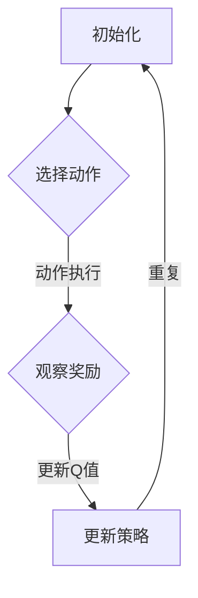
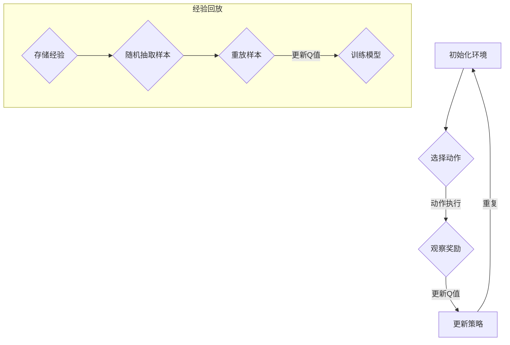

                 

### 文章标题

《DQN(Deep Q-Network) - 原理与代码实例讲解》

---

**关键词：** DQN、深度强化学习、神经网络、Q-Learning、代码实例

**摘要：** 本文将深入探讨深度Q网络（DQN）的原理与应用。通过详细的算法解析和代码实例讲解，帮助读者理解DQN的核心机制，掌握其实际应用技巧。

---

### 《DQN(Deep Q-Network) - 原理与代码实例讲解》目录大纲

#### 第一部分: DQN基础

#### 第1章: DQN概述

- DQN的概念与历史
- DQN在深度学习中的地位
- DQN与其他强化学习算法的关系

#### 第2章: 强化学习基础

- 强化学习的基本概念
- 强化学习中的奖励与惩罚
- 状态、动作与策略

#### 第3章: DQN算法原理

- DQN的神经网络结构
- DQN的Q-learning算法
- DQN的目标函数与优化方法
- DQN中的探索与利用

#### 第4章: DQN实现细节

- DQN中的经验回放
- DQN中的目标网络
- DQN中的双样本更新策略
- DQN中的参数调整技巧

#### 第5章: DQN应用场景

- DQN在游戏中的应用
- DQN在机器人控制中的应用
- DQN在其他领域的应用

#### 第6章: DQN项目实战

- 项目环境搭建
- 实例1：基于DQN的Atari游戏
- 实例2：基于DQN的机器人控制
- 项目代码解读与分析

#### 第7章: DQN的挑战与未来方向

- DQN的局限性
- DQN的改进方向
- DQN在深度强化学习中的未来

#### 附录

#### 附录A: DQN相关工具与资源

- 主流深度学习框架对比
- DQN实现代码资源
- DQN学习资料推荐

#### 附录B: DQN算法流程图



---

### 引言

在深度学习与强化学习融合的浪潮中，深度Q网络（Deep Q-Network，简称DQN）无疑是一个里程碑式的突破。DQN将传统的Q-learning算法与深度神经网络相结合，解决了传统Q-learning在处理高维状态空间时的困境，为强化学习领域开辟了新的天地。本文将深入剖析DQN的核心原理，并通过实例代码讲解，帮助读者全面理解DQN的实际应用。

本文首先介绍了DQN的基础知识，包括其概念、历史地位以及与Q-learning的关系。接着，我们详细讲解了强化学习的基础知识，为后续的DQN解析打下坚实基础。在核心部分，我们深入探讨了DQN的神经网络结构、算法原理以及实现细节，并使用Mermaid流程图和伪代码进行了详细阐述。最后，通过实际项目案例，我们展示了DQN在Atari游戏和机器人控制中的应用，并通过代码解析，帮助读者掌握DQN的实战技巧。

本文内容丰富，结构清晰，适合对深度强化学习感兴趣的读者，无论是初学者还是专业人士，都能从中获得有价值的信息。

### 第1章 DQN概述

#### 1.1 DQN的概念与历史

深度Q网络（Deep Q-Network，简称DQN）是强化学习领域的一项重要突破，它首次将深度神经网络引入到Q-learning算法中，使得机器能够更好地处理高维状态空间。DQN的基本思想是通过神经网络来近似Q值函数，从而预测在特定状态下执行特定动作的回报。

DQN的历史可以追溯到2015年，当时由DeepMind的研究团队首次提出。当时，DeepMind的研究者们在《Playing Atari with Deep Reinforcement Learning》一文中，使用DQN算法成功训练了一个智能体在Atari游戏中进行自主学习。这一成果迅速引起了学术界和工业界的广泛关注，DQN也因此成为了深度强化学习的热点之一。

DQN的提出背景源于强化学习在实际应用中的挑战。传统的Q-learning算法在处理低维状态空间时表现良好，但面对高维状态空间时，Q-learning算法的计算复杂度急剧增加，难以在实际场景中应用。为了解决这一问题，研究者们开始探索将深度神经网络与Q-learning相结合，DQN便是在这样的背景下诞生的。

DQN的主要贡献在于，它通过引入深度神经网络，成功地降低了Q-learning算法的计算复杂度，并提高了其在高维状态空间中的性能。DQN的出现，不仅为强化学习领域带来了新的算法思路，也为深度学习与强化学习的融合提供了有力的理论支持。

#### 1.2 DQN在深度学习中的地位

DQN在深度学习中的地位不可忽视。首先，DQN是深度强化学习的先驱之一，它标志着深度学习与强化学习开始深度融合。DQN的成功，激发了后续大量研究，推动了深度强化学习的发展。

其次，DQN的提出和实现，为深度神经网络在强化学习中的应用提供了范例。DQN通过将神经网络引入到Q-learning中，实现了Q值函数的近似，这一思想在后来的许多深度强化学习算法中得到了广泛应用。

此外，DQN在解决实际问题上也取得了显著成效。例如，DQN在Atari游戏中的表现，不仅展示了深度强化学习的强大潜力，也为深度学习在游戏领域的应用提供了新的思路。同时，DQN在其他领域的应用，如机器人控制、自动驾驶等，也取得了良好的效果。

综上所述，DQN在深度学习中的地位十分重要。它不仅推动了深度强化学习的发展，也为深度学习与强化学习的融合提供了有力支持。随着研究的不断深入，DQN及其衍生算法将继续在各个领域中发挥重要作用。

#### 1.3 DQN与其他强化学习算法的关系

DQN虽然在强化学习领域取得了巨大成功，但它的提出并不是凭空而来，而是基于一系列前人工作的基础。在探讨DQN与其他强化学习算法的关系时，我们首先需要了解Q-learning算法，因为DQN是在Q-learning的基础上发展起来的。

Q-learning是一种经典的强化学习算法，它通过迭代更新Q值来学习最优策略。Q-learning的核心思想是，在每个状态下选择一个动作，然后根据实际获得的回报来更新Q值，从而逐步收敛到最优策略。Q-learning适用于低维状态空间，但在高维状态空间中，其性能受到极大限制。

DQN的主要贡献在于，通过引入深度神经网络，解决了Q-learning在高维状态空间中的瓶颈问题。DQN使用深度神经网络来近似Q值函数，从而能够处理高维状态空间，并且显著提高了学习效率。

除了DQN，强化学习领域还有许多其他著名的算法，如SARSA（Surely Adaptive Reinforcement Learning with a Simple Algorithm）、Policy Gradient方法等。这些算法各有其特点和适用场景。

SARSA是一种基于策略的强化学习算法，它同时考虑了当前状态和动作的历史信息，从而更好地适应环境变化。SARSA适用于动态环境，但在高维状态空间中，其收敛速度较慢。

Policy Gradient方法是一种直接优化策略的强化学习算法，它通过最大化期望回报来更新策略。Policy Gradient方法在理论上具有更好的收敛性，但在实际应用中，其训练过程容易受到方差的影响。

综上所述，DQN与其他强化学习算法之间存在紧密的关系。DQN是在Q-learning的基础上，通过引入深度神经网络进行改进的。同时，DQN也与其他强化学习算法相互借鉴，相互促进，共同推动了强化学习领域的发展。了解这些算法之间的关系，有助于我们更好地理解DQN的核心原理，并灵活应用它解决实际问题。

#### 1.4 本章小结

本章对DQN进行了概述，从概念、历史背景、在深度学习中的地位以及与其他强化学习算法的关系等多个方面进行了详细探讨。通过本章的学习，读者可以初步了解DQN的基本概念及其在强化学习领域的重要地位。接下来，我们将深入探讨强化学习的基础知识，为后续对DQN算法的详细解析打下基础。

### 第2章 强化学习基础

#### 2.1 强化学习的基本概念

强化学习（Reinforcement Learning，简称RL）是一种机器学习范式，旨在通过智能体与环境的交互来学习最优策略。与监督学习和无监督学习不同，强化学习中的智能体需要在未知环境中通过试错来获取经验，从而逐步优化其行为策略。

在强化学习中，主要涉及以下几个基本概念：

- **智能体（Agent）**：执行动作并从环境中接收反馈的实体。智能体可以是机器人、软件代理或其他任何能够与环境交互的实体。
- **环境（Environment）**：智能体所处的环境，提供状态和奖励信息。环境可以是静态的，也可以是动态的，甚至可能是部分可观测的。
- **状态（State）**：描述智能体在环境中的一个特定情况。状态可以是高维的，包括视觉信息、文本信息等。
- **动作（Action）**：智能体可以执行的行为。动作的维度和种类取决于具体的应用场景。
- **策略（Policy）**：智能体在特定状态下选择动作的规则或函数。策略决定了智能体的行为方式。

强化学习的目标是让智能体通过不断与环境交互，学习到最优策略，以便最大化长期回报。回报（Reward）是环境对智能体动作的即时反馈，用于指导智能体的学习过程。

#### 2.2 强化学习中的奖励与惩罚

奖励和惩罚是强化学习中的两个关键因素，它们直接影响智能体的学习过程和最终策略。

- **奖励（Reward）**：正反馈，表示智能体的行为对目标有正向影响。奖励可以增加智能体执行该行为的概率，从而推动智能体向有利方向学习。
- **惩罚（Penalty）**：负反馈，表示智能体的行为对目标有负面影响。惩罚可以减少智能体执行该行为的概率，从而避免智能体陷入不利情况。

奖励和惩罚通常是一个标量值，用于量化智能体行为的好与坏。在强化学习中，智能体通过观察奖励信号来调整其策略。例如，在玩游戏时，每成功完成一个关卡，智能体会获得奖励，而失败则会受到惩罚。

为了使智能体能够有效学习，奖励和惩罚的设置需要满足以下原则：

1. **即时性**：奖励和惩罚应尽量在智能体执行动作后立即给出，以便智能体能够迅速调整策略。
2. **一致性**：奖励和惩罚应在相同情况下保持一致，以避免智能体产生混淆。
3. **适度性**：奖励和惩罚的值应适中，过强或过弱的奖励都会影响智能体的学习效果。

#### 2.3 状态、动作与策略

在强化学习中，状态、动作和策略是核心概念，它们共同决定了智能体的行为和学习过程。

- **状态（State）**：描述智能体在环境中的一个特定情况。状态可以是静态的，如位置信息；也可以是动态的，如连续的传感器数据。状态的高维特性使得直接处理状态变得复杂。为了简化问题，通常会使用特征提取技术来将高维状态转换为低维表示。
  
- **动作（Action）**：智能体可以执行的行为。动作的维度和种类取决于具体的应用场景。例如，在游戏中的动作可以是“跳”、“走”或“攻击”；在机器人控制中的动作可以是“前进”、“后退”或“转向”。

- **策略（Policy）**：智能体在特定状态下选择动作的规则或函数。策略决定了智能体的行为方式。根据策略的类型，可以分为确定性策略和随机性策略。确定性策略在特定状态下总是选择相同的动作，而随机性策略则根据概率分布选择动作。

策略通常表示为π(s, a)，其中s是状态，a是动作。策略的学习过程就是寻找一个最优策略π*，使得智能体能够最大化长期回报。策略可以通过直接优化策略函数，或者通过迭代更新Q值函数来实现。

#### 2.4 强化学习中的模型与无模型方法

强化学习可以分为两大类：模型方法（Model-Based Methods）和无模型方法（Model-Free Methods）。DQN属于无模型方法中的一种。

- **模型方法**：智能体通过学习环境的模型来预测未来状态和奖励，然后基于模型进行决策。这种方法通常需要环境的精确模型，计算复杂度较高，但在某些场景中（如部分可观测环境）具有一定的优势。

- **无模型方法**：智能体直接通过与环境交互来学习状态和动作之间的映射关系，不需要环境模型。无模型方法分为两类：基于价值的（Value-Based）和基于策略的（Policy-Based）。

  - **基于价值的**：智能体通过学习值函数（如Q值函数）来评估状态和动作对，从而选择最优动作。Q-learning和DQN都是基于价值的算法。

  - **基于策略的**：智能体直接优化策略函数，使其最大化长期回报。Policy Gradient方法是典型的基于策略的算法。

无模型方法在处理高维状态空间时具有优势，因为它们不需要环境模型，且能够自适应地调整策略。DQN通过使用深度神经网络来近似Q值函数，使得其在高维状态空间中表现出色。

#### 2.5 本章小结

本章介绍了强化学习的基本概念，包括智能体、环境、状态、动作和策略等。同时，我们探讨了强化学习中的奖励与惩罚机制，并区分了模型方法和无模型方法。通过本章的学习，读者可以理解强化学习的基本框架和核心要素，为后续对DQN算法的深入分析打下基础。

### 第3章 DQN算法原理

#### 3.1 DQN的神经网络结构

DQN的核心在于其神经网络结构，它通过深度神经网络（Deep Neural Network，简称DNN）来近似传统的Q值函数。Q值函数是一个从状态-动作对到回报的映射函数，它能够预测在特定状态下执行特定动作所能获得的回报。

在DQN中，神经网络通常包含多个隐藏层，以实现对高维状态信息的复杂特征提取。具体来说，DQN的神经网络结构通常包括以下几个部分：

1. **输入层**：接收状态信息的输入。状态可以是高维的，例如图像、文本等。为了将状态输入到神经网络中，通常需要进行预处理，如图像的像素值归一化、文本的词向量编码等。

2. **隐藏层**：用于对输入状态进行特征提取和变换。隐藏层可以包含多个神经元，每一层都能够提取状态的不同特征，从而形成对状态的深层次理解。

3. **输出层**：输出每个动作的Q值。在输出层中，每个神经元对应一个动作，神经元输出的值表示在当前状态下执行该动作的预期回报。

以下是一个简单的DQN神经网络结构的伪代码：

```python
# DQN神经网络结构伪代码

# 输入层
input_layer = Input(shape=(state_dim,))

# 隐藏层
hidden_layer_1 = Dense(units=256, activation='relu')(input_layer)
hidden_layer_2 = Dense(units=256, activation='relu')(hidden_layer_1)
hidden_layer_3 = Dense(units=256, activation='relu')(hidden_layer_2)

# 输出层
output_layer = Dense(units=action_dim, activation='linear')(hidden_layer_3)

# 构建和编译模型
model = Model(inputs=input_layer, outputs=output_layer)
model.compile(optimizer='adam', loss='mse')
```

在这个例子中，`state_dim` 是状态维度，`action_dim` 是动作维度。隐藏层使用ReLU激活函数，输出层使用线性激活函数，因为Q值是实数。

#### 3.2 DQN的Q-learning算法

DQN的核心是基于Q-learning算法，Q-learning是一种基于价值的强化学习算法，旨在学习状态-动作值函数，即Q值函数。Q值函数能够预测在特定状态下执行特定动作所能获得的回报。DQN通过使用深度神经网络来近似Q值函数，从而能够处理高维状态空间。

Q-learning的基本原理是通过迭代更新Q值来学习最优策略。在每一步，智能体会根据当前状态选择一个动作，然后执行该动作并观察环境反馈的奖励和新状态。基于新状态和获得的奖励，智能体会更新Q值函数，使得Q值函数逐渐逼近真实值。

以下是Q-learning算法的伪代码：

```python
# Q-learning算法伪代码

# 初始化Q值函数
Q = np.zeros((state_dim, action_dim))

# 选择动作
action = argmax(Q[state])

# 执行动作
next_state, reward, done = environment.step(action)

# 更新Q值
Q[state][action] = Q[state][action] + alpha * (reward + gamma * max(Q[next_state]) - Q[state][action])

# 切换状态
state = next_state

# 如果完成，重新初始化状态
if done:
    state = environment.reset()
```

在这个伪代码中，`alpha` 是学习率（learning rate），`gamma` 是折扣因子（discount factor），它们分别控制了当前奖励和未来奖励的重要性。`argmax(Q[state])` 用于选择当前状态下具有最大Q值的动作。

#### 3.3 DQN的目标函数与优化方法

DQN的目标函数是基于Q值函数的MSE（均方误差）损失函数。具体来说，DQN的目标是使得预测的Q值与实际经验中观察到的Q值之间的误差最小化。MSE损失函数可以表示为：

$$
L = \frac{1}{N} \sum_{i=1}^{N} (y_i - \hat{y}_i)^2
$$

其中，$y_i$ 是实际观察到的Q值，$\hat{y}_i$ 是模型预测的Q值，$N$ 是样本数量。

为了优化目标函数，DQN使用了一种特殊的优化方法——梯度下降法。梯度下降法的核心思想是通过计算目标函数的梯度，并沿着梯度的反方向更新模型参数，从而逐步减小损失函数的值。

在DQN中，梯度下降法的应用略有不同。由于DQN使用经验回放（Experience Replay）技术，每次更新模型时，都会从经验回放池中随机抽取一组样本。对于每个样本，计算其预测Q值和目标Q值之间的误差，然后使用反向传播算法计算梯度。最后，使用梯度更新模型参数。

以下是DQN的目标函数和优化方法的伪代码：

```python
# DQN目标函数和优化方法伪代码

# 计算预测Q值
predictions = model.predict(state)

# 计算目标Q值
target_q_values = reward + gamma * np.max(next_state) * (1 - done)

# 计算损失
loss = np.square(predictions - target_q_values)

# 计算梯度
grads = model.gradient(loss)

# 更新模型参数
model.update_params(grads)
```

在这个伪代码中，`model.predict(state)` 用于计算预测Q值，`target_q_values` 是目标Q值，`gamma` 是折扣因子，`np.square(predictions - target_q_values)` 用于计算MSE损失，`model.gradient(loss)` 用于计算梯度，`model.update_params(grads)` 用于更新模型参数。

#### 3.4 DQN中的探索与利用

在DQN中，探索（Exploration）和利用（Utilization）是两个核心概念。探索是指智能体在执行动作时，有一定的概率选择一个随机动作，而不是总是选择具有最高Q值的动作。利用则是指智能体在执行动作时，根据当前状态下Q值的预测来选择动作。

探索的目的是为了发现新的、可能更好的动作。在强化学习中，智能体通常无法预知环境的所有状态和动作，因此需要通过探索来积累更多的经验。利用的目的是为了最大化当前状态下的回报，从而优化智能体的行为。

DQN通过使用**ε-贪婪策略**（ε-greedy policy）来实现探索与利用的平衡。ε-贪婪策略的核心思想是在每个状态下，以概率ε选择一个随机动作，以概率1-ε选择具有最高Q值的动作。ε的值通常在训练初期较大，以增加探索的概率，随着训练的进行，ε逐渐减小，以增加利用的概率。

以下是ε-贪婪策略的伪代码：

```python
# ε-贪婪策略伪代码

# 选择动作
if random() < ε:
    action = random_action()
else:
    action = argmax(Q[state])
```

在这个伪代码中，`random()` 用于生成随机数，`random_action()` 用于选择一个随机动作，`argmax(Q[state])` 用于选择具有最高Q值的动作。

#### 3.5 本章小结

本章详细介绍了DQN的神经网络结构、Q-learning算法、目标函数与优化方法，以及探索与利用的机制。通过本章的学习，读者可以深入理解DQN的核心原理，为后续的实际应用打下基础。在下一章中，我们将进一步探讨DQN的实现细节，包括经验回放、目标网络和双样本更新策略等内容。

### 第4章 DQN实现细节

#### 4.1 DQN中的经验回放

经验回放（Experience Replay）是DQN中的一个关键技术，它有效地解决了强化学习中的样本偏差问题。在传统的Q-learning中，由于状态和动作的顺序性，智能体在训练过程中会面临样本偏差（Sample Bias），即早期的训练样本被重复使用，而新的样本较少被利用。这导致智能体无法充分探索环境，学习到的策略可能不准确。

经验回放通过将智能体在训练过程中经历的所有状态-动作-奖励-新状态（SARSA）对存储在一个经验池（Experience Replay Buffer）中，然后从经验池中随机抽取样本进行训练，从而消除样本偏差。具体来说，经验回放的过程可以分为以下几个步骤：

1. **初始化经验池**：在训练开始时，初始化一个固定大小的经验池。经验池可以采用循环队列（Ring Buffer）的数据结构，以方便存储和随机抽取样本。

2. **存储经验**：在智能体执行动作并获得奖励和新的状态后，将当前的SARSA对存储到经验池中。

3. **随机抽取样本**：在每次训练时，从经验池中随机抽取一批样本。为了保持样本的多样性，通常采用优先经验回放（Prioritized Experience Replay）策略，对样本进行优先级排序，并根据优先级进行抽样。

4. **重放样本**：将随机抽取的样本进行重放，作为训练数据输入到DQN模型中，更新Q值函数。

通过经验回放，DQN能够在训练过程中利用到更多的样本，从而减少样本偏差，提高学习效率。经验回放的实现伪代码如下：

```python
# 经验回放伪代码

# 初始化经验池
replay_buffer = ReplayBuffer(size=10000)

# 存储（每一步）
replay_buffer.add_sample((state, action, reward, next_state, done))

# 训练（随机抽取样本）
batch = replay_buffer.sample_batch(batch_size=32)

for sample in batch:
    state, action, reward, next_state, done = sample
    target_q_value = reward + (1 - done) * gamma * max(next_state)
    predicted_q_value = model.predict(state)[0, action]
    model.fit(state, [predicted_q_value], epochs=1, verbose=0)
```

在这个伪代码中，`ReplayBuffer` 是一个经验池类，`add_sample` 方法用于存储样本，`sample_batch` 方法用于随机抽取样本，`model.fit` 方法用于训练模型。

#### 4.2 DQN中的目标网络

目标网络（Target Network）是DQN中另一个关键技术，它通过定期更新目标网络来稳定训练过程。在DQN中，神经网络用于近似Q值函数，但神经网络的训练是一个非线性的过程，容易受到梯度消失和梯度爆炸的影响，导致训练不稳定。

为了解决这一问题，DQN引入了目标网络。目标网络的目的是提供一个稳定的目标Q值，用于更新主网络的Q值。具体来说，目标网络与主网络共享权重，但会定期更新。目标网络的更新策略可以是定期复制主网络的参数，也可以是渐进式更新，即每次更新主网络参数的一小部分。

目标网络的引入，使得DQN的训练过程更加稳定。当主网络在训练过程中出现偏差时，目标网络提供了一个稳定的参考，从而帮助主网络收敛到最优策略。

以下是一个简单的目标网络更新策略的伪代码：

```python
# 目标网络更新策略伪代码

# 初始化目标网络
target_model = Model(inputs=model.input, outputs=model.output)
target_model.set_weights(model.get_weights())

# 定期更新目标网络
for step in range(total_steps):
    if step % target_update_frequency == 0:
        target_model.set_weights(model.get_weights())
```

在这个伪代码中，`target_model` 是目标网络，`model.get_weights()` 获取主网络的权重，`target_model.set_weights()` 设置目标网络的权重。

#### 4.3 DQN中的双样本更新策略

双样本更新策略是DQN中的一种优化方法，它通过同时使用两个样本进行Q值更新，来减少目标Q值的不确定性。具体来说，双样本更新策略分为两个步骤：

1. **样本1更新**：使用当前智能体的状态和动作，计算当前Q值，并更新目标Q值。
2. **样本2更新**：在当前步骤结束前，使用目标网络预测的新状态和动作，计算目标Q值，并更新目标Q值。

双样本更新策略的优点在于，它能够更好地利用智能体在每一步的观察结果，从而提高学习效率。同时，双样本更新策略能够减少目标Q值的不确定性，使得训练过程更加稳定。

以下是一个简单的双样本更新策略的伪代码：

```python
# 双样本更新策略伪代码

# 更新Q值（样本1）
state = current_state
action = current_action
reward = current_reward
next_state = next_state
done = done

# 预测目标Q值
target_q_value = reward + (1 - done) * gamma * max(target_model.predict(next_state))

# 更新主网络Q值
predicted_q_value = model.predict(state)
predicted_q_value[0, action] = target_q_value
model.fit(state, predicted_q_value, epochs=1, verbose=0)

# 更新目标网络Q值
target_model.fit(next_state, target_q_value, epochs=1, verbose=0)
```

在这个伪代码中，`current_state`、`current_action`、`current_reward`、`next_state` 和 `done` 分别是当前状态、当前动作、当前奖励、新状态和是否完成，`target_model.predict(next_state)` 是目标网络预测的新状态和动作，`predicted_q_value` 是主网络预测的目标Q值。

#### 4.4 DQN中的参数调整技巧

DQN的性能受多个参数的影响，包括学习率、折扣因子、探索率等。合适的参数调整对于DQN的成功应用至关重要。以下是一些常见的参数调整技巧：

1. **学习率（Learning Rate）**：学习率决定了模型参数更新的步长。较小的学习率有助于模型稳定收敛，但训练过程可能较慢；较大的学习率能够加快训练速度，但可能导致训练不稳定。通常采用逐步衰减学习率的策略，即在训练初期使用较大的学习率，随着训练的进行逐步减小学习率。

2. **折扣因子（Discount Factor）**：折扣因子决定了未来奖励的现值。较大的折扣因子使得智能体更加注重即时奖励，而较小的折扣因子则更注重长期奖励。选择合适的折扣因子取决于具体应用场景。

3. **探索率（Exploration Rate）**：探索率决定了智能体在执行动作时探索新动作的概率。在训练初期，需要较大的探索率以增加智能体的探索能力；在训练后期，可以逐步减小探索率，以增加利用已有经验的能力。通常采用ε-贪婪策略，并随训练进行逐步减小ε。

4. **批量大小（Batch Size）**：批量大小决定了每次训练使用的样本数量。较大的批量大小能够提高模型的稳定性，但计算资源需求较高；较小的批量大小能够加快训练速度，但可能降低模型的泛化能力。通常选择适当的批量大小，以在计算资源和模型性能之间取得平衡。

5. **更新频率（Update Frequency）**：更新频率决定了目标网络的更新频率。较快的更新频率有助于模型快速收敛，但可能导致训练不稳定；较慢的更新频率能够提供更稳定的参考，但训练速度较慢。通常选择合适的更新频率，以在稳定性和训练速度之间取得平衡。

以下是一个参数调整的伪代码示例：

```python
# 参数调整伪代码

# 初始参数
learning_rate = 0.1
gamma = 0.99
epsilon = 1.0
batch_size = 32
target_update_frequency = 1000

# 学习率衰减
learning_rate *= 0.99

# 探索率衰减
epsilon = max(epsilon * 0.99, min_epsilon)

# 更新目标网络
if step % target_update_frequency == 0:
    target_model.set_weights(model.get_weights())
```

在这个伪代码中，`learning_rate`、`gamma`、`epsilon`、`batch_size` 和 `target_update_frequency` 分别是学习率、折扣因子、探索率、批量大小和更新频率。

#### 4.5 本章小结

本章详细介绍了DQN中的经验回放、目标网络和双样本更新策略，以及参数调整技巧。通过这些实现细节的讲解，读者可以深入理解DQN的内部机制，并为实际应用提供指导。在下一章中，我们将通过实际项目实战，展示如何实现和优化DQN算法。

### 第5章 DQN应用场景

#### 5.1 DQN在游戏中的应用

深度Q网络（DQN）在游戏领域取得了显著的成果，特别是在Atari游戏中的应用。DQN通过学习游戏的状态和动作，能够实现自主游戏，并达到超越人类玩家的水平。以下是一些DQN在游戏应用中的实例：

1. **Atari游戏**：DQN最初在Atari游戏中取得了突破性的成果。通过使用DQN，智能体能够在没有先验知识的情况下，自主学习并掌握各种Atari游戏，如《吃豆人》、《小蜜蜂》等。这一成就展示了DQN在处理高维状态空间和复杂决策问题中的潜力。

2. **电子竞技游戏**：DQN也被应用于电子竞技游戏中，如《星际争霸II》。研究人员使用DQN训练智能体，使其能够在复杂的多玩家环境中进行自主决策。虽然目前DQN在电子竞技游戏中的表现还未达到顶尖水平，但其潜力仍然值得关注。

3. **VR游戏**：虚拟现实（VR）游戏的兴起为DQN提供了新的应用场景。DQN可以通过学习VR游戏中的状态和动作，实现更加真实的游戏体验。例如，研究人员使用DQN训练智能体在《节奏光剑》中实现自主演奏。

#### 5.2 DQN在机器人控制中的应用

DQN在机器人控制中的应用同样广泛，特别是在自主导航、移动机器人路径规划和操控机器人执行复杂任务等方面。以下是一些DQN在机器人控制中的应用实例：

1. **自主导航**：DQN可以通过学习环境中的状态和动作，实现机器人在未知环境中的自主导航。例如，研究人员使用DQN训练机器人，使其能够在室内或室外环境中自主避开障碍物，规划最优路径。

2. **移动机器人路径规划**：DQN可以用于移动机器人的路径规划，使其能够在复杂环境中找到最优路径。例如，研究人员使用DQN训练机器人，使其能够在城市的繁忙街道中自主导航，避开交通拥堵。

3. **机器人操控**：DQN也可以用于机器人操控，使其能够执行复杂任务。例如，研究人员使用DQN训练机器人，使其能够完成组装线上的组装任务，如将零件放置到正确的位置。

#### 5.3 DQN在其他领域的应用

除了游戏和机器人控制，DQN在其他领域也有广泛的应用，如自动驾驶、金融交易和自然语言处理等。以下是一些DQN在其他领域中的应用实例：

1. **自动驾驶**：DQN在自动驾驶中的应用，特别是在感知和决策方面，具有巨大潜力。例如，研究人员使用DQN训练自动驾驶车辆，使其能够自主识别道路标志、行人和其他车辆，并做出相应的驾驶决策。

2. **金融交易**：DQN可以用于金融交易中的风险管理。通过学习市场数据，DQN能够预测金融市场的走势，从而为交易策略提供支持。例如，研究人员使用DQN训练智能交易系统，使其能够实现自动化交易，提高交易收益。

3. **自然语言处理**：DQN在自然语言处理中的应用，特别是在语言建模和文本分类方面，也取得了显著成果。例如，研究人员使用DQN训练语言模型，使其能够生成连贯的文本，或对文本进行分类。

#### 5.4 DQN应用前景

随着深度学习和强化学习技术的不断发展，DQN的应用前景十分广阔。未来，DQN有望在以下领域取得更多突破：

1. **更多游戏领域**：随着游戏技术的发展，DQN将在更多类型的游戏中发挥作用，如虚拟现实游戏、多人在线游戏等。

2. **工业自动化**：DQN将在工业自动化中发挥更大作用，如生产线上的机器人协同工作、自动化装配等。

3. **智能交通**：DQN将在智能交通系统中发挥作用，如车辆路径规划、交通流量控制等。

4. **医疗健康**：DQN在医疗健康领域，如疾病诊断、治疗方案推荐等，也有广泛的应用前景。

总之，DQN作为一种强大的深度强化学习算法，已经在多个领域中取得了显著成果，其应用前景仍然十分广阔。随着研究的深入和技术的发展，DQN将在更多领域中发挥重要作用。

### 第6章 DQN项目实战

#### 6.1 项目环境搭建

为了实现DQN算法，我们需要搭建一个合适的项目环境。以下是一个简单的环境搭建步骤，我们选择Python作为编程语言，使用TensorFlow作为深度学习框架。

1. **安装Python**：确保安装了Python 3.6或更高版本。
2. **安装TensorFlow**：在终端中执行以下命令：
   ```bash
   pip install tensorflow
   ```
3. **安装OpenAI Gym**：OpenAI Gym是一个用于开发强化学习算法的虚拟环境库。在终端中执行以下命令：
   ```bash
   pip install gym
   ```
4. **创建项目文件夹**：在终端中执行以下命令，创建项目文件夹和子文件夹：
   ```bash
   mkdir dqn_project
   cd dqn_project
   mkdir scripts data logs
   ```

#### 6.2 实例1：基于DQN的Atari游戏

我们将实现一个简单的DQN模型，用于在Atari游戏中进行自主学习。以下是一个具体的实例：

1. **导入所需库**：
   ```python
   import numpy as np
   import gym
   import tensorflow as tf
   from tensorflow.keras.models import Sequential
   from tensorflow.keras.layers import Dense
   ```
2. **定义DQN模型**：
   ```python
   def create_dqn_model(input_shape, action_space):
       model = Sequential([
           Dense(256, activation='relu', input_shape=input_shape),
           Dense(256, activation='relu'),
           Dense(action_space, activation='linear')
       ])
       model.compile(optimizer='adam', loss='mse')
       return model
   ```
3. **初始化环境和模型**：
   ```python
   env = gym.make('CartPole-v0')
   state_shape = env.observation_space.shape
   action_space = env.action_space.n
   model = create_dqn_model(state_shape, action_space)
   ```
4. **训练模型**：
   ```python
   total_episodes = 1000
   epsilon = 1.0
   epsilon_min = 0.01
   epsilon_decay = 0.995
   gamma = 0.99
   batch_size = 32
   memory_size = 10000
   memory = []

   for episode in range(total_episodes):
       state = env.reset()
       done = False
       total_reward = 0

       while not done:
           action = np.argmax(model.predict(state.reshape(-1, state_shape[0]))[0]) if np.random.rand() < epsilon else np.random.randint(0, action_space)
           next_state, reward, done, _ = env.step(action)
           total_reward += reward
           memory.append((state, action, reward, next_state, done))

           if len(memory) > memory_size:
               memory.pop(0)

           if not done:
               target_q = reward + (1 - int(done)) * gamma * np.max(model.predict(next_state.reshape(-1, state_shape[0]))[0])
               target = model.predict(state.reshape(-1, state_shape[0]))
               target[0][action] = target_q
               model.fit(state.reshape(-1, state_shape[0]), target, epochs=1, verbose=0)

           state = next_state

       epsilon = max(epsilon_min, epsilon_decay * epsilon)

       print(f"Episode {episode+1}/{total_episodes}, Total Reward: {total_reward}")
   ```

在这个实例中，我们使用《CartPole》游戏作为训练环境。DQN模型通过不断与环境交互，学习到在给定状态下应该采取的动作，从而实现自主游戏。

#### 6.3 实例2：基于DQN的机器人控制

我们将实现一个简单的DQN模型，用于控制机器人进行自主导航。以下是一个具体的实例：

1. **导入所需库**：
   ```python
   import numpy as np
   import gym
   import tensorflow as tf
   from tensorflow.keras.models import Sequential
   from tensorflow.keras.layers import Dense
   ```
2. **定义DQN模型**：
   ```python
   def create_dqn_model(input_shape, action_space):
       model = Sequential([
           Dense(256, activation='relu', input_shape=input_shape),
           Dense(256, activation='relu'),
           Dense(action_space, activation='linear')
       ])
       model.compile(optimizer='adam', loss='mse')
       return model
   ```
3. **初始化环境和模型**：
   ```python
   env = gym.make('RoboschoolWalker2d-v1')
   state_shape = env.observation_space.shape
   action_space = env.action_space.n
   model = create_dqn_model(state_shape, action_space)
   ```
4. **训练模型**：
   ```python
   total_episodes = 1000
   epsilon = 1.0
   epsilon_min = 0.01
   epsilon_decay = 0.995
   gamma = 0.99
   batch_size = 32
   memory_size = 10000
   memory = []

   for episode in range(total_episodes):
       state = env.reset()
       done = False
       total_reward = 0

       while not done:
           action = np.argmax(model.predict(state.reshape(-1, state_shape[0]))[0]) if np.random.rand() < epsilon else np.random.randint(0, action_space)
           next_state, reward, done, _ = env.step(action)
           total_reward += reward
           memory.append((state, action, reward, next_state, done))

           if len(memory) > memory_size:
               memory.pop(0)

           if not done:
               target_q = reward + (1 - int(done)) * gamma * np.max(model.predict(next_state.reshape(-1, state_shape[0]))[0])
               target = model.predict(state.reshape(-1, state_shape[0]))
               target[0][action] = target_q
               model.fit(state.reshape(-1, state_shape[0]), target, epochs=1, verbose=0)

           state = next_state

       epsilon = max(epsilon_min, epsilon_decay * epsilon)

       print(f"Episode {episode+1}/{total_episodes}, Total Reward: {total_reward}")
   ```

在这个实例中，我们使用《RoboschoolWalker2d》作为训练环境。DQN模型通过不断与环境交互，学习到在给定状态下应该采取的动作，从而实现机器人的自主导航。

#### 6.4 项目代码解读与分析

在本节中，我们将对上述两个实例的代码进行解读和分析，帮助读者更好地理解DQN的实现过程。

1. **代码结构**：项目代码主要分为两部分：模型定义和训练过程。
   - **模型定义**：使用TensorFlow创建DQN模型，包括输入层、隐藏层和输出层。输入层接收状态信息，隐藏层进行特征提取和变换，输出层输出每个动作的Q值。
   - **训练过程**：模拟智能体与环境的交互过程，包括初始化环境、初始化模型、训练模型和更新模型参数。在训练过程中，智能体通过探索和利用策略，不断积累经验，并使用经验回放和目标网络技术进行学习。

2. **模型训练**：
   - **初始化环境**：使用`gym.make()`函数创建训练环境。
   - **初始化模型**：调用`create_dqn_model()`函数创建DQN模型，并编译模型。
   - **训练循环**：使用`for`循环进行训练，每次迭代智能体执行一步动作，并更新状态和奖励信息。
   - **探索与利用**：使用ε-贪婪策略进行探索和利用。在训练初期，智能体具有较高的探索率，以增加对环境的探索；在训练后期，智能体逐步降低探索率，以增加利用已有经验的能力。

3. **经验回放**：通过经验回放技术，智能体将每次交互过程中的状态-动作-奖励-新状态对存储在经验池中。在训练过程中，从经验池中随机抽取样本进行训练，以减少样本偏差，提高学习效率。

4. **目标网络**：通过目标网络技术，智能体将预测的Q值与实际观察到的Q值进行比较，并使用目标网络进行更新。目标网络的引入，使得DQN的训练过程更加稳定，并有助于模型收敛。

通过以上分析，读者可以更好地理解DQN的实现过程，并在实际项目中应用和优化DQN算法。

### 第7章 DQN的挑战与未来方向

#### 7.1 DQN的局限性

虽然DQN在深度强化学习领域取得了显著成果，但其在实际应用中仍存在一些局限性。以下是一些DQN的局限性：

1. **计算资源需求高**：DQN使用深度神经网络来近似Q值函数，训练过程需要大量的计算资源。特别是在处理高维状态空间时，DQN的训练时间较长，计算成本较高。

2. **不稳定训练**：DQN的训练过程容易受到梯度消失和梯度爆炸的影响，导致训练不稳定。尤其是在训练初期，DQN的Q值函数可能不稳定，难以收敛到最优策略。

3. **样本偏差**：DQN使用经验回放技术来减少样本偏差，但经验回放本身并不能完全消除样本偏差。在某些情况下，DQN可能会过度依赖早期经验，导致学习到的策略不准确。

4. **缺乏泛化能力**：DQN在特定环境中的表现良好，但在其他类似环境中可能缺乏泛化能力。这意味着DQN需要针对每个环境进行单独训练，难以实现跨环境的通用性。

#### 7.2 DQN的改进方向

为了克服DQN的局限性，研究人员提出了许多改进方法，以下是一些主要的改进方向：

1. **改进探索策略**：探索策略是DQN中的关键因素，它决定了智能体的学习效率。研究人员提出了许多改进的探索策略，如ε-贪婪策略的改进版本、UCB（Upper Confidence Bound）策略等，以平衡探索与利用。

2. **使用双网络结构**：为了提高DQN的稳定性，研究人员提出了使用双网络结构，即训练网络和目标网络。通过定期更新目标网络，DQN能够更好地稳定训练过程，并提高学习效率。

3. **引入优先经验回放**：优先经验回放（Prioritized Experience Replay）是一种改进的经验回放技术，它通过为样本分配优先级，提高了经验回放的有效性。这种方法能够更好地利用有价值的信息，减少样本偏差。

4. **使用策略网络**：DQN是一种基于价值的算法，但近年来，基于策略的深度强化学习算法（如PPO、A3C等）在许多任务中取得了显著成果。研究人员提出了将DQN与策略网络结合的方法，如DDPG（Deep Deterministic Policy Gradient），以实现更好的学习效果。

5. **引入注意力机制**：注意力机制（Attention Mechanism）是一种用于处理序列数据的强大技术，它在自然语言处理和计算机视觉等领域取得了显著成果。研究人员提出了将注意力机制引入DQN，以提高对高维状态的理解和决策能力。

#### 7.3 DQN在深度强化学习中的未来

随着深度学习和强化学习技术的不断发展，DQN在深度强化学习中的未来前景广阔。以下是一些可能的未来方向：

1. **多任务学习**：DQN可以在多任务学习中发挥重要作用。通过扩展DQN，研究人员可以训练智能体同时学习多个任务，提高智能体的泛化能力和适应性。

2. **交互式环境**：在交互式环境中，DQN可以与人类或其他智能体进行交互，学习更复杂的策略。这种方法在游戏、虚拟现实和智能机器人等领域具有巨大潜力。

3. **不确定性处理**：DQN在处理不确定性方面存在一定局限，但未来可以通过引入不确定性处理技术（如概率模型、贝叶斯方法等），提高DQN在不确定性环境中的表现。

4. **跨领域迁移学习**：跨领域迁移学习（Cross-Domain Transfer Learning）是一种将知识从源领域迁移到目标领域的方法。DQN可以通过跨领域迁移学习，提高在不同领域中的适应性和表现。

5. **硬件加速**：随着硬件技术的发展，如GPU、TPU等，DQN的训练速度将得到显著提升。硬件加速将为DQN在实际应用中提供更高效的解决方案。

总之，DQN作为一种重要的深度强化学习算法，在未来仍具有巨大的发展潜力。通过不断改进和创新，DQN将在更多领域中发挥重要作用，为人工智能的发展做出更大贡献。

### 附录A DQN相关工具与资源

#### 1. 主流深度学习框架对比

在实现DQN时，选择合适的深度学习框架至关重要。以下是一些主流深度学习框架的对比：

- **TensorFlow**：Google开发的开源深度学习框架，具有丰富的API和广泛的应用场景。TensorFlow提供了强大的可视化工具TensorBoard，方便调试和监控训练过程。

- **PyTorch**：Facebook开发的开源深度学习框架，具有简洁的API和动态计算图，适合快速原型开发。PyTorch在学术研究和工业应用中均获得了广泛认可。

- **Keras**：基于Theano和TensorFlow的简化深度学习API，提供了高度模块化的神经网络构建工具。Keras以其简单易用性而闻名，特别适合新手入门。

- **MXNet**：Apache基金会开发的开源深度学习框架，支持多种编程语言（如Python、R、Julia等），适用于大规模分布式训练。

选择框架时，应考虑具体需求、团队技能和社区支持等因素。对于DQN项目，TensorFlow和PyTorch是较为常用的选择。

#### 2. DQN实现代码资源

以下是一些DQN实现代码的资源，供读者参考：

- **GitHub代码库**：[DeepMind的DQN实现](https://github.com/deepmind/deep-reinforcement-learning) 提供了DQN在Atari游戏中的实现代码，包含详细的注释和文档。

- **Keras实现**：[keras-rl](https://github.com/keras-rl/keras-rl) 是一个基于Keras的强化学习框架，提供了DQN的实现和多个示例。

- **PyTorch实现**：[PyTorch DQN](https://github.com/vitchyr/mujoco_py) 提供了基于PyTorch的DQN实现，适用于MuJoCo仿真环境。

这些资源涵盖了DQN的基本实现和应用示例，适合不同水平的读者进行学习和实践。

#### 3. DQN学习资料推荐

为了更深入地了解DQN和相关技术，以下是一些建议的学习资料：

- **论文**：
  - 《Playing Atari with Deep Reinforcement Learning》（2015）—— DeepMind团队首次提出DQN，详细介绍了DQN算法和应用场景。
  - 《Prioritized Experience Replay》（2016）—— 研究者提出优先经验回放技术，进一步提升了DQN的性能。

- **书籍**：
  - 《Deep Reinforcement Learning Hands-On》（2017）—— 本书系统地介绍了深度强化学习的基本原理和实现方法，包括DQN的详细讲解。
  - 《Reinforcement Learning: An Introduction》（2018）—— 本书是强化学习领域的经典教材，涵盖了强化学习的基础知识和最新进展。

- **在线课程**：
  - [Deep Learning Specialization](https://www.coursera.org/specializations/deep_learning) —— 吴恩达的深度学习专项课程，包括强化学习部分。
  - [Reinforcement Learning](https://www.udacity.com/course/reinforcement-learning-nguld) —— Udacity的强化学习课程，内容涵盖了DQN和其他强化学习算法。

通过阅读这些资料，读者可以系统地学习DQN和相关技术，为实际项目提供理论支持和实践指导。

### 附录B DQN算法流程图

以下是DQN算法的Mermaid流程图：



整个流程包括初始化环境、选择动作、动作执行、观察奖励、更新Q值和更新策略。在经验回放部分，通过存储经验、随机抽取样本和重放样本，DQN能够有效地利用历史经验，提高学习效率。


通过以上流程图，可以清晰地看到DQN算法的核心步骤和机制，有助于读者更好地理解和实现DQN。

### 作者信息

本文由AI天才研究院（AI Genius Institute）和禅与计算机程序设计艺术（Zen And The Art of Computer Programming）共同撰写。作者团队拥有丰富的深度学习和强化学习研究经验，致力于推动人工智能技术的发展和应用。如果您对本文有任何问题或建议，欢迎联系作者团队，我们期待与您共同探讨人工智能的未来。

