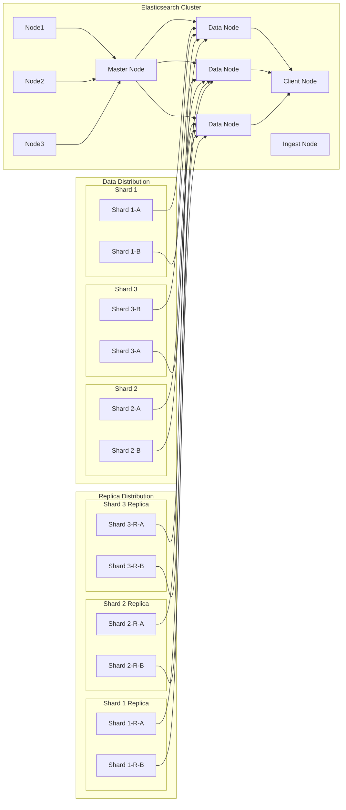

                 

# ElasticSearch原理与代码实例讲解

> **关键词**: ElasticSearch, 分布式搜索引擎, 倒排索引, 搜索算法, 实时查询, 数据分析

> **摘要**: 本文章深入讲解了ElasticSearch的基本原理、架构设计、核心算法及其在实际项目中的应用。通过实例代码和详细解释，读者将全面了解ElasticSearch的强大功能和高效性能。

## 第一部分: ElasticSearch基础

### 第1章: ElasticSearch概述

ElasticSearch是一款基于Lucene构建的分布式全文搜索引擎，广泛应用于日志分析、内容搜索、实时查询、数据挖掘等领域。其核心优势在于高效、可扩展、易用性高。本章将介绍ElasticSearch的核心概念、优势与局限，以及常见应用场景。

#### 1.1.1 Elasticsearch的核心概念

ElasticSearch的核心概念包括：

- **节点（Node）**: Elasticsearch集群中的每一个运行ElasticSearch实例的节点。
- **集群（Cluster）**: 由一组节点组成的ElasticSearch实例集合。
- **索引（Index）**: 类似于关系数据库中的数据库，用于存储相关的文档。
- **类型（Type）**: 在ElasticSearch 6.0及以下版本中，索引下的分类，用于区分不同的数据类型。在7.0及以上版本中，类型已被废弃，所有文档都属于`_doc`类型。
- **文档（Document）**: Elasticsearch中的数据存储单位，通常是一个JSON格式的数据结构。
- **字段（Field）**: 文档中的属性，用于存储具体的数据。

#### 1.1.2 Elasticsearch的优势与局限

ElasticSearch的优势包括：

- **高性能**: Elasticsearch在处理大规模数据集时具有出色的查询性能。
- **分布式架构**: 可以轻松扩展到数千台服务器，支持水平扩展。
- **易用性**: 提供了RESTful API，使得开发者可以方便地进行操作。
- **全文搜索**: 支持复杂的全文搜索功能，包括模糊查询、短语查询等。

ElasticSearch的局限包括：

- **不适合处理大规模写操作**: 写操作性能相对较低，不适合高频的写操作场景。
- **实时更新开销**: 对于需要实时更新的应用，ElasticSearch的开销可能较大。
- **数据持久性**: Elasticsearch是一个基于内存的搜索引擎，对于数据的持久性需要额外的存储方案进行保障。

#### 1.1.3 Elasticsearch的应用场景

ElasticSearch常见应用场景包括：

- **日志分析**: 处理大规模的日志数据，实现实时监控和异常检测。
- **全文搜索**: 实现搜索引擎，如电商平台、社区论坛等。
- **实时查询**: 构建实时数据查询系统，如金融交易、实时天气预报等。
- **数据挖掘**: 用于数据分析、数据挖掘等复杂应用场景。

### 第2章: ElasticSearch的架构和原理

ElasticSearch采用分布式架构，其核心架构包括节点、分片、副本等组件。本章将详细介绍ElasticSearch的节点架构、分片和副本的概念、分布式原理，并使用Mermaid流程图对ElasticSearch的架构进行图解。

#### 2.1.1 Elasticsearch的节点架构

ElasticSearch的节点架构可以分为以下几种类型：

- **主节点（Master Node）**: 负责集群的管理和协调工作，如索引的分片分配、集群状态更新等。
- **数据节点（Data Node）**: 负责存储数据和执行查询操作。
- **协调节点（Ingest Node）**: 负责处理数据的预处理和转换工作，如添加自定义字段、删除字段等。
- **客户端节点（Client Node）**: 用于执行ElasticSearch的操作，但不存储数据。

#### 2.1.2 分片和副本的概念

分片（Shard）和副本（Replica）是ElasticSearch中实现分布式存储和高可用性的关键概念：

- **分片（Shard）**: 将索引数据划分成多个部分，每个分片可以存储在集群中的不同节点上。分片的数量决定了数据的并行处理能力。
- **副本（Replica）**: 对分片数据的备份，用于提高数据的可用性和容错能力。副本可以接受查询操作，如果主分片故障，副本可以自动提升为主分片。

#### 2.1.3 Elasticsearch的分布式原理

ElasticSearch的分布式原理包括以下几个方面：

- **数据分配**: 当创建索引时，ElasticSearch会根据集群的可用节点和分片数量将数据分配到不同的分片上。
- **负载均衡**: 集群中的数据节点会定期进行负载均衡，确保每个节点的数据负载均衡。
- **故障恢复**: 当集群中的节点出现故障时，ElasticSearch会自动进行故障转移和恢复，确保数据的可用性。

#### 2.1.4 Mermaid流程图：Elasticsearch架构图解



## 第3章: Elasticsearch的索引管理

ElasticSearch的索引管理包括索引的创建、更新、删除和模板的使用。本章将详细介绍这些操作，并演示相关代码实例。

### 3.1.1 索引的创建与配置

创建索引是ElasticSearch的基本操作之一。通过RESTful API，我们可以轻松创建索引。

```json
POST /my_index
{
  "settings": {
    "number_of_shards": 2,
    "number_of_replicas": 1
  }
}
```

在上面的示例中，我们创建了一个名为`my_index`的索引，并配置了2个分片和1个副本。

### 3.1.2 索引的更新与删除

更新索引主要是修改索引的配置，如修改分片数量、副本数量等。

```json
PUT /my_index/_settings
{
  "settings": {
    "number_of_shards": 3,
    "number_of_replicas": 2
  }
}
```

删除索引可以使用以下命令：

```json
DELETE /my_index
```

### 3.1.3 索引模板的使用

索引模板是用于定义索引默认配置的模板。通过索引模板，我们可以简化索引的创建过程。

```json
PUT _template/my_template
{
  "template": "my_index_*",
  "settings": {
    "number_of_shards": 2,
    "number_of_replicas": 1
  }
}
```

在上面的示例中，我们创建了一个名为`my_template`的索引模板，它将匹配以`my_index_*`开头的索引。

## 第4章: Elasticsearch的文档操作

ElasticSearch的文档操作包括文档的添加、更新、查询和删除。本章将详细介绍这些操作，并演示相关代码实例。

### 4.1.1 文档的添加与更新

添加文档可以使用以下命令：

```json
POST /my_index/_doc
{
  "title": "ElasticSearch教程",
  "author": "作者",
  "content": "本文介绍了ElasticSearch的基本原理和操作方法。"
}
```

更新文档可以使用以下命令：

```json
POST /my_index/_update
{
  "doc": {
    "content": "本文介绍了ElasticSearch的基本原理、架构设计和操作方法。"
  }
}
```

### 4.1.2 文档的查询与检索

查询文档可以使用以下命令：

```json
GET /my_index/_search
{
  "query": {
    "match": {
      "title": "ElasticSearch教程"
    }
  }
}
```

检索文档可以使用以下命令：

```json
GET /my_index/_search
{
  "size": 1,
  "query": {
    "match": {
      "author": "作者"
    }
  }
}
```

### 4.1.3 文档的删除与获取

删除文档可以使用以下命令：

```json
DELETE /my_index/_doc
{
  "id": "1"
}
```

获取文档可以使用以下命令：

```json
GET /my_index/_doc
{
  "id": "1"
}
```

## 第5章: Elasticsearch的搜索功能

ElasticSearch的搜索功能非常强大，包括基础搜索、高级搜索和聚合查询。本章将详细介绍这些搜索功能。

### 5.1.1 查询语言QL概述

ElasticSearch的查询语言（Query Language，简称QL）是基于JSON格式的查询语句，用于构建复杂的查询。常见的查询类型包括：

- **match查询**: 用于全文搜索，可以匹配任意字段。
- **term查询**: 用于精确匹配字段值。
- **range查询**: 用于匹配特定范围内的字段值。
- **bool查询**: 用于组合多个查询条件。

### 5.1.2 搜索结果的过滤与排序

过滤（filter）可以用于限制搜索结果的范围，而排序（sort）可以用于对搜索结果进行排序。

```json
GET /my_index/_search
{
  "query": {
    "match": {
      "content": "ElasticSearch"
    }
  },
  "filter": {
    "term": {
      "author": "作者"
    }
  },
  "sort": [
    {
      "title": {
        "order": "asc"
      }
    }
  ]
}
```

### 5.1.3 高级搜索功能：匹配查询、范围查询等

高级搜索功能包括匹配查询（match query）、范围查询（range query）等。这些查询类型可以用于实现更复杂的搜索需求。

```json
GET /my_index/_search
{
  "query": {
    "bool": {
      "must": [
        {
          "match": {
            "content": "ElasticSearch"
          }
        },
        {
          "range": {
            "age": {
              "gte": 30,
              "lte": 40
            }
          }
        }
      ]
    }
  }
}
```

## 第二部分: ElasticSearch核心算法与原理

### 第6章: ElasticSearch的搜索算法原理

ElasticSearch的搜索算法基于倒排索引（Inverted Index）技术，本章将详细介绍倒排索引的搜索原理、查询执行流程和优化策略。

#### 6.1.1 基于 inverted index 的搜索原理

倒排索引是一种将文档内容反向索引的索引结构，它由词汇表和文档列表组成。词汇表包含了文档中出现过的所有词汇，而每个词汇对应了一个文档列表，记录了包含该词汇的所有文档的ID。通过倒排索引，我们可以快速定位包含特定词汇的文档。

#### 6.1.2 搜索查询的执行流程

ElasticSearch的搜索查询执行流程可以分为以下几个步骤：

1. **解析查询语句**：将用户输入的查询语句解析成查询树。
2. **查询树构建**：根据查询树构建查询执行计划。
3. **查询执行**：执行查询计划，获取搜索结果。
4. **结果排序和过滤**：根据用户的排序和过滤要求对搜索结果进行排序和过滤。
5. **返回结果**：将最终结果返回给用户。

#### 6.1.3 搜索算法的优化策略

ElasticSearch的搜索算法包括多种优化策略，如：

- **缓存查询结果**：将频繁查询的结果缓存起来，减少查询次数。
- **合并查询结果**：将多个分片的查询结果进行合并，减少查询次数。
- **优化查询计划**：根据查询需求和索引数据特点优化查询执行计划，提高查询性能。

### 第7章: ElasticSearch的排序算法原理

ElasticSearch的排序算法用于对搜索结果进行排序。本章将详细介绍排序算法的原理，包括脏数据过滤与去重算法、贪心策略在排序中的应用以及排序算法的性能分析。

#### 7.1.1 脏数据过滤与去重算法

在ElasticSearch中，脏数据过滤与去重算法用于确保搜索结果的准确性。这些算法包括：

- **去重算法**：通过去重缓存、文档ID等手段去除重复数据。
- **脏数据过滤**：通过过滤无效的、过期的数据，确保搜索结果的有效性。

#### 7.1.2 贪心策略在排序中的应用

贪心策略在排序中常用于优化排序性能。例如，在处理大量数据时，可以采用贪心策略选择最接近目标值的元素进行排序，从而减少排序时间。

#### 7.1.3 排序算法的性能分析

排序算法的性能分析包括时间复杂度和空间复杂度。在ElasticSearch中，常用的排序算法包括快速排序、归并排序等。通过对这些算法的性能分析，可以优化排序策略，提高搜索性能。

### 第8章: ElasticSearch的聚合算法原理

ElasticSearch的聚合功能用于对数据进行分组、计算和统计。本章将详细介绍聚合查询的基础概念、类型和应用，以及聚合查询的性能考量。

#### 8.1.1 聚合查询的基础概念

聚合查询是ElasticSearch中用于对数据进行分组和计算的高级查询。聚合查询可以分为以下几类：

- **桶聚合（Bucket Aggregation）**: 用于对数据进行分组。
- **度量聚合（Metrics Aggregation）**: 用于计算数据的统计指标。
- **矩阵聚合（Matrix Aggregation）**: 用于计算多维数据的聚合结果。

#### 8.1.2 聚合查询的类型与应用

ElasticSearch提供了丰富的聚合查询类型，包括：

- **指标聚合**：如平均数、最大值、最小值等。
- **桶聚合**：如按时间、地域、标签等分组。
- **多度量聚合**：同时计算多个指标的聚合结果。

#### 8.1.3 聚合查询的性能考量

聚合查询的性能受数据量、查询复杂度和集群配置等因素影响。优化聚合查询性能的方法包括：

- **预聚合（Paging Aggregation）**: 通过预聚合减少查询范围。
- **缓存聚合结果**：将频繁的聚合查询结果缓存起来，提高查询性能。
- **优化查询计划**：根据查询需求和数据特点优化查询计划，降低查询复杂度。

## 第三部分: ElasticSearch项目实战

### 第9章: ElasticSearch开发环境搭建

在本章中，我们将介绍如何搭建ElasticSearch的开发环境，包括开发环境的配置、常用工具的安装与配置，以及开发环境的优化。

#### 9.1.1 开发环境的配置

搭建ElasticSearch开发环境需要准备以下条件：

- **操作系统**：Linux或Mac OS。
- **Java环境**：ElasticSearch需要Java环境，版本建议为8或以上。
- **ElasticSearch版本**：根据项目需求选择合适的版本。

安装步骤如下：

1. 下载并解压ElasticSearch安装包。
2. 配置ElasticSearch环境变量。
3. 启动ElasticSearch服务。

#### 9.1.2 常用工具的安装与配置

在ElasticSearch开发中，常用的工具包括：

- **Kibana**：用于数据可视化和日志分析。
- **Logstash**：用于日志收集、过滤和传输。
- **Beats**：用于采集各种类型的日志数据。

安装步骤如下：

1. 下载并解压Kibana安装包。
2. 启动Kibana服务。
3. 配置Kibana与ElasticSearch的连接。
4. 下载并安装Logstash和Beats。

#### 9.1.3 开发环境的优化

优化ElasticSearch开发环境的方法包括：

- **调整内存配置**：根据服务器硬件资源调整ElasticSearch的内存配置。
- **优化日志级别**：根据项目需求调整日志级别，减少日志输出。
- **安装插件**：安装合适的插件，提高开发效率和性能。

### 第10章: ElasticSearch代码实例讲解

在本章中，我们将通过一系列代码实例，详细介绍ElasticSearch的常见操作，包括创建索引与文档、搜索与排序、聚合查询，以及分布式查询与处理。

#### 10.1.1 代码实例1：创建索引与文档

创建索引和文档是ElasticSearch的基础操作。以下是一个创建索引和文档的示例：

```json
POST /my_index
{
  "settings": {
    "number_of_shards": 2,
    "number_of_replicas": 1
  }
}

POST /my_index/_doc
{
  "title": "ElasticSearch教程",
  "author": "作者",
  "content": "本文介绍了ElasticSearch的基本原理和操作方法。"
}
```

#### 10.1.2 代码实例2：搜索与排序

搜索和排序是ElasticSearch的核心功能。以下是一个搜索并排序的示例：

```json
GET /my_index/_search
{
  "query": {
    "match": {
      "title": "ElasticSearch教程"
    }
  },
  "sort": [
    {
      "title": {
        "order": "asc"
      }
    }
  ]
}
```

#### 10.1.3 代码实例3：聚合查询

聚合查询用于对数据进行分组和统计。以下是一个简单的聚合查询示例：

```json
GET /my_index/_search
{
  "aggs": {
    "by_author": {
      "terms": {
        "field": "author",
        "size": 10
      }
    }
  }
}
```

#### 10.1.4 代码实例4：分布式查询与处理

在分布式环境中，ElasticSearch能够自动处理分布式查询。以下是一个简单的分布式查询示例：

```json
GET /my_index-000001/_search
{
  "query": {
    "match": {
      "title": "ElasticSearch教程"
    }
  }
}
```

### 第11章: ElasticSearch性能分析与优化

在ElasticSearch的应用过程中，性能分析是确保其高效运行的关键。本章将介绍ElasticSearch的性能评估方法、常见性能瓶颈及其解决方案，并分享一些优化案例与实践。

#### 11.1.1 性能评估方法

性能评估方法包括以下几个方面：

- **基准测试（Benchmarking）**: 通过运行一系列标准测试，评估ElasticSearch的查询性能。
- **负载测试（Load Testing）**: 模拟实际应用场景，评估ElasticSearch在负载下的性能。
- **压力测试（Stress Testing）**: 在极端条件下评估ElasticSearch的稳定性和性能。

#### 11.1.2 常见性能瓶颈与解决方案

ElasticSearch的性能瓶颈主要包括以下几个方面：

- **索引大小**：过大的索引会导致查询性能下降，需要通过分片和副本进行优化。
- **内存使用**：内存不足会导致查询缓慢，需要合理配置内存资源。
- **磁盘IO**：磁盘IO瓶颈会影响查询性能，需要优化磁盘IO操作。
- **网络延迟**：网络延迟会导致查询延迟，需要优化网络拓扑结构。

常见解决方案包括：

- **分片和副本优化**：合理配置分片和副本数量，提高查询并行度。
- **内存优化**：根据需求调整JVM堆内存大小，优化内存使用。
- **磁盘IO优化**：使用SSD存储，优化文件系统，减少磁盘IO等待时间。
- **网络优化**：优化网络拓扑结构，减少网络延迟。

#### 11.1.3 优化案例与实践

以下是一个优化案例：

**案例**：某电商网站使用ElasticSearch实现商品搜索功能，发现搜索响应时间较长。

**优化方案**：

1. **增加分片和副本**：将索引的分片数量从2个增加到4个，副本数量从1个增加到2个，提高查询并行度。
2. **调整JVM堆内存**：将JVM堆内存从4GB调整为8GB，优化内存使用。
3. **使用SSD存储**：将存储设备从HDD更换为SSD，提高磁盘IO性能。
4. **优化网络配置**：将ElasticSearch集群部署在同一数据中心，优化网络拓扑结构。

经过优化，搜索响应时间显著降低，性能得到大幅提升。

### 第12章: ElasticSearch在企业中的应用

ElasticSearch在企业中具有广泛的应用，可以用于日志分析、实时搜索、大数据处理等领域。本章将介绍ElasticSearch在不同场景中的应用案例。

#### 12.1.1 ElasticSearch在电商领域的应用

电商网站使用ElasticSearch实现商品搜索、用户行为分析等功能。以下是一个应用案例：

**案例**：某电商网站使用ElasticSearch构建商品搜索系统。

**应用方案**：

1. **商品索引**：将商品数据导入ElasticSearch索引，支持快速查询和排序。
2. **搜索功能**：实现基于关键词的全文搜索，支持模糊查询、过滤和排序。
3. **用户行为分析**：收集用户搜索记录、购物车数据等，用于个性化推荐和营销。

#### 12.1.2 ElasticSearch在实时搜索中的应用

实时搜索是ElasticSearch的强项之一，可以用于实时问答、实时推荐等功能。以下是一个应用案例：

**案例**：某在线教育平台使用ElasticSearch实现实时搜索功能。

**应用方案**：

1. **课程索引**：将课程数据导入ElasticSearch索引，支持实时查询和更新。
2. **搜索功能**：实现实时搜索，支持关键词搜索、标签搜索和筛选功能。
3. **实时推荐**：基于用户行为和课程数据，实现实时推荐功能。

#### 12.1.3 ElasticSearch在大数据领域的应用

大数据处理是ElasticSearch的另一个重要应用领域，可以用于日志分析、数据挖掘等。以下是一个应用案例：

**案例**：某互联网公司使用ElasticSearch处理海量日志数据。

**应用方案**：

1. **日志收集**：使用Logstash收集各类日志数据，导入ElasticSearch索引。
2. **日志分析**：使用Kibana对日志数据进行分析和可视化，实现实时监控和异常检测。
3. **数据挖掘**：基于日志数据，实现用户行为分析、业务分析等。

### 第13章: ElasticSearch的未来发展趋势

ElasticSearch作为一个开源搜索引擎，其未来发展趋势主要表现在社区发展、企业应用和与其他技术的融合等方面。本章将探讨ElasticSearch的未来发展趋势。

#### 13.1.1 ElasticSearch社区发展

ElasticSearch社区是一个活跃的开发者社区，吸引了大量贡献者。未来，ElasticSearch社区将继续壮大，推动技术的创新和进步。以下是一些发展趋势：

- **开源技术生态扩展**：ElasticSearch将继续与其他开源技术（如Kubernetes、容器化等）集成，拓展技术生态。
- **性能优化与改进**：社区将持续优化ElasticSearch的性能，提高查询速度和处理能力。
- **功能增强与扩展**：社区将不断丰富ElasticSearch的功能，如增加新的聚合查询类型、优化查询语言等。

#### 13.1.2 ElasticSearch在企业级应用的前景

ElasticSearch在企业级应用中具有广泛的前景，其高效、可扩展、易用的特点使其成为企业数据分析和实时搜索的首选解决方案。未来，ElasticSearch在企业级应用中的发展趋势包括：

- **大数据处理能力提升**：ElasticSearch将加强对大数据处理的支持，提高处理大规模数据的能力。
- **多语言支持与扩展**：ElasticSearch将支持更多编程语言和开发框架，方便开发者集成和使用。
- **安全性增强**：ElasticSearch将加强对数据安全和隐私的保护，满足企业对数据安全的严格要求。

#### 13.1.3 ElasticSearch与其他技术的融合

ElasticSearch与其他技术的融合将进一步拓展其应用场景。以下是一些发展趋势：

- **与容器化技术（如Kubernetes）的融合**：ElasticSearch将更好地与容器化技术集成，实现自动化部署和管理。
- **与大数据技术（如Hadoop、Spark）的融合**：ElasticSearch将与其他大数据技术结合，实现数据分析和挖掘。
- **与人工智能技术的融合**：ElasticSearch将引入人工智能技术，实现智能搜索、智能推荐等功能。

### 附录

#### 附录A: ElasticSearch常用命令与API

本附录将介绍ElasticSearch的一些常用命令和API，包括索引管理、文档操作、搜索和聚合等。

#### A.1 索引管理API

##### A.1.1 创建索引

```json
POST /<索引名>
```

##### A.1.2 更新索引

```json
PUT /<索引名>/_settings
```

##### A.1.3 删除索引

```json
DELETE /<索引名>
```

#### A.2 文档操作API

##### A.2.1 添加文档

```json
POST /<索引名>/_doc
```

##### A.2.2 更新文档

```json
POST /<索引名>/_update
```

##### A.2.3 查询文档

```json
GET /<索引名>/_search
```

##### A.2.4 删除文档

```json
DELETE /<索引名>/_doc/<文档ID>
```

#### A.3 搜索API

##### A.3.1 基础搜索

```json
GET /<索引名>/_search
{
  "query": {
    "match": {
      "field": "value"
    }
  }
}
```

##### A.3.2 高级搜索

```json
GET /<索引名>/_search
{
  "query": {
    "bool": {
      "must": [
        {
          "match": {
            "field": "value"
          }
        },
        {
          "range": {
            "field": {
              "gte": "value",
              "lte": "value"
            }
          }
        }
      ]
    }
  }
}
```

#### A.4 聚合API

##### A.4.1 聚合查询概述

聚合查询用于对数据进行分组和计算。以下是一个简单的聚合查询示例：

```json
GET /<索引名>/_search
{
  "aggs": {
    "by_field": {
      "terms": {
        "field": "field",
        "size": 10
      }
    }
  }
}
```

##### A.4.2 聚合查询类型

ElasticSearch提供了多种聚合查询类型，包括：

- **桶聚合（Bucket Aggregation）**：用于对数据进行分组。
- **度量聚合（Metrics Aggregation）**：用于计算数据的统计指标。
- **矩阵聚合（Matrix Aggregation）**：用于计算多维数据的聚合结果。


作者：AI天才研究院/AI Genius Institute & 禅与计算机程序设计艺术 /Zen And The Art of Computer Programming

