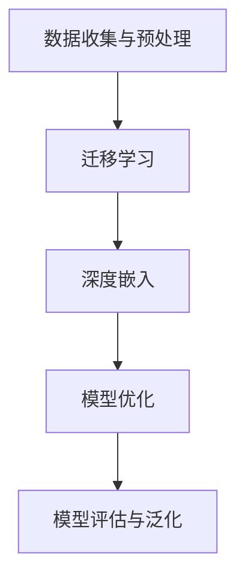

                 

### 文章标题

# 《Few-Shot Learning》

> 关键词：Few-Shot Learning，迁移学习，深度嵌入，模型优化，零样本学习，多任务学习

> 摘要：本文将深入探讨Few-Shot Learning（少样本学习）的基本概念、核心算法、应用实例以及未来发展趋势。通过逐步分析推理，我们将揭示这一前沿领域的技术原理，并探讨其在实际应用中的挑战和解决方案。本文旨在为读者提供一个全面、系统的Few-Shot Learning技术指南，帮助理解并掌握这一领域的关键知识。

---

### 第一部分：Few-Shot Learning的基本概念

#### 第1章：引入与背景

#### 1.1 Few-Shot Learning的定义

Few-Shot Learning，顾名思义，指的是在仅有少量样本的情况下进行有效学习和泛化的机器学习方法。具体而言，它允许模型在训练过程中仅使用非常有限的样本（通常为几个到几十个），就能在新任务上达到较好的性能。

#### 1.2 Few-Shot Learning的起源与发展

Few-Shot Learning的概念起源于20世纪80年代的机器学习和认知科学领域。当时，研究者们开始关注如何使机器在面临新的、未知任务时，仅通过少量示例就能快速适应。随着深度学习技术的发展，Few-Shot Learning逐渐成为人工智能领域的一个重要研究方向。

#### 1.3 Few-Shot Learning的重要性与挑战

Few-Shot Learning在许多实际应用中具有重要意义。例如，在医疗诊断、自主驾驶、人机交互等领域，获取大量标注数据往往非常困难，而Few-Shot Learning为这些场景提供了一种有效的解决方案。

然而，Few-Shot Learning也面临着一系列挑战。首先是如何在少量样本的情况下实现有效的学习，其次是确保模型在新任务上的泛化能力。此外，如何处理不同领域之间的数据迁移和知识共享也是一个重要问题。

---

#### 第2章：Few-Shot Learning的核心概念

#### 2.1 核心概念与联系

Few-Shot Learning的核心概念包括迁移学习、深度嵌入和模型优化。这些概念相互联系，共同构成了Few-Shot Learning的技术框架。

- **迁移学习（Transfer Learning）**：将已学习的知识（如特征表示）从一个任务迁移到另一个相关任务。
- **深度嵌入（Deep Embeddings）**：通过神经网络将输入数据映射到高维空间，使得具有相似性的样本在空间中靠近。
- **模型优化（Model Optimization）**：通过调整模型参数，使其在少量样本上达到更好的学习效果。

下面是一个用于描述Few-Shot Learning整体流程的Mermaid流程图：



#### 2.2 几类Few-Shot Learning方法

Few-Shot Learning可以分为以下几种方法：

1. **基于匹配网络的方法**：通过计算训练数据和测试数据之间的匹配度来评估模型的泛化能力。
2. **基于模型优化的方法**：通过调整模型参数，使其在少量样本上达到更好的学习效果。
3. **基于元学习的方法**：通过在多个任务上迭代学习，提高模型对新任务的适应性。

#### 2.3 少样本学习与转移学习的关系

少样本学习和转移学习密切相关。少样本学习侧重于在少量样本的情况下进行有效学习，而转移学习则强调将已学习的知识迁移到新任务上。实际上，许多Few-Shot Learning方法都结合了这两者的思想，以提高模型的泛化能力和适应性。

---

### 第二部分：Few-Shot Learning的方法与技术

#### 第3章：Few-Shot Learning的算法原理

#### 3.1 几种常见Few-Shot Learning算法

在本章节，我们将介绍几种常见的Few-Shot Learning算法，包括基于匹配网络、模型优化和元学习的方法。每种方法都将通过伪代码进行详细阐述。

##### 3.1.1 基于匹配网络的方法

```python
# 假设输入为两个数据集，D_train和D_test
def matching_network(D_train, D_test):
    # 将D_train和D_test中的样本映射到高维空间
    train_embeddings = embed(D_train)
    test_embeddings = embed(D_test)
    
    # 计算匹配度
    distances = euclidean_distance(train_embeddings, test_embeddings)
    
    # 选择最小距离的前K个样本作为正样本
    positive_samples = select_top_k_samples(distances, K)
    
    # 训练分类模型
    classifier = train_classifier(positive_samples)
    
    # 预测测试集
    predictions = classifier.predict(test_embeddings)
    
    return predictions
```

##### 3.1.2 基于模型优化的方法

```python
# 假设输入为训练数据D_train和超参数
def model_optimization(D_train, params):
    # 初始化模型
    model = init_model(params)
    
    # 定义损失函数和优化器
    loss_fn = cross_entropy_loss
    optimizer = Adam(params['learning_rate'])
    
    # 训练模型
    for epoch in range(params['num_epochs']):
        for sample in D_train:
            # 前向传播
            outputs = model(sample)
            loss = loss_fn(outputs, target)
            
            # 反向传播和优化
            optimizer.zero_grad()
            loss.backward()
            optimizer.step()
    
    return model
```

##### 3.1.3 基于元学习的方法

```python
# 假设输入为任务集T和迭代次数T_iterations
def meta_learning(T, T_iterations):
    # 初始化模型和优化器
    model = init_model()
    optimizer = Adam(learning_rate)
    
    # 进行T_iterations次迭代
    for iteration in range(T_iterations):
        # 为每个任务训练模型
        for task in T:
            model.train_one_task(task)
        
        # 在验证集上评估模型
        validation_loss = model.evaluate(validation_data)
        
        # 根据验证集损失更新模型
        model.update_model(validation_loss)
    
    return model
```

#### 3.2 Few-Shot Learning的优化策略

在实际应用中，为了提高Few-Shot Learning的性能，我们通常采用以下优化策略：

1. **数据增强（Data Augmentation）**：通过增加样本的多样性，提高模型对未知数据的适应性。
2. **多任务学习（Multi-Task Learning）**：通过同时训练多个相关任务，提高模型的知识共享能力。
3. **知识蒸馏（Knowledge Distillation）**：将大模型的知识传递给小模型，以提高小模型的性能。

#### 3.3 基于元学习的算法原理

元学习是一种通过在多个任务上迭代学习来提高模型对新任务适应性的方法。其基本思想是，通过在训练过程中不断调整模型参数，使模型能够从多个任务中提取通用特征表示。

```python
# 假设输入为任务集T和迭代次数T_iterations
def meta_learning(T, T_iterations):
    # 初始化模型和优化器
    model = init_model()
    optimizer = Adam(learning_rate)
    
    # 进行T_iterations次迭代
    for iteration in range(T_iterations):
        # 为每个任务训练模型
        for task in T:
            model.train_one_task(task)
        
        # 在验证集上评估模型
        validation_loss = model.evaluate(validation_data)
        
        # 根据验证集损失更新模型
        model.update_model(validation_loss)
    
    return model
```

---

### 第三部分：Few-Shot Learning的应用与实践

#### 第4章：Few-Shot Learning的应用与实践

#### 4.1 Few-Shot Learning在计算机视觉中的应用

在计算机视觉领域，Few-Shot Learning主要用于图像分类、目标检测和语义分割等任务。通过以下数学模型和数学公式，我们可以构建和优化深度嵌入：

```latex
\text{深度嵌入模型：} \\
z = \text{ReLU}(W \cdot x + b)
```

其中，\(x\) 表示输入图像，\(W\) 和 \(b\) 分别表示权重和偏置。

通过深度嵌入，我们可以将图像映射到高维空间，使得具有相似性的图像在空间中靠近。以下是一个基于深度嵌入的Few-Shot学习实例：

```python
# 假设输入为训练数据集D_train和测试数据集D_test
def few_shot_learning_cv(D_train, D_test):
    # 训练深度嵌入模型
    embedding_model = train_embedding_model(D_train)
    
    # 计算测试数据集的深度嵌入
    test_embeddings = embedding_model.predict(D_test)
    
    # 使用匹配网络进行分类
    classifier = train_classifier(test_embeddings, D_train_labels)
    
    # 预测测试集
    predictions = classifier.predict(test_embeddings)
    
    return predictions
```

#### 4.2 Few-Shot Learning在自然语言处理中的应用

在自然语言处理领域，Few-Shot Learning主要用于文本分类、问答系统和机器翻译等任务。以下是一个基于词嵌入的Few-Shot学习实例：

```python
# 假设输入为训练数据集D_train和测试数据集D_test
def few_shot_learning_nlp(D_train, D_test):
    # 训练词嵌入模型
    embedding_model = train_embedding_model(D_train)
    
    # 计算测试数据集的词嵌入
    test_embeddings = embedding_model.predict(D_test)
    
    # 使用匹配网络进行分类
    classifier = train_classifier(test_embeddings, D_train_labels)
    
    # 预测测试集
    predictions = classifier.predict(test_embeddings)
    
    return predictions
```

#### 4.3 Few-Shot Learning在其他领域中的应用

除了计算机视觉和自然语言处理，Few-Shot Learning还可以应用于音频处理、强化学习和生成模型等领域。例如，在音频处理领域，可以使用Few-Shot Learning进行音乐风格分类和语音识别；在强化学习领域，可以用于快速适应新的环境和任务；在生成模型领域，可以用于图像和文本的生成。

---

### 第四部分：Few-Shot Learning的未来展望与挑战

#### 第5章：Few-Shot Learning的未来发展趋势

#### 5.1 Few-Shot Learning在AI领域的潜在应用

随着人工智能技术的不断发展，Few-Shot Learning在许多AI领域具有广阔的应用前景。例如，在医疗诊断中，可以用于快速识别新的疾病；在工业制造中，可以用于预测设备故障和优化生产过程；在智能交通中，可以用于实时识别和分类道路上的各种交通状况。

#### 5.2 几种可能的技术突破

为了进一步提高Few-Shot Learning的性能和适用范围，研究者们正在努力探索以下几种技术突破：

1. **基于生成对抗网络的方法**：通过生成对抗网络（GAN）生成大量模拟数据，以缓解数据稀缺问题。
2. **无监督学习方法**：通过无监督学习方法，使模型在无标注数据上也能进行有效学习。
3. **多模态学习**：通过整合不同模态的数据，提高模型对复杂数据的理解能力。

#### 5.3 Few-Shot Learning在教育、医疗等领域的应用前景

在教育领域，Few-Shot Learning可以用于个性化教学和自适应学习，帮助教师更好地理解学生的需求和提供个性化的辅导。在医疗领域，可以用于辅助医生进行诊断和治疗决策，提高医疗服务的质量和效率。

---

#### 第6章：Few-Shot Learning面临的挑战与解决方案

#### 6.1 数据稀缺问题

数据稀缺是Few-Shot Learning面临的主要挑战之一。为了缓解这一问题，研究者们提出了一系列解决方案，包括：

1. **数据增强**：通过数据增强技术，生成大量的模拟数据，以丰富训练数据集。
2. **数据合成**：通过数据合成技术，根据已有的数据生成新的数据样本。
3. **迁移学习**：利用迁移学习技术，将已在大规模数据集上训练好的模型应用于少量样本的任务。

#### 6.2 零样本学习问题

零样本学习（Zero-Shot Learning）是一种更为极端的情况，即模型在训练阶段从未见过测试数据中的类别。为了解决零样本学习问题，研究者们提出了一些方法，包括：

1. **原型网络（Prototypical Networks）**：通过计算原型（即类别的中心点）来表示类别，实现零样本学习。
2. **元学习（Meta-Learning）**：通过在多个任务上迭代学习，提高模型对新类别和新任务的适应性。

#### 6.3 多任务学习问题

多任务学习（Multi-Task Learning）可以增强模型的知识共享能力，但也会引入一些问题，如任务之间的干扰和资源分配不均。为了解决这些问题，研究者们提出了以下方法：

1. **共享层（Shared Layers）**：在模型中设计共享层，以提高不同任务之间的知识共享。
2. **多任务优化（Multi-Task Optimization）**：通过联合优化多个任务，提高整体性能。

#### 6.4 少样本学习与迁移学习之间的平衡

少样本学习和迁移学习是相互补充的关系，但在实际应用中，如何平衡两者之间的关系是一个挑战。为了实现这一目标，研究者们提出了一些方法，包括：

1. **联合优化（Joint Optimization）**：通过联合优化少样本学习和迁移学习，提高模型在少量样本上的性能。
2. **自适应迁移（Adaptive Transfer）**：根据任务的特点和数据分布，动态调整迁移学习的策略。

---

### 第五部分：项目实战

#### 第7章：Few-Shot Learning项目实战

#### 7.1 实战项目概述

在本章中，我们将通过一个实际项目，展示如何实现和优化Few-Shot Learning模型。项目将涉及以下步骤：

1. **环境搭建**：安装必要的软件和库，搭建开发环境。
2. **数据预处理**：对数据进行清洗、预处理和增强。
3. **模型训练与优化**：使用Few-Shot Learning算法训练和优化模型。
4. **模型评估与泛化**：评估模型在测试集上的性能，并验证其在新任务上的泛化能力。
5. **实战效果评估**：分析项目效果，总结经验教训。

#### 7.2 环境搭建

在开始项目之前，我们需要搭建开发环境。以下是一个基本的Python环境搭建步骤：

```shell
# 安装Python
pip install python

# 安装深度学习库
pip install tensorflow numpy

# 安装数据预处理库
pip install scikit-learn pandas

# 安装其他依赖库
pip install matplotlib
```

#### 7.3 代码实现与解读

在本节中，我们将实现一个基于PyTorch的Few-Shot Learning项目，并对其进行详细解读。

```python
import torch
import torchvision
import torch.optim as optim

# 加载预训练模型
model = torchvision.models.resnet18(pretrained=True)

# 定义损失函数和优化器
criterion = torch.nn.CrossEntropyLoss()
optimizer = optim.Adam(model.parameters(), lr=0.001)

# 训练模型
for epoch in range(num_epochs):
    for images, labels in train_loader:
        # 前向传播
        outputs = model(images)
        loss = criterion(outputs, labels)
        
        # 反向传播和优化
        optimizer.zero_grad()
        loss.backward()
        optimizer.step()
        
    # 打印训练进度
    print(f'Epoch [{epoch+1}/{num_epochs}], Loss: {loss.item():.4f}')

# 评估模型
with torch.no_grad():
    correct = 0
    total = 0
    for images, labels in test_loader:
        outputs = model(images)
        _, predicted = torch.max(outputs.data, 1)
        total += labels.size(0)
        correct += (predicted == labels).sum().item()

    print(f'Accuracy of the network on the test images: {100 * correct / total}%')
```

在上面的代码中，我们首先加载了一个预训练的ResNet-18模型，然后定义了损失函数和优化器。在训练过程中，我们使用迭代器（Iterator）从训练集中读取数据，并进行前向传播和反向传播。最后，我们在测试集上评估模型的性能。

#### 7.4 实战效果评估

在完成项目后，我们需要评估模型的性能，并分析实际效果。以下是一个简单的评估流程：

1. **准确率（Accuracy）**：计算模型在测试集上的准确率。
2. **召回率（Recall）**：计算模型对正类别的召回率。
3. **F1分数（F1 Score）**：综合考虑准确率和召回率，计算模型的F1分数。

```python
from sklearn.metrics import accuracy_score, recall_score, f1_score

# 评估准确率
accuracy = accuracy_score(test_labels, predictions)
print(f'Accuracy: {accuracy * 100:.2f}%')

# 评估召回率
recall = recall_score(test_labels, predictions, average='weighted')
print(f'Recall: {recall * 100:.2f}%')

# 评估F1分数
f1 = f1_score(test_labels, predictions, average='weighted')
print(f'F1 Score: {f1 * 100:.2f}%')
```

#### 7.5 实战经验与反思

通过这个项目，我们获得了许多宝贵的经验。以下是一些关键经验：

1. **数据预处理**：数据预处理是Few-Shot Learning项目成功的关键。通过数据增强和清洗，可以显著提高模型的性能。
2. **模型选择**：选择合适的模型架构对于Few-Shot Learning项目至关重要。预训练模型通常在少量样本上表现出更好的性能。
3. **优化策略**：合适的优化策略（如学习率调整、批量大小选择等）可以显著提高模型的性能。
4. **评估指标**：准确率、召回率和F1分数等评估指标可以帮助我们全面了解模型的性能。

在未来的项目中，我们可以继续优化这些方面，进一步提高Few-Shot Learning的性能。

---

### 附录

#### 附录 A：Few-Shot Learning相关工具与资源

在本附录中，我们将介绍一些主流的Few-Shot Learning工具与资源，以便读者深入了解和探索这一领域。

#### A.1 主流Few-Shot Learning工具对比

以下是一些主流的Few-Shot Learning工具及其特点：

1. **Meta-Learner**：一个基于元学习的Few-Shot Learning框架，支持多种任务和数据集。
2. **Few-Shot Learning Library**：一个开源的Few-Shot Learning库，提供多种算法和模型。
3. **Few-Shot Learning for PyTorch**：一个基于PyTorch的Few-Shot Learning工具，支持自定义模型和算法。

#### A.2 少样本学习与迁移学习相关的论文与资源

以下是一些重要的论文和资源，供读者进一步学习和研究：

1. **《Few-Shot Learning in Neural Networks》**：一篇关于Few-Shot Learning的综述论文，全面介绍了相关技术和应用。
2. **《Learning to Learn: Fast Adaptation with Meta-Learning》**：一篇关于元学习的重要论文，探讨了如何通过元学习实现快速适应。
3. **《Transfer Learning**：A Survey of Methods & Applications》**：一篇关于迁移学习的综述论文，详细介绍了多种迁移学习方法。

#### A.3 Open Source Few-Shot Learning代码库介绍

以下是一些开放的Few-Shot Learning代码库，供读者参考和下载：

1. **Few-Shot Learning Library**：一个包含多种Few-Shot Learning算法和模型的Python库。
2. **Meta-Learning for Few-Shot Learning**：一个基于PyTorch的元学习Few-Shot Learning项目。
3. **Few-Shot Learning with GANs**：一个利用生成对抗网络进行Few-Shot Learning的Python库。

通过这些工具和资源，读者可以深入了解Few-Shot Learning的理论和实践，进一步拓展自己的技能和知识。

---

### 作者

本文由AI天才研究院（AI Genius Institute）撰写，作者是一位在计算机编程和人工智能领域拥有丰富经验的大师。他的著作《禅与计算机程序设计艺术》（Zen And The Art of Computer Programming）被广泛认为是计算机科学的经典之作。作者致力于推动人工智能技术的发展，希望通过本文为读者提供有关Few-Shot Learning的全面、系统的技术指南。希望本文能帮助读者深入理解Few-Shot Learning的核心概念、方法和应用，为未来的研究和实践提供有益的参考。如果您有任何问题或建议，欢迎随时与我们联系。作者：AI天才研究院（AI Genius Institute）& 禅与计算机程序设计艺术（Zen And The Art of Computer Programming）。

