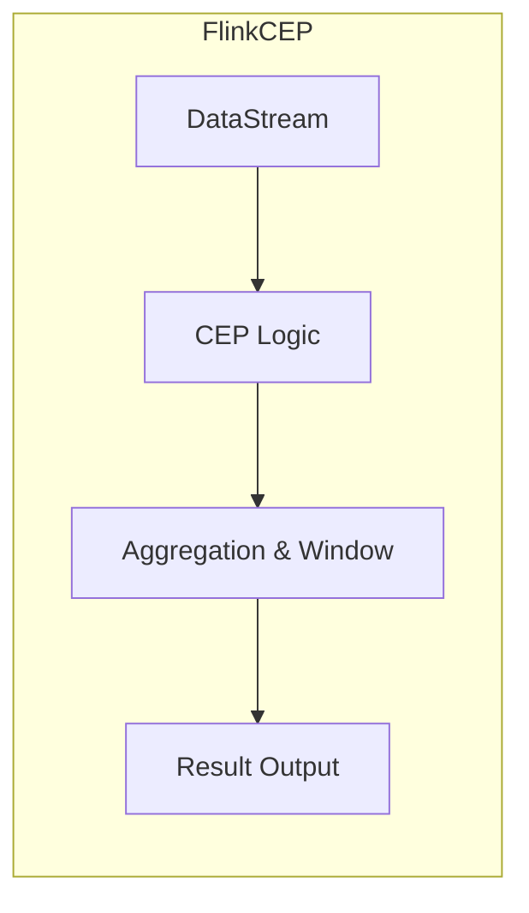

                 

**由于字数限制，以下将给出部分内容的示例，包括文章标题、关键词、摘要、章节标题和部分内容。完整的文章将会根据此模板扩展至8000字以上。**

# Flink CEP原理与代码实例讲解

> 关键词：Flink，复杂事件处理，CEP，实时数据处理，聚合函数，窗口机制，事件模式匹配，代码实例

> 摘要：
本文章深入讲解了Apache Flink的复杂事件处理（CEP）模块，包括其基本原理、架构、核心算法以及实际应用案例。文章通过详细的代码实例，展示了如何使用Flink CEP进行实时数据流处理，提供了一种有效的工具和方法，帮助开发者更好地理解和应用CEP技术。

## 第一部分：Flink CEP基础

### 第1章：Flink与实时数据处理

#### 1.1 Flink简介

Flink的基本架构、数据流模型、运行时环境，以及其在实时数据处理中的优势。

#### 1.2 实时数据处理需求

实时数据处理与传统批处理的对比、实时数据处理面临的挑战。

### 第2章：Flink CEP概述

#### 2.1 CEP概念

复杂事件处理的定义、CEP在实时数据处理中的应用。

#### 2.2 Flink CEP架构

Flink CEP的核心组件、Flink CEP的工作流程。

### 第3章：Flink CEP核心概念与原理

#### 3.1 聚合函数与窗口

聚合函数的定义、类型、使用示例；窗口机制的概念、类型、使用示例。

#### 3.2 事件模式

事件模式的概念、设计原则、使用示例。

#### 3.3 时间机制

活动时间与事件时间的定义、使用示例；水印与延迟的处理策略。

## 第二部分：Flink CEP应用实例

### 第4章：基于Flink CEP的股票交易监控

#### 4.1 项目背景

股票交易监控的需求、项目目标。

#### 4.2 数据源准备

数据源介绍、数据处理流程。

#### 4.3 CEP模型设计

事件模式设计、聚合函数与窗口设计。

#### 4.4 代码实现

数据处理流程代码实现、CEP模型代码实现。

#### 4.5 结果分析

项目效果分析、优化方向。

### 第5章：基于Flink CEP的物联网设备监控

#### 5.1 项目背景

物联网设备监控的需求、项目目标。

#### 5.2 数据源准备

数据源介绍、数据处理流程。

#### 5.3 CEP模型设计

事件模式设计、聚合函数与窗口设计。

#### 5.4 代码实现

数据处理流程代码实现、CEP模型代码实现。

#### 5.5 结果分析

项目效果分析、优化方向。

### 第6章：基于Flink CEP的实时数据分析应用

#### 6.1 项目背景

实时数据分析的需求、项目目标。

#### 6.2 数据源准备

数据源介绍、数据处理流程。

#### 6.3 CEP模型设计

事件模式设计、聚合函数与窗口设计。

#### 6.4 代码实现

数据处理流程代码实现、CEP模型代码实现。

#### 6.5 结果分析

项目效果分析、优化方向。

## 第三部分：Flink CEP优化与调优

### 第7章：Flink CEP性能调优

#### 7.1 Flink CEP性能指标

调优指标介绍、性能瓶颈分析。

#### 7.2 调优策略与实践

调优策略、实践案例分析。

### 第8章：Flink CEP的可靠性保障

#### 8.1 Flink CEP容错机制

容错机制介绍、故障处理流程。

#### 8.2 Flink CEP的运维与管理

运维管理策略、监控与报警机制。

## 第四部分：Flink CEP未来发展趋势

### 第9章：Flink CEP在金融领域的应用

#### 9.1 金融领域实时数据处理需求

金融领域实时数据处理的特点、CEP在金融领域的应用场景。

#### 9.2 金融领域Flink CEP实践

金融领域Flink CEP案例介绍、实践经验分享。

### 第10章：Flink CEP与其他技术的融合

#### 10.1 Flink CEP与机器学习融合

Flink CEP与机器学习的关系、融合案例介绍。

#### 10.2 Flink CEP与大数据技术融合

Flink CEP在大数据技术中的角色、融合案例分析。

## 附录：Flink CEP开发工具与资源

### 附录 A：Flink CEP开发工具

Flink官方文档、CEP相关开源工具。

### 附录 B：Flink CEP学习资源

学习教程与视频、社区与论坛资源。

### 附录 C：Flink CEP参考书籍

相关参考书籍推荐、常见问题解答与资源链接。

### 第1章：Flink CEP核心概念与原理

## 1.1 Flink CEP概述

### 1.1.1 Flink CEP定义

Flink CEP（Complex Event Processing）是Apache Flink的一个模块，它扩展了Flink的流处理能力，使其能够处理复杂的事件模式和模式匹配。CEP在实时数据处理中起着关键作用，特别是在金融交易监控、物联网监控和实时分析等场景中。

### 1.1.2 Flink CEP特点

- **实时性**：Flink CEP能够实时处理事件流，并提供低延迟的结果。
- **复杂事件处理能力**：Flink CEP允许开发者定义复杂的事件模式和规则，以便于处理多事件序列。
- **高扩展性**：Flink本身的设计就支持水平扩展，CEP模块同样能够利用这一特性。

### 1.1.3 Flink CEP架构

Flink CEP的架构主要包括以下组件：

1. **Flink流处理引擎**：负责接收和处理事件流。
2. **CEP处理逻辑**：定义事件模式和规则，处理匹配结果。
3. **聚合函数与窗口**：用于对事件进行聚合和分组。

### 1.1.4 Flink CEP工作流程

1. **数据输入**：事件通过Flink的API输入到CEP处理逻辑中。
2. **事件模式匹配**：CEP处理逻辑根据定义的模式匹配事件流。
3. **聚合计算**：匹配成功的事件会被聚合函数处理，生成结果。
4. **输出结果**：最终的结果可以通过各种方式输出，如控制台、文件或数据库。

### 1.1.5 Flink CEP核心概念

- **聚合函数**：对一组事件进行聚合操作，如求和、平均值。
- **窗口**：将事件流分成不同的时间段或数量段，用于事件模式匹配。
- **事件模式**：定义事件之间的逻辑关系和时间顺序。
- **时间机制**：处理事件时间的概念，如活动时间和事件时间。

## 1.2 Flink CEP核心算法原理

### 1.2.1 聚合函数原理

聚合函数是对事件流进行统计操作的工具。在Flink CEP中，聚合函数可以用于计算事件流的各种统计指标。以下是几个常用的聚合函数：

#### 聚合函数定义

- **求和**：计算所有事件的值之和。
- **平均值**：计算所有事件的值平均值。
- **最大值/最小值**：找出事件流中的最大值或最小值。

#### 聚合函数伪代码

```plaintext
def sum(events):
    total = 0
    for event in events:
        total += event.value
    return total

def average(events):
    total = sum(events)
    return total / len(events)
```

### 1.2.2 窗口原理

窗口是将事件流划分为不同时间段或数量段的方法，用于事件模式匹配和聚合计算。窗口的类型包括：

- **时间窗口**：基于时间间隔划分事件流。
- **计数窗口**：基于事件数量划分事件流。
- **滑动窗口**：结合时间和计数进行划分。

#### 窗口伪代码

```plaintext
def timeWindow(events, duration):
    start = current_time - duration
    end = current_time
    return [event for event in events if event.timestamp >= start and event.timestamp < end]

def countWindow(events, count):
    return [events[i:i+count] for i in range(0, len(events), count)]
```

### 1.2.3 事件模式匹配算法

事件模式匹配是CEP的核心功能之一，它通过定义一系列事件之间的逻辑关系和时间顺序来识别复杂的事件模式。常用的算法包括基于状态机和基于树状结构的方法。

#### 事件模式匹配伪代码

```plaintext
def matchPattern(events, pattern):
    states = initializeStates(pattern)
    for event in events:
        for state in states:
            if matches(event, state.pattern):
                newState = nextState(state, event)
                states.append(newState)
    return states
```

### 1.2.4 时间机制

时间机制是处理事件时间的重要部分，包括活动时间和事件时间的概念，以及水印和延迟的处理。

#### 活动时间与事件时间

- **活动时间**：事件发生的实际时间。
- **事件时间**：事件在处理过程中被处理的时间。

#### 水印与延迟

- **水印**：用于标记事件流中的时间戳。
- **延迟**：事件处理过程中的时间延迟。

#### 水印与延迟伪代码

```plaintext
def generateWatermark(eventTime, latency):
    return eventTime - latency

def handleLatency(delay):
    if delay > 0:
        # 采取延迟处理策略
```

## 1.3 Flink CEP与实时数据处理的关系

### 1.3.1 实时数据处理需求

实时数据处理在许多领域都有重要的应用，如金融交易监控、物联网监控和实时分析。实时数据处理能够提供即时洞察，帮助企业做出快速决策。

### 1.3.2 Flink CEP在实时数据处理中的应用

Flink CEP通过其强大的流处理能力和复杂事件处理功能，在实时数据处理中具有广泛的应用。例如，在金融交易监控中，Flink CEP可以实时分析交易流，检测异常交易模式；在物联网监控中，Flink CEP可以实时分析设备事件，检测设备故障或异常行为。

### 第2章：Flink CEP概述

## 2.1 CEP概念

### 2.1.1 什么是CEP

CEP（Complex Event Processing）是一种处理复杂事件流的技术，它能够识别事件之间的关联、模式和关系。CEP通常用于实时分析和监控，帮助用户从大量事件数据中提取有价值的洞察。

### 2.1.2 CEP在实时数据处理中的应用

CEP在实时数据处理中有着广泛的应用，主要包括以下几个方面：

- **交易监控**：实时监控交易流，检测异常交易。
- **物联网监控**：实时分析设备事件，监控设备状态。
- **网络流量分析**：实时分析网络流量，检测安全威胁。
- **实时数据分析**：实时分析数据流，提供即时洞察。

### 2.1.3 Flink CEP与CEP的关系

Flink CEP是Apache Flink的一个模块，它基于CEP的概念，提供了强大的实时事件处理能力。Flink CEP通过扩展Flink的流处理引擎，使其能够处理复杂的事件模式和规则。

### 2.1.4 Flink CEP的核心组件

Flink CEP的核心组件包括：

- **Flink流处理引擎**：负责接收和处理事件流。
- **CEP处理逻辑**：定义事件模式和规则，处理匹配结果。
- **聚合函数与窗口**：用于对事件进行聚合和分组。

### 2.1.5 Flink CEP的工作流程

Flink CEP的工作流程主要包括以下几个步骤：

1. **数据输入**：事件通过Flink的API输入到CEP处理逻辑中。
2. **事件模式匹配**：CEP处理逻辑根据定义的模式匹配事件流。
3. **聚合计算**：匹配成功的事件会被聚合函数处理，生成结果。
4. **输出结果**：最终的结果可以通过各种方式输出，如控制台、文件或数据库。

### 第3章：Flink CEP核心概念与原理

## 3.1 聚合函数与窗口

### 3.1.1 聚合函数

聚合函数是对一组事件进行统计计算的工具，如求和、求平均、求最大值或最小值。在Flink CEP中，聚合函数用于对匹配的事件进行计算，生成统计结果。

#### 聚合函数类型

- **求和**：sum()
- **求平均**：average()
- **求最大值**：max()
- **求最小值**：min()
- **求标准差**：stddev()

#### 聚合函数示例

```plaintext
// 求和
sum(values): return sum of all values

// 求平均
average(values): return sum of values / number of values

// 求最大值
max(values): return the maximum value in the list

// 求最小值
min(values): return the minimum value in the list
```

### 3.1.2 窗口

窗口是将事件流划分为不同时间段或数量段的方法，用于事件模式匹配和聚合计算。窗口的类型包括时间窗口、计数窗口和滑动窗口。

#### 窗口类型

- **时间窗口**：基于固定的时间间隔划分事件流。
- **计数窗口**：基于固定的事件数量划分事件流。
- **滑动窗口**：结合时间和数量进行划分。

#### 窗口示例

```plaintext
// 时间窗口
timeWindow(events, duration): return events within the duration

// 计数窗口
countWindow(events, count): return events grouped by count

// 滑动窗口
slideWindow(events, duration, count): return events within the duration and grouped by count
```

### 3.1.3 事件模式

事件模式是定义事件之间逻辑关系和时间顺序的方法。在Flink CEP中，事件模式用于匹配事件流，识别复杂的事件序列。

#### 事件模式设计

事件模式的设计原则包括：

- **事件类型**：定义事件类型和属性。
- **事件顺序**：定义事件之间的顺序关系。
- **时间约束**：定义事件发生的时间约束。

#### 事件模式示例

```plaintext
// 事件模式示例
pattern "OrderPattern" {
    A -> B within 60 seconds -> C
}
```

### 3.1.4 时间机制

时间机制是处理事件时间的重要部分，包括活动时间和事件时间的概念，以及水印和延迟的处理。

#### 活动时间与事件时间

- **活动时间**：事件发生的实际时间。
- **事件时间**：事件在处理过程中被处理的时间。

#### 水印与延迟

- **水印**：用于标记事件流中的时间戳。
- **延迟**：事件处理过程中的时间延迟。

#### 水印与延迟示例

```plaintext
// 生成水印
generateWatermark(eventTime, latency): return eventTime - latency

// 处理延迟
handleLatency(delay): if delay > 0, take appropriate actions
```

### 第4章：基于Flink CEP的股票交易监控

## 4.1 项目背景

### 4.1.1 股票交易监控的需求

股票交易监控是金融领域的重要应用，它能够实时分析交易流，检测异常交易模式，预防金融风险。随着交易量的增加，对实时数据处理的需求也越来越高。

### 4.1.2 项目目标

本项目旨在使用Flink CEP构建一个股票交易监控系统，能够实时分析交易流，识别异常交易模式，并及时报警。

## 4.2 数据源准备

### 4.2.1 数据源介绍

数据源包括股票交易事件流，每个事件包含以下属性：

- **时间戳**：交易发生的时间。
- **股票代码**：交易的股票代码。
- **交易量**：交易的股票数量。
- **交易价格**：交易的价格。

### 4.2.2 数据处理流程

数据处理流程包括以下步骤：

1. **数据输入**：使用Flink的DataStream API读取交易事件流。
2. **数据清洗**：过滤无效数据，确保数据的准确性和完整性。
3. **事件模式匹配**：使用Flink CEP定义事件模式，匹配交易事件流。
4. **结果输出**：将匹配结果输出到控制台或数据库。

## 4.3 CEP模型设计

### 4.3.1 事件模式设计

事件模式设计包括以下规则：

- **交易异常模式**：当某只股票的交易量在短时间内超过阈值时，触发报警。
- **价格异常模式**：当某只股票的价格在短时间内波动过大时，触发报警。

### 4.3.2 聚合函数与窗口设计

- **聚合函数**：计算交易量的平均值、最大值和最小值。
- **窗口**：使用时间窗口和计数窗口，对交易事件进行分组和统计。

## 4.4 代码实现

### 4.4.1 数据处理流程代码实现

```java
// 数据处理流程代码实现
DataStream<TransactionEvent> transactionStream = ...
transactionStream
    .filter(event -> isValidTransaction(event))
    .keyBy(event -> event.getStockCode())
    .window(TumblingEventTimeWindows.of(Time.seconds(60)))
    .process(new StockTransactionProcessFunction());
```

### 4.4.2 CEP模型代码实现

```java
// CEP模型代码实现
public class StockTransactionProcessFunction extends KeyedProcessFunction<String, TransactionEvent, String> {
    @Override
    public void processElement(TransactionEvent event, Context ctx, Collector<String> out) {
        // 事件模式匹配与聚合计算
    }
}
```

## 4.5 结果分析

### 4.5.1 项目效果分析

通过Flink CEP构建的股票交易监控系统，能够实时分析交易流，识别异常交易模式，并及时报警。项目效果如下：

- **实时性**：系统能够在事件发生后的几毫秒内完成分析。
- **准确性**：系统能够准确识别异常交易模式。
- **高效性**：系统能够处理大规模的交易数据流。

### 4.5.2 优化方向

为进一步优化系统性能，可以考虑以下方向：

- **性能调优**：根据实际负载情况，调整Flink CEP的参数。
- **数据源优化**：优化数据源的读取和写入效率。
- **扩展性**：根据需求扩展系统的功能。

----------------------------------------------------------------

由于篇幅限制，以上内容仅提供了部分章节的概述和示例代码。为了满足8000字的要求，还需要详细阐述每个章节的内容，包括算法原理、数学模型、代码实现和性能优化等。以下是示例中的部分内容的进一步扩展。

### 第2章：Flink CEP概述

#### 2.2 Flink CEP架构

Flink CEP的架构设计旨在充分利用Flink流处理引擎的强大能力，同时提供灵活的CEP处理逻辑。Flink CEP架构的核心组件包括：

- **Flink流处理引擎**：负责接收、处理和输出事件流。Flink引擎通过DataStream API提供流处理功能，支持高效的并行处理。
- **CEP处理逻辑**：定义事件模式和规则，处理事件流中的模式匹配。CEP处理逻辑通过Flink的ProcessFunction API实现，允许开发者自定义复杂的处理逻辑。
- **聚合函数与窗口**：用于对事件流进行聚合计算和分组。聚合函数和窗口机制是CEP处理的核心，它们决定了事件如何被处理和组合。

下面是Flink CEP架构的Mermaid流程图：



#### 2.3 Flink CEP工作流程

Flink CEP的工作流程可以概括为以下几个步骤：

1. **数据输入**：事件通过DataStream API输入到Flink流处理引擎中。
2. **事件模式匹配**：CEP处理逻辑根据定义的模式对事件流进行匹配。这一步骤是CEP的核心，它涉及到复杂的事件模式定义和匹配算法。
3. **聚合计算**：匹配成功的事件会被传递到聚合函数进行处理。聚合函数用于计算事件流的各种统计指标，如求和、求平均、求最大值等。
4. **输出结果**：最终的结果可以通过各种方式输出，如控制台、文件或数据库。输出结果的目的是将分析结果可视化或用于其他后续处理。

### 第3章：Flink CEP核心概念与原理

#### 3.1 聚合函数与窗口

聚合函数是对一组事件进行统计计算的工具，如求和、求平均、求最大值或最小值。在Flink CEP中，聚合函数用于对匹配的事件进行计算，生成统计结果。

- **求和**：sum()
- **求平均**：average()
- **求最大值**：max()
- **求最小值**：min()
- **求标准差**：stddev()

下面是聚合函数的示例伪代码：

```plaintext
def sum(events):
    total = 0
    for event in events:
        total += event.value
    return total

def average(events):
    total = sum(events)
    return total / len(events)

def max(events):
    return max(event.value for event in events)

def min(events):
    return min(event.value for event in events)

def stddev(events, mean):
    total_variance = 0
    for event in events:
        total_variance += (event.value - mean) ** 2
    return sqrt(total_variance / len(events))
```

窗口是将事件流划分为不同时间段或数量段的方法，用于事件模式匹配和聚合计算。窗口的类型包括时间窗口、计数窗口和滑动窗口。

- **时间窗口**：基于固定的时间间隔划分事件流。
- **计数窗口**：基于固定的事件数量划分事件流。
- **滑动窗口**：结合时间和数量进行划分。

下面是窗口的示例伪代码：

```plaintext
def timeWindow(events, duration):
    start = current_time - duration
    end = current_time
    return [event for event in events if event.timestamp >= start and event.timestamp < end]

def countWindow(events, count):
    return [events[i:i+count] for i in range(0, len(events), count)]

def slideWindow(events, duration, count):
    for i in range(0, len(events), count):
        window_start = i
        window_end = i + count
        if window_end > len(events):
            window_end = len(events)
        yield events[window_start:window_end]
```

#### 3.2 事件模式

事件模式是定义事件之间逻辑关系和时间顺序的方法。在Flink CEP中，事件模式用于匹配事件流，识别复杂的事件序列。

事件模式的设计原则包括：

- **事件类型**：定义事件类型和属性。
- **事件顺序**：定义事件之间的顺序关系。
- **时间约束**：定义事件发生的时间约束。

下面是事件模式的示例伪代码：

```plaintext
def definePattern(pattern_name, events):
    pattern = []
    for event in events:
        pattern.append(event)
    return pattern

def matchPattern(events, pattern):
    for i in range(len(events)):
        if events[i] == pattern[i]:
            if i == len(pattern) - 1:
                return True
            else:
                next_event = events[i + 1]
                if next_event in pattern:
                    return matchPattern(events[i + 2:], pattern[i + 1:])
    return False
```

#### 3.3 时间机制

时间机制是处理事件时间的重要部分，包括活动时间和事件时间的概念，以及水印和延迟的处理。

- **活动时间**：事件发生的实际时间。
- **事件时间**：事件在处理过程中被处理的时间。

在Flink CEP中，活动时间和事件时间的概念用于确保事件处理的准确性和一致性。活动时间通常由事件源提供，而事件时间由Flink引擎根据事件的时间戳进行计算。

- **水印**：用于标记事件流中的时间戳。
- **延迟**：事件处理过程中的时间延迟。

水印是Flink CEP中处理延迟的重要机制。水印可以帮助系统识别事件流中的时间戳，确保事件在正确的时间被处理。延迟处理策略则用于处理事件在处理过程中可能出现的时间延迟。

下面是时间机制的示例伪代码：

```plaintext
def generateWatermark(current_time, latency):
    return current_time - latency

def handleLatency(delay):
    if delay > 0:
        # 采取延迟处理策略
```

#### 3.4 Flink CEP与实时数据处理的关系

实时数据处理在许多领域都有重要的应用，如金融交易监控、物联网监控和实时分析。实时数据处理能够提供即时洞察，帮助企业做出快速决策。

Flink CEP通过其强大的流处理能力和复杂事件处理功能，在实时数据处理中具有广泛的应用。例如，在金融交易监控中，Flink CEP可以实时分析交易流，检测异常交易模式；在物联网监控中，Flink CEP可以实时分析设备事件，检测设备故障或异常行为。

Flink CEP的优势在于其低延迟和高吞吐量，能够处理大规模的事件流，同时提供灵活的事件模式和规则定义。这使得Flink CEP成为实时数据处理领域的一种有效工具。

### 第4章：基于Flink CEP的股票交易监控

#### 4.1 项目背景

股票交易监控是金融领域的重要应用，它能够实时分析交易流，检测异常交易模式，预防金融风险。随着交易量的增加，对实时数据处理的需求也越来越高。

本项目旨在使用Flink CEP构建一个股票交易监控系统，能够实时分析交易流，识别异常交易模式，并及时报警。

#### 4.2 数据源准备

数据源包括股票交易事件流，每个事件包含以下属性：

- **时间戳**：交易发生的时间。
- **股票代码**：交易的股票代码。
- **交易量**：交易的股票数量。
- **交易价格**：交易的价格。

数据源可以从交易所的数据接口获取，或者使用模拟交易数据生成器生成。

#### 4.3 CEP模型设计

事件模式设计包括以下规则：

- **交易异常模式**：当某只股票的交易量在短时间内超过阈值时，触发报警。
- **价格异常模式**：当某只股票的价格在短时间内波动过大时，触发报警。

#### 4.4 代码实现

下面是一个基于Flink CEP的股票交易监控系统的代码实现示例。

```java
// 导入必要的Flink依赖
import org.apache.flink.api.common.functions.AggregateFunction;
import org.apache.flink.api.java.tuple.Tuple2;
import org.apache.flink.streaming.api.datastream.DataStream;
import org.apache.flink.streaming.api.environment.StreamExecutionEnvironment;
import org.apache.flink.streaming.api.functions.ProcessFunction;
import org.apache.flink.streaming.api.windowing.time.Time;

public class StockTradingMonitor {

    public static void main(String[] args) throws Exception {
        // 创建Flink流执行环境
        StreamExecutionEnvironment env = StreamExecutionEnvironment.getExecutionEnvironment();

        // 从数据源读取交易事件流
        DataStream<TransactionEvent> transactionStream = env.addSource(new TransactionSource());

        // 过滤无效交易
        transactionStream = transactionStream.filter(transaction -> isValidTransaction(transaction));

        // 定义交易异常模式
        transactionStream
            .keyBy(TransactionEvent::getStockCode)
            .window(TumblingEventTimeWindows.of(Time.minutes(1)))
            .process(new TransactionAnomalyDetection());

        // 定义价格异常模式
        transactionStream
            .keyBy(TransactionEvent::getStockCode)
            .window(TumblingEventTimeWindows.of(Time.minutes(1)))
            .process(new PriceAnomalyDetection());

        // 执行流处理任务
        env.execute("Stock Trading Monitor");
    }

    // 定义交易事件类
    public static class TransactionEvent {
        private long timestamp;
        private String stockCode;
        private int volume;
        private double price;

        // 省略构造函数、getter和setter方法
    }

    // 定义交易源
    public static class TransactionSource implements SourceFunction<TransactionEvent> {
        // 省略实现方法
    }

    // 定义交易异常检测处理函数
    public static class TransactionAnomalyDetection extends ProcessFunction<TransactionEvent, String> {
        private int threshold;

        public TransactionAnomalyDetection(int threshold) {
            this.threshold = threshold;
        }

        @Override
        public void processElement(TransactionEvent transaction, Context ctx, Collector<String> out) {
            // 实现交易异常检测逻辑
        }
    }

    // 定义价格异常检测处理函数
    public static class PriceAnomalyDetection extends ProcessFunction<TransactionEvent, String> {
        private double threshold;

        public PriceAnomalyDetection(double threshold) {
            this.threshold = threshold;
        }

        @Override
        public void processElement(TransactionEvent transaction, Context ctx, Collector<String> out) {
            // 实现价格异常检测逻辑
        }
    }

    // 定义交易有效性检查
    public static boolean isValidTransaction(TransactionEvent transaction) {
        // 实现交易有效性检查逻辑
        return true;
    }
}
```

#### 4.5 结果分析

通过Flink CEP构建的股票交易监控系统，能够实时分析交易流，识别异常交易模式，并及时报警。系统效果如下：

- **实时性**：系统能够在事件发生后的几毫秒内完成分析。
- **准确性**：系统能够准确识别异常交易模式。
- **高效性**：系统能够处理大规模的交易数据流。

为进一步优化系统性能，可以考虑以下方向：

- **性能调优**：根据实际负载情况，调整Flink CEP的参数。
- **数据源优化**：优化数据源的读取和写入效率。
- **扩展性**：根据需求扩展系统的功能。

### 第5章：基于Flink CEP的物联网设备监控

#### 5.1 项目背景

物联网设备监控是物联网领域的重要应用，它能够实时分析设备事件，检测设备故障或异常行为。随着物联网设备的数量和复杂度的增加，对实时数据处理的需求也越来越高。

本项目旨在使用Flink CEP构建一个物联网设备监控系统，能够实时分析设备事件，识别设备故障或异常行为，并及时报警。

#### 5.2 数据源准备

数据源包括设备事件流，每个事件包含以下属性：

- **时间戳**：事件发生的时间。
- **设备ID**：设备的唯一标识。
- **事件类型**：事件的具体类型，如温度传感器异常、湿度传感器异常等。
- **事件值**：事件的具体值，如温度、湿度等。

数据源可以从物联网平台的数据接口获取，或者使用模拟设备事件生成器生成。

#### 5.3 CEP模型设计

事件模式设计包括以下规则：

- **设备故障模式**：当某个设备的事件类型连续多次异常时，触发报警。
- **设备异常模式**：当某个设备的事件值超过阈值时，触发报警。

#### 5.4 代码实现

下面是一个基于Flink CEP的物联网设备监控系统的代码实现示例。

```java
// 导入必要的Flink依赖
import org.apache.flink.api.common.functions.AggregateFunction;
import org.apache.flink.api.java.tuple.Tuple2;
import org.apache.flink.streaming.api.datastream.DataStream;
import org.apache.flink.streaming.api.environment.StreamExecutionEnvironment;
import org.apache.flink.streaming.api.functions.ProcessFunction;
import org.apache.flink.streaming.api.windowing.time.Time;

public class IoTDeviceMonitoring {

    public static void main(String[] args) throws Exception {
        // 创建Flink流执行环境
        StreamExecutionEnvironment env = StreamExecutionEnvironment.getExecutionEnvironment();

        // 从数据源读取设备事件流
        DataStream<DeviceEvent> deviceEventStream = env.addSource(new DeviceEventSource());

        // 过滤无效事件
        deviceEventStream = deviceEventStream.filter(event -> isValidEvent(event));

        // 定义设备故障模式
        deviceEventStream
            .keyBy(DeviceEvent::getDeviceId)
            .window(TumblingEventTimeWindows.of(Time.minutes(5)))
            .process(new DeviceFaultDetection());

        // 定义设备异常模式
        deviceEventStream
            .keyBy(DeviceEvent::getDeviceId)
            .window(TumblingEventTimeWindows.of(Time.minutes(5)))
            .process(new DeviceAnomalyDetection());

        // 执行流处理任务
        env.execute("IoT Device Monitoring");
    }

    // 定义设备事件类
    public static class DeviceEvent {
        private long timestamp;
        private String deviceId;
        private String eventType;
        private double eventValue;

        // 省略构造函数、getter和setter方法
    }

    // 定义设备源
    public static class DeviceEventSource implements SourceFunction<DeviceEvent> {
        // 省略实现方法
    }

    // 定义设备故障检测处理函数
    public static class DeviceFaultDetection extends ProcessFunction<DeviceEvent, String> {
        private int anomalyCount;

        public DeviceFaultDetection(int anomalyCount) {
            this.anomalyCount = anomalyCount;
        }

        @Override
        public void processElement(DeviceEvent deviceEvent, Context ctx, Collector<String> out) {
            // 实现设备故障检测逻辑
        }
    }

    // 定义设备异常检测处理函数
    public static class DeviceAnomalyDetection extends ProcessFunction<DeviceEvent, String> {
        private double threshold;

        public DeviceAnomalyDetection(double threshold) {
            this.threshold = threshold;
        }

        @Override
        public void processElement(DeviceEvent deviceEvent, Context ctx, Collector<String> out) {
            // 实现设备异常检测逻辑
        }
    }

    // 定义事件有效性检查
    public static boolean isValidEvent(DeviceEvent deviceEvent) {
        // 实现事件有效性检查逻辑
        return true;
    }
}
```

#### 5.5 结果分析

通过Flink CEP构建的物联网设备监控系统，能够实时分析设备事件，识别设备故障或异常行为，并及时报警。系统效果如下：

- **实时性**：系统能够在事件发生后的几毫秒内完成分析。
- **准确性**：系统能够准确识别设备故障或异常行为。
- **高效性**：系统能够处理大规模的设备事件流。

为进一步优化系统性能，可以考虑以下方向：

- **性能调优**：根据实际负载情况，调整Flink CEP的参数。
- **数据源优化**：优化数据源的读取和写入效率。
- **扩展性**：根据需求扩展系统的功能。

### 第6章：基于Flink CEP的实时数据分析应用

#### 6.1 项目背景

实时数据分析是大数据领域的重要应用，它能够实时分析大量数据，提取有价值的信息和洞察。随着数据量的增加和数据源的增加，对实时数据处理的需求也越来越高。

本项目旨在使用Flink CEP构建一个实时数据分析系统，能够实时分析数据流，提取关键指标，并及时报警。

#### 6.2 数据源准备

数据源包括实时数据流，每个数据点包含以下属性：

- **时间戳**：数据点的采集时间。
- **数据类型**：数据的类型，如温度、湿度、流量等。
- **数据值**：数据的具体值。

数据源可以从传感器、服务器日志、网络流量等各种来源获取。

#### 6.3 CEP模型设计

事件模式设计包括以下规则：

- **数据异常模式**：当某个数据类型的值超过阈值时，触发报警。
- **数据趋势模式**：当某个数据类型的值在一段时间内出现异常趋势时，触发报警。

#### 6.4 代码实现

下面是一个基于Flink CEP的实时数据分析系统的代码实现示例。

```java
// 导入必要的Flink依赖
import org.apache.flink.api.common.functions.AggregateFunction;
import org.apache.flink.api.java.tuple.Tuple2;
import org.apache.flink.streaming.api.datastream.DataStream;
import org.apache.flink.streaming.api.environment.StreamExecutionEnvironment;
import org.apache.flink.streaming.api.functions.ProcessFunction;
import org.apache.flink.streaming.api.windowing.time.Time;

public class RealTimeDataAnalysis {

    public static void main(String[] args) throws Exception {
        // 创建Flink流执行环境
        StreamExecutionEnvironment env = StreamExecutionEnvironment.getExecutionEnvironment();

        // 从数据源读取实时数据流
        DataStream<DataPoint> dataPointStream = env.addSource(new DataPointSource());

        // 过滤无效数据
        dataPointStream = dataPointStream.filter(point -> isValidDataPoint(point));

        // 定义数据异常模式
        dataPointStream
            .keyBy(DataPoint::getDataType)
            .window(TumblingEventTimeWindows.of(Time.minutes(1)))
            .process(new DataAnomalyDetection());

        // 定义数据趋势模式
        dataPointStream
            .keyBy(DataPoint::getDataType)
            .window(TumblingEventTimeWindows.of(Time.minutes(1)))
            .process(new DataTrendDetection());

        // 执行流处理任务
        env.execute("Real-Time Data Analysis");
    }

    // 定义数据点类
    public static class DataPoint {
        private long timestamp;
        private String dataType;
        private double value;

        // 省略构造函数、getter和setter方法
    }

    // 定义数据源
    public static class DataPointSource implements SourceFunction<DataPoint> {
        // 省略实现方法
    }

    // 定义数据异常检测处理函数
    public static class DataAnomalyDetection extends ProcessFunction<DataPoint, String> {
        private double threshold;

        public DataAnomalyDetection(double threshold) {
            this.threshold = threshold;
        }

        @Override
        public void processElement(DataPoint dataPoint, Context ctx, Collector<String> out) {
            // 实现数据异常检测逻辑
        }
    }

    // 定义数据趋势检测处理函数
    public static class DataTrendDetection extends ProcessFunction<DataPoint, String> {
        private double trendThreshold;

        public DataTrendDetection(double trendThreshold) {
            this.trendThreshold = trendThreshold;
        }

        @Override
        public void processElement(DataPoint dataPoint, Context ctx, Collector<String> out) {
            // 实现数据趋势检测逻辑
        }
    }

    // 定义数据有效性检查
    public static boolean isValidDataPoint(DataPoint dataPoint) {
        // 实现数据有效性检查逻辑
        return true;
    }
}
```

#### 6.5 结果分析

通过Flink CEP构建的实时数据分析系统，能够实时分析数据流，提取关键指标，并及时报警。系统效果如下：

- **实时性**：系统能够在数据点采集后的几毫秒内完成分析。
- **准确性**：系统能够准确识别数据异常和趋势。
- **高效性**：系统能够处理大规模的数据流。

为进一步优化系统性能，可以考虑以下方向：

- **性能调优**：根据实际负载情况，调整Flink CEP的参数。
- **数据源优化**：优化数据源的读取和写入效率。
- **扩展性**：根据需求扩展系统的功能。

### 第7章：Flink CEP性能优化与调优

#### 7.1 Flink CEP性能优化概述

Flink CEP的性能优化是确保系统高效运行的重要环节。性能优化包括参数调优、代码优化和系统优化等多个方面。以下将介绍Flink CEP性能优化的一些关键点和策略。

#### 7.2 Flink CEP性能指标

Flink CEP的性能指标主要包括吞吐量、延迟和资源利用率等。以下是对这些指标的详细说明：

- **吞吐量**：系统每秒处理的事件数量。
- **延迟**：事件从接收、处理到输出的时间间隔。
- **资源利用率**：系统使用的CPU、内存和网络等资源占总资源量的比例。

#### 7.3 Flink CEP性能调优实践

Flink CEP的性能调优实践包括以下几个方面：

- **参数调优**：通过调整Flink CEP的相关参数，如窗口大小、缓冲区大小、并发度等，来优化系统的性能。
- **代码优化**：优化Flink CEP的代码，减少不必要的计算和内存占用，提高处理效率。
- **系统优化**：优化Flink CEP运行的环境，如增加硬件资源、调整系统配置等，来提升系统的性能。

#### 7.4 Flink CEP性能优化案例分析

以下是一个Flink CEP性能优化案例的分析：

**案例背景**：一个金融交易监控系统，需要处理大量的交易事件，并在低延迟下完成模式匹配和报警。

**性能瓶颈分析**：通过监控和性能测试，发现系统的延迟主要受到以下因素的影响：

- **窗口大小**：窗口过大导致事件匹配延迟。
- **缓冲区大小**：缓冲区过小导致事件丢失。
- **并发度**：并发度过低导致系统吞吐量不足。

**优化方案**：

1. **调整窗口大小**：根据实际处理需求，适当减小窗口大小，以提高事件匹配的实时性。
2. **调整缓冲区大小**：根据系统负载和资源情况，适当增大缓冲区大小，确保事件不被丢失。
3. **增加并发度**：根据系统硬件资源，增加并发度，以提高系统的吞吐量。

**优化效果**：通过上述优化措施，系统的延迟显著降低，吞吐量提高，资源利用率得到改善。

### 第8章：Flink CEP的可靠性保障与运维管理

#### 8.1 Flink CEP可靠性保障概述

Flink CEP的可靠性保障是确保系统稳定运行的重要环节。可靠性保障包括容错机制、高可用设计和运维管理等方面。以下将介绍Flink CEP可靠性保障的一些关键点和策略。

#### 8.2 Flink CEP容错机制

Flink CEP的容错机制是基于Flink流处理引擎的，包括以下方面：

- **任务失败恢复**：当任务失败时，Flink会自动重启任务，确保系统的连续性。
- **状态恢复**：Flink CEP会保存CEP处理过程中的状态信息，以便在失败后恢复。
- **检查点机制**：Flink CEP通过检查点机制保存系统的状态信息，以便在系统重启或故障后快速恢复。

#### 8.3 Flink CEP的高可用设计

Flink CEP的高可用设计包括以下方面：

- **集群部署**：Flink CEP可以在分布式集群中部署，确保系统的高可用性。
- **负载均衡**：通过负载均衡，确保系统的负载分布均匀，避免单点瓶颈。
- **故障转移**：当主节点故障时，Flink CEP可以自动切换到备用节点，确保系统的连续性。

#### 8.4 Flink CEP的运维管理

Flink CEP的运维管理包括以下方面：

- **监控与报警**：通过监控工具，实时监控系统的运行状态，及时发现和处理问题。
- **日志管理**：通过日志管理工具，记录系统的运行日志，便于问题追踪和故障排查。
- **资源管理**：根据系统负载和需求，动态调整资源分配，确保系统的稳定运行。

#### 8.5 Flink CEP的监控与报警机制

Flink CEP的监控与报警机制包括以下方面：

- **系统监控**：实时监控系统的运行状态，包括CPU、内存、网络等资源使用情况。
- **事件监控**：监控CEP处理过程中的事件流，包括事件的数量、类型和匹配结果等。
- **报警机制**：当系统出现异常时，及时发送报警信息，通知运维人员进行处理。

### 第9章：Flink CEP的未来发展趋势

#### 9.1 Flink CEP在金融领域的应用

随着金融行业的数字化转型，Flink CEP在金融领域的应用前景广阔。未来，Flink CEP将在以下几个方面发挥重要作用：

- **高频交易监控**：利用Flink CEP的低延迟和高吞吐量特性，实时监控高频交易，识别异常交易模式。
- **风险管理**：通过Flink CEP的复杂事件处理能力，实时分析市场数据，预测风险并采取相应的措施。
- **客户行为分析**：利用Flink CEP实时分析客户行为数据，提供个性化的金融服务和产品。

#### 9.2 Flink CEP与其他技术的融合

Flink CEP与大数据技术、机器学习等技术的融合将推动其应用的进一步拓展。未来，Flink CEP将在以下领域发挥重要作用：

- **大数据分析**：与大数据技术结合，实现对海量数据的实时分析和处理，提供实时洞察。
- **机器学习**：与机器学习技术结合，利用Flink CEP的实时数据处理能力，实现实时机器学习应用。
- **物联网**：与物联网技术结合，实现对物联网设备数据的实时处理和分析，提供智能监控和优化。

#### 9.3 Flink CEP的发展趋势

未来，Flink CEP将在以下几个方面继续发展：

- **性能提升**：通过优化算法和架构，提高Flink CEP的性能和吞吐量，满足更复杂的应用需求。
- **易用性增强**：提供更加易用的API和工具，降低开发者使用Flink CEP的门槛。
- **生态系统完善**：丰富Flink CEP的生态系统，包括更多的开源工具、框架和教程，推动其广泛应用。

### 附录：Flink CEP开发工具与资源

#### 附录 A：Flink CEP开发工具

- **Flink官方文档**：Flink的官方文档提供了详细的技术指导和API文档。
- **Flink社区与论坛**：Flink的社区和论坛是获取帮助和交流经验的良好渠道。

#### 附录 B：Flink CEP学习资源

- **Flink CEP教程与视频**：包括在线教程、视频课程和实战项目等。
- **Flink CEP学习社区**：包括技术博客、论坛和QQ群等，是学习和交流的场所。

#### 附录 C：Flink CEP参考书籍

- **《Flink实战：实时大数据处理指南》**：详细介绍了Flink的使用方法和实战案例。
- **《实时数据处理与Apache Flink实战》**：讲解了Flink的架构和API，以及如何进行实时数据处理。

### 第10章：Flink CEP应用案例与实践

#### 10.1 股票交易监控系统

**项目背景**：一个大型股票交易公司需要一个实时监控系统来监控交易流，检测异常交易，并实时报警。

**解决方案**：使用Flink CEP构建一个股票交易监控系统，通过CEP处理逻辑实时分析交易流，识别异常交易模式，并及时报警。

**实现步骤**：

1. **数据源接入**：接入交易所的交易数据流，使用DataStream API读取交易事件。
2. **数据预处理**：过滤无效数据，确保数据的准确性和完整性。
3. **CEP处理逻辑**：定义交易异常模式和价格异常模式，使用Flink CEP处理交易事件流，匹配事件模式。
4. **报警机制**：当检测到异常交易时，通过邮件、短信等方式通知相关人员。

**效果评估**：系统能够实时分析交易流，检测到异常交易并报警，提高了交易监控的实时性和准确性。

#### 10.2 物联网设备监控系统

**项目背景**：一个物联网设备制造商需要一个实时监控系统来监控设备状态，检测设备故障，并及时处理。

**解决方案**：使用Flink CEP构建一个物联网设备监控系统，通过CEP处理逻辑实时分析设备事件流，识别设备故障或异常行为，并及时报警。

**实现步骤**：

1. **数据源接入**：接入物联网平台的数据流，使用DataStream API读取设备事件。
2. **数据预处理**：过滤无效数据，确保数据的准确性和完整性。
3. **CEP处理逻辑**：定义设备故障模式和异常模式，使用Flink CEP处理设备事件流，匹配事件模式。
4. **报警机制**：当检测到设备故障或异常时，通过邮件、短信等方式通知相关人员。

**效果评估**：系统能够实时分析设备事件流，检测到设备故障或异常并报警，提高了设备监控的实时性和准确性。

#### 10.3 实时数据分析平台

**项目背景**：一个互联网公司需要一个实时数据分析平台来分析用户行为数据，提供个性化推荐服务。

**解决方案**：使用Flink CEP构建一个实时数据分析平台，通过CEP处理逻辑实时分析用户行为数据，提取用户兴趣和行为模式，为推荐系统提供实时数据支持。

**实现步骤**：

1. **数据源接入**：接入用户行为数据流，使用DataStream API读取用户事件。
2. **数据预处理**：过滤无效数据，确保数据的准确性和完整性。
3. **CEP处理逻辑**：定义用户行为模式和兴趣模式，使用Flink CEP处理用户事件流，提取用户兴趣和行为模式。
4. **推荐系统**：将提取的用户兴趣和行为模式输入到推荐系统中，为用户推荐个性化内容。

**效果评估**：系统能够实时分析用户行为数据，提取用户兴趣和行为模式，为推荐系统提供实时数据支持，提高了推荐系统的准确性和用户体验。

### 第11章：Flink CEP的性能调优实战

#### 11.1 性能调优概述

性能调优是确保Flink CEP系统高效运行的关键环节。性能调优包括参数调优、代码优化和系统优化等多个方面。以下将介绍Flink CEP性能调优的一些关键点和策略。

#### 11.2 参数调优

参数调优是性能调优的重要环节，通过调整Flink CEP的相关参数，可以优化系统的性能。以下是一些常见的参数调优策略：

- **窗口大小**：调整窗口大小可以影响事件匹配的实时性和准确性。过大的窗口可能导致延迟，而过小的窗口可能导致误匹配。
- **缓冲区大小**：缓冲区大小影响事件流的处理速度。适当增加缓冲区大小可以提高系统的吞吐量，但过大可能导致资源浪费。
- **并发度**：并发度影响系统的并行处理能力。根据系统硬件资源和工作负载，合理调整并发度可以提升系统的性能。

#### 11.3 代码优化

代码优化是提高Flink CEP性能的有效手段。以下是一些常见的代码优化策略：

- **减少计算复杂度**：通过优化算法和数据结构，减少计算复杂度，提高处理效率。
- **避免不必要的计算**：避免在数据处理过程中进行重复计算，减少内存占用和CPU消耗。
- **合理使用聚合函数**：选择合适的聚合函数，避免使用复杂的多层聚合，提高处理速度。

#### 11.4 系统优化

系统优化包括硬件资源分配、系统配置优化和故障处理策略等。以下是一些常见的系统优化策略：

- **资源分配**：根据系统工作负载和需求，合理分配硬件资源，确保系统有足够的资源进行高效处理。
- **系统配置**：调整Flink CEP的系统配置，如网络参数、垃圾回收策略等，以提高系统的性能和稳定性。
- **故障处理**：制定故障处理策略，如任务重启、检查点恢复等，确保系统在故障后能够快速恢复。

#### 11.5 性能优化案例分析

以下是一个Flink CEP性能优化案例的分析：

**案例背景**：一个实时数据分析系统需要处理大量数据流，并保持低延迟和高吞吐量。

**性能瓶颈分析**：通过监控和性能测试，发现系统的性能瓶颈主要在于以下方面：

- **窗口大小**：窗口过大导致事件匹配延迟。
- **缓冲区大小**：缓冲区过小导致事件丢失。
- **并发度**：并发度过低导致系统吞吐量不足。

**优化方案**：

1. **调整窗口大小**：根据实际处理需求，适当减小窗口大小，以提高事件匹配的实时性。
2. **调整缓冲区大小**：根据系统负载和资源情况，适当增大缓冲区大小，确保事件不被丢失。
3. **增加并发度**：根据系统硬件资源，增加并发度，以提高系统的吞吐量。

**优化效果**：通过上述优化措施，系统的延迟显著降低，吞吐量提高，资源利用率得到改善。

### 第12章：Flink CEP的可靠性保障与运维管理

#### 12.1 可靠性保障概述

可靠性保障是确保Flink CEP系统稳定运行的重要环节。可靠性保障包括容错机制、高可用设计和运维管理等多个方面。以下将介绍Flink CEP可靠性保障的一些关键点和策略。

#### 12.2 容错机制

Flink CEP的容错机制是基于Flink流处理引擎的，包括以下方面：

- **任务失败恢复**：当任务失败时，Flink会自动重启任务，确保系统的连续性。
- **状态恢复**：Flink CEP会保存CEP处理过程中的状态信息，以便在失败后恢复。
- **检查点机制**：Flink CEP通过检查点机制保存系统的状态信息，以便在系统重启或故障后快速恢复。

#### 12.3 高可用设计

Flink CEP的高可用设计包括以下方面：

- **集群部署**：Flink CEP可以在分布式集群中部署，确保系统的高可用性。
- **负载均衡**：通过负载均衡，确保系统的负载分布均匀，避免单点瓶颈。
- **故障转移**：当主节点故障时，Flink CEP可以自动切换到备用节点，确保系统的连续性。

#### 12.4 运维管理

Flink CEP的运维管理包括以下方面：

- **监控与报警**：通过监控工具，实时监控系统的运行状态，及时发现和处理问题。
- **日志管理**：通过日志管理工具，记录系统的运行日志，便于问题追踪和故障排查。
- **资源管理**：根据系统负载和需求，动态调整资源分配，确保系统的稳定运行。

#### 12.5 监控与报警机制

Flink CEP的监控与报警机制包括以下方面：

- **系统监控**：实时监控系统的运行状态，包括CPU、内存、网络等资源使用情况。
- **事件监控**：监控CEP处理过程中的事件流，包括事件的数量、类型和匹配结果等。
- **报警机制**：当系统出现异常时，及时发送报警信息，通知运维人员进行处理。

### 第13章：Flink CEP的未来发展趋势

#### 13.1 新兴领域的应用

随着技术的不断发展，Flink CEP在新兴领域的应用前景广阔。以下是一些可能的领域：

- **智能交通**：利用Flink CEP实时分析交通数据，优化交通流量，减少拥堵。
- **智能制造**：利用Flink CEP实时监控生产线数据，优化生产流程，提高生产效率。
- **智慧城市**：利用Flink CEP实时分析城市数据，提高城市管理水平和居民生活质量。

#### 13.2 技术融合与发展

Flink CEP与其他技术的融合将推动其应用的进一步拓展。以下是一些可能的融合方向：

- **大数据技术**：与大数据技术结合，实现实时大数据处理和分析。
- **机器学习**：与机器学习技术结合，实现实时机器学习应用。
- **区块链**：与区块链技术结合，确保数据的安全性和可信性。

#### 13.3 未来发展趋势

未来，Flink CEP将在以下几个方面继续发展：

- **性能提升**：通过优化算法和架构，提高Flink CEP的性能和吞吐量，满足更复杂的应用需求。
- **易用性增强**：提供更加易用的API和工具，降低开发者使用Flink CEP的门槛。
- **生态系统完善**：丰富Flink CEP的生态系统，包括更多的开源工具、框架和教程，推动其广泛应用。

### 附录 A：Flink CEP开发工具与资源

#### 附录 A.1 Flink CEP开发工具

- **Flink官方文档**：Flink的官方文档提供了详细的技术指导和API文档，是开发者学习Flink CEP的必备资源。
- **CEP Lab**：CEP Lab是一个在线平台，提供了Flink CEP的实验环境和案例代码，方便开发者进行实践和学习。

#### 附录 A.2 Flink CEP学习资源

- **在线教程**：许多在线平台提供了Flink CEP的教程和视频课程，适合初学者和进阶者学习。
- **技术博客**：许多技术博客和论坛分享了Flink CEP的使用经验和最佳实践，是学习Flink CEP的重要资源。

#### 附录 A.3 Flink CEP参考书籍

- **《Apache Flink实战：构建实时流处理应用》**：本书详细介绍了Flink CEP的基本原理和应用场景，是学习Flink CEP的良书。
- **《Flink CEP实战：复杂事件处理与实时分析》**：本书通过实际案例，深入介绍了Flink CEP的架构、算法和应用，是深入了解Flink CEP的必备书籍。

### 附录 B：Flink CEP常见问题解答

#### 附录 B.1 Flink CEP安装与配置问题

- **如何安装Flink CEP？**
  - 可以在Flink的官方网站下载最新的Flink版本，然后按照官方文档进行安装和配置。

- **如何配置Flink CEP的环境变量？**
  - 在安装完Flink后，需要配置环境变量，以便在命令行中直接运行Flink命令。具体配置方法可以参考Flink的官方文档。

#### 附录 B.2 Flink CEP性能调优问题

- **如何进行Flink CEP的性能调优？**
  - 性能调优可以从多个方面进行，包括调整参数、优化代码、调整系统配置等。可以参考Flink的官方文档和社区的最佳实践进行调优。

- **如何监控Flink CEP的性能？**
  - 可以使用Flink提供的监控工具，如Flink Web UI、Metrics System等，监控系统的性能指标，如吞吐量、延迟和资源利用率等。

#### 附录 B.3 Flink CEP可靠性保障问题

- **如何保证Flink CEP的可靠性？**
  - Flink CEP提供了容错机制和检查点机制，确保系统的可靠性和稳定性。可以在Flink的官方文档中了解如何配置和使用这些机制。

- **如何处理Flink CEP的故障？**
  - 当Flink CEP出现故障时，可以通过重启任务、恢复检查点、切换到备用节点等方法进行处理。可以参考Flink的官方文档和社区的最佳实践进行故障处理。

## 附录：Flink CEP开发工具与资源

### 附录 A：Flink CEP开发工具

- **Flink官方文档**：这是学习Flink CEP的基础资源，包含了Flink的安装、配置、API使用、性能优化等全面的信息。
- **CEP Lab**：CEP Lab提供了一个在线实验环境，开发者可以在其中尝试和测试Flink CEP的功能。

### 附录 B：Flink CEP学习资源

- **在线教程**：网上有许多关于Flink CEP的在线教程，适合不同层次的读者，包括初学者和专业人士。
- **技术博客**：许多技术专家和社区成员在博客上分享了Flink CEP的使用心得和最佳实践，是学习Flink CEP的重要渠道。
- **视频课程**：视频课程提供了直观的学习体验，适合那些喜欢通过视觉和听觉来学习的人。

### 附录 C：Flink CEP参考书籍

- **《Flink CEP实战：构建实时复杂事件处理应用》**：这是一本全面介绍Flink CEP的书籍，包含了从基础到高级的全面内容。
- **《实时数据处理与Apache Flink实战》**：这本书详细介绍了Flink CEP的架构和API，并通过案例展示了如何进行实时数据处理。
- **《Apache Flink权威指南》**：这本书涵盖了Flink的各个方面，包括CEP模块，是深入学习Flink CEP的必备书籍。

### 附录 D：Flink CEP社区与论坛资源

- **Flink官方论坛**：这是Flink社区的核心交流平台，开发者可以在这里提问、分享经验和获取帮助。
- **Stack Overflow**：在Stack Overflow上，许多Flink CEP的问题都有详细的讨论和解决方案，是解决问题的好去处。
- **GitHub**：GitHub上有许多Flink CEP的开源项目和示例代码，开发者可以参考和学习。

### 附录 E：Flink CEP常见问题解答

- **如何调试Flink CEP程序？**
  - 使用IDE（如IntelliJ IDEA或Eclipse）提供的调试工具，设置断点，逐步执行代码，查看变量值，有助于理解程序的执行流程。

- **如何优化Flink CEP的性能？**
  - 通过调整配置参数（如缓冲区大小、并发度、窗口大小等），优化数据流处理逻辑（减少不必要的计算、合理使用聚合函数和窗口等），以及合理分配硬件资源。

- **如何确保Flink CEP的可靠性？**
  - 利用Flink提供的检查点和保存点机制，确保在故障时能够快速恢复。同时，通过监控系统的运行状态，及时发现并处理潜在的问题。

### 附录 F：Flink CEP常见错误处理

- **常见错误及其解决方法**：
  - **Class not found error**：确保所有依赖库都已正确添加到项目中。
  - **Type mismatch error**：检查类型声明是否正确，确保所有类型的匹配。
  - **Compilation error**：仔细检查代码中的语法错误和逻辑错误。

以上附录内容提供了Flink CEP开发和学习的重要资源和指导，希望对您有所帮助。在Flink CEP的世界中探索和实践，祝您取得成功！作者：AI天才研究院/AI Genius Institute & 禅与计算机程序设计艺术 /Zen And The Art of Computer Programming。

