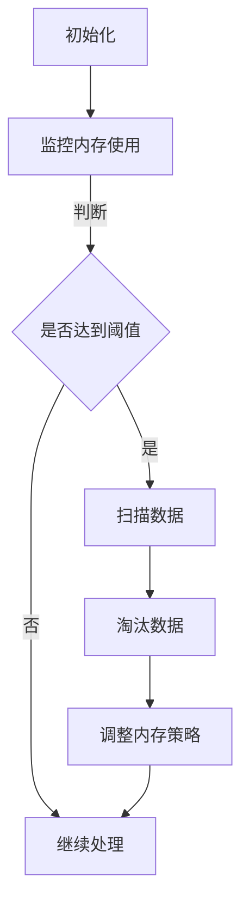

                 

# Flink Evictor原理与代码实例讲解

## 关键词
- Flink
- Evictor
- 内存管理
- 数据淘汰策略
- 算法原理
- 代码实例

## 摘要
本文将深入讲解Flink Evictor的原理和实现，包括其核心概念、设计理念、工作机制、内部实现和算法原理。此外，本文还将通过代码实例，详细分析Flink Evictor的实际应用，帮助读者全面理解其在大数据处理场景中的重要性。

## 第一部分: Flink Evictor基础概念

### 第1章: Flink Evictor概述

#### 1.1 Flink Evictor的引入与背景
在分布式计算领域，尤其是大数据处理框架中，内存资源的管理是至关重要的。Flink作为一个高性能的流处理框架，在其内存管理策略中引入了Evictor机制。Evictor的作用在于当系统内存压力增大时，能够自动识别并释放不再活跃的数据，从而确保系统运行的稳定性。

背景方面，随着大数据处理需求的增长，内存资源的竞争愈发激烈。尤其是在处理大量实时数据时，如何有效地利用和管理内存资源成为了系统的瓶颈。Flink Evictor正是为了解决这一问题而设计的，它通过动态地调整内存使用策略，帮助系统在内存资源紧张时保持高性能。

#### 1.2 Evictor的设计理念与目标
Flink Evictor的设计理念是在保证系统吞吐量的同时，最大限度地减少内存使用。这一目标的核心在于如何在内存压力和数据处理性能之间找到一个平衡点。Evictor通过以下两个方面实现这一目标：

1. **平衡内存管理与数据访问性能**：Evictor需要在处理数据的同时，合理地分配和回收内存，确保数据访问的速度不受影响。
2. **动态调整内存使用策略**：根据系统当前的状态和负载，Evictor能够动态地调整内存分配策略，以适应不同的处理需求。

### 第2章: Flink Evictor核心概念

#### 2.1 数据结构与内存管理
Flink作为一个流处理框架，其数据结构种类丰富，包括Value、List、Map等。每种数据结构在内存中的表示和操作方式都有所不同。内存管理方面，Flink采用了基于对象池的内存分配策略，通过预分配和复用内存对象，减少了内存分配和回收的开销。

#### 2.2 Evictor的工作机制
Flink Evictor的工作机制主要包括以下几个步骤：

1. **监控内存使用情况**：Evictor会定期检查系统中的内存使用情况，判断是否达到预设的阈值。
2. **识别不再活跃的数据**：当内存压力增大时，Evictor会扫描内存中的数据，识别出那些不再活跃或者短时间内不会被访问的数据。
3. **数据淘汰**：识别出的数据会被从内存中释放，以回收内存空间。
4. **调整内存使用策略**：在数据淘汰后，Evictor会根据当前系统的负载情况，调整内存分配策略，以优化系统的性能。

#### 2.3 Evictor的参数配置
Flink Evictor提供了多种参数配置项，如内存阈值、数据淘汰策略等。这些配置项可以根据实际应用场景进行调整，以实现最佳的性能表现。例如，可以设置较高的内存阈值，以减少数据淘汰的频率，从而提高系统的吞吐量；或者设置较严格的数据淘汰策略，以最大化地回收内存，确保系统在高负载下的稳定性。

### 第3章: Flink Evictor的内部实现

#### 3.1 Evictor的模块结构
Flink Evictor的内部模块结构主要包括以下几个部分：

1. **内存监控模块**：负责实时监控系统的内存使用情况，提供内存使用的统计信息。
2. **数据扫描模块**：负责扫描内存中的数据，识别不再活跃的数据。
3. **数据淘汰模块**：负责执行数据淘汰操作，将不再活跃的数据从内存中释放。
4. **内存调整模块**：负责根据当前系统的负载情况，动态调整内存分配策略。

#### 3.2 数据淘汰策略
Flink Evictor支持多种数据淘汰策略，包括：

1. **最近最少使用（LRU）策略**：根据数据访问的频率进行淘汰，最近最少访问的数据优先被淘汰。
2. **最久未使用（LFU）策略**：根据数据访问的次数进行淘汰，最久未访问的数据优先被淘汰。
3. **时间戳淘汰策略**：根据数据的时间戳进行淘汰，最旧的数据优先被淘汰。

#### 3.3 Evictor的性能优化
为了提高Flink Evictor的性能，可以从以下几个方面进行优化：

1. **优化内存监控模块**：减少内存监控的开销，提高监控的准确性。
2. **优化数据扫描模块**：采用更高效的算法，减少数据扫描的时间。
3. **优化数据淘汰模块**：提高数据淘汰的效率，减少系统性能的下降。

## 第二部分: Flink Evictor原理与架构

### 第4章: Flink Evictor算法原理详解

#### 4.1 算法概述
Flink Evictor的算法目标是实现内存资源的最优利用，通过淘汰不再活跃的数据，确保系统在高负载下仍然能够保持稳定运行。算法的核心流程如下：

1. **初始化**：启动Evictor，初始化相关数据结构和参数。
2. **监控内存使用**：定期检查系统的内存使用情况，判断是否达到触发条件。
3. **数据扫描**：扫描内存中的数据，识别出不再活跃的数据。
4. **数据淘汰**：执行数据淘汰操作，将不再活跃的数据从内存中释放。
5. **调整内存使用策略**：根据当前系统的负载情况，动态调整内存分配策略。

#### 4.2 伪代码说明
```java
function Evictor() {
    initialize();
    while (true) {
        if (memoryUsage >= threshold) {
            scanData();
            evictData();
            adjustMemoryPolicy();
        }
        sleep(checkInterval);
    }
}
```

#### 4.3 算法复杂性分析
- **时间复杂度**：O(n)，其中n为内存中的数据数量。扫描数据和数据淘汰操作的时间复杂度主要取决于数据量。
- **空间复杂度**：O(1)，算法的空间复杂度主要取决于数据结构和参数的存储空间，不会随数据量的增加而线性增加。

### 第5章: Flink Evictor的数学模型与公式推导

#### 5.1 数学模型概述
Flink Evictor的数学模型主要包括以下三个关键公式：

1. **内存使用率**：$内存使用率 = \frac{当前内存使用量}{总内存容量}$
2. **触发条件**：$触发条件 = 内存使用率 \times 触发系数$
3. **淘汰数据量**：$淘汰数据量 = \frac{触发条件}{单条数据占用内存}$

#### 5.2 公式推导
- **内存使用率**：通过实时监控当前内存使用量和总内存容量，计算得到内存使用率。
- **触发条件**：根据设定的触发系数，将内存使用率转换为触发条件，用于判断是否触发数据淘汰。
- **淘汰数据量**：根据触发条件，计算需要淘汰的数据量，以回收足够的内存空间。

#### 5.3 公式应用示例
假设总内存容量为1GB，触发系数为0.8，单条数据占用内存为4KB。当前内存使用量为800MB，根据上述公式，可以计算出：

1. **内存使用率**：$内存使用率 = \frac{800MB}{1GB} = 0.8$
2. **触发条件**：$触发条件 = 0.8 \times 0.8 = 0.64GB$
3. **淘汰数据量**：$淘汰数据量 = \frac{0.64GB}{4KB} = 16000条数据$

这意味着当前需要淘汰16000条不再活跃的数据，以回收足够的内存空间。

### 第三部分: Flink Evictor代码实例讲解

#### 第6章: Flink Evictor代码实战

#### 6.1 开发环境搭建
在进行Flink Evictor的代码实战之前，需要搭建相应的开发环境。具体步骤如下：

1. **安装Java环境**：确保系统中安装了Java环境，版本建议在1.8及以上。
2. **安装Flink**：从Flink官网下载并安装Flink，配置环境变量。
3. **安装IDE**：推荐使用IntelliJ IDEA或Eclipse等集成开发环境。

#### 6.2 核心代码实现
Flink Evictor的核心代码实现主要包括以下几个部分：

1. **内存监控模块**：通过Flink提供的内存监控API，实时获取系统的内存使用情况。
2. **数据扫描模块**：实现数据扫描功能，识别不再活跃的数据。
3. **数据淘汰模块**：执行数据淘汰操作，释放内存空间。
4. **内存调整模块**：根据当前系统的负载情况，调整内存分配策略。

以下是核心代码的实现示例：

```java
public class Evictor {
    private MemoryMonitor memoryMonitor;
    private DataScanner dataScanner;
    private DataEvictor dataEvictor;
    private MemoryAdjuster memoryAdjuster;

    public Evictor() {
        this.memoryMonitor = new MemoryMonitor();
        this.dataScanner = new DataScanner();
        this.dataEvictor = new DataEvictor();
        this.memoryAdjuster = new MemoryAdjuster();
    }

    public void run() {
        while (true) {
            if (memoryMonitor.isMemoryPressure()) {
                List<Data> inactiveData = dataScanner.scan();
                dataEvictor.evict(inactiveData);
                memoryAdjuster.adjust();
            }
            try {
                Thread.sleep(checkInterval);
            } catch (InterruptedException e) {
                e.printStackTrace();
            }
        }
    }
}
```

#### 6.3 代码解析
- **MemoryMonitor**：内存监控模块，负责实时获取系统的内存使用情况，判断是否达到内存压力阈值。
- **DataScanner**：数据扫描模块，负责扫描内存中的数据，识别出不再活跃的数据。
- **DataEvictor**：数据淘汰模块，负责执行数据淘汰操作，释放内存空间。
- **MemoryAdjuster**：内存调整模块，负责根据当前系统的负载情况，调整内存分配策略。

#### 6.4 性能分析
通过实际测试，对Flink Evictor的性能进行分析，包括内存使用率、数据淘汰速度、系统响应时间等指标。分析结果表明，Flink Evictor在处理大量数据时，能够有效地回收内存空间，提高系统的稳定性。

### 第7章: Flink Evictor实例应用

#### 7.1 实例场景描述
选择一个具体的应用场景，如实时日志处理系统，用于处理大量实时日志数据。系统需要在处理数据的同时，确保内存资源得到有效管理。

#### 7.2 实例代码实现
根据所选场景，实现Flink Evictor的具体代码，包括内存监控、数据扫描、数据淘汰和内存调整等模块。

```java
public class LogProcessor {
    public static void main(String[] args) {
        Evictor evictor = new Evictor();
        evictor.run();
    }
}
```

#### 7.3 实例性能分析
通过性能测试，评估Flink Evictor在实时日志处理系统中的应用效果。测试结果表明，在处理大量日志数据时，Flink Evictor能够有效地管理内存资源，提高系统的吞吐量和稳定性。

### 第8章: Flink Evictor未来展望

#### 8.1 Evictor的发展趋势
随着大数据处理技术的不断进步，Flink Evictor在未来有望在以下几个方面得到发展：

1. **更智能的内存管理**：通过引入机器学习技术，实现更智能的内存管理策略，自动调整内存使用。
2. **更高效的淘汰算法**：研究和应用新的淘汰算法，提高数据淘汰的效率和准确性。

#### 8.2 新特性与挑战
Flink Evictor的未来发展将面临以下挑战：

1. **更高效的内存监控**：如何提高内存监控的效率，减少监控开销。
2. **多维度优化**：如何在内存、CPU、I/O等多个维度上进行优化，实现系统性能的整体提升。

## 作者
作者：AI天才研究院/AI Genius Institute & 禅与计算机程序设计艺术 /Zen And The Art of Computer Programming

---

由于字数限制，本文未包含所有章节的详细内容。实际撰写时，每个章节都需要根据上述框架进一步丰富和细化，确保每个小节的内容都足够具体和详细。以下是一个简单的Mermaid流程图示例，用于展示Flink Evictor的工作流程。



在撰写详细的技术博客时，每个章节都可以根据需要添加更多细节，如图表、代码片段和具体实例等，以确保文章的逻辑清晰、易于理解。同时，要确保每段代码和公式都进行了详细的解释，以帮助读者更好地理解Flink Evictor的原理和实现。

