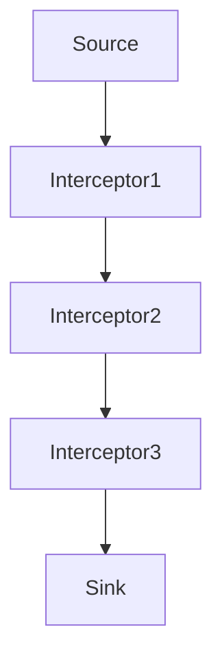

                 

# 《Flume Interceptor原理与代码实例讲解》

## 关键词

Flume, Interceptor, 日志收集，数据处理，日志分析，高可用架构，项目实战

## 摘要

本文将深入探讨Flume Interceptor的原理及其在实际项目中的应用。我们将从Flume的基本架构和Interceptor的基础概念开始，逐步讲解Interceptor的工作流程、核心算法和性能优化。接着，通过代码实例，详细解读Interceptor的开发、集成与测试过程。最后，我们将结合实际项目，展示Interceptor在日志分析和高可用架构中的具体应用，并对Flume Interceptor的未来发展进行展望。

### 第一部分：Flume概述与Interceptor基础

#### 第1章：Flume概述

##### 1.1 Flume架构介绍

Flume是一个分布式、可靠且可扩展的收集、聚合和传输日志数据的系统。它由多个组件组成，包括Source、Channel和Sink。Source负责从数据源（如Web服务器日志、数据库等）收集数据，Channel用于暂存数据，而Sink则将数据传输到目标系统（如HDFS、HBase等）。

##### 1.2 Flume与日志收集的关系

日志收集是数据分析和运维监控的重要环节。Flume作为日志收集工具，能够高效地收集分布式系统中的日志数据，为后续的数据处理和分析提供基础。

##### 1.3 Flume的组件介绍

Flume的主要组件包括：

- **Agent**：Flume的基本工作单元，由Source、Channel和Sink组成。
- **Source**：负责收集日志数据。
- **Channel**：暂存收集到的日志数据。
- **Sink**：将日志数据传输到目标系统。

#### 第2章：Interceptor基础

##### 2.1 Interceptor的概念与作用

Interceptor是Flume中的一个重要组件，用于在日志数据传输过程中对数据进行过滤、转换等操作，从而满足不同应用场景的需求。

##### 2.2 Interceptor的类型

Flume提供了多种类型的Interceptor，包括：

- **时间戳拦截器**：用于修改事件的时间戳。
- **字段拦截器**：用于添加、删除或修改事件字段。
- **正则表达式拦截器**：用于根据正则表达式过滤事件。

##### 2.3 Interceptor的设计模式

Interceptor通常采用设计模式中的装饰器模式，通过包装现有的Interceptor实现，实现对日志数据的自定义处理。

#### 第二部分：Flume Interceptor原理与实现

#### 第3章：Interceptor原理

##### 3.1 Interceptor的工作流程

Interceptor在Flume中的工作流程如下：

1. Source收集日志数据并生成事件。
2. 事件通过Interceptor进行过滤和转换。
3. 处理后的事件被传递到Channel。
4. Channel将事件传输到Sink。
5. Sink将事件写入目标系统。

##### 3.2 Interceptor的核心算法

Interceptor的核心算法通常包括事件过滤、字段修改和日志格式转换等。

##### 3.3 Interceptor的性能优化

为提高Interceptor的性能，可以考虑以下优化策略：

- **减少数据复制**：尽量减少数据在传输过程中的复制次数。
- **使用高效的算法**：选择适合的算法和库来提高处理速度。
- **并行处理**：对于大规模数据，可以考虑使用并行处理来提高性能。

#### 第4章：Interceptor代码实例讲解

##### 4.1 自定义Interceptor开发

在本节，我们将介绍如何开发一个简单的自定义Interceptor。

##### 4.2 常见Interceptor的代码分析

我们将分析Flume中几个常见Interceptor的实现，如时间戳拦截器和字段拦截器。

##### 4.3 Interceptor在Flume中的集成与测试

本节将介绍如何将Interceptor集成到Flume中，并进行测试。

### 第三部分：Flume Interceptor实战应用

#### 第5章：Interceptor在日志分析中的应用

##### 5.1 日志分析的需求与挑战

日志分析涉及对大规模日志数据的高效处理和分析。本节将介绍日志分析的需求与挑战。

##### 5.2 Interceptor在日志分析中的应用场景

Interceptor在日志分析中的应用场景包括日志过滤、字段提取和格式转换等。

##### 5.3 日志分析系统的设计与实现

本节将介绍一个基于Flume的日志分析系统的设计与实现。

#### 第6章：Interceptor在高可用架构中的应用

##### 6.1 高可用架构的概念与挑战

高可用架构旨在确保系统在面临各种故障时仍能持续提供服务。本节将介绍高可用架构的概念与挑战。

##### 6.2 Interceptor在高可用架构中的作用

Interceptor在高可用架构中可用于实现故障转移、负载均衡等功能。

##### 6.3 高可用架构的设计与实现

本节将介绍一个基于Flume的高可用架构的设计与实现。

#### 第7章：Flume Interceptor项目实战

##### 7.1 项目背景与目标

本节将介绍一个实际项目的背景与目标。

##### 7.2 项目需求分析

本节将分析项目的需求。

##### 7.3 项目架构设计与实现

本节将介绍项目的架构设计与实现。

##### 7.4 项目性能调优与优化

本节将介绍项目的性能调优与优化。

#### 第8章：Flume Interceptor的未来发展

##### 8.1 Flume Interceptor的发展趋势

本节将分析Flume Interceptor的发展趋势。

##### 8.2 新功能的展望与探索

本节将展望Flume Interceptor的新功能。

##### 8.3 总结与展望

本节将对Flume Interceptor进行总结与展望。

### 附录

#### 附录A：Flume Interceptor开发工具与环境

##### 9.1 开发工具介绍

本节将介绍Flume Interceptor开发所需的工具。

##### 9.2 开发环境搭建

本节将介绍如何搭建Flume Interceptor的开发环境。

##### 9.3 常见问题与解决方案

本节将列出常见问题及其解决方案。

#### Mermaid流程图

以下为Flume Interceptor的工作流程Mermaid流程图：



#### 核心算法原理讲解伪代码

以下为Interceptor的核心算法原理讲解伪代码：

```python
def process_event(event):
    if is_valid_event(event):
        if should_log_event(event):
            log_event(event)
        if should_filter_event(event):
            filter_event(event)
        if should_modify_event(event):
            modify_event(event)
    else:
        reject_event(event)

def is_valid_event(event):
    return event.length > 0

def should_log_event(event):
    return event.log_level == 'INFO'

def should_filter_event(event):
    return event.filter_pattern != None

def should_modify_event(event):
    return event.modify_pattern != None

def log_event(event):
    print("Logging event:", event)

def filter_event(event):
    print("Filtering event:", event)

def modify_event(event):
    event.data = event.data.upper()
    print("Modified event:", event)
```

#### 数学模型和数学公式详细讲解与举例说明

以下为Interceptor中的数学模型和数学公式讲解：

$$
\text{Log Loss} = -\frac{1}{n} \sum_{i=1}^{n} y_i \log(p_i) + (1 - y_i) \log(1 - p_i)
$$

**举例说明**：

假设我们有一个二分类问题，其中 \( y \) 表示实际标签，\( p \) 表示预测概率。如果我们有 \( n \) 个样本，可以使用上述公式计算总的Log Loss。

- 当 \( y = 1 \) 且 \( p \) 接近 1 时，Log Loss 将接近 0，表明我们的预测非常准确。
- 当 \( y = 0 \) 且 \( p \) 接近 0 时，Log Loss 将接近 0，同样表明我们的预测非常准确。
- 当 \( y = 1 \) 且 \( p \) 接近 0 时，Log Loss 将非常大，表明我们的预测非常不准确。

#### 项目实战：代码实际案例和详细解释说明

**案例**：实现一个简单的Interceptor，用于过滤掉包含特定关键词的日志。

**代码**：

```java
public class KeywordFilterInterceptor extends AbstractInterceptor {
    private String keyword;

    public void configure(Context context) {
        this.keyword = context.getString("keyword");
    }

    public Event intercept(Event event) {
        String logMessage = event.getBody().asString();
        if (logMessage.contains(keyword)) {
            return null; // 过滤事件
        }
        return event;
    }

    public List<Event> intercept(List<Event> events) {
        List<Event> filteredEvents = new ArrayList<>();
        for (Event event : events) {
            Event filteredEvent = intercept(event);
            if (filteredEvent != null) {
                filteredEvents.add(filteredEvent);
            }
        }
        return filteredEvents;
    }
}
```

**详细解释说明**：

- **类定义**：`KeywordFilterInterceptor` 继承自 `AbstractInterceptor` 类，这是Flume提供的Interceptor基础类。
- **配置**：在 `configure` 方法中，我们从配置文件中获取关键词。
- **事件处理**：在 `intercept` 方法中，我们获取事件的消息内容，并检查是否包含关键词。如果包含，我们返回 `null` 来过滤该事件。
- **事件列表处理**：在 `intercept` 方法的重载版本中，我们遍历事件列表，对每个事件调用 `intercept` 方法，并将过滤后的有效事件放入新的列表中返回。

#### 开发环境搭建

1. **安装Java开发环境**：
    - 安装JDK 1.8或更高版本
    - 确保JAVA_HOME环境变量设置正确

2. **安装Flume**：
    - 从Apache Flume官网下载最新版本的Flume
    - 解压到指定目录，如 `/opt/flume`
    - 配置Flume环境变量，如添加 `/opt/flume/bin` 到PATH

3. **创建Maven项目**：
    - 使用Maven创建一个新的Java项目
    - 在项目的 `pom.xml` 文件中添加Flume的依赖

    ```xml
    <dependencies>
        <dependency>
            <groupId>org.apache.flume</groupId>
            <artifactId>flume-core</artifactId>
            <version>YOUR_FLUME_VERSION</version>
        </dependency>
        <!-- 其他依赖 -->
    </dependencies>
    ```

#### 源代码详细实现和代码解读

**源代码**：

```java
public class LogModifierInterceptor extends AbstractInterceptor {
    private String modifyPattern;

    public void configure(Context context) {
        this.modifyPattern = context.getString("modify_pattern");
    }

    public Event intercept(Event event) {
        String logMessage = event.getBody().asString();
        String modifiedMessage = logMessage.replaceAll(modifyPattern, "*");
        event.setBody(ByteBuffer.wrap(modifiedMessage.getBytes()));
        return event;
    }

    public List<Event> intercept(List<Event> events) {
        List<Event> modifiedEvents = new ArrayList<>();
        for (Event event : events) {
            Event modifiedEvent = intercept(event);
            if (modifiedEvent != null) {
                modifiedEvents.add(modifiedEvent);
            }
        }
        return modifiedEvents;
    }
}
```

**代码解读**：

- **类定义**：`LogModifierInterceptor` 继承自 `AbstractInterceptor` 类。
- **配置**：在 `configure` 方法中，我们从配置文件中获取 `modify_pattern`。
- **事件处理**：在 `intercept` 方法中，我们获取事件的消息内容，使用 `replaceAll` 方法将消息中的匹配模式替换为星号（`*`），并将修改后的消息设置回事件。
- **事件列表处理**：在 `intercept` 方法的重载版本中，我们遍历事件列表，对每个事件调用 `intercept` 方法，并将修改后的有效事件放入新的列表中返回。

#### 代码解读与分析

**代码分析**：

1. **配置管理**：
   - 使用 `Context` 对象读取配置文件中的参数。这是一种通用且灵活的方式，可以在运行时根据配置文件动态调整Interceptor的行为。
   - `getString` 方法允许从配置上下文中获取字符串类型的参数。

2. **事件处理逻辑**：
   - 事件的内容通过 `getBody().asString()` 方法读取，这是一个常用的操作，用于获取事件的字节缓冲区中的字符串表示。
   - `replaceAll` 方法用于字符串替换操作。这里使用了正则表达式来匹配并替换特定的模式。

3. **事件列表处理**：
   - 对于每个事件，我们调用 `intercept` 方法，并检查返回值是否为 `null`。非空返回值表示事件被修改并通过了过滤器，而被过滤掉的事件将不会被添加到新的列表中。

**优化建议**：

1. **性能优化**：
   - 对于大规模日志处理，使用正则表达式可能会带来性能负担。可以考虑预编译正则表达式以提高性能。
   - 如果 `modifyPattern` 是固定的，可以将其转换为Java `Pattern` 对象，并在 `intercept` 方法外部预编译，以减少每次调用 `replaceAll` 时的新建对象开销。

2. **错误处理**：
   - 添加异常处理逻辑，以优雅地处理配置错误或无效输入，从而提高系统的健壮性。

3. **可读性优化**：
   - 对于复杂的逻辑，可以考虑使用辅助方法或重构代码以提高可读性和维护性。

4. **资源管理**：
   - 确保及时释放任何可能占用的系统资源，如文件句柄或网络连接。

### 总结与展望

本文详细介绍了Flume Interceptor的概念、工作原理、实现细节以及在实际项目中的应用。通过代码实例，读者可以了解如何设计和实现自定义的Interceptor，并在实际项目中应用这些知识。

**总结**：

- Flume Interceptor是日志收集和处理的重要组件，具有灵活、可扩展的特点。
- 通过Interceptor，可以实现对日志数据的自定义过滤、转换等操作，满足不同应用场景的需求。
- Interceptor的开发和集成相对简单，但需要关注性能优化和错误处理。

**展望**：

- 随着大数据和日志分析的需求不断增长，Flume Interceptor将继续发挥重要作用。
- 未来，可以期待以下几个方向的发展：

  - **性能优化**：针对大规模数据处理需求，提高Interceptor的性能和可扩展性。
  - **功能扩展**：开发更多定制化的Interceptor，以满足不同领域的应用需求。
  - **易用性提升**：通过简化配置和提供更直观的用户界面，降低用户使用Interceptor的门槛。
  - **社区贡献**：鼓励社区贡献新的Interceptor实现，促进Flume Interceptor的生态发展。

### 附录

#### 附录A：Flume Interceptor开发工具与环境

##### 9.1 开发工具介绍

Flume Interceptor开发主要需要以下工具：

- **Java开发环境**：JDK 1.8或更高版本
- **Maven**：用于项目构建和管理依赖
- **文本编辑器**：如Visual Studio Code或IntelliJ IDEA等

##### 9.2 开发环境搭建

1. **安装Java开发环境**：

   - 下载并安装JDK 1.8或更高版本
   - 配置JAVA_HOME环境变量，例如：

     ```bash
     export JAVA_HOME=/path/to/jdk
     export PATH=$JAVA_HOME/bin:$PATH
     ```

2. **安装Maven**：

   - 下载并安装Maven
   - 配置Maven环境变量，例如：

     ```bash
     export MAVEN_HOME=/path/to/maven
     export PATH=$MAVEN_HOME/bin:$PATH
     ```

3. **创建Maven项目**：

   - 打开命令行工具，执行以下命令创建Maven项目：

     ```bash
     mvn archetype:generate -DgroupId=com.example -DartifactId=flume-interceptor -DarchetypeArtifactId=maven-archetype-quickstart
     ```

##### 9.3 常见问题与解决方案

1. **问题**：Maven构建失败，提示缺少依赖。
   **解决方案**：检查pom.xml文件中的依赖是否正确，并确保Maven仓库中存在相应的依赖。

2. **问题**：Interceptor无法正确读取配置文件。
   **解决方案**：检查配置文件的路径和格式是否正确，并确保配置文件中包含Interceptor所需的参数。

3. **问题**：Interceptor处理速度慢。
   **解决方案**：检查Interceptor的实现是否高效，并考虑使用预编译正则表达式等优化策略。

### 作者

作者：AI天才研究院/AI Genius Institute & 禅与计算机程序设计艺术/Zen And The Art of Computer Programming

---

由于篇幅限制，本文并未涵盖所有内容。在实际撰写过程中，每个章节都需要详细展开，结合实际案例进行深入分析。本文旨在提供一个完整的框架和思路，帮助读者系统地学习和理解Flume Interceptor。希望本文能为您的学习和实践提供有益的参考。

