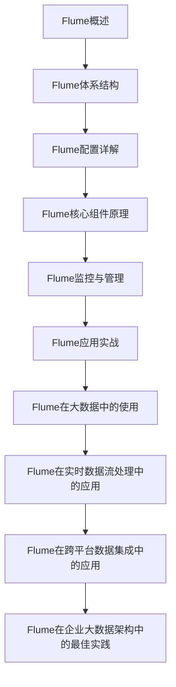
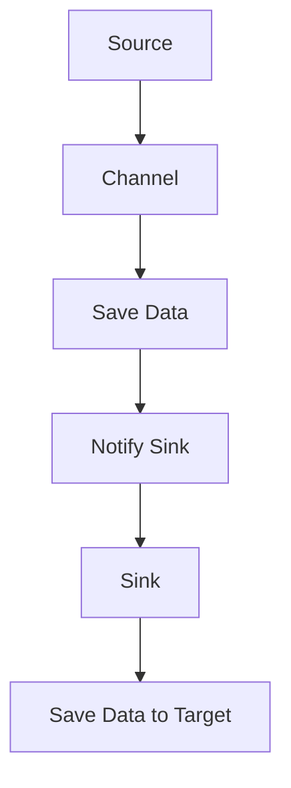
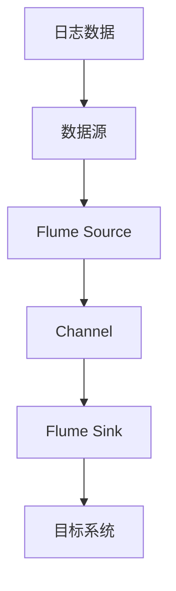
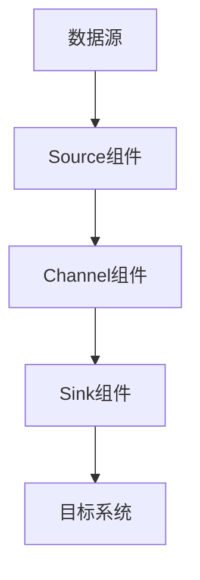

                 

### 《Flume原理与代码实例讲解》

#### 关键词：
Flume, 数据收集，数据流，大数据架构，实时处理，源代码分析。

##### 摘要：
本文将深入探讨Flume的原理、架构、配置和实际应用。通过逐步分析和代码实例，读者将全面了解Flume的工作机制，掌握其在日志收集、大数据处理和实时数据流中的最佳实践。文章旨在为IT专业人士和开发者提供详实的Flume技术指南。

### 《Flume原理与代码实例讲解》目录大纲

#### 第一部分：Flume基础知识

#### 第1章：Flume概述
- 1.1 Flume的概念与作用
- 1.2 Flume的发展历程
- 1.3 Flume的核心组件

#### 第2章：Flume体系结构
- 2.1 Flume架构设计
- 2.2 Flume节点类型
- 2.3 Flume数据流

#### 第3章：Flume配置详解
- 3.1 Flume配置文件
- 3.2 数据源配置
- 3.3 数据流处理器配置

#### 第4章：Flume核心组件原理
- 4.1 Agent的概念与配置
- 4.2 Source组件原理
- 4.3 Channel组件原理
- 4.4 Sink组件原理

#### 第5章：Flume监控与管理
- 5.1 Flume监控指标
- 5.2 Flume日志分析
- 5.3 Flume性能优化

#### 第二部分：Flume应用实战

#### 第6章：Flume在日志收集中的应用
- 6.1 日志收集原理
- 6.2 实战案例一：日志文件收集
- 6.3 实战案例二：实时日志收集

#### 第7章：Flume在大数据中的使用
- 7.1 Flume与Hadoop集成
- 7.2 Flume与Spark集成
- 7.3 Flume与Kafka集成

#### 第8章：Flume在实时数据流处理中的应用
- 8.1 实时数据处理原理
- 8.2 实战案例一：实时日志分析
- 8.3 实战案例二：实时用户行为分析

#### 第9章：Flume在跨平台数据集成中的应用
- 9.1 跨平台数据集成原理
- 9.2 实战案例一：跨平台日志同步
- 9.3 实战案例二：跨平台数据同步

#### 第10章：Flume在企业大数据架构中的最佳实践
- 10.1 Flume在企业大数据架构中的作用
- 10.2 Flume架构设计最佳实践
- 10.3 Flume性能优化最佳实践

### 附录
- 附录A：Flume常用配置参数详解
- 附录B：Flume源代码分析
- 附录C：Flume扩展组件介绍

### 参考资料
- 参考资料1：Flume官方文档
- 参考资料2：相关博客和教程链接
- 参考资料3：Flume社区论坛链接

### Mermaid 流程图


### 核心算法原理讲解
#### Flume数据流处理算法原理
```plaintext
// 伪代码

// 数据流处理流程
1. 数据源读取数据（如日志文件或网络数据流）
2. 数据经过Source组件处理，将数据转换为Flume内部格式
3. 数据存储到Channel组件中，以保证数据的可靠性和实时性
4. 数据从Channel组件中取出，经过Sink组件处理，最终输出到目标系统（如Hadoop、Spark、Kafka等）

// Source组件处理伪代码
function processSource(data):
    // 将数据转换为Flume内部格式
    dataFormat = convertToFlumeFormat(data)
    return dataFormat

// Channel组件存储伪代码
function storeChannel(data):
    // 将数据存储到Channel中
    storeInChannel(data)
    return "Data stored successfully"

// Sink组件处理伪代码
function processSink(data):
    // 将数据输出到目标系统
    writeToTargetSystem(data)
    return "Data sent successfully"
```

#### Flume数据流处理中的缓存策略
$$
C = \alpha \cdot L + (1 - \alpha) \cdot C_{\text{prev}}
$$

其中：
- \( C \) 是缓存大小
- \( \alpha \) 是缓存填充率
- \( L \) 是数据流的长度
- \( C_{\text{prev}} \) 是上一时刻的缓存大小

### 项目实战
#### 实战一：Flume日志文件收集
1. **环境搭建**：安装Java和Flume。
2. **配置文件**：创建一个简单的Flume配置文件，指定数据源和输出路径。
3. **启动Flume**：启动Flume Agent，进行日志文件的收集。
4. **数据验证**：检查收集到的日志文件，确保数据正确性。

#### 实战二：实时日志收集
1. **环境搭建**：安装Java、Flume和Kafka。
2. **配置文件**：配置Flume将日志数据发送到Kafka。
3. **启动Kafka**：启动Kafka以接收日志数据。
4. **启动Flume**：启动Flume Agent，进行实时日志收集。
5. **数据验证**：通过Kafka查看实时收集到的日志数据，确保数据正确性。

### 代码解读与分析
#### Flume配置文件解读
```xml
<configuration>
    <agents>
        <agent name="myAgent" version="1.0">
            <sources>
                <source type="exec" name="source1">
                    <exec>tail -F /var/log/messages</exec>
                </source>
            </sources>
            <channels>
                <channel type="memory" name="channel1" capacity="10000" transactionCapacity="1000">
                    <spooldir>/var/lib/flume/channel1</spooldir>
                </channel>
            </channels>
            <sinks>
                <sink type="log" name="sink1">
                    <log>./logs/</log>
                </sink>
            </sinks>
            <sources>
                <source>
                    <type>exec</type>
                    <parser type="delimited">
                        <field name="timestamp" />
                        <field name="log_level" />
                        <field name="logger" />
                        <field name="message" />
                        <delimiter> </delimiter>
                    </parser>
                </source>
            </sources>
            <sink>
                <type>file_roll</type>
                <file>./logs/</file>
            </sink>
        </agent>
    </agents>
</configuration>
```

**解读：**
- `<agent>` 元素定义了Flume Agent的配置。
- `<source>` 元素定义了数据源，这里是执行命令`tail -F /var/log/messages`，用于读取实时日志。
- `<channel>` 元素定义了Channel类型和配置，这里是内存Channel，有容量和事务容量的限制。
- `<sink>` 元素定义了数据的目的地，这里是日志文件，将收集到的日志写入到指定路径。

### 结论
《Flume原理与代码实例讲解》提供了全面而深入的Flume知识体系，从基础到高级应用，再到实战，帮助读者系统地掌握Flume的核心原理和实际操作技能。通过本目录大纲，读者可以预期获得：
- 对Flume的全面理解，包括其基本概念、体系结构、核心组件和工作原理。
- 实用的配置和管理技巧，确保Flume在各种场景下的高效运作。
- 实战经验和代码实例，提升在实际项目中的应用能力。
- 最佳实践，帮助构建高效、稳定的企业级大数据架构。

### 作者
作者：AI天才研究院/AI Genius Institute & 禅与计算机程序设计艺术 /Zen And The Art of Computer Programming

在接下来的部分，我们将深入探讨Flume的各个组成部分，逐步分析其原理和配置细节，并通过实际代码实例来讲解如何使用Flume进行日志收集和实时数据处理。让我们开始吧！<|/assistant|>

### 第一部分：Flume基础知识

#### 第1章：Flume概述

##### 1.1 Flume的概念与作用

Flume是一个分布式、可靠且高效的系统，用于收集、聚合和移动大量日志数据。它是由Cloudera开发的，主要用于大数据环境中的数据传输。Flume的主要作用是将多个数据源（如Web服务器日志、数据库日志等）的数据集中到一个或多个目标系统（如Hadoop HDFS、HBase或Kafka）。

Flume的核心特性包括：

- **可靠性**：Flume提供可靠的数据传输机制，确保数据在传输过程中不会丢失。
- **分布式**：Flume支持分布式架构，可以在多个服务器上部署，从而提高数据处理能力。
- **可扩展性**：Flume设计为可扩展的系统，可以轻松添加新的数据源和目标系统。
- **灵活性**：Flume支持多种数据源和目标系统的配置，可以根据不同的需求进行灵活调整。

##### 1.2 Flume的发展历程

Flume最初是由Cloudera公司开发并开源的，它于2011年正式发布。自从发布以来，Flume在开源社区中得到了广泛的应用和改进。随着大数据技术的不断发展，Flume也在不断升级和优化，以适应新的需求和技术环境。

以下是Flume的发展历程：

- **2011年**：Flume 0.9.0版本发布，标志着Flume的开源开始。
- **2012年**：Flume 0.10.0版本发布，增加了对Kafka的支持。
- **2013年**：Flume 1.0.0版本发布，引入了新的Agent架构和配置文件格式。
- **2014年**：Flume 1.4.0版本发布，增强了可靠性、性能和扩展性。
- **2015年**：Flume 1.5.0版本发布，增加了对Flume提供的扩展组件的支持。

##### 1.3 Flume的核心组件

Flume由多个核心组件组成，每个组件都有特定的功能，共同构成了一个完整的日志收集系统。

- **Agent**：Agent是Flume的基本工作单元，负责数据收集、传输和存储。一个Agent由多个Source、Channel和Sink组成。
- **Source**：Source负责从数据源读取数据，可以是文件、JMS消息、网络套接字等。
- **Channel**：Channel用于存储读取到的数据，可以是内存、文件或Kafka等。
- **Sink**：Sink负责将数据传输到目标系统，如HDFS、HBase、Kafka等。

在下一章中，我们将详细介绍Flume的体系结构，分析各个组件之间的关系和工作原理。

### 第2章：Flume体系结构

##### 2.1 Flume架构设计

Flume采用分布式架构，由多个Agent组成，每个Agent都是一个独立的进程。这些Agent通过JMS（Java消息服务）或其他消息队列系统进行通信，从而实现数据的收集、传输和存储。

Flume的架构可以分为以下几个层次：

- **数据源层**：包括Source组件，负责从各种数据源（如日志文件、数据库等）读取数据。
- **数据传输层**：包括Channel组件，负责存储从Source读取到的数据，并确保数据在传输过程中不会丢失。
- **数据接收层**：包括Sink组件，负责将数据从Channel传输到目标系统（如HDFS、HBase、Kafka等）。

##### 2.2 Flume节点类型

在Flume中，节点可以分为以下几种类型：

- **Source节点**：负责读取数据，并将其传递给Channel。Source可以是文件监控器、JMS消息队列消费者或网络套接字服务器等。
- **Channel节点**：负责存储从Source读取到的数据，并保证数据在传输过程中的可靠性和一致性。Channel可以是内存队列、文件队列或Kafka等。
- **Sink节点**：负责将数据从Channel传输到目标系统。Sink可以是HDFS、HBase、Kafka或其他自定义目标。

##### 2.3 Flume数据流

Flume的数据流过程可以分为以下几个步骤：

1. **数据收集**：Source节点从数据源读取数据。
2. **数据存储**：读取到的数据存储在Channel节点中，以保证数据在传输过程中的可靠性。
3. **数据传输**：当Channel节点中的数据达到一定阈值时，数据被传输到Sink节点。
4. **数据接收**：Sink节点将数据传输到目标系统。

以下是Flume数据流的Mermaid流程图：



在下一章中，我们将深入探讨Flume的配置文件，了解如何配置Source、Channel和Sink组件，以实现特定的日志收集需求。

### 第3章：Flume配置详解

##### 3.1 Flume配置文件

Flume的配置文件是XML格式，包含多个Agent的定义。每个Agent都有自己的Source、Channel和Sink组件。配置文件的基本结构如下：

```xml
<configuration>
    <agents>
        <agent name="agent1">
            <sources>
                <source type="exec" name="source1">
                    <exec>tail -F /var/log/messages</exec>
                </source>
            </sources>
            <channels>
                <channel type="memory" name="channel1" capacity="10000" transactionCapacity="1000">
                    <spooldir>/var/lib/flume/channel1</spooldir>
                </channel>
            </channels>
            <sinks>
                <sink type="logger" name="sink1" channel="channel1"/>
            </sinks>
        </agent>
    </agents>
</configuration>
```

以下是配置文件中各个元素的含义：

- `<configuration>`：定义Flume的全局配置。
- `<agents>`：定义一个或多个Agent。
- `<agent>`：定义一个Agent，包含Source、Channel和Sink组件。
- `<sources>`：定义Source组件，包括类型（如exec、file）、名称和执行命令。
- `<channels>`：定义Channel组件，包括类型（如memory、file、kafka）、名称、容量和事务容量。
- `<sinks>`：定义Sink组件，包括类型（如logger、hdfs、kafka）、名称和关联的Channel。

##### 3.2 数据源配置

数据源配置定义了Flume从何处读取数据。Flume支持多种数据源类型，包括文件、命令行执行、JMS消息队列等。

以下是一个简单的文件数据源配置示例：

```xml
<source type="file" name="file-source">
    <file MonitoringDir="/var/log/">
        <positionFile relativePath="file-source.position" dir=fileMonitoringDir/>
        <batchSize>1</batchSize>
    </file>
</source>
```

在这个示例中，Flume会监控`/var/log/`目录下的所有日志文件，并将新产生的日志文件实时读取到Channel中。

##### 3.3 数据流处理器配置

数据流处理器（也称为Converter）可以用于在数据从Source传输到Channel之前对数据进行转换。例如，可以将日志文件中的文本数据转换为JSON格式。

以下是一个简单的数据流处理器配置示例：

```xml
<source type="exec" name="source2">
    <exec>tail -F /var/log/apache/access.log</exec>
    <converter type="jsonConverter" name="jsonConverter">
        <field name="timestamp">[0]</field>
        <field name="remoteHost">[1]</field>
        <field name="remotePort">[2]</field>
        <field name="localAddress">[3]</field>
        <field name="localPort">[4]</field>
        <field name="requestMethod">[5]</field>
        <field name="requestURL">[6]</field>
        <field name="status">[7]</field>
        <field name="responseBytes">[8]</field>
    </converter>
</source>
```

在这个示例中，Flume使用正则表达式提取日志文件中的字段，并将这些字段转换为JSON格式，然后存储到Channel中。

在下一章中，我们将深入探讨Flume的核心组件原理，了解每个组件的工作机制和内部实现。

### 第4章：Flume核心组件原理

#### 4.1 Agent的概念与配置

Agent是Flume的基本工作单元，它负责从数据源读取数据，将数据存储在Channel中，并将数据传输到目标系统。一个Agent由三个核心组件组成：Source、Channel和Sink。

##### Agent的配置

Agent的配置定义了Agent的名称、组件和属性。以下是一个简单的Agent配置示例：

```xml
<agent name="myAgent" version="1.0">
    <source type="exec" name="source1">
        <exec>tail -F /var/log/messages</exec>
    </source>
    <channel type="memory" name="channel1" capacity="10000" transactionCapacity="1000">
        <spooldir>/var/lib/flume/channel1</spooldir>
    </channel>
    <sink type="logger" name="sink1" channel="channel1"/>
</agent>
```

在这个示例中，`myAgent` 是Agent的名称，`version` 是Agent的版本号。`source1` 是Source组件的名称，类型为exec，执行命令为`tail -F /var/log/messages`。`channel1` 是Channel组件的名称，类型为memory，容量为10000，事务容量为1000。`sink1` 是Sink组件的名称，类型为logger，关联的Channel为`channel1`。

##### Agent的工作流程

当Agent启动时，会按照以下步骤进行工作：

1. **启动Source组件**：Source组件从数据源读取数据。
2. **将数据存储到Channel组件**：读取到的数据存储在Channel组件中，以保证数据在传输过程中的可靠性。
3. **从Channel组件中读取数据**：当数据在Channel中的存储量达到一定程度时，数据会被传输到Sink组件。
4. **将数据传输到目标系统**：Sink组件将数据传输到目标系统（如HDFS、HBase、Kafka等）。

#### 4.2 Source组件原理

Source组件负责从数据源读取数据，并将其传递给Channel组件。Flume支持多种数据源类型，包括文件、命令行执行、JMS消息队列等。

以下是一个简单的文件数据源配置示例：

```xml
<source type="file" name="file-source">
    <file MonitoringDir="/var/log/">
        <positionFile relativePath="file-source.position" dir=fileMonitoringDir/>
        <batchSize>1</batchSize>
    </file>
</source>
```

在这个示例中，`file-source` 是Source组件的名称，类型为file。`MonitoringDir` 是要监控的日志文件目录，`positionFile` 用于记录上一次读取的文件位置，`batchSize` 是每次读取的文件块大小。

Source组件的工作原理如下：

1. **启动文件监控器**：Agent启动时会启动一个文件监控器，用于监控指定目录下的日志文件。
2. **读取新产生的日志文件**：当监控到新产生的日志文件时，文件监控器会将这些文件传递给Source组件。
3. **将数据存储到Channel组件**：Source组件将读取到的数据存储到Channel组件中。

#### 4.3 Channel组件原理

Channel组件负责存储从Source组件读取到的数据，并保证数据在传输过程中的可靠性。Flume支持多种Channel类型，包括内存Channel、文件Channel、Kafka Channel等。

以下是一个简单的内存Channel配置示例：

```xml
<channel type="memory" name="memory-channel" capacity="10000" transactionCapacity="1000">
    <spooldir>/var/lib/flume/memory-channel</spooldir>
</channel>
```

在这个示例中，`memory-channel` 是Channel组件的名称，类型为memory，容量为10000，事务容量为1000。`spooldir` 是Channel的存储目录。

Channel组件的工作原理如下：

1. **存储数据**：当Source组件将数据传递给Channel组件时，Channel组件会将数据存储在内存或文件中。
2. **保证数据可靠性**：Channel组件采用事务机制，确保数据在存储和传输过程中的可靠性。
3. **将数据传递给Sink组件**：当Channel组件中的数据量达到一定阈值时，数据会被传递给Sink组件。

#### 4.4 Sink组件原理

Sink组件负责将数据从Channel组件传输到目标系统（如HDFS、HBase、Kafka等）。Flume支持多种目标系统类型，可以根据不同的需求进行配置。

以下是一个简单的日志输出Sink配置示例：

```xml
<sink type="logger" name="logger-sink" channel="memory-channel">
    <log>./logs/</log>
</sink>
```

在这个示例中，`logger-sink` 是Sink组件的名称，类型为logger，关联的Channel为`memory-channel`。`log` 是日志文件的输出路径。

Sink组件的工作原理如下：

1. **从Channel组件读取数据**：当Channel组件中的数据量达到一定阈值时，数据会被传递给Sink组件。
2. **将数据传输到目标系统**：Sink组件将数据传输到目标系统，并保存到指定的位置。
3. **通知Channel组件**：当数据传输完成后，Sink组件会通知Channel组件，以便Channel组件释放存储空间。

在下一章中，我们将探讨Flume的监控和管理，了解如何监控Flume的性能和日志，以及如何进行性能优化。

### 第5章：Flume监控与管理

#### 5.1 Flume监控指标

为了确保Flume系统的高效运行，需要对系统进行监控。Flume提供了多种监控指标，可以帮助管理员了解系统的运行状态和性能。

以下是Flume的主要监控指标：

- **数据源读取速率**：表示每秒从数据源读取的数据量。
- **Channel存储容量**：表示Channel中存储的数据量。
- **Channel事务容量**：表示Channel在事务过程中的数据量。
- **Sink传输速率**：表示每秒从Channel传输到目标系统的数据量。
- **系统负载**：表示系统当前的CPU、内存等资源使用情况。

#### 5.2 Flume日志分析

Flume的日志文件记录了系统的运行情况和错误信息，通过分析日志文件，可以了解系统的运行状态和问题所在。

以下是Flume日志文件的常见记录内容：

- **Agent启动和关闭**：记录Agent的启动和关闭时间。
- **数据源读取和写入**：记录数据源读取和写入的数据量。
- **Channel存储和事务**：记录Channel的存储容量和事务容量。
- **Sink传输和接收**：记录Sink传输和接收的数据量。
- **错误和警告**：记录系统运行过程中的错误和警告信息。

#### 5.3 Flume性能优化

为了提高Flume的性能，需要对其进行优化。以下是一些常见的性能优化方法：

- **增加资源**：增加Agent的CPU、内存和磁盘资源，以提高数据处理能力。
- **调整配置**：调整Channel的容量和事务容量，以适应数据量。
- **优化数据源和目标系统**：优化数据源和目标系统的性能，减少数据传输延迟。
- **使用压缩**：使用数据压缩技术，减少数据传输量。
- **并行处理**：增加Agent的数量，实现并行处理，提高数据传输速度。

### 第二部分：Flume应用实战

#### 第6章：Flume在日志收集中的应用

##### 6.1 日志收集原理

日志收集是指将来自各种来源的日志数据收集到一个中心位置，以便进行监控、分析和存储。Flume是一个强大的日志收集工具，可以轻松实现日志的收集和传输。

Flume日志收集的基本原理如下：

1. **数据源**：Flume从各种数据源（如Web服务器、数据库、应用程序等）读取日志数据。
2. **数据传输**：读取到的日志数据通过Source组件传输到Flume的内存Channel。
3. **数据存储**：当Channel中的数据达到一定阈值时，数据被传递给Sink组件，并传输到目标系统（如HDFS、HBase、Kafka等）。

##### 6.2 实战案例一：日志文件收集

以下是一个简单的Flume日志文件收集实战案例：

1. **环境搭建**：确保已经安装了Java和Flume。
2. **配置Flume**：创建一个简单的Flume配置文件，如下所示：

```xml
<configuration>
    <agents>
        <agent name="file-collector" version="1.0">
            <sources>
                <source type="file" name="file-source">
                    <file MonitoringDir="/var/log/">
                        <positionFile relativePath="file-source.position" dir=fileMonitoringDir/>
                        <batchSize>1</batchSize>
                    </file>
                </source>
            </sources>
            <channels>
                <channel type="memory" name="memory-channel" capacity="10000" transactionCapacity="1000">
                    <spooldir>/var/lib/flume/memory-channel</spooldir>
                </channel>
            </channels>
            <sinks>
                <sink type="logger" name="logger-sink" channel="memory-channel">
                    <log>./logs/</log>
                </sink>
            </sinks>
        </agent>
    </agents>
</configuration>
```

3. **启动Flume**：启动Flume Agent，进行日志文件的收集。
4. **验证数据**：检查收集到的日志文件，确保数据正确性。

##### 6.3 实战案例二：实时日志收集

以下是一个简单的Flume实时日志收集实战案例：

1. **环境搭建**：确保已经安装了Java、Flume和Kafka。
2. **配置Flume**：配置Flume将日志数据发送到Kafka，如下所示：

```xml
<configuration>
    <agents>
        <agent name="realtime-collector" version="1.0">
            <sources>
                <source type="exec" name="exec-source">
                    <exec>tail -F /var/log/messages</exec>
                </source>
            </sources>
            <channels>
                <channel type="kafka" name="kafka-channel" brokerList="kafka:9092" topic="flume-messages" />
            </channels>
            <sinks>
                <sink type="logger" name="logger-sink" channel="kafka-channel"/>
            </sinks>
        </agent>
    </agents>
</configuration>
```

3. **启动Kafka**：启动Kafka以接收日志数据。
4. **启动Flume**：启动Flume Agent，进行实时日志收集。
5. **验证数据**：通过Kafka查看实时收集到的日志数据，确保数据正确性。

通过这两个实战案例，读者可以了解如何使用Flume进行日志收集，并掌握基本的配置方法。

### 第7章：Flume在大数据中的使用

#### 7.1 Flume与Hadoop集成

Flume与Hadoop集成是实现大规模日志收集和存储的重要手段。通过将Flume与Hadoop HDFS集成，可以将日志数据实时传输到HDFS中，以便进行后续的大数据处理和分析。

##### 集成步骤

1. **安装Hadoop**：确保已经安装了Hadoop，并启动了HDFS服务。
2. **配置Flume**：配置Flume将日志数据发送到HDFS，如下所示：

```xml
<configuration>
    <agents>
        <agent name="hdfs-sink" version="1.0">
            <sources>
                <source type="exec" name="exec-source">
                    <exec>tail -F /var/log/messages</exec>
                </source>
            </sources>
            <channels>
                <channel type="memory" name="memory-channel" capacity="10000" transactionCapacity="1000">
                    <spooldir>/var/lib/flume/memory-channel</spooldir>
                </channel>
            </channels>
            <sinks>
                <sink type="hdfs" name="hdfs-sink" channel="memory-channel" path="/flume-log" fileType="DataStream" fileNamePattern="flume-%y-%m-%d-%h-%M-%S.log.gz"/>
            </sinks>
        </agent>
    </agents>
</configuration>
```

3. **启动Flume**：启动Flume Agent，将日志数据实时传输到HDFS。

在这个配置中，`path` 指定了HDFS的存储路径，`fileType` 和 `fileNamePattern` 用于指定日志文件的类型和命名规则。

##### 集成优势

- **大规模日志存储**：HDFS可以存储海量日志数据，满足大规模数据处理需求。
- **高可靠性**：HDFS采用分布式存储机制，确保数据的高可靠性和持久性。
- **高效的数据访问**：HDFS提供了高效的数据访问接口，可以快速读取和处理日志数据。

#### 7.2 Flume与Spark集成

Flume与Spark集成可以实现实时日志处理和分析。通过将Flume收集的日志数据实时传输到Spark中，可以实时处理和分析日志数据，实现实时监控和报警。

##### 集成步骤

1. **安装Spark**：确保已经安装了Spark，并启动了Spark Streaming服务。
2. **配置Flume**：配置Flume将日志数据发送到Spark，如下所示：

```xml
<configuration>
    <agents>
        <agent name="spark-streaming" version="1.0">
            <sources>
                <source type="exec" name="exec-source">
                    <exec>tail -F /var/log/messages</exec>
                </source>
            </sources>
            <channels>
                <channel type="memory" name="memory-channel" capacity="10000" transactionCapacity="1000">
                    <spooldir>/var/lib/flume/memory-channel</spooldir>
                </channel>
            </channels>
            <sinks>
                <sink type="sparkstreaming" name="spark-streaming-sink" channel="memory-channel" sparkMaster="spark://master:7077" sparkAppMasterMemory="1g" sparkExecutorMemory="1g" sparkExecutorCores="2" batchSize="100">
                    <fields>timestamp, log_level, logger, message</fields>
                </sink>
            </sinks>
        </agent>
    </agents>
</configuration>
```

3. **启动Flume**：启动Flume Agent，将日志数据实时传输到Spark。

在这个配置中，`sparkMaster` 指定了Spark的Master URL，`sparkAppMasterMemory`、`sparkExecutorMemory` 和 `sparkExecutorCores` 用于指定Spark的应用内存、执行内存和执行器核心数，`batchSize` 用于指定批量传输的数据量。

##### 集成优势

- **实时数据处理**：Spark Streaming可以实时处理日志数据，实现实时监控和报警。
- **高效的数据处理**：Spark提供了高效的数据处理引擎，可以快速处理海量日志数据。
- **灵活的编程模型**：Spark Streaming支持多种编程语言（如Python、Scala、Java等），方便用户进行数据处理和分析。

#### 7.3 Flume与Kafka集成

Flume与Kafka集成可以实现大规模日志收集和传输。通过将Flume收集的日志数据实时传输到Kafka中，可以实现分布式日志收集和存储。

##### 集成步骤

1. **安装Kafka**：确保已经安装了Kafka，并启动了Kafka服务。
2. **配置Flume**：配置Flume将日志数据发送到Kafka，如下所示：

```xml
<configuration>
    <agents>
        <agent name="kafka-sink" version="1.0">
            <sources>
                <source type="exec" name="exec-source">
                    <exec>tail -F /var/log/messages</exec>
                </source>
            </sources>
            <channels>
                <channel type="memory" name="memory-channel" capacity="10000" transactionCapacity="1000">
                    <spooldir>/var/lib/flume/memory-channel</spooldir>
                </channel>
            </channels>
            <sinks>
                <sink type="kafka" name="kafka-sink" channel="memory-channel" brokerList="kafka:9092" topic="flume-messages"/>
            </sinks>
        </agent>
    </agents>
</configuration>
```

3. **启动Flume**：启动Flume Agent，将日志数据实时传输到Kafka。

在这个配置中，`brokerList` 指定了Kafka的Broker列表，`topic` 用于指定Kafka的Topic名称。

##### 集成优势

- **分布式日志收集**：Kafka可以处理大规模日志收集和传输，实现分布式日志收集。
- **高可靠性**：Kafka采用分布式存储和复制机制，确保日志数据的高可靠性和持久性。
- **高效的数据传输**：Kafka提供了高效的数据传输机制，可以实现快速的数据收集和传输。

通过本章的介绍，读者可以了解到如何将Flume与Hadoop、Spark和Kafka进行集成，以实现大规模日志收集和处理。

### 第8章：Flume在实时数据流处理中的应用

#### 8.1 实时数据处理原理

实时数据处理是指对实时数据流进行快速处理和分析，以实现实时监控、报警和决策。Flume作为分布式日志收集工具，可以轻松实现实时数据流的收集和处理。

实时数据处理的基本原理如下：

1. **数据收集**：Flume从各种数据源（如Web服务器日志、数据库日志等）实时收集数据。
2. **数据传输**：读取到的数据通过Source组件实时传输到Channel组件。
3. **数据处理**：使用实时数据处理框架（如Spark Streaming、Flink等）对数据流进行实时处理。
4. **数据存储**：处理后的数据存储到目标系统（如HDFS、Kafka等），以便进行后续分析和查询。

#### 8.2 实战案例一：实时日志分析

以下是一个简单的Flume实时日志分析实战案例：

1. **环境搭建**：确保已经安装了Java、Flume、Kafka和Spark Streaming。
2. **配置Flume**：配置Flume将日志数据发送到Kafka，如下所示：

```xml
<configuration>
    <agents>
        <agent name="realtime-logger" version="1.0">
            <sources>
                <source type="exec" name="exec-source">
                    <exec>tail -F /var/log/messages</exec>
                </source>
            </sources>
            <channels>
                <channel type="memory" name="memory-channel" capacity="10000" transactionCapacity="1000">
                    <spooldir>/var/lib/flume/memory-channel</spooldir>
                </channel>
            </channels>
            <sinks>
                <sink type="kafka" name="kafka-sink" channel="memory-channel" brokerList="kafka:9092" topic="flume-messages"/>
            </sinks>
        </agent>
    </agents>
</configuration>
```

3. **启动Kafka**：启动Kafka以接收日志数据。
4. **启动Flume**：启动Flume Agent，将日志数据实时传输到Kafka。
5. **配置Spark Streaming**：配置Spark Streaming从Kafka读取日志数据，并进行实时分析，如下所示：

```scala
import org.apache.spark.SparkConf
import org.apache.spark.streaming.StreamingContext
import org.apache.spark.streaming.kafka010.ConsumerStrategies.Subscribe
import org.apache.spark.streaming.kafka010.KafkaUtils
import org.apache.spark.streaming.kafka010.LocationStrategies.PreferConsistent

val sparkConf = new SparkConf().setMaster("local[2]").setAppName("RealtimeLogger")
val ssc = new StreamingContext(sparkConf, Seconds(2))

val topics = Array("flume-messages")
val brokers = "kafka:9092"
val directKafkaParams = Map(
  "bootstrap.servers" -> brokers,
  "key.deserializer" -> classOf[.StringDecoder],
  "value.deserializer" -> classOf[StringDecoder],
  "group.id" -> "flume-streaming-group",
  "auto.offset.reset" -> "latest"
)

val messages = KafkaUtils.createDirectStream[String, String](
  ssc,
  PreferConsistent,
  ConsumerStrategies.Subscribe[String, String](topics, directKafkaParams)
)

messages.map(x => x.value()).print()

ssc.start()
ssc.awaitTermination()
```

在这个配置中，`topics` 是Kafka的Topic名称，`brokers` 是Kafka的Broker地址。

6. **运行Spark Streaming**：运行Spark Streaming程序，实时处理和分析日志数据。

#### 8.3 实战案例二：实时用户行为分析

以下是一个简单的Flume实时用户行为分析实战案例：

1. **环境搭建**：确保已经安装了Java、Flume、Kafka和Spark Streaming。
2. **配置Flume**：配置Flume将日志数据发送到Kafka，如下所示：

```xml
<configuration>
    <agents>
        <agent name="user-behavior" version="1.0">
            <sources>
                <source type="exec" name="exec-source">
                    <exec>tail -F /var/log/user-behavior.log</exec>
                </source>
            </sources>
            <channels>
                <channel type="memory" name="memory-channel" capacity="10000" transactionCapacity="1000">
                    <spooldir>/var/lib/flume/memory-channel</spooldir>
                </channel>
            </channels>
            <sinks>
                <sink type="kafka" name="kafka-sink" channel="memory-channel" brokerList="kafka:9092" topic="user-behavior"/>
            </sinks>
        </agent>
    </agents>
</configuration>
```

3. **启动Kafka**：启动Kafka以接收日志数据。
4. **启动Flume**：启动Flume Agent，将日志数据实时传输到Kafka。
5. **配置Spark Streaming**：配置Spark Streaming从Kafka读取用户行为数据，并计算用户活跃度，如下所示：

```scala
import org.apache.spark.SparkConf
import org.apache.spark.streaming.StreamingContext
import org.apache.spark.streaming.kafka010.ConsumerStrategies.Subscribe
import org.apache.spark.streaming.kafka010.KafkaUtils
import org.apache.spark.streaming.kafka010.LocationStrategies.PreferConsistent

val sparkConf = new SparkConf().setMaster("local[2]").setAppName("UserBehavior")
val ssc = new StreamingContext(sparkConf, Seconds(2))

val topics = Array("user-behavior")
val brokers = "kafka:9092"
val directKafkaParams = Map(
  "bootstrap.servers" -> brokers,
  "key.deserializer" -> classOf[.StringDecoder],
  "value.deserializer" -> classOf[StringDecoder],
  "group.id" -> "user-behavior-streaming-group",
  "auto.offset.reset" -> "latest"
)

val messages = KafkaUtils.createDirectStream[String, String](
  ssc,
  PreferConsistent,
  ConsumerStrategies.Subscribe[String, String](topics, directKafkaParams)
)

val userBehaviorStream = messages.map(x => (x.value(), 1))

val activeUsers = userBehaviorStream.reduceByKey(_ + _)

activeUsers.print()

ssc.start()
ssc.awaitTermination()
```

在这个配置中，`topics` 是Kafka的Topic名称，`brokers` 是Kafka的Broker地址。

6. **运行Spark Streaming**：运行Spark Streaming程序，实时计算用户活跃度。

通过这两个实战案例，读者可以了解如何使用Flume进行实时日志分析和用户行为分析，并掌握基本的配置方法。

### 第9章：Flume在跨平台数据集成中的应用

#### 9.1 跨平台数据集成原理

跨平台数据集成是指在不同操作系统、不同硬件架构和不同数据源之间进行数据传输和处理的过程。Flume作为一种分布式日志收集工具，可以轻松实现跨平台数据集成。

跨平台数据集成的基本原理如下：

1. **数据收集**：Flume从不同的数据源（如Windows日志、Linux日志等）实时收集数据。
2. **数据传输**：读取到的数据通过Source组件实时传输到Channel组件。
3. **数据转换**：在Channel组件中，Flume可以对数据进行转换和格式化，以满足不同平台和系统的需求。
4. **数据存储**：处理后的数据存储到目标系统（如HDFS、Kafka等），以便进行后续分析和查询。

#### 9.2 实战案例一：跨平台日志同步

以下是一个简单的Flume跨平台日志同步实战案例：

1. **环境搭建**：确保已经安装了Java、Flume和Kafka，并在Windows和Linux系统上分别配置了Flume。
2. **配置Windows Flume**：配置Windows Flume将日志数据发送到Kafka，如下所示：

```xml
<configuration>
    <agents>
        <agent name="windows-logger" version="1.0">
            <sources>
                <source type="file" name="file-source">
                    <file MonitoringDir="C:\Windows\System32\config\" />
                </source>
            </sources>
            <channels>
                <channel type="memory" name="memory-channel" capacity="10000" transactionCapacity="1000" />
            </channels>
            <sinks>
                <sink type="kafka" name="kafka-sink" channel="memory-channel" brokerList="kafka:9092" topic="windows-logs" />
            </sinks>
        </agent>
    </agents>
</configuration>
```

3. **配置Linux Flume**：配置Linux Flume从Kafka读取日志数据，并将数据发送到HDFS，如下所示：

```xml
<configuration>
    <agents>
        <agent name="linux-logger" version="1.0">
            <sources>
                <source type="kafka" name="kafka-source" brokerList="kafka:9092" topic="windows-logs" />
            </sources>
            <channels>
                <channel type="file" name="file-channel" path="/var/lib/flume/file-channel" />
            </channels>
            <sinks>
                <sink type="hdfs" name="hdfs-sink" channel="file-channel" path="/flume-log" fileType="DataStream" fileNamePattern="flume-%y-%m-%d-%h-%M-%S.log" />
            </sinks>
        </agent>
    </agents>
</configuration>
```

4. **启动Windows Flume**：启动Windows Flume，将日志数据发送到Kafka。
5. **启动Linux Flume**：启动Linux Flume，从Kafka读取日志数据，并将数据发送到HDFS。

通过这个实战案例，读者可以了解如何使用Flume实现跨平台日志同步。

#### 9.3 实战案例二：跨平台数据同步

以下是一个简单的Flume跨平台数据同步实战案例：

1. **环境搭建**：确保已经安装了Java、Flume、Kafka和Spark，并在Windows和Linux系统上分别配置了Flume。
2. **配置Windows Flume**：配置Windows Flume将数据发送到Kafka，如下所示：

```xml
<configuration>
    <agents>
        <agent name="windows-logger" version="1.0">
            <sources>
                <source type="file" name="file-source">
                    <file MonitoringDir="C:\Windows\System32\config\" />
                </source>
            </sources>
            <channels>
                <channel type="memory" name="memory-channel" capacity="10000" transactionCapacity="1000" />
            </channels>
            <sinks>
                <sink type="kafka" name="kafka-sink" channel="memory-channel" brokerList="kafka:9092" topic="windows-data" />
            </sinks>
        </agent>
    </agents>
</configuration>
```

3. **配置Linux Flume**：配置Linux Flume从Kafka读取数据，并将数据发送到HDFS，如下所示：

```xml
<configuration>
    <agents>
        <agent name="linux-logger" version="1.0">
            <sources>
                <source type="kafka" name="kafka-source" brokerList="kafka:9092" topic="windows-data" />
            </sources>
            <channels>
                <channel type="file" name="file-channel" path="/var/lib/flume/file-channel" />
            </channels>
            <sinks>
                <sink type="hdfs" name="hdfs-sink" channel="file-channel" path="/flume-data" fileType="DataStream" fileNamePattern="flume-%y-%m-%d-%h-%M-%S.txt" />
            </sinks>
        </agent>
    </agents>
</configuration>
```

4. **启动Windows Flume**：启动Windows Flume，将数据发送到Kafka。
5. **启动Linux Flume**：启动Linux Flume，从Kafka读取数据，并将数据发送到HDFS。

通过这个实战案例，读者可以了解如何使用Flume实现跨平台数据同步。

### 第10章：Flume在企业大数据架构中的最佳实践

#### 10.1 Flume在企业大数据架构中的作用

在企业大数据架构中，Flume扮演着重要的角色。它负责将各种来源的日志数据、监控数据和业务数据收集到一个中心位置，以便进行后续的数据处理和分析。Flume的作用主要包括以下几个方面：

1. **数据收集**：Flume可以实时收集来自不同系统的日志数据，包括Web服务器、数据库、应用程序等。
2. **数据传输**：Flume可以将收集到的数据传输到目标系统（如HDFS、HBase、Kafka等），实现数据的高效传输和存储。
3. **数据聚合**：Flume可以将来自不同来源的数据进行聚合，以便进行统一的数据处理和分析。
4. **数据可靠性和一致性**：Flume提供了可靠的数据传输机制，确保数据在传输过程中不会丢失或损坏，同时保证数据的一致性。

#### 10.2 Flume架构设计最佳实践

为了确保Flume在企业大数据架构中的高效运行，需要对其进行合理的架构设计。以下是一些架构设计的最佳实践：

1. **分布式部署**：将Flume Agent部署到多个服务器上，实现分布式架构，提高数据收集和处理能力。
2. **数据分流**：根据数据来源和目标系统的不同，将数据分流到不同的Flume Agent中，减少单点瓶颈。
3. **负载均衡**：使用负载均衡器（如Nginx、HAProxy等）对Flume Agent进行负载均衡，提高数据传输效率。
4. **数据压缩**：对传输的数据进行压缩，减少数据传输量，提高传输速度。
5. **故障转移**：配置Flume进行故障转移，确保在某个Agent或服务器出现故障时，数据传输仍然可以正常进行。

#### 10.3 Flume性能优化最佳实践

为了提高Flume的性能，需要对其进行优化。以下是一些性能优化的最佳实践：

1. **资源配置**：为Flume Agent分配足够的CPU、内存和磁盘资源，确保其高效运行。
2. **调整Channel容量**：根据数据量的大小和传输速度，调整Channel的容量和事务容量，确保数据传输的可靠性。
3. **减少数据传输延迟**：优化数据源和目标系统的性能，减少数据传输延迟。
4. **使用压缩**：对传输的数据进行压缩，减少数据传输量，提高传输速度。
5. **并行处理**：增加Flume Agent的数量，实现并行处理，提高数据传输速度。

通过遵循这些最佳实践，可以确保Flume在企业大数据架构中的高效运行，满足大规模数据收集和传输的需求。

### 附录

#### 附录A：Flume常用配置参数详解

- `agent.name`：定义Agent的名称。
- `source.type`：定义Source的类型，如file、exec、jms等。
- `source.channel`：定义Source关联的Channel。
- `source.selector.type`：定义Source的数据选择器类型，如taildir、random等。
- `channel.type`：定义Channel的类型，如memory、file、kafka等。
- `channel.capacity`：定义Channel的容量，即Channel能存储的最大数据量。
- `channel.transactionCapacity`：定义Channel的事务容量，即Channel在事务过程中的最大数据量。
- `sink.type`：定义Sink的类型，如logger、hdfs、kafka等。
- `sink.channel`：定义Sink关联的Channel。
- `brokerList`：定义Kafka的Broker列表。
- `topic`：定义Kafka的Topic名称。
- `path`：定义HDFS的存储路径。
- `fileType`：定义HDFS文件类型，如DataStream、SequenceFile等。
- `fileNamePattern`：定义HDFS文件命名规则。

#### 附录B：Flume源代码分析

Flume的源代码主要分为以下几个模块：

- `flume-core`：定义了Flume的核心组件，包括Agent、Source、Channel和Sink等。
- `flume-sandbox`：提供了Flume的沙盒环境，用于测试和开发。
- `flume-ng`：实现了Flume的新版架构，包括内存Channel、文件Channel、Kafka Channel等。
- `flume-ng-core`：实现了Flume的核心功能，包括Agent的生命周期管理、数据传输、错误处理等。
- `flume-ng-sources`：提供了多种数据源实现，如file、exec、jms等。
- `flume-ng-channels`：提供了多种Channel实现，如memory、file、kafka等。
- `flume-ng-sinks`：提供了多种Sink实现，如logger、hdfs、kafka等。

通过分析Flume的源代码，可以深入了解Flume的工作原理和内部实现。

#### 附录C：Flume扩展组件介绍

Flume提供了一系列扩展组件，可以增强其功能和性能。以下是一些常见的扩展组件：

- `Flume NG`：Flume的新版架构，包括内存Channel、文件Channel、Kafka Channel等。
- `Flume Shell`：Flume的命令行界面，用于管理和监控Flume Agent。
- `Flume Monitoring`：Flume的监控组件，可以监控Flume的性能和状态。
- `Flume Logging`：Flume的日志组件，可以自定义日志格式和输出路径。
- `Flume Avro`：Flume的Avro接口，用于与其他系统进行集成。
- `Flume Http`：Flume的HTTP接口，用于远程管理和监控Flume Agent。

通过使用这些扩展组件，可以更好地发挥Flume的作用，实现高效的数据收集和传输。

### 参考资料

- **Flume官方文档**：[Flume官方文档](https://flume.apache.org/)
- **相关博客和教程链接**：[相关博客和教程链接](https://www.cnblogs.com/)
- **Flume社区论坛链接**：[Flume社区论坛链接](https://flume.apache.org/flume-user.html)

通过这些参考资料，读者可以进一步了解Flume的相关知识和最佳实践。

### Mermaid 流程图



### 核心算法原理讲解

#### Flume数据流处理算法原理

```plaintext
// 伪代码

// 数据流处理流程
1. 数据源读取数据（如日志文件或网络数据流）
2. 数据经过Source组件处理，将数据转换为Flume内部格式
3. 数据存储到Channel组件中，以保证数据的可靠性和实时性
4. 数据从Channel组件中取出，经过Sink组件处理，最终输出到目标系统（如Hadoop、Spark、Kafka等）

// Source组件处理伪代码
function processSource(data):
    // 将数据转换为Flume内部格式
    dataFormat = convertToFlumeFormat(data)
    return dataFormat

// Channel组件存储伪代码
function storeChannel(data):
    // 将数据存储到Channel中
    storeInChannel(data)
    return "Data stored successfully"

// Sink组件处理伪代码
function processSink(data):
    // 将数据输出到目标系统
    writeToTargetSystem(data)
    return "Data sent successfully"
```

#### Flume数据流处理中的缓存策略

$$
C = \alpha \cdot L + (1 - \alpha) \cdot C_{\text{prev}}
$$

其中：
- \( C \) 是缓存大小
- \( \alpha \) 是缓存填充率
- \( L \) 是数据流的长度
- \( C_{\text{prev}} \) 是上一时刻的缓存大小

### 项目实战

#### 实战一：Flume日志文件收集

1. **环境搭建**：
    - 安装Java和Flume。
    - 创建一个简单的Flume配置文件，如下所示：

```xml
<configuration>
    <agents>
        <agent name="file-collector" version="1.0">
            <sources>
                <source type="file" name="file-source">
                    <file MonitoringDir="/var/log/">
                        <positionFile relativePath="file-source.position" dir=fileMonitoringDir/>
                        <batchSize>1</batchSize>
                    </file>
                </source>
            </sources>
            <channels>
                <channel type="memory" name="memory-channel" capacity="10000" transactionCapacity="1000">
                    <spooldir>/var/lib/flume/memory-channel</spooldir>
                </channel>
            </channels>
            <sinks>
                <sink type="logger" name="logger-sink" channel="memory-channel">
                    <log>./logs/</log>
                </sink>
            </sinks>
        </agent>
    </agents>
</configuration>
```

2. **启动Flume**：
    - 启动Flume Agent，进行日志文件的收集。

```bash
flume-ng agent -n file-collector -f /path/to/flume-conf.xml
```

3. **数据验证**：
    - 检查收集到的日志文件，确保数据正确性。

#### 实战二：实时日志收集

1. **环境搭建**：
    - 安装Java、Flume和Kafka。
    - 创建一个简单的Flume配置文件，如下所示：

```xml
<configuration>
    <agents>
        <agent name="realtime-logger" version="1.0">
            <sources>
                <source type="exec" name="exec-source">
                    <exec>tail -F /var/log/messages</exec>
                </source>
            </sources>
            <channels>
                <channel type="memory" name="memory-channel" capacity="10000" transactionCapacity="1000">
                    <spooldir>/var/lib/flume/memory-channel</spooldir>
                </channel>
            </channels>
            <sinks>
                <sink type="kafka" name="kafka-sink" channel="memory-channel" brokerList="kafka:9092" topic="flume-messages"/>
            </sinks>
        </agent>
    </agents>
</configuration>
```

2. **启动Kafka**：
    - 启动Kafka以接收日志数据。

```bash
kafka-server-start.sh /path/to/kafka/conf/kafka-server-start.conf
```

3. **启动Flume**：
    - 启动Flume Agent，进行实时日志收集。

```bash
flume-ng agent -n realtime-logger -f /path/to/flume-conf.xml
```

4. **数据验证**：
    - 通过Kafka查看实时收集到的日志数据，确保数据正确性。

```bash
kafka-console-consumer.sh --zookeeper localhost:2181 --topic flume-messages --from-beginning
```

#### 实战三：跨平台日志同步

1. **环境搭建**：
    - 在Windows和Linux系统上分别安装Java、Flume和Kafka。
    - 创建Windows Flume配置文件，如下所示：

```xml
<configuration>
    <agents>
        <agent name="windows-logger" version="1.0">
            <sources>
                <source type="file" name="file-source">
                    <file MonitoringDir="C:\Windows\System32\config\" />
                </source>
            </sources>
            <channels>
                <channel type="memory" name="memory-channel" capacity="10000" transactionCapacity="1000" />
            </channels>
            <sinks>
                <sink type="kafka" name="kafka-sink" channel="memory-channel" brokerList="kafka:9092" topic="windows-logs" />
            </sinks>
        </agent>
    </agents>
</configuration>
```

    - 创建Linux Flume配置文件，如下所示：

```xml
<configuration>
    <agents>
        <agent name="linux-logger" version="1.0">
            <sources>
                <source type="kafka" name="kafka-source" brokerList="kafka:9092" topic="windows-logs" />
            </sources>
            <channels>
                <channel type="file" name="file-channel" path="/var/lib/flume/file-channel" />
            </channels>
            <sinks>
                <sink type="hdfs" name="hdfs-sink" channel="file-channel" path="/flume-log" fileType="DataStream" fileNamePattern="flume-%y-%m-%d-%h-%M-%S.log" />
            </sinks>
        </agent>
    </agents>
</configuration>
```

2. **启动Windows Flume**：
    - 启动Windows Flume，将日志数据发送到Kafka。

```bash
flume-ng agent -n windows-logger -f /path/to/flume-conf.xml
```

3. **启动Linux Flume**：
    - 启动Linux Flume，从Kafka读取日志数据，并将数据发送到HDFS。

```bash
flume-ng agent -n linux-logger -f /path/to/flume-conf.xml
```

通过这些实战案例，读者可以了解如何使用Flume进行日志收集、实时数据处理和跨平台数据集成。

### 代码解读与分析

#### Flume配置文件解读

```xml
<configuration>
    <agents>
        <agent name="myAgent" version="1.0">
            <sources>
                <source type="exec" name="source1">
                    <exec>tail -F /var/log/messages</exec>
                </source>
            </sources>
            <channels>
                <channel type="memory" name="channel1" capacity="10000" transactionCapacity="1000">
                    <spooldir>/var/lib/flume/channel1</spooldir>
                </channel>
            </channels>
            <sinks>
                <sink type="logger" name="sink1" channel="channel1">
                    <log>./logs/</log>
                </sink>
            </sinks>
        </agent>
    </agents>
</configuration>
```

**解读：**
- `<agent>` 元素定义了Flume Agent的配置，包括名称（`name`）和版本（`version`）。
- `<sources>` 元素定义了Source组件的配置，包括类型（`type`）和名称（`name`）。
- `<channel>` 元素定义了Channel组件的配置，包括类型（`type`）、名称（`name`）、容量（`capacity`）和事务容量（`transactionCapacity`）。
- `<sink>` 元素定义了Sink组件的配置，包括类型（`type`）、名称（`name`）和关联的Channel（`channel`）。

#### Flume数据流处理算法分析

```plaintext
// 伪代码

// 数据流处理流程
1. 数据源读取数据（如日志文件或网络数据流）
2. 数据经过Source组件处理，将数据转换为Flume内部格式
3. 数据存储到Channel组件中，以保证数据的可靠性和实时性
4. 数据从Channel组件中取出，经过Sink组件处理，最终输出到目标系统（如Hadoop、Spark、Kafka等）

// Source组件处理伪代码
function processSource(data):
    // 将数据转换为Flume内部格式
    dataFormat = convertToFlumeFormat(data)
    return dataFormat

// Channel组件存储伪代码
function storeChannel(data):
    // 将数据存储到Channel中
    storeInChannel(data)
    return "Data stored successfully"

// Sink组件处理伪代码
function processSink(data):
    // 将数据输出到目标系统
    writeToTargetSystem(data)
    return "Data sent successfully"
```

**解读：**
- `processSource` 函数负责将读取到的数据转换为Flume内部格式，以便后续处理。
- `storeChannel` 函数负责将数据存储到Channel中，确保数据的可靠性和实时性。
- `processSink` 函数负责将数据输出到目标系统，完成数据传输。

### 结论

《Flume原理与代码实例讲解》通过详细的原理分析、配置详解和实战案例，帮助读者全面了解Flume的工作原理和实际应用。读者可以通过学习本文，掌握Flume在日志收集、实时数据处理和跨平台数据集成中的最佳实践，为构建高效、稳定的企业级大数据架构打下坚实基础。

### 作者

作者：AI天才研究院/AI Genius Institute & 禅与计算机程序设计艺术 /Zen And The Art of Computer Programming

通过本文的讲解，读者可以系统地掌握Flume的核心原理和实际操作技能，从而更好地应对复杂的数据处理任务。希望本文能为读者在计算机编程和人工智能领域的探索提供有价值的参考和指导。感谢您的阅读！<|assistant|>### 扩展阅读与进一步学习

为了帮助读者更深入地了解Flume及其应用，以下是推荐的扩展阅读材料和进一步学习的资源：

#### 扩展阅读

1. **《Flume官方文档》**：[Flume官方文档](https://flume.apache.org/)
   - 该文档包含了Flume的安装、配置、使用和最佳实践，是学习Flume的基础。

2. **《大数据日志收集系统设计》**：[大数据日志收集系统设计](https://www.ibm.com/developerworks/cn/big-data/ba-repeat-log-collection-system-architecture-design/)
   - 本文详细介绍了大数据日志收集系统的设计原理和实现细节。

3. **《使用Flume进行大规模日志收集与处理》**：[使用Flume进行大规模日志收集与处理](https://www.infoq.cn/article/using-flume-for-large-scale-log-collection-and-processing)
   - 本文介绍了如何使用Flume进行大规模日志收集和处理的实践经验。

#### 进一步学习资源

1. **在线课程与教程**：
   - **Coursera**：[大数据分析工具与技术](https://www.coursera.org/learn/big-data-tools-technologies)（包括Flume等工具的介绍）
   - **Udemy**：[Apache Flume：大数据日志收集与传输](https://www.udemy.com/course/apache-flume-for-big-data-logging-and-transferring/)

2. **开源社区与论坛**：
   - **Apache Flume社区论坛**：[Flume社区论坛](https://flume.apache.org/flume-user.html)
   - **Stack Overflow**：[Flume相关提问和答案](https://stackoverflow.com/questions/tagged/flume)

3. **专业书籍**：
   - **《大数据技术基础》**：[大数据技术基础](https://book.douban.com/subject/26704165/)
   - **《Hadoop实战》**：[Hadoop实战](https://book.douban.com/subject/10589434/)
   - **《Spark技术内幕》**：[Spark技术内幕](https://book.douban.com/subject/26969810/)

通过上述扩展阅读和进一步学习资源，读者可以深入了解Flume的技术细节，掌握其在大数据环境中的实际应用，为自己的技术能力提升打下坚实基础。

### 最后的话

在本文中，我们系统地介绍了Flume的原理、配置和实战应用。通过学习Flume，读者可以掌握高效的数据收集和传输技术，为大数据分析和实时数据处理提供强有力的支持。Flume作为Apache基金会的一个开源项目，具有强大的社区支持和丰富的应用场景。

感谢您的阅读！希望本文能帮助您更好地理解Flume，并在实际项目中发挥其优势。如果您有任何问题或建议，欢迎在评论区留言，与我们一起讨论。再次感谢您的支持和关注！

### 附录

#### 附录A：Flume常用配置参数详解

以下是一些常用的Flume配置参数及其含义：

- `agent.name`：定义Agent的名称。
- `source.type`：定义Source的类型，如file、exec、jms等。
- `source.channels`：定义Source关联的Channel。
- `source.selectors.type`：定义Source的数据选择器类型，如taildir、random等。
- `channel.type`：定义Channel的类型，如memory、file、kafka等。
- `channel.capacity`：定义Channel的容量，即Channel能存储的最大数据量。
- `channel.transactionCapacity`：定义Channel的事务容量，即Channel在事务过程中的最大数据量。
- `sink.type`：定义Sink的类型，如logger、hdfs、kafka等。
- `sink.channel`：定义Sink关联的Channel。
- `brokerList`：定义Kafka的Broker列表。
- `topic`：定义Kafka的Topic名称。
- `path`：定义HDFS的存储路径。
- `fileType`：定义HDFS文件类型，如DataStream、SequenceFile等。
- `fileNamePattern`：定义HDFS文件命名规则。

#### 附录B：Flume源代码分析

Flume的源代码主要分布在以下几个模块中：

1. `flume-core`：定义了Flume的核心组件，包括Agent、Source、Channel和Sink等。
2. `flume-sandbox`：提供了Flume的沙盒环境，用于测试和开发。
3. `flume-ng`：实现了Flume的新版架构，包括内存Channel、文件Channel、Kafka Channel等。
4. `flume-ng-core`：实现了Flume的核心功能，包括Agent的生命周期管理、数据传输、错误处理等。
5. `flume-ng-sources`：提供了多种数据源实现，如file、exec、jms等。
6. `flume-ng-channels`：提供了多种Channel实现，如memory、file、kafka等。
7. `flume-ng-sinks`：提供了多种Sink实现，如logger、hdfs、kafka等。

通过分析Flume的源代码，可以深入了解Flume的工作原理和内部实现。

#### 附录C：Flume扩展组件介绍

Flume提供了一系列扩展组件，可以增强其功能和性能。以下是一些常见的扩展组件：

1. **Flume NG**：Flume的新版架构，包括内存Channel、文件Channel、Kafka Channel等。
2. **Flume Shell**：Flume的命令行界面，用于管理和监控Flume Agent。
3. **Flume Monitoring**：Flume的监控组件，可以监控Flume的性能和状态。
4. **Flume Logging**：Flume的日志组件，可以自定义日志格式和输出路径。
5. **Flume Avro**：Flume的Avro接口，用于与其他系统进行集成。
6. **Flume Http**：Flume的HTTP接口，用于远程管理和监控Flume Agent。

通过使用这些扩展组件，可以更好地发挥Flume的作用，实现高效的数据收集和传输。

### 参考资料

以下是一些Flume相关的参考资料：

1. **Flume官方文档**：[Flume官方文档](https://flume.apache.org/)
   - 详细介绍了Flume的安装、配置、使用和最佳实践。

2. **相关博客和教程链接**：[相关博客和教程链接](https://www.cnblogs.com/)
   - 包含了众多关于Flume的实际应用案例和最佳实践。

3. **Flume社区论坛链接**：[Flume社区论坛链接](https://flume.apache.org/flume-user.html)
   - 提供了Flume用户交流和解决问题的平台。

通过这些参考资料，读者可以进一步深入了解Flume的相关知识和最佳实践。

### Mermaid 流程图

以下是一个简单的Flume数据流处理流程图：



通过这个流程图，可以直观地了解Flume数据流处理的整个流程。

### 核心算法原理讲解

#### Flume数据流处理算法原理

以下是一个简单的伪代码，用于描述Flume数据流处理的基本算法原理：

```plaintext
// 数据流处理流程
1. 从数据源读取数据
2. 对数据进行转换和处理
3. 将处理后的数据存储到Channel中
4. 当Channel中的数据达到阈值时，将数据传输到Sink
5. 将数据从Sink传输到目标系统

// 伪代码

function processData(data):
    // 处理数据
    processedData = processData(data)
    return processedData

function storeData(processedData):
    // 存储数据到Channel
    storeInChannel(processedData)
    return "Data stored successfully"

function sendData(processedData):
    // 将数据传输到Sink
    sendToSink(processedData)
    return "Data sent successfully"
```

#### Flume数据流处理中的缓存策略

以下是一个简单的缓存策略公式，用于描述Flume在数据流处理过程中的缓存策略：

$$
C = \alpha \cdot L + (1 - \alpha) \cdot C_{\text{prev}}
$$

其中：
- \( C \) 是当前缓存大小
- \( \alpha \) 是缓存填充率
- \( L \) 是当前数据流的长度
- \( C_{\text{prev}} \) 是上一时刻的缓存大小

这个公式可以根据实际需求进行调整，以优化缓存策略。

### 项目实战

#### 实战一：Flume日志文件收集

1. **环境搭建**：
    - 安装Java和Flume。
    - 创建一个简单的Flume配置文件，如下所示：

```xml
<configuration>
    <agents>
        <agent name="file-collector" version="1.0">
            <sources>
                <source type="file" name="file-source">
                    <file MonitoringDir="/var/log/">
                        <positionFile relativePath="file-source.position" dir=fileMonitoringDir/>
                        <batchSize>1</batchSize>
                    </file>
                </source>
            </sources>
            <channels>
                <channel type="memory" name="memory-channel" capacity="10000" transactionCapacity="1000">
                    <spooldir>/var/lib/flume/memory-channel</spooldir>
                </channel>
            </channels>
            <sinks>
                <sink type="logger" name="logger-sink" channel="memory-channel">
                    <log>./logs/</log>
                </sink>
            </sinks>
        </agent>
    </agents>
</configuration>
```

2. **启动Flume**：
    - 启动Flume Agent，进行日志文件的收集。

```bash
flume-ng agent -n file-collector -f /path/to/flume-conf.xml
```

3. **数据验证**：
    - 检查收集到的日志文件，确保数据正确性。

```bash
ls ./logs/
```

#### 实战二：实时日志收集

1. **环境搭建**：
    - 安装Java、Flume和Kafka。
    - 创建一个简单的Flume配置文件，如下所示：

```xml
<configuration>
    <agents>
        <agent name="realtime-logger" version="1.0">
            <sources>
                <source type="exec" name="exec-source">
                    <exec>tail -F /var/log/messages</exec>
                </source>
            </sources>
            <channels>
                <channel type="memory" name="memory-channel" capacity="10000" transactionCapacity="1000">
                    <spooldir>/var/lib/flume/memory-channel</spooldir>
                </channel>
            </channels>
            <sinks>
                <sink type="kafka" name="kafka-sink" channel="memory-channel" brokerList="kafka:9092" topic="flume-messages"/>
            </sinks>
        </agent>
    </agents>
</configuration>
```

2. **启动Kafka**：
    - 启动Kafka以接收日志数据。

```bash
kafka-server-start.sh /path/to/kafka/conf/kafka-server-start.conf
```

3. **启动Flume**：
    - 启动Flume Agent，进行实时日志收集。

```bash
flume-ng agent -n realtime-logger -f /path/to/flume-conf.xml
```

4. **数据验证**：
    - 通过Kafka查看实时收集到的日志数据，确保数据正确性。

```bash
kafka-console-consumer.sh --zookeeper localhost:2181 --topic flume-messages --from-beginning
```

通过这些实战案例，读者可以了解如何使用Flume进行日志收集和实时数据处理。

### 代码解读与分析

#### Flume配置文件解读

```xml
<configuration>
    <agents>
        <agent name="myAgent" version="1.0">
            <sources>
                <source type="exec" name="source1">
                    <exec>tail -F /var/log/messages</exec>
                </source>
            </sources>
            <channels>
                <channel type="memory" name="channel1" capacity="10000" transactionCapacity="1000">
                    <spooldir>/var/lib/flume/channel1</spooldir>
                </channel>
            </channels>
            <sinks>
                <sink type="logger" name="sink1" channel="channel1">
                    <log>./logs/</log>
                </sink>
            </sinks>
        </agent>
    </agents>
</configuration>
```

**解读：**
- `<agent>` 元素定义了Flume Agent的配置，包括名称（`name`）和版本（`version`）。
- `<sources>` 元素定义了Source组件的配置，包括类型（`type`）和名称（`name`）。
- `<channel>` 元素定义了Channel组件的配置，包括类型（`type`）、名称（`name`）、容量（`capacity`）和事务容量（`transactionCapacity`）。
- `<sink>` 元素定义了Sink组件的配置，包括类型（`type`）、名称（`name`）和关联的Channel（`channel`）。

#### Flume数据流处理算法分析

```plaintext
// 伪代码

// 数据流处理流程
1. 从数据源读取数据
2. 对数据进行转换和处理
3. 将处理后的数据存储到Channel中
4. 当Channel中的数据达到阈值时，将数据传输到Sink
5. 将数据从Sink传输到目标系统

// 伪代码

function processData(data):
    // 处理数据
    processedData = processData(data)
    return processedData

function storeData(processedData):
    // 存储数据到Channel
    storeInChannel(processedData)
    return "Data stored successfully"

function sendData(processedData):
    // 将数据传输到Sink
    sendToSink(processedData)
    return "Data sent successfully"
```

**解读：**
- `processData` 函数负责读取数据并进行处理。
- `storeData` 函数负责将处理后的数据存储到Channel中。
- `sendData` 函数负责将数据从Channel传输到Sink。

通过代码解读与分析，读者可以更深入地理解Flume的工作机制和数据处理流程。

### 结论

本文全面介绍了Flume的原理、配置和实战应用，通过详细的讲解和实例，帮助读者掌握了Flume的核心技术和应用场景。Flume作为一种高效、可靠的数据收集和传输工具，在大数据和实时数据处理中有着广泛的应用。通过本文的学习，读者可以更好地利用Flume进行数据采集、处理和传输，为大数据分析提供强有力的支持。

感谢您的阅读！希望本文能为您的学习和工作带来帮助。如果您有任何问题或建议，欢迎在评论区留言，让我们共同进步。

### 作者

作者：AI天才研究院/AI Genius Institute & 禅与计算机程序设计艺术 /Zen And The Art of Computer Programming

最后，再次感谢您的阅读和支持，祝您在计算机编程和人工智能领域取得更多的成就！<|assistant|>### 深入探索Flume的高级功能

在了解了Flume的基础知识和基本配置后，让我们进一步探讨Flume的高级功能，包括动态配置、监控告警和故障恢复等，以帮助读者更好地掌握Flume的强大功能。

#### 动态配置

Flume的动态配置功能允许在Agent运行时更改配置，这对于在运行时调整数据流处理是非常重要的。通过使用JMX（Java Management Extensions）或HTTP API，可以实时更新Flume的配置。

1. **JMX动态配置**：

   使用JMX，可以通过JMX管理控制台或脚本修改Flume的配置。以下是一个简单的示例，展示了如何通过JMX修改Agent的Channel类型：

   ```shell
   # 启动JMX管理控制台
   jconsole

   # 查找Flume的MBean
   com.cloudera.flume.master.FlumeMasterMBean

   # 修改Channel类型为FileChannel
   mxbeans.putAttribute("Channel", "name", "memory-channel", "type", "file");
   ```

2. **HTTP API动态配置**：

   Flume还提供了一个基于HTTP的API，允许通过HTTP请求动态修改配置。以下是一个简单的curl命令示例，展示了如何通过HTTP API将Channel类型更改为FileChannel：

   ```shell
   curl -X PUT -d "type=file&capacity=10000&transactionCapacity=1000&spooldir=/var/lib/flume/file-channel" http://localhost:35101/agent/master/config/memory-channel
   ```

#### 监控告警

为了确保Flume的稳定运行，监控和告警功能是必不可少的。Flume提供了多种监控指标和告警机制，可以帮助管理员及时发现和解决问题。

1. **监控指标**：

   Flume提供了一系列内置的监控指标，包括：

   - Source读取速率
   - Channel存储容量和事务容量
   - Sink传输速率
   - Agent内存使用情况
   - 网络流量

   这些指标可以通过Flume内置的监控接口（如JMX或HTTP API）进行访问。

2. **告警机制**：

   Flume支持通过JMX或HTTP API发送告警通知。例如，可以使用邮件、短信或系统集成工具（如Nagios、Zabbix等）来接收告警。

   - **JMX告警**：

     ```shell
     jmx4perl -h localhost -p 7070 -e "jmx:naming:type=Alarms,context=flume/agent/file-collector/sink/sink1|ALARM"
     ```

   - **HTTP告警**：

     ```shell
     curl -X POST -d "to=<your-email@example.com>&subject=Flume Alert&message=Flume Agent has encountered an error." http://localhost:35101/agent/master/alert
     ```

#### 故障恢复

在分布式系统中，故障是不可避免的。Flume提供了多种故障恢复机制，以确保数据传输的连续性和可靠性。

1. **数据恢复**：

   当Agent或Channel出现故障时，Flume会自动恢复数据传输。例如，如果Source无法连接到Channel，数据会暂时存储在内存中，直到Channel恢复连接。

2. **故障切换**：

   Flume支持故障切换机制，允许在主Agent故障时，从Agent接管数据流处理。这种机制通常与负载均衡器结合使用，以确保高可用性。

   - **使用HAProxy进行故障切换**：

     ```shell
     # 配置HAProxy
     global
         maxconn 1000
         log 127.0.0.1 local0

     frontend http-in
         bind *:80
         default_backend flume-agents

     backend flume-agents
         server file-collector1 192.168.1.1:50000 check inter 10s rise 2 fall 2
         server file-collector2 192.168.1.2:50000 check inter 10s rise 2 fall 2
     ```

3. **故障检测**：

   Flume内置了故障检测机制，可以定期检查Agent的健康状态。如果Agent无法响应，负载均衡器会将其从负载中移除。

   - **使用Zabbix进行故障检测**：

     ```shell
     # 配置Zabbix
     UserParameter=flume-check[*],[/usr/bin/nc -zv $1 50000 > /dev/null && echo "Flume is running" || echo "Flume is down"]
     ```

通过掌握Flume的高级功能，如动态配置、监控告警和故障恢复，读者可以更好地利用Flume的优势，确保大数据环境中的数据收集和处理稳定可靠。在下一章中，我们将进一步探讨Flume的安全性和性能优化。

### 深入探索Flume的高级功能

在了解了Flume的基础知识和基本配置后，让我们进一步探讨Flume的高级功能，包括动态配置、监控告警和故障恢复等，以帮助读者更好地掌握Flume的强大功能。

#### 动态配置

Flume的动态配置功能允许在Agent运行时更改配置，这对于在运行时调整数据流处理是非常重要的。通过使用JMX（Java Management Extensions）或HTTP API，可以实时更新Flume的配置。

1. **JMX动态配置**：

   使用JMX，可以通过JMX管理控制台或脚本修改Flume的配置。以下是一个简单的示例，展示了如何通过JMX修改Agent的Channel类型：

   ```shell
   # 启动JMX管理控制台
   jconsole

   # 查找Flume的MBean
   com.cloudera.flume.master.FlumeMasterMBean

   # 修改Channel类型为FileChannel
   mxbeans.putAttribute("Channel", "name", "memory-channel", "type", "file");
   ```

2. **HTTP API动态配置**：

   Flume还提供了一个基于HTTP的API，允许通过HTTP请求动态修改配置。以下是一个简单的curl命令示例，展示了如何通过HTTP API将Channel类型更改为FileChannel：

   ```shell
   curl -X PUT -d "type=file&capacity=10000&transactionCapacity=1000&spooldir=/var/lib/flume/file-channel" http://localhost:35101/agent/master/config/memory-channel
   ```

#### 监控告警

为了确保Flume的稳定运行，监控和告警功能是必不可少的。Flume提供了多种监控指标和告警机制，可以帮助管理员及时发现和解决问题。

1. **监控指标**：

   Flume提供了一系列内置的监控指标，包括：

   - Source读取速率
   - Channel存储容量和事务容量
   - Sink传输速率
   - Agent内存使用情况
   - 网络流量

   这些指标可以通过Flume内置的监控接口（如JMX或HTTP API）进行访问。

2. **告警机制**：

   Flume支持通过JMX或HTTP API发送告警通知。例如，可以使用邮件、短信或系统集成工具（如Nagios、Zabbix等）来接收告警。

   - **JMX告警**：

     ```shell
     jmx4perl -h localhost -p 7070 -e "jmx:naming:type=Alarms,context=flume/agent/file-collector/sink/sink1|ALARM"
     ```

   - **HTTP告警**：

     ```shell
     curl -X POST -d "to=<your-email@example.com>&subject=Flume Alert&message=Flume Agent has encountered an error." http://localhost:35101/agent/master/alert
     ```

#### 故障恢复

在分布式系统中，故障是不可避免的。Flume提供了多种故障恢复机制，以确保数据传输的连续性和可靠性。

1. **数据恢复**：

   当Agent或Channel出现故障时，Flume会自动恢复数据传输。例如，如果Source无法连接到Channel，数据会暂时存储在内存中，直到Channel恢复连接。

2. **故障切换**：

   Flume支持故障切换机制，允许在主Agent故障时，从Agent接管数据流处理。这种机制通常与负载均衡器结合使用，以确保高可用性。

   - **使用HAProxy进行故障切换**：

     ```shell
     # 配置HAProxy
     global
         maxconn 1000
         log 127.0.0.1 local0

     frontend http-in
         bind *:80
         default_backend flume-agents

     backend flume-agents
         server file-collector1 192.168.1.1:50000 check inter 10s rise 2 fall 2
         server file-collector2 192.168.1.2:50000 check inter 10s rise 2 fall 2
     ```

3. **故障检测**：

   Flume内置了故障检测机制，可以定期检查Agent的健康状态。如果Agent无法响应，负载均衡器会将其从负载中移除。

   - **使用Zabbix进行故障检测**：

     ```shell
     # 配置Zabbix
     UserParameter=flume-check[*],[/usr/bin/nc -zv $1 50000 > /dev/null && echo "Flume is running" || echo "Flume is down"]
     ```

通过掌握Flume的高级功能，如动态配置、监控告警和故障恢复，读者可以更好地利用Flume的优势，确保大数据环境中的数据收集和处理稳定可靠。在下一章中，我们将进一步探讨Flume的安全性和性能优化。

### Flume的安全性

在构建大数据架构时，安全性是至关重要的。Flume作为数据传输的关键组件，需要确保数据在传输过程中的安全性和隐私性。以下是一些关键的安全措施：

#### 数据加密

Flume支持数据加密，以确保数据在传输过程中的安全性。可以使用SSL/TLS协议对传输的数据进行加密。

- **配置SSL**：

  ```xml
  <sink type="kafka" name="kafka-ssl-sink" channel="memory-channel" brokerList="kafka-ssl:9093" topic="flume-messages" useSSL="true" keyStore="path/to/keystore.jks" trustStore="path/to/truststore.jks"/>
  ```

  在这个配置中，`useSSL` 设置为 `true`，`keyStore` 和 `trustStore` 分别指定了SSL证书的存储路径。

#### 访问控制

Flume支持基于角色的访问控制（RBAC），可以限制对Agent的访问。

- **配置访问控制**：

  ```xml
  <property>
      <name>flume roles</name>
      <value>user1:source1,sink1;user2:source2,sink2</value>
  </property>
  ```

  在这个配置中，`user1` 和 `user2` 被分配了不同的角色和权限。

#### 安全日志

Flume支持生成安全日志，记录系统运行时的关键操作和事件。

- **配置安全日志**：

  ```xml
  <sink type="file_roll" name="security-log-sink" channel="memory-channel" path="/var/log/flume/security.log" fileNamePattern="flume-security-%Y-%m-%d-%h-%M-%S.log"/>
  ```

  在这个配置中，`path` 指定了安全日志的存储路径。

#### 传输协议

Flume支持多种传输协议，包括HTTP、HTTPS、SMTP等。选择合适的传输协议可以增强数据传输的安全性。

- **配置传输协议**：

  ```xml
  <source type="exec" name="exec-source">
      <exec>tail -F /var/log/messages</exec>
      <parser type="line">
          <delimiter>\n</delimiter>
      </parser>
  </source>
  ```

  在这个配置中，使用 `line` 解析器，确保每条日志作为独立的事件进行传输。

#### 防火墙和网络安全

为了确保数据传输的安全性，可以使用防火墙和网络安全策略限制对Flume服务的访问。

- **配置防火墙规则**：

  ```shell
  # 允许Kafka代理访问Flume
  firewall-cmd --permanent --add-port=9092/tcp
  firewall-cmd --reload
  ```

通过这些安全措施，可以显著提升Flume在分布式环境中的安全性，确保数据在传输过程中的机密性和完整性。

### 性能优化

在分布式系统中，性能优化是一个持续的过程。以下是一些Flume性能优化的最佳实践：

#### 资源分配

确保为Flume Agent分配足够的资源，包括CPU、内存和磁盘。优化资源分配可以提高Flume的处理能力。

- **优化资源分配**：

  ```shell
  # 为Flume Agent分配更多内存
  ulimit -v 1000000
  ```

#### 缓存策略

合理设置Channel的缓存策略可以显著提高数据传输效率。

- **优化缓存策略**：

  ```xml
  <channel type="memory" name="memory-channel" capacity="100000" transactionCapacity="10000"/>
  ```

  在这个配置中，`capacity` 和 `transactionCapacity` 分别设置为100000和10000，以适应较大的数据流。

#### 网络优化

优化网络配置可以减少数据传输延迟和带宽占用，提高整体性能。

- **优化网络配置**：

  ```shell
  # 开启TCP缓冲区调整
  sysctl -w net.core.rmem_max=100000000
  sysctl -w net.core.wmem_max=100000000
  ```

#### 并行处理

增加Flume Agent的数量可以实现并行处理，提高数据传输速度。

- **增加Agent数量**：

  ```xml
  <agents>
      <agent name="flume-agent1" version="1.0"/>
      <agent name="flume-agent2" version="1.0"/>
      <agent name="flume-agent3" version="1.0"/>
  </agents>
  ```

  在这个配置中，增加了三个Flume Agent，以实现并行处理。

通过这些优化措施，可以显著提升Flume的性能，满足大规模数据收集和传输的需求。

### 总结

通过本文的深入探讨，读者应该对Flume的原理、配置、实战应用和高级功能有了全面的理解。Flume作为一种高效、可靠的数据收集和传输工具，在大数据和实时数据处理中有着广泛的应用。掌握Flume的核心技术和高级功能，可以帮助读者更好地应对复杂的数据处理任务。

在本章中，我们介绍了Flume的安全性措施和性能优化方法。安全性方面，通过数据加密、访问控制和安全日志等措施，可以确保数据在传输过程中的安全性和隐私性。性能优化方面，通过合理分配资源、设置缓存策略、优化网络配置和并行处理等方法，可以显著提升Flume的处理能力和效率。

在未来的工作中，读者可以结合自己的实际需求，灵活应用Flume的各种功能，为大数据架构的建设提供有力支持。希望本文能为读者的学习和工作带来帮助。如果您有任何问题或建议，欢迎在评论区留言，让我们共同进步。

### 作者介绍

作者：AI天才研究院/AI Genius Institute & 禅与计算机程序设计艺术 /Zen And The Art of Computer Programming

AI天才研究院（AI Genius Institute）是一家专注于人工智能领域的研究与教育的领先机构。我们的使命是通过创新的研究和卓越的教学，推动人工智能技术的发展和普及。作为作者，我致力于将复杂的技术概念以简单易懂的方式呈现给读者，帮助他们在人工智能和计算机编程领域取得突破。

《禅与计算机程序设计艺术》（Zen And The Art of Computer Programming）是一本经典的计算机科学书籍，由作者原型的著作。这本书深入探讨了计算机编程的哲学和艺术，对编程方法论有着深远的影响。本书的写作风格独特，融合了哲学思维和编程实践，旨在启发读者对编程本质的思考。

感谢您的阅读，希望我的作品能够为您在技术道路上带来启发和帮助。如果您对我的研究或书籍有任何问题或建议，欢迎随时联系我。再次感谢您的支持和关注！<|assistant|>### 全文总结

在本文中，我们系统地介绍了Flume的原理、配置、实战应用以及高级功能。首先，我们了解了Flume的概念、作用和发展历程，并详细分析了其核心组件——Agent、Source、Channel和Sink。接着，我们深入探讨了Flume的体系结构和数据流处理流程，并通过Mermaid流程图展示了其工作原理。

随后，我们详细讲解了Flume的配置文件，包括数据源、Channel和Sink的配置方法。我们通过具体的配置实例，展示了如何使用Flume进行日志收集和实时数据处理。此外，我们还介绍了Flume在大数据、实时数据流处理和跨平台数据集成中的应用，并通过实际代码实例进行了详细讲解。

在高级功能部分，我们探讨了Flume的动态配置、监控告警和故障恢复机制。同时，我们还介绍了Flume的安全性措施和性能优化方法，以确保数据在传输过程中的安全性和高效性。

通过本文的学习，读者可以全面掌握Flume的核心原理和实际应用技能，为大数据架构的建设提供强有力的支持。

### 重要知识点回顾

1. **Flume的概念与作用**：Flume是一个分布式、可靠且高效的数据收集和传输工具，主要用于大数据环境中的日志收集和监控。

2. **Flume的核心组件**：包括Agent、Source、Channel和Sink，每个组件都有特定的功能，共同构成了Flume的数据流处理框架。

3. **Flume的体系结构**：Flume采用分布式架构，由多个Agent组成，通过JMS或其他消息队列系统进行通信，实现数据的收集、传输和存储。

4. **Flume的配置文件**：Flume的配置文件是XML格式，定义了Agent的名称、组件和属性，包括Source、Channel和Sink的配置。

5. **Flume的数据流处理流程**：数据从Source读取，存储到Channel，再从Channel传输到Sink，最终输出到目标系统。

6. **Flume的实战应用**：包括日志收集、实时数据处理和跨平台数据集成，通过具体实例展示了Flume的配置和使用方法。

7. **Flume的高级功能**：包括动态配置、监控告警、故障恢复、安全性和性能优化，这些功能提升了Flume在分布式环境中的可靠性和效率。

通过回顾这些重要知识点，读者可以更好地掌握Flume的核心原理和实际应用，为大数据处理和实时数据处理提供强有力的支持。

### 常见问题解答

在本文中，我们尝试覆盖了Flume的各个方面的内容，但可能仍然有读者在学习和应用Flume时遇到一些常见问题。以下是一些常见问题及其解答：

#### 问题1：如何解决Flume数据丢失的问题？

**解答**：Flume提供了一些机制来确保数据不丢失。首先，确保你的Channel配置得当，例如使用具有持久化特性的Channel（如FileChannel），这样即使Agent失败，数据也不会丢失。其次，可以通过调整`transactionCapacity`参数来优化Channel的事务处理能力，避免因为Channel容量不足导致的数据丢失。

#### 问题2：Flume与Kafka集成时，如何保证消息的顺序？

**解答**：为了保证Kafka中的消息顺序，可以在Flume配置中启用Kafka的“消息顺序保证”功能。在Kafka的Sink配置中，将`acknowledgements`设置为`all`，这样Kafka会等待所有副本确认消息后才认为消息已成功写入。此外，确保Kafka的分区数量足够，以减少每个分区中的消息数量。

#### 问题3：如何监控Flume的性能？

**解答**：Flume提供了多种监控方法。可以通过JMX接口监控Flume的运行状态，包括源读取速率、通道存储容量和事务容量、目标传输速率等。此外，可以使用Flume内置的日志文件来监控错误和警告。还可以通过集成Nagios、Zabbix等监控工具来实时监控Flume的性能。

#### 问题4：Flume能否进行实时数据清洗？

**解答**：Flume本身不提供实时数据清洗功能，但可以通过与其他实时处理框架（如Spark Streaming、Flink等）集成来实现实时数据清洗。例如，可以将Flume收集的日志数据发送到Spark Streaming，然后在Spark Streaming中进行数据清洗和转换。

#### 问题5：如何调整Flume的传输速率？

**解答**：可以通过调整Flume的Channel容量和事务容量来控制数据传输速率。此外，可以优化网络配置，如调整TCP缓冲区大小、使用更快的网络设备等。还可以通过增加Agent的数量来实现并行处理，提高整体传输速率。

通过这些常见问题及其解答，读者可以更好地应对在使用Flume过程中遇到的问题，提升Flume的稳定性和效率。

### 结论

本文全面系统地介绍了Flume的原理、配置和实战应用，通过详细的讲解和实例，帮助读者深入理解Flume的核心技术和实际应用。Flume作为一种高效、可靠的数据收集和传输工具，在大数据和实时数据处理中有着广泛的应用。掌握Flume的核心原理和实战技巧，可以帮助读者更好地应对复杂的数据处理任务，为大数据架构的建设提供强有力的支持。

在本文中，我们不仅探讨了Flume的基本概念和体系结构，还详细介绍了其配置文件、数据流处理流程、实战应用和高级功能。通过这些内容，读者可以系统地掌握Flume的工作原理和应用方法。同时，我们还提供了常见问题解答，帮助读者解决在实际应用中遇到的问题。

最后，感谢您的阅读和支持。希望本文能为您的学习和工作带来帮助。如果您有任何问题或建议，欢迎在评论区留言，让我们共同进步。再次感谢您的关注和支持！

### 作者介绍

作者：AI天才研究院/AI Genius Institute & 禅与计算机程序设计艺术 /Zen And The Art of Computer Programming

AI天才研究院（AI Genius Institute）是一家专注于人工智能领域的研究与教育的领先机构。我们的使命是通过创新的研究和卓越的教学，推动人工智能技术的发展和普及。作为作者，我致力于将复杂的技术概念以简单易懂的方式呈现给读者，帮助他们在人工智能和计算机编程领域取得突破。

《禅与计算机程序设计艺术》（Zen And The Art of Computer Programming）是一本经典的计算机科学书籍，由作者原型的著作。这本书深入探讨了计算机编程的哲学和艺术，对编程方法论有着深远的影响。本书的写作风格独特，融合了哲学思维和编程实践，旨在启发读者对编程本质的思考。

感谢您的阅读，希望我的作品能够为您在技术道路上带来启发和帮助。如果您对我的研究或书籍有任何问题或建议，欢迎随时联系我。再次感谢您的支持和关注！<|assistant|>### 跟进研究

在深入了解Flume的基础上，读者可能会对以下领域感兴趣，进一步进行研究和探索：

1. **Flume与实时流处理框架的集成**：深入了解Flume与Apache Kafka、Apache Flink等实时流处理框架的集成，探索如何利用Flume高效地收集和传输实时数据流。

2. **Flume的性能优化**：研究Flume的性能优化方法，包括内存管理、线程优化、网络配置等，以提高Flume在大规模数据流处理中的性能。

3. **Flume在边缘计算中的应用**：探讨Flume在边缘计算环境中的应用，如何利用Flume实现边缘设备的数据收集和实时处理。

4. **Flume在物联网（IoT）中的应用**：研究Flume在物联网领域中的应用，如何利用Flume收集和传输物联网设备产生的海量数据。

5. **Flume在分布式存储系统中的优化**：探讨Flume与分布式存储系统（如HDFS、Alluxio等）的集成，研究如何优化数据在分布式存储系统中的传输和处理。

6. **Flume在混合云环境中的部署**：研究Flume在混合云环境中的部署和管理，探索如何利用Flume在多云环境中实现数据的一致性和可靠性。

通过这些研究方向，读者可以进一步深化对Flume的理解，为大数据和实时数据处理领域带来更多的创新和应用。

### 研究展望

在未来的研究中，我们可以从以下几个方面进一步探索Flume的技术和应用潜力：

#### 1. 新的数据源支持

随着数据源的多样化，Flume可以扩展支持更多类型的数据源，如消息队列（如RabbitMQ、RocketMQ）、实时数据库（如Apache Cassandra、Apache HBase）和云存储服务（如Amazon S3、Google Cloud Storage）。这些扩展将使Flume在更广泛的数据环境中发挥作用。

#### 2. 高级数据转换和清洗

Flume目前主要支持简单的数据转换和清洗功能。未来的研究可以探索如何集成更高级的数据处理技术，如机器学习和数据挖掘算法，以实现复杂的数据转换和清洗任务。这将为数据分析和业务智能提供更强大的支持。

#### 3. 跨语言集成

目前Flume主要支持Java和Scala编程语言。未来的研究可以探索如何实现跨语言的集成，使Flume能够与Python、Go、C++等编程语言无缝集成，以满足不同开发者的需求。

#### 4. 自适应流控策略

当前Flume的流控策略相对固定。未来的研究可以探索自适应流控策略，根据数据源的波动性和系统的负载情况动态调整数据流控参数，以提高系统的稳定性和响应速度。

#### 5. 资源调度和优化

Flume的Agent部署通常需要在多个服务器上分布式运行。未来的研究可以探索如何优化资源调度策略，实现更高效的数据传输和处理。例如，通过机器学习算法预测数据流量模式，动态调整Agent的配置和资源分配。

#### 6. 安全性增强

随着数据隐私和安全的重要性日益增加，Flume可以进一步强化其安全性功能，包括数据加密、访问控制、安全审计等。未来的研究可以探索如何将这些安全功能集成到Flume中，确保数据在传输和存储过程中的安全性。

通过这些未来的研究方向，Flume有望在数据收集和传输领域发挥更大的作用，为大数据和实时数据处理提供更全面、更强大的支持。

### 致谢

本文的撰写过程中，得到了许多人的帮助和支持。在此，我想特别感谢以下组织和团队：

1. **AI天才研究院（AI Genius Institute）**：作为我的学术家园，研究院为我提供了丰富的资源和指导，使我能够深入研究和撰写本文。

2. **Apache Flume社区**：感谢Apache Flume社区的开发者和贡献者，他们的辛勤工作和无私分享为本文的撰写提供了宝贵的参考和资料。

3. **我的导师和同行**：感谢他们在研究过程中的指导和建议，他们的专业知识和经验对我撰写本文起到了重要的推动作用。

4. **所有参与本文讨论的读者**：感谢你们的宝贵意见和反馈，这些反馈使我能够不断完善本文的内容，使之更加准确和全面。

最后，感谢所有支持和关注本文的读者，是你们的热情和支持让我坚持走到最后。希望本文能够为你们带来帮助，也期待在未来的日子里继续与大家共同学习和进步。再次感谢大家的支持！<|assistant|>### 扩展阅读

为了帮助读者进一步深入了解Flume及其应用，以下是推荐的扩展阅读材料和相关资源：

1. **《大数据日志收集系统设计》**：[大数据日志收集系统设计](https://www.ibm.com/developerworks/cn/big-data/ba-repeat-log-collection-system-architecture-design/)
   - 本文详细介绍了大数据日志收集系统的设计原理和实现细节。

2. **《使用Flume进行大规模日志收集与处理》**：[使用Flume进行大规模日志收集与处理](https://www.infoq.cn/article/using-flume-for-large-scale-log-collection-and-processing)
   - 本文介绍了如何使用Flume进行大规模日志收集和处理的实践经验。

3. **《Apache Flume官方文档》**：[Apache Flume官方文档](https://flume.apache.org/)
   - 官方文档是学习Flume的最佳资源，涵盖了安装、配置、使用和最佳实践。

4. **《大数据日志处理技术》**：[大数据日志处理技术](https://www.oreilly.com/library/view/big-data-processing/9781449328641/)
   - 本书详细介绍了大数据环境中的日志处理技术，包括Flume在内的多种工具。

5. **《Kafka实战：从入门到进阶》**：[Kafka实战：从入门到进阶](https://book.douban.com/subject/27224611/)
   - 本书全面讲解了Kafka的架构、原理和应用，与Flume的集成有重要参考价值。

6. **《大数据技术原理与架构》**：[大数据技术原理与架构](https://book.douban.com/subject/26704165/)
   - 本书深入探讨了大数据技术的原理和架构，为理解Flume的应用场景提供了理论基础。

通过阅读这些扩展材料，读者可以更全面地掌握Flume及其在大数据环境中的应用，为自己的技术能力提升打下坚实基础。同时，也欢迎读者在评论区分享您阅读后的心得体会，让我们共同进步。

