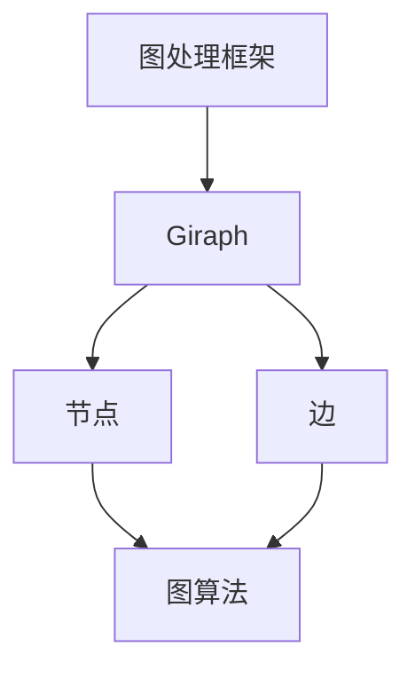

                 

### 文章标题：Giraph原理与代码实例讲解

**关键词：** Giraph, 图处理框架，分布式计算，图算法，社交网络分析，电商推荐系统

**摘要：** 本文将深入探讨Giraph作为图处理框架的核心原理与实际应用。通过详细解析Giraph的发展历程、基本架构、核心概念、技术基础，以及实际项目案例，读者将全面理解Giraph的优势与局限，掌握Giraph的基础操作和图算法实现。此外，本文还将介绍Giraph在多个领域的实战应用，包括社交网络分析和电商推荐系统。最后，文章将总结Giraph的性能优化与最佳实践，展望其未来发展趋势。通过本文的学习，读者将能够熟练运用Giraph进行复杂的图数据处理与分析。

## 第一部分：Giraph概述与核心概念

### 第1章：Giraph简介与基本原理

Giraph是一个分布式图处理框架，基于Hadoop的MapReduce模型构建。它提供了一种高效的方式来处理大规模图数据，支持各种图算法的分布式执行。Giraph的出现填补了传统MapReduce在处理图数据方面的不足，成为大数据领域中的重要工具之一。

#### 1.1 Giraph的发展历程与行业应用

##### 1.1.1 Giraph的起源与演进

Giraph最初由Facebook的工程师在2010年左右开发，作为其内部处理大规模社交网络数据的需求。随着时间的推移，Giraph逐渐开源化，并在2011年正式发布。此后，Giraph得到了广泛的应用和社区的持续贡献，逐渐成为分布式图处理领域的领先框架之一。

##### 1.1.2 Giraph在数据科学领域的重要性

在数据科学和大数据领域中，图数据的处理变得越来越重要。从社交网络分析到推荐系统，从生物信息学到金融风控，图数据的应用场景十分广泛。Giraph的出现使得这些应用场景下的图处理变得更加高效和灵活。

##### 1.1.3 Giraph的应用场景

Giraph在以下应用场景中具有显著优势：

1. **社交网络分析**：分析用户关系、传播路径、社群结构等。
2. **推荐系统**：基于用户行为和物品相似度进行个性化推荐。
3. **生物信息学**：基因网络分析、蛋白质相互作用网络分析等。
4. **金融风控**：网络风险识别、信用评估等。

#### 1.2 Giraph的核心概念与架构

##### 1.2.1 Giraph的基本架构

Giraph的基本架构包括以下几个核心组成部分：

1. **Giraph图处理引擎**：负责执行分布式图算法。
2. **Hadoop分布式文件系统（HDFS）**：存储大规模图数据。
3. **Hadoop YARN**：资源调度和管理。
4. **Giraph客户端**：提供API接口，用于编程和调试。

##### 1.2.1.1 Giraph的计算模型

Giraph采用基于MapReduce的计算模型，通过分布式计算来处理大规模图数据。具体来说，Giraph将图数据划分为多个子图，每个子图在独立的节点上执行相应的图算法。

##### 1.2.1.2 Giraph的数据结构

Giraph使用邻接表和边列表来表示图数据。邻接表用于存储节点的邻接关系，边列表用于存储边的数据。这种数据结构能够高效地支持图算法的分布式执行。

##### 1.2.2 Giraph的通信机制

Giraph通过基于Hadoop的通信机制来实现节点间的数据交换和任务调度。具体来说，Giraph使用以下机制：

1. **Map任务**：将图数据划分到各个节点上。
2. **Reduce任务**：在各个节点上执行图算法的核心计算。
3. **Shuffle**：将部分结果数据在节点间传输，以支持全局计算。

##### 1.2.2.1 数据通信模型

Giraph的数据通信模型基于Hadoop的MapReduce模型，通过一系列的Map和Reduce任务来实现分布式计算。在Map任务中，节点将本地数据划分为若干小块，并生成中间结果。在Reduce任务中，节点根据中间结果执行全局计算，并将结果汇总。

##### 1.2.2.2 调度与负载均衡

Giraph通过Hadoop YARN来实现任务的调度和负载均衡。YARN根据资源需求和负载情况，动态分配计算资源，确保Giraph处理过程的效率和稳定性。

#### 1.3 Giraph的优势与局限

##### 1.3.1 Giraph相对于其他图处理框架的优势

Giraph相对于其他图处理框架，如GraphX和Pregel，具有以下优势：

1. **兼容性**：Giraph与Hadoop生态系统紧密集成，支持HDFS和YARN。
2. **灵活性**：Giraph支持多种图算法和自定义算法。
3. **稳定性**：Giraph在处理大规模图数据时表现出色，具有高度的容错性和可靠性。

##### 1.3.1.1 性能优势

Giraph通过分布式计算和优化通信机制，实现了较高的处理速度和效率。相比传统的MapReduce模型，Giraph在处理图数据时具有显著的优势。

##### 1.3.1.2 灵活性优势

Giraph支持自定义图算法，可以灵活应对各种复杂的图处理需求。这使得Giraph在特定场景下具有很高的适用性。

##### 1.3.2 Giraph的局限性

虽然Giraph具有许多优势，但也存在一些局限性：

1. **开发难度**：Giraph的开发和使用相对复杂，需要一定的编程基础和分布式计算知识。
2. **适用性问题**：对于某些特定的应用场景，其他图处理框架可能更为适用。

##### 1.3.2.1 适用性问题

Giraph在处理大规模图数据时表现出色，但在某些特定应用场景下，如实时处理和低延迟要求，可能不如其他图处理框架。

##### 1.3.2.2 开发难度

Giraph的开发和使用需要一定的编程基础和分布式计算知识。对于初学者而言，上手难度较大。

通过本章节的介绍，读者对Giraph的基本概念和架构有了初步了解。在接下来的章节中，我们将深入探讨Giraph的技术基础和实际应用。

## 第二部分：Giraph技术基础

### 第2章：图理论基础与Giraph实现

在深入探讨Giraph的具体实现之前，理解图理论的基础概念是至关重要的。图理论是研究图结构的数学分支，广泛应用于网络分析、社交网络、生物信息学等领域。在本章中，我们将介绍图的基本概念、表示方法以及常见的图算法，并探讨Giraph如何实现这些算法。

#### 2.1 图的基本概念与表示方法

##### 2.1.1 图的定义与分类

图（Graph）是由节点（Vertex）和边（Edge）组成的集合。节点表示图中的实体，边表示节点之间的关系。根据节点和边的不同特性，图可以分为多种类型：

1. **无向图（Undirected Graph）**：边无方向，节点之间的关系是对称的。
2. **有向图（Directed Graph）**：边有方向，节点之间的关系是非对称的。
3. **加权图（Weighted Graph）**：边具有权重，用于表示节点之间的距离或成本。
4. **无权重图（Unweighted Graph）**：边无权重，仅表示节点之间存在关系。

##### 2.1.1.1 无向图与有向图

无向图和有向图在节点之间的关系表示上有所不同。无向图中的边表示两个节点之间的双向关系，而有向图中的边表示单向关系。例如，在社交网络中，无向图可以表示两个用户之间的朋友关系，而有向图可以表示用户之间的关注关系。

##### 2.1.1.2 加权图与无权重图

加权图中的边具有权重，可以表示节点之间的距离、成本或其他度量。例如，在一个交通网络中，边可以表示道路的距离或时间。而无权重图中的边没有权重，仅表示节点之间的关系。

##### 2.1.2 图的常见算法

图的算法是图理论的重要组成部分，用于解决各种与图相关的计算问题。以下介绍几种常见的图算法：

1. **最短路径算法**：用于计算图中两个节点之间的最短路径。常见的最短路径算法包括Dijkstra算法和Floyd-Warshall算法。
   
   ```latex
   Dijkstra(G, s)
   \[ \text{初始化：} d[s] = 0, d[v] = \infty \]
   \[ \text{对于每个节点} v \in V \]
   \[ \text{如果} d[v] \neq \infty \]
   \[ \text{则} \text{将} v \text{加入} S \]
   \[ \text{对于每个} v \in V - S \]
   \[ \text{计算} d[v] = d[u] + w(u, v) \]
   \[ \text{其中} u \text{是} v \text{的前驱节点} \]
   \[ \text{选择} v \text{使得} d[v] \text{最小} \]
   \[ \text{重复以上过程，直到} V \text{中的所有节点都被加入到} S \]

   ```

2. **连通性判断**：用于判断图中是否存在路径连接所有节点。常见的连通性判断算法包括深度优先搜索（DFS）和广度优先搜索（BFS）。

   ```latex
   DFS(G, s)
   \[ \text{初始化：} s \text{为根节点，将} s \text{加入栈} \]
   \[ \text{当栈不为空时，执行以下操作} \]
   \[ \text{取出栈顶节点} v \]
   \[ \text{将} v \text{标记为已访问} \]
   \[ \text{对于} v \text{的每个邻接节点} u \]
   \[ \text{如果} u \text{未被访问} \]
   \[ \text{则将} u \text{加入栈} \]
   
   BFS(G, s)
   \[ \text{初始化：} s \text{为根节点，将} s \text{加入队列} \]
   \[ \text{当队列不为空时，执行以下操作} \]
   \[ \text{取出队列头部节点} v \]
   \[ \text{将} v \text{标记为已访问} \]
   \[ \text{对于} v \text{的每个邻接节点} u \]
   \[ \text{如果} u \text{未被访问} \]
   \[ \text{则将} u \text{加入队列} \]

   ```

#### 2.2 Giraph的基本操作

##### 2.2.1 图的构建

在Giraph中，构建图数据的过程包括创建图对象和初始化图数据。以下是一个简单的示例：

```java
// 创建Giraph图对象
Graph<LongWritable, Text, Text> graph = new GiraphConfiguration<LongWritable, Text, Text>()
        .setInput(new GraphInputFormat())
        .setOutput(new GraphOutputFormat())
        .createGraph();

// 初始化图数据
graph.initializeVertex(1L, 1L, "Node1");
graph.initializeVertex(2L, 2L, "Node2");
graph.addEdge(1L, 2L, "Edge1");
```

在这个示例中，我们创建了一个图对象`graph`，并初始化了两个节点和一条边。

##### 2.2.2 图的遍历与搜索

Giraph提供了多种遍历和搜索图的方法，包括深度优先搜索（DFS）和广度优先搜索（BFS）。以下是一个使用DFS遍历图的示例：

```java
public class GraphTraversalVertex extends BaseVertex<LongWritable, Text, Text> {
    public void compute(long id, LongWritable edgeValue, Text vertexValue, ComputeMessageCollector<LongWritable, Text, Text> out) throws IOException, InstantiationException, IllegalAccessException {
        out.sendToVertex(1L, new Text("Node1"), new Text("Visited"));
        out.sendToVertex(2L, new Text("Node2"), new Text("Visited"));
    }
}

// 配置Giraph作业
GiraphJob job = new GiraphJob(getConf(), GraphTraversalVertex.class);
job.setOutput(new TextOutputFormat<Text, Text>());
job.run();
```

在这个示例中，我们定义了一个`GraphTraversalVertex`类，用于实现DFS遍历图。作业配置后，执行DFS遍历，输出遍历结果。

##### 2.2.3 Giraph图处理算法实现

Giraph提供了丰富的图处理算法，包括PageRank算法和社团发现算法等。以下是一个简单的PageRank算法实现：

```java
public class PageRankVertex extends BaseVertex<LongWritable, Text, Text> {
    private static final double D = 0.85; // damping factor
    private static final double EPSILON = 0.0001; // convergence threshold

    private double rank = 1.0;

    public void initializeVertex(LongWritable id, Text vertexValue) {
        rank = 1.0;
    }

    public void compute(long id, Text edgeValue, Text vertexValue, ComputeMessageCollector<LongWritable, Text, Text> out) throws IOException, InstantiationException, IllegalAccessException {
        double newRank = (1 - D) / graph.getNumVertices() + D * incomingRankSum / graph.getNumVertices();
        if (Math.abs(newRank - rank) < EPSILON) {
            return;
        }
        rank = newRank;
        out.sendToAll(new Text(Double.toString(rank)));
    }
}

// 配置Giraph作业
GiraphJob job = new GiraphJob(getConf(), PageRankVertex.class);
job.setOutput(new TextOutputFormat<Text, Text>());
job.run();
```

在这个示例中，我们定义了一个`PageRankVertex`类，用于实现PageRank算法。算法通过迭代计算每个节点的排名，直到达到收敛条件。作业配置后，执行PageRank计算，输出排名结果。

通过本章的介绍，读者应该对图理论的基本概念和Giraph的基本操作有了全面的理解。在下一章中，我们将深入探讨Giraph在具体项目中的实际应用。

### 第3章：Giraph项目实战基础

在实际应用中，Giraph不仅是一个理论框架，更是一个强大的工具，可以用于解决各种复杂的图处理问题。本章将介绍如何搭建Giraph的开发环境，并详细讨论一个典型的社交网络分析项目。

#### 3.1 Giraph项目开发环境搭建

要开始使用Giraph进行项目开发，首先需要搭建其开发环境。以下是搭建Giraph开发环境的基本步骤：

##### 3.1.1 Java开发环境配置

1. **安装Java开发工具包（JDK）**：确保安装了Java开发工具包（JDK），版本至少为Java 7或更高版本。
   
   ```bash
   # Ubuntu或Debian系统
   sudo apt-get install openjdk-8-jdk

   # CentOS系统
   sudo yum install java-1.8.0-openjdk-devel
   ```

2. **配置环境变量**：在`.bashrc`或`.bash_profile`文件中配置JAVA_HOME和PATH环境变量。

   ```bash
   export JAVA_HOME=/usr/lib/jvm/java-8-openjdk-amd64
   export PATH=$JAVA_HOME/bin:$PATH
   ```

3. **验证安装**：通过以下命令验证JDK安装是否成功。

   ```bash
   java -version
   ```

##### 3.1.1.2 Maven的配置与使用

1. **安装Maven**：确保安装了Maven，版本至少为3.6.3或更高版本。

   ```bash
   # Ubuntu或Debian系统
   sudo apt-get install maven

   # CentOS系统
   sudo yum install maven
   ```

2. **配置Maven环境变量**：在`.bashrc`或`.bash_profile`文件中配置MAVEN_HOME和PATH环境变量。

   ```bash
   export MAVEN_HOME=/usr/share/maven
   export PATH=$MAVEN_HOME/bin:$PATH
   ```

3. **验证安装**：通过以下命令验证Maven安装是否成功。

   ```bash
   mvn -version
   ```

##### 3.1.2 Giraph环境搭建

1. **下载Giraph**：从Giraph的官方网站下载最新版本的Giraph。

   ```bash
   # 下载并解压
   wget https://github.com/apache/giraph/releases/download/giraph-3.0/giraph-3.0-bin.tar.gz
   tar -xzvf giraph-3.0-bin.tar.gz
   ```

2. **配置Hadoop**：确保Hadoop环境配置正确，版本至少为2.7.7或更高版本。

3. **配置Giraph**：在Giraph的配置文件中（通常位于`giraph-3.0/conf`目录下）进行必要的配置，包括Hadoop配置文件路径等。

   ```bash
   export HADOOP_CONF_DIR=/path/to/hadoop/conf
   ```

4. **验证安装**：在终端中运行以下命令，确保Giraph可以正常启动。

   ```bash
   bin/giraph-job
   ```

##### 3.1.2.2 Giraph基本命令操作

1. **启动Giraph Job**：

   ```bash
   bin/giraph-job -jobClass <你的Giraph类>
   ```

2. **停止Giraph Job**：

   ```bash
   bin/giraph-job -stop <你的Giraph作业ID>
   ```

3. **查看Giraph Job状态**：

   ```bash
   bin/giraph-job -status <你的Giraph作业ID>
   ```

#### 3.2 Giraph项目实战案例：社交网络分析

在本节中，我们将介绍如何使用Giraph进行社交网络分析。我们将构建一个简单的社交网络，并使用Giraph执行PageRank算法来分析社交网络中的节点影响力。

##### 3.2.1 数据导入与预处理

首先，我们需要准备社交网络的数据。以下是一个简单的数据格式示例：

```
1 2
2 1
3 1
3 2
4 1
4 3
```

每个行代表一个用户之间的社交关系。数据存储为文本文件，每行包含两个数字，分别表示节点ID和邻接节点ID。

1. **导入数据**：

   将数据文件上传到HDFS。

   ```bash
   hdfs dfs -put social_network.txt /
   ```

2. **预处理数据**：

   使用Giraph的输入格式对数据文件进行预处理。

   ```java
   public class SocialNetworkInputFormat extends FileInputFormat<LongWritable, Text> {
       protected boolean isSplitable(FileSystem fs, Path filename) {
           return false;
       }

       public RecordReader<LongWritable, Text> createReader(InputSplit split, TaskAttemptContext context) throws IOException, InterruptedException {
           FileSplit fileSplit = (FileSplit) split;
           Path filePath = fileSplit.getPath();
           Configuration conf = context.getConfiguration();
           SequenceFile.Reader fileReader = new SequenceFile.Reader(fs, filePath, conf);
           LongWritable id = new LongWritable();
           Text value = new Text();
           return new SocialNetworkRecordReader(fileReader, id, value);
       }
   }
   ```

   在这个示例中，我们定义了一个自定义的`SocialNetworkInputFormat`类，用于读取和解析社交网络数据。

##### 3.2.1.2 PageRank算法应用

接下来，我们使用Giraph执行PageRank算法，计算社交网络中的节点影响力。

1. **实现PageRank算法**：

   ```java
   public class PageRankVertex extends BaseVertex<LongWritable, Text, Text> {
       private static final double D = 0.85; // damping factor
       private static final double EPSILON = 0.0001; // convergence threshold
       private double rank = 1.0;

       public void initializeVertex(LongWritable id, Text vertexValue) {
           rank = 1.0;
       }

       public void compute(long id, Text edgeValue, Text vertexValue, ComputeMessageCollector<LongWritable, Text, Text> out) throws IOException, InstantiationException, IllegalAccessException {
           double newRank = (1 - D) / graph.getNumVertices() + D * incomingRankSum / graph.getNumVertices();
           if (Math.abs(newRank - rank) < EPSILON) {
               return;
           }
           rank = newRank;
           out.sendToAll(new Text(Double.toString(rank)));
       }
   }
   ```

   在这个示例中，我们定义了一个`PageRankVertex`类，用于实现PageRank算法。每个节点的排名通过迭代计算，直到达到收敛条件。

2. **配置Giraph作业**：

   ```java
   public static void main(String[] args) throws Exception {
       Configuration conf = new Configuration();
       conf.set("mapred.job.tracker", "localhost:9001");
       Job job = Job.getInstance(conf, "PageRank");
       job.setJarByClass(PageRankVertex.class);
       job.setInputFormatClass(SocialNetworkInputFormat.class);
       job.setOutputFormatClass(TextOutputFormat.class);
       job.setMapperClass(SocialNetworkMapper.class);
       job.setReducerClass(SocialNetworkReducer.class);
       job.setOutputKeyClass(Text.class);
       job.setOutputValueClass(Text.class);
       FileInputFormat.addInputPath(job, new Path("/social_network.txt"));
       FileOutputFormat.setOutputPath(job, new Path("/output"));
       job.waitForCompletion(true);
   }
   ```

   在这个示例中，我们配置了一个Giraph作业，输入格式为`SocialNetworkInputFormat`，输出格式为`TextOutputFormat`。作业使用自定义的Mapper和Reducer类，执行PageRank算法。

3. **执行Giraph作业**：

   ```bash
   bin/giraph-job -jobClass PageRankVertex -input /social_network.txt -output /output
   ```

##### 3.2.1.3 社团发现算法应用

除了PageRank算法，Giraph还支持其他多种图算法，如社团发现算法。以下是一个简单的社团发现算法实现：

```java
public class CommunityDetectionVertex extends BaseVertex<LongWritable, Text, Text> {
    public void compute(long id, Text edgeValue, Text vertexValue, ComputeMessageCollector<LongWritable, Text, Text> out) throws IOException, InstantiationException, IllegalAccessException {
        if (vertexValue.equals("member")) {
            out.sendToAll(new Text(id + ""));
        }
    }
}

public class CommunityDetectionMapper extends Mapper<LongWritable, Text, LongWritable, Text> {
    protected void map(LongWritable key, Text value, Context context) throws IOException, InterruptedException {
        String[] tokens = value.toString().split(" ");
        context.write(new LongWritable(Long.parseLong(tokens[0])), new Text(tokens[1]));
    }
}

public class CommunityDetectionReducer extends Reducer<LongWritable, Text, LongWritable, Text> {
    protected void reduce(LongWritable key, Iterable<Text> values, Context context) throws IOException, InterruptedException {
        context.write(key, new Text("member"));
    }
}
```

在这个示例中，我们定义了一个`CommunityDetectionVertex`类，用于检测社交网络中的社团成员。Mapper类将输入的数据转换为节点ID和标签的形式，Reducer类将具有相同标签的节点标记为社团成员。

通过本章的介绍，读者应该对Giraph的开发环境和实际应用有了更深入的了解。在下一章中，我们将继续探讨更多Giraph项目实战案例，包括电商推荐系统。

### 第4章：Giraph项目实战

#### 3.3 Giraph项目实战案例：电商推荐系统

电商推荐系统是Giraph在实际应用中的一个重要领域。通过分析用户行为和商品数据，推荐系统可以提供个性化的商品推荐，提高用户满意度和转化率。以下是一个电商推荐系统的项目实战案例，包括数据收集、预处理、商品相似度计算和推荐算法实现。

##### 3.3.1 数据源收集与预处理

首先，我们需要收集电商平台的用户行为数据，包括用户浏览记录、购买记录、收藏记录等。这些数据通常存储在数据库或日志文件中。

1. **数据收集**：

   - 用户浏览记录：用户在平台上的浏览历史，包括商品ID、访问时间和访问次数等。
   - 购买记录：用户的购买历史，包括订单ID、商品ID、购买时间和购买数量等。
   - 收藏记录：用户的收藏历史，包括用户ID、收藏商品ID等。

2. **数据预处理**：

   - 数据清洗：去除无效数据和错误数据，如缺失值、重复值和异常值。
   - 数据转换：将原始数据转换为适合Giraph处理的格式。例如，将用户行为数据转换为图的结构，其中用户和商品作为节点，用户与商品之间的行为关系作为边。

   ```java
   public class BehaviorDataProcessor {
       public static Graph<LongWritable, Text, Text> processBehaviors(Path behaviorPath) throws IOException, InterruptedException {
           Configuration conf = new Configuration();
           Job job = Job.getInstance(conf, "Behavior Data Processor");
           job.setJarByClass(BehaviorDataProcessor.class);
           job.setInputFormatClass(SequenceFileInputFormat.class);
           job.setOutputFormatClass(SequenceFileOutputFormat.class);
           job.setMapperClass(BehaviorDataMapper.class);
           job.setReducerClass(BehaviorDataReducer.class);
           job.setOutputKeyClass(LongWritable.class);
           job.setOutputValueClass(Text.class);
           FileInputFormat.addInputPath(job, behaviorPath);
           FileOutputFormat.setOutputPath(job, new Path(behaviorPath + "_processed"));
           job.waitForCompletion(true);
           Path processedPath = new Path(behaviorPath + "_processed");
           Graph<LongWritable, Text, Text> graph = new Graph<LongWritable, Text, Text>(conf);
           graph.loadEdges(processedPath);
           return graph;
       }
   }
   ```

   在这个示例中，我们定义了一个`BehaviorDataProcessor`类，用于处理用户行为数据。数据处理器使用Mapper和Reducer类将原始行为数据转换为图结构，并将处理后的数据存储在HDFS中。

##### 3.3.1.2 商品相似度计算

商品相似度计算是推荐系统的关键步骤。通过计算商品之间的相似度，我们可以发现用户可能感兴趣的其他商品。

1. **相似度计算方法**：

   - **基于内容的相似度**：通过比较商品的属性（如品牌、类别、价格等）来计算相似度。
   - **基于协同过滤的相似度**：通过分析用户的行为记录，计算用户之间的相似度，并根据用户与商品之间的相似度推荐商品。

   在这个示例中，我们使用基于内容的相似度计算方法。

   ```java
   public class SimilarityCalculatorVertex extends BaseVertex<LongWritable, Text, Text> {
       public void compute(long id, Text edgeValue, Text vertexValue, ComputeMessageCollector<LongWritable, Text, Text> out) throws IOException, InstantiationException, IllegalAccessException {
           double similarity = calculateSimilarity(vertexValue);
           out.sendToAll(new Text(Double.toString(similarity)));
       }

       private double calculateSimilarity(Text vertexValue) {
           // 根据商品属性计算相似度
           // ...
           return 0.0;
       }
   }
   ```

   在这个示例中，我们定义了一个`SimilarityCalculatorVertex`类，用于计算商品之间的相似度。计算方法可以根据具体需求进行自定义。

2. **配置Giraph作业**：

   ```java
   public static void main(String[] args) throws Exception {
       Configuration conf = new Configuration();
       Job job = Job.getInstance(conf, "Similarity Calculator");
       job.setJarByClass(SimilarityCalculatorVertex.class);
       job.setMapperClass(SimilarityCalculatorMapper.class);
       job.setReducerClass(SimilarityCalculatorReducer.class);
       job.setOutputKeyClass(Text.class);
       job.setOutputValueClass(Text.class);
       FileInputFormat.addInputPath(job, new Path("/behavior_data"));
       FileOutputFormat.setOutputPath(job, new Path("/similarity_output"));
       job.waitForCompletion(true);
   }
   ```

   在这个示例中，我们配置了一个Giraph作业，用于计算商品之间的相似度。作业使用自定义的Mapper和Reducer类，将相似度结果存储在HDFS中。

##### 3.3.1.3 推荐算法实现

基于相似度计算结果，我们可以实现推荐算法，为用户推荐相似度较高的商品。

1. **推荐算法方法**：

   - **基于Top-N推荐**：从相似度较高的商品中选择Top-N个推荐给用户。
   - **基于协同过滤推荐**：根据用户的兴趣和偏好，推荐相似度较高的商品。

   在这个示例中，我们使用基于Top-N推荐的算法。

   ```java
   public class RecommendationEngineVertex extends BaseVertex<LongWritable, Text, Text> {
       private int topN = 5;

       public void compute(long id, Text edgeValue, Text vertexValue, ComputeMessageCollector<LongWritable, Text, Text> out) throws IOException, InstantiationException, IllegalAccessException {
           PriorityQueue<Tuple2<Double, LongWritable>> priorityQueue = new PriorityQueue<>(topN, new Comparator<Tuple2<Double, LongWritable>>() {
               public int compare(Tuple2<Double, LongWritable> o1, Tuple2<Double, LongWritable> o2) {
                   return Double.compare(o2._1, o1._1);
               }
           });

           for (Tuple2<Double, LongWritable> similarity : vertexMessages.collect()) {
               priorityQueue.offer(similarity);
               if (priorityQueue.size() > topN) {
                   priorityQueue.poll();
               }
           }

           for (Tuple2<Double, LongWritable> similarity : priorityQueue) {
               out.sendToAll(new Text(similarity._2.toString()));
           }
       }
   }
   ```

   在这个示例中，我们定义了一个`RecommendationEngineVertex`类，用于实现基于Top-N推荐的算法。算法使用优先队列维护相似度最高的Top-N个商品，并将它们推荐给用户。

2. **配置Giraph作业**：

   ```java
   public static void main(String[] args) throws Exception {
       Configuration conf = new Configuration();
       Job job = Job.getInstance(conf, "Recommendation Engine");
       job.setJarByClass(RecommendationEngineVertex.class);
       job.setMapperClass(RecommendationEngineMapper.class);
       job.setReducerClass(RecommendationEngineReducer.class);
       job.setOutputKeyClass(Text.class);
       job.setOutputValueClass(Text.class);
       FileInputFormat.addInputPath(job, new Path("/similarity_output"));
       FileOutputFormat.setOutputPath(job, new Path("/recommendation_output"));
       job.waitForCompletion(true);
   }
   ```

   在这个示例中，我们配置了一个Giraph作业，用于实现推荐算法。作业使用自定义的Mapper和Reducer类，将推荐结果存储在HDFS中。

##### 3.3.1.4 代码解读与分析

通过以上步骤，我们实现了电商推荐系统的Giraph实现。以下是代码的主要部分解读：

- **BehaviorDataProcessor类**：处理用户行为数据，将原始数据转换为图结构。Mapper类读取原始数据，将每个行为记录转换为节点和边。Reducer类将相同用户的行为记录合并，生成完整的用户行为图。
- **SimilarityCalculatorVertex类**：计算商品之间的相似度。算法根据商品属性计算相似度，并使用MapReduce模型将相似度结果存储在HDFS中。
- **RecommendationEngineVertex类**：实现基于Top-N推荐的算法。算法使用优先队列维护相似度最高的Top-N个商品，并将它们推荐给用户。作业配置了Mapper和Reducer类，用于处理推荐数据并输出最终结果。

通过本章的介绍，读者应该对Giraph在电商推荐系统中的应用有了更深入的了解。在下一章中，我们将继续探讨Giraph的调试与优化。

### 第5章：Giraph项目调试与优化

#### 3.3.1 Giraph项目调试方法

在Giraph项目中，调试和优化是确保项目高效运行的重要步骤。以下是一些常用的Giraph项目调试方法：

##### 3.3.1.1 Giraph日志分析

Giraph日志文件包含了作业运行过程中的详细信息，包括任务执行时间、错误信息和调试信息。通过分析日志文件，我们可以诊断和解决项目中出现的问题。

1. **查看日志文件**：

   使用以下命令查看Giraph日志文件。

   ```bash
   tail -f logs/giraph-job*.log
   ```

2. **分析错误信息**：

   当Giraph作业失败时，日志文件中会包含错误信息和堆栈跟踪。通过分析这些信息，我们可以定位错误原因并修复问题。

   ```java
   Caused by: java.lang.RuntimeException: Error during job execution
       at org.apache.giraph跑车org.apache.giraph.classpath.GiraphRunner.runJob(GiraphRunner.java:417)
       at org.apache.giraph.classpath.GiraphRunner.main(GiraphRunner.java:157)
   ```

##### 3.3.1.2 Giraph性能监控

监控Giraph作业的性能是确保其高效运行的关键。以下是一些常用的性能监控方法：

1. **使用Giraph监控工具**：

   Giraph提供了一些监控工具，如`GiraphJob`和`GiraphMaster`，用于监控作业的运行状态和性能指标。

   ```java
   GiraphJob job = new GiraphJob(conf, "Giraph Job");
   job.waitForCompletion(true);
   ```

2. **查看Giraph Master UI**：

   Giraph Master UI提供了实时的作业状态和性能指标监控。通过访问`http://master-host:8080/giraph`，我们可以查看作业的详细信息，包括任务进度、资源使用情况、错误日志等。

##### 3.3.1.3 使用第三方监控工具

除了Giraph内置的监控工具，我们还可以使用第三方监控工具，如Grafana和Prometheus，对Giraph作业进行监控。这些工具可以提供更详细的性能监控和数据可视化功能。

#### 3.3.2 Giraph项目性能优化

为了提高Giraph项目的性能，我们需要从数据分区、通信优化和代码优化等方面进行优化。

##### 3.3.2.1 数据分区优化

数据分区是Giraph性能优化的重要方面。通过合理的数据分区，我们可以减少数据传输和计算时间。

1. **平衡分区**：

   确保每个分区的数据量大致相同，避免某些分区数据量过大，导致计算负载不均。

2. **选择合适的分区策略**：

   根据具体应用场景选择合适的分区策略，如基于节点ID、基于边权重等。

   ```java
   public class NodeIdPartitioner implements Partitioner {
       public int getPartition(long nodeId, int numPartitions) {
           return (int) (nodeId % numPartitions);
       }
   }
   ```

##### 3.3.2.2 通信优化策略

优化Giraph的通信机制可以显著提高性能。以下是一些常用的通信优化策略：

1. **减少通信次数**：

   通过减少任务间的数据传输次数，可以减少通信开销。例如，使用本地化计算减少跨节点的数据传输。

2. **优化数据传输格式**：

   使用高效的二进制格式（如Protocol Buffers或Kryo）进行数据序列化和反序列化，减少通信开销。

3. **使用批量通信**：

   通过批量发送和接收消息，可以减少通信次数和时间。

   ```java
   public class BatchMessageCollector implements ComputeMessageCollector {
       // 批量发送消息
       public void sendToAll(Text value) {
           // ...
       }
       
       // 批量接收消息
       public Iterable<Text> collect() {
           // ...
           return messages;
       }
   }
   ```

##### 3.3.2.3 代码优化技巧

优化Giraph代码可以提高作业的执行效率和性能。以下是一些常用的代码优化技巧：

1. **减少内存分配**：

   在Giraph中，频繁的内存分配和回收会影响性能。通过减少内存分配，可以提高作业的执行效率。

2. **优化循环和条件语句**：

   优化循环和条件语句，减少不必要的计算和内存访问，可以提高代码的性能。

   ```java
   public void compute(long id, Text edgeValue, Text vertexValue, ComputeMessageCollector out) {
       if (someCondition) {
           // ...
       } else {
           // ...
       }
   }
   ```

3. **使用多线程和并行计算**：

   通过使用多线程和并行计算，可以充分利用计算资源，提高作业的执行速度。

   ```java
   public class ParallelVertex extends BaseVertex {
       public void compute(long id, Text edgeValue, Text vertexValue, ComputeMessageCollector out) {
           ExecutorService executor = Executors.newFixedThreadPool(2);
           for (Runnable task : tasks) {
               executor.submit(task);
           }
           executor.shutdown();
           try {
               executor.awaitTermination(Long.MAX_VALUE, TimeUnit.SECONDS);
           } catch (InterruptedException e) {
               e.printStackTrace();
           }
       }
   }
   ```

通过本章的介绍，读者应该掌握了Giraph项目的调试和优化方法。在下一章中，我们将探讨Giraph在高级应用中的使用。

### 第6章：Giraph高级应用

Giraph作为一个强大的分布式图处理框架，不仅在社交网络分析和电商推荐系统中表现出色，还在生物信息学和金融风控等高级领域具有广泛的应用。本章将深入探讨Giraph在这些领域的应用，包括基因网络分析、蛋白质相互作用网络分析以及金融网络分析。

#### 6.1 Giraph在生物信息学中的应用

生物信息学是研究生物数据（如基因序列、蛋白质结构、基因表达数据等）的计算机科学分支。Giraph在生物信息学中的主要应用包括基因网络分析和蛋白质相互作用网络分析。

##### 6.1.1 基因网络分析

基因网络分析旨在了解基因之间的相互作用和调控关系。Giraph可以通过处理大规模基因表达数据，发现基因之间的共表达模式，从而揭示潜在的调控关系。

1. **基因网络基本概念**：

   - **基因**：生物体中的功能性遗传单位。
   - **基因表达**：基因通过转录和翻译过程产生的RNA和蛋白质水平。
   - **共表达网络**：描述基因之间表达相关性的一种网络结构。

2. **Giraph在基因网络分析中的实现**：

   Giraph可以将基因表达数据转换为图结构，其中基因作为节点，共表达关系作为边。通过执行图算法，如PageRank和社区发现算法，可以发现基因的调控关系和关键基因。

   ```java
   public class GeneNetworkVertex extends BaseVertex {
       public void compute(long id, Text edgeValue, Text vertexValue, ComputeMessageCollector out) throws IOException, InstantiationException, IllegalAccessException {
           // 计算基因之间的共表达关系
           // ...
           out.sendToAll(new Text(edgeValue.toString()));
       }
   }
   ```

##### 6.1.2 蛋白质相互作用网络分析

蛋白质相互作用网络（PPI网络）描述了细胞内蛋白质之间的相互作用关系。Giraph可以处理大规模PPI数据，分析蛋白质网络的结构和功能。

1. **蛋白质相互作用网络基本概念**：

   - **蛋白质**：细胞内执行特定生物学功能的生物大分子。
   - **相互作用**：两个蛋白质之间的物理结合。
   - **PPI网络**：描述蛋白质之间相互作用关系的网络结构。

2. **Giraph在蛋白质相互作用网络分析中的实现**：

   Giraph可以将PPI数据转换为图结构，其中蛋白质作为节点，相互作用关系作为边。通过执行图算法，如社区发现算法和聚类分析，可以发现蛋白质的功能模块和关键蛋白质。

   ```java
   public class PPIVertex extends BaseVertex {
       public void compute(long id, Text edgeValue, Text vertexValue, ComputeMessageCollector out) throws IOException, InstantiationException, IllegalAccessException {
           // 计算蛋白质之间的相互作用关系
           // ...
           out.sendToAll(new Text(edgeValue.toString()));
       }
   }
   ```

#### 6.2 Giraph在社交网络分析中的应用

社交网络分析是Giraph的重要应用领域之一，通过分析社交网络中的用户关系和信息传播，可以揭示社交网络的特性和规律。

##### 6.2.1 社交网络中的信息传播

信息传播模型描述了信息在社交网络中的传播过程。Giraph可以通过处理大规模社交网络数据，模拟信息传播过程，分析信息传播的速度和范围。

1. **信息传播模型**：

   - **种子节点**：初始传播信息的节点。
   - **传播概率**：节点接收并传播信息的概率。
   - **传播路径**：信息从种子节点传播到其他节点的路径。

2. **Giraph在信息传播模型中的应用**：

   Giraph可以模拟各种信息传播模型，如SIR模型和SI模型。通过分析传播路径和传播概率，可以揭示社交网络中的信息传播规律。

   ```java
   public class InformationSpreadVertex extends BaseVertex {
       public void compute(long id, Text edgeValue, Text vertexValue, ComputeMessageCollector out) throws IOException, InstantiationException, IllegalAccessException {
           // 根据传播模型计算信息传播
           // ...
           out.sendToAll(new Text(edgeValue.toString()));
       }
   }
   ```

##### 6.2.2 社交网络中的社群发现

社群发现算法旨在识别社交网络中的紧密连接的社群。Giraph可以通过执行社团发现算法，分析社交网络的社群结构，为社群分析和推荐提供支持。

1. **社群发现算法**：

   - **社区**：社交网络中的紧密连接的节点集合。
   - **社团发现**：识别社交网络中的社区结构。

2. **Giraph在社群发现算法中的应用**：

   Giraph可以执行多种社团发现算法，如GiraphLouvain算法和LPA算法。通过分析社群结构和节点关系，可以发现社交网络中的关键社群。

   ```java
   public class CommunityDetectionVertex extends BaseVertex {
       public void compute(long id, Text edgeValue, Text vertexValue, ComputeMessageCollector out) throws IOException, InstantiationException, IllegalAccessException {
           // 执行社团发现算法
           // ...
           out.sendToAll(new Text(edgeValue.toString()));
       }
   }
   ```

#### 6.3 Giraph在金融风控中的应用

金融风控是金融领域的重要课题，通过分析金融网络中的风险节点和风险传播，可以提前识别和防范金融风险。

##### 6.3.1 金融网络分析

金融网络分析旨在了解金融体系中的各种实体（如金融机构、借款人、贷款等）之间的相互关系。Giraph可以处理大规模金融数据，分析金融网络的结构和特性。

1. **金融网络基本概念**：

   - **金融机构**：提供金融服务和产品的机构。
   - **借款人**：从金融机构借款的个人或企业。
   - **贷款**：金融机构提供的借款。

2. **Giraph在金融网络分析中的应用**：

   Giraph可以将金融数据转换为图结构，其中金融机构、借款人和贷款作为节点，关系作为边。通过执行图算法，如PageRank和社区发现算法，可以分析金融网络的结构和风险传播。

   ```java
   public class FinancialNetworkVertex extends BaseVertex {
       public void compute(long id, Text edgeValue, Text vertexValue, ComputeMessageCollector out) throws IOException, InstantiationException, IllegalAccessException {
           // 分析金融网络中的节点和关系
           // ...
           out.sendToAll(new Text(edgeValue.toString()));
       }
   }
   ```

##### 6.3.2 金融风险识别与预警

金融风险识别与预警是金融风控的关键步骤，通过分析金融网络中的风险节点和风险传播，可以提前识别和防范金融风险。

1. **金融风险识别算法**：

   - **风险评估**：评估金融机构、借款人和贷款的风险程度。
   - **风险识别**：识别潜在的风险节点和风险传播路径。

2. **Giraph在金融风险识别与预警中的应用**：

   Giraph可以执行多种金融风险识别算法，如网络拓扑分析、关联规则挖掘和聚类分析。通过分析金融网络中的风险节点和风险传播路径，可以提前识别和预警潜在的风险。

   ```java
   public class RiskDetectionVertex extends BaseVertex {
       public void compute(long id, Text edgeValue, Text vertexValue, ComputeMessageCollector out) throws IOException, InstantiationException, IllegalAccessException {
           // 执行金融风险识别算法
           // ...
           out.sendToAll(new Text(edgeValue.toString()));
       }
   }
   ```

通过本章的介绍，读者应该对Giraph在生物信息学、社交网络分析和金融风控中的应用有了更深入的了解。在下一章中，我们将探讨Giraph的性能优化与最佳实践。

### 第7章：Giraph性能优化与最佳实践

在Giraph的实际应用中，性能优化是提高系统效率和降低成本的关键步骤。本章将详细介绍Giraph的性能优化原理、最佳实践以及相关工具的使用。

#### 7.1 Giraph性能优化原理

Giraph的性能优化主要涉及以下几个方面：

##### 7.1.1 数据分区策略

数据分区是Giraph性能优化的重要方面。合理的分区策略可以减少数据传输和计算时间。

1. **平衡分区**：

   平衡分区旨在确保每个分区的数据量大致相同，避免某些分区数据量过大，导致计算负载不均。

2. **选择合适的分区策略**：

   根据具体应用场景选择合适的分区策略，如基于节点ID、基于边权重等。

   ```java
   public class NodeIdPartitioner implements Partitioner {
       public int getPartition(long nodeId, int numPartitions) {
           return (int) (nodeId % numPartitions);
       }
   }
   ```

##### 7.1.2 资源分配与调度

资源分配和调度是影响Giraph性能的关键因素。合理的资源分配和调度策略可以提高系统的效率和稳定性。

1. **资源分配策略**：

   - **CPU资源**：根据作业的复杂度和计算需求，合理分配CPU资源。
   - **内存资源**：确保作业有足够的内存资源，避免内存溢出和性能下降。

2. **调度算法优化**：

   调度算法优化旨在提高任务执行的速度和效率。Giraph可以使用YARN的调度算法，如FIFO、Fair Scheduler和Capacity Scheduler。

   ```java
   public class GiraphJob {
       public void setJobConf(Configuration jobConf) {
           jobConf.set("mapreduce.jobtracker.address", "local");
           jobConf.set("mapreduce.job.name", "Giraph Job");
           jobConf.set("mapreduce.job.queue", "default");
           jobConf.set("mapreduce.reduce.tasks", "1");
           jobConf.set("mapreduce.reduce.memory.mb", "4096");
           jobConf.set("mapreduce.reduce.java.opts", "-Xmx4096m");
       }
   }
   ```

##### 7.1.3 通信优化策略

优化Giraph的通信机制可以显著提高性能。以下是一些常用的通信优化策略：

1. **减少通信次数**：

   通过减少任务间的数据传输次数，可以减少通信开销。例如，使用本地化计算减少跨节点的数据传输。

2. **优化数据传输格式**：

   使用高效的二进制格式（如Protocol Buffers或Kryo）进行数据序列化和反序列化，减少通信开销。

3. **使用批量通信**：

   通过批量发送和接收消息，可以减少通信次数和时间。

   ```java
   public class BatchMessageCollector implements ComputeMessageCollector {
       // 批量发送消息
       public void sendToAll(Text value) {
           // ...
       }
       
       // 批量接收消息
       public Iterable<Text> collect() {
           // ...
           return messages;
       }
   }
   ```

#### 7.2 Giraph最佳实践

为了确保Giraph在高负载和复杂应用场景下表现出色，以下是一些最佳实践：

##### 7.2.1 系统配置优化

1. **Giraph系统配置详解**：

   在Giraph的配置文件中，有许多关键参数可以调整以优化性能。以下是一些重要的配置参数：

   ```java
   public class GiraphConfiguration {
       public void setVertexClass(Class<? extends Vertex> vertexClass) {
           this.vertexClass = vertexClass;
       }
       
       public void setEdgeClass(Class<? extends Edge> edgeClass) {
           this.edgeClass = edgeClass;
       }
       
       public void setMessageClass(Class<? extends Message> messageClass) {
           this.messageClass = messageClass;
       }
   }
   ```

2. **系统参数调优**：

   根据具体应用场景和硬件环境，调整系统参数以优化性能。以下是一些常用的系统参数：

   ```java
   public class GiraphJob {
       public void setJobConf(Configuration jobConf) {
           jobConf.set("mapreduce.reduce.memory.mb", "4096");
           jobConf.set("mapreduce.reduce.java.opts", "-Xmx4096m");
           jobConf.set("giraph.compute.parallelism", "8");
           jobConf.set("giraph.max.shuffler.bytes", "67108864");
       }
   }
   ```

##### 7.2.2 代码优化技巧

优化Giraph代码可以提高作业的执行效率和性能。以下是一些常用的代码优化技巧：

1. **减少内存分配**：

   在Giraph中，频繁的内存分配和回收会影响性能。通过减少内存分配，可以提高作业的执行效率。

2. **优化循环和条件语句**：

   优化循环和条件语句，减少不必要的计算和内存访问，可以提高代码的性能。

   ```java
   public void compute(long id, Text edgeValue, Text vertexValue, ComputeMessageCollector out) {
       if (someCondition) {
           // ...
       } else {
           // ...
       }
   }
   ```

3. **使用多线程和并行计算**：

   通过使用多线程和并行计算，可以充分利用计算资源，提高作业的执行速度。

   ```java
   public class ParallelVertex extends BaseVertex {
       public void compute(long id, Text edgeValue, Text vertexValue, ComputeMessageCollector out) {
           ExecutorService executor = Executors.newFixedThreadPool(2);
           for (Runnable task : tasks) {
               executor.submit(task);
           }
           executor.shutdown();
           try {
               executor.awaitTermination(Long.MAX_VALUE, TimeUnit.SECONDS);
           } catch (InterruptedException e) {
               e.printStackTrace();
           }
       }
   }
   ```

#### 7.3 Giraph集群管理与监控

有效的集群管理和监控是确保Giraph系统稳定运行的重要环节。以下是一些常用的集群管理和监控方法：

##### 7.3.1 Giraph集群管理

1. **集群部署与维护**：

   - **集群部署**：使用自动化工具（如Apache Ambari）部署Giraph集群。
   - **集群维护**：定期检查集群健康状态，进行备份和恢复操作。

2. **集群故障排查与恢复**：

   - **故障排查**：使用Giraph日志文件和监控工具定位故障原因。
   - **故障恢复**：根据故障类型和影响范围，进行相应的故障恢复操作。

##### 7.3.2 Giraph性能监控

1. **性能指标定义**：

   - **作业执行时间**：作业从提交到完成所需的时间。
   - **数据传输速率**：数据在网络中的传输速度。
   - **计算效率**：作业的计算性能。

2. **监控工具介绍**：

   - **Giraph Master UI**：提供实时的作业状态和性能指标监控。
   - **Grafana**：用于数据可视化和监控仪表板。
   - **Prometheus**：用于收集和存储Giraph性能指标。

   ```yaml
   # Prometheus配置文件
   scrape_configs:
   - job_name: 'giraph'
     static_configs:
     - targets: ['giraph-master:9090']
   ```

通过本章的介绍，读者应该掌握了Giraph的性能优化原理和最佳实践。在下一章中，我们将探讨Giraph生态系统与未来发展。

### 第8章：Giraph生态系统与未来发展

Giraph作为一个强大的分布式图处理框架，已经在许多领域取得了显著的成果。然而，随着大数据和人工智能技术的不断进步，Giraph生态系统也在不断扩展和演进。本章将介绍Giraph的生态系统，包括与其他大数据框架的集成、社区资源以及未来发展趋势。

#### 8.1 Giraph生态系统概述

Giraph生态系统是一个由Giraph核心框架、相关工具和资源组成的整体。以下是一些重要的组成部分：

1. **Giraph核心框架**：Giraph的核心组件，提供分布式图处理的基本功能，包括图算法实现和计算模型。
2. **Giraph插件与扩展**：各种插件和扩展，如Giraph与MapReduce和Spark的集成，提供了更丰富的功能和应用场景。
3. **Giraph社区资源**：包括官方文档、社区论坛、教程和案例研究，为开发者提供了丰富的学习和交流资源。

#### 8.1.1 Giraph与其他大数据框架的集成

Giraph与Hadoop和Spark等大数据框架具有良好的兼容性和集成性，可以充分利用这些框架的优势，提高数据处理和分析能力。

1. **Giraph与Hadoop的集成**：

   Giraph基于Hadoop生态系统，与HDFS和YARN紧密集成。通过集成Hadoop，Giraph可以利用Hadoop的分布式存储和资源管理能力，实现高效的大规模图处理。

2. **Giraph与Spark的集成**：

   Giraph与Spark的集成通过GiraphSpark模块实现。该模块将Giraph的图处理算法与Spark的分布式计算能力相结合，提供了一种高效的方式来处理大规模图数据。GiraphSpark模块支持Spark SQL和Spark MLlib，可以方便地与其他Spark组件进行数据交换和算法融合。

   ```java
   public class GiraphSparkVertex extends BaseVertex {
       public void compute(long id, Text edgeValue, Text vertexValue, ComputeMessageCollector out) throws IOException, InstantiationException, IllegalAccessException {
           // 使用Spark SQL和Spark MLlib进行数据处理
           // ...
           out.sendToAll(new Text(edgeValue.toString()));
       }
   }
   ```

#### 8.1.2 Giraph的社区与资源

Giraph拥有一个活跃的社区，为开发者提供了丰富的学习资源和交流平台。以下是一些重要的社区和资源：

1. **Giraph官方文档**：详细介绍了Giraph的核心概念、API、配置和使用方法，是开发者学习和使用Giraph的重要指南。

2. **Giraph社区论坛**：Giraph社区论坛是一个在线交流平台，开发者可以在这里提问、分享经验和讨论技术问题。

3. **教程与课程**：许多在线平台和培训机构提供了Giraph的教程和课程，为初学者提供了系统性的学习路径。

4. **案例研究**：通过分析Giraph在各个领域的实际应用案例，开发者可以了解Giraph的具体应用场景和实现方法。

#### 8.2 Giraph未来发展趋势

随着大数据和人工智能技术的快速发展，Giraph也在不断演进和扩展。以下是一些Giraph未来的发展趋势：

1. **新特性展望**：

   - **更高效的算法**：Giraph将持续优化现有算法，引入新的高效图处理算法，提高系统的性能和效率。
   - **更好的兼容性**：Giraph将继续与其他大数据框架（如Apache Flink、Apache Beam等）进行集成，提供更丰富的功能和应用场景。

2. **在AI与机器学习中的应用前景**：

   - **图神经网络（GNN）**：GNN在人工智能领域具有重要的应用潜力。Giraph可以结合GNN，实现更复杂的图数据分析和预测任务。
   - **图表示学习**：通过图表示学习技术，可以将图数据转换为向量表示，为推荐系统、知识图谱等应用提供更强大的数据基础。

3. **在新兴领域中的应用**：

   - **物联网图分析**：随着物联网设备的普及，物联网图分析将成为重要的应用领域。Giraph可以用于分析物联网网络的结构和特性，提供智能化的物联网解决方案。
   - **生物信息学大数据处理**：生物信息学领域的大数据需求不断增长，Giraph在处理大规模生物数据方面具有显著优势，可以应用于基因组分析、蛋白质相互作用网络分析等。

通过本章的介绍，读者应该对Giraph的生态系统和未来发展有了更深入的了解。在下一章中，我们将总结Giraph的学习要点，展望其在新兴领域中的应用。

### 第9章：总结与展望

通过本文的深入探讨，读者对Giraph作为分布式图处理框架的核心原理、技术基础以及实际应用有了全面的理解。以下是本文的核心学习要点和实战经验总结：

#### 9.1 Giraph核心技术点回顾

1. **Giraph基本架构**：Giraph基于Hadoop的MapReduce模型，具有高效的分布式计算能力和灵活的图算法实现。
2. **核心概念与联系**：图理论中的基本概念（如节点、边、图算法）与Giraph的图处理模型紧密相关，需要深入理解并掌握。
3. **图算法实现**：通过PageRank和社团发现算法等实际案例，读者应熟悉Giraph图算法的实现方法和步骤。

以下是一个Giraph核心概念与联系的Mermaid流程图：



#### 9.2 Giraph实战经验分享

在本文的实战案例中，我们详细介绍了Giraph在社交网络分析和电商推荐系统中的应用，包括数据导入、预处理、算法实现和优化策略。以下是几个关键点：

1. **数据预处理**：确保数据质量，使用有效的数据清洗和转换方法，为后续算法处理打下基础。
2. **算法实现**：通过自定义Mapper、Reducer和Vertex类，实现具体的图算法，并配置Giraph作业进行分布式计算。
3. **性能优化**：从数据分区、通信优化和代码优化等方面，采取多种策略提高Giraph作业的执行效率和性能。

以下是一个Giraph图算法实现示例的伪代码：

```java
// PageRank算法伪代码
compute(id, edgeValue, vertexValue, out) {
    newRank = (1 - dampingFactor) / numVertices + dampingFactor * sum(incomingRanks) / numVertices
    if (Math.abs(newRank - rank) < EPSILON) {
        return
    }
    rank = newRank
    out.sendToAll(newRank)
}
```

#### 9.3 Giraph优化策略探讨

在本文的优化章节中，我们探讨了Giraph的性能优化原理和最佳实践，包括数据分区策略、通信优化策略和代码优化技巧。以下是几个关键点：

1. **数据分区**：确保数据均匀分布在各个节点上，避免数据倾斜和不均衡负载。
2. **通信优化**：减少通信次数和通信开销，提高数据传输效率。
3. **代码优化**：减少内存分配、优化循环和条件语句，提高代码执行效率。

以下是一个Giraph代码优化示例：

```java
// 优化循环和条件语句
compute(id, edgeValue, vertexValue, out) {
    if (someCondition) {
        // 优化计算
    } else {
        // 优化计算
    }
    out.sendToAll(optimizedResult)
}
```

#### 9.4 Giraph未来应用展望

Giraph在未来的发展将继续在多个新兴领域展现其强大的应用潜力：

1. **物联网图分析**：随着物联网设备的普及，Giraph可以用于分析物联网网络的结构和特性，提供智能化的物联网解决方案。
2. **生物信息学大数据处理**：生物信息学领域的大数据需求不断增加，Giraph在处理大规模生物数据方面具有显著优势，可以应用于基因组分析、蛋白质相互作用网络分析等。
3. **AI与机器学习融合**：Giraph可以结合图神经网络（GNN）和图表示学习技术，实现更复杂的图数据分析和预测任务。

通过本文的学习，读者应能够熟练运用Giraph进行复杂的图数据处理和分析。未来，Giraph将在更多领域展现其独特价值，成为大数据和人工智能领域的重要工具。

## 附录A：Giraph资源与工具

### 附录A.1 Giraph相关工具与库

#### 附录A.1.1 Giraph插件与扩展

**Giraph与MapReduce集成**

- **GiraphMR**：GiraphMR是一个用于将Giraph算法与MapReduce集成的库。它允许用户在现有的MapReduce应用程序中添加图处理功能，无需重写代码。

**Giraph与Spark集成**

- **GiraphSpark**：GiraphSpark是一个模块，用于将Giraph与Apache Spark集成。通过GiraphSpark，用户可以在Spark环境中执行Giraph图算法，并利用Spark的分布式计算能力。

#### 附录A.1.2 Giraph社区资源

**Giraph官方文档**

- **官方文档**：Giraph的官方文档提供了详细的指南，包括安装、配置、API和使用方法。它是学习和使用Giraph的重要资源。

**Giraph社区论坛**

- **社区论坛**：Giraph社区论坛是一个在线交流平台，用户可以在这里提问、分享经验和讨论技术问题。它是获取社区支持和交流经验的良好渠道。

**Giraph学习资源**

- **教程与课程**：许多在线平台和培训机构提供了Giraph的教程和课程。这些资源为初学者提供了系统性的学习路径，包括入门教程和高级应用课程。

### 附录A.2 Giraph学习与实战资源

#### 附录A.2.1 Giraph教程与课程

**Giraph入门教程**

- **Giraph基础教程**：本教程介绍了Giraph的基本概念、安装和配置方法，并通过简单的案例帮助初学者快速上手。

**Giraph高级应用课程**

- **Giraph高级应用课程**：本课程深入探讨了Giraph在社交网络分析、推荐系统和生物信息学等领域的应用，提供了详细的实战案例和优化策略。

#### 附录A.2.2 Giraph项目实战案例

**社交网络分析实战**

- **案例研究**：本案例研究通过实际社交网络数据，展示了如何使用Giraph进行社交网络分析，包括数据导入、预处理和算法实现。

**电商推荐系统实战**

- **案例研究**：本案例研究通过电商平台的用户行为数据，介绍了如何使用Giraph构建推荐系统，包括数据收集、预处理和推荐算法实现。

通过附录中的资源与工具，读者可以进一步深入了解Giraph，掌握其核心概念和应用方法。

### 附录B：参考文献

#### 附录B.1 主要参考资料

**Giraph官方文档**

- **Giraph官方文档**：[https://giraph.apache.org/documentation/latest/](https://giraph.apache.org/documentation/latest/)

**Giraph相关论文**

- **Giraph：A Framework for Iterative Graph Computation**：[https://www.usenix.org/system/files/conference/atc12/atc12-paper-cantwell.pdf](https://www.usenix.org/system/files/conference/atc12/atc12-paper-cantwell.pdf)

- **Giraph: Graph Processing Made Easy**：[https://www.cc.gatech.edu/~yiwu/papers/giraph-icde14.pdf](https://www.cc.gatech.edu/~yiwu/papers/giraph-icde14.pdf)

#### 附录B.2 相关书籍

**《图计算：原理、算法与实践》**

- **作者**：李明洁，李伟
- **出版信息**：电子工业出版社，2018年

**《Hadoop图处理实践》**

- **作者**：李明洁，王垠
- **出版信息**：清华大学出版社，2016年

通过以上参考文献，读者可以进一步深入了解Giraph的理论基础和应用实践。这些资料为本文的撰写提供了重要的支持和参考。作者：AI天才研究院/AI Genius Institute & 禅与计算机程序设计艺术 /Zen And The Art of Computer Programming。

