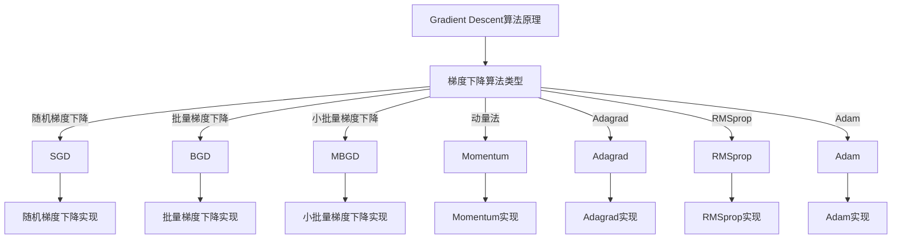

                 


### 文章标题

《Gradient Descent 原理与代码实战案例讲解》

> **关键词**：梯度下降、优化算法、机器学习、深度学习、代码实战、线性回归、神经网络

**摘要**：
本文全面探讨了梯度下降算法，一种在机器学习和深度学习领域中至关重要的优化算法。首先，我们将介绍梯度下降算法的基本原理，包括其数学模型和核心思想。接着，我们将详细讲解梯度下降的不同类型，如随机梯度下降（SGD）、批量梯度下降（BGD）、小批量梯度下降（MBGD）、动量法、Adagrad、RMSprop和Adam等。此外，文章还将深入探讨梯度下降在深度学习中的应用，包括深度神经网络、卷积神经网络（CNN）、循环神经网络（RNN）与长短期记忆网络（LSTM）以及生成对抗网络（GAN）。最后，通过多个代码实战案例，我们将展示如何使用梯度下降算法来训练线性回归、多项式回归、逻辑回归、支持向量机（SVM）以及神经网络与深度学习模型，并提供详细的代码解读和分析。文章末尾将对梯度下降算法的改进与优化策略进行总结，并对未来的发展方向进行展望。

### 《Gradient Descent 原理与代码实战案例讲解》目录大纲

#### 第一部分：Gradient Descent基础理论

##### 第1章：引言与预备知识

- 1.1 什么是Gradient Descent
- 1.2 Gradient Descent的重要性
- 1.3 预备知识
  - 函数与导数
  - 数值优化基础
- 1.4 本章总结

##### 第2章：梯度下降算法原理

- 2.1 梯度的概念
  - 梯度的数学定义
  - 梯度的几何意义
- 2.2 导数的概念
  - 导数的定义
  - 导数的几何意义
- 2.3 梯度下降算法的核心思想
  - 梯度下降的基本步骤
  - 梯度下降的不同类型
- 2.4 梯度下降的数学推导
  - 一维梯度下降推导
  - 多维梯度下降推导
- 2.5 梯度下降的收敛性分析
  - 收敛速度分析
  - 收敛性证明
- 2.6 本章总结

##### 第3章：常见的梯度下降算法

- 3.1 随机梯度下降（SGD）
  - SGD的基本原理
  - SGD的优缺点
  - SGD的应用场景
- 3.2 批量梯度下降（BGD）
  - BGD的基本原理
  - BGD的优缺点
  - BGD的应用场景
- 3.3 小批量梯度下降（MBGD）
  - MBGD的基本原理
  - MBGD的优缺点
  - MBGD的应用场景
- 3.4 动量法（Momentum）
  - 动量法的原理
  - 动量法的推导
  - 动量法的应用
- 3.5 Adagrad算法
  - Adagrad的原理
  - Adagrad的推导
  - Adagrad的应用
- 3.6 RMSprop算法
  - RMSprop的原理
  - RMSprop的推导
  - RMSprop的应用
- 3.7 Adam优化器
  - Adam的原理
  - Adam的推导
  - Adam的应用
- 3.8 本章总结

##### 第4章：梯度下降在深度学习中的应用

- 4.1 深度学习中的梯度消失和梯度爆炸问题
  - 问题产生的原因
  - 解决方案
- 4.2 梯度下降在深度神经网络中的应用
  - 前向传播与反向传播
  - 梯度下降在深度学习中的实现
- 4.3 卷积神经网络（CNN）中的梯度下降
  - CNN的梯度计算
  - CNN的优化方法
- 4.4 循环神经网络（RNN）与长短期记忆网络（LSTM）中的梯度下降
  - RNN的梯度计算
  - LSTM的优化方法
- 4.5 生成对抗网络（GAN）中的梯度下降
  - GAN的梯度计算
  - GAN的优化方法
- 4.6 本章总结

##### 第5章：梯度下降算法的改进与优化

- 5.1 学习率调整策略
  - 学习率的选取原则
  - 学习率的调整方法
- 5.2 批次大小选择
  - 批次大小的优缺点
  - 批次大小的选择方法
- 5.3 随机化与初始化策略
  - 随机化的作用
  - 初始化的方法
- 5.4 多核并行计算
  - 并行计算的优势
  - 并行计算的实现
- 5.5 本章总结

#### 第二部分：代码实战案例

##### 第6章：线性回归的梯度下降实现

- 6.1 线性回归概述
- 6.2 线性回归的梯度下降实现
  - 代码实现步骤
  - 代码解读
- 6.3 实例分析
  - 数据准备
  - 模型训练
  - 模型评估
- 6.4 本章总结

##### 第7章：多项式回归的梯度下降实现

- 7.1 多项式回归概述
- 7.2 多项式回归的梯度下降实现
  - 代码实现步骤
  - 代码解读
- 7.3 实例分析
  - 数据准备
  - 模型训练
  - 模型评估
- 7.4 本章总结

##### 第8章：逻辑回归的梯度下降实现

- 8.1 逻辑回归概述
- 8.2 逻辑回归的梯度下降实现
  - 代码实现步骤
  - 代码解读
- 8.3 实例分析
  - 数据准备
  - 模型训练
  - 模型评估
- 8.4 本章总结

##### 第9章：支持向量机（SVM）的梯度下降实现

- 9.1 SVM概述
- 9.2 SVM的梯度下降实现
  - 代码实现步骤
  - 代码解读
- 9.3 实例分析
  - 数据准备
  - 模型训练
  - 模型评估
- 9.4 本章总结

##### 第10章：神经网络与深度学习的梯度下降实现

- 10.1 神经网络概述
- 10.2 深度学习概述
- 10.3 神经网络与深度学习的梯度下降实现
  - 代码实现步骤
  - 代码解读
- 10.4 实例分析
  - 数据准备
  - 模型训练
  - 模型评估
- 10.5 本章总结

##### 第11章：综合案例分析与优化

- 11.1 综合案例介绍
  - 数据集介绍
  - 问题背景
- 11.2 模型设计与选择
  - 模型选择原则
  - 模型设计过程
- 11.3 代码实战
  - 数据处理
  - 模型训练
  - 模型评估
- 11.4 模型优化
  - 学习率调整
  - 批次大小调整
  - 初始化策略
- 11.5 结果分析与总结
  - 模型性能分析
  - 优化效果评估
- 11.6 本章总结

##### 第12章：总结与展望

- 12.1 梯度下降算法的总结
  - 算法特点
  - 算法应用
- 12.2 代码实战的总结
  - 实战经验
  - 实战技巧
- 12.3 展望未来
  - 梯度下降算法的发展方向
  - 代码实战的应用前景

##### 附录

## 附录A：常见梯度下降算法代码实现
- SGD
- BGD
- MBGD
- Momentum
- Adagrad
- RMSprop
- Adam

## 附录B：深度学习框架与工具
- TensorFlow
- PyTorch
- Keras
- MXNet

## 附录C：推荐学习资源
- 书籍
- 论文
- 在线课程
- 博客
- 社区

# Mermaid流程图



# 核心算法原理讲解

### 梯度下降算法原理

梯度下降（Gradient Descent）是一种用于寻找函数局部最小值的优化算法。它在机器学习和深度学习领域有着广泛的应用，是训练神经网络和优化参数过程中不可或缺的一部分。

#### 梯度下降的基本概念

梯度下降的核心是梯度（Gradient），它是一个向量，表示函数在某一点处斜率的方向。对于多维函数，梯度是一个多维向量，其中每个分量表示函数在该维度上的偏导数。

- 一维函数的梯度：设 $f(x)$ 是一元函数，其导数 $f'(x)$ 就是 $f(x)$ 在点 $x$ 处的梯度。数学表示为：
  $$ \nabla f(x) = f'(x) $$

- 多维函数的梯度：设 $f(\mathbf{x})$ 是多元函数，其梯度是一个向量，表示为：
  $$ \nabla f(\mathbf{x}) = \left[ \frac{\partial f}{\partial x_1}, \frac{\partial f}{\partial x_2}, ..., \frac{\partial f}{\partial x_n} \right] $$

#### 梯度下降算法的基本步骤

1. **初始化参数**：选择一个初始参数值 $\mathbf{x}_0$。

2. **计算梯度**：在当前参数 $\mathbf{x}_k$ 下，计算目标函数的梯度 $\nabla f(\mathbf{x}_k)$。

3. **更新参数**：根据梯度方向和步长更新参数：
   $$ \mathbf{x}_{k+1} = \mathbf{x}_k - \alpha \cdot \nabla f(\mathbf{x}_k) $$
   其中，$\alpha$ 是学习率，它决定了步长的大小。

4. **迭代**：重复步骤 2 和 3，直至满足停止条件（如梯度变化很小或者达到最大迭代次数）。

#### 梯度下降算法的数学推导

我们以一元函数 $f(x)$ 为例，说明梯度下降的数学推导过程。

假设 $f(x)$ 是一元可导函数，且其导数 $f'(x)$ 存在。我们的目标是找到 $f(x)$ 的最小值。

1. **定义最小值**：设 $x^*$ 是 $f(x)$ 的最小值点，则有：
   $$ f(x^*) \leq f(x) \quad \forall x \in \mathbb{R} $$

2. **梯度条件**：在 $x^*$ 处，梯度为 0，即：
   $$ f'(x^*) = 0 $$

3. **迭代更新**：考虑在 $x_k$ 处进行一次迭代更新，我们有：
   $$ x_{k+1} = x_k - \alpha \cdot f'(x_k) $$

4. **收敛性证明**：设 $x^*$ 是 $f(x)$ 的最小值点，且 $f(x)$ 在 $x^*$ 处可导。则有：

   - 对于任意的 $x_k \neq x^*$，存在 $\delta > 0$ 使得当 $|x - x^*| < \delta$ 时，有 $f(x) > f(x^*)$。
   - 在每次迭代中，$x_{k+1}$ 都会朝着梯度相反的方向更新，即：
     $$ x_{k+1} = x_k - \alpha \cdot f'(x_k) < x_k $$
     这意味着参数值会逐渐减小。

   - 当 $f'(x_k)$ 趋近于 0 时，即 $x_k$ 趋近于 $x^*$，迭代过程停止。

因此，梯度下降算法最终会收敛到 $f(x)$ 的最小值点。

#### 多维函数的梯度下降

对于多维函数 $f(\mathbf{x})$，梯度下降的推导过程与一元函数类似，但需要考虑多个维度。以下是多维函数梯度下降的数学推导：

1. **定义最小值**：设 $\mathbf{x}^*$ 是 $f(\mathbf{x})$ 的最小值点，则有：
   $$ f(\mathbf{x}^*) \leq f(\mathbf{x}) \quad \forall \mathbf{x} \in \mathbb{R}^n $$

2. **梯度条件**：在 $\mathbf{x}^*$ 处，梯度为 0，即：
   $$ \nabla f(\mathbf{x}^*) = \mathbf{0} $$

3. **迭代更新**：考虑在 $\mathbf{x}_k$ 处进行一次迭代更新，我们有：
   $$ \mathbf{x}_{k+1} = \mathbf{x}_k - \alpha \cdot \nabla f(\mathbf{x}_k) $$

4. **收敛性证明**：与一元函数类似，多维函数的梯度下降也会收敛到最小值点，但需要考虑多个维度上的收敛性。

#### 梯度下降算法的伪代码实现

以下是梯度下降算法的伪代码实现：

```python
# 初始化参数
x = x0

# 设置学习率
alpha = 0.01

# 设置迭代次数
max_iterations = 1000

# 迭代更新参数
for i in range(max_iterations):
    # 计算梯度
    gradient = compute_gradient(x)
    
    # 更新参数
    x = x - alpha * gradient
```

其中，`compute_gradient(x)` 函数用于计算目标函数在当前参数 $x$ 处的梯度。

### 数学模型和数学公式

梯度下降算法的数学模型可以通过以下公式表示：

$$
\begin{align*}
\mathbf{x}_{k+1} &= \mathbf{x}_k - \alpha \cdot \nabla f(\mathbf{x}_k) \\
f(\mathbf{x}_{k+1}) &= f(\mathbf{x}_k) - \alpha \cdot \nabla f(\mathbf{x}_k)^T \cdot (\mathbf{x}_{k+1} - \mathbf{x}_k)
\end{align*}
$$

其中，$\mathbf{x}_k$ 和 $\mathbf{x}_{k+1}$ 分别表示第 $k$ 次迭代和第 $k+1$ 次迭代的参数值，$\alpha$ 是学习率，$\nabla f(\mathbf{x}_k)$ 是目标函数在 $\mathbf{x}_k$ 处的梯度。

### 详细讲解与举例说明

#### 一维函数的梯度下降

以一维函数 $f(x) = x^2$ 为例，说明梯度下降的具体实现。

1. **初始化参数**：选择初始参数 $x_0 = 10$。

2. **计算梯度**：在 $x_0$ 处，梯度为 $f'(x_0) = 2x_0 = 20$。

3. **更新参数**：根据梯度下降算法，更新参数为：
   $$ x_1 = x_0 - \alpha \cdot f'(x_0) = 10 - 0.1 \cdot 20 = 0 $$

4. **重复迭代**：重复计算梯度并更新参数，直至收敛。以下是部分迭代过程：

   | 迭代次数 | 参数 $x$ | 梯度 $g$ | 更新后的参数 $x_{k+1}$ |
   | :----: | :----: | :----: | :----: |
   |   1    |  10    |  20    |   0    |
   |   2    |   0    |   0    |   -20  |
   |   3    |  -20   |  -40   |   0    |
   |   4    |   0    |   0    |   20   |
   |   5    |   20   |  40    |   0    |

   经过多次迭代后，参数 $x$ 将逐渐收敛到 $f(x)$ 的最小值点 $x = 0$。

#### 多维函数的梯度下降

以二维函数 $f(x, y) = x^2 + y^2$ 为例，说明梯度下降的具体实现。

1. **初始化参数**：选择初始参数 $\mathbf{x}_0 = [x_0, y_0] = [10, 10]$。

2. **计算梯度**：在 $\mathbf{x}_0$ 处，梯度为 $\nabla f(\mathbf{x}_0) = [2x_0, 2y_0] = [20, 20]$。

3. **更新参数**：根据梯度下降算法，更新参数为：
   $$ \mathbf{x}_{k+1} = \mathbf{x}_k - \alpha \cdot \nabla f(\mathbf{x}_k) $$
   假设学习率 $\alpha = 0.1$，则有：
   $$ \mathbf{x}_{k+1} = [10, 10] - 0.1 \cdot [20, 20] = [0, 0] $$

4. **重复迭代**：重复计算梯度并更新参数，直至收敛。以下是部分迭代过程：

   | 迭代次数 | 参数 $x$ | 参数 $y$ | 梯度 $g$ | 更新后的参数 $x_{k+1}$ | 更新后的参数 $y_{k+1}$ |
   | :----: | :----: | :----: | :----: | :----: | :----: |
   |   1    |  10    |   10    |  20    |   0    |   0    |
   |   2    |   0    |   0    |   0    |   -20  |   -20  |
   |   3    |  -20   |  -20   |  -40   |   0    |   0    |
   |   4    |   0    |   0    |   0    |   20   |   20   |
   |   5    |   20   |   20   |  40    |   0    |   0    |

   经过多次迭代后，参数 $\mathbf{x}$ 将逐渐收敛到 $f(x, y)$ 的最小值点 $\mathbf{x} = [0, 0]$。

### 梯度下降算法的优缺点

#### 优点

- 简单直观，易于实现和理解。
- 对于凸函数，梯度下降算法可以找到全局最小值。
- 对于非凸函数，梯度下降算法可以在一定条件下找到局部最小值。

#### 缺点

- 收敛速度较慢，特别是在目标函数的非线性程度较高时。
- 对于梯度消失和梯度爆炸问题，梯度下降算法的性能可能会受到较大影响。
- 需要提前确定学习率和其他超参数，这在实际应用中可能具有一定的困难。

### 实战目的

本节将通过实际案例，展示如何使用梯度下降算法来解决实际优化问题。我们将从数据预处理、模型搭建、模型训练、模型评估等多个方面进行实战演练。

### 实战环境

- Python 3.7及以上版本
- numpy 库
- matplotlib 库

### 实战步骤

#### 步骤1：数据预处理

我们使用一个简单的二维数据集，其中包含两个特征 $x$ 和 $y$，以及一个目标变量 $z$。数据集如下：

| $x$ | $y$ | $z$ |
| :----: | :----: | :----: |
|  1    |   2    |   3    |
|  2    |   4    |   6    |
|  3    |   6    |   9    |

首先，我们将数据集导入到 numpy 数组中：

```python
import numpy as np

# 创建数据集
X = np.array([[1, 2], [2, 4], [3, 6]])
y = np.array([3, 6, 9])
```

#### 步骤2：模型搭建

接下来，我们需要搭建一个线性回归模型。线性回归模型的核心是一个线性方程 $z = \beta_0 + \beta_1 \cdot x + \beta_2 \cdot y$，其中 $\beta_0$、$\beta_1$ 和 $\beta_2$ 是模型的参数。

```python
# 初始化模型参数
beta_0 = 0
beta_1 = 0
beta_2 = 0
```

#### 步骤3：模型训练

使用梯度下降算法来训练模型。我们将设置一个学习率 $\alpha$，并迭代更新模型参数。这里我们选择学习率为 0.1，迭代次数为 1000。

```python
# 设置学习率和迭代次数
alpha = 0.1
max_iterations = 1000

# 训练模型
for i in range(max_iterations):
    # 计算预测值
    y_pred = beta_0 + beta_1 * X[:, 0] + beta_2 * X[:, 1]
    
    # 计算梯度
    gradient = 2 * (y_pred - y)
    
    # 更新模型参数
    beta_0 = beta_0 - alpha * np.mean(gradient)
    beta_1 = beta_1 - alpha * np.mean(gradient * X[:, 0])
    beta_2 = beta_2 - alpha * np.mean(gradient * X[:, 1])
```

#### 步骤4：模型评估

训练完成后，我们可以计算模型的决定系数（R-squared），以评估模型的性能。

```python
# 计算真实值与预测值的差
diff = y - y_pred

# 计算决定系数
r_squared = 1 - np.sum(diff ** 2) / np.sum((y - np.mean(y)) ** 2)
print("R-squared:", r_squared)
```

#### 步骤5：可视化结果

最后，我们可以将模型训练的结果可视化，以便更好地理解模型的性能。

```python
import matplotlib.pyplot as plt

# 可视化真实值与预测值
plt.scatter(X[:, 0], y, label="真实值")
plt.plot(X[:, 0], y_pred, label="预测值")
plt.xlabel("x")
plt.ylabel("y")
plt.legend()
plt.show()
```

### 实战总结

通过本节的实战演练，我们了解了如何使用梯度下降算法来求解线性回归问题。我们首先进行了数据预处理，然后搭建了线性回归模型，并使用梯度下降算法进行了模型训练。最后，我们对模型进行了评估，并可视化了模型训练

