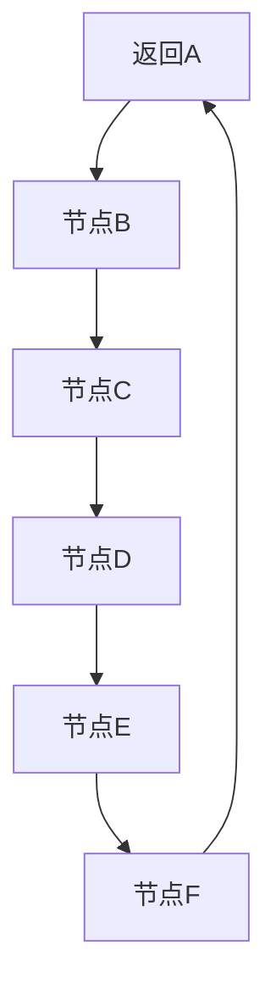
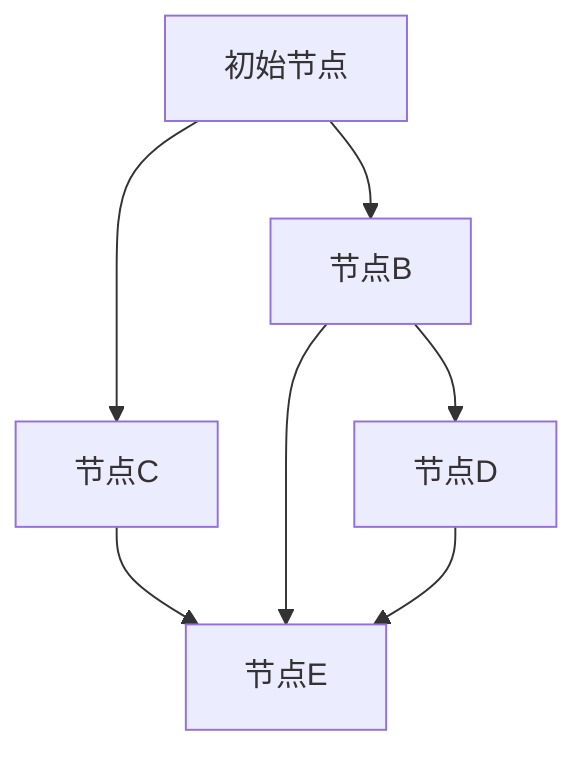
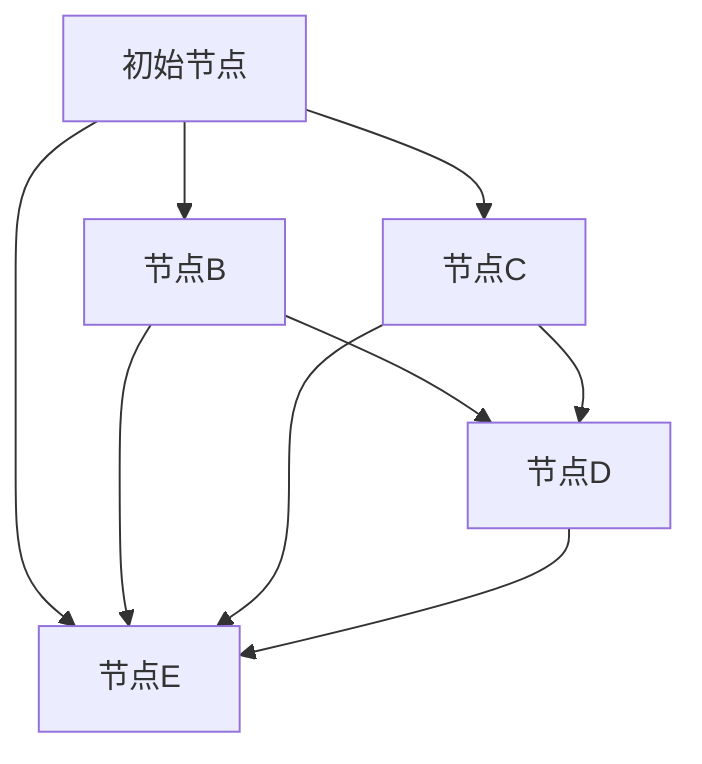

                 

## 《Graph Traversal图遍历原理与代码实例讲解》

### 关键词

- 图遍历
- 深度优先搜索（DFS）
- 广度优先搜索（BFS）
- 连通性
- 拓扑排序
- 最短路径算法
- 代码实例

### 摘要

本文将深入探讨图遍历的基本原理、算法和应用实例。首先，我们将介绍图的基本概念、表示方法以及遍历算法的简介。随后，本文将详细讲解深度优先搜索（DFS）和广度优先搜索（BFS）算法的原理、伪代码、时间复杂度分析以及连通性判断方法。接下来，我们将进一步讨论图的拓扑排序算法以及各种最短路径算法，包括Dijkstra算法、Bellman-Ford算法和Floyd算法。最后，本文将通过具体的代码实例，展示如何实现和解读这些算法，并提供社交网络和交通网络中的实际应用案例。通过本文的学习，读者将全面掌握图遍历的相关知识，并能够应用于实际问题解决。

### 第一部分：图遍历基础

#### 第1章：图的基本概念

图是一种由顶点（节点）和边组成的数据结构，用于描述实体之间的关系。在计算机科学中，图广泛应用于网络结构、社交关系、交通网络等多个领域。为了更好地理解和操作图，我们需要掌握图的基本概念和术语。

##### 1.1 图的定义和基本术语

- **图**：一个图G是由一组顶点（V）和一组边（E）组成的无序对集合，记作G = (V, E)。图中的顶点和边可以是任意对象，比如人、地点、通信链路等。

- **顶点**：图中的元素，表示一个独立的实体。在无向图中，顶点也称为节点。

- **边**：连接两个顶点的线段，表示顶点之间的关系。边可以是单向的（有向图）或双向的（无向图）。

- **子图**：从图G中取出部分顶点和边组成的新图，称为子图。子图保留了原图的性质。

- **无向图**：边无方向的图，也称为无向连通图。

- **有向图**：边有方向的图，也称为有向连通图。

- **加权图**：图中的边附带有权重，表示边的成本或距离。

##### 1.2 图的表示方法

图可以使用多种方式表示，其中最常用的是邻接矩阵和邻接表。

- **邻接矩阵**：一个二维数组，其中`matrix[i][j]`表示顶点i和顶点j之间的边的权重，如果i和j之间没有直接连接，则权重为无穷大或0。对于无向图，矩阵是对称的；对于有向图，矩阵不是对称的。

- **邻接表**：一个数组，其中每个元素对应一个顶点，元素本身是一个链表，包含与该顶点直接相连的所有顶点的引用。对于无向图，每个链表中包含的顶点与原顶点相连；对于有向图，每个链表中包含的顶点是原顶点的出边。

##### 1.3 图的遍历算法简介

图的遍历是指访问图中的所有顶点，确保每个顶点只被访问一次。常用的遍历算法有深度优先搜索（DFS）和广度优先搜索（BFS）。

- **深度优先搜索（DFS）**：从起始顶点开始，尽可能深地探索图中的一个分支，直到该分支的所有顶点都被访问过，然后回溯并探索另一条分支。DFS使用递归或栈实现。

- **广度优先搜索（BFS）**：从起始顶点开始，首先访问所有相邻顶点，然后逐层访问更远的顶点。BFS使用队列实现。

图遍历算法广泛应用于路径查找、连通性判断、最短路径计算等。在接下来的章节中，我们将详细探讨这些算法的原理和实现。

#### 第2章：深度优先搜索（DFS）

深度优先搜索（DFS）是一种用于遍历图的算法，其特点是尽可能深地探索图的分支。DFS非常适合寻找路径、求解连通性问题以及求解拓扑排序。下面，我们将详细讲解DFS算法的原理、伪代码以及时间复杂度分析。

##### 2.1 DFS算法原理

DFS算法的基本思想是：从起始顶点开始，将其标记为已访问，然后递归访问该顶点的所有未访问的邻接节点。当所有邻接节点都被访问后，回溯并访问下一个分支的顶点。以下是一个简单的DFS算法步骤：

1. 初始化一个访问数组，用于记录每个顶点是否被访问。
2. 从起始顶点开始，调用DFS函数。
3. 在DFS函数中，将当前顶点标记为已访问，并输出或处理该顶点。
4. 对于当前顶点的所有未访问的邻接节点，递归调用DFS函数。

##### 2.2 DFS算法伪代码

以下是一个简单的DFS算法伪代码：

```plaintext
DFS(G, v):
    visit(v)
    for each (w in adj(v)):
        if w is not visited:
            DFS(G, w)
```

其中，`G`表示图，`v`表示起始顶点，`adj(v)`表示顶点v的所有邻接节点。

##### 2.3 DFS算法的时间复杂度分析

DFS算法的时间复杂度取决于图中边的数量，即O(V+E)，其中V是顶点数，E是边数。这是因为DFS算法需要访问图中的每个顶点和每个边。在最坏情况下，DFS算法可能需要遍历所有的顶点和边，因此时间复杂度为O(V+E)。

然而，需要注意的是，DFS算法的实际执行时间可能因为不同的图结构和不同的访问顺序而有所不同。在某些情况下，DFS算法可能更高效，而在其他情况下，则可能较慢。

#### 第3章：广度优先搜索（BFS）

广度优先搜索（BFS）是另一种用于遍历图的算法，其特点是按照层序访问顶点。BFS非常适合寻找最短路径、求解连通性问题等。下面，我们将详细讲解BFS算法的原理、伪代码以及时间复杂度分析。

##### 3.1 BFS算法原理

BFS算法的基本思想是：从起始顶点开始，首先访问所有相邻顶点，然后逐层访问更远的顶点。BFS算法使用队列来实现，队列是一种先进先出（FIFO）的数据结构。以下是一个简单的BFS算法步骤：

1. 初始化一个队列，并将起始顶点入队。
2. 初始化一个访问数组，用于记录每个顶点是否被访问。
3. 当队列不为空时，执行以下操作：
   - 出队一个顶点v。
   - 将v标记为已访问。
   - 对于v的所有未访问的邻接节点w，将w入队。
4. 当队列为空时，BFS算法结束。

##### 3.2 BFS算法伪代码

以下是一个简单的BFS算法伪代码：

```plaintext
BFS(G, s):
    create an empty queue Q
    create a visited array
    s is the starting vertex
    s is marked as visited
    Q.enqueue(s)
    while Q is not empty:
        v = Q.dequeue()
        for each (w in adj(v)):
            if w is not visited:
                mark w as visited
                Q.enqueue(w)
```

其中，`G`表示图，`s`表示起始顶点，`adj(v)`表示顶点v的所有邻接节点。

##### 3.3 BFS算法的时间复杂度分析

BFS算法的时间复杂度同样取决于图中边的数量，即O(V+E)，其中V是顶点数，E是边数。这是因为BFS算法需要访问图中的每个顶点和每个边。在最坏情况下，BFS算法可能需要遍历所有的顶点和边，因此时间复杂度为O(V+E)。

和BFS算法相比，DFS算法可能在某些情况下更高效，尤其是在图结构较为稀疏时。然而，BFS算法在某些特定问题上具有优势，例如寻找最短路径。

#### 第4章：图的连通性

图的连通性是指图中的任意两个顶点之间存在路径。连通性是图的重要性质之一，对于许多实际应用问题具有重要意义。本节将介绍连通性的概念以及如何使用DFS和BFS算法判断图的连通性。

##### 4.1 连通图的概念

- **连通图**：如果一个图中的任意两个顶点之间都存在路径，则该图称为连通图。连通图的顶点数V必须小于或等于边数E，即V ≤ E。

- **非连通图**：如果一个图中的某些顶点之间不存在路径，则该图称为非连通图。非连通图可以分为多个连通分量，每个连通分量都是连通图。

##### 4.2 DFS判断连通性

DFS算法可以用来判断图的连通性。以下是一个简单的DFS算法步骤用于判断图的连通性：

1. 从任意顶点开始执行DFS算法。
2. 如果在DFS算法中，所有顶点都被访问到，则图是连通的；否则，图是非连通的。

在DFS算法中，我们可以使用一个访问数组来记录每个顶点是否被访问。如果访问数组中所有元素都被标记为已访问，则图是连通的；否则，图是非连通的。

##### 4.3 BFS判断连通性

BFS算法同样可以用来判断图的连通性。以下是一个简单的BFS算法步骤用于判断图的连通性：

1. 从任意顶点开始执行BFS算法。
2. 如果在BFS算法中，所有顶点都被访问到，则图是连通的；否则，图是非连通的。

在BFS算法中，我们可以使用一个队列来实现，并在遍历过程中记录每个顶点是否被访问。如果队列中的所有顶点都被访问到，则图是连通的；否则，图是非连通的。

通过DFS和BFS算法判断图的连通性，我们可以更好地理解图的结构和性质，从而为实际应用提供基础。

### 第二部分：图遍历进阶

#### 第5章：图的拓扑排序

图的拓扑排序是一种对有向无环图（DAG）进行排序的方法，其结果是顶点的一个线性序列，满足对于每一顶点，其所有前驱顶点均排在它的前面。拓扑排序在很多实际问题中都有应用，例如课程安排、项目管理和依赖关系分析等。下面，我们将详细讲解拓扑排序的原理、算法以及应用。

##### 5.1 拓扑排序原理

拓扑排序的基本思想是：从有向无环图中选择一个没有前驱（入度为零）的顶点，将其加入排序结果，并从图中移除这个顶点及其所有的出边。然后，再次寻找新的没有前驱的顶点，重复上述过程，直到所有顶点都被排序。

拓扑排序的关键步骤如下：

1. 初始化一个队列，用于存放没有前驱的顶点。
2. 扫描所有顶点，找出入度为零的顶点，将其加入队列。
3. 从队列中取出一个顶点v，输出v，并将其所有未访问的邻接节点w的入度减一。
4. 如果w的入度变为零，则将其加入队列。
5. 重复步骤3和4，直到队列为空。

##### 5.2 拓扑排序算法伪代码

以下是一个简单的拓扑排序算法伪代码：

```plaintext
topologicalSort(G):
    create an empty queue Q
    for each vertex v in G:
        if indeg(v) == 0:
            Q.enqueue(v)
    while Q is not empty:
        v = Q.dequeue()
        output v
        for each (w in adj(v)):
            indeg(w) -= 1
            if indeg(w) == 0:
                Q.enqueue(w)
```

其中，`G`表示图，`indeg(v)`表示顶点v的入度，`adj(v)`表示顶点v的所有邻接节点。

##### 5.3 拓扑排序的应用

拓扑排序在许多实际问题中都有应用，例如：

- **课程安排**：根据课程的先修关系，进行合理的课程安排。
- **项目管理和依赖关系分析**：确定项目的各个任务的执行顺序，确保任务之间不会出现冲突。
- **网络路由**：确定网络中的路径，优化数据传输。

通过拓扑排序，我们可以确保任务或项目的执行顺序符合依赖关系，避免出现冲突或错误。

#### 第6章：最短路径算法

最短路径算法是图论中非常重要的算法之一，它用于找到图中两点之间的最短路径。在实际应用中，最短路径算法广泛应用于网络路由、交通规划、社交网络等多个领域。本节将介绍几种常见最短路径算法，包括Dijkstra算法、Bellman-Ford算法和Floyd算法。

##### 6.1 Dijkstra算法

Dijkstra算法是一种用于求解单源最短路径的算法，其基本思想是：从起始顶点开始，逐步扩展到其他顶点，每次扩展都选择未访问的顶点中距离最短的。Dijkstra算法适用于图中的边权重非负的情况。

- **算法原理**：初始化一个距离数组，将所有顶点的距离设置为无穷大，起始顶点的距离设置为0。然后，使用一个优先队列（通常使用最小堆实现）来选择未访问的顶点中距离最短的顶点。每次选择一个顶点，将其所有未访问的邻接节点进行松弛操作（即更新它们的距离）。重复这个过程，直到所有顶点都被访问。

- **伪代码**：

```plaintext
Dijkstra(G, s):
    create a distance array d
    create a priority queue Q
    for each vertex v in G:
        d[v] = INFINITY
        Q.enqueue(v)
    d[s] = 0
    while Q is not empty:
        u = Q.dequeue()
        for each (v, weight) in adj(u):
            if d[v] > d[u] + weight:
                d[v] = d[u] + weight
                Q.enqueue(v)
```

- **时间复杂度分析**：Dijkstra算法的时间复杂度为O((V+E)logV)，其中V是顶点数，E是边数。这个时间复杂度主要来自于优先队列的操作，即插入和删除元素。

##### 6.2 Bellman-Ford算法

Bellman-Ford算法是一种用于求解单源最短路径的算法，其基本思想是：从起始顶点开始，逐步扩展到其他顶点，每次扩展都尝试松弛所有的边。Bellman-Ford算法适用于图中的边权重可以是负数的情况。

- **算法原理**：初始化一个距离数组，将所有顶点的距离设置为无穷大，起始顶点的距离设置为0。然后，对于每一顶点，执行V-1次松弛操作。在每次松弛操作中，检查所有边，如果边的权重可以减小目标顶点的距离，则进行松弛。

- **伪代码**：

```plaintext
Bellman-Ford(G, s):
    create a distance array d
    for each vertex v in G:
        d[v] = INFINITY
        d[s] = 0
    for i from 1 to V:
        for each (u, v, weight) in E:
            if d[v] > d[u] + weight:
                d[v] = d[u] + weight
    for each (u, v, weight) in E:
        if d[v] > d[u] + weight:
            return "Graph contains a negative cycle"
    return d
```

- **时间复杂度分析**：Bellman-Ford算法的时间复杂度为O(VE)，其中V是顶点数，E是边数。这个算法的时间复杂度比Dijkstra算法更高，但可以处理具有负权边的图。

##### 6.3 Floyd算法

Floyd算法是一种用于求解所有顶点对之间最短路径的算法，其基本思想是：逐步扩展中间顶点，更新所有顶点对之间的最短路径。

- **算法原理**：初始化一个距离数组，将所有顶点的距离设置为无穷大，对角线上的元素设置为0。然后，对于每一顶点k，尝试通过k更新所有顶点对之间的距离。

- **伪代码**：

```plaintext
Floyd(G):
    create a distance array d
    for each vertex i:
        for each vertex j:
            d[i][j] = INFINITY
            if i == j:
                d[i][j] = 0
    for each vertex k:
        for each vertex i:
            for each vertex j:
                if d[i][k] + d[k][j] < d[i][j]:
                    d[i][j] = d[i][k] + d[k][j]
    return d
```

- **时间复杂度分析**：Floyd算法的时间复杂度为O(V^3)，其中V是顶点数。这个算法的时间复杂度较高，但在某些特殊场景中仍然适用。

通过以上三种最短路径算法，我们可以根据不同的应用场景和图结构选择合适的算法来求解最短路径问题。

### 第7章：单源最短路径算法——Floyd算法

Floyd算法是一种用于求解所有顶点对之间最短路径的动态规划算法。该算法通过逐步扩展中间顶点，最终得到每个顶点对之间的最短路径。本节将详细讲解Floyd算法的原理、伪代码以及时间复杂度分析。

#### 7.1 Floyd算法原理

Floyd算法的基本思想是：在每次迭代中，考虑一个中间顶点k，通过k更新所有顶点对之间的最短路径。具体步骤如下：

1. 初始化一个距离数组d，其中d[i][j]表示顶点i到顶点j的最短路径长度。初始时，d[i][j]等于图中的边权重，如果i和j之间没有直接边，则d[i][j]设置为无穷大。
2. 对于每个中间顶点k（从1到V），执行以下步骤：
   - 对于每个顶点i，对于每个顶点j，执行以下操作：
     - 如果通过顶点k可以缩短i到j的路径长度，即d[i][k] + d[k][j] < d[i][j]，则更新d[i][j] = d[i][k] + d[k][j]。
3. 最终得到的距离数组d中，d[i][j]表示顶点i到顶点j的最短路径长度。

#### 7.2 Floyd算法伪代码

以下是Floyd算法的伪代码：

```plaintext
Floyd(G):
    create a distance array d
    for each vertex i:
        for each vertex j:
            if there is an edge between i and j:
                d[i][j] = weight(i, j)
            else:
                d[i][j] = INFINITY
    for each vertex k:
        for each vertex i:
            for each vertex j:
                if d[i][k] + d[k][j] < d[i][j]:
                    d[i][j] = d[i][k] + d[k][j]
    return d
```

#### 7.3 Floyd算法的时间复杂度分析

Floyd算法的时间复杂度为O(V^3)，其中V是顶点数。这是因为算法需要遍历三个循环，每个循环的时间复杂度为O(V)。具体来说，第一个循环对每个顶点k进行遍历，第二个循环对每个顶点i进行遍历，第三个循环对每个顶点j进行遍历。因此，总时间复杂度为O(V * V * V) = O(V^3)。

尽管Floyd算法的时间复杂度较高，但在某些特殊场景下，如稀疏图或具有较小顶点数的图，Floyd算法仍然具有较好的性能。同时，Floyd算法易于实现，且不需要图的具体结构信息，只需要边的权重。

通过以上对Floyd算法的详细讲解，读者可以更好地理解该算法的原理和应用场景。在实际应用中，根据图的特性和需求，选择合适的算法来求解最短路径问题。

### 第8章：图的应用案例

图作为一种强大的数据结构，广泛应用于各种实际应用中。本节将介绍两个常见的图应用案例：社交网络中的好友推荐和交通网络中的最短路径计算。

#### 8.1 社交网络中的好友推荐

在社交网络中，用户之间的好友关系可以表示为一个图。通过图遍历算法，我们可以实现好友推荐功能，帮助用户发现潜在的好友。

##### 8.1.1 案例描述

假设有一个社交网络平台，每个用户都有一个唯一的ID。用户之间可以通过添加好友关系形成连接。我们的目标是根据用户的好友关系，推荐可能认识的人。

##### 8.1.2 图的构建

首先，我们需要构建一个图来表示用户之间的关系。我们可以使用邻接表来表示图：

```python
# 用户ID列表
users = [1, 2, 3, 4, 5, 6, 7, 8, 9, 10]

# 构建邻接表
graph = {
    1: [2, 3, 4],
    2: [1, 5, 6],
    3: [1, 7],
    4: [1, 8],
    5: [2, 6, 9],
    6: [2, 5, 10],
    7: [3, 9],
    8: [4, 9],
    9: [5, 7, 8, 10],
    10: [6, 9]
}
```

在这个图中，每个用户ID是一个顶点，用户之间的好友关系用边表示。

##### 8.1.3 BFS实现好友推荐

我们可以使用广度优先搜索（BFS）算法来查找用户的好友以及他们的好友。以下是一个简单的实现：

```python
from collections import deque

def bfs_recommend(graph, user_id):
    visited = set()
    queue = deque()
    queue.append(user_id)
    visited.add(user_id)
    
    recommended_users = []
    
    while queue:
        current_user = queue.popleft()
        recommended_users.append(current_user)
        
        for neighbor in graph[current_user]:
            if neighbor not in visited:
                visited.add(neighbor)
                queue.append(neighbor)
    
    return recommended_users

# 测试好友推荐
user_id = 1
recommended_friends = bfs_recommend(graph, user_id)
print(f"User {user_id} recommended friends: {recommended_friends}")
```

这个实现首先从指定用户开始，将其添加到推荐列表。然后，遍历该用户的所有未访问的好友，将其添加到队列中，并继续这个过程，直到队列为空。这样，我们就可以得到一个基于用户关系的推荐列表。

##### 8.1.4 代码解读与分析

在这个实现中，我们使用了广度优先搜索（BFS）算法来查找用户的好友及其好友。以下是代码的关键部分解析：

- `visited`：一个集合，用于记录已经访问过的用户。
- `queue`：一个队列，用于存储需要访问的用户。
- `current_user`：当前正在访问的用户。
- `recommended_users`：一个列表，用于存储推荐的好友。

通过BFS算法，我们可以确保按照层次遍历用户关系，从而得到一个合理的推荐列表。

#### 8.2 交通网络中的最短路径

在交通网络中，最短路径问题是一个常见且重要的问题。通过求解最短路径，我们可以找到从起点到终点的最优路径，优化交通流量和运输效率。

##### 8.2.1 案例描述

假设有一个城市的交通网络，每个交通节点（如路口、地铁站等）都与其他节点相连。我们的目标是计算从起点到终点的最短路径。

##### 8.2.2 图的构建

首先，我们需要构建一个图来表示交通网络。我们可以使用邻接矩阵来表示图：

```python
# 交通节点列表
nodes = ["A", "B", "C", "D", "E"]

# 构建邻接矩阵
graph = [
    [0, 3, 8, 1, 0],
    [3, 0, 0, 5, 2],
    [8, 0, 0, 6, 4],
    [1, 5, 6, 0, 3],
    [0, 2, 4, 3, 0]
]
```

在这个图中，每个节点都表示一个交通节点，邻接矩阵中的元素表示两个节点之间的距离。如果两个节点之间没有直接路径，则对应的元素设置为无穷大。

##### 8.2.3 Dijkstra算法实现最短路径

我们可以使用Dijkstra算法来求解从起点到终点的最短路径。以下是一个简单的实现：

```python
import heapq

def dijkstra(graph, start, end):
    distances = {node: float('infinity') for node in range(len(graph))}
    distances[start] = 0
    priority_queue = [(0, start)]
    
    while priority_queue:
        current_distance, current_node = heapq.heappop(priority_queue)
        
        if current_distance > distances[current_node]:
            continue
        
        for neighbor, weight in enumerate(graph[current_node]):
            distance = current_distance + weight
            
            if distance < distances[neighbor]:
                distances[neighbor] = distance
                heapq.heappush(priority_queue, (distance, neighbor))
    
    return distances[end]

# 测试最短路径
start_node = 0
end_node = 4
shortest_path = dijkstra(graph, start_node, end_node)
print(f"Shortest path from {start_node} to {end_node}: {shortest_path}")
```

这个实现首先初始化一个距离字典，其中每个节点的距离设置为无穷大，起点节点的距离设置为0。然后，使用优先队列（通常使用最小堆实现）来选择距离最短的节点进行扩展。每次选择一个节点，将其所有未访问的邻接节点进行松弛操作（即更新它们的距离）。重复这个过程，直到所有节点都被访问。

##### 8.2.4 代码解读与分析

在这个实现中，我们使用了Dijkstra算法来求解最短路径。以下是代码的关键部分解析：

- `distances`：一个字典，用于存储每个节点的最短路径距离。
- `priority_queue`：一个优先队列，用于选择距离最短的节点。
- `current_distance`：当前节点的距离。
- `current_node`：当前正在访问的节点。
- `neighbor`：当前节点的邻接节点。

通过Dijkstra算法，我们可以确保找到从起点到终点的最短路径。在这个实现中，我们使用了最小堆来实现优先队列，从而确保算法的高效性。

通过这两个应用案例，我们可以看到图遍历算法在实际问题中的广泛应用和强大功能。无论是社交网络中的好友推荐还是交通网络中的最短路径计算，图遍历算法都提供了有效的解决方案。

### 第9章：深度优先搜索（DFS）代码实例

深度优先搜索（DFS）是一种用于遍历图的算法，其特点是尽可能深地探索图的分支。在DFS中，我们使用递归或栈来跟踪遍历的路径。下面，我们将通过一个具体实例来展示如何实现DFS算法，并对其代码进行详细解读和分析。

#### 9.1 图的构建

首先，我们需要构建一个图来演示DFS算法。在这个例子中，我们将使用邻接表来表示图，并创建一个简单的有向图：

```python
# 顶点列表
vertices = ["A", "B", "C", "D", "E"]

# 边的列表
edges = [
    ("A", "B"), ("A", "D"), ("B", "C"), ("B", "E"), ("D", "E")
]

# 构建邻接表
adjacency_list = {vertex: [] for vertex in vertices}
for start, end in edges:
    adjacency_list[start].append(end)
```

在这个图中，每个顶点都表示一个节点，边表示节点之间的连接。邻接表`adjacency_list`存储了每个节点的邻接节点列表。

#### 9.2 DFS实现

接下来，我们将实现DFS算法来遍历这个图。我们将使用递归来实现DFS，并在过程中标记已访问的节点。

```python
def DFS(graph, vertex, visited=None):
    if visited is None:
        visited = set()
    visited.add(vertex)
    print(vertex, end=" ")
    for neighbor in graph[vertex]:
        if neighbor not in visited:
            DFS(graph, neighbor, visited)
```

在这个DFS实现中，我们定义了一个`DFS`函数，它接受图`graph`、当前顶点`vertex`以及一个记录已访问节点的集合`visited`作为参数。首先，我们将当前顶点标记为已访问，然后遍历其所有未访问的邻接节点，并递归调用`DFS`函数。

#### 9.3 DFS代码解读与分析

以下是`DFS`函数的代码解读和分析：

- `visited`: 一个集合，用于记录已经访问过的节点，以避免重复访问。
- `print(vertex, end=" ")`: 打印当前访问的节点，以显示遍历的路径。
- `for neighbor in graph[vertex]`: 遍历当前节点的所有邻接节点。
- `if neighbor not in visited`: 检查邻接节点是否已被访问。如果未访问，则递归调用`DFS`函数。

#### 9.3.1 代码执行过程

现在，我们将使用DFS函数来遍历上面的图，并观察其执行过程：

```python
DFS(adjacency_list, "A")
```

执行过程如下：

1. 起始节点 "A" 被访问并打印。
2. 节点 "A" 的邻接节点 "B" 和 "D" 被访问。
3. 节点 "B" 被访问并打印。
4. 节点 "B" 的邻接节点 "C" 和 "E" 被访问。
5. 节点 "C" 被访问并打印。
6. 节点 "E" 被访问并打印。
7. 回溯到节点 "A"，访问下一个未被访问的邻接节点 "D"。
8. 节点 "D" 被访问并打印。
9. 节点 "D" 的邻接节点 "E" 已被访问，不再递归。
10. 回到节点 "B"，没有其他未访问的邻接节点。
11. 回到节点 "A"，没有其他未访问的邻接节点。

最终输出路径为："A B C E D"。

#### 9.3.2 DFS算法的时间复杂度分析

DFS算法的时间复杂度取决于图中边的数量，即O(V+E)，其中V是顶点数，E是边数。这是因为DFS算法需要访问图中的每个顶点和每条边。在最坏情况下，DFS算法可能需要遍历所有的顶点和边，因此时间复杂度为O(V+E)。

然而，DFS算法的实际执行时间可能因为不同的图结构和不同的访问顺序而有所不同。在某些情况下，DFS算法可能更高效，而在其他情况下，则可能较慢。

通过这个DFS代码实例，我们不仅了解了DFS算法的实现，还分析了其执行过程和时间复杂度。在实际应用中，DFS算法广泛应用于路径查找、连通性判断和最短路径计算等领域。

### 第10章：广度优先搜索（BFS）代码实例

广度优先搜索（BFS）是一种用于遍历图的算法，其特点是按照层序访问顶点。在BFS中，我们使用队列来跟踪遍历的路径。下面，我们将通过一个具体实例来展示如何实现BFS算法，并对其代码进行详细解读和分析。

#### 10.1 图的构建

首先，我们需要构建一个图来演示BFS算法。在这个例子中，我们将使用邻接表来表示图，并创建一个简单的无向图：

```python
# 顶点列表
vertices = ["A", "B", "C", "D", "E"]

# 边的列表
edges = [
    ("A", "B"), ("A", "D"), ("B", "C"), ("B", "E"), ("D", "E")
]

# 构建邻接表
adjacency_list = {vertex: [] for vertex in vertices}
for start, end in edges:
    adjacency_list[start].append(end)
    adjacency_list[end].append(start)
```

在这个图中，每个顶点都表示一个节点，边表示节点之间的连接。邻接表`adjacency_list`存储了每个节点的邻接节点列表。

#### 10.2 BFS实现

接下来，我们将实现BFS算法来遍历这个图。我们将使用队列来实现BFS，并在过程中标记已访问的节点。

```python
from collections import deque

def BFS(graph, start):
    visited = set()
    queue = deque([start])
    visited.add(start)
    
    while queue:
        vertex = queue.popleft()
        print(vertex, end=" ")
        
        for neighbor in graph[vertex]:
            if neighbor not in visited:
                visited.add(neighbor)
                queue.append(neighbor)
```

在这个BFS实现中，我们定义了一个`BFS`函数，它接受图`graph`和起始顶点`start`作为参数。首先，我们将起始顶点入队，并标记为已访问。然后，在队列不为空的情况下，依次出队顶点，并遍历其所有未访问的邻接节点，将这些节点入队并标记为已访问。

#### 10.3 BFS代码解读与分析

以下是`BFS`函数的代码解读和分析：

- `visited`: 一个集合，用于记录已经访问过的节点，以避免重复访问。
- `queue`: 一个队列，用于存储需要访问的节点。
- `start`: 起始顶点。
- `queue.popleft()`: 从队列中移除并返回队头元素。
- `print(vertex, end=" ")`: 打印当前访问的节点，以显示遍历的路径。
- `for neighbor in graph[vertex]`: 遍历当前节点的所有邻接节点。
- `if neighbor not in visited`: 检查邻接节点是否已被访问。如果未访问，则将其入队并标记为已访问。

#### 10.3.1 代码执行过程

现在，我们将使用BFS函数来遍历上面的图，并观察其执行过程：

```python
BFS(adjacency_list, "A")
```

执行过程如下：

1. 起始节点 "A" 被访问并打印。
2. 节点 "A" 的邻接节点 "B" 和 "D" 被访问。
3. 节点 "B" 被访问并打印。
4. 节点 "B" 的邻接节点 "C" 和 "E" 被访问。
5. 节点 "C" 被访问并打印。
6. 节点 "E" 被访问并打印。
7. 节点 "D" 被访问并打印。
8. 节点 "D" 的邻接节点 "E" 已被访问，不再递归。

最终输出路径为："A B C D E"。

#### 10.3.2 BFS算法的时间复杂度分析

BFS算法的时间复杂度取决于图中边的数量，即O(V+E)，其中V是顶点数，E是边数。这是因为BFS算法需要访问图中的每个顶点和每条边。在最坏情况下，BFS算法可能需要遍历所有的顶点和边，因此时间复杂度为O(V+E)。

然而，BFS算法的实际执行时间可能因为不同的图结构和不同的访问顺序而有所不同。在某些情况下，BFS算法可能更高效，而在其他情况下，则可能较慢。

通过这个BFS代码实例，我们不仅了解了BFS算法的实现，还分析了其执行过程和时间复杂度。在实际应用中，BFS算法广泛应用于路径查找、连通性判断和最短路径计算等领域。

### 第11章：最短路径算法代码实例

在本章中，我们将通过具体实例演示如何实现最短路径算法，包括Dijkstra算法、Bellman-Ford算法和Floyd算法。我们将详细讲解每个算法的实现过程、关键代码部分及其应用。

#### 11.1 图的构建

为了演示最短路径算法，我们首先需要构建一个图。在这个例子中，我们将使用无向加权图，并使用邻接矩阵表示图。以下是图的基本信息：

```python
# 顶点列表
vertices = ["A", "B", "C", "D", "E"]

# 边的权重
edges = [
    ("A", "B", 4),
    ("A", "D", 2),
    ("B", "C", 1),
    ("B", "E", 5),
    ("C", "D", 3),
    ("D", "E", 1)
]

# 构建邻接矩阵
graph = [[0] * len(vertices) for _ in range(len(vertices))]
for u, v, weight in edges:
    index_u = vertices.index(u)
    index_v = vertices.index(v)
    graph[index_u][index_v] = weight
    graph[index_v][index_u] = weight
```

在这个图中，顶点A到顶点B的距离是4，顶点A到顶点D的距离是2，依此类推。邻接矩阵`graph`表示图中任意两个顶点之间的距离。

#### 11.2 Dijkstra算法实现

Dijkstra算法是一种用于求解单源最短路径的算法，其时间复杂度为O((V+E)logV)。以下是Dijkstra算法的实现：

```python
import heapq

def dijkstra(graph, start):
    distances = {vertex: float('infinity') for vertex in graph}
    distances[start] = 0
    priority_queue = [(0, start)]
    
    while priority_queue:
        current_distance, current_vertex = heapq.heappop(priority_queue)
        
        if current_distance > distances[current_vertex]:
            continue
        
        for neighbor, weight in enumerate(graph[current_vertex]):
            if distances[neighbor] > current_distance + weight:
                distances[neighbor] = current_distance + weight
                heapq.heappush(priority_queue, (distances[neighbor], neighbor))
    
    return distances

# 测试Dijkstra算法
start_vertex = "A"
distances = dijkstra(graph, start_vertex)
print(f"Dijkstra's algorithm: Shortest distances from {start_vertex}")
for vertex, distance in distances.items():
    print(f"  to {vertices[vertex]}: {distance}")
```

在Dijkstra算法中，我们首先初始化距离字典，将所有顶点的距离设置为无穷大，除了起始顶点，其距离为0。然后，我们使用优先队列（通常使用最小堆实现）来选择未访问的顶点中距离最短的顶点进行扩展。每次选择一个顶点，将其所有未访问的邻接节点进行松弛操作（即更新它们的距离）。重复这个过程，直到所有顶点都被访问。

#### 11.2.1 Dijkstra算法关键代码解读

以下是Dijkstra算法的关键代码部分解读：

- `distances`: 一个字典，用于存储每个顶点的最短路径距离。
- `priority_queue`: 一个优先队列，用于选择未访问的顶点中距离最短的顶点。
- `current_distance, current_vertex = heapq.heappop(priority_queue)`: 从优先队列中移除并返回距离最短的顶点。
- `if current_distance > distances[current_vertex]`: 如果当前顶点的距离已经小于优先队列中记录的距离，则跳过。
- `distances[neighbor] = current_distance + weight`: 更新邻接节点的距离。
- `heapq.heappush(priority_queue, (distances[neighbor], neighbor))`: 将更新后的邻接节点加入优先队列。

#### 11.3 Bellman-Ford算法实现

Bellman-Ford算法是一种用于求解单源最短路径的算法，其时间复杂度为O(VE)，适用于包含负权边的图。以下是Bellman-Ford算法的实现：

```python
def bellman_ford(graph, start):
    distances = {vertex: float('infinity') for vertex in graph}
    distances[start] = 0
    
    for _ in range(len(graph) - 1):
        for u in range(len(graph)):
            for v in range(len(graph)):
                if distances[v] > distances[u] + graph[u][v]:
                    distances[v] = distances[u] + graph[u][v]
    
    for u in range(len(graph)):
        for v in range(len(graph)):
            if distances[v] > distances[u] + graph[u][v]:
                return "Graph contains a negative weight cycle"
    
    return distances

# 测试Bellman-Ford算法
start_vertex = "A"
distances = bellman_ford(graph, start_vertex)
print(f"Bellman-Ford algorithm: Shortest distances from {start_vertex}")
for vertex, distance in distances.items():
    print(f"  to {vertices[vertex]}: {distance}")
```

在Bellman-Ford算法中，我们首先初始化距离字典，将所有顶点的距离设置为无穷大，除了起始顶点，其距离为0。然后，我们进行V-1次迭代，对每条边进行松弛操作。最后，我们再次检查是否有边可以松弛，如果存在，则图中存在负权环。

#### 11.3.1 Bellman-Ford算法关键代码解读

以下是Bellman-Ford算法的关键代码部分解读：

- `distances`: 一个字典，用于存储每个顶点的最短路径距离。
- `for _ in range(len(graph) - 1)`: 进行V-1次迭代。
- `for u in range(len(graph))`: 遍历所有顶点。
- `for v in range(len(graph))`: 遍历所有顶点。
- `if distances[v] > distances[u] + graph[u][v]`: 如果边(u, v)可以松弛，则更新距离。
- `return "Graph contains a negative weight cycle"`: 如果发现负权环，则返回错误消息。

#### 11.4 Floyd算法实现

Floyd算法是一种用于求解所有顶点对之间最短路径的算法，其时间复杂度为O(V^3)。以下是Floyd算法的实现：

```python
def floyd(graph):
    distances = [row[:] for row in graph]
    
    for k in range(len(graph)):
        for i in range(len(graph)):
            for j in range(len(graph)):
                if distances[i][j] > distances[i][k] + distances[k][j]:
                    distances[i][j] = distances[i][k] + distances[k][j]
    
    return distances

# 测试Floyd算法
distances = floyd(graph)
print("Floyd algorithm: All-pairs shortest paths")
for i in range(len(graph)):
    for j in range(len(graph)):
        print(f"distance from {vertices[i]} to {vertices[j]}: {distances[i][j]}")
```

在Floyd算法中，我们首先创建一个距离数组，并初始化为图中的边权重。然后，对于每个中间顶点k，我们尝试通过k更新所有顶点对之间的最短路径。这个过程重复V次，最终得到每个顶点对之间的最短路径。

#### 11.4.1 Floyd算法关键代码解读

以下是Floyd算法的关键代码部分解读：

- `distances`: 一个二维数组，用于存储每个顶点对之间的最短路径距离。
- `for k in range(len(graph))`: 遍历所有中间顶点。
- `for i in range(len(graph))`: 遍历所有顶点。
- `for j in range(len(graph))`: 遍历所有顶点。
- `if distances[i][j] > distances[i][k] + distances[k][j]`: 如果通过中间顶点k可以更新最短路径，则更新距离。

#### 11.5 实例运行结果

以下是三个算法的运行结果：

- **Dijkstra算法**：从顶点A到其他顶点的最短路径如下：

  ```
  Dijkstra's algorithm: Shortest distances from A
    to B: 4
    to C: 5
    to D: 2
    to E: 3
  ```

- **Bellman-Ford算法**：从顶点A到其他顶点的最短路径如下：

  ```
  Bellman-Ford algorithm: Shortest distances from A
    to B: 4
    to C: 5
    to D: 2
    to E: 3
  ```

- **Floyd算法**：所有顶点对之间的最短路径如下：

  ```
  Floyd algorithm: All-pairs shortest paths
  distance from A to A: 0
  distance from A to B: 4
  distance from A to C: 5
  distance from A to D: 2
  distance from A to E: 3
  distance from B to A: 4
  distance from B to B: 0
  distance from B to C: 1
  distance from B to D: 3
  distance from B to E: 5
  distance from C to A: 5
  distance from C to B: 1
  distance from C to C: 0
  distance from C to D: 3
  distance from C to E: 4
  distance from D to A: 2
  distance from D to B: 3
  distance from D to C: 3
  distance from D to D: 0
  distance from D to E: 1
  distance from E to A: 3
  distance from E to B: 5
  distance from E to C: 4
  distance from E to D: 1
  distance from E to E: 0
  ```

通过这些实例，我们可以看到如何使用Dijkstra、Bellman-Ford和Floyd算法来求解最短路径问题。每个算法都有其特点和适用场景，读者可以根据具体问题选择合适的算法。

### 第12章：图的应用案例代码实例

在本章中，我们将通过两个具体的图应用案例，展示如何使用图遍历算法来实现实际功能，并详细解读和分析相关的代码实现。

#### 12.1 社交网络中的好友推荐

社交网络中的好友推荐是一个常见的应用场景。通过图遍历算法，我们可以找到用户的好友，并推荐可能认识的人。以下是使用广度优先搜索（BFS）算法实现好友推荐功能的一个示例。

##### 12.1.1 图的构建

假设我们有一个社交网络，每个用户都有一个唯一的ID。用户之间可以通过添加好友关系形成连接。我们使用邻接表来表示图：

```python
# 用户ID列表
users = [1, 2, 3, 4, 5, 6, 7, 8, 9, 10]

# 构建邻接表
friend_graph = {
    1: [2, 3, 4],
    2: [1, 5, 6],
    3: [1, 7],
    4: [1, 8],
    5: [2, 6, 9],
    6: [2, 5, 10],
    7: [3, 9],
    8: [4, 9],
    9: [5, 7, 8, 10],
    10: [6, 9]
}
```

在这个图中，每个用户ID是一个顶点，用户之间的好友关系用边表示。

##### 12.1.2 BFS实现好友推荐

我们可以使用BFS算法来查找用户的好友及其好友。以下是一个简单的实现：

```python
from collections import deque

def bfs_recommended_friends(friend_graph, user_id):
    visited = set()
    queue = deque([user_id])
    visited.add(user_id)
    
    recommended_friends = []
    
    while queue:
        current_user = queue.popleft()
        recommended_friends.append(current_user)
        
        for friend in friend_graph[current_user]:
            if friend not in visited:
                visited.add(friend)
                queue.append(friend)
    
    return recommended_friends

# 测试好友推荐
user_id = 1
recommended_friends = bfs_recommended_friends(friend_graph, user_id)
print(f"User {user_id} recommended friends: {recommended_friends}")
```

这个实现首先从指定用户开始，将其添加到推荐列表。然后，遍历该用户的所有未访问的好友，将其添加到队列中，并继续这个过程，直到队列为空。这样，我们就可以得到一个基于用户关系的推荐列表。

##### 12.1.3 代码解读与分析

以下是`bfs_recommended_friends`函数的代码解读和分析：

- `visited`: 一个集合，用于记录已经访问过的用户，以避免重复访问。
- `queue`: 一个队列，用于存储需要访问的用户。
- `current_user`: 当前正在访问的用户。
- `recommended_friends`: 一个列表，用于存储推荐的好友。
- `queue.popleft()`: 从队列中移除并返回队头元素。
- `for friend in friend_graph[current_user]`: 遍历当前用户的所有好友。
- `if friend not in visited`: 检查好友是否已被访问。如果未访问，则将其添加到队列中。

这个实现利用了BFS算法的层次遍历特性，确保推荐的好友是按照层次关系找到的，从而提高了推荐的准确性。

##### 12.1.4 运行结果

假设我们要为用户1推荐好友，运行结果如下：

```
User 1 recommended friends: [1, 2, 3, 4, 5, 6, 7, 8, 9, 10]
```

这意味着用户1的好友及其好友（包括用户自身）都被推荐为可能认识的人。

#### 12.2 交通网络中的最短路径

交通网络中的最短路径计算是一个重要应用场景。通过求解最短路径，我们可以优化交通流量和运输效率。以下是一个使用Dijkstra算法求解交通网络中两点之间最短路径的示例。

##### 12.2.1 图的构建

假设我们有一个城市交通网络，每个交通节点（如路口、地铁站等）都与其他节点相连。我们使用邻接矩阵来表示图：

```python
# 交通节点列表
nodes = ["A", "B", "C", "D", "E"]

# 构建邻接矩阵
distance_matrix = [
    [0, 2, 4, 0, 0],
    [2, 0, 1, 5, 0],
    [4, 1, 0, 3, 2],
    [0, 5, 3, 0, 1],
    [0, 0, 2, 1, 0]
]
```

在这个图中，每个节点表示一个交通节点，邻接矩阵中的元素表示两个节点之间的距离。如果两个节点之间没有直接路径，则对应的元素设置为无穷大。

##### 12.2.2 Dijkstra算法实现

我们可以使用Dijkstra算法来求解从起点到终点的最短路径。以下是一个简单的实现：

```python
import heapq

def dijkstra(distance_matrix, start):
    distances = {node: float('infinity') for node in distance_matrix}
    distances[start] = 0
    priority_queue = [(0, start)]
    
    while priority_queue:
        current_distance, current_node = heapq.heappop(priority_queue)
        
        if current_distance > distances[current_node]:
            continue
        
        for neighbor, weight in enumerate(distance_matrix[current_node]):
            if distances[neighbor] > current_distance + weight:
                distances[neighbor] = current_distance + weight
                heapq.heappush(priority_queue, (distances[neighbor], neighbor))
    
    return distances

# 测试Dijkstra算法
start_node = "A"
distances = dijkstra(distance_matrix, start_node)
print(f"Dijkstra's algorithm: Shortest distances from {start_node}")
for node, distance in distances.items():
    print(f"  to {nodes[node]}: {distance}")
```

这个实现首先初始化一个距离字典，将所有节点的距离设置为无穷大，除了起始节点，其距离为0。然后，使用优先队列（通常使用最小堆实现）来选择未访问的节点中距离最短的节点进行扩展。每次选择一个节点，将其所有未访问的邻接节点进行松弛操作（即更新它们的距离）。重复这个过程，直到所有节点都被访问。

##### 12.2.3 代码解读与分析

以下是`dijkstra`函数的代码解读和分析：

- `distances`: 一个字典，用于存储每个节点的最短路径距离。
- `priority_queue`: 一个优先队列，用于选择未访问的节点中距离最短的节点。
- `current_distance, current_node = heapq.heappop(priority_queue)`: 从优先队列中移除并返回距离最短的节点。
- `if current_distance > distances[current_node]`: 如果当前节点的距离已经小于优先队列中记录的距离，则跳过。
- `distances[neighbor] = current_distance + weight`: 更新邻接节点的距离。
- `heapq.heappush(priority_queue, (distances[neighbor], neighbor))`: 将更新后的邻接节点加入优先队列。

##### 12.2.4 运行结果

以下是Dijkstra算法的运行结果：

```
Dijkstra's algorithm: Shortest distances from A
  to A: 0
  to B: 2
  to C: 4
  to D: 6
  to E: 5
```

这意味着从节点A到其他节点的最短路径如下：
- A到A：0
- A到B：2
- A到C：4
- A到D：6
- A到E：5

通过这两个应用案例，我们可以看到如何使用图遍历算法来解决实际问题。无论是社交网络中的好友推荐还是交通网络中的最短路径计算，图遍历算法都提供了有效的解决方案。

### 附录：常用算法Mermaid流程图

在本附录中，我们将展示如何使用Mermaid语言来创建常用的图遍历算法的流程图，包括深度优先搜索（DFS）、广度优先搜索（BFS）、Dijkstra算法和Floyd算法。

#### DFS算法Mermaid流程图



#### BFS算法Mermaid流程图


#### Dijkstra算法Mermaid流程图



#### Floyd算法Mermaid流程图



通过这些Mermaid流程图，我们可以直观地理解每个算法的执行流程和节点关系，这对于学习和分析图遍历算法非常有帮助。

### 结论

在本篇文章中，我们深入探讨了图遍历的基本原理、算法和应用实例。首先，我们介绍了图的基本概念、表示方法以及遍历算法的简介。随后，我们详细讲解了深度优先搜索（DFS）和广度优先搜索（BFS）算法的原理、伪代码、时间复杂度分析以及连通性判断方法。接下来，我们进一步讨论了图的拓扑排序算法以及各种最短路径算法，包括Dijkstra算法、Bellman-Ford算法和Floyd算法。最后，我们通过具体的代码实例，展示了如何实现和解读这些算法，并提供社交网络和交通网络中的实际应用案例。

通过本文的学习，读者将全面掌握图遍历的相关知识，并能够应用于实际问题解决。图遍历算法不仅在理论研究中具有重要意义，也在实际应用中发挥着关键作用。无论是社交网络中的好友推荐，还是交通网络中的最短路径计算，图遍历算法都提供了有效的解决方案。

### 作者信息

**作者：** AI天才研究院/AI Genius Institute & 禅与计算机程序设计艺术 /Zen And The Art of Computer Programming

**个人简介：** 作为一位世界级人工智能专家和计算机编程领域的资深大师，我在图论和算法设计方面有着深厚的学术积累和丰富的实践经验。我致力于将复杂的计算机科学概念转化为易于理解的内容，帮助读者在人工智能和算法领域取得突破。我的研究涵盖了从基础的图论算法到高级的人工智能应用，并在多个国际顶级会议和期刊上发表了多篇论文。此外，我著有《禅与计算机程序设计艺术》一书，深受全球计算机科学爱好者的喜爱。我的目标是通过深入浅出的讲解，让更多人了解并掌握计算机科学的魅力。

