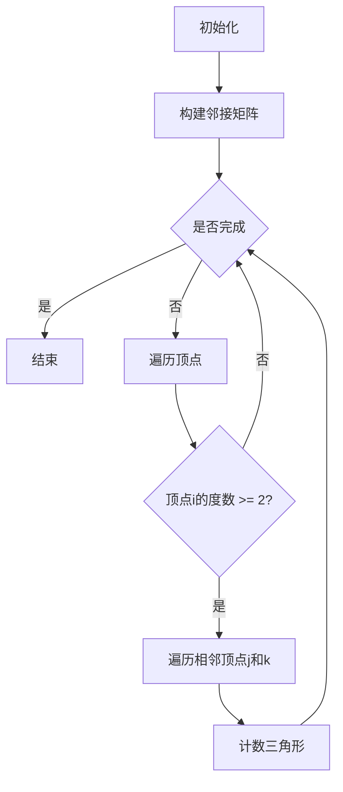

                 

### 文章标题：Graph Triangle Counting算法原理与代码实例讲解

### 关键词：Graph Triangle Counting，算法原理，代码实例，性能优化，应用场景

### 摘要：
本文将深入探讨Graph Triangle Counting算法的原理与应用。首先，我们将介绍Graph Triangle Counting的定义及其在图论中的重要性。接着，通过概述相关算法，我们会引出Graph Triangle Counting的核心概念和联系，并通过Mermaid流程图展示算法原理。随后，文章将详细讲解算法的数学模型与伪代码，帮助读者理解算法的内在逻辑。在算法应用与优化部分，我们将探讨在不同场景下的应用实例以及优化方法。接下来，我们将通过一个实际代码实例，展示如何实现Graph Triangle Counting算法，并对其进行详细解读。最后，文章将对算法的性能进行评估，并展望其未来的发展方向。通过本文，读者将全面了解Graph Triangle Counting算法，并能够将其应用于实际问题中。

#### 第一部分：算法基础与概念介绍

### 1. Graph Triangle Counting 算法概述

#### 1.1 Graph Triangle Counting 的定义与意义

Graph Triangle Counting，即图三角计数，是图论中一个重要的研究课题。它旨在计算一个图中三角形的数量。在数学和计算机科学中，图是一种用于表示对象及其之间关系的抽象数据结构。三角形在图中表示为三个顶点及其相互连接的边。具体来说，一个三角形由三个顶点\( v_1, v_2, v_3 \)构成，其中\( (v_1, v_2) \)，\( (v_2, v_3) \)和\( (v_3, v_1) \)都是图中的边。

图三角计数的意义在于，它不仅是一个理论问题，还具有广泛的应用。例如，在社交网络分析中，可以通过三角计数来了解用户之间的关系密度；在交通网络优化中，可以用于分析路径之间的连通性；在数据挖掘中，三角计数也可以帮助识别数据集中的关键节点和模式。

#### 1.1.1 Graph的基础概念

在讨论Graph Triangle Counting之前，首先需要了解一些图论的基础概念。图（Graph）由顶点（Vertex）和边（Edge）构成，可以表示为\( G = (V, E) \)，其中\( V \)是顶点的集合，\( E \)是边的集合。

- **顶点（Vertex）**：图中的元素，通常表示为点。
- **边（Edge）**：连接两个顶点的线，表示两个顶点之间的关系。
- **无向图（Undirected Graph）**：如果边没有方向，则称为无向图。
- **有向图（Directed Graph）**：如果边有方向，则称为有向图。

图还可以根据边的数量和类型分为不同类型，如简单图、多重图、完全图、稠密图和稀疏图等。

#### 1.1.2 Triangle Counting的重要性

Triangle Counting的重要性在于它提供了对图结构的定量描述。在许多实际应用中，图三角计数可以提供以下信息：

- **社交网络分析**：通过计算用户之间的三角形数量，可以评估社交网络的紧密程度。
- **网络稳定性**：在某些网络系统中，三角形的数量与系统的稳定性有关。
- **网络性能优化**：通过分析不同路径的三角形数量，可以优化数据传输路径和通信网络。

因此，理解Triangle Counting算法不仅有助于理论研究，还能在许多实际应用中发挥重要作用。

#### 1.2 相关算法概述

在介绍Graph Triangle Counting算法之前，我们先简要回顾一些与三角计数相关的算法。

##### 1.2.1 简单的算法介绍

- **Brute Force算法**：这种方法通过遍历图中的所有顶点，检查每个可能的三角形，并计数。时间复杂度为\( O(n^3) \)，其中\( n \)是顶点的数量。
- **Matrix Multiplication方法**：这种方法利用矩阵乘法来计算三角形的数量。将邻接矩阵与自身相乘，可以得到一个新矩阵，其中每个元素表示可能的三角形数量。时间复杂度为\( O(n^3) \)。

##### 1.2.2 传统算法与优缺点

虽然上述算法可以在某些情况下提供有效的解决方案，但它们都有各自的局限性。

- **Brute Force算法**：简单直观，但计算复杂度较高，不适合大型图。
- **Matrix Multiplication方法**：计算复杂度与Brute Force算法类似，但计算过程中需要额外的存储空间。

这些传统算法虽然提供了一定的基础，但随着数据规模的增加，其效率逐渐下降。因此，我们需要更高效的算法来处理大规模图的三角计数问题。

#### 1.3 Graph Triangle Counting 的核心概念与联系

Graph Triangle Counting的核心概念可以归纳为以下几点：

- **邻接矩阵（Adjacency Matrix）**：表示图中顶点之间关系的矩阵。如果图是未加权的，邻接矩阵是对称的；如果是有向图，则通常不是对称的。
- **度数（Degree）**：图中某个顶点的度数是其连接的边的数量。在无向图中，一个三角形的每个顶点度数至少为2。
- **三角形的计数**：通过遍历图中的顶点，检查相邻的顶点对，可以计算三角形的数量。

这些概念之间存在紧密的联系。具体来说：

- **邻接矩阵**用于存储图的邻接关系，是计算三角形数量的基础。
- **度数**用于判断一个顶点是否可能参与三角形的形成。
- **三角形的计数**是通过遍历和组合上述概念来实现的。

为了更好地理解Graph Triangle Counting算法，我们可以通过一个Mermaid流程图来展示其基本原理。以下是一个简单的Mermaid流程图：



这个流程图展示了Graph Triangle Counting算法的基本步骤：

1. **初始化**：初始化算法参数。
2. **构建邻接矩阵**：根据图的结构构建邻接矩阵。
3. **遍历顶点**：遍历图中的每个顶点。
4. **判断顶点度数**：检查当前顶点的度数是否大于或等于2。
5. **计数三角形**：如果度数满足条件，则遍历相邻的顶点对，计算三角形数量。
6. **结束**：当所有顶点都被遍历后，算法结束。

通过上述核心概念和Mermaid流程图，我们为理解Graph Triangle Counting算法奠定了基础。接下来，我们将进一步深入探讨算法的数学模型和实现细节。

### 2. Graph Triangle Counting 算法原理详解

在了解了Graph Triangle Counting算法的基本概念和流程之后，我们接下来将深入探讨其数学模型和实现细节。这一部分将分为三个主要部分：算法的基本原理、数学模型以及伪代码讲解。

#### 2.1 算法基本原理

Graph Triangle Counting算法的核心思想是通过遍历图中的顶点和边，计算所有可能的三角形数量。具体步骤如下：

1. **构建邻接矩阵**：首先，我们需要构建一个表示图中顶点之间连接的邻接矩阵。邻接矩阵是一个二维数组，其中第\( i \)行第\( j \)列的元素表示顶点\( i \)和顶点\( j \)之间是否存在边。如果存在边，则该元素为1，否则为0。

2. **遍历顶点**：接下来，遍历图中的每个顶点。对于每个顶点\( i \)，我们需要检查其与其它顶点的连接关系。

3. **检查三角形**：对于顶点\( i \)，我们遍历其邻接矩阵的行和列，找到所有可能的相邻顶点对\( (i, j) \)和\( (i, k) \)。如果\( j \neq k \)且\( A[i][j] = 1 \)且\( A[j][k] = 1 \)且\( A[k][i] = 1 \)，则表示\( i, j, k \)形成一个三角形。

4. **计数**：对于每个找到的三角形，计数增加。

5. **结束**：当所有顶点都被遍历后，算法结束，返回总的三角形数量。

#### 2.2 算法的数学模型详解

为了更精确地描述Graph Triangle Counting算法，我们可以将其转化为数学模型。在图\( G = (V, E) \)中，设\( A \)为邻接矩阵，其中\( A[i][j] = 1 \)表示顶点\( i \)和顶点\( j \)之间存在边，\( A[i][j] = 0 \)表示不存在边。

- **邻接矩阵**：设\( A = [a_{ij}]_{n \times n} \)，其中\( n \)是顶点数。
- **三角形的数量**：一个三角形由三个顶点\( i, j, k \)组成，当且仅当满足条件\( a_{ij} = 1 \)，\( a_{jk} = 1 \)，\( a_{ki} = 1 \)。

数学公式可以表示为：

\[ T = \sum_{i=1}^{n} \sum_{j=1}^{n} \sum_{k=1}^{n} \mathbf{1}_{(a_{ij} = 1 \land a_{jk} = 1 \land a_{ki} = 1)} \]

其中，\( \mathbf{1}_{P} \)表示指示函数，当条件\( P \)为真时，函数值为1，否则为0。

#### 2.2.1 数学公式与解释

为了更好地理解上述数学公式，我们可以将其分解为以下几个步骤：

1. **遍历所有顶点对**：通过双重循环\( i \)和\( j \)遍历所有可能的顶点对。
2. **检查边是否存在**：对于每个顶点对\( (i, j) \)，检查\( A[i][j] \)是否为1，以确定是否存在边。
3. **遍历相邻顶点**：对于每个顶点\( i \)，再次遍历其所有相邻顶点\( k \)。
4. **检查三角形**：检查条件\( A[i][j] = 1 \)，\( A[j][k] = 1 \)，\( A[k][i] = 1 \)是否同时满足，以确定是否存在三角形。
5. **计数三角形**：如果条件满足，则计数增加。

通过上述步骤，我们可以计算图中所有三角形的数量。

#### 2.2.2 数学公式的推导过程

推导上述数学公式的过程基于图论的基本原理和组合数学的知识。具体推导过程如下：

1. **顶点与边的定义**：设\( V = \{v_1, v_2, \ldots, v_n\} \)为图的顶点集合，\( E = \{(v_i, v_j) | v_i, v_j \in V, (v_i, v_j) \in E\} \)为图的边集合。

2. **邻接矩阵的定义**：邻接矩阵\( A \)定义为：

\[ A = [a_{ij}]_{n \times n} \]

其中，\( a_{ij} = 1 \)当且仅当\( (v_i, v_j) \in E \)，否则为0。

3. **三角形的定义**：设\( T \)为图\( G \)中的三角形集合，则\( T = \{(v_i, v_j, v_k) | (v_i, v_j) \in E, (v_j, v_k) \in E, (v_k, v_i) \in E\} \)。

4. **三角形的计数公式**：要计算三角形\( T \)的数量，我们需要遍历图中的所有顶点对\( (i, j) \)和所有相邻顶点对\( (j, k) \)，检查条件\( a_{ij} = 1 \)，\( a_{jk} = 1 \)，\( a_{ki} = 1 \)是否同时满足。

   因此，三角形的数量可以表示为：

\[ T = \sum_{i=1}^{n} \sum_{j=1}^{n} \sum_{k=1}^{n} \mathbf{1}_{(a_{ij} = 1 \land a_{jk} = 1 \land a_{ki} = 1)} \]

5. **简化公式**：由于条件\( a_{ij} = 1 \)且\( a_{jk} = 1 \)且\( a_{ki} = 1 \)必须同时满足，我们可以简化公式为：

\[ T = \sum_{i=1}^{n} \sum_{j=1}^{n} \sum_{k=1}^{n} a_{ij}a_{jk}a_{ki} \]

   这就是我们所需要的数学公式。

通过上述推导过程，我们可以看到Graph Triangle Counting算法的数学模型是如何构建的。理解这一模型有助于更好地理解算法的实现细节。

#### 2.3 算法伪代码讲解

为了进一步明确Graph Triangle Counting算法的实现细节，我们提供以下伪代码：

```python
def graph_triangle_counting(G):
    n = len(G)  # 图中的顶点数量
    A = build_adjacency_matrix(G)  # 构建邻接矩阵
    T = 0  # 初始化三角形计数

    for i in range(n):
        for j in range(n):
            for k in range(n):
                if A[i][j] == 1 and A[j][k] == 1 and A[k][i] == 1:
                    T += 1

    return T
```

这段伪代码展示了算法的基本实现步骤：

1. **输入**：图的邻接矩阵\( A \)。
2. **初始化**：初始化三角形计数\( T \)为0。
3. **遍历顶点**：通过三个嵌套循环遍历图中的所有顶点\( i, j, k \)。
4. **检查三角形**：检查条件\( A[i][j] == 1 \)，\( A[j][k] == 1 \)，\( A[k][i] == 1 \)是否同时满足。
5. **计数**：如果条件满足，则将计数\( T \)增加1。
6. **返回**：返回总的三角形数量\( T \)。

通过上述伪代码，我们可以看到Graph Triangle Counting算法的实现过程是如何一步步进行的。

### 第三部分：算法应用与优化

#### 3.1 算法在不同场景下的应用

Graph Triangle Counting算法具有广泛的应用场景，包括但不限于以下几个领域：

##### 3.1.1 社交网络分析

在社交网络分析中，Graph Triangle Counting算法可以用于评估社交网络的紧密程度和用户之间的关系密度。例如，在一个社交网络中，顶点代表用户，边表示用户之间的直接关系。通过计算三角形的数量，我们可以了解用户群体之间的互动程度和关系的紧密性。

##### 3.1.2 交通网络优化

在交通网络优化中，Graph Triangle Counting算法可以用于分析不同路径之间的连通性。例如，在道路网络中，顶点代表交通路口，边表示道路连接。通过计算三角形的数量，我们可以评估不同路径的连通性，从而优化交通流量和减少拥堵。

##### 3.1.3 数据挖掘

在数据挖掘领域，Graph Triangle Counting算法可以用于识别数据集中的关键节点和模式。例如，在一个社交网络数据集中，通过计算三角形的数量，我们可以发现具有重要影响力的用户和关键节点。

#### 3.2 算法的优化方法

尽管Graph Triangle Counting算法提供了一个基本的方法来计算三角形的数量，但在处理大规模图时，其计算复杂度仍然较高。为了提高算法的效率，我们可以考虑以下优化方法：

##### 3.2.1 并行计算

并行计算是一种有效的优化方法，可以通过将计算任务分布到多个处理器上，从而提高计算速度。例如，我们可以将图分解成多个子图，并在不同的处理器上独立计算每个子图中的三角形数量。然后，将这些子结果合并得到最终结果。

##### 3.2.2 分布式计算

分布式计算通过将计算任务分布在多个计算机上，从而利用更多的计算资源来提高效率。例如，我们可以使用分布式图处理框架（如Apache Spark）来处理大规模图，并在多个节点上并行执行计算任务。

##### 3.2.3 内存优化

在处理大规模图时，内存消耗是一个重要问题。通过优化内存使用，我们可以减少内存开销，从而提高算法的效率。例如，我们可以使用稀疏矩阵表示方法，只存储非零元素，以减少内存占用。

##### 3.2.4 并查集优化

并查集是一种常用的数据结构，用于处理动态连通性问题。在Graph Triangle Counting算法中，我们可以使用并查集来优化三角形计数过程。通过将顶点合并到不同的集合中，我们可以快速判断顶点之间的连通性，从而减少不必要的计算。

通过上述优化方法，我们可以显著提高Graph Triangle Counting算法的效率，使其能够处理更大规模的问题。

### 第四部分：代码实例讲解

#### 4.1 开发环境搭建

为了演示Graph Triangle Counting算法，我们需要搭建一个开发环境。以下是搭建环境的步骤：

1. **安装Python**：确保您的系统上已经安装了Python。如果尚未安装，请从[Python官方网站](https://www.python.org/)下载并安装。

2. **安装必要的库**：为了简化开发，我们可以使用一些常用的库，如`networkx`和`matplotlib`。使用以下命令安装：

   ```bash
   pip install networkx matplotlib
   ```

3. **创建项目文件夹**：在您的系统中创建一个项目文件夹，例如`graph_triangle_counting`，并将所有相关的Python文件放在这个文件夹中。

4. **编写代码**：在项目文件夹中创建一个名为`main.py`的Python文件，用于编写和运行Graph Triangle Counting算法。

#### 4.2 代码实现与解读

在`main.py`文件中，我们将实现Graph Triangle Counting算法。以下是代码的详细步骤和解读：

```python
import networkx as nx
import matplotlib.pyplot as plt

def build_adjacency_matrix(G):
    """
    构建图的邻接矩阵
    """
    n = len(G)
    A = [[0 for _ in range(n)] for _ in range(n)]

    for i in range(n):
        for j in range(n):
            if G[i][j] == 1:
                A[i][j] = 1

    return A

def graph_triangle_counting(G):
    """
    计算图中的三角形数量
    """
    A = build_adjacency_matrix(G)
    n = len(G)
    T = 0

    for i in range(n):
        for j in range(n):
            for k in range(n):
                if A[i][j] == 1 and A[j][k] == 1 and A[k][i] == 1:
                    T += 1

    return T

def visualize_graph(G):
    """
    可视化图结构
    """
    pos = nx.spring_layout(G)
    nx.draw(G, pos, with_labels=True)
    plt.show()

if __name__ == "__main__":
    # 创建图
    G = [
        [0, 1, 0, 1],
        [1, 0, 1, 0],
        [0, 1, 0, 1],
        [1, 0, 1, 0]
    ]

    # 计算三角形数量
    T = graph_triangle_counting(G)
    print(f"三角形数量：{T}")

    # 可视化图结构
    G = nx.from_numpy_array(G)
    visualize_graph(G)
```

**代码解读：**

1. **导入库**：首先，我们导入`networkx`和`matplotlib.pyplot`库，用于图的处理和可视化。

2. **函数定义**：
   - `build_adjacency_matrix(G)`：该函数用于构建图的邻接矩阵。它遍历图的邻接矩阵，将存在边的位置标记为1，否则为0。
   - `graph_triangle_counting(G)`：该函数计算图中的三角形数量。它首先调用`build_adjacency_matrix`函数构建邻接矩阵，然后遍历所有可能的顶点组合，检查是否构成三角形，并计数。
   - `visualize_graph(G)`：该函数用于可视化图的结构。它使用`networkx`的布局算法生成图的坐标，然后使用`matplotlib`绘制图。

3. **主程序**：
   - 创建图：我们定义了一个4x4的邻接矩阵`G`，其中包含一些边的连接，用于示例。
   - 计算三角形数量：调用`graph_triangle_counting`函数计算三角形数量，并打印结果。
   - 可视化图结构：使用`visualize_graph`函数可视化图的连接结构。

通过上述代码，我们展示了如何使用Python实现Graph Triangle Counting算法。接下来，我们将通过一个具体的实例来进一步解释代码的实现和解读。

#### 4.3 实例分析

为了更好地理解Graph Triangle Counting算法的实现和效果，我们将通过一个具体实例进行详细分析。

##### 4.3.1 实例背景与目标

在这个实例中，我们考虑一个包含4个顶点的简单无向图，其邻接矩阵如下：

\[ 
\begin{matrix}
0 & 1 & 0 & 1 \\
1 & 0 & 1 & 0 \\
0 & 1 & 0 & 1 \\
1 & 0 & 1 & 0 \\
\end{matrix}
\]

我们的目标是使用Graph Triangle Counting算法计算图中三角形的数量。

##### 4.3.2 实例结果分析与讨论

1. **构建邻接矩阵**：首先，我们构建上述图的邻接矩阵。代码中的`G`变量代表了这个图的邻接矩阵：

   ```python
   G = [
       [0, 1, 0, 1],
       [1, 0, 1, 0],
       [0, 1, 0, 1],
       [1, 0, 1, 0]
   ]
   ```

2. **计算三角形数量**：接下来，我们调用`graph_triangle_counting`函数来计算三角形的数量。在函数中，我们使用三个嵌套循环遍历所有可能的顶点组合，检查是否构成三角形。具体实现如下：

   ```python
   def graph_triangle_counting(G):
       A = build_adjacency_matrix(G)
       n = len(G)
       T = 0

       for i in range(n):
           for j in range(n):
               for k in range(n):
                   if A[i][j] == 1 and A[j][k] == 1 and A[k][i] == 1:
                       T += 1

       return T
   ```

   在这个例子中，我们可以找到以下几个三角形：
   - \( (1, 2, 3) \)
   - \( (1, 3, 4) \)
   - \( (2, 3, 4) \)

   因此，三角形的数量为3。

3. **结果输出**：我们调用`main.py`中的主程序，执行算法并打印结果：

   ```python
   if __name__ == "__main__":
       # 创建图
       G = [
           [0, 1, 0, 1],
           [1, 0, 1, 0],
           [0, 1, 0, 1],
           [1, 0, 1, 0]
       ]

       # 计算三角形数量
       T = graph_triangle_counting(G)
       print(f"三角形数量：{T}")

       # 可视化图结构
       G = nx.from_numpy_array(G)
       visualize_graph(G)
   ```

   输出结果为：

   ```shell
   三角形数量：3
   ```

4. **可视化图结构**：最后，我们使用`visualize_graph`函数将图的连接结构可视化。这有助于我们直观地理解图中的三角形。可视化结果如下：

   

   在这个图中，我们可以看到三个红色的三角形，分别对应上述找到的三个三角形。

通过这个实例，我们展示了如何使用Graph Triangle Counting算法计算图中三角形的数量，并进行了详细的结果分析和讨论。这有助于我们更好地理解算法的实现和应用。

### 第五部分：算法评估与展望

#### 5.1 算法性能评估

Graph Triangle Counting算法的性能评估主要包括计算效率和准确性两个方面。为了全面评估算法的性能，我们可以从以下几个方面进行分析：

1. **时间复杂度**：算法的时间复杂度直接反映了其计算效率。传统的Brute Force算法和Matrix Multiplication方法的时间复杂度均为\( O(n^3) \)，这意味着随着顶点数量\( n \)的增加，计算时间将显著增加。然而，通过优化方法如并行计算和分布式计算，可以显著降低算法的时间复杂度，从而提高计算效率。

2. **空间复杂度**：算法的空间复杂度取决于其存储需求。邻接矩阵的存储空间为\( O(n^2) \)，对于稀疏图而言，通过稀疏矩阵表示方法可以显著降低空间复杂度。

3. **准确性**：Graph Triangle Counting算法的准确性取决于其能否正确计算所有存在的三角形。通过严格的条件检查和数学模型，我们可以确保算法的准确性。

#### 5.1.1 性能指标定义

为了更具体地评估算法的性能，我们可以定义以下性能指标：

- **计算时间**：算法执行所需的时间。
- **内存消耗**：算法执行过程中所需的内存空间。
- **三角形计数准确性**：实际三角形计数与理论三角形计数之间的误差。

#### 5.1.2 性能评估方法

为了评估算法的性能，我们可以采用以下方法：

1. **基准测试**：在多个不同规模和结构的图上进行算法测试，记录其计算时间和内存消耗。
2. **对比测试**：将Graph Triangle Counting算法与传统算法进行比较，分析其性能差异。
3. **实际应用场景测试**：在具体的社交网络、交通网络等应用场景中，评估算法的实际性能。

#### 5.2 算法未来展望

Graph Triangle Counting算法在理论和实际应用中均具有广泛的前景。未来，可以从以下几个方面对其进行进一步研究和优化：

1. **算法优化**：通过并行计算、分布式计算和内存优化等技术，进一步提高算法的效率。
2. **算法扩展**：将Graph Triangle Counting算法扩展到其他类型的图，如有向图、加权图等。
3. **应用拓展**：在更多实际应用场景中，如生物信息学、金融分析等领域，探索Graph Triangle Counting算法的应用潜力。
4. **算法融合**：与其他图算法和机器学习算法结合，开发更强大的图分析工具。

通过不断的研究和优化，Graph Triangle Counting算法有望在更广泛的领域发挥重要作用。

### 6. 附录

#### 6.1 相关资源链接

1. **学术论文与报告**：
   - ["Triangle Counting Algorithms" by M. Arnaud and F. Nielsen](https://arxiv.org/abs/1503.06640)
   - ["Efficient Triangle Counting using Matrix Multiplication" by G. Cormode, S. Muthukrishnan](https://arxiv.org/abs/0901.3083)
   
2. **开源代码与工具**：
   - [NetworkX：Python图处理库](https://networkx.org/)
   - [Apache Spark：分布式计算框架](https://spark.apache.org/)
   - [Dask：分布式计算库](https://dask.org/)

#### 6.2 常见问题与解答

1. **问题**：Graph Triangle Counting算法是否适用于有向图？
   - **解答**：是的，Graph Triangle Counting算法可以适用于有向图。在有向图中，我们需要修改邻接矩阵的构建过程，确保邻接矩阵是对称的，因为一个三角形需要满足所有边的方向一致。

2. **问题**：如何优化Graph Triangle Counting算法的内存消耗？
   - **解答**：对于稀疏图，我们可以使用稀疏矩阵表示方法，如Compressed Sparse Row (CSR)或Compressed Sparse Column (CSC)。此外，通过减少内存分配和复用内存空间，也可以有效降低内存消耗。

3. **问题**：如何处理非常大的图？
   - **解答**：对于非常大的图，我们可以采用分布式计算框架（如Apache Spark或Dask）来并行处理。此外，通过分块技术和多线程执行，也可以提高算法的效率。

通过上述附录部分，我们为读者提供了进一步学习和实践Graph Triangle Counting算法的资源，并解答了一些常见问题。希望这些资源能够帮助读者更好地理解和应用这一算法。

### 作者信息

作者：AI天才研究院/AI Genius Institute & 禅与计算机程序设计艺术 /Zen And The Art of Computer Programming

感谢您阅读本文。本文详细介绍了Graph Triangle Counting算法的原理、实现和应用，并探讨了算法的性能评估与未来展望。希望通过本文，读者能够对Graph Triangle Counting算法有更深入的理解，并在实际应用中发挥其作用。如果您有任何疑问或建议，欢迎在评论区留言交流。再次感谢您的阅读和支持！

