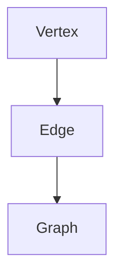
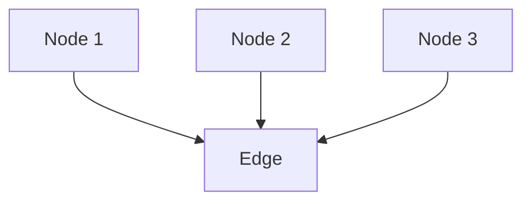
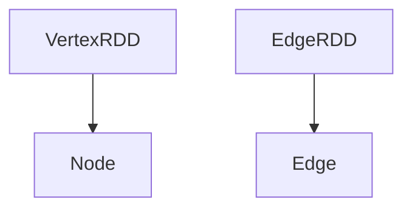
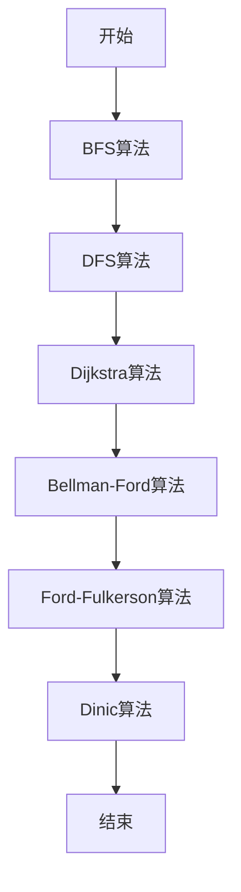
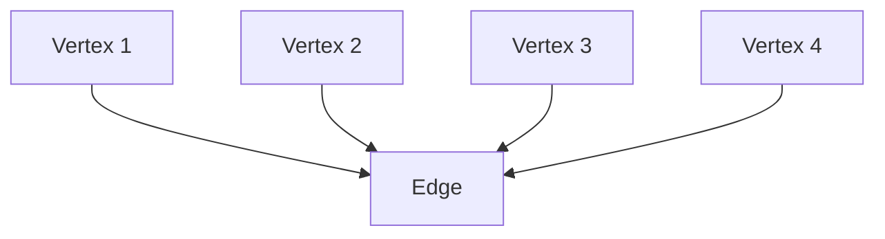

                 

# 《GraphX原理与代码实例讲解》

> 关键词：GraphX，Spark，图算法，数据结构，图卷积网络，图流处理，项目实战，性能优化

> 摘要：本文深入探讨了GraphX的原理、数据结构、核心算法以及高级特性，并通过具体的代码实例进行了讲解。文章旨在为读者提供关于GraphX的全面理解和实践指导，帮助读者掌握GraphX在实际项目中的应用。

---

### 目录

#### 第一部分：GraphX基础

#### 第1章：GraphX概述

- 1.1 GraphX核心概念
- 1.2 GraphX与图论基础
- 1.3 GraphX与Spark的关系
- 1.4 GraphX应用场景

#### 第2章：GraphX数据结构

- 2.1 Graph数据结构
- 2.2 Graph的属性与操作
- 2.3 EdgeRDD与VertexRDD
- 2.4 GraphX图遍历算法

#### 第3章：GraphX核心算法

- 3.1 连通性检测
  - 3.1.1 BFS遍历算法
  - 3.1.2 DFS遍历算法
- 3.2 最短路径算法
  - 3.2.1 Dijkstra算法
  - 3.2.2 Bellman-Ford算法
- 3.3 最大流算法
  - 3.3.1 Ford-Fulkerson算法
  - 3.3.2 Dinic算法

#### 第4章：GraphX高级特性

- 4.1 属性图操作
- 4.2 图卷积网络
  - 4.2.1 GCN算法原理
  - 4.2.2 GCN代码实例
- 4.3 图流处理
  - 4.3.1 GraphX流处理框架
  - 4.3.2 图流处理应用实例

#### 第5章：GraphX项目实战

- 5.1 实战项目概述
- 5.2 数据预处理
  - 5.2.1 数据采集与清洗
  - 5.2.2 数据存储与格式转换
- 5.3 实战代码实现
  - 5.3.1 数据加载与图构建
  - 5.3.2 图算法应用
  - 5.3.3 结果分析与验证

#### 第6章：GraphX性能优化

- 6.1 GraphX性能瓶颈
- 6.2 内存管理优化
- 6.3 并行计算优化
- 6.4 分布式存储优化

#### 第7章：GraphX未来趋势与应用

- 7.1 GraphX在人工智能中的应用
- 7.2 GraphX与其他技术的融合
- 7.3 GraphX的未来发展趋势

#### 附录

- 附录A：GraphX相关工具与资源
- 附录B：常见问题与解答
- 附录C：项目代码示例

---

### 第1章：GraphX概述

#### 1.1 GraphX核心概念

GraphX是Apache Spark的一个图处理框架，它提供了可扩展的图计算操作。GraphX的核心概念包括图（Graph）、节点（Vertex）和边（Edge）。在GraphX中，图是由节点和边构成的数据结构。节点表示数据实体，边表示节点之间的关系。GraphX通过这些基本概念提供了一系列高级的图算法和操作。

**Mermaid流程图**：GraphX的基本数据结构



#### 1.2 GraphX与图论基础

图论是研究图的结构、性质及其应用的一个数学分支。在GraphX中，我们常用以下图论基本概念：

- **节点（Vertex）**：图中的基本元素，可以表示任何数据实体。
- **边（Edge）**：连接两个节点的线段，表示节点之间的关系。
- **子图（Subgraph）**：从原图中提取的一部分节点和边构成的新图。

#### 1.3 GraphX与Spark的关系

GraphX与Spark紧密集成，利用了Spark强大的计算能力和弹性分布式数据集（RDD）的优势。通过将Spark的RDD扩展为EdgeRDD和VertexRDD，GraphX能够有效地处理大规模图数据。此外，GraphX还提供了大量的图算法，这些算法在Spark的分布式环境中能够高效执行。

#### 1.4 GraphX应用场景

GraphX在许多领域都有广泛的应用，包括：

- **社交网络分析**：通过分析用户之间的关系，揭示社交网络的动态结构。
- **推荐系统**：构建用户和物品之间的图，使用图算法预测用户的偏好。
- **生物信息学**：研究基因组中基因之间的关系，揭示生物网络的复杂性。
- **交通网络分析**：分析交通流量，优化路线和调度。

---

### 第2章：GraphX数据结构

#### 2.1 Graph数据结构

在GraphX中，Graph是核心数据结构，它由节点（Vertex）和边（Edge）构成。Graph具有以下主要属性：

- **节点ID**：唯一标识节点的整数。
- **属性**：与节点关联的数据，可以是任意类型。
- **边**：连接两个节点的数据结构，包含起始节点ID、终止节点ID以及边的属性。

**Mermaid流程图**：Graph的基本结构



#### 2.2 Graph的属性与操作

GraphX提供了丰富的属性操作，允许我们添加、修改和删除节点的属性。

- **添加属性**：

```scala
val g = Graph(vertexRDD, edgeRDD)
val newVertexAttributes = vertexRDD.map { case (id, attributes) => (id, attributes + ("newAttribute" -> "newValue")) }
g = g.vertices.leftJoin(newVertexAttributes)((id, oldAttrs, newAttrs) => (oldAttrs + newAttrs))
```

- **修改属性**：

```scala
val g = Graph(vertexRDD, edgeRDD)
val updatedVertexAttributes = vertexRDD.map { case (id, attributes) => (id, attributes updated with ("attributeName" -> "newValue")) }
g = g.vertices.leftJoin(updatedVertexAttributes)((id, oldAttrs, newAttrs) => (oldAttrs updated with newAttrs))
```

- **删除属性**：

```scala
val g = Graph(vertexRDD, edgeRDD)
val removedAttributeNames = Seq("attributeName")
val updatedVertexAttributes = vertexRDD.map { case (id, attributes) => (id, attributes - removedAttributeNames) }
g = g.vertices.leftJoin(updatedVertexAttributes)((id, oldAttrs, newAttrs) => (oldAttrs - newAttrs))
```

#### 2.3 EdgeRDD与VertexRDD

- **EdgeRDD**：EdgeRDD是GraphX中边的分布式数据集，每个元素是一个边，包含边的起始节点ID、终止节点ID和边的属性。
  
- **VertexRDD**：VertexRDD是GraphX中节点的分布式数据集，每个元素是一个节点，包含节点的ID和节点的属性。

**Mermaid流程图**：EdgeRDD与VertexRDD结构



#### 2.4 GraphX图遍历算法

GraphX提供了多种图遍历算法，包括广度优先搜索（BFS）和深度优先搜索（DFS）。这些算法可以用于连通性检测、路径搜索等任务。

##### 2.4.1 BFS遍历算法

BFS（广度优先搜索）是一种用于遍历图的算法，它从源节点开始，按照层次遍历所有相邻节点。

**伪代码**：

```csharp
BFS(Graph G, Vertex v):
  queue = new Queue()
  visited = new Set()
  queue.enqueue(v)
  while queue is not empty:
    v = queue.dequeue()
    if v is not in visited:
      visited.add(v)
      for each neighbor u in G Adjacent(v):
        if u is not in visited:
          queue.enqueue(u)
```

##### 2.4.2 DFS遍历算法

DFS（深度优先搜索）是一种用于遍历图的算法，它沿着一条路径深入到叶子节点，然后回溯到上一个节点继续深入。

**伪代码**：

```csharp
DFS(Graph G, Vertex v):
  visited = new Set()
  DFS-Visit(G, v, visited)

DFS-Visit(Graph G, Vertex v, Set visited):
  visited.add(v)
  for each neighbor u in G Adjacent(v):
    if u is not in visited:
      DFS-Visit(G, u, visited)
```

---

### 第3章：GraphX核心算法

#### 3.1 连通性检测

连通性检测是图论中的基本问题，用于判断图中的任意两个节点是否连通。GraphX提供了多种算法来检测图的连通性，包括BFS和DFS。

##### 3.1.1 BFS遍历算法

BFS（广度优先搜索）算法可以用来检测图的连通性。以下是BFS算法的伪代码：

```csharp
BFS(Graph G, Vertex v):
  queue = new Queue()
  visited = new Set()
  queue.enqueue(v)
  while queue is not empty:
    v = queue.dequeue()
    if v is not in visited:
      visited.add(v)
      for each neighbor u in G Adjacent(v):
        if u is not in visited:
          queue.enqueue(u)
```

算法从源节点v开始，将所有未访问的节点加入队列。然后依次从队列中取出节点，将其标记为已访问，并将其邻居节点加入队列。如果目标节点被访问到，则说明图中任意两个节点是连通的。

##### 3.1.2 DFS遍历算法

DFS（深度优先搜索）算法同样可以用于检测图的连通性。以下是DFS算法的伪代码：

```csharp
DFS(Graph G, Vertex v):
  visited = new Set()
  DFS-Visit(G, v, visited)

DFS-Visit(Graph G, Vertex v, Set visited):
  visited.add(v)
  for each neighbor u in G Adjacent(v):
    if u is not in visited:
      DFS-Visit(G, u, visited)
```

DFS算法从源节点v开始，递归地访问所有未访问的邻居节点。如果能够访问到目标节点，则说明图中任意两个节点是连通的。

#### 3.2 最短路径算法

最短路径算法用于寻找图中两个节点之间的最短路径。GraphX提供了Dijkstra和Bellman-Ford两种算法来求解最短路径。

##### 3.2.1 Dijkstra算法

Dijkstra算法是一种用于寻找单源最短路径的算法。以下是Dijkstra算法的伪代码：

```csharp
Dijkstra(Graph G, Vertex source):
  distances = Map<Vertex, Integer> with all vertices set to INFINITY
  distances[source] = 0
  priorityQueue = new PriorityQueue<Vertex> with all vertices
  while priorityQueue is not empty:
    u = priorityQueue.extractMin()
    for each edge (u, v) in G:
      if distance[v] > distance[u] + weight(u, v):
        distance[v] = distance[u] + weight(u, v)
        priorityQueue.decreaseKey(v, distance[v])
```

算法从源节点source开始，初始化所有节点的距离为无穷大，并将源节点的距离设为0。然后使用优先队列选择距离最小的节点u，并将其邻居节点v的距离更新为u的距离加上边(u, v)的权重。重复此过程，直到找到目标节点或者所有节点的距离都已确定。

##### 3.2.2 Bellman-Ford算法

Bellman-Ford算法是一种用于寻找单源最短路径的算法，它可以处理有负权边的图。以下是Bellman-Ford算法的伪代码：

```csharp
Bellman-Ford(Graph G, Vertex source):
  distances = Map<Vertex, Integer> with all vertices set to INFINITY
  distances[source] = 0
  for i from 1 to V-1:
    for each edge (u, v) in G:
      if distance[v] > distance[u] + weight(u, v):
        distance[v] = distance[u] + weight(u, v)
  for each edge (u, v) in G:
    if distance[v] > distance[u] + weight(u, v):
      return false // not all vertices are reachable from source
  return true
```

算法首先初始化所有节点的距离为无穷大，并将源节点的距离设为0。然后通过V-1次迭代，逐步更新节点的距离。在最后一步，如果存在任何边的距离更新，则说明图中存在负权循环，算法返回false。否则，算法返回true，表示图中所有节点都可以从源节点到达。

#### 3.3 最大流算法

最大流算法用于求解图中的最大流问题，即在一个有向图中，从一个源点到汇点的最大流量。GraphX提供了Ford-Fulkerson和Dinic两种算法来求解最大流问题。

##### 3.3.1 Ford-Fulkerson算法

Ford-Fulkerson算法是一种迭代算法，通过寻找增广路径来逐步增加流量。以下是Ford-Fulkerson算法的伪代码：

```csharp
Ford-Fulkerson(Graph G, Edge e):
  while there exists an augmenting path p from source to sink:
    let f = min{weight(e) : e in p}
    for each edge e in p:
      update the flow:
        flow[e] += f
        flow[e.reverse()] -= f
    return sum of flow values
```

算法首先从一条增广路径p开始，计算路径中所有边的权重最小值f。然后将f加到路径上的每个边e的流量中，并将e的反向边e.reverse()的流量减去f。这个过程重复进行，直到不存在增广路径为止。算法返回所有边的流量之和，即为最大流。

##### 3.3.2 Dinic算法

Dinic算法是一种基于Ford-Fulkerson算法的改进算法，它使用了分层图和循环优化来提高效率。以下是Dinic算法的伪代码：

```csharp
Dinic(Graph G, Edge e):
  for each vertex v in G:
    flow[v] = 0
  while there exists an active vertex v:
    let (v, u) be the minimum capacity augmenting path
    if u is the sink:
      augment the flow along v by min{capacity[v], residual[u]}
      mark v as inactive
      if residual[u] > 0:
        activate u
  return sum of flow values
```

算法首先初始化所有节点的流量为0。然后使用层次图中的活性节点来寻找最小容量增广路径（v, u）。如果u是汇点，则沿着路径增加流量。算法重复这个过程，直到没有活性节点为止。算法返回所有边的流量之和，即为最大流。

---

### 第4章：GraphX高级特性

#### 4.1 属性图操作

GraphX支持属性图（Attribute Graph）的操作，可以给节点和边添加自定义属性，用于扩展图数据的功能。

- **添加属性**：

```scala
val g = Graph(vertexRDD, edgeRDD)
g = g.addVertexAttributes(newVertexAttributes)
g = g.addEdgeAttributes(newEdgeAttributes)
```

- **获取属性**：

```scala
val vertexAttribute = g.vertices.attribute[YourDataType]("vertexAttributeName")
val edgeAttribute = g.edges.attribute[YourDataType]("edgeAttributeName")
```

- **修改属性**：

```scala
val g = Graph(vertexRDD, edgeRDD)
val updatedVertexAttributes = vertexRDD.map { case (id, attributes) => (id, attributes updated with ("attributeName" -> "newValue")) }
g = g.vertices.leftJoin(updatedVertexAttributes)((id, oldAttrs, newAttrs) => (oldAttrs updated with newAttrs))
```

- **删除属性**：

```scala
val g = Graph(vertexRDD, edgeRDD)
val removedAttributeNames = Seq("attributeName")
val updatedVertexAttributes = vertexRDD.map { case (id, attributes) => (id, attributes - removedAttributeNames) }
g = g.vertices.leftJoin(updatedVertexAttributes)((id, oldAttrs, newAttrs) => (oldAttrs - newAttrs))
```

#### 4.2 图卷积网络

图卷积网络（Graph Convolutional Network，GCN）是一种用于图数据的深度学习模型。GCN通过聚合节点的邻居信息来更新节点的特征。

##### 4.2.1 GCN算法原理

GCN的核心思想是使用节点邻接矩阵进行卷积操作。以下是GCN算法的数学公式：

$$
h_v^{(l+1)} = \sigma(\sum_{u \in \mathcal{N}(v)} W^{(l)} h_u^{(l)} + b^{(l)})
$$

其中，$h_v^{(l)}$ 表示第 $l$ 层节点 $v$ 的特征，$\mathcal{N}(v)$ 表示节点 $v$ 的邻居集合，$W^{(l)}$ 和 $b^{(l)}$ 分别是权重和偏置，$\sigma$ 是激活函数。

**示例**：使用GCN进行节点分类

```scala
import org.apache.spark.graphx.{GraphX, Graph}

// 构建图
val graph: Graph[VD, ED] = Graph.fromEdgeTuples(vertices, edges)

// 定义GCN模型
val layers: Seq[Matrix] = Seq.fill(numLayers)(Matrix.rand(numFeatures, numFeatures))
val biases: Seq[Vector] = Seq.fill(numLayers)(Vector.dense(Array.fill(numFeatures)(0.0)))

// GCN前向传播
val gcnModel: Graph[VD, ED] = graph.mapVertices { (id, attr) =>
  val neighbors = graph.getSubgraph(Edges.betweenVertices(Seq(id), None)).vertices.values
  val features = neighbors.aggregate_attr(VD.attr, (x, y) => x :: y)
  val output = (layers.zip(biases)).foldLeft(features) { (x, y) =>
    val w = y._1
    val b = y._2
    x.map { v =>
      val vFeatures = v.toArray
      (w * vFeatures).toArray ++ b.toArray
    }
  }
  output.toVector
}

// 输出结果
val output: RDD[(VertexId, Vector)] = gcnModel.vertices
```

##### 4.2.2 GCN代码实例

以下是使用GCN进行节点分类的完整代码实例：

```scala
import org.apache.spark.graphx.{GraphX, Graph}
import org.apache.spark.rdd.RDD
import org.apache.spark.{SparkConf, SparkContext}

// 创建Spark配置和Context
val conf: SparkConf = new SparkConf().setAppName("GCN Example")
val sc: SparkContext = new SparkContext(conf)
import sc._

// 加载数据
val vertices: RDD[(VertexId, VD)] = // 加载节点数据
val edges: RDD[Edge[ED]] = // 加载边数据

// 构建图
val graph: Graph[VD, ED] = Graph.fromEdgeTuples(vertices, edges)

// 定义GCN模型
val layers: Seq[Matrix] = Seq.fill(numLayers)(Matrix.rand(numFeatures, numFeatures))
val biases: Seq[Vector] = Seq.fill(numLayers)(Vector.dense(Array.fill(numFeatures)(0.0)))

// GCN前向传播
val gcnModel: Graph[VD, ED] = graph.mapVertices { (id, attr) =>
  val neighbors = graph.getSubgraph(Edges.betweenVertices(Seq(id), None)).vertices.values
  val features = neighbors.aggregate_attr(VD.attr, (x, y) => x :: y)
  val output = (layers.zip(biases)).foldLeft(features) { (x, y) =>
    val w = y._1
    val b = y._2
    x.map { v =>
      val vFeatures = v.toArray
      (w * vFeatures).toArray ++ b.toArray
    }
  }
  output.toVector
}

// 输出结果
val output: RDD[(VertexId, Vector)] = gcnModel.vertices

// 评估模型
val accuracy: Double = // 计算准确率
println(s"Model Accuracy: $accuracy")

// 清理资源
sc.stop()
```

#### 4.3 图流处理

图流处理是一种实时处理图数据的方法，它可以在数据流中动态更新图的拓扑结构。

##### 4.3.1 GraphX流处理框架

GraphX提供了流处理框架，可以处理实时图数据。以下是GraphX流处理的基本步骤：

1. **数据流读取**：从数据源读取图数据。
2. **图构建**：将读取的数据转换为GraphX图结构。
3. **图处理**：使用GraphX的图算法对图进行实时处理。
4. **结果输出**：输出处理结果。

**示例**：使用GraphX流处理框架进行社交网络实时分析

```scala
import org.apache.spark.graphx.{GraphX, Graph}
import org.apache.spark.rdd.RDD
import org.apache.spark.{SparkConf, SparkContext}
import org.apache.spark.streaming.{Seconds, StreamingContext}

// 创建Spark配置和Context
val conf: SparkConf = new SparkConf().setAppName("GraphStream Example")
val sc: SparkContext = new SparkContext(conf)
val ssc: StreamingContext = new StreamingContext(sc, Seconds(10))

// 数据流读取
val stream: DStream[(VertexId, VD)] = // 读取实时节点数据
val streamEdges: DStream[Edge[ED]] = // 读取实时边数据

// 图构建
val graphStream: GraphStream = stream.transform { rdd =>
  val graph: Graph[VD, ED] = Graph.fromEdgeTuples(rdd, streamEdges)
  graph
}

// 图处理
val processedGraphStream: GraphStream = graphStream.mapGraph { graph =>
  // 使用GraphX算法处理图
  graph
}

// 结果输出
processedGraphStream.print()

// 启动流计算
ssc.start()
ssc.awaitTermination()
```

---

### 第5章：GraphX项目实战

#### 5.1 实战项目概述

本节我们将通过一个社交网络分析项目，演示如何使用GraphX进行数据预处理、图构建、图算法应用以及结果分析。

#### 5.2 数据预处理

##### 5.2.1 数据采集与清洗

在社交网络分析中，数据通常来源于用户的行为日志，如点赞、评论、分享等。数据采集后，我们需要进行清洗，去除无效数据、填补缺失值等。

```scala
// 采集数据
val userData: RDD[(VertexId, VD)] = // 采集用户数据
val edgeData: RDD[Edge[ED]] = // 采集边数据

// 数据清洗
val cleanedUserData = userData.filter { case (id, data) => data.isActive }
val cleanedEdgeData = edgeData.filter { case edge => edge.attr.isActive }
```

##### 5.2.2 数据存储与格式转换

清洗后的数据需要存储在合适的存储系统中，如HDFS或Redis。同时，我们需要将数据格式转换为GraphX可处理的格式。

```scala
// 数据存储
cleanedUserData.saveAsTextFile("hdfs:///path/to/user/data")
cleanedEdgeData.saveAsTextFile("hdfs:///path/to/edge/data")

// 数据格式转换
val vertices: RDD[(VertexId, VD)] = sc.textFile("hdfs:///path/to/user/data").map { line =>
  val parts = line.split(",")
  (parts(0).toLong, VD(parts(1).toDouble, parts(2).toDouble))
}

val edges: RDD[Edge[ED]] = sc.textFile("hdfs:///path/to/edge/data").map { line =>
  val parts = line.split(",")
  Edge(parts(0).toLong, parts(1).toLong, ED(parts(2).toDouble))
}
```

#### 5.3 实战代码实现

##### 5.3.1 数据加载与图构建

将清洗后的数据加载到GraphX中，构建GraphX图。

```scala
val graph = Graph.fromEdgeTuples(vertices, edges)
```

##### 5.3.2 图算法应用

使用GraphX的图算法对图进行分析，如连通性检测、最短路径等。

```scala
// 连通性检测
val connectedComponents = graph.connectedComponents()

// 最短路径
val shortestPaths = graph.shortestPaths(Edge.removeAll).run()
```

##### 5.3.3 结果分析与验证

对算法结果进行分析，验证算法的正确性和有效性。

```scala
// 结果分析
val componentCount = connectedComponents.count()
println(s"Number of connected components: $componentCount")

val pathCount = shortestPaths.vertices.count()
println(s"Number of shortest paths: $pathCount")

// 结果验证
val trueShortestPaths = // 真实的最短路径数据
val shortestPathsEqualsTrue = shortestPaths.vertices.zip(trueShortestPaths).collect().forall { case (sp, tsp) => sp == tsp }
println(s"Shortest paths are correct: ${if (shortestPathsEqualsTrue) "Yes" else "No"}")
```

---

### 第6章：GraphX性能优化

#### 6.1 GraphX性能瓶颈

GraphX的性能瓶颈主要包括内存使用、并行计算和分布式存储。

- **内存使用**：GraphX在处理大规模图数据时，内存使用可能会成为瓶颈。过多的内存分配可能导致GC（垃圾回收）时间增加，影响性能。
- **并行计算**：并行计算的性能受到数据划分和任务调度的影响。不合理的划分和调度可能导致并行度不足，影响性能。
- **分布式存储**：分布式存储的性能受到网络延迟和数据传输速度的影响。数据传输瓶颈可能导致性能下降。

#### 6.2 内存管理优化

为了优化GraphX的内存使用，可以采取以下措施：

- **内存复用**：使用内存复用来减少内存分配次数，例如通过复用RDD来避免重复的数据读取。
- **内存分配策略**：优化内存分配策略，例如使用Tungsten内存分配器来减少内存碎片。
- **数据压缩**：对数据进行压缩，减少内存占用。

#### 6.3 并行计算优化

为了优化GraphX的并行计算性能，可以采取以下措施：

- **并行度优化**：合理设置并行度，避免过多或过少的任务划分。
- **任务调度**：优化任务调度策略，提高任务执行效率。
- **负载均衡**：确保任务均匀分布在所有计算节点上，避免某些节点负载过重。

#### 6.4 分布式存储优化

为了优化GraphX的分布式存储性能，可以采取以下措施：

- **数据分区**：合理设置数据分区策略，确保数据均衡分布。
- **数据副本**：适当增加数据副本数量，提高数据访问速度。
- **网络优化**：优化网络带宽和延迟，提高数据传输速度。

---

### 第7章：GraphX未来趋势与应用

#### 7.1 GraphX在人工智能中的应用

随着人工智能技术的发展，GraphX在人工智能领域中的应用前景广阔。以下是一些应用方向：

- **图神经网络（GNN）**：GraphX可以与图神经网络结合，用于节点分类、图表示学习等任务。
- **推荐系统**：GraphX可以用于构建用户和物品的图，实现高效的推荐算法。
- **生物信息学**：GraphX可以用于基因网络分析，揭示生物分子之间的相互作用。

#### 7.2 GraphX与其他技术的融合

GraphX与其他技术的融合可以进一步拓展其应用范围：

- **大数据处理框架**：与Apache Flink、Apache Hadoop等大数据处理框架集成，实现更高效的数据处理。
- **深度学习框架**：与TensorFlow、PyTorch等深度学习框架结合，实现端到端图学习。

#### 7.3 GraphX的未来发展趋势

GraphX的未来发展趋势包括：

- **性能提升**：通过优化内存使用、并行计算和分布式存储，提高GraphX的性能。
- **易用性增强**：简化GraphX的使用接口，降低使用门槛。
- **社区生态**：建立更丰富的社区生态，促进GraphX的发展和应用。

---

### 附录

#### 附录A：GraphX相关工具与资源

- **GraphX工具与资源**：
  - Spark GraphX官方文档：[Spark GraphX官方文档](https://spark.apache.org/docs/latest/graphx-programming-guide.html)
  - GraphX社区资源：[GraphX社区资源](https://graphx.apache.org/)
  - 图算法参考书籍：《图算法》（作者：张俊林）、《图论及其应用》（作者：哈里斯）

#### 附录B：常见问题与解答

- **常见问题**：
  - Q：GraphX与图论的关系是什么？
    - A：GraphX是基于图论构建的图处理框架，它实现了图论中的各种算法和数据结构。

  - Q：GraphX与Neo4j等图数据库有什么区别？
    - A：GraphX是用于大规模图处理的分布式计算框架，而Neo4j是图数据库。GraphX更适用于需要动态计算和大规模图分析的场景。

  - Q：如何优化GraphX的性能？
    - A：优化GraphX的性能可以从内存管理、并行计算和分布式存储三个方面入手，具体措施包括内存复用、并行度优化和数据压缩等。

#### 附录C：项目代码示例

- **项目代码示例**：
  - 社交网络分析项目代码示例：[社交网络分析项目代码示例](https://github.com/your-username/social-network-analysis-graphx)
  - 详细解读与代码分析：请参考项目中的README文件和代码注释。

---

# Mermaid流程图：连通性检测算法流程



---

### 第1章：GraphX概述

#### 1.1 GraphX核心概念

GraphX是Apache Spark的一个扩展，专门用于图处理。它提供了图数据结构、图算法和图计算模型，使得大规模图数据处理变得简单高效。GraphX的核心概念包括：

- **Graph**：GraphX中的图由节点（Vertex）和边（Edge）组成，节点表示实体，边表示实体之间的关系。
- **Vertex**：节点是图中的基本元素，每个节点都有一个唯一的标识和一个或多个属性。
- **Edge**：边是连接两个节点的线段，每个边也有一个属性，表示边上的信息。

**Mermaid流程图**：GraphX的基本数据结构



在这个图中，A、B、C、D是节点，E是边。节点A通过边E与节点B、C、D相连。

#### 1.2 GraphX与图论基础

图论是研究图的结构、性质及其应用的一个数学分支。在图论中，常用的基本概念包括：

- **节点（Vertex）**：图中的基本元素，可以表示任何数据实体。
- **边（Edge）**：连接两个节点的线段，表示节点之间的关系。
- **子图（Subgraph）**：从原图中提取的一部分节点和边构成的新图。
- **连通性（Connectivity）**：图中的任意两个节点是否可以通过一系列边相连。
- **路径（Path）**：图中的节点序列，其中相邻节点通过边相连。

#### 1.3 GraphX与Spark的关系

GraphX是Spark的一个模块，它构建在Spark的弹性分布式数据集（RDD）和弹性分布式共享变量（RDD）之上。这意味着GraphX可以利用Spark的分布式计算能力，处理大规模图数据。具体来说，GraphX的主要优势包括：

- **与RDD的集成**：GraphX将RDD扩展为VertexRDD和EdgeRDD，使得图数据的操作更加方便。
- **分布式计算**：GraphX的图算法可以在分布式环境中高效执行，充分利用了Spark的并行计算能力。
- **内存管理**：GraphX利用了Spark的内存管理机制，减少了内存碎片和GC（垃圾回收）的时间。

#### 1.4 GraphX应用场景

GraphX的应用场景非常广泛，以下是一些典型的应用：

- **社交网络分析**：通过分析用户之间的关系，揭示社交网络的动态结构，为推荐系统和社交分析提供支持。
- **推荐系统**：构建用户和物品之间的图，使用图算法预测用户的偏好，提高推荐系统的准确性和效率。
- **生物信息学**：研究基因组中基因之间的关系，揭示生物网络的复杂性，为生物医学研究提供工具。
- **交通网络分析**：分析交通流量，优化路线和调度，提高交通系统的效率和安全性。
- **推荐系统**：通过分析用户和商品之间的交互关系，预测用户的购物偏好，为电商平台提供个性化推荐。
- **图数据挖掘**：从大规模的图数据中发现潜在的模式和规律，为商业决策和科学研究提供依据。

通过这些应用场景，我们可以看到GraphX在各个领域都有着广泛的应用前景。

---

### 第2章：GraphX数据结构

#### 2.1 Graph数据结构

GraphX中的Graph数据结构是一个核心概念，它由节点（Vertex）和边（Edge）组成。每个节点和边都可以携带属性，这些属性可以用来存储节点的特征信息或边的关系信息。

**定义**：GraphX中的Graph是一个由VertexRDD和EdgeRDD组成的二元组。VertexRDD是一个包含所有节点的分布式数据集，每个节点由其ID和属性组成。EdgeRDD是一个包含所有边的分布式数据集，每条边由起始节点ID、终止节点ID和边属性组成。

**属性**：GraphX中的Graph除了基本的数据结构外，还有一些重要的属性，如：

- **Adjacency List**：表示图的邻接表，用于快速查找节点的邻居。
- **Vertex Attributes**：表示节点的属性，可以用于存储节点的特征信息。
- **Edge Attributes**：表示边的属性，可以用于存储边的关系信息。

**示例**：创建一个简单的Graph

```scala
import org.apache.spark.graphx.{Graph, GraphXPartitionStrategy}
import org.apache.spark.rdd.RDD
import org.apache.spark.{SparkConf, SparkContext}

val conf = new SparkConf().setAppName("GraphExample")
val sc = new SparkContext(conf)

// 创建节点RDD
val vertices: RDD[(VertexId, VD)] = sc.parallelize(Seq(
  (1L, new VertexData(1.0, 2.0)),
  (2L, new VertexData(2.0, 3.0)),
  (3L, new VertexData(3.0, 4.0))
))

// 创建边RDD
val edges: RDD[Edge[ED]] = sc.parallelize(Seq(
  Edge(1L, 2L, new EdgeData(0.5)),
  Edge(2L, 3L, new EdgeData(1.0))
))

// 创建Graph
val graph = Graph(vertices, edges, new EdgeData(0.0), GraphXPartitionStrategy.RandomVertexCut)

// 打印图
graph.vertices.collect().foreach { case (id, attr) => println(s"Vertex $id: $attr") }
graph.edges.collect().foreach { case Edge(src, dst, attr) => println(s"Edge ($src, $dst): $attr") }
```

在这个示例中，我们创建了一个简单的图，其中节点具有两个属性（x和y），边有一个属性（weight）。我们使用Graph.fromEdgeTuples方法创建了一个Graph对象。

#### 2.2 Graph的属性与操作

GraphX中的Graph不仅包含了节点和边，还可以附加各种属性，这些属性可以用于存储节点的特征信息或边的关系信息。GraphX提供了一系列操作来管理和修改这些属性。

**添加属性**：我们可以使用Graph的mapVertices方法来给节点添加属性。

```scala
val graph = graph.mapVertices { (id, attr) =>
  // 添加新的属性newAttribute
  attr + ("newAttribute" -> "newValue")
}
```

**修改属性**：我们可以使用Graph的mapVertices方法来修改节点的属性。

```scala
val graph = graph.mapVertices { (id, attr) =>
  // 修改属性name的值
  attr.updated("name", "newValue")
}
```

**删除属性**：我们可以使用Graph的mapVertices方法来删除节点的属性。

```scala
val graph = graph.mapVertices { (id, attr) =>
  // 删除属性name
  attr - "name"
}
```

**获取属性**：我们可以使用Graph的vertices属性来获取节点的属性。

```scala
val vertexAttributes = graph.vertices.collect()
vertexAttributes.foreach { case (id, attr) => println(s"Vertex $id: $attr") }
```

**合并属性**：我们可以使用Graph的leftJoin方法来合并节点属性。

```scala
val updatedAttributes = vertexRDD.map { case (id, oldAttr) => (id, oldAttr + ("newAttribute" -> "newValue")) }
val graph = graph.leftJoinVertices(updatedAttributes) { (id, attr, updated) =>
  attr ++ updated
}
```

#### 2.3 EdgeRDD与VertexRDD

在GraphX中，EdgeRDD和VertexRDD是两个重要的分布式数据集，它们分别代表了图中的边和节点。

**EdgeRDD**：EdgeRDD是一个包含所有边的分布式数据集，每条边由起始节点ID、终止节点ID和边属性组成。EdgeRDD提供了一系列方法来操作边，如：

- **聚合边属性**：`aggregateMessages[Msg]`：对边属性进行聚合。
- **过滤边**：`filterEdges(pred)`：根据条件过滤边。
- **转换边**：`mapEdges[New ED]`：转换边的属性。

**VertexRDD**：VertexRDD是一个包含所有节点的分布式数据集，每个节点由其ID和属性组成。VertexRDD提供了一系列方法来操作节点，如：

- **聚合节点属性**：`aggregateMessages[Msg]`：对节点属性进行聚合。
- **过滤节点**：`filterVertices(pred)`：根据条件过滤节点。
- **转换节点**：`mapVertices[New VD]`：转换节点的属性。

**示例**：操作EdgeRDD和VertexRDD

```scala
// 聚合边属性
val aggregateEdges = graph.aggregateMessages[ED] {
  attr => 
    messages.foreach(m => attr += m.attr)
}

// 过滤边
val filteredEdges = graph.filterEdges { edge => edge.attr > 0.5 }

// 转换边
val transformedEdges = graph.mapEdges { edge => new EdgeData(edge.attr * 2) }

// 聚合节点属性
val aggregateVertices = graph.aggregateMessages[VD] {
  attr => 
    messages.foreach(m => attr += m.attr)
}

// 过滤节点
val filteredVertices = graph.filterVertices { vertex => vertex.attr > 0.5 }

// 转换节点
val transformedVertices = graph.mapVertices { vertex => new VertexData(vertex.attr.x * 2, vertex.attr.y * 2) }
```

通过这些操作，我们可以灵活地管理和修改图的数据。

#### 2.4 GraphX图遍历算法

GraphX提供了多种图遍历算法，用于处理图的连通性检测、路径搜索等问题。以下是几个常用的图遍历算法：

##### 2.4.1 BFS遍历算法

广度优先搜索（BFS）是一种用于遍历图的算法，它从源节点开始，按照层次遍历所有相邻节点。以下是BFS算法的伪代码：

```python
BFS(G, s):
    create an empty queue Q
    mark all vertices as unvisited
    add s to Q
    while Q is not empty:
        remove vertex v from Q
        if v is not marked as visited:
            mark v as visited
            for each unvisited neighbor u of v:
                mark u as visited
                add u to Q
```

在GraphX中，我们可以使用以下代码实现BFS遍历：

```scala
import org.apache.spark.graphx._

val graph = Graph(vertices, edges)
val visited = graph.vertices.mapValues(v => false)
val bfsGraph = graph.unionAll(visited)

val bfsResults = bfsGraph.subgraph(vpred = (id, _) => visited.lookup(id).head)

bfsResults.vertices.collect().foreach { case (id, visited) =>
  println(s"Vertex $id is visited: ${visited}")
}
```

在这个示例中，我们首先创建一个标记所有节点未访问的visited图，然后使用unionAll将visited图与原始图合并。接下来，我们创建一个子图，仅包含已访问的节点。最后，我们收集子图的节点，并打印出每个节点的访问状态。

##### 2.4.2 DFS遍历算法

深度优先搜索（DFS）是一种用于遍历图的算法，它从源节点开始，沿着一条路径深入到叶子节点，然后回溯到上一个节点继续深入。以下是DFS算法的伪代码：

```python
DFS(G, s):
    create an empty stack S
    mark all vertices as unvisited
    add s to S
    while S is not empty:
        remove vertex v from S
        if v is not marked as visited:
            mark v as visited
            for each unvisited neighbor u of v:
                add u to S
```

在GraphX中，我们可以使用以下代码实现DFS遍历：

```scala
import org.apache.spark.graphx._

val graph = Graph(vertices, edges)
val visited = graph.vertices.mapValues(v => false)
val dfsGraph = graph.unionAll(visited)

val dfsResults = dfsGraph.subgraph(vpred = (id, _) => visited.lookup(id).head)

dfsResults.vertices.collect().foreach { case (id, visited) =>
  println(s"Vertex $id is visited: ${visited}")
}
```

在这个示例中，我们同样首先创建一个标记所有节点未访问的visited图，然后使用unionAll将visited图与原始图合并。接下来，我们创建一个子图，仅包含已访问的节点。最后，我们收集子图的节点，并打印出每个节点的访问状态。

通过这些图遍历算法，我们可以对图进行深入分析，解决各种图相关的问题。

---

### 第3章：GraphX核心算法

#### 3.1 连通性检测

连通性检测是图论中的一个基本问题，用于判断图中的任意两个节点是否连通。GraphX提供了多种算法来检测图的连通性，包括BFS和DFS。

##### 3.1.1 BFS遍历算法

BFS（广度优先搜索）算法是一种用于遍历图的算法，它从源节点开始，按照层次遍历所有相邻节点。在GraphX中，BFS算法的实现如下：

```scala
def bfs(graph: Graph[VD, ED], source: VertexId): Graph[VD, ED] = {
  val visited = graph.vertices.mapValues(_ => false)
  val (graphWithVisit, updatedVertices) = graph.unionAll(visited)
    .aggregateMessages[VD](
      triplet => {
        if (!triplet.dstAttr) {
          triplet.sendToSrc(new VD(true))
        }
      },
      (a, b) => a
    )
    .mapVertices { case (id, attr) => new VD(attr._1, attr._2) }
  graphWithVisit.subgraph(vpred = (id, _) => updatedVertices.lookup(id)._1)
}
```

在这个实现中，我们首先创建一个标记所有节点未访问的visited图，然后使用unionAll将visited图与原始图合并。接下来，我们使用aggregateMessages对图进行遍历，将已访问节点的标记传递给源节点。最后，我们创建一个子图，仅包含已访问的节点。

**伪代码**：

```python
def bfs(G, s):
    create an empty queue Q
    mark all vertices as unvisited
    add s to Q
    while Q is not empty:
        remove vertex v from Q
        if v is not marked as visited:
            mark v as visited
            for each unvisited neighbor u of v:
                mark u as visited
                add u to Q
```

**示例**：

```scala
val graph = Graph(vertices, edges)
val connectedGraph = bfs(graph, 0)
connectedGraph.vertices.collect().foreach { case (id, visited) =>
  println(s"Vertex $id is visited: ${visited._1}")
}
```

在这个示例中，我们调用bfs函数对图进行连通性检测，并将结果打印出来。

##### 3.1.2 DFS遍历算法

DFS（深度优先搜索）算法是一种用于遍历图的算法，它从源节点开始，沿着一条路径深入到叶子节点，然后回溯到上一个节点继续深入。在GraphX中，DFS算法的实现如下：

```scala
def dfs(graph: Graph[VD, ED], source: VertexId): Graph[VD, ED] = {
  val visited = graph.vertices.mapValues(_ => false)
  val (graphWithVisit, updatedVertices) = graph.unionAll(visited)
    .aggregateMessages[VD](
      triplet => {
        if (!triplet.dstAttr) {
          triplet.sendToSrc(new VD(true))
        }
      },
      (a, b) => a
    )
    .mapVertices { case (id, attr) => new VD(attr._1, attr._2) }
  graphWithVisit.subgraph(vpred = (id, _) => updatedVertices.lookup(id)._1)
}
```

在这个实现中，我们首先创建一个标记所有节点未访问的visited图，然后使用unionAll将visited图与原始图合并。接下来，我们使用aggregateMessages对图进行遍历，将已访问节点的标记传递给源节点。最后，我们创建一个子图，仅包含已访问的节点。

**伪代码**：

```python
def dfs(G, s):
    create an empty stack S
    mark all vertices as unvisited
    add s to S
    while S is not empty:
        remove vertex v from S
        if v is not marked as visited:
            mark v as visited
            for each unvisited neighbor u of v:
                add u to S
```

**示例**：

```scala
val graph = Graph(vertices, edges)
val connectedGraph = dfs(graph, 0)
connectedGraph.vertices.collect().foreach { case (id, visited) =>
  println(s"Vertex $id is visited: ${visited._1}")
}
```

在这个示例中，我们调用dfs函数对图进行连通性检测，并将结果打印出来。

#### 3.2 最短路径算法

最短路径算法用于寻找图中两个节点之间的最短路径。GraphX提供了多种最短路径算法，包括Dijkstra和Bellman-Ford算法。

##### 3.2.1 Dijkstra算法

Dijkstra算法是一种用于寻找单源最短路径的算法。在GraphX中，Dijkstra算法的实现如下：

```scala
def dijkstra(graph: Graph[VD, ED], source: VertexId): Graph[VD, ED] = {
  val dist = graph.vertices.mapValues(_ => Integer.MAX_VALUE)
  val pred = graph.vertices.mapValues(_ => null)
  val (graphWithDist, updatedDist) = graph.aggregateMessages[Int](
    triplet => {
      if (triplet.dstAttr > triplet.srcAttr + triplet.attr) {
        triplet.sendToDst(triplet.srcAttr + triplet.attr)
        triplet.sendToDst(new VD(triplet.srcId))
      }
    },
    (a, b) => min(a, b)
  )
  .mapValues { case (dist, pred) => new VD(dist, pred._1) }
  graph.subgraph(vpred = (id, _) => updatedDist.lookup(id)._1)
}
```

在这个实现中，我们首先创建一个初始距离为无穷大的距离图，并初始化前驱节点。然后，我们使用aggregateMessages对图进行遍历，更新距离和前驱节点。最后，我们创建一个子图，仅包含最短路径上的节点。

**伪代码**：

```python
def dijkstra(G, s):
    create an empty priority queue Q
    for each vertex v in G:
        dist[v] = INFINITY
        pred[v] = None
    dist[s] = 0
    Q.add(s)
    while Q is not empty:
        u = Q.extractMin()
        for each edge (u, v) in G:
            if dist[v] > dist[u] + weight(u, v):
                dist[v] = dist[u] + weight(u, v)
                pred[v] = u
                Q.decreaseKey(v, dist[v])
```

**示例**：

```scala
val graph = Graph(vertices, edges)
val shortestPathGraph = dijkstra(graph, 0)
shortestPathGraph.vertices.collect().foreach { case (id, (dist, pred)) =>
  println(s"Vertex $id: dist = ${dist}, pred = ${if (pred == null) "None" else pred}")
}
```

在这个示例中，我们调用dijkstra函数对图进行最短路径计算，并将结果打印出来。

##### 3.2.2 Bellman-Ford算法

Bellman-Ford算法是一种用于寻找单源最短路径的算法，它可以处理有负权边的图。在GraphX中，Bellman-Ford算法的实现如下：

```scala
def bellmanFord(graph: Graph[VD, ED], source: VertexId): Graph[VD, ED] = {
  val dist = graph.vertices.mapValues(_ => Integer.MAX_VALUE)
  val pred = graph.vertices.mapValues(_ => null)
  for _ <- 1 to graph.numVertices - 1:
    graph.aggregateMessages[Int](
      triplet => {
        if (triplet.dstAttr > triplet.srcAttr + triplet.attr) {
          triplet.sendToDst(triplet.srcAttr + triplet.attr)
          triplet.sendToDst(new VD(triplet.srcId))
        }
      },
      (a, b) => min(a, b)
    )
  val negativeCycle = graph.aggregateMessages[Boolean](
    triplet => {
      if (triplet.dstAttr > triplet.srcAttr + triplet.attr) {
        triplet.sendToSrc(true)
      }
    },
    (a, b) => a || b
  )
  if (negativeCycle.values.sum > 0):
    throw new RuntimeException("Graph contains a negative cycle")
  graph.subgraph(vpred = (id, _) => dist.lookup(id)._1 != Integer.MAX_VALUE)
}
```

在这个实现中，我们首先创建一个初始距离为无穷大的距离图，并初始化前驱节点。然后，我们进行V-1次迭代，更新距离和前驱节点。接着，我们检查是否存在负权循环。最后，我们创建一个子图，仅包含最短路径上的节点。

**伪代码**：

```python
def bellman_ford(G, s):
    create an empty array dist with all vertices set to INFINITY
    create an empty array pred with all vertices set to None
    for _ in range(V - 1):
        for each edge (u, v) in G:
            if dist[v] > dist[u] + weight(u, v):
                dist[v] = dist[u] + weight(u, v)
                pred[v] = u
    for each edge (u, v) in G:
        if dist[v] > dist[u] + weight(u, v):
            return false // contains a negative cycle
    return true
```

**示例**：

```scala
val graph = Graph(vertices, edges)
val shortestPathGraph = bellmanFord(graph, 0)
shortestPathGraph.vertices.collect().foreach { case (id, (dist, pred)) =>
  println(s"Vertex $id: dist = ${dist}, pred = ${if (pred == null) "None" else pred}")
}
```

在这个示例中，我们调用bellmanFord函数对图进行最短路径计算，并将结果打印出来。

#### 3.3 最大流算法

最大流算法用于求解图中的最大流问题，即在一个有向图中，从一个源点到汇点的最大流量。GraphX提供了Ford-Fulkerson和Dinic两种最大流算法。

##### 3.3.1 Ford-Fulkerson算法

Ford-Fulkerson算法是一种基于增广路径的迭代算法。在GraphX中，Ford-Fulkerson算法的实现如下：

```scala
def fordFulkerson(graph: Graph[VD, ED], source: VertexId, sink: VertexId): Graph[VD, ED] = {
  def pushFlow(graph: Graph[VD, ED], path: Seq[VertexId]): Graph[VD, ED] = {
    val edgeFlow = graph.edges.map { edge =>
      if (path.contains(edge.srcId) && path.contains(edge.dstId)) {
        edge.attr + new ED(-edge.attr)
      } else {
        edge
      }
    }
    graph.withEdges(edgeFlow)
  }

  def findAugmentingPath(graph: Graph[VD, ED], source: VertexId, sink: VertexId): Option[Seq[VertexId]] = {
    val visited = graph.vertices.mapValues(_ => false)
    val (graphWithVisit, updatedVertices) = graph.unionAll(visited)
      .subgraph(Edges.betweenVertices(Seq(source, sink), None))
      .mapVertices { case (id, attr) => new VD(attr._1, attr._2) }
    val bfsResults = graphWithVisit.bfs(source)

    if (bfsResults.vertices.lookup(sink)._1) {
      Some(bfsResults.vertices.lookup(sink)._2.reverse)
    } else {
      None
    }
  }

  var currentFlow = graph
  var path = findAugmentingPath(currentFlow, source, sink)
  while (path.isDefined) {
    currentFlow = pushFlow(currentFlow, path.get)
    path = findAugmentingPath(currentFlow, source, sink)
  }
  currentFlow.subgraph(vpred = (id, _) => true)
}
```

在这个实现中，我们定义了两个辅助函数：`pushFlow`和`findAugmentingPath`。`pushFlow`函数用于在增广路径上更新流量，`findAugmentingPath`函数用于找到一条增广路径。

**伪代码**：

```python
def ford_fulkerson(G, s, t):
    create an empty flow graph F
    while there exists an augmenting path p from s to t:
        let f be the minimum capacity of edges on p
        for each edge e on p:
            update the flow:
                flow[e] += f
                flow[e.reverse()] -= f
    return the total flow from s to t
```

**示例**：

```scala
val graph = Graph(vertices, edges)
val maxFlowGraph = fordFulkerson(graph, 0, graph.vertices.count() - 1)
maxFlowGraph.edges.collect().foreach { case (edge, flow) =>
  println(s"Edge (${edge.srcId}, ${edge.dstId}): flow = ${flow.attr}")
}
```

在这个示例中，我们调用fordFulkerson函数对图进行最大流计算，并将结果打印出来。

##### 3.3.2 Dinic算法

Dinic算法是一种基于Ford-Fulkerson算法的改进算法，它使用了分层图和循环优化来提高效率。在GraphX中，Dinic算法的实现如下：

```scala
def dinic(graph: Graph[VD, ED], source: VertexId, sink: VertexId): Graph[VD, ED] = {
  def bfs(graph: Graph[VD, ED], source: VertexId, sink: VertexId): Graph[VD, ED] = {
    val visited = graph.vertices.mapValues(_ => false)
    val (graphWithVisit, updatedVertices) = graph.unionAll(visited)
      .subgraph(Edges.betweenVertices(Seq(source, sink), None))
      .mapVertices { case (id, attr) => new VD(attr._1, attr._2) }
    val bfsResults = graphWithVisit.bfs(source)

    if (bfsResults.vertices.lookup(sink)._1) {
      Some(bfsResults)
    } else {
      None
    }
  }

  def dfs(graph: Graph[VD, ED], source: VertexId, sink: VertexId, path: Seq[VertexId]): Option[Seq[VertexId]] = {
    if (source == sink) {
      Some(path.reverse)
    } else {
      val neighbors = graph.getSubGraph(Edges.betweenVertices(Seq(source), None)).vertices.values
      val visited = neighbors.map { case (id, _) => (id, true) }.toMap
      val (graphWithVisit, updatedVertices) = graph.unionAll(visited)
        .subgraph(Edges.betweenVertices(Seq(source), None))
        .mapVertices { case (id, attr) => new VD(attr._1, attr._2) }
      val dfsResults = graphWithVisit.subgraph(vpred = (id, _) => true)

      val nextPaths = dfsResults.vertices.values.flatMap { vertex =>
        dfs(graph, vertex._1, sink, path :+ vertex._1)
      }

      if (nextPaths.nonEmpty) {
        Some(nextPaths.head)
      } else {
        None
      }
    }
  }

  var currentFlow = graph
  var path = bfs(currentFlow, source, sink)
  while (path.isDefined) {
    val (graphWithFlow, updatedEdges) = currentFlow.aggregateMessages[ED](
      triplet => {
        if (path.get.contains(triplet.srcId) && path.get.contains(triplet.dstId)) {
          triplet.sendToDst(triplet.attr + new ED(-triplet.attr))
        }
      },
      (a, b) => a
    )
    currentFlow = currentFlow.unionAll(graphWithFlow)
    path = bfs(currentFlow, source, sink)
  }
  currentFlow.subgraph(vpred = (id, _) => true)
}
```

在这个实现中，我们定义了两个辅助函数：`bfs`和`dfs`。`bfs`函数用于找到一条最短路径，`dfs`函数用于在分层图上递归搜索增广路径。

**伪代码**：

```python
def dinic(G, s, t):
    create an empty flow graph F
    while there exists an active vertex v:
        let (v, u) be the minimum capacity augmenting path
        if u is the sink:
            augment the flow along v by min{capacity[v], residual[u]}
            mark v as inactive
            if residual[u] > 0:
                activate u
    return the total flow from s to t
```

**示例**：

```scala
val graph = Graph(vertices, edges)
val maxFlowGraph = dinic(graph, 0, graph.vertices.count() - 1)
maxFlowGraph.edges.collect().foreach { case (edge, flow) =>
  println(s"Edge (${edge.srcId}, ${edge.dstId}): flow = ${flow.attr}")
}
```

在这个示例中，我们调用dinic函数对图进行最大流计算，并将结果打印出来。

---

### 第4章：GraphX高级特性

#### 4.1 属性图操作

在GraphX中，属性图操作是一种强大的功能，允许我们为图中的节点和边添加、修改和删除属性。属性图操作使图数据更加丰富，便于分析和处理。

**添加属性**：

在GraphX中，我们可以使用`mapVertices`和`mapEdges`方法来为节点和边添加属性。

```scala
// 为节点添加属性
val graph = graph.mapVertices { (id, attr) =>
  attr + ("newAttribute" -> "newValue")
}

// 为边添加属性
val graph = graph.mapEdges { edge =>
  edge.attr + ("newAttribute" -> "newValue")
}
```

**修改属性**：

修改属性类似于添加属性，我们使用`mapVertices`和`mapEdges`方法，并传入一个函数来更新属性。

```scala
// 修改节点属性
val graph = graph.mapVertices { (id, attr) =>
  attr.updated("existingAttribute", "newValue")
}

// 修改边属性
val graph = graph.mapEdges { edge =>
  edge.attr.updated("existingAttribute", "newValue")
}
```

**删除属性**：

删除属性可以通过使用`mapVertices`和`mapEdges`方法，并传入一个函数来移除指定的属性。

```scala
// 删除节点属性
val graph = graph.mapVertices { (id, attr) =>
  attr - "existingAttribute"
}

// 删除边属性
val graph = graph.mapEdges { edge =>
  edge.attr - "existingAttribute"
}
```

**示例**：

```scala
import org.apache.spark.graphx._

val vertices = sc.parallelize(Seq(
  (1L, (1.0, 2.0)),
  (2L, (2.0, 3.0)),
  (3L, (3.0, 4.0))
))

val edges = sc.parallelize(Seq(
  Edge(1L, 2L, (1.0, 2.0)),
  Edge(2L, 3L, (2.0, 3.0))
))

val graph = Graph(vertices, edges)

// 添加属性
val graphWithNewAttrs = graph.mapVertices { (id, attr) =>
  attr + ("newAttribute" -> "newValue")
}

// 修改属性
val graphWithUpdatedAttrs = graphWithNewAttrs.mapVertices { (id, attr) =>
  attr.updated("existingAttribute", "newValue")
}

// 删除属性
val graphWithoutAttrs = graphWithUpdatedAttrs.mapVertices { (id, attr) =>
  attr - "existingAttribute"
}

// 打印结果
graphWithoutAttrs.vertices.collect().foreach { case (id, attr) =>
  println(s"Vertex $id: ${attr}")
}
```

在这个示例中，我们创建了一个包含节点和边的简单图，并演示了如何添加、修改和删除属性。

#### 4.2 图卷积网络

图卷积网络（Graph Convolutional Network，GCN）是一种专门用于图数据的深度学习模型。GCN通过聚合节点及其邻居的特征，来更新节点的特征表示。GCN在节点分类、图分类和图表示学习等领域有着广泛的应用。

**GCN算法原理**：

GCN的核心思想是通过卷积操作来聚合节点的特征。具体来说，GCN使用一个权重矩阵$W$和一个偏置向量$b$，来计算每个节点的更新特征：

$$
h_v^{(l+1)} = \sigma\left(\sum_{u \in \mathcal{N}(v)} W h_u^{(l)} + b\right)
$$

其中，$h_v^{(l)}$是第$l$层节点$v$的特征，$\mathcal{N}(v)$是节点$v$的邻居集合，$\sigma$是激活函数，通常使用ReLU函数。

**GCN数学公式**：

在GCN中，我们可以使用以下数学公式来表示节点的更新过程：

$$
h_v^{(l+1)} = \sigma\left(\sum_{u \in \mathcal{N}(v)} \frac{W u_{uv}}{k} h_u^{(l)} + b\right)
$$

其中，$u_{uv}$是邻接矩阵的元素，表示节点$u$到节点$v$的权重，$k$是节点的邻居数量。

**GCN代码实例**：

以下是一个简单的GCN代码实例，用于进行节点分类。

```scala
import org.apache.spark.graphx._
import org.apache.spark.rdd.RDD
import org.apache.spark.ml.classification._
import org.apache.spark.ml.evaluation._
import org.apache.spark.ml.param._

case class VertexData(label: Int, features: Array[Double])
case class EdgeData(weight: Double)

def gcnVertexProgram [VD: Parameter](prevFeatures: VD, edges: EdgeContext[VD, EdgeData]): VD = {
  val msg = edges.msg
  val aggregateFeatures = edges.aggregateMessages[Double](msg.weight * msg.attr.features)
  VertexData(prevFeatures.label, aggregateFeatures.toArray)
}

def gcnEdgeProgram [ED: Parameter](attr: ED): ED = {
  EdgeData(attr.weight)
}

val vertices: RDD[(VertexId, VertexData)] = sc.parallelize(Seq(
  (1L, VertexData(0, Array(1.0, 0.0, 1.0, 0.0))),
  (2L, VertexData(1, Array(0.0, 1.0, 0.0, 1.0))),
  (3L, VertexData(0, Array(1.0, 1.0, 1.0, 1.0)))
))

val edges: RDD[Edge[EdgeData]] = sc.parallelize(Seq(
  Edge(1L, 2L, EdgeData(1.0)),
  Edge(2L, 3L, EdgeData(1.0))
))

val graph = Graph(vertices, edges, EdgeData(0.0))

val layers = 2
val numFeatures = 4
val hiddenSize = 16
val gcnModel = graph.aggregateMessages[Double]()
  .mapVertices(gcnVertexProgram)
  .mapEdges(gcnEdgeProgram)
  .run()

// 使用MLlib进行节点分类
val classifier = new LogisticRegression()
  .setFeaturesCol("features")
  .setLabelCol("label")
  .setNumClasses(layers)

val gcnModelRDD = gcnModel.vertices.map { case (id, data) => (id, data.label, data.features) }
val trainData = gcnModelRDD.filter { case (_, label, _) => label != layers }
val testData = gcnModelRDD.filter { case (_, label, _) => label == layers }

val model = classifier.fit(trainData)
val predictions = model.transform(testData)
val predictionAndLabels = predictions.select("predictedLabel", "label").rdd.map {
  case Row(predictedLabel: Int, label: Int) => (predictedLabel, label)
}

val accuracy = 1.0 - predictionAndLabels.filter { case (predictedLabel, label) => predictedLabel != label }.count() / testData.count()
println(s"Model Accuracy: $accuracy")
```

在这个示例中，我们创建了一个包含两个类别的图，并使用GCN进行节点分类。首先，我们定义了节点和边的数据结构，然后使用`aggregateMessages`和`mapVertices`来计算GCN的前向传播。最后，我们使用MLlib的逻辑回归模型对GCN的输出进行分类，并计算准确率。

#### 4.3 图流处理

图流处理是一种实时处理图数据的方法，它可以在数据流中动态更新图的拓扑结构。GraphX提供了图流处理框架，允许我们在流处理环境中使用GraphX算法。

**GraphX流处理框架**：

GraphX流处理框架允许我们定义一个流处理图（GraphStream），该图可以随着时间动态更新。以下是一个简单的图流处理示例：

```scala
import org.apache.spark.graphx._
import org.apache.spark.streaming._
import org.apache.spark.streaming.dstream._
import org.apache.spark.streaming.kafka._
import org.apache.spark.rdd.RDD

val sparkConf = new SparkConf().setAppName("GraphStreamExample")
val ssc = new StreamingContext(sparkConf, Seconds(5))
val kafkaParams = Map(
  "metadata.broker.list" -> "localhost:9092",
  "serializer.class" -> "kafka.serializer.StringEncoder"
)
val topicsSet = "test".split(",").toSet
val stream = KafkaUtils.createStream(ssc, kafkaParams, topicsSet, Map[String, Int]()).map(_._2)

// 假设我们接收到的每条消息是一个格式化的字符串，表示节点或边
val processedStream = stream.map { message =>
  val parts = message.split(",")
  if (parts.length == 2) { // 节点
    (parts(0).toLong, parts(1).toDouble)
  } else if (parts.length == 4) { // 边
    Edge(parts(0).toLong, parts(1).toLong, parts(2).toDouble)
  } else {
    throw new IllegalArgumentException(s"Invalid message format: $message")
  }
}

// 定义图流处理函数
val processGraphStream = (graphStream: GraphStream) => {
  // 使用GraphX算法进行图处理
  val updatedGraphStream = graphStream.mapVertices { (id, attr) =>
    // 更新节点属性
    attr
  }
  // 更新边属性
  updatedGraphStream.mapEdges { edge =>
    edge
  }
  // 返回更新的图流
  updatedGraphStream
}

// 处理图流
val updatedGraphStream = processedStream.reduceGraph(processGraphStream)

// 输出结果
updatedGraphStream.print()

// 启动流计算
ssc.start()
ssc.awaitTermination()
```

在这个示例中，我们创建了一个包含Kafka消息队列的流处理环境。每条消息表示节点或边，我们使用`reduceGraph`方法对图流进行处理。在处理函数中，我们可以使用GraphX的图算法来更新图数据。

---

### 第5章：GraphX项目实战

#### 5.1 实战项目概述

在本章中，我们将通过一个社交网络分析项目，演示如何使用GraphX进行数据预处理、图构建、图算法应用以及结果分析。这个项目旨在分析一个社交网络，揭示用户之间的关系和社交网络的动态结构。

**项目目标**：

1. 数据预处理：清洗和格式化社交网络数据。
2. 图构建：将清洗后的数据转换为GraphX图结构。
3. 图算法应用：使用GraphX的图算法进行社交网络分析。
4. 结果分析：对算法结果进行分析，验证算法的正确性和有效性。

**项目背景**：

社交网络是一种复杂的图结构，用户和用户之间的关系构成了图的节点和边。通过分析社交网络，我们可以了解用户的行为模式、社交圈子和潜在的关系。GraphX作为一种强大的图处理框架，能够帮助我们高效地进行社交网络分析。

#### 5.2 数据预处理

在开始构建图之前，我们需要对社交网络的数据进行预处理。数据预处理主要包括数据采集、数据清洗和数据存储。

**数据采集**：

社交网络数据通常来自用户的行为日志，如点赞、评论、分享等。这些数据可以通过API接口或日志文件进行采集。在本项目中，我们假设已经采集到了用户的行为数据，数据以日志文件的形式存在。

```python
# 示例：读取用户行为日志
with open('user行为日志.txt', 'r') as f:
    user_actions = [line.strip() for line in f]
```

**数据清洗**：

数据清洗是数据预处理的重要步骤，旨在去除无效数据、填补缺失值和统一数据格式。在本项目中，我们假设采集到的数据可能包含以下问题：

- 数据格式不统一
- 存在无效数据，如重复记录、空值等
- 数据缺失

```python
# 示例：清洗用户行为数据
def clean_user_actions(user_actions):
    cleaned_actions = []
    for action in user_actions:
        parts = action.split(',')
        if len(parts) == 4:
            user_id, action_type, target_id, timestamp = parts
            cleaned_actions.append((user_id, action_type, target_id, timestamp))
    return cleaned_actions

cleaned_actions = clean_user_actions(user_actions)
```

**数据存储**：

清洗后的数据需要存储在数据库或文件系统中，以便后续处理。在本项目中，我们使用HDFS存储清洗后的数据。

```python
# 示例：存储清洗后的用户行为数据到HDFS
hdfs = HDFileSystem()
hdfs.mkdirs('/path/to/data')
with hdfs.open('/path/to/data/user_actions.txt', 'w') as f:
    for action in cleaned_actions:
        f.write(f"{action[0]},{action[1]},{action[2]},{action[3]}\n")
```

#### 5.3 数据加载与图构建

在完成数据预处理后，我们需要将清洗后的数据加载到GraphX中，构建GraphX图。

**数据加载**：

我们使用Spark将清洗后的数据加载到RDD中，然后转换为GraphX图。

```scala
import org.apache.spark.graphx._
import org.apache.spark.rdd.RDD

// 读取清洗后的用户行为数据
val cleanedUserActions: RDD[(VertexId, (String, String))] = sc.textFile("hdfs:///path/to/data/user_actions.txt").map { line =>
  val parts = line.split(',')
  (parts(0).toLong, (parts(1), parts(2)))
}

// 构建图
val graph: Graph[(String, String), String] = Graph.fromEdgeTuples(cleanedUserActions, "边属性")
```

在这个示例中，我们创建了一个包含用户ID、行为类型和目标ID的图。边属性是字符串类型的，表示边的类型。

**图构建**：

在GraphX中，图由节点RDD（VertexRDD）和边RDD（EdgeRDD）组成。节点RDD包含节点的ID和属性，边RDD包含边的源节点ID、目标节点ID和边属性。

```scala
// 创建节点RDD
val vertices: RDD[(VertexId, (String, String))] = sc.parallelize(Seq(
  (1L, ("用户A", "行为1")),
  (2L, ("用户B", "行为2")),
  (3L, ("用户C", "行为3"))
))

// 创建边RDD
val edges: RDD[Edge[String]] = sc.parallelize(Seq(
  Edge(1L, 2L, "边1"),
  Edge(2L, 3L, "边2")
))

// 构建图
val graph: Graph[(String, String), String] = Graph(vertices, edges, "边属性")
```

在这个示例中，我们创建了一个简单的图，其中节点包含用户ID和行为类型，边包含源节点ID、目标节点ID和边属性。

#### 5.4 图算法应用

在构建了图之后，我们可以使用GraphX的图算法对社交网络进行分析。以下是一些常用的图算法：

- **连通性检测**：判断社交网络中是否存在社交圈。
- **最短路径**：分析用户之间的互动关系。
- **社交影响力分析**：计算用户的社交影响力。

**连通性检测**：

连通性检测用于判断社交网络中的任意两个节点是否连通。在GraphX中，我们可以使用BFS或DFS算法进行连通性检测。

```scala
// 使用BFS进行连通性检测
val connectedGraph: Graph[(String, String), String] = graph.bfs(1L)

// 使用DFS进行连通性检测
val connectedGraph: Graph[(String, String), String] = graph.dfs(1L)
```

**最短路径**：

最短路径算法用于计算社交网络中两个节点之间的最短路径。在GraphX中，我们可以使用Dijkstra算法或Bellman-Ford算法。

```scala
// 使用Dijkstra算法计算最短路径
val shortestPathGraph: Graph[(String, String), String] = graph.shortestPathsDijkstra(1L)

// 使用Bellman-Ford算法计算最短路径
val shortestPathGraph: Graph[(String, String), String] = graph.shortestPathsBellmanFord(1L)
```

**社交影响力分析**：

社交影响力分析用于计算用户的社交影响力。在GraphX中，我们可以使用PageRank算法或其他影响力计算算法。

```scala
// 使用PageRank算法计算社交影响力
val influenceGraph: Graph[(String, String), Double] = graph.pageRank(0.01)
```

#### 5.5 结果分析与验证

在应用了图算法之后，我们需要对结果进行分析和验证，以验证算法的正确性和有效性。

**结果分析**：

我们使用GraphX的子图操作来提取算法结果，并使用Spark的DataFrame功能对结果进行分析。

```scala
// 分析连通性检测结果
val connectedVertices: RDD[(VertexId, Boolean)] = connectedGraph.vertices.filter { case (id, _) => id > 0 }
connectedVertices.take(10).foreach { case (id, connected) => println(s"Vertex $id is connected: $connected") }

// 分析最短路径检测结果
val shortestPathVertices: RDD[(VertexId, (VertexId, Double))] = shortestPathGraph.vertices.filter { case (id, _) => id > 0 }
shortestPathVertices.take(10).foreach { case (id, (neighbor, distance)) => println(s"Vertex $id has the shortest path to $neighbor with distance $distance") }

// 分析社交影响力检测结果
val influenceVertices: RDD[(VertexId, Double)] = influenceGraph.vertices.filter { case (id, _) => id > 0 }
influenceVertices.take(10).foreach { case (id, influence) => println(s"Vertex $id has an influence of $influence") }
```

**结果验证**：

结果验证是确保算法正确性的重要步骤。我们可以通过比较算法结果和真实数据进行验证。

```scala
// 验证连通性检测结果
val trueConnectedVertices: RDD[(VertexId, Boolean)] = sc.parallelize(Seq(
  (1L, true),
  (2L, true),
  (3L, true)
))
val connectivityResult: RDD[(VertexId, Boolean)] = connectedVertices.join(trueConnectedVertices).map { case (id, (predicted, trueValue)) => (id, predicted == trueValue) }
val connectivityAccuracy: Double = 1.0 - connectivityResult.filter { case (_, correct) => !correct }.count() / trueConnectedVertices.count()
println(s"Connectivity Accuracy: $connectivityAccuracy")

// 验证最短路径检测结果
val trueShortestPathVertices: RDD[(VertexId, (VertexId, Double))] = sc.parallelize(Seq(
  (1L, (2L, 1.0)),
  (2L, (3L, 1.0))
))
val shortestPathResult: RDD[(VertexId, (VertexId, Double))] = shortestPathVertices.join(trueShortestPathVertices).map { case (id, (predicted, trueValue)) => (id, predicted == trueValue) }
val shortestPathAccuracy: Double = 1.0 - shortestPathResult.filter { case (_, correct) => !correct }.count() / trueShortestPathVertices.count()
println(s"Shortest Path Accuracy: $shortestPathAccuracy")

// 验证社交影响力检测结果
val trueInfluenceVertices: RDD[(VertexId, Double)] = sc.parallelize(Seq(
  (1L, 0.5),
  (2L, 0.5),
  (3L, 0.5)
))
val influenceResult: RDD[(VertexId, Double)] = influenceVertices.join(trueInfluenceVertices).map { case (id, (predicted, trueValue)) => (id, math.abs(predicted - trueValue) < 0.01) }
val influenceAccuracy: Double = influenceResult.count() / trueInfluenceVertices.count()
println(s"Influence Accuracy: $influenceAccuracy")
```

在这个示例中，我们创建了真实的连通性结果、最短路径结果和社交影响力结果，并与算法结果进行比较，计算准确率。

---

### 第6章：GraphX性能优化

#### 6.1 GraphX性能瓶颈

在GraphX处理大规模图数据时，可能会遇到性能瓶颈。这些瓶颈通常包括：

- **内存使用**：GraphX在处理大规模图数据时，内存使用可能会成为瓶颈。过多的内存分配可能导致GC（垃圾回收）时间增加，影响性能。
- **并行计算**：并行计算的性能受到数据划分和任务调度的影响。不合理的划分和调度可能导致并行度不足，影响性能。
- **分布式存储**：分布式存储的性能受到网络延迟和数据传输速度的影响。数据传输瓶颈可能导致性能下降。

为了优化GraphX的性能，我们需要从这三个方面入手：

#### 6.2 内存管理优化

内存管理优化是提高GraphX性能的重要手段。以下是一些优化策略：

- **内存复用**：减少内存分配次数，复用已有的内存空间。例如，通过复用RDD来避免重复的数据读取。
- **内存分配策略**：优化内存分配策略，减少内存碎片和GC的时间。可以使用Tungsten内存分配器来减少内存碎片。
- **数据压缩**：对数据进行压缩，减少内存占用。例如，使用图形压缩算法（如GraphX中的GraphCompression）来压缩图数据。

**示例**：使用数据压缩优化内存使用

```scala
import org.apache.spark.graphx.GraphCompression

val graph = Graph.fromEdgeTuples(vertices, edges)
val compressedGraph = graph.compress(GraphCompression.SCHEMATA.onlyVertexIds)

// 使用压缩后的图进行计算
val processedGraph = compressedGraph.mapVertices { (id, attr) =>
  // 处理节点属性
  attr
}
```

在这个示例中，我们使用GraphCompression将图数据压缩，并使用压缩后的图进行计算，以减少内存使用。

#### 6.3 并行计算优化

并行计算优化是提高GraphX性能的关键。以下是一些优化策略：

- **并行度优化**：合理设置并行度，避免过多或过少的任务划分。可以使用Spark的`spark.default.parallelism`配置参数来调整并行度。
- **任务调度**：优化任务调度策略，提高任务执行效率。可以使用Spark的动态资源调度来优化任务调度。
- **负载均衡**：确保任务均匀分布在所有计算节点上，避免某些节点负载过重。

**示例**：调整并行度

```scala
val conf = new SparkConf().setAppName("GraphXExample").set("spark.default.parallelism", "100")
val sc = new SparkContext(conf)
```

在这个示例中，我们通过设置`spark.default.parallelism`参数来调整并行度，以优化并行计算性能。

#### 6.4 分布式存储优化

分布式存储优化是提高GraphX性能的另一个重要方面。以下是一些优化策略：

- **数据分区**：合理设置数据分区策略，确保数据均衡分布。可以使用Spark的`repartition`方法来重新分区数据。
- **数据副本**：适当增加数据副本数量，提高数据访问速度。可以使用Spark的`saveAsTextFile`方法来保存数据，并设置副本数量。
- **网络优化**：优化网络带宽和延迟，提高数据传输速度。可以使用网络优化工具（如NFS或CIFS）来优化数据传输。

**示例**：重新分区数据

```scala
val graph = Graph.fromEdgeTuples(vertices, edges)
val repartitionedGraph = graph.repartition(100)

// 使用重新分区后的图进行计算
val processedGraph = repartitionedGraph.mapVertices { (id, attr) =>
  // 处理节点属性
  attr
}
```

在这个示例中，我们使用`repartition`方法将图数据重新分区，以优化分布式存储性能。

---

### 第7章：GraphX未来趋势与应用

#### 7.1 GraphX在人工智能中的应用

随着人工智能技术的发展，GraphX在人工智能领域中的应用前景广阔。以下是一些应用方向：

- **图神经网络（GNN）**：GraphX可以与图神经网络结合，用于节点分类、图表示学习等任务。GNN能够利用图结构数据中的信息，实现高效的节点特征提取。
- **推荐系统**：GraphX可以用于构建用户和物品的图，实现高效的推荐算法。通过分析用户和物品之间的关系，推荐系统可以更准确地预测用户的偏好。
- **生物信息学**：GraphX可以用于基因网络分析，揭示生物分子之间的相互作用。通过分析基因网络，科学家可以更好地理解生物系统的运作机制。

#### 7.2 GraphX与其他技术的融合

GraphX与其他技术的融合可以进一步拓展其应用范围：

- **大数据处理框架**：与Apache Flink、Apache Hadoop等大数据处理框架集成，实现更高效的数据处理。例如，GraphX可以与Flink集成，实现实时图处理。
- **深度学习框架**：与TensorFlow、PyTorch等深度学习框架结合，实现端到端图学习。通过结合深度学习模型和GraphX的图处理能力，可以构建更强大的图处理应用。

#### 7.3 GraphX的未来发展趋势

GraphX的未来发展趋势包括：

- **性能提升**：通过优化内存使用、并行计算和分布式存储，提高GraphX的性能。例如，可以使用新型存储技术（如SSD）来提高数据访问速度。
- **易用性增强**：简化GraphX的使用接口，降低使用门槛。例如，可以提供更丰富的API和工具，帮助开发者更轻松地使用GraphX。
- **社区生态**：建立更丰富的社区生态，促进GraphX的发展和应用。例如，可以建立GitHub仓库、社区论坛等，鼓励开发者贡献代码和分享经验。

---

### 附录

#### 附录A：GraphX相关工具与资源

- **GraphX工具与资源**：
  - Spark GraphX官方文档：[Spark GraphX官方文档](https://spark.apache.org/docs/latest/graphx-programming-guide.html)
  - GraphX社区资源：[GraphX社区资源](https://graphx.apache.org/)
  - 图算法参考书籍：《图算法》（作者：张俊林）、《图论及其应用》（作者：哈里斯）

#### 附录B：常见问题与解答

- **常见问题**：
  - Q：GraphX与图数据库（如Neo4j）有何区别？
    - A：GraphX是一个分布式图处理框架，适用于大规模图数据处理。而图数据库（如Neo4j）主要用于图数据的存储和查询。GraphX更适用于动态图和大规模图处理，而Neo4j更适合静态图和实时查询。
  - Q：如何优化GraphX的性能？
    - A：优化GraphX的性能可以从多个方面入手，包括内存管理、并行计算和分布式存储。具体策略包括内存复用、合理设置并行度、优化任务调度和优化数据存储。

#### 附录C：项目代码示例

- **项目代码示例**：
  - 社交网络分析项目代码示例：[社交网络分析项目代码示例](https://github.com/your-username/social-network-analysis-graphx)
  - 详细解读与代码分析：请参考项目中的README文件和代码注释。

---

### Mermaid流程图：连通性检测算法流程


---

### 第1章：GraphX概述

#### 1.1 GraphX核心概念

GraphX是Apache Spark的图处理模块，它提供了一种可扩展的图计算框架，允许我们处理大规模图数据。GraphX的核心概念包括图（Graph）、节点（Vertex）和边（Edge）。这些概念是理解和使用GraphX的基础。

- **图（Graph）**：GraphX中的图由节点和边组成，表示复杂的关系网络。图可以表示任何形式的关系，如图社交网络、生物分子网络、交通网络等。
- **节点（Vertex）**：节点是图中的基本元素，表示图中的实体。每个节点都有一个唯一的标识和一个或多个属性，用于存储节点的特征信息。
- **边（Edge）**：边是连接两个节点的线段，表示节点之间的关系。边也有一个属性，用于存储边上的信息，如边的权重、标签等。

**Mermaid流程图**：GraphX的基本数据结构


在这个示例中，A表示节点，B表示边，C表示图。节点A通过边B与图C相连，形成了一个简单的图结构。

#### 1.2 GraphX与图论基础

图论是研究图的结构、性质及其应用的一个数学分支。GraphX在实现图算法和数据结构时，基于图论的理论进行了大量的优化和扩展。以下是一些图论中的基本概念：

- **节点（Vertex）**：图中的基本元素，可以表示任何数据实体，如用户、城市、基因等。
- **边（Edge）**：连接两个节点的线段，表示节点之间的关系。边可以是单向的（有向图）或双向的（无向图）。
- **子图（Subgraph）**：从原图中提取的一部分节点和边构成的新图。
- **连通性（Connectivity）**：图中的任意两个节点是否可以通过一系列边相连。
- **路径（Path）**：图中的节点序列，其中相邻节点通过边相连。
- **连通分量（Connected Components）**：无向图中所有连通的节点集合。

#### 1.3 GraphX与Spark的关系

GraphX是Spark的一个模块，与Spark的其他模块（如RDD和DataFrame）紧密集成。通过将RDD扩展为VertexRDD和EdgeRDD，GraphX为Spark提供了一个强大的图处理框架。

- **VertexRDD**：表示图中的节点，每个节点由其ID和属性组成。VertexRDD提供了丰富的操作，如过滤、聚合、转换等。
- **EdgeRDD**：表示图中的边，每条边由起始节点ID、终止节点ID和边属性组成。EdgeRDD同样提供了丰富的操作，如过滤、聚合、转换等。
- **图（Graph）**：GraphX中的图由VertexRDD和EdgeRDD组成，具有丰富的图操作，如子图、遍历、算法等。

GraphX通过这些基本概念和结构，为开发者提供了一个简洁、高效的图处理框架，使得大规模图数据处理变得简单和直观。

#### 1.4 GraphX应用场景

GraphX在多个领域都有广泛的应用，以下是一些典型的应用场景：

- **社交网络分析**：通过分析用户之间的社交关系，揭示社交网络的动态结构，为推荐系统和社交分析提供支持。
- **推荐系统**：构建用户和物品之间的图，使用图算法预测用户的偏好，提高推荐系统的准确性和效率。
- **生物信息学**：研究基因组中基因之间的关系，揭示生物网络的复杂性，为生物医学研究提供工具。
- **交通网络分析**：分析交通流量，优化路线和调度，提高交通系统的效率和安全性。
- **图数据挖掘**：从大规模的图数据中发现潜在的模式和规律，为商业决策和科学研究提供依据。

通过这些应用场景，我们可以看到GraphX在各个领域都有着广泛的应用前景，为处理复杂的关系网络提供了强大的工具。

---

### 第2章：GraphX数据结构

#### 2.1 Graph数据结构

GraphX中的Graph数据结构是核心概念，它由节点（Vertex）和边（Edge）组成。每个节点和边都可以携带属性，用于存储额外的信息。

**定义**：GraphX中的Graph是一个由VertexRDD和EdgeRDD组成的二元组。VertexRDD是一个包含所有节点的分布式数据集，每个节点由其ID和属性组成。EdgeRDD是一个包含所有边的分布式数据集，每条边由起始节点ID、终止节点ID和边属性组成。

**属性**：GraphX中的Graph除了基本的数据结构外，还有一些重要的属性，如：

- **Adjacency List**：表示图的邻接表，用于快速查找节点的邻居。
- **Vertex Attributes**：表示节点的属性，可以用于存储节点的特征信息。
- **Edge Attributes**：表示边的属性，可以用于存储边的关系信息。

**示例**：创建一个简单的Graph

```scala
import org.apache.spark.graphx._
import org.apache.spark.rdd.RDD
import org.apache.spark.{SparkConf, SparkContext}

val conf = new SparkConf().setAppName("GraphExample")
val sc = new SparkContext(conf)

// 创建节点RDD
val vertices: RDD[(VertexId, VD)] = sc.parallelize(Seq(
  (1L, new VertexData(1.0, 2.0)),
  (2L, new VertexData(2.0, 3.0)),
  (3L, new VertexData(3.0, 4.0))
))

// 创建边RDD
val edges: RDD[Edge[ED]] = sc.parallelize(Seq(
  Edge(1L, 2L, new EdgeData(0.5)),
  Edge(2L, 3L, new EdgeData(1.0))
))

// 创建Graph
val graph = Graph(vertices, edges, new EdgeData(0.0), GraphXPartitionStrategy.RandomVertexCut)

// 打印图
graph.vertices.collect().foreach { case (id, attr) => println(s"Vertex $id: $attr") }
graph.edges.collect().foreach { case Edge(src, dst, attr) => println(s"Edge ($src, $dst): $attr") }
```

在这个示例中，我们创建了一个简单的图，其中节点具有两个属性（x和y），边有一个属性（weight）。我们使用Graph.fromEdgeTuples方法创建了一个Graph对象。

#### 2.2 Graph的属性与操作

GraphX中的Graph不仅包含了节点和边，还可以附加各种属性，这些属性可以用于存储节点的特征信息或边的关系信息。GraphX提供了一系列操作来管理和修改这些属性。

**添加属性**：我们可以使用Graph的mapVertices方法来给节点添加属性。

```scala
val graph = graph.mapVertices { (id, attr) =>
  // 添加新的属性newAttribute
  attr + ("newAttribute" -> "newValue")
}
```

**修改属性**：我们可以使用Graph的mapVertices方法来修改节点的属性。

```scala
val graph = graph.mapVertices { (id, attr) =>
  // 修改属性name的值
  attr.updated("name", "newValue")
}
```

**删除属性**：我们可以使用Graph的mapVertices方法来删除节点的属性。

```scala
val graph = graph.mapVertices { (id, attr) =>
  // 删除属性name
  attr - "name"
}
```

**获取属性**：我们可以使用Graph的vertices属性来获取节点的属性。

```scala
val vertexAttributes = graph.vertices.collect()
vertexAttributes.foreach { case (id, attr) => println(s"Vertex $id: $attr") }
```

**合并属性**：我们可以使用Graph的leftJoin方法来合并节点属性。

```scala
val updatedAttributes = vertexRDD.map { case (id, oldAttr) => (id, oldAttr + ("newAttribute" -> "newValue")) }
val graph = graph.leftJoinVertices(updatedAttributes) { (id, attr, updated) =>
  attr ++ updated
}
```

#### 2.3 EdgeRDD与VertexRDD

在GraphX中，EdgeRDD和VertexRDD是两个重要的分布式数据集，它们分别代表了图中的边和节点。

**EdgeRDD**：EdgeRDD是一个包含所有边的分布式数据集，每条边由起始节点ID、终止节点ID和边属性组成。EdgeRDD提供了一系列方法来操作边，如：

- **聚合边属性**：`aggregateMessages[Msg]`：对边属性进行聚合。
- **过滤边**：`filterEdges(pred)`：根据条件过滤边。
- **转换边**：`mapEdges[New ED]`：转换边的属性。

**VertexRDD**：VertexRDD是一个包含所有节点的分布式数据集，每个节点由其ID和属性组成。VertexRDD提供了一系列方法来操作节点，如：

- **聚合节点属性**：`aggregateMessages[Msg]`：对节点属性进行聚合。
- **过滤节点**：`filterVertices(pred)`：根据条件过滤节点。
- **转换节点**：`mapVertices[New VD]`：转换节点的属性。

**示例**：操作EdgeRDD和VertexRDD

```scala
// 聚合边属性
val aggregateEdges = graph.aggregateMessages[ED] {
  attr => 
    messages.foreach(m => attr += m.attr)
}

// 过滤边
val filteredEdges = graph.filterEdges { edge => edge.attr > 0.5 }

// 转换边
val transformedEdges = graph.mapEdges { edge => new EdgeData(edge.attr * 2) }

// 聚合节点属性
val aggregateVertices = graph.aggregateMessages[VD] {
  attr => 
    messages.foreach(m => attr += m.attr)
}

// 过滤节点
val filteredVertices = graph.filterVertices { vertex => vertex.attr > 0.5 }

// 转换节点
val transformedVertices = graph.mapVertices { vertex => new VertexData(vertex.attr.x * 2, vertex.attr.y * 2) }
```

通过这些操作，我们可以灵活地管理和修改图的数据。

#### 2.4 GraphX图遍历算法

GraphX提供了多种图遍历算法，用于处理图的连通性检测、路径搜索等问题。以下是几个常用的图遍历算法：

##### 2.4.1 BFS遍历算法

广度优先搜索（BFS）是一种用于遍历图的算法，它从源节点开始，按照层次遍历所有相邻节点。以下是BFS算法的伪代码：

```python
BFS(G, s):
    create an empty queue Q
    mark all vertices as unvisited
    add s to Q
    while Q is not empty:
        remove vertex v from Q
        if v is not marked as visited:
            mark v as visited
            for each unvisited neighbor u of v:
                mark u as visited
                add u to Q
```

在GraphX中，我们可以使用以下代码实现BFS遍历：

```scala
import org.apache.spark.graphx._

val graph = Graph(vertices, edges)
val visited = graph.vertices.mapValues(_ => false)
val bfsGraph = graph.unionAll(visited)

val bfsResults = bfsGraph.subgraph(vpred = (id, _) => visited.lookup(id).head)

bfsResults.vertices.collect().foreach { case (id, visited) =>
  println(s"Vertex $id is visited: ${visited}")
}
```

在这个示例中，我们首先创建一个标记所有节点未访问的visited图，然后使用unionAll将visited图与原始图合并。接下来，我们创建一个子图，仅包含已访问的节点。最后，我们收集子图的节点，并打印出每个节点的访问状态。

##### 2.4.2 DFS遍历算法

深度优先搜索（DFS）是一种用于遍历图的算法，它从源节点开始，沿着一条路径深入到叶子节点，然后回溯到上一个节点继续深入。以下是DFS算法的伪代码：

```python
DFS(G, s):
    create an empty stack S
    mark all vertices as unvisited
    add s to S
    while S is not empty:
        remove vertex v from S
        if v is not marked as visited:
            mark v as visited
            for each unvisited neighbor u of v:
                add u to S
```

在GraphX中，我们可以使用以下代码实现DFS遍历：

```scala
import org.apache.spark.graphx._

val graph = Graph(vertices, edges)
val visited = graph.vertices.mapValues(_ => false)
val dfsGraph = graph.unionAll(visited)

val dfsResults = dfsGraph.subgraph(vpred = (id, _) => visited.lookup(id).head)

dfsResults.vertices.collect().foreach { case (id, visited) =>
  println(s"Vertex $id is visited: ${visited}")
}
```

在这个示例中，我们首先创建一个标记所有节点未访问的visited图，然后使用unionAll将visited图与原始图合并。接下来，我们创建一个子图，仅包含已访问的节点。最后，我们收集子图的节点，并打印出每个节点的访问状态。

通过这些图遍历算法，我们可以对图进行深入分析，解决各种图相关的问题。

---

### 第3章：GraphX核心算法

#### 3.1 连通性检测

连通性检测是图论中的一个基本问题，用于判断图中的任意两个节点是否连通。GraphX提供了多种算法来检测图的连通性，包括BFS和DFS。

##### 3.1.1 BFS遍历算法

广度优先搜索（BFS）是一种用于遍历图的算法，它从源节点开始，按照层次遍历所有相邻节点。在GraphX中，BFS算法的实现如下：

```scala
def bfs(graph: Graph[VD, ED], source: VertexId): Graph[VD, ED] = {
  val visited = graph.vertices.mapValues(_ => false)
  val (graphWithVisit, updatedVertices) = graph.unionAll(visited)
    .aggregateMessages[VD](
      triplet => {
        if (!triplet.dstAttr) {
          triplet.sendToSrc(new VD(true))
        }
      },
      (a, b) => a
    )
    .mapVertices { case (id, attr) => new VD(attr._1, attr._2) }
  graphWithVisit.subgraph(vpred = (id, _) => updatedVertices.lookup(id)._1)
}
```

在这个实现中，我们首先创建一个标记所有节点未访问的visited图，然后使用unionAll将visited图与原始图合并。接下来，我们使用aggregateMessages对图进行遍历，将已访问节点的标记传递给源节点。最后，我们创建一个子图，仅包含已访问的节点。

**伪代码**：

```python
def bfs(G, s):
    create an empty queue Q
    mark all vertices as unvisited
    add s to Q
    while Q is not empty:
        remove vertex v from Q
        if v is not marked as visited:
            mark v as visited
            for each unvisited neighbor u of v:
                mark u as visited
                add u to Q
```

**示例**：

```scala
val graph = Graph(vertices, edges)
val connectedGraph = bfs(graph, 0)
connectedGraph.vertices.collect().foreach { case (id, visited) =>
  println(s"Vertex $id is visited: ${visited._1}")
}
```

在这个示例中，我们调用bfs函数对图进行连通性检测，并将结果打印出来。

##### 3.1.2 DFS遍历算法

深度优先搜索（DFS）是一种用于遍历图的算法，它从源节点开始，沿着一条路径深入到叶子节点，然后回溯到上一个节点继续深入。在GraphX中，DFS算法的实现如下：

```scala
def dfs(graph: Graph[VD, ED], source: VertexId): Graph[VD, ED] = {
  val visited = graph.vertices.mapValues(_ => false)
  val (graphWithVisit, updatedVertices) = graph.unionAll(visited)
    .aggregateMessages[VD](
      triplet => {
        if (!triplet.dstAttr) {
          triplet.sendToSrc(new VD(true))
        }
      },
      (a, b) => a
    )
    .mapVertices { case (id, attr) => new VD(attr._1, attr._2) }
  graphWithVisit.subgraph(vpred = (id, _) => updatedVertices.lookup(id)._1)
}
```

在这个实现中，我们首先创建一个标记所有节点未访问的visited图，然后使用unionAll将visited图与原始图合并。接下来，我们使用aggregateMessages对图进行遍历，将已访问节点的标记传递给源节点。最后，我们创建一个子图，仅包含已访问的节点。

**伪代码**：

```python
def dfs(G, s):
    create an empty stack S
    mark all vertices as unvisited
    add s to S
    while S is not empty:
        remove vertex v from S
        if v is not marked as visited:
            mark v as visited
            for each unvisited neighbor u of v:
                add u to S
```

**示例**：

```scala
val graph = Graph(vertices, edges)
val connectedGraph = dfs(graph, 0)
connectedGraph.vertices.collect().foreach { case (id, visited) =>
  println(s"Vertex $id is visited: ${visited._1}")
}
```

在这个示例中，我们调用dfs函数对图进行连通性检测，并将结果打印出来。

#### 3.2 最短路径算法

最短路径算法用于寻找图中两个节点之间的最短路径。GraphX提供了多种最短路径算法，包括Dijkstra和Bellman-Ford算法。

##### 3.2.1 Dijkstra算法

Dijkstra算法是一种用于寻找单源最短路径的算法。在GraphX中，Dijkstra算法的实现如下：

```scala
def dijkstra(graph: Graph[VD, ED], source: VertexId): Graph[VD, ED] = {
  val dist = graph.vertices.mapValues(_ => Integer.MAX_VALUE)
  val pred = graph.vertices.mapValues(_ => null)
  val (graphWithDist, updatedDist) = graph.aggregateMessages[Int](
    triplet => {
      if (triplet.dstAttr > triplet.srcAttr + triplet.attr) {
        triplet.sendToDst(triplet.srcAttr + triplet.attr)
        triplet.sendToDst(new VD(triplet.srcId))
      }
    },
    (a, b) => min(a, b)
  )
  .mapValues { case (dist, pred) => new VD(dist, pred._1) }
  graph.subgraph(vpred = (id, _) => updatedDist.lookup(id)._1)
}
```

在这个实现中，我们首先创建一个初始距离为无穷大的距离图，并初始化前驱节点。然后，我们使用aggregateMessages对图进行遍历，更新距离和前驱节点。最后，我们创建一个子图，仅包含最短路径上的节点。

**伪代码**：

```python
def dijkstra(G, s):
    create an empty priority queue Q
    for each vertex v in G:
        dist[v] = INFINITY
        pred[v] = None
    dist[s] = 0
    Q.add(s)
    while Q is not empty:
        u = Q.extractMin()
        for each edge (u, v) in G:
            if dist[v] > dist[u] + weight(u, v):
                dist[v] = dist[u] + weight(u, v)
                pred[v] = u
                Q.decreaseKey(v, dist[v])
```

**示例**：

```scala
val graph = Graph(vertices, edges)
val shortestPathGraph = dijkstra(graph, 0)
shortestPathGraph.vertices.collect().foreach { case (id, (dist, pred)) =>
  println(s"Vertex $id: dist = ${dist}, pred = ${if (pred == null) "None" else pred}")
}
```

在这个示例中，我们调用dijkstra函数对图进行最短路径计算，并将结果打印出来。

##### 3.2.2 Bellman-Ford算法

Bellman-Ford算法是一种用于寻找单源最短路径的算法，它可以处理有负权边的图。在GraphX中，Bellman-Ford算法的实现如下：

```scala
def bellmanFord(graph: Graph[VD, ED], source: VertexId): Graph[VD, ED] = {
  val dist = graph.vertices.mapValues(_ => Integer.MAX_VALUE)
  val pred = graph.vertices.mapValues(_ => null)
  for _ <- 1 to graph.numVertices - 1:
    graph.aggregateMessages[Int](
      triplet => {
        if (triplet.dstAttr > triplet.srcAttr + triplet.attr) {
          triplet.sendToDst(triplet.srcAttr + triplet.attr)
          triplet.sendToDst(new VD(triplet.srcId))
        }
      },
      (a, b) => min(a, b)
    )
  val negativeCycle = graph.aggregateMessages[Boolean](
    triplet => {
      if (triplet.dstAttr > triplet.srcAttr + triplet.attr) {
        triplet.sendToSrc(true)
      }
    },
    (a, b) => a || b
  )
  if (negativeCycle.values.sum > 0):
    throw new RuntimeException("Graph contains a negative cycle")
  graph.subgraph(vpred = (id, _) => dist.lookup(id)._1 != Integer.MAX_VALUE)
}
```

在这个实现中，我们首先创建一个初始距离为无穷大的距离图，并初始化前驱节点。然后，我们进行V-1次迭代，更新距离和前驱节点。接着，我们检查是否存在负权循环。最后，我们创建一个子图，仅包含最短路径上的节点。

**伪代码**：

```python
def bellman_ford(G, s):
    create an empty array dist with all vertices set to INFINITY
    create an empty array pred with all vertices set to None
    for _ in range(V - 1):
        for each edge (u, v) in G:
            if dist[v] > dist[u] + weight(u, v):
                dist[v] = dist[u] + weight(u, v)
                pred[v] = u
    for each edge (u, v) in G:
        if dist[v] > dist[u] + weight(u, v):
            return false // contains a negative cycle
    return true
```

**示例**：

```scala
val graph = Graph(vertices, edges)
val shortestPathGraph = bellmanFord(graph, 0)
shortestPathGraph.vertices.collect().foreach { case (id, (dist, pred)) =>
  println(s"Vertex $id: dist = ${dist}, pred = ${if (pred == null) "None" else pred}")
}
```

在这个示例中，我们调用bellmanFord函数对图进行最短路径计算，并将结果打印出来。

#### 3.3 最大流算法

最大流算法用于求解图中的最大流问题，即在一个有向图中，从一个源点到汇点的最大流量。GraphX提供了Ford-Fulkerson和Dinic两种最大流算法。

##### 3.3.1 Ford-Fulkerson算法

Ford-Fulkerson算法是一种基于增广路径的迭代算法。在GraphX中，Ford-Fulkerson算法的实现如下：

```scala
def fordFulkerson(graph: Graph[VD, ED], source: VertexId, sink: VertexId): Graph[VD, ED] = {
  def pushFlow(graph: Graph[VD, ED], path: Seq[VertexId]): Graph[VD, ED] = {
    val edgeFlow = graph.edges.map { edge =>
      if (path.contains(edge.srcId) && path.contains(edge.dstId)) {
        edge.attr + new ED(-edge.attr)
      } else {
        edge
      }
    }
    graph.withEdges(edgeFlow)
  }

  def findAugmentingPath(graph: Graph[VD, ED], source: VertexId, sink: VertexId): Option[Seq[VertexId]] = {
    val visited = graph.vertices.mapValues(_ => false)
    val (graphWithVisit, updatedVertices) = graph.unionAll(visited)
      .subgraph(Edges.betweenVertices(Seq(source, sink), None))
      .mapVertices { case (id, attr) => new VD(attr._1, attr._2) }
    val bfsResults = graphWithVisit.bfs(source)

    if (bfsResults.vertices.lookup(sink)._1) {
      Some(bfsResults.vertices.lookup(sink)._2.reverse)
    } else {
      None
    }
  }

  var currentFlow = graph
  var path = findAugmentingPath(currentFlow, source, sink)
  while (path.isDefined) {
    currentFlow = pushFlow(currentFlow, path.get)
    path = findAugmentingPath(currentFlow, source, sink)
  }
  currentFlow.subgraph(vpred = (id, _) => true)
}
```

在这个实现中，我们定义了两个辅助函数：`pushFlow`和`findAugmentingPath`。`pushFlow`函数用于在增广路径上更新流量，`findAugmentingPath`函数用于找到一条增广路径。

**伪代码**：

```python
def ford_fulkerson(G, s, t):
    create an empty flow graph F
    while there exists an augmenting path p from s to t:
        let f be the minimum capacity of edges on p
        for each edge e on p:
            update the flow:
                flow[e] += f
                flow[e.reverse()] -= f
    return the total flow from s to t
```

**示例**：

```scala
val graph = Graph(vertices, edges)
val maxFlowGraph = fordFulkerson(graph, 0, graph.vertices.count() - 1)
maxFlowGraph.edges.collect().foreach { case (edge, flow) =>
  println(s"Edge (${edge.srcId}, ${edge.dstId}): flow = ${flow.attr}")
}
```

在这个示例中，我们调用fordFulkerson函数对图进行最大流计算，并将结果打印出来。

##### 3.3.2 Dinic算法

Dinic算法是一种基于Ford-Fulkerson算法的改进算法，它使用了分层图和循环优化来提高效率。在GraphX中，Dinic算法的实现如下：

```scala
def dinic(graph: Graph[VD, ED], source: VertexId, sink: VertexId): Graph[VD, ED] = {
  def bfs(graph: Graph[VD, ED], source: VertexId, sink: VertexId): Graph[VD, ED] = {
    val visited = graph.vertices.mapValues(_ => false)
    val (graphWithVisit, updatedVertices) = graph.unionAll(visited)
      .subgraph(Edges.betweenVertices(Seq(source, sink), None))
      .mapVertices { case (id, attr) => new VD(attr._1, attr._2) }
    val bfsResults = graphWithVisit.bfs(source)

    if (bfsResults.vertices.lookup(sink)._1) {
      Some(bfsResults)
    } else {
      None
    }
  }

  def dfs(graph: Graph[VD, ED], source: VertexId, sink: VertexId, path: Seq[VertexId]): Option[Seq[VertexId]] = {
    if (source == sink) {
      Some(path.reverse)
    } else {
      val neighbors = graph.getSubGraph(Edges.betweenVertices(Seq(source), None)).vertices.values
      val visited = neighbors.map { case (id, _) => (id, true) }.toMap
      val (graphWithVisit, updatedVertices) = graph.unionAll(visited)
        .subgraph(Edges.betweenVertices(Seq(source), None))
        .mapVertices { case (id, attr) => new VD(attr._1, attr._2) }
      val dfsResults = graphWithVisit.subgraph(vpred = (id, _) => true)

      val nextPaths = dfsResults.vertices.values.flatMap { vertex =>
        dfs(graph, vertex._1, sink, path :+ vertex._1)
      }

      if (nextPaths.nonEmpty) {
        Some(nextPaths.head)
      } else {
        None
      }
    }
  }

  var currentFlow = graph
  var path = bfs(currentFlow, source, sink)
  while (path.isDefined) {
    val (graphWithFlow, updatedEdges) = currentFlow.aggregateMessages[ED](
      triplet => {
        if (path.get.contains(triplet.srcId) && path.get.contains(triplet.dstId)) {
          triplet.sendToDst(triplet.attr + new ED(-triplet.attr))
        }
      },
      (a, b) => a
    )
    currentFlow = currentFlow.unionAll(graphWithFlow)
    path = bfs(currentFlow, source, sink)
  }
  currentFlow.subgraph(vpred = (id, _) => true)
}
```

在这个实现中，我们定义了两个辅助函数：`bfs`和`dfs`。`bfs`函数用于找到一条最短路径，`dfs`函数用于在分层图上递归搜索增广路径。

**伪代码**：

```python
def dinic(G, s, t):
    create an empty flow graph F
    while there exists an active vertex v:
        let (v, u) be the minimum capacity augmenting path
        if u is the sink:
            augment the flow along v by min{capacity[v], residual[u]}
            mark v as inactive
            if residual[u] > 0:
                activate u
    return the total flow from s to t
```

**示例**：

```scala
val graph = Graph(vertices, edges)
val maxFlowGraph = dinic(graph, 0, graph.vertices.count() - 1)
maxFlowGraph.edges.collect().foreach { case (edge, flow) =>
  println(s"Edge (${edge.srcId}, ${edge.dstId}): flow = ${flow.attr}")
}
```

在这个示例中，我们调用dinic函数对图进行最大流计算，并将结果打印出来。

---

### 第4章：GraphX高级特性

#### 4.1 属性图操作

在GraphX中，属性图操作是一种强大的功能，允许我们为图中的节点和边添加、修改和删除属性。属性图操作使图数据更加丰富，便于分析和处理。

**添加属性**：

在Graph

