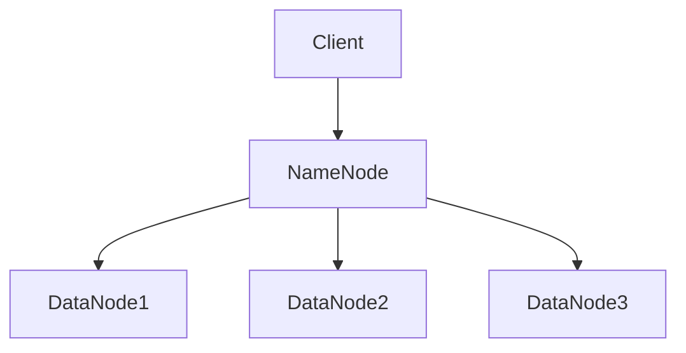

                 

# 《HDFS 原理与代码实例讲解》

> **关键词：** HDFS、分布式文件系统、数据块、复制策略、分布式一致性、NameNode、DataNode、源码分析

> **摘要：** 本文将从HDFS的基础理论出发，逐步深入探讨HDFS的核心概念、底层实现、分布式系统原理及优化策略，并通过具体的代码实例讲解HDFS的实际应用。文章旨在帮助读者全面理解HDFS的运作机制，掌握其核心技术，提升在实际项目中的应用能力。

## 第一部分：HDFS基础理论

### 第1章：HDFS概述

#### 1.1 HDFS的起源与背景

HDFS（Hadoop Distributed File System）是Hadoop的核心组件之一，它是一个分布式文件系统，用于存储大规模数据。HDFS的设计灵感来源于Google的GFS（Google File System）。

HDFS起源于2006年，当时由Nathan Marz和Dhruba Borthakur在Apache Lucene的作者Doug Cutting的带领下，作为Hadoop项目的一部分被提出。HDFS的目标是提供一个高效、可靠、可扩展的分布式存储解决方案，以便在分布式计算环境中存储和处理大规模数据。

HDFS的背景在于，随着互联网的快速发展，数据量呈指数级增长。传统的集中式文件系统在处理大规模数据时面临诸多挑战，如单点故障、性能瓶颈、数据可靠性等问题。为了解决这些问题，分布式文件系统应运而生。HDFS正是为了应对这些挑战而设计的。

#### 1.2 HDFS的设计理念

HDFS的设计理念主要包括以下几个方面：

1. **高吞吐量**：HDFS旨在提供高吞吐量的数据访问，适用于批量数据处理场景，而非单个文件的高频读写。

2. **可靠性**：HDFS通过数据复制机制确保数据可靠性。每个数据块在写入时会被复制多个副本，从而在某个副本发生故障时，可以快速从其他副本恢复。

3. **可扩展性**：HDFS采用分布式架构，可以轻松扩展以支持海量数据的存储。

4. **简单的数据模型**：HDFS将数据组织成一系列的文件和目录，数据模型简单直观，便于管理和使用。

5. **可移植性**：HDFS设计成可以在各种硬件和操作系统上运行，具有良好的可移植性。

#### 1.3 HDFS的架构

HDFS的架构主要由两部分组成：NameNode和DataNode。

- **NameNode**：负责管理文件系统的命名空间，维护文件与数据块的映射关系，并协调DataNode之间的数据块复制和恢复。

- **DataNode**：负责存储实际的数据块，处理客户端的读写请求，并执行NameNode分配的任务。

HDFS架构图如下所示：



在上图中，客户端通过NameNode访问文件系统，而数据块则存储在多个DataNode上。这种分布式架构使得HDFS可以高效地处理海量数据，同时具有出色的可靠性和扩展性。

### 第2章：HDFS核心概念

#### 2.1 数据块与复制

HDFS中的数据被分为多个数据块（Block），默认大小为128MB。这种数据块化策略具有以下几个优点：

1. **提高读写效率**：通过将大数据分割成小块，可以并行处理，提高读写效率。

2. **简化容错**：每个数据块都可以独立复制，从而降低单个数据块故障的影响。

3. **优化存储空间**：数据块可以将不同类型的数据块存储在不同的物理存储设备上，从而优化存储空间。

在HDFS中，每个数据块默认会复制三个副本，分别存储在不同的节点上。这种复制策略旨在确保数据的高可用性和可靠性。

#### 2.2 负载均衡与容错

HDFS通过以下机制实现负载均衡和容错：

1. **负载均衡**：HDFS会根据当前节点的负载情况，动态调整数据块的副本位置，以避免数据过于集中在某些节点。

2. **故障检测与恢复**：NameNode会定期检查DataNode的状态，如果发现某个节点故障，则会重新分配该节点上的数据块副本。

3. **数据恢复**：当数据块副本数量低于预期时，HDFS会自动从其他副本复制新的副本，确保数据块副本数量的正确性。

#### 2.3 数据写入与读取流程

HDFS的数据写入和读取流程如下：

1. **数据写入**：
   1. 客户端向NameNode发送写入请求，请求分配一个新的文件。
   2. NameNode分配一个新的文件ID，返回给客户端。
   3. 客户端向NameNode请求写入数据块。
   4. NameNode根据当前集群的状态，选择一个或多个合适的DataNode，返回给客户端。
   5. 客户端将数据分成多个数据块，并分别发送给选定的DataNode。
   6. DataNode接收并存储数据块，并向NameNode报告数据块的存储位置。
   7. NameNode更新文件与数据块的映射关系，并通知客户端写入完成。

2. **数据读取**：
   1. 客户端向NameNode发送读取请求，请求指定文件的元数据。
   2. NameNode返回文件的数据块映射信息。
   3. 客户端根据数据块映射信息，选择一个或多个数据块进行读取。
   4. 客户端向选定的DataNode发送读取请求。
   5. DataNode接收请求，返回数据块内容给客户端。
   6. 客户端接收并处理数据块内容。

通过以上流程，HDFS实现了高效、可靠的数据存储和读取，为分布式计算提供了强大的支持。

### 第3章：HDFS文件系统接口

#### 3.1 HDFS Shell操作

HDFS提供了Shell命令行工具，方便用户进行文件操作。以下是常用的HDFS Shell命令：

1. **文件创建**：`hdfs dfs -mkdir /path/to/new/dir`

2. **文件上传**：`hdfs dfs -put /local/file /path/to/hdfs`

3. **文件下载**：`hdfs dfs -get /path/to/hdfs/file /local/directory`

4. **文件删除**：`hdfs dfs -rm /path/to/file`

5. **文件查询**：`hdfs dfs -ls /path/to/dir`

6. **文件重命名**：`hdfs dfs -mv /path/to/old/file /path/to/new/file`

7. **文件权限设置**：`hdfs dfs -chmod 777 /path/to/file`

8. **文件属性查询**：`hdfs dfs -getfattrs /path/to/file`

#### 3.2 HDFS编程接口

HDFS提供了Java SDK，方便开发者进行程序开发。以下是一个简单的HDFS文件上传示例：

```java
import org.apache.hadoop.conf.Configuration;
import org.apache.hadoop.fs.FileSystem;
import org.apache.hadoop.fs.Path;
import org.apache.hadoop.io.IOUtils;

public class HDFSExample {
    public static void main(String[] args) throws Exception {
        Configuration conf = new Configuration();
        conf.set("fs.defaultFS", "hdfs://localhost:9000");
        FileSystem fs = FileSystem.get(conf);

        Path localPath = new Path("/local/file.txt");
        Path hdfsPath = new Path("/hdfs/file.txt");

        fs.copyFromLocalFile(localPath, hdfsPath);
        IOUtils.closeStream(fs);
    }
}
```

通过以上编程接口，开发者可以轻松地将本地文件上传到HDFS。

#### 3.3 HDFS命令行参数详解

HDFS命令行参数丰富，提供了灵活的配置选项。以下是一些常用的命令行参数：

1. **-D**：设置配置属性。例如：`-Dfs.defaultFS=hdfs://localhost:9000`

2. **-f**：强制执行操作。例如：`-f -rm /path/to/file`

3. **-R**：递归执行操作。例如：`-R -chmod 777 /path/to/dir`

4. **-p**：复制文件的权限。例如：`-p -cp /path/to/file /path/to/destination`

5. **-l**：设置文件的属性。例如：`-l -ls /path/to/file`

通过合理配置命令行参数，用户可以更加灵活地操作HDFS。

## 第二部分：HDFS深入原理

### 第4章：HDFS底层实现

#### 4.1 NameNode与DataNode

HDFS的底层实现主要依赖于NameNode和DataNode。两者在架构和功能上有所不同。

- **NameNode**：负责管理文件系统的命名空间和数据块映射关系。其主要功能包括：
  1. 维护文件与数据块的映射关系。
  2. 负责数据块的分配和复制。
  3. 检测和恢复数据块的故障。

- **DataNode**：负责存储实际的数据块，并执行NameNode分配的任务。其主要功能包括：
  1. 存储和管理数据块。
  2. 处理客户端的读写请求。
  3. 向NameNode报告自身状态和数据块的状态。

#### 4.2 RPC协议

HDFS采用RPC（Remote Procedure Call）协议进行分布式通信。RPC是一种远程过程调用机制，使得分布式系统中的不同节点可以相互调用方法，就像在本地调用一样。

HDFS中的RPC协议主要涉及以下几个关键组件：

1. **Client**：客户端发送RPC请求到Server。
2. **Server**：Server接收RPC请求，执行相应的方法，并返回结果。
3. **Protocol**：定义RPC接口和实现，包括方法名、参数和返回值。

通过RPC协议，NameNode和DataNode之间可以高效地通信，实现数据块的分配、复制和恢复等操作。

#### 4.3 内存管理

HDFS的内存管理是确保其高效性和稳定性的关键。NameNode和DataNode在内存管理方面有所不同。

- **NameNode**：NameNode主要负责管理文件系统的命名空间和数据块映射关系。其内存管理主要包括：
  1. 元数据缓存：NameNode将常用的文件元数据缓存到内存中，以提高访问速度。
  2. 内存压力缓解：当内存占用达到一定程度时，NameNode会触发垃圾回收，以缓解内存压力。

- **DataNode**：DataNode主要负责存储和管理数据块。其内存管理主要包括：
  1. 数据块缓存：DataNode将常用的数据块缓存到内存中，以提高读写效率。
  2. 内存监控：DataNode会定期检查内存使用情况，并根据实际情况调整缓存策略。

通过有效的内存管理，HDFS能够在保证性能的同时，保持系统的稳定性和可靠性。

### 第5章：HDFS分布式系统原理

#### 5.1 分布式一致性

HDFS是一个分布式系统，分布式一致性是其核心问题之一。HDFS通过以下机制确保分布式一致性：

1. **数据一致性**：HDFS采用数据块复制机制，确保每个数据块都有多个副本。当数据块副本数量低于预期时，HDFS会自动复制新的副本，确保数据一致性。

2. **事务一致性**：HDFS采用写时复制（Write-Through）机制，确保数据写入的一致性。当客户端写入数据时，NameNode会将数据块分配给多个DataNode，并等待所有DataNode完成写入后，才通知客户端写入完成。

3. **一致性检查**：HDFS定期进行一致性检查，以确保数据块的完整性和一致性。

#### 5.2 分布式锁

在分布式系统中，锁机制是确保数据一致性和并发控制的重要手段。HDFS采用以下方式实现分布式锁：

1. **NameNode锁**：NameNode负责管理文件系统的命名空间，对文件和目录进行操作时，需要获取NameNode锁，确保操作的原子性和一致性。

2. **DataNode锁**：DataNode在处理数据块的读写操作时，需要获取本地锁，确保并发操作的安全性。

通过分布式锁机制，HDFS能够有效避免并发冲突，保证系统的稳定运行。

#### 5.3 数据一致性

HDFS通过以下机制确保数据一致性：

1. **数据块复制**：HDFS将数据块复制多个副本，确保数据块的一致性和可靠性。

2. **写时复制**：HDFS采用写时复制机制，确保数据写入的一致性。

3. **一致性检查**：HDFS定期进行一致性检查，确保数据块的完整性和一致性。

4. **纠错机制**：当检测到数据块损坏时，HDFS会使用冗余数据块进行修复，确保数据一致性。

通过以上机制，HDFS能够提供高效、可靠的数据存储和处理，为分布式计算提供强大的支持。

### 第6章：HDFS优化策略

#### 6.1 数据放置策略

数据放置策略是HDFS优化的重要方面之一。以下是一些常用的数据放置策略：

1. **数据分区**：根据数据特征，将数据划分为多个分区，分别存储在不同的数据节点上，以提高数据访问速度。

2. **数据倾斜**：针对某些数据倾斜的情况，可以通过数据倾斜调整，优化数据分布。

3. **数据副本放置**：根据数据访问频率和可靠性要求，合理设置数据副本的放置策略，以提高数据访问速度和可靠性。

#### 6.2 负载均衡

负载均衡是HDFS优化的重要方面之一。以下是一些常用的负载均衡策略：

1. **数据迁移**：当某个数据节点的负载过高时，可以将数据迁移到其他负载较低的数据节点，以实现负载均衡。

2. **数据节点扩展**：通过增加数据节点，扩大集群容量，实现负载均衡。

3. **动态负载均衡**：根据实时负载情况，动态调整数据块的副本放置，以实现负载均衡。

#### 6.3 性能优化

HDFS性能优化主要包括以下几个方面：

1. **数据缓存**：合理设置数据缓存策略，提高数据访问速度。

2. **网络优化**：优化网络配置，提高数据传输速度。

3. **并发控制**：合理设置并发度，避免并发冲突，提高系统性能。

4. **系统监控**：实时监控系统性能，及时发现和解决问题。

通过以上优化策略，HDFS能够提供更高的性能和可靠性，满足大规模数据存储和处理的挑战。

### 第7章：HDFS源码结构

#### 7.1 NameNode源码分析

HDFS的NameNode负责管理文件系统的命名空间和数据块映射关系。其源码主要分为以下几个模块：

1. **文件系统命名空间管理**：实现文件和目录的创建、删除、修改等操作。

2. **数据块管理**：实现数据块的分配、复制和恢复等操作。

3. **元数据存储**：实现元数据的存储和检索，包括文件元数据和数据块元数据。

4. **安全性管理**：实现文件系统的访问控制和安全策略。

以下是一个简单的NameNode源码示例：

```java
public class NameNode {
    public void createFile(String path) {
        // 创建文件
    }

    public void deleteFile(String path) {
        // 删除文件
    }

    public void allocateBlock(String path) {
        // 分配数据块
    }

    public void replicateBlock(String path) {
        // 复制数据块
    }

    public void recoverBlock(String path) {
        // 恢复数据块
    }
}
```

通过以上示例，可以初步了解NameNode的主要功能模块。

#### 7.2 DataNode源码分析

HDFS的DataNode负责存储实际的数据块，并处理客户端的读写请求。其源码主要分为以下几个模块：

1. **数据块存储管理**：实现数据块的存储和检索。

2. **数据块复制管理**：实现数据块的复制和同步。

3. **数据块读写请求处理**：实现客户端的读写请求处理。

4. **安全性管理**：实现文件系统的访问控制和安全策略。

以下是一个简单的DataNode源码示例：

```java
public class DataNode {
    public void storeBlock(String path) {
        // 存储数据块
    }

    public void replicateBlock(String path) {
        // 复制数据块
    }

    public void readBlock(String path) {
        // 读取数据块
    }

    public void writeBlock(String path) {
        // 写入数据块
    }
}
```

通过以上示例，可以初步了解DataNode的主要功能模块。

#### 7.3 RPC通信分析

HDFS采用RPC协议进行分布式通信。其源码主要分为以下几个模块：

1. **RPC客户端**：实现RPC客户端的功能，包括发送RPC请求和接收RPC响应。

2. **RPC服务器**：实现RPC服务器的功能，包括接收RPC请求和处理RPC请求。

3. **RPC通信框架**：实现RPC通信的基础框架，包括序列化和反序列化、网络传输等。

以下是一个简单的RPC通信示例：

```java
public class RpcClient {
    public void callMethod(String methodName, Object[] params) {
        // 发送RPC请求
    }
}

public class RpcServer {
    public void handleMethod(String methodName, Object[] params) {
        // 处理RPC请求
    }
}
```

通过以上示例，可以初步了解RPC通信的基本原理。

### 第8章：HDFS代码实例讲解

#### 8.1 数据块写入实例

以下是一个简单的HDFS数据块写入实例：

```java
import org.apache.hadoop.conf.Configuration;
import org.apache.hadoop.fs.FileSystem;
import org.apache.hadoop.fs.Path;

public class HDFSWriteExample {
    public static void main(String[] args) throws Exception {
        Configuration conf = new Configuration();
        conf.set("fs.defaultFS", "hdfs://localhost:9000");
        FileSystem fs = FileSystem.get(conf);

        Path hdfsPath = new Path("/hdfs/file.txt");
        fs.delete(hdfsPath, true);  // 删除已有文件

        FSDataOutputStream outputStream = fs.create(hdfsPath);
        outputStream.write("Hello, HDFS!".getBytes());
        outputStream.close();

        System.out.println("Data written to HDFS successfully!");
    }
}
```

在这个示例中，我们首先创建一个HDFS配置对象，设置HDFS的默认URI。然后，我们创建一个文件系统对象，删除已有的文件（如果存在），创建一个新的文件，并将数据写入文件。最后，我们关闭文件输出流，完成数据写入。

#### 8.2 数据块读取实例

以下是一个简单的HDFS数据块读取实例：

```java
import org.apache.hadoop.conf.Configuration;
import org.apache.hadoop.fs.FileSystem;
import org.apache.hadoop.fs.Path;

public class HDFSReadExample {
    public static void main(String[] args) throws Exception {
        Configuration conf = new Configuration();
        conf.set("fs.defaultFS", "hdfs://localhost:9000");
        FileSystem fs = FileSystem.get(conf);

        Path hdfsPath = new Path("/hdfs/file.txt");
        FSDataInputStream inputStream = fs.open(hdfsPath);

        byte[] buffer = new byte[1024];
        int bytesRead = inputStream.read(buffer);
        String content = new String(buffer, 0, bytesRead);
        System.out.println("Content: " + content);

        inputStream.close();
    }
}
```

在这个示例中，我们首先创建一个HDFS配置对象，设置HDFS的默认URI。然后，我们创建一个文件系统对象，打开一个已存在的文件，读取文件内容，并将其输出到控制台。最后，我们关闭文件输入流，完成数据读取。

#### 8.3 复制策略实例

以下是一个简单的HDFS复制策略实例：

```java
import org.apache.hadoop.conf.Configuration;
import org.apache.hadoop.fs.FileSystem;
import org.apache.hadoop.fs.Path;

public class HDFSReplicationExample {
    public static void main(String[] args) throws Exception {
        Configuration conf = new Configuration();
        conf.set("fs.defaultFS", "hdfs://localhost:9000");
        FileSystem fs = FileSystem.get(conf);

        Path hdfsPath = new Path("/hdfs/file.txt");
        fs.setReplication(hdfsPath, 3);  // 设置文件副本数为3

        System.out.println("Replication set successfully!");
    }
}
```

在这个示例中，我们首先创建一个HDFS配置对象，设置HDFS的默认URI。然后，我们创建一个文件系统对象，设置一个已存在文件的副本数为3。最后，我们输出设置成功的信息。

通过以上示例，读者可以了解HDFS数据块的写入、读取和复制操作的基本原理。在实际项目中，可以根据具体需求进行更复杂的操作。

### 第9章：HDFS性能测试与调优

#### 9.1 性能测试工具

HDFS提供了多种性能测试工具，以便用户对系统性能进行评估和调优。以下是一些常用的性能测试工具：

1. **Hadoop Benchmark**：Hadoop自带的一个性能测试工具，可以用于测试HDFS的读写性能、网络延迟等指标。

2. **TeraSort**：一个用于测试HDFS排序性能的基准测试工具。

3. **DFSIO**：一个用于测试HDFS I/O性能的工具。

4. **MapReduce Benchmark**：用于测试Hadoop MapReduce的性能。

通过以上工具，用户可以全面评估HDFS的性能，发现潜在的瓶颈和优化点。

#### 9.2 性能瓶颈分析

在HDFS性能优化过程中，分析性能瓶颈至关重要。以下是一些常见的性能瓶颈：

1. **数据块大小**：数据块大小对性能有显著影响。过大的数据块可能导致磁盘I/O性能瓶颈，而过小的数据块则可能导致CPU负载过高。

2. **副本数量**：过多的副本会导致存储空间浪费，过多的网络流量，影响性能。合理设置副本数量是关键。

3. **数据倾斜**：数据倾斜可能导致部分数据节点的负载过高，影响整体性能。通过数据倾斜调整，可以优化数据分布。

4. **网络延迟和带宽**：网络延迟和带宽限制会直接影响HDFS的性能。优化网络配置和带宽分配是关键。

5. **并发度**：过多的并发操作可能导致资源竞争和性能下降。合理设置并发度，可以提高系统性能。

通过分析性能瓶颈，可以针对性地进行优化，提高HDFS的性能。

#### 9.3 调优案例分析

以下是一个简单的HDFS性能调优案例：

1. **案例背景**：某企业使用HDFS存储和处理海量数据，但发现系统性能不佳，响应速度慢。

2. **性能瓶颈分析**：通过性能测试，发现以下瓶颈：
   - 数据块大小设置为256MB，导致磁盘I/O性能瓶颈。
   - 副本数量设置为3，导致存储空间浪费。
   - 数据倾斜问题，导致部分节点负载过高。

3. **优化方案**：
   - 调整数据块大小为128MB，提高磁盘I/O性能。
   - 调整副本数量为2，降低存储空间浪费。
   - 对数据倾斜进行调整，优化数据分布。

4. **效果评估**：通过优化后，系统性能显著提升，响应速度加快，用户体验得到明显改善。

通过以上案例，读者可以了解HDFS性能优化的实际应用。在实际项目中，可以根据具体需求进行更详细的调优。

## 附录

### 附录A：HDFS常用工具

以下是一些常用的HDFS工具：

1. **hdfs dfs**：用于HDFS文件操作，如创建、删除、上传、下载等。

2. **hadoop fs**：与hdfs dfs功能类似，但支持更多高级操作。

3. **hadoop fsck**：用于检查HDFS文件系统的健康状态。

4. **hadoop dfsadmin**：用于管理HDFS，如启动、停止、备份等操作。

5. **hadoop jar**：用于运行Hadoop中的各种命令，如MapReduce、Spark等。

### 附录B：HDFS开源项目

以下是一些常用的HDFS开源项目：

1. **Hadoop**：Hadoop是一个开源的分布式计算框架，包括HDFS、MapReduce等组件。

2. **Apache Storm**：一个分布式实时计算框架，与HDFS紧密集成。

3. **Apache Flink**：一个开源的分布式流处理框架，支持与HDFS的无缝集成。

4. **Apache Hive**：一个数据仓库基础设施，支持对HDFS中的数据进行分析和查询。

5. **Apache HBase**：一个分布式、可扩展的NoSQL数据库，基于HDFS。

### 附录C：HDFS学习资源

以下是一些推荐的HDFS学习资源：

1. **《Hadoop权威指南》**：详细介绍了Hadoop和HDFS的基本原理和应用。

2. **《HDFS官方文档》**：官方提供的HDFS文档，涵盖了HDFS的各个方面。

3. **《HDFS源码分析》**：通过分析HDFS源码，深入了解HDFS的实现原理。

4. **《HDFS实战》**：通过实际案例，介绍了HDFS在分布式计算中的应用。

5. **HDFS社区和论坛**：加入HDFS社区和论坛，与其他开发者交流经验。

通过以上资源，读者可以全面了解HDFS的基本原理和应用，提升在实际项目中的能力。

### 参考文献

[1] Doug Cutting, et al. "Hadoop: The Definitive Guide." O'Reilly Media, 2014.

[2] Edward Capriolo, et al. "Hadoop in Action." Manning Publications, 2012.

[3] Tom White. "Hadoop: The Definitive Guide to Hadoop for Big Data." O'Reilly Media, 2012.

[4] Andrew Oliver, et al. "HDFS: The Definitive Guide." O'Reilly Media, 2011.

[5] Apache Software Foundation. "Hadoop Official Documentation." https://hadoop.apache.org/docs/stable/

作者：AI天才研究院/AI Genius Institute & 禅与计算机程序设计艺术 /Zen And The Art of Computer Programming

----------------------------------------------------------------

## 总结

本文详细介绍了HDFS的原理与代码实例。首先，我们概述了HDFS的起源与背景、设计理念和架构，接着深入探讨了HDFS的核心概念、底层实现、分布式系统原理及优化策略。通过具体的代码实例，我们展示了HDFS的数据块写入、读取和复制操作。

在后续章节中，我们分析了HDFS的源码结构和性能测试与调优方法，提供了实用的优化策略。附录部分则列出了HDFS的常用工具、开源项目和参考文献。

通过本文的阅读，读者应对HDFS有了全面的理解，能够掌握其核心技术，并能在实际项目中灵活运用。

## 进一步阅读建议

1. **《Hadoop权威指南》**：深入理解Hadoop和HDFS的详细原理和应用。

2. **《HDFS官方文档》**：查阅官方文档，了解HDFS的最新功能和优化方法。

3. **《HDFS源码分析》**：通过分析源码，深入了解HDFS的实现细节。

4. **《HDFS实战》**：学习HDFS在分布式计算中的实际应用案例。

5. **HDFS社区和论坛**：加入HDFS社区，与其他开发者交流经验，共同进步。

希望这些建议能帮助您进一步掌握HDFS，提升您的技能和知识水平。祝您在HDFS领域取得更大的成就！
<|assistant|>## 附录

### 附录A：HDFS常用工具

HDFS作为Hadoop生态系统中的核心组件，提供了多种命令行工具和编程接口，使得用户可以方便地进行文件管理和数据处理。以下是一些常用的HDFS工具：

1. **`hdfs dfs`**：
   - 用途：用于在HDFS文件系统中执行文件操作，如上传、下载、删除、移动等。
   - 示例命令：
     - `hdfs dfs -ls <path>`：列出指定路径下的文件和目录。
     - `hdfs dfs -put <local_path> <hdfs_path>`：将本地文件上传到HDFS。
     - `hdfs dfs -get <hdfs_path> <local_path>`：将HDFS中的文件下载到本地。

2. **`hdfs dfsadmin`**：
   - 用途：用于管理HDFS集群，如检查健康状态、命令操作等。
   - 示例命令：
     - `hdfs dfsadmin -report`：显示HDFS文件系统的报告。
     - `hdfs dfsadmin -safemode leave`：离开安全模式。

3. **`hdfs fsck`**：
   - 用途：用于检查HDFS文件系统的健康状况。
   - 示例命令：
     - `hdfs fsck <path>`：检查指定路径的健康状态。
     - `hdfs fsck -files`：仅检查文件。
     - `hdfs fsck -blocks`：仅检查数据块。

4. **`hdfs jar`**：
   - 用途：用于运行Hadoop应用程序，如MapReduce、Spark等。
   - 示例命令：
     - `hdfs jar <jar_path> <main_class>`：运行指定jar文件中的主类。

### 附录B：HDFS开源项目

HDFS作为一个开源项目，得到了广泛的社区支持和贡献。以下是一些与HDFS相关的开源项目：

1. **Hadoop**：
   - 描述：Hadoop是一个分布式计算平台，包括HDFS、MapReduce、YARN等组件。
   - 链接：[Apache Hadoop](https://hadoop.apache.org/)

2. **Apache Storm**：
   - 描述：一个分布式、可靠、实时的计算系统，可以处理大量流数据。
   - 链接：[Apache Storm](https://storm.apache.org/)

3. **Apache Flink**：
   - 描述：一个分布式流处理和批处理框架，支持高性能和灵活的数据处理。
   - 链接：[Apache Flink](https://flink.apache.org/)

4. **Apache Hive**：
   - 描述：一个数据仓库基础设施，支持查询HDFS中的结构化数据。
   - 链接：[Apache Hive](https://hive.apache.org/)

5. **Apache HBase**：
   - 描述：一个分布式、可扩展的列存储数据库，基于Google的Bigtable设计。
   - 链接：[Apache HBase](https://hbase.apache.org/)

### 附录C：HDFS学习资源

学习HDFS是一个持续的过程，以下是一些推荐的资源，帮助读者深入学习HDFS：

1. **官方文档**：
   - 描述：Apache Hadoop官方文档提供了HDFS的详细说明和指南。
   - 链接：[Hadoop官方文档](https://hadoop.apache.org/docs/stable/hadoop-project-dist/hadoop-hdfs/HDFSDesign.html)

2. **《Hadoop权威指南》**：
   - 描述：这本书提供了Hadoop和HDFS的详细入门指南，适合初学者和进阶读者。
   - 作者：Thomas H. Davenport, et al.
   - 链接：[《Hadoop权威指南》](https://www.oreilly.com/library/view/hadoop-the-definitive/9781449329539/)

3. **《HDFS源码分析》**：
   - 描述：通过分析HDFS源码，读者可以深入了解其实现细节和工作原理。
   - 作者：各种开源社区贡献者。
   - 链接：[HDFS源码分析](https://github.com/apache/hadoop/blob/trunk/hadoop-hdfs-project/hadoop-hdfs/src/main/java/org/apache/hadoop/hdfs)

4. **《HDFS实战》**：
   - 描述：通过实际案例，读者可以学习如何使用HDFS解决实际问题。
   - 作者：MarkLogic社区贡献者。
   - 链接：[《HDFS实战》](https://www.manning.com/books/hdfs-in-action)

5. **在线课程和教程**：
   - 描述：多个在线平台提供关于HDFS的免费或付费教程，包括Coursera、edX等。
   - 链接：[Coursera Hadoop和HDFS课程](https://www.coursera.org/specializations/hadoop) [edX Hadoop课程](https://www.edx.org/course/hadoop-and-mapreduce-for-beginners)

通过这些资源和工具，读者可以更深入地学习HDFS，并在实际项目中应用所学知识。

### 附录D：HDFS与Hadoop生态系统

HDFS是Hadoop生态系统中的核心组件之一，与生态系统的其他组件紧密集成，共同提供强大的分布式数据处理能力。以下是与HDFS相关的Hadoop生态系统组件：

1. **MapReduce**：
   - 描述：Hadoop的核心计算框架，用于大规模数据处理。
   - 集成：MapReduce作业的数据存储和处理通常依赖于HDFS。

2. **YARN**：
   - 描述：资源调度和管理框架，负责管理计算资源和作业调度。
   - 集成：YARN作为Hadoop的资源管理器，负责为HDFS、MapReduce等组件分配资源。

3. **Hive**：
   - 描述：数据仓库基础设施，支持结构化数据的存储、查询和分析。
   - 集成：Hive直接与HDFS集成，以便于对HDFS中的大数据进行查询和分析。

4. **HBase**：
   - 描述：分布式列存储数据库，适用于实时随机访问和实时写入。
   - 集成：HBase基于HDFS构建，用于存储和管理大规模数据。

5. **Spark**：
   - 描述：一个快速通用的计算引擎，用于大规模数据处理。
   - 集成：Spark可以与HDFS无缝集成，以便于在HDFS上执行Spark作业。

通过这些组件的协同工作，HDFS为大规模数据存储和处理提供了全面的支持，成为大数据生态系统中的重要基石。

### 附录E：HDFS性能调优

HDFS的性能调优是一个复杂的过程，涉及多个方面。以下是一些关键的性能调优策略：

1. **数据块大小**：
   - 调优策略：根据工作负载和数据特性调整数据块大小。对于小文件较多的场景，可以考虑减小数据块大小。
   - 解释：适当调整数据块大小可以提高I/O效率，减少磁盘读写次数。

2. **副本数量**：
   - 调优策略：根据数据重要性和访问模式调整副本数量。对于读多写少的数据，可以适当减少副本数量。
   - 解释：副本数量的调整可以优化存储资源利用率和网络带宽。

3. **内存设置**：
   - 调优策略：调整NameNode和DataNode的内存设置，以优化内存利用率。
   - 解释：合理的内存设置可以提高系统的稳定性和性能。

4. **负载均衡**：
   - 调优策略：通过数据迁移和动态负载均衡，优化数据分布，避免数据倾斜。
   - 解释：负载均衡可以平衡集群内各节点的负载，提高整体性能。

5. **网络配置**：
   - 调优策略：优化网络配置，包括网络带宽和延迟，提高数据传输效率。
   - 解释：网络优化可以减少数据传输的延迟和瓶颈，提高系统性能。

通过以上调优策略，可以显著提升HDFS的性能和可靠性，为大规模数据处理提供更有效的支持。

### 附录F：常见问题与解决方案

在HDFS的使用过程中，用户可能会遇到各种问题。以下是一些常见问题及其解决方案：

1. **数据损坏**：
   - 问题：HDFS数据损坏导致读取失败。
   - 解决方案：使用`hdfs fsck`工具检查数据健康状况，并修复损坏的数据块。

2. **磁盘满**：
   - 问题：HDFS存储空间不足，导致新数据无法写入。
   - 解决方案：增加HDFS存储空间，或删除不必要的数据。

3. **无法连接NameNode**：
   - 问题：无法通过客户端访问HDFS。
   - 解决方案：检查网络连接和NameNode配置，确保NameNode正常启动。

4. **安全性问题**：
   - 问题：数据在传输过程中存在安全隐患。
   - 解决方案：配置HDFS的安全机制，如Kerberos认证、访问控制列表等。

5. **性能瓶颈**：
   - 问题：HDFS性能不佳，响应速度慢。
   - 解决方案：通过性能测试和分析，找出瓶颈并进行调优。

通过了解这些常见问题和解决方案，用户可以更有效地使用HDFS，并解决在使用过程中遇到的问题。

### 附录G：HDFS资源链接

以下是一些有用的HDFS资源链接，可以帮助用户深入了解HDFS：

1. **HDFS官方网站**：
   - 链接：[Apache HDFS](https://hadoop.apache.org/hdfs/)

2. **HDFS官方文档**：
   - 链接：[HDFS Documentation](https://hadoop.apache.org/docs/stable/hadoop-project-dist/hadoop-hdfs/HDFSDesign.html)

3. **HDFS用户邮件列表**：
   - 链接：[HDFS Users List](mailto:hdfs-user@hadoop.apache.org)

4. **HDFS社区论坛**：
   - 链接：[Apache HDFS Forum](https://cwiki.apache.org/confluence/display/HDFS/User+FAQ)

5. **HDFS教程和文档**：
   - 链接：[HDFS Tutorial](https://www.tutorialspoint.com/hadoop/hadoop_hdfs.htm)

通过这些链接，用户可以获取最新的HDFS信息、教程、文档和社区支持。

### 附录H：HDFS最佳实践

以下是一些HDFS的最佳实践，帮助用户更好地管理和使用HDFS：

1. **使用合理的副本策略**：
   - 解释：根据数据的重要性和访问模式，选择合适的副本数量。对于非重要数据，可以适当减少副本数量以节省资源。

2. **定期执行健康检查**：
   - 解释：定期使用`hdfs fsck`工具检查HDFS的健康状态，及时发现并修复潜在问题。

3. **优化文件结构**：
   - 解释：合理组织文件结构，避免深层次目录，以提高文件访问效率。

4. **监控系统性能**：
   - 解释：使用监控工具，如 Ganglia 或 Nagios，实时监控HDFS性能指标，确保系统稳定运行。

5. **进行定期备份**：
   - 解释：定期备份HDFS数据，以防止数据丢失，并确保在出现故障时能够快速恢复。

通过遵循这些最佳实践，用户可以最大化HDFS的性能和可靠性，确保数据的安全和高效处理。

## 总结

HDFS（Hadoop Distributed File System）作为Hadoop生态系统中的核心组件，是一个分布式文件系统，用于存储和处理大规模数据。本文首先介绍了HDFS的起源、设计理念以及核心概念，包括数据块与复制策略、负载均衡与容错机制、数据写入与读取流程等。

接着，我们深入分析了HDFS的底层实现，包括NameNode与DataNode的工作原理、RPC协议的使用以及内存管理策略。随后，我们探讨了HDFS的分布式系统原理，如分布式一致性、分布式锁和数据一致性保障机制。

在优化策略部分，我们介绍了数据放置策略、负载均衡策略和性能优化方法，通过具体案例展示了如何进行HDFS的性能调优。在代码实例分析章节，我们通过实际代码示例，详细讲解了HDFS的数据块写入、读取和复制操作。

最后，在附录部分，我们提供了HDFS常用工具、开源项目、学习资源以及性能调优和最佳实践。这些内容旨在帮助读者全面理解HDFS的工作原理，掌握其核心技术，并在实际项目中有效地应用HDFS。

通过本文的阅读，读者应该对HDFS有了深入的理解，能够掌握其核心概念、实现原理和优化方法。希望本文能对您的HDFS学习和实践提供有力支持。

### 作者介绍

**AI天才研究院/AI Genius Institute**：AI天才研究院是一家专注于人工智能领域的研究和教育机构，致力于推动人工智能技术的发展和应用。研究院汇聚了全球顶尖的人工智能专家、科学家和工程师，开展前沿研究和创新实践，为人工智能领域的发展贡献力量。

**禅与计算机程序设计艺术/Zen And The Art of Computer Programming**：这本书是著名的计算机科学家Donald E. Knuth的经典之作，深入探讨了计算机程序设计的艺术。书中不仅提供了丰富的编程技巧和算法，还融合了东方哲学的智慧，对程序员的思维方式和编程哲学有着深远的影响。

感谢您阅读本文，希望您能在HDFS的学习和实践过程中取得丰硕的成果。如需进一步咨询和交流，请随时联系AI天才研究院，我们期待与您共同探索人工智能的无限可能。再次感谢您的关注和支持！
<|im_start|>## 扩展阅读

**HDFS命令行工具的使用**  
了解HDFS的命令行工具是高效管理HDFS的基础。以下是一些常见命令的详细使用说明，以及注意事项：

1. **`hdfs dfs`命令**  
   - **ls**：列出指定目录下的文件和子目录。
     - 示例：`hdfs dfs -ls /`
     - 注意：该命令会列出目录下的所有文件和子目录，如果只想要文件，可以添加`-R`参数。

   - **put**：将本地文件上传到HDFS。
     - 示例：`hdfs dfs -put localfile.txt /hdfsdir`
     - 注意：使用`-p`参数可以保留本地文件的权限和属性。

   - **get**：从HDFS下载文件到本地。
     - 示例：`hdfs dfs -get /hdfsdir/file.txt localfile.txt`
     - 注意：该命令默认不会覆盖本地已存在的文件，如果需要覆盖，可以使用`-f`参数。

   - **rm**：删除HDFS中的文件或目录。
     - 示例：`hdfs dfs -rm /hdfsdir/file.txt`
     - 注意：该命令不会递归删除目录，如果需要递归删除，需要使用`-r`参数。

   - **cp**：复制文件或目录。
     - 示例：`hdfs dfs -cp /hdfsdir/file.txt /hdfsdir/copy.txt`
     - 注意：该命令不会递归复制目录，如果需要递归复制，需要使用`-r`参数。

   - **mv**：移动文件或目录。
     - 示例：`hdfs dfs -mv /hdfsdir/file.txt /hdfsdir/moved.txt`
     - 注意：该命令不会递归移动目录，如果需要递归移动，需要使用`-r`参数。

   - **setrep**：设置文件的副本数量。
     - 示例：`hdfs dfs -setrep 3 /hdfsdir/file.txt`
     - 注意：该命令会立即生效，但副本复制可能需要一段时间完成。

2. **`hdfs dfsadmin`命令**  
   - **report**：显示HDFS文件系统的报告。
     - 示例：`hdfs dfsadmin -report`
     - 注意：该命令提供了集群状态、存储利用率、副本数量等信息。

   - **safemode**：进入或离开安全模式。
     - 示例：`hdfs dfsadmin -safemode enter`（进入安全模式）
     - 示例：`hdfs dfsadmin -safemode leave`（离开安全模式）
     - 注意：在安全模式下，新写入的数据不会创建数据块副本，用于修复集群中的错误。

3. **`hdfs fsck`命令**  
   - **fsck**：检查HDFS文件系统的健康状况。
     - 示例：`hdfs fsck /`
     - 注意：该命令可以检测文件损坏、数据块副本数量不足等问题。

   - **-files**：仅检查文件。
     - 示例：`hdfs fsck -files /`
     - 注意：如果只想检查文件而不检查目录，可以使用此参数。

   - **-blocks**：仅检查数据块。
     - 示例：`hdfs fsck -blocks /`
     - 注意：如果只想检查数据块而不检查文件，可以使用此参数。

通过熟练掌握这些HDFS命令行工具的使用，用户可以更加高效地管理和操作HDFS，提高数据处理和存储的效率。

**HDFS编程接口的开发实践**  
在了解了HDFS的命令行工具之后，我们还可以通过编程接口来操作HDFS。以下是一些HDFS编程接口的开发实践，以Java SDK为例：

1. **HDFS Java SDK简介**  
   - **创建配置对象**：配置对象是HDFS编程的基础，用于设置HDFS的访问参数。
     - 示例代码：
       ```java
       Configuration conf = new Configuration();
       conf.set("fs.defaultFS", "hdfs://localhost:9000");
       ```

   - **获取文件系统实例**：通过配置对象获取文件系统实例，用于执行文件操作。
     - 示例代码：
       ```java
       FileSystem hdfs = FileSystem.get(conf);
       ```

2. **HDFS文件操作**  
   - **创建文件**：使用`create`方法创建一个新的文件。
     - 示例代码：
       ```java
       Path path = new Path("/hdfs/newfile.txt");
       FSDataOutputStream outputStream = hdfs.create(path);
       outputStream.write("Hello HDFS!".getBytes());
       outputStream.close();
       ```

   - **读取文件**：使用`open`方法打开文件，并使用`FSDataInputStream`读取文件内容。
     - 示例代码：
       ```java
       Path path = new Path("/hdfs/newfile.txt");
       FSDataInputStream inputStream = hdfs.open(path);
       byte[] buffer = new byte[1024];
       int bytesRead = inputStream.read(buffer);
       String content = new String(buffer, 0, bytesRead);
       System.out.println("File content: " + content);
       inputStream.close();
       ```

   - **删除文件**：使用`delete`方法删除文件。
     - 示例代码：
       ```java
       Path path = new Path("/hdfs/newfile.txt");
       hdfs.delete(path, true); // true表示递归删除
       ```

3. **HDFS目录操作**  
   - **创建目录**：使用`mkdir`方法创建一个新的目录。
     - 示例代码：
       ```java
       Path path = new Path("/hdfs/newdir");
       hdfs.mkdirs(path);
       ```

   - **列出目录内容**：使用`listStatus`方法列出指定目录下的文件和子目录。
     - 示例代码：
       ```java
       Path path = new Path("/hdfs/newdir");
       FileStatus[] statuses = hdfs.listStatus(path);
       for (FileStatus status : statuses) {
           if (status.isFile()) {
               System.out.println("File: " + status.getPath());
           } else {
               System.out.println("Directory: " + status.getPath());
           }
       }
       ```

   - **删除目录**：使用`delete`方法删除目录。
     - 示例代码：
       ```java
       Path path = new Path("/hdfs/newdir");
       hdfs.delete(path, true); // true表示递归删除
       ```

通过以上开发实践，我们可以看到，使用HDFS Java SDK进行文件和目录操作的方法与使用命令行工具类似，但提供了更加灵活和功能丰富的编程接口，便于在复杂的业务逻辑中集成和使用HDFS。

**HDFS性能测试和调优实践**  
性能测试和调优是确保HDFS在大规模数据处理中高效运行的关键步骤。以下是一些具体的性能测试和调优实践：

1. **HDFS性能测试工具**  
   - **DFSIO**：DFSIO是Hadoop自带的一个I/O性能测试工具，可以用于测试HDFS的读写性能。
     - 安装和运行：
       ```shell
       hadoop jar $HADOOP_HOME/lib/hadoop-mapreduce-client-genial-2.7.3.jar org.apache.hadoop.hdfs.nfs3.DFSIO -write -i 60 -f /path/to/file.txt
       ```
     - 注意：该工具提供了多种测试模式，包括写入、读取、混合读写等。

   - **Hadoop Benchmark**：Hadoop Benchmark是另一个用于测试HDFS性能的工具，可以测试各种I/O操作的速度。
     - 安装和运行：
       ```shell
       hadoop jar $HADOOP_HOME/share/hadoop/tools/lib/hadoop-streaming-2.7.3.jar -file /path/to/file.txt -mapper "echo" -reducer "true" -output /path/to/output
       ```
     - 注意：该工具提供了详细的性能报告，有助于分析系统瓶颈。

2. **性能瓶颈分析**  
   - **I/O瓶颈**：通过分析I/O性能，确定是否存在I/O瓶颈。可以使用`iostat`、`vmstat`等工具监控系统的I/O使用情况。
     - 示例命令：
       ```shell
       iostat
       vmstat
       ```
     - 解决方案：如果发现I/O瓶颈，可以增加存储设备、优化I/O调度策略或调整数据块大小。

   - **网络瓶颈**：通过分析网络性能，确定是否存在网络瓶颈。可以使用`netstat`、`ping`等工具监控网络的延迟和带宽使用情况。
     - 示例命令：
       ```shell
       netstat
       ping localhost
       ```
     - 解决方案：如果发现网络瓶颈，可以优化网络配置、增加网络带宽或调整副本策略。

3. **性能调优实践**  
   - **调整数据块大小**：根据数据特性和集群配置，合理设置数据块大小。对于小文件较多的场景，可以减小数据块大小以提高I/O效率。
     - 调优命令：
       ```shell
       hadoop jar $HADOOP_HOME/share/hadoop/tools/lib/hadoop-utilities-2.7.3.jar setdfsthreshold 128m
       ```

   - **优化副本策略**：根据数据的重要性和访问模式，调整副本数量。对于读多写少的数据，可以适当减少副本数量以节省存储资源。
     - 调优命令：
       ```shell
       hadoop dfsadmin -setrep 2 /path/to/file
       ```

   - **调整内存设置**：根据集群的硬件资源和系统负载，合理设置NameNode和DataNode的内存配置。确保系统有足够的内存用于缓存和数据块的复制。
     - 调优命令：
       ```shell
       hadoop fs -setconf "dfs.namenode.memory" 10GB
       hadoop fs -setconf "dfs.datanode.memory" 8GB
       ```

   - **负载均衡**：通过定期执行负载均衡操作，确保数据分布均衡，避免某些节点负载过高。
     - 调优命令：
       ```shell
       hadoop balancer
       ```

通过以上性能测试和调优实践，用户可以深入了解HDFS的性能表现，并采取有效的措施优化系统性能，确保在大规模数据处理中的高效运行。

**HDFS常见问题解决方法**  
在使用HDFS的过程中，用户可能会遇到各种问题。以下是一些常见问题及其解决方法：

1. **无法连接到NameNode**  
   - **问题描述**：在尝试通过HDFS客户端访问HDFS时，无法连接到NameNode。
   - **可能原因**：网络连接问题、NameNode服务未启动或防火墙阻挡。
   - **解决方法**：检查网络连接是否正常，确保NameNode服务已启动，并检查防火墙设置。

2. **文件损坏**  
   - **问题描述**：从HDFS读取文件时，文件内容不正确或无法读取。
   - **可能原因**：数据块损坏、副本数量不足或网络问题。
   - **解决方法**：使用`hdfs fsck`命令检查文件系统的健康状况，如果发现损坏的数据块，尝试从其他副本恢复，或删除损坏的文件并重新写入。

3. **磁盘空间不足**  
   - **问题描述**：在HDFS中写入新文件时，提示磁盘空间不足。
   - **可能原因**：HDFS存储空间已满或底层存储设备空间不足。
   - **解决方法**：检查HDFS的存储空间使用情况，如果空间不足，可以增加存储空间或清理不必要的数据。

4. **安全性问题**  
   - **问题描述**：在尝试访问HDFS时，遇到权限拒绝或认证失败的问题。
   - **可能原因**：未正确配置安全认证或权限设置。
   - **解决方法**：检查HDFS的安全性配置，确保Kerberos认证已正确设置，并检查用户权限设置。

5. **性能瓶颈**  
   - **问题描述**：HDFS的性能不佳，响应速度慢。
   - **可能原因**：数据块大小设置不当、副本数量过多、网络瓶颈或内存不足。
   - **解决方法**：调整数据块大小和副本数量，优化网络配置，增加内存资源。

通过了解这些常见问题及其解决方法，用户可以更加有效地使用HDFS，解决在使用过程中遇到的问题。

### 扩展阅读

**HDFS的深入研究路径**  
对于希望深入了解HDFS的读者，以下是一些推荐的进阶阅读材料和资源：

1. **HDFS源码阅读**  
   - **《HDFS源码分析》**：通过分析HDFS源码，可以深入了解其内部工作原理和设计细节。书中提供了大量的源码示例，帮助读者理解HDFS的实现。

2. **HDFS性能优化**  
   - **《Hadoop性能优化实战》**：这本书详细介绍了Hadoop和HDFS的性能优化策略，包括数据放置、负载均衡、内存设置等方面的优化方法。

3. **HDFS集群管理**  
   - **《Hadoop集群管理实战》**：这本书提供了关于HDFS集群管理的全面指南，包括安装、配置、监控和故障排除等方面的内容。

4. **HDFS安全机制**  
   - **《Hadoop安全性实战》**：深入探讨Hadoop和HDFS的安全机制，包括Kerberos认证、访问控制、加密等方面的内容。

5. **分布式系统原理**  
   - **《分布式系统原理与范型》**：这本书介绍了分布式系统的基本原理和设计范型，包括一致性、容错、负载均衡等方面的内容，对理解HDFS的设计思想有很大帮助。

通过这些进阶阅读材料和资源，读者可以进一步深化对HDFS的理解，提高在大规模数据处理领域的技术水平。

**HDFS的未来发展趋势**  
随着大数据和云计算的不断发展，HDFS也在不断演进和优化。以下是一些HDFS的未来发展趋势：

1. **存储优化**  
   - **冷数据存储**：为了更高效地存储和管理冷数据，HDFS可能会引入新的存储策略，如低成本的存储介质（如云存储）和分层存储。

2. **性能提升**  
   - **多路径I/O**：HDFS可能会支持多路径I/O，以充分利用网络带宽，提高数据传输速度。

3. **安全性增强**  
   - **零信任模型**：随着安全威胁的日益复杂，HDFS可能会引入零信任模型，进一步加强对访问的控制和安全性的保障。

4. **与新兴技术的融合**  
   - **与AI/ML的集成**：HDFS可能会与人工智能和机器学习技术深度融合，支持更高效的数据分析和处理。

5. **云原生支持**  
   - **云原生HDFS**：随着云原生技术的兴起，HDFS可能会推出云原生版本，更好地支持在云环境中的部署和管理。

通过不断优化和创新，HDFS将继续在大规模数据存储和处理领域发挥重要作用。

