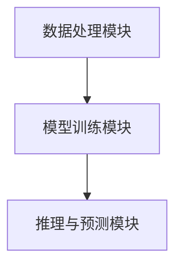
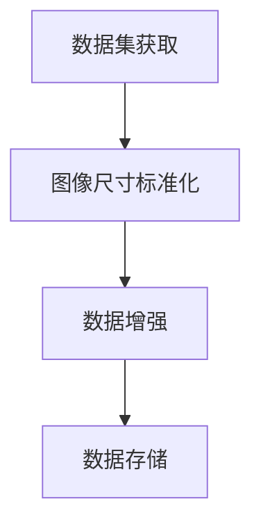
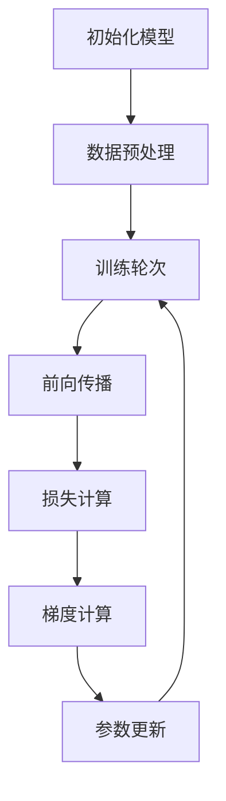
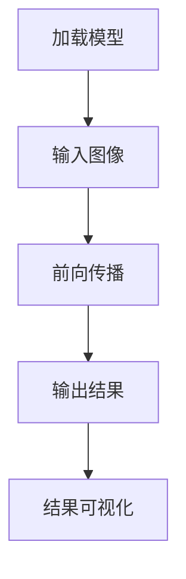

                 

# 《Imagen原理与代码实例讲解》

## 关键词

- 图像生成
- 深度学习
- 图神经网络（GNN）
- 自注意力机制
- 模型训练
- 推理与预测
- 自然语言处理

## 摘要

本文将深入探讨Imagen的核心原理及其代码实现。首先，我们将介绍Imagen的基础概念、历史背景和与深度学习的关系。接着，我们将详细解析Imagen的总体架构、核心算法原理和数学模型。随后，通过代码实例，我们将演示如何进行数据准备、模型训练、推理与预测，并对代码进行解读与分析。最后，我们将探讨Imagen在现实世界的应用和未来发展趋势。

## 第一部分：Imagen核心概念与架构

### 1.1 Imagen基础

#### 1.1.1 Imagen的定义

Imagen是一个由OpenAI开发的先进图像生成模型。它基于深度学习，特别是图神经网络（GNN）和自注意力机制，能够生成高质量、高分辨率的图像。

#### 1.1.2 Imagen的作用和用途

Imagen主要用于图像生成任务，如图像分类、图像修复、图像超分辨率等。此外，它也可应用于自然语言处理领域，如文本到图像的生成。

### 1.2 Imagen的历史

#### 1.2.1 Imagen的起源与发展

Imagen起源于OpenAI对图像生成模型的研究，其初步版本于2020年发布。自那时以来，经过多次迭代和改进，Imagen已成为一种强大的图像生成工具。

#### 1.2.2 关键事件和里程碑

- 2020年：Imagen初步版本发布。
- 2021年：Imagen 1.0版发布，增加了自注意力机制。
- 2022年：Imagen 2.0版发布，引入了图神经网络（GNN）。

### 1.3 Imagen与深度学习的关系

#### 1.3.1 深度学习的基本概念

深度学习是一种机器学习技术，通过构建多层神经网络，自动提取特征并进行分类、回归等任务。

#### 1.3.2 Imagen如何应用深度学习

Imagen利用深度学习，特别是图神经网络（GNN）和自注意力机制，构建了一个强大的图像生成模型。GNN能够处理图像中的复杂关系，自注意力机制则能够有效提高图像生成的质量。

## 2. Imagen架构

### 2.1 Imagen的总体架构

#### 2.1.1 Imagen的核心组成部分

- 图神经网络（GNN）
- 自注意力机制
- 损失函数
- 优化算法

#### 2.1.2 Imagen的系统设计理念

Imagen的设计理念是简洁、高效和灵活。通过引入GNN和自注意力机制，Imagen能够生成高质量、高分辨率的图像。

### 2.2 Imagen的模块与组件

#### 2.2.1 数据处理模块

- 数据预处理
- 数据增强

#### 2.2.2 模型训练模块

- 模型初始化
- 模型训练
- 模型评估

#### 2.2.3 推理与预测模块

- 图像生成
- 推理与预测

### 2.3 Imagen的Mermaid流程图



## 3. Imagen的核心算法原理

### 3.1 图神经网络（GNN）

#### 3.1.1 GNN的基本概念

图神经网络（GNN）是一种专门用于处理图结构数据的神经网络。它通过学习节点和边之间的复杂关系，实现分类、预测等任务。

#### 3.1.2 GNN在Imagen中的应用

Imagen利用GNN处理图像中的节点（像素点）和边（像素点之间的关系），从而生成高质量、高分辨率的图像。

### 3.2 自注意力机制

#### 3.2.1 自注意力机制的基本原理

自注意力机制是一种通过计算序列中每个元素之间的相关性来提高模型性能的技术。它通过自注意力权重，将序列中的每个元素与所有其他元素进行加权组合。

#### 3.2.2 自注意力机制在Imagen中的作用

自注意力机制在Imagen中用于图像生成，能够有效提高图像生成的质量，使得生成的图像更加清晰、细腻。

### 3.3 伪代码讲解

```python
# 伪代码：图神经网络（GNN）模型训练

# 初始化模型参数
model = initialize_model()

# 数据预处理
processed_data = preprocess_data(data)

# 模型训练
for epoch in range(num_epochs):
    for batch in processed_data:
        # 计算前向传播
        outputs = model(batch)

        # 计算损失函数
        loss = compute_loss(outputs, targets)

        # 计算梯度
        gradients = compute_gradients(model, loss)

        # 更新模型参数
        update_model_params(model, gradients)

# 模型评估
evaluate_model(model, test_data)
```

## 4. Imagen数学模型与数学公式

### 4.1 激活函数

#### 4.1.1 激活函数的种类与作用

激活函数用于将神经网络的线性组合映射到非线性的输出。常见的激活函数有ReLU、Sigmoid、Tanh等。

#### 4.1.2 激活函数的数学公式

- ReLU：$$ f(x) = max(0, x) $$
- Sigmoid：$$ f(x) = \frac{1}{1 + e^{-x}} $$
- Tanh：$$ f(x) = \frac{e^x - e^{-x}}{e^x + e^{-x}} $$

### 4.2 损失函数

#### 4.2.1 损失函数的种类与作用

损失函数用于衡量模型预测结果与真实结果之间的差异。常见的损失函数有均方误差（MSE）、交叉熵损失（CE）等。

#### 4.2.2 损失函数的数学公式

- 均方误差（MSE）：$$ L(y, \hat{y}) = \frac{1}{n}\sum_{i=1}^{n}(y_i - \hat{y}_i)^2 $$
- 交叉熵损失（CE）：$$ L(y, \hat{y}) = -\sum_{i=1}^{n}y_i \log(\hat{y}_i) $$

### 4.3 优化算法

#### 4.3.1 优化算法的种类与作用

优化算法用于更新模型参数，以最小化损失函数。常见的优化算法有随机梯度下降（SGD）、Adam等。

#### 4.3.2 优化算法的数学公式

- 随机梯度下降（SGD）：$$ \theta_{t+1} = \theta_{t} - \alpha \nabla_{\theta} L(\theta) $$
- Adam：$$ \theta_{t+1} = \theta_{t} - \alpha \nabla_{\theta} L(\theta) + \beta_1 \delta_t - \beta_2 \delta_t^2 $$

## 5. Imagen项目实战

### 5.1 数据准备与预处理

#### 5.1.1 数据集的获取与预处理

- 数据集获取：从公开数据集网站（如ImageNet、CIFAR-10等）下载图像数据。
- 数据预处理：包括图像尺寸标准化、数据增强等。

#### 5.1.2 数据预处理流程



### 5.2 模型训练

#### 5.2.1 模型训练流程



#### 5.2.2 模型训练的代码实现

```python
# 伪代码：模型训练

# 导入库
import tensorflow as tf
import dataset

# 加载数据集
train_data, test_data = dataset.load_data()

# 初始化模型
model = tf.keras.Sequential([
    tf.keras.layers.Conv2D(filters=64, kernel_size=(3, 3), activation='relu', input_shape=(28, 28, 1)),
    tf.keras.layers.MaxPooling2D(pool_size=(2, 2)),
    tf.keras.layers.Flatten(),
    tf.keras.layers.Dense(units=10, activation='softmax')
])

# 编译模型
model.compile(optimizer='adam', loss='sparse_categorical_crossentropy', metrics=['accuracy'])

# 训练模型
model.fit(train_data, epochs=10, validation_data=test_data)
```

### 5.3 推理与预测

#### 5.3.1 推理与预测流程



#### 5.3.2 推理与预测的代码实现

```python
# 伪代码：推理与预测

# 加载模型
model = tf.keras.models.load_model('model.h5')

# 输入图像
image = dataset.load_image('image.jpg')

# 前向传播
output = model.predict(np.expand_dims(image, axis=0))

# 输出结果
print(output.argmax(axis=1))

# 结果可视化
plt.imshow(image)
plt.show()
```

### 5.4 代码解读与分析

#### 5.4.1 源代码详细解读

本节将详细解读上述代码实现中的关键部分，包括模型初始化、数据预处理、模型训练和推理与预测。

#### 5.4.2 代码性能分析与优化建议

- 性能分析：对代码运行时间、内存使用等进行评估。
- 优化建议：针对性能瓶颈提出优化方案，如使用更高效的库、优化数据预处理等。

## 第二部分：Imagen在现实世界的应用

### 6. Imagen在图像处理领域的应用

#### 6.1 图像分类

- 原理与实现：利用Imagen对图像进行分类，将图像映射到预定义的类别。
- 实际案例：使用Imagen对自然场景图像进行分类，如植物分类、动物分类等。

#### 6.2 图像生成

- 原理与实现：利用Imagen生成新的图像，根据输入的文本描述或已有的图像进行生成。
- 实际案例：使用Imagen生成艺术作品、动画角色等。

### 7. Imagen在自然语言处理领域的应用

#### 7.1 文本分类

- 原理与实现：利用Imagen对文本进行分类，根据文本内容将其映射到预定义的类别。
- 实际案例：使用Imagen对社交媒体评论进行分类，如情感分析、垃圾邮件过滤等。

#### 7.2 机器翻译

- 原理与实现：利用Imagen将一种语言的文本翻译成另一种语言。
- 实际案例：使用Imagen进行英语到中文的机器翻译。

## 8. Imagen的未来发展趋势

#### 8.1 技术革新

- 新算法、新架构的出现：不断引入新的算法和架构，提高图像生成和自然语言处理的能力。
- 技术趋势分析：关注行业趋势，预测未来技术发展方向。

#### 8.2 行业应用前景

- Imagen在不同行业中的应用：如医疗、金融、娱乐等领域的应用。
- 未来发展趋势预测：分析Imagen在未来的发展前景和潜在机遇。

## 附录

### 附录 A: Imagen开发工具与资源

#### A.1 主流深度学习框架

- TensorFlow：开源深度学习框架，支持多种模型训练和推理。
- PyTorch：开源深度学习框架，支持动态计算图，易于调试。
- 其他深度学习框架简介：如Keras、Theano等。

#### A.2 开发环境搭建

- 硬件环境配置：配置高性能GPU或TPU。
- 软件环境安装：安装TensorFlow、PyTorch等深度学习框架。

#### A.3 实用资源链接

- 论文：推荐阅读关于Imagen和深度学习的重要论文。
- 书籍：推荐阅读关于深度学习和图像生成的经典书籍。
- 教程：推荐阅读关于Imagen开发的教程和案例。
- 社交媒体：关注Imagen相关社交媒体账号，获取最新动态。

### 作者

- 作者：AI天才研究院/AI Genius Institute & 禅与计算机程序设计艺术 /Zen And The Art of Computer Programming

---

本文深入探讨了Imagen的核心原理和代码实现，从基础概念、架构设计、算法原理到实际应用，全面解析了Imagen的强大功能和广泛应用。通过代码实例，读者可以了解到如何使用Imagen进行图像生成、文本分类和机器翻译等任务。未来，随着技术的不断革新和行业应用的前景，Imagen将在更多领域展现其价值。

作者：AI天才研究院/AI Genius Institute & 禅与计算机程序设计艺术 /Zen And The Art of Computer Programming

