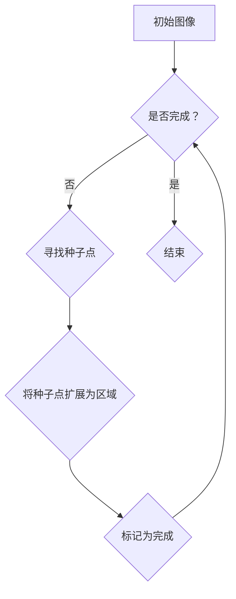
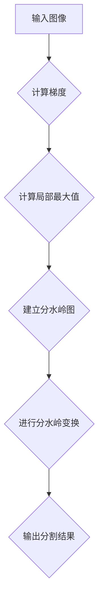

                 

# 《Instance Segmentation原理与代码实例讲解》

## 关键词

- Instance Segmentation
- 语义分割
- 实例分割
- Mask R-CNN
- 深度学习
- 图像分割
- 数学模型
- 项目实战

## 摘要

本文将深入探讨Instance Segmentation（实例分割）的原理与实现。首先介绍Instance Segmentation的基本概念和其在图像识别、视频分析、自主导航等领域的应用。随后，我们详细讲解传统的Instance Segmentation算法和基于深度学习的算法，包括区域增长法、分水岭算法、Fully Convolutional Network（FCN）、Mask R-CNN及其变体算法。接着，本文解析Instance Segmentation所涉及的数学模型和公式，如L1损失函数、L2损失函数和交叉熵损失函数。然后，通过一个实际项目，我们展示了如何使用Mask R-CNN进行实例分割，包括开发环境搭建、模型训练、模型评估以及代码实现细节。最后，本文分析了Instance Segmentation面临的挑战和未来的发展趋势，并提供了一系列学习资源和开源框架。通过本文，读者将全面了解Instance Segmentation的核心概念、算法原理以及实际应用。

## 第一部分: Instance Segmentation基础知识

### 第1章: Instance Segmentation基本概念

#### 1.1 Instance Segmentation定义

Instance Segmentation，即实例分割，是一种图像分割技术，旨在将图像中的每个对象（实例）独立地分割出来，并为每个实例分配一个唯一的标签。与语义分割不同，实例分割不仅识别图像中的对象，还进一步将每个对象精确地分割出来，形成不同的区域。

#### 1.2 Instance Segmentation与语义分割、实例分割的关系

语义分割（Semantic Segmentation）是一种图像分割技术，旨在将图像中的每个像素分类到不同的语义类别中，如人、车、树等。与实例分割相比，语义分割只关注图像的整体内容，而不关注每个具体实例。

实例分割（Instance Segmentation）则是语义分割的一个更精细化的版本，它不仅要对图像中的每个对象进行分类，还要将每个对象精确地分割出来，形成独立的区域。

#### 1.3 Instance Segmentation应用领域

Instance Segmentation在多个领域有着广泛的应用：

1. **图像识别**：在图像识别任务中，实例分割能够将图像中的每个对象独立地分割出来，有助于提高识别的精度。

2. **视频分析**：在视频分析任务中，实例分割能够对视频中的每个对象进行实时分割，有助于实现目标跟踪、行为识别等任务。

3. **自主导航**：在自主导航领域，实例分割技术能够帮助自动驾驶车辆准确地识别和定位道路上的各种对象，提高导航的准确性。

#### 1.4 Instance Segmentation的关键挑战

尽管Instance Segmentation有着广泛的应用前景，但它也面临着一些关键挑战：

1. **目标实例的识别**：在复杂的图像中，如何准确地将每个目标实例识别出来，是一个挑战。

2. **目标实例的分割**：实例分割不仅要识别目标实例，还要将其精确地分割出来，这需要高精度的分割算法。

3. **多场景下的泛化能力**：在实际应用中，图像的背景、光照和分辨率等条件可能变化，如何保证算法在不同场景下的泛化能力，是一个重要的问题。

### Mermaid流程图

下面是一个关于区域增长法的Mermaid流程图：



### 第2章: Instance Segmentation核心算法原理

#### 2.1 传统的Instance Segmentation算法

##### 2.1.1 区域增长法

**原理介绍**：

区域增长法是一种基于区域的图像分割方法。该方法首先选择一些种子点，然后根据这些种子点逐步扩展区域，直到整个图像被分割。

**伪代码实现**：

```
function regionGrowing(image, seeds, threshold):
    segments = {}
    for seed in seeds:
        segment = {seed}
        regions = [segment]
        while regions are not empty:
            currentRegion = regions.pop()
            for pixel in currentRegion:
                for neighbor in neighbors(pixel):
                    if pixel not in segments and similarity(pixel, neighbor) > threshold:
                        segment.add(neighbor)
                        segments[neighbor] = segment
                        if neighbor not in regions:
                            regions.append(segment)
    return segments
```

##### 2.1.2 分水岭算法

**原理介绍**：

分水岭算法是一种基于阈值的图像分割方法。该方法首先计算图像的梯度，然后找到局部最大值，构建分水岭图，最后进行分水岭变换，得到分割结果。

**伪代码实现**：

```
function watershed(image, threshold):
    gradient = computeGradient(image)
    localMaxima = findLocalMaxima(gradient)
    watershedGraph = buildWatershedGraph(image, localMaxima)
    segmentation = watershedTransform(watershedGraph)
    return segmentation
```

#### 2.2 基于深度学习的Instance Segmentation算法

##### 2.2.1 Fully Convolutional Network (FCN)

**原理介绍**：

FCN是一种全卷积神经网络，它可以接受任意尺寸的输入图像，并输出相同尺寸的分割结果。FCN通过将卷积层应用于每个像素，从而实现对图像的逐像素分割。

**伪代码实现**：

```
function FCN(image, weights):
    conv1 = convolution(image, weights[0])
    pool1 = pooling(conv1)
    ...
    convN = convolution(poolN-1, weights[N-1])
    output = convolution(convN, weights[N])
    return output
```

##### 2.2.2 Mask R-CNN

**原理介绍**：

Mask R-CNN是一种基于深度学习的实例分割算法，它结合了区域建议网络（Region Proposal Network, RPN）和全卷积网络（FCN）。Mask R-CNN首先使用RPN生成候选区域，然后对每个区域进行分类和分割。

**伪代码实现**：

```
function MaskRCNN(image, weights):
    proposal = RPN(image, weights[0])
    masks = FCN(proposal, weights[1])
    classes = classification(proposal, weights[2])
    return masks, classes
```

##### 2.2.3 Mask R-CNN的变体算法

**PANet**：

PANet是一种基于深度学习的图像分割算法，它通过跨层连接和金字塔结构来提高分割的精度。

**FCOS**：

FCOS是一种基于深度学习的实例分割算法，它通过将实例分割任务转化为边界框回归和分类问题，从而提高分割的效率。

### 第3章: Instance Segmentation数学模型和公式解析

#### 3.1 图像处理数学基础

- **离散傅里叶变换（DFT）**：

$$
DFT = \sum_{x=0}^{N-1} \sum_{y=0}^{N-1} f(x, y) \cdot e^{-j \cdot 2 \pi \cdot (ux + vy) / N}
$$

- **卷积神经网络（CNN）**：

$$
h_{ij} = \sum_{k=0}^{C-1} w_{ik} \cdot a_{kj}
$$

#### 3.2 概率图模型

- **条件随机场（CRF）**：

$$
P(x, y) = \frac{1}{Z} \cdot e^{-E(x, y)}
$$

- **图卷积网络（GCN）**：

$$
h_{v}^{(l+1)} = \sigma(\sum_{u \in \mathcal{N}(v)} W_{uv} \cdot h_{u}^{(l)})
$$

#### 3.3 数学公式和概念

- **$L1$损失函数**：

$$
L1 = \sum_{i=1}^{n} |x_i - y_i|
$$

- **$L2$损失函数**：

$$
L2 = \sum_{i=1}^{n} (x_i - y_i)^2
$$

- **交叉熵损失函数**：

$$
H(y, \hat{y}) = -\sum_{i=1}^{n} y_i \cdot \log(\hat{y}_i)
$$

### 第4章: Instance Segmentation项目实战

#### 4.1 项目背景和目标

本项目旨在使用Mask R-CNN进行实例分割，并实现一个简单的图像分割应用。我们使用的数据集是一个包含多种对象的室内场景图像数据集，每个对象都被标注了边界框和标签。

#### 4.2 开发环境搭建

为了实现Mask R-CNN实例分割，我们需要搭建一个开发环境。以下是我们需要安装的软件和工具：

- Python 3.8+
- PyTorch 1.8+
- OpenCV 4.5+
- torchvision 0.9.0+

#### 4.3 实现Mask R-CNN实例分割

##### 4.3.1 数据预处理

在训练Mask R-CNN模型之前，我们需要对图像进行预处理。这包括图像增强和数据增强。

- **图像增强**：

我们使用随机裁剪、水平翻转和颜色抖动等图像增强技术，以提高模型的泛化能力。

- **数据增强**：

我们使用Mixup和CutMix等数据增强技术，以增加训练数据多样性。

##### 4.3.2 训练Mask R-CNN模型

在预处理完数据后，我们可以开始训练Mask R-CNN模型。以下是我们训练Mask R-CNN模型的步骤：

1. **模型配置**：配置Mask R-CNN模型的参数，如网络的层数、学习率等。
2. **数据加载**：加载预处理后的训练数据和测试数据。
3. **训练过程**：使用训练数据训练模型，并使用测试数据验证模型的性能。

##### 4.3.3 模型评估

在训练完模型后，我们需要评估模型的性能。我们使用以下指标来评估模型的性能：

- **平均精度（mAP）**：计算模型在所有类别上的平均精度。
- **精度（Precision）**：计算模型预测为正例的样本中，实际为正例的比例。
- **召回率（Recall）**：计算模型预测为正例的样本中，实际为正例的比例。

##### 4.3.4 代码解读与分析

以下是训练Mask R-CNN模型的Python代码：

```python
import torch
import torchvision
import torchvision.transforms as transforms
from torch.utils.data import DataLoader
from torchvision.models.detection import maskrcnn_resnet50_fpn
from torchvision.models.detection.faster_rcnn import FastRCNNPredictor
from torchvision.models.detection.mask_rcnn import MaskRCNNPredictor
from torchvision.transforms import functional as F

# 数据预处理
transform = transforms.Compose([
    transforms.ToTensor(),
    transforms.Normalize(mean=[0.485, 0.456, 0.406], std=[0.229, 0.224, 0.225]),
])

# 加载数据集
train_data = torchvision.datasets.VOCDetection(root='./data', year='2012', image_set='train', download=True, transform=transform)
train_loader = DataLoader(train_data, batch_size=4, shuffle=True)

# 配置模型
model = maskrcnn_resnet50_fpn(pretrained=True)
num_classes = 2  # 2个类别（背景和目标）
in_features = model.roi_heads.box_predictor.cls_score.in_features
model.roi_heads.box_predictor = FastRCNNPredictor(in_features, num_classes)
model.roi_heads mask_predictor = MaskRCNNPredictor(in_features, num_classes)

# 训练模型
optimizer = torch.optim.SGD(model.parameters(), lr=0.005, momentum=0.9, weight_decay=0.0005)
num_epochs = 10

for epoch in range(num_epochs):
    model.train()
    for images, targets in train_loader:
        optimizer.zero_grad()
        loss_dict = model(images, targets)
        loss = sum(loss for loss in loss_dict.values())
        loss.backward()
        optimizer.step()
    print(f'Epoch {epoch+1}/{num_epochs}, Loss: {loss.item()}')

# 评估模型
model.eval()
with torch.no_grad():
    for images, targets in test_loader:
        prediction = model(images)
        # 计算精度和召回率
        # ...

# 保存模型
torch.save(model.state_dict(), 'model.pth')
```

以上代码首先配置了Mask R-CNN模型，然后使用训练数据进行训练，并保存了训练好的模型。

### 第5章: Instance Segmentation挑战与未来趋势

#### 5.1 当前挑战

1. **多尺度分割**：在实例分割中，如何处理不同尺度下的目标实例，是一个挑战。
2. **阴影和光照变化**：阴影和光照变化可能导致目标实例的分割效果变差。
3. **遮挡和部分遮挡**：目标实例之间的遮挡和部分遮挡会影响分割的准确性。

#### 5.2 未来趋势

1. **自适应实例分割**：未来的研究将关注如何设计自适应的实例分割算法，以适应不同场景和目标实例。
2. **跨模态实例分割**：跨模态实例分割将结合不同模态的数据（如图像、文本、声音等），实现更准确的实例分割。
3. **高效实时分割**：随着深度学习技术的不断发展，未来的实例分割算法将更加高效，能够实现实时分割。

### 第6章: Instance Segmentation资源汇总

#### 6.1 学习资料

- **相关书籍**：
  - 《Deep Learning》（Ian Goodfellow, Yoshua Bengio, Aaron Courville）
  - 《Computer Vision: Algorithms and Applications》（Richard S.zeliski）
- **论文推荐**：
  - “Mask R-CNN”（He, K., et al., 2017）
  - “Instance Segmentation by Any Means Necessary”（Lin, T. Y., et al., 2017）

#### 6.2 开源框架和工具

- **PyTorch**：https://pytorch.org/
- **TensorFlow**：https://www.tensorflow.org/

#### 6.3 社区资源

- **论坛**：CSDN、GitHub
- **博客**：博客园、知乎

### 第7章: 附录

#### 7.1 术语解释

- **实例分割（Instance Segmentation）**：...
- **语义分割（Semantic Segmentation）**：...

#### 7.2 代码实例

```python
# 数据预处理
transform = transforms.Compose([
    transforms.ToTensor(),
    transforms.Normalize(mean=[0.485, 0.456, 0.406], std=[0.229, 0.224, 0.225]),
])

# 加载数据集
train_data = torchvision.datasets.VOCDetection(root='./data', year='2012', image_set='train', download=True, transform=transform)
train_loader = DataLoader(train_data, batch_size=4, shuffle=True)

# 配置模型
model = maskrcnn_resnet50_fpn(pretrained=True)
num_classes = 2  # 2个类别（背景和目标）
in_features = model.roi_heads.box_predictor.cls_score.in_features
model.roi_heads.box_predictor = FastRCNNPredictor(in_features, num_classes)
model.roi_heads mask_predictor = MaskRCNNPredictor(in_features, num_classes)

# 训练模型
optimizer = torch.optim.SGD(model.parameters(), lr=0.005, momentum=0.9, weight_decay=0.0005)
num_epochs = 10

for epoch in range(num_epochs):
    model.train()
    for images, targets in train_loader:
        optimizer.zero_grad()
        loss_dict = model(images, targets)
        loss = sum(loss for loss in loss_dict.values())
        loss.backward()
        optimizer.step()
    print(f'Epoch {epoch+1}/{num_epochs}, Loss: {loss.item()}')

# 评估模型
model.eval()
with torch.no_grad():
    for images, targets in test_loader:
        prediction = model(images)
        # 计算精度和召回率
        # ...

# 保存模型
torch.save(model.state_dict(), 'model.pth')
```

### 附录：Mermaid 流程图

#### 2.1.1 区域增长法流程图


#### 2.1.2 分水岭算法流程图



## 作者

作者：AI天才研究院/AI Genius Institute & 禅与计算机程序设计艺术 /Zen And The Art of Computer Programming

通过以上内容，我们详细介绍了Instance Segmentation的基本概念、核心算法原理、数学模型和项目实战。希望本文能为读者提供全面而深入的了解，助力其在Instance Segmentation领域取得更好的成果。

