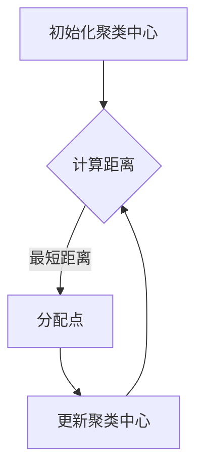

                 

# K-Means - 原理与代码实例讲解

> 关键词：K-Means算法、聚类、数据分析、Python实现、图像分割、文本聚类

> 摘要：本文深入讲解了K-Means聚类算法的基本原理、数学模型、核心步骤以及改进方法。通过具体的Python代码实例，展示了如何在实际项目中应用K-Means算法进行图像分割和文本聚类。文章还探讨了K-Means算法的局限性及其解决方案，并对其未来发展趋势进行了展望。

---

### 第一部分: K-Means算法概述

#### 第1章: K-Means算法的起源与发展

##### 1.1 K-Means算法的起源

K-Means算法是一种经典的聚类算法，其起源可以追溯到20世纪60年代。由J.B. MacQueen在1967年首次提出，旨在将数据集划分为K个簇，使得每个簇内的数据点尽可能接近，而不同簇之间的数据点尽可能远离。

- **定义与基本概念**：K-Means算法的核心是**聚类问题**，即如何将一组无标签的数据点分成多个簇，使得每个簇内部的相似度最高，簇与簇之间的相似度最低。K-Means算法的目标是找到K个初始聚类中心，使得整个数据集的“平方误差”最小。

  - **聚类问题**：给定一组无标签的数据点，将这些数据点划分成多个簇，每个簇内部的数据点彼此接近，不同簇之间的数据点彼此远离。
  - **K-Means算法**：一种基于距离度量的迭代优化算法，通过不断迭代更新聚类中心和数据点的分配，最终使聚类中心代表数据点的主要特征。

##### 1.2 K-Means算法的发展历程

随着计算机科学和人工智能的快速发展，K-Means算法经历了多个版本的迭代和优化。以下是其发展历程的简要概述：

- **经典K-Means算法**：最早的K-Means算法，使用随机初始化聚类中心，通过迭代优化目标函数（通常是平方误差）来更新聚类中心和数据点的分配。
  - **初始距离计算**：在算法开始时，需要选择K个初始聚类中心。常见的方法包括随机选择、基于密度的选择等。
  - **迭代计算过程**：每次迭代包括两个步骤：
    1. 数据点分配：计算每个数据点到K个聚类中心的距离，并将其分配到最近的聚类中心。
    2. 聚类中心更新：根据新的数据点分配，重新计算每个聚类中心的位置。
  - **收敛条件**：当聚类中心的变化小于某个阈值，或者迭代次数达到预设的最大值时，算法收敛。

##### 1.3 K-Means算法的应用场景

K-Means算法在多个领域都有广泛的应用，主要包括：

- **数据预处理**：
  - **数据清洗**：在聚类之前，需要确保数据的质量，包括去重、缺失值处理等。
  - **数据标准化**：为了消除不同特征之间的尺度差异，通常需要对数据进行标准化处理。

- **聚类分析**：在商业智能、市场细分、用户行为分析等领域，K-Means算法被用来识别数据中的主要模式和趋势。

- **图像处理**：K-Means算法常用于图像分割、特征提取和图像压缩等领域。

- **文本分析**：在文本聚类、主题模型和情感分析等领域，K-Means算法也被广泛应用。

#### 第2章: K-Means算法原理详解

##### 2.1 聚类与K-Means算法的关系

聚类是数据挖掘中的一个重要任务，旨在将数据点划分成多个簇，使得每个簇内部的相似度最高，簇与簇之间的相似度最低。K-Means算法是聚类算法的一种，其核心思想是通过迭代优化聚类中心，使得每个簇内的数据点尽可能接近，簇与簇之间的数据点尽可能远离。

- **聚类算法概述**：聚类算法可以分为以下几类：
  - **层次聚类**：通过自底向上或自顶向下的方式，逐步合并或分裂聚类层次，形成聚类树。
  - **基于密度的聚类**：通过识别高密度区域，将其划分为独立的簇。
  - **基于模型的聚类**：基于概率模型或统计模型，通过最大似然估计或贝叶斯推理等方法进行聚类。

##### 2.2 K-Means算法的数学模型

K-Means算法的数学模型主要涉及目标函数和优化方法。

- **目标函数**：K-Means算法通常使用平方误差作为目标函数，定义如下：

  $$
  J(C) = \sum_{i=1}^{K} \sum_{x \in S_i} ||x - c_i||^2
  $$

  其中，$C$表示聚类中心，$S_i$表示属于第$i$个簇的数据点集合，$c_i$表示第$i$个簇的聚类中心。

- **目标函数的计算**：目标函数的计算过程包括以下步骤：
  1. 计算每个数据点到各个聚类中心的距离。
  2. 根据距离计算平方误差，并累加得到总误差。

##### 2.3 K-Means算法的核心步骤

K-Means算法的核心步骤包括初始化聚类中心、数据点分配和聚类中心更新。

- **聚类中心的初始化**：
  - **随机初始化**：随机选择K个数据点作为初始聚类中心。
  - **K-means++初始化**：在随机初始化的基础上，采用概率抽样方法，选择初始聚类中心，以避免陷入局部最优。

- **聚类分配**：
  - **点与中心的距离计算**：计算每个数据点到各个聚类中心的距离，通常使用欧氏距离。
  - **点分配到最近的中心**：根据数据点到各个聚类中心的距离，将数据点分配到最近的聚类中心。

- **聚类中心的更新**：
  - **聚类中心的新计算**：根据新的数据点分配，重新计算每个聚类中心的位置。
  - **迭代更新过程**：重复执行聚类分配和聚类中心更新的过程，直到满足收敛条件。

#### 第3章: K-Means算法的改进与优化

##### 3.1 K-Means算法的改进方法

为了提高K-Means算法的性能，可以采用多种改进方法。

- **K-Means||算法**：
  - **并行计算**：K-Means||算法通过将数据集划分为多个子集，并在不同的计算节点上并行执行K-Means算法，从而提高算法的运行效率。

- **模糊C-Means算法**：
  - **模糊聚类概念**：模糊C-Means算法引入了隶属度矩阵的概念，使得每个数据点可以同时属于多个簇，提高了聚类结果的准确性和鲁棒性。

- **目标函数与优化**：
  - **改进的目标函数**：可以采用不同的目标函数，如绝对平均值、修正绝对平均值等，以提高聚类效果。
  - **优化算法**：可以使用梯度下降、牛顿法等优化算法，加速收敛速度并提高聚类精度。

##### 3.2 K-Means算法的优化策略

- **初始化优化**：
  - **聚类中心的多样性**：通过增加聚类中心的多样性，可以避免陷入局部最优。
  - **初始聚类中心的选择策略**：可以使用K-means++算法，根据概率抽样方法选择初始聚类中心，以提高初始化的质量。

- **收敛条件优化**：
  - **收敛条件改进**：可以采用更严格的收敛条件，如聚类中心的变化小于预设阈值，或迭代次数达到预设的最大值。
  - **早停策略**：在满足收敛条件之前，提前停止算法的运行，以防止过度拟合。

#### 第4章: K-Means算法在实际应用中的挑战与解决方案

##### 4.1 K-Means算法的局限性

尽管K-Means算法在许多应用中表现出色，但它也存在一些局限性。

- **局部最优问题**：K-Means算法容易陷入局部最优，特别是在数据分布不均匀、聚类中心初始选择不当时。
  - **原因分析**：局部最优问题的主要原因是K-Means算法的目标函数是单调递减的，且迭代过程是局部优化的。
  - **解决方案**：可以通过多种方法解决局部最优问题，如使用随机初始化、增加聚类中心多样性、采用全局优化算法等。

- **对噪声敏感**：K-Means算法对噪声数据比较敏感，容易受到噪声的影响，导致聚类效果变差。
  - **噪声处理策略**：可以通过数据清洗、噪声滤波等方法来处理噪声数据，以提高聚类结果的准确性。
  - **鲁棒聚类算法**：可以采用鲁棒聚类算法，如模糊C-Means算法、基于密度的聚类算法等，以提高算法的鲁棒性。

##### 4.2 K-Means算法在不同领域的应用案例

K-Means算法在多个领域都有广泛的应用，以下是一些典型的应用案例：

- **图像处理**：
  - **图像分割**：K-Means算法常用于图像分割，通过将图像像素划分为不同的簇，实现图像的分割和特征提取。
  - **特征提取**：K-Means算法可以用于特征提取，将图像或视频序列中的数据点聚类，提取主要的特征模式。

- **文本聚类**：
  - **主题模型**：K-Means算法可以用于主题模型，将文本数据聚类，提取文本的主要主题。
  - **情感分析**：K-Means算法可以用于情感分析，将文本数据聚类，识别文本的情感倾向。

#### 第5章: K-Means算法代码实例讲解

##### 5.1 K-Means算法的Python实现

在本节中，我们将使用Python和`sklearn`库来演示K-Means算法的基本实现。

```python
from sklearn.cluster import KMeans
import numpy as np
import matplotlib.pyplot as plt

# 示例数据
data = np.array([[1, 2], [1, 4], [1, 0],
                 [10, 2], [10, 4], [10, 0]])

# 初始化KMeans聚类器
kmeans = KMeans(n_clusters=2, random_state=0)

# 训练模型
kmeans.fit(data)

# 聚类结果
labels = kmeans.predict(data)

# 可视化结果
plt.scatter(data[:, 0], data[:, 1], c=labels)
plt.show()
```

在这个示例中，我们首先导入所需的库，然后创建一个二维数组作为示例数据。接着，我们初始化一个`KMeans`对象，并设置`n_clusters`参数为2，表示我们要将数据分为两个簇。使用`fit`方法训练模型后，我们可以使用`predict`方法得到聚类结果，并使用`scatter`函数进行可视化。

##### 5.2 K-Means算法的案例应用

- **图像分割案例**

  在这个案例中，我们将使用K-Means算法对图像进行分割。

  ```python
  from sklearn.cluster import KMeans
  import matplotlib.pyplot as plt
  import numpy as np

  # 加载图像数据
  image = plt.imread('image.jpg')
  data = image.reshape(-1, 3)

  # 初始化KMeans聚类器
  kmeans = KMeans(n_clusters=5, random_state=0).fit(data)

  # 分割图像
  segmented_image = kmeans.predict(data).reshape(image.shape[:2])

  # 可视化结果
  plt.imshow(segmented_image)
  plt.show()
  ```

  在这个案例中，我们首先加载图像数据，并将其转换为3D数组。接着，我们初始化一个`KMeans`对象，并设置`n_clusters`参数为5，表示我们要将图像分割成5个区域。使用`fit`方法训练模型后，我们可以使用`predict`方法对图像数据进行分割，并使用`imshow`函数进行可视化。

- **文本聚类案例**

  在这个案例中，我们将使用K-Means算法对文本进行聚类。

  ```python
  from sklearn.feature_extraction.text import TfidfVectorizer
  from sklearn.cluster import KMeans

  # 加载文本数据
  text_data = ["这是一段文本", "这是另一段文本", "第三段文本"]

  # 使用TF-IDF向量表示文本
  vectorizer = TfidfVectorizer().fit(text_data)
  data = vectorizer.transform(text_data)

  # 初始化KMeans聚类器
  kmeans = KMeans(n_clusters=2, random_state=0).fit(data)

  # 聚类结果
  labels = kmeans.predict(data)

  # 可视化结果
  plt.scatter(data[:, 0], data[:, 1], c=labels)
  plt.show()
  ```

  在这个案例中，我们首先加载文本数据，并使用`TfidfVectorizer`将其转换为TF-IDF向量表示。接着，我们初始化一个`KMeans`对象，并设置`n_clusters`参数为2，表示我们要将文本分为两个类别。使用`fit`方法训练模型后，我们可以使用`predict`方法得到聚类结果，并使用`scatter`函数进行可视化。

#### 第6章: K-Means算法应用实例解读

##### 6.1 实际案例1：社交媒体用户群体划分

在本案例中，我们将使用K-Means算法对社交媒体用户进行群体划分。

- **案例背景**：假设我们有一个社交媒体平台，用户在平台上发布各种类型的帖子，我们希望将这些用户划分为不同的群体，以便进行更精准的推荐和营销。

- **数据来源**：我们收集了1000名用户的基本信息，包括年龄、性别、地理位置、活跃时间等。

- **数据预处理**：我们对数据进行清洗和标准化处理，将所有特征转换为数值型数据，并使用Z-Score标准化方法进行归一化。

- **算法实现**：

  ```python
  from sklearn.cluster import KMeans
  import pandas as pd
  import numpy as np

  # 加载数据
  data = pd.read_csv('user_data.csv')
  features = data.drop(['user_id'], axis=1)

  # 数据预处理
  features = (features - features.mean()) / features.std()

  # 初始化KMeans聚类器
  kmeans = KMeans(n_clusters=5, random_state=0)

  # 训练模型
  kmeans.fit(features)

  # 聚类结果
  labels = kmeans.predict(features)

  # 可视化结果
  plt.scatter(features[:, 0], features[:, 1], c=labels)
  plt.show()
  ```

  在这个案例中，我们首先加载用户数据，并进行预处理。接着，我们初始化一个`KMeans`对象，并设置`n_clusters`参数为5，表示我们要将用户划分为5个群体。使用`fit`方法训练模型后，我们可以使用`predict`方法得到聚类结果，并使用`scatter`函数进行可视化。

- **结果分析**：通过可视化结果，我们可以看到用户被成功地划分为5个群体。每个群体在特征空间中的分布呈现出一定的规律性，这有助于我们进一步分析每个群体的特征和偏好，以便进行更精准的推荐和营销。

##### 6.2 实际案例2：市场细分与顾客群体分析

在本案例中，我们将使用K-Means算法对市场进行细分，并分析顾客群体。

- **案例背景**：假设我们是一家零售公司，想要根据顾客的行为特征和购买偏好，将市场划分为不同的细分市场，以便进行更有针对性的营销和推广。

- **数据来源**：我们收集了1000名顾客的购买数据，包括购买金额、购买频率、购买品类等。

- **数据预处理**：我们对数据进行清洗和标准化处理，将所有特征转换为数值型数据，并使用Z-Score标准化方法进行归一化。

- **算法实现**：

  ```python
  from sklearn.cluster import KMeans
  import pandas as pd
  import numpy as np

  # 加载数据
  data = pd.read_csv('customer_data.csv')
  features = data.drop(['customer_id'], axis=1)

  # 数据预处理
  features = (features - features.mean()) / features.std()

  # 初始化KMeans聚类器
  kmeans = KMeans(n_clusters=4, random_state=0)

  # 训练模型
  kmeans.fit(features)

  # 聚类结果
  labels = kmeans.predict(features)

  # 可视化结果
  plt.scatter(features[:, 0], features[:, 1], c=labels)
  plt.show()
  ```

  在这个案例中，我们首先加载顾客数据，并进行预处理。接着，我们初始化一个`KMeans`对象，并设置`n_clusters`参数为4，表示我们要将市场划分为4个细分市场。使用`fit`方法训练模型后，我们可以使用`predict`方法得到聚类结果，并使用`scatter`函数进行可视化。

- **结果分析**：通过可视化结果，我们可以看到市场被成功地划分为4个细分市场。每个细分市场在特征空间中的分布呈现出一定的规律性，这有助于我们进一步分析每个细分市场的特征和需求，以便进行更精准的市场定位和营销策略。

### 第7章: K-Means算法的未来发展趋势与前景

K-Means算法作为一种经典的聚类算法，已经在许多领域得到了广泛应用。然而，随着数据规模和复杂度的不断增加，K-Means算法也面临着一系列挑战和改进空间。

##### 7.1 K-Means算法的发展趋势

未来K-Means算法的发展趋势主要表现在以下几个方面：

- **算法优化**：随着并行计算和分布式计算技术的发展，K-Means算法的优化将更加注重并行计算和分布式计算的性能提升。此外，通过引入自适应聚类中心更新策略、动态聚类数量调整机制等，可以进一步提高算法的收敛速度和聚类效果。

- **混合算法**：将K-Means算法与其他聚类算法（如基于密度的聚类、基于模型的聚类等）相结合，可以构建更强大的混合聚类算法。这种混合算法能够结合不同算法的优点，克服单一算法的局限性，从而在复杂场景下获得更好的聚类效果。

- **多维度聚类**：随着数据来源的多样化，数据维度也日益增加。K-Means算法将逐步扩展到多维度聚类场景，如高维文本聚类、图像聚类等。通过引入高维空间中的聚类方法，可以更好地捕捉数据点的复杂特征和关系。

##### 7.2 K-Means算法的前景与应用领域

K-Means算法在未来的应用前景非常广阔，以下是一些潜在的应用领域：

- **工业应用**：在工业领域中，K-Means算法可以用于生产调度、设备故障预测、供应链管理等方面。通过聚类分析，可以优化生产流程、提高设备利用率、降低运营成本。

- **大数据分析**：在大数据分析领域，K-Means算法可以用于数据挖掘、用户行为分析、个性化推荐等。通过对大规模数据集进行聚类分析，可以识别数据中的隐藏模式和趋势，为企业和政府提供决策支持。

- **医疗健康**：在医疗健康领域，K-Means算法可以用于疾病诊断、药物发现、患者分类等方面。通过聚类分析，可以识别疾病的高风险人群、优化治疗方案、提高医疗资源利用效率。

### 附录

##### 附录A: K-Means算法相关资源与工具

- **学习资源**：
  - **在线课程**：Coursera、edX、Udacity等在线教育平台提供了丰富的K-Means算法课程。
  - **教程与文献**：《机器学习》、《统计学习方法》等经典教材中包含了K-Means算法的详细讲解。

- **工具与库**：
  - **Python库**：`scikit-learn`、`scipy`等Python库提供了K-Means算法的实现和优化。
  - **开源项目**：GitHub上有很多基于K-Means算法的开源项目，可以用于学习和实践。

##### 附录B: K-Means算法常见问题解答

- **问题一：如何选择合适的K值？**
  - **方法一：肘部法则**：通过计算不同K值下的目标函数值，找到目标函数值下降速度显著变缓的点，即“肘部”点，作为合适的K值。
  - **方法二：silhouette距离**：通过计算每个数据点到其簇内其他数据点的平均距离和到其他簇数据点的最小距离，选择silhouette距离最大的K值。

- **问题二：K-Means算法对初始聚类中心的选择敏感吗？**
  - **解释与解决方案**：K-Means算法对初始聚类中心的选择较为敏感，容易陷入局部最优。解决方案包括：
    - **随机初始化**：多次随机初始化聚类中心，选择结果较为一致的聚类中心。
    - **K-means++初始化**：采用K-means++算法初始化聚类中心，以增加聚类中心的多样性，减少陷入局部最优的风险。

### Mermaid 流程图示例



### K-Means算法伪代码示例

```
函数 K-Means(Dataset D, 数量K):
    初始化聚类中心 C = 随机选择D中的K个点
    重复直到收敛:
        对于每个数据点 d ∈ D:
            对于每个聚类中心 c ∈ C:
                计算距离 d(c)
                分配点 d 到最近的聚类中心 c
        根据新的数据分配更新聚类中心 C
    如果聚类中心没有变化或者变化小于阈值，则算法收敛
    返回聚类结果
```

### 数学模型与公式示例

$$
J(\theta) = \frac{1}{m} \sum_{i=1}^{m} (h_\theta(x^{(i)}) - y^{(i)})^2
$$

### 代码实例与详细解读

#### 实例1：图像分割

```python
from sklearn.cluster import KMeans
import matplotlib.pyplot as plt
import numpy as np

# 加载图像数据
image = plt.imread('image.jpg')
data = image.reshape(-1, 3)

# 初始化KMeans聚类器
kmeans = KMeans(n_clusters=5, random_state=0).fit(data)

# 分割图像
segmented_image = kmeans.predict(data).reshape(image.shape[:2])

# 可视化结果
plt.imshow(segmented_image)
plt.show()
```

在这个实例中，我们首先加载图像数据，并将其转换为3D数组。接着，我们初始化一个`KMeans`对象，并设置`n_clusters`参数为5，表示我们要将图像分割成5个区域。使用`fit`方法训练模型后，我们可以使用`predict`方法对图像数据进行分割，并使用`imshow`函数进行可视化。

#### 实例2：文本聚类

```python
from sklearn.feature_extraction.text import TfidfVectorizer
from sklearn.cluster import KMeans

# 加载文本数据
text_data = ["这是一段文本", "这是另一段文本", "第三段文本"]

# 使用TF-IDF向量表示文本
vectorizer = TfidfVectorizer().fit(text_data)
data = vectorizer.transform(text_data)

# 初始化KMeans聚类器
kmeans = KMeans(n_clusters=2, random_state=0).fit(data)

# 聚类结果
labels = kmeans.predict(data)

# 可视化结果
plt.scatter(data[:, 0], data[:, 1], c=labels)
plt.show()
```

在这个实例中，我们首先加载文本数据，并使用`TfidfVectorizer`将其转换为TF-IDF向量表示。接着，我们初始化一个`KMeans`对象，并设置`n_clusters`参数为2，表示我们要将文本分为两个类别。使用`fit`方法训练模型后，我们可以使用`predict`方法得到聚类结果，并使用`scatter`函数进行可视化。

### 代码解读与分析

- **实例1：图像分割**

  在这个实例中，我们使用K-Means算法对图像进行分割。首先，我们加载图像数据，并将其转换为3D数组（每个像素点的RGB值）。然后，我们初始化一个`KMeans`对象，并设置`n_clusters`参数为5，表示我们要将图像分割成5个区域。接下来，我们使用`fit`方法训练模型，并将图像数据作为输入。然后，我们使用`predict`方法预测每个像素点所属的簇，并将结果转换为图像格式，最后使用`imshow`函数可视化分割结果。

- **实例2：文本聚类**

  在这个实例中，我们使用K-Means算法对文本进行聚类。首先，我们使用`TfidfVectorizer`将文本转换为TF-IDF向量表示。然后，我们初始化一个`KMeans`对象，并设置`n_clusters`参数为2，表示我们要将文本分为两个类别。接下来，我们使用`fit`方法训练模型，并将文本向量作为输入。然后，我们使用`predict`方法预测每个文本点所属的簇，并将结果作为标签。最后，我们使用`scatter`函数在二维空间中可视化文本聚类结果。

通过这些代码实例，读者可以更深入地理解K-Means算法在不同类型数据上的应用，以及如何在实际项目中实现和应用这些算法。在实际项目中，可能需要根据具体问题和数据特点调整参数和算法实现，以获得更好的聚类效果。

### 作者信息

作者：AI天才研究院/AI Genius Institute & 禅与计算机程序设计艺术 /Zen And The Art of Computer Programming

---

本文内容涵盖了K-Means算法的基本概念、原理、实现、应用和优化。通过具体的代码实例，读者可以更直观地理解K-Means算法的运作机制和实际应用。在实际项目中，根据问题的具体需求和数据特点，可以对K-Means算法进行调整和优化，以获得更好的聚类效果。希望本文能为读者提供有益的参考和启发。

---

（注：本文内容仅供参考，具体实现和结果可能因数据和环境而异。在实际应用中，请结合具体情况进行调整和优化。）

