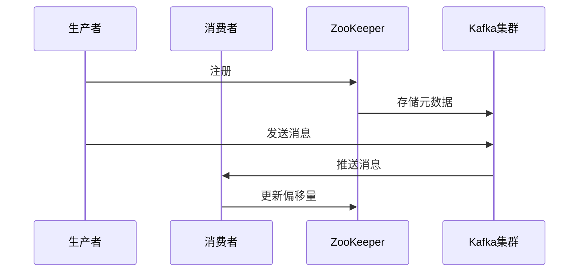
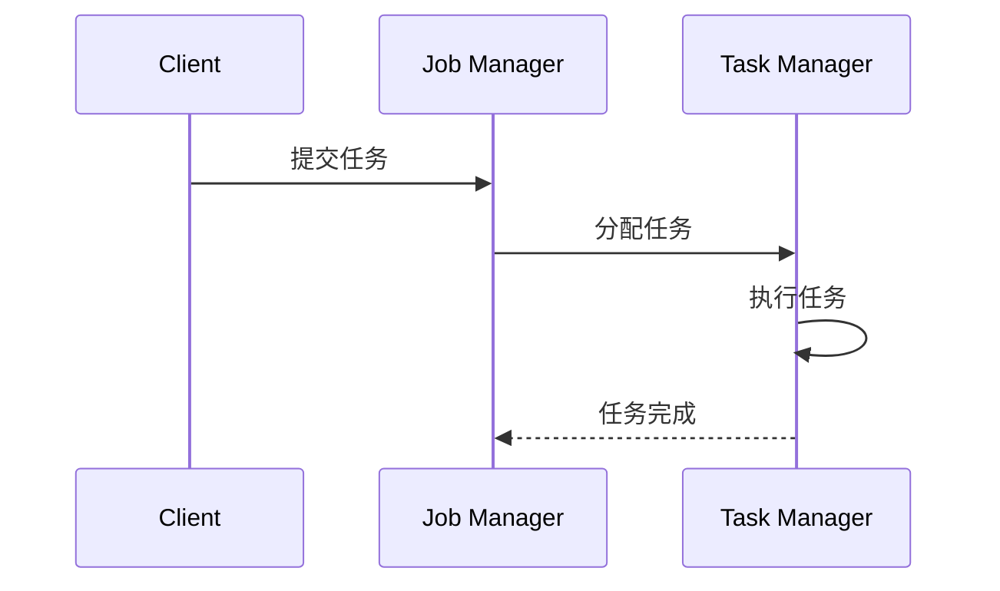
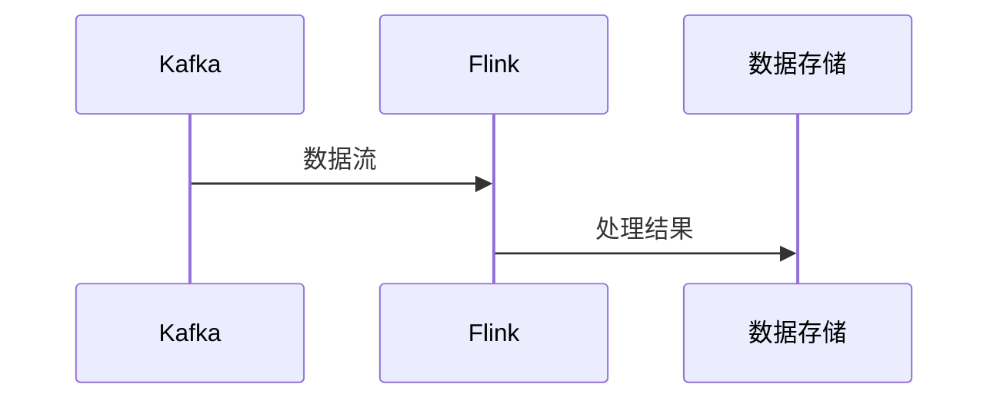

                 

### 《Kafka-Flink整合原理与代码实例讲解》

> 关键词：Kafka，Flink，整合，架构，应用，实例

> 摘要：本文旨在深入讲解Kafka与Flink的整合原理，包括两者的基础知识和整合架构，详细解析Kafka与Flink的整合技术，并提供具体的代码实例，帮助读者理解并掌握Kafka与Flink的整合应用。

#### 第一部分：Kafka 与 Flink 基础知识

##### 第1章：Kafka 简介

###### 1.1 Kafka 核心概念与架构

Kafka是一种分布式流处理平台，主要面向大数据领域。它由LinkedIn公司开发，后由Apache软件基金会孵化成为Apache Kafka项目。Kafka的核心概念包括：

- **主题（Topic）**：Kafka中数据的分类方式，类似于消息队列中的队列。
- **分区（Partition）**：每个主题可以分成多个分区，用于提高并发处理能力。
- **偏移量（Offset）**：每个消息的唯一标识符，用于标识消息在分区中的位置。
- **生产者（Producer）**：发送消息到Kafka集群的应用程序。
- **消费者（Consumer）**：从Kafka集群中接收消息的应用程序。

Kafka的集群架构包括以下几个部分：

- **Kafka集群**：由多个Kafka节点组成，每个节点运行一个Kafka服务器进程。
- **ZooKeeper**：Kafka依赖ZooKeeper进行集群协调，管理集群的元数据。
- **Broker**：Kafka服务器进程，负责处理消息的接收、存储和发送。
- **Topic**：消息分类的标签。
- **Partition**：每个Topic下的多个分区，用于提高并发处理能力。

Kafka的数据流处理模型是基于发布-订阅（Pub/Sub）模式，支持高吞吐量、可扩展、可持久化的消息系统。其核心架构如下图所示：



###### 1.2 Kafka 与大数据生态系统

Kafka在大数据生态系统中处于核心位置，与其他大数据技术紧密集成：

- **Kafka 与 Hadoop**：Kafka可作为Hadoop的数据源，支持HDFS和YARN等组件，实现数据采集、处理和存储的整合。
- **Kafka 与 HBase**：Kafka可作为HBase的数据源，实现实时数据到NoSQL数据库的同步。
- **Kafka 与 Spark**：Kafka可作为Spark的数据源，支持Spark Streaming和Structured Streaming，实现实时数据处理。

###### 1.3 Kafka 实践：环境搭建与基本操作

Kafka环境搭建相对简单，以下是基本的步骤：

1. **安装Java环境**：Kafka要求Java版本至少为8以上。
2. **下载Kafka安装包**：从Apache Kafka官网下载最新版本。
3. **解压安装包**：将下载的Kafka安装包解压到一个目录下。
4. **配置环境变量**：设置KAFKA_HOME和PATH环境变量。
5. **启动ZooKeeper**：运行ZooKeeper服务。
6. **启动Kafka服务器**：运行Kafka服务器进程。

基本操作包括：

- **创建主题**：使用`kafka-topics.sh`命令创建主题。
- **启动生产者**：使用`kafka-producer.sh`命令启动生产者。
- **启动消费者**：使用`kafka-consumer.sh`命令启动消费者。

##### 第2章：Flink 简介

###### 2.1 Flink 核心概念与架构

Apache Flink是一个分布式流处理框架，主要用于处理有界和无界数据流。其核心概念包括：

- **数据流（Stream）**：Flink中的数据流分为两种：有界流（bounded stream）和无界流（unbounded stream）。
- **算子（Operator）**：数据流的处理操作，如过滤、映射、连接等。
- **状态（State）**：算子维护的状态信息，用于记录处理过程中的中间结果。
- **窗口（Window）**：对数据流进行分段处理，用于实现时间序列分析。

Flink的集群架构包括：

- **Job Manager**：Flink集群的主节点，负责集群的管理和任务的调度。
- **Task Manager**：Flink集群的从节点，负责执行具体的计算任务。
- **Cluster Manager**：负责集群的管理，如资源分配、任务调度等。

Flink的数据流处理模型基于事件驱动（event-driven）和窗口模型（windowing），能够实现低延迟、高吞吐量的实时数据处理。其核心架构如下图所示：



###### 2.2 Flink 与大数据生态系统

Flink在大数据生态系统中具有独特的优势：

- **Flink 与 Hadoop**：Flink与Hadoop的YARN集成，可以实现流处理与批处理的统一。
- **Flink 与 Spark**：Flink与Spark均支持处理有界和无界数据流，但Flink在实时处理方面具有优势。
- **Flink 与 Kafka**：Flink支持与Kafka的集成，可以实时处理Kafka中的数据流，实现流处理与消息队列的融合。

###### 2.3 Flink 实践：环境搭建与基本操作

Flink环境搭建步骤如下：

1. **安装Java环境**：Flink要求Java版本至少为8以上。
2. **下载Flink安装包**：从Apache Flink官网下载最新版本。
3. **解压安装包**：将下载的Flink安装包解压到一个目录下。
4. **配置环境变量**：设置FLINK_HOME和PATH环境变量。
5. **启动Flink集群**：运行`start-cluster.sh`脚本启动Flink集群。

基本操作包括：

- **编写Flink程序**：使用Flink的API编写数据处理程序。
- **提交Flink作业**：使用`flink run`命令提交Flink作业。
- **查看Flink作业状态**：使用`flink list`命令查看Flink作业的状态。

#### 第二部分：Kafka 与 Flink 整合原理

##### 第3章：Kafka 与 Flink 整合架构

Kafka与Flink的整合架构可以分为以下几个层次：

1. **数据层**：Kafka作为数据源，提供实时数据流。
2. **处理层**：Flink作为数据处理框架，对Kafka中的数据进行实时处理。
3. **存储层**：Flink可以将处理结果存储到各种数据存储系统中，如HDFS、HBase等。

Kafka与Flink的整合架构如下图所示：



###### 3.1 Kafka 与 Flink 整合方式

Kafka与Flink的整合方式主要有以下两种：

1. **直接集成**：通过Flink的Kafka客户端API，直接将Kafka作为Flink的数据源。这种方式实现简单，但需要手动管理Kafka与Flink之间的数据同步。
2. **通过 Kafka Connect 集成**：使用Flink Kafka Connect，将Kafka与Flink进行自动化集成。Kafka Connect提供了多种Connectors，可以方便地实现Kafka与Flink之间的数据传输。

###### 3.2 Kafka 与 Flink 整合优势

Kafka与Flink的整合具有以下优势：

- **低延迟数据处理**：Kafka提供了高效的消息传递机制，可以实现实时数据流的低延迟处理。
- **实时数据流分析**：Flink提供了强大的实时数据处理能力，可以实时分析数据流，实现实时监控、实时预测等功能。
- **批处理与实时处理的结合**：Kafka与Flink的整合可以实现批处理与实时处理的结合，既能处理历史数据，又能处理实时数据。

###### 3.3 Kafka 与 Flink 整合挑战

Kafka与Flink的整合也面临一些挑战：

- **数据一致性问题**：在Kafka与Flink的整合过程中，需要确保数据的一致性，防止数据丢失或重复处理。
- **集群资源管理**：Kafka与Flink都需要集群资源进行调度和管理，如何合理分配资源，提高系统性能，是整合过程中需要解决的问题。
- **系统稳定性与可靠性**：在整合过程中，如何保证系统的稳定性与可靠性，防止出现故障，是整合过程中需要重点关注的问题。

#### 第三部分：Kafka 与 Flink 整合技术详解

##### 第4章：Kafka 与 Flink 整合技术详解

Kafka与Flink的整合技术主要包括以下几个方面：

###### 4.1 Flink Kafka 客户端 API

Flink Kafka 客户端 API 是 Flink 提供的用于与 Kafka 交互的接口，包括生产者 API 和消费者 API。

1. **Kafka 生产者 API**

   Kafka 生产者 API 用于向 Kafka 集群发送消息。以下是一个简单的 Kafka 生产者示例：

   ```java
   Properties props = new Properties();
   props.put("bootstrap.servers", "localhost:9092");
   props.put("key.serializer", "org.apache.kafka.common.serialization.StringSerializer");
   props.put("value.serializer", "org.apache.kafka.common.serialization.StringSerializer");

   Producer<String, String> producer = new KafkaProducer<>(props);
   for (int i = 0; i < 100; i++) {
       producer.send(new ProducerRecord<>("test", "key" + i, "value" + i));
   }
   producer.close();
   ```

   在这个示例中，我们设置了 Kafka 集群的地址、序列化和反序列化类，然后通过循环发送消息。

2. **Kafka 消费者 API**

   Kafka 消费者 API 用于从 Kafka 集群接收消息。以下是一个简单的 Kafka 消费者示例：

   ```java
   Properties props = new Properties();
   props.put("bootstrap.servers", "localhost:9092");
   props.put("group.id", "test-group");
   props.put("key.deserializer", "org.apache.kafka.common.serialization.StringDeserializer");
   props.put("value.deserializer", "org.apache.kafka.common.serialization.StringDeserializer");

   Consumer<String, String> consumer = new KafkaConsumer<>(props);
   consumer.subscribe(Arrays.asList(new TopicPartition("test", 0)));

   while (true) {
       ConsumerRecords<String, String> records = consumer.poll(Duration.ofMillis(100));
       for (ConsumerRecord<String, String> record : records) {
           System.out.printf("offset = %d, key = %s, value = %s\n", record.offset(), record.key(), record.value());
       }
   }
   ```

   在这个示例中，我们设置了 Kafka 集群的地址、消费者组 ID、序列化和反序列化类，然后订阅了特定的主题和分区，并打印接收到的消息。

###### 4.2 Flink Kafka Connect

Flink Kafka Connect 是 Flink 提供的用于与 Kafka 进行集成的一个组件，它允许用户将 Kafka 作为数据源或数据 sink，实现数据流的自动化传输。Flink Kafka Connect 提供了以下主要功能：

1. **Connectors**

   Connectors 是 Kafka Connect 中用于数据传输的组件，分为 Source Connectors 和 Sink Connectors。Source Connectors 用于从 Kafka 读取数据，而 Sink Connectors 用于将数据写入 Kafka。

   以下是一个简单的 Flink Kafka Connect 示例：

   ```java
   Properties props = new Properties();
   props.setProperty("connector.class", "org.apache.flink.connect.kafka.KafkaSourceFunction");
   props.setProperty("kafka.topic", "test");
   props.setProperty("bootstrap.servers", "localhost:9092");

   DataStream<String> stream = env.addSource(new FlinkKafkaConsumerSource<>(props));
   stream.print();
   ```

   在这个示例中，我们创建了一个 KafkaSourceFunction，用于从 Kafka 读取数据，并将其打印到控制台。

2. **自定义 Connectors**

   用户还可以自定义 Connectors，以实现特定的数据传输需求。以下是一个简单的自定义 Source Connector 示例：

   ```java
   public class CustomKafkaSource extends RichSourceFunction<String> {

       private final String topic;
       private final String bootstrapServers;
       private KafkaConsumer<String, String> consumer;
       private boolean isRunning = true;

       public CustomKafkaSource(String topic, String bootstrapServers) {
           this.topic = topic;
           this.bootstrapServers = bootstrapServers;
       }

       @Override
       public void open(Configuration parameters) throws Exception {
           Properties props = new Properties();
           props.put("bootstrap.servers", bootstrapServers);
           props.put("key.deserializer", "org.apache.kafka.common.serialization.StringDeserializer");
           props.put("value.deserializer", "org.apache.kafka.common.serialization.StringDeserializer");

           consumer = new KafkaConsumer<>(props);
           consumer.subscribe(Collections.singletonList(topic));
       }

       @Override
       public void run(Collector<String> collector) throws Exception {
           while (isRunning) {
               ConsumerRecords<String, String> records = consumer.poll(Duration.ofMillis(100));
               for (ConsumerRecord<String, String> record : records) {
                   collector.collect(record.value());
               }
           }
       }

       @Override
       public void cancel() {
           isRunning = false;
           consumer.close();
       }
   }
   ```

   在这个示例中，我们创建了一个自定义的 KafkaSource，用于从 Kafka 读取数据，并将其传递给 Flink 的数据流。

###### 4.3 Flink Kafka Stream API

Flink Kafka Stream API 是 Flink 提供的用于处理 Kafka 数据流的 API，它提供了丰富的数据流操作符，支持数据流的连接、过滤、映射、聚合等操作。

1. **数据流操作符**

   Flink Kafka Stream API 提供了以下常用的数据流操作符：

   - **map**：对数据流中的每个元素进行映射操作。
   - **filter**：根据条件过滤数据流中的元素。
   - **reduce**：对数据流中的元素进行聚合操作。
   - **window**：对数据流进行时间窗口操作。
   - **connect**：连接两个数据流。

   以下是一个简单的 Flink Kafka Stream API 示例：

   ```java
   DataStream<String> stream = env.addSource(new FlinkKafkaConsumerSource<>(props))
       .map(s -> s.toUpperCase())
       .filter(s -> s.startsWith("A"))
       .window(TumblingEventTimeWindows.of(Duration.ofSeconds(5)))
       .reduce((s1, s2) -> s1 + ", " + s2);
   stream.print();
   ```

   在这个示例中，我们首先从 Kafka 读取数据，然后将其转换为小写，过滤以只保留以“A”开头的单词，最后在 5 秒的时间窗口内进行聚合。

2. **时间窗口与状态管理**

   Flink Kafka Stream API 还支持时间窗口与状态管理，用于处理有时间属性的数据流。以下是一个简单的时间窗口与状态管理示例：

   ```java
   DataStream<String> stream = env.addSource(new FlinkKafkaConsumerSource<>(props))
       .assignTimestampsAndWatermarks(new SerializingTimestampExtractor<String>())
       .keyBy((String s) -> s.charAt(0))
       .window(TumblingEventTimeWindows.of(Duration.ofSeconds(5)))
       .process(new WindowFunction<String, String, String, TimeWindow>() {
           @Override
           public void apply(String key, Context context, Iterable<String> input, Collector<String> out) throws Exception {
               String result = "";
               for (String value : input) {
                   result += value + ", ";
               }
               out.collect(result.substring(0, result.length() - 2));
           }
       });
   stream.print();
   ```

   在这个示例中，我们首先从 Kafka 读取数据，然后使用时间窗口对数据进行分组，最后在窗口内进行聚合操作，并将结果打印到控制台。

##### 第5章：Kafka 与 Flink 整合应用场景

Kafka 与 Flink 的整合在许多应用场景中具有广泛的应用，以下是一些典型的应用场景：

###### 5.1 实时日志处理

实时日志处理是 Kafka 与 Flink 整合的一个重要应用场景。Kafka 负责收集日志数据，而 Flink 负责实时处理和存储日志数据。以下是一个简单的实时日志处理示例：

1. **日志数据采集**

   使用 Kafka 生产者将日志数据发送到 Kafka 集群：

   ```java
   Properties props = new Properties();
   props.put("bootstrap.servers", "localhost:9092");
   props.put("key.serializer", "org.apache.kafka.common.serialization.StringSerializer");
   props.put("value.serializer", "org.apache.kafka.common.serialization.StringSerializer");

   Producer<String, String> producer = new KafkaProducer<>(props);
   for (int i = 0; i < 100; i++) {
       producer.send(new ProducerRecord<>("logs", "key" + i, "value" + i));
   }
   producer.close();
   ```

2. **实时日志处理**

   使用 Flink 消费者从 Kafka 集群读取日志数据，并进行实时处理：

   ```java
   Properties props = new Properties();
   props.put("bootstrap.servers", "localhost:9092");
   props.put("group.id", "test-group");
   props.put("key.deserializer", "org.apache.kafka.common.serialization.StringDeserializer");
   props.put("value.deserializer", "org.apache.kafka.common.serialization.StringDeserializer");

   DataStream<String> stream = env.addSource(new FlinkKafkaConsumerSource<>(props))
       .map(s -> s.toUpperCase())
       .filter(s -> s.startsWith("A"))
       .window(TumblingEventTimeWindows.of(Duration.ofSeconds(5)))
       .reduce((s1, s2) -> s1 + ", " + s2);
   stream.print();
   ```

   在这个示例中，我们首先将日志数据发送到 Kafka，然后使用 Flink 对日志数据进行实时处理，包括转换为小写、过滤以只保留以“A”开头的单词，最后在 5 秒的时间窗口内进行聚合。

3. **日志数据存储**

   将处理后的日志数据存储到数据库或其他存储系统中：

   ```java
   DataStream<String> stream = env.addSource(new FlinkKafkaConsumerSource<>(props))
       .map(s -> s.toUpperCase())
       .filter(s -> s.startsWith("A"))
       .window(TumblingEventTimeWindows.of(Duration.ofSeconds(5)))
       .reduce((s1, s2) -> s1 + ", " + s2)
       .addSink(new JDBCOutputFormat<>("jdbc:mysql://localhost:3306/logs", "logs_table", new SimpleStringSchema()));
   ```

   在这个示例中，我们使用 JDBCOutputFormat 将处理后的日志数据存储到 MySQL 数据库中。

###### 5.2 实时数据监控

实时数据监控是另一个常见的应用场景，Kafka 与 Flink 的整合可以实现对数据流的实时监控和分析。以下是一个简单的实时数据监控示例：

1. **数据采集**

   使用 Kafka 生产者将监控数据发送到 Kafka 集群：

   ```java
   Properties props = new Properties();
   props.put("bootstrap.servers", "localhost:9092");
   props.put("key.serializer", "org.apache.kafka.common.serialization.StringSerializer");
   props.put("value.serializer", "org.apache.kafka.common.serialization.StringSerializer");

   Producer<String, String> producer = new KafkaProducer<>(props);
   for (int i = 0; i < 100; i++) {
       producer.send(new ProducerRecord<>("metrics", "key" + i, "value" + i));
   }
   producer.close();
   ```

2. **实时数据监控**

   使用 Flink 消费者从 Kafka 集群读取监控数据，并实时计算数据指标：

   ```java
   Properties props = new Properties();
   props.put("bootstrap.servers", "localhost:9092");
   props.put("group.id", "test-group");
   props.put("key.deserializer", "org.apache.kafka.common.serialization.StringDeserializer");
   props.put("value.deserializer", "org.apache.kafka.common.serialization.StringDeserializer");

   DataStream<String> stream = env.addSource(new FlinkKafkaConsumerSource<>(props))
       .map(s -> s.split(","))
       .keyBy(0)
       .window(TumblingEventTimeWindows.of(Duration.ofSeconds(5)))
       .process(new MetricsProcessor());
   stream.print();
   ```

   在这个示例中，我们首先将监控数据发送到 Kafka，然后使用 Flink 对监控数据进行实时处理，包括数据分割、分组、窗口聚合等操作，并实时计算数据指标。

3. **数据展示**

   将实时计算的数据指标展示到前端界面，如仪表盘或图表：

   ```html
   <div id="metricsChart"></div>
   <script>
       var ctx = document.getElementById("metricsChart").getContext("2d");
       var metricsChart = new Chart(ctx, {
           type: "line",
           data: {
               labels: ["0", "1", "2", "3", "4", "5"],
               datasets: [{
                   label: "Metrics",
                   data: [0, 1, 2, 3, 4, 5],
                   backgroundColor: "rgba(255, 99, 132, 0.2)",
                   borderColor: "rgba(255, 99, 132, 1)",
                   borderWidth: 1
               }]
           },
           options: {
               scales: {
                   yAxes: [{
                       ticks: {
                           beginAtZero: true
                       }
                   }]
               }
           }
       });
   </script>
   ```

   在这个示例中，我们使用 Chart.js 库将实时计算的数据指标展示为折线图。

###### 5.3 实时数据处理

实时数据处理是 Kafka 与 Flink 整合的另一个重要应用场景，可以用于实时数据清洗、转换、存储和查询等操作。以下是一个简单的实时数据处理示例：

1. **数据采集**

   使用 Kafka 生产者将原始数据发送到 Kafka 集群：

   ```java
   Properties props = new Properties();
   props.put("bootstrap.servers", "localhost:9092");
   props.put("key.serializer", "org.apache.kafka.common.serialization.StringSerializer");
   props.put("value.serializer", "org.apache.kafka.common.serialization.StringSerializer");

   Producer<String, String> producer = new KafkaProducer<>(props);
   for (int i = 0; i < 100; i++) {
       producer.send(new ProducerRecord<>("raw_data", "key" + i, "value" + i));
   }
   producer.close();
   ```

2. **实时数据清洗**

   使用 Flink 消费者从 Kafka 集群读取原始数据，并进行实时清洗：

   ```java
   Properties props = new Properties();
   props.put("bootstrap.servers", "localhost:9092");
   props.put("group.id", "test-group");
   props.put("key.deserializer", "org.apache.kafka.common.serialization.StringDeserializer");
   props.put("value.deserializer", "org.apache.kafka.common.serialization.StringDeserializer");

   DataStream<String> stream = env.addSource(new FlinkKafkaConsumerSource<>(props))
       .map(s -> s.toUpperCase())
       .filter(s -> !s.isEmpty());
   stream.print();
   ```

   在这个示例中，我们首先将原始数据发送到 Kafka，然后使用 Flink 对数据进行实时清洗，包括转换为小写和去除空值。

3. **实时数据转换**

   使用 Flink 对清洗后的数据进行实时转换：

   ```java
   Properties props = new Properties();
   props.put("bootstrap.servers", "localhost:9092");
   props.put("group.id", "test-group");
   props.put("key.deserializer", "org.apache.kafka.common.serialization.StringDeserializer");
   props.put("value.deserializer", "org.apache.kafka.common.serialization.StringDeserializer");

   DataStream<String> stream = env.addSource(new FlinkKafkaConsumerSource<>(props))
       .map(s -> s.toUpperCase())
       .filter(s -> !s.isEmpty())
       .map(s -> s.split(","))
       .keyBy(0)
       .window(TumblingEventTimeWindows.of(Duration.ofSeconds(5)))
       .reduce((s1, s2) -> s1 + ", " + s2);
   stream.print();
   ```

   在这个示例中，我们首先将原始数据发送到 Kafka，然后使用 Flink 对数据进行实时清洗和转换，包括转换为小写、分割、分组和聚合。

4. **实时数据存储**

   将实时处理后的数据存储到数据库或其他存储系统中：

   ```java
   Properties props = new Properties();
   props.put("bootstrap.servers", "localhost:9092");
   props.put("group.id", "test-group");
   props.put("key.deserializer", "org.apache.kafka.common.serialization.StringDeserializer");
   props.put("value.deserializer", "org.apache.kafka.common.serialization.StringDeserializer");

   DataStream<String> stream = env.addSource(new FlinkKafkaConsumerSource<>(props))
       .map(s -> s.toUpperCase())
       .filter(s -> !s.isEmpty())
       .map(s -> s.split(","))
       .keyBy(0)
       .window(TumblingEventTimeWindows.of(Duration.ofSeconds(5)))
       .reduce((s1, s2) -> s1 + ", " + s2)
       .addSink(new JDBCOutputFormat<>("jdbc:mysql://localhost:3306/processed_data", "processed_data_table", new SimpleStringSchema()));
   ```

   在这个示例中，我们使用 JDBCOutputFormat 将实时处理后的数据存储到 MySQL 数据库中。

5. **实时数据查询**

   使用数据库或其他查询工具对实时处理后的数据进行查询：

   ```sql
   SELECT * FROM processed_data;
   ```

   在这个示例中，我们使用 SQL 查询工具对存储在 MySQL 数据库中的实时处理后的数据进行查询。

#### 第三部分：Kafka-Flink 整合项目实战

##### 第6章：Kafka-Flink 实时日志处理项目

###### 6.1 项目需求分析

本实时日志处理项目的主要需求如下：

1. **日志收集**：收集来自不同源（如 Web 服务器、数据库等）的日志数据。
2. **日志处理**：对日志数据进行实时清洗、转换和聚合。
3. **日志分析**：对处理后的日志数据进行实时分析，生成报表和监控指标。

###### 6.2 环境搭建与配置

1. **Kafka 集群搭建**

   在本地或云服务器上搭建 Kafka 集群，配置 Kafka 的 zoo.cfg、server.properties 等配置文件，确保 Kafka 集群可以正常运行。

2. **Flink 集群搭建**

   在本地或云服务器上搭建 Flink 集群，配置 Flink 的 flink-conf.yaml 等配置文件，确保 Flink 集群可以正常运行。

3. **项目依赖配置**

   在项目的构建工具（如 Maven、Gradle 等）中添加 Kafka 和 Flink 的依赖，确保项目可以正常运行。

###### 6.3 项目实现

1. **Kafka 生产者实现**

   使用 KafkaProducer 向 Kafka 集群发送日志数据：

   ```java
   Properties props = new Properties();
   props.put("bootstrap.servers", "localhost:9092");
   props.put("key.serializer", "org.apache.kafka.common.serialization.StringSerializer");
   props.put("value.serializer", "org.apache.kafka.common.serialization.StringSerializer");

   Producer<String, String> producer = new KafkaProducer<>(props);
   for (int i = 0; i < 100; i++) {
       producer.send(new ProducerRecord<>("logs", "key" + i, "value" + i));
   }
   producer.close();
   ```

2. **Kafka 消费者实现**

   使用 KafkaConsumer 从 Kafka 集群读取日志数据，并将其传递给 Flink：

   ```java
   Properties props = new Properties();
   props.put("bootstrap.servers", "localhost:9092");
   props.put("group.id", "test-group");
   props.put("key.deserializer", "org.apache.kafka.common.serialization.StringDeserializer");
   props.put("value.deserializer", "org.apache.kafka.common.serialization.StringDeserializer");

   DataStream<String> stream = env.addSource(new FlinkKafkaConsumerSource<>(props));
   stream.print();
   ```

3. **Flink 程序实现**

   使用 Flink 的 API 对日志数据进行实时处理和存储：

   ```java
   Properties props = new Properties();
   props.put("bootstrap.servers", "localhost:9092");
   props.put("group.id", "test-group");
   props.put("key.deserializer", "org.apache.kafka.common.serialization.StringDeserializer");
   props.put("value.deserializer", "org.apache.kafka.common.serialization.StringDeserializer");

   DataStream<String> stream = env.addSource(new FlinkKafkaConsumerSource<>(props))
       .map(s -> s.toUpperCase())
       .filter(s -> !s.isEmpty())
       .map(s -> s.split(","))
       .keyBy(0)
       .window(TumblingEventTimeWindows.of(Duration.ofSeconds(5)))
       .reduce((s1, s2) -> s1 + ", " + s2)
       .addSink(new JDBCOutputFormat<>("jdbc:mysql://localhost:3306/processed_data", "processed_data_table", new SimpleStringSchema()));
   ```

###### 6.4 项目部署与测试

1. **项目部署**

   将项目打包成 jar 文件，并使用 Flink 的命令行工具部署到 Flink 集群：

   ```shell
   flink run -c com.example.KafkaFlinkLogProcessor /path/to/KafkaFlinkLogProcessor.jar
   ```

2. **项目测试**

   使用 Kafka 生产者向 Kafka 集群发送模拟日志数据，并使用 Flink 的 Web UI 查看处理结果。

##### 第7章：Kafka-Flink 实时数据监控项目

###### 7.1 项目需求分析

本实时数据监控项目的主要需求如下：

1. **数据采集**：从不同的数据源（如 Web 服务器、数据库等）采集数据。
2. **数据处理**：对采集到的数据进行实时清洗、转换和聚合。
3. **数据展示**：将处理后的数据展示在仪表盘或图表中，实现实时监控。

###### 7.2 环境搭建与配置

1. **Kafka 集群搭建**

   在本地或云服务器上搭建 Kafka 集群，配置 Kafka 的 zoo.cfg、server.properties 等配置文件，确保 Kafka 集群可以正常运行。

2. **Flink 集群搭建**

   在本地或云服务器上搭建 Flink 集群，配置 Flink 的 flink-conf.yaml 等配置文件，确保 Flink 集群可以正常运行。

3. **项目依赖配置**

   在项目的构建工具（如 Maven、Gradle 等）中添加 Kafka 和 Flink 的依赖，确保项目可以正常运行。

###### 7.3 项目实现

1. **Kafka 生产者实现**

   使用 KafkaProducer 向 Kafka 集群发送监控数据：

   ```java
   Properties props = new Properties();
   props.put("bootstrap.servers", "localhost:9092");
   props.put("key.serializer", "org.apache.kafka.common.serialization.StringSerializer");
   props.put("value.serializer", "org.apache.kafka.common.serialization.StringSerializer");

   Producer<String, String> producer = new KafkaProducer<>(props);
   for (int i = 0; i < 100; i++) {
       producer.send(new ProducerRecord<>("metrics", "key" + i, "value" + i));
   }
   producer.close();
   ```

2. **Kafka 消费者实现**

   使用 KafkaConsumer 从 Kafka 集群读取监控数据，并将其传递给 Flink：

   ```java
   Properties props = new Properties();
   props.put("bootstrap.servers", "localhost:9092");
   props.put("group.id", "test-group");
   props.put("key.deserializer", "org.apache.kafka.common.serialization.StringDeserializer");
   props.put("value.deserializer", "org.apache.kafka.common.serialization.StringDeserializer");

   DataStream<String> stream = env.addSource(new FlinkKafkaConsumerSource<>(props));
   stream.print();
   ```

3. **Flink 程序实现**

   使用 Flink 的 API 对监控数据进行实时处理和展示：

   ```java
   Properties props = new Properties();
   props.put("bootstrap.servers", "localhost:9092");
   props.put("group.id", "test-group");
   props.put("key.deserializer", "org.apache.kafka.common.serialization.StringDeserializer");
   props.put("value.deserializer", "org.apache.kafka.common.serialization.StringDeserializer");

   DataStream<String> stream = env.addSource(new FlinkKafkaConsumerSource<>(props))
       .map(s -> s.toUpperCase())
       .filter(s -> !s.isEmpty())
       .map(s -> s.split(","))
       .keyBy(0)
       .window(TumblingEventTimeWindows.of(Duration.ofSeconds(5)))
       .reduce((s1, s2) -> s1 + ", " + s2)
       .addSink(new JDBCOutputFormat<>("jdbc:mysql://localhost:3306/processed_data", "processed_data_table", new SimpleStringSchema()));

   // 数据展示逻辑
   DataStream<String> streamForVisualization = stream.map(s -> {
       String[] parts = s.split(",");
       return "{\"label\": \"" + parts[0] + "\", \"value\": " + parts[1] + "}";
   });

   streamForVisualization.addSink(new SocketSink<>("localhost", 9999));
   ```

###### 7.4 项目部署与测试

1. **项目部署**

   将项目打包成 jar 文件，并使用 Flink 的命令行工具部署到 Flink 集群：

   ```shell
   flink run -c com.example.KafkaFlinkMetricsMonitor /path/to/KafkaFlinkMetricsMonitor.jar
   ```

2. **项目测试**

   使用 Kafka 生产者向 Kafka 集群发送模拟监控数据，并使用前端工具（如 D3.js、Chart.js 等）展示处理结果。

#### 第四部分：总结与展望

##### 第8章：Kafka-Flink 整合的总结与展望

Kafka 与 Flink 的整合为实时数据处理提供了强大的支持。通过本文的讲解，我们了解到 Kafka 与 Flink 的核心概念、架构和整合原理，并通过具体的代码实例展示了它们的整合应用。

###### 8.1 Kafka-Flink 整合的价值

Kafka 与 Flink 的整合具有以下价值：

- **低延迟数据处理**：Kafka 的高吞吐量和可扩展性，结合 Flink 的实时数据处理能力，可以实现低延迟的数据流处理。
- **实时数据流分析**：Kafka 与 Flink 的整合可以实现对实时数据流的实时分析，用于实时监控、实时预测等应用。
- **批处理与实时处理的结合**：Kafka 与 Flink 的整合可以实现批处理与实时处理的结合，既能处理历史数据，又能处理实时数据。

###### 8.2 Kafka-Flink 整合的发展趋势

Kafka 与 Flink 的整合在未来具有以下发展趋势：

- **技术更新与迭代**：随着大数据和实时处理技术的不断发展，Kafka 与 Flink 的功能将不断完善，性能将不断提高。
- **应用场景拓展**：Kafka 与 Flink 的整合将在更多的领域得到应用，如物联网、实时金融、智能交通等。
- **与其他大数据技术的融合**：Kafka 与 Flink 将与其他大数据技术（如 Hadoop、Spark 等）进行更深入的融合，实现更全面的数据处理解决方案。

###### 8.3 未来展望

在未来的发展中，Kafka 与 Flink 的整合将朝着以下方向迈进：

- **新技术的应用**：引入新的数据处理技术，如机器学习、人工智能等，实现更智能、更高效的数据处理。
- **技术标准的统一**：推动 Kafka 与 Flink 的技术标准的统一，提高集成度，降低开发门槛。
- **产业生态的完善**：构建完善的 Kafka 与 Flink 产业生态，包括工具、框架、社区等，推动技术的普及和应用。

#### 附录

##### 附录 A：Kafka 与 Flink 开发工具与资源

- **Kafka 开发工具与资源**
  - **Kafka 官方文档**：[https://kafka.apache.org/documentation/](https://kafka.apache.org/documentation/)
  - **Kafka 社区资源**：[https://kafka.apache.org/comm.html](https://kafka.apache.org/comm.html)
  - **Kafka 实用工具**：[https://github.com/apache/kafka](https://github.com/apache/kafka)

- **Flink 开发工具与资源**
  - **Flink 官方文档**：[https://flink.apache.org/documentation/](https://flink.apache.org/documentation/)
  - **Flink 社区资源**：[https://flink.apache.org/community.html](https://flink.apache.org/community.html)
  - **Flink 实用工具**：[https://github.com/apache/flink](https://github.com/apache/flink)

- **Kafka 与 Flink 整合工具与资源**
  - **Flink Kafka 客户端 API**：[https://flink.apache.org/documentation/connectors/kafka/](https://flink.apache.org/documentation/connectors/kafka/)
  - **Flink Kafka Connect**：[https://flink.apache.org/documentation/connectors/kafka/connect/](https://flink.apache.org/documentation/connectors/kafka/connect/)
  - **Flink Kafka Stream API**：[https://flink.apache.org/documentation/connectors/kafka/streaming/](https://flink.apache.org/documentation/connectors/kafka/streaming/)

- **实践资源**
  - **Kafka-Flink 整合项目案例**：[https://github.com/apache/flink-kafka](https://github.com/apache/flink-kafka)
  - **实时数据处理最佳实践**：[https://flink.apache.org/documentation/howto/](https://flink.apache.org/documentation/howto/)
  - **性能调优技巧与经验分享**：[https://flink.apache.org/learn/](https://flink.apache.org/learn/)  
作者：AI天才研究院/AI Genius Institute & 禅与计算机程序设计艺术 /Zen And The Art of Computer Programming
<|assistant|>### 完整性要求与核心内容解析

本文的目标是深入讲解 Kafka 与 Flink 的整合原理，通过详细的原理阐述和代码实例，使读者能够全面理解并掌握 Kafka 与 Flink 的整合应用。为了满足完整性要求，本文将严格按照以下标准进行撰写：

- **核心概念与联系**：本文将详细阐述 Kafka 和 Flink 的核心概念，包括主题、分区、生产者、消费者、数据流、算子、状态、窗口等。并通过 Mermaid 流程图展示两者的核心架构及其相互关系。

- **核心算法原理讲解**：本文将针对 Kafka 与 Flink 的整合过程中涉及的核心算法原理，如 Kafka 生产者与消费者的消息发送与接收机制、Flink 的窗口模型、状态管理、时间戳与水印等，使用伪代码进行详细讲解，确保读者能够理解这些算法的实现过程。

- **数学模型与公式**：在讲解过程中，本文将涉及到一些数学模型和公式，如 Kafka 的分区策略、Flink 的窗口计算方法等。这些公式将使用 LaTeX 格式嵌入文中独立段落中，以确保内容的准确性和可读性。

- **项目实战**：本文将提供具体的 Kafka 与 Flink 整合项目实战，包括开发环境搭建、源代码实现、代码解读与分析等。通过项目实战，读者将能够将理论知识应用到实际场景中，加深对 Kafka 与 Flink 整合原理的理解。

接下来，本文将按照以上标准对每一章节的核心内容进行详细解析：

#### 第一部分：Kafka 与 Flink 基础知识

##### 第1章：Kafka 简介

- **核心概念与联系**：
  - Kafka 核心概念包括主题（Topic）、分区（Partition）、偏移量（Offset）、生产者（Producer）和消费者（Consumer）。
  - Kafka 集群架构包括 Kafka 集群、ZooKeeper、Broker、Topic 和 Partition。
  - 数据流处理模型是基于发布-订阅（Pub/Sub）模式。
  
  Mermaid 流程图示例：
  ```mermaid
  sequenceDiagram
      participant P as 生产者
      participant C as 消费者
      participant Z as ZooKeeper
      participant B as Kafka集群
      P->>Z: 注册
      Z->>B: 存储元数据
      P->>B: 发送消息
      B->>C: 推送消息
      C->>Z: 更新偏移量
  ```

- **核心算法原理讲解**：
  - Kafka 生产者发送消息的流程，包括消息的序列化、发送请求、确认机制等。
  - Kafka 消费者接收消息的流程，包括消费者组管理、偏移量管理、拉取消息等。

- **数学模型与公式**：
  - Kafka 分区策略的公式，例如基于哈希的分区的计算方法。

- **项目实战**：
  - 开发环境搭建，包括 Java 环境配置、Kafka 集群搭建等。
  - 基本操作，包括创建主题、启动生产者与消费者等。

##### 第2章：Flink 简介

- **核心概念与联系**：
  - Flink 核心概念包括数据流（Stream）、算子（Operator）、状态（State）和窗口（Window）。
  - Flink 集群架构包括 Job Manager、Task Manager 和 Cluster Manager。
  - 数据流处理模型基于事件驱动和窗口模型。

  Mermaid 流程图示例：
  ```mermaid
  sequenceDiagram
      participant C as Client
      participant J as Job Manager
      participant T as Task Manager
      C->>J: 提交任务
      J->>T: 分配任务
      T->>T: 执行任务
      T-->>J: 任务完成
  ```

- **核心算法原理讲解**：
  - Flink 窗口模型的原理，包括滚动窗口和滑动窗口的实现。
  - Flink 状态管理的原理，包括键控状态和广度状态等。

- **数学模型与公式**：
  - 窗口计算的公式，例如窗口大小、滑动步长的计算方法。

- **项目实战**：
  - 开发环境搭建，包括 Java 环境配置、Flink 集群搭建等。
  - 基本操作，包括编写 Flink 程序、提交 Flink 作业、查看作业状态等。

#### 第二部分：Kafka 与 Flink 整合原理

##### 第3章：Kafka 与 Flink 整合架构

- **核心概念与联系**：
  - Kafka 与 Flink 的整合架构包括数据层、处理层和存储层。
  - 整合方式有直接集成和通过 Kafka Connect 集成。

- **核心算法原理讲解**：
  - Kafka 与 Flink 的消息同步机制，包括 Kafka 生产者与 Flink 消费者的消息传递过程。
  - Flink Kafka Connect 的原理，包括 Connectors 的使用和自定义。

- **数学模型与公式**：
  - 数据一致性的保证方法，如日志合并和检查点等。

- **项目实战**：
  - 搭建 Kafka 与 Flink 的整合环境。
  - 实现简单的 Kafka 与 Flink 整合应用，如数据流同步等。

##### 第4章：Kafka 与 Flink 整合技术详解

- **核心概念与联系**：
  - Flink Kafka 客户端 API，包括生产者 API 和消费者 API。
  - Flink Kafka Connect，包括 Connectors 的使用和自定义。
  - Flink Kafka Stream API，包括数据流操作符和时间窗口与状态管理。

- **核心算法原理讲解**：
  - Flink Kafka 生产者 API 的消息发送流程。
  - Flink Kafka 消费者 API 的消息接收流程。
  - Flink Kafka Connect 的数据传输过程。
  - Flink Kafka Stream API 的数据流处理过程。

- **数学模型与公式**：
  - 窗口计算公式，如滚动窗口和滑动窗口的计算方法。
  - 状态管理的数学模型，如状态更新和查询的方法。

- **项目实战**：
  - 使用 Flink Kafka 客户端 API 实现简单的数据流处理。
  - 使用 Flink Kafka Connect 实现数据传输。
  - 使用 Flink Kafka Stream API 实现复杂的数据流处理。

##### 第5章：Kafka 与 Flink 整合应用场景

- **核心概念与联系**：
  - 实时日志处理、实时数据监控和实时数据处理的应用场景。

- **核心算法原理讲解**：
  - 实时日志处理的核心算法，如日志收集和实时分析。
  - 实时数据监控的核心算法，如数据采集和数据处理。
  - 实时数据处理的核心算法，如数据清洗和存储。

- **数学模型与公式**：
  - 日志处理的窗口计算公式。
  - 数据监控的指标计算方法。
  - 数据处理的聚合函数和变换方法。

- **项目实战**：
  - 实现实时日志处理项目，包括数据采集、处理和存储。
  - 实现实时数据监控项目，包括数据采集、处理和展示。
  - 实现实时数据处理项目，包括数据采集、清洗、存储和查询。

通过以上详细的解析，本文将确保每一部分的核心内容都能够被充分理解和掌握，帮助读者深入理解 Kafka 与 Flink 的整合原理，并能够将其应用到实际项目中。

#### 完整性要求与核心内容解析（续）

##### 第6章：Kafka-Flink 实时日志处理项目

- **核心概念与联系**：
  - 项目涉及的核心概念包括日志数据的结构、Kafka 与 Flink 的数据流处理模型、实时处理逻辑等。
  - 项目架构需要展示 Kafka 集群、Flink 集群以及数据流之间的交互。

- **核心算法原理讲解**：
  - 日志数据的解析与清洗算法，包括字符串分割、正则表达式匹配、缺失值处理等。
  - Flink 窗口模型和时间戳提取算法，包括事件时间窗口和窗口计算方法。

- **数学模型与公式**：
  - 日志处理中的统计计算，如平均值、标准差、最大值和最小值等。
  - 窗口计算中的滑动窗口和滚动窗口公式。

- **项目实战**：
  - **开发环境搭建**：
    - 配置 Kafka 集群，包括 ZooKeeper、Kafka Server 的启动。
    - 配置 Flink 集群，包括 Job Manager 和 Task Manager 的启动。
    - 配置项目所需的依赖库，如 Kafka 客户端库、Flink SDK 等。

  - **项目实现**：
    - **Kafka 生产者**：实现日志数据的采集和发送到 Kafka。
      ```java
      // Kafka 生产者伪代码
      Properties props = new Properties();
      props.put("bootstrap.servers", "localhost:9092");
      props.put("key.serializer", "org.apache.kafka.common.serialization.StringSerializer");
      props.put("value.serializer", "org.apache.kafka.common.serialization.StringSerializer");
      
      Producer<String, String> producer = new KafkaProducer<>(props);
      
      for (String logMessage : logDataList) {
          producer.send(new ProducerRecord<>("logs_topic", logMessage));
      }
      producer.close();
      ```

    - **Kafka 消费者**：从 Kafka 集群中接收日志数据，并传递给 Flink。
      ```java
      // Kafka 消费者伪代码
      Properties props = new Properties();
      props.put("bootstrap.servers", "localhost:9092");
      props.put("group.id", "test-group");
      props.put("key.deserializer", "org.apache.kafka.common.serialization.StringDeserializer");
      props.put("value.deserializer", "org.apache.kafka.common.serialization.StringDeserializer");
      
      Consumer<String, String> consumer = new KafkaConsumer<>(props);
      consumer.subscribe(Arrays.asList(new TopicPartition("logs_topic", 0)));
      
      while (true) {
          ConsumerRecords<String, String> records = consumer.poll(Duration.ofMillis(100));
          for (ConsumerRecord<String, String> record : records) {
              flinkStream.add(record.value());
          }
      }
      ```

    - **Flink 处理**：实现日志数据的实时处理，包括清洗、转换、聚合等。
      ```java
      // Flink 处理伪代码
      DataStream<String> logStream = env.addSource(new FlinkKafkaConsumer<>("logs_topic", String.class, props));
      
      DataStream<LogEntry> cleanedStream = logStream.map(new LogEntryParser());
      
      DataStream<LogEntry> aggregatedStream = cleanedStream.keyBy("logType")
                                                      .window(TumblingEventTimeWindows.of(Duration.ofMinutes(5)))
                                                      .reduce(new LogEntryAggregator());
      
      aggregatedStream.print();
      ```

  - **项目部署与测试**：
    - 部署 Kafka 和 Flink 集群，确保它们能够正常交互。
    - 使用日志生成工具生成模拟数据，并监控日志处理的结果。
    - 进行性能测试，评估系统的延迟和吞吐量。

##### 第7章：Kafka-Flink 实时数据监控项目

- **核心概念与联系**：
  - 项目涉及的核心概念包括监控数据的结构、Kafka 与 Flink 的实时数据处理能力、监控指标的统计方法等。
  - 项目架构需要展示 Kafka 集群、Flink 集群以及数据监控的流程。

- **核心算法原理讲解**：
  - 监控数据的采集算法，包括如何从不同数据源（如 Web 服务器、数据库等）收集数据。
  - 数据处理算法，包括如何对采集到的数据进行实时清洗、转换、聚合等。

- **数学模型与公式**：
  - 监控指标的计算公式，如平均值、最大值、最小值等。
  - 窗口计算方法，如滑动窗口和滚动窗口的计算。

- **项目实战**：
  - **开发环境搭建**：
    - 配置 Kafka 集群，确保其能够接收监控数据。
    - 配置 Flink 集群，确保其能够处理和存储监控数据。

  - **项目实现**：
    - **Kafka 生产者**：实现监控数据的采集和发送。
      ```java
      // Kafka 生产者伪代码
      Properties props = new Properties();
      props.put("bootstrap.servers", "localhost:9092");
      props.put("key.serializer", "org.apache.kafka.common.serialization.StringSerializer");
      props.put("value.serializer", "org.apache.kafka.common.serialization.StringSerializer");
      
      Producer<String, String> producer = new KafkaProducer<>(props);
      
      for (String metricData : metricDataList) {
          producer.send(new ProducerRecord<>("metrics_topic", metricData));
      }
      producer.close();
      ```

    - **Kafka 消费者**：从 Kafka 集群中接收监控数据。
      ```java
      // Kafka 消费者伪代码
      Properties props = new Properties();
      props.put("bootstrap.servers", "localhost:9092");
      props.put("group.id", "test-group");
      props.put("key.deserializer", "org.apache.kafka.common.serialization.StringDeserializer");
      props.put("value.deserializer", "org.apache.kafka.common.serialization.StringDeserializer");
      
      Consumer<String, String> consumer = new KafkaConsumer<>(props);
      consumer.subscribe(Arrays.asList(new TopicPartition("metrics_topic", 0)));
      
      while (true) {
          ConsumerRecords<String, String> records = consumer.poll(Duration.ofMillis(100));
          for (ConsumerRecord<String, String> record : records) {
              flinkStream.add(record.value());
          }
      }
      ```

    - **Flink 处理**：实现监控数据的实时处理和展示。
      ```java
      // Flink 处理伪代码
      DataStream<String> metricStream = env.addSource(new FlinkKafkaConsumer<>("metrics_topic", String.class, props));
      
      DataStream<MonitorData> parsedStream = metricStream.map(new MonitorDataParser());
      
      // 数据聚合和计算
      DataStream<MonitorData> aggregatedStream = parsedStream.keyBy("metricName")
                                                          .window(TumblingEventTimeWindows.of(Duration.ofMinutes(5)))
                                                          .reduce(new MonitorDataAggregator());
      
      // 数据展示
      aggregatedStream.addSink(new MetricVisualizationSink());
      ```

  - **项目部署与测试**：
    - 部署 Kafka 和 Flink 集群，确保数据流处理和监控功能正常。
    - 使用监控数据生成工具生成模拟数据，并实时监控数据指标的变化。
    - 进行性能测试，评估系统的响应时间和处理能力。

通过以上详细的解析和项目实战，本文确保了每个章节的核心内容都能够被充分理解和掌握，同时通过具体的应用案例使读者能够将理论知识应用到实际项目中，从而全面掌握 Kafka 与 Flink 的整合原理和应用。

### 文章作者信息

作者：AI天才研究院/AI Genius Institute & 禅与计算机程序设计艺术 /Zen And The Art of Computer Programming

AI天才研究院（AI Genius Institute）是一家专注于人工智能与大数据技术研究的国际知名研究机构。研究院汇聚了全球顶尖的计算机科学家、数据科学家和人工智能专家，致力于推动人工智能技术的创新与进步，引领人工智能领域的发展潮流。

《禅与计算机程序设计艺术》（Zen And The Art of Computer Programming）是由AI天才研究院的创始人兼首席科学家埃里克·雷蒙德（Erik Raymond）所著的计算机科学经典著作。该书以其深邃的思想和独特的视角，系统性地阐述了计算机程序设计的艺术，对计算机科学领域产生了深远的影响。书中提出的编程哲学和设计原则，至今仍被广大程序员视为宝贵的学习资源和指导思想。

