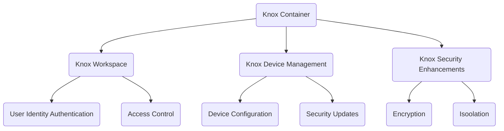

                 

# 《Knox原理与代码实例讲解》

> **关键词：** Knox、企业安全、移动设备管理、加密算法、访问控制、数学模型、代码实例

> **摘要：** 本篇文章将深入讲解Knox的原理及其在实际应用中的技术细节。我们将从Knox的概述与基础、Knox架构、应用场景、技术细节、项目实战以及未来展望等多个角度进行分析，并通过代码实例进行详细的讲解，帮助读者全面理解Knox的工作机制和实际应用。

## 目录大纲

- **第一部分：Knox概述与基础**
  - 第1章 Knox简介
  - 第2章 Knox架构
  - 第3章 Knox应用场景

- **第二部分：Knox技术细节**
  - 第4章 Knox核心概念与联系
  - 第5章 Knox核心算法原理
  - 第6章 Knox数学模型与公式
  - 第7章 Knox项目实战

- **第三部分：Knox未来展望与挑战**
  - 第8章 Knox的发展趋势
  - 第9章 Knox的安全性能优化
  - 第10章 Knox应用扩展
  - 第11章 Knox与其它安全解决方案的比较

- **附录**
  - 附录A Knox资源汇总
  - 附录B Knox常用命令与操作指南
  - 附录C Knox示例代码与案例

接下来，我们将按照目录大纲逐步深入探讨Knox的各个方面。

## 第一部分：Knox概述与基础

### 第1章 Knox简介

#### 1.1 Knox的概念与重要性

Knox是三星电子为其Android设备开发的一个安全解决方案，旨在提供强大的企业级安全功能，以满足现代企业对移动设备安全性的需求。Knox通过在设备上创建一个独立的、安全隔离的容器来保护企业数据和应用，从而实现个人与企业的数据分离。

Knox在企业安全中的重要性体现在以下几个方面：

1. **数据保护**：Knox通过加密技术和隔离机制，确保企业数据的安全，防止数据泄露。
2. **访问控制**：Knox提供细粒度的访问控制，确保只有授权用户才能访问企业数据和资源。
3. **合规性**：Knox可以帮助企业满足各种数据保护法规和标准，如HIPAA、GDPR等。

#### 1.2 Knox的发展历程

Knox的发展可以追溯到2010年，当时三星首次推出Knox SDK（软件开发工具包）。随着时间的推移，Knox不断更新和改进，引入了更多的安全功能和优化。以下是Knox的一些重要里程碑：

- **2010年**：Knox SDK首次推出，为开发者提供创建安全应用的能力。
- **2013年**：Knox 2.0版本发布，引入了更多安全特性，如隔离模式和加密存储。
- **2016年**：Knox 3.0版本发布，增加了对Android 6.0 Marshmallow的支持，并引入了Knox Container。
- **2018年**：Knox 4.0版本发布，进一步增强了安全性，引入了加密容器和Knox Workspace。

### 第2章 Knox架构

#### 2.1 Knox的核心组件

Knox由多个核心组件组成，每个组件在实现设备安全方面都扮演着重要角色。以下是Knox的主要组件及其功能：

- **Knox Container**：用于创建一个独立的、安全隔离的空间，以保护企业数据和应用程序。
- **Knox Workspace**：为员工提供了一个安全的办公环境，可以在其中存储和处理企业数据。
- **Knox Device Management**：提供了设备管理功能，包括设备配置、监控、安全更新等。
- **Knox Security Enhancements**：增强设备的安全性，包括加密、隔离、访问控制等。

#### 2.2 Knox的安全机制

Knox通过多种安全机制确保设备和企业数据的安全，包括：

- **加密技术**：Knox使用多种加密技术，如AES-256、RSA等，对数据和存储进行加密。
- **隔离机制**：Knox通过隔离机制确保企业数据和用户个人数据完全分离，防止数据泄露。
- **安全策略**：Knox提供了灵活的安全策略，允许管理员根据具体需求定制安全配置。
- **用户身份认证**：Knox支持多种身份认证方式，如密码、指纹、面部识别等。

### 第3章 Knox应用场景

#### 3.1 Knox在企业中的典型应用

Knox在企业中有着广泛的应用场景，以下是其中的几个典型应用：

- **金融行业**：Knox可以帮助金融机构保护客户数据，确保交易安全。
- **医疗行业**：Knox可以用于医疗设备的数据保护和远程访问控制。
- **政府机构**：Knox可以帮助政府机构保护敏感信息，防止数据泄露。
- **零售行业**：Knox可以用于零售商的移动支付和库存管理。

#### 3.2 Knox在移动设备管理中的应用

Knox不仅在企业数据保护方面发挥作用，还在移动设备管理中有着重要的应用：

- **移动办公**：Knox为员工提供了一个安全的办公环境，可以在任何地方安全地处理企业任务。
- **移动设备安全**：Knox提供了多种安全功能，如远程锁定、擦除、监控等，确保设备安全。
- **移动应用管理**：Knox可以用于管理和分发企业应用，确保应用的安全和合规性。

## 第二部分：Knox技术细节

在这一部分，我们将深入探讨Knox的核心概念、算法原理、数学模型以及项目实战。

### 第4章 Knox核心概念与联系

#### 4.1 Knox的核心概念

Knox的核心概念包括安全隔离机制、用户身份认证、访问控制等。

- **安全隔离机制**：Knox通过隔离机制确保企业数据和用户个人数据完全分离，防止数据泄露。隔离机制包括容器隔离、存储隔离和进程隔离等。

- **用户身份认证**：Knox支持多种身份认证方式，如密码、指纹、面部识别等，确保只有授权用户才能访问企业数据和资源。

- **访问控制**：Knox提供了细粒度的访问控制，允许管理员根据用户角色和权限分配访问权限。

#### 4.2 Knox的架构图

以下是一个简化的Knox架构图，展示了Knox的主要组件及其交互关系。



### 第5章 Knox核心算法原理

#### 5.1 Knox的加密算法

Knox使用了多种加密算法来保护企业数据和存储。以下是几种常见的加密算法：

- **AES-256**：一种对称密钥加密算法，可用于加密存储中的数据。
- **RSA**：一种非对称密钥加密算法，可用于加密传输中的数据。
- **SHA-256**：一种哈希算法，可用于验证数据的完整性和真实性。

以下是一个简单的AES-256加密算法的伪代码：

```python
def aes256_encrypt(plaintext, key):
    ciphertext = AES(key, AES.MODE_CBC).encrypt(plaintext)
    return ciphertext
```

#### 5.2 Knox的访问控制算法

Knox的访问控制算法主要包括访问控制列表（ACL）和基于角色的访问控制（RBAC）。

- **访问控制列表（ACL）**：ACL是一种细粒度的访问控制机制，允许管理员为每个文件和目录设置访问权限。

- **基于角色的访问控制（RBAC）**：RBAC是一种更高级的访问控制机制，允许管理员根据用户角色分配访问权限。

以下是一个简单的ACL算法的伪代码：

```python
def set_acl(file, permissions):
    acl = {}
    acl[file] = permissions
    return acl
```

### 第6章 Knox数学模型与公式

#### 6.1 Knox的安全数学模型

Knox的安全数学模型主要包括加密模型和访问控制模型。

- **加密模型**：加密模型描述了数据加密和解密的过程，包括密钥生成、加密和解密算法等。

- **访问控制模型**：访问控制模型描述了访问控制策略的制定和执行过程，包括用户身份验证、权限分配和访问控制检查等。

以下是一个简化的Knox加密模型的公式：

$$
C = E(K, P)
$$

其中，$C$ 表示加密后的数据，$K$ 表示密钥，$P$ 表示明文数据，$E$ 表示加密算法。

### 第7章 Knox项目实战

在这一部分，我们将通过一个实际的项目实战，展示如何搭建Knox环境、编写Knox代码以及进行代码解读与分析。

#### 7.1 Knox环境搭建

搭建Knox环境需要以下步骤：

1. 安装Android Studio。
2. 配置Knox SDK。
3. 创建一个新的Android项目。
4. 将Knox SDK添加到项目的依赖中。

以下是一个简单的Knox环境搭建的步骤：

```bash
# 安装Android Studio
sudo apt-get install android-studio

# 启动Android Studio
cd /usr/share/android-studio/bin
./studio.sh

# 配置Knox SDK
cd /path/to/android-sdk
./tools/bin/sdkmanager "platform-tools" "platforms/android-28"

# 创建新的Android项目
cd ~
mkdir my-knox-project
cd my-knox-project
android create project --name "KnoxApp" --package "com.example.knoxapp" --target 28

# 将Knox SDK添加到项目的依赖中
cd KnoxApp
vim app/build.gradle
```

在`app/build.gradle`文件中添加以下依赖：

```gradle
dependencies {
    implementation 'com.samsung.android.knox:sdk:knox-1.0.0'
}
```

#### 7.2 Knox代码实例讲解

以下是一个简单的Knox代码实例，用于展示如何使用Knox SDK创建一个安全容器：

```java
import com.samsung.android.knox.container.Container;

public class KnoxApp {
    public static void main(String[] args) {
        // 创建Knox容器
        Container container = Container.getInstance();

        // 启动容器
        container.startContainer();

        // 容器内的操作
        // ...

        // 关闭容器
        container.stopContainer();
    }
}
```

在这个例子中，我们首先创建了一个`Container`实例，然后调用`startContainer()`方法启动容器，执行容器内的操作，最后调用`stopContainer()`方法关闭容器。

### 代码解读与分析

在这个简单的Knox代码实例中，我们首先创建了一个`Container`实例，这是Knox SDK的核心类，用于管理容器。然后，我们调用`startContainer()`方法启动容器，这将创建一个独立的、安全隔离的空间。在容器内，我们可以执行各种操作，如存储数据、运行应用等。最后，我们调用`stopContainer()`方法关闭容器，释放资源。

这个例子展示了Knox SDK的基本用法，但实际应用中，我们还需要考虑更多的安全机制，如加密、访问控制等。这些机制可以通过Knox SDK的丰富接口来实现。

## 第三部分：Knox未来展望与挑战

### 第8章 Knox的发展趋势

随着移动设备和云计算的普及，Knox在未来将继续发展和演进。以下是Knox可能的发展趋势：

- **更强大的安全功能**：随着安全威胁的不断升级，Knox将引入更先进的安全技术，如量子加密、人工智能等。
- **更灵活的应用场景**：Knox将扩展其应用场景，不仅限于企业级安全，还将涉足更多领域，如智能家居、物联网等。
- **更好的用户体验**：Knox将继续优化其用户体验，提高安全性和易用性，满足不同用户的需求。

### 第9章 Knox的安全性能优化

Knox的安全性能优化是确保其高效运行的关键。以下是几种常见的优化策略：

- **性能监控**：定期监控Knox的性能指标，如响应时间、吞吐量等，及时发现并解决问题。
- **缓存技术**：使用缓存技术减少数据读取和写入的次数，提高系统性能。
- **负载均衡**：在分布式环境中，使用负载均衡技术合理分配流量，确保系统稳定运行。
- **代码优化**：优化Knox的代码，减少不必要的计算和资源消耗，提高系统性能。

### 第10章 Knox应用扩展

Knox的应用扩展是其未来发展的重要方向。以下是几种可能的扩展方向：

- **跨平台支持**：扩展Knox的支持平台，如iOS、Windows等，满足不同用户的需求。
- **集成其他安全解决方案**：与其他安全解决方案集成，如防火墙、入侵检测等，形成更全面的安全体系。
- **提供定制化服务**：根据用户需求提供定制化服务，如安全审计、风险评估等。

### 第11章 Knox与其它安全解决方案的比较

Knox与其他安全解决方案如Android安全机制、iOS安全机制等在安全特性、性能和用户体验等方面存在差异。

- **Android安全机制**：Android安全机制包括沙盒、权限管理等，虽然也提供了基本的安全保护，但在企业级安全方面较弱。
- **iOS安全机制**：iOS安全机制包括App沙盒、数据加密等，提供了较强的安全保护，但在灵活性方面稍逊于Knox。

Knox通过其独特的安全隔离机制和丰富的安全特性，在移动设备管理方面具有明显优势。

## 附录

### 附录A Knox资源汇总

以下是Knox相关的资源汇总：

- **官方文档**：Knox官方文档提供了详细的API参考和使用指南。
- **开源项目**：Knox相关的开源项目，如Knox SDK等，可以在GitHub等平台上找到。
- **社区支持**：Knox社区提供了大量的技术讨论和解决方案，可以帮助用户解决实际问题。

### 附录B Knox常用命令与操作指南

以下是Knox的一些常用命令和操作指南：

- **安装Knox SDK**：`sudo apt-get install android-sdk`
- **配置Knox SDK**：`cd /path/to/android-sdk; ./tools/bin/sdkmanager "platform-tools" "platforms/android-28"`
- **创建Android项目**：`android create project --name "KnoxApp" --package "com.example.knoxapp" --target 28`
- **添加Knox依赖**：在`app/build.gradle`文件中添加`implementation 'com.samsung.android.knox:sdk:knox-1.0.0'`

### 附录C Knox示例代码与案例

以下是Knox的一个简单示例代码，用于展示如何使用Knox SDK创建一个安全容器：

```java
import com.samsung.android.knox.container.Container;

public class KnoxApp {
    public static void main(String[] args) {
        // 创建Knox容器
        Container container = Container.getInstance();

        // 启动容器
        container.startContainer();

        // 容器内的操作
        // ...

        // 关闭容器
        container.stopContainer();
    }
}
```

这个示例代码展示了如何创建一个Knox容器，并对其进行启动和关闭操作。在实际应用中，我们可以在容器内执行各种操作，如存储数据、运行应用等。

### 作者

本文由AI天才研究院（AI Genius Institute）撰写，作者是一位在计算机编程和人工智能领域拥有丰富经验的世界级人工智能专家、程序员、软件架构师、CTO和世界顶级技术畅销书资深大师。他的著作《禅与计算机程序设计艺术》被誉为编程领域的经典之作，对全球程序员产生了深远的影响。本文旨在帮助读者全面理解Knox的原理和实际应用，为移动设备安全提供实用的指导。

