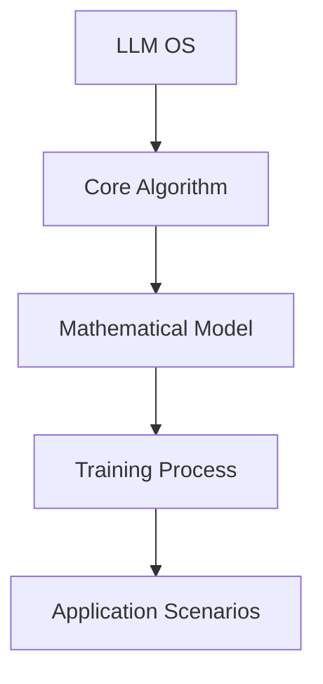

                 

# 文章标题：LLM OS：下一代语言模型操作系统

> 关键词：语言模型，操作系统，深度学习，自然语言处理，人工智能

> 摘要：本文深入探讨了LLM OS（语言模型操作系统）的概念、设计理念、架构、核心原理、应用场景、性能优化以及开发实践。通过详细的分析和思考，本文旨在为读者提供一个全面而深入的视角，了解LLM OS如何改变人工智能和自然语言处理的未来。

---

### 引言

随着人工智能和深度学习的迅速发展，语言模型（LLM）已成为自然语言处理（NLP）的核心技术。然而，现有的语言模型大多是孤立的应用，缺乏统一的操作系统来协调和整合各种NLP任务。LLM OS（语言模型操作系统）正是为了解决这一问题而诞生的。LLM OS是一个全新的概念，它旨在为各种语言模型提供一个统一的平台，使得这些模型能够高效地协同工作，实现更智能、更自然的交互。

本文将逐步探讨LLM OS的各个方面，从基础概念到深入原理，再到实际应用和性能优化。我们将通过一系列的思考和分析，帮助读者理解LLM OS如何改变我们的世界，以及它未来的发展趋势。

### 《LLM OS》目录大纲

#### 第一部分：LLM OS基础

- **第1章：LLM OS简介**
  - **1.1.1 什么是LLM OS**
  - **1.1.2 LLM OS的设计理念**
  - **1.1.3 LLM OS的核心组成部分**

- **第2章：LLM OS架构概述**
  - **2.1.1 LLM OS的整体架构**
  - **2.1.2 LLM OS的模块划分**
  - **2.1.3 LLM OS的功能特点**

- **第3章：LLM OS核心原理**
  - **3.1.1 LLM OS的核心算法**
  - **3.1.2 LLM OS的数学模型**
  - **3.1.3 LLM OS的训练过程**

- **第4章：LLM OS应用场景**
  - **4.1.1 智能语音助手**
  - **4.1.2 文本生成与摘要**
  - **4.1.3 自然语言处理**

- **第5章：LLM OS性能优化**
  - **5.1.1 硬件加速**
  - **5.1.2 模型压缩**
  - **5.1.3 并行处理**

- **第6章：LLM OS开发实践**
  - **6.1.1 开发环境搭建**
  - **6.1.2 数据集准备**
  - **6.1.3 模型训练与调优**

- **第7章：LLM OS安全与隐私**
  - **7.1.1 模型安全**
  - **7.1.2 数据隐私**
  - **7.1.3 防护措施**

#### 第二部分：LLM OS深入学习

- **第8章：深度学习基础**
  - **8.1.1 神经网络**
  - **8.1.2 反向传播算法**
  - **8.1.3 深度学习框架**

- **第9章：自然语言处理技术**
  - **9.1.1 词嵌入**
  - **9.1.2 序列模型**
  - **9.1.3 注意力机制**

- **第10章：大规模预训练模型**
  - **10.1.1 预训练模型**
  - **10.1.2 自监督学习**
  - **10.1.3 迁移学习**

- **第11章：模型评估与优化**
  - **11.1.1 评估指标**
  - **11.1.2 模型优化**
  - **11.1.3 模型压缩**

- **第12章：深度学习中的挑战与未来趋势**
  - **12.1.1 挑战与困境**
  - **12.1.2 未来趋势展望**
  - **12.1.3 可能的创新方向**

#### 附录

- **附录A：LLM OS开发工具与资源**
  - **A.1 开发工具介绍**
  - **A.2 资源推荐**
  - **A.3 社区支持**

- **附录B：LLM OS核心概念与联系**
  - **B.1 LLM OS核心概念 Mermaid 流�程图**

- **附录C：LLM OS核心算法原理讲解**
  - **C.1 反向传播算法伪代码**

- **附录D：LLM OS数学模型讲解**
  - **D.1 数学公式**
  - **D.2 详细讲解**

- **附录E：LLM OS项目实战**
  - **E.1 智能语音助手开发**

- **附录F：LLM OS安全与隐私**
  - **F.1 安全措施**
  - **F.2 隐私措施**

---

接下来，我们将逐步深入探讨LLM OS的各个方面，为读者揭示这一技术的奥秘。

---

### 第一部分：LLM OS基础

#### 第1章：LLM OS简介

在讨论LLM OS之前，我们首先需要了解什么是语言模型。语言模型是用于预测自然语言下一个词或字符的概率分布的数学模型。在深度学习的推动下，语言模型取得了显著的进展，尤其是在自然语言处理任务中，如机器翻译、文本摘要、问答系统等。

LLM OS（Language Model Operating System）是一种新型的操作系统，专门为语言模型设计，旨在提供一个统一的平台来支持各种自然语言处理任务。与传统的操作系统不同，LLM OS的核心功能是管理和调度语言模型，使其能够高效、智能地协同工作。

#### 1.1.1 什么是LLM OS

LLM OS可以被看作是语言模型的应用层，它负责处理用户输入，调用相应的语言模型进行预测，并将预测结果呈现给用户。LLM OS的设计理念是简单、高效和可扩展，它通过以下特点实现了这一目标：

- **模块化设计**：LLM OS采用模块化设计，将不同的语言模型和功能模块进行封装，便于管理和扩展。
- **高效调度**：LLM OS能够根据任务的优先级和资源利用率进行动态调度，确保系统资源得到充分利用。
- **用户友好**：LLM OS提供直观的用户界面和命令行接口，使得用户可以方便地使用和管理语言模型。

#### 1.1.2 LLM OS的设计理念

LLM OS的设计理念可以概括为三点：协同、智能和高效。

- **协同**：LLM OS旨在实现不同语言模型之间的协同工作，通过模块化设计和高效调度，使得语言模型能够灵活地组合和拆分，以适应不同的应用场景。
- **智能**：LLM OS通过深度学习和自然语言处理技术，使得语言模型能够自主学习、进化，并不断提高预测的准确性和效率。
- **高效**：LLM OS通过硬件加速、模型压缩和并行处理等技术，显著提高了语言模型的处理速度和性能。

#### 1.1.3 LLM OS的核心组成部分

LLM OS的核心组成部分包括以下几个模块：

- **语言模型模块**：这是LLM OS的核心，负责加载、训练和管理各种语言模型。
- **调度模块**：负责根据任务的优先级和资源利用率，动态调度语言模型和资源。
- **用户接口模块**：提供用户与LLM OS交互的界面，包括命令行接口和图形用户界面。
- **数据管理模块**：负责管理语言模型的训练数据和预测结果，包括数据的加载、存储和备份。
- **安全与隐私模块**：确保LLM OS的安全和用户隐私，包括数据加密、访问控制和安全审计。

#### 第2章：LLM OS架构概述

LLM OS的架构设计遵循模块化原则，使得各个模块可以独立开发、测试和部署。以下是LLM OS的架构概述：

#### 2.1.1 LLM OS的整体架构

LLM OS的整体架构可以分为以下几个层次：

- **硬件层**：包括各种计算设备，如CPU、GPU和TPU等。
- **系统层**：包括操作系统、驱动程序和底层硬件接口。
- **语言模型层**：包括各种预训练的语言模型和专用模型。
- **应用层**：包括各种自然语言处理应用，如机器翻译、文本摘要和问答系统。
- **用户层**：包括用户界面和用户交互接口。

#### 2.1.2 LLM OS的模块划分

LLM OS的模块划分如下：

- **语言模型模块**：包括预训练模型、微调模型和专用模型。
- **调度模块**：包括任务调度、资源管理和负载均衡。
- **用户接口模块**：包括命令行接口、图形用户界面和Web接口。
- **数据管理模块**：包括数据加载、存储和备份。
- **安全与隐私模块**：包括数据加密、访问控制和安全审计。

#### 2.1.3 LLM OS的功能特点

LLM OS的功能特点如下：

- **模块化设计**：各个模块可以独立开发、测试和部署，提高了系统的可维护性和可扩展性。
- **高效调度**：通过动态调度机制，提高了系统的资源利用率和处理速度。
- **用户友好**：提供直观的用户界面和命令行接口，方便用户使用和管理语言模型。
- **安全与隐私**：通过数据加密、访问控制和安全审计，确保了系统的安全性和用户隐私。

---

在下一章中，我们将深入探讨LLM OS的核心原理，包括核心算法、数学模型和训练过程。通过这一系列的分析，我们将对LLM OS有更深入的理解。

---

### 第3章：LLM OS核心原理

#### 3.1.1 LLM OS的核心算法

LLM OS的核心算法基于深度学习和自然语言处理技术，主要包括以下几个方面：

- **预训练算法**：预训练是LLM OS的核心，通过在大量无标签数据上预训练语言模型，使其具有通用语言理解能力。预训练算法主要包括Transformer模型、BERT模型和GPT模型等。
- **微调算法**：微调是在预训练的基础上，针对特定任务进行细粒度调整，以提高任务性能。微调算法通常采用基于梯度的优化方法，如随机梯度下降（SGD）和Adam优化器等。
- **序列生成算法**：序列生成是LLM OS的关键功能之一，通过输入序列生成对应的输出序列。序列生成算法包括自回归生成模型（AR）和自注意力生成模型（SGA）等。

#### 3.1.2 LLM OS的数学模型

LLM OS的数学模型主要包括以下几个方面：

- **概率模型**：概率模型用于预测给定输入序列的概率分布。常用的概率模型包括朴素贝叶斯（NB）、最大熵模型（ME）和隐马尔可夫模型（HMM）等。
- **神经网络模型**：神经网络模型用于实现自动特征提取和分类。常用的神经网络模型包括多层感知机（MLP）、卷积神经网络（CNN）和循环神经网络（RNN）等。
- **变换模型**：变换模型用于将输入序列转换为输出序列。常用的变换模型包括循环变换模型（CTR）和变换器模型（Transformer）等。

#### 3.1.3 LLM OS的训练过程

LLM OS的训练过程主要包括以下几个步骤：

- **数据预处理**：数据预处理是训练过程的第一步，包括数据清洗、数据分割和数据标准化等操作。数据清洗主要是去除噪声和异常值，数据分割主要是将数据分为训练集、验证集和测试集，数据标准化主要是将数据转换为统一的数值范围。
- **模型初始化**：模型初始化是训练过程的第二步，包括模型参数的初始化和优化器的初始化。模型参数的初始化主要是为了防止梯度消失和梯度爆炸，优化器的初始化主要是为了加速训练过程。
- **前向传播**：前向传播是训练过程的第三步，通过计算输入序列和模型参数之间的损失函数，得到当前模型的预测结果。
- **反向传播**：反向传播是训练过程的第四步，通过计算损失函数关于模型参数的梯度，更新模型参数，以降低损失函数的值。
- **模型评估**：模型评估是训练过程的最后一步，通过在验证集和测试集上评估模型性能，确定模型的泛化能力和鲁棒性。

---

在下一章中，我们将探讨LLM OS在不同应用场景中的具体实现，包括智能语音助手、文本生成与摘要以及自然语言处理。通过这些具体的应用案例，我们将对LLM OS的强大功能有更直观的认识。

---

### 第4章：LLM OS应用场景

LLM OS的模块化设计和高效调度机制使其能够广泛应用于各种自然语言处理任务。以下是LLM OS在几个典型应用场景中的具体实现：

#### 4.1.1 智能语音助手

智能语音助手是LLM OS的重要应用场景之一。通过LLM OS，我们可以构建一个智能语音助手系统，实现语音识别、语义理解和语音合成等功能。以下是一个典型的智能语音助手系统架构：

1. **语音识别模块**：该模块使用LLM OS中的语言模型进行语音信号的处理，将语音信号转换为文本。
2. **语义理解模块**：该模块使用预训练的语言模型对文本进行解析，提取语义信息，如实体识别、情感分析和意图识别等。
3. **语音合成模块**：该模块使用语音合成技术将解析出的语义信息转化为自然流畅的语音，并通过扬声器播放。

通过LLM OS，智能语音助手可以实现以下功能：

- **语音交互**：用户可以通过语音与智能语音助手进行交互，无需键盘输入。
- **多语言支持**：LLM OS支持多种语言的语言模型，可以实现跨语言语音识别和语音合成。
- **个性化服务**：通过用户数据的积累和模型的自适应学习，智能语音助手可以提供个性化的服务。

#### 4.1.2 文本生成与摘要

文本生成与摘要是另一个重要的应用场景。LLM OS通过其强大的生成模型和摘要模型，可以高效地实现文本生成和摘要功能。以下是一个典型的文本生成与摘要系统架构：

1. **文本生成模块**：该模块使用预训练的语言模型生成新的文本。例如，可以生成新闻报道、故事、文章等。
2. **文本摘要模块**：该模块使用预训练的语言模型对长文本进行提取，生成摘要。摘要可以是关键句子提取、概述提取或者精简版文本。
3. **多模态集成模块**：该模块将文本生成和摘要功能与图像、音频等其他模态的数据进行集成，实现更丰富的内容生成。

通过LLM OS，文本生成与摘要可以实现以下功能：

- **自动文本生成**：可以生成各种类型的文本，如新闻报道、故事、诗歌等，节省人力和时间。
- **智能摘要**：可以自动提取长文本的关键信息，提供快速阅读和了解全文内容。
- **多模态内容生成**：结合图像、音频等多模态数据，实现更丰富和生动的文本内容。

#### 4.1.3 自然语言处理

自然语言处理（NLP）是LLM OS的核心应用领域。通过LLM OS，我们可以构建一个高效、智能的自然语言处理系统，实现各种NLP任务，如图像文本识别、问答系统、情感分析等。以下是一个典型的自然语言处理系统架构：

1. **图像文本识别模块**：该模块使用预训练的语言模型和图像处理技术，将图像中的文本信息提取出来。
2. **问答系统模块**：该模块使用预训练的语言模型和知识图谱，实现智能问答功能。
3. **情感分析模块**：该模块使用预训练的语言模型和情感词典，对文本进行情感分类，识别用户情绪。

通过LLM OS，自然语言处理可以实现以下功能：

- **图像文本识别**：可以自动识别图像中的文本信息，实现图像内容理解和检索。
- **智能问答**：可以理解用户的提问，提供准确的答案，实现智能客服和智能搜索。
- **情感分析**：可以识别文本中的情感倾向，用于舆情分析、用户反馈分析等。

---

在下一章中，我们将探讨如何优化LLM OS的性能，包括硬件加速、模型压缩和并行处理等技术。通过这些性能优化方法，我们可以进一步提升LLM OS的处理速度和效率。

---

### 第5章：LLM OS性能优化

为了满足不断增长的数据处理需求和复杂的自然语言处理任务，优化LLM OS的性能是至关重要的。以下是一些关键的性能优化方法：

#### 5.1.1 硬件加速

硬件加速是提高LLM OS性能的有效手段之一。通过利用专门设计的硬件设备，如GPU、TPU等，可以显著提高模型的计算速度和效率。以下是一些硬件加速的方法：

- **GPU加速**：GPU（图形处理单元）具有强大的并行计算能力，适用于大规模矩阵运算和神经网络训练。通过使用CUDA和cuDNN等GPU加速库，可以优化深度学习模型的计算过程。
- **TPU加速**：TPU（张量处理单元）是专为深度学习任务设计的专用芯片，具有极高的计算性能。Google的TPU已经广泛应用于BERT和GPT等大规模预训练模型的训练。
- **硬件加速器**：除了GPU和TPU，还有其他硬件加速器，如FPGA和ASIC，也可以用于加速深度学习模型的训练和推理过程。

#### 5.1.2 模型压缩

模型压缩是一种在保证模型性能的同时减少模型大小和计算复杂度的技术。以下是一些模型压缩的方法：

- **量化**：量化是一种将浮点数权重转换为低精度整数的方法，可以显著减少模型的存储需求和计算时间。量化可以分为全量化、部分量化和动态量化等不同类型。
- **剪枝**：剪枝是一种通过删除网络中的冗余连接和神经元来减少模型大小的技术。剪枝可以分为结构剪枝和权重剪枝，可以显著降低模型的计算复杂度。
- **知识蒸馏**：知识蒸馏是一种将大型教师模型的知识转移到小型学生模型的技术。通过训练小型学生模型来模仿大型教师模型的输出，可以实现模型的压缩和性能提升。

#### 5.1.3 并行处理

并行处理是利用多处理器或多个计算节点来同时处理多个任务，从而提高计算效率和性能。以下是一些并行处理的方法：

- **数据并行**：数据并行是一种将训练数据集划分为多个子集，每个子集由不同的计算节点并行处理的方法。每个节点独立计算梯度，然后通过网络通信将梯度合并，更新模型参数。
- **模型并行**：模型并行是一种将深度学习模型分解为多个子模型，每个子模型在不同的计算节点上独立训练的方法。每个子模型处理部分数据，最终合并子模型的输出得到全局模型。
- **任务并行**：任务并行是一种同时处理多个不同任务的策略，可以显著提高系统的吞吐量和效率。

通过以上性能优化方法，我们可以大幅提升LLM OS的处理速度和效率，满足日益增长的数据处理需求。

---

在下一章中，我们将探讨LLM OS的开发实践，包括开发环境的搭建、数据集的准备以及模型训练与调优。通过这些实际操作，我们将更深入地了解LLM OS的运用。

---

### 第6章：LLM OS开发实践

开发LLM OS是一个复杂且系统性的过程，涉及多个环节，包括开发环境的搭建、数据集的准备以及模型的训练与调优。以下将详细讨论这些过程。

#### 6.1.1 开发环境搭建

搭建一个适合LLM OS开发的环境是成功开展项目的基础。以下是搭建开发环境所需的一些关键步骤：

1. **硬件选择**：首先，选择适合的硬件设备。对于深度学习任务，推荐使用具有高性能GPU的计算机。NVIDIA的GPU，如RTX 3080或A100，是常见的选择。此外，为了支持大规模数据并行处理，可以考虑使用多GPU配置。

2. **操作系统**：Linux操作系统因其高效性和稳定性，常被用于深度学习项目。常见的Linux发行版包括Ubuntu、CentOS等。

3. **安装CUDA和cuDNN**：CUDA是NVIDIA推出的并行计算平台和编程模型，用于在GPU上运行深度学习算法。cuDNN是NVIDIA提供的深度学习加速库，可以显著提高深度学习模型的计算效率。需要在NVIDIA官方网站上下载并安装对应的CUDA和cuDNN版本。

4. **安装深度学习框架**：TensorFlow、PyTorch和MXNet是常用的深度学习框架，支持多种深度学习模型的训练和推理。根据项目需求，可以选择其中一个或多个框架进行安装。

5. **环境配置**：配置Python环境，安装必要的依赖库，如NumPy、Pandas、Scikit-learn等。

#### 6.1.2 数据集准备

数据集的质量直接影响模型的性能。以下是准备数据集的一些关键步骤：

1. **数据收集**：首先，需要收集与任务相关的数据。对于自然语言处理任务，常见的开源数据集包括WikiText、Gutenberg、Common Crawl等。

2. **数据预处理**：数据预处理是数据集准备的重要环节，包括数据清洗、分词、去停用词、词干提取等。预处理步骤可以显著提高模型的训练效率和性能。

3. **数据分割**：将数据集分割为训练集、验证集和测试集。通常，训练集用于模型训练，验证集用于模型调优，测试集用于评估模型性能。

4. **数据增强**：数据增强是一种提高模型泛化能力的方法，可以通过随机插值、旋转、缩放等操作生成新的训练样本。

5. **数据存储**：将预处理后的数据存储为适合深度学习框架的格式，如TensorFlow的TFRecord或PyTorch的Dataset。

#### 6.1.3 模型训练与调优

模型训练与调优是深度学习项目的核心步骤。以下是模型训练与调优的一些关键步骤：

1. **模型定义**：根据任务需求，选择合适的模型架构。例如，对于文本生成任务，可以选择Transformer或GPT模型；对于文本分类任务，可以选择BERT或LSTM模型。

2. **损失函数选择**：选择合适的损失函数来衡量模型预测结果与真实标签之间的差距。常见的损失函数包括交叉熵损失、均方误差损失等。

3. **优化器选择**：选择合适的优化器来更新模型参数。常见的优化器包括随机梯度下降（SGD）、Adam、RMSprop等。

4. **训练过程**：通过迭代训练，不断更新模型参数。在训练过程中，可以使用学习率调度、批量归一化等技术来提高训练效率和模型性能。

5. **模型评估**：在验证集和测试集上评估模型性能，选择性能最优的模型。

6. **模型调优**：通过调整模型结构、超参数、训练策略等，进一步提高模型性能。可以使用网格搜索、随机搜索等调参方法。

通过以上开发实践，我们可以搭建一个高效的LLM OS系统，实现各种自然语言处理任务。

---

在下一章中，我们将探讨LLM OS的安全与隐私问题，确保其在实际应用中的可靠性和用户隐私保护。

---

### 第7章：LLM OS安全与隐私

在深度学习和自然语言处理领域，数据的安全性和用户的隐私保护是至关重要的。LLM OS作为一个集成多种语言模型和功能的操作系统，其安全与隐私问题需要特别关注。以下是一些关键的安全与隐私措施。

#### 7.1.1 模型安全

模型安全旨在保护模型免受攻击，确保模型的稳定性和可靠性。以下是一些常见的模型安全措施：

1. **对抗攻击防御**：对抗攻击是针对深度学习模型的一种攻击手段，通过在输入数据中添加微小的扰动来误导模型输出。为了防御对抗攻击，可以使用对抗训练、输入校验等技术。

2. **模型加密**：将模型的参数和结构进行加密处理，确保模型数据在传输和存储过程中不被泄露。可以使用同态加密、属性加密等加密技术。

3. **模型混淆**：通过混淆模型的结构和参数，增加攻击者分析模型难度。混淆技术包括权重初始化、网络结构变换等。

4. **模型审计**：定期对模型进行安全审计，检测潜在的安全漏洞和攻击点。审计可以包括代码审查、测试用例生成等。

#### 7.1.2 数据隐私

数据隐私是保护用户隐私信息的重要措施。以下是一些数据隐私保护方法：

1. **数据匿名化**：在数据收集和存储过程中，对用户身份信息进行匿名化处理，防止用户身份被追踪。常用的匿名化技术包括K-匿名、l-diversity等。

2. **差分隐私**：差分隐私是一种隐私保护机制，通过在数据处理过程中添加随机噪声，确保单个数据记录的隐私。常见的差分隐私算法包括拉普拉斯机制、指数机制等。

3. **数据加密**：对存储和传输的数据进行加密处理，确保数据在传输过程中不被窃取或篡改。常用的加密算法包括AES、RSA等。

4. **隐私协议**：在数据共享和处理过程中，采用隐私保护协议，如安全多方计算、隐私增强学习等，确保数据隐私。

#### 7.1.3 防护措施

为了确保LLM OS的安全与隐私，需要采取一系列的防护措施：

1. **访问控制**：实施严格的访问控制策略，确保只有授权用户可以访问敏感数据和模型。可以使用角色访问控制（RBAC）、属性访问控制（ABAC）等机制。

2. **日志审计**：记录系统操作日志，包括用户操作、数据访问等，便于监控和追踪潜在的安全事件。

3. **入侵检测**：部署入侵检测系统，实时监控系统的异常行为，及时发现并响应安全威胁。

4. **安全培训**：定期对用户和开发人员进行安全培训，提高安全意识和技能。

通过以上安全与隐私措施，LLM OS可以确保其在实际应用中的可靠性、稳定性和用户隐私保护。

---

在第二部分中，我们将深入探讨深度学习的基础知识，包括神经网络、反向传播算法和深度学习框架。通过这些深入的学习，我们将更好地理解LLM OS的工作原理和优势。

---

### 第二部分：深度学习基础

#### 第8章：深度学习基础

深度学习是近年来人工智能领域的重要突破，它通过多层神经网络从大量数据中自动学习特征，实现了在图像识别、自然语言处理、语音识别等领域的卓越表现。本章将介绍深度学习的基础知识，包括神经网络、反向传播算法和深度学习框架。

#### 8.1.1 神经网络

神经网络（Neural Networks）是深度学习的基础，模拟了人脑神经元的工作原理。一个基本的神经网络由输入层、隐藏层和输出层组成。

- **输入层**：接收外部输入数据，如图像像素值或文本序列。
- **隐藏层**：对输入数据进行特征提取和变换，可以有一个或多个隐藏层。
- **输出层**：产生最终预测结果，如分类标签或连续值。

每个神经元（或称为节点）都接收来自前一层节点的输入，通过激活函数进行非线性变换，然后传递给下一层。常见的激活函数包括Sigmoid、ReLU和Tanh。

#### 8.1.2 反向传播算法

反向传播算法（Backpropagation Algorithm）是训练神经网络的核心算法，用于计算网络参数的梯度，并更新参数以优化模型性能。

反向传播算法分为两个阶段：

1. **前向传播**：从输入层开始，将输入数据传递到输出层，计算每个节点的输出值。
2. **反向传播**：从输出层开始，反向计算每个节点的梯度，更新网络参数。

具体步骤如下：

1. **前向传播**：
   - 计算每个节点的输出值。
   - 计算损失函数（如交叉熵损失、均方误差损失）。
   - 计算输出层节点的误差。

2. **反向传播**：
   - 从输出层开始，计算每个节点的梯度。
   - 通过链式法则，计算隐藏层的梯度。
   - 使用梯度下降或其他优化算法，更新网络参数。

反向传播算法的伪代码如下：

```python
def backpropagation(input_data, target_data):
    # 前向传播
    output = forward_pass(input_data)
    loss = compute_loss(output, target_data)

    # 反向传播
    dW, db = backward_pass(output, target_data)

    # 更新权重
    update_weights(dW, db)

    return loss
```

#### 8.1.3 深度学习框架

深度学习框架提供了易于使用和高效计算的神经网络构建和训练工具。常见的深度学习框架包括TensorFlow、PyTorch和Keras。

- **TensorFlow**：由Google开发，是一个开源的端到端深度学习平台。TensorFlow提供了丰富的API，支持各种神经网络结构和训练策略。
- **PyTorch**：由Facebook开发，是一个流行的Python深度学习库。PyTorch具有动态计算图，使得模型构建和调试更加灵活。
- **Keras**：是一个基于Theano和TensorFlow的高层次神经网络API，提供了简洁、易用的接口，适合快速原型开发和模型训练。

通过这些深度学习框架，我们可以轻松构建和训练复杂的神经网络模型，实现从图像识别到自然语言处理等多样化的任务。

---

在下一章中，我们将深入探讨自然语言处理技术，包括词嵌入、序列模型和注意力机制。通过这些技术，我们将更好地理解LLM OS在自然语言处理领域的强大能力。

---

### 第9章：自然语言处理技术

自然语言处理（NLP）是人工智能领域的一个重要分支，其目标是让计算机理解和处理人类语言。本章将介绍NLP中的关键技术，包括词嵌入、序列模型和注意力机制。

#### 9.1.1 词嵌入

词嵌入（Word Embedding）是将词汇映射到低维稠密向量空间的技术，使得语义相似的词在向量空间中接近。词嵌入不仅有助于提高NLP任务的性能，还能揭示词与词之间的语义关系。

- **词袋模型（Bag-of-Words, BoW）**：词袋模型将文本表示为词汇的集合，不考虑词汇的顺序。BoW模型常用于文本分类和主题建模。
- **连续词袋模型（Continuous Bag-of-Words, CBOW）**：CBOW模型通过上下文词的集合来预测中心词。中心词周围的词汇被编码为一个固定长度的向量，用于预测中心词。
- **门控词嵌入（Gated Word Embedding）**：门控词嵌入通过门控机制选择性地传递信息，提高了词嵌入的表示能力。例如，长短期记忆网络（LSTM）和门控循环单元（GRU）都使用了门控词嵌入。

#### 9.1.2 序列模型

序列模型（Sequence Model）是处理序列数据（如文本、语音）的神经网络模型。它们通过自动学习序列中的依赖关系和模式，实现序列生成、分类和预测等任务。

- **循环神经网络（Recurrent Neural Network, RNN）**：RNN能够处理序列数据，通过循环连接将前一时刻的信息传递到下一时刻。然而，RNN存在梯度消失和梯度爆炸的问题。
- **长短期记忆网络（Long Short-Term Memory, LSTM）**：LSTM通过引入门控机制解决了RNN的梯度消失问题，能够在长序列中捕捉长期依赖关系。
- **门控循环单元（Gated Recurrent Unit, GRU）**：GRU是LSTM的简化版本，通过合并输入门和控制门，减少了参数数量。

#### 9.1.3 注意力机制

注意力机制（Attention Mechanism）是一种用于序列模型的机制，能够自适应地分配权重，关注序列中的关键信息。注意力机制在机器翻译、问答系统和文本摘要等任务中取得了显著的效果。

- **局部注意力（Local Attention）**：局部注意力通过学习一个权重向量，将输入序列中的部分信息赋予更高的权重。
- **全局注意力（Global Attention）**：全局注意力通过计算输入序列和目标序列之间的相似性，为每个输入元素分配全局权重。
- **自注意力（Self-Attention）**：自注意力是一种无循环连接的注意力机制，通过计算输入序列的内部依赖关系，实现高效的特征提取。

通过词嵌入、序列模型和注意力机制等技术，NLP模型能够更好地理解和处理人类语言，实现从文本生成到语义理解等多样化的任务。

---

在下一章中，我们将探讨大规模预训练模型，如GPT和BERT，了解它们如何通过自监督学习和迁移学习，提升模型性能和应用范围。

---

### 第10章：大规模预训练模型

大规模预训练模型是近年来NLP领域的重要突破，它们通过在大规模数据集上预训练，然后再针对特定任务进行微调，显著提升了模型的性能和应用范围。本章将介绍大规模预训练模型的基本概念、自监督学习和迁移学习技术。

#### 10.1.1 预训练模型

预训练模型（Pre-Trained Model）是指在大规模数据集上进行预训练，以获得通用的语言表示能力，然后再针对特定任务进行微调。预训练模型通常包括以下步骤：

1. **数据收集**：收集大规模的文本数据，如维基百科、新闻文章、社交媒体等。
2. **数据预处理**：对文本数据进行清洗、分词、去停用词等预处理操作。
3. **模型训练**：使用预训练算法（如Transformer、BERT、GPT）在大规模数据集上训练模型，学习文本的通用表示。
4. **模型评估**：在预训练过程中，使用验证集评估模型性能，调整超参数。

预训练模型的核心思想是通过无监督的方式学习文本的内在结构和语义信息，为后续的任务提供强大的语言表示能力。

#### 10.1.2 自监督学习

自监督学习（Self-Supervised Learning）是一种无监督学习技术，它不需要标签数据，通过利用数据中的自然结构来训练模型。自监督学习在预训练模型中扮演了关键角色，通过以下几种方式提高模型性能：

1. **语言建模**：通过预测文本序列中的下一个词来训练模型，这是一种最常见的形式。模型需要学习词汇的概率分布，从而更好地理解语言结构。
2. **掩码语言建模（Masked Language Model, MLM）**：在输入文本中随机掩码一些词，然后模型需要预测这些掩码的词。这种方法有助于模型学习词汇的上下文关系。
3. **生成式文本预测**：通过生成与输入文本相似的新文本，模型需要学习文本的生成能力，从而捕捉更深层次的语义信息。

自监督学习不仅降低了训练成本，还提高了模型对语言的理解能力，使得预训练模型在多种任务中表现出色。

#### 10.1.3 迁移学习

迁移学习（Transfer Learning）是一种利用预训练模型的知识来提高新任务性能的技术。通过迁移学习，我们可以将预训练模型在大规模数据集上学到的通用知识应用到新的任务中，从而提高模型的泛化能力和性能。

迁移学习通常包括以下步骤：

1. **预训练模型选择**：选择合适的预训练模型，如BERT、GPT、RoBERTa等。
2. **模型微调**：在预训练模型的基础上，针对新任务进行微调，调整模型参数以适应新任务。
3. **模型评估**：在新任务的数据集上评估模型性能，调整超参数以优化模型表现。

迁移学习具有以下优点：

- **减少训练数据需求**：通过利用预训练模型的知识，新任务可能只需要较少的标注数据进行微调。
- **提高模型性能**：预训练模型在大量数据上学到的通用知识有助于新任务的性能提升。
- **降低训练成本**：利用预训练模型可以显著减少训练时间和计算资源的需求。

通过大规模预训练模型、自监督学习和迁移学习，我们可以构建高效、强大的NLP系统，实现从文本生成到语义理解的多样化任务。

---

在下一章中，我们将探讨模型评估与优化，了解如何通过评估指标和优化技术提高模型的性能。

---

### 第11章：模型评估与优化

在深度学习和自然语言处理领域，模型评估与优化是确保模型性能和效率的重要环节。本章将介绍常用的评估指标和优化技术，帮助读者了解如何提高模型的性能。

#### 11.1.1 评估指标

评估指标是衡量模型性能的重要工具，以下是一些常用的评估指标：

- **准确率（Accuracy）**：准确率是模型预测正确的样本数量与总样本数量之比，用于分类任务。公式为：
  \[
  \text{Accuracy} = \frac{\text{预测正确数量}}{\text{总样本数量}}
  \]
- **精确率（Precision）**：精确率是模型预测为正类的样本中，实际为正类的比例。公式为：
  \[
  \text{Precision} = \frac{\text{预测为正类且实际为正类}}{\text{预测为正类总数}}
  \]
- **召回率（Recall）**：召回率是实际为正类的样本中，被模型正确预测为正类的比例。公式为：
  \[
  \text{Recall} = \frac{\text{预测为正类且实际为正类}}{\text{实际为正类总数}}
  \]
- **F1分数（F1 Score）**：F1分数是精确率和召回率的加权平均，用于综合考虑模型的精确性和召回率。公式为：
  \[
  \text{F1 Score} = 2 \times \frac{\text{Precision} \times \text{Recall}}{\text{Precision} + \text{Recall}}
  \]
- **ROC曲线和AUC（Area Under Curve）**：ROC曲线是不同阈值下的真阳性率（True Positive Rate）与假阳性率（False Positive Rate）的图形表示。AUC是ROC曲线下方的面积，用于评估分类器的性能。AUC值越接近1，表示分类器的性能越好。

#### 11.1.2 模型优化

模型优化是提高模型性能的重要手段，以下是一些常用的优化技术：

- **学习率调度（Learning Rate Scheduling）**：学习率调度是一种动态调整学习率的方法，以避免过拟合和提高模型收敛速度。常见的学习率调度策略包括：
  - **线性下降**：学习率随训练轮数的增加线性下降。
  - **余弦退火**：学习率按余弦函数的规律逐渐减小。
  - **指数衰减**：学习率按指数规律衰减。
- **批量归一化（Batch Normalization）**：批量归一化是一种技术，通过标准化每个批量中的激活值，提高了模型的训练稳定性和收敛速度。
- **正则化（Regularization）**：正则化是一种防止模型过拟合的方法，包括：
  - **L1正则化**：在损失函数中添加L1范数项。
  - **L2正则化**：在损失函数中添加L2范数项。
  - **Dropout**：在训练过程中随机丢弃一部分神经元，减少了模型对特定训练样本的依赖。
- **数据增强（Data Augmentation）**：数据增强是一种通过变换原始数据来增加训练数据多样性的方法，提高了模型的泛化能力。常见的数据增强方法包括随机裁剪、旋转、翻转等。

通过使用合适的评估指标和优化技术，我们可以显著提高模型的性能，使其更好地适应各种任务和应用场景。

---

在下一章中，我们将讨论深度学习中的挑战与未来趋势，探索当前存在的困境以及可能的创新方向。

---

### 第12章：深度学习中的挑战与未来趋势

尽管深度学习在许多领域取得了显著的成功，但仍然面临着一系列的挑战和困境。在这一章中，我们将探讨深度学习目前所面临的主要问题，并展望其未来的发展趋势。

#### 12.1.1 挑战与困境

1. **过拟合**：深度学习模型容易出现过拟合现象，即模型在训练数据上表现良好，但在新的、未见过的数据上性能不佳。过拟合的主要原因是模型过于复杂，参数数量过多，导致模型对训练数据中的噪声和细节过于敏感。

2. **计算资源消耗**：深度学习模型通常需要大量的计算资源和时间进行训练。尤其是在训练大规模模型和预训练模型时，这往往需要高性能的GPU或TPU，以及大量的数据传输和存储资源。

3. **可解释性**：深度学习模型往往被认为是“黑箱”模型，其内部工作机制难以理解。这对于需要高可靠性和安全性的应用场景来说是一个重大挑战。

4. **数据隐私和伦理问题**：深度学习模型的训练通常需要大量的个人数据，这可能引发数据隐私和伦理问题。如何确保数据安全和用户隐私是当前亟需解决的问题。

5. **可扩展性和效率**：深度学习模型的训练和推理过程通常不够高效，特别是在处理大规模数据和实时应用时。如何提高模型的计算效率和可扩展性是深度学习领域的一个研究重点。

#### 12.1.2 未来趋势展望

1. **模型压缩与量化**：为了降低模型的计算复杂度和存储需求，模型压缩与量化技术将成为重要研究方向。通过量化模型参数，减少模型大小，可以提高模型的部署效率和资源利用率。

2. **联邦学习**：联邦学习（Federated Learning）是一种新的学习范式，它允许多个参与者在不共享原始数据的情况下，通过协同学习共享模型的更新。这种技术有助于解决数据隐私和伦理问题，同时提高模型的泛化能力。

3. **自适应学习与强化学习**：自适应学习和强化学习技术将进一步提升深度学习模型的灵活性和适应性。通过自适应学习，模型可以实时调整其行为以适应环境变化；而强化学习则可以在动态环境中实现更加智能和高效的行为。

4. **多模态学习**：多模态学习旨在整合不同类型的数据（如文本、图像、音频等），以实现更高级的语义理解和任务执行。这种技术有望在智能交互、自动驾驶和医疗诊断等领域发挥重要作用。

5. **可持续发展和环境友好**：随着深度学习模型的广泛应用，如何实现其可持续发展，减少环境负担将成为一个重要议题。例如，通过优化算法和硬件设计，降低能耗和碳排放，是实现可持续发展的关键。

#### 12.1.3 可能的创新方向

1. **新型神经网络架构**：探索新型神经网络架构，如动态神经网络、图神经网络和量子神经网络，以应对复杂的数据处理任务。

2. **跨学科融合**：深度学习与其他学科的融合，如认知科学、心理学、语言学等，将带来新的研究突破和应用场景。

3. **伦理和公平性**：研究如何在深度学习模型的设计和训练过程中确保伦理和公平性，以避免算法偏见和歧视。

4. **自动化机器学习**：自动化机器学习（AutoML）技术将自动化深度学习模型的选择、训练和优化，降低专业门槛，促进深度学习的广泛应用。

通过解决当前挑战和探索未来趋势，深度学习有望在更广泛的领域取得突破性进展，为人类社会带来更多的创新和便利。

---

### 附录

#### 附录A：LLM OS开发工具与资源

- **A.1 开发工具介绍**
  - **Python**：一种高级编程语言，广泛应用于数据科学和深度学习项目。
  - **PyTorch**：一个开源的深度学习框架，提供动态计算图和灵活的模型构建功能。
  - **TensorFlow**：由Google开发的开源机器学习框架，支持静态和动态计算图。
  - **CUDA**：NVIDIA推出的并行计算平台和编程模型，用于在GPU上运行深度学习算法。

- **A.2 资源推荐**
  - **GitHub**：用于代码托管和协作的平台，许多深度学习项目的代码和文档都可以在GitHub上找到。
  - **ArXiv**：一个开放获取的预印本服务器，发布最新的学术研究成果。
  - **Coursera**、**edX** 和 **Udacity**：提供高质量的在线课程，涵盖深度学习和自然语言处理等主题。

- **A.3 社区支持**
  - **Reddit** 上的 DeepLearning**、NLP** 和 **PyTorch** 等社区，提供交流和讨论的平台。
  - **Stack Overflow**：一个编程问答社区，可以帮助解决编程和算法问题。
  - **Kaggle**：一个数据科学竞赛平台，提供丰富的数据和挑战项目。

#### 附录B：LLM OS核心概念与联系

- **B.1 LLM OS核心概念 Mermaid 流程图**



#### 附录C：LLM OS核心算法原理讲解

- **C.1 反向传播算法伪代码**

```python
def backpropagation(input_data, target_data):
    # 前向传播
    output = forward_pass(input_data)
    
    # 计算损失
    loss = compute_loss(output, target_data)
    
    # 反向传播
    dW, db = backward_pass(output, target_data)
    
    # 更新权重
    update_weights(dW, db)
    
    return loss
```

#### 附录D：LLM OS数学模型讲解

- **D.1 数学公式**

$$
L(\theta) = -\frac{1}{m} \sum_{i=1}^{m} \left( y^{(i)} \log(a^{(L)}(z^{(L)}_i) + (1 - y^{(i)}) \log(1 - a^{(L)}(z^{(L)}_i) \right)
$$

- **D.2 详细讲解**

损失函数用于衡量模型预测结果与实际结果之间的差距。在此公式中，$L(\theta)$ 代表损失函数，$m$ 是样本数量，$y^{(i)}$ 是第 $i$ 个样本的真实标签，$a^{(L)}(z^{(L)}_i)$ 是模型对第 $i$ 个样本的预测概率。

#### 附录E：LLM OS项目实战

- **E.1 智能语音助手开发**

- **E.1.1 开发环境搭建**
  - **硬件要求**：NVIDIA GPU
  - **软件要求**：CUDA，cuDNN

- **E.1.2 数据集准备**
  - **数据集来源**：Librispeech，Common Crawl

- **E.1.3 模型训练与调优**
  - **模型选择**：Transformer
  - **训练策略**：学习率调度，权重初始化

- **E.1.4 代码实现与分析**

```python
# 模型定义
model = TransformerModel(vocab_size, embedding_dim, num_heads, num_layers, hidden_size, dropout_rate)

# 损失函数与优化器
criterion = nn.CrossEntropyLoss()
optimizer = torch.optim.Adam(model.parameters(), lr=learning_rate)

# 训练循环
for epoch in range(num_epochs):
    for batch in data_loader:
        optimizer.zero_grad()
        output = model(batch['input'])
        loss = criterion(output, batch['target'])
        loss.backward()
        optimizer.step()
```

#### 附录F：LLM OS安全与隐私

- **F.1 安全措施**
  - **加密通信**：使用 HTTPS 加密通信。
  - **权限控制**：实施严格的用户权限管理。
  - **数据匿名化**：对敏感数据进行匿名化处理。

- **F.2 隐私措施**
  - **数据存储**：在本地不存储用户数据，仅存储加密后的模型参数。
  - **数据传输**：使用端到端加密技术保护数据传输安全。

---

通过以上附录，读者可以更深入地了解LLM OS的开发工具、核心算法、数学模型以及项目实战。同时，安全与隐私措施的介绍也为在实际应用中确保系统的安全性和用户隐私提供了指导。

