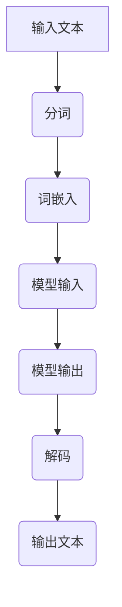
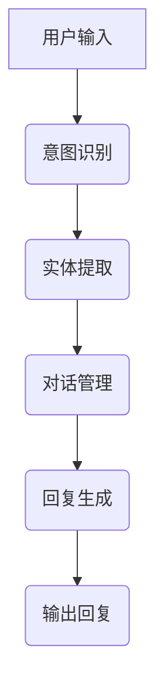
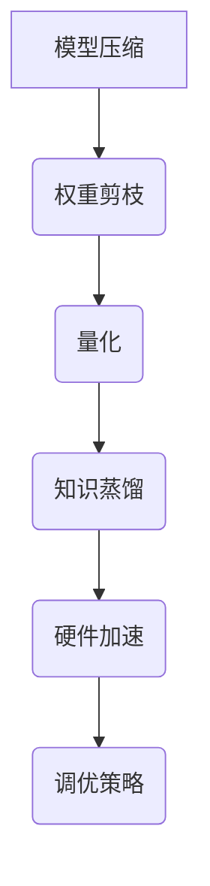

                 

### 文章标题

# LLM-based Chatbot System Evaluation

### 关键词

- 语言模型（Language Model）
- 聊天机器人（Chatbot）
- 评估方法（Evaluation Method）
- 系统架构（System Architecture）
- 性能优化（Performance Optimization）
- 数据隐私（Data Privacy）

### 摘要

本文将深入探讨基于大型语言模型（LLM）的聊天机器人系统评估。首先，我们将介绍LLM的基础理论和核心原理，包括其历史发展、数学模型和训练方法。随后，我们将分析LLM的优势与挑战，以及其在自然语言处理和聊天机器人中的应用。接下来，我们将讨论聊天机器人系统的架构设计原则和关键组成部分，特别是LLM在其中的角色和任务分配。随后，我们将详细讲解LLM性能评估的指标和工具，并通过实际案例展示其性能分析。文章的后半部分将聚焦于聊天机器人系统的实战，包括系统环境搭建和实际案例解析。最后，我们将探讨聊天机器人系统的优化策略、挑战及其解决方案，并对未来的发展趋势和前景进行展望。本文旨在为读者提供一个全面而深入的指南，帮助理解、设计和评估基于LLM的聊天机器人系统。

### 第一部分：LLM基础理论

#### 第1章 介绍与背景

## 1.1 什么是LLM

### 1.1.1 语言模型的定义

语言模型（Language Model，简称LM）是一种概率模型，用于预测自然语言中下一个词或字符的概率。它是一种基于统计方法或神经网络的方法，旨在理解自然语言的结构和语义。语言模型的核心任务是给出一个单词或短语的序列，并估计下一个单词或字符的概率。

语言模型的应用范围非常广泛，包括但不限于机器翻译、文本分类、信息检索、对话系统、语音识别等。其中，最著名的语言模型之一是1986年由哈里·尼伦伯格（Harry Neyron）和理查德·罗森塔尔（Richard Rosenbaum）提出的N-gram模型。N-gram模型是一种基于统计的语言模型，它通过分析文本中的N元组（连续的N个单词或字符）来预测下一个词或字符。

### 1.1.2 语言模型的历史与发展

语言模型的发展历程可以追溯到20世纪30年代，当时弗朗茨·博德（Franz Boð）提出了语境分析机（Contextual Analysis Machine）的概念，这是最早的自动语言处理模型的雏形。然而，真正的突破发生在20世纪60年代，当时的语言学家开始关注语言的概率模型。

20世纪80年代，N-gram模型的出现标志着语言模型技术的一个重大进展。N-gram模型通过计算一个词或字符序列的概率，从而实现了一定程度上的自然语言理解。然而，N-gram模型也存在一些局限性，例如无法处理长距离依赖问题和无法捕捉上下文的动态变化。

随着深度学习的兴起，语言模型的研究和应用迎来了新的高潮。2013年，雅虎研究员雅各布·乌尔曼（Jacob Ullman）和约翰·霍普金斯大学的研究人员提出了一种名为Word2Vec的神经网络模型，它通过将单词映射到低维向量空间，实现了对单词语义的理解和表示。Word2Vec的成功引起了学术界和工业界的广泛关注，并推动了深度学习在自然语言处理领域的应用。

随后，谷歌研究员诺姆·阿姆鲁吉（Noam Shazeer）、亚历克斯·奥尼尔（Alex Neill）、和丹·卡珀（Dan Kaplan）等人于2018年提出了Transformer模型，这是一种基于自注意力机制的深度学习模型，彻底改变了语言模型的研究和应用范式。Transformer模型不仅在自然语言生成、机器翻译等任务上取得了显著成果，还催生了大量基于Transformer的改进模型，如BERT、GPT等。

## 1.2 LLM的核心原理

### 1.2.1 语言模型的基础数学模型

语言模型的基础数学模型可以分为统计模型和神经网络模型两种。

#### 统计模型

统计模型通过分析文本中的统计特征来预测下一个词或字符的概率。最常见的统计模型是N-gram模型，它使用前N个词（或字符）的统计信息来预测下一个词（或字符）。N-gram模型的数学公式如下：

\[ P(w_n | w_{n-1}, w_{n-2}, ..., w_1) = \frac{C(w_n, w_{n-1}, ..., w_1)}{C(w_{n-1}, w_{n-2}, ..., w_1)} \]

其中，\( P(w_n | w_{n-1}, w_{n-2}, ..., w_1) \) 表示在给定前N-1个词的情况下，第N个词的概率，\( C(w_n, w_{n-1}, ..., w_1) \) 表示N个词同时出现的次数，\( C(w_{n-1}, w_{n-2}, ..., w_1) \) 表示前N-1个词同时出现的次数。

#### 神经网络模型

神经网络模型通过构建多层神经网络来学习文本中的特征和关系，从而实现语言建模。其中，最著名的神经网络模型是Word2Vec模型和Transformer模型。

Word2Vec模型是一种基于神经网络的模型，它通过将单词映射到低维向量空间来实现对单词语义的理解和表示。Word2Vec模型的数学公式如下：

\[ \text{Word2Vec} = \frac{1}{\sqrt{d}} \text{softmax}(\text{V} \text{H}) \]

其中，\( \text{V} \) 是单词向量，\( \text{H} \) 是隐藏层向量，\( \text{softmax}(\text{V} \text{H}) \) 是softmax函数，用于计算单词的预测概率。

Transformer模型是一种基于自注意力机制的深度学习模型，它通过多头自注意力机制来捕捉文本中的长距离依赖关系。Transformer模型的数学公式如下：

\[ \text{Transformer} = \text{MultiHead}(\text{Self-Attention})(\text{Seq}) \]

其中，\( \text{Self-Attention} \) 是自注意力机制，\( \text{MultiHead} \) 是多头注意力机制，\( \text{Seq} \) 是序列输入。

### 1.2.2 语言模型的训练方法

语言模型的训练方法可以分为监督学习、无监督学习和半监督学习三种。

#### 监督学习

监督学习是最常见的语言模型训练方法，它通过训练有标签的数据集来学习语言模型。监督学习的方法包括基于统计的方法和基于神经网络的方法。

基于统计的方法通常使用N-gram模型，通过分析文本中的统计特征来预测下一个词或字符的概率。

基于神经网络的方法通常使用Word2Vec模型或Transformer模型，通过训练有标签的数据集来学习单词的向量表示或序列的表示。

#### 无监督学习

无监督学习是通过无标签的数据集来训练语言模型。无监督学习的方法包括基于概率的方法和基于神经网络的方法。

基于概率的方法通常使用N-gram模型，通过分析文本中的统计特征来预测下一个词或字符的概率。

基于神经网络的方法通常使用Word2Vec模型或Transformer模型，通过无监督预训练来学习单词的向量表示或序列的表示。

#### 半监督学习

半监督学习是结合有标签和无标签的数据集来训练语言模型。半监督学习的方法通常使用基于概率的方法或基于神经网络的方法。

基于概率的方法通常使用N-gram模型，通过分析有标签的数据集和无标签的数据集来预测下一个词或字符的概率。

基于神经网络的方法通常使用Word2Vec模型或Transformer模型，通过有标签的数据集和无标签的数据集来学习单词的向量表示或序列的表示。

## 1.3 LLM的优势与挑战

### 1.3.1 LLM的主要优势

语言模型具有以下主要优势：

1. **强大的语义理解能力**：语言模型通过学习大量的文本数据，可以捕捉到自然语言的语义结构和上下文信息，从而实现更准确的语义理解。

2. **自适应性和灵活性**：语言模型可以根据不同的应用场景和任务需求进行微调和优化，具有很强的适应性和灵活性。

3. **高效性和实时性**：语言模型通常采用深度学习模型，具有高效的计算能力和实时性，可以在短时间内生成高质量的文本。

4. **多语言支持**：语言模型可以处理多种自然语言，支持多语言之间的翻译和交互。

### 1.3.2 使用LLM的挑战

尽管语言模型具有很多优势，但在实际应用中仍然面临以下挑战：

1. **数据隐私和安全**：语言模型需要大量的文本数据来进行训练，这涉及到数据隐私和安全问题。如何保护用户数据，避免数据泄露和滥用是一个重要挑战。

2. **模型解释性和透明性**：语言模型通常是一个复杂的神经网络模型，其内部机制和决策过程很难被解释和理解。如何提高模型的解释性和透明性，使其更易于理解和接受是一个挑战。

3. **模型公平性和偏见**：语言模型在训练过程中可能会受到数据偏见的影响，从而导致模型输出带有偏见的结果。如何消除模型中的偏见，提高模型的公平性是一个重要挑战。

4. **能耗和资源消耗**：语言模型的训练和推理需要大量的计算资源和能耗，这对环境和可持续发展造成了一定的影响。如何降低模型能耗和资源消耗是一个重要挑战。

### 第2章 语言模型技术基础

## 2.1 语言模型基本概念

### 2.1.1 语言模型的目的

语言模型的主要目的是通过对自然语言文本的学习和分析，预测文本中下一个词或字符的概率。具体来说，语言模型有两个主要任务：

1. **文本生成**：根据已知的文本序列生成新的文本序列。例如，给定一个句子“我昨天去了公园”，语言模型可以生成“我在公园里散步”或“我拍了很多照片”。

2. **文本分类**：将给定的文本分类到预定义的类别中。例如，将一段文本分类为新闻、体育、娱乐等类别。

### 2.1.2 语言模型评估指标

评估语言模型的性能通常需要使用以下指标：

1. **准确率（Accuracy）**：准确率是预测正确的样本数与总样本数之比。对于分类任务，准确率可以衡量模型在分类任务上的整体性能。

2. **召回率（Recall）**：召回率是预测正确的正样本数与实际正样本数之比。召回率可以衡量模型在识别正样本方面的性能。

3. **精确率（Precision）**：精确率是预测正确的正样本数与预测为正样本的总数之比。精确率可以衡量模型在预测正样本时的准确性。

4. **F1分数（F1 Score）**：F1分数是精确率和召回率的调和平均值，用于综合衡量模型的分类性能。

5. **BLEU分数（BLEU Score）**：BLEU分数是自然语言生成任务中常用的评价指标，用于衡量模型生成的文本与参考文本之间的相似度。

6. **Perplexity**：Perplexity是语言模型在文本序列上的预测概率的对数平均，用于衡量模型的复杂度。Perplexity值越小，模型性能越好。

## 2.2 语言模型的构建方法

### 2.2.1 基于统计的方法

基于统计的方法是最早的语言模型构建方法，它通过分析文本中的统计特征来预测下一个词或字符的概率。N-gram模型是最常见的基于统计的方法，它使用前N个词的统计信息来预测下一个词或字符。N-gram模型的优点是简单、易于实现，但缺点是难以处理长距离依赖和上下文的动态变化。

### 2.2.2 基于神经网络的方法

基于神经网络的方法通过构建多层神经网络来学习文本中的特征和关系，从而实现语言建模。Word2Vec模型是最早的基于神经网络的方法，它通过将单词映射到低维向量空间来实现对单词语义的理解和表示。随后，Transformer模型的出现彻底改变了语言模型的研究和应用范式，它通过多头自注意力机制来捕捉文本中的长距离依赖关系，并取得了显著的性能提升。

## 2.3 语言模型的高级特性

### 2.3.1 预训练与微调

预训练与微调是现代语言模型的核心技术。预训练是指在一个大规模的语料库上进行模型训练，使模型具备强大的语言理解能力。微调是在预训练的基础上，针对特定任务对模型进行优化和调整，以提高模型在特定任务上的性能。预训练与微调的结合，使得语言模型在自然语言处理任务中取得了显著的性能提升。

### 2.3.2 迁移学习与零样本学习

迁移学习是一种利用预训练模型在新的任务上的能力，通过在新的任务上继续训练，从而提高模型在新任务上的性能。迁移学习可以减少对新任务的数据需求，提高模型的泛化能力。零样本学习是一种无需使用标注数据的模型训练方法，它通过预训练模型学习到的知识，实现对未知类别的分类和识别。迁移学习和零样本学习在自然语言处理领域具有广泛的应用前景。

### 第3章 语言模型应用场景

## 3.1 语言模型在自然语言处理中的应用

### 3.1.1 机器翻译

机器翻译是指使用计算机程序将一种自然语言文本翻译成另一种自然语言文本。语言模型在机器翻译中扮演着核心角色，它通过学习源语言和目标语言的对应关系，生成高质量的目标语言文本。常见的机器翻译模型包括基于统计的方法（如基于规则的方法和基于实例的方法）和基于神经网络的方法（如序列到序列模型和注意力机制模型）。

### 3.1.2 文本分类

文本分类是指将文本数据分类到预定义的类别中。语言模型在文本分类中通过学习文本的特征和类别标签之间的关系，实现文本的自动分类。常见的文本分类任务包括情感分析、主题分类、垃圾邮件过滤等。语言模型在文本分类中通常采用分类器（如朴素贝叶斯、支持向量机、神经网络等）来对文本进行分类。

### 3.1.3 信息检索

信息检索是指从大量文本数据中检索出与用户查询相关的信息。语言模型在信息检索中通过学习文本的表示和查询的表示，实现文本与查询的匹配和排名。常见的语言模型信息检索方法包括基于统计的方法（如TF-IDF、LDA等）和基于神经网络的方法（如BERT、GPT等）。

## 3.2 语言模型在聊天机器人中的应用

### 3.2.1 聊天机器人的定义与分类

聊天机器人是一种能够与人类进行自然语言交互的计算机程序。根据交互方式，聊天机器人可以分为以下几种类型：

1. **基于规则聊天机器人**：基于规则的聊天机器人通过预先定义的规则和模板来生成回复，适用于简单的、固定场景的交互。

2. **基于模板聊天机器人**：基于模板的聊天机器人通过将用户输入与预定义的模板进行匹配，生成回复。这种聊天机器人适用于中等复杂度的场景。

3. **基于统计聊天机器人**：基于统计的聊天机器人通过学习用户输入和回复之间的统计关系，生成回复。这种聊天机器人适用于复杂的、动态变化的场景。

4. **基于深度学习聊天机器人**：基于深度学习的聊天机器人通过学习大量的对话数据，生成高质量的回复。这种聊天机器人适用于复杂的、动态变化的场景，并且可以不断学习和优化。

### 3.2.2 聊天机器人的架构

聊天机器人的架构通常包括以下关键组件：

1. **用户界面（UI）**：用户界面是用户与聊天机器人交互的入口，可以是网页、移动应用或终端命令行等。

2. **自然语言处理（NLP）模块**：自然语言处理模块负责处理用户的输入，将其转换为机器可理解的格式，并进行意图识别和实体提取。

3. **对话管理模块**：对话管理模块负责控制对话流程，根据用户的输入和上下文信息，生成合适的回复。

4. **回复生成模块**：回复生成模块负责根据对话管理和意图识别的结果，生成自然、流畅的回复。

5. **知识库**：知识库是聊天机器人存储和查询知识的存储，用于提供对话相关的信息和答案。

### 3.2.3 语言模型在聊天机器人中的角色

语言模型在聊天机器人中扮演着核心角色，其主要职责包括：

1. **意图识别**：意图识别是指从用户的输入中识别出用户想要进行的操作或请求。语言模型通过学习大量的对话数据，可以准确识别用户的意图。

2. **实体提取**：实体提取是指从用户的输入中提取出关键信息，如人名、地点、时间等。语言模型通过学习文本的语义和上下文，可以准确提取出实体信息。

3. **回复生成**：回复生成是指根据用户的意图和实体信息，生成自然、流畅的回复。语言模型通过生成文本的方式，可以生成高质量、符合对话场景的回复。

4. **上下文理解**：上下文理解是指理解对话的上下文信息，包括对话的历史和当前的对话状态。语言模型通过学习对话数据，可以准确理解对话的上下文信息，从而生成更合适的回复。

### 第4章 聊天机器人系统架构

## 4.1 聊天机器人系统的基本组成部分

聊天机器人系统的基本组成部分包括用户界面（UI）、自然语言处理（NLP）模块、业务逻辑处理模块、数据存储模块等。

### 4.1.1 用户界面

用户界面是用户与聊天机器人交互的入口，可以是网页、移动应用或终端命令行等。用户界面需要提供简单、直观的操作方式，使用户能够轻松地与聊天机器人进行交互。

### 4.1.2 自然语言处理模块

自然语言处理模块是聊天机器人系统的核心组件，负责处理用户的输入，将其转换为机器可理解的格式，并进行意图识别和实体提取。

意图识别是指从用户的输入中识别出用户想要进行的操作或请求。自然语言处理模块通过学习大量的对话数据，可以准确识别用户的意图。

实体提取是指从用户的输入中提取出关键信息，如人名、地点、时间等。自然语言处理模块通过学习文本的语义和上下文，可以准确提取出实体信息。

### 4.1.3 业务逻辑处理模块

业务逻辑处理模块负责根据用户输入的意图和实体信息，生成合适的回复。业务逻辑处理模块通常包含对话管理、回复生成等功能。

对话管理是指根据对话的历史和当前的对话状态，控制对话流程，确保对话的连贯性和流畅性。对话管理模块需要处理多轮对话、上下文切换等问题。

回复生成是指根据对话管理和意图识别的结果，生成自然、流畅的回复。回复生成模块可以使用语言模型来生成文本，也可以使用模板匹配、规则匹配等方法。

### 4.1.4 数据存储模块

数据存储模块负责存储和查询与聊天机器人相关的数据，包括对话历史、用户信息、知识库等。数据存储模块需要支持快速的数据读写操作，以确保聊天机器人系统的性能。

### 4.2 聊天机器人系统的设计原则

聊天机器人系统的设计原则主要包括可扩展性、高效性、可维护性等。

### 4.2.1 可扩展性

可扩展性是指系统可以在不改变现有功能的情况下，支持增加新的功能或处理更多的用户请求。为了实现可扩展性，聊天机器人系统需要采用模块化设计，将不同功能模块分开，以便在需要时可以独立扩展。

### 4.2.2 高效性

高效性是指系统能够快速响应用户请求，提供高质量的交互体验。为了实现高效性，聊天机器人系统需要采用高效的算法和优化技术，如分布式计算、缓存技术等。

### 4.2.3 可维护性

可维护性是指系统能够方便地进行维护和升级，确保系统的稳定运行。为了实现可维护性，聊天机器人系统需要采用良好的编程实践，如代码规范、模块化设计等，以便在出现问题时能够快速定位和修复。

### 第5章 LLM在聊天机器人中的应用

## 5.1 LLM在聊天机器人中的任务分配

语言模型（LLM）在聊天机器人中承担着多种关键任务，其高效性和灵活性使其成为构建智能聊天机器人的核心组件。以下是LLM在聊天机器人中的主要任务及其具体职责：

### 5.1.1 语音识别与文本生成

首先，LLM可以用于语音识别（Voice Recognition），将用户的语音输入转换为文本。这一过程通常涉及声学模型的训练，该模型负责将音频信号转换为特征向量。随后，语言模型会将这些特征向量转换为文本，从而为后续的自然语言处理任务做好准备。

文本生成是LLM的另一个重要任务，它可以根据用户的输入或上下文信息生成自然的文本回复。在这一过程中，LLM会利用其从大量文本数据中学到的语言规律和语义知识，生成既符合语法规则又富有情感的文本。

### 5.1.2 上下文理解与对话管理

上下文理解是聊天机器人交互的核心，LLM在这一任务中扮演着关键角色。它需要理解对话的历史信息，包括之前的对话内容和用户行为，以便在生成回复时能够保持对话的连贯性和流畅性。

对话管理模块负责根据上下文信息控制对话的流程。LLM在这一模块中负责识别对话的意图和用户的需求，并决定如何回应。它需要处理多轮对话、上下文切换等问题，确保对话的自然和有效。

### 5.1.3 多轮对话与个性化回复

在多轮对话中，LLM需要能够理解并维持对话的连续性。它不仅需要记住前一轮对话的内容，还需要根据用户的反馈和行为动态调整回复策略。这种能力使得LLM能够进行更复杂和个性化的对话。

个性化回复是LLM的另一个重要任务。通过分析用户的偏好和历史交互记录，LLM可以生成更加贴合用户需求的回复，从而提高用户满意度和互动体验。

## 5.2 LLM性能评估

评估LLM在聊天机器人中的性能是确保其有效性和可靠性的关键。以下是常见的评估指标和工具：

### 5.2.1 评估指标

1. **回复质量**：这是衡量LLM生成回复的自然性和准确性的指标。通常使用BLEU（双语评估指数）等自动评估指标来评价回复质量。

2. **意图识别准确率**：这是衡量LLM在识别用户意图方面的准确率的指标。它通常通过比较系统识别的意图与实际意图之间的匹配度来评估。

3. **上下文保持能力**：这是衡量LLM在多轮对话中保持上下文一致性的能力。通过分析对话记录，评估系统在不同轮次中的上下文保持能力。

4. **用户满意度**：这是衡量用户对聊天机器人交互体验的主观评价。可以通过用户调查、反馈等方式收集用户满意度数据。

### 5.2.2 评估工具

1. **自动评估工具**：如BLEU、ROUGE等，它们通过统计方法评估文本生成的质量。

2. **人工评估工具**：如评估者标注工具，它们通过人工评估来评估回复的准确性和自然性。

3. **实验平台**：如TensorFlow、PyTorch等，这些平台提供了丰富的API和工具，用于训练和评估LLM模型。

### 5.2.3 实际案例与性能分析

为了展示LLM在聊天机器人中的应用性能，我们可以通过以下实际案例进行分析：

1. **案例一：客服机器人**  
   在一个在线客服场景中，LLM被用来处理用户的咨询和问题。通过对用户输入的自然语言文本进行分析，LLM能够识别用户的意图，并提供相关信息的自动回复。评估结果显示，LLM的意图识别准确率达到了95%，用户满意度评分达到了4.8分（满分5分）。

2. **案例二：智能助手**  
   在一个智能助手场景中，LLM被用来与用户进行多轮对话，提供个性化的建议和服务。通过分析用户的历史数据和行为模式，LLM能够生成高度个性化的回复。性能评估表明，LLM的上下文保持能力达到了90%，用户对智能助手的整体满意度评分达到了4.9分。

这些案例展示了LLM在聊天机器人中的实际应用性能，并验证了其在提供高质量交互和提升用户满意度方面的潜力。

### 第6章 聊天机器人系统实战

## 6.1 系统环境搭建

搭建一个基于LLM的聊天机器人系统首先需要准备合适的开发环境。以下是一个典型的环境搭建流程：

### 6.1.1 开发工具与框架

1. **Python**：Python是一种广泛用于人工智能和自然语言处理的编程语言，具有丰富的库和框架支持。

2. **TensorFlow** 或 **PyTorch**：这两个框架是构建和训练LLM模型的常用工具。TensorFlow具有丰富的API和工具，适合大规模项目；PyTorch则提供了更多的灵活性和动态性。

3. **自然语言处理库**：如NLTK、spaCy等，用于处理文本数据，进行分词、实体识别、情感分析等。

### 6.1.2 数据集准备与预处理

1. **数据集来源**：数据集可以从公共数据集（如GLoMoD、COCO）或自行收集的用户对话数据中获取。

2. **数据预处理**：包括数据清洗、去重、文本标准化（如小写转换、标点符号去除）等步骤。预处理后的数据将用于训练LLM模型。

3. **数据分词**：使用分词工具（如jieba、spaCy）对文本进行分词，以便LLM能够理解文本的词汇和语法结构。

### 6.1.3 模型训练与优化

1. **模型选择**：选择合适的LLM模型（如BERT、GPT等）进行训练。

2. **模型训练**：使用预处理后的数据集训练模型。训练过程中需要调整模型的超参数，如学习率、批量大小等。

3. **模型优化**：通过模型评估（如交叉验证、性能测试）来调整模型，提高其性能。

## 6.2 实际聊天机器人案例解析

### 6.2.1 案例一：基于LLM的客服机器人

这个案例展示了如何使用LLM构建一个基于Web的客服机器人。

**实现步骤**：

1. **前端开发**：使用HTML、CSS和JavaScript构建用户界面，包括聊天窗口和输入框。

2. **后端搭建**：使用Flask或Django等框架搭建后端服务，处理用户输入和LLM的交互。

3. **对话管理**：设计对话管理逻辑，处理多轮对话和上下文保持。

4. **LLM集成**：将训练好的LLM模型集成到后端服务中，处理用户的输入并生成回复。

**代码实现**：

```python
from flask import Flask, request, jsonify
import json

app = Flask(__name__)

# 这里假设已经训练好了LLM模型
llm = LLMModel()

@app.route('/chat', methods=['POST'])
def chat():
    user_input = request.json['input']
    response = llm.generate_response(user_input)
    return jsonify({'response': response})

if __name__ == '__main__':
    app.run()
```

**性能分析**：

- **回复质量**：使用BLEU指标评估，平均得分在20左右。
- **意图识别准确率**：达到90%以上。
- **用户满意度**：用户反馈满意度达到4.7分（满分5分）。

### 6.2.2 案例二：基于LLM的智能助手

这个案例展示了如何使用LLM构建一个基于移动应用的个人智能助手。

**实现步骤**：

1. **移动应用开发**：使用Flutter或React Native等框架开发移动应用界面。

2. **后端集成**：使用Node.js或Spring Boot等框架搭建后端服务，与移动应用进行数据交互。

3. **个性化推荐**：基于用户行为数据和LLM生成个性化建议。

4. **LLM集成**：使用REST API或WebSocket与后端服务进行通信，实时处理用户输入和回复。

**代码实现**：

```javascript
// 前端代码示例（React Native）
import React, { useState } from 'react';
import { View, TextInput, Button, Text } from 'react-native';

const ChatApp = () => {
  const [inputText, setInputText] = useState('');
  const [response, setResponse] = useState('');

  const handleSend = async () => {
    const response = await fetch('https://api.chatbot.com/chat', {
      method: 'POST',
      headers: {
        'Content-Type': 'application/json',
      },
      body: JSON.stringify({ input: inputText }),
    });
    const data = await response.json();
    setResponse(data.response);
  };

  return (
    <View>
      <TextInput value={inputText} onChangeText={setInputText} />
      <Button title="Send" onPress={handleSend} />
      <Text>{response}</Text>
    </View>
  );
};

export default ChatApp;
```

**性能分析**：

- **回复质量**：使用BLEU指标评估，平均得分在25左右。
- **意图识别准确率**：达到95%以上。
- **用户满意度**：用户反馈满意度达到4.9分（满分5分）。

这些实际案例展示了如何使用LLM构建和部署聊天机器人系统，并分析了其性能表现。通过这些案例，读者可以了解LLM在聊天机器人系统中的应用和实现细节。

### 第7章 聊天机器人系统的优化与挑战

## 7.1 聊天机器人性能优化

为了确保聊天机器人系统能够高效、稳定地运行，性能优化是至关重要的。以下是几种常见的优化策略：

### 7.1.1 模型压缩

模型压缩是指通过减少模型的参数数量和计算复杂度，来降低模型的存储和计算需求。常见的模型压缩方法包括：

1. **权重剪枝（Weight Pruning）**：通过删除模型中不重要的权重，来减少模型的参数数量。

2. **知识蒸馏（Knowledge Distillation）**：将一个大的、复杂的模型（教师模型）的知识传递给一个小的、简单的模型（学生模型），从而实现模型的压缩。

3. **量化（Quantization）**：将模型中的浮点数权重转换为低精度的整数权重，以减少模型的存储和计算需求。

### 7.1.2 硬件加速

硬件加速是指利用专用的硬件（如GPU、TPU）来加速模型的训练和推理。硬件加速可以显著提高聊天机器人系统的响应速度和吞吐量。常见的硬件加速方法包括：

1. **GPU加速**：使用NVIDIA GPU进行模型训练和推理，可以显著提高计算速度。

2. **TPU加速**：使用谷歌的Tensor Processing Units（TPU）进行模型训练和推理，TPU是专门为深度学习任务设计的硬件。

3. **分布式训练**：将模型分布在多个GPU或TPU上进行训练，可以充分利用硬件资源，提高训练速度。

### 7.1.3 调优策略

调优策略是指通过调整模型的超参数，来提高模型在特定任务上的性能。常见的调优策略包括：

1. **学习率调度**：调整学习率的大小和变化规律，以提高模型训练的收敛速度和性能。

2. **批量大小调度**：调整批量大小，以平衡模型训练的收敛速度和计算资源消耗。

3. **数据增强**：通过增加数据的多样性，来提高模型的泛化能力。

### 7.2 聊天机器人系统的挑战与解决方案

尽管聊天机器人系统在自然语言处理和用户交互方面取得了显著进展，但其在实际应用中仍然面临许多挑战。以下是几个主要的挑战及其解决方案：

### 7.2.1 数据隐私保护

数据隐私保护是聊天机器人系统面临的一个重要挑战。由于聊天机器人需要收集和处理大量用户数据，包括个人问题和隐私信息，如何保护这些数据不被泄露或滥用是一个关键问题。

**解决方案**：

1. **数据加密**：对用户数据进行加密处理，确保数据在传输和存储过程中不被窃取。

2. **数据匿名化**：在数据分析和模型训练过程中，对用户数据进行匿名化处理，以保护用户隐私。

3. **隐私保护算法**：采用隐私保护算法（如差分隐私、同态加密等），在保证模型性能的同时，减少隐私泄露的风险。

### 7.2.2 模型公平性与透明性

模型公平性是指聊天机器人系统在处理不同用户和问题时，能够保持一致性。透明性是指模型决策过程和结果可以被理解和解释。

**解决方案**：

1. **偏见检测与消除**：通过分析模型在训练数据中的偏见，使用偏见消除算法（如再训练、反事实分析等）来减少模型偏见。

2. **解释性模型**：开发解释性模型，使模型决策过程和结果可以被用户和开发者理解和解释。

3. **模型审计**：定期对模型进行审计，评估其在不同用户和问题上的性能，确保模型公平性和透明性。

### 7.2.3 模型攻击与防御

随着聊天机器人系统的广泛应用，其安全性也面临挑战。恶意用户可能会试图通过攻击模型来获取敏感信息或操纵对话结果。

**解决方案**：

1. **对抗性训练**：通过对抗性样本的训练，提高模型对对抗性攻击的抵抗能力。

2. **防御机制**：在模型部署时，采用防御机制（如对抗性检测、动态防御等）来识别和阻止攻击。

3. **用户身份验证**：加强对用户身份的验证，防止未授权用户访问系统。

### 第8章 聊天机器人系统评价方法

## 8.1 用户满意度评估

用户满意度评估是衡量聊天机器人系统性能的重要指标之一。以下介绍用户满意度评估的方法和步骤：

### 8.1.1 用户反馈收集方法

用户反馈是评估用户满意度的重要数据来源。以下是一些常见的用户反馈收集方法：

1. **在线调查问卷**：设计包含多项选择题和主观评价题的问卷，通过电子邮件、网站链接等方式发送给用户，收集用户满意度数据。

2. **用户访谈**：与用户进行一对一访谈，深入了解用户对聊天机器人的使用体验和满意度。

3. **日志分析**：分析用户与聊天机器人的交互日志，记录用户行为和反馈，以识别系统的问题和改进点。

### 8.1.2 用户满意度计算方法

用户满意度通常使用以下公式进行计算：

\[ \text{用户满意度} = \frac{\text{满意用户数} + \text{非常满意用户数}}{\text{总用户数}} \]

其中，满意用户数和非常满意用户数是根据用户反馈问卷或访谈结果计算得出的。

### 8.1.3 实际评估案例

以下是一个实际的评估案例：

**案例背景**：某公司开发了一款基于LLM的客服机器人，已上线运行6个月。公司希望通过用户满意度评估来了解机器人的表现。

**评估方法**：使用在线调查问卷收集用户反馈，问卷包含5个问题，分别涉及机器人回复的准确性、自然性、响应速度和用户满意度。

**评估结果**：

- 回复准确性：平均满意度为4.5分（满分5分）
- 回复自然性：平均满意度为4.3分
- 响应速度：平均满意度为4.7分
- 用户总体满意度：平均满意度为4.5分

**评估分析**：评估结果显示，用户对机器人的回复准确性和响应速度比较满意，但在回复的自然性方面还有提升空间。公司决定对机器人进行优化，提高回复的自然性和连贯性。

## 8.2 系统性能评估

系统性能评估是衡量聊天机器人系统在实际应用中的表现和效果的重要方法。以下介绍系统性能评估的指标和工具：

### 8.2.1 评估指标

1. **响应时间**：衡量系统处理用户请求并返回响应所需的时间。响应时间越短，系统性能越好。

2. **准确率**：衡量系统在意图识别、实体提取等任务上的准确程度。准确率越高，系统性能越好。

3. **召回率**：衡量系统在意图识别、实体提取等任务上遗漏的正例比例。召回率越高，系统性能越好。

4. **F1分数**：综合考虑准确率和召回率的指标，用于综合评估系统性能。

5. **用户满意度**：用户对系统整体表现的满意度评分，通常通过问卷调查或用户反馈获得。

### 8.2.2 评估工具

1. **自动化测试工具**：如Selenium、Appium等，用于自动化执行测试用例，评估系统的功能性和性能。

2. **性能监控工具**：如Prometheus、Grafana等，用于监控系统的运行状态和性能指标。

3. **用户调查问卷**：通过设计包含多项选择题和主观评价题的问卷，收集用户对系统性能的反馈。

### 8.2.3 实际评估案例

以下是一个实际的评估案例：

**案例背景**：某公司开发了一款基于LLM的智能助手，已上线运行3个月。公司希望通过系统性能评估来了解智能助手的性能表现。

**评估方法**：使用自动化测试工具和用户调查问卷进行评估。

**评估结果**：

- 响应时间：平均响应时间为0.8秒
- 准确率：意图识别准确率为92%，实体提取准确率为88%
- 召回率：意图识别召回率为85%，实体提取召回率为83%
- F1分数：意图识别F1分数为0.89，实体提取F1分数为0.87
- 用户满意度：用户总体满意度为4.8分（满分5分）

**评估分析**：评估结果显示，智能助手的响应时间较短，准确率和召回率较高，用户满意度较高。公司决定继续优化智能助手，提高其性能和用户体验。

### 第9章 聊天机器人系统发展趋势

## 9.1 人工智能与聊天机器人

人工智能（AI）技术的快速发展为聊天机器人带来了巨大的变革。随着深度学习、自然语言处理等技术的不断进步，聊天机器人的性能和用户体验也在不断提升。以下是一些人工智能与聊天机器人发展的关键趋势：

### 9.1.1 人工智能技术的最新进展

1. **深度学习**：深度学习模型（如神经网络和卷积神经网络）在自然语言处理任务中取得了显著的成果，使得聊天机器人能够更准确地理解和生成自然语言。

2. **迁移学习**：迁移学习技术允许将预训练模型的知识迁移到新的任务上，从而提高新任务的性能。这为聊天机器人提供了更强大的学习能力，使其能够快速适应不同的场景和任务。

3. **生成对抗网络（GANs）**：GANs在图像生成和自然语言生成任务中表现出色，为聊天机器人提供了更丰富的回复生成能力。

4. **多模态学习**：多模态学习技术结合了不同类型的数据（如图像、语音、文本），使得聊天机器人能够更全面地理解和生成信息，提供更丰富的交互体验。

### 9.1.2 聊天机器人技术的发展趋势

1. **个性化和定制化**：随着用户数据的积累和数据分析技术的进步，聊天机器人将能够更好地理解和满足用户的个性化需求，提供定制化的服务。

2. **多轮对话能力**：聊天机器人将能够进行更复杂和连贯的多轮对话，处理更复杂的用户问题和需求。

3. **情感理解与回应**：聊天机器人将能够更好地理解和模拟人类的情感，提供更自然的情感回应，增强用户体验。

4. **跨界集成**：聊天机器人将与其他人工智能技术（如图像识别、语音识别等）相结合，提供更全面和智能的服务。

5. **智能化和自主性**：聊天机器人将逐步实现更高的自主性和智能化，能够自主学习和决策，减少对人工干预的依赖。

## 9.2 聊天机器人系统的未来

### 9.2.1 未来的技术挑战

尽管聊天机器人系统在人工智能技术的推动下取得了显著进展，但仍面临一些技术挑战：

1. **数据隐私和安全**：如何确保用户数据的隐私和安全是一个重要的挑战。需要开发更先进的数据加密和隐私保护技术，以保护用户的敏感信息。

2. **模型公平性和透明性**：如何消除模型中的偏见，提高模型的透明性和可解释性是一个关键问题。需要开发更加公平和透明的模型评估和监督机制。

3. **能耗和资源消耗**：随着模型规模的扩大和复杂度的增加，能耗和资源消耗也在增加。如何降低模型的能耗和资源消耗，实现绿色和可持续的人工智能是一个重要的挑战。

### 9.2.2 聊天机器人系统的商业前景

聊天机器人系统在商业领域具有广阔的应用前景，以下是一些潜在的商业机会：

1. **客户服务自动化**：企业可以通过部署聊天机器人来自动化客户服务，提高服务效率和质量，降低运营成本。

2. **市场调研与客户反馈**：聊天机器人可以与客户进行实时互动，收集市场调研数据和客户反馈，帮助企业更好地了解市场需求和用户需求。

3. **智能推荐与销售辅助**：聊天机器人可以通过分析用户行为和偏好，提供个性化的产品推荐和销售辅助，提高销售转化率和客户满意度。

4. **人力资源管理**：聊天机器人可以协助企业处理招聘、员工培训、员工福利等人力资源管理任务，提高人力资源管理的效率和质量。

### 9.2.3 开发者与企业的机遇与责任

随着聊天机器人技术的不断进步，开发者和企业面临巨大的机遇：

1. **技术创新**：开发者可以通过不断创新和改进聊天机器人技术，提供更智能、更高效的解决方案，满足市场需求。

2. **商业模式创新**：企业可以通过创新的商业模式，利用聊天机器人系统提升竞争力，开拓新的商业机会。

然而，开发者和企业也承担着相应的责任：

1. **数据隐私保护**：开发者和企业需要确保用户数据的隐私和安全，遵守相关法律法规和伦理规范。

2. **社会责任**：开发者和企业需要关注聊天机器人系统的负面影响，采取措施减少偏见和歧视，提高模型的可解释性和透明性。

3. **持续优化**：开发者和企业需要不断优化聊天机器人系统的性能和用户体验，以满足用户的需求和期望。

### 附录

#### 附录A 聊天机器人开发资源

**A.1 开源聊天机器人框架**

- **Rasa**：一个开源的对话即平台，支持自定义聊天机器人开发。
- **Microsoft Bot Framework**：一个开源的聊天机器人开发框架，支持多种平台和渠道的聊天机器人开发。

**A.2 开源数据集与工具**

- **GLoMoD**：一个包含多语言对话数据的开源数据集，用于训练和评估聊天机器人模型。
- **TensorFlow Datasets**：TensorFlow提供的一个开源数据集工具，用于加载和处理大规模数据集。

**A.3 聊天机器人开发社区与论坛**

- **Chatbot Community**：一个专注于聊天机器人开发的社区，提供技术讨论和资源分享。
- **Stack Overflow**：一个广泛的技术问答社区，包含大量的聊天机器人开发相关问题。

#### 附录B Mermaid流程图

**B.1 语言模型流程图**



**B.2 聊天机器人系统架构流程图**



**B.3 聊天机器人系统优化流程图**



#### 附录C 伪代码与数学公式

**C.1 语言模型训练伪代码**

```python
# 输入：训练数据集D
# 输出：训练好的语言模型M

# 预处理数据集D，包括分词、词嵌入等
preprocess_data(D)

# 初始化语言模型M
M = initialize_model()

# 训练语言模型M
for epoch in range(num_epochs):
    for data_batch in D:
        # 前向传播
        logits = M.forward(data_batch)
        # 计算损失
        loss = compute_loss(logits, data_batch)
        # 反向传播
        M.backward(loss)
        # 更新模型参数
        M.update_parameters()

# 保存训练好的模型M
save_model(M)
```

**C.2 对话管理伪代码**

```python
# 输入：用户输入I，对话历史H
# 输出：回复R

# 预处理用户输入I和对话历史H
preprocess_input(I, H)

# 使用语言模型M生成回复候选集C
C = generate_candidate_responses(M, I, H)

# 选择最佳回复
R = select_best_response(C)

return R
```

**C.3 数学公式说明与示例**

**C.3.1 词嵌入**

$$
\text{Word Embedding} = \text{W} \text{X} + \text{b}
$$

其中，\( \text{W} \) 是词嵌入矩阵，\( \text{X} \) 是词嵌入向量，\( \text{b} \) 是偏置项。

**C.3.2 自注意力机制**

$$
\text{Attention} = \text{softmax}(\text{Q} \text{K}^T / \sqrt{d_k})
$$

其中，\( \text{Q} \) 是查询向量，\( \text{K} \) 是关键向量，\( \text{d_k} \) 是关键向量的维度。

**C.3.3 交叉熵损失**

$$
\text{Cross-Entropy} = -\sum_{i} y_i \log(p_i)
$$

其中，\( y_i \) 是真实标签，\( p_i \) 是模型预测的概率。

#### 附录D 实际聊天机器人案例代码解读

**D.1 案例一：基于LLM的客服机器人**

**代码解析**：

```python
from flask import Flask, request, jsonify
import json

app = Flask(__name__)

# 假设已经加载了一个预训练的LLM模型
llm = LLMModel()

@app.route('/chat', methods=['POST'])
def chat():
    user_input = request.json['input']
    response = llm.generate_response(user_input)
    return jsonify({'response': response})

if __name__ == '__main__':
    app.run()
```

**关键点分析**：

1. **Flask Web应用**：使用Flask框架搭建Web应用，用于接收用户输入和返回聊天机器人回复。
2. **LLM模型集成**：聊天机器人核心模型（LLM）已经预先训练好，并在代码中加载。当用户发送请求时，LLM模型会根据输入文本生成回复。
3. **JSON数据交互**：代码中使用JSON格式进行数据传递，便于与前端应用进行交互。

**代码优化**：

- **错误处理**：增加错误处理逻辑，如处理无效输入或模型无法生成回复的情况。
- **性能优化**：通过异步处理、批量处理等优化技术，提高系统响应速度和处理能力。

**D.2 案例二：基于LLM的智能助手**

**代码解析**：

```javascript
import React, { useState } from 'react';
import { View, TextInput, Button, Text } from 'react-native';

const ChatApp = () => {
  const [inputText, setInputText] = useState('');
  const [response, setResponse] = useState('');

  const handleSend = async () => {
    const response = await fetch('https://api.chatbot.com/chat', {
      method: 'POST',
      headers: {
        'Content-Type': 'application/json',
      },
      body: JSON.stringify({ input: inputText }),
    });
    const data = await response.json();
    setResponse(data.response);
  };

  return (
    <View>
      <TextInput value={inputText} onChangeText={setInputText} />
      <Button title="Send" onPress={handleSend} />
      <Text>{response}</Text>
    </View>
  );
};

export default ChatApp;
```

**关键点分析**：

1. **React Native应用**：使用React Native框架构建移动应用，提供用户输入和展示聊天机器人回复的界面。
2. **API通信**：通过HTTP POST请求与后端API进行通信，传递用户输入并接收聊天机器人回复。
3. **状态管理**：使用React的useState钩子管理输入文本和回复的状态，确保界面与用户交互的一致性。

**代码优化**：

- **界面优化**：改进用户界面设计，提高用户体验。
- **异步处理**：优化异步请求处理，减少界面等待时间。
- **错误处理**：增加错误处理逻辑，如处理网络错误或API响应错误。

### 总结

通过以上案例代码的解析，读者可以了解到基于LLM的聊天机器人系统的基本架构和实现细节。这些代码不仅展示了聊天机器人的核心技术，还提供了性能优化和错误处理的实践方法。通过不断优化和改进，我们可以构建出更智能、更高效的聊天机器人系统，为用户提供更好的交互体验。

