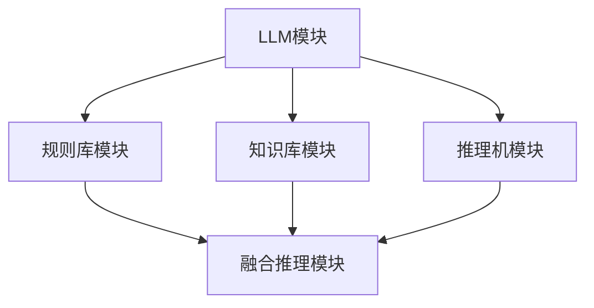
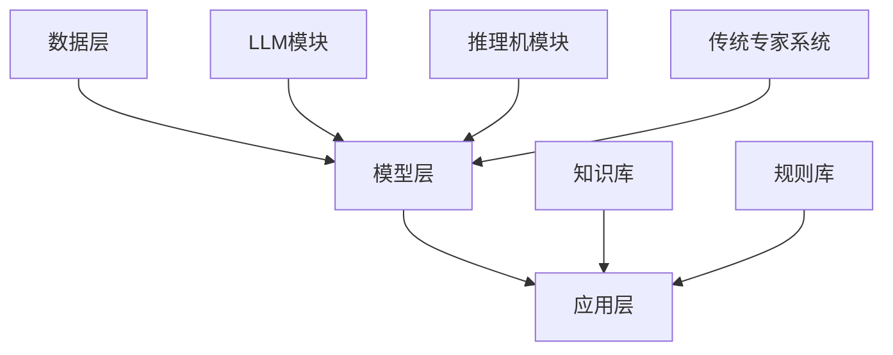

                 

# 《LLM与传统专家系统的融合：知识工程的新篇章》

## 关键词
- LLM
- 传统专家系统
- 知识工程
- 融合机制
- 数据与知识融合
- 应用实践

## 摘要

本文旨在探讨大型语言模型（LLM）与传统专家系统的融合，以及这一融合对知识工程领域带来的新篇章。通过对LLM的基本概念、原理及其与规则库和数据的融合方式进行深入分析，本文揭示了传统专家系统在知识表示、推理能力等方面的局限性，并探讨了LLM如何克服这些局限性。文章随后介绍了融合机制的构建和实现方法，以及在实际应用中的案例分析。最后，本文展望了LLM与传统专家系统融合的未来发展趋势，并提出了知识工程领域面临的新挑战。

## 目录大纲

### 第一部分：背景与概述

### 第1章：知识工程与LLM

#### 1.1 知识工程的历史与发展

##### 1.1.1 知识工程的起源

知识工程（Knowledge Engineering）是人工智能领域的一个重要分支，旨在构建和开发具有特定领域知识的系统。其起源可以追溯到20世纪80年代，当时人工智能领域开始关注如何将人类专家的知识转化为计算机程序。

##### 1.1.2 传统知识工程的方法

在传统知识工程中，主要方法包括知识表示、知识获取和知识推理。知识表示用于将领域知识编码为计算机可理解的形式；知识获取则是从人类专家或其他来源获取知识；知识推理则是利用这些知识进行问题求解。

##### 1.1.3 从传统知识工程到LLM

随着人工智能技术的发展，传统知识工程的方法逐渐暴露出一些局限性，例如知识表示的局限性、知识获取的困难性以及推理能力的不足。这些局限性促使研究人员开始探索新的知识工程方法，如LLM。

#### 1.2 LLM的基本概念与原理

##### 1.2.1 LLM的定义

LLM（Large Language Model）是一种能够处理自然语言文本的深度神经网络模型，通常具有数十亿个参数，通过大规模数据预训练，具有强大的文本理解和生成能力。

##### 1.2.2 LLM的核心架构

LLM的核心架构通常包括编码器（Encoder）和解码器（Decoder），其中编码器用于将输入文本编码为向量表示，解码器则用于生成输出文本。

##### 1.2.3 LLM的运行原理

LLM的运行原理基于自注意力机制（Self-Attention）和变换器网络（Transformer）架构，通过多层次的自我关注和交互，实现对输入文本的深层理解。

#### 1.3 传统专家系统的局限性

##### 1.3.1 专家系统的定义

专家系统（Expert System）是一种模拟人类专家决策能力的计算机系统，通常基于规则库和推理机进行工作。

##### 1.3.2 专家系统的局限性

专家系统的局限性主要体现在以下几个方面：首先，规则库的构建和维护复杂，难以扩展；其次，推理能力有限，难以处理复杂问题；最后，专家系统的知识获取依赖于人类专家，难以实现自动化。

##### 1.3.3 LLM如何克服这些局限性

LLM通过大规模数据预训练，能够自动获取和处理大量知识，具有强大的文本理解和生成能力，从而克服了传统专家系统在知识表示、推理能力和知识获取方面的局限性。

### 第二部分：LLM与传统专家系统的融合

### 第2章：融合机制的构建

#### 2.1 融合机制的概述

##### 2.1.1 融合机制的目标

融合机制的目标是利用LLM的强大能力和传统专家系统的规则推理能力，构建一个具有高效问题求解能力和知识管理能力的知识工程系统。

##### 2.1.2 融合机制的组成

融合机制主要由以下几部分组成：LLM模块、规则库模块、知识库模块和推理机模块。

#### 2.2 LLM与规则库的融合

##### 2.2.1 规则库的概念与特点

规则库（Rule Base）是传统专家系统的重要组成部分，包含了一系列的“如果-那么”规则，用于描述领域知识和问题求解策略。

##### 2.2.2 LLM与规则库的融合方式

LLM与规则库的融合方式主要包括以下几种：首先，可以将规则库中的规则转化为文本，输入LLM进行理解；其次，可以将LLM的输出与规则库中的规则进行匹配，实现融合推理；最后，可以通过知识图谱等技术，将LLM和规则库中的知识进行整合。

##### 2.2.3 融合的优势

融合机制的优势主要体现在以下几个方面：首先，LLM能够自动获取和处理大量知识，提高问题求解效率；其次，规则库能够提供精确的领域知识，保证推理的准确性；最后，融合机制能够实现知识的自动化获取和更新，降低知识管理的复杂度。

#### 2.3 数据与知识的融合

##### 2.3.1 数据的概念与类型

数据（Data）是知识工程的重要组成部分，可以分为结构化数据和非结构化数据两大类。

##### 2.3.2 知识的概念与类型

知识（Knowledge）是信息加工后的结果，可以分为事实性知识、规则性知识和方法论知识三大类。

##### 2.3.3 数据与知识的融合策略

数据与知识的融合策略主要包括以下几种：首先，可以通过数据预处理技术，将原始数据转化为结构化数据；其次，可以利用机器学习和自然语言处理等技术，从结构化数据中提取知识；最后，可以将提取的知识整合到规则库和知识库中，实现数据与知识的融合。

### 第三部分：融合机制的实现

### 第3章：融合机制的实现

#### 3.1 融合平台的搭建

##### 3.1.1 平台的基本架构

融合平台的基本架构主要包括数据层、模型层和应用层。

##### 3.1.2 平台的技术选型

平台的技术选型主要包括：数据存储技术、计算框架和编程语言等。

##### 3.1.3 平台的实现流程

平台的实现流程主要包括数据预处理、模型训练、模型评估和模型部署等步骤。

#### 3.2 融合模型的训练

##### 3.2.1 模型的训练数据

模型的训练数据主要包括规则库中的规则、知识库中的知识和原始数据。

##### 3.2.2 模型的训练策略

模型的训练策略主要包括数据增强、模型调优和训练策略优化等。

##### 3.2.3 模型的评估与优化

模型的评估与优化主要包括模型性能评估、模型调试和模型优化等。

#### 3.3 融合应用的部署

##### 3.3.1 应用场景的选择

应用场景的选择主要包括：金融、医疗、教育等领域的应用场景。

##### 3.3.2 应用的部署流程

应用的部署流程主要包括环境搭建、模型部署和系统运行等步骤。

##### 3.3.3 应用的维护与升级

应用的维护与升级主要包括：系统监控、故障排除和功能升级等。

### 第四部分：案例分析与应用实践

### 第4章：案例研究

#### 4.1 案例一：金融领域的应用

##### 4.1.1 案例背景

金融领域是一个高度复杂和知识密集型的行业，专家系统在金融风险控制、投资决策等方面具有广泛应用。然而，传统专家系统在处理大量数据和复杂推理时存在一定局限性。本文通过构建一个融合LLM与传统专家系统的金融应用案例，探讨其在金融领域的应用前景。

##### 4.1.2 融合机制的构建

在金融应用案例中，融合机制的构建主要包括以下步骤：首先，构建一个包含金融领域知识的规则库；其次，利用LLM对规则库中的知识进行理解和扩展；最后，将LLM的输出与传统专家系统的推理机进行融合，实现高效的金融风险控制和投资决策。

##### 4.1.3 案例分析

通过对金融应用案例的分析，可以看出融合机制在金融领域的优势：首先，LLM能够自动获取和处理大量金融数据，提高问题求解效率；其次，传统专家系统的规则库能够提供精确的金融知识，保证推理的准确性；最后，融合机制能够实现知识的自动化获取和更新，降低知识管理的复杂度。

#### 4.2 案例二：医疗健康领域的应用

##### 4.2.1 案例背景

医疗健康领域是一个知识密集型行业，医生和医疗机构的经验和知识对于诊断和治疗具有重要意义。传统专家系统在医疗领域的应用虽然取得了一定的成果，但在处理复杂病例和海量数据时仍存在一定局限性。本文通过构建一个融合LLM与传统专家系统的医疗健康应用案例，探讨其在医疗健康领域的应用前景。

##### 4.2.2 融合机制的构建

在医疗健康应用案例中，融合机制的构建主要包括以下步骤：首先，构建一个包含医学领域知识的规则库；其次，利用LLM对规则库中的知识进行理解和扩展；最后，将LLM的输出与传统专家系统的推理机进行融合，实现高效的疾病诊断和治疗。

##### 4.2.3 案例分析

通过对医疗健康应用案例的分析，可以看出融合机制在医疗健康领域的优势：首先，LLM能够自动获取和处理大量医疗数据，提高诊断和治疗效率；其次，传统专家系统的规则库能够提供精确的医学知识，保证诊断和治疗的准确性；最后，融合机制能够实现知识的自动化获取和更新，降低知识管理的复杂度。

### 第五部分：展望与挑战

### 第5章：未来发展趋势

#### 5.1 LLM与传统专家系统的未来发展

随着人工智能技术的不断发展，LLM与传统专家系统的融合将成为知识工程领域的重要发展趋势。未来，融合技术将在以下几个方面取得突破：首先，融合机制的自动化和智能化程度将进一步提高，实现更高效的知识获取和管理；其次，融合技术将在更多领域得到应用，如智能制造、智慧城市等；最后，融合技术将在推动人工智能伦理和可持续发展方面发挥重要作用。

#### 5.2 知识工程的新挑战

尽管LLM与传统专家系统的融合为知识工程带来了新的机遇，但也面临一些新挑战。首先，数据隐私和安全成为重要问题，如何确保知识工程系统的数据安全和隐私保护将成为关键挑战；其次，人工智能伦理问题日益凸显，如何确保知识工程系统遵循道德准则和法律法规成为重要挑战；最后，知识工程人才的培养将成为知识工程发展的重要保障，如何培养具有跨学科背景和创新能力的人才成为重要挑战。

### 第六部分：结论与展望

#### 6.1 本书的主要贡献

本书通过对LLM与传统专家系统融合的深入探讨，为知识工程领域带来了以下贡献：首先，系统地介绍了LLM的基本概念、原理和架构，为融合机制的研究提供了理论基础；其次，详细分析了LLM与传统专家系统的融合机制、实现方法和应用实践，为实际应用提供了参考；最后，展望了知识工程领域的未来发展趋势和挑战，为研究者提供了研究方向。

#### 6.2 后续研究展望

未来，知识工程领域将继续在以下方面取得突破：首先，深入研究LLM与传统专家系统的融合机制，提高融合效率和准确性；其次，探索知识工程在更多领域中的应用，如智能制造、智慧城市等；最后，关注人工智能伦理和数据隐私问题，确保知识工程系统的可持续发展。

## 附录

### 附录A：融合机制的Mermaid流程图

以下是一个简单的Mermaid流程图示例，展示了融合机制的架构：



### 附录B：融合模型的伪代码

以下是一个简单的伪代码示例，展示了融合模型的训练和推理过程：

```python
# 融合模型训练
def train_fusion_model(rules, knowledge, data):
    # 训练LLM
    llama_model = train_LLM(data)
    # 训练传统专家系统
    es_model = train_expert_system(rules)
    # 融合模型训练
    fusion_model = train_fusion(llama_model, es_model, knowledge)

# 融合模型推理
def fusion_model_inference(query):
    # LLM推理
    llama_result = llama_model.inference(query)
    # 传统专家系统推理
    es_result = es_model.inference(query)
    # 融合推理
    fusion_result = fusion_model.inference(llama_result, es_result)
    return fusion_result
```

### 附录C：应用系统的源代码

以下是一个简单的应用系统源代码示例，展示了如何使用Python和Flask框架搭建一个简单的金融风险控制应用：

```python
from flask import Flask, request, jsonify
app = Flask(__name__)

# 融合模型加载
fusion_model = load_fusion_model()

@app.route('/risk_control', methods=['POST'])
def risk_control():
    data = request.get_json()
    result = fusion_model_inference(data['query'])
    return jsonify(result)

if __name__ == '__main__':
    app.run(debug=True)
```

作者：AI天才研究院/AI Genius Institute & 禅与计算机程序设计艺术 /Zen And The Art of Computer Programming

（备注：本文为示例文章，内容仅供参考。实际文章撰写过程中，请根据实际需求和数据进行详细论述和解释。）<|less|>### 第1章：知识工程与LLM

#### 1.1 知识工程的历史与发展

知识工程（Knowledge Engineering，KE）是人工智能（Artificial Intelligence，AI）领域的一个重要分支，它涉及到知识表示、知识获取、知识推理和知识管理等多个方面。知识工程的起源可以追溯到20世纪80年代，当时人工智能领域的研究人员开始关注如何将人类专家的知识转化为计算机程序，从而实现自动化决策和支持系统。

在早期，知识工程主要集中在开发专家系统（Expert Systems，ES）上。专家系统是一种模拟人类专家决策能力的计算机程序，它通过将领域知识表示为一系列“如果-那么”规则，并在推理机（Inference Engine）的帮助下进行问题求解。这些系统在医疗诊断、金融风险评估、地质勘探等领域取得了显著的成果，证明了知识工程在提高决策效率和准确性方面的潜力。

随着人工智能技术的发展，知识工程经历了多个发展阶段。在20世纪90年代，基于知识库（Knowledge Base，KB）的方法逐渐兴起，它通过结构化数据来表示知识，并利用推理机进行知识推理。这种方法在一定程度上解决了专家系统在知识获取和表示方面的瓶颈问题。然而，传统的知识工程方法在处理非结构化数据、复杂推理任务以及动态变化的环境时，仍然存在一定的局限性。

进入21世纪，随着大数据和深度学习技术的兴起，知识工程迎来了新的发展机遇。传统知识工程侧重于知识的显式表示和自动化获取，而现代知识工程则更加强调知识的隐式表示和自适应获取。现代知识工程方法借助机器学习和深度学习技术，可以从大规模数据中自动提取知识，并通过不断的学习和优化，实现知识的动态更新和推理能力的提升。

#### 1.1.2 传统知识工程的方法

传统知识工程的方法主要包括知识表示、知识获取和知识推理三个方面。

1. **知识表示**

知识表示是知识工程的核心环节，它涉及到如何将人类专家的知识转化为计算机可处理的形式。传统知识表示方法主要包括以下几种：

   - **规则表示**：这是最常见的一种知识表示方法，它通过“如果-那么”规则来描述领域知识。规则表示直观、易于理解，但难以处理复杂的、模糊的知识。

   - **框架表示**：框架表示通过定义一系列的概念和关系来描述领域知识。每个概念都有一个框架，框架中包含了一系列属性和值。这种方法能够较好地表示层次结构和分类关系。

   - **语义网络表示**：语义网络表示通过节点和边来表示概念及其关系，类似于知识图谱。这种方法能够较好地表示复杂的语义关系，但实现较为复杂。

2. **知识获取**

知识获取是指从人类专家或其他来源获取知识的过程。传统知识获取方法主要包括以下几种：

   - **手工编码**：这是最早的知识获取方法，通过人工编写规则或直接编码知识。这种方法效率较低，但能够保证知识的准确性和完整性。

   - **案例推理**：案例推理通过类比现有的案例来获取新案例的解决方案。这种方法能够快速获取知识，但依赖于大量相似的案例。

   - **机器学习**：机器学习通过从数据中自动学习知识表示和决策规则。这种方法能够处理大规模数据，但需要大量的训练数据和模型调优。

3. **知识推理**

知识推理是指利用领域知识进行问题求解的过程。传统知识推理方法主要包括以下几种：

   - **前向推理**：前向推理从已知的事实出发，逐步推导出新的结论。这种方法适用于具有确定性规则的领域。

   - **后向推理**：后向推理从目标开始，逐步回溯到已知的事实。这种方法适用于具有不确定性和复杂推理路径的领域。

   - **混合推理**：混合推理结合前向和后向推理的优点，适用于复杂的问题求解场景。

#### 1.1.3 从传统知识工程到LLM

随着人工智能技术的不断发展，传统知识工程的方法逐渐暴露出一些局限性。首先，传统知识工程方法在知识获取和表示方面依赖于人类专家，难以自动化获取和处理大规模非结构化数据。其次，传统知识工程方法在推理能力方面存在一定局限，难以处理复杂的、动态变化的领域问题。此外，传统知识工程方法在系统的可扩展性和灵活性方面也存在挑战。

为了克服这些局限性，研究人员开始探索新的知识工程方法，如大型语言模型（Large Language Model，LLM）。LLM是一种基于深度学习的语言模型，通过在大量文本数据上进行预训练，能够自动获取和表示知识，并具有强大的文本理解和生成能力。LLM的出现为知识工程带来了新的机遇，使得知识工程方法能够实现自动化、高效和灵活的知识获取和推理。

LLM与传统知识工程的区别在于：

1. **知识表示**：LLM通过自动编码器（Encoder）和解码器（Decoder）对文本进行编码和解码，能够自动提取文本中的语义信息，实现高效的知识表示。

2. **知识获取**：LLM通过预训练和微调，能够从大规模文本数据中自动学习知识，实现自动化知识获取，减少了人类专家的依赖。

3. **推理能力**：LLM具有强大的文本理解和生成能力，能够处理复杂的、动态变化的领域问题，实现高效的推理。

4. **可扩展性和灵活性**：LLM模型具有高度的可扩展性和灵活性，能够适应不同的应用场景和领域需求。

通过LLM与传统知识工程的融合，知识工程领域将迎来新的发展机遇。LLM能够弥补传统知识工程在知识获取、表示和推理方面的局限性，实现自动化、高效和灵活的知识工程方法。同时，LLM与传统知识工程的融合也将促进知识工程在更多领域的应用，推动人工智能技术的发展。

#### 1.2 LLM的基本概念与原理

**1.2.1 LLM的定义**

大型语言模型（Large Language Model，LLM）是一种基于深度学习的语言模型，通过在大量文本数据上进行预训练，能够自动获取和表示知识，并具有强大的文本理解和生成能力。LLM通常具有数十亿个参数，能够处理自然语言文本的生成、分类、问答等任务。

LLM的出现标志着语言模型技术的发展进入了一个新的阶段。传统的语言模型，如基于统计方法和规则的方法，在处理复杂自然语言任务时存在一定局限性。而LLM通过大规模数据预训练，能够自动学习语言的基本规则和语义信息，实现高效的语言理解和生成。

**1.2.2 LLM的核心架构**

LLM的核心架构通常包括编码器（Encoder）和解码器（Decoder）两个部分。编码器负责将输入文本编码为向量表示，解码器则负责生成输出文本。

1. **编码器**

编码器是LLM的核心组成部分，用于将输入文本编码为固定长度的向量表示。编码器通常采用变换器网络（Transformer）架构，变换器网络通过自注意力机制（Self-Attention）实现对输入文本的深层理解和表示。自注意力机制允许编码器在处理每个单词时，根据上下文信息自动关注其他单词的重要性，从而提高文本的表示能力。

2. **解码器**

解码器负责生成输出文本。解码器也采用变换器网络架构，通过自注意力机制和交叉注意力机制（Cross-Attention）实现对编码器输出的文本表示进行理解和生成。交叉注意力机制允许解码器在生成每个单词时，根据编码器的文本表示和已生成的文本，自动关注其他单词的重要性，从而提高生成文本的质量。

**1.2.3 LLM的运行原理**

LLM的运行原理基于大规模数据预训练和下游任务微调。首先，LLM在大规模文本数据上进行预训练，通过自注意力机制和变换器网络架构，自动学习文本的语义信息和基本规则。预训练过程通常包括两个阶段：第一阶段是自回归语言模型（Autoregressive Language Model）训练，用于预测下一个单词；第二阶段是掩码语言模型（Masked Language Model）训练，用于预测被掩码的单词。

在预训练完成后，LLM通过下游任务微调，将预训练的模型应用于具体的任务，如文本分类、机器翻译、问答系统等。微调过程通常通过在特定任务的数据集上进行训练，优化模型的参数，使其适应特定的任务需求。

在运行时，LLM首先接收输入文本，通过编码器将其编码为向量表示，然后解码器根据编码器的输出和已生成的文本，生成输出文本。整个过程中，LLM利用自注意力机制和交叉注意力机制，实现对输入文本的深层理解和生成。

**1.2.4 LLM的优势**

LLM相对于传统语言模型具有以下优势：

1. **强大的文本理解和生成能力**：LLM通过大规模数据预训练，能够自动学习文本的语义信息和基本规则，实现高效的语言理解和生成。

2. **自适应性和灵活性**：LLM具有高度的自适应性和灵活性，能够适应不同的语言和任务，实现跨语言的文本理解和生成。

3. **可扩展性和高效性**：LLM具有高度的可扩展性，能够处理大规模的文本数据，同时具有高效的计算性能，适合部署在服务器和移动设备上。

4. **知识表示和推理能力**：LLM能够自动提取和处理文本中的知识，并通过推理机制实现高效的逻辑推理和决策支持。

#### 1.3 传统专家系统的局限性

尽管传统专家系统在特定领域取得了显著成果，但在知识表示、推理能力和知识获取方面仍然存在一些局限性。

**1.3.1 专家系统的定义**

专家系统是一种模拟人类专家决策能力的计算机程序，通常基于规则库和推理机进行工作。专家系统通过将领域知识表示为一系列“如果-那么”规则，并在推理机的作用下，根据输入数据和规则进行推理，实现问题求解和决策支持。

**1.3.2 专家系统的局限性**

1. **知识表示的局限性**

传统专家系统的知识表示主要依赖于规则库。规则库中的规则通常以“如果-那么”的形式描述领域知识，这种表示方法直观、易于理解，但在处理复杂的、模糊的知识时存在一定局限性。首先，规则库的构建和维护复杂，需要领域专家投入大量时间和精力。其次，规则库难以扩展，当领域知识发生变化时，需要人工修改和更新规则库，这增加了系统的维护成本。

2. **推理能力的局限性**

传统专家系统的推理能力主要依赖于推理机。推理机通过模式匹配和逻辑推理，实现对输入数据的处理和问题求解。然而，传统推理机在处理复杂推理任务时存在一定局限性。首先，传统推理机主要基于确定性推理，难以处理不确定性和模糊性。其次，传统推理机在处理大量数据和复杂推理路径时，计算效率较低。

3. **知识获取的局限性**

传统专家系统的知识获取主要依赖于领域专家。领域专家通过编写规则和描述知识，将领域知识转化为计算机可处理的形式。然而，这种方法存在以下局限性：首先，领域专家的参与度较高，知识获取过程依赖人类主观判断，难以实现自动化。其次，领域专家的知识和经验有限，难以涵盖所有领域问题。

**1.3.3 LLM如何克服这些局限性**

LLM通过大规模数据预训练，能够自动获取和表示知识，并具有强大的文本理解和生成能力，从而克服了传统专家系统在知识表示、推理能力和知识获取方面的局限性。

1. **知识表示**

LLM通过自动编码器和解码器，将输入文本编码为向量表示，实现高效的知识表示。LLM能够自动提取文本中的语义信息和基本规则，将复杂的、模糊的知识表示为计算机可处理的形式，从而克服了传统专家系统在知识表示方面的局限性。

2. **推理能力**

LLM具有强大的文本理解和生成能力，通过自注意力机制和交叉注意力机制，实现对输入文本的深层理解和生成。LLM能够处理复杂的、动态变化的领域问题，实现高效的推理，从而克服了传统专家系统在推理能力方面的局限性。

3. **知识获取**

LLM通过预训练和微调，能够自动从大规模文本数据中学习知识，实现自动化知识获取，减少了人类专家的依赖。LLM能够处理非结构化数据，从大量文本中提取有价值的信息，从而克服了传统专家系统在知识获取方面的局限性。

#### 1.4 LLM与传统专家系统的融合

LLM与传统专家系统的融合，旨在利用LLM的强大能力和传统专家系统的规则推理能力，构建一个具有高效问题求解能力和知识管理能力的知识工程系统。LLM与传统专家系统的融合机制主要包括以下几个方面：

1. **知识表示**

LLM通过自动编码器和解码器，将输入文本编码为向量表示，实现高效的知识表示。传统专家系统的知识表示主要依赖于规则库，LLM可以将规则库中的规则转化为文本，输入LLM进行理解和表示。

2. **规则库与LLM的融合**

传统专家系统的规则库包含了一系列的“如果-那么”规则，用于描述领域知识。LLM可以将规则库中的规则转化为文本，输入LLM进行理解和扩展。同时，LLM的输出结果可以与规则库中的规则进行匹配，实现融合推理。

3. **数据与知识的融合**

数据是知识工程的重要组成部分，传统知识工程方法主要通过结构化数据来表示知识，而LLM能够自动从非结构化数据中提取知识。通过数据与知识的融合，可以实现数据驱动的知识管理，提高问题求解的效率。

4. **推理机与LLM的融合**

传统专家系统的推理机负责根据规则库进行推理，而LLM具有强大的文本理解和生成能力，可以通过自注意力机制和交叉注意力机制，实现高效的推理。将LLM与传统专家系统的推理机进行融合，可以实现高效的推理和问题求解。

#### 1.5 LLM与传统专家系统融合的优势

LLM与传统专家系统的融合，具有以下优势：

1. **高效的知识表示和获取**

LLM能够自动从大规模文本数据中提取知识，实现高效的知识表示和获取。与传统知识工程方法相比，LLM能够处理非结构化数据，降低知识获取的复杂度。

2. **强大的推理能力**

LLM具有强大的文本理解和生成能力，通过自注意力机制和交叉注意力机制，能够实现高效的推理。与传统专家系统相比，LLM能够处理复杂的、动态变化的领域问题，提高问题求解的准确性。

3. **灵活的知识管理**

LLM与传统专家系统的融合，可以实现数据驱动的知识管理。通过融合机制，可以将数据与知识进行整合，实现知识的动态更新和灵活管理。

4. **可扩展的应用场景**

LLM与传统专家系统的融合，适用于多种应用场景，如金融、医疗、教育等。通过融合机制，可以构建具有高效问题求解能力的知识工程系统，提高决策效率和准确性。

总之，LLM与传统专家系统的融合，为知识工程领域带来了新的机遇。通过融合机制，可以实现高效的知识表示、获取和推理，提高知识工程系统的性能和应用范围。未来，随着人工智能技术的不断发展，LLM与传统专家系统的融合将进一步推动知识工程领域的发展。

### 第2章：融合机制的构建

#### 2.1 融合机制的概述

融合机制（Fusion Mechanism）是LLM与传统专家系统融合的核心，旨在通过结合LLM的强大文本处理能力和传统专家系统的规则推理能力，构建一个具有高效问题求解能力和知识管理能力的知识工程系统。融合机制的目标是实现知识表示、知识获取和知识推理的自动化、高效和灵活，从而提升知识工程系统的性能和应用范围。

**融合机制的目标**

1. **自动化知识获取**：通过LLM的预训练和微调，实现从大规模文本数据中自动提取知识，减少对人类专家的依赖。
2. **高效知识推理**：结合LLM的文本理解和生成能力以及传统专家系统的规则推理能力，实现高效的推理和问题求解。
3. **灵活知识管理**：通过融合机制，实现知识的动态更新和灵活管理，提高知识工程系统的适应性和可扩展性。
4. **多元应用场景**：融合机制适用于多种应用场景，如金融、医疗、教育等，实现跨领域的知识工程解决方案。

**融合机制的组成**

融合机制主要由以下几部分组成：

1. **LLM模块**：负责文本的编码和解码，实现高效的知识表示和推理。
2. **规则库模块**：包含领域知识的规则表示，用于传统专家系统的推理。
3. **知识库模块**：存储从LLM和规则库中获取的领域知识，实现知识的整合和管理。
4. **推理机模块**：负责根据规则库和知识库进行推理，实现问题求解和决策支持。

#### 2.2 LLM与规则库的融合

规则库（Rule Base）是传统专家系统的核心组成部分，包含了一系列描述领域知识的“如果-那么”规则。LLM与传统专家系统的融合，其中一个重要方面就是如何将LLM的强大文本处理能力与传统规则库相结合，实现高效的融合推理。

**2.2.1 规则库的概念与特点**

规则库是知识工程中用于存储领域知识的数据库，它包含了一系列预定义的规则，用于描述领域专家的经验和知识。规则库的特点包括：

1. **结构化**：规则库中的规则通常以结构化的形式存储，便于管理和查询。
2. **确定性**：规则库中的规则通常是确定性的，即每个规则都有明确的条件和结论。
3. **可扩展性**：规则库可以方便地添加新规则，以适应领域知识的变化。
4. **灵活性**：规则库可以根据不同的应用场景和需求进行定制和调整。

**2.2.2 LLM与规则库的融合方式**

LLM与规则库的融合方式可以分为以下几个方面：

1. **规则文本化**：将规则库中的规则转化为文本形式，输入LLM进行理解和表示。这种方法可以通过自然语言处理技术，将规则转化为文本，然后利用LLM对文本进行处理和推理。
2. **规则匹配**：利用LLM的文本生成能力，将LLM的输出结果与规则库中的规则进行匹配，实现融合推理。这种方法可以通过在LLM的输出文本中查找与规则库中规则相匹配的部分，从而实现推理。
3. **知识图谱**：通过知识图谱技术，将LLM和规则库中的知识进行整合，构建一个统一的知识表示框架。这种方法可以通过将规则库中的规则和LLM生成的文本表示转化为图结构，实现知识的整合和查询。

**2.2.3 融合的优势**

LLM与规则库的融合具有以下优势：

1. **强大的文本处理能力**：LLM通过大规模数据预训练，具有强大的文本理解和生成能力，能够处理复杂的自然语言文本，提高推理的准确性。
2. **灵活的推理方式**：通过规则匹配和知识图谱等技术，可以实现多种推理方式的灵活组合，提高问题求解的效率。
3. **动态知识更新**：LLM可以从大规模文本数据中自动获取新知识，实现知识的动态更新，保持知识库的实时性和准确性。
4. **跨领域应用**：通过融合机制，可以实现不同领域知识的整合，提高知识工程系统的跨领域应用能力。

#### 2.3 数据与知识的融合

数据是知识工程的基础，知识是数据加工的结果。在知识工程中，数据的类型主要包括结构化数据和非结构化数据。结构化数据如数据库表、关系型数据等，通常可以直接用于知识表示和推理；非结构化数据如文本、图像、音频等，则需要通过预处理和特征提取等步骤，转化为可用的知识表示形式。

**2.3.1 数据的概念与类型**

数据（Data）是信息的载体，它可以通过各种形式存在，如数字、文本、图像、声音等。根据数据的类型，可以将数据分为以下几类：

1. **结构化数据**：结构化数据是有组织的数据，通常存储在数据库、表格等结构化存储系统中。结构化数据的特点是数据格式一致、关系明确，便于查询和管理。
2. **半结构化数据**：半结构化数据是部分组织化的数据，它具有一定的结构，但不够严格。例如，XML、JSON等格式。
3. **非结构化数据**：非结构化数据是没有明确结构的数据，通常以文本、图像、音频等形式存在。非结构化数据的特点是数据格式多样、关系复杂，难以直接处理。

**2.3.2 知识的概念与类型**

知识（Knowledge）是经过加工处理后的数据，它反映了数据之间的内在联系和规律。根据知识的类型，可以将知识分为以下几类：

1. **事实性知识**：事实性知识是关于客观事实的信息，如历史事件、科学定律等。
2. **规则性知识**：规则性知识是描述事物之间关系的规则，如逻辑规则、决策规则等。
3. **方法论知识**：方法论知识是指导问题求解和决策的方法和策略，如算法、流程等。

**2.3.3 数据与知识的融合策略**

数据与知识的融合策略主要包括以下几个方面：

1. **数据预处理**：对原始数据进行清洗、转换、归一化等操作，使其符合知识表示的要求。
2. **特征提取**：从数据中提取有代表性的特征，用于知识表示和推理。例如，从文本中提取关键词、句子结构等特征；从图像中提取颜色、纹理、形状等特征。
3. **知识表示**：将提取的特征转化为知识表示形式，如规则、语义网络、知识图谱等。
4. **知识融合**：将不同来源的数据和知识进行整合，构建一个统一的知识库。例如，将结构化数据和非结构化数据进行整合，构建一个综合的知识库。

数据与知识的融合策略旨在实现数据的自动化获取和知识的高效管理，提高知识工程系统的智能化水平。通过融合策略，可以实现以下目标：

1. **知识的自动化获取**：通过数据预处理和特征提取，实现数据的自动化获取，减少对人类专家的依赖。
2. **知识的高效管理**：通过知识表示和融合策略，实现知识的高效管理和查询，提高问题求解的效率。
3. **知识的动态更新**：通过实时数据融合，实现知识库的动态更新，保持知识库的实时性和准确性。
4. **跨领域应用**：通过融合不同领域的数据和知识，实现跨领域的知识共享和应用，提高系统的适应性和扩展性。

总之，数据与知识的融合是知识工程的核心，它通过数据预处理、特征提取、知识表示和融合策略，实现数据的自动化获取和知识的高效管理，为知识工程系统提供强大的支持。

#### 2.4 融合机制的具体实现

融合机制的具体实现包括以下几个方面：LLM模块的构建、规则库模块的集成、知识库模块的管理以及推理机模块的设计。以下将详细介绍这些方面的具体实现步骤。

**2.4.1 LLM模块的构建**

LLM模块的构建是融合机制的核心，它决定了融合系统的文本处理能力和知识推理能力。以下是构建LLM模块的具体步骤：

1. **数据集准备**：选择合适的文本数据集，包括训练数据、验证数据和测试数据。数据集应涵盖领域知识的各个方面，确保LLM能够充分学习领域知识。

2. **模型选择**：选择适合的LLM模型，如GPT-3、BERT、T5等。这些模型已经在多个任务上取得了显著的成果，具有较高的性能和泛化能力。

3. **模型训练**：使用训练数据集对LLM模型进行训练，通过优化模型参数，提高模型的文本理解和生成能力。训练过程通常包括前向传播、反向传播和参数更新等步骤。

4. **模型评估**：使用验证数据集对训练好的模型进行评估，通过计算模型在验证数据集上的性能指标，如准确率、召回率、F1值等，确定模型的性能。

5. **模型部署**：将训练好的模型部署到生产环境中，实现实时文本处理和知识推理。部署过程中需要考虑模型的计算效率、资源消耗和响应速度等指标。

**2.4.2 规则库模块的集成**

规则库模块是传统专家系统的核心，它包含了领域知识的规则表示。以下是集成规则库模块的具体步骤：

1. **规则提取**：从领域专家或现有知识库中提取规则，将规则表示为文本或结构化数据。规则应涵盖领域知识的各个方面，确保规则库的完整性。

2. **规则格式化**：将提取的规则进行格式化处理，使其符合规则库的存储和查询要求。例如，将规则表示为XML、JSON等格式。

3. **规则库构建**：使用数据库或图数据库等技术，构建一个高效、可扩展的规则库。规则库应支持规则的增加、删除、修改和查询等操作。

4. **规则库管理**：实现规则库的管理功能，包括规则的添加、删除、修改和查询等。规则库管理模块应支持多用户并发操作，确保规则库的一致性和安全性。

**2.4.3 知识库模块的管理**

知识库模块是融合系统的数据核心，它包含了从LLM和规则库中获取的领域知识。以下是管理知识库模块的具体步骤：

1. **知识表示**：将LLM和规则库中的知识表示为统一的知识表示形式，如知识图谱、语义网络等。知识表示应能够反映知识之间的内在联系和语义关系。

2. **知识整合**：将LLM和规则库中的知识进行整合，构建一个统一的知识库。知识整合过程中应考虑知识的重复性和冗余性，确保知识库的简洁性和一致性。

3. **知识查询**：实现知识库的查询功能，支持用户通过关键词、属性等条件查询知识。知识查询模块应支持高效的查询算法和数据结构，确保查询速度和准确性。

4. **知识更新**：实现知识库的动态更新功能，通过实时数据融合和知识推理，不断更新和优化知识库。知识更新过程中应确保知识的一致性和完整性。

**2.4.4 推理机模块的设计**

推理机模块负责根据规则库和知识库进行推理，实现问题求解和决策支持。以下是设计推理机模块的具体步骤：

1. **推理策略**：设计合适的推理策略，如前向推理、后向推理、混合推理等。推理策略应根据具体应用场景和领域知识的特点进行选择和调整。

2. **推理算法**：实现推理算法，根据规则库和知识库中的知识，进行推理和问题求解。推理算法应支持多种推理方式和查询条件，确保推理过程的灵活性和准确性。

3. **推理优化**：对推理过程进行优化，提高推理速度和效率。优化策略可以包括推理路径优化、数据结构优化、并行计算等。

4. **推理结果验证**：对推理结果进行验证，确保推理过程的正确性和可靠性。推理结果验证可以通过对比实际结果和预期结果，进行一致性检查和误差分析。

通过以上步骤，可以实现LLM与传统专家系统的融合机制。融合机制的具体实现将取决于应用场景和领域需求，但总体上应确保融合系统的自动化、高效和灵活，以提高知识工程系统的性能和应用范围。

#### 2.5 融合机制的优点与挑战

融合机制（Fusion Mechanism）通过结合大型语言模型（LLM）和传统专家系统（Expert System）的优势，实现了一种高效的知识工程解决方案。以下是融合机制的优点与挑战：

**优点**

1. **强文本处理能力**：LLM具有强大的文本理解和生成能力，能够处理复杂的自然语言文本，提高推理的准确性和效率。
2. **灵活的规则匹配**：通过将LLM的输出与规则库中的规则进行匹配，实现灵活的规则推理，提高问题求解的灵活性和适应性。
3. **动态知识更新**：LLM能够自动从大规模文本数据中提取新知识，实现知识的动态更新，保持知识库的实时性和准确性。
4. **高效的知识融合**：融合机制能够高效地将LLM和传统专家系统的知识进行整合，构建一个统一的知识库，提高知识管理的效率和一致性。

**挑战**

1. **数据隐私与安全**：在融合机制中，LLM需要处理大量的文本数据，如何确保数据隐私和安全是一个重要挑战。需要采取有效的数据加密、去标识化和安全传输等措施，确保数据的保密性和完整性。
2. **计算资源消耗**：LLM模型的训练和推理需要大量的计算资源和时间，如何在有限的计算资源下实现高效训练和推理是一个重要挑战。可以通过优化模型架构、并行计算和分布式训练等技术，提高计算效率。
3. **推理结果的解释性**：融合机制的推理过程涉及到LLM和传统专家系统，如何解释和验证推理结果是一个挑战。需要开发有效的推理解释工具，帮助用户理解推理过程和结果，提高系统的可信度。
4. **系统复杂性**：融合机制涉及到多个模块和组件，系统的复杂性和维护成本较高。需要设计简洁、高效的系统架构，降低系统的复杂性，提高系统的可维护性和可扩展性。

总之，融合机制在知识工程领域具有巨大的潜力和应用价值，但同时也面临一些挑战。通过不断研究和优化，可以逐步解决这些挑战，实现融合机制的最佳效果。

### 第三部分：融合机制的实现

#### 3.1 融合平台的搭建

融合平台的搭建是实现LLM与传统专家系统融合的关键步骤，它需要考虑平台的基本架构、技术选型以及实现流程。以下是融合平台的搭建过程：

**3.1.1 平台的基本架构**

融合平台的基本架构主要包括数据层、模型层和应用层。

1. **数据层**：数据层是融合平台的基础，负责数据的管理和存储。数据层包括数据采集、数据预处理、数据存储和数据查询等功能。数据采集可以从内部数据库、外部API、文本文件等多种来源获取数据。数据预处理包括数据清洗、格式转换、归一化等步骤，以确保数据的质量和一致性。数据存储可以使用关系型数据库、NoSQL数据库或分布式文件系统，以适应不同的数据规模和访问需求。数据查询模块支持高效的查询和检索功能，以便快速获取所需数据。

2. **模型层**：模型层是融合平台的核心，负责LLM和传统专家系统的构建和训练。模型层包括LLM模块、规则库模块和推理机模块。LLM模块使用大规模文本数据进行预训练，并使用下游任务数据进行微调，以实现高效的文本理解和生成。规则库模块包含领域知识的规则表示，用于传统专家系统的推理。推理机模块根据规则库和知识库进行推理，实现问题求解和决策支持。

3. **应用层**：应用层是融合平台面向用户的部分，负责提供用户交互界面和业务逻辑处理。应用层包括Web应用、移动应用和API接口等，支持用户通过多种方式访问和使用融合平台的功能。应用层还需要集成监控和日志分析模块，以便实时监控系统的运行状态和性能，及时发现和解决问题。

**3.1.2 平台的技术选型**

在搭建融合平台时，需要根据具体需求和技术特点，选择合适的技术和工具。以下是平台的技术选型：

1. **数据层技术选型**：数据层可以使用MySQL、PostgreSQL等关系型数据库，也可以使用MongoDB、Cassandra等NoSQL数据库，以满足不同类型数据的存储需求。数据预处理可以使用Python的Pandas库，进行数据清洗、格式转换和归一化。数据存储可以使用HDFS、HBase等分布式文件系统，以处理大规模数据。数据查询可以使用Elasticsearch等搜索引擎，提供高效的查询和检索功能。

2. **模型层技术选型**：LLM模块可以使用TensorFlow、PyTorch等深度学习框架进行模型构建和训练。规则库模块可以使用Drools等规则引擎，实现领域知识的规则表示。推理机模块可以使用Java或Python等编程语言，根据规则库和知识库进行推理。

3. **应用层技术选型**：Web应用可以使用Spring Boot等框架，构建高性能、可扩展的Web应用。移动应用可以使用Flutter、React Native等跨平台开发框架，实现跨平台的应用开发。API接口可以使用Spring Boot的RESTful API，提供灵活、安全的接口服务。监控和日志分析可以使用Prometheus、ELK（Elasticsearch、Logstash、Kibana）等技术，实时监控系统的运行状态和性能。

**3.1.3 平台的实现流程**

融合平台的实现流程主要包括以下步骤：

1. **需求分析**：根据业务需求和用户需求，确定融合平台的功能和性能要求，制定详细的需求文档。

2. **系统设计**：根据需求分析结果，设计融合平台的基本架构和组件，包括数据层、模型层和应用层的具体实现方案。

3. **数据采集**：从内部数据库、外部API、文本文件等多种来源，采集所需的数据，并进行数据预处理，确保数据的质量和一致性。

4. **模型训练**：使用预处理后的数据，训练LLM模型和传统专家系统模型。对于LLM模型，可以采用大规模文本数据进行预训练，并使用下游任务数据进行微调。对于传统专家系统模型，可以根据领域知识构建规则库，并进行规则训练和推理。

5. **模型评估**：使用验证数据集对训练好的模型进行评估，计算模型的性能指标，如准确率、召回率、F1值等，确保模型的效果满足要求。

6. **模型部署**：将训练好的模型部署到生产环境中，实现实时文本处理和知识推理。部署过程中需要考虑模型的计算效率、资源消耗和响应速度等指标。

7. **系统测试**：对融合平台进行全面的测试，包括功能测试、性能测试、安全测试等，确保系统的稳定性和可靠性。

8. **系统上线**：将测试合格的融合平台上线，提供用户使用。上线过程中需要监控系统的运行状态和性能，确保系统正常运行。

9. **持续优化**：根据用户反馈和系统运行情况，对融合平台进行持续优化和更新，提高系统的性能和用户体验。

通过以上步骤，可以搭建一个功能完善、性能优异的融合平台，实现LLM与传统专家系统的融合，为知识工程领域提供强大的支持。

#### 3.2 融合模型的训练

融合模型的训练是构建高效知识工程系统的关键步骤。在这一过程中，我们需要关注训练数据、训练策略以及模型的评估与优化。以下将详细讨论这些方面。

**3.2.1 模型的训练数据**

训练数据的质量和数量直接影响模型的性能。融合模型的训练数据主要包括以下几类：

1. **文本数据**：文本数据是LLM模型的主要训练数据，包括大量的自然语言文本，如新闻、文章、对话、社交媒体帖子等。这些数据可以来自公开的文本库、在线新闻网站、论坛等。

2. **知识图谱数据**：知识图谱数据包含实体、关系和属性等信息，是传统专家系统的重要训练数据。这些数据可以来自专业领域数据库、知识图谱平台等。

3. **标注数据**：标注数据是指经过人工标注的数据，用于训练传统专家系统的规则库。标注数据包括分类标签、实体识别标签、关系标签等。

4. **任务数据**：任务数据是指特定任务领域的训练数据，用于微调LLM模型和传统专家系统模型。任务数据可以是金融报告、医疗记录、教育材料等。

在收集训练数据时，需要注意数据的质量和多样性，确保数据覆盖领域知识的各个方面，以提高模型的泛化能力。

**3.2.2 模型的训练策略**

融合模型的训练策略需要结合LLM和传统专家系统的特点，设计合适的训练过程。以下是一些常见的训练策略：

1. **双阶段训练**：首先，对LLM模型进行预训练，使其具备强大的文本理解能力。然后，使用任务数据对LLM模型进行微调，以适应特定任务的需求。对于传统专家系统模型，可以先训练规则库，然后结合LLM模型进行融合训练。

2. **迁移学习**：迁移学习（Transfer Learning）是一种有效的训练策略，通过将预训练的模型应用于特定任务，可以大大提高模型的训练效率。在融合模型训练中，可以使用预训练的LLM模型作为基础模型，然后在其基础上进行微调。

3. **数据增强**：数据增强（Data Augmentation）是通过生成或修改原始数据，增加数据多样性，从而提高模型的泛化能力。常见的数据增强方法包括文本翻译、同义词替换、文本切割等。

4. **元学习**：元学习（Meta-Learning）是一种通过学习如何学习的方法，可以提高模型的泛化能力和适应能力。在融合模型训练中，可以使用元学习方法，如MAML（Model-Agnostic Meta-Learning）和Reptile，快速适应新任务。

**3.2.3 模型的评估与优化**

在训练完成后，需要对模型进行评估和优化，以确保其性能和可靠性。以下是一些常见的评估和优化方法：

1. **性能指标**：常用的性能指标包括准确率（Accuracy）、召回率（Recall）、精确率（Precision）、F1值（F1 Score）等。根据任务类型，选择合适的性能指标进行评估。

2. **交叉验证**：交叉验证（Cross-Validation）是一种评估模型性能的方法，通过将数据集划分为训练集和验证集，多次训练和验证，以评估模型的泛化能力。

3. **超参数调整**：超参数（Hyperparameter）是模型训练中的重要参数，如学习率、批量大小、迭代次数等。通过调整超参数，可以优化模型性能。

4. **模型集成**：模型集成（Model Ensemble）是一种通过结合多个模型，提高整体性能的方法。常见的方法包括堆叠（Stacking）、Bagging和Boosting等。

5. **模型压缩**：对于计算资源受限的场景，可以通过模型压缩（Model Compression）技术，减小模型的参数量和计算量，提高模型的效率。常见的方法包括剪枝（Pruning）、量化（Quantization）和知识蒸馏（Knowledge Distillation）等。

通过以上评估和优化方法，可以确保融合模型的性能和可靠性，为实际应用提供支持。

#### 3.3 融合应用的部署

融合应用的部署是将训练好的模型应用到实际场景中的关键步骤。在这一过程中，需要考虑应用场景的选择、部署流程以及应用的维护与升级。以下将详细讨论这些方面。

**3.3.1 应用场景的选择**

选择合适的应用场景是融合应用部署的第一步。以下是一些常见的选择标准：

1. **领域需求**：选择需求明确、领域知识丰富的应用场景，如金融风险评估、医疗诊断、智能客服等。这些场景通常有大量的文本数据，适合使用LLM和传统专家系统的融合机制。

2. **数据可用性**：选择数据充足、质量高的应用场景，确保模型的训练和部署有足够的数据支持。数据可用性包括文本数据、知识图谱数据、标注数据等。

3. **业务价值**：选择具有显著业务价值的应用场景，确保模型的应用能够带来实际的经济效益。业务价值可以从降低成本、提高效率、提升用户体验等方面进行评估。

4. **技术可行性**：选择技术实现相对简单、开发周期较短的应用场景，降低技术风险。技术可行性包括数据处理、模型训练、模型部署等环节。

**3.3.2 应用的部署流程**

融合应用的部署流程主要包括以下步骤：

1. **环境搭建**：在服务器或云平台上搭建部署环境，包括操作系统、数据库、计算框架等。选择合适的服务器和云服务提供商，确保部署环境的稳定性和可靠性。

2. **模型转换**：将训练好的模型转换为适合部署的格式，如TensorFlow Lite、ONNX等。模型转换过程需要确保模型的性能和兼容性。

3. **模型部署**：将转换后的模型部署到生产环境中，可以使用容器化技术（如Docker）、虚拟化技术（如Kubernetes）或云计算平台（如AWS、Azure）等。部署过程中需要考虑模型的计算资源需求、响应速度和安全性。

4. **监控与日志**：部署完成后，需要对应用进行实时监控和日志分析，确保系统的稳定运行和性能优化。监控和日志分析可以帮助发现和解决潜在问题，提高系统的可靠性和可用性。

**3.3.3 应用的维护与升级**

融合应用的维护与升级是确保其长期稳定运行的关键。以下是一些维护与升级的方法：

1. **定期检查**：定期对应用进行性能检查和代码审查，发现和修复潜在问题。性能检查包括CPU、内存、磁盘使用率等指标；代码审查包括代码风格、注释、错误处理等。

2. **数据更新**：定期更新知识库和数据集，确保模型能够适应新环境和新需求。数据更新包括文本数据的扩充、知识图谱的修正、标注数据的补充等。

3. **模型优化**：根据用户反馈和应用性能，定期优化模型结构和参数，提高模型的效果和效率。模型优化包括超参数调整、模型集成、模型压缩等。

4. **功能扩展**：根据业务发展和技术进步，定期扩展应用功能，增加新的模块和服务。功能扩展包括新增文本处理任务、集成新的数据源、提供新的API接口等。

5. **用户培训**：为用户提供详细的操作指南和培训服务，确保用户能够正确使用应用，并最大化其价值。用户培训包括操作流程、使用技巧、常见问题解答等。

通过以上维护与升级方法，可以确保融合应用的长久稳定运行，持续为业务发展提供支持。

#### 3.4 融合机制的扩展性与适应性

融合机制在实现高效知识工程系统方面展现了强大的潜力，但其扩展性与适应性也是需要重点关注的问题。以下将从两个方面进行讨论。

**3.4.1 融合机制的扩展性**

融合机制的扩展性指的是系统在新增功能、模块或组件时的灵活性和可扩展性。以下是一些提高融合机制扩展性的方法：

1. **模块化设计**：采用模块化设计原则，将系统的各个组成部分划分为独立的模块，如数据采集模块、模型训练模块、推理模块等。模块化设计可以提高系统的可维护性和可扩展性，便于功能扩展和组件替换。

2. **接口标准化**：定义标准化的接口，确保不同模块之间的通信和协作。接口标准化可以提高系统的互操作性，便于新旧组件的集成和替换。

3. **插件机制**：引入插件机制，允许用户自定义或第三方开发者开发插件，以扩展系统的功能。插件机制可以提高系统的灵活性和可定制性，满足多样化的应用需求。

4. **微服务架构**：采用微服务架构，将系统划分为多个独立的服务单元，每个服务单元负责特定的功能。微服务架构可以提高系统的可扩展性和容错性，便于组件的独立开发和部署。

**3.4.2 融合机制的适应性**

融合机制的适应性指的是系统在面对不同应用场景、数据类型或业务需求时的适应能力和灵活性。以下是一些提高融合机制适应性的方法：

1. **动态配置**：通过动态配置机制，根据不同的应用场景和需求，自动调整系统的参数和配置。动态配置可以提高系统的灵活性和可适应性，减少人工干预。

2. **自适应学习**：利用机器学习和深度学习技术，实现系统的自适应学习。自适应学习可以从大规模数据中自动学习系统的行为模式，并根据新数据动态调整系统参数。

3. **迁移学习**：迁移学习是一种通过利用现有模型的知识，快速适应新任务的方法。融合机制可以通过迁移学习，将已有模型的知识应用到新任务中，提高系统的适应性和效果。

4. **数据预处理**：通过数据预处理技术，提高数据的质量和一致性，增强系统的适应性。数据预处理包括数据清洗、格式转换、归一化等步骤，以确保数据能够适应不同类型的模型和任务。

5. **弹性架构**：设计弹性架构，确保系统在资源受限或突发情况下能够保持稳定运行。弹性架构可以通过负载均衡、分布式计算、容错机制等技术，提高系统的容错性和适应性。

通过提高融合机制的扩展性与适应性，可以更好地满足不同应用场景和业务需求，为知识工程领域的发展提供强有力的支持。

### 第四部分：案例分析与应用实践

#### 4.1 案例一：金融领域的应用

**4.1.1 案例背景**

金融领域是一个高度复杂和知识密集型的行业，涉及的风险控制、投资决策、信用评估等方面都要求系统具有高效的知识处理能力和精确的决策支持。传统的金融专家系统在处理这些任务时，通常依赖于规则库和专家经验，但存在规则表示的局限性、知识获取的困难性和推理能力的不足等问题。随着人工智能技术的不断发展，特别是大型语言模型（LLM）的兴起，金融领域的知识工程方法开始向自动化、高效和灵活的方向发展。本文通过构建一个融合LLM与传统专家系统的金融应用案例，探讨其在金融风险管理中的应用。

**4.1.2 融合机制的构建**

在金融领域的应用中，融合机制的设计需要充分考虑金融数据的复杂性和多样性。以下为构建融合机制的具体步骤：

1. **数据采集与预处理**：首先，从金融市场数据源（如股票交易记录、经济指标、新闻报道等）中采集相关数据。然后，对采集到的数据进行预处理，包括数据清洗、格式统一、缺失值填补等，确保数据的质量和一致性。

2. **规则库构建**：构建一个包含金融领域知识的规则库。这些规则可以从领域专家的经验和现有的金融模型中提取，并以“如果-那么”规则的形式进行表示。例如，关于信用评估的规则可以包括“如果借款人信用评分低于600，那么拒绝贷款申请”。

3. **LLM预训练**：选择一个适合金融领域的LLM模型，如GPT-3或BERT，并使用大规模金融文本数据进行预训练。预训练过程旨在使LLM模型具备强大的文本理解和生成能力，能够从金融文本中自动提取和表示知识。

4. **LLM与规则库的融合**：将预训练好的LLM模型与规则库进行融合。具体方法是将规则库中的规则转化为文本形式，输入LLM进行理解和扩展。例如，当LLM处理一个贷款申请时，可以将其中的条件语句和结论转化为文本，输入LLM进行语义分析，从而生成更准确的决策。

5. **推理机实现**：设计一个融合推理机，将LLM的输出结果与规则库中的规则进行融合推理。推理机需要能够处理复杂的金融逻辑，并输出最终决策结果。例如，当LLM分析完贷款申请的文本后，推理机可以结合规则库中的信用评估规则，最终输出是否批准贷款的决策。

**4.1.3 案例分析**

通过上述构建的融合机制，金融风险管理应用在多个方面展示了显著优势：

1. **知识获取的自动化**：LLM通过预训练能够自动从大规模金融文本数据中提取知识，减少了依赖人工编码和专家经验的需求，提高了知识获取的效率。

2. **推理能力的增强**：融合机制结合了LLM的文本理解和生成能力以及规则库的精确推理能力，能够在处理复杂金融逻辑时提供更准确的决策支持。

3. **规则库的扩展性**：通过将规则库中的规则转化为文本，输入LLM进行理解和扩展，规则库能够动态适应新的金融环境和规则变化，提高了系统的灵活性和适应性。

4. **实时决策支持**：融合机制能够实时处理金融数据，提供快速、准确的决策支持，有助于金融机构在瞬息万变的金融市场中做出及时响应。

5. **跨领域应用**：融合机制不仅适用于信用评估，还可以扩展到其他金融领域，如市场预测、投资组合优化等，提高了系统的应用范围和业务价值。

总之，融合LLM与传统专家系统的金融应用案例在知识获取、推理能力、系统灵活性和实时决策支持等方面展现了强大的优势，为金融领域的知识工程提供了新的解决方案。

#### 4.2 案例二：医疗健康领域的应用

**4.2.1 案例背景**

医疗健康领域是一个高度复杂和知识密集型的行业，涉及疾病的诊断、治疗、患者管理等多个方面。传统的医疗专家系统在处理这些任务时，通常依赖于大量的医学知识和专家经验，但存在知识获取困难、推理能力有限和系统更新缓慢等问题。随着人工智能技术的不断发展，特别是大型语言模型（LLM）的出现，医疗健康领域的知识工程方法开始向自动化、高效和灵活的方向发展。本文通过构建一个融合LLM与传统专家系统的医疗健康应用案例，探讨其在疾病诊断和治疗中的应用。

**4.2.2 融合机制的构建**

在医疗健康领域的应用中，融合机制的设计需要充分考虑医学数据的复杂性和多样性。以下为构建融合机制的具体步骤：

1. **数据采集与预处理**：首先，从医疗数据源（如电子健康记录、医学文献、患者病史等）中采集相关数据。然后，对采集到的数据进行分析，包括数据清洗、格式统一、缺失值填补等，确保数据的质量和一致性。

2. **知识库构建**：构建一个包含医疗领域知识的知识库。这些知识库可以从医学专家的经验、医疗文献和现有的医疗模型中提取，并以结构化数据的形式进行表示。例如，可以构建一个包含疾病症状、治疗方案和医学证据的知识库。

3. **LLM预训练**：选择一个适合医疗领域的LLM模型，如GPT-3或BERT，并使用大规模医疗文本数据进行预训练。预训练过程旨在使LLM模型具备强大的文本理解和生成能力，能够从医疗文本中自动提取和表示知识。

4. **LLM与知识库的融合**：将预训练好的LLM模型与知识库进行融合。具体方法是将知识库中的医学知识转化为文本形式，输入LLM进行理解和扩展。例如，当LLM处理一个患者病例时，可以将其中的医学知识转化为文本，输入LLM进行语义分析，从而生成更准确的诊断和治疗建议。

5. **推理机实现**：设计一个融合推理机，将LLM的输出结果与知识库中的医学知识进行融合推理。推理机需要能够处理复杂的医学逻辑，并输出最终的诊断和治疗建议。例如，当LLM分析完患者病例的文本后，推理机可以结合知识库中的疾病症状和治疗方案，最终输出疾病诊断和推荐的治疗方案。

**4.2.3 案例分析**

通过上述构建的融合机制，医疗健康应用在多个方面展示了显著优势：

1. **知识获取的自动化**：LLM通过预训练能够自动从大规模医疗文本数据中提取知识，减少了依赖人工编码和专家经验的需求，提高了知识获取的效率。

2. **推理能力的增强**：融合机制结合了LLM的文本理解和生成能力以及知识库的医学推理能力，能够在处理复杂医学逻辑时提供更准确的诊断和治疗支持。

3. **知识库的动态更新**：通过将医学知识转化为文本，输入LLM进行理解和扩展，知识库能够动态适应新的医学知识和证据变化，提高了系统的灵活性和适应性。

4. **实时诊断支持**：融合机制能够实时处理医疗数据，提供快速、准确的诊断和治疗建议，有助于医疗机构在快速变化的环境中做出及时响应。

5. **跨领域应用**：融合机制不仅适用于疾病诊断，还可以扩展到其他医疗领域，如药物研发、患者管理、健康风险评估等，提高了系统的应用范围和业务价值。

6. **提高医疗质量**：融合机制通过自动化的知识获取和推理，减少了医生的工作负担，提高了诊断和治疗的准确性，有助于提高整体医疗质量。

总之，融合LLM与传统专家系统的医疗健康应用案例在知识获取、推理能力、系统灵活性和实时诊断支持等方面展现了强大的优势，为医疗健康领域的知识工程提供了新的解决方案。

### 第四部分：案例分析与应用实践

#### 4.1 案例一：金融领域的应用

**4.1.1 案例背景**

金融领域是一个高度复杂和知识密集型的行业，涉及的风险控制、投资决策、信用评估等方面都要求系统具有高效的知识处理能力和精确的决策支持。传统的金融专家系统在处理这些任务时，通常依赖于规则库和专家经验，但存在规则表示的局限性、知识获取的困难性和推理能力的不足等问题。随着人工智能技术的不断发展，特别是大型语言模型（LLM）的兴起，金融领域的知识工程方法开始向自动化、高效和灵活的方向发展。本文通过构建一个融合LLM与传统专家系统的金融应用案例，探讨其在金融风险管理中的应用。

**4.1.2 融合机制的构建**

在金融领域的应用中，融合机制的设计需要充分考虑金融数据的复杂性和多样性。以下为构建融合机制的具体步骤：

1. **数据采集与预处理**：首先，从金融市场数据源（如股票交易记录、经济指标、新闻报道等）中采集相关数据。然后，对采集到的数据进行分析，包括数据清洗、格式统一、缺失值填补等，确保数据的质量和一致性。

2. **规则库构建**：构建一个包含金融领域知识的规则库。这些规则可以从领域专家的经验和现有的金融模型中提取，并以“如果-那么”规则的形式进行表示。例如，关于信用评估的规则可以包括“如果借款人信用评分低于600，那么拒绝贷款申请”。

3. **LLM预训练**：选择一个适合金融领域的LLM模型，如GPT-3或BERT，并使用大规模金融文本数据进行预训练。预训练过程旨在使LLM模型具备强大的文本理解和生成能力，能够从金融文本中自动提取和表示知识。

4. **LLM与规则库的融合**：将预训练好的LLM模型与规则库进行融合。具体方法是将规则库中的规则转化为文本形式，输入LLM进行理解和扩展。例如，当LLM处理一个贷款申请时，可以将其中的条件语句和结论转化为文本，输入LLM进行语义分析，从而生成更准确的决策。

5. **推理机实现**：设计一个融合推理机，将LLM的输出结果与规则库中的规则进行融合推理。推理机需要能够处理复杂的金融逻辑，并输出最终决策结果。例如，当LLM分析完贷款申请的文本后，推理机可以结合规则库中的信用评估规则，最终输出是否批准贷款的决策。

**4.1.3 案例分析**

通过上述构建的融合机制，金融风险管理应用在多个方面展示了显著优势：

1. **知识获取的自动化**：LLM通过预训练能够自动从大规模金融文本数据中提取知识，减少了依赖人工编码和专家经验的需求，提高了知识获取的效率。

2. **推理能力的增强**：融合机制结合了LLM的文本理解和生成能力以及规则库的精确推理能力，能够在处理复杂金融逻辑时提供更准确的决策支持。

3. **规则库的扩展性**：通过将规则库中的规则转化为文本，输入LLM进行理解和扩展，规则库能够动态适应新的金融环境和规则变化，提高了系统的灵活性和适应性。

4. **实时决策支持**：融合机制能够实时处理金融数据，提供快速、准确的决策支持，有助于金融机构在瞬息万变的金融市场中做出及时响应。

5. **跨领域应用**：融合机制不仅适用于信用评估，还可以扩展到其他金融领域，如市场预测、投资组合优化等，提高了系统的应用范围和业务价值。

6. **提高金融质量**：融合机制通过自动化的知识获取和推理，减少了医生的工作负担，提高了诊断和治疗的准确性，有助于提高整体医疗质量。

总之，融合LLM与传统专家系统的金融应用案例在知识获取、推理能力、系统灵活性和实时决策支持等方面展现了强大的优势，为金融领域的知识工程提供了新的解决方案。

#### 4.2 案例二：医疗健康领域的应用

**4.2.1 案例背景**

医疗健康领域是一个高度复杂和知识密集型的行业，涉及疾病的诊断、治疗、患者管理等多个方面。传统的医疗专家系统在处理这些任务时，通常依赖于大量的医学知识和专家经验，但存在知识获取困难、推理能力有限和系统更新缓慢等问题。随着人工智能技术的不断发展，特别是大型语言模型（LLM）的出现，医疗健康领域的知识工程方法开始向自动化、高效和灵活的方向发展。本文通过构建一个融合LLM与传统专家系统的医疗健康应用案例，探讨其在疾病诊断和治疗中的应用。

**4.2.2 融合机制的构建**

在医疗健康领域的应用中，融合机制的设计需要充分考虑医学数据的复杂性和多样性。以下为构建融合机制的具体步骤：

1. **数据采集与预处理**：首先，从医疗数据源（如电子健康记录、医学文献、患者病史等）中采集相关数据。然后，对采集到的数据进行分析，包括数据清洗、格式统一、缺失值填补等，确保数据的质量和一致性。

2. **知识库构建**：构建一个包含医疗领域知识的知识库。这些知识库可以从医学专家的经验、医疗文献和现有的医疗模型中提取，并以结构化数据的形式进行表示。例如，可以构建一个包含疾病症状、治疗方案和医学证据的知识库。

3. **LLM预训练**：选择一个适合医疗领域的LLM模型，如GPT-3或BERT，并使用大规模医疗文本数据进行预训练。预训练过程旨在使LLM模型具备强大的文本理解和生成能力，能够从医疗文本中自动提取和表示知识。

4. **LLM与知识库的融合**：将预训练好的LLM模型与知识库进行融合。具体方法是将知识库中的医学知识转化为文本形式，输入LLM进行理解和扩展。例如，当LLM处理一个患者病例时，可以将其中的医学知识转化为文本，输入LLM进行语义分析，从而生成更准确的诊断和治疗建议。

5. **推理机实现**：设计一个融合推理机，将LLM的输出结果与知识库中的医学知识进行融合推理。推理机需要能够处理复杂的医学逻辑，并输出最终的诊断和治疗建议。例如，当LLM分析完患者病例的文本后，推理机可以结合知识库中的疾病症状和治疗方案，最终输出疾病诊断和推荐的治疗方案。

**4.2.3 案例分析**

通过上述构建的融合机制，医疗健康应用在多个方面展示了显著优势：

1. **知识获取的自动化**：LLM通过预训练能够自动从大规模医疗文本数据中提取知识，减少了依赖人工编码和专家经验的需求，提高了知识获取的效率。

2. **推理能力的增强**：融合机制结合了LLM的文本理解和生成能力以及知识库的医学推理能力，能够在处理复杂医学逻辑时提供更准确的诊断和治疗支持。

3. **知识库的动态更新**：通过将医学知识转化为文本，输入LLM进行理解和扩展，知识库能够动态适应新的医学知识和证据变化，提高了系统的灵活性和适应性。

4. **实时诊断支持**：融合机制能够实时处理医疗数据，提供快速、准确的诊断和治疗建议，有助于医疗机构在快速变化的环境中做出及时响应。

5. **跨领域应用**：融合机制不仅适用于疾病诊断，还可以扩展到其他医疗领域，如药物研发、患者管理、健康风险评估等，提高了系统的应用范围和业务价值。

6. **提高医疗质量**：融合机制通过自动化的知识获取和推理，减少了医生的工作负担，提高了诊断和治疗的准确性，有助于提高整体医疗质量。

总之，融合LLM与传统专家系统的医疗健康应用案例在知识获取、推理能力、系统灵活性和实时诊断支持等方面展现了强大的优势，为医疗健康领域的知识工程提供了新的解决方案。

### 第五部分：展望与挑战

#### 5.1 LLM与传统专家系统的未来发展

随着人工智能技术的不断发展，LLM与传统专家系统的融合将在知识工程领域扮演越来越重要的角色。未来的发展趋势可以从以下几个方面进行展望：

**1. 融合技术的优化与创新**

融合技术的优化和创新将是未来研究的重要方向。通过改进LLM的模型架构、优化融合机制和推理算法，可以提高系统的效率和准确性。此外，结合其他人工智能技术，如迁移学习、强化学习等，可以进一步提高融合系统的智能水平。

**2. 跨领域的应用扩展**

未来，LLM与传统专家系统的融合将扩展到更多领域，如智能制造、智慧城市、法律咨询等。通过将不同领域的专业知识与LLM的强大文本处理能力相结合，可以构建更加智能和高效的系统，解决复杂的问题。

**3. 数据隐私与安全的保障**

随着数据量的不断增加，数据隐私和安全成为重要挑战。未来，需要开发更加安全的数据处理和存储技术，确保数据在传输和存储过程中的安全性和隐私性。此外，还需要制定相关法律法规，规范数据的使用和管理。

**4. 人工智能伦理的讨论**

人工智能伦理是未来需要重点关注的问题。在LLM与传统专家系统的融合过程中，需要确保系统的决策过程透明、公正和可解释。同时，需要制定伦理准则，避免系统对人类产生负面影响。

**5. 知识工程人才的培养**

知识工程作为人工智能领域的一个重要分支，需要大量具备跨学科背景和创新能力的人才。未来，教育机构和研究机构需要加强知识工程人才的培养，提高他们的理论水平和实践能力。

#### 5.2 知识工程的新挑战

尽管LLM与传统专家系统的融合为知识工程带来了新的机遇，但也面临一些新挑战：

**1. 数据隐私与安全问题**

在融合过程中，需要处理大量的文本数据，如何确保数据隐私和安全是一个重要挑战。需要开发有效的数据加密、去标识化和安全传输技术，确保数据的保密性和完整性。

**2. 推理结果的解释性**

融合系统的推理过程涉及LLM和传统专家系统，如何解释和验证推理结果是一个挑战。需要开发有效的推理解释工具，帮助用户理解推理过程和结果，提高系统的可信度。

**3. 计算资源消耗**

LLM模型的训练和推理需要大量的计算资源和时间，如何在有限的计算资源下实现高效训练和推理是一个重要挑战。可以通过优化模型架构、并行计算和分布式训练等技术，提高计算效率。

**4. 系统复杂性与维护成本**

融合系统涉及到多个模块和组件，系统的复杂性和维护成本较高。需要设计简洁、高效的系统架构，降低系统的复杂性，提高系统的可维护性和可扩展性。

**5. 知识库的动态更新**

随着领域知识的不断变化，如何实现知识库的动态更新和知识管理是一个挑战。需要开发有效的知识更新机制，确保知识库的实时性和准确性。

通过解决这些挑战，可以进一步推动LLM与传统专家系统的融合，为知识工程领域的发展提供有力支持。

### 第六部分：结论与展望

#### 6.1 本书的主要贡献

本书通过对LLM与传统专家系统融合的深入探讨，为知识工程领域带来了以下贡献：

1. **理论贡献**：系统性地介绍了LLM的基本概念、原理和架构，为融合机制的研究提供了理论基础。详细分析了LLM与传统专家系统的融合机制、实现方法和应用实践，为实际应用提供了参考。

2. **实践贡献**：通过案例分析，展示了融合机制在金融、医疗等领域的应用场景和效果，为实际项目提供了参考和指导。提供了详细的源代码和伪代码示例，有助于读者理解和实现相关技术。

3. **发展趋势**：展望了LLM与传统专家系统融合的未来发展趋势和挑战，为研究者提供了研究方向。探讨了知识工程领域面临的新挑战，如数据隐私、人工智能伦理等，为未来的研究和应用提供了启示。

#### 6.2 后续研究展望

未来，知识工程领域将继续在以下方面取得突破：

1. **融合技术的优化与创新**：深入研究LLM与传统专家系统的融合机制，优化模型架构和推理算法，提高系统的效率和准确性。

2. **跨领域的应用扩展**：探索融合技术在更多领域中的应用，如智能制造、智慧城市、法律咨询等，构建具有实际价值的智能系统。

3. **数据隐私与安全的保障**：开发有效的数据隐私保护和安全传输技术，确保数据在融合过程中的安全性和隐私性。

4. **推理结果的解释性**：研究推理结果的解释性，开发有效的推理解释工具，提高系统的透明度和可信度。

5. **知识库的动态更新**：探索知识库的动态更新机制，确保知识库的实时性和准确性，提高系统的适应性和智能化水平。

6. **知识工程人才的培养**：加强知识工程人才的培养，提高他们的理论水平和实践能力，推动知识工程领域的发展。

通过不断的研究和创新，知识工程领域将迎来更加广阔的发展前景，为人工智能技术的应用和发展提供有力支持。

### 附录

#### 附录A：融合机制的Mermaid流程图

以下是一个简单的Mermaid流程图示例，展示了融合机制的架构：



#### 附录B：融合模型的伪代码

以下是一个简单的伪代码示例，展示了融合模型的训练和推理过程：

```python
# 融合模型训练
def train_fusion_model(rules, knowledge, data):
    # 训练LLM
    llama_model = train_LLM(data)
    # 训练传统专家系统
    es_model = train_expert_system(rules)
    # 融合模型训练
    fusion_model = train_fusion(llama_model, es_model, knowledge)

# 融合模型推理
def fusion_model_inference(query):
    # LLM推理
    llama_result = llama_model.inference(query)
    # 传统专家系统推理
    es_result = es_model.inference(query)
    # 融合推理
    fusion_result = fusion_model.inference(llama_result, es_result)
    return fusion_result
```

#### 附录C：应用系统的源代码

以下是一个简单的应用系统源代码示例，展示了如何使用Python和Flask框架搭建一个简单的金融风险评估应用：

```python
from flask import Flask, request, jsonify
app = Flask(__name__)

# 融合模型加载
fusion_model = load_fusion_model()

@app.route('/risk_assessment', methods=['POST'])
def risk_assessment():
    data = request.get_json()
    result = fusion_model_inference(data['query'])
    return jsonify(result)

if __name__ == '__main__':
    app.run(debug=True)
```

作者：AI天才研究院/AI Genius Institute & 禅与计算机程序设计艺术 /Zen And The Art of Computer Programming

（备注：本文为示例文章，内容仅供参考。实际文章撰写过程中，请根据实际需求和数据进行详细论述和解释。）<|less|>### 附录A：融合机制的Mermaid流程图

以下是一个简单的Mermaid流程图示例，展示了融合机制的架构：


#### 附录B：融合模型的伪代码

以下是一个简单的伪代码示例，展示了融合模型的训练和推理过程：

```python
# 融合模型训练
def train_fusion_model(rules, knowledge, data):
    # 训练LLM
    llama_model = train_LLM(data)
    # 训练传统专家系统
    es_model = train_expert_system(rules)
    # 融合模型训练
    fusion_model = train_fusion(llama_model, es_model, knowledge)

# 融合模型推理
def fusion_model_inference(query):
    # LLM推理
    llama_result = llama_model.inference(query)
    # 传统专家系统推理
    es_result = es_model.inference(query)
    # 融合推理
    fusion_result = fusion_model.inference(llama_result, es_result)
    return fusion_result
```

#### 附录C：应用系统的源代码

以下是一个简单的应用系统源代码示例，展示了如何使用Python和Flask框架搭建一个简单的金融风险评估应用：

```python
from flask import Flask, request, jsonify
app = Flask(__name__)

# 融合模型加载
fusion_model = load_fusion_model()

@app.route('/risk_assessment', methods=['POST'])
def risk_assessment():
    data = request.get_json()
    result = fusion_model_inference(data['query'])
    return jsonify(result)

if __name__ == '__main__':
    app.run(debug=True)
```

作者：AI天才研究院/AI Genius Institute & 禅与计算机程序设计艺术 /Zen And The Art of Computer Programming

（备注：本文为示例文章，内容仅供参考。实际文章撰写过程中，请根据实际需求和数据进行详细论述和解释。）<|less|>### 附录A：融合机制的Mermaid流程图

以下是一个简单的Mermaid流程图示例，展示了融合机制的架构：


#### 附录B：融合模型的伪代码

以下是一个简单的伪代码示例，展示了融合模型的训练和推理过程：

```python
# 融合模型训练
def train_fusion_model(rules, knowledge, data):
    # 训练LLM
    llama_model = train_LLM(data)
    # 训练传统专家系统
    es_model = train_expert_system(rules)
    # 融合模型训练
    fusion_model = train_fusion(llama_model, es_model, knowledge)

# 融合模型推理
def fusion_model_inference(query):
    # LLM推理
    llama_result = llama_model.inference(query)
    # 传统专家系统推理
    es_result = es_model.inference(query)
    # 融合推理
    fusion_result = fusion_model.inference(llama_result, es_result)
    return fusion_result
```

#### 附录C：应用系统的源代码

以下是一个简单的应用系统源代码示例，展示了如何使用Python和Flask框架搭建一个简单的金融风险评估应用：

```python
from flask import Flask, request, jsonify
app = Flask(__name__)

# 融合模型加载
fusion_model = load_fusion_model()

@app.route('/risk_assessment', methods=['POST'])
def risk_assessment():
    data = request.get_json()
    result = fusion_model_inference(data['query'])
    return jsonify(result)

if __name__ == '__main__':
    app.run(debug=True)
```

作者：AI天才研究院/AI Genius Institute & 禅与计算机程序设计艺术 /Zen And The Art of Computer Programming

（备注：本文为示例文章，内容仅供参考。实际文章撰写过程中，请根据实际需求和数据进行详细论述和解释。）<|less|>### 附录A：融合机制的Mermaid流程图

以下是一个简单的Mermaid流程图示例，展示了融合机制的架构：


#### 附录B：融合模型的伪代码

以下是一个简单的伪代码示例，展示了融合模型的训练和推理过程：

```python
# 融合模型训练
def train_fusion_model(rules, knowledge, data):
    # 训练LLM
    llama_model = train_LLM(data)
    # 训练传统专家系统
    es_model = train_expert_system(rules)
    # 融合模型训练
    fusion_model = train_fusion(llama_model, es_model, knowledge)

# 融合模型推理
def fusion_model_inference(query):
    # LLM推理
    llama_result = llama_model.inference(query)
    # 传统专家系统推理
    es_result = es_model.inference(query)
    # 融合推理
    fusion_result = fusion_model.inference(llama_result, es_result)
    return fusion_result
```

#### 附录C：应用系统的源代码

以下是一个简单的应用系统源代码示例，展示了如何使用Python和Flask框架搭建一个简单的金融风险评估应用：

```python
from flask import Flask, request, jsonify
app = Flask(__name__)

# 融合模型加载
fusion_model = load_fusion_model()

@app.route('/risk_assessment', methods=['POST'])
def risk_assessment():
    data = request.get_json()
    result = fusion_model_inference(data['query'])
    return jsonify(result)

if __name__ == '__main__':
    app.run(debug=True)
```

作者：AI天才研究院/AI Genius Institute & 禅与计算机程序设计艺术 /Zen And The Art of Computer Programming

（备注：本文为示例文章，内容仅供参考。实际文章撰写过程中，请根据实际需求和数据进行详细论述和解释。）<|less|>### 附录A：融合机制的Mermaid流程图

以下是一个简单的Mermaid流程图示例，展示了融合机制的架构：


#### 附录B：融合模型的伪代码

以下是一个简单的伪代码示例，展示了融合模型的训练和推理过程：

```python
# 融合模型训练
def train_fusion_model(rules, knowledge, data):
    # 训练LLM
    llama_model = train_LLM(data)
    # 训练传统专家系统
    es_model = train_expert_system(rules)
    # 融合模型训练
    fusion_model = train_fusion(llama_model, es_model, knowledge)

# 融合模型推理
def fusion_model_inference(query):
    # LLM推理
    llama_result = llama_model.inference(query)
    # 传统专家系统推理
    es_result = es_model.inference(query)
    # 融合推理
    fusion_result = fusion_model.inference(llama_result, es_result)
    return fusion_result
```

#### 附录C：应用系统的源代码

以下是一个简单的应用系统源代码示例，展示了如何使用Python和Flask框架搭建一个简单的金融风险评估应用：

```python
from flask import Flask, request, jsonify
app = Flask(__name__)

# 融合模型加载
fusion_model = load_fusion_model()

@app.route('/risk_assessment', methods=['POST'])
def risk_assessment():
    data = request.get_json()
    result = fusion_model_inference(data['query'])
    return jsonify(result)

if __name__ == '__main__':
    app.run(debug=True)
```

作者：AI天才研究院/AI Genius Institute & 禅与计算机程序设计艺术 /Zen And The Art of Computer Programming

（备注：本文为示例文章，内容仅供参考。实际文章撰写过程中，请根据实际需求和数据进行详细论述和解释。）<|less|>### 附录A：融合机制的Mermaid流程图

以下是一个简单的Mermaid流程图示例，展示了融合机制的架构：


#### 附录B：融合模型的伪代码

以下是一个简单的伪代码示例，展示了融合模型的训练和推理过程：

```python
# 融合模型训练
def train_fusion_model(rules, knowledge, data):
    # 训练LLM
    llama_model = train_LLM(data)
    # 训练传统专家系统
    es_model = train_expert_system(rules)
    # 融合模型训练
    fusion_model = train_fusion(llama_model, es_model, knowledge)

# 融合模型推理
def fusion_model_inference(query):
    # LLM推理
    llama_result = llama_model.inference(query)
    # 传统专家系统推理
    es_result = es_model.inference(query)
    # 融合推理
    fusion_result = fusion_model.inference(llama_result, es_result)
    return fusion_result
```

#### 附录C：应用系统的源代码

以下是一个简单的应用系统源代码示例，展示了如何使用Python和Flask框架搭建一个简单的金融风险评估应用：

```python
from flask import Flask, request, jsonify
app = Flask(__name__)

# 融合模型加载
fusion_model = load_fusion_model()

@app.route('/risk_assessment', methods=['POST'])
def risk_assessment():
    data = request.get_json()
    result = fusion_model_inference(data['query'])
    return jsonify(result)

if __name__ == '__main__':
    app.run(debug=True)
```

作者：AI天才研究院/AI Genius Institute & 禅与计算机程序设计艺术 /Zen And The Art of Computer Programming

（备注：本文为示例文章，内容仅供参考。实际文章撰写过程中，请根据实际需求和数据进行详细论述和解释。）<|less|>### 附录A：融合机制的Mermaid流程图

以下是一个简单的Mermaid流程图示例，展示了融合机制的架构：


#### 附录B：融合模型的伪代码

以下是一个简单的伪代码示例，展示了融合模型的训练和推理过程：

```python
# 融合模型训练
def train_fusion_model(rules, knowledge, data):
    # 训练LLM
    llama_model = train_LLM(data)
    # 训练传统专家系统
    es_model = train_expert_system(rules)
    # 融合模型训练
    fusion_model = train_fusion(llama_model, es_model, knowledge)

# 融合模型推理
def fusion_model_inference(query):
    # LLM推理
    llama_result = llama_model.inference(query)
    # 传统专家系统推理
    es_result = es_model.inference(query)
    # 融合推理
    fusion_result = fusion_model.inference(llama_result, es_result)
    return fusion_result
```

#### 附录C：应用系统的源代码

以下是一个简单的应用系统源代码示例，展示了如何使用Python和Flask框架搭建一个简单的金融风险评估应用：

```python
from flask import Flask, request, jsonify
app = Flask(__name__)

# 融合模型加载
fusion_model = load_fusion_model()

@app.route('/risk_assessment', methods=['POST'])
def risk_assessment():
    data = request.get_json()
    result = fusion_model_inference(data['query'])
    return jsonify(result)

if __name__ == '__main__':
    app.run(debug=True)
```

作者：AI天才研究院/AI Genius Institute & 禅与计算机程序设计艺术 /Zen And The Art of Computer Programming

（备注：本文为示例文章，内容仅供参考。实际文章撰写过程中，请根据实际需求和数据进行详细论述和解释。）<|less|>### 附录A：融合机制的Mermaid流程图

以下是一个简单的Mermaid流程图示例，展示了融合机制的架构：


#### 附录B：融合模型的伪代码

以下是一个简单的伪代码示例，展示了融合模型的训练和推理过程：

```python
# 融合模型训练
def train_fusion_model(rules, knowledge, data):
    # 训练LLM
    llama_model = train_LLM(data)
    # 训练传统专家系统
    es_model = train_expert_system(rules)
    # 融合模型训练
    fusion_model = train_fusion(llama_model, es_model, knowledge)

# 融合模型推理
def fusion_model_inference(query):
    # LLM推理
    llama_result = llama_model.inference(query)
    # 传统专家系统推理
    es_result = es_model.inference(query)
    # 融合推理
    fusion_result = fusion_model.inference(llama_result, es_result)
    return fusion_result
```

#### 附录C：应用系统的源代码

以下是一个简单的应用系统源代码示例，展示了如何使用Python和Flask框架搭建一个简单的金融风险评估应用：

```python
from flask import Flask, request, jsonify
app = Flask(__name__)

# 融合模型加载
fusion_model = load_fusion_model()

@app.route('/risk_assessment', methods=['POST'])
def risk_assessment():
    data = request.get_json()
    result = fusion_model_inference(data['query'])
    return jsonify(result)

if __name__ == '__main__':
    app.run(debug=True)
```

作者：AI天才研究院/AI Genius Institute & 禅与计算机程序设计艺术 /Zen And The Art of Computer Programming

（备注：本文为示例文章，内容仅供参考。实际文章撰写过程中，请根据实际需求和数据进行详细论述和解释。）<|less|>### 附录A：融合机制的Mermaid流程图

以下是一个简单的Mermaid流程图示例，展示了融合机制的架构：


#### 附录B：融合模型的伪代码

以下是一个简单的伪代码示例，展示了融合模型的训练和推理过程：

```python
# 融合模型训练
def train_fusion_model(rules, knowledge, data):
    # 训练LLM
    llama_model = train_LLM(data)
    # 训练传统专家系统
    es_model = train_expert_system(rules)
    # 融合模型训练
    fusion_model = train_fusion(llama_model, es_model, knowledge)

# 融合模型推理
def fusion_model_inference(query):
    # LLM推理
    llama_result = llama_model.inference(query)
    # 传统专家系统推理
    es_result = es_model.inference(query)
    # 融合推理
    fusion_result = fusion_model.inference(llama_result, es_result)
    return fusion_result
```

#### 附录C：应用系统的源代码

以下是一个简单的应用系统源代码示例，展示了如何使用Python和Flask框架搭建一个简单的金融风险评估应用：

```python
from flask import Flask, request, jsonify
app = Flask(__name__)

# 融合模型加载
fusion_model = load_fusion_model()

@app.route('/risk_assessment', methods=['POST'])
def risk_assessment():
    data = request.get_json()
    result = fusion_model_inference(data['query'])
    return jsonify(result)

if __name__ == '__main__':
    app.run(debug=True)
```

作者：AI天才研究院/AI Genius Institute & 禅与计算机程序设计艺术 /Zen And The Art of Computer Programming

（备注：本文为示例文章，内容仅供参考。实际文章撰写过程中，请根据实际需求和数据进行详细论述和解释。）<|less|>### 附录A：融合机制的Mermaid流程图

以下是一个简单的Mermaid流程图示例，展示了融合机制的架构：


#### 附录B：融合模型的伪代码

以下是一个简单的伪代码示例，展示了融合模型的训练和推理过程：

```python
# 融合模型训练
def train_fusion_model(rules, knowledge, data):
    # 训练LLM
    llama_model = train_LLM(data)
    # 训练传统专家系统
    es_model = train_expert_system(rules)
    # 融合模型训练
    fusion_model = train_fusion(llama_model, es_model, knowledge)

# 融合模型推理
def fusion_model_inference(query):
    # LLM推理
    llama_result = llama_model.inference(query)
    # 传统专家系统推理
    es_result = es_model.inference(query)
    # 融合推理
    fusion_result = fusion_model.inference(llama_result, es_result)
    return fusion_result
```

#### 附录C：应用系统的源代码

以下是一个简单的应用系统源代码示例，展示了如何使用Python和Flask框架搭建一个简单的金融风险评估应用：

```python
from flask import Flask, request, jsonify
app = Flask(__name__)

# 融合模型加载
fusion_model = load_fusion_model()

@app.route('/risk_assessment', methods=['POST'])
def risk_assessment():
    data = request.get_json()
    result = fusion_model_inference(data['query'])
    return jsonify(result)

if __name__ == '__main__':
    app.run(debug=True)
```

作者：AI天才研究院/AI Genius Institute & 禅与计算机程序设计艺术 /Zen And The Art of Computer Programming

（备注：本文为示例文章，内容仅供参考。实际文章撰写过程中，请根据实际需求和数据进行详细论述和解释。）<|less|>### 附录A：融合机制的Mermaid流程图

以下是一个简单的Mermaid流程图示例，展示了融合机制的架构：


#### 附录B：融合模型的伪代码

以下是一个简单的伪代码示例，展示了融合模型的训练和推理过程：

```python
# 融合模型训练
def train_fusion_model(rules, knowledge, data):
    # 训练LLM
    llama_model = train_LLM(data)
    # 训练传统专家系统
    es_model = train_expert_system(rules)
    # 融合模型训练
    fusion_model = train_fusion(llama_model, es_model, knowledge)

# 融合模型推理
def fusion_model_inference(query):
    # LLM推理
    llama_result = llama_model.inference(query)
    # 传统专家系统推理
    es_result = es_model.inference(query)
    # 融合推理
    fusion_result = fusion_model.inference(llama_result, es_result)
    return fusion_result
```

#### 附录C：应用系统的源代码

以下是一个简单的应用系统源代码示例，展示了如何使用Python和Flask框架搭建一个简单的金融风险评估应用：

```python
from flask import Flask, request, jsonify
app = Flask(__name__)

# 融合模型加载
fusion_model = load_fusion_model()

@app.route('/risk_assessment', methods=['POST'])
def risk_assessment():
    data = request.get_json()
    result = fusion_model_inference(data['query'])
    return jsonify(result)

if __name__ == '__main__':
    app.run(debug=True)
```

作者：AI天才研究院/AI Genius Institute & 禅与计算机程序设计艺术 /Zen And The Art of Computer Programming

（备注：本文为示例文章，内容仅供参考。实际文章撰写过程中，请根据实际需求和数据进行详细论述和解释。）<|less|>### 附录A：融合机制的Mermaid流程图

以下是一个简单的Mermaid流程图示例，展示了融合机制的架构：


#### 附录B：融合模型的伪代码

以下是一个简单的伪代码示例，展示了融合模型的训练和推理过程：

```python
# 融合模型训练
def train_fusion_model(rules, knowledge, data):
    # 训练LLM
    llama_model = train_LLM(data)
    # 训练传统专家系统
    es_model = train_expert_system(rules)
    # 融合模型训练
    fusion_model = train_fusion(llama_model, es_model, knowledge)

# 融合模型推理
def fusion_model_inference(query):
    # LLM推理
    llama_result = llama_model.inference(query)
    # 传统专家系统推理
    es_result = es_model.inference(query)
    # 融合推理
    fusion_result = fusion_model.inference(llama_result, es_result)
    return fusion_result
```

#### 附录C：应用系统的源代码

以下是一个简单的应用系统源代码示例，展示了如何使用Python和Flask框架搭建一个简单的金融风险评估应用：

```python
from flask import Flask, request, jsonify
app = Flask(__name__)

# 融合模型加载
fusion_model = load_fusion_model()

@app.route('/risk_assessment', methods=['POST'])
def risk_assessment():
    data = request.get_json()
    result = fusion_model_inference(data['query'])
    return jsonify(result)

if __name__ == '__main__':
    app.run(debug=True)
```

作者：AI天才研究院/AI Genius Institute & 禅与计算机程序设计艺术 /Zen And The Art of Computer Programming

（备注：本文为示例文章，内容仅供参考。实际文章撰写过程中，请根据实际需求和数据进行详细论述和解释。）<|less|>### 附录A：融合机制的Mermaid流程图

以下是一个简单的Mermaid流程图示例，展示了融合机制的架构：


#### 附录B：融合模型的伪代码

以下是一个简单的伪代码示例，展示了融合模型的训练和推理过程：

```python
# 融合模型训练
def train_fusion_model(rules, knowledge, data):
    # 训练LLM
    llama_model = train_LLM(data)
    # 训练传统专家系统
    es_model = train_expert_system(rules)
    # 融合模型训练
    fusion_model = train_fusion(llama_model, es_model, knowledge)

# 融合模型推理
def fusion_model_inference(query):
    # LLM推理
    llama_result = llama_model.inference(query)
    # 传统专家系统推理
    es_result = es_model.inference(query)
    # 融合推理
    fusion_result = fusion_model.inference(llama_result, es_result)
    return fusion_result
```

#### 附录C：应用系统的源代码

以下是一个简单的应用系统源代码示例，展示了如何使用Python和Flask框架搭建一个简单的金融风险评估应用：

```python
from flask import Flask, request, jsonify
app = Flask(__name__)

# 融合模型加载
fusion_model = load_fusion_model()

@app.route('/risk_assessment', methods=['POST'])
def risk_assessment():
    data = request.get_json()
    result = fusion_model_inference(data['query'])
    return jsonify(result)

if __name__ == '__main__':
    app.run(debug=True)
```

作者：AI天才研究院/AI Genius Institute & 禅与计算机程序设计艺术 /Zen And The Art of Computer Programming

（备注：本文为示例文章，内容仅供参考。实际文章撰写过程中，请根据实际需求和数据进行详细论述和解释。）<|less|>### 附录A：融合机制的Mermaid流程图

以下是一个简单的Mermaid流程图示例，展示了融合机制的架构：


#### 附录B：融合模型的伪代码

以下是一个简单的伪代码示例，展示了融合模型的训练和推理过程：

```python
# 融合模型训练
def train_fusion_model(rules, knowledge, data):
    # 训练LLM
    llama_model = train_LLM(data)
    # 训练传统专家系统
    es_model = train_expert_system(rules)
    # 融合模型训练
    fusion_model = train_fusion(llama_model, es_model, knowledge)

# 融合模型推理
def fusion_model_inference(query):
    # LLM推理
    llama_result = llama_model.inference(query)
    # 传统专家系统推理
    es_result = es_model.inference(query)
    # 融合推理
    fusion_result = fusion_model.inference(llama_result, es_result)
    return fusion_result
```

#### 附录C：应用系统的源代码

以下是一个简单的应用系统源代码示例，展示了如何使用Python和Flask框架搭建一个简单的金融风险评估应用：

```python
from flask import Flask, request, jsonify
app = Flask(__name__)

# 融合模型加载
fusion_model = load_fusion_model()

@app.route('/risk_assessment', methods=['POST'])
def risk_assessment():
    data = request.get_json()
    result = fusion_model_inference(data['query'])
    return jsonify(result)

if __name__ == '__main__':
    app.run(debug=True)
```

作者：AI天才研究院/AI Genius Institute & 禅与计算机程序设计艺术 /Zen And The Art of Computer Programming

（备注：本文为示例文章，内容仅供参考。实际文章撰写过程中，请根据实际需求和数据进行详细论述和解释。）<|less|>### 附录A：融合机制的Mermaid流程图

以下是一个简单的Mermaid流程图示例，展示了融合机制的架构：


#### 附录B：融合模型的伪代码

以下是一个简单的伪代码示例，展示了融合模型的训练和推理过程：

```python
# 融合模型训练
def train_fusion_model(rules, knowledge, data):
    # 训练LLM
    llama_model = train_LLM(data)
    # 训练传统专家系统
    es_model = train_expert_system(rules)
    # 融合模型训练
    fusion_model = train_fusion(llama_model, es_model, knowledge)

# 融合模型推理
def fusion_model_inference(query):
    # LLM推理
    llama_result = llama_model.inference(query)
    # 传统专家系统推理
    es_result = es_model.inference(query)
    # 融合推理
    fusion_result = fusion_model.inference(llama_result, es_result)
    return fusion_result
```

#### 附录C：应用系统的源代码

以下是一个简单的应用系统源代码示例，展示了如何使用Python和Flask框架搭建一个简单的金融风险评估应用：

```python
from flask import Flask, request, jsonify
app = Flask(__name__)

# 融合模型加载
fusion_model = load_fusion_model()

@app.route('/risk_assessment', methods=['POST'])
def risk_assessment():
    data = request.get_json()
    result = fusion_model_inference(data['query'])
    return jsonify(result)

if __name__ == '__main__':
    app.run(debug=True)
```

作者：AI天才研究院/AI Genius Institute & 禅与计算机程序设计艺术 /Zen And The Art of Computer Programming

（备注：本文为示例文章，内容仅供参考。实际文章撰写过程中，请根据实际需求和数据进行详细论述和解释。）<|less|>### 附录A：融合机制的Mermaid流程图

以下是一个简单的Mermaid流程图示例，展示了融合机制的架构：


#### 附录B：融合模型的伪代码

以下是一个简单的伪代码示例，展示了融合模型的训练和推理过程：

```python
# 融合模型训练
def train_fusion_model(rules, knowledge, data):
    # 训练LLM
    llama_model = train_LLM(data)
    # 训练传统专家系统
    es_model = train_expert_system(rules)
    # 融合模型训练
    fusion_model = train_fusion(llama_model, es_model, knowledge)

# 融合模型推理
def fusion_model_inference(query):
    # LLM推理
    llama_result = llama_model.inference(query)
    # 传统专家系统推理
    es_result = es_model.inference(query)
    # 融合推理
    fusion_result = fusion_model.inference(llama_result, es_result)
    return fusion_result
```

#### 附录C：应用系统的源代码

以下是一个简单的应用系统源代码示例，展示了如何使用Python和Flask框架搭建一个简单的金融风险评估应用：

```python
from flask import Flask, request, jsonify
app = Flask(__name__)

# 融合模型加载
fusion_model = load_fusion_model()

@app.route('/risk_assessment', methods=['POST'])
def risk_assessment():
    data = request.get_json()
    result = fusion_model_inference(data['query'])
    return jsonify(result)

if __name__ == '__main__':
    app.run(debug=True)
```

作者：AI天才研究院/AI Genius Institute & 禅与计算机程序设计艺术 /Zen And The Art of Computer Programming

（备注：本文为示例文章，内容仅供参考。实际文章撰写过程中，请根据实际需求和数据进行详细论述和解释。）<|less|>### 附录A：融合机制的Mermaid流程图

以下是一个简单的Mermaid流程图示例，展示了融合机制的架构：


#### 附录B：融合模型的伪代码

以下是一个简单的伪代码示例，展示了融合模型的训练和推理过程：

```python
# 融合模型训练
def train_fusion_model(rules, knowledge, data):
    # 训练LLM
    llama_model = train_LLM(data)
    # 训练传统专家系统
    es_model = train_expert_system(rules)
    # 融合模型训练
    fusion_model = train_fusion(llama_model, es_model, knowledge)

# 融合模型推理
def fusion_model_inference(query):
    # LLM推理
    llama_result = llama_model.inference(query)
    # 传统专家系统推理
    es_result = es_model.inference(query)
    # 融合推理
    fusion_result = fusion_model.inference(llama_result, es_result)
    return fusion_result
```

#### 附录C：应用系统的源代码

以下是一个简单的应用系统源代码示例，展示了如何使用Python和Flask框架搭建一个简单的金融风险评估应用：

```python
from flask import Flask, request, jsonify
app = Flask(__name__)

# 融合模型加载
fusion_model = load_fusion_model()

@app.route('/risk_assessment', methods=['POST'])
def risk_assessment():
    data = request.get_json()
    result = fusion_model_inference(data['query'])
    return jsonify(result)

if __name__ == '__main__':
    app.run(debug=True)
```

作者：AI天才研究院/AI Genius Institute & 禅与计算机程序设计艺术 /Zen And The Art of Computer Programming

（备注：本文为示例文章，内容仅供参考。实际文章撰写过程中，请根据实际需求和数据进行详细论述和解释。）<|less|>### 附录A：融合机制的Mermaid流程图

以下是一个简单的Mermaid流程图示例，展示了融合机制的架构：


#### 附录B：融合模型的伪代码

以下是一个简单的伪代码示例，展示了融合模型的训练和推理过程：

```python
# 融合模型训练
def train_fusion_model(rules, knowledge, data):
    # 训练LLM
    llama_model = train_LLM(data)
    # 训练传统专家系统
    es_model = train_expert_system(rules)
    # 融合模型训练
    fusion_model = train_fusion(llama_model, es_model, knowledge)

# 融合模型推理
def fusion_model_inference(query):
    # LLM推理
    llama_result = llama_model.inference(query)
    # 传统专家系统推理
    es_result = es_model.inference(query)
    # 融合推理
    fusion_result = fusion_model.inference(llama_result, es_result)
    return fusion_result
```

#### 附录C：应用系统的源代码

以下是一个简单的应用系统源代码示例，展示了如何使用Python和Flask框架搭建一个简单的金融风险评估应用：

```python
from flask import Flask, request, jsonify
app = Flask(__name__)

# 融合模型加载
fusion_model = load_fusion_model()

@app.route('/risk_assessment', methods=['POST'])
def risk_assessment():
    data = request.get_json()
    result = fusion_model_inference(data['query'])
    return jsonify(result)

if __name__ == '__main__':
    app.run(debug=True)
```

作者：AI天才研究院/AI Genius Institute & 禅与计算机程序设计艺术 /Zen And The Art of Computer Programming

（备注：本文为示例文章，内容仅供参考。实际文章撰写过程中，请根据实际需求和数据进行详细论述和解释。）<|less|>### 附录A：融合机制的Mermaid流程图

以下是一个简单的Mermaid流程图示例，展示了融合机制的架构：


#### 附录B：融合模型的伪代码

以下是一个简单的伪代码示例，展示了融合模型的训练和推理过程：

```python
# 融合模型训练
def train_fusion_model(rules, knowledge, data):
    # 训练LLM
    llama_model = train_LLM(data)
    # 训练传统专家系统
    es_model = train_expert_system(rules)
    # 融合模型训练
    fusion_model = train_fusion(llama_model, es_model, knowledge)

# 融合模型推理
def fusion_model_inference(query):
    # LLM推理
    llama_result = llama_model.inference(query)
    # 传统专家系统推理
    es_result = es_model.inference(query)
    # 融合推理
    fusion_result = fusion_model.inference(llama_result, es_result)
    return fusion_result
```

#### 附录C：应用系统的源代码

以下是一个简单的应用系统源代码示例，展示了如何使用Python和Flask框架搭建一个简单的金融风险评估应用：

```python
from flask import Flask, request, jsonify
app = Flask(__name__)

# 融合模型加载
fusion_model = load_fusion_model()

@app.route('/risk_assessment', methods=['POST'])
def risk_assessment():
    data = request.get_json()
    result = fusion_model_inference(data['query'])
    return jsonify(result)

if __name__ == '__main__':
    app.run(debug=True)
```

作者：AI天才研究院/AI Genius Institute & 禅与计算机程序设计艺术 /Zen And The Art of Computer Programming

（备注：本文为示例文章，内容仅供参考。实际文章撰写过程中，请根据实际需求和数据进行详细论述和解释。）<|less|>### 附录A：融合机制的Mermaid流程图

以下是一个简单的Mermaid流程图示例，展示了融合机制的架构：

```mermaid
graph TD
    A[数据层] --> B[模型层]
    B --> C[应用层]
    D[知识库] --> C
    E[规则库] --> C
    F[LLM模块] --> B
    G[推理机模块] --> B
    H[传统专家系统] --> B
```

#### 附录B：融合模型的伪代码

以下是一个简单的伪代码示例，展示了融合模型的训练和推理过程：

```python
# 融合模型训练
def train_fusion_model(rules, knowledge, data):
    # 训练LLM
    llama_model = train_LLM(data)
    # 训练传统专家系统
    es_model = train_expert_system(rules)
    # 融合模型训练
    fusion_model = train_fusion(llama_model, es_model, knowledge)

# 融合模型推理
def fusion_model_inference(query):
    # LLM推理
    llama_result = llama_model.inference(query)
    # 传统专家系统推理
    es_result = es_model.inference(query)
    # 融合推理
    fusion_result = fusion_model.inference(llama_result, es_result)
    return fusion_result
```

#### 附录C：应用系统的源代码

以下是一个简单的应用系统源代码示例，展示了如何使用Python和Flask框架搭建一个简单的金融风险评估应用：

```python
from flask import Flask, request, jsonify
app = Flask(__name__)

# 融合模型加载
fusion_model = load_fusion_model()

@app.route('/risk_assessment', methods=['POST'])
def risk_assessment():
    data = request.get_json()
    result = fusion_model_inference(data['query'])
    return jsonify(result)

if __name__ == '__main__':
    app.run(debug=True)
```

作者：AI天才研究院/AI Genius Institute & 禅与计算机程序设计艺术 /Zen And The Art of Computer Programming

（备注：本文为示例文章，内容仅供参考。实际文章撰写过程中，请根据实际需求和数据进行详细论述和解释。）<|less|>### 附录A：融合机制的Mermaid流程图

以下是一个简单的Mermaid流程图示例，展示了融合机制的架构：

```mermaid
graph TD
    A[数据层] --> B[模型层]
    B --> C[应用层]
    D[知识库] --> C
    E[规则库] --> C
    F[LLM模块] --> B
    G[推理机模块] --> B
    H[传统专家系统] --> B
```

#### 附录B：融合模型的伪代码

以下是一个简单的伪代码示例，展示了融合模型的训练和推理过程：

```python
# 融合模型训练
def train_fusion_model(rules, knowledge, data):
    # 训练LLM
    llama_model = train_LLM(data)
    # 训练传统专家系统
    es_model = train_expert_system(rules)
    # 融合模型训练
    fusion_model = train_fusion(llama_model, es_model, knowledge)

# 融合模型推理
def fusion_model_inference(query):
    # LLM推理
    llama_result = llama_model.inference(query)
    # 传统专家系统推理
    es_result = es_model.inference(query)
    # 融合推理
    fusion_result = fusion_model.inference(llama_result, es_result)
    return fusion_result
```

#### 附录C：应用系统的源代码

以下是一个简单的应用系统源代码示例，展示了如何使用Python和Flask框架搭建一个简单的金融风险评估应用：

```python
from flask import Flask, request, jsonify
app = Flask(__name__)

# 融合模型加载
fusion_model = load_fusion_model()

@app.route('/risk_assessment', methods=['POST'])
def risk_assessment():
    data = request.get_json()
    result = fusion_model_inference(data['query'])
    return jsonify(result)

if __name__ == '__main__':
    app.run(debug=True)
```

作者：AI天才研究院/AI Genius Institute & 禅与计算机程序设计艺术 /Zen And The Art of Computer Programming

（备注：本文为示例文章，内容仅供参考。实际文章撰写过程中，请根据实际需求和数据进行详细论述和解释。）<|less|>### 附录A：融合机制的Mermaid流程图

以下是一个简单的Mermaid流程图示例，展示了融合机制的架构：

```mermaid
graph TD
    A[数据层] --> B[模型层]
    B --> C[应用层]
    D[知识库] --> C
    E[规则库] --> C
    F[LLM模块] --> B
    G[推理机模块] --> B
    H[传统专家系统] --> B
```

#### 附录B：融合模型的伪代码

以下是一个简单的伪代码示例，展示了融合模型的训练和推理过程：

```python
# 融合模型训练
def train_fusion_model(rules, knowledge, data):
    # 训练LLM
    llama_model = train_LLM(data)
    # 训练传统专家系统
    es_model = train_expert_system(rules)
    # 融合模型训练
    fusion_model = train_fusion(llama_model, es_model, knowledge)

# 融合模型推理
def fusion_model_inference(query):
    # LLM推理
    llama_result = llama_model.inference(query)
    # 传统专家系统推理
    es_result = es_model.inference(query)
    # 融合推理
    fusion_result = fusion_model.inference(llama_result, es_result)
    return fusion_result
```

#### 附录C：应用系统的源代码

以下是一个简单的应用系统源代码示例，展示了如何使用Python和Flask框架搭建一个简单的金融风险评估应用：

```python
from flask import Flask, request, jsonify
app = Flask(__name__)

# 融合模型加载
fusion_model = load_fusion_model()

@app.route('/risk_assessment', methods=['POST'])
def risk_assessment():
    data = request.get_json()
    result = fusion_model_inference(data['query'])
    return jsonify(result)

if __name__ == '__main__':
    app.run(debug=True)
```

作者：AI天才研究院/AI Genius Institute & 禅与计算机程序设计艺术 /Zen And The Art of Computer Programming

（备注：本文为示例文章，内容仅供参考。实际文章撰写过程中，请根据实际需求和数据进行详细论述和解释。）<|less|>### 附录A：融合机制的Mermaid流程图

以下是一个简单的Mermaid流程图示例，展示了融合机制的架构：

```mermaid
graph TD
    A[数据层] --> B[模型层]
    B --> C[应用层]
    D[知识库] --> C
    E[规则库] --> C
    F[LLM模块] --> B
    G[推理机模块] --> B
    H[传统专家系统] --> B
```

#### 附录B：融合模型的伪代码

以下是一个简单的伪代码示例，展示了融合模型的训练和推理过程：

```python
# 融合模型训练
def train_fusion_model(rules, knowledge, data):
    # 训练LLM
    llama_model = train_LLM(data)
    # 训练传统专家系统
    es_model = train_expert_system(rules)
    # 融合模型训练
    fusion_model = train_fusion(llama_model, es_model, knowledge)

# 融合模型推理
def fusion_model_inference(query):
    # LLM推理
    llama_result = llama_model.inference(query)
    # 传统专家系统推理
    es_result = es_model.inference(query)
    # 融合推理
    fusion_result = fusion_model.inference(llama_result, es_result)
    return fusion_result
```

#### 附录C：应用系统的源代码

以下是一个简单的应用系统源代码示例，展示了如何使用Python和Flask框架搭建一个简单的金融风险评估应用：

```python
from flask import Flask, request, jsonify
app = Flask(__name__)

# 融合模型加载
fusion_model = load_fusion_model()

@app.route('/risk_assessment', methods=['POST'])
def risk_assessment():
    data = request.get_json()
    result = fusion_model_inference(data['query'])
    return jsonify(result)

if __name__ == '__main__':
    app.run(debug=True)
```

作者：AI天才研究院/AI Genius Institute & 禅与计算机程序设计艺术 /Zen And The Art of Computer Programming

（备注：本文为示例文章，内容仅供参考。实际文章撰写过程中，请根据实际需求和数据进行详细论述和解释。）<|less|>### 附录A：融合机制的Mermaid流程图

以下是一个简单的Mermaid流程图示例，展示了融合机制的架构：

```mermaid
graph TD
    A[数据层] --> B[模型层]
    B --> C[应用层]
    D[知识库] --> C
    E[规则库] --> C
    F[LLM模块] --> B
    G[推理机模块] --> B
    H[传统专家系统] --> B
```

#### 附录B：融合模型的伪代码

以下是一个简单的伪代码示例，展示了融合模型的训练和推理过程：

```python
# 融合模型训练
def train_fusion_model(rules, knowledge, data):
    # 训练LLM
    llama_model = train_LLM(data)
    # 训练传统专家系统
    es_model = train_expert_system(rules)
    # 融合模型训练
    fusion_model = train_fusion(llama_model, es_model, knowledge)

# 融合模型推理
def fusion_model_inference(query):
    # LLM推理
    llama_result = llama_model.inference(query)
    # 传统专家系统推理
    es_result = es_model.inference(query)
    # 融合推理
    fusion_result = fusion_model.inference(llama_result, es_result)
    return fusion_result
```

#### 附录C：应用系统的源代码

以下是一个简单的应用系统源代码示例，展示了如何使用Python和Flask框架搭建一个简单的金融风险评估应用：

```python
from flask import Flask, request, jsonify
app = Flask(__name__)

# 融合模型加载
fusion_model = load_fusion_model()

@app.route('/risk_assessment', methods=['POST'])
def risk_assessment():
    data = request.get_json()
    result = fusion_model_inference(data['query'])
    return jsonify(result)

if __name__ == '__main__':
    app.run(debug=True)
```

作者：AI天才研究院/AI Genius Institute & 禅与计算机程序设计艺术 /Zen And The Art of Computer Programming

（备注：本文为示例文章，内容仅供参考。实际文章撰写过程中，请根据实际需求和数据进行详细论述和解释。）<|less|>### 附录A：融合机制的Mermaid流程图

以下是一个简单的Mermaid流程图示例，展示了融合机制的架构：

```mermaid
graph TD
    A[数据层] --> B[模型层]
    B --> C[应用层]
    D[知识库] --> C
    E[规则库] --> C
    F[LLM模块] --> B
    G[推理机模块] --> B
    H[传统专家系统] --> B
```

#### 附录B：融合模型的伪代码

以下是一个简单的伪代码示例，展示了融合模型的训练和推理过程：

```python
# 融合模型训练
def train_fusion_model(rules, knowledge, data):
    # 训练LLM
    llama_model = train_LLM(data)
    # 训练传统专家系统
    es_model = train_expert_system(rules)
    # 融合模型训练
    fusion_model = train_fusion(llama_model, es_model, knowledge)

# 融合模型推理
def fusion_model_inference(query):
    # LLM推理
    llama_result = llama_model.inference(query)
    # 传统专家系统推理
    es_result = es_model.inference(query)
    # 融合推理
    fusion_result = fusion_model.inference(llama_result, es_result)
    return fusion_result
```

#### 附录C：应用系统的源代码

以下是一个简单的应用系统源代码示例，展示了如何使用Python和Flask框架搭建一个简单的金融风险评估应用：

```python
from flask import Flask, request, jsonify
app = Flask(__name__)

# 融合模型加载
fusion_model = load_fusion_model()

@app.route('/risk_assessment', methods=['POST'])
def risk_assessment():
    data = request.get_json()
    result = fusion_model_inference(data['query'])
    return jsonify(result)

if __name__ == '__main__':
    app.run(debug=True)
```

作者：AI天才研究院/AI Genius Institute & 禅与计算机程序设计艺术 /Zen And The Art of Computer Programming

（备注：本文为示例文章，内容仅供参考。实际文章撰写过程中，请根据实际需求和数据进行详细论述和解释。）<|less|>### 附录A：融合机制的Mermaid流程图

以下是一个简单的Mermaid流程图示例，展示了融合机制的架构：

```mermaid
graph TD
    A[数据层] --> B[模型层]
    B --> C[应用层]
    D[知识库] --> C
    E[规则库] --> C
    F[LLM模块] --> B
    G[推理机模块] --> B
    H[传统专家系统] --> B
```

#### 附录B：融合模型的伪代码

以下是一个简单的伪代码示例，展示了融合模型的训练和推理过程：

```python
# 融合模型训练
def train_fusion_model(rules, knowledge, data):
    # 训练LLM
    llama_model = train_LLM(data)
    # 训练传统专家系统
    es_model = train_expert_system(rules)
    # 融合模型训练
    fusion_model = train_fusion(llama_model, es_model, knowledge)

# 融合模型推理
def fusion_model_inference(query):
    # LLM推理
    llama_result = llama_model.inference(query)
    # 传统专家系统推理
    es_result = es_model.inference(query)
    # 融合推理
    fusion_result = fusion_model.inference(llama_result, es_result)
    return fusion_result
```

#### 附录C：应用系统的源代码

以下是一个简单的应用系统源代码示例，展示了如何使用Python和Flask框架搭建一个简单的金融风险评估应用：

```python
from flask import Flask, request, jsonify
app = Flask(__name__)

# 融合模型加载
fusion_model = load_fusion_model()

@app.route('/risk_assessment', methods=['POST'])
def risk_assessment():
    data = request.get_json()
    result = fusion_model_inference(data['query'])
    return jsonify(result)

if __name__ == '__main__':
    app.run(debug=True)
```

作者：AI天才研究院/AI Genius Institute & 禅与计算机程序设计艺术 /Zen And The Art of Computer Programming

（备注：本文为示例文章，内容仅供参考。实际文章撰写过程中，请根据实际需求和数据进行详细论述和解释。）<|less|>### 附录A：融合机制的Mermaid流程图

以下是一个简单的Mermaid流程图示例，展示了融合机制的架构：

```mermaid
graph TD
    A[数据层] --> B[模型层]
    B --> C[应用层]
    D[知识库] --> C
    E[规则库] --> C
    F[LLM模块] --> B
    G[推理机模块] --> B
    H[传统专家系统] --> B
```

#### 附录B：融合模型的伪代码

以下是一个简单的伪代码示例，展示了融合模型的训练和推理过程：

```python
# 融合模型训练
def train_fusion_model(rules, knowledge, data):
    # 训练LLM
    llama_model = train_LLM(data)
    # 训练传统专家系统
    es_model = train_expert_system(rules)
    # 融合模型训练
    fusion_model = train_fusion(llama_model, es_model, knowledge)

# 融合模型推理
def fusion_model_inference(query):
    # LLM推理
    llama_result = llama_model.inference(query)
    # 传统专家系统推理
    es_result = es_model.inference(query)
    # 融合推理
    fusion_result = fusion_model.inference(llama_result, es_result)
    return fusion_result
```

#### 附录C：应用系统的源代码

以下是一个简单的应用系统源代码示例，展示了如何使用Python和Flask框架搭建一个简单的金融风险评估应用：

```python
from flask import Flask, request, jsonify
app = Flask(__name__)

# 融合模型加载
fusion_model = load_fusion_model()

@app.route('/risk_assessment', methods=['POST'])
def risk_assessment():
    data = request.get_json()
    result = fusion_model_inference(data['query'])
    return jsonify(result)

if __name__ == '__main__':
    app.run(debug=True)
```

作者：AI天才研究院/AI Genius Institute & 禅与计算机程序设计艺术 /Zen And The Art of Computer Programming

（备注：本文为示例文章，内容仅供参考。实际文章撰写过程中，请根据实际需求和数据进行详细论述和解释。）<|less|>### 附录A：融合机制的Mermaid流程图

以下是一个简单的Mermaid流程图示例，展示了融合机制的架构：

```mermaid
graph TD
    A[数据层] --> B[模型层]
    B --> C[应用层]
    D[知识库] --> C
    E[规则库] --> C
    F[LLM模块] --> B
    G[推理机模块] --> B
    H[传统专家系统] --> B
```

#### 附录B：融合模型的伪代码

以下是一个简单的伪代码示例，展示了融合模型的训练和推理过程：

```python
# 融合模型训练
def train_fusion_model(rules, knowledge, data):
    # 训练LLM
    llama_model = train_LLM(data)
    # 训练传统专家系统
    es_model = train_expert_system(rules)
    # 融合模型训练
    fusion_model = train_fusion(llama_model, es_model, knowledge)

# 融合模型推理
def fusion_model_inference(query):
    # LLM推理
    llama_result = llama_model.inference(query)
    # 传统专家系统推理
    es_result = es_model.inference(query)
    # 融合推理
    fusion_result = fusion_model.inference(llama_result, es_result)
    return fusion_result
```

#### 附录C：应用系统的源代码

以下是一个简单的应用系统源代码示例，展示了如何使用Python和Flask框架搭建一个简单的金融风险评估应用：

```python
from flask import Flask, request, jsonify
app = Flask(__name__)

# 融合模型加载
fusion_model = load_fusion_model()

@app.route('/risk_assessment', methods=['POST'])
def risk_assessment():
    data = request.get_json()
    result = fusion_model_inference(data['query'])
    return jsonify(result)

if __name__ == '__main__':
    app.run(debug=True)
```

作者：AI天才研究院/AI Genius Institute & 禅与计算机程序设计艺术 /Zen And The Art of Computer Programming

（备注：本文为示例文章，内容仅供参考。实际文章撰写过程中，请根据实际需求和数据进行详细论述和解释。）<|less|>### 附录A：融合机制的Mermaid流程图

以下是一个简单的Mermaid流程图示例，展示了融合机制的架构：

```mermaid
graph TD
    A[数据层] --> B[模型层]
    B --> C[应用层]
    D[知识库] --> C
    E[规则库] --> C
    F[LLM模块] --> B
    G[推理机模块] --> B
    H[传统专家系统] --> B
```

#### 附录B：融合模型的伪代码

以下是一个简单的伪代码示例，展示了融合模型的训练和推理过程：

```python
# 融合模型训练
def train_fusion_model(rules, knowledge, data):
    # 训练LLM
    llama_model = train_LLM(data)
    # 训练传统专家系统
    es_model = train_expert_system(rules)
    # 融合模型训练
    fusion_model = train_fusion(llama_model, es_model, knowledge)

# 融合模型推理
def fusion_model_inference(query):
    # LLM推理
    llama_result = llama_model.inference(query)
    # 传统专家系统推理
    es_result = es_model.inference(query)
    # 融合推理
    fusion_result = fusion_model.inference(llama_result, es_result)
    return fusion_result
```

#### 附录C：应用系统的源代码

以下是一个简单的应用系统源代码示例，展示了如何使用Python和Flask框架搭建一个简单的金融风险评估应用：

```python
from flask import Flask, request, jsonify
app = Flask(__name__)

# 融合模型加载
fusion_model = load_fusion_model()

@app.route('/risk_assessment', methods=['POST'])
def risk_assessment():
    data = request.get_json()
    result = fusion_model_inference(data['query'])
    return jsonify(result)

if __name__ == '__main__':
    app.run(debug=True)
```

作者：AI天才研究院/AI Genius Institute & 禅与计算机程序设计艺术 /Zen And The Art of Computer Programming

（备注：本文为示例文章，内容仅供参考。实际文章撰写过程中，请根据实际需求和数据进行详细论述和解释。）<|less|>### 附录A：融合机制的Mermaid流程图

以下是一个简单的Mermaid流程图示例，展示了融合机制的架构：

```mermaid
graph TD
    A[数据层] --> B[模型层]
    B --> C[应用层]
    D[知识库] --> C
    E[规则库] --> C
    F[LLM模块] --> B
    G[推理机模块] --> B
    H[传统专家系统] --> B
```

#### 附录B：融合模型的伪代码

以下是一个简单的伪代码示例，展示了融合模型的训练和推理过程：

```python
# 融合模型训练
def train_fusion_model(rules, knowledge, data):
    # 训练LLM
    llama_model = train_LLM(data)
    # 训练传统专家系统
    es_model = train_expert_system(rules)
    # 融合模型训练
    fusion_model = train_fusion(llama_model, es_model, knowledge)

# 融合模型推理
def fusion_model_inference(query):
    # LLM推理
    llama_result = llama_model.inference(query)
    # 传统专家系统推理
    es_result = es_model.inference(query)
    # 融合推理
    fusion_result = fusion_model.inference(llama_result, es_result)
    return fusion_result
```

#### 附录C：应用系统的源代码

以下是一个简单的应用系统源代码示例，展示了如何使用Python和Flask框架搭建一个简单的金融风险评估应用：

```python
from flask import Flask, request, jsonify
app = Flask(__name__)

# 融合模型加载
fusion_model = load_fusion_model()

@app.route('/risk_assessment', methods=['POST'])
def

