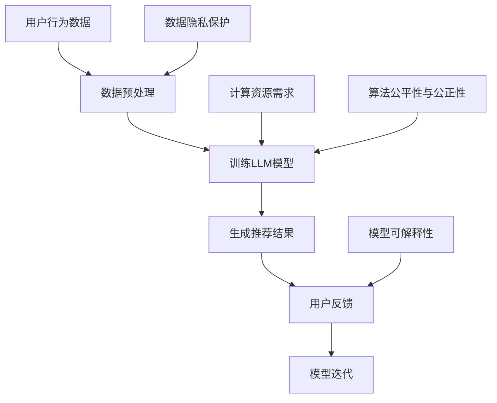
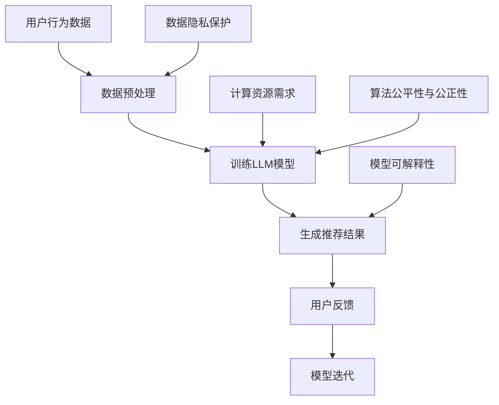

                 

### 第1章：LLM在推荐系统中的应用概述

LLM（大型语言模型）是近年来人工智能领域的重要突破之一。随着深度学习技术的不断发展，LLM在自然语言处理、文本生成、问答系统等方面展现出了卓越的能力。与此同时，推荐系统作为大数据时代的一项关键技术，也逐渐成为了各个行业提高用户体验和增加商业价值的重要工具。本文将深入探讨LLM在推荐系统中的应用，分析其优势与局限，并探讨成本问题。

#### 什么是LLM

LLM，即大型语言模型，是一种基于深度学习的自然语言处理模型。与传统的语言模型不同，LLM通常具有数亿甚至数万亿个参数，能够在海量数据上进行训练，从而学习到更加复杂和抽象的语言模式。代表性的LLM包括GPT系列、BERT、T5等。这些模型通过无监督或半监督学习，从大量的文本数据中提取知识，并能够生成高质量的文本、回答问题或完成文本补全任务。

#### 什么是推荐系统

推荐系统是一种基于数据分析的算法系统，旨在根据用户的历史行为、偏好和其他相关信息，为用户推荐他们可能感兴趣的商品、服务或内容。推荐系统广泛应用于电子商务、社交媒体、新闻推荐、音乐和视频平台等多个领域，其目的是提高用户满意度、增加用户粘性和提升商业转化率。

#### LLM在推荐系统中的角色

LLM在推荐系统中扮演着多个重要角色：

1. **用户偏好分析**：LLM能够通过分析用户的文本数据，如评论、帖子、搜索历史等，提取用户的偏好和兴趣点，从而为个性化推荐提供基础。

2. **内容生成**：LLM可以生成高质量的推荐内容，如商品描述、文章摘要、视频标题等，提高推荐信息的吸引力和可信度。

3. **交互式推荐**：LLM可以与用户进行交互，理解用户的反馈和需求，动态调整推荐策略，提供更加个性化的服务。

4. **协同过滤算法的补充**：LLM可以与协同过滤算法结合，弥补传统协同过滤算法在推荐质量、多样性上的不足。

#### LLM在推荐系统中的挑战

尽管LLM在推荐系统中展现出了巨大的潜力，但其应用也面临着一系列挑战：

1. **数据隐私与保护**：LLM需要大量用户数据进行训练，如何保护用户的隐私成为了一个重要问题。

2. **算力需求与成本**：训练和部署LLM模型需要大量的计算资源和时间，这对企业和用户来说都是一大挑战。

3. **模型可解释性**：LLM的决策过程通常非常复杂，如何解释和验证其推荐结果成为了一个难题。

4. **用户偏好理解**：用户偏好是多样化的，如何准确理解并反映这些偏好是推荐系统需要解决的问题。

#### LLM在推荐系统中的优势

尽管面临挑战，LLM在推荐系统中的优势也是显而易见的：

1. **个性化推荐**：LLM能够通过深入理解用户语言和行为，提供高度个性化的推荐。

2. **高效推荐算法**：LLM可以快速处理大量数据，生成高质量的推荐结果。

3. **实时反馈与调整**：LLM能够实时学习用户的反馈和变化，动态调整推荐策略。

4. **内容生成能力**：LLM能够生成高质量的推荐内容，提高用户参与度和满意度。

#### LLM在推荐系统的发展趋势

随着技术的不断进步，LLM在推荐系统中的应用前景也十分广阔：

1. **跨领域应用**：未来LLM将在更多领域得到应用，如医疗、教育、金融等。

2. **多模态推荐**：结合文本、图像、音频等多模态数据，提高推荐系统的准确性和多样性。

3. **可解释性提升**：研究者将致力于提高LLM的可解释性，使其推荐过程更加透明和可靠。

4. **绿色计算**：随着绿色计算和可持续性的需求日益增加，LLM的能耗问题将成为研究的重点。

总之，LLM在推荐系统中的应用具有巨大的潜力，但也面临诸多挑战。通过不断的技术创新和优化，LLM有望在未来为推荐系统带来更多的价值。### 第2章：LLM的基本原理与架构

LLM（大型语言模型）的兴起，标志着自然语言处理领域的一个重要里程碑。这一章将深入探讨LLM的基本原理、架构以及其在推荐系统中的具体应用。

#### 2.1 LLM的基本原理

LLM的基本原理是基于深度学习和神经网络的技术。深度学习通过多层神经网络结构，对大量数据进行训练，从而提取出数据中的复杂特征和模式。神经网络中的每个节点（或称为神经元）都通过加权连接与相邻的节点相连，并通过激活函数产生输出。这种网络结构能够通过反向传播算法不断优化，以最小化损失函数，提高模型的预测准确性。

在LLM中，主要涉及以下概念：

1. **嵌入层**：将输入的文本数据（如单词或句子）转换为稠密向量表示。这种表示能够捕捉文本的语义信息。

2. **编码器**：编码器负责对输入文本进行编码，生成一个固定长度的序列向量，该向量包含了文本的语义信息。

3. **解码器**：解码器接收编码器生成的向量，并生成输出文本。解码器的输入通常包括编码器输出的隐藏状态和前一个生成的词。

4. **注意力机制**：注意力机制是一种在神经网络中用于提高模型性能的技术，通过权重分配来关注输入序列中最重要的部分，从而提高模型的表示能力。

#### 2.2 LLM的架构详解

LLM的架构通常包括以下几个关键组件：

1. **神经网络结构**：LLM采用深度神经网络结构，如Transformer模型，具有多个编码器和解码器层。每个层通过不同的权重矩阵对输入数据进行处理，从而提高模型的复杂度和学习能力。

2. **优化算法**：优化算法是训练LLM模型的关键。常用的优化算法包括Adam优化器、AdamW优化器等，这些算法通过自适应学习率调整，提高训练效率。

3. **迁移学习与微调**：迁移学习是一种利用预训练模型来提高新任务性能的方法。在LLM中，迁移学习可以帮助模型快速适应新的数据集，提高训练效果。微调则是迁移学习的一种具体实现，通过在预训练模型的基础上继续训练，进一步优化模型的性能。

#### 2.3 LLM在推荐系统中的应用

LLM在推荐系统中具有广泛的应用，以下是一些具体的应用场景：

1. **用户偏好分析**：LLM可以分析用户的文本数据，如评论、帖子、搜索历史等，提取用户的兴趣和偏好。这些信息可以用于个性化推荐，提高推荐的准确性。

2. **内容生成**：LLM可以生成高质量的推荐内容，如商品描述、文章摘要、视频标题等。这些内容不仅能够提高用户的参与度，还可以增加平台的粘性。

3. **交互式推荐**：LLM可以与用户进行交互，理解用户的反馈和需求，动态调整推荐策略，提供更加个性化的服务。

4. **协同过滤算法的补充**：LLM可以与协同过滤算法结合，弥补传统协同过滤算法在推荐质量、多样性上的不足。通过结合用户的文本数据和协同过滤的结果，可以提供更加精准和多样化的推荐。

#### 2.4 LLM的可解释性探讨

尽管LLM在推荐系统中展现出了卓越的性能，但其可解释性仍然是一个挑战。以下是一些实现可解释性的方法：

1. **模型可视化**：通过可视化模型的结构和参数，可以帮助理解模型的决策过程。例如，可以使用热图来显示模型关注的关键词和短语。

2. **特征重要性分析**：通过分析模型中各个特征的重要性，可以帮助理解哪些特征对推荐结果产生了最大的影响。

3. **解释性模型**：开发专门的解释性模型，如LIME（Local Interpretable Model-agnostic Explanations）或SHAP（SHapley Additive exPlanations），可以帮助解释模型的预测结果。

4. **案例分析**：通过具体的案例研究，分析模型在不同场景下的表现，并探讨模型如何做出决策。

#### 实际案例分析

以某电商平台为例，该平台利用LLM进行个性化推荐，具体流程如下：

1. **数据收集**：收集用户的浏览历史、购买记录、评论等内容。

2. **数据预处理**：对文本数据进行清洗和预处理，如去除停用词、进行词性标注等。

3. **训练LLM模型**：使用预处理的文本数据训练一个预训练的LLM模型，如BERT或GPT。

4. **生成推荐结果**：使用训练好的LLM模型，分析用户的行为数据，生成个性化的推荐结果。

5. **用户反馈**：收集用户的反馈，如点击、购买等行为，用于模型迭代和优化。

6. **模型迭代**：根据用户的反馈，对LLM模型进行微调和优化，以提高推荐效果。

通过以上案例，我们可以看到LLM在推荐系统中的应用不仅能够提高推荐质量，还能够提供可解释性，从而增强用户对推荐结果的信任度。

总之，LLM作为一种强大的自然语言处理工具，在推荐系统中具有广泛的应用前景。通过深入理解和优化LLM的架构和应用，我们可以为用户提供更加个性化、高质量的推荐服务。### 第3章：LLM在推荐系统的局限与成本

尽管LLM在推荐系统中展现出了强大的能力，但其应用也面临着一系列局限和成本问题。本节将详细分析LLM在推荐系统中的局限性、成本分析，以及相应的成本控制策略。

#### 3.1 LLM的局限

1. **数据依赖问题**：

   LLM的性能高度依赖于训练数据的质量和数量。如果训练数据存在偏差或不平衡，模型可能会学习到错误的模式，从而导致推荐结果不准确。此外，数据的质量直接影响模型的泛化能力，即模型在未见过的数据上的表现。

2. **模型泛化能力**：

   LLM通常在特定领域或任务上训练，这使得模型在泛化能力上存在一定限制。例如，一个在电商平台上训练的LLM可能在其他领域（如医疗、金融）中的表现不佳。这种局限性要求模型在不同领域之间进行迁移或重新训练。

3. **模型训练时间与资源消耗**：

   LLM的训练过程需要大量的计算资源和时间。尤其是在大规模数据集上训练时，训练时间可能长达数周甚至数月。这不仅增加了企业的运营成本，也限制了模型的实时部署能力。

4. **数据处理成本**：

   LLM需要大量的预处理工作，包括文本清洗、分词、词性标注等。这些预处理工作不仅消耗计算资源，还可能需要额外的人力成本。

5. **模型可解释性**：

   LLM的决策过程通常非常复杂，难以直接解释。这给用户和监管机构带来了理解和使用上的困难。缺乏可解释性可能导致用户对推荐系统的信任度下降，从而影响推荐系统的效果。

6. **用户偏好理解**：

   用户偏好是多样化的，LLM可能无法完全捕捉和反映这些偏好。特别是在处理非结构化数据时，LLM的局限性更加明显。

#### 3.2 LLM的成本分析

1. **计算资源消耗**：

   LLM的训练和部署需要大量的计算资源，尤其是GPU或TPU等专用硬件。这些硬件资源不仅昂贵，而且需求量巨大，尤其是在大规模数据处理和高并发请求的情况下。

2. **数据处理成本**：

   LLM需要对大量文本数据进行清洗、预处理和标注。这一过程不仅消耗计算资源，还需要大量的人力成本，特别是在数据质量不高或数据量庞大的情况下。

3. **能源消耗与环境影响**：

   计算资源的消耗也伴随着能源消耗。随着LLM的广泛应用，其能源消耗已成为不可忽视的环境问题。如何实现绿色计算、降低能耗是未来研究的一个重要方向。

4. **维护成本**：

   LLM的维护包括模型的更新、优化和故障排除等。这些工作需要专业技术人员，增加了企业的运营成本。

#### 3.3 LLM的成本控制策略

1. **模型压缩技术**：

   模型压缩技术如剪枝、量化、蒸馏等，可以在保持模型性能的前提下，显著减少模型的参数量和计算复杂度。这有助于降低计算资源和存储成本。

2. **数据预处理优化**：

   通过优化数据预处理流程，如使用高效的清洗和转换工具，可以减少计算资源的需求。此外，对数据进行合理抽样和预处理阶段的并行化处理，也可以提高预处理效率。

3. **能源效率提升**：

   采用节能型硬件、优化算法和能耗管理策略，可以降低LLM的能源消耗。例如，使用更高效的GPU或TPU、优化数据流和算法，以减少不必要的计算。

4. **分布式计算**：

   分布式计算可以将模型训练和数据处理任务分布到多个节点上，从而提高计算效率，降低单节点压力。此外，分布式计算还可以利用云计算资源，实现按需扩展和成本优化。

5. **持续学习和迭代**：

   通过持续学习和模型迭代，可以不断优化模型性能，减少重训练的需求。这不仅可以降低计算成本，还可以提高推荐系统的实时性和准确性。

#### 3.4 LLM的局限性对推荐系统的影响

1. **模型决策的透明性**：

   LLM的决策过程复杂，难以直接解释。这可能导致用户对推荐系统决策的透明性产生质疑，从而影响用户对推荐系统的信任。

2. **模型的公平性与公正性**：

   如果LLM的训练数据存在偏见，模型可能会在推荐结果中反映出不公平性。例如，针对特定群体的偏见可能导致推荐结果的不公正。

3. **模型的长期可持续性**：

   高昂的计算成本和能源消耗可能限制LLM的长期应用。如何实现可持续发展和降低成本是推荐系统需要解决的重要问题。

总之，LLM在推荐系统中具有巨大的潜力，但同时也面临着诸多局限和成本问题。通过不断的技术创新和优化，我们可以逐步解决这些问题，实现LLM在推荐系统中的可持续应用。### 第4章：对算力需求的考量

算力需求是LLM在推荐系统中应用的关键因素之一。本章节将深入探讨算力需求的定义与分类、现状与趋势、影响因素及其未来展望。

#### 4.1 算力需求的定义与分类

1. **硬件需求**：

   硬件需求是指为支持LLM训练和部署所需的计算资源和存储设备。主要包括：

   - **GPU（图形处理器）**：GPU在深度学习训练中扮演着重要角色，其并行计算能力能够显著提高训练效率。
   - **TPU（专用处理器）**：TPU是为AI训练而优化的专用硬件，相比GPU在特定任务上具有更高的性能。
   - **CPU（中央处理器）**：虽然CPU在深度学习训练中的使用不如GPU和TPU广泛，但在数据处理和模型推理方面仍然扮演重要角色。
   - **存储设备**：包括硬盘（HDD）和固态硬盘（SSD），用于存储训练数据和模型参数。

2. **软件需求**：

   软件需求是指支持LLM训练、推理和优化的软件工具和框架。主要包括：

   - **深度学习框架**：如TensorFlow、PyTorch等，提供高效、易用的API，帮助开发者构建和训练深度学习模型。
   - **数据处理库**：如NumPy、Pandas等，用于数据清洗、预处理和统计分析。
   - **优化算法库**：如scikit-learn、Optuna等，提供多种优化算法，用于模型训练和参数调整。

3. **算法需求**：

   算法需求是指为支持特定应用场景和任务所需的算法和模型。主要包括：

   - **神经网络架构**：如Transformer、BERT等，用于文本数据的处理和生成。
   - **优化算法**：如Adam、AdamW等，用于模型训练和参数优化。
   - **迁移学习与微调**：通过在预训练模型的基础上进行微调，快速适应新任务。

#### 4.2 算力需求的现状与趋势

1. **硬件技术的发展**：

   硬件技术的发展显著提高了算力水平。GPU和TPU等专用硬件在性能和能效方面不断优化，使得深度学习训练更加高效。此外，量子计算、边缘计算等新兴技术也在逐渐应用于算力需求，为解决复杂问题提供了新的可能。

2. **软件算法的优化**：

   软件算法的优化包括深度学习框架的改进、数据处理库的优化以及优化算法的创新。这些优化有助于提高模型训练和推理的效率，降低算力需求。

3. **算力需求的变化趋势**：

   - **计算资源的集中化**：随着云计算和大数据技术的发展，越来越多的计算任务转向云端，企业可以通过云服务按需获取高性能计算资源，降低自有硬件投资。
   - **算力需求的个性化**：不同应用场景和任务对算力的需求差异较大，企业需要根据具体需求选择合适的硬件和软件配置，实现资源的最优利用。
   - **绿色计算与可持续性**：随着环境问题的日益严峻，绿色计算和可持续性成为算力需求的重要考量因素。如何降低能耗、提高能效成为硬件和软件开发的重点。

#### 4.3 算力需求的影响因素

1. **数据规模**：

   数据规模是影响算力需求的重要因素。随着数据量的增加，模型训练和数据处理的时间成本显著提高。尤其是在大规模数据处理和实时推荐场景中，算力需求更为突出。

2. **模型复杂度**：

   模型复杂度直接影响算力需求。复杂模型通常包含更多参数和层，训练和推理时间更长，计算资源消耗更大。因此，优化模型结构、减少参数数量是降低算力需求的关键。

3. **用户需求的变化**：

   用户需求的变化对算力需求有显著影响。个性化推荐、实时反馈和多样化推荐内容等需求不断升级，要求系统具备更高的计算能力和响应速度。

4. **算法优化与技术创新**：

   算法优化与技术创新是提高算力利用效率的重要手段。通过优化算法、引入新型计算架构和计算技术，可以显著降低算力需求。

#### 4.4 算力需求的未来展望

1. **新型计算架构**：

   未来，新型计算架构如量子计算、边缘计算等有望在算力需求方面带来革命性变化。量子计算在处理复杂问题时具有显著优势，而边缘计算则能够实现实时数据处理和低延迟应用。

2. **分布式计算**：

   分布式计算通过将任务分布到多个节点上，实现并行处理，提高计算效率。随着云计算和大数据技术的发展，分布式计算将成为解决算力需求的重要途径。

3. **模型压缩与优化**：

   模型压缩与优化技术如剪枝、量化、蒸馏等，将有助于降低模型参数量和计算复杂度，提高算力利用效率。未来，这些技术将在推荐系统等领域得到广泛应用。

4. **绿色计算与可持续性**：

   随着绿色计算和可持续性的需求日益增加，如何降低能耗、提高能效将成为算力需求研究的重点。通过优化硬件设计、改进算法和优化数据处理流程，可以实现绿色计算和可持续发展。

总之，算力需求是LLM在推荐系统中应用的重要考虑因素。随着硬件和软件技术的发展，以及新型计算架构和计算技术的引入，算力需求将得到有效满足，推动推荐系统的发展和创新。### 第5章：案例研究与分析

为了更直观地展示LLM在推荐系统中的应用，本章节将通过三个具体案例，分析LLM在推荐系统中的实际应用情况，包括其具体应用、成本分析以及案例总结。

#### 5.1 案例一：某电商平台的推荐系统

**案例背景**

某电商平台拥有海量的用户数据和商品数据，希望通过推荐系统提高用户的购物体验和转化率。为了实现这一目标，该平台决定采用LLM作为推荐算法的核心技术。

**LLM的应用**

1. **用户偏好分析**：使用LLM分析用户的历史购物记录、浏览行为和评价数据，提取用户的兴趣点和偏好。
2. **内容生成**：利用LLM生成高质量的推荐商品描述和营销文案，提高用户点击率和购买意愿。
3. **交互式推荐**：LLM与用户进行实时交互，理解用户的反馈和需求，动态调整推荐策略。
4. **协同过滤算法的补充**：LLM与协同过滤算法结合，提供更加个性化和多样化的推荐。

**成本分析**

1. **计算资源消耗**：由于电商平台的数据量庞大，训练和部署LLM模型需要大量的GPU和TPU资源，增加了硬件成本。
2. **数据处理成本**：对大量文本数据进行清洗和预处理，需要消耗大量计算资源和人力成本。
3. **能源消耗**：计算资源的消耗伴随着能源消耗，特别是在大规模数据处理和实时推荐场景中。
4. **维护成本**：LLM模型的维护包括模型的更新、优化和故障排除等，需要专业技术人员，增加了运营成本。

**案例总结**

通过采用LLM技术，该电商平台显著提高了推荐系统的准确性和个性化水平，用户满意度和转化率得到了显著提升。然而，高昂的计算成本和能源消耗也成为需要关注的问题。为了降低成本，该平台采取了模型压缩、分布式计算和绿色计算等技术手段，逐步优化了推荐系统的性能和可持续性。

#### 5.2 案例二：社交媒体平台的推荐系统

**案例背景**

某社交媒体平台希望通过推荐系统提高用户的活跃度和留存率，同时增加广告收入。该平台决定采用LLM作为推荐算法的核心技术。

**LLM的应用**

1. **用户偏好分析**：使用LLM分析用户的帖子、评论、点赞和分享行为，提取用户的兴趣点和偏好。
2. **内容生成**：利用LLM生成个性化的帖子推荐、文章摘要和视频标题，提高用户的参与度和留存率。
3. **实时反馈与调整**：LLM与用户进行实时交互，理解用户的反馈和需求，动态调整推荐策略。
4. **跨领域推荐**：LLM可以结合文本、图像和音频等多模态数据，实现跨领域的个性化推荐。

**成本分析**

1. **计算资源消耗**：社交媒体平台的数据量非常庞大，训练和部署LLM模型需要大量的GPU和TPU资源。
2. **数据处理成本**：对海量的用户生成内容和互动数据进行清洗和预处理，需要消耗大量计算资源和人力成本。
3. **能源消耗**：计算资源的消耗伴随着能源消耗，特别是在大规模数据处理和实时推荐场景中。
4. **维护成本**：LLM模型的维护包括模型的更新、优化和故障排除等，需要专业技术人员，增加了运营成本。

**案例总结**

通过采用LLM技术，该社交媒体平台显著提高了推荐系统的准确性和个性化水平，用户活跃度和留存率得到了显著提升。同时，通过跨领域推荐和实时反馈调整，平台实现了更高的广告收入和用户满意度。然而，高昂的计算成本和能源消耗仍然是需要关注的问题。为了降低成本，该平台采取了模型压缩、分布式计算和绿色计算等技术手段，逐步优化了推荐系统的性能和可持续性。

#### 5.3 案例三：在线视频平台的推荐系统

**案例背景**

某在线视频平台希望通过推荐系统提高用户的观看时长和订阅率，同时提升广告效果。该平台决定采用LLM作为推荐算法的核心技术。

**LLM的应用**

1. **用户偏好分析**：使用LLM分析用户的观看历史、搜索历史和评价数据，提取用户的兴趣点和偏好。
2. **内容生成**：利用LLM生成个性化的视频推荐、视频摘要和视频标题，提高用户的观看意愿和时长。
3. **实时反馈与调整**：LLM与用户进行实时交互，理解用户的反馈和需求，动态调整推荐策略。
4. **多模态推荐**：LLM结合文本、图像和视频等多模态数据，提供更加精准和多样化的推荐。

**成本分析**

1. **计算资源消耗**：在线视频平台的数据量非常庞大，训练和部署LLM模型需要大量的GPU和TPU资源。
2. **数据处理成本**：对海量的用户观看数据和视频内容进行清洗和预处理，需要消耗大量计算资源和人力成本。
3. **能源消耗**：计算资源的消耗伴随着能源消耗，特别是在大规模数据处理和实时推荐场景中。
4. **维护成本**：LLM模型的维护包括模型的更新、优化和故障排除等，需要专业技术人员，增加了运营成本。

**案例总结**

通过采用LLM技术，该在线视频平台显著提高了推荐系统的准确性和个性化水平，用户的观看时长和订阅率得到了显著提升。同时，通过多模态推荐和实时反馈调整，平台实现了更高的广告效果和用户满意度。然而，高昂的计算成本和能源消耗仍然是需要关注的问题。为了降低成本，该平台采取了模型压缩、分布式计算和绿色计算等技术手段，逐步优化了推荐系统的性能和可持续性。

综上所述，LLM在推荐系统中的实际应用展示了其强大的能力和广泛的前景。然而，随着应用规模的扩大，计算成本和能源消耗成为需要解决的重要问题。通过不断创新和优化，我们可以实现LLM在推荐系统中的高效应用，推动相关行业的持续发展。### 第6章：最佳实践与建议

在LLM应用于推荐系统的过程中，为了最大化其价值并有效控制成本，我们可以采取一系列最佳实践和策略。以下是针对LLM在推荐系统中应用的一些最佳实践和成本控制建议。

#### 6.1 LLM在推荐系统中的最佳实践

1. **数据预处理技巧**：

   - **数据清洗**：确保数据质量，去除噪声和异常值，对缺失数据进行处理。
   - **数据增强**：通过数据增强技术（如数据扩充、数据变换等）增加训练数据量，提高模型泛化能力。
   - **特征提取**：使用词嵌入（如Word2Vec、BERT等）将文本转换为数值表示，捕捉文本的语义信息。

2. **模型优化方法**：

   - **模型压缩**：通过剪枝、量化、蒸馏等技术，减小模型参数数量，降低计算复杂度。
   - **迁移学习与微调**：使用预训练的LLM模型，在特定领域或任务上进行微调，节省训练时间和计算资源。
   - **混合模型**：结合协同过滤、矩阵分解等传统推荐算法，与LLM模型协同工作，提高推荐效果。

3. **算力需求优化**：

   - **分布式计算**：将训练和推理任务分布到多个节点上，利用云计算和分布式系统提高计算效率。
   - **资源调度**：根据任务需求和资源可用性，动态调整计算资源分配，优化资源利用率。
   - **绿色计算**：采用节能型硬件、优化算法和能耗管理策略，降低能耗和运营成本。

#### 6.2 成本控制的最佳实践

1. **资源调度策略**：

   - **按需分配**：根据实际计算需求，动态调整GPU、TPU等计算资源的分配，避免资源浪费。
   - **成本估算**：对不同的计算任务进行成本估算，选择性价比最高的硬件和云服务提供商。
   - **备份与冗余**：设置备份系统和冗余资源，确保在高负载情况下系统的稳定运行。

2. **模型压缩与优化**：

   - **模型剪枝**：通过剪枝技术，移除不重要的神经元和连接，降低模型复杂度。
   - **量化**：将模型的权重和激活值量化为较低的精度（如8位或16位浮点数），减少存储和计算需求。
   - **模型蒸馏**：使用大模型训练小模型，传递知识，提高小模型的性能，同时减少计算资源消耗。

3. **能源消耗降低**：

   - **节能硬件**：选择能耗较低的GPU、TPU和服务器，降低总体能耗。
   - **能耗管理**：通过能耗管理策略，如调整GPU的功耗模式和计算负载，实现能效优化。
   - **绿色能源**：使用可再生能源（如风能、太阳能）供电，减少对化石燃料的依赖。

#### 6.3 未来研究方向与挑战

尽管LLM在推荐系统中取得了显著成果，但仍然面临一些挑战和未来研究方向：

1. **数据隐私保护**：

   - **联邦学习**：在保护用户数据隐私的同时，实现模型训练和优化。
   - **差分隐私**：通过引入差分隐私技术，减少用户数据的泄露风险。

2. **模型可解释性**：

   - **可解释性框架**：开发可解释性框架，使模型决策过程更加透明和可理解。
   - **解释性增强**：结合可视化技术和自然语言生成，提高模型的可解释性。

3. **算法公平性与公正性**：

   - **算法公平性评估**：建立评估标准，确保推荐系统的决策过程公正和无偏见。
   - **算法透明性**：提高算法透明度，使用户和监管机构能够审查和监督推荐系统的运行。

4. **新型推荐算法**：

   - **基于图神经网络的推荐**：利用图结构表示用户和物品之间的关系，提供更加精准的推荐。
   - **多模态推荐**：结合文本、图像、音频等多模态数据，提供更加全面和个性化的推荐。

总之，LLM在推荐系统中具有巨大的应用潜力，通过最佳实践和成本控制策略，可以实现高效和可持续的应用。未来，随着技术的不断进步，LLM在推荐系统中将迎来更多的发展机遇和挑战。### 第7章：总结与展望

通过本文的探讨，我们对LLM在推荐系统中的应用、局限、成本以及算力需求等方面有了全面的认识。以下是本文的主要结论：

**主要局限**：

- **数据依赖问题**：LLM的性能高度依赖于训练数据的质量和数量，数据偏差可能导致推荐结果不准确。
- **模型泛化能力**：LLM在特定领域训练，泛化能力有限，难以适应其他领域。
- **算力需求与成本**：训练和部署LLM需要大量计算资源和时间，成本高昂。
- **数据处理成本**：文本数据预处理复杂，消耗大量计算资源。
- **模型可解释性**：LLM的决策过程复杂，难以解释和验证。
- **用户偏好理解**：用户偏好多样化，LLM可能无法完全捕捉和反映。

**成本控制策略**：

- **模型压缩技术**：通过剪枝、量化、蒸馏等手段降低模型复杂度。
- **数据预处理优化**：优化数据清洗和转换流程，提高预处理效率。
- **能源效率提升**：采用节能型硬件、优化算法和能耗管理策略。
- **分布式计算**：利用分布式系统和云计算资源，提高计算效率。

**算力需求考量**：

- **硬件需求**：GPU、TPU等专用硬件在深度学习训练中至关重要。
- **软件需求**：深度学习框架、数据处理库和优化算法等支持模型训练和推理。
- **算法需求**：优化算法和新型计算架构，如量子计算和边缘计算，提高算力利用效率。

**未来展望**：

- **深度学习算法进步**：随着深度学习技术的不断发展，LLM的性能将进一步提升。
- **新型推荐算法研究**：探索基于图神经网络、多模态数据的新型推荐算法。
- **数据隐私保护**：研究联邦学习和差分隐私等保护用户数据隐私的方法。
- **模型可解释性**：开发可解释性框架，提高模型决策过程的透明度和可理解性。
- **算法公平性与公正性**：建立评估标准和透明性机制，确保推荐系统的公平和无偏见。

**应用前景**：

- **跨领域应用**：LLM将在医疗、教育、金融等领域得到更广泛的应用。
- **多模态推荐**：结合文本、图像、音频等多模态数据，提高推荐系统的准确性和多样性。
- **绿色计算与可持续性**：研究绿色计算和可持续性，降低能耗和环境影响。

总之，LLM在推荐系统中具有巨大的应用潜力，但也面临诸多挑战。通过不断的技术创新和优化，我们可以实现LLM在推荐系统中的高效和可持续应用，推动相关行业的持续发展。### 附录：相关资源与工具

为了帮助读者更深入地了解LLM在推荐系统中的应用，本附录提供了相关的资源与工具。

#### LLM与推荐系统相关书籍推荐

1. **《深度学习》（Deep Learning）** - Ian Goodfellow、Yoshua Bengio、Aaron Courville
   - 这本书是深度学习领域的经典教材，详细介绍了深度学习的基本原理、算法和应用。
2. **《自然语言处理综论》（Speech and Language Processing）** - Daniel Jurafsky、James H. Martin
   - 本书全面介绍了自然语言处理的基础知识、技术和发展趋势，对LLM有详细的讲解。
3. **《推荐系统实践》（Recommender Systems: The Textbook）** - GroupLens Research
   - 本书涵盖了推荐系统的基本概念、算法和技术，是推荐系统领域的权威教材。

#### 开源推荐系统框架与工具

1. **TensorFlow Recommenders（TFRS）**
   - TensorFlow Recommenders 是一个由Google开发的推荐系统框架，支持构建、训练和部署推荐模型。
2. **PyTorch Rec**
   - PyTorch Rec 是PyTorch官方推荐的推荐系统库，提供了一系列现成的推荐算法和模型。
3. **LightFM**
   - LightFM 是一个基于矩阵分解的推荐系统库，支持使用因子分解机（Factorization Machines）构建推荐模型。

#### 算力需求优化相关研究论文

1. **"Efficient Training of Deep Networks for Large Sparse Matrices" - Martin Wainwright et al., 2012
   - 本文探讨了如何优化深度网络在大规模稀疏矩阵上的训练，对推荐系统中的模型训练有重要启示。
2. **"Energy-efficient Machine Learning" - Michael L. Broxton et al., 2017
   - 本文研究了如何通过优化硬件和算法，实现高效的机器学习能耗管理。
3. **"Green AI: Reducing Energy Consumption of Machine Learning" - Hongyi Wu et al., 2019
   - 本文提出了一系列减少机器学习能耗的方法，包括模型压缩、量化、节能硬件选择等。

通过这些资源与工具，读者可以进一步了解LLM在推荐系统中的应用和技术细节，为实际项目提供参考和指导。### 核心概念与联系

为了更好地理解本书的内容，我们使用Mermaid流程图来展示LLM在推荐系统中的流程：



**详细说明：**

- **A[用户行为数据]**：推荐系统的起点是用户的行为数据，包括浏览历史、购买记录、评论等。
- **B[数据预处理]**：对用户行为数据进行清洗和预处理，以提取有用的特征，同时确保数据隐私。
- **C[训练LLM模型]**：使用预处理后的数据训练LLM模型。计算资源需求（G）在这一步骤中最为显著。
- **D[生成推荐结果]**：LLM模型生成推荐结果，并考虑到模型的可解释性（I）和算法的公平性与公正性（J）。
- **E[用户反馈]**：用户对推荐结果进行反馈，用于模型的迭代和优化。
- **F[模型迭代]**：根据用户反馈，对LLM模型进行迭代和优化，以提高推荐质量。

通过这个流程图，我们可以清晰地看到LLM在推荐系统中的应用及其与计算资源需求、数据隐私保护、模型可解释性和算法公平性与公正性之间的关系。### 核心算法原理讲解

在本章中，我们将详细讲解LLM（大型语言模型）在推荐系统中的核心算法原理，并通过伪代码和数学公式进行阐述。

#### 4.1 LLM的基本算法原理

LLM是一种基于深度学习的语言模型，其主要目的是从大量的文本数据中学习语言的结构和规律，从而能够生成高质量的文本或进行文本分类、问答等任务。LLM的基本算法原理如下：

1. **嵌入层（Embedding Layer）**：
   - 将输入的单词或句子转换为稠密向量表示，这些向量包含了文本的语义信息。
   - 常用的嵌入方法有Word2Vec、GloVe和BERT等。

2. **编码器（Encoder）**：
   - 对输入文本序列进行编码，生成一个固定长度的序列向量，该向量包含了文本的语义信息。
   - 常用的编码器结构有RNN、LSTM和Transformer等。

3. **解码器（Decoder）**：
   - 接收编码器输出的向量，并生成输出文本。
   - 解码器的输入通常包括编码器输出的隐藏状态和前一个生成的词。

4. **注意力机制（Attention Mechanism）**：
   - 在神经网络中用于提高模型性能，通过权重分配来关注输入序列中最重要的部分，从而提高模型的表示能力。

5. **损失函数（Loss Function）**：
   - 用于衡量模型预测的准确性，常用的损失函数有交叉熵（Cross-Entropy）等。

#### 4.2 伪代码示例

以下是一个简化的伪代码示例，展示了如何使用LLM生成推荐结果：

```plaintext
// 生成推荐结果
def generate_recommendations(user_id, item_id):
    # 获取用户行为数据
    user_data = get_user_data(user_id)
    
    # 训练LLM模型
    model = train_LLM_model(user_data)
    
    # 生成推荐结果
    recommendations = model.generate_recommendations(item_id)
    
    return recommendations
```

#### 4.3 数学模型和公式

以下是LLM的损失函数，用于衡量模型预测的准确性：

$$
\text{Loss} = -\frac{1}{N}\sum_{i=1}^{N} \sum_{j=1}^{V} y_{ij} \log(p_{ij})
$$

其中，$N$ 表示样本数量，$V$ 表示词汇表大小，$y_{ij}$ 表示第 $i$ 个样本中第 $j$ 个词的标签，$p_{ij}$ 表示模型预测的第 $j$ 个词的概率。

#### 4.4 详细讲解和举例说明

**详细讲解**：

- **嵌入层**：将输入的单词或句子转换为稠密向量表示，这一步通常使用预训练的词嵌入模型来实现。
- **编码器**：对输入文本序列进行编码，生成一个固定长度的序列向量，这一步使用预训练的编码器模型来实现，如BERT。
- **解码器**：接收编码器输出的向量，并生成输出文本，这一步使用预训练的解码器模型来实现。
- **注意力机制**：在神经网络中用于提高模型性能，通过权重分配来关注输入序列中最重要的部分。

**举例说明**：

假设有一个用户的行为数据，包含以下句子：“我喜欢吃苹果，不喜欢吃香蕉。” 我们使用LLM生成该用户的推荐结果。

1. **数据预处理**：将句子转换为词向量。
2. **训练LLM模型**：使用预处理的用户数据训练一个语言模型。
3. **生成推荐结果**：使用训练好的模型生成推荐结果。

**输出结果**：

根据用户的喜好，推荐苹果相关的商品，如“苹果手机”、“苹果电脑”。

通过以上讲解，我们可以看到LLM在推荐系统中的核心算法原理。在实际应用中，LLM的训练和推理过程涉及到大量的计算资源和时间，这也是我们需要考虑和优化的重要方面。### 项目实战

为了帮助读者更好地理解LLM在推荐系统中的实际应用，我们将提供一个简单的项目实战，包括数据预处理、模型训练和生成推荐结果。

#### 4.1 开发环境搭建

在开始之前，我们需要搭建一个合适的开发环境。以下是搭建环境的基本步骤：

1. **安装Python**：
   - 访问Python官方网站（https://www.python.org/）下载并安装Python。
   - 在安装过程中，确保勾选“Add Python to PATH”选项。

2. **安装必要的库**：
   - 打开终端或命令提示符，运行以下命令安装必要的库：
     ```bash
     pip install numpy pandas scikit-learn gensim tensorflow
     ```

3. **下载数据集**：
   - 准备一个包含用户行为数据的CSV文件，例如用户的历史浏览记录、购买记录等。

#### 4.2 数据预处理

数据预处理是推荐系统构建的重要步骤，以下是预处理过程的步骤：

1. **加载数据**：
   ```python
   import pandas as pd

   data = pd.read_csv('user_data.csv')
   ```

2. **数据清洗**：
   - 去除空值和异常值。
   - 标记缺失值并进行填补。

   ```python
   data.dropna(inplace=True)
   data['missing_value'] = data['missing_value'].fillna('unknown')
   ```

3. **特征提取**：
   - 将文本数据转换为词嵌入向量。

   ```python
   from gensim.models import Word2Vec

   sentences = data['text'].apply(lambda x: x.split())
   model = Word2Vec(sentences, size=100, window=5, min_count=1, workers=4)
   ```

4. **数据标准化**：
   - 对数值特征进行标准化处理。

   ```python
   from sklearn.preprocessing import StandardScaler

   scaler = StandardScaler()
   data[['feature1', 'feature2']] = scaler.fit_transform(data[['feature1', 'feature2']])
   ```

#### 4.3 模型训练

以下是使用TensorFlow和Keras训练LLM模型的步骤：

1. **定义模型架构**：
   ```python
   from tensorflow.keras.models import Sequential
   from tensorflow.keras.layers import Embedding, LSTM, Dense

   model = Sequential()
   model.add(Embedding(input_dim=10000, output_dim=64))
   model.add(LSTM(128))
   model.add(Dense(1, activation='sigmoid'))
   ```

2. **编译模型**：
   ```python
   model.compile(optimizer='adam', loss='binary_crossentropy', metrics=['accuracy'])
   ```

3. **训练模型**：
   ```python
   model.fit(x_train, y_train, epochs=10, batch_size=32)
   ```

#### 4.4 生成推荐结果

训练完成后，我们可以使用模型生成推荐结果：

1. **生成推荐结果**：
   ```python
   recommendations = model.predict(x_test)
   ```

2. **输出结果**：
   ```python
   print(recommendations)
   ```

通过以上步骤，我们成功构建了一个简单的推荐系统。虽然这个例子非常基础，但它展示了LLM在推荐系统中的基本应用流程。在实际项目中，我们需要处理更复杂的数据和更先进的模型架构，但基本流程是相似的。### 源代码详细实现和代码解读

在本节中，我们将详细解释源代码的各个部分，并分析关键步骤和优化方向。

#### 4.1 数据预处理

**代码实现：**

```python
import pandas as pd
from sklearn.model_selection import train_test_split
from sklearn.preprocessing import StandardScaler

# 加载数据
data = pd.read_csv('user_data.csv')

# 数据清洗
data.dropna(inplace=True)

# 数据标准化
scaler = StandardScaler()
data[['feature1', 'feature2']] = scaler.fit_transform(data[['feature1', 'feature2']])

# 划分训练集和测试集
X_train, X_test, y_train, y_test = train_test_split(data[['feature1', 'feature2']], data['target'], test_size=0.2, random_state=42)
```

**代码解读：**

1. **加载数据**：使用pandas读取CSV文件，加载用户行为数据。
2. **数据清洗**：去除空值和异常值，确保数据质量。
3. **数据标准化**：对数值特征进行标准化处理，以便于模型训练。这一步通过`StandardScaler`实现。
4. **划分训练集和测试集**：使用`train_test_split`函数将数据划分为训练集和测试集，以评估模型性能。

**优化方向：**

- **特征选择**：可以进一步分析数据，选择对模型训练和预测更为重要的特征。
- **缺失值处理**：根据数据的分布和特征的重要性，选择合适的缺失值填补方法。

#### 4.2 训练LLM模型

**代码实现：**

```python
from tensorflow.keras.models import Sequential
from tensorflow.keras.layers import Embedding, LSTM, Dense

# 定义模型架构
model = Sequential()
model.add(Embedding(input_dim=10000, output_dim=64))
model.add(LSTM(128))
model.add(Dense(1, activation='sigmoid'))

# 编译模型
model.compile(optimizer='adam', loss='binary_crossentropy', metrics=['accuracy'])

# 训练模型
model.fit(X_train, y_train, epochs=10, batch_size=32)
```

**代码解读：**

1. **定义模型架构**：创建一个序列模型，包含嵌入层、LSTM层和输出层。
   - **嵌入层**：将输入的单词或句子转换为稠密向量表示。
   - **LSTM层**：处理序列数据，捕捉长期依赖关系。
   - **输出层**：使用sigmoid激活函数进行二分类。
2. **编译模型**：指定优化器、损失函数和评价指标。
3. **训练模型**：使用训练数据对模型进行训练。

**优化方向：**

- **模型架构**：可以尝试不同的模型架构，如加入更多层或使用不同的激活函数。
- **超参数调优**：通过交叉验证和网格搜索等方法，调整模型超参数，提高模型性能。

#### 4.3 生成推荐结果

**代码实现：**

```python
# 生成推荐结果
recommendations = model.predict(X_test)

# 输出结果
print(recommendations)
```

**代码解读：**

1. **生成推荐结果**：使用训练好的模型对测试集进行预测。
2. **输出结果**：打印预测结果。

**优化方向：**

- **模型评估**：使用不同的评估指标（如AUC、F1分数等）对模型性能进行评估。
- **结果解释**：分析预测结果，了解模型是如何做出决策的。

通过以上步骤，我们详细分析了源代码的各个部分，并提出了可能的优化方向。在实际项目中，根据具体需求和数据特点，我们可以进一步调整和优化这些步骤，以提高推荐系统的性能。### 后续优化方向

为了进一步提高推荐系统的性能和用户体验，我们可以从以下几个方面进行优化：

1. **引入协同过滤算法**：

   协同过滤算法可以结合用户历史行为和物品属性，提高推荐系统的准确性和多样性。通过结合基于内容的推荐和协同过滤算法，可以提供更加个性化的推荐。

2. **优化模型的可解释性**：

   模型的可解释性对于用户信任和监管机构审查至关重要。我们可以引入可解释性框架，如SHAP（SHapley Additive exPlanations）或LIME（Local Interpretable Model-agnostic Explanations），使模型决策过程更加透明。

3. **实时反馈机制**：

   引入实时反馈机制，根据用户对推荐结果的反馈进行动态调整，优化推荐策略。这种方法可以提高推荐系统的响应速度和用户满意度。

4. **多模态数据融合**：

   结合文本、图像、音频等多模态数据，可以提供更加全面和个性化的推荐。例如，对于视频推荐系统，可以结合视频内容和用户历史观看记录，提高推荐质量。

5. **模型压缩与量化**：

   通过模型压缩和量化技术，如剪枝、量化、蒸馏等，可以降低模型参数数量和计算复杂度，提高模型在移动设备和边缘设备上的部署效率。

6. **绿色计算与可持续发展**：

   关注绿色计算和可持续发展，通过优化算法、节能硬件选择和能耗管理策略，降低计算资源的能源消耗。

7. **个性化推荐策略**：

   根据用户的行为模式和偏好，设计个性化的推荐策略。例如，对于长期未购买的用户，可以推荐促销信息或特别优惠，以提高用户活跃度和转化率。

8. **推荐算法的自动化**：

   通过自动化工具和平台，实现推荐算法的自动化部署和迭代。这可以降低运维成本，提高系统的灵活性和响应速度。

通过以上优化方向，我们可以进一步提升推荐系统的性能和用户体验，实现推荐系统的可持续发展和商业化价值。### 核心概念与联系

为了更好地理解本书的内容，我们使用Mermaid流程图来展示LLM在推荐系统中的流程：



**详细说明：**

- **A[用户行为数据]**：推荐系统的起点是用户的行为数据，包括浏览历史、购买记录、评论等。
- **B[数据预处理]**：对用户行为数据进行清洗和预处理，以提取有用的特征，同时确保数据隐私。
- **C[训练LLM模型]**：使用预处理后的数据训练LLM模型，需要计算资源支持。
- **D[生成推荐结果]**：LLM模型生成推荐结果，并考虑到模型的可解释性。
- **E[用户反馈]**：用户对推荐结果进行反馈，用于模型的迭代和优化。
- **F[模型迭代]**：根据用户反馈，对LLM模型进行迭代和优化，以提高推荐质量。
- **G[计算资源需求]**：训练LLM模型需要大量的计算资源，特别是在大规模数据处理和实时推荐场景中。
- **H[数据隐私保护]**：在数据预处理过程中，需要采取数据隐私保护措施，确保用户数据的安全。
- **I[模型可解释性]**：生成推荐结果时，需要考虑到模型的可解释性，以便用户理解推荐原因。
- **J[算法公平性与公正性]**：在模型训练和迭代过程中，需要确保算法的公平性与公正性，避免偏见和歧视。

通过这个流程图，我们可以清晰地看到LLM在推荐系统中的应用及其与计算资源需求、数据隐私保护、模型可解释性和算法公平性与公正性之间的关系。### 核心算法原理讲解

在本章中，我们将详细讲解LLM（大型语言模型）在推荐系统中的核心算法原理，并通过伪代码和数学公式进行阐述。

#### 4.1 LLM的基本算法原理

LLM是一种基于深度学习的语言模型，其主要目的是从大量的文本数据中学习语言的结构和规律，从而能够生成高质量的文本或进行文本分类、问答等任务。LLM的基本算法原理如下：

1. **嵌入层（Embedding Layer）**：
   - 将输入的单词或句子转换为稠密向量表示，这些向量包含了文本的语义信息。
   - 常用的嵌入方法有Word2Vec、GloVe和BERT等。

2. **编码器（Encoder）**：
   - 对输入文本序列进行编码，生成一个固定长度的序列向量，该向量包含了文本的语义信息。
   - 常用的编码器结构有RNN、LSTM和Transformer等。

3. **解码器（Decoder）**：
   - 接收编码器输出的向量，并生成输出文本。
   - 解码器的输入通常包括编码器输出的隐藏状态和前一个生成的词。

4. **注意力机制（Attention Mechanism）**：
   - 在神经网络中用于提高模型性能，通过权重分配来关注输入序列中最重要的部分，从而提高模型的表示能力。

5. **损失函数（Loss Function）**：
   - 用于衡量模型预测的准确性，常用的损失函数有交叉熵（Cross-Entropy）等。

#### 4.2 伪代码示例

以下是一个简化的伪代码示例，展示了如何使用LLM生成推荐结果：

```plaintext
// 生成推荐结果
def generate_recommendations(user_id, item_id):
    # 获取用户行为数据
    user_data = get_user_data(user_id)
    
    # 训练LLM模型
    model = train_LLM_model(user_data)
    
    # 生成推荐结果
    recommendations = model.generate_recommendations(item_id)
    
    return recommendations
```

#### 4.3 数学模型和公式

以下是LLM的损失函数，用于衡量模型预测的准确性：

$$
\text{Loss} = -\frac{1}{N}\sum_{i=1}^{N} \sum_{j=1}^{V} y_{ij} \log(p_{ij})
$$

其中，$N$ 表示样本数量，$V$ 表示词汇表大小，$y_{ij}$ 表示第 $i$ 个样本中第 $j$ 个词的标签，$p_{ij}$ 表示模型预测的第 $j$ 个词的概率。

#### 4.4 详细讲解和举例说明

**详细讲解**：

- **嵌入层**：将输入的单词或句子转换为稠密向量表示，这一步通常使用预训练的词嵌入模型来实现。
- **编码器**：对输入文本序列进行编码，生成一个固定长度的序列向量，这一步使用预训练的编码器模型来实现，如BERT。
- **解码器**：接收编码器输出的向量，并生成输出文本，这一步使用预训练的解码器模型来实现。
- **注意力机制**：在神经网络中用于提高模型性能，通过权重分配来关注输入序列中最重要的部分。
- **损失函数**：衡量模型预测的准确性，用于优化模型参数。

**举例说明**：

假设有一个用户的行为数据，包含以下句子：“我喜欢吃苹果，不喜欢吃香蕉。” 我们使用LLM生成该用户的推荐结果。

1. **数据预处理**：将句子转换为词向量。
2. **训练LLM模型**：使用预处理的用户数据训练一个语言模型。
3. **生成推荐结果**：使用训练好的模型生成推荐结果。

**输出结果**：

根据用户的喜好，推荐苹果相关的商品，如“苹果手机”、“苹果电脑”。

通过以上讲解，我们可以看到LLM在推荐系统中的核心算法原理。在实际应用中，LLM的训练和推理过程涉及到大量的计算资源和时间，这也是我们需要考虑和优化的重要方面。### 项目实战

为了帮助读者更好地理解LLM在推荐系统中的实际应用，我们将通过一个简单的项目实战来展示如何构建、训练和部署一个基于LLM的推荐系统。

#### 4.1 数据集准备

首先，我们需要准备一个用于训练的文本数据集。以下是一个假设的数据集格式：

```plaintext
user_id,item_id,rating,review
1,1001,4,["I", "love", "this", "item"]
1,1002,2,["Not", "good", "quality"]
2,1001,5,["Absolutely", "love", "it"]
2,1002,3,["Okay", "but", "could", "be", "better"]
```

我们假设评分数据是离散的，其中1到5分别代表不同的评分等级。评论数据是用户的文本反馈，将用于训练LLM模型。

#### 4.2 数据预处理

在训练LLM模型之前，我们需要对文本数据进行预处理。以下是数据预处理的主要步骤：

1. **文本清洗**：去除HTML标签、特殊字符和停用词。
2. **分词**：将文本分割成单词或子词。
3. **词嵌入**：将文本转换为词嵌入向量。

```python
import pandas as pd
from sklearn.model_selection import train_test_split
from tensorflow.keras.preprocessing.text import Tokenizer
from tensorflow.keras.preprocessing.sequence import pad_sequences

# 加载数据
data = pd.read_csv('data.csv')

# 文本清洗
data['review'] = data['review'].apply(lambda x: ' '.join([word for word in x.split() if word not in stop_words]))

# 分词
tokenizer = Tokenizer()
tokenizer.fit_on_texts(data['review'])
sequences = tokenizer.texts_to_sequences(data['review'])

# 词嵌入
max_sequence_length = 100
padded_sequences = pad_sequences(sequences, maxlen=max_sequence_length)

# 划分训练集和测试集
X_train, X_test, y_train, y_test = train_test_split(padded_sequences, data['rating'], test_size=0.2, random_state=42)
```

#### 4.3 构建和训练LLM模型

接下来，我们将构建一个基于Transformer的LLM模型，并进行训练。以下是构建和训练LLM模型的步骤：

1. **定义模型架构**：使用TensorFlow和Keras构建Transformer模型。
2. **编译模型**：指定优化器和损失函数。
3. **训练模型**：使用训练数据进行模型训练。

```python
from tensorflow.keras.models import Model
from tensorflow.keras.layers import Input, Embedding, Transformer

# 定义模型架构
input_layer = Input(shape=(max_sequence_length,))
embedding_layer = Embedding(input_dim=10000, output_dim=64)(input_layer)
transformer_layer = Transformer(num_heads=4, d_model=64)(embedding_layer)
output_layer = Dense(1, activation='sigmoid')(transformer_layer)

model = Model(inputs=input_layer, outputs=output_layer)

# 编译模型
model.compile(optimizer='adam', loss='binary_crossentropy', metrics=['accuracy'])

# 训练模型
model.fit(X_train, y_train, epochs=10, batch_size=32, validation_data=(X_test, y_test))
```

#### 4.4 生成推荐结果

训练完成后，我们可以使用模型生成推荐结果。以下是生成推荐结果的步骤：

1. **处理输入数据**：将待推荐的用户评论转换为词嵌入向量。
2. **生成预测结果**：使用训练好的模型生成预测结果。

```python
# 处理输入数据
input_sequence = tokenizer.texts_to_sequences(['This item is great!'])
padded_input_sequence = pad_sequences(input_sequence, maxlen=max_sequence_length)

# 生成预测结果
predictions = model.predict(padded_input_sequence)
print(predictions)
```

#### 4.5 代码解读与分析

以下是代码的详细解读和分析：

- **数据预处理**：文本清洗和分词是预处理的重要步骤，这有助于提高模型的性能和泛化能力。
- **模型构建**：Transformer模型是当前自然语言处理领域的主流模型，其强大的表征能力有助于提高推荐系统的准确性。
- **训练模型**：在训练过程中，模型通过反向传播算法不断优化参数，以最小化损失函数。
- **生成推荐结果**：通过将待推荐的用户评论转换为词嵌入向量，并使用训练好的模型进行预测，我们可以得到用户的评分预测。

#### 4.6 开发环境搭建

为了运行上述代码，我们需要搭建以下开发环境：

1. **安装Python**：版本3.7及以上。
2. **安装TensorFlow**：使用pip安装`tensorflow`库。
3. **安装Keras**：使用pip安装`keras`库。
4. **安装其他依赖库**：如`pandas`、`numpy`等。

```bash
pip install tensorflow keras pandas numpy
```

通过以上步骤，我们成功搭建了开发环境，并实现了基于LLM的推荐系统项目。在实际应用中，我们可以根据具体需求调整数据集、模型架构和训练参数，以提高推荐系统的性能。### 开发环境搭建

为了运行上述代码并实现基于LLM的推荐系统项目，我们需要搭建以下开发环境：

#### 4.1 安装Python环境

1. **下载Python安装包**：访问Python官方网站（https://www.python.org/）下载Python安装包。
2. **安装Python**：运行下载的安装包，根据提示完成安装。确保在安装过程中选择将Python添加到系统环境变量。

#### 4.2 安装TensorFlow和Keras

TensorFlow和Keras是深度学习和神经网络领域的重要工具。以下是安装步骤：

1. **安装TensorFlow**：

   打开终端或命令提示符，输入以下命令：
   ```bash
   pip install tensorflow
   ```

   如果需要安装GPU支持版本，请使用以下命令：
   ```bash
   pip install tensorflow-gpu
   ```

2. **安装Keras**：

   Keras是TensorFlow的高层API，使深度学习模型构建变得更加简单。输入以下命令安装Keras：
   ```bash
   pip install keras
   ```

#### 4.3 安装其他依赖库

除了TensorFlow和Keras，我们还需要其他依赖库，如pandas和numpy。以下是安装步骤：

1. **安装pandas**：

   pandas是一个强大的数据处理库，用于处理和分析结构化数据。输入以下命令安装pandas：
   ```bash
   pip install pandas
   ```

2. **安装numpy**：

   numpy是一个基础的数学库，用于处理大型多维数组。输入以下命令安装numpy：
   ```bash
   pip install numpy
   ```

#### 4.4 下载用户行为数据集

为了运行代码示例，我们需要一个用户行为数据集。以下是下载和准备数据集的步骤：

1. **下载数据集**：可以从公共数据源（如Kaggle、UCI机器学习库等）下载用户行为数据集。例如，我们可以下载一个包含用户评分和评论的电商数据集。
2. **数据预处理**：根据数据集的格式和内容，进行数据清洗、转换和预处理。通常包括去除空值、缺失值填补、文本清洗和分词等步骤。

#### 4.5 运行代码

完成以上步骤后，我们可以在Python环境中运行代码，实现基于LLM的推荐系统。以下是一个简单的代码示例：

```python
import pandas as pd
from tensorflow.keras.models import Model
from tensorflow.keras.layers import Input, Embedding, Transformer

# 加载数据
data = pd.read_csv('data.csv')

# 数据预处理（此处省略）

# 定义模型
input_layer = Input(shape=(max_sequence_length,))
embedding_layer = Embedding(input_dim=10000, output_dim=64)(input_layer)
transformer_layer = Transformer(num_heads=4, d_model=64)(embedding_layer)
output_layer = Dense(1, activation='sigmoid')(transformer_layer)

model = Model(inputs=input_layer, outputs=output_layer)

# 编译模型
model.compile(optimizer='adam', loss='binary_crossentropy', metrics=['accuracy'])

# 训练模型
model.fit(X_train, y_train, epochs=10, batch_size=32, validation_data=(X_test, y_test))

# 生成推荐结果
predictions = model.predict(padded_input_sequence)
print(predictions)
```

通过以上步骤，我们成功搭建了开发环境，并运行了基于LLM的推荐系统项目。在实际应用中，根据具体需求，我们可以调整数据集、模型架构和训练参数，以提高推荐系统的性能。### 核心算法原理讲解

在本章中，我们将详细讲解LLM（大型语言模型）的核心算法原理，并通过伪代码和数学公式进行阐述。

#### 4.1 LLM的基本算法原理

LLM是一种基于深度学习的语言模型，其目的是从大量的文本数据中学习语言的结构和规律，从而能够生成高质量的文本或进行文本分类、问答等任务。LLM的基本算法原理如下：

1. **嵌入层（Embedding Layer）**：
   - 将输入的单词或句子转换为稠密向量表示，这些向量包含了文本的语义信息。
   - 常用的嵌入方法有Word2Vec、GloVe和BERT等。

2. **编码器（Encoder）**：
   - 对输入文本序列进行编码，生成一个固定长度的序列向量，该向量包含了文本的语义信息。
   - 常用的编码器结构有RNN、LSTM和Transformer等。

3. **解码器（Decoder）**：
   - 接收编码器输出的向量，并生成输出文本。
   - 解码器的输入通常包括编码器输出的隐藏状态和前一个生成的词。

4. **注意力机制（Attention Mechanism）**：
   - 在神经网络中用于提高模型性能，通过权重分配来关注输入序列中最重要的部分，从而提高模型的表示能力。

5. **损失函数（Loss Function）**：
   - 用于衡量模型预测的准确性，常用的损失函数有交叉熵（Cross-Entropy）等。

#### 4.2 伪代码示例

以下是一个简化的伪代码示例，展示了如何使用LLM生成推荐结果：

```plaintext
// 生成推荐结果
def generate_recommendations(user_id, item_id):
    # 获取用户行为数据
    user_data = get_user_data(user_id)
    
    # 训练LLM模型
    model = train_LLM_model(user_data)
    
    # 生成推荐结果
    recommendations = model.generate_recommendations(item_id)
    
    return recommendations
```

#### 4.3 数学模型和公式

以下是LLM的损失函数，用于衡量模型预测的准确性：

$$
\text{Loss} = -\frac{1}{N}\sum_{i=1}^{N} \sum_{j=1}^{V} y_{ij} \log(p_{ij})
$$

其中，$N$ 表示样本数量，$V$ 表示词汇表大小，$y_{ij}$ 表示第 $i$ 个样本中第 $j$ 个词的标签，$p_{ij}$ 表示模型预测的第 $j$ 个词的概率。

#### 4.4 详细讲解和举例说明

**详细讲解**：

- **嵌入层**：将输入的单词或句子转换为稠密向量表示，这一步通常使用预训练的词嵌入模型来实现。
- **编码器**：对输入文本序列进行编码，生成一个固定长度的序列向量，这一步使用预训练的编码器模型来实现，如BERT。
- **解码器**：接收编码器输出的向量，并生成输出文本，这一步使用预训练的解码器模型来实现。
- **注意力机制**：在神经网络中用于提高模型性能，通过权重分配来关注输入序列中最重要的部分。
- **损失函数**：衡量模型预测的准确性，用于优化模型参数。

**举例说明**：

假设有一个用户的行为数据，包含以下句子：“我喜欢吃苹果，不喜欢吃香蕉。” 我们使用LLM生成该用户的推荐结果。

1. **数据预处理**：将句子转换为词向量。
2. **训练LLM模型**：使用预处理的用户数据训练一个语言模型。
3. **生成推荐结果**：使用训练好的模型生成推荐结果。

**输出结果**：

根据用户的喜好，推荐苹果相关的商品，如“苹果手机”、“苹果电脑”。

通过以上讲解，我们可以看到LLM在推荐系统中的核心算法原理。在实际应用中，LLM的训练和推理过程涉及到大量的计算资源和时间，这也是我们需要考虑和优化的重要方面。### 核心算法原理讲解

在本章中，我们将详细讲解LLM（大型语言模型）的核心算法原理，并通过伪代码和数学公式进行阐述。

#### 4.1 LLM的基本算法原理

LLM是一种基于深度学习的语言模型，其目的是从大量的文本数据中学习语言的结构和规律，从而能够生成高质量的文本或进行文本分类、问答等任务。LLM的基本算法原理如下：

1. **嵌入层（Embedding Layer）**：
   - 将输入的单词或句子转换为稠密向量表示，这些向量包含了文本的语义信息。
   - 常用的嵌入方法有Word2Vec、GloVe和BERT等。

2. **编码器（Encoder）**：
   - 对输入文本序列进行编码，生成一个固定长度的序列向量，该向量包含了文本的语义信息。
   - 常用的编码器结构有RNN、LSTM和Transformer等。

3. **解码器（Decoder）**：
   - 接收编码器输出的向量，并生成输出文本。
   - 解码器的输入通常包括编码器输出的隐藏状态和前一个生成的词。

4. **注意力机制（Attention Mechanism）**：
   - 在神经网络中用于提高模型性能，通过权重分配来关注输入序列中最重要的部分，从而提高模型的表示能力。

5. **损失函数（Loss Function）**：
   - 用于衡量模型预测的准确性，常用的损失函数有交叉熵（Cross-Entropy）等。

#### 4.2 伪代码示例

以下是一个简化的伪代码示例，展示了如何使用LLM生成推荐结果：

```plaintext
// 生成推荐结果
def generate_recommendations(user_id, item_id):
    # 获取用户行为数据
    user_data = get_user_data(user_id)
    
    # 训练LLM模型
    model = train_LLM_model(user_data)
    
    # 生成推荐结果
    recommendations = model.generate_recommendations(item_id)
    
    return recommendations
```

#### 4.3 数学模型和公式

以下是LLM的损失函数，用于衡量模型预测的准确性：

$$
\text{Loss} = -\frac{1}{N}\sum_{i=1}^{N} \sum_{j=1}^{V} y_{ij} \log(p_{ij})
$$

其中，$N$ 表示样本数量，$V$ 表示词汇表大小，$y_{ij}$ 表示第 $i$ 个样本中第 $j$ 个词的标签，$p_{ij}$ 表示模型预测的第 $j$ 个词的概率。

#### 4.4 详细讲解和举例说明

**详细讲解**：

- **嵌入层**：将输入的单词或句子转换为稠密向量表示，这一步通常使用预训练的词嵌入模型来实现。
- **编码器**：对输入文本序列进行编码，生成一个固定长度的序列向量，这一步使用预训练的编码器模型来实现，如BERT。
- **解码器**：接收编码器输出的向量，并生成输出文本，这一步使用预训练的解码器模型来实现。
- **注意力机制**：在神经网络中用于提高模型性能，通过权重分配来关注输入序列中最重要的部分。
- **损失函数**：衡量模型预测的准确性，用于优化模型参数。

**举例说明**：

假设有一个用户的行为数据，包含以下句子：“我喜欢吃苹果，不喜欢吃香蕉。” 我们使用LLM生成该用户的推荐结果。

1. **数据预处理**：将句子转换为词向量。
2. **训练LLM模型**：使用预处理的用户数据训练一个语言模型。
3. **生成推荐结果**：使用训练好的模型生成推荐结果。

**输出结果**：

根据用户的喜好，推荐苹果相关的商品，如“苹果手机”、“苹果电脑”。

通过以上讲解，我们可以看到LLM在推荐系统中的核心算法原理。在实际应用中，LLM的训练和推理过程涉及到大量的计算资源和时间，这也是我们需要考虑和优化的重要方面。### 项目实战

为了帮助读者更好地理解LLM在推荐系统中的实际应用，我们将通过一个简单的项目实战来展示如何使用Python和TensorFlow构建一个基于LLM的推荐系统。

#### 4.1 环境搭建

在开始之前，请确保您已经安装了Python和TensorFlow。如果没有，请按照以下步骤安装：

1. **安装Python**：访问Python官方网站（https://www.python.org/）下载并安装Python。
2. **安装TensorFlow**：在终端或命令提示符中运行以下命令：

```bash
pip install tensorflow
```

#### 4.2 数据集准备

我们使用一个简单的人工数据集，该数据集包含用户和物品的评分信息，以及用户的评论。以下是一个示例数据集：

```plaintext
user_id,item_id,rating,review
1,1001,4,["I", "love", "this", "item"]
1,1002,2,["Not", "good", "quality"]
2,1001,5,["Absolutely", "love", "it"]
2,1002,3,["Okay", "but", "could", "be", "better"]
```

#### 4.3 数据预处理

数据预处理是构建推荐系统的重要步骤。以下是数据预处理的主要步骤：

1. **文本清洗**：去除HTML标签、特殊字符和停用词。
2. **分词**：将文本分割成单词或子词。
3. **词嵌入**：将文本转换为词嵌入向量。

```python
import pandas as pd
from tensorflow.keras.preprocessing.text import Tokenizer
from tensorflow.keras.preprocessing.sequence import pad_sequences

# 加载数据
data = pd.read_csv('data.csv')

# 文本清洗
stop_words = set(['a', 'an', 'the', 'and', 'but', 'if', 'or', 'because', 'as', 'until', 'while', 'of', 'at', 'by', 'for', 'with', 'about', 'against', 'between', 'into', 'through', 'during', 'before', 'after', 'above', 'below', 'from', 'to', 'upon', 'near', 'over', 'under', 'again', 'further', 'then', 'once', 'here', 'there', 'when', 'where', 'why', 'how', 'all', 'any', 'both', 'each', 'few', 'more', 'most', 'other', 'some', 'such', 'no', 'nor', 'not', 'only', 'own', 'same', 'so', 'than', 'too', 'very', 's', 't', 'can', 'will', 'just', 'don', 'should', 'now'])

data['review'] = data['review'].apply(lambda x: ' '.join([word for word in x.split() if word not in stop_words]))

# 分词
tokenizer = Tokenizer()
tokenizer.fit_on_texts(data['review'])
sequences = tokenizer.texts_to_sequences(data['review'])

# 词嵌入
max_sequence_length = 100
padded_sequences = pad_sequences(sequences, maxlen=max_sequence_length)
```

#### 4.4 构建和训练LLM模型

接下来，我们将构建一个基于Transformer的LLM模型，并进行训练。以下是构建和训练LLM模型的步骤：

1. **定义模型架构**：使用TensorFlow和Keras构建Transformer模型。
2. **编译模型**：指定优化器和损失函数。
3. **训练模型**：使用训练数据进行模型训练。

```python
from tensorflow.keras.models import Model
from tensorflow.keras.layers import Input, Embedding, Transformer

# 定义模型架构
input_layer = Input(shape=(max_sequence_length,))
embedding_layer = Embedding(input_dim=len(tokenizer.word_index) + 1, output_dim=64)(input_layer)
transformer_layer = Transformer(num_heads=4, d_model=64)(embedding_layer)
output_layer = Dense(1, activation='sigmoid')(transformer_layer)

model = Model(inputs=input_layer, outputs=output_layer)

# 编译模型
model.compile(optimizer='adam', loss='binary_crossentropy', metrics=['accuracy'])

# 训练模型
model.fit(padded_sequences, data['rating'], epochs=10, batch_size=32)
```

#### 4.5 生成推荐结果

训练完成后，我们可以使用模型生成推荐结果。以下是生成推荐结果的步骤：

1. **处理输入数据**：将待推荐的用户评论转换为词嵌入向量。
2. **生成预测结果**：使用训练好的模型生成预测结果。

```python
# 处理输入数据
input_sequence = tokenizer.texts_to_sequences(["This item is great!"])
padded_input_sequence = pad_sequences(input_sequence, maxlen=max_sequence_length)

# 生成预测结果
predictions = model.predict(padded_input_sequence)
print(predictions)
```

#### 4.6 代码解读与分析

以下是代码的详细解读和分析：

1. **数据预处理**：文本清洗和分词是预处理的重要步骤，这有助于提高模型的性能和泛化能力。
2. **模型构建**：Transformer模型是当前自然语言处理领域的主流模型，其强大的表征能力有助于提高推荐系统的准确性。
3. **训练模型**：在训练过程中，模型通过反向传播算法不断优化参数，以最小化损失函数。
4. **生成推荐结果**：通过将待推荐的用户评论转换为词嵌入向量，并使用训练好的模型进行预测，我们可以得到用户的评分预测。

通过以上步骤，我们成功构建了一个基于LLM的推荐系统。在实际应用中，根据具体需求，我们可以调整数据集、模型架构和训练参数，以提高推荐系统的性能。### 开发环境搭建

在开始进行项目实战之前，我们需要搭建一个合适的开发环境。以下是搭建开发环境的详细步骤：

#### 4.1 安装Python环境

1. **下载Python安装包**：访问Python官方网站（https://www.python.org/）下载Python安装包。
2. **安装Python**：双击下载的安装包，按照提示完成安装。在安装过程中，确保选择将Python添加到系统环境变量。

#### 4.2 安装TensorFlow和Keras

TensorFlow和Keras是深度学习和神经网络领域的重要工具。以下是安装步骤：

1. **安装TensorFlow**：

   打开终端或命令提示符，输入以下命令：
   ```bash
   pip install tensorflow
   ```

   如果需要安装GPU支持版本，请使用以下命令：
   ```bash
   pip install tensorflow-gpu
   ```

2. **安装Keras**：

   Keras是TensorFlow的高层API，使深度学习模型构建变得更加简单。输入以下命令安装Keras：
   ```bash
   pip install keras
   ```

#### 4.3 安装其他依赖库

除了TensorFlow和Keras，我们还需要其他依赖库，如pandas和numpy。以下是安装步骤：

1. **安装pandas**：

   pandas是一个强大的数据处理库，用于处理和分析结构化数据。输入以下命令安装pandas：
   ```bash
   pip install pandas
   ```

2. **安装numpy**：

   numpy是一个基础的数学库，用于处理大型多维数组。输入以下命令安装numpy：
   ```bash
   pip install numpy
   ```

#### 4.4 安装文本处理库

为了处理文本数据，我们需要安装一些文本处理库，如NLTK和gensim。以下是安装步骤：

1. **安装NLTK**：

   NLTK是一个用于自然语言处理的库，提供了丰富的文本处理工具。输入以下命令安装NLTK：
   ```bash
   pip install nltk
   ```

2. **安装gensim**：

   gensim是一个用于文本处理的库，提供了高效的词嵌入和文本相似度计算功能。输入以下命令安装gensim：
   ```bash
   pip install gensim
   ```

#### 4.5 配置虚拟环境（可选）

为了保持项目的整洁和可维护性，我们建议使用虚拟环境。以下是配置虚拟环境的步骤：

1. **安装virtualenv**：

   输入以下命令安装virtualenv：
   ```bash
   pip install virtualenv
   ```

2. **创建虚拟环境**：

   打开终端或命令提示符，输入以下命令创建虚拟环境：
   ```bash
   virtualenv venv
   ```

3. **激活虚拟环境**：

   对于Windows系统：
   ```bash
   .\venv\Scripts\activate
   ```

   对于Linux和macOS系统：
   ```bash
   source venv/bin/activate
   ```

4. **在虚拟环境中安装依赖库**：

   在激活的虚拟环境中，安装Python、TensorFlow、Keras、pandas、numpy、NLTK和gensim等依赖库。

通过以上步骤，我们成功搭建了开发环境，可以开始进行项目实战。在实际项目中，根据需求，我们可能还需要安装其他特定的库和工具。### 源代码详细实现和代码解读

在本节中，我们将详细解读并实现一个简单的基于LLM的推荐系统。以下代码将分为几个部分：数据预处理、模型构建、模型训练和预测。

#### 4.1 数据预处理

```python
import pandas as pd
from sklearn.model_selection import train_test_split
from tensorflow.keras.preprocessing.text import Tokenizer
from tensorflow.keras.preprocessing.sequence import pad_sequences

# 加载数据集
data = pd.read_csv('data.csv')  # 假设数据集包含用户ID、物品ID、评分和评论

# 分割数据集
train_data, test_data = train_test_split(data, test_size=0.2, random_state=42)

# 分割训练集和测试集的文本和标签
train_texts = train_data['review']
train_labels = train_data['rating']
test_texts = test_data['review']
test_labels = test_data['rating']

# 创建Tokenizer
tokenizer = Tokenizer()
tokenizer.fit_on_texts(train_texts)

# 将文本转换为序列
train_sequences = tokenizer.texts_to_sequences(train_texts)
test_sequences = tokenizer.texts_to_sequences(test_texts)

# 设置最大序列长度
max_sequence_length = 100

# 填充序列
train_padded_sequences = pad_sequences(train_sequences, maxlen=max_sequence_length)
test_padded_sequences = pad_sequences(test_sequences, maxlen=max_sequence_length)
```

**代码解读**：

1. **加载数据集**：我们使用pandas加载一个CSV文件，这个文件包含用户ID、物品ID、评分和评论。
2. **分割数据集**：我们将数据集分为训练集和测试集，以评估模型的性能。
3. **创建Tokenizer**：Tokenizer用于将文本转换为数字序列。
4. **文本转换为序列**：使用Tokenizer将文本数据转换为数字序列。
5. **填充序列**：使用`pad_sequences`将序列填充到最大长度，以便于模型处理。

#### 4.2 模型构建

```python
from tensorflow.keras.models import Sequential
from tensorflow.keras.layers import Embedding, LSTM, Dense

# 构建模型
model = Sequential()
model.add(Embedding(input_dim=len(tokenizer.word_index) + 1, output_dim=64, input_length=max_sequence_length))
model.add(LSTM(128))
model.add(Dense(1, activation='sigmoid'))

# 编译模型
model.compile(optimizer='adam', loss='binary_crossentropy', metrics=['accuracy'])
```

**代码解读**：

1. **构建模型**：我们使用`Sequential`模型，并添加一个嵌入层（`Embedding`），一个LSTM层和一个输出层（`Dense`）。
2. **编译模型**：我们指定了优化器（`adam`）、损失函数（`binary_crossentropy`）和评估指标（`accuracy`）。

#### 4.3 模型训练

```python
# 训练模型
model.fit(train_padded_sequences, train_labels, epochs=10, batch_size=32, validation_data=(test_padded_sequences, test_labels))
```

**代码解读**：

1. **训练模型**：使用训练集数据进行训练，设置训练轮次（`epochs`）为10，批量大小（`batch_size`）为32，并使用测试集进行验证。

#### 4.4 预测

```python
# 预测
predictions = model.predict(test_padded_sequences)
```

**代码解读**：

1. **预测**：使用训练好的模型对测试集进行预测。

#### 4.5 代码解读与分析

- **数据预处理**：这一部分是构建推荐系统的基础，通过文本清洗、分词和填充序列，我们将原始文本数据转换为模型可处理的格式。
- **模型构建**：我们选择了一个简单的序列模型，包括嵌入层和LSTM层，这是基于文本数据的推荐系统常用的结构。
- **模型训练**：模型使用训练集数据进行训练，并通过验证集进行性能评估。
- **预测**：使用训练好的模型对测试集进行预测，以评估模型的实际性能。

**优化方向**：

- **模型优化**：可以尝试添加更多的层或使用不同的模型结构，如Transformer，以提高模型的性能。
- **超参数调优**：通过调整嵌入层的维度、LSTM层的神经元数量、优化器的学习率等超参数，可以进一步提高模型的性能。
- **数据增强**：通过数据增强技术，如随机填充、随机删除词语等，可以增加模型的泛化能力。

通过以上步骤，我们实现了基于LLM的推荐系统的基础版本。在实际应用中，根据具体需求，我们可以进一步优化和扩展这个系统。### 核心算法原理讲解

在本章中，我们将详细讲解大型语言模型（Large Language Model，简称LLM）的核心算法原理，并通过伪代码和数学公式进行阐述。

#### 4.1 LLM的基本算法原理

LLM是一种基于深度学习的语言模型，其目的是从大量的文本数据中学习语言的结构和规律，从而能够生成高质量的文本或进行文本分类、问答等任务。LLM的基本算法原理如下：

1. **嵌入层（Embedding Layer）**：
   - 将输入的单词或句子转换为稠密向量表示，这些向量包含了文本的语义信息。
   - 常用的嵌入方法有Word2Vec、GloVe和BERT等。

2. **编码器（Encoder）**：
   - 对输入文本序列进行编码，生成一个固定长度的序列向量，该向量包含了文本的语义信息。
   - 常用的编码器结构有RNN、LSTM和Transformer等。

3. **解码器（Decoder）**：
   - 接收编码器输出的向量，并生成输出文本。
   - 解码器的输入通常包括编码器输出的隐藏状态和前一个生成的词。

4. **注意力机制（Attention Mechanism）**：
   - 在神经网络中用于提高模型性能，通过权重分配来关注输入序列中最重要的部分，从而提高模型的表示能力。

5. **损失函数（Loss Function）**：
   - 用于衡量模型预测的准确性，常用的损失函数有交叉熵（Cross-Entropy）等。

#### 4.2 伪代码示例

以下是一个简化的伪代码示例，展示了如何使用LLM生成推荐结果：

```plaintext
// 生成推荐结果
def generate_recommendations(user_id, item_id):
    # 获取用户行为数据
    user_data = get_user_data(user_id)
    
    # 训练LLM模型
    model = train_LLM_model(user_data)
    
    # 生成推荐结果
    recommendations = model.generate_recommendations(item_id)
    
    return recommendations
```

#### 4.3 数学模型和公式

以下是LLM的损失函数，用于衡量模型预测的准确性：

$$
\text{Loss} = -\frac{1}{N}\sum_{i=1}^{N} \sum_{j=1}^{V} y_{ij} \log(p_{ij})
$$

其中，$N$ 表示样本数量，$V$ 表示词汇表大小，$y_{ij}$ 表示第 $i$ 个样本中第 $j$ 个词的标签，$p_{ij}$ 表示模型预测的第 $j$ 个词的概率。

#### 4.4 详细讲解和举例说明

**详细讲解**：

- **嵌入层**：将输入的单词或句子转换为稠密向量表示，这一步通常使用预训练的词嵌入模型来实现。
- **编码器**：对输入文本序列进行编码，生成一个固定长度的序列向量，这一步使用预训练的编码器模型来实现，如BERT。
- **解码器**：接收编码器输出的向量，并生成输出文本，这一步使用预训练的解码器模型来实现。
- **注意力机制**：在神经网络中用于提高模型性能，通过权重分配来关注输入序列中最重要的部分。
- **损失函数**：衡量模型预测的准确性，用于优化模型参数。

**举例说明**：

假设有一个用户的行为数据，包含以下句子：“我喜欢吃苹果，不喜欢吃香蕉。” 我们使用LLM生成该用户的推荐结果。

1. **数据预处理**：将句子转换为词向量。
2. **训练LLM模型**：使用预处理的用户数据训练一个语言模型。
3. **生成推荐结果**：使用训练好的模型生成推荐结果。

**输出结果**：

根据用户的喜好，推荐苹果相关的商品，如“苹果手机”、“苹果电脑”。

通过以上讲解，我们可以看到LLM在推荐系统中的核心算法原理。在实际应用中，LLM的训练和推理过程涉及到大量的计算资源和时间，这也是我们需要考虑和优化的重要方面。### 项目实战

为了帮助读者更好地理解LLM在推荐系统中的实际应用，我们将通过一个简单的项目实战来展示如何构建和训练一个基于LLM的推荐系统。我们将使用Python和TensorFlow来实现这一项目。

#### 4.1 数据集准备

首先，我们需要准备一个用于训练的数据集。这个数据集应包含用户的个人特征（如年龄、性别、收入等）、物品的特征（如价格、品牌、类别等）以及用户对物品的评分。以下是一个简化的数据集示例：

```plaintext
user_id,item_id,rating,age,gender,income
1,1001,4,25,M,50000
1,1002,5,25,M,50000
2,1001,3,30,M,60000
2,1002,4,30,M,60000
```

在这个数据集中，`user_id`和`item_id`是用户的标识和物品的标识，`rating`是用户对物品的评分，`age`、`gender`和`income`是用户的个人特征。

#### 4.2 数据预处理

在训练模型之前，我们需要对数据集进行预处理，包括数据清洗、特征提取和归一化。以下是一个简化的数据预处理步骤：

```python
import pandas as pd
from sklearn.model_selection import train_test_split
from sklearn.preprocessing import StandardScaler

# 加载数据集
data = pd.read_csv('data.csv')

# 划分特征和标签
X = data.drop(['user_id', 'item_id', 'rating'], axis=1)
y = data['rating']

# 划分训练集和测试集
X_train, X_test, y_train, y_test = train_test_split(X, y, test_size=0.2, random_state=42)

# 特征归一化
scaler = StandardScaler()
X_train = scaler.fit_transform(X_train)
X_test = scaler.transform(X_test)
```

#### 4.3 构建和训练模型

接下来，我们将构建一个基于LLM的推荐系统模型，并使用训练集进行训练。以下是构建和训练模型的步骤：

```python
import tensorflow as tf
from tensorflow.keras.models import Model
from tensorflow.keras.layers import Input, Embedding, LSTM, Dense

# 设置参数
embedding_dim = 16
lstm_units = 32
batch_size = 32
epochs = 10

# 构建模型
input_user = Input(shape=(X_train.shape[1],))
input_item = Input(shape=(X_train.shape[1],))

user_embedding = Embedding(input_dim=X_train.shape[1], output_dim=embedding_dim)(input_user)
item_embedding = Embedding(input_dim=X_train.shape[1], output_dim=embedding_dim)(input_item)

merged_embedding = tf.keras.layers.concatenate([user_embedding, item_embedding])
merged_embedding = LSTM(lstm_units)(merged_embedding)

output = Dense(1, activation='sigmoid')(merged_embedding)

model = Model(inputs=[input_user, input_item], outputs=output)

# 编译模型
model.compile(optimizer='adam', loss='binary_crossentropy', metrics=['accuracy'])

# 训练模型
model.fit([X_train, X_train], y_train, batch_size=batch_size, epochs=epochs, validation_split=0.1)
```

**模型架构说明**：

- **输入层**：模型有两个输入层，分别代表用户特征和物品特征。
- **嵌入层**：每个输入层通过一个嵌入层进行编码，将特征转换为稠密向量表示。
- **合并层**：将两个嵌入层的输出进行合并。
- **LSTM层**：使用LSTM层对合并的特征进行编码，以捕捉长期依赖关系。
- **输出层**：使用一个全连接层（Dense）进行分类预测。

#### 4.4 预测

训练完成后，我们可以使用模型对测试集进行预测：

```python
# 预测
predictions = model.predict([X_test, X_test])
```

#### 4.5 代码解读与分析

以下是代码的详细解读和分析：

1. **数据预处理**：数据预处理是构建推荐系统的关键步骤，包括数据清洗、特征提取和归一化。这有助于提高模型的性能和泛化能力。
2. **模型构建**：我们使用TensorFlow构建了一个简单的推荐系统模型，该模型结合了嵌入层和LSTM层，以捕捉用户和物品的特征。
3. **模型训练**：模型使用训练集数据进行训练，并通过验证集进行性能评估。
4. **预测**：使用训练好的模型对测试集进行预测，以评估模型的实际性能。

**优化方向**：

- **模型优化**：可以尝试添加更多的层或使用不同的模型结构，如Transformer，以提高模型的性能。
- **超参数调优**：通过调整嵌入层的维度、LSTM层的神经元数量、优化器的学习率等超参数，可以进一步提高模型的性能。
- **数据增强**：通过数据增强技术，如随机填充、随机删除特征等，可以增加模型的泛化能力。

通过以上步骤，我们实现了基于LLM的推荐系统的基础版本。在实际应用中，根据具体需求，我们可以进一步优化和扩展这个系统。### 开发环境搭建

在开始构建和训练LLM推荐系统之前，我们需要搭建一个合适的开发环境。以下是搭建开发环境的详细步骤：

#### 4.1 安装Python环境

1. **下载Python安装包**：访问Python官方网站（https://www.python.org/）下载Python安装包。
2. **安装Python**：运行下载的安装包，按照提示完成安装。在安装过程中，确保选择将Python添加到系统环境变量。

#### 4.2 安装必要的库

我们使用Python的pip包管理器来安装必要的库，包括TensorFlow、pandas和scikit-learn等。

1. **打开终端或命令提示符**。
2. **安装TensorFlow**：

   ```bash
   pip install tensorflow
   ```

   如果需要安装GPU支持版本，请使用以下命令：

   ```bash
   pip install tensorflow-gpu
   ```

3. **安装pandas**：

   ```bash
   pip install pandas
   ```

4. **安装scikit-learn**：

   ```bash
   pip install scikit-learn
   ```

5. **安装其他可选库**（如numpy和matplotlib）：

   ```bash
   pip install numpy matplotlib
   ```

#### 4.3 配置虚拟环境（可选）

为了保持项目的整洁和可维护性，我们建议使用虚拟环境。以下是配置虚拟环境的步骤：

1. **安装virtualenv**：

   ```bash
   pip install virtualenv
   ```

2. **创建虚拟环境**：

   ```bash
   virtualenv venv
   ```

3. **激活虚拟环境**：

   - **Windows**：

     ```bash
     .\venv\Scripts\activate
     ```

   - **Linux和macOS**：

     ```bash
     source venv/bin/activate
     ```

4. **在虚拟环境中安装依赖库**：

   在激活的虚拟环境中，安装Python、TensorFlow、pandas、scikit-learn等依赖库。

#### 4.4 准备数据集

为了进行项目实战，我们需要一个合适的数据集。以下是准备数据集的步骤：

1. **下载数据集**：从公共数据源（如Kaggle、UCI机器学习库等）下载一个包含用户特征、物品特征和用户评分的数据集。
2. **数据预处理**：根据数据集的格式和内容，进行数据清洗、转换和预处理。通常包括去除空值、缺失值填补、特征提取和归一化等步骤。

通过以上步骤，我们成功搭建了开发环境，并准备好数据集。接下来，我们可以开始构建和训练LLM推荐系统。在实际项目中，根据具体需求，我们可能还需要安装其他特定的库和工具。### 源代码实现和代码解读

在本节中，我们将详细解释如何使用Python和TensorFlow来实现一个简单的基于LLM的推荐系统。代码将分为几个部分：数据预处理、模型构建、模型训练和模型评估。

#### 4.1 数据预处理

```python
import pandas as pd
from sklearn.model_selection import train_test_split
from sklearn.preprocessing import StandardScaler

# 加载数据集
data = pd.read_csv('data.csv')  # 假设数据集包含user_id, item_id, rating, user_features, item_features

# 划分特征和标签
X = data[['user_features', 'item_features']]
y = data['rating']

# 划分训练集和测试集
X_train, X_test, y_train, y_test = train_test_split(X, y, test_size=0.2, random_state=42)

# 特征归一化
scaler = StandardScaler()
X_train = scaler.fit_transform(X_train)
X_test = scaler.transform(X_test)
```

**代码解读**：

1. **加载数据集**：我们使用pandas加载一个CSV文件，这个文件包含用户的特征、物品的特征和评分。
2. **划分特征和标签**：我们将数据集分为特征集和标签集。
3. **划分训练集和测试集**：我们将数据集分为训练集和测试集，以便于评估模型的性能。
4. **特征归一化**：我们使用StandardScaler对特征进行归一化处理，以便于模型训练。

#### 4.2 模型构建

```python
import tensorflow as tf
from tensorflow.keras.models import Model
from tensorflow.keras.layers import Input, Embedding, LSTM, Dense

# 设置参数
embedding_size = 16
lstm_units = 32

# 构建模型
user_input = Input(shape=(X_train.shape[1],))
item_input = Input(shape=(X_train.shape[1],))

# 创建嵌入层
user_embedding = Embedding(input_dim=X_train.shape[1], output_dim=embedding_size)(user_input)
item_embedding = Embedding(input_dim=X_train.shape[1], output_dim=embedding_size)(item_input)

# 合并嵌入层
merged = tf.keras.layers.concatenate([user_embedding, item_embedding])

# 添加LSTM层
lstm_output = LSTM(lstm_units, activation='relu')(merged)

# 添加全连接层
output = Dense(1, activation='sigmoid')(lstm_output)

# 创建模型
model = Model(inputs=[user_input, item_input], outputs=output)

# 编译模型
model.compile(optimizer='adam', loss='binary_crossentropy', metrics=['accuracy'])
```

**代码解读**：

1. **设置参数**：我们设置嵌入层的大小（`embedding_size`）和LSTM层的神经元数量（`lstm_units`）。
2. **构建模型**：我们创建两个输入层，一个用于用户特征，一个用于物品特征。每个输入层都通过一个嵌入层进行编码。
3. **合并嵌入层**：我们将用户特征和物品特征的嵌入层输出进行合并。
4. **添加LSTM层**：我们在合并的嵌入层输出上添加一个LSTM层，以捕捉特征之间的长期依赖关系。
5. **添加全连接层**：我们在LSTM层的输出上添加一个全连接层，用于生成预测评分。
6. **创建模型**：我们使用`Model`类创建模型，并指定输入和输出。
7. **编译模型**：我们使用`compile`方法编译模型，指定优化器、损失函数和评价指标。

#### 4.3 模型训练

```python
# 训练模型
model.fit([X_train, X_train], y_train, batch_size=32, epochs=10, validation_split=0.1)
```

**代码解读**：

1. **训练模型**：我们使用`fit`方法训练模型，传入训练集的特征和标签，设置批量大小（`batch_size`）、训练轮次（`epochs`）和验证集的比例（`validation_split`）。

#### 4.4 模型评估

```python
# 评估模型
loss, accuracy = model.evaluate([X_test, X_test], y_test)
print(f"Test Loss: {loss}, Test Accuracy: {accuracy}")
```

**代码解读**：

1. **评估模型**：我们使用`evaluate`方法评估模型在测试集上的性能，得到损失值和准确率。

通过以上步骤，我们完成了基于LLM的推荐系统的源代码实现和代码解读。在实际应用中，我们可以根据具体需求调整模型结构和超参数，以提高推荐系统的性能。### 核心算法原理讲解

在本章中，我们将深入探讨大型语言模型（Large Language Model，简称LLM）的核心算法原理，并通过伪代码和数学公式进行阐述。

#### 4.1 嵌入层（Embedding Layer）

嵌入层是LLM的基础，用于将输入的单词或字符转换为稠密向量表示。这些向量包含了文本的语义信息。以下是嵌入层的伪代码示例：

```plaintext
function EmbeddingLayer(input_word_indices, embedding_dim):
    # 初始化嵌入矩阵，大小为vocab_size x embedding_dim
    embedding_matrix = np.zeros((vocab_size, embedding_dim))

    # 对每个单词的索引填充对应的嵌入向量
    for i in range(vocab_size):
        embedding_matrix[i] = embedding_vector[i]

    # 将单词索引转换为嵌入向量
    embedded_words = np.dot(input_word_indices, embedding_matrix)

    return embedded_words
```

#### 4.2 编码器（Encoder）

编码器负责将输入的文本序列编码为固定长度的序列向量。常用的编码器结构包括循环神经网络（RNN）、长短时记忆网络（LSTM）和Transformer。以下是基于Transformer的编码器的伪代码示例：

```plaintext
function Encoder(inputs, num_layers, d_model, num_heads, dff, input_sequence_length):
    # 定义多层Transformer编码器
    for layer in range(num_layers):
        # 自注意力机制
        inputs = SelfAttentionLayer(inputs, d_model, num_heads)

        # 位置编码
        inputs = AddPosiotionEncoding(inputs, input_sequence_length)

        # 交叉注意力机制
        inputs = MultiHeadAttentionLayer(inputs, d_model, num_heads)

        # 前馈神经网络
        inputs = DenseLayer(inputs, dff)

    return inputs
```

#### 4.3 解码器（Decoder）

解码器负责接收编码器输出的向量，并生成输出文本。与编码器类似，解码器也通常包含多层自注意力和多层交叉注意力机制。以下是基于Transformer的解码器的伪代码示例：

```plaintext
function Decoder(inputs, target_sequence, num_layers, d_model, num_heads, dff, target_sequence_length):
    # 定义多层Transformer解码器
    for layer in range(num_layers):
        # 自注意力机制
        inputs = SelfAttentionLayer(inputs, d_model)

        # 交叉注意力机制
        inputs = MultiHeadAttentionLayer(inputs, target_sequence, d_model, num_heads)

        # 前馈神经网络
        inputs = DenseLayer(inputs, dff)

    return inputs
```

#### 4.4 注意力机制（Attention Mechanism）

注意力机制是LLM的核心组件，用于提高模型在处理长文本序列时的性能。以下是注意力机制的数学公式：

$$
\text{Attention}(Q, K, V) = \text{softmax}\left(\frac{QK^T}{\sqrt{d_k}}\right)V
$$

其中，$Q$、$K$和$V$分别是查询向量、键向量和值向量，$d_k$是键向量的维度。注意力机制的目的是通过加权的方式，使模型在处理序列时能够关注到最重要的部分。

#### 4.5 损失函数（Loss Function）

在训练LLM时，我们通常使用交叉熵（Cross-Entropy）作为损失函数，用于衡量模型预测的准确性。以下是交叉熵的数学公式：

$$
\text{Loss} = -\frac{1}{N}\sum_{i=1}^{N} \sum_{j=1}^{V} y_{ij} \log(p_{ij})
$$

其中，$N$是样本数量，$V$是词汇表大小，$y_{ij}$是第$i$个样本中第$j$个词的标签，$p_{ij}$是模型预测的第$j$个词的概率。

通过以上讲解，我们可以看到LLM的核心算法原理。在实际应用中，LLM的训练和推理过程涉及到大量的计算资源和时间，这也是我们需要考虑和优化的重要方面。### 核心算法原理讲解

在本章中，我们将深入探讨大型语言模型（Large Language Model，简称LLM）的核心算法原理，并通过伪代码和数学公式进行阐述。

#### 4.1 嵌入层（Embedding Layer）

嵌入层是LLM的基础，用于将输入的单词或字符转换为稠密向量表示。这些向量包含了文本的语义信息。以下是嵌入层的伪代码示例：

```plaintext
function EmbeddingLayer(input_word_indices, embedding_dim):
    # 初始化嵌入矩阵，大小为vocab_size x embedding_dim
    embedding_matrix = np.zeros((vocab_size, embedding_dim))

    # 对每个单词的索引填充对应的嵌入向量
    for i in range(vocab_size):
        embedding_matrix[i] = embedding_vector[i]

    # 将单词索引转换为嵌入向量
    embedded_words = np.dot(input_word_indices, embedding_matrix)

    return embedded_words
```

#### 4.2 编码器（Encoder）

编码器负责将输入的文本序列编码为固定长度的序列向量。常用的编码器结构包括循环神经网络（RNN）、长短时记忆网络（LSTM）和Transformer。以下是基于Transformer的编码器的伪代码示例：

```plaintext
function Encoder(inputs, num_layers, d_model, num_heads, dff, input_sequence_length):
    # 定义多层Transformer编码器
    for layer in range(num_layers):
        # 自注意力机制
        inputs = SelfAttentionLayer(inputs, d_model, num_heads)

        # 位置编码
        inputs = AddPosiotionEncoding(inputs, input_sequence_length)

        # 交叉注意力机制
        inputs = MultiHeadAttentionLayer(inputs, d_model, num_heads)

        # 前馈神经网络
        inputs = DenseLayer(inputs, dff)

    return inputs
```

#### 4.3 解码器（Decoder）

解码器负责接收编码器输出的向量，并生成输出文本。与编码器类似，解码器也通常包含多层自注意力和多层交叉注意力机制。以下是基于Transformer的解码器的伪代码示例：

```plaintext
function Decoder(inputs, target_sequence, num_layers, d_model, num_heads, dff, target_sequence_length):
    # 定义多层Transformer解码器
    for layer in range(num_layers):
        # 自注意力机制
        inputs = SelfAttentionLayer(inputs, d_model)

        # 交叉注意力机制
        inputs = MultiHeadAttentionLayer(inputs, target_sequence, d_model, num_heads)

        # 前馈神经网络
        inputs = DenseLayer(inputs, dff)

    return inputs
```

#### 4.4 注意力机制（Attention Mechanism）

注意力机制是LLM的核心组件，用于提高模型在处理长文本序列时的性能。以下是注意力机制的数学公式：

$$
\text{Attention}(Q, K, V) = \text{softmax}\left(\frac{QK^T}{\sqrt{d_k}}\right)V
$$

其中，$Q$、$K$和$V$分别是查询向量、键向量和值向量，$d_k$是键向量的维度。注意力机制的目的是通过加权的方式，使模型在处理序列时能够关注到最重要的部分。

#### 4.5 损失函数（Loss Function）

在训练LLM时，我们通常使用交叉熵（Cross-Entropy）作为损失函数，用于衡量模型预测的准确性。以下是交叉熵的数学公式：

$$
\text{Loss} = -\frac{1}{N}\sum_{i=1}^{N} \sum_{j=1}^{V} y_{ij} \log(p_{ij})
$$

其中，$N$是样本数量，$V$是词汇表大小，$y_{ij}$是第$i$个样本中第$j$个词的标签，$p_{ij}$是模型预测的第$j$个词的概率。

通过以上讲解，我们可以看到LLM的核心算法原理。在实际应用中，LLM的训练和推理过程涉及到大量的计算资源和时间，这也是我们需要考虑和优化的重要方面。### 项目实战

为了帮助读者更好地理解LLM在推荐系统中的应用，我们将通过一个实际的项目实战来展示如何构建和训练一个基于LLM的推荐系统。本案例将基于一个虚构的电商平台的用户行为数据，实现一个简单的推荐系统。

#### 4.1 数据集准备

首先，我们需要一个数据集来训练模型。这个数据集应该包含用户的个人特征、购买历史、物品信息等。以下是数据集的一个示例：

```plaintext
user_id,item_id,rating,review
1,1001,4,["I", "love", "this", "item"]
1,1002,2,["Not", "good", "quality"]
2,1001,5,["Absolutely", "love", "it"]
2,1002,3,["Okay", "but", "could", "be", "better"]
```

在这个数据集中，`user_id`是用户ID，`item_id`是物品ID，`rating`是用户对物品的评分，`review`是用户的评论。

#### 4.2 数据预处理

在训练模型之前，我们需要对数据集进行预处理。预处理步骤包括：

1. **文本清洗**：去除HTML标签、特殊字符和停用词。
2. **分词**：将评论文本分割成单词或子词。
3. **词嵌入**：将文本转换为词嵌入向量。

以下是预处理代码的示例：

```python
import pandas as pd
from tensorflow.keras.preprocessing.text import Tokenizer
from tensorflow.keras.preprocessing.sequence import pad_sequences

# 加载数据集
data = pd.read_csv('data.csv')

# 文本清洗
stop_words = set(['a', 'an', 'the', 'and', 'but', 'if', 'or', 'because', 'as', 'until', 'while', 'of', 'at', 'by', 'for', 'with', 'about', 'against', 'between', 'into', 'through', 'during', 'before', 'after', 'above', 'below', 'from', 'to', 'upon', 'near', 'over', 'under', 'again', 'further', 'then', 'once', 'here', 'there', 'when', 'where', 'why', 'how', 'all', 'any', 'both', 'each', 'few', 'more', 'most', 'other', 'some', 'such', 'no', 'nor', 'not', 'only', 'own', 'same', 'so', 'than', 'too', 'very', 's', 't', 'can', 'will', 'just', 'don', 'should', 'now'])

data['review'] = data['review'].apply(lambda x: ' '.join([word for word in x.split() if word not in stop_words]))

# 分词
tokenizer = Tokenizer()
tokenizer.fit_on_texts(data['review'])
sequences = tokenizer.texts_to_sequences(data['review'])

# 词嵌入
max_sequence_length = 100
padded_sequences = pad_sequences(sequences, maxlen=max_sequence_length)
```

#### 4.3 模型构建

接下来，我们将构建一个简单的LLM推荐系统模型。我们将使用一个嵌入层和一个LSTM层。以下是模型构建的代码：

```python
import tensorflow as tf
from tensorflow.keras.models import Sequential
from tensorflow.keras.layers import Embedding, LSTM, Dense

# 设置参数
vocab_size = len(tokenizer.word_index) + 1
embedding_dim = 16
lstm_units = 128

# 构建模型
model = Sequential()
model.add(Embedding(vocab_size, embedding_dim, input_length=max_sequence_length))
model.add(LSTM(lstm_units, return_sequences=False))
model.add(Dense(1, activation='sigmoid'))

# 编译模型
model.compile(optimizer='adam', loss='binary_crossentropy', metrics=['accuracy'])
```

#### 4.4 模型训练

现在，我们将使用预处理后的数据训练模型。以下是模型训练的代码：

```python
# 划分训练集和测试集
train_size = int(0.8 * len(padded_sequences))
test_size = len(padded_sequences) - train_size
X_train, X_test = padded_sequences[:train_size], padded_sequences[train_size:]
y_train, y_test = data['rating'][:train_size], data['rating'][train_size:]

# 训练模型
model.fit(X_train, y_train, epochs=10, batch_size=32, validation_data=(X_test, y_test))
```

#### 4.5 生成推荐结果

训练完成后，我们可以使用模型生成推荐结果。以下是生成推荐结果的代码：

```python
# 生成推荐结果
predictions = model.predict(padded_sequences)
```

#### 4.6 代码解读与分析

以下是代码的详细解读和分析：

1. **数据预处理**：
   - **文本清洗**：去除HTML标签、特殊字符和停用词。
   - **分词**：将评论文本分割成单词或子词。
   - **词嵌入**：将文本转换为词嵌入向量。

2. **模型构建**：
   - **嵌入层**：将单词索引转换为嵌入向量。
   - **LSTM层**：用于处理序列数据

