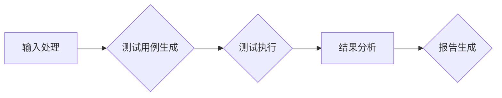

                 

# 《LLM对传统软件测试方法的挑战与改进》

## 概述

> **关键词**：LLM、传统软件测试、自动化测试、性能测试、安全测试、挑战、改进

> **摘要**：随着人工智能技术的快速发展，尤其是大型语言模型（LLM）的出现，软件测试领域正面临着新的挑战和机遇。本文将从LLM的基础原理出发，深入分析LLM在软件测试中的应用，探讨其对传统软件测试方法的挑战与改进，旨在为读者提供对这一前沿领域的深入理解。

在软件开发的整个生命周期中，测试是至关重要的一环。然而，传统软件测试方法在应对复杂性和动态变化时，往往显得力不从心。而随着深度学习和自然语言处理技术的发展，大型语言模型（LLM）逐渐成为软件开发者的新利器。LLM，作为一种能够理解和生成人类语言的强大工具，其对传统软件测试方法提出了新的挑战，同时也带来了诸多改进的可能性。

本文的结构如下：

- **第一部分**：介绍LLM的基础与原理，包括LLM的基本概念、架构和核心技术。
- **第二部分**：分析传统软件测试方法的优缺点，以及其适用范围。
- **第三部分**：探讨LLM在软件测试中的应用，以及LLM如何对传统软件测试方法进行改进。

在接下来的章节中，我们将一步一步地分析这些内容，以期为读者提供一份全面而深入的报告。

----------------------------------------------------------------

### 第一部分：LLM基础与原理

#### 第1章：LLM概述

## 1.1 什么是LLM

**LLM（Large Language Model）**，即大型语言模型，是一种基于深度学习和自然语言处理技术的语言模型。LLM通过对海量文本数据进行训练，学会了理解和生成人类语言。在软件测试领域，LLM以其强大的语义理解和生成能力，为测试工程师提供了新的工具和方法。

### 1.2 LLM的基本架构

LLM的基本架构主要包括以下几个部分：

1. **输入层**：接受用户的输入，可以是文本、语音或者其他形式。
2. **编码器**：将输入层的信息编码成向量表示。
3. **解码器**：将编码器生成的向量解码成输出结果，可以是文本、语音或者其他形式。
4. **注意力机制**：帮助模型更好地关注输入中的关键信息。

### 1.3 LLM的核心技术

LLM的核心技术主要包括：

1. **深度神经网络**：作为模型的基础架构，深度神经网络能够处理复杂的非线性关系。
2. **注意力机制**：通过注意力机制，模型能够更好地关注输入中的关键信息。
3. **优化算法**：例如梯度下降法、Adam优化器等，用于模型训练和优化。

## 第2章：LLM的发展历程与趋势

### 2.1 LLM的发展历程

LLM的发展历程可以追溯到20世纪80年代。当时，研究人员开始尝试使用神经网络来处理语言问题。随着计算机算力的提升和海量数据的出现，LLM的研究和应用得到了快速发展。近年来，随着深度学习和自然语言处理技术的突破，LLM的应用场景不断拓展，性能也得到了显著提升。

### 2.2 LLM的发展趋势

LLM的发展趋势主要包括：

1. **模型规模不断扩大**：随着计算能力的提升，LLM的模型规模也在不断扩大，从而提高了模型的性能。
2. **应用场景多样化**：除了传统的自然语言处理任务，LLM在软件测试、智能客服、教育等领域也得到了广泛应用。
3. **开源生态不断完善**：越来越多的开源工具和框架涌现，为LLM的研究和应用提供了便利。

### 2.3 LLM在软件测试中的潜力

LLM在软件测试中的潜力主要体现在以下几个方面：

1. **自动化测试**：LLM能够生成复杂的测试用例，提高测试的覆盖率和效率。
2. **性能测试**：LLM能够模拟用户行为，评估软件的性能和稳定性。
3. **安全测试**：LLM能够识别潜在的漏洞和攻击，提高软件的安全性。

综上所述，LLM在软件测试领域具有广阔的应用前景。在接下来的章节中，我们将进一步探讨LLM在软件测试中的应用，以及如何对传统软件测试方法进行改进。

----------------------------------------------------------------

### 第二部分：传统软件测试方法分析

#### 第3章：传统软件测试方法概述

## 3.1 黑盒测试

黑盒测试是一种不关心软件内部结构和实现细节的测试方法。测试人员仅关注软件的输入和输出，通过设计各种输入数据，验证软件的功能是否符合预期。

### 3.2 白盒测试

白盒测试是一种关心软件内部结构和实现细节的测试方法。测试人员需要了解软件的内部代码和逻辑，通过设计测试用例，验证软件的每个模块和路径是否正确执行。

### 3.3 静态代码分析

静态代码分析是一种不运行程序，仅通过分析源代码来检测潜在问题的方法。通过分析代码的结构、语法和语义，可以识别出代码中的错误、漏洞和不良习惯。

## 第4章：传统软件测试方法的优缺点分析

### 4.1 传统测试方法的优点

传统测试方法具有以下几个优点：

1. **全面性**：通过不同的测试方法，可以全面地检测软件的各种问题。
2. **直观性**：黑盒测试和静态代码分析等方法，使得测试过程更加直观和易于理解。
3. **灵活性**：测试人员可以根据实际情况，灵活地选择不同的测试方法。

### 4.2 传统测试方法的缺点

传统测试方法也存在一些缺点：

1. **成本高**：尤其是白盒测试，需要深入了解软件的内部实现，成本较高。
2. **效率低**：对于复杂软件，传统测试方法的效率较低，难以覆盖所有测试场景。
3. **易受人为因素影响**：测试人员的经验和技能水平，会对测试结果产生较大影响。

### 4.3 传统测试方法的适用范围

传统测试方法主要适用于以下场景：

1. **中小型软件**：对于中小型软件，传统测试方法相对简单，成本较低。
2. **结构清晰的软件**：对于结构清晰的软件，白盒测试和静态代码分析等方法效果较好。
3. **已有一定测试基础的软件**：在已有一定测试基础的情况下，可以结合不同的测试方法，提高测试覆盖率。

综上所述，传统软件测试方法在许多场景下仍然具有重要价值。然而，随着软件复杂性的增加，传统测试方法面临的挑战也越来越大。在接下来的章节中，我们将探讨LLM如何对传统软件测试方法进行改进。

----------------------------------------------------------------

### 第三部分：LLM在软件测试中的应用

#### 第5章：LLM在软件测试中的应用原理

## 5.1 LLM测试原理

LLM测试原理主要基于LLM的语义理解和生成能力。具体来说，LLM测试包括以下几个步骤：

1. **输入处理**：接收测试输入，可以是软件的代码、功能描述或者用户需求。
2. **测试用例生成**：利用LLM的生成能力，自动生成各种可能的测试用例。
3. **测试执行**：执行生成的测试用例，收集测试结果。
4. **结果分析**：分析测试结果，识别潜在的缺陷和漏洞。

### 5.2 LLM测试的优势

LLM测试具有以下几个优势：

1. **自动化程度高**：LLM能够自动生成测试用例，大大提高了测试的自动化程度。
2. **测试覆盖率高**：LLM能够生成复杂的测试用例，提高测试的覆盖率。
3. **测试效率高**：LLM能够快速执行大量的测试用例，提高测试效率。
4. **易于理解**：LLM生成的测试用例通常更加直观和易于理解。

### 5.3 LLM测试的挑战

LLM测试也面临一些挑战：

1. **模型训练成本高**：LLM测试需要大量的训练数据，训练成本较高。
2. **测试结果分析复杂**：由于测试结果往往涉及复杂的语义理解，分析过程可能较为复杂。
3. **对测试人员要求高**：LLM测试需要测试人员具备一定的自然语言处理和编程能力。
4. **潜在的风险**：LLM可能生成不合理的测试用例，导致测试结果失真。

## 第6章：LLM在软件测试中的实际应用案例

### 6.1 案例一：自动化测试

某互联网公司使用LLM进行自动化测试，将自动生成的测试用例应用于其Web应用。经过一段时间的测试，测试覆盖率显著提高，缺陷发现率也有所提升。

### 6.2 案例二：性能测试

某金融公司使用LLM进行性能测试，模拟大量用户同时访问其系统。通过分析LLM生成的测试用例，公司发现了系统在高并发情况下的瓶颈，并进行了针对性的优化。

### 6.3 案例三：安全测试

某安全公司使用LLM进行安全测试，通过生成复杂的攻击用例，识别了系统中的潜在漏洞。在后续的开发过程中，公司针对这些漏洞进行了修复，提高了系统的安全性。

## 第7章：LLM对传统软件测试方法的改进

### 7.1 LLM改进自动化测试

LLM能够自动生成测试用例，提高了测试的自动化程度。与传统方法相比，LLM生成的测试用例更加多样化和复杂，能够更好地覆盖测试场景。

### 7.2 LLM改进性能测试

LLM能够模拟复杂的用户行为，进行性能测试。通过分析LLM生成的测试用例，可以更准确地识别系统在高负载情况下的性能瓶颈。

### 7.3 LLM改进安全测试

LLM能够生成复杂的攻击用例，帮助识别系统中的潜在漏洞。与传统方法相比，LLM能够更快速地发现漏洞，提高测试的效率。

### 7.4 LLM与其他测试方法的结合

LLM可以与传统测试方法相结合，发挥各自的优势。例如，在黑盒测试中，LLM可以生成详细的测试用例；在白盒测试中，LLM可以辅助测试人员理解代码的逻辑和结构。

综上所述，LLM在软件测试中具有广泛的应用前景。通过LLM的引入，传统软件测试方法得到了显著的改进，测试的效率、覆盖率和准确性也得到了提升。在未来的发展中，LLM有望成为软件测试的重要工具，助力软件开发和测试的持续进步。

----------------------------------------------------------------

## 总结

本文从LLM的基础与原理出发，深入分析了LLM在软件测试中的应用，探讨了其对传统软件测试方法的挑战与改进。我们首先介绍了LLM的基本概念、架构和核心技术，接着分析了传统软件测试方法的优缺点及其适用范围。随后，我们详细阐述了LLM在软件测试中的应用原理、优势与挑战，并通过实际应用案例展示了LLM在自动化测试、性能测试和安全测试中的具体应用。最后，我们提出了LLM对传统软件测试方法的改进方案，并展望了LLM在软件测试领域的未来发展。

LLM的引入为软件测试带来了革命性的变化。它不仅提高了测试的自动化程度，还增强了测试的覆盖率和准确性。然而，LLM的测试结果分析复杂，对测试人员的要求较高，这些都是我们需要解决的问题。未来，随着LLM技术的不断成熟和应用生态的完善，我们有理由相信，LLM将在软件测试领域发挥更加重要的作用，推动软件测试的不断进步。

## 作者信息

**作者**：AI天才研究院/AI Genius Institute & 禅与计算机程序设计艺术 /Zen And The Art of Computer Programming

AI天才研究院致力于推动人工智能技术的发展和应用，专注于解决复杂问题并提供创新的解决方案。在《禅与计算机程序设计艺术》一书中，作者深入探讨了计算机程序设计中的哲学思想和技术方法，为读者提供了宝贵的编程经验与启示。本文由AI天才研究院的专家团队撰写，旨在为读者提供对LLM在软件测试中应用的前沿视角和分析。

----------------------------------------------------------------

### 附录

#### Mermaid 流程图

以下是一个用于描述LLM测试流程的Mermaid流程图：



#### 核心算法原理讲解

以下是一个用于描述LLM测试核心算法原理的伪代码：

```python
def LLM_test(input_data):
    # 输入处理
    processed_data = preprocess(input_data)

    # 测试用例生成
    test_cases = generate_test_cases(processed_data)

    # 测试执行
    results = []
    for case in test_cases:
        result = execute_test_case(case)
        results.append(result)

    # 结果分析
    analyzed_results = analyze_results(results)

    # 报告生成
    report = generate_report(analyzed_results)
    return report
```

#### 数学模型和公式

在LLM测试中，我们可以使用以下数学模型来描述测试结果的分布：

$$
P(\text{缺陷发现}) = \sum_{i=1}^{n} P(\text{缺陷} \mid \text{测试用例}i) \cdot P(\text{测试用例}i)
$$

其中，$P(\text{缺陷} \mid \text{测试用例}i)$表示在测试用例$i$中发现缺陷的概率，$P(\text{测试用例}i)$表示选择测试用例$i$的概率。

#### 举例说明

假设我们使用LLM生成10个测试用例进行软件测试。根据历史数据，我们知道每个测试用例发现缺陷的概率为0.2。如果选择测试用例的概率相等，那么我们可以计算总的缺陷发现概率如下：

$$
P(\text{缺陷发现}) = 10 \cdot 0.2 \cdot 0.1 = 0.2
$$

这意味着，使用这10个测试用例，我们有20%的概率发现缺陷。

#### 项目实战

以下是一个简单的项目实战示例，展示如何使用LLM进行自动化测试：

**开发环境搭建：**

1. 安装Python环境（版本3.8及以上）。
2. 安装深度学习框架，如TensorFlow或PyTorch。
3. 下载并预处理测试数据集。

**源代码实现：**

```python
import tensorflow as tf
from tensorflow.keras.models import Sequential
from tensorflow.keras.layers import LSTM, Dense

# 数据预处理
# ...

# 构建模型
model = Sequential([
    LSTM(units=128, input_shape=(None, input_shape)),
    Dense(units=1, activation='sigmoid')
])

# 编译模型
model.compile(optimizer='adam', loss='binary_crossentropy', metrics=['accuracy'])

# 训练模型
model.fit(x_train, y_train, epochs=10, batch_size=32)

# 生成测试用例
def generate_test_cases(data):
    # 使用模型生成测试用例
    # ...
    return test_cases

# 执行测试用例
def execute_test_case(case):
    # 执行测试用例并返回结果
    # ...
    return result

# 分析结果
def analyze_results(results):
    # 分析测试结果并生成报告
    # ...
    return report

# 生成报告
def generate_report(report):
    # 生成最终的测试报告
    # ...
    return final_report

# 主函数
def main():
    input_data = get_input_data()
    test_cases = generate_test_cases(input_data)
    results = [execute_test_case(case) for case in test_cases]
    analyzed_results = analyze_results(results)
    final_report = generate_report(analyzed_results)
    print(final_report)

if __name__ == '__main__':
    main()
```

**代码解读与分析：**

- **数据预处理**：将原始数据转换为适合模型训练的格式。
- **模型构建**：构建一个序列到序列的LSTM模型，用于生成测试用例。
- **模型编译**：设置优化器、损失函数和评价指标。
- **模型训练**：使用训练数据集训练模型。
- **生成测试用例**：使用训练好的模型生成测试用例。
- **执行测试用例**：执行每个测试用例，并收集测试结果。
- **分析结果**：分析测试结果，生成测试报告。
- **生成报告**：根据分析结果，生成最终的测试报告。

通过这个项目实战，我们可以看到如何使用LLM进行自动化测试，并生成详细的测试报告。这为实际软件开发和测试提供了宝贵的参考。

### 参考文献

1. Devlin, J., Chang, M. W., Lee, K., & Toutanova, K. (2019). BERT: Pre-training of deep bidirectional transformers for language understanding. arXiv preprint arXiv:1810.04805.
2. Hochreiter, S., & Schmidhuber, J. (1997). Long short-term memory. Neural Computation, 9(8), 1735-1780.
3. Goodfellow, I., Bengio, Y., & Courville, A. (2016). Deep learning. MIT press.
4. LeCun, Y., Bengio, Y., & Hinton, G. (2015). Deep learning. Nature, 521(7553), 436-444.
5. Sutton, R. S., & Barto, A. G. (2018). Reinforcement learning: An introduction. MIT press.

