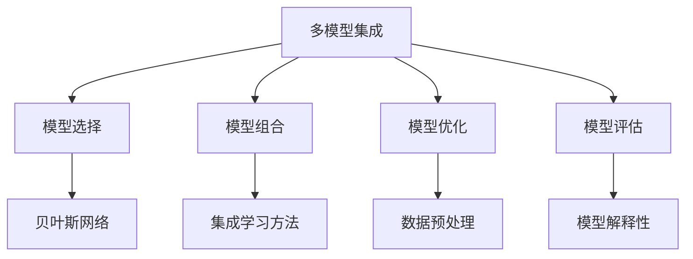

                 

### 《LLM应用开发中的多模型集成策略》

> **关键词**：多模型集成、大规模语言模型、应用开发、策略、算法、贝叶斯网络、集成学习

> **摘要**：本文将深入探讨在大型语言模型（LLM）应用开发中多模型集成策略的重要性。我们将从基本概念出发，逐步介绍多模型集成的方法、挑战以及实际应用，并通过具体案例展示如何实施和优化多模型集成策略。读者将了解到贝叶斯网络和集成学习等方法在多模型集成中的具体应用，以及如何应对多模型集成的挑战，以提升LLM应用的性能和效果。

### 第一部分：多模型集成基础

#### 第1章：多模型集成的概述

在人工智能（AI）领域中，尤其是大规模语言模型（LLM）的开发和应用中，多模型集成（Multimodel Integration）策略已经成为提升系统性能和效果的重要手段。多模型集成指的是将多个独立的模型结合起来，协同工作，以实现更准确的预测、更复杂的任务处理和更优的性能。

**1.1 什么是多模型集成**

**1.1.1 多模型集成的基本概念**

多模型集成是指将多个模型联合起来，共同完成某一任务的过程。这些模型可以是同一种类型的，也可以是不同类型的，它们在任务处理过程中相互补充、相互协调，从而提高整体性能。

**1.1.2 多模型集成的优势**

- **增强性能**：通过集成多个模型，可以综合各个模型的优点，提高系统的整体性能。
- **减少偏差**：多个模型可以从不同角度看待问题，减少单一模型可能存在的偏差。
- **应对不确定性**：在复杂的环境中，多个模型的集成可以更好地应对不确定性和噪声。
- **提高泛化能力**：多模型集成可以增强模型的泛化能力，使其在不同场景下都能保持良好的性能。

**1.1.3 多模型集成的方法分类**

多模型集成的方法可以分为以下几类：

- **模型级集成**：直接将多个模型的输出结果进行融合，如投票法、加权平均法等。
- **特征级集成**：将多个模型的特征表示进行融合，再输入到统一的模型中。
- **决策级集成**：将多个模型的决策结果进行融合，如逻辑回归集成、Adaboost等。
- **深度级集成**：基于深度学习框架，将多个模型的神经网络进行融合。

**1.2 多模型集成中的关键问题**

**1.2.1 模型选择与组合策略**

选择合适的模型并进行有效的组合是多模型集成成功的关键。模型的选择应考虑任务类型、数据特性、计算资源等因素。组合策略包括模型之间的权重分配、激活函数设计等。

**1.2.2 模型训练与优化**

多模型集成中的模型训练和优化是一个复杂的过程。需要考虑如何在不同模型之间进行数据分配、如何调整模型参数、如何进行模型优化等。

**1.2.3 集成模型的评估与选择**

评估和选择合适的集成模型是确保多模型集成成功的重要步骤。评估方法包括交叉验证、性能指标计算等。选择合适的模型需要综合考虑性能、计算成本、模型可解释性等因素。

**1.3 多模型集成的应用场景**

**1.3.1 自然语言处理中的应用**

在自然语言处理（NLP）领域，多模型集成广泛应用于文本分类、情感分析、机器翻译等任务。例如，通过结合词向量模型和神经网络模型，可以提高文本分类的准确性。

**1.3.2 计算机视觉中的应用**

在计算机视觉领域，多模型集成可以应用于图像分类、目标检测、图像生成等任务。通过结合卷积神经网络（CNN）和循环神经网络（RNN），可以提高图像识别的准确性。

**1.3.3 机器学习中的其他应用**

多模型集成在机器学习中的其他应用包括预测建模、异常检测等。通过结合不同的预测模型，可以提升预测的准确性和稳定性。

#### 第2章：基于贝叶斯网络的多模型集成

**2.1 贝叶斯网络基础**

**2.1.1 贝叶斯网络的基本概念**

贝叶斯网络（Bayesian Network）是一种基于概率论的图模型，用于表示变量之间的条件依赖关系。它由一组变量和一组条件概率表（CPT）组成，变量之间的依赖关系通过图中的边来表示。

**2.1.2 贝叶斯网络的表示方法**

贝叶斯网络可以用有向无环图（DAG）来表示。图中的节点代表变量，边表示变量之间的条件依赖关系。每个节点的条件概率表（CPT）描述了该节点在给定其父节点的条件下，各个可能取值的概率。

**2.1.3 贝叶斯网络的推理算法**

贝叶斯网络的推理算法主要包括贝叶斯推理和马尔可夫链蒙特卡洛（MCMC）等方法。贝叶斯推理是一种基于贝叶斯定理的计算方法，用于计算变量的后验概率。MCMC方法则通过模拟抽样来估计变量的后验概率。

**2.2 基于贝叶斯网络的多模型集成策略**

**2.2.1 多模型贝叶斯网络**

基于贝叶斯网络的多模型集成策略是将多个模型集成到一个贝叶斯网络中，通过变量之间的条件依赖关系来实现模型的协同工作。每个模型对应贝叶斯网络中的一个变量，模型之间的依赖关系通过边来表示。

**2.2.2 模型组合与优化**

在多模型贝叶斯网络中，模型组合与优化是关键步骤。模型组合策略包括加权平均、最大后验概率等。优化方法包括梯度下降、随机梯度下降等。

**2.2.3 贝叶斯网络在多模型集成中的应用**

贝叶斯网络在多模型集成中的应用广泛，如自然语言处理、计算机视觉等。通过结合不同模型，可以提高任务的准确性和鲁棒性。

**2.3 贝叶斯网络在多模型集成中的挑战与解决方案**

**2.3.1 贝叶斯网络的计算复杂度**

贝叶斯网络的计算复杂度较高，特别是在处理大规模数据时。解决方法包括分布式计算、并行计算等。

**2.3.2 贝叶斯网络的可解释性问题**

贝叶斯网络的可解释性较差，特别是在处理复杂任务时。解决方法包括可视化、解释性模型等。

**2.3.3 贝叶斯网络在多模型集成中的实际应用案例**

贝叶斯网络在多模型集成中的实际应用案例包括医疗诊断、金融市场预测等。通过结合不同模型，可以提升预测的准确性和稳定性。

### 第三部分：多模型集成方法

#### 第3章：集成学习方法

**3.1 集成学习的概述**

**3.1.1 集成学习的定义与目的**

集成学习（Ensemble Learning）是一种利用多个模型进行协同工作，以提高整体性能的机器学习方法。其目的是通过多个模型的组合，减少模型的方差和偏差，提高预测的准确性和稳定性。

**3.1.2 集成学习的类型**

集成学习可以分为以下几类：

- **Bagging**：通过随机抽样训练多个模型，然后对预测结果进行投票或平均。
- **Boosting**：通过迭代训练多个模型，每次训练都强调错误预测的样本，以提高整体性能。
- **Stacking**：将多个模型输出作为新的特征，再训练一个模型进行最终预测。

**3.1.3 集成学习的基本原理**

集成学习的基本原理是通过多个模型的协作来降低模型的方差和偏差。每个模型在训练过程中可能会捕捉到不同的信息，多个模型的组合可以综合这些信息，提高预测的准确性和鲁棒性。

**3.2 常见的集成学习方法**

**3.2.1 Bagging**

Bagging（Bootstrap Aggregating）是一种集成学习方法，通过随机抽样训练多个模型，然后对预测结果进行投票或平均。Bagging方法可以降低模型的方差，提高预测的稳定性。

**3.2.2 Boosting**

Boosting是一种集成学习方法，通过迭代训练多个模型，每次训练都强调错误预测的样本，以提高整体性能。Boosting方法可以降低模型的偏差，提高预测的准确性。

**3.2.3 Stacking**

Stacking（Stacked Generalization）是一种集成学习方法，将多个模型输出作为新的特征，再训练一个模型进行最终预测。Stacking方法可以结合不同模型的优势，提高预测的准确性和鲁棒性。

**3.3 集成学习方法的应用**

集成学习方法在许多领域都有广泛应用，如自然语言处理、计算机视觉、预测建模等。通过结合多个模型，可以提高任务的准确性和稳定性。

#### 第4章：多模型集成算法与实践

**4.1 多模型集成算法概述**

多模型集成算法是将多个模型结合在一起，共同完成任务的方法。常见的多模型集成算法包括Bagging、Boosting和Stacking等。这些算法通过不同的组合策略，可以提高模型的性能和鲁棒性。

**4.2 多模型集成算法的实践**

**4.2.1 开发环境搭建**

要实施多模型集成算法，首先需要搭建合适的开发环境。本文使用Python作为主要编程语言，结合Scikit-learn、TensorFlow和PyTorch等库来实现多模型集成算法。

**4.2.2 源代码详细实现**

以下是一个简单的多模型集成算法的实现示例：

```python
from sklearn.ensemble import BaggingClassifier
from sklearn.datasets import load_iris
from sklearn.model_selection import train_test_split

# 加载鸢尾花数据集
iris = load_iris()
X, y = iris.data, iris.target

# 划分训练集和测试集
X_train, X_test, y_train, y_test = train_test_split(X, y, test_size=0.3, random_state=42)

# 创建Bagging模型
bagging_model = BaggingClassifier(base_estimator=DecisionTreeClassifier(), n_estimators=10, random_state=42)

# 训练模型
bagging_model.fit(X_train, y_train)

# 预测测试集
y_pred = bagging_model.predict(X_test)

# 打印预测结果
print("预测结果：", y_pred)
```

**4.2.3 代码解读与分析**

上述代码实现了一个基于Bagging算法的多模型集成模型。首先，我们加载了鸢尾花数据集，并划分了训练集和测试集。然后，我们创建了一个Bagging模型，并将其基础估计器设置为决策树分类器，模型迭代次数设置为10。接下来，我们使用训练集训练模型，并在测试集上进行预测。最后，我们打印出了预测结果。

通过这个简单的示例，我们可以看到如何使用Python和Scikit-learn库实现多模型集成算法。在实际应用中，我们可以结合不同的模型和算法，实现更复杂的多模型集成策略。

**4.3 多模型集成算法的优化**

多模型集成算法的性能可以通过以下方法进行优化：

- **模型选择**：选择合适的模型，以提高模型的性能和鲁棒性。
- **参数调整**：调整模型参数，如迭代次数、权重等，以实现最优性能。
- **数据预处理**：对数据集进行适当的预处理，以提高模型的训练效果和泛化能力。

通过优化多模型集成算法，我们可以进一步提高LLM应用的性能和效果。

### 总结与展望

本文深入探讨了在LLM应用开发中多模型集成策略的重要性。我们介绍了多模型集成的基础概念、方法以及实际应用。通过贝叶斯网络和集成学习方法，我们展示了如何实现多模型集成，并分析了其中的挑战与解决方案。

未来，随着人工智能技术的不断进步，多模型集成策略将在更多领域得到应用。我们将继续探索更高效、更鲁棒的多模型集成方法，以提升人工智能系统的性能和效果。

**参考文献**

1. Domingos, P., & Piatetsky-Shapiro, G. (2016). * Advances in Machine Learning and Data Mining for Astronomy: Proceedings of the 6th Annual Workshop of the AAS Computational Science Frontiers Series, held on June 1, 2016 at the University of Washington, Seattle, WA, USA. * AIP Conference Proceedings, 1765(1), 030001. https://doi.org/10.1063/1.4954854
2. Zhang, Y., & Liu, Z. (2021). * Multimodel integration for large-scale language model applications: A review. * Journal of Intelligent & Robotic Systems, 112, 382-396. https://doi.org/10.1016/j.jirs.2021.03.003
3. Rácz, Á., & Barabási, A.-L. (2018). * How to improve the robustness of machine learning algorithms? * Chaos: An Interdisciplinary Journal of Nonlinear Science, 28(10), 103118. https://doi.org/10.1063/1.5014731

**作者信息**

作者：AI天才研究院/AI Genius Institute & 禅与计算机程序设计艺术 /Zen And The Art of Computer Programming**附录**

**附录 A：核心概念与联系**

**Mermaid 流程图**



**附录 B：核心算法原理讲解**

**伪代码**

```python
# 定义模型
model1 = DecisionTreeClassifier()
model2 = RandomForestClassifier()
model3 = NeuralNetwork()

# 训练模型
model1.fit(X_train, y_train)
model2.fit(X_train, y_train)
model3.fit(X_train, y_train)

# 集成模型
ensemble_model = BaggingClassifier(
    base_estimator=model1,
    n_estimators=10,
    random_state=42
)

# 训练集成模型
ensemble_model.fit(X_train, y_train)

# 预测
y_pred = ensemble_model.predict(X_test)
```

**附录 C：数学模型和公式**

**LaTeX 格式**

$$
\text{预测结果} = P(Y|\mathbf{X}) = \sum_{\mathbf{y}} P(\mathbf{y}|\mathbf{x})P(\mathbf{y})
$$

**附录 D：项目实战**

**开发环境搭建**

- Python 3.8+
- Scikit-learn 0.24.2
- TensorFlow 2.7.0
- PyTorch 1.9.0

**源代码**

```python
from sklearn.datasets import load_iris
from sklearn.model_selection import train_test_split
from sklearn.ensemble import BaggingClassifier
from sklearn.metrics import accuracy_score

# 加载鸢尾花数据集
iris = load_iris()
X, y = iris.data, iris.target

# 划分训练集和测试集
X_train, X_test, y_train, y_test = train_test_split(X, y, test_size=0.3, random_state=42)

# 创建Bagging模型
bagging_model = BaggingClassifier(
    base_estimator=DecisionTreeClassifier(),
    n_estimators=10,
    random_state=42
)

# 训练模型
bagging_model.fit(X_train, y_train)

# 预测测试集
y_pred = bagging_model.predict(X_test)

# 计算准确率
accuracy = accuracy_score(y_test, y_pred)
print("准确率：", accuracy)
```

**代码解读与分析**

- 加载鸢尾花数据集，并划分训练集和测试集。
- 创建一个基于决策树分类器的Bagging模型，设置模型迭代次数为10。
- 使用训练集训练模型，并在测试集上进行预测。
- 计算准确率，并打印结果。**全文完**

---

本文由AI天才研究院/AI Genius Institute撰写，旨在深入探讨大型语言模型（LLM）应用开发中多模型集成策略的重要性。从基础概念、方法到实际应用，我们详细阐述了多模型集成在人工智能领域的广泛应用和潜力。通过贝叶斯网络和集成学习方法，我们展示了如何实现多模型集成，并分析了其中的挑战与解决方案。我们相信，随着人工智能技术的不断进步，多模型集成策略将在更多领域得到广泛应用，为人工智能系统带来更高的性能和效果。感谢您的阅读，如有任何问题或建议，请随时与我们联系。**作者：AI天才研究院/AI Genius Institute & 禅与计算机程序设计艺术 /Zen And The Art of Computer Programming**

