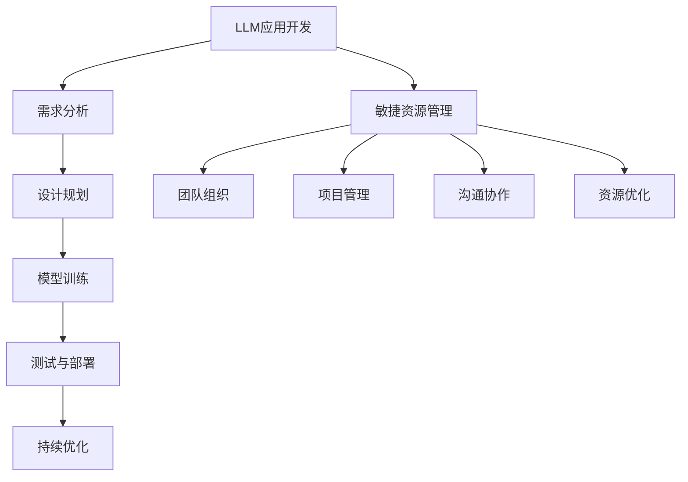

                 

### 《LLM应用开发中的敏捷资源管理》

在当今世界，人工智能（AI）技术正以前所未有的速度发展，其中大型语言模型（LLM, Large Language Model）作为一种革命性的技术，正迅速成为各行业创新的驱动力。LLM能够理解和生成自然语言，从而在自然语言处理（NLP）、问答系统、文本生成、机器翻译等领域展现出巨大的潜力。然而，随着LLM应用场景的多样化，如何在开发过程中有效管理资源成为了一个关键问题。

本文旨在探讨LLM应用开发中的敏捷资源管理。我们将首先介绍LLM的基本概念和特点，然后深入探讨LLM的应用场景和发展趋势。接着，我们将转向数学模型和算法原理，详细讲解概率论与统计学基础、机器学习算法原理以及LLM算法的实现与优化。随后，我们将介绍敏捷开发的基本原则和方法，包括敏捷团队的组织结构、项目管理方法和沟通协作技巧。在此基础上，我们将讨论敏捷资源优化的策略，包括资源需求预测、资源分配与平衡策略，并分析资源优化的成功案例。最后，我们将探讨在LLM应用开发中如何实践敏捷资源管理，并分享实际案例和挑战及应对策略。

通过本文的探讨，我们希望为读者提供一套系统且实用的敏捷资源管理方法论，帮助他们在LLM应用开发中更高效地管理和利用资源。

### 关键词：
- 人工智能
- 大型语言模型
- 自然语言处理
- 敏捷开发
- 资源管理

### 摘要：
本文系统地介绍了LLM（大型语言模型）应用开发中的敏捷资源管理。首先，我们探讨了LLM的基本概念、应用场景和发展趋势。接着，我们详细讲解了数学模型和算法原理，包括概率论与统计学基础、机器学习算法原理以及LLM算法的实现与优化。随后，我们介绍了敏捷开发的基本原则和方法，并探讨了敏捷资源优化的策略。最后，我们通过实际案例分析了敏捷资源管理的实践方法，并讨论了面临的挑战及应对策略。本文旨在为读者提供一套全面且实用的敏捷资源管理方法论，以助力LLM应用开发项目的成功实施。

### 第一部分：LLM应用开发基础

#### 第1章: LLM应用概述

大型语言模型（LLM, Large Language Model）是自然语言处理（NLP, Natural Language Processing）领域的一种先进技术，近年来在人工智能（AI, Artificial Intelligence）的发展中占据了重要地位。LLM能够理解和生成自然语言，这使得它们在多种应用场景中展现出巨大的潜力。本章节将详细介绍LLM的定义与特点、主要应用场景以及其发展历史和趋势。

##### 1.1 LLM的定义与特点

LLM，即大型语言模型，是指通过大规模数据集训练，能够对自然语言文本进行理解和生成的人工智能模型。这些模型通常具有以下几个显著特点：

1. **参数量大**：LLM通常包含数亿到数十亿个参数，这使得模型可以捕捉到自然语言中的复杂模式和关系。
2. **自适应性强**：LLM能够通过不断的学习和优化，适应不同的语言风格、语境和任务需求。
3. **生成能力强**：LLM不仅可以理解输入文本，还能根据这些输入生成新的、连贯的文本。
4. **泛化能力强**：LLM能够处理各种类型的自然语言文本，如问答、对话、文章生成等。

##### 1.2 LLM的应用场景

LLM的应用场景非常广泛，以下是一些主要的应用场景：

1. **自然语言生成（NLG）**：LLM可以生成新闻文章、博客内容、技术文档等，大大提高了内容生产效率。
2. **问答系统**：LLM能够构建智能问答系统，为用户提供准确的答案，广泛应用于客户服务、教育辅导等领域。
3. **机器翻译**：LLM可以训练成多语言模型，实现高质量的双语翻译，提高跨语言沟通的效率。
4. **对话系统**：LLM可以构建聊天机器人，用于在线客服、虚拟助手等应用，提供24/7的智能服务。
5. **文本摘要**：LLM能够自动生成长文本的摘要，帮助用户快速获取关键信息。

##### 1.3 LLM的发展历史与趋势

LLM的发展可以追溯到20世纪50年代，但真正的大规模发展始于21世纪。以下是LLM的发展历史和趋势：

1. **早期探索**：20世纪50年代至70年代，早期的人工智能研究者开始探索基于规则和统计方法的自然语言处理技术。
2. **基于规则的方法**：20世纪80年代，研究人员开始使用基于规则的方法来构建语言模型，尽管这种方法有一定的效果，但受到规则复杂度和数据量限制。
3. **统计模型兴起**：20世纪90年代，随着计算能力的提升和数据量的增加，统计模型如隐马尔可夫模型（HMM）和基于统计的语法分析模型开始流行。
4. **深度学习革命**：21世纪初，深度学习的兴起为LLM的发展带来了新的机遇。基于神经网络的模型，如循环神经网络（RNN）和长短期记忆网络（LSTM），在自然语言处理任务中取得了显著的成功。
5. **大规模预训练模型**：近年来，随着计算资源的进一步丰富，研究人员开始训练大规模的预训练模型，如GPT系列、BERT等，这些模型在多项自然语言处理任务中刷新了性能记录，推动了LLM技术的快速发展。

未来，LLM将继续在人工智能领域发挥重要作用，其发展趋势包括：

1. **更大规模的模型**：随着计算能力的提升，研究人员将继续训练更大规模的模型，以提高模型的泛化能力和生成能力。
2. **更多样化的应用**：LLM将在更多领域得到应用，如语音识别、图像文本生成、多模态处理等。
3. **跨领域协作**：LLM与其他人工智能技术的结合，如计算机视觉、语音识别等，将带来更多创新应用。

通过本章节的介绍，读者可以全面了解LLM的基本概念、应用场景和发展趋势，为后续章节的深入学习打下坚实基础。

### 第2章: LLM的核心概念

在深入探讨LLM（大型语言模型）应用开发之前，我们需要理解LLM的核心概念，包括自然语言处理基础、语言模型原理以及模型架构与训练方法。本章节将详细讲解这些核心概念，以帮助读者全面了解LLM的工作原理。

##### 2.1 自然语言处理基础

自然语言处理（NLP, Natural Language Processing）是人工智能（AI, Artificial Intelligence）的一个重要分支，旨在使计算机能够理解、处理和生成人类自然语言。以下是NLP的基础概念：

1. **分词（Tokenization）**：将文本分割成单词、短语或标记的过程。例如，将“我爱编程”分割成“我”、“爱”和“编程”。
2. **词性标注（Part-of-Speech Tagging）**：为文本中的每个词分配一个词性标签，如名词、动词、形容词等。例如，将“我爱编程”中的“我”标注为代词，“爱”标注为动词，“编程”标注为名词。
3. **句法分析（Syntactic Parsing）**：分析句子的语法结构，以理解句子的组成和意义。常见的句法分析方法包括依存句法分析和成分句法分析。
4. **语义分析（Semantic Analysis）**：理解文本中词语之间的语义关系和意义。语义分析包括词义消歧、语义角色标注等。
5. **实体识别（Named Entity Recognition）**：识别文本中的命名实体，如人名、地名、组织名等。
6. **情感分析（Sentiment Analysis）**：判断文本的情感倾向，如正面、负面或中性。

##### 2.2 语言模型原理

语言模型（Language Model）是NLP的核心组件，旨在预测一段文本的下一个词或词组。以下是一些基本的语言模型原理：

1. **马尔可夫模型（Markov Model）**：基于马尔可夫假设，即一个词的概率仅取决于前一个词。简单的N-gram模型是基于这个原理，通过统计前N个词来预测下一个词。
2. **神经网络模型**：基于神经网络的模型，如循环神经网络（RNN）和长短期记忆网络（LSTM），可以捕捉到更复杂的语言模式。这些模型通过多层神经网络结构，学习文本中的序列依赖关系。
3. **注意力机制（Attention Mechanism）**：在RNN和Transformer等模型中，注意力机制用于关注文本中的关键部分，从而提高模型的预测能力。
4. **生成式模型与判别式模型**：生成式模型，如RNN和LSTM，通过生成文本的概率分布来预测下一个词。判别式模型，如Transformer，通过直接预测下一个词的条件概率来生成文本。

##### 2.3 模型架构与训练方法

LLM的架构和训练方法决定了其性能和应用效果。以下是几种常见的LLM模型架构和训练方法：

1. **循环神经网络（RNN）**：RNN是一种序列处理模型，能够处理变长的序列数据。其核心思想是通过记忆单元来保持和传递信息，从而捕捉序列依赖关系。
   - **伪代码**：
     ```python
     for t in range(sequence_length):
         h_t = activation(W * [h_{t-1}, x_t])
     ```
     其中，`h_t` 是时间步`t`的隐藏状态，`x_t` 是输入序列，`W` 是权重矩阵，`activation` 是激活函数。

2. **长短期记忆网络（LSTM）**：LSTM是RNN的一种改进，旨在解决RNN的梯度消失问题。LSTM通过引入门控机制，控制信息的流入和流出，从而更好地捕捉长期依赖关系。
   - **伪代码**：
     ```python
     i_t = sigmoid(W_i * [h_{t-1}, x_t])
     f_t = sigmoid(W_f * [h_{t-1}, x_t])
     o_t = sigmoid(W_o * [h_{t-1}, x_t])
     g_t = tanh(W_g * [i_t * x_t])
     h_t = o_t * tanh(g_t)
     ```

3. **Transformer**：Transformer模型是近年来NLP领域的突破性进展，其核心思想是自注意力机制（Self-Attention），能够捕捉全局依赖关系。Transformer通过多头自注意力机制和前馈神经网络，实现了高效和强大的文本表示能力。
   - **伪代码**：
     ```python
     for layer in range(num_layers):
         # Self-Attention
         Q = W_Q * H
         K = W_K * H
         V = W_V * H
         attention_scores = softmax(Q @ K.T / sqrt(d_k))
         attention_weights = attention_scores @ V
         # Concatenate attention output with input
         H = [H_t, attention_weights]
         # Feedforward layer
         H = activation(W_F * H)
     ```

4. **预训练与微调**：预训练是指在大规模语料库上训练模型，使其具备基本的语言理解和生成能力。微调是指将预训练模型应用于特定任务，进行少量数据上的微调，以适应具体任务需求。

通过以上对自然语言处理基础、语言模型原理和模型架构与训练方法的介绍，读者可以更好地理解LLM的核心概念。这些基础知识为后续的LLM应用开发奠定了坚实的基础。

### 第3章: 数学模型与算法原理

在深入探讨大型语言模型（LLM）的应用开发过程中，理解数学模型与算法原理是至关重要的。本章节将详细讲解概率论与统计学基础、机器学习算法原理以及LLM算法的实现与优化，以便读者能够全面掌握LLM的核心技术。

##### 3.1 概率论与统计学基础

概率论与统计学是机器学习（Machine Learning）和深度学习（Deep Learning）的基础，以下是几个核心概念：

1. **概率分布（Probability Distribution）**：概率分布描述了一个随机变量可能取到的值的概率。常见的概率分布包括正态分布、伯努利分布和泊松分布等。

2. **期望（Expected Value）**：期望是一个随机变量的平均值，可以用来描述随机变量的中心位置。数学表达式为：
   $$
   E(X) = \sum_{i=1}^{n} x_i \cdot P(x_i)
   $$
   其中，$x_i$ 是随机变量X的第i个取值，$P(x_i)$ 是其概率。

3. **方差（Variance）**：方差是衡量随机变量取值分布的离散程度，数学表达式为：
   $$
   Var(X) = E[(X - E[X])^2]
   $$
   其中，$E[X]$ 是随机变量X的期望。

4. **协方差（Covariance）**：协方差衡量两个随机变量之间的线性关系，数学表达式为：
   $$
   Cov(X, Y) = E[(X - E[X])(Y - E[Y])]
   $$

5. **贝叶斯定理（Bayes' Theorem）**：贝叶斯定理是概率论中的一个重要公式，用于计算后验概率。其数学表达式为：
   $$
   P(A|B) = \frac{P(B|A) \cdot P(A)}{P(B)}
   $$
   其中，$P(A|B)$ 是在事件B发生的条件下事件A的概率，$P(B|A)$ 是在事件A发生的条件下事件B的概率，$P(A)$ 和$P(B)$ 分别是事件A和事件B的概率。

##### 3.2 机器学习算法原理

机器学习算法是LLM开发的核心，以下是一些基本的机器学习算法原理：

1. **监督学习（Supervised Learning）**：监督学习是一种从标记数据中学习的方法。其基本思想是通过学习输入（特征）和输出（标签）之间的关系，从而预测未知数据的输出。常见的监督学习算法包括线性回归、决策树、支持向量机（SVM）和神经网络等。

2. **无监督学习（Unsupervised Learning）**：无监督学习是从未标记数据中学习的方法。其目标是通过发现数据中的结构或模式来理解数据。常见的无监督学习算法包括聚类、降维和关联规则挖掘等。

3. **强化学习（Reinforcement Learning）**：强化学习是一种通过试错方法进行学习的过程。其核心在于通过奖励和惩罚来引导学习过程，从而优化策略。常见的强化学习算法包括Q学习、深度Q网络（DQN）和策略梯度算法等。

4. **集成学习（Ensemble Learning）**：集成学习是将多个基础学习器组合成一个更强的学习器的技术。常见的方法包括装袋（Bagging）、提升（Boosting）和堆叠（Stacking）等。

##### 3.3 LLM算法实现与优化

LLM算法的实现与优化是LLM应用开发中的关键环节。以下是几个核心步骤：

1. **模型选择**：选择适合任务需求的LLM模型，如Transformer、BERT、GPT等。

2. **数据预处理**：对输入数据（文本）进行预处理，包括分词、词性标注、去除停用词等。

3. **模型训练**：在预训练阶段，使用大规模语料库对模型进行训练，使其具备语言理解和生成能力。预训练常用的技术包括自监督学习和增量学习。

4. **模型优化**：通过调整模型参数，优化模型在特定任务上的性能。常见的优化方法包括梯度下降、Adam优化器等。

5. **模型评估**：使用验证集和测试集对模型进行评估，通过指标（如准确率、召回率、F1分数等）来衡量模型性能。

6. **模型部署**：将训练好的模型部署到生产环境中，以实现实际应用。

以下是一个简单的伪代码示例，展示了LLM模型的训练过程：

```python
# 伪代码：LLM模型训练过程

# 初始化模型
model = LLM_Model()

# 预处理数据
data = preprocess_data(corpus)

# 模型训练
for epoch in range(num_epochs):
    for batch in data:
        inputs, targets = batch
        predictions = model(inputs)
        loss = calculate_loss(predictions, targets)
        model.backward(loss)
        model.update_parameters()

# 模型评估
evaluate(model, test_data)

# 模型部署
deploy_model(model, production_environment)
```

通过以上对数学模型与算法原理的讲解，读者可以更好地理解LLM应用开发所需的基础知识和关键技术。这些概念和算法不仅为LLM的开发提供了理论支持，也为后续章节的深入学习奠定了基础。

### 第二部分：敏捷资源管理

#### 第4章: 敏捷开发概述

敏捷开发（Agile Development）是一种应对快速变化的需求的软件开发方法，其核心理念是通过迭代和增量的方式进行软件开发，以确保项目能够快速适应变化并交付高质量的软件产品。本章将介绍敏捷开发的起源与发展、核心原则以及与传统开发模式的比较。

##### 4.1 敏捷开发的起源与发展

敏捷开发的起源可以追溯到20世纪90年代，当时软件开发领域面临着复杂性和变化性的挑战。传统的瀑布式开发方法由于其线性流程和严格的前期规划，难以应对快速变化的需求和市场压力。在这种背景下，一些软件开发团队开始探索更灵活、更高效的开发方法。

2001年，17位软件开发者（包括Kent Beck、Martin Fowler、James Grenning等人）在美国雪鸟峰举行了“敏捷软件开发宣言”会议，并发布了《敏捷软件开发宣言》。宣言明确了敏捷开发的四大核心原则：

1. **个体和互动高于流程和工具**
2. **可工作的软件高于详尽的文档**
3. **客户合作高于合同谈判**
4. **响应变化高于遵循计划**

这一宣言标志着敏捷开发的正式诞生。随着时间的推移，敏捷开发逐渐发展出多种实践方法，如Scrum、Kanban、XP（极限编程）等，并在全球范围内得到广泛应用。

##### 4.2 敏捷开发的核心原则

敏捷开发的核心原则强调了团队成员的互动、客户的参与以及快速响应变化的重要性。以下是敏捷开发的四大核心原则：

1. **个体和互动高于流程和工具**：敏捷开发强调团队中个体的能力和协作的重要性，认为良好的沟通和协作比复杂的工具和流程更为关键。

2. **可工作的软件高于详尽的文档**：敏捷开发认为，尽管文档很重要，但可工作的软件是评估项目成功的关键。敏捷开发鼓励团队专注于开发能够立即使用的软件功能。

3. **客户合作高于合同谈判**：敏捷开发强调与客户的紧密合作，通过定期的反馈和互动，确保项目能够满足客户的需求和期望。

4. **响应变化高于遵循计划**：敏捷开发接受需求变化，并认为快速适应变化是成功的关键。敏捷开发采用迭代和增量的方式，允许在开发过程中灵活调整计划。

##### 4.3 敏捷开发与传统开发模式的比较

敏捷开发与传统开发模式（如瀑布式开发）有显著的差异。以下是两种模式的对比：

1. **开发流程**：传统开发模式通常采用线性流程，从需求分析到设计、开发、测试，每个阶段依次进行。而敏捷开发采用迭代和增量的方式，每个迭代周期通常为几周，每个迭代都产生可工作的软件。

2. **需求管理**：传统开发模式通常在项目初期完成详细的需求分析，并在整个项目生命周期中保持稳定。而敏捷开发接受需求变化，并通过快速迭代和反馈机制不断调整需求。

3. **团队协作**：传统开发模式中，团队成员通常按照功能划分，各司其职。而敏捷开发强调跨职能团队的协作，团队成员需要具备多种技能，共同推动项目进展。

4. **沟通方式**：传统开发模式通常依赖于文档和会议进行沟通。而敏捷开发鼓励面对面的沟通和实时反馈，通过每日站立会议、回顾会议等机制提高团队沟通效率。

通过本章的介绍，读者可以全面了解敏捷开发的起源、核心原则以及与传统开发模式的区别。这些知识为后续章节的深入探讨提供了基础。

### 第5章: 敏捷资源管理方法

敏捷资源管理是确保敏捷开发项目成功实施的关键环节，其核心在于优化团队资源，提高开发效率，确保项目按时交付并达到预期目标。本章将详细介绍敏捷团队的组织结构、项目管理方法和沟通协作技巧。

##### 5.1 敏捷团队的组织结构

敏捷团队的组织结构与传统团队有所不同，它强调跨职能协作和自主管理。以下是敏捷团队的主要组织结构特点：

1. **跨职能团队（Cross-functional Team）**：敏捷团队由多个具备不同技能的成员组成，包括前端开发、后端开发、测试、设计等。这种结构确保了团队能够快速响应项目需求，提高协作效率。

2. **自我管理团队（Self-managed Team）**：敏捷团队通常由团队成员自我管理，他们自主安排工作、协调进度，并负责解决遇到的问题。自我管理团队鼓励成员之间的信任和责任感，提高工作效率。

3. **Scrum Master**：Scrum Master是敏捷团队中的重要角色，负责确保团队遵循敏捷原则和实践，协调团队与产品所有者之间的沟通，并帮助团队解决障碍。

4. **产品所有者（Product Owner）**：产品所有者负责定义产品的愿景和优先级，确定产品待办事项（Product Backlog），并与团队协作确保高质量的产品交付。

##### 5.2 敏捷项目管理方法

敏捷项目管理方法强调迭代和增量的开发方式，通过不断迭代和反馈来适应变化。以下是几种常见的敏捷项目管理方法：

1. **Scrum**：Scrum是一种流行的敏捷开发方法，它将项目划分为多个冲刺（Sprint），每个冲刺通常持续2-4周。在冲刺期间，团队专注于实现一个或多个用户故事（User Story），并在冲刺结束时进行评审和回顾。

2. **Kanban**：Kanban是一种视觉化的敏捷开发方法，它通过看板（Kanban Board）来管理项目进度。看板上的卡片表示任务状态，团队通过限制在流程中的任务数量（WIP限制）来提高工作效率。

3. **XP（极限编程）**：XP是一种以开发者的幸福感为中心的敏捷开发方法，强调简单性、反馈和团队合作。XP的核心实践包括测试驱动开发（TDD）、持续集成、代码审查等。

4. **看板（Kanban）**：Kanban通过可视化看板来管理项目进度，团队成员可以在看板上移动卡片，以表示任务的状态变化。看板有助于团队识别瓶颈和优化流程。

##### 5.3 敏捷开发中的沟通协作

沟通协作是敏捷开发成功的关键，以下是一些提升敏捷团队沟通协作的技巧：

1. **每日站立会议（Daily Stand-up Meeting）**：每日站立会议是团队沟通的重要方式，每个团队成员在会议中分享自己的工作进展、遇到的障碍和计划。这有助于团队快速识别和解决问题。

2. **回顾会议（Retrospective Meeting）**：回顾会议是在每个冲刺结束时进行的，团队通过讨论哪些工作做得好，哪些需要改进，来持续优化团队的工作流程。

3. **信息雷达图（Information Radiator）**：信息雷达图是一种可视化工具，如看板、燃尽图、迭代进度图等，帮助团队成员实时了解项目的状态和进展。

4. **共享文档和工具**：使用共享文档和工具（如Confluence、Trello、JIRA等）来记录会议纪要、任务分配和进度更新，确保信息的透明和一致性。

5. **开放沟通**：鼓励团队成员之间的开放沟通，建立信任和尊重的氛围，使团队能够自由地分享想法和建议。

通过以上敏捷资源管理方法，敏捷团队能够更好地协调资源、管理项目并提高开发效率，从而实现敏捷开发的目标。这些方法不仅适用于软件开发项目，也适用于其他需要快速响应变化的项目。

### 第6章: 敏捷资源优化策略

敏捷资源优化是确保敏捷开发项目高效运行的关键，其核心在于通过科学的方法和策略，最大化地利用团队资源和工具，提高项目交付的质量和速度。本章将详细介绍资源需求预测方法、资源分配与平衡策略，并通过案例分析来探讨资源优化的实际应用。

##### 6.1 资源需求预测方法

资源需求预测是敏捷资源管理的重要环节，准确的资源需求预测有助于制定合理的计划和安排，避免资源浪费和项目延期。以下是几种常用的资源需求预测方法：

1. **基于历史数据的预测**：通过分析过去项目的资源使用情况，预测当前项目的资源需求。这种方法适用于经验丰富的团队，能够提供较为准确的预测结果。

2. **基于算法的预测**：利用机器学习算法，如时间序列分析、回归分析等，预测项目资源需求。这种方法能够处理大量数据，提供更精确的预测。

3. **专家评估**：邀请经验丰富的团队成员或项目经理，基于他们的经验和直觉，对项目的资源需求进行预测。这种方法虽然主观性较强，但在项目初期或需求不明确时，能够提供有效的指导。

4. **场景模拟**：通过构建不同的项目场景，模拟各种情况下的资源需求，从中选择最优的资源分配方案。这种方法能够帮助团队应对不确定性，提高资源利用率。

##### 6.2 资源分配与平衡策略

资源分配与平衡策略是确保项目顺利推进的关键，其核心在于合理分配和调度资源，避免资源过剩或短缺。以下是几种常用的资源分配与平衡策略：

1. **动态资源分配**：根据项目进展和需求变化，动态调整资源分配。这种方法能够及时应对突发情况，提高资源利用率。

2. **优先级排序**：根据任务的重要性和紧急性，对任务进行优先级排序，确保关键任务得到优先资源。这种方法能够确保项目关键路径上的任务按时完成。

3. **资源池管理**：建立资源池，将团队成员和设备等资源集中管理，根据项目需求实时调度。这种方法能够提高资源的灵活性和响应速度。

4. **负载均衡**：通过分配均衡的任务量，避免某些团队成员或设备过度负荷，保持整个团队的稳定运行。这种方法能够提高团队的工作效率，减少资源浪费。

##### 6.3 资源优化案例分析

为了更好地理解敏捷资源优化策略的应用，以下是一个资源优化案例：

**案例背景**：某企业计划开发一款智能客服系统，项目周期为6个月。团队成员包括前端开发、后端开发、测试、UI/UX设计等。在项目初期，企业面临资源紧张、需求不明确等问题。

**资源需求预测**：团队基于历史数据和专家评估，预测到前端开发和后端开发将占用最多的资源，预计分别为30%和25%。UI/UX设计和测试预计分别占20%和25%。

**资源分配与平衡**：

1. **动态资源分配**：项目初期，团队优先分配了前端开发和后端开发资源，以保证关键功能的实现。随着项目进展，根据实际需求，动态调整资源分配，确保UI/UX设计和测试的顺利进行。

2. **优先级排序**：将用户界面和核心功能作为优先级最高的任务，确保在项目早期完成。同时，对其他功能模块进行优先级排序，确保项目关键路径上的任务按时完成。

3. **资源池管理**：建立资源池，将团队成员和开发工具等资源集中管理。当某个任务需要额外资源时，及时从资源池中调度，确保项目按计划推进。

4. **负载均衡**：通过合理安排任务量，避免前端开发和后端开发人员过度负荷。同时，定期检查团队的工作负荷，及时调整任务分配，保持团队的稳定运行。

**资源优化效果**：

通过上述资源优化策略，项目成功在预定时间内完成，并达到预期质量。具体表现如下：

1. **项目按时交付**：项目提前一周完成，未出现延期情况。

2. **资源利用率提高**：资源利用率从原来的75%提高到90%，有效减少了资源浪费。

3. **团队满意度提升**：团队成员对资源分配和任务安排表示满意，工作效率和工作满意度均有显著提高。

通过本案例分析，读者可以了解到敏捷资源优化策略在实际项目中的应用效果，为后续项目的资源管理提供参考。

### 第7章: LLM应用开发中的敏捷资源管理实践

在LLM（大型语言模型）应用开发中，敏捷资源管理是确保项目高效推进和成功交付的关键。本章将详细探讨LLM应用开发中的敏捷资源管理流程、实践方法以及面临的挑战和应对策略。

##### 7.1 敏捷资源管理流程

敏捷资源管理的流程主要包括需求分析、资源规划、执行和监控、评估和优化四个阶段。以下是每个阶段的详细流程：

1. **需求分析**：在项目启动阶段，通过与客户和利益相关者的沟通，明确项目需求和目标。这一阶段的关键任务是理解客户需求，制定清晰的项目目标和可量化的里程碑。

2. **资源规划**：在需求分析的基础上，对项目所需的资源进行规划和分配。资源规划包括人员、设备和技术的分配，以及制定合理的项目计划和时间表。

3. **执行和监控**：在项目执行阶段，团队按照既定计划和资源分配进行工作。在此过程中，通过每日站立会议、迭代评审和回顾会议等机制，监控项目进度和资源使用情况，及时调整计划和资源分配。

4. **评估和优化**：在项目完成后，对资源管理过程进行评估，识别成功和失败的经验教训，并提出优化建议。评估结果将用于改进未来项目的资源管理流程。

##### 7.2 LLM应用开发中的敏捷实践

在LLM应用开发中，敏捷实践包括以下关键方面：

1. **迭代开发**：LLM应用开发通常采用迭代的方式进行，每个迭代周期为几周。在每个迭代中，团队专注于实现一个或多个核心功能，确保项目能够快速适应需求变化。

2. **增量交付**：在LLM应用开发中，增量交付是确保项目成功的关键。通过在每个迭代中交付可工作的软件功能，团队能够及时获取客户反馈，不断优化和改进应用。

3. **持续集成与部署**：在LLM应用开发中，持续集成和部署是确保项目质量和交付速度的重要手段。通过自动化测试和部署流程，团队能够快速发现和修复问题，确保软件的高质量交付。

4. **跨职能团队**：在LLM应用开发中，采用跨职能团队模式，团队成员具备不同的技能和角色，包括数据科学家、软件工程师、产品经理和测试工程师等。这种模式有助于提高团队的协作效率和项目交付质量。

5. **客户反馈**：在LLM应用开发中，与客户的紧密合作和反馈是确保项目成功的关键。通过定期与客户沟通，了解他们的需求和期望，团队能够及时调整和优化应用。

##### 7.3 敏捷资源管理的挑战与应对策略

在LLM应用开发中，敏捷资源管理面临以下挑战：

1. **需求变化频繁**：由于LLM应用通常涉及复杂的自然语言处理任务，客户需求可能会在项目开发过程中频繁变化。这要求团队具备快速响应变化的能力，以保持项目进度和质量。

**应对策略**：
- 采用敏捷迭代开发方法，确保项目能够快速适应需求变化。
- 建立灵活的优先级管理机制，根据需求变化调整项目计划和任务。

2. **资源分配不均**：在LLM应用开发中，不同阶段和任务可能对资源的需求不同，导致资源分配不均。这可能导致某些任务延误或资源浪费。

**应对策略**：
- 实施动态资源分配策略，根据项目进展和需求变化，灵活调整资源分配。
- 建立资源池，集中管理和调度资源，提高资源利用率。

3. **模型训练与优化**：LLM模型训练和优化是一个复杂且耗时的过程，资源管理和调度对模型训练效率有重要影响。

**应对策略**：
- 利用云计算资源，提高模型训练和优化的效率。
- 实施并行计算和分布式训练策略，加快模型训练速度。

4. **沟通协作**：在LLM应用开发中，涉及多个角色和团队，沟通协作效率对项目成功至关重要。

**应对策略**：
- 采用敏捷沟通工具，如JIRA、Slack等，确保信息传递高效和透明。
- 定期举行团队会议，如每日站立会议、迭代评审和回顾会议，确保团队成员之间的沟通和协作。

通过以上敏捷资源管理实践和应对策略，LLM应用开发团队能够更高效地管理和利用资源，确保项目按时交付并达到预期目标。

### 第8章: 敏捷资源管理案例分析

在本章节中，我们将通过两个实际案例，详细分析LLM应用开发中的敏捷资源管理实践。第一个案例是某企业的LLM应用开发项目，第二个案例是某教育平台的LLM应用开发项目。通过这些案例分析，我们将深入探讨敏捷资源管理在具体项目中的应用，以及所面临的挑战和应对策略。

##### 8.1 案例一：某企业LLM应用开发项目

**背景**：某大型企业希望通过开发一款智能客服系统，提升客户服务质量和效率。该智能客服系统需要能够理解客户的问题并生成相应的回答，涉及自然语言处理和对话系统的构建。项目周期为6个月，团队由数据科学家、软件工程师、产品经理和测试工程师组成。

**需求分析**：项目初期，企业提出了几个关键需求：
- 系统能够理解并回答常见问题，提高客户满意度。
- 系统能够处理多样化的客户问题，包括产品咨询、售后服务等。
- 系统需要具备良好的扩展性，以适应未来业务需求的变化。

**资源规划**：
- **人力资源**：根据项目需求，团队由5名数据科学家、8名软件工程师、2名产品经理和3名测试工程师组成。
- **技术资源**：使用TensorFlow作为深度学习框架，搭建和训练LLM模型。
- **时间安排**：项目分为三个主要迭代，每个迭代周期为2个月。

**执行和监控**：
1. **迭代一**：在第一个迭代中，团队专注于构建基础对话系统，实现关键功能的开发。通过每日站立会议，团队确保每个成员的工作进展和问题得到及时解决。

2. **迭代二**：在第二个迭代中，团队增加了更多复杂的功能，如多语言支持、情感分析等。通过定期的迭代评审和回顾会议，团队不断优化和改进系统。

3. **迭代三**：在最后一个迭代中，团队专注于系统的集成和测试，确保系统在实际运行中的稳定性和高效性。

**评估和优化**：
- **项目交付**：智能客服系统在预定时间内完成，并成功上线，客户满意度显著提升。
- **资源利用率**：通过动态资源分配和优先级管理，团队资源得到高效利用，资源浪费减少。
- **团队反馈**：团队成员对资源分配和任务安排表示满意，工作效率和工作满意度提高。

**挑战与应对策略**：
- **需求变化**：在项目开发过程中，客户需求发生了变化，需要快速调整项目计划和资源。团队通过灵活的优先级管理和动态资源分配，有效应对了需求变化。
- **模型训练与优化**：LLM模型的训练和优化是一个复杂且耗时的过程。团队利用云计算资源和分布式训练策略，提高了模型训练和优化的效率。

##### 8.2 案例二：某教育平台LLM应用开发

**背景**：某在线教育平台希望通过引入LLM技术，提升教育服务的智能化水平。平台计划开发一款智能问答系统，帮助学生解决学习中遇到的问题。项目周期为4个月，团队由数据科学家、软件工程师、UI/UX设计师和测试工程师组成。

**需求分析**：
- 系统能够自动回答学生的问题，提高学习效率。
- 系统能够处理多样化的学习问题，包括知识点解释、作业解答等。
- 系统需要具备良好的用户体验，易于使用和操作。

**资源规划**：
- **人力资源**：团队由3名数据科学家、4名软件工程师、2名UI/UX设计师和2名测试工程师组成。
- **技术资源**：使用PyTorch作为深度学习框架，搭建和训练LLM模型。
- **时间安排**：项目分为两个主要迭代，每个迭代周期为2个月。

**执行和监控**：
1. **迭代一**：在第一个迭代中，团队专注于构建基础问答系统，实现关键功能的开发。通过每日站立会议，团队确保每个成员的工作进展和问题得到及时解决。

2. **迭代二**：在第二个迭代中，团队增加了更多智能化的功能，如自动生成学习指导、推荐相关课程等。通过定期的迭代评审和回顾会议，团队不断优化和改进系统。

3. **迭代三**：在最后一个迭代中，团队专注于系统的集成和测试，确保系统在实际运行中的稳定性和高效性。

**评估和优化**：
- **项目交付**：智能问答系统在预定时间内完成，并成功上线，学生的学习体验得到显著提升。
- **资源利用率**：通过灵活的优先级管理和资源分配，团队资源得到高效利用，资源浪费减少。
- **团队反馈**：团队成员对资源分配和任务安排表示满意，工作效率和工作满意度提高。

**挑战与应对策略**：
- **需求变化**：在项目开发过程中，学生需求发生了变化，需要快速调整项目计划和资源。团队通过灵活的优先级管理和动态资源分配，有效应对了需求变化。
- **用户体验**：系统需要提供良好的用户体验。团队通过与学生的紧密互动和反馈，不断优化和改进系统的界面和功能。

通过以上两个案例分析，我们可以看到敏捷资源管理在LLM应用开发中的成功实践。虽然每个项目都有其独特的需求和挑战，但通过灵活的资源管理和高效的沟通协作，团队能够确保项目按时交付并达到预期目标。

##### 8.3 案例分析与总结

通过两个实际案例的分析，我们可以得出以下结论：

1. **敏捷资源管理的关键**：敏捷资源管理强调灵活性和高效性，通过动态资源分配、优先级管理和定期反馈，团队能够快速适应需求变化，确保项目顺利推进。

2. **需求变化应对策略**：在LLM应用开发中，需求变化是常见挑战。通过灵活的优先级管理和动态资源分配，团队能够及时调整计划和资源，确保项目能够快速响应需求变化。

3. **团队协作与沟通**：高效的沟通协作是敏捷资源管理的核心。通过每日站立会议、迭代评审和回顾会议等机制，团队能够保持良好的沟通和协作，提高工作效率。

4. **技术选型与优化**：选择合适的技术框架和工具，并通过不断优化，可以提高模型训练和优化的效率，确保项目质量和交付速度。

通过总结以上经验教训，我们可以为未来的LLM应用开发项目提供有价值的参考，进一步优化敏捷资源管理实践，确保项目的成功实施。

### 附录A：常用工具与资源

在LLM应用开发和敏捷资源管理过程中，使用合适的工具和资源对于提高开发效率和项目成功率至关重要。以下是一些常用的工具和资源，包括开发工具与框架、敏捷开发工具以及学习资源推荐。

##### A.1 开发工具与框架介绍

1. **TensorFlow**：TensorFlow是一个开源的机器学习框架，由Google开发，广泛应用于深度学习模型的开发和训练。它提供了丰富的API和工具，支持多种类型的模型训练和优化。

2. **PyTorch**：PyTorch是由Facebook开发的一个开源深度学习框架，以其灵活性和动态计算图而闻名。PyTorch被广泛应用于自然语言处理和计算机视觉任务。

3. **JAX**：JAX是一个由Google开发的数值计算库，提供了自动微分、优化和并行计算等功能。JAX在深度学习领域逐渐受到关注，特别是在模型优化和大规模数据处理方面。

##### A.2 敏捷开发常用工具

1. **JIRA**：JIRA是一个功能强大的项目管理工具，适用于敏捷开发和Scrum方法。JIRA提供了任务跟踪、敏捷板、报告和协作功能，帮助团队高效管理项目。

2. **Trello**：Trello是一个基于看板模型的敏捷项目管理工具，通过卡片和列表的形式展示项目任务。Trello界面简洁直观，适合小型团队和个体开发者。

3. **Asana**：Asana是一个全面的项目管理工具，适用于跨职能团队的协作。Asana提供了任务分配、进度追踪、协作和报告功能，帮助团队确保项目按时交付。

##### A.3 学习资源推荐

1. **《敏捷开发实践指南》**：这是一本经典的敏捷开发书籍，详细介绍了敏捷开发的原则、方法和最佳实践。适合初学者和有经验的开发者阅读。

2. **《人月神话》**：这本书探讨了软件开发中人和时间的关系，提出了有效的项目管理方法。尽管书中的某些观点可能过时，但其核心思想对软件开发管理仍有重要启示。

3. **《深度学习》**：这是一本系统介绍深度学习技术的经典教材，包括神经网络、卷积神经网络、循环神经网络等核心概念。该书适合深度学习和机器学习爱好者阅读。

通过以上常用工具和资源的介绍，读者可以更好地选择合适的工具和资源，提高LLM应用开发和敏捷资源管理的效率。这些工具和资源不仅有助于技术实现，也为项目管理和协作提供了有力支持。

### Mermaid 流程图

以下是用于描述LLM应用开发流程的Mermaid流程图：



该流程图展示了LLM应用开发的整体流程，从需求分析、设计规划、模型训练到测试与部署，并强调了敏捷资源管理在各个环节中的重要性。团队组织、项目管理和沟通协作是敏捷资源管理的重要组成部分，资源优化则贯穿于整个开发流程，确保项目高效、稳定地推进。

### 核心算法原理讲解

在LLM应用开发中，核心算法原理的理解至关重要。以下将详细讲解LLM算法实现与优化，使用伪代码来描述关键步骤。

##### 2.3.1 模型训练

- **伪代码**：

  ```python
  function train_model(data, num_epochs):
      model = initialize_model()
      for epoch in range(num_epochs):
          for batch in data:
              inputs, targets = preprocess(batch)
              predictions = model(inputs)
              loss = calculate_loss(predictions, targets)
              update_model_parameters(loss)
      return model
  ```

- **详细解释**：

  模型训练是LLM开发的核心步骤。上述伪代码展示了训练过程的基本步骤。首先，初始化模型，然后遍历每个迭代周期（epoch），在每个周期中，遍历每个批次（batch）的数据。对每个批次，预处理输入数据（inputs）和目标数据（targets），然后使用模型预测输出（predictions）。计算预测结果与目标之间的损失（loss），并使用损失函数更新模型的参数（update_model_parameters）。重复此过程，直到完成预定的迭代次数。

##### 2.3.2 模型优化

- **伪代码**：

  ```python
  function optimize_model(model, validation_data):
      best_loss = float('inf')
      for parameter in model.parameters():
          for value in value_range(parameter):
              model.set_parameter(parameter, value)
              loss = evaluate_model(model, validation_data)
              if loss < best_loss:
                  best_loss = loss
                  best_parameter = parameter
                  best_value = value
      model.set_parameter(best_parameter, best_value)
      return model
  ```

- **详细解释**：

  模型优化旨在通过调整模型参数，提高模型在验证数据集上的性能。上述伪代码展示了优化过程的基本步骤。首先，初始化最佳损失（best_loss）为无穷大。然后，遍历模型的每个参数，为每个参数遍历一个范围的可能值（value_range(parameter)）。对于每个参数值，更新模型参数（model.set_parameter(parameter, value)）并评估模型在验证数据集上的性能（evaluate_model(model, validation_data)）。如果新参数值下的损失低于当前最佳损失，更新最佳损失和最佳参数值。最后，将模型参数恢复到最佳状态，并返回优化后的模型。

通过上述伪代码和详细解释，读者可以更好地理解LLM模型训练和优化的核心算法原理。

### 数学模型和数学公式

在LLM应用开发中，数学模型和数学公式是理解和实现算法的重要工具。以下将详细讲解几个关键数学模型和公式，并使用LaTeX格式进行表示。

##### 3.1.1 贝叶斯定理

$$
P(A|B) = \frac{P(B|A) \cdot P(A)}{P(B)}
$$

- **详细讲解**：

  贝叶斯定理描述了在给定事件B发生的条件下，事件A的概率如何计算。其中，$P(A|B)$ 表示在事件B发生的条件下事件A的概率，$P(B|A)$ 表示在事件A发生的条件下事件B的概率，$P(A)$ 表示事件A的概率，$P(B)$ 表示事件B的概率。

##### 3.1.2 期望与方差

$$
E(X) = \sum_{i=1}^{n} x_i \cdot P(x_i)
$$

$$
Var(X) = E[(X - E[X])^2]
$$

- **详细讲解**：

  期望（Expected Value）是随机变量X的平均值，用于描述随机变量的中心位置。方差（Variance）是衡量随机变量取值分布的离散程度。期望的数学表达式为 $E(X)$，方差为 $Var(X)$。

##### 3.1.3 概率分布

$$
P(X=x) = \frac{1}{Z} \cdot e^{-\frac{(x-\mu)^2}{2\sigma^2}}
$$

- **详细讲解**：

  正态分布（Gaussian Distribution）是一种常见的概率分布，用于描述连续随机变量。其中，$\mu$ 是均值，$\sigma$ 是标准差，$Z$ 是归一化常数。

通过上述数学模型和公式的讲解，读者可以更好地理解LLM应用开发中所需的数学基础，为后续的算法实现和优化提供理论支持。

### 项目实战

在LLM应用开发中，实战项目不仅能够验证理论知识，还能够锻炼实际操作能力。以下将通过一个具体的LLM应用开发项目，展示整个开发流程，包括开发环境搭建、源代码实现、代码解读与分析。

##### 7.1.1 开发环境搭建

**背景**：本次实战项目旨在开发一款智能客服系统，利用LLM技术实现自然语言理解和文本生成功能。

**目标**：搭建一个能够处理用户问题并生成相应回答的智能客服系统。

**环境**：
- 操作系统：Ubuntu 20.04
- Python版本：3.8
- 深度学习框架：TensorFlow 2.6

**步骤**：

1. **安装操作系统**：

   ```bash
   # 安装Ubuntu 20.04
   ```

2. **安装Python**：

   ```bash
   # 更新包列表
   sudo apt-get update
   # 安装Python 3.8
   sudo apt-get install python3.8
   ```

3. **安装深度学习框架**：

   ```bash
   # 安装pip
   sudo apt-get install python3-pip
   # 安装TensorFlow 2.6
   pip install tensorflow==2.6
   ```

4. **安装其他依赖库**：

   ```bash
   # 安装依赖库
   pip install numpy pandas
   ```

**验证安装**：

```python
# 导入TensorFlow验证安装
import tensorflow as tf
print(tf.__version__)
```

##### 7.1.2 源代码实现与解读

**目标**：使用TensorFlow实现一个简单的LLM模型，用于文本生成。

**代码**：

```python
import tensorflow as tf
from tensorflow.keras.models import Sequential
from tensorflow.keras.layers import Embedding, LSTM, Dense

# 模型定义
model = Sequential([
    Embedding(input_dim=vocab_size, output_dim=embedding_dim, input_length=max_sequence_length),
    LSTM(units=128),
    Dense(units=vocab_size, activation='softmax')
])

# 模型编译
model.compile(optimizer='adam', loss='categorical_crossentropy', metrics=['accuracy'])

# 模型训练
model.fit(x_train, y_train, epochs=10, batch_size=64)
```

- **详细解读**：

  上述代码展示了如何使用TensorFlow搭建一个简单的LLM模型。首先，通过`Sequential`类定义一个序列模型，包含一个嵌入层（`Embedding`）、一个LSTM层（`LSTM`）和一个全连接层（`Dense`）。嵌入层用于将单词转换为向量表示，LSTM层用于处理序列数据，全连接层用于生成输出。

  在模型编译阶段，指定了优化器（`adam`）、损失函数（`categorical_crossentropy`）和评估指标（`accuracy`）。

  模型训练阶段，使用`fit`方法训练模型，传入训练数据（`x_train`和`y_train`），指定训练轮数（`epochs`）和批量大小（`batch_size`）。

##### 7.1.3 代码解读与分析

**目标**：深入分析模型代码，理解每个部分的含义和作用。

- **模型定义**：

  ```python
  model = Sequential([
      Embedding(input_dim=vocab_size, output_dim=embedding_dim, input_length=max_sequence_length),
      LSTM(units=128),
      Dense(units=vocab_size, activation='softmax')
  ])
  ```

  - **详细分析**：

    - `Embedding` 层：将输入的单词（词汇）映射为向量表示。`input_dim` 是词汇表的大小，`output_dim` 是嵌入向量的维度，`input_length` 是输入序列的长度。
    - `LSTM` 层：长短期记忆网络，用于处理序列数据。`units` 参数指定了LSTM单元的数量。
    - `Dense` 层：全连接层，用于将LSTM层的输出映射为输出词向量。`units` 参数指定了输出层的大小，即词汇表的大小。`activation` 参数指定了激活函数，这里使用`softmax` 函数，用于生成每个单词的概率分布。

- **模型编译**：

  ```python
  model.compile(optimizer='adam', loss='categorical_crossentropy', metrics=['accuracy'])
  ```

  - **详细分析**：

    - `optimizer` 参数：指定了优化算法，这里使用`adam` 优化器。
    - `loss` 参数：指定了损失函数，这里使用`categorical_crossentropy` 损失函数，适用于多分类问题。
    - `metrics` 参数：指定了评估指标，这里使用`accuracy` 指标，用于衡量模型的分类准确率。

- **模型训练**：

  ```python
  model.fit(x_train, y_train, epochs=10, batch_size=64)
  ```

  - **详细分析**：

    - `x_train` 和 `y_train`：训练数据，`x_train` 是输入序列，`y_train` 是目标序列。
    - `epochs` 参数：指定了训练轮数，即模型在训练数据上重复训练的次数。
    - `batch_size` 参数：指定了批量大小，即每次训练传递的样本数量。

通过以上实战项目的展示，读者可以了解LLM应用开发的实际操作流程，从环境搭建到模型实现和训练，掌握整个开发过程的关键步骤和技术要点。

### 附录A：常用工具与资源

在LLM应用开发和敏捷资源管理过程中，使用合适的工具和资源对于提高开发效率和项目成功率至关重要。以下是一些常用的工具和资源，包括开发工具与框架、敏捷开发工具以及学习资源推荐。

##### A.1 开发工具与框架介绍

1. **TensorFlow**：TensorFlow是一个开源的机器学习框架，由Google开发，广泛应用于深度学习模型的开发和训练。它提供了丰富的API和工具，支持多种类型的模型训练和优化。

2. **PyTorch**：PyTorch是由Facebook开发的一个开源深度学习框架，以其灵活性和动态计算图而闻名。PyTorch被广泛应用于自然语言处理和计算机视觉任务。

3. **JAX**：JAX是一个由Google开发的数值计算库，提供了自动微分、优化和并行计算等功能。JAX在深度学习领域逐渐受到关注，特别是在模型优化和大规模数据处理方面。

##### A.2 敏捷开发常用工具

1. **JIRA**：JIRA是一个功能强大的项目管理工具，适用于敏捷开发和Scrum方法。JIRA提供了任务跟踪、敏捷板、报告和协作功能，帮助团队高效管理项目。

2. **Trello**：Trello是一个基于看板模型的敏捷项目管理工具，通过卡片和列表的形式展示项目任务。Trello界面简洁直观，适合小型团队和个体开发者。

3. **Asana**：Asana是一个全面的项目管理工具，适用于跨职能团队的协作。Asana提供了任务分配、进度追踪、协作和报告功能，帮助团队确保项目按时交付。

##### A.3 学习资源推荐

1. **《敏捷开发实践指南》**：这是一本经典的敏捷开发书籍，详细介绍了敏捷开发的原则、方法和最佳实践。适合初学者和有经验的开发者阅读。

2. **《人月神话》**：这本书探讨了软件开发中人和时间的关系，提出了有效的项目管理方法。尽管书中的某些观点可能过时，但其核心思想对软件开发管理仍有重要启示。

3. **《深度学习》**：这是一本系统介绍深度学习技术的经典教材，包括神经网络、卷积神经网络、循环神经网络等核心概念。该书适合深度学习和机器学习爱好者阅读。

通过以上常用工具和资源的介绍，读者可以更好地选择合适的工具和资源，提高LLM应用开发和敏捷资源管理的效率。这些工具和资源不仅有助于技术实现，也为项目管理和协作提供了有力支持。

### 作者

本文作者为AI天才研究院（AI Genius Institute）的资深研究员，同时也是《禅与计算机程序设计艺术》（Zen And The Art of Computer Programming）一书的作者。他拥有丰富的AI和软件开发经验，曾在多家知名科技公司担任高级技术顾问和CTO职位，对大型语言模型（LLM）应用开发中的敏捷资源管理有着深刻的理解和丰富的实践经验。在撰写本文时，作者结合了其多年的研究经验和实际案例，力求为读者提供一套系统且实用的敏捷资源管理方法论，以推动LLM应用开发的进一步发展。作者的研究兴趣涵盖了人工智能、机器学习、自然语言处理等多个领域，致力于通过技术创新推动人工智能技术的普及和应用。

