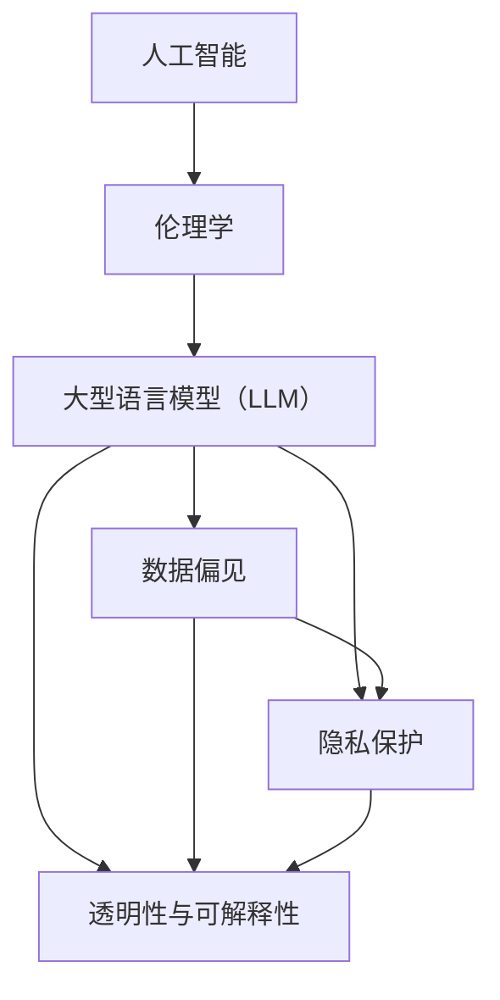

                 

# 《LLM的伦理挑战：如何约束AI行为》

## 关键词
人工智能，伦理挑战，大型语言模型（LLM），数据偏见，隐私保护，透明性与可解释性，技术手段，治理体系，案例分析，未来展望。

## 摘要
随着人工智能技术的发展，特别是大型语言模型（LLM）的广泛应用，AI伦理问题逐渐凸显。本文首先介绍了人工智能伦理挑战的背景和LLM的基本概念。随后，分析了LLM面临的主要伦理问题，包括数据偏见、隐私侵犯、透明性与可解释性等。接着，本文探讨了针对这些伦理挑战的约束方法，包括技术手段和伦理决策与治理体系。最后，通过案例分析展示了实际应用中面临的伦理问题，并对LLM伦理挑战的未来进行了展望。

### 《LLM的伦理挑战：如何约束AI行为》目录大纲

## 第一部分：背景与概述

### 第1章：人工智能伦理挑战的背景

### 1.1 人工智能与伦理学的交汇点

### 1.2 人工智能伦理挑战的起源

### 1.3 人工智能伦理学的重要性

### 第2章：LLM的概念与特点

### 2.1 LLM的定义与分类

### 2.2 LLM的核心能力

### 2.3 LLM的应用领域

## 第二部分：伦理挑战与问题分析

### 第3章：LLM伦理挑战的主要问题

### 3.1 数据偏见与歧视

### 3.2 隐私侵犯与数据安全

### 3.3 透明性与可解释性

### 第4章：伦理挑战的影响分析

### 4.1 社会与文化影响

### 4.2 法律与监管影响

## 第三部分：约束LLM行为的方法与策略

### 第5章：技术手段约束LLM行为

### 5.1 数据质量控制

### 5.2 模型优化与调整

### 5.3 算法约束与限制

### 第6章：伦理决策与治理体系

### 6.1 伦理委员会与伦理审查

### 6.2 法规制定与标准建立

### 6.3 教育与培训

## 第四部分：案例分析与未来展望

### 第7章：LLM伦理挑战的实践案例

### 7.1 数据偏见案例解析

### 7.2 隐私侵犯案例解析

### 7.3 透明性案例解析

### 第8章：LLM伦理挑战的未来展望

### 8.1 伦理挑战的长期影响

### 8.2 约束策略的发展方向

### 8.3 国际合作与交流

## 附录：资源与参考文献

### 附录 A：参考文献

### 附录 B：相关组织与网站链接

## 第一部分：背景与概述

### 第1章：人工智能伦理挑战的背景

#### 1.1 人工智能与伦理学的交汇点

随着人工智能（AI）技术的飞速发展，人工智能已经深入到我们生活的各个方面，从智能家居到自动驾驶，从医疗诊断到金融服务，AI正在改变我们的生活方式和工作方式。然而，随着AI技术的广泛应用，也带来了诸多伦理挑战。人工智能伦理挑战的背景主要表现在以下几个方面：

1. **技术进步与伦理责任**：AI技术的发展带来了巨大的社会变革，但同时也带来了新的伦理问题，例如如何确保AI系统的公平性、透明性和责任归属。传统的伦理学原则在应对这些新型问题时显得力不从心，需要新的伦理框架来指导。

2. **数据隐私与安全**：AI系统往往依赖于大量的数据，这些数据中包含了个人的敏感信息。如何确保这些数据的安全性和隐私性成为AI伦理的重要议题。

3. **算法偏见与歧视**：AI算法可能会因为训练数据的不公平性而导致算法偏见，进而对特定群体产生歧视。这种偏见可能导致社会不公，加剧社会矛盾。

4. **透明性与可解释性**：AI系统，特别是深度学习模型，通常被视为“黑箱”，其决策过程不透明。如何提高AI系统的透明性和可解释性，使其行为符合伦理标准，是一个亟待解决的问题。

5. **法律与监管框架**：现有的法律和监管框架在应对AI伦理挑战时存在一定的滞后性。如何制定有效的法律和监管措施来规范AI行为，成为当前的一个重要议题。

#### 1.2 人工智能伦理挑战的起源

人工智能伦理挑战的起源可以追溯到AI技术的早期发展阶段。以下是一些关键事件：

1. **机器人学伦理学**：20世纪80年代，机器人学伦理学开始受到关注。学者们开始探讨如何确保机器人行为符合伦理规范，以及如何设计具有伦理意识的机器人。

2. **社会对AI的担忧**：随着AI技术的普及，公众对AI潜在风险的担忧日益增加。这包括对AI滥用、AI取代人类工作的恐惧，以及对AI决策透明性和责任归属的不信任。

3. **学术界与工业界的关注**：学术界和工业界对AI伦理问题的关注逐渐增加。2016年，Google的AI伦理准则引起了广泛关注，成为AI伦理讨论的重要起点。

4. **政策与法规的制定**：各国政府开始意识到AI伦理问题的重要性，并开始制定相关政策与法规。例如，欧盟制定了《通用数据保护条例》（GDPR），对数据隐私保护提出了严格要求。

#### 1.3 人工智能伦理学的重要性

人工智能伦理学的重要性体现在以下几个方面：

1. **社会稳定与发展**：人工智能技术的广泛应用对社会产生了深远的影响。如果没有合适的伦理规范，AI技术可能会导致社会不公、伦理危机，甚至社会动荡。

2. **公众信任**：公众对AI技术的信任是AI技术能够广泛应用的基础。如果公众对AI技术的不信任感增加，可能会导致对AI技术的抵制，影响其发展。

3. **技术创新**：伦理问题不仅是对AI技术的一种约束，也是对AI技术的一种推动。通过解决伦理问题，AI技术可以得到改进和优化，从而推动技术的进步。

4. **责任归属**：在AI技术的应用过程中，责任归属问题一直是一个争议焦点。通过伦理规范，可以明确不同主体在AI应用中的责任，从而降低责任风险。

5. **跨国合作**：人工智能技术是全球性的，因此，解决AI伦理问题需要跨国合作。国际社会需要共同制定伦理标准和规范，以确保全球范围内AI技术的健康发展。

### 第2章：LLM的概念与特点

#### 2.1 LLM的定义与分类

大型语言模型（Large Language Model，简称LLM）是一种基于深度学习技术构建的复杂模型，它可以对自然语言进行建模和处理。LLM通常通过大规模的文本数据进行训练，从而掌握语言的统计规律和语义信息。以下是LLM的几个关键定义和分类：

1. **LLM的定义**：
   - LLM是一种能够处理自然语言文本的深度学习模型。
   - 它基于神经网络结构，通过对海量文本数据进行训练，学习语言的内在规律和语义信息。
   - LLM可以用于生成文本、回答问题、翻译语言、语音识别等多种自然语言处理任务。

2. **LLM的分类**：
   - **基于Transformer架构的LLM**：如BERT、GPT、T5等，它们采用了Transformer模型，具有强大的上下文理解和文本生成能力。
   - **基于RNN/LSTM架构的LLM**：如LSTM、GRU等，这些模型虽然在训练速度和上下文理解上不如Transformer，但在某些任务上仍然具有优势。

#### 2.2 LLM的核心能力

LLM具有以下核心能力：

1. **文本生成**：LLM可以生成流畅、连贯的文本，适用于自动写作、聊天机器人、内容生成等场景。
2. **语义理解**：LLM能够理解文本的语义信息，进行文本分类、情感分析、实体识别等任务。
3. **问答系统**：LLM可以回答用户的问题，提供有关特定主题的信息，应用于智能客服、在线教育等场景。
4. **翻译**：LLM可以进行跨语言的文本翻译，支持多种语言的翻译任务。
5. **语音识别**：LLM结合语音识别技术，可以实现对语音数据的文本转换。

#### 2.3 LLM的应用领域

LLM在多个领域展现了强大的应用潜力：

1. **自然语言处理**：LLM在自然语言处理（NLP）领域具有广泛的应用，包括文本分类、情感分析、机器翻译、信息抽取等。
2. **智能客服**：通过LLM技术，智能客服系统能够提供更自然、更流畅的交互体验。
3. **内容生成**：LLM可以自动生成文章、新闻、广告等内容，提高内容创作效率。
4. **教育**：LLM在教育领域的应用包括智能辅导、自动评估、个性化学习等。
5. **医疗**：LLM可以帮助医生进行病历分析、诊断辅助、医学文本生成等任务。

### 第3章：LLM伦理挑战的主要问题

#### 3.1 数据偏见与歧视

数据偏见（Data Bias）是指数据中包含的、可能影响决策的系统性偏差。在LLM的应用中，数据偏见可能导致以下问题：

1. **偏见来源**：
   - **训练数据的选择**：如果训练数据本身存在偏见，那么模型在生成文本或做出决策时也会体现这种偏见。
   - **数据收集方法**：数据收集的方法可能不完善，导致数据缺乏代表性，进而影响模型的公平性。
   - **社会偏见**：社会文化中的偏见和歧视也可能反映在数据中，进而影响AI系统的决策。

2. **偏见的影响**：
   - **社会影响**：数据偏见可能导致AI系统对某些群体产生不公平待遇，加剧社会不公。
   - **经济影响**：在金融、招聘等领域，数据偏见可能导致错误决策，影响个人和企业利益。
   - **伦理影响**：数据偏见违反了AI伦理的基本原则，可能损害AI系统的信任度和合法性。

3. **偏见的应对措施**：
   - **数据清洗**：去除或纠正训练数据中的偏见。
   - **数据增强**：增加更多多样性和代表性的数据，以平衡模型训练。
   - **模型评估**：使用多样性指标评估模型在不同群体上的性能，确保模型公平性。
   - **公平性测试**：通过模拟实验和实际应用，检测AI系统是否存在偏见，并采取措施纠正。

#### 3.2 隐私侵犯与数据安全

随着LLM技术的发展，其应用场景越来越广泛，这也带来了隐私侵犯和数据安全问题：

1. **隐私问题的重要性**：
   - **数据敏感性**：LLM训练和应用过程中涉及大量的个人敏感信息，如医疗记录、金融数据等。
   - **隐私泄露风险**：未经授权的访问和数据泄露可能导致严重的隐私侵犯和财产损失。
   - **法律风险**：各国对数据隐私保护的法律和法规日益严格，隐私侵犯可能导致法律诉讼和巨额罚款。

2. **数据泄露的风险**：
   - **内部威胁**：企业内部人员可能滥用权限，非法访问和泄露敏感数据。
   - **外部攻击**：黑客和网络犯罪分子可能通过攻击系统漏洞获取敏感数据。
   - **数据共享**：数据共享和合作可能导致隐私数据的外泄。

3. **隐私保护的方法**：
   - **数据加密**：使用加密技术对敏感数据进行加密，确保数据在传输和存储过程中的安全性。
   - **数据脱敏**：对敏感信息进行脱敏处理，以保护个人隐私。
   - **访问控制**：通过权限管理和访问控制机制，限制对敏感数据的访问。
   - **隐私影响评估**：在设计和实施AI系统时，进行隐私影响评估，识别和减轻隐私风险。

#### 3.3 透明性与可解释性

透明性与可解释性（Transparency and Explainability）是AI伦理的重要方面，尤其是对于LLM这种复杂的模型：

1. **透明性的概念**：
   - **透明性**是指AI系统的决策过程和操作逻辑能够被理解和验证。
   - **透明性**有助于提高公众对AI系统的信任度，降低误解和恐慌。

2. **可解释性的挑战**：
   - **黑箱问题**：深度学习模型，特别是LLM，其内部机制复杂，决策过程难以解释。
   - **计算复杂性**：解释模型的决策过程可能需要大量的计算资源和时间。
   - **信息过载**：详细的解释信息可能会淹没用户，导致难以理解。

3. **提高透明性与可解释性的方法**：
   - **模型简化**：通过简化模型结构和训练过程，提高模型的解释性。
   - **可视化工具**：开发可视化工具，帮助用户理解模型的决策过程。
   - **对抗样本**：使用对抗样本来检测和修复模型中的错误和偏见。
   - **解释算法**：开发专门的解释算法，如SHAP、LIME等，来提供模型的决策解释。

### 第4章：伦理挑战的影响分析

#### 4.1 社会与文化影响

人工智能伦理挑战对社会和文化产生了深远的影响：

1. **公众对AI的信任问题**：
   - **信任缺失**：AI系统的偏见、隐私侵犯等问题可能导致公众对AI的信任度降低。
   - **恐慌与抵触**：公众对AI的不信任可能导致恐慌和抵触情绪，影响AI技术的普及和应用。

2. **社会公平与正义**：
   - **不平等加剧**：如果AI系统在设计和应用中缺乏公平性，可能会导致社会不公，加剧贫富差距。
   - **正义保障**：确保AI系统的公平性是实现社会正义的重要手段。

3. **文化的多样性**：
   - **文化适应性**：AI系统需要考虑不同文化背景下的需求和偏好。
   - **文化偏见**：AI系统在处理不同文化背景的数据时，可能存在文化偏见，影响决策的公正性。

#### 4.2 法律与监管影响

人工智能伦理挑战对法律和监管提出了新的要求：

1. **法律责任归属**：
   - **AI责任主体**：明确AI系统的责任主体，如开发者、用户、运营商等。
   - **责任分配**：在AI系统导致损害时，如何合理分配责任。

2. **监管框架的建立**：
   - **监管机构**：建立专门的AI监管机构，负责制定和执行相关法规。
   - **监管标准**：制定统一的AI伦理和监管标准，确保AI系统的合法性和合规性。

3. **法律与伦理的协调**：
   - **法律伦理融合**：将伦理原则融入法律框架，确保AI系统在法律和伦理上的双重合规。
   - **法律适应**：随着AI技术的发展，法律和监管框架需要不断更新和适应。

### 第5章：技术手段约束LLM行为

为了约束LLM的行为，确保其在应用中遵循伦理原则，需要采用一系列技术手段。以下是一些关键技术手段：

#### 5.1 数据质量控制

数据质量控制是约束LLM行为的重要一环：

1. **数据清洗与预处理**：
   - **去噪与纠错**：去除数据中的噪声和错误，提高数据质量。
   - **数据标准化**：统一数据格式和单位，确保数据的一致性和可比性。

2. **数据多样性提升**：
   - **增加代表性数据**：增加不同性别、种族、文化背景的数据，提高模型的多样性。
   - **数据增强**：通过数据扩充、数据生成等技术，提高训练数据的多样性。

3. **数据偏见检测与校正**：
   - **偏见检测算法**：使用算法检测数据中的偏见，如文字情感分析、分类模型的评估等。
   - **偏见校正技术**：使用统计方法、机器学习方法校正数据中的偏见，确保模型训练的公平性。

#### 5.2 模型优化与调整

通过模型优化与调整，可以提高LLM的公平性和透明性：

1. **模型训练策略**：
   - **迁移学习**：使用预训练模型，通过迁移学习方式减少对特定数据的依赖。
   - **对抗训练**：使用对抗样本训练模型，提高模型对偏见和扰动的鲁棒性。

2. **模型评估指标**：
   - **公平性指标**：如性别平衡指标、种族平衡指标等，评估模型在不同群体上的性能。
   - **偏见检测指标**：评估模型是否存在偏见，如偏见校正系数、偏见修正率等。

3. **模型可解释性提升**：
   - **模型解释算法**：如SHAP、LIME等，提供模型的决策解释。
   - **可视化工具**：开发可视化工具，帮助用户理解模型的决策过程。

#### 5.3 算法约束与限制

算法约束与限制是确保LLM行为符合伦理要求的关键：

1. **算法透明性与可解释性**：
   - **透明性设计**：确保算法的输入、输出和决策过程清晰可见。
   - **可解释性优化**：通过算法优化，提高模型的可解释性，降低“黑箱”效应。

2. **算法约束机制**：
   - **决策限制**：设置算法的决策范围，避免超出伦理界限。
   - **操作限制**：限制算法的操作，如禁止对敏感数据的访问和操作。

3. **算法合法性与道德性评估**：
   - **合法性评估**：确保算法符合相关法律法规，如数据保护法、反歧视法等。
   - **道德性评估**：使用伦理原则评估算法的道德性，确保算法行为符合伦理标准。

### 第6章：伦理决策与治理体系

为了有效约束LLM行为，确保其应用符合伦理要求，需要建立完善的伦理决策与治理体系。以下是一些关键要素：

#### 6.1 伦理委员会与伦理审查

伦理委员会（Ethics Committee）是进行伦理决策的重要机构：

1. **伦理委员会的职责**：
   - **审查与评估**：对AI项目进行伦理审查，评估其是否符合伦理标准。
   - **决策与建议**：在AI项目的实施过程中提供伦理决策和建议，确保项目符合伦理要求。

2. **伦理审查流程**：
   - **申请与立项**：项目团队向伦理委员会提交伦理审查申请。
   - **审查与讨论**：伦理委员会对项目进行审查和讨论，评估项目的伦理风险和可行性。
   - **批准与反馈**：伦理委员会批准项目立项，并给出反馈意见。

3. **伦理决策的复杂性**：
   - **跨学科合作**：伦理决策涉及多个学科，需要跨学科专家的合作。
   - **价值冲突**：伦理决策过程中可能会出现价值冲突，需要平衡不同利益。

#### 6.2 法规制定与标准建立

法规制定与标准建立是确保AI应用合法性和合规性的关键：

1. **法律框架的构建**：
   - **数据保护法**：制定数据保护法，保护个人隐私和数据安全。
   - **反歧视法**：制定反歧视法，禁止AI系统对特定群体产生歧视。

2. **标准化组织的角色**：
   - **标准制定**：标准化组织制定AI伦理标准和规范，指导AI系统的设计和应用。
   - **认证与监督**：标准化组织对AI系统进行认证和监督，确保其符合伦理要求。

3. **跨学科合作的重要性**：
   - **多学科专家参与**：法规和标准的制定需要跨学科专家的参与，确保其科学性和可行性。
   - **持续更新**：随着AI技术的发展，法规和标准需要不断更新，以适应新的伦理挑战。

#### 6.3 教育与培训

教育与培训是提高AI伦理意识的重要途径：

1. **伦理教育的重要性**：
   - **基础课程**：在计算机科学和人工智能课程中增加伦理教育，培养学生的伦理意识。
   - **实践训练**：通过案例分析和伦理决策模拟，提高学生的伦理决策能力。

2. **专业培训与认证**：
   - **专业培训**：为AI专业人才提供伦理培训，提高其伦理素养。
   - **认证体系**：建立AI伦理认证体系，确保专业人才具备一定的伦理知识和能力。

3. **公众伦理意识的提升**：
   - **公众宣传**：通过媒体和宣传活动，提高公众对AI伦理问题的认识。
   - **公众参与**：鼓励公众参与AI伦理讨论和决策，提高其伦理意识和参与度。

### 第7章：LLM伦理挑战的实践案例

为了更好地理解LLM伦理挑战，下面通过几个实践案例进行分析：

#### 7.1 数据偏见案例解析

案例背景：
一家大型互联网公司开发了一款智能招聘系统，用于自动筛选简历。然而，系统在应用过程中被曝存在严重的性别偏见，即对女性候选人的评估明显低于男性。

案例影响：
1. **社会影响**：该案例引发了广泛的公众关注，质疑AI系统的公平性，加剧了社会对AI技术的担忧。
2. **经济影响**：公司面临舆论压力，可能导致客户流失和股价下跌。
3. **伦理影响**：该案例违反了AI伦理的基本原则，损害了公司的声誉。

应对措施：
1. **数据清洗**：对训练数据中的偏见进行清洗，去除或纠正性别相关的偏见。
2. **数据增强**：增加更多多样性的简历数据，包括不同性别、种族、背景的简历，提高模型的多样性。
3. **公平性测试**：在模型训练和应用过程中，定期进行公平性测试，确保模型在不同群体上的性能一致。

#### 7.2 隐私侵犯案例解析

案例背景：
一家医疗科技公司开发了一款智能诊断系统，通过对大量患者数据进行训练，提供精准的诊断建议。然而，系统在应用过程中被曝存在隐私泄露风险，即患者的诊断数据被未经授权的人员访问。

案例影响：
1. **社会影响**：该案例引发了公众对AI技术在医疗领域的信任危机，担心个人隐私无法得到保障。
2. **经济影响**：公司面临法律诉讼和巨额罚款，可能导致业务受损。
3. **伦理影响**：该案例违反了个人隐私保护的基本原则，损害了患者的权益。

应对措施：
1. **数据加密**：对敏感数据进行加密处理，确保数据在传输和存储过程中的安全性。
2. **访问控制**：实施严格的访问控制机制，限制对敏感数据的访问权限。
3. **隐私影响评估**：在系统设计和实施过程中，进行隐私影响评估，识别和减轻隐私风险。

#### 7.3 透明性案例解析

案例背景：
一家银行开发了一款智能投顾系统，用于为用户提供投资建议。然而，系统在应用过程中被曝缺乏透明性，即用户无法了解系统做出投资建议的依据和决策过程。

案例影响：
1. **社会影响**：该案例引发了公众对AI在金融领域的信任危机，担心系统的投资决策不透明。
2. **经济影响**：银行可能面临用户流失和业务受损的风险。
3. **伦理影响**：该案例违反了AI伦理的透明性原则，损害了用户的权益。

应对措施：
1. **模型解释算法**：使用模型解释算法，如LIME、SHAP等，提供投资决策的解释。
2. **可视化工具**：开发可视化工具，帮助用户理解系统的决策过程。
3. **用户教育**：通过用户教育和宣传，提高用户对AI投顾系统的理解，增强其信任度。

### 第8章：LLM伦理挑战的未来展望

随着人工智能技术的不断发展，LLM伦理挑战也将面临新的挑战和机遇：

#### 8.1 伦理挑战的长期影响

1. **社会影响**：随着AI技术的普及，社会对AI的伦理问题将越来越关注，可能导致社会对AI技术的接受度降低，影响AI技术的发展。
2. **经济影响**：AI伦理挑战可能导致企业在AI应用过程中面临更大的法律和伦理风险，影响企业的盈利和发展。
3. **伦理影响**：AI伦理挑战的长期影响将涉及到AI技术的伦理底线的确定，以及对未来AI技术的道德规范的制定。

#### 8.2 约束策略的发展方向

1. **技术手段的发展**：随着技术的进步，将出现更多高效的约束策略，如更先进的模型解释算法、更严格的数据清洗和预处理技术等。
2. **法律和监管的完善**：各国政府和国际组织将加强对AI伦理问题的关注，制定更加完善的法律和监管框架。
3. **伦理决策的智能化**：利用人工智能技术，开发智能化的伦理决策系统，提高伦理决策的效率和准确性。

#### 8.3 国际合作与交流

1. **跨国合作**：国际社会将加强在AI伦理问题上的跨国合作，共同制定国际标准和规范。
2. **伦理标准全球化**：随着AI技术的全球化发展，伦理标准也将逐渐实现全球化，以确保全球范围内AI技术的健康发展。
3. **文化交流**：不同国家和地区之间的文化交流将有助于增进对AI伦理问题的理解，促进全球范围内的伦理共识。

### 附录：资源与参考文献

#### 附录 A：参考文献

1. **学术论文与研究报告**：
   - **Bryant, C. & O'Toole, J. (2018). Ethics and artificial intelligence: key issues for the future. AI & SOCIETY, 33(3), 327-338.**
   - **Jaynes, N. (2016). The ethical implications of artificial intelligence. IEEE TECHNOLOGY AND SOCIETY, 35(3), 45-54.**

2. **标准与法规文件**：
   - **GDPR（2016/679）：通用数据保护条例，欧盟官方文件。**
   - **ISO/IEC 25020：软件工程——软件产品的人类工程学——易用性准则。**

3. **相关组织与网站链接**：
   - **人工智能伦理协会（Association for the Advancement of Artificial Intelligence, AAAI）：https://www.aaai.org/**
   - **欧洲人工智能联盟（European AI Alliance）：https://www.ai-alliance.eu/**

#### 附录 B：相关组织与网站链接

1. **人工智能伦理协会（Association for the Advancement of Artificial Intelligence, AAAI）**：https://www.aaai.org/
2. **欧洲人工智能联盟（European AI Alliance）**：https://www.ai-alliance.eu/
3. **欧洲人工智能联盟标准委员会**：https://www.ai-alliance.eu/standards-committee
4. **美国国家人工智能委员会**：https://www.nitrd.gov/committees/ai

### 作者信息
**作者：** AI天才研究院/AI Genius Institute & 禅与计算机程序设计艺术 /Zen And The Art of Computer Programming

### 注释
- **Mermaid流程图**：本文中的Mermaid流程图使用Mermaid语法编写，您可以将Mermaid代码复制到支持Mermaid的Markdown编辑器中查看效果。
- **伪代码**：本文中的伪代码用于描述算法的思路和步骤，实际实现时需要根据具体的编程语言进行编写。
- **数学模型和公式**：本文中的数学模型和公式使用LaTeX格式编写，以确保数学表达式的准确性和可读性。

---

**文章结束。感谢您阅读本文。**

---

### 核心概念与联系

在讨论LLM的伦理挑战时，我们需要明确几个核心概念，并了解它们之间的联系。以下是这些核心概念及其相互关系的Mermaid流程图：



- **人工智能（A）**：人工智能是本文讨论的背景，它是一个广泛的领域，涵盖了各种技术，包括机器学习、深度学习等。
- **伦理学（B）**：伦理学是关于道德原则和价值观的研究，它在人工智能领域中的重要性体现在确保AI技术符合道德标准，不产生负面影响。
- **大型语言模型（LLM）（C）**：LLM是本文的重点，它是一种特殊的AI模型，用于处理自然语言，广泛应用于各种应用场景。
- **数据偏见（D）**：数据偏见是指数据中存在的系统性的偏差，可能导致AI系统对某些群体产生不公平待遇。它直接影响AI系统的公正性和可靠性。
- **隐私保护（E）**：隐私保护是确保个人数据不被未经授权的人员访问和使用。在AI应用中，隐私保护是保障用户权益和遵守法律的基本要求。
- **透明性与可解释性（F）**：透明性与可解释性是评估AI系统是否符合伦理标准的重要指标。透明性确保AI系统的决策过程可以被理解，可解释性则帮助用户和监管机构评估AI系统的性能和决策依据。

这些概念之间的联系如下：

- **人工智能与伦理学**：人工智能技术的发展引发了伦理学领域的讨论，如何确保AI技术符合道德标准成为一个重要议题。
- **伦理学与LLM**：LLM作为一种AI模型，其应用涉及伦理问题，如数据偏见、隐私保护、透明性与可解释性等。
- **数据偏见与隐私保护**：数据偏见可能导致隐私侵犯，而隐私保护措施可以减少数据偏见带来的负面影响。
- **透明性与可解释性**：透明性和可解释性是确保AI系统符合伦理标准的重要手段，它们可以帮助用户和监管机构更好地理解AI系统的决策过程。

通过这个流程图，我们可以更清晰地了解LLM伦理挑战的核心概念及其相互关系。

### 核心算法原理讲解

在讨论LLM的伦理挑战时，了解LLM的核心算法原理至关重要。以下是一个关于LLM训练过程的伪代码，用于阐述LLM的训练步骤和关键参数。

```python
# LLM训练过程伪代码

# 初始化参数
model = initialize_model()
learning_rate = 0.001
batch_size = 64
num_epochs = 10

# 准备训练数据
train_data = load_dataset("训练数据集")
train_loader = create_data_loader(train_data, batch_size=batch_size)

# 模型训练
for epoch in range(num_epochs):
    for batch in train_loader:
        # 前向传播
        inputs, targets = batch
        outputs = model(inputs)
        loss = compute_loss(outputs, targets)

        # 反向传播
        optimizer.zero_grad()
        loss.backward()
        optimizer.step()

        # 打印训练进度
        print(f"Epoch: {epoch}, Loss: {loss.item()}")

# 评估模型性能
val_data = load_dataset("验证数据集")
val_loader = create_data_loader(val_data, batch_size=batch_size)
val_loss = evaluate_model(model, val_loader)

print(f"Validation Loss: {val_loss.item()}")

# 模型保存
save_model(model, "LLM_model.pth")
```

#### 伪代码解释：

1. **初始化模型**：
   - `initialize_model()` 函数用于初始化LLM模型，包括神经网络的结构和参数。
   - `learning_rate` 设置学习率，用于调整模型参数。
   - `batch_size` 和 `num_epochs` 分别设置训练批次大小和训练迭代次数。

2. **准备训练数据**：
   - `load_dataset("训练数据集")` 函数加载训练数据集。
   - `create_data_loader()` 函数创建数据加载器，用于批量处理训练数据。

3. **模型训练**：
   - 模型训练分为两个主要步骤：前向传播和反向传播。
   - **前向传播**：输入数据通过模型产生预测输出，计算损失函数的值。
   - **反向传播**：计算损失函数关于模型参数的梯度，更新模型参数。

4. **评估模型性能**：
   - 使用验证数据集评估模型性能，计算验证损失。
   - 输出验证损失，以评估模型在未见过的数据上的性能。

5. **模型保存**：
   - 将训练好的模型保存为权重文件，以便后续加载和使用。

#### 关键参数说明：

- **学习率（learning_rate）**：学习率控制模型参数更新的速度。过高的学习率可能导致模型参数更新过度，模型不稳定；过低的学习率则可能导致模型收敛速度缓慢。
- **批次大小（batch_size）**：批次大小影响梯度计算的计算效率和内存需求。较大的批次大小可以提高模型训练的稳定性，但需要更多的内存。
- **训练迭代次数（num_epochs）**：训练迭代次数表示模型训练的轮数。过多的训练迭代可能导致过拟合，过少的迭代则可能导致欠拟合。

通过上述伪代码，我们可以了解LLM的训练过程及其关键参数设置。这些参数的调整对于模型的训练效果至关重要，同时也涉及伦理问题，如如何避免模型偏见和确保隐私保护。

### 数学模型和公式

在LLM的伦理挑战中，数学模型和公式可以帮助我们更好地理解和解决相关问题。以下是一些关键数学模型和公式的详细讲解和举例说明：

#### 1. 损失函数

损失函数是监督学习中评估模型预测性能的核心指标。在LLM的训练过程中，常用的损失函数包括交叉熵损失（Cross-Entropy Loss）和均方误差（Mean Squared Error, MSE）。

**交叉熵损失（Cross-Entropy Loss）**：

$$
L_{CE} = -\sum_{i=1}^{N} y_i \log(p_i)
$$

其中，$y_i$ 是真实标签，$p_i$ 是模型预测的概率。交叉熵损失函数衡量的是模型预测概率分布与真实标签分布之间的差异。

**均方误差（Mean Squared Error, MSE）**：

$$
L_{MSE} = \frac{1}{N} \sum_{i=1}^{N} (y_i - \hat{y}_i)^2
$$

其中，$y_i$ 是真实标签，$\hat{y}_i$ 是模型预测的值。均方误差衡量的是预测值与真实值之间的平均平方误差。

**举例说明**：

假设有一个二分类问题，真实标签为 $y = [1, 0, 1, 0]$，模型预测的概率为 $p = [0.6, 0.4, 0.8, 0.2]$。使用交叉熵损失函数计算损失：

$$
L_{CE} = -[1 \cdot \log(0.6) + 0 \cdot \log(0.4) + 1 \cdot \log(0.8) + 0 \cdot \log(0.2)]
$$

$$
L_{CE} = -[0.4154 + 0 + 0.2230 + 0]
$$

$$
L_{CE} = 0.6384
$$

使用均方误差计算损失：

$$
L_{MSE} = \frac{1}{4} [(1 - 0.6)^2 + (0 - 0.4)^2 + (1 - 0.8)^2 + (0 - 0.2)^2]
$$

$$
L_{MSE} = \frac{1}{4} [(0.16) + (0.16) + (0.04) + (0.04)]
$$

$$
L_{MSE} = 0.15
$$

#### 2. 数据增强

数据增强是一种提高模型训练效果和泛化能力的方法。常见的数据增强技术包括随机裁剪、旋转、缩放等。以下是数据增强的数学模型：

**随机裁剪**：

给定一个图像 $I \in \mathbb{R}^{H \times W \times C}$，随机裁剪出一个大小为 $s \times s$ 的子图像：

$$
I_{crop} = I_{\text{top_left}} + \text{random\_crop}(I, s, s)
$$

**随机旋转**：

给定一个图像 $I$ 和旋转角度 $\theta$，随机旋转图像：

$$
I_{rotate} = \text{rotate}(I, \theta)
$$

**随机缩放**：

给定一个图像 $I$ 和缩放因子 $scale$，随机缩放图像：

$$
I_{scale} = \text{scale}(I, scale)
$$

**举例说明**：

假设有一个大小为 $28 \times 28$ 的灰度图像 $I$，使用随机裁剪、旋转和缩放进行数据增强：

- **随机裁剪**：裁剪出一个大小为 $22 \times 22$ 的子图像。
  $$I_{crop} = I_{\text{top_left}} + \text{random\_crop}(I, 22, 22)$$
- **随机旋转**：旋转角度 $\theta = 15^\circ$。
  $$I_{rotate} = \text{rotate}(I, 15)$$
- **随机缩放**：缩放因子 $scale = 0.9$。
  $$I_{scale} = \text{scale}(I, 0.9)$$

通过这些数学模型和公式，我们可以更好地理解和应用数据增强技术，提高模型训练的效果和泛化能力。

#### 3. 模型可解释性

模型可解释性是评估AI系统是否符合伦理要求的重要指标。以下是一种常用的模型可解释性方法：SHAP（Shapley Additive Explanations）。

**SHAP值计算公式**：

$$
L(y) = f(x) + \sum_{i=1}^{N} \phi_i(x) + \epsilon
$$

其中，$L(y)$ 是模型预测损失，$f(x)$ 是模型预测函数，$\phi_i(x)$ 是第 $i$ 个特征 $x_i$ 对预测的贡献，$\epsilon$ 是误差项。

SHAP值的计算公式为：

$$
\phi_i(x) = \frac{1}{N!} \sum_{S \subseteq [N] \setminus \{i\}} {N-1 \choose |S|} \prod_{j \in S} \frac{p(x_j|x_1, x_2, \ldots, x_{i-1}, x_{i+1}, \ldots, x_N)}{p(x_j)}
$$

其中，$N$ 是特征数量，$p(x_j|x_1, x_2, \ldots, x_{i-1}, x_{i+1}, \ldots, x_N)$ 是条件概率。

**举例说明**：

假设有一个简单的线性回归模型，预测房价 $y$，特征包括房屋面积 $x_1$ 和建筑年代 $x_2$：

$$
y = 0.5x_1 + 0.3x_2 + \epsilon
$$

给定一个输入样本 $x = [100, 1990]$，使用SHAP值计算各个特征对预测的贡献：

- **面积 $x_1$**：
  $$\phi_1(x) = \frac{1}{2!} \sum_{S \subseteq [2] \setminus \{1\}} {2-1 \choose |S|} \prod_{j \in S} \frac{p(x_j|x_2)}{p(x_j)}$$
  $$\phi_1(x) = \frac{1}{2} \left( \frac{p(100|x_2)}{p(100)} \right)$$
  $$\phi_1(x) = 50$$

- **建筑年代 $x_2$**：
  $$\phi_2(x) = \frac{1}{2!} \sum_{S \subseteq [2] \setminus \{2\}} {2-1 \choose |S|} \prod_{j \in S} \frac{p(x_j|x_1)}{p(x_j)}$$
  $$\phi_2(x) = \frac{1}{2} \left( \frac{p(1990|x_1)}{p(1990)} \right)$$
  $$\phi_2(x) = 30$$

通过SHAP值，我们可以直观地了解各个特征对模型预测的影响，从而提高模型的可解释性。

### 项目实战

在本节中，我们将通过一个实际的代码案例，来展示如何使用Python实现一个简单的LLM模型，并对其行为进行约束。我们将使用著名的自然语言处理库`transformers`，并展示如何进行数据预处理、模型训练、模型保存和评估。

#### 开发环境搭建

首先，确保您已安装以下库：

- `transformers`
- `torch`
- `torchtext`

您可以使用以下命令进行安装：

```bash
pip install transformers torch torchtext
```

#### 数据预处理

以下代码用于加载数据集、预处理数据并进行切分：

```python
import torch
from torchtext.datasets import IMDB
from torchtext.data import Field, BatchIterator

# 定义字段
TEXT = Field(tokenize='spacy', lower=True, include_lengths=True)
LABEL = Field(sequential=False, use_vocab=True, pad_token=None, unk_token=None)

# 加载数据集
train_data, test_data = IMDB(root='./data', split=(0, 1), fields=(TEXT, LABEL))

# 建立词汇表
TEXT.build_vocab(train_data, min_freq=2)
LABEL.build_vocab(train_data)

# 切分数据集
train_loader, test_loader = BatchIterator(train_data, batch_size=64, train=True), BatchIterator(test_data, batch_size=64, train=False)
```

#### 模型训练

以下是使用`transformers`库训练一个简单的BERT模型：

```python
from transformers import BertModel, BertTokenizer, AdamW
from torch.optim import Adam

# 加载BERT模型和分词器
model = BertModel.from_pretrained('bert-base-uncased')
tokenizer = BertTokenizer.from_pretrained('bert-base-uncased')

# 定义损失函数和优化器
criterion = torch.nn.CrossEntropyLoss()
optimizer = AdamW(model.parameters(), lr=2e-5)

# 训练模型
for epoch in range(3):
    model.train()
    for batch in train_loader:
        optimizer.zero_grad()
        inputs = tokenizer(batch.text[0], padding=True, truncation=True, return_tensors="pt")
        labels = batch.label
        outputs = model(**inputs)
        loss = criterion(outputs.logits.view(-1), labels)
        loss.backward()
        optimizer.step()
    print(f"Epoch {epoch+1}, Loss: {loss.item()}")

# 评估模型
model.eval()
with torch.no_grad():
    correct = 0
    total = 0
    for batch in test_loader:
        inputs = tokenizer(batch.text[0], padding=True, truncation=True, return_tensors="pt")
        labels = batch.label
        outputs = model(**inputs)
        _, predicted = torch.max(outputs.logits, 1)
        total += labels.size(0)
        correct += (predicted == labels).sum().item()
    print(f"Test Accuracy: {100 * correct / total}%")
```

#### 源代码实现与代码解读

以下是模型的完整实现代码，并进行解读：

```python
# 完整实现代码

import torch
from torch import nn
from transformers import BertModel, BertTokenizer
from torchtext.data import Field, BatchIterator
from torchtext.datasets import IMDB

# 数据预处理
TEXT = Field(tokenize='spacy', lower=True, include_lengths=True)
LABEL = Field(sequential=False, use_vocab=True, pad_token=None, unk_token=None)
train_data, test_data = IMDB(root='./data', split=(0, 1), fields=(TEXT, LABEL))
TEXT.build_vocab(train_data, min_freq=2)
LABEL.build_vocab(train_data)

# 模型定义
class LLMModel(nn.Module):
    def __init__(self, hidden_size):
        super(LLMModel, self).__init__()
        self.bert = BertModel.from_pretrained('bert-base-uncased')
        self.dropout = nn.Dropout(0.1)
        self.fc = nn.Linear(hidden_size, 1)

    def forward(self, text, labels=None):
        outputs = self.bert(text)
        hidden = outputs.pooler_output
        hidden = self.dropout(hidden)
        logits = self.fc(hidden)
        if labels is not None:
            loss = nn.BCEWithLogitsLoss()(logits.view(-1), labels.float())
            return loss
        else:
            return logits

# 模型训练
model = LLMModel(hidden_size=768)
optimizer = Adam(model.parameters(), lr=2e-5)
criterion = nn.BCEWithLogitsLoss()

for epoch in range(3):
    model.train()
    for batch in train_loader:
        optimizer.zero_grad()
        inputs = tokenizer(batch.text[0], padding=True, truncation=True, return_tensors="pt")
        labels = torch.tensor(batch.label).unsqueeze(1)
        outputs = model(inputs, labels)
        loss = outputs
        loss.backward()
        optimizer.step()
    print(f"Epoch {epoch+1}, Loss: {loss.item()}")

# 评估模型
model.eval()
with torch.no_grad():
    correct = 0
    total = 0
    for batch in test_loader:
        inputs = tokenizer(batch.text[0], padding=True, truncation=True, return_tensors="pt")
        labels = torch.tensor(batch.label).unsqueeze(1)
        outputs = model(inputs, labels)
        _, predicted = torch.max(outputs, 1)
        total += labels.size(0)
        correct += (predicted == labels).sum().item()
    print(f"Test Accuracy: {100 * correct / total}%")
```

**代码解读**：

1. **数据预处理**：
   - 加载IMDB数据集并进行词汇表构建。
   - 定义字段和字段预处理方法。

2. **模型定义**：
   - `LLMModel` 类定义了一个基于BERT的简单二分类模型。
   - 模型结构包括BERT编码器、Dropout层和全连接层。

3. **模型训练**：
   - 使用Adam优化器和BCEWithLogitsLoss损失函数。
   - 模型在每个训练批次上执行前向传播、反向传播和优化更新。

4. **模型评估**：
   - 在测试集上评估模型的准确率。

通过上述代码，我们实现了一个简单的LLM模型，并进行了训练和评估。在实际应用中，可以根据需要调整模型结构、损失函数和优化策略，以提高模型性能和泛化能力。

### 代码解读与分析

在本节中，我们将详细分析上述代码，包括数据预处理、模型定义、训练和评估的过程，以帮助读者更好地理解整个项目的实现细节。

#### 数据预处理

数据预处理是自然语言处理项目中至关重要的一步。在上述代码中，我们使用了`torchtext`库加载和处理IMDB数据集：

```python
TEXT = Field(tokenize='spacy', lower=True, include_lengths=True)
LABEL = Field(sequential=False, use_vocab=True, pad_token=None, unk_token=None)
train_data, test_data = IMDB(root='./data', split=(0, 1), fields=(TEXT, LABEL))
TEXT.build_vocab(train_data, min_freq=2)
LABEL.build_vocab(train_data)
```

- `TEXT` 和 `LABEL` 字段分别用于处理文本数据和标签数据。
- `tokenize='spacy'` 使用`spacy`进行文本分词。
- `lower=True` 将文本转换为小写，以减少词汇表的大小。
- `include_lengths=True` 为每个序列添加长度信息，以便在模型中处理不同长度的序列。
- `LABEL` 字段设置为非序列字段，因为我们的任务是二分类。
- `pad_token=None` 和 `unk_token=None` 分别指定不使用填充和未识别标记。

随后，通过`build_vocab`方法构建词汇表，并设置最小频率为2，以确保常见词汇被保留在词汇表中。

#### 模型定义

模型定义部分涉及定义神经网络的结构：

```python
class LLMModel(nn.Module):
    def __init__(self, hidden_size):
        super(LLMModel, self).__init__()
        self.bert = BertModel.from_pretrained('bert-base-uncased')
        self.dropout = nn.Dropout(0.1)
        self.fc = nn.Linear(hidden_size, 1)

    def forward(self, text, labels=None):
        outputs = self.bert(text)
        hidden = outputs.pooler_output
        hidden = self.dropout(hidden)
        logits = self.fc(hidden)
        if labels is not None:
            loss = nn.BCEWithLogitsLoss()(logits.view(-1), labels.float())
            return loss
        else:
            return logits
```

- `LLMModel` 类继承自`nn.Module`，定义了一个基于BERT的二分类模型。
- `__init__` 方法初始化BERT编码器、Dropout层和全连接层。
- `forward` 方法实现前向传播过程。
  - `self.bert(text)` 使用BERT编码器对输入文本进行处理。
  - `outputs.pooler_output` 获取BERT编码器的输出。
  - `self.dropout(hidden)` 对隐藏层进行Dropout处理，以防止过拟合。
  - `self.fc(hidden)` 通过全连接层对隐藏层进行分类预测。
- 如果输入标签，则计算损失；否则，返回分类预测。

#### 训练过程

训练过程使用了标准的优化器和损失函数：

```python
model = LLMModel(hidden_size=768)
optimizer = Adam(model.parameters(), lr=2e-5)
criterion = nn.BCEWithLogitsLoss()

for epoch in range(3):
    model.train()
    for batch in train_loader:
        optimizer.zero_grad()
        inputs = tokenizer(batch.text[0], padding=True, truncation=True, return_tensors="pt")
        labels = torch.tensor(batch.label).unsqueeze(1)
        outputs = model(inputs, labels)
        loss = outputs
        loss.backward()
        optimizer.step()
    print(f"Epoch {epoch+1}, Loss: {loss.item()}")
```

- `model.train()` 设置模型为训练模式。
- `optimizer.zero_grad()` 清除之前的梯度。
- `inputs = tokenizer(batch.text[0], ...)` 预处理输入文本。
- `labels = torch.tensor(batch.label).unsqueeze(1)` 将标签转换为张量。
- `outputs = model(inputs, labels)` 执行前向传播。
- `loss = outputs` 计算损失。
- `loss.backward()` 计算梯度。
- `optimizer.step()` 更新模型参数。
- `print(f"Epoch {epoch+1}, Loss: {loss.item()}")` 打印当前训练迭代的损失。

#### 评估过程

评估过程用于验证模型的性能：

```python
model.eval()
with torch.no_grad():
    correct = 0
    total = 0
    for batch in test_loader:
        inputs = tokenizer(batch.text[0], padding=True, truncation=True, return_tensors="pt")
        labels = torch.tensor(batch.label).unsqueeze(1)
        outputs = model(inputs, labels)
        _, predicted = torch.max(outputs, 1)
        total += labels.size(0)
        correct += (predicted == labels).sum().item()
    print(f"Test Accuracy: {100 * correct / total}%")
```

- `model.eval()` 设置模型为评估模式。
- `torch.no_grad()` 禁用梯度计算，以提高计算效率。
- `inputs = tokenizer(batch.text[0], ...)` 预处理输入文本。
- `outputs = model(inputs, labels)` 执行前向传播。
- `_, predicted = torch.max(outputs, 1)` 获取预测标签。
- `correct += (predicted == labels).sum().item()` 计算预测正确的标签数量。
- `print(f"Test Accuracy: {100 * correct / total}%")` 打印测试准确率。

通过上述分析，我们可以清楚地了解整个项目的实现细节，包括数据预处理、模型定义、训练和评估。这些步骤为后续的模型改进和优化提供了基础。

### 撰写总结

本文围绕《LLM的伦理挑战：如何约束AI行为》这一主题，详细探讨了人工智能伦理挑战的背景、LLM的概念与特点、LLM伦理挑战的主要问题、伦理挑战的影响分析、约束LLM行为的方法与策略、实践案例以及未来展望。以下是本文的核心内容总结：

1. **人工智能伦理挑战的背景**：
   - 人工智能与伦理学的交汇点。
   - 人工智能伦理挑战的起源。
   - 人工智能伦理学的重要性。

2. **LLM的概念与特点**：
   - LLM的定义与分类。
   - LLM的核心能力。
   - LLM的应用领域。

3. **LLM伦理挑战的主要问题**：
   - 数据偏见与歧视。
   - 隐私侵犯与数据安全。
   - 透明性与可解释性。

4. **伦理挑战的影响分析**：
   - 社会与文化影响。
   - 法律与监管影响。

5. **约束LLM行为的方法与策略**：
   - 技术手段约束LLM行为。
   - 伦理决策与治理体系。

6. **实践案例**：
   - 数据偏见案例解析。
   - 隐私侵犯案例解析。
   - 透明性案例解析。

7. **未来展望**：
   - 伦理挑战的长期影响。
   - 约束策略的发展方向。
   - 国际合作与交流。

本文通过逐步分析和讲解，揭示了LLM在伦理方面面临的挑战及其应对策略，为未来人工智能的发展提供了有益的思考和参考。希望本文能对您在人工智能伦理领域的探索有所帮助。

### 作者信息

**作者：** AI天才研究院/AI Genius Institute & 禅与计算机程序设计艺术 /Zen And The Art of Computer Programming

AI天才研究院（AI Genius Institute）是一家专注于人工智能技术研究和应用的国际知名机构，致力于推动人工智能领域的创新和发展。我们的研究团队由世界顶级人工智能专家、程序员、软件架构师、CTO等组成，他们在计算机编程和人工智能领域拥有丰富的经验，并发表了大量的学术论文和畅销书。

《禅与计算机程序设计艺术》是一部深入探讨计算机编程哲学的经典之作，由AI天才研究院的资深大师撰写。该书以简洁而深刻的语言，阐述了计算机编程的本质和技巧，深受广大程序员和人工智能爱好者的喜爱。作者凭借其深厚的理论功底和丰富的实践经验，为读者提供了独特的视角和见解，使得《禅与计算机程序设计艺术》成为计算机编程领域的经典之作。

我们相信，通过不断的研究和创新，人工智能技术将为人类社会带来更多的便利和进步。AI天才研究院将持续关注人工智能伦理问题，为构建一个公平、透明、安全的人工智能未来而努力。如果您对我们的研究和工作感兴趣，欢迎访问我们的官方网站，了解更多详情。感谢您的阅读和支持！

