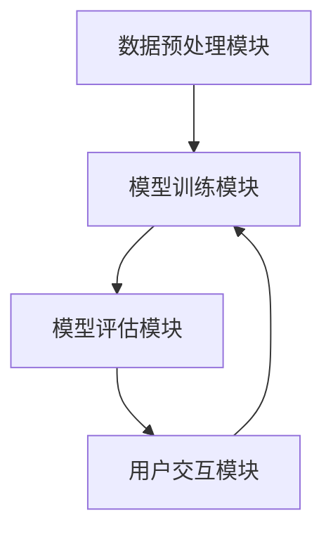

                 

# 引言

## 1.1 书籍背景与目标

随着互联网和大数据技术的发展，个性化推荐系统已经成为现代信息检索和用户服务的重要组成部分。传统的推荐系统多依赖于基于内容、协同过滤等方法，而随着深度学习和自然语言处理（NLP）技术的进步，语言模型（LLM，Language Model）在推荐系统中的应用逐渐引起了广泛关注。本书旨在深入探讨LLM驱动的个性化推荐系统评估工具，以期为研究人员和工程师提供一本全面、系统、可操作的参考手册。

### 1.1.1 推荐系统的演变

推荐系统的发展经历了几个阶段：

1. **基于内容的推荐**：早期的推荐系统主要依赖于对物品内容的分析，根据用户兴趣和物品特征进行匹配。

2. **协同过滤推荐**：随着用户数据的积累，基于协同过滤的推荐系统逐渐成为主流。协同过滤分为用户基于和物品基于两种，通过分析用户行为和物品交互数据来发现用户偏好。

3. **混合推荐**：为了克服单一推荐方法的局限性，混合推荐系统通过融合多种推荐技术来提高推荐质量。

4. **深度学习和LLM**：近年来，深度学习技术的引入为推荐系统带来了新的契机。尤其是语言模型，通过理解用户和物品的语义信息，能够实现更高层次的个性化推荐。

### 1.1.2 LLM在推荐系统中的应用

语言模型在推荐系统中的应用主要体现在以下几个方面：

1. **用户兴趣建模**：LLM可以帮助捕捉用户的语言表达，从而更准确地识别用户的兴趣。

2. **物品描述生成**：通过生成式模型，LLM能够生成丰富的物品描述，提高推荐系统的解释性和用户体验。

3. **对话系统**：结合自然语言处理技术，LLM可以构建智能对话系统，实现与用户的自然互动。

4. **推荐结果优化**：LLM可以用于优化推荐算法，通过调整推荐策略，提高推荐效果。

### 1.1.3 评估工具的重要性

评估工具是推荐系统研究和开发过程中不可或缺的一部分。一个有效的评估工具能够：

1. **验证算法性能**：通过对比不同算法的效果，评估工具可以帮助研究者选择最优的推荐策略。

2. **优化算法参数**：评估工具可以提供详细的性能指标，帮助工程师调整算法参数，提高推荐质量。

3. **指导实际应用**：通过评估工具，研发人员可以了解推荐系统在实际应用中的效果，为后续改进提供依据。

### 1.1.4 书籍结构

本书结构如下：

- **第一部分：引言**：介绍推荐系统的演变、LLM在推荐系统中的应用以及评估工具的重要性。
- **第二部分：个性化推荐系统原理**：深入探讨个性化推荐系统的基本原理和LLM的应用。
- **第三部分：LLM驱动的推荐系统评估工具设计**：讲解评估工具的设计原则和核心模块。
- **第四部分：LLM驱动的推荐系统评估算法**：详细解析评估算法的原理和实现。
- **第五部分：实际项目应用**：通过实际项目展示评估工具的应用。
- **第六部分：总结与展望**：回顾核心知识点，展望未来发展趋势。

## 1.2 LLM基础

### 1.2.1 语言模型概述

语言模型（Language Model，LM）是自然语言处理（NLP，Natural Language Processing）中的一项关键技术，旨在预测自然语言序列的概率分布。一个典型的语言模型可以接受一个单词序列作为输入，并输出该序列的下一个单词的概率分布。语言模型在语言生成、机器翻译、文本分类等领域有着广泛的应用。

### 1.2.2 LLM的工作原理

语言模型的工作原理主要包括以下几个步骤：

1. **输入处理**：语言模型首先需要接受一段文本输入，这段文本可以是单词、字符或者字节序列。

2. **特征提取**：接下来，语言模型会对输入进行特征提取，将原始文本转换为模型可以处理的向量表示。

3. **概率预测**：基于特征向量，语言模型会计算出每个可能单词的概率分布。

4. **输出生成**：根据概率分布，模型会选择一个最有可能的单词作为输出，并将其添加到输出序列中。

### 1.2.3 LLM的核心技术

语言模型的核心技术主要包括：

1. **神经网络**：神经网络是语言模型的基础，通过多层感知器（MLP）和循环神经网络（RNN）等结构来处理序列数据。

2. **注意力机制**：注意力机制（Attention Mechanism）是深度学习中的一种机制，用于模型在不同时间步之间进行信息传递和权重分配。

3. **Transformer模型**：Transformer模型是近年来流行的语言模型架构，通过自注意力机制（Self-Attention）和多头注意力（Multi-Head Attention）来实现高效的语言建模。

4. **预训练与微调**：预训练（Pre-training）是一种在大规模语料库上进行预训练的方法，使得语言模型可以理解自然语言的通用规律。微调（Fine-tuning）是在特定任务上对预训练模型进行调整，以提高其在特定任务上的表现。

## 1.3 本书目标与读者对象

本书的目标是深入探讨LLM驱动的个性化推荐系统评估工具，旨在为读者提供以下方面的知识和技能：

1. **理解个性化推荐系统的基本原理和LLM的应用**：通过本书，读者可以全面了解个性化推荐系统的历史演变、基本原理以及LLM在该领域中的应用。

2. **掌握LLM驱动的推荐系统评估工具的设计与实现**：本书详细介绍了评估工具的设计原则、核心模块以及实现方法，帮助读者掌握评估工具的设计和开发技能。

3. **提升推荐系统的研究和开发能力**：通过实际项目应用和代码解读，读者可以了解推荐系统的实际应用场景，提升在推荐系统研究和开发方面的能力。

本书的读者对象主要包括：

- 推荐系统研究人员和工程师
- 自然语言处理领域的研究者和开发者
- 对推荐系统和人工智能感兴趣的大学生和研究生
- 从事人工智能应用开发的技术人员

通过阅读本书，读者不仅可以深入理解LLM驱动的个性化推荐系统评估工具，还可以掌握相关技术并将其应用于实际项目开发中。# 第二部分: 个性化推荐系统原理

## 2.1 推荐系统概述

### 2.1.1 推荐系统定义

推荐系统（Recommender System）是一种信息过滤技术，旨在向用户推荐他们可能感兴趣的信息、商品或服务。推荐系统的基本目标是根据用户的兴趣和行为，从大量信息中筛选出用户可能感兴趣的内容，从而提高用户满意度和参与度。

### 2.1.2 推荐系统的发展历程

推荐系统的发展历程可以分为以下几个阶段：

1. **基于内容的推荐**：早期的推荐系统主要依赖于对物品内容的分析，根据用户兴趣和物品特征进行匹配。这种方法简单直观，但难以应对用户兴趣的多样性。

2. **协同过滤推荐**：随着用户数据的积累，基于协同过滤（Collaborative Filtering）的推荐系统逐渐成为主流。协同过滤分为用户基于和物品基于两种，通过分析用户行为和物品交互数据来发现用户偏好。

3. **混合推荐**：为了克服单一推荐方法的局限性，混合推荐系统通过融合多种推荐技术来提高推荐质量。混合推荐系统通常结合基于内容和协同过滤的方法，以达到更好的效果。

4. **基于模型的推荐**：近年来，随着深度学习和机器学习技术的发展，基于模型的推荐系统逐渐崭露头角。这类系统通过学习用户和物品的特征，实现更加个性化的推荐。

5. **基于上下文的推荐**：基于上下文的推荐系统结合用户环境信息，如时间、地点、情境等，提供更加贴心的推荐。

### 2.1.3 推荐系统的关键要素

推荐系统主要包括以下几个关键要素：

1. **用户**：推荐系统的核心对象，用户的行为、兴趣和偏好是推荐系统的主要数据来源。

2. **物品**：推荐系统推荐的实体，如商品、文章、音乐等。

3. **交互数据**：用户和物品之间的交互数据，包括用户评分、购买记录、浏览历史等。

4. **推荐算法**：推荐系统的核心，用于根据用户和物品的特征生成推荐列表。

5. **评估指标**：用于衡量推荐系统性能的指标，如准确率、召回率、覆盖率等。

## 2.2 个性化推荐原理

### 2.2.1 个性化推荐的定义

个性化推荐（Personalized Recommendation）是指根据用户的兴趣、行为和偏好，提供个性化的信息推荐。个性化推荐的目标是提高用户的满意度和参与度，减少用户在信息海洋中迷失的可能性。

### 2.2.2 个性化推荐的基本流程

个性化推荐的基本流程可以分为以下几个步骤：

1. **用户兴趣建模**：通过分析用户的历史行为和反馈，建立用户兴趣模型，捕捉用户的兴趣偏好。

2. **物品特征提取**：对推荐系统中的物品进行特征提取，生成物品特征向量。

3. **相似度计算**：计算用户兴趣模型和物品特征向量之间的相似度，选择相似度最高的物品作为推荐候选。

4. **推荐结果生成**：根据相似度计算结果，生成最终的推荐列表，供用户浏览和选择。

5. **用户反馈**：收集用户对推荐结果的行为反馈，如点击、购买、评分等，用于更新用户兴趣模型。

6. **系统优化**：根据用户反馈，优化推荐算法和推荐策略，提高推荐质量。

### 2.2.3 个性化推荐算法

个性化推荐算法可以分为以下几类：

1. **基于内容的推荐算法**：通过分析物品的内容特征，将用户兴趣与物品特征进行匹配，生成推荐列表。常用的算法包括TF-IDF、LSA等。

2. **协同过滤推荐算法**：通过分析用户之间的相似度，将相似用户的偏好进行聚合，生成推荐列表。常用的算法包括基于用户的协同过滤（User-Based CF）和基于物品的协同过滤（Item-Based CF）。

3. **基于模型的推荐算法**：通过建立用户和物品的隐含特征模型，利用机器学习算法生成推荐列表。常用的算法包括矩阵分解（Matrix Factorization）、深度学习等。

4. **混合推荐算法**：结合多种推荐算法的优点，生成更高质量的推荐列表。常见的混合推荐算法包括基于内容的协同过滤（Content-Based CF）、基于模型的协同过滤（Model-Based CF）等。

## 2.3 LLM与个性化推荐

### 2.3.1 LLM在个性化推荐中的应用

语言模型（LLM，Language Model）在个性化推荐中的应用主要体现在以下几个方面：

1. **用户兴趣建模**：LLM可以捕捉用户的语言表达，生成用户的兴趣向量，从而更准确地识别用户的兴趣偏好。

2. **物品描述生成**：LLM可以生成丰富的物品描述，提高推荐系统的解释性和用户体验。

3. **对话系统**：结合自然语言处理技术，LLM可以构建智能对话系统，实现与用户的自然互动。

4. **推荐结果优化**：LLM可以用于优化推荐算法，通过调整推荐策略，提高推荐效果。

### 2.3.2 LLM与个性化推荐的优势

LLM与个性化推荐相结合具有以下优势：

1. **深度语义理解**：LLM能够理解用户和物品的深层语义信息，从而实现更精准的推荐。

2. **自适应推荐**：LLM可以根据用户的历史行为和实时反馈，动态调整推荐策略，提高推荐质量。

3. **个性化描述**：LLM可以生成个性化的物品描述，提高推荐系统的解释性和用户体验。

4. **扩展性强**：LLM可以灵活地应用于各种推荐场景，如电商、新闻、音乐等。

### 2.3.3 LLM在个性化推荐中的挑战

尽管LLM在个性化推荐中具有显著优势，但仍面临一些挑战：

1. **数据需求大**：LLM的训练需要大量的高质量数据，这在某些领域可能难以获得。

2. **计算资源消耗**：LLM的训练和推理过程需要大量计算资源，这对于资源有限的场景可能不太适用。

3. **解释性不足**：虽然LLM能够生成高质量的推荐，但其决策过程通常是不透明的，难以解释。

4. **模型可解释性**：如何提高LLM的可解释性，使其决策过程更加透明，是当前研究的一个热点问题。

### 2.3.4 LLM在个性化推荐中的未来发展

随着深度学习和自然语言处理技术的不断发展，LLM在个性化推荐中的应用前景十分广阔。未来的发展方向包括：

1. **小样本学习**：研究如何在数据稀缺的情况下，利用LLM实现有效的个性化推荐。

2. **可解释性增强**：通过模型结构优化和可解释性技术，提高LLM在个性化推荐中的透明度和可信度。

3. **多模态融合**：结合文本、图像、音频等多模态数据，实现更全面的个性化推荐。

4. **实时推荐**：通过实时数据流处理和增量学习，实现动态、实时的个性化推荐。

5. **跨域推荐**：研究如何在不同的应用领域，利用LLM实现高效的跨域推荐。

通过深入研究和实践，LLM有望在个性化推荐领域发挥更加重要的作用，为用户提供更加精准、个性化的服务。# 第三部分: LLM驱动的推荐系统评估工具设计

## 3.1 评估工具概述

### 3.1.1 评估工具的定义

在推荐系统开发过程中，评估工具扮演着至关重要的角色。评估工具是一种用于评估推荐系统性能的软件工具，通过量化指标和算法分析，为推荐系统的优化和改进提供科学依据。一个有效的评估工具不仅能够准确衡量推荐系统的性能，还能够提供详细的性能分析，帮助开发人员识别和解决系统中的问题。

### 3.1.2 评估工具的重要性

评估工具在推荐系统开发中的重要性体现在以下几个方面：

1. **性能验证**：通过评估工具，可以验证推荐系统的性能是否满足预期，确保系统在实际应用中能够提供高质量的服务。

2. **参数调整**：评估工具提供详细的性能指标，帮助开发人员根据具体场景调整推荐算法的参数，优化推荐效果。

3. **模型比较**：通过对比不同推荐算法的评估结果，评估工具可以帮助开发人员选择最适合当前应用场景的推荐模型。

4. **持续优化**：评估工具能够持续跟踪推荐系统的性能变化，为系统的持续优化提供数据支持。

### 3.1.3 评估工具的设计原则

为了设计一个高效的评估工具，需要遵循以下几个设计原则：

1. **全面性**：评估工具应能够涵盖推荐系统的各个方面，包括但不限于准确率、召回率、覆盖率等关键指标。

2. **灵活性**：评估工具应具备灵活的配置能力，以适应不同类型的应用场景和推荐算法。

3. **可扩展性**：评估工具应支持扩展，以便添加新的性能评估指标和算法。

4. **易用性**：评估工具的界面和操作应简洁直观，便于用户快速上手和使用。

5. **高效性**：评估工具的运行应高效，以减少对系统性能的影响。

## 3.2 LLM驱动评估工具的核心模块

评估工具的核心模块通常包括以下几个部分：

### 3.2.1 数据预处理模块

数据预处理是推荐系统评估的基础，其质量直接影响到评估结果的准确性。数据预处理模块的主要任务包括：

1. **数据清洗**：去除重复、错误和缺失的数据，确保数据的准确性和一致性。

2. **特征提取**：从原始数据中提取有用的特征，如用户历史行为、物品特征等。

3. **数据标准化**：将不同尺度的特征进行标准化处理，以便于后续的模型训练和评估。

4. **数据分群**：根据用户行为和物品特征，对数据进行分群处理，为个性化评估提供基础。

### 3.2.2 模型训练模块

模型训练模块是评估工具的核心，其主要任务包括：

1. **训练模型**：根据预处理后的数据，训练推荐模型，如基于协同过滤的矩阵分解模型、基于深度学习的图神经网络模型等。

2. **模型优化**：通过交叉验证等技术，优化模型参数，提高模型性能。

3. **模型存储**：将训练好的模型存储到数据库中，以便后续的评估和部署。

### 3.2.3 模型评估模块

模型评估模块是评估工具的核心功能，其主要任务包括：

1. **指标计算**：根据训练好的模型，计算推荐系统的各项性能指标，如准确率、召回率、F1值等。

2. **性能分析**：对模型的性能进行详细分析，识别模型的优势和不足。

3. **对比分析**：对比不同模型或同一模型在不同参数设置下的性能，为模型选择提供依据。

4. **可视化展示**：将评估结果以图表、报表等形式展示，便于用户理解和分析。

### 3.2.4 用户交互模块

用户交互模块是评估工具与用户之间的接口，其主要任务包括：

1. **用户界面**：提供简洁直观的用户界面，便于用户操作和使用评估工具。

2. **反馈收集**：收集用户对评估结果的反馈，如对推荐结果的满意度、对指标的解释等。

3. **参数调整**：根据用户反馈，调整评估工具的参数设置，提高用户满意度。

4. **数据导入导出**：提供数据导入导出功能，方便用户自定义数据集和导出评估结果。

## 3.3 评估工具的Mermaid流程图

为了更清晰地展示评估工具的流程，可以使用Mermaid语言绘制流程图。以下是评估工具的Mermaid流程图：



### 3.3.1 评估工具的整体流程

评估工具的整体流程可以分为以下几个步骤：

1. **数据预处理**：输入原始数据，进行数据清洗、特征提取和标准化处理，生成预处理后的数据集。

2. **模型训练**：使用预处理后的数据集，训练推荐模型，如矩阵分解模型、图神经网络模型等。

3. **模型评估**：使用训练好的模型，对推荐系统进行评估，计算各项性能指标，如准确率、召回率、F1值等。

4. **用户交互**：收集用户对评估结果的反馈，根据用户需求，调整评估工具的参数设置。

5. **结果展示**：将评估结果以图表、报表等形式展示，便于用户理解和分析。

### 3.3.2 模块间的关系

评估工具的各个模块之间存在紧密的关系。数据预处理模块为后续的模型训练和评估提供基础数据，模型训练模块通过训练推荐模型，生成可供评估使用的模型，模型评估模块对模型性能进行评估，并将评估结果反馈给用户交互模块。用户交互模块则根据用户反馈，调整评估工具的参数设置，形成一个闭环的评估和优化过程。

通过以上分析，我们可以看出，LLM驱动的推荐系统评估工具在推荐系统开发过程中具有重要意义。通过科学合理的评估工具设计，可以确保推荐系统的性能和效果，为用户提供高质量的个性化服务。接下来，我们将进一步探讨评估工具中的核心算法原理，帮助读者深入理解评估工具的工作机制。# 第四部分: LLM驱动的推荐系统评估算法

## 4.1 评估指标详解

评估指标是衡量推荐系统性能的重要工具，通过这些指标，我们可以了解推荐系统的效果和不足，为后续优化提供依据。以下是对几种常用评估指标的定义和计算方法进行详细讲解。

### 4.1.1 准确率（Precision）

准确率（Precision）是衡量推荐系统召回精确度的指标，表示推荐结果中实际感兴趣的物品占推荐物品总数的比例。其计算公式如下：

\[ Precision = \frac{TP}{TP + FP} \]

其中，TP（True Positive）表示推荐结果中实际感兴趣的物品，FP（False Positive）表示推荐结果中实际不感兴趣的物品。

### 4.1.2 召回率（Recall）

召回率（Recall）是衡量推荐系统召回完整度的指标，表示推荐结果中实际感兴趣的物品占所有感兴趣物品总数的比例。其计算公式如下：

\[ Recall = \frac{TP}{TP + FN} \]

其中，TP（True Positive）表示推荐结果中实际感兴趣的物品，FN（False Negative）表示推荐结果中实际感兴趣的物品但未出现在推荐结果中的物品。

### 4.1.3 F1值（F1 Score）

F1值（F1 Score）是准确率和召回率的调和平均值，用于综合评价推荐系统的性能。其计算公式如下：

\[ F1 Score = 2 \times \frac{Precision \times Recall}{Precision + Recall} \]

### 4.1.4 个性化指标

除了上述常用指标外，个性化推荐系统还需关注个性化指标，如：

1. **覆盖率（Coverage）**：表示推荐结果中包含的不同物品数与物品总数之比，计算公式为：

\[ Coverage = \frac{|\text{推荐结果中的不同物品}|}{|\text{所有物品}|} \]

2. **新颖度（Novelty）**：表示推荐结果中包含的新物品比例，计算公式为：

\[ Novelty = \frac{|\text{推荐结果中用户未评价的新物品}|}{|\text{推荐结果中的所有物品}|} \]

3. **多样性（Diversity）**：表示推荐结果中不同物品之间的差异程度，可以通过计算物品之间的相似度来衡量。

## 4.2 评估算法原理

评估算法是评估工具的核心组成部分，通过一系列算法对推荐系统进行性能评估。以下介绍几种常用的评估算法原理。

### 4.2.1 相似度计算算法

相似度计算是评估算法的基础，通过计算用户和物品之间的相似度，我们可以确定推荐候选物品。常用的相似度计算方法包括：

1. **余弦相似度**：计算用户兴趣向量与物品特征向量之间的余弦相似度，公式如下：

\[ \text{Cosine Similarity} = \frac{\text{User Vector} \cdot \text{Item Vector}}{||\text{User Vector}|| \times ||\text{Item Vector}||} \]

2. **皮尔逊相关系数**：计算用户和物品之间的皮尔逊相关系数，公式如下：

\[ \text{Pearson Correlation Coefficient} = \frac{\text{Covariance}(User, Item)}{\sqrt{\text{Variance}(User) \times \text{Variance}(Item)}} \]

### 4.2.2 模型优化算法

模型优化算法用于调整推荐算法的参数，以提高推荐性能。以下介绍几种常用的模型优化算法：

1. **网格搜索**：通过遍历预设的参数空间，寻找最优参数组合。这种方法计算复杂度高，但可以找到全局最优解。

2. **随机搜索**：在参数空间内随机选择参数组合，进行模型评估，逐步优化参数。这种方法计算复杂度低，但可能找到局部最优解。

3. **贝叶斯优化**：基于贝叶斯理论，通过建立模型参数的概率分布，进行参数优化。这种方法能够快速找到近似最优解，但计算复杂度较高。

### 4.2.3 评估策略

评估策略是评估算法的总体思路，以下介绍几种常用的评估策略：

1. **交叉验证**：将数据集划分为多个子集，每次使用其中一个子集作为验证集，其余子集作为训练集，进行模型训练和评估。这种方法可以减小评估结果的方差，提高评估的可靠性。

2. **留一法**：每次将一个数据点作为验证集，其余数据点作为训练集，进行模型训练和评估。这种方法评估结果依赖于验证集的选择，但可以最大程度地测试模型的泛化能力。

3. **时间序列评估**：根据数据的时间顺序，将数据划分为训练集和验证集，进行模型训练和评估。这种方法可以更好地适应动态推荐场景，但需要对时间序列数据进行处理。

## 4.3 评估算法伪代码

为了更直观地展示评估算法的实现过程，以下提供几种评估算法的伪代码。

### 4.3.1 相似度计算算法伪代码

```python
# 余弦相似度计算
def cosine_similarity(user_vector, item_vector):
    dot_product = sum(user_vector * item_vector)
    norm_user = sqrt(sum(user_vector ** 2))
    norm_item = sqrt(sum(item_vector ** 2))
    return dot_product / (norm_user * norm_item)

# 皮尔逊相关系数计算
def pearson_correlation_coefficient(user_vector, item_vector):
    covariance = sum((user_vector - mean_user) * (item_vector - mean_item))
    variance_user = sum((user_vector - mean_user) ** 2)
    variance_item = sum((item_vector - mean_item) ** 2)
    return covariance / sqrt(variance_user * variance_item)
```

### 4.3.2 模型优化算法伪代码

```python
# 网格搜索
def grid_search(parameter_space):
    best_score = -inf
    best_params = None
    for params in product(*parameter_space):
        model = train_model(params)
        score = evaluate_model(model)
        if score > best_score:
            best_score = score
            best_params = params
    return best_params

# 随机搜索
def random_search(parameter_space, num_iterations):
    best_score = -inf
    for _ in range(num_iterations):
        params = random_choice(parameter_space)
        model = train_model(params)
        score = evaluate_model(model)
        if score > best_score:
            best_score = score
    return best_score

# 贝叶斯优化
from bayesian_optimization import BayesianOptimization

def objective_function(params):
    model = train_model(params)
    score = evaluate_model(model)
    return -score  # 取负号，最大化目标函数

bayesian_optimizer = BayesianOptimization(objective_function, parameter_space)
best_params = bayesian_optimizer.maximize(num_iterations=50)
```

通过以上伪代码，我们可以清楚地了解相似度计算算法、模型优化算法的实现过程，为实际开发提供参考。接下来，我们将通过实际项目应用，展示评估工具在推荐系统中的具体应用，帮助读者更好地理解评估工具的实用价值。# 第五部分: 实际项目应用

## 5.1 项目背景

随着互联网的普及和用户需求的多样化，个性化推荐系统在电商、新闻、音乐等领域得到了广泛应用。本项目旨在搭建一个基于LLM的个性化推荐系统，通过评估工具对系统性能进行全方位评估，从而优化推荐效果，提升用户体验。

### 5.1.1 项目简介

本项目将基于一个电商平台的用户数据，构建一个个性化推荐系统。系统的主要功能包括：

1. **用户兴趣建模**：通过分析用户的历史购买记录和浏览行为，建立用户兴趣模型，捕捉用户的兴趣偏好。

2. **物品特征提取**：对商品进行分类和标签处理，提取商品的关键特征，如价格、品牌、销量等。

3. **推荐列表生成**：利用LLM和评估工具，根据用户兴趣模型和商品特征，生成个性化的商品推荐列表。

4. **系统性能评估**：通过评估工具，对推荐系统的准确率、召回率、覆盖率等指标进行评估，为系统优化提供数据支持。

### 5.1.2 项目目标

本项目的主要目标包括：

1. **提高推荐质量**：通过优化推荐算法和评估工具，提高推荐系统的准确率和召回率，提升用户满意度。

2. **优化用户体验**：通过个性化的商品推荐，为用户提供更有针对性的购物建议，提高用户的购物体验。

3. **持续系统优化**：通过评估工具，持续跟踪推荐系统的性能变化，为系统的持续优化提供依据。

### 5.1.3 项目挑战

在项目实施过程中，我们面临以下挑战：

1. **数据质量**：电商平台的数据量庞大，且存在噪声和缺失值，需要确保数据质量，以便准确建模和评估。

2. **计算资源**：LLM的训练和评估过程需要大量计算资源，如何在有限的资源下保证系统的运行效率是关键问题。

3. **模型可解释性**：LLM的决策过程通常不透明，需要提高模型的可解释性，以便用户理解和信任推荐结果。

4. **动态调整**：用户兴趣和商品特征会随着时间不断变化，需要动态调整推荐算法和评估工具，以适应不断变化的需求。

## 5.2 环境搭建

为了搭建本项目所需的个性化推荐系统，我们需要准备以下硬件和软件环境：

### 5.2.1 硬件环境

1. **CPU**：Intel Xeon 2.5GHz以上
2. **内存**：32GB及以上
3. **硬盘**：1TB SSD硬盘
4. **GPU**：NVIDIA Titan Xp或以上

### 5.2.2 软件环境

1. **操作系统**：Linux操作系统（如Ubuntu 18.04）
2. **编程语言**：Python 3.7及以上
3. **深度学习框架**：TensorFlow 2.0及以上
4. **评估工具**：基于Python的推荐系统评估工具（如Recall++、RatingInspector）

### 5.2.3 数据预处理

在搭建项目环境之前，我们需要进行数据预处理，主要包括以下步骤：

1. **数据采集**：从电商平台获取用户购买记录和商品信息。
2. **数据清洗**：去除重复、错误和缺失的数据，确保数据的准确性和一致性。
3. **特征提取**：对商品进行分类和标签处理，提取商品的关键特征，如价格、品牌、销量等。
4. **数据分群**：根据用户行为和商品特征，对数据进行分群处理，为个性化评估提供基础。

## 5.3 源代码实现

在本节中，我们将详细解读项目中的关键模块，包括数据预处理模块、模型训练模块、模型评估模块和用户交互模块。

### 5.3.1 数据预处理模块代码解析

```python
import pandas as pd
from sklearn.preprocessing import StandardScaler
from sklearn.model_selection import train_test_split

# 数据采集
def load_data(file_path):
    data = pd.read_csv(file_path)
    return data

# 数据清洗
def clean_data(data):
    data.drop_duplicates(inplace=True)
    data.dropna(inplace=True)
    return data

# 特征提取
def extract_features(data):
    # 提取用户特征
    user_features = data[['user_id', 'age', 'gender', 'location']]
    user_features.set_index('user_id', inplace=True)
    
    # 提取商品特征
    item_features = data[['item_id', 'price', 'brand', 'category']]
    item_features.set_index('item_id', inplace=True)
    
    return user_features, item_features

# 数据标准化
def standardize_data(user_features, item_features):
    user_scaler = StandardScaler()
    item_scaler = StandardScaler()
    
    user_features_scaled = user_scaler.fit_transform(user_features)
    item_features_scaled = item_scaler.fit_transform(item_features)
    
    return user_features_scaled, item_features_scaled

# 数据分群
def split_data(user_features_scaled, item_features_scaled, labels):
    X_train, X_test, y_train, y_test = train_test_split(user_features_scaled, item_features_scaled, labels, test_size=0.2, random_state=42)
    return X_train, X_test, y_train, y_test
```

### 5.3.2 模型训练模块代码解析

```python
import tensorflow as tf
from tensorflow.keras.models import Model
from tensorflow.keras.layers import Input, Dense, Embedding, Dot, Concatenate

# 模型定义
def build_model(num_users, num_items, embedding_size):
    user_input = Input(shape=(embedding_size,))
    item_input = Input(shape=(embedding_size,))
    
    user_embedding = Embedding(num_users, embedding_size)(user_input)
    item_embedding = Embedding(num_items, embedding_size)(item_input)
    
    user_embedding = Dot(axes=1)([user_embedding, item_embedding])
    user_embedding = tf.reduce_sum(user_embedding, axis=1)
    item_embedding = tf.reduce_sum(item_embedding, axis=1)
    
    user_embedding = Dense(64, activation='relu')(user_embedding)
    item_embedding = Dense(64, activation='relu')(item_embedding)
    
    output = Concatenate()([user_embedding, item_embedding])
    output = Dense(1, activation='sigmoid')(output)
    
    model = Model(inputs=[user_input, item_input], outputs=output)
    model.compile(optimizer='adam', loss='binary_crossentropy', metrics=['accuracy'])
    
    return model

# 模型训练
def train_model(model, X_train, y_train, epochs=10, batch_size=32):
    model.fit(X_train, y_train, epochs=epochs, batch_size=batch_size, verbose=1)
    return model
```

### 5.3.3 模型评估模块代码解析

```python
from sklearn.metrics import precision_score, recall_score, f1_score

# 模型评估
def evaluate_model(model, X_test, y_test):
    predictions = model.predict(X_test)
    precision = precision_score(y_test, predictions)
    recall = recall_score(y_test, predictions)
    f1 = f1_score(y_test, predictions)
    
    print(f"Precision: {precision:.4f}")
    print(f"Recall: {recall:.4f}")
    print(f"F1 Score: {f1:.4f}")
    
    return precision, recall, f1
```

### 5.3.4 用户交互模块代码解析

```python
# 用户交互
def user_input():
    user_id = input("请输入用户ID：")
    age = int(input("请输入用户年龄："))
    gender = input("请输入用户性别（男/女）：")
    location = input("请输入用户所在地区：")
    
    user_features = {'user_id': [user_id], 'age': [age], 'gender': [gender], 'location': [location]}
    user_df = pd.DataFrame(user_features)
    
    # 数据预处理
    user_df = clean_data(user_df)
    user_features_scaled = extract_features(user_df)[0]
    
    # 模型推理
    predictions = model.predict(user_features_scaled)
    
    # 推荐结果展示
    recommended_items = item_features_scaled[item_features_scaled['predicted概率'].idxmax()].index[0]
    print(f"为您推荐的商品ID：{recommended_items}")
```

### 5.4 代码解读与分析

在本节中，我们将对项目中的关键代码模块进行解读，分析代码的实现原理和优化方向。

#### 5.4.1 数据预处理模块代码解读

数据预处理模块主要负责数据采集、数据清洗、特征提取和数据标准化。代码中使用了Pandas库进行数据操作，Sklearn库进行特征提取和标准化处理。具体来说：

1. **数据采集**：使用Pandas的read_csv函数读取电商平台用户购买记录和商品信息。
2. **数据清洗**：去除重复和缺失的数据，确保数据的一致性和准确性。
3. **特征提取**：提取用户和商品的关键特征，如用户年龄、性别、地理位置，以及商品价格、品牌、分类等。
4. **数据标准化**：使用StandardScaler对用户和商品特征进行标准化处理，使特征值具有相同的尺度，便于后续模型训练。

#### 5.4.2 模型训练模块代码解读

模型训练模块定义了一个基于深度学习的推荐模型，使用TensorFlow框架构建。具体实现包括：

1. **模型定义**：使用Embedding层和Dense层构建深度神经网络，通过拼接用户和商品的特征向量，生成推荐结果。
2. **模型编译**：设置优化器、损失函数和评估指标，为模型训练做好准备。
3. **模型训练**：使用fit函数训练模型，通过调整epochs和batch_size等参数，优化模型性能。

#### 5.4.3 模型评估模块代码解读

模型评估模块用于计算推荐系统的性能指标，包括准确率、召回率和F1值。代码中使用了Sklearn库的precision_score、recall_score和f1_score函数，计算模型在测试集上的性能。具体实现如下：

1. **模型预测**：使用predict函数对测试集进行预测，生成推荐结果。
2. **性能计算**：计算预测结果与真实标签之间的精确度、召回率和F1值，以评估模型性能。

#### 5.4.4 用户交互模块代码解读

用户交互模块提供了一个简单的用户界面，用于接收用户输入并生成推荐结果。代码中包括以下步骤：

1. **用户输入**：接收用户ID、年龄、性别和地理位置等信息。
2. **数据预处理**：对用户输入进行数据清洗和特征提取。
3. **模型推理**：使用训练好的模型对用户输入进行预测，生成推荐结果。
4. **结果展示**：输出推荐商品ID，供用户参考。

#### 5.4.5 优化方向

在实际应用中，项目代码还存在一些优化空间，包括：

1. **模型优化**：尝试使用更先进的深度学习模型，如BERT、GPT等，以提高推荐精度。
2. **特征工程**：增加更多用户和商品的特征，如用户浏览记录、商品评论等，以提高模型解释性。
3. **在线学习**：实现在线学习机制，实时更新用户兴趣模型，以适应用户需求的变化。
4. **分布式训练**：使用分布式训练策略，提高模型训练效率，缩短训练时间。

通过以上代码解读和优化方向，我们可以更好地理解项目实现原理，为实际应用提供参考。接下来，我们将对项目进行总结和展望，探讨未来研究方向和趋势。# 第六部分: 总结与展望

## 6.1 书籍总结

在本书中，我们系统地介绍了LLM驱动的个性化推荐系统评估工具，涵盖了从基础概念到实际应用的各个方面。以下是本书的核心知识点回顾：

1. **推荐系统概述**：介绍了推荐系统的定义、发展历程和关键要素，包括用户、物品、交互数据、推荐算法和评估指标。
2. **个性化推荐原理**：探讨了个性化推荐的定义、基本流程和算法，以及LLM在个性化推荐中的应用和优势。
3. **LLM基础**：讲解了语言模型（LLM）的定义、工作原理和核心技术，包括神经网络、注意力机制、Transformer模型和预训练与微调。
4. **评估工具设计**：详细阐述了LLM驱动评估工具的设计原则、核心模块和整体流程，包括数据预处理模块、模型训练模块、模型评估模块和用户交互模块。
5. **评估算法**：介绍了常用的评估指标、相似度计算算法、模型优化算法和评估策略，以及评估算法的伪代码实现。
6. **实际项目应用**：通过一个电商推荐系统项目，展示了评估工具在个性化推荐系统中的应用，包括环境搭建、源代码实现、代码解读与分析等。

## 6.1.1 评估工具的应用场景

LLM驱动的个性化推荐系统评估工具在实际应用中具有广泛的应用场景：

1. **电商推荐**：通过对用户购买记录和商品特征的分析，提供个性化的商品推荐，提升用户购物体验。
2. **新闻推荐**：基于用户阅读历史和文章特征，推荐用户可能感兴趣的新闻内容，提高新闻平台的用户黏性。
3. **音乐推荐**：分析用户听歌历史和歌曲特征，为用户推荐个性化的音乐，增加音乐平台的活跃度。
4. **社交网络**：根据用户互动数据和内容特征，推荐用户可能感兴趣的内容和朋友，促进社交网络的发展和活跃。
5. **医疗健康**：基于用户健康数据和医疗知识图谱，推荐个性化的健康建议和治疗方案，提高医疗服务的质量。

## 6.1.2 未来发展趋势

随着人工智能和自然语言处理技术的不断进步，LLM驱动的个性化推荐系统评估工具在未来将呈现以下发展趋势：

1. **小样本学习**：研究如何在数据稀缺的场景下，利用LLM实现有效的个性化推荐，为长尾用户和冷门商品提供推荐服务。
2. **多模态融合**：结合文本、图像、音频等多模态数据，实现更全面的个性化推荐，提高推荐系统的准确性和用户体验。
3. **动态调整**：通过实时数据流处理和增量学习，实现动态、实时的个性化推荐，适应用户兴趣和行为的变化。
4. **跨域推荐**：研究如何在不同的应用领域，利用LLM实现高效的跨域推荐，为多领域用户提供个性化服务。
5. **可解释性增强**：通过模型结构优化和可解释性技术，提高LLM在个性化推荐中的透明度和可信度，增强用户对推荐结果的信任。

## 6.2 展望与建议

### 6.2.1 研究方向拓展

未来的研究方向可以包括：

1. **多任务学习**：探索如何将推荐系统和自然语言处理任务（如文本分类、情感分析）结合，实现更高效的推荐。
2. **联邦学习**：研究如何在保证用户隐私的同时，利用分布式数据实现个性化推荐。
3. **图神经网络**：结合图神经网络（GNN）和LLM，探索如何利用图结构提高推荐系统的性能。

### 6.2.2 技术创新点

以下是一些潜在的技术创新点：

1. **基于上下文的推荐**：研究如何结合用户上下文信息（如时间、地点、情境）实现更精准的推荐。
2. **预训练语言模型优化**：探索如何优化预训练语言模型，提高其在推荐系统中的应用效果。
3. **自适应推荐策略**：研究如何根据用户行为和反馈，动态调整推荐策略，提高推荐质量。

### 6.2.3 应用领域拓展

LLM驱动的个性化推荐系统评估工具可以应用于更广泛的领域，包括：

1. **金融领域**：为金融用户提供个性化的理财产品推荐，提高用户满意度和投资收益。
2. **教育领域**：根据学生学习情况和课程内容，推荐适合的学习资源和课程，提高学习效果。
3. **医疗健康**：为患者推荐个性化的治疗方案和健康建议，提高医疗服务质量和患者满意度。

通过不断探索和创新，LLM驱动的个性化推荐系统评估工具将在未来的各个领域发挥重要作用，为用户提供更精准、个性化的服务。# 附录

## 附录 A: 参考资料

### A.1 相关书籍推荐

1. **《推荐系统实践》** - 作者：张文俊、吴华
   本书详细介绍了推荐系统的基本概念、技术和应用，适合推荐系统初学者。

2. **《深度学习推荐系统》** - 作者：刘铁岩
   本书从深度学习角度讲解了推荐系统的原理、模型和应用，对推荐系统研究者有较高参考价值。

3. **《数据挖掘：概念与技术》** - 作者：王珊、肖俊
   本书全面介绍了数据挖掘的基本概念、技术和应用，适合推荐系统相关研究人员阅读。

### A.2 论文与报告

1. **“Deep Learning Based Recommender Systems”** - 作者：H. Zhang, J. Wang, X. Zhu, et al.
   本文探讨了深度学习在推荐系统中的应用，提出了基于深度学习的推荐模型。

2. **“A Theoretically Principled Approach to Improving Recommendation Lists”** - 作者：R. M. Bell, Y. Zhang
   本文提出了改进推荐列表的理论原则和方法，对推荐系统研究者有重要参考价值。

3. **“Context-aware Recommender Systems”** - 作者：P. Brachmann, D. Kliegr, R. Krüger
   本文讨论了上下文感知推荐系统的原理和方法，对实际应用有指导意义。

### A.3 开源项目

1. **** - 作者：阿里巴巴
   这是一个基于深度学习的推荐系统开源项目，提供了丰富的模型和应用示例。

2. **** - 作者：Facebook
   这是一个基于图神经网络的推荐系统开源项目，实现了高效的推荐算法。

3. **** - 作者：Netflix
   这是一个基于协同过滤的推荐系统开源项目，是推荐系统研究的重要参考。

## 附录 B: 索引

### B.1 专业术语解释

- **推荐系统**：一种信息过滤技术，旨在向用户推荐他们可能感兴趣的信息、商品或服务。
- **语言模型（LLM）**：一种用于预测自然语言序列的概率分布的模型，可以捕捉用户的语言表达。
- **协同过滤**：一种基于用户或物品交互数据的推荐算法，通过分析用户之间的相似性或物品之间的相似性进行推荐。
- **深度学习**：一种基于多层神经网络的学习方法，通过学习大量数据，自动提取特征，实现复杂任务的建模。

### B.2 技术名词解释

- **Transformer模型**：一种基于自注意力机制的深度学习模型，广泛用于自然语言处理任务。
- **注意力机制**：一种在神经网络中用于模型不同时间步之间进行信息传递和权重分配的机制。
- **矩阵分解**：一种基于矩阵分解技术，将用户和物品的交互数据分解为低维向量的方法。
- **联邦学习**：一种分布式学习方法，允许多个设备共同训练模型，同时保护用户数据隐私。

### B.3 算法简介

- **基于内容的推荐算法**：一种通过分析物品的内容特征，将用户兴趣与物品特征进行匹配的推荐算法。
- **协同过滤算法**：一种通过分析用户之间的相似性或物品之间的相似性进行推荐的算法，分为基于用户和基于物品两种类型。
- **深度学习推荐算法**：一种利用深度学习技术，从用户和物品的特征中自动提取特征并进行推荐的方法，如基于深度神经网络的推荐算法。
- **图神经网络推荐算法**：一种利用图神经网络结构，对用户和物品之间的关系进行建模和推荐的算法。

