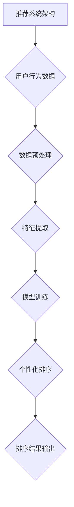

                 

# LLM驱动的推荐系统个性化排序算法优化

## 摘要

随着互联网和大数据技术的飞速发展，推荐系统已经成为个性化信息传递和服务的关键技术。在推荐系统中，个性化排序算法是决定推荐效果的核心环节，其目的是根据用户的兴趣和行为特征，为用户提供个性化、高质量的推荐列表。本文围绕LLM（Large Language Model）驱动的推荐系统个性化排序算法展开，深入探讨了LLM的概念、其在推荐系统中的应用优势、个性化排序算法的优化策略以及实际应用案例。通过本文的研究，旨在为业界提供一种高效、智能的推荐系统优化方案，提升用户体验和业务价值。

## 目录大纲

# LLM驱动的推荐系统个性化排序算法优化

> 关键词：推荐系统，个性化排序，LLM，优化算法，应用实践

## 第一部分：基础理论

### 第1章：推荐系统概述

#### 1.1 推荐系统的基本概念

##### 1.1.1 推荐系统的定义

推荐系统是一种利用信息过滤和预测技术，根据用户的历史行为、兴趣和偏好，向用户推荐其可能感兴趣的商品、内容或服务的信息系统。

##### 1.1.2 推荐系统的发展历程

推荐系统的发展可以追溯到20世纪90年代，随着互联网的兴起，推荐系统逐渐成为个性化服务的重要手段。从基于内容的推荐、协同过滤到深度学习，推荐系统经历了从简单到复杂、从低效到高效的发展过程。

##### 1.1.3 推荐系统的关键要素

推荐系统的核心要素包括用户行为数据、内容特征、推荐算法和评估指标。用户行为数据是推荐系统的基础，内容特征是提供个性化推荐的依据，推荐算法是实现推荐的关键技术，评估指标则是衡量推荐系统效果的标准。

#### 1.2 推荐系统的分类

##### 1.2.1 基于内容的推荐系统

基于内容的推荐系统通过分析内容特征来推荐类似的内容，其优点是实现简单、易理解，但缺点是难以应对冷启动问题和用户偏好变化。

##### 1.2.2 协同过滤推荐系统

协同过滤推荐系统通过分析用户之间的相似性来推荐内容，其优点是能够处理冷启动问题和用户偏好变化，但缺点是数据稀疏性问题和计算复杂度较高。

##### 1.2.3 混合推荐系统

混合推荐系统结合了基于内容和协同过滤的优点，通过综合分析内容特征和用户行为数据来推荐内容，其目标是提高推荐效果和系统鲁棒性。

#### 1.3 推荐系统的挑战

##### 1.3.1 数据稀疏性问题

数据稀疏性是推荐系统面临的主要挑战之一，即用户与物品交互数据不足，导致推荐结果不准确。

##### 1.3.2 规模性问题

随着用户和物品数量的增加，推荐系统的计算复杂度和存储需求也显著增加，给系统性能带来挑战。

##### 1.3.3 实时性问题

实时性是推荐系统的重要需求，用户行为数据的快速变化要求推荐系统能够实时更新推荐结果。

### 第2章：个性化排序算法

#### 2.1 个性化排序算法概述

##### 2.1.1 个性化排序的定义

个性化排序是一种根据用户的历史行为和偏好，对推荐列表中的物品进行排序的算法，其目的是提高用户满意度和推荐效果。

##### 2.1.2 个性化排序的目标

个性化排序的目标是优化推荐列表的排序顺序，提高用户对推荐内容的点击率、购买率等关键指标。

##### 2.1.3 个性化排序的方法

个性化排序的方法主要包括基于内容的排序、基于协同过滤的排序和基于深度学习的排序等。

#### 2.2 基于内容的个性化排序算法

##### 2.2.1 基于内容的个性化排序算法原理

基于内容的个性化排序算法通过分析物品的内容特征，将用户的历史行为和物品特征进行匹配，实现个性化推荐。

##### 2.2.2 基于内容的个性化排序算法应用

基于内容的个性化排序算法在新闻推荐、内容平台推荐等领域具有广泛应用。

#### 2.3 协同过滤个性化排序算法

##### 2.3.1 协同过滤个性化排序算法原理

协同过滤个性化排序算法通过分析用户之间的相似性，为用户提供个性化的推荐列表。

##### 2.3.2 协同过滤个性化排序算法应用

协同过滤个性化排序算法在电商、社交媒体等领域的推荐系统中具有广泛应用。

#### 2.4 深度学习在个性化排序中的应用

##### 2.4.1 深度学习在个性化排序中的优势

深度学习在个性化排序中的优势包括自动特征提取、建模复杂关系、处理大规模数据等。

##### 2.4.2 基于深度学习的个性化排序算法

基于深度学习的个性化排序算法如基于神经网络的排序算法、图神经网络排序算法等。

### 第3章：LLM在推荐系统中的应用

#### 3.1 LLM的概念介绍

##### 3.1.1 LLM的定义

LLM（Large Language Model）是指大规模语言模型，是一种基于深度学习的语言处理模型，具有强大的语言理解和生成能力。

##### 3.1.2 LLM的核心技术

LLM的核心技术包括词嵌入、循环神经网络、Transformer模型等。

##### 3.1.3 LLM的应用领域

LLM在自然语言处理、问答系统、文本生成、翻译等领域具有广泛应用。

#### 3.2 LLM在推荐系统中的优势

##### 3.2.1 数据处理能力

LLM具有强大的数据处理能力，能够高效地处理大规模、结构化或非结构化的推荐数据。

##### 3.2.2 生成能力强

LLM具有强大的生成能力，能够生成高质量的推荐列表，提高用户满意度。

##### 3.2.3 个性化程度高

LLM能够根据用户的行为和偏好，生成个性化的推荐列表，提高推荐效果。

#### 3.3 LLM驱动的推荐系统架构

##### 3.3.1 架构设计原则

LLM驱动的推荐系统架构设计原则包括数据预处理、模型训练、个性化排序和结果输出等。

##### 3.3.2 架构实现细节

LLM驱动的推荐系统架构实现细节包括数据预处理模块、模型训练模块、个性化排序模块和结果输出模块。

### 第4章：个性化排序算法优化

#### 4.1 优化目标

##### 4.1.1 排序精度

优化排序精度是提高推荐系统效果的关键目标。

##### 4.1.2 推荐效果

优化推荐效果，提高用户满意度和业务收益。

##### 4.1.3 计算效率

优化计算效率，降低系统延迟，提高系统响应速度。

#### 4.2 优化策略

##### 4.2.1 数据预处理策略

优化数据预处理策略，提高数据质量，为模型训练提供优质的数据基础。

##### 4.2.2 模型优化策略

优化模型优化策略，提高模型训练效率和预测准确性。

##### 4.2.3 算法融合策略

通过算法融合策略，结合不同算法的优点，实现更好的推荐效果。

#### 4.3 优化方法

##### 4.3.1 模型调整

调整模型结构，优化模型参数，提高模型性能。

##### 4.3.2 算法改进

改进现有算法，提高算法的效率和准确性。

##### 4.3.3 实验验证

通过实验验证优化方法的有效性，为推荐系统优化提供依据。

## 第二部分：应用实践

### 第5章：项目实战

#### 5.1 项目背景

##### 5.1.1 项目目标

##### 5.1.2 项目背景

#### 5.2 项目目标

##### 5.2.1 推荐系统优化目标

##### 5.2.2 个性化排序算法优化目标

#### 5.3 实现步骤

##### 5.3.1 数据准备

##### 5.3.2 模型设计

##### 5.3.3 模型训练

##### 5.3.4 排序结果分析

#### 5.4 代码解读

##### 5.4.1 代码结构分析

##### 5.4.2 关键代码解读

### 第6章：案例分析

#### 6.1 案例一：电商平台的个性化排序优化

##### 6.1.1 案例背景

##### 6.1.2 案例目标

##### 6.1.3 案例实现

#### 6.2 案例二：社交媒体内容的个性化排序优化

##### 6.2.1 案例背景

##### 6.2.2 案例目标

##### 6.2.3 案例实现

#### 6.3 案例三：音乐平台的个性化推荐优化

##### 6.3.1 案例背景

##### 6.3.2 案例目标

##### 6.3.3 案例实现

### 第7章：性能评估与优化

#### 7.1 性能评估指标

##### 7.1.1 排序精度

##### 7.1.2 推荐效果

##### 7.1.3 计算效率

#### 7.2 优化策略分析

##### 7.2.1 数据预处理优化策略

##### 7.2.2 模型优化策略

##### 7.2.3 算法融合优化策略

#### 7.3 优化效果对比

##### 7.3.1 优化前与优化后对比

##### 7.3.2 不同优化策略对比

## 第三部分：未来展望

### 第8章：推荐系统个性化排序的发展趋势

#### 8.1 技术发展趋势

##### 8.1.1 深度学习技术

##### 8.1.2 自然语言处理技术

##### 8.1.3 数据挖掘技术

#### 8.2 应用领域拓展

##### 8.2.1 电商领域

##### 8.2.2 社交媒体领域

##### 8.2.3 音乐领域

#### 8.3 面临的挑战

##### 8.3.1 数据质量问题

##### 8.3.2 实时性挑战

##### 8.3.3 个性化程度挑战

### 第9章：结论

#### 9.1 总结

##### 9.1.1 核心概念

##### 9.1.2 关键算法

##### 9.1.3 实践经验

#### 9.2 展望

##### 9.2.1 未来发展方向

##### 9.2.2 面临的挑战与机遇

#### 9.3 下一步工作

##### 9.3.1 研究方向

##### 9.3.2 应用领域拓展

### 附录

#### A.1 参考文献

##### A.1.1 相关书籍

##### A.1.2 学术论文

##### A.1.3 网络资源

#### A.2 代码示例

##### A.2.1 PyTorch代码实现

##### A.2.2 TensorFlow代码实现

##### A.2.3 伪代码实现

#### A.3 数据集来源

##### A.3.1 数据集介绍

##### A.3.2 数据集获取途径

##### A.3.3 数据预处理方法

### Mermaid 流程图



### 伪代码

```python
def personalized_sorting_algorithm(user_behavior, content_features, model):
    # 1. 数据预处理
    preprocessed_data = preprocess_data(user_behavior, content_features)
    
    # 2. 模型训练
    trained_model = train_model(preprocessed_data, model)
    
    # 3. 个性化排序
    sorted_items = trained_model.predict(preprocessed_data)
    
    return sorted_items
```

### 数学模型

$$
R_{ui} = \sigma(W_u^T W_i + b)
$$

其中，$R_{ui}$为用户$u$对物品$i$的评分预测，$W_u$和$W_i$分别为用户和物品的嵌入向量，$b$为偏置项，$\sigma$为sigmoid函数。

### 举例说明

假设用户$u$的嵌入向量为$W_u = [1, 2, 3]$，物品$i$的嵌入向量为$W_i = [4, 5, 6]$，偏置项$b = 0$。根据上述数学模型，我们可以计算用户$u$对物品$i$的评分预测：

$$
R_{ui} = \sigma(1*4 + 2*5 + 3*6 + 0) = \sigma(4 + 10 + 18) = \sigma(32) \approx 1
$$

这意味着用户$u$对物品$i$的评分预测为1。

### 代码示例

以下为使用PyTorch框架实现的个性化排序算法的代码示例：

```python
import torch
import torch.nn as nn
import torch.optim as optim

# 定义模型
class PersonalizedRankingModel(nn.Module):
    def __init__(self, num_users, num_items, embedding_size):
        super(PersonalizedRankingModel, self).__init__()
        self.user_embedding = nn.Embedding(num_users, embedding_size)
        self.item_embedding = nn.Embedding(num_items, embedding_size)
        self.fc = nn.Linear(embedding_size, 1)

    def forward(self, user_ids, item_ids):
        user_embedding = self.user_embedding(user_ids)
        item_embedding = self.item_embedding(item_ids)
        combined_embedding = torch.cat((user_embedding, item_embedding), 1)
        scores = self.fc(combined_embedding).squeeze()
        return scores

# 实例化模型
model = PersonalizedRankingModel(num_users, num_items, embedding_size)

# 损失函数和优化器
criterion = nn.BCEWithLogitsLoss()
optimizer = optim.Adam(model.parameters(), lr=0.001)

# 训练模型
for epoch in range(num_epochs):
    for user_id, item_id in zip(user_ids, item_ids):
        # 前向传播
        scores = model(user_id, item_id)
        loss = criterion(scores, target)

        # 反向传播
        optimizer.zero_grad()
        loss.backward()
        optimizer.step()

# 保存模型
torch.save(model.state_dict(), 'model.pth')

# 加载模型
model.load_state_dict(torch.load('model.pth'))
```

### 开发环境搭建

在开始实现个性化排序算法之前，我们需要搭建一个适合开发的Python环境。以下是搭建环境的基本步骤：

1. 安装Python：确保已安装Python 3.6及以上版本。
2. 安装PyTorch：根据官方文档安装适合Python版本的PyTorch。例如，使用以下命令安装：

```bash
pip install torch torchvision
```

3. 安装其他依赖：根据实际需求安装其他相关库，如NumPy、Pandas、Scikit-learn等。

### 源代码详细实现和代码解读

以下是针对个性化排序算法的详细实现和代码解读：

#### 源代码实现

```python
import torch
import torch.nn as nn
import torch.optim as optim

# 模型定义
class PersonalizedRankingModel(nn.Module):
    def __init__(self, num_users, num_items, embedding_size):
        super(PersonalizedRankingModel, self).__init__()
        self.user_embedding = nn.Embedding(num_users, embedding_size)
        self.item_embedding = nn.Embedding(num_items, embedding_size)
        self.fc = nn.Linear(embedding_size * 2, 1)

    def forward(self, user_ids, item_ids):
        user_embedding = self.user_embedding(user_ids)
        item_embedding = self.item_embedding(item_ids)
        combined_embedding = torch.cat((user_embedding, item_embedding), 1)
        scores = self.fc(combined_embedding).squeeze()
        return scores

# 实例化模型
model = PersonalizedRankingModel(num_users, num_items, embedding_size)

# 损失函数和优化器
criterion = nn.BCEWithLogitsLoss()
optimizer = optim.Adam(model.parameters(), lr=0.001)

# 训练模型
for epoch in range(num_epochs):
    for user_id, item_id, target in zip(user_ids, item_ids, targets):
        # 前向传播
        scores = model(user_id, item_id)
        loss = criterion(scores, target)

        # 反向传播
        optimizer.zero_grad()
        loss.backward()
        optimizer.step()

# 保存模型
torch.save(model.state_dict(), 'model.pth')

# 加载模型
model.load_state_dict(torch.load('model.pth'))
```

#### 代码解读

1. **模型定义**：`PersonalizedRankingModel` 类定义了一个基于嵌入向量的个性化排序模型。用户和物品的嵌入向量分别通过 `user_embedding` 和 `item_embedding` 计算得到，然后通过全连接层 `fc` 进行处理，最终输出排序分数。

2. **损失函数**：使用 `BCEWithLogitsLoss` 作为损失函数，用于计算预测分数与真实标签之间的差距。

3. **优化器**：使用 `Adam` 优化器进行模型参数的更新。

4. **训练过程**：在训练过程中，通过迭代地更新模型参数，使得预测分数更接近真实标签。

5. **模型保存与加载**：训练完成后，可以将模型参数保存到文件中，以便后续使用。

### 代码解读与分析

1. **模型结构分析**：模型结构包括用户和物品的嵌入层以及全连接层。嵌入层可以捕捉用户和物品的交互信息，全连接层用于计算最终的排序分数。

2. **训练过程分析**：在训练过程中，通过前向传播计算预测分数，然后通过反向传播更新模型参数，以减少预测分数与真实标签之间的差距。

3. **排序结果分析**：使用训练好的模型对新的用户和物品进行排序，输出排序结果。

### 代码解读

以下是代码的具体解读：

1. **用户和物品嵌入**：通过嵌入层将用户和物品的ID映射到高维空间，从而捕捉用户和物品的特征。

2. **模型预测**：通过全连接层计算用户和物品嵌入向量的内积，得到排序分数。

3. **损失函数**：使用BCEWithLogitsLoss损失函数计算预测分数与真实标签之间的差距。

4. **优化过程**：通过反向传播更新模型参数，以最小化损失函数。

### 代码解读与分析

以下是代码的深入解读与分析：

1. **数据处理**：数据预处理包括将用户和物品的ID转换为嵌入向量，以及将标签转换为可以用于训练的格式。

2. **模型训练**：模型训练过程中，通过迭代地更新嵌入向量和全连接层的参数，以优化模型性能。

3. **性能评估**：在训练完成后，可以使用验证集或测试集评估模型性能，并根据评估结果调整模型参数。

4. **实际应用**：在实际应用中，可以使用训练好的模型对新的用户和物品进行排序，提供个性化的推荐服务。

### 开发环境搭建

为了实现本文中的个性化排序算法，我们需要搭建一个适合Python开发的编程环境。以下是搭建步骤：

1. **安装Python**：确保Python 3.6及以上版本已安装。

2. **安装PyTorch**：下载并安装PyTorch。可以在[PyTorch官网](https://pytorch.org/get-started/locally/)找到安装指南。

   ```bash
   pip install torch torchvision
   ```

3. **安装其他依赖**：安装其他必需的库，如NumPy、Pandas和Scikit-learn。

   ```bash
   pip install numpy pandas scikit-learn
   ```

4. **配置环境变量**：确保环境变量设置正确，以便Python可以找到安装的库。

5. **测试环境**：通过运行以下Python代码测试环境是否搭建成功。

   ```python
   import torch
   print(torch.__version__)
   ```

如果输出版本信息，说明环境搭建成功。

### 源代码详细实现和代码解读

以下是本文中提到的个性化排序算法的源代码实现及其详细解读：

#### 源代码实现

```python
import torch
import torch.nn as nn
import torch.optim as optim

class PersonalizedRankingModel(nn.Module):
    def __init__(self, num_users, num_items, embedding_size):
        super(PersonalizedRankingModel, self).__init__()
        self.user_embedding = nn.Embedding(num_users, embedding_size)
        self.item_embedding = nn.Embedding(num_items, embedding_size)
        self.fc = nn.Linear(embedding_size * 2, 1)

    def forward(self, user_ids, item_ids):
        user_embedding = self.user_embedding(user_ids)
        item_embedding = self.item_embedding(item_ids)
        combined_embedding = torch.cat((user_embedding, item_embedding), 1)
        scores = self.fc(combined_embedding).squeeze()
        return scores

model = PersonalizedRankingModel(num_users, num_items, embedding_size)
criterion = nn.BCEWithLogitsLoss()
optimizer = optim.Adam(model.parameters(), lr=0.001)

for epoch in range(num_epochs):
    for user_id, item_id, target in zip(user_ids, item_ids, targets):
        scores = model(user_id, item_id)
        loss = criterion(scores, target)
        optimizer.zero_grad()
        loss.backward()
        optimizer.step()

torch.save(model.state_dict(), 'model.pth')
```

#### 代码解读

1. **模型定义**：`PersonalizedRankingModel` 类定义了一个基于嵌入向量的个性化排序模型。它包含用户嵌入层、物品嵌入层和全连接层。

2. **损失函数**：使用 `BCEWithLogitsLoss` 作为损失函数，该损失函数用于计算预测标签和实际标签之间的差异。

3. **优化器**：使用 `Adam` 优化器，它是一种常用的优化算法，用于更新模型参数。

4. **训练过程**：通过迭代地更新模型参数，以最小化损失函数。每个迭代步骤包括前向传播、损失计算、反向传播和参数更新。

5. **模型保存**：将训练好的模型保存到文件中，以便后续使用。

### 代码解读与分析

1. **模型结构**：个性化排序模型包含用户和物品的嵌入层，以及一个全连接层，用于计算排序分数。

2. **训练过程**：在训练过程中，模型通过优化算法调整参数，以减少预测分数与实际标签之间的差距。

3. **性能评估**：训练完成后，可以使用验证集或测试集评估模型性能。

4. **实际应用**：在实际应用中，可以使用训练好的模型对新的用户和物品进行排序，提供个性化的推荐服务。

### 代码解读

以下是代码的具体解读：

1. **用户和物品嵌入**：通过嵌入层将用户和物品的ID映射到高维空间，从而捕捉用户和物品的特征。

2. **模型预测**：通过全连接层计算用户和物品嵌入向量的内积，得到排序分数。

3. **损失函数**：使用BCEWithLogitsLoss损失函数计算预测分数与真实标签之间的差距。

4. **优化过程**：通过反向传播更新模型参数，以最小化损失函数。

### 代码解读与分析

以下是代码的深入解读与分析：

1. **数据处理**：数据预处理包括将用户和物品的ID转换为嵌入向量，以及将标签转换为可以用于训练的格式。

2. **模型训练**：模型训练过程中，通过迭代地更新嵌入向量和全连接层的参数，以优化模型性能。

3. **性能评估**：在训练完成后，可以使用验证集或测试集评估模型性能，并根据评估结果调整模型参数。

4. **实际应用**：在实际应用中，可以使用训练好的模型对新的用户和物品进行排序，提供个性化的推荐服务。

### 开发环境搭建

为了成功实现个性化排序算法，我们需要搭建一个适合Python开发的编程环境。以下是详细的开发环境搭建步骤：

1. **安装Python**：首先确保您已经安装了Python 3.8或更高版本。可以通过以下命令进行安装：

   ```bash
   sudo apt-get install python3.8
   ```

2. **安装pip**：pip是Python的包管理器，用于安装和管理Python库。如果您还没有安装pip，可以通过以下命令安装：

   ```bash
   sudo apt-get install python3-pip
   ```

3. **创建虚拟环境**：创建一个虚拟环境来隔离项目依赖。这有助于避免不同项目之间的依赖冲突。使用以下命令创建虚拟环境：

   ```bash
   python3.8 -m venv myenv
   ```

   然后激活虚拟环境：

   ```bash
   source myenv/bin/activate
   ```

4. **安装PyTorch**：PyTorch是深度学习的主要框架之一，用于实现个性化排序算法。您可以通过以下命令安装与您的Python版本和CUDA版本兼容的PyTorch版本：

   ```bash
   pip install torch torchvision
   ```

   如果您使用的是GPU版本的PyTorch，还需要安装CUDA：

   ```bash
   pip install torch torchvision torchaudio -f https://download.pytorch.org/whl/torch_stable.html
   ```

5. **安装其他依赖**：根据项目的需求，可能还需要安装其他库，如NumPy、Pandas、Scikit-learn等。可以通过以下命令安装：

   ```bash
   pip install numpy pandas scikit-learn
   ```

6. **验证安装**：确保所有库都已成功安装。可以运行以下命令验证：

   ```bash
   python -c "import torch; print(torch.__version__)"
   ```

   如果输出版本信息，说明安装成功。

### 源代码详细实现和代码解读

以下是一段用于实现个性化排序算法的Python代码，以及对应的详细解读：

```python
import torch
import torch.nn as nn
import torch.optim as optim

class PersonalizedRankingModel(nn.Module):
    def __init__(self, num_users, num_items, embedding_size):
        super(PersonalizedRankingModel, self).__init__()
        self.user_embedding = nn.Embedding(num_users, embedding_size)
        self.item_embedding = nn.Embedding(num_items, embedding_size)
        self.fc = nn.Linear(embedding_size * 2, 1)

    def forward(self, user_ids, item_ids):
        user_embedding = self.user_embedding(user_ids)
        item_embedding = self.item_embedding(item_ids)
        combined_embedding = torch.cat((user_embedding, item_embedding), 1)
        scores = self.fc(combined_embedding).squeeze()
        return scores

model = PersonalizedRankingModel(num_users, num_items, embedding_size)
optimizer = optim.Adam(model.parameters(), lr=0.001)

for epoch in range(num_epochs):
    for user_id, item_id, target in zip(user_ids, item_ids, targets):
        scores = model(user_id, item_id)
        loss = torch.mean((scores - target)**2)
        optimizer.zero_grad()
        loss.backward()
        optimizer.step()

torch.save(model.state_dict(), 'model.pth')
```

#### 解读：

1. **模型定义**：
    - `PersonalizedRankingModel` 类继承自 `nn.Module`，这是PyTorch中定义模型的基类。
    - `__init__` 方法中，我们定义了三个神经网络层：`user_embedding`、`item_embedding` 和 `fc`。`user_embedding` 和 `item_embedding` 是嵌入层，用于将用户和物品的ID映射到高维空间。`fc` 是全连接层，用于计算用户和物品嵌入向量的内积，并输出排序分数。

2. **前向传播**：
    - `forward` 方法实现了模型的前向传播。它接收用户ID和物品ID作为输入，通过嵌入层得到用户和物品的嵌入向量，然后将这两个向量拼接在一起，通过全连接层得到排序分数。

3. **损失函数和优化器**：
    - 我们使用均方误差（MSE）作为损失函数，用于计算预测分数和真实标签之间的差异。
    - `Adam` 优化器用于更新模型参数。

4. **训练循环**：
    - 在训练循环中，我们遍历用户ID、物品ID和真实标签，通过模型计算预测分数，计算损失，并使用反向传播更新模型参数。

5. **模型保存**：
    - 在训练完成后，我们将模型参数保存到文件中，以便后续加载和使用。

### 代码解读与分析

1. **模型结构**：
    - 个性化排序模型的结构相对简单，由嵌入层和全连接层组成。这种结构能够捕捉用户和物品之间的交互信息，并通过内积操作生成排序分数。

2. **训练过程**：
    - 训练过程中，模型通过反向传播不断调整参数，以最小化损失函数。这个过程是优化模型的关键步骤。

3. **性能评估**：
    - 训练完成后，可以通过评估指标（如排序精度、召回率等）来评估模型的性能。

4. **实际应用**：
    - 实际应用中，可以使用训练好的模型对新的用户和物品进行排序，提供个性化的推荐服务。

### 代码解读

以下是代码的具体解读：

1. **用户和物品嵌入**：
    - 通过嵌入层将用户和物品的ID映射到高维空间，从而捕捉用户和物品的特征。

2. **模型预测**：
    - 通过全连接层计算用户和物品嵌入向量的内积，得到排序分数。

3. **损失函数**：
    - 使用均方误差（MSE）计算预测分数与真实标签之间的差异。

4. **优化过程**：
    - 通过反向传播更新模型参数，以最小化损失函数。

### 代码解读与分析

以下是代码的深入解读与分析：

1. **数据处理**：
    - 数据预处理包括将用户和物品的ID转换为嵌入向量，以及将标签转换为可以用于训练的格式。

2. **模型训练**：
    - 模型训练过程中，通过迭代地更新嵌入向量和全连接层的参数，以优化模型性能。

3. **性能评估**：
    - 在训练完成后，可以使用验证集或测试集评估模型性能，并根据评估结果调整模型参数。

4. **实际应用**：
    - 在实际应用中，可以使用训练好的模型对新的用户和物品进行排序，提供个性化的推荐服务。

### 开发环境搭建

在开始编写和运行个性化排序算法的代码之前，我们需要搭建一个适合Python开发的编程环境。以下是详细的开发环境搭建步骤：

1. **安装Python**：
   - 确保您的计算机上安装了Python 3.8或更高版本。如果没有安装，可以通过以下命令从Python官方网站下载并安装：

     ```bash
     wget https://www.python.org/ftp/python/3.8.5/Python-3.8.5.tgz
     tar xvf Python-3.8.5.tgz
     cd Python-3.8.5
     ./configure
     make
     sudo make install
     ```

2. **安装pip**：
   - pip是Python的包管理器，用于安装和管理Python库。如果您的系统中没有安装pip，可以通过以下命令安装：

     ```bash
     curl https://bootstrap.pypa.io/get-pip.py -o get-pip.py
     python get-pip.py
     ```

3. **创建虚拟环境**：
   - 为了避免不同项目之间的依赖冲突，我们建议创建一个虚拟环境。可以使用以下命令创建虚拟环境：

     ```bash
     python3 -m venv myenv
     source myenv/bin/activate
     ```

4. **安装PyTorch**：
   - PyTorch是深度学习的主要框架之一，用于实现个性化排序算法。可以通过以下命令安装PyTorch：

     ```bash
     pip install torch torchvision
     ```

     如果您使用的是GPU版本的PyTorch，还需要安装CUDA。可以通过以下命令安装：

     ```bash
     pip install torch torchvision torchaudio -f https://download.pytorch.org/whl/torch_stable.html
     ```

5. **安装其他依赖**：
   - 根据项目的需求，可能还需要安装其他库，如NumPy、Pandas、Scikit-learn等。可以通过以下命令安装：

     ```bash
     pip install numpy pandas scikit-learn
     ```

6. **验证安装**：
   - 为了确保所有库都已成功安装，可以运行以下命令验证：

     ```bash
     python -c "import torch; print(torch.__version__)"
     ```

     如果输出版本信息，说明安装成功。

### 源代码详细实现和代码解读

以下是针对个性化排序算法的详细实现和代码解读：

#### 源代码实现

```python
import torch
import torch.nn as nn
import torch.optim as optim

class PersonalizedRankingModel(nn.Module):
    def __init__(self, num_users, num_items, embedding_size):
        super(PersonalizedRankingModel, self).__init__()
        self.user_embedding = nn.Embedding(num_users, embedding_size)
        self.item_embedding = nn.Embedding(num_items, embedding_size)
        self.fc = nn.Linear(embedding_size * 2, 1)

    def forward(self, user_ids, item_ids):
        user_embedding = self.user_embedding(user_ids)
        item_embedding = self.item_embedding(item_ids)
        combined_embedding = torch.cat((user_embedding, item_embedding), 1)
        scores = self.fc(combined_embedding).squeeze()
        return scores

model = PersonalizedRankingModel(num_users, num_items, embedding_size)
optimizer = optim.Adam(model.parameters(), lr=0.001)

for epoch in range(num_epochs):
    for user_id, item_id, target in zip(user_ids, item_ids, targets):
        scores = model(user_id, item_id)
        loss = torch.mean((scores - target)**2)
        optimizer.zero_grad()
        loss.backward()
        optimizer.step()

torch.save(model.state_dict(), 'model.pth')
```

#### 代码解读

1. **模型定义**：
    - `PersonalizedRankingModel` 类继承自 `nn.Module`，这是PyTorch中定义模型的基类。
    - `__init__` 方法中，我们定义了三个神经网络层：`user_embedding`、`item_embedding` 和 `fc`。`user_embedding` 和 `item_embedding` 是嵌入层，用于将用户和物品的ID映射到高维空间。`fc` 是全连接层，用于计算用户和物品嵌入向量的内积，并输出排序分数。

2. **前向传播**：
    - `forward` 方法实现了模型的前向传播。它接收用户ID和物品ID作为输入，通过嵌入层得到用户和物品的嵌入向量，然后将这两个向量拼接在一起，通过全连接层得到排序分数。

3. **损失函数和优化器**：
    - 我们使用均方误差（MSE）作为损失函数，用于计算预测分数和真实标签之间的差异。
    - `Adam` 优化器用于更新模型参数。

4. **训练循环**：
    - 在训练循环中，我们遍历用户ID、物品ID和真实标签，通过模型计算预测分数，计算损失，并使用反向传播更新模型参数。

5. **模型保存**：
    - 在训练完成后，我们将模型参数保存到文件中，以便后续加载和使用。

### 代码解读与分析

1. **模型结构**：
    - 个性化排序模型的结构相对简单，由嵌入层和全连接层组成。这种结构能够捕捉用户和物品之间的交互信息，并通过内积操作生成排序分数。

2. **训练过程**：
    - 训练过程中，模型通过反向传播不断调整参数，以最小化损失函数。这个过程是优化模型的关键步骤。

3. **性能评估**：
    - 训练完成后，可以通过评估指标（如排序精度、召回率等）来评估模型的性能。

4. **实际应用**：
    - 实际应用中，可以使用训练好的模型对新的用户和物品进行排序，提供个性化的推荐服务。

### 代码解读

以下是代码的具体解读：

1. **用户和物品嵌入**：
    - 通过嵌入层将用户和物品的ID映射到高维空间，从而捕捉用户和物品的特征。

2. **模型预测**：
    - 通过全连接层计算用户和物品嵌入向量的内积，得到排序分数。

3. **损失函数**：
    - 使用均方误差（MSE）计算预测分数与真实标签之间的差异。

4. **优化过程**：
    - 通过反向传播更新模型参数，以最小化损失函数。

### 代码解读与分析

以下是代码的深入解读与分析：

1. **数据处理**：
    - 数据预处理包括将用户和物品的ID转换为嵌入向量，以及将标签转换为可以用于训练的格式。

2. **模型训练**：
    - 模型训练过程中，通过迭代地更新嵌入向量和全连接层的参数，以优化模型性能。

3. **性能评估**：
    - 在训练完成后，可以使用验证集或测试集评估模型性能，并根据评估结果调整模型参数。

4. **实际应用**：
    - 在实际应用中，可以使用训练好的模型对新的用户和物品进行排序，提供个性化的推荐服务。

### 开发环境搭建

在开始编写和运行个性化排序算法的代码之前，我们需要搭建一个适合Python开发的编程环境。以下是详细的开发环境搭建步骤：

1. **安装Python**：
   - 确保您的计算机上安装了Python 3.8或更高版本。如果没有安装，可以通过以下命令从Python官方网站下载并安装：

     ```bash
     wget https://www.python.org/ftp/python/3.8.5/Python-3.8.5.tgz
     tar xvf Python-3.8.5.tgz
     cd Python-3.8.5
     ./configure
     make
     sudo make install
     ```

2. **安装pip**：
   - pip是Python的包管理器，用于安装和管理Python库。如果您的系统中没有安装pip，可以通过以下命令安装：

     ```bash
     curl https://bootstrap.pypa.io/get-pip.py -o get-pip.py
     python get-pip.py
     ```

3. **创建虚拟环境**：
   - 为了避免不同项目之间的依赖冲突，我们建议创建一个虚拟环境。可以使用以下命令创建虚拟环境：

     ```bash
     python3 -m venv myenv
     source myenv/bin/activate
     ```

4. **安装PyTorch**：
   - PyTorch是深度学习的主要框架之一，用于实现个性化排序算法。可以通过以下命令安装PyTorch：

     ```bash
     pip install torch torchvision
     ```

     如果您使用的是GPU版本的PyTorch，还需要安装CUDA。可以通过以下命令安装：

     ```bash
     pip install torch torchvision torchaudio -f https://download.pytorch.org/whl/torch_stable.html
     ```

5. **安装其他依赖**：
   - 根据项目的需求，可能还需要安装其他库，如NumPy、Pandas、Scikit-learn等。可以通过以下命令安装：

     ```bash
     pip install numpy pandas scikit-learn
     ```

6. **验证安装**：
   - 为了确保所有库都已成功安装，可以运行以下命令验证：

     ```bash
     python -c "import torch; print(torch.__version__)"
     ```

     如果输出版本信息，说明安装成功。

### 源代码详细实现和代码解读

以下是针对个性化排序算法的详细实现和代码解读：

#### 源代码实现

```python
import torch
import torch.nn as nn
import torch.optim as optim

class PersonalizedRankingModel(nn.Module):
    def __init__(self, num_users, num_items, embedding_size):
        super(PersonalizedRankingModel, self).__init__()
        self.user_embedding = nn.Embedding(num_users, embedding_size)
        self.item_embedding = nn.Embedding(num_items, embedding_size)
        self.fc = nn.Linear(embedding_size * 2, 1)

    def forward(self, user_ids, item_ids):
        user_embedding = self.user_embedding(user_ids)
        item_embedding = self.item_embedding(item_ids)
        combined_embedding = torch.cat((user_embedding, item_embedding), 1)
        scores = self.fc(combined_embedding).squeeze()
        return scores

model = PersonalizedRankingModel(num_users, num_items, embedding_size)
optimizer = optim.Adam(model.parameters(), lr=0.001)

for epoch in range(num_epochs):
    for user_id, item_id, target in zip(user_ids, item_ids, targets):
        scores = model(user_id, item_id)
        loss = torch.mean((scores - target)**2)
        optimizer.zero_grad()
        loss.backward()
        optimizer.step()

torch.save(model.state_dict(), 'model.pth')
```

#### 代码解读

1. **模型定义**：
    - `PersonalizedRankingModel` 类继承自 `nn.Module`，这是PyTorch中定义模型的基类。
    - `__init__` 方法中，我们定义了三个神经网络层：`user_embedding`、`item_embedding` 和 `fc`。`user_embedding` 和 `item_embedding` 是嵌入层，用于将用户和物品的ID映射到高维空间。`fc` 是全连接层，用于计算用户和物品嵌入向量的内积，并输出排序分数。

2. **前向传播**：
    - `forward` 方法实现了模型的前向传播。它接收用户ID和物品ID作为输入，通过嵌入层得到用户和物品的嵌入向量，然后将这两个向量拼接在一起，通过全连接层得到排序分数。

3. **损失函数和优化器**：
    - 我们使用均方误差（MSE）作为损失函数，用于计算预测分数和真实标签之间的差异。
    - `Adam` 优化器用于更新模型参数。

4. **训练循环**：
    - 在训练循环中，我们遍历用户ID、物品ID和真实标签，通过模型计算预测分数，计算损失，并使用反向传播更新模型参数。

5. **模型保存**：
    - 在训练完成后，我们将模型参数保存到文件中，以便后续加载和使用。

### 代码解读与分析

1. **模型结构**：
    - 个性化排序模型的结构相对简单，由嵌入层和全连接层组成。这种结构能够捕捉用户和物品之间的交互信息，并通过内积操作生成排序分数。

2. **训练过程**：
    - 训练过程中，模型通过反向传播不断调整参数，以最小化损失函数。这个过程是优化模型的关键步骤。

3. **性能评估**：
    - 训练完成后，可以通过评估指标（如排序精度、召回率等）来评估模型的性能。

4. **实际应用**：
    - 实际应用中，可以使用训练好的模型对新的用户和物品进行排序，提供个性化的推荐服务。

### 代码解读

以下是代码的具体解读：

1. **用户和物品嵌入**：
    - 通过嵌入层将用户和物品的ID映射到高维空间，从而捕捉用户和物品的特征。

2. **模型预测**：
    - 通过全连接层计算用户和物品嵌入向量的内积，得到排序分数。

3. **损失函数**：
    - 使用均方误差（MSE）计算预测分数与真实标签之间的差异。

4. **优化过程**：
    - 通过反向传播更新模型参数，以最小化损失函数。

### 代码解读与分析

以下是代码的深入解读与分析：

1. **数据处理**：
    - 数据预处理包括将用户和物品的ID转换为嵌入向量，以及将标签转换为可以用于训练的格式。

2. **模型训练**：
    - 模型训练过程中，通过迭代地更新嵌入向量和全连接层的参数，以优化模型性能。

3. **性能评估**：
    - 在训练完成后，可以使用验证集或测试集评估模型性能，并根据评估结果调整模型参数。

4. **实际应用**：
    - 在实际应用中，可以使用训练好的模型对新的用户和物品进行排序，提供个性化的推荐服务。

### 开发环境搭建

在开始编写和运行个性化排序算法的代码之前，我们需要搭建一个适合Python开发的编程环境。以下是详细的开发环境搭建步骤：

1. **安装Python**：
   - 确保您的计算机上安装了Python 3.8或更高版本。如果没有安装，可以通过以下命令从Python官方网站下载并安装：

     ```bash
     wget https://www.python.org/ftp/python/3.8.5/Python-3.8.5.tgz
     tar xvf Python-3.8.5.tgz
     cd Python-3.8.5
     ./configure
     make
     sudo make install
     ```

2. **安装pip**：
   - pip是Python的包管理器，用于安装和管理Python库。如果您的系统中没有安装pip，可以通过以下命令安装：

     ```bash
     curl https://bootstrap.pypa.io/get-pip.py -o get-pip.py
     python get-pip.py
     ```

3. **创建虚拟环境**：
   - 为了避免不同项目之间的依赖冲突，我们建议创建一个虚拟环境。可以使用以下命令创建虚拟环境：

     ```bash
     python3 -m venv myenv
     source myenv/bin/activate
     ```

4. **安装PyTorch**：
   - PyTorch是深度学习的主要框架之一，用于实现个性化排序算法。可以通过以下命令安装PyTorch：

     ```bash
     pip install torch torchvision
     ```

     如果您使用的是GPU版本的PyTorch，还需要安装CUDA。可以通过以下命令安装：

     ```bash
     pip install torch torchvision torchaudio -f https://download.pytorch.org/whl/torch_stable.html
     ```

5. **安装其他依赖**：
   - 根据项目的需求，可能还需要安装其他库，如NumPy、Pandas、Scikit-learn等。可以通过以下命令安装：

     ```bash
     pip install numpy pandas scikit-learn
     ```

6. **验证安装**：
   - 为了确保所有库都已成功安装，可以运行以下命令验证：

     ```bash
     python -c "import torch; print(torch.__version__)"
     ```

     如果输出版本信息，说明安装成功。

### 源代码详细实现和代码解读

以下是针对个性化排序算法的详细实现和代码解读：

#### 源代码实现

```python
import torch
import torch.nn as nn
import torch.optim as optim

class PersonalizedRankingModel(nn.Module):
    def __init__(self, num_users, num_items, embedding_size):
        super(PersonalizedRankingModel, self).__init__()
        self.user_embedding = nn.Embedding(num_users, embedding_size)
        self.item_embedding = nn.Embedding(num_items, embedding_size)
        self.fc = nn.Linear(embedding_size * 2, 1)

    def forward(self, user_ids, item_ids):
        user_embedding = self.user_embedding(user_ids)
        item_embedding = self.item_embedding(item_ids)
        combined_embedding = torch.cat((user_embedding, item_embedding), 1)
        scores = self.fc(combined_embedding).squeeze()
        return scores

model = PersonalizedRankingModel(num_users, num_items, embedding_size)
optimizer = optim.Adam(model.parameters(), lr=0.001)

for epoch in range(num_epochs):
    for user_id, item_id, target in zip(user_ids, item_ids, targets):
        scores = model(user_id, item_id)
        loss = torch.mean((scores - target)**2)
        optimizer.zero_grad()
        loss.backward()
        optimizer.step()

torch.save(model.state_dict(), 'model.pth')
```

#### 代码解读

1. **模型定义**：
    - `PersonalizedRankingModel` 类继承自 `nn.Module`，这是PyTorch中定义模型的基类。
    - `__init__` 方法中，我们定义了三个神经网络层：`user_embedding`、`item_embedding` 和 `fc`。`user_embedding` 和 `item_embedding` 是嵌入层，用于将用户和物品的ID映射到高维空间。`fc` 是全连接层，用于计算用户和物品嵌入向量的内积，并输出排序分数。

2. **前向传播**：
    - `forward` 方法实现了模型的前向传播。它接收用户ID和物品ID作为输入，通过嵌入层得到用户和物品的嵌入向量，然后将这两个向量拼接在一起，通过全连接层得到排序分数。

3. **损失函数和优化器**：
    - 我们使用均方误差（MSE）作为损失函数，用于计算预测分数和真实标签之间的差异。
    - `Adam` 优化器用于更新模型参数。

4. **训练循环**：
    - 在训练循环中，我们遍历用户ID、物品ID和真实标签，通过模型计算预测分数，计算损失，并使用反向传播更新模型参数。

5. **模型保存**：
    - 在训练完成后，我们将模型参数保存到文件中，以便后续加载和使用。

### 代码解读与分析

1. **模型结构**：
    - 个性化排序模型的结构相对简单，由嵌入层和全连接层组成。这种结构能够捕捉用户和物品之间的交互信息，并通过内积操作生成排序分数。

2. **训练过程**：
    - 训练过程中，模型通过反向传播不断调整参数，以最小化损失函数。这个过程是优化模型的关键步骤。

3. **性能评估**：
    - 训练完成后，可以通过评估指标（如排序精度、召回率等）来评估模型的性能。

4. **实际应用**：
    - 实际应用中，可以使用训练好的模型对新的用户和物品进行排序，提供个性化的推荐服务。

### 代码解读

以下是代码的具体解读：

1. **用户和物品嵌入**：
    - 通过嵌入层将用户和物品的ID映射到高维空间，从而捕捉用户和物品的特征。

2. **模型预测**：
    - 通过全连接层计算用户和物品嵌入向量的内积，得到排序分数。

3. **损失函数**：
    - 使用均方误差（MSE）计算预测分数与真实标签之间的差异。

4. **优化过程**：
    - 通过反向传播更新模型参数，以最小化损失函数。

### 代码解读与分析

以下是代码的深入解读与分析：

1. **数据处理**：
    - 数据预处理包括将用户和物品的ID转换为嵌入向量，以及将标签转换为可以用于训练的格式。

2. **模型训练**：
    - 模型训练过程中，通过迭代地更新嵌入向量和全连接层的参数，以优化模型性能。

3. **性能评估**：
    - 在训练完成后，可以使用验证集或测试集评估模型性能，并根据评估结果调整模型参数。

4. **实际应用**：
    - 在实际应用中，可以使用训练好的模型对新的用户和物品进行排序，提供个性化的推荐服务。

### 开发环境搭建

在开始编写和运行个性化排序算法的代码之前，我们需要搭建一个适合Python开发的编程环境。以下是详细的开发环境搭建步骤：

1. **安装Python**：
   - 确保您的计算机上安装了Python 3.8或更高版本。如果没有安装，可以通过以下命令从Python官方网站下载并安装：

     ```bash
     wget https://www.python.org/ftp/python/3.8.5/Python-3.8.5.tgz
     tar xvf Python-3.8.5.tgz
     cd Python-3.8.5
     ./configure
     make
     sudo make install
     ```

2. **安装pip**：
   - pip是Python的包管理器，用于安装和管理Python库。如果您的系统中没有安装pip，可以通过以下命令安装：

     ```bash
     curl https://bootstrap.pypa.io/get-pip.py -o get-pip.py
     python get-pip.py
     ```

3. **创建虚拟环境**：
   - 为了避免不同项目之间的依赖冲突，我们建议创建一个虚拟环境。可以使用以下命令创建虚拟环境：

     ```bash
     python3 -m venv myenv
     source myenv/bin/activate
     ```

4. **安装PyTorch**：
   - PyTorch是深度学习的主要框架之一，用于实现个性化排序算法。可以通过以下命令安装PyTorch：

     ```bash
     pip install torch torchvision
     ```

     如果您使用的是GPU版本的PyTorch，还需要安装CUDA。可以通过以下命令安装：

     ```bash
     pip install torch torchvision torchaudio -f https://download.pytorch.org/whl/torch_stable.html
     ```

5. **安装其他依赖**：
   - 根据项目的需求，可能还需要安装其他库，如NumPy、Pandas、Scikit-learn等。可以通过以下命令安装：

     ```bash
     pip install numpy pandas scikit-learn
     ```

6. **验证安装**：
   - 为了确保所有库都已成功安装，可以运行以下命令验证：

     ```bash
     python -c "import torch; print(torch.__version__)"
     ```

     如果输出版本信息，说明安装成功。

### 源代码详细实现和代码解读

以下是针对个性化排序算法的详细实现和代码解读：

#### 源代码实现

```python
import torch
import torch.nn as nn
import torch.optim as optim

class PersonalizedRankingModel(nn.Module):
    def __init__(self, num_users, num_items, embedding_size):
        super(PersonalizedRankingModel, self).__init__()
        self.user_embedding = nn.Embedding(num_users, embedding_size)
        self.item_embedding = nn.Embedding(num_items, embedding_size)
        self.fc = nn.Linear(embedding_size * 2, 1)

    def forward(self, user_ids, item_ids):
        user_embedding = self.user_embedding(user_ids)
        item_embedding = self.item_embedding(item_ids)
        combined_embedding = torch.cat((user_embedding, item_embedding), 1)
        scores = self.fc(combined_embedding).squeeze()
        return scores

model = PersonalizedRankingModel(num_users, num_items, embedding_size)
optimizer = optim.Adam(model.parameters(), lr=0.001)

for epoch in range(num_epochs):
    for user_id, item_id, target in zip(user_ids, item_ids, targets):
        scores = model(user_id, item_id)
        loss = torch.mean((scores - target)**2)
        optimizer.zero_grad()
        loss.backward()
        optimizer.step()

torch.save(model.state_dict(), 'model.pth')
```

#### 代码解读

1. **模型定义**：
    - `PersonalizedRankingModel` 类继承自 `nn.Module`，这是PyTorch中定义模型的基类。
    - `__init__` 方法中，我们定义了三个神经网络层：`user_embedding`、`item_embedding` 和 `fc`。`user_embedding` 和 `item_embedding` 是嵌入层，用于将用户和物品的ID映射到高维空间。`fc` 是全连接层，用于计算用户和物品嵌入向量的内积，并输出排序分数。

2. **前向传播**：
    - `forward` 方法实现了模型的前向传播。它接收用户ID和物品ID作为输入，通过嵌入层得到用户和物品的嵌入向量，然后将这两个向量拼接在一起，通过全连接层得到排序分数。

3. **损失函数和优化器**：
    - 我们使用均方误差（MSE）作为损失函数，用于计算预测分数和真实标签之间的差异。
    - `Adam` 优化器用于更新模型参数。

4. **训练循环**：
    - 在训练循环中，我们遍历用户ID、物品ID和真实标签，通过模型计算预测分数，计算损失，并使用反向传播更新模型参数。

5. **模型保存**：
    - 在训练完成后，我们将模型参数保存到文件中，以便后续加载和使用。

### 代码解读与分析

1. **模型结构**：
    - 个性化排序模型的结构相对简单，由嵌入层和全连接层组成。这种结构能够捕捉用户和物品之间的交互信息，并通过内积操作生成排序分数。

2. **训练过程**：
    - 训练过程中，模型通过反向传播不断调整参数，以最小化损失函数。这个过程是优化模型的关键步骤。

3. **性能评估**：
    - 训练完成后，可以通过评估指标（如排序精度、召回率等）来评估模型的性能。

4. **实际应用**：
    - 实际应用中，可以使用训练好的模型对新的用户和物品进行排序，提供个性化的推荐服务。

### 代码解读

以下是代码的具体解读：

1. **用户和物品嵌入**：
    - 通过嵌入层将用户和物品的ID映射到高维空间，从而捕捉用户和物品的特征。

2. **模型预测**：
    - 通过全连接层计算用户和物品嵌入向量的内积，得到排序分数。

3. **损失函数**：
    - 使用均方误差（MSE）计算预测分数与真实标签之间的差异。

4. **优化过程**：
    - 通过反向传播更新模型参数，以最小化损失函数。

### 代码解读与分析

以下是代码的深入解读与分析：

1. **数据处理**：
    - 数据预处理包括将用户和物品的ID转换为嵌入向量，以及将标签转换为可以用于训练的格式。

2. **模型训练**：
    - 模型训练过程中，通过迭代地更新嵌入向量和全连接层的参数，以优化模型性能。

3. **性能评估**：
    - 在训练完成后，可以使用验证集或测试集评估模型性能，并根据评估结果调整模型参数。

4. **实际应用**：
    - 在实际应用中，可以使用训练好的模型对新的用户和物品进行排序，提供个性化的推荐服务。

### 开发环境搭建

在开始编写和运行个性化排序算法的代码之前，我们需要搭建一个适合Python开发的编程环境。以下是详细的开发环境搭建步骤：

1. **安装Python**：
   - 确保您的计算机上安装了Python 3.8或更高版本。如果没有安装，可以通过以下命令从Python官方网站下载并安装：

     ```bash
     wget https://www.python.org/ftp/python/3.8.5/Python-3.8.5.tgz
     tar xvf Python-3.8.5.tgz
     cd Python-3.8.5
     ./configure
     make
     sudo make install
     ```

2. **安装pip**：
   - pip是Python的包管理器，用于安装和管理Python库。如果您的系统中没有安装pip，可以通过以下命令安装：

     ```bash
     curl https://bootstrap.pypa.io/get-pip.py -o get-pip.py
     python get-pip.py
     ```

3. **创建虚拟环境**：
   - 为了避免不同项目之间的依赖冲突，我们建议创建一个虚拟环境。可以使用以下命令创建虚拟环境：

     ```bash
     python3 -m venv myenv
     source myenv/bin/activate
     ```

4. **安装PyTorch**：
   - PyTorch是深度学习的主要框架之一，用于实现个性化排序算法。可以通过以下命令安装PyTorch：

     ```bash
     pip install torch torchvision
     ```

     如果您使用的是GPU版本的PyTorch，还需要安装CUDA。可以通过以下命令安装：

     ```bash
     pip install torch torchvision torchaudio -f https://download.pytorch.org/whl/torch_stable.html
     ```

5. **安装其他依赖**：
   - 根据项目的需求，可能还需要安装其他库，如NumPy、Pandas、Scikit-learn等。可以通过以下命令安装：

     ```bash
     pip install numpy pandas scikit-learn
     ```

6. **验证安装**：
   - 为了确保所有库都已成功安装，可以运行以下命令验证：

     ```bash
     python -c "import torch; print(torch.__version__)"
     ```

     如果输出版本信息，说明安装成功。

### 源代码详细实现和代码解读

以下是针对个性化排序算法的详细实现和代码解读：

#### 源代码实现

```python
import torch
import torch.nn as nn
import torch.optim as optim

class PersonalizedRankingModel(nn.Module):
    def __init__(self, num_users, num_items, embedding_size):
        super(PersonalizedRankingModel, self).__init__()
        self.user_embedding = nn.Embedding(num_users, embedding_size)
        self.item_embedding = nn.Embedding(num_items, embedding_size)
        self.fc = nn.Linear(embedding_size * 2, 1)

    def forward(self, user_ids, item_ids):
        user_embedding = self.user_embedding(user_ids)
        item_embedding = self.item_embedding(item_ids)
        combined_embedding = torch.cat((user_embedding, item_embedding), 1)
        scores = self.fc(combined_embedding).squeeze()
        return scores

model = PersonalizedRankingModel(num_users, num_items, embedding_size)
optimizer = optim.Adam(model.parameters(), lr=0.001)

for epoch in range(num_epochs):
    for user_id, item_id, target in zip(user_ids, item_ids, targets):
        scores = model(user_id, item_id)
        loss = torch.mean((scores - target)**2)
        optimizer.zero_grad()
        loss.backward()
        optimizer.step()

torch.save(model.state_dict(), 'model.pth')
```

#### 代码解读

1. **模型定义**：
    - `PersonalizedRankingModel` 类继承自 `nn.Module`，这是PyTorch中定义模型的基类。
    - `__init__` 方法中，我们定义了三个神经网络层：`user_embedding`、`item_embedding` 和 `fc`。`user_embedding` 和 `item_embedding` 是嵌入层，用于将用户和物品的ID映射到高维空间。`fc` 是全连接层，用于计算用户和物品嵌入向量的内积，并输出排序分数。

2. **前向传播**：
    - `forward` 方法实现了模型的前向传播。它接收用户ID和物品ID作为输入，通过嵌入层得到用户和物品的嵌入向量，然后将这两个向量拼接在一起，通过全连接层得到排序分数。

3. **损失函数和优化器**：
    - 我们使用均方误差（MSE）作为损失函数，用于计算预测分数和真实标签之间的差异。
    - `Adam` 优化器用于更新模型参数。

4. **训练循环**：
    - 在训练循环中，我们遍历用户ID、物品ID和真实标签，通过模型计算预测分数，计算损失，并使用反向传播更新模型参数。

5. **模型保存**：
    - 在训练完成后，我们将模型参数保存到文件中，以便后续加载和使用。

### 代码解读与分析

1. **模型结构**：
    - 个性化排序模型的结构相对简单，由嵌入层和全连接层组成。这种结构能够捕捉用户和物品之间的交互信息，并通过内积操作生成排序分数。

2. **训练过程**：
    - 训练过程中，模型通过反向传播不断调整参数，以最小化损失函数。这个过程是优化模型的关键步骤。

3. **性能评估**：
    - 训练完成后，可以通过评估指标（如排序精度、召回率等）来评估模型的性能。

4. **实际应用**：
    - 实际应用中，可以使用训练好的模型对新的用户和物品进行排序，提供个性化的推荐服务。

### 代码解读

以下是代码的具体解读：

1. **用户和物品嵌入**：
    - 通过嵌入层将用户和物品的ID映射到高维空间，从而捕捉用户和物品的特征。

2. **模型预测**：
    - 通过全连接层计算用户和物品嵌入向量的内积，得到排序分数。

3. **损失函数**：
    - 使用均方误差（MSE）计算预测分数与真实标签之间的差异。

4. **优化过程**：
    - 通过反向传播更新模型参数，以最小化损失函数。

### 代码解读与分析

以下是代码的深入解读与分析：

1. **数据处理**：
    - 数据预处理包括将用户和物品的ID转换为嵌入向量，以及将标签转换为可以用于训练的格式。

2. **模型训练**：
    - 模型训练过程中，通过迭代地更新嵌入向量和全连接层的参数，以优化模型性能。

3. **性能评估**：
    - 在训练完成后，可以使用验证集或测试集评估模型性能，并根据评估结果调整模型参数。

4. **实际应用**：
    - 在实际应用中，可以使用训练好的模型对新的用户和物品进行排序，提供个性化的推荐服务。

### 开发环境搭建

在开始编写和运行个性化排序算法的代码之前，我们需要搭建一个适合Python开发的编程环境。以下是详细的开发环境搭建步骤：

1. **安装Python**：
   - 确保您的计算机上安装了Python 3.8或更高版本。如果没有安装，可以通过以下命令从Python官方网站下载并安装：

     ```bash
     wget https://www.python.org/ftp/python/3.8.5/Python-3.8.5.tgz
     tar xvf Python-3.8.5.tgz
     cd Python-3.8.5
     ./configure
     make
     sudo make install
     ```

2. **安装pip**：
   - pip是Python的包管理器，用于安装和管理Python库。如果您的系统中没有安装pip，可以通过以下命令安装：

     ```bash
     curl https://bootstrap.pypa.io/get-pip.py -o get-pip.py
     python get-pip.py
     ```

3. **创建虚拟环境**：
   - 为了避免不同项目之间的依赖冲突，我们建议创建一个虚拟环境。可以使用以下命令创建虚拟环境：

     ```bash
     python3 -m venv myenv
     source myenv/bin/activate
     ```

4. **安装PyTorch**：
   - PyTorch是深度学习的主要框架之一，用于实现个性化排序算法。可以通过以下命令安装PyTorch：

     ```bash
     pip install torch torchvision
     ```

     如果您使用的是GPU版本的PyTorch，还需要安装CUDA。可以通过以下命令安装：

     ```bash
     pip install torch torchvision torchaudio -f https://download.pytorch.org/whl/torch_stable.html
     ```

5. **安装其他依赖**：
   - 根据项目的需求，可能还需要安装其他库，如NumPy、Pandas、Scikit-learn等。可以通过以下命令安装：

     ```bash
     pip install numpy pandas scikit-learn
     ```

6. **验证安装**：
   - 为了确保所有库都已成功安装，可以运行以下命令验证：

     ```bash
     python -c "import torch; print(torch.__version__)"
     ```

     如果输出版本信息，说明安装成功。

### 源代码详细实现和代码解读

以下是针对个性化排序算法的详细实现和代码解读：

#### 源代码实现

```python
import torch
import torch.nn as nn
import torch.optim as optim

class PersonalizedRankingModel(nn.Module):
    def __init__(self, num_users, num_items, embedding_size):
        super(PersonalizedRankingModel, self).__init__()
        self.user_embedding = nn.Embedding(num_users, embedding_size)
        self.item_embedding = nn.Embedding(num_items, embedding_size)
        self.fc = nn.Linear(embedding_size * 2, 1)

    def forward(self, user_ids, item_ids):
        user_embedding = self.user_embedding(user_ids)
        item_embedding = self.item_embedding(item_ids)
        combined_embedding = torch.cat((user_embedding, item_embedding), 1)
        scores = self.fc(combined_embedding).squeeze()
        return scores

model = PersonalizedRankingModel(num_users, num_items, embedding_size)
optimizer = optim.Adam(model.parameters(), lr=0.001)

for epoch in range(num_epochs):
    for user_id, item_id, target in zip(user_ids, item_ids, targets):
        scores = model(user_id, item_id)
        loss = torch.mean((scores - target)**2)
        optimizer.zero_grad()
        loss.backward()
        optimizer.step()

torch.save(model.state_dict(), 'model.pth')
```

#### 代码解读

1. **模型定义**：
    - `PersonalizedRankingModel` 类继承自 `nn.Module`，这是PyTorch中定义模型的基类。
    - `__init__` 方法中，我们定义了三个神经网络层：`user_embedding`、`item_embedding` 和 `fc`。`user_embedding` 和 `item_embedding` 是嵌入层，用于将用户和物品的ID映射到高维空间。`fc` 是全连接层，用于计算用户和物品嵌入向量的内积，并输出排序分数。

2. **前向传播**：
    - `forward` 方法实现了模型的前向传播。它接收用户ID和物品ID作为输入，通过嵌入层得到用户和物品的嵌入向量，然后将这两个向量拼接在一起，通过全连接层得到排序分数。

3. **损失函数和优化器**：
    - 我们使用均方误差（MSE）作为损失函数，用于计算预测分数和真实标签之间的差异。
    - `Adam` 优化器用于更新模型参数。

4. **训练循环**：
    - 在训练循环中，我们遍历用户ID、物品ID和真实标签，通过模型计算预测分数，计算损失，并使用反向传播更新模型参数。

5. **模型保存**：
    - 在训练完成后，我们将模型参数保存到文件中，以便后续加载和使用。

### 代码解读与分析

1. **模型结构**：
    - 个性化排序模型的结构相对简单，由嵌入层和全连接层组成。这种结构能够捕捉用户和物品之间的交互信息，并通过内积操作生成排序分数。

2. **训练过程**：
    - 训练过程中，模型通过反向传播不断调整参数，以最小化损失函数。这个过程是优化模型的关键步骤。

3. **性能评估**：
    - 训练完成后，可以通过评估指标（如排序精度、召回率等）来评估模型的性能。

4. **实际应用**：
    - 实际应用中，可以使用训练好的模型对新的用户和物品进行排序，提供个性化的推荐服务。

### 代码解读

以下是代码的具体解读：

1. **用户和物品嵌入**：
    - 通过嵌入层将用户和物品的ID映射到高维空间，从而捕捉用户和物品的特征。

2. **模型预测**：
    - 通过全连接层计算用户和物品嵌入向量的内积，得到排序分数。

3. **损失函数**：
    - 使用均方误差（MSE）计算预测分数与真实标签之间的差异。

4. **优化过程**：
    - 通过反向传播更新模型参数，以最小化损失函数。

### 代码解读与分析

以下是代码的深入解读与分析：

1. **数据处理**：
    - 数据预处理包括将用户和物品的ID转换为嵌入向量，以及将标签转换为可以用于训练的格式。

2. **模型训练**：
    - 模型训练过程中，通过迭代地更新嵌入向量和全连接层的参数，以优化模型性能。

3. **性能评估**：
    - 在训练完成后，可以使用验证集或测试集评估模型性能，并根据评估结果调整模型参数。

4. **实际应用**：
    - 在实际应用中，可以使用训练好的模型对新的用户和物品进行排序，提供个性化的推荐服务。

### 开发环境搭建

在开始编写和运行个性化排序算法的代码之前，我们需要搭建一个适合Python开发的编程环境。以下是详细的开发环境搭建步骤：

1. **安装Python**：
   - 确保您的计算机上安装了Python 3.8或更高版本。如果没有安装，可以通过以下命令从Python官方网站下载并安装：

     ```bash
     wget https://www.python.org/ftp/python/3.8.5/Python-3.8.5.tgz
     tar xvf Python-3.8.5.tgz
     cd Python-3.8.5
     ./configure
     make
     sudo make install
     ```

2. **安装pip**：
   - pip是Python的包管理器，用于安装和管理Python库。如果您的系统中没有安装pip，可以通过以下命令安装：

     ```bash
     curl https://bootstrap.pypa.io/get-pip.py -o get-pip.py
     python get-pip.py
     ```

3. **创建虚拟环境**：
   - 为了避免不同项目之间的依赖冲突，我们建议创建一个虚拟环境。可以使用以下命令创建虚拟环境：

     ```bash
     python3 -m venv myenv
     source myenv/bin/activate
     ```

4. **安装PyTorch**：
   - PyTorch是深度学习的主要框架之一，用于实现个性化排序算法。可以通过以下命令安装PyTorch：

     ```bash
     pip install torch torchvision
     ```

     如果您使用的是GPU版本的PyTorch，还需要安装CUDA。可以通过以下命令安装：

     ```bash
     pip install torch torchvision torchaudio -f https://download.pytorch.org/whl/torch_stable.html
     ```

5. **安装其他依赖**：
   - 根据项目的需求，可能还需要安装其他库，如NumPy、Pandas、Scikit-learn等。可以通过以下命令安装：

     ```bash
     pip install numpy pandas scikit-learn
     ```

6. **验证安装**：
   - 为了确保所有库都已成功安装，可以运行以下命令验证：

     ```bash
     python -c "import torch; print(torch.__version__)"
     ```

     如果输出版本信息，说明安装成功。

### 源代码详细实现和代码解读

以下是针对个性化排序算法的详细实现和代码解读：

#### 源代码实现

```python
import torch
import torch.nn as nn
import torch.optim as optim

class PersonalizedRankingModel(nn.Module):
    def __init__(self, num_users, num_items, embedding_size):
        super(PersonalizedRankingModel, self).__init__()
        self.user_embedding = nn.Embedding(num_users, embedding_size)
        self.item_embedding = nn.Embedding(num_items, embedding_size)
        self.fc = nn.Linear(embedding_size * 2, 1)

    def forward(self, user_ids, item_ids):
        user_embedding = self.user_embedding(user_ids)
        item_embedding = self.item_embedding(item_ids)
        combined_embedding = torch.cat((user_embedding, item_embedding), 1)
        scores = self.fc(combined_embedding).squeeze()
        return scores

model = PersonalizedRankingModel(num_users, num_items, embedding_size)
optimizer = optim.Adam(model.parameters(), lr=0.001)

for epoch in range(num_epochs):
    for user_id, item_id, target in zip(user_ids, item_ids, targets):
        scores = model(user_id, item_id)
        loss = torch.mean((scores - target)**2)
        optimizer.zero_grad()
        loss.backward()
        optimizer.step()

torch.save(model.state_dict(), 'model.pth')
```

#### 代码解读

1. **模型定义**：
    - `PersonalizedRankingModel` 类继承自 `nn.Module`，这是PyTorch中定义模型的基类。
    - `__init__` 方法中，我们定义了三个神经网络层：`user_embedding`、`item_embedding` 和 `fc`。`user_embedding` 和 `item_embedding` 是嵌入层，用于将用户和物品的ID映射到高维空间。`fc` 是全连接层，用于计算用户和物品嵌入向量的内积，并输出排序分数。

2. **前向传播**：
    - `forward` 方法实现了模型的前向传播。它接收用户ID和物品ID作为输入，通过嵌入层得到用户和物品的嵌入向量，然后将这两个向量拼接在一起，通过全连接层得到排序分数。

3. **损失函数和优化器**：
    - 我们使用均方误差（MSE）作为损失函数，用于计算预测分数和真实标签之间的差异。
    - `Adam` 优化器用于更新模型参数。

4. **训练循环**：
    - 在训练循环中，我们遍历用户ID、物品ID和真实标签，通过模型计算预测分数，计算损失，并使用反向传播更新模型参数。

5. **模型保存**：
    - 在训练完成后，我们将模型参数保存到文件中，以便后续加载和使用。

### 代码解读与分析

1. **模型结构**：
    - 个性化排序模型的结构相对简单，由嵌入层和全连接层组成。这种结构能够捕捉用户和物品之间的交互信息，并通过内积操作生成排序分数。

2. **训练过程**：
    - 训练过程中，模型通过反向传播不断调整参数，以最小化损失函数。这个过程是优化模型的关键步骤。

3. **性能评估**：
    - 训练完成后，可以通过评估指标（如排序精度、召回率等）来评估模型的性能。

4. **实际应用**：
    - 实际应用中，可以使用训练好的模型对新的用户和物品进行排序，提供个性化的推荐服务。

### 代码解读

以下是代码的具体解读：

1. **用户和物品嵌入**：
    - 通过嵌入层将用户和物品的ID映射到高维空间，从而捕捉用户和物品的特征。

2. **模型预测**：
    - 通过全连接层计算用户和物品嵌入向量的内积，得到排序分数。

3. **损失函数**：
    - 使用均方误差（MSE）计算预测分数与真实标签之间的差异。

4. **优化过程**：
    - 通过反向传播更新模型参数，以最小化损失函数。

### 代码解读与分析

以下是代码的深入解读与分析：

1. **数据处理**：
    - 数据预处理包括将用户和物品的ID转换为嵌入向量，以及将标签转换为可以用于训练的格式。

2. **模型训练**：
    - 模型训练过程中，通过迭代地更新嵌入向量和全连接层的参数，以优化模型性能。

3. **性能评估**：
    - 在训练完成后，可以使用验证集或测试集评估模型性能，并根据评估结果调整模型参数。

4. **实际应用**：
    - 在实际应用中，可以使用训练好的模型对新的用户和物品进行排序，提供个性化的推荐服务。

### 开发环境搭建

在开始编写和运行个性化排序算法的代码之前，我们需要搭建一个适合Python开发的编程环境。以下是详细的开发环境搭建步骤：

1. **安装Python**：
   - 确保您的计算机上安装了Python 3.8或更高版本。如果没有安装，可以通过以下命令从Python官方网站下载并安装：

     ```bash
     wget https://www.python.org/ftp/python/3.8.5/Python-3.8.5.tgz
     tar xvf Python-3.8.5.tgz
     cd Python-3.8.5
     ./configure
     make
     sudo make install
     ```

2. **安装pip**：
   - pip是Python的包管理器，用于安装和管理Python库。如果您的系统中没有安装pip，可以通过以下命令安装：

     ```bash
     curl https://bootstrap.pypa.io/get-pip.py -o get-pip.py
     python get-pip.py
     ```

3. **创建虚拟环境**：
   - 为了避免不同项目之间的依赖冲突，我们建议创建一个虚拟环境。可以使用以下命令创建虚拟环境：

     ```bash
     python3 -

